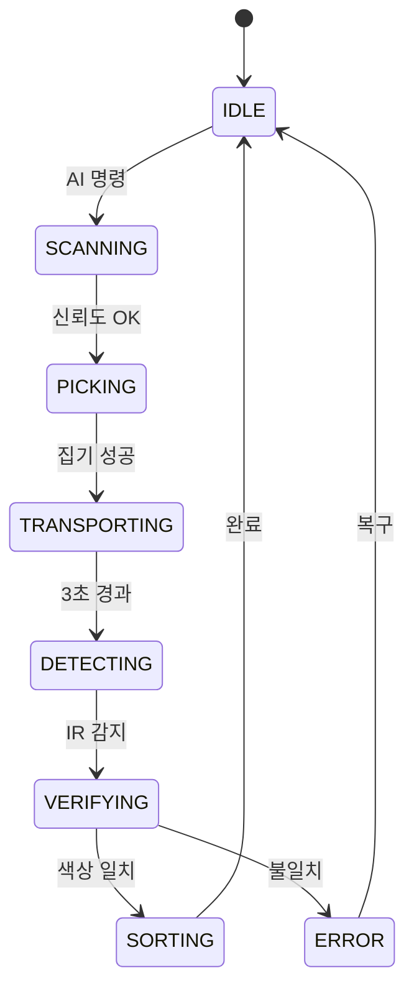
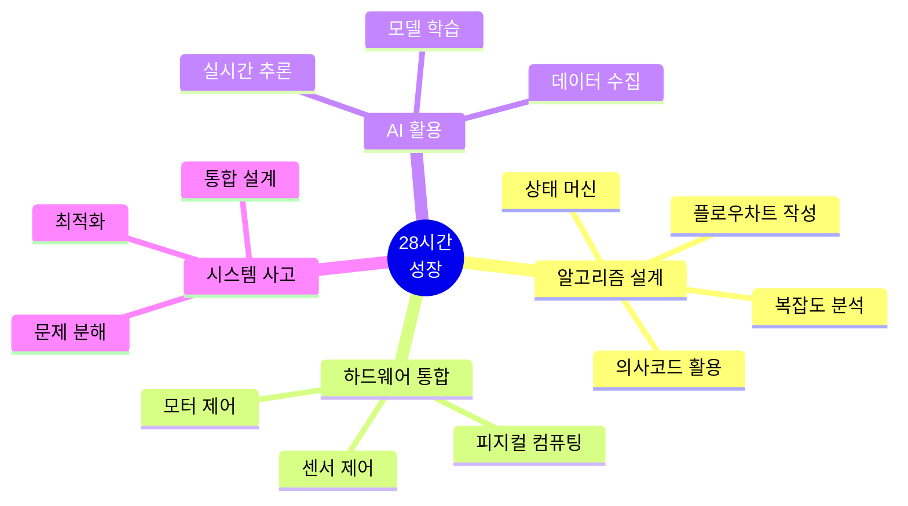

# 스마트 물류 팩토리 28시간 교육 프로젝트

> **"알고리즘으로 생각하고, 시스템으로 구현하고, 비즈니스로 완성한다"**  
> 피지컬 컴퓨팅 + AI를 바탕으로 물류 팩토리 시스템을 만들고 전시하는 알고리즘 중심 교육

---

## 🎯 프로젝트 개요

**대상**: 대학생 42명 (21팀, 2인 1조)  
**기간**: **28시간** (4일 × 7시간)  
**교구재**: [BP Lab AI 로봇팔 4축](https://bplab.kr/order/?idx=178) + 컨베이어 벨트  
**목표**: 알고리즘 설계 → 피지컬 AI 통합 → 스마트 물류 시스템 완성

---

## 🚀 핵심 특징

### 1. 알고리즘 중심 교육


- **플로우차트 우선**: 코드 작성 전 알고리즘 설계
- **의사코드 활용**: 논리 검증 후 구현
- **복잡도 분석**: 시간/공간 복잡도 측정
- **최적화**: 병목 지점 찾아서 개선

### 2. 피지컬 AI 통합

| 구성 요소 | 역할 | 핵심 알고리즘 |
|----------|------|--------------|
| **4축 로봇팔** | 물체 피킹 | 동기화 이동, 집기 시퀀스 |
| **스마트폰 AI** | 물체 인식 | Teachable Machine 추론 |
| **센서** | 검증 | 하이브리드 검증, 필터링 |
| **앱인벤터** | 제어+모니터링 | 프로토콜 파싱, 상태 표시 |

### 3. 상태 머신 기반 제어



### 4. 이중 모니터링

- **로컬**: LED Matrix (상태 아이콘) + 피에조 부저 (청각 피드백)
- **원격**: 앱인벤터 대시보드 (실시간 통계 + 차트)

---

## 📚 교육 커리큘럼

### Day 1-2: 기초 제작 + 센서/AI 통합 (상편)

| Day | 핵심 알고리즘 | 결과물 |
|-----|-------------|--------|
| **Day 1** | 제어 알고리즘, 통신 프로토콜, 저장 알고리즘 | ✅ 원격 제어 로봇팔 + 피지컬 모니터링 |
| **Day 2** | 센서 알고리즘, AI 학습, 통합 알고리즘 | ✅ AI + 로봇팔 통합 시스템 |

**상세**: [교육_커리큘럼_상편_Day1-2.md](curriculum/교육_커리큘럼_상편_Day1-2.md)

### Day 3-4: 창의적 시나리오 + 발표 (하편)

| Day | 핵심 알고리즘 | 결과물 |
|-----|-------------|--------|
| **Day 3** | 상태 머신, 하이브리드 검증, 예외 처리 | ✅ 완전 자동화 시스템 |
| **Day 4** | 성능 분석, 최적화, 평가 알고리즘 | ✅ 발표 + 포트폴리오 |

**상세**: [교육_커리큘럼_하편_Day3-4.md](curriculum/교육_커리큘럼_하편_Day3-4.md)

---

## 🧠 학습 알고리즘 (19가지)

<table>
<tr>
<th>분류</th>
<th>알고리즘</th>
<th>난이도</th>
<th>활용도</th>
</tr>
<tr>
<td rowspan="2"><b>제어</b></td>
<td>동기화 이동 (선형 보간)</td>
<td>⭐⭐⭐</td>
<td>⭐⭐⭐⭐⭐</td>
</tr>
<tr>
<td>PWM 제어</td>
<td>⭐⭐</td>
<td>⭐⭐⭐⭐</td>
</tr>
<tr>
<td rowspan="3"><b>센서</b></td>
<td>이동 평균 필터 (노이즈 제거)</td>
<td>⭐⭐</td>
<td>⭐⭐⭐⭐⭐</td>
</tr>
<tr>
<td>중앙값 필터 (이상치 제거)</td>
<td>⭐⭐</td>
<td>⭐⭐⭐⭐</td>
</tr>
<tr>
<td>컬러 분석 (유클리드 거리)</td>
<td>⭐⭐⭐</td>
<td>⭐⭐⭐⭐</td>
</tr>
<tr>
<td rowspan="2"><b>통신</b></td>
<td>프로토콜 파싱</td>
<td>⭐⭐</td>
<td>⭐⭐⭐⭐⭐</td>
</tr>
<tr>
<td>JSON 처리</td>
<td>⭐⭐</td>
<td>⭐⭐⭐⭐</td>
</tr>
<tr>
<td rowspan="2"><b>저장</b></td>
<td>EEPROM 알고리즘</td>
<td>⭐⭐⭐</td>
<td>⭐⭐⭐⭐</td>
</tr>
<tr>
<td>체크섬 검증</td>
<td>⭐⭐</td>
<td>⭐⭐⭐⭐</td>
</tr>
<tr>
<td rowspan="2"><b>AI</b></td>
<td>데이터 수집 전략</td>
<td>⭐⭐</td>
<td>⭐⭐⭐⭐⭐</td>
</tr>
<tr>
<td>실시간 추론</td>
<td>⭐⭐⭐</td>
<td>⭐⭐⭐⭐</td>
</tr>
<tr>
<td rowspan="5"><b>통합</b></td>
<td>상태 머신 (핵심!)</td>
<td>⭐⭐⭐⭐</td>
<td>⭐⭐⭐⭐⭐</td>
</tr>
<tr>
<td>예외 처리</td>
<td>⭐⭐⭐</td>
<td>⭐⭐⭐⭐⭐</td>
</tr>
<tr>
<td>하이브리드 검증 (AI+센서)</td>
<td>⭐⭐⭐</td>
<td>⭐⭐⭐⭐</td>
</tr>
<tr>
<td>타이밍 제어 (millis 비차단)</td>
<td>⭐⭐⭐</td>
<td>⭐⭐⭐⭐⭐</td>
</tr>
<tr>
<td>안정화 전략</td>
<td>⭐⭐⭐</td>
<td>⭐⭐⭐⭐</td>
</tr>
<tr>
<td rowspan="2"><b>평가</b></td>
<td>성능 측정 (복잡도 분석)</td>
<td>⭐⭐⭐</td>
<td>⭐⭐⭐</td>
</tr>
<tr>
<td>ROI 계산</td>
<td>⭐⭐</td>
<td>⭐⭐⭐</td>
</tr>
</table>

---

## 🔧 하드웨어 사양

### 로봇팔: [BP Lab AI 로봇팔](https://bplab.kr/order/?idx=178)

| 축 | 기능 | 제약사항 | 대응 전략 |
|----|------|----------|----------|
| **1축 (베이스)** | 좌우 회전 (0-180°) | 안정적 | ✅ 적극 활용 |
| **2축 (어깨)** | 상하 움직임 | 부하 시 떨림 | ⚠️ 50g 이하 물체만 |
| **3축 (팔꿈치)** | 팔 굽힘 | 어깨 부하 증가 | ⚠️ 45-135도 제한 |
| **4축 (그리퍼)** | 집기 (0-90°) | 안정적 | ✅ 적극 활용 |

### 추가 구성

- **센서**: IR, 초음파, TCS3200 컬러 센서
- **모니터링**: 8x8 LED Matrix, 피에조 부저
- **통신**: HC-06 블루투스 모듈
- **제어**: 아두이노 우노 호환보드

---

## 📂 프로젝트 구조

```
Smart_Factory_Arms_Project/
│
├── 📂 curriculum/                        # 교육 커리큘럼
│   ├── 교육_커리큘럼_상편_Day1-2.md     # 상편 (기초+센서+AI)
│   └── 교육_커리큘럼_하편_Day3-4.md     # 하편 (통합+발표)
│
├── 📂 docs/                              # 문서
│   ├── 00_프로젝트_개요.md              # 프로젝트 소개
│   ├── 01_프로젝트_구조도.md            # 알고리즘 아키텍처
│   ├── 02_블루투스_프로토콜.md
│   ├── 03_아두이노_피지컬컴퓨팅_가이드.md
│   ├── 03_바이브_코딩_가이드.md         # 바이브 코딩 방법론
│   ├── 04_피지컬AI_학습방법.md
│   ├── 05_비즈니스_모델_설계.md
│   ├── 06_프로젝트_아이디어_모음.md
│   ├── 07_앱인벤터_TM_연동가이드.md
│   └── 08_스마트팩토리_산업분석.md      # 산업 분석 + 커리어 로드맵
│
├── 📂 arduino_code/                      # 아두이노 코드
│   ├── day1_robot_control/              # Day 1: 로봇팔 제어
│   ├── day2_conveyor_sensor/            # Day 2: 센서+AI
│   └── day3_scenarios/                  # Day 3: 통합 시나리오
│
└── 📂 algorithms/                        # 알고리즘 문서
    ├── flowcharts/                       # 플로우차트
    ├── pseudocode/                       # 의사코드
    └── performance/                      # 성능 분석
```

---

## 🚦 시작하기

### 1단계: 문서 읽기 (순서대로)

1. [docs/00_프로젝트_개요.md](docs/00_프로젝트_개요.md) ← 전체 개요
2. [curriculum/교육_커리큘럼_상편_Day1-2.md](curriculum/교육_커리큘럼_상편_Day1-2.md) ← Day 1-2
3. [curriculum/교육_커리큘럼_하편_Day3-4.md](curriculum/교육_커리큘럼_하편_Day3-4.md) ← Day 3-4
4. [docs/03_바이브_코딩_가이드.md](docs/03_바이브_코딩_가이드.md) ← 방법론
5. [docs/08_스마트팩토리_산업분석.md](docs/08_스마트팩토리_산업분석.md) ← 산업 분석 + 커리어

### 2단계: 하드웨어 준비

- [ ] BP Lab 로봇팔 4축 구매
- [ ] 아두이노 우노 + HC-06 블루투스
- [ ] 센서 (IR, 컬러, 초음파)
- [ ] LED Matrix 8x8, 피에조 부저
- [ ] 전원 (USB 5V + 12V 어댑터)

### 3단계: 소프트웨어 설치

- [ ] 아두이노 IDE
- [ ] 앱인벤터 (웹 브라우저)
- [ ] Teachable Machine (웹 브라우저)

### 4단계: 예제 실행

```bash
# Day 1 예제 업로드
cd arduino_code/day1_robot_control
# Arduino IDE로 servo_control.ino 열기
# 보드 선택: Arduino UNO
# 업로드
```

---

## 🎓 학습 목표

### 개인 목표

- [ ] 19가지 핵심 알고리즘 이해
- [ ] 플로우차트 → 의사코드 → 실제 코드 작성 능력
- [ ] 상태 머신 설계 및 구현
- [ ] 복잡도 분석 (시간/공간)
- [ ] 병목 지점 찾아서 최적화

### 팀 목표

- [ ] AI + 센서 하이브리드 시스템 완성
- [ ] 10회 연속 성공률 80% 이상
- [ ] 실시간 모니터링 대시보드
- [ ] ROI 계산 및 비즈니스 모델
- [ ] 10분 발표 + 5분 시연

---

## 💡 핵심 개념

### 바이브 코딩 (VIBE Coding)

```
V - Visionary  : 알고리즘 설계 (플로우차트, 의사코드)
I - Implementer: 시스템 구현 (하드웨어 통합)
B - Debugger   : 알고리즘 최적화 (병목 분석)
E - Entrepreneur: 가치 창출 (ROI 계산)
```

### 상태 머신 (State Machine)

복잡한 시스템을 **명확한 상태로 분리**하여 관리
- IDLE, SCANNING, PICKING, VERIFYING, SORTING, ERROR
- 상태 전이 조건 명시
- 오류에서 안전하게 복구

### 하이브리드 검증

AI (92% 정확도) + 센서 (98% 정확도) = **99.8% 최종 정확도**

---

## 📊 평가 기준

| 영역 | 비중 | 세부 내용 |
|------|------|-----------|
| **알고리즘 설계** | 30% | 플로우차트, 의사코드, 복잡도 분석 |
| **시스템 완성도** | 25% | 작동 안정성, 통합 수준 |
| **기술 이해도** | 20% | 상태 머신, AI+센서, 문제 해결 |
| **창의성** | 15% | 독창적 알고리즘, 개선 노력 |
| **발표** | 10% | 설득력, 시연, 알고리즘 설명 |

---

## 🌟 기대 효과

### 기술 역량



### 포트폴리오

- 📄 알고리즘 설계 문서 (플로우차트 + 의사코드)
- 🎬 시연 영상 (5분)
- 📊 발표 자료 (10분)
- 💾 소스코드 (주석 포함)
- 📈 성능 분석 보고서

---

## 🤝 기여 및 참여

이 프로젝트는 교육용 오픈소스입니다.

### 기여 방법

1. Fork this repository
2. 알고리즘 개선 또는 새로운 시나리오 추가
3. Pull Request 제출

### 질문 및 토론

- Issues 탭에서 질문
- Discussions 탭에서 토론

---

## 📖 참고 자료

### 교구재

- [BP Lab AI 로봇팔 4축](https://bplab.kr/order/?idx=178) (99,000원)
- 아두이노 우노 호환보드
- 센서 및 모니터링 모듈

### 온라인 리소스

- [Teachable Machine](https://teachablemachine.withgoogle.com/)
- [앱인벤터](https://appinventor.mit.edu/)
- [아두이노 IDE](https://www.arduino.cc/en/software)

### 알고리즘 학습

- "Introduction to Algorithms" (CLRS)
- "알고리즘 문제 해결 전략" (구종만)
- [Coursera] Algorithms Specialization

---

## 📄 라이선스

MIT License - 교육 목적으로 자유롭게 사용 가능

---

## 👥 제작팀

**Smart Factory Education Team**
- 교육 커리큘럼 설계
- 알고리즘 중심 교육 방법론 개발
- 하드웨어 통합 가이드 제작

---

## 🎉 성공 메시지

```
"28시간 후, 여러분은:

✅ 19가지 핵심 알고리즘을 설계하고 구현할 수 있습니다
✅ 복잡한 시스템을 상태 머신으로 모델링할 수 있습니다
✅ 하드웨어와 소프트웨어를 통합할 수 있습니다
✅ AI와 센서를 융합한 하이브리드 시스템을 만들 수 있습니다
✅ 문제를 알고리즘으로 분해하고 해결할 수 있습니다

더 중요한 것은, 여러분이 알고리즘적 사고(Algorithmic Thinking)를 
체득했다는 것입니다.

이 능력은 스마트 팩토리뿐만 아니라, 
모든 엔지니어링 분야에서 빛을 발할 것입니다.

자, 28시간의 알고리즘 여정을 시작합니다! 🚀"
```

---

**Last Updated**: 2026-01-23  
**Version**: 2.1 (알고리즘 중심 교육 + 산업 분석)  
**교구재**: [BP Lab AI 로봇팔](https://bplab.kr/order/?idx=178)
