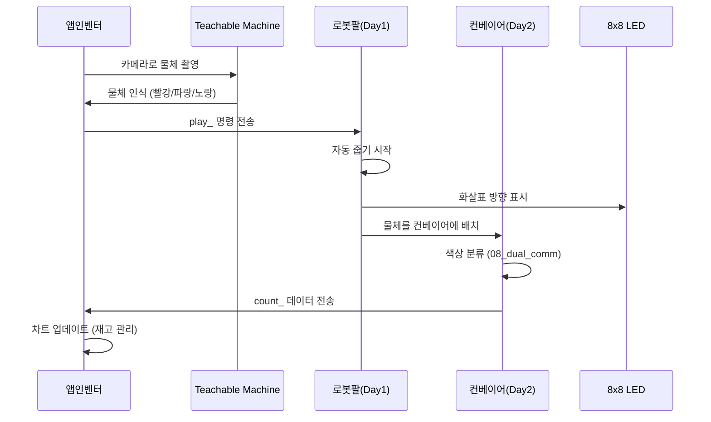
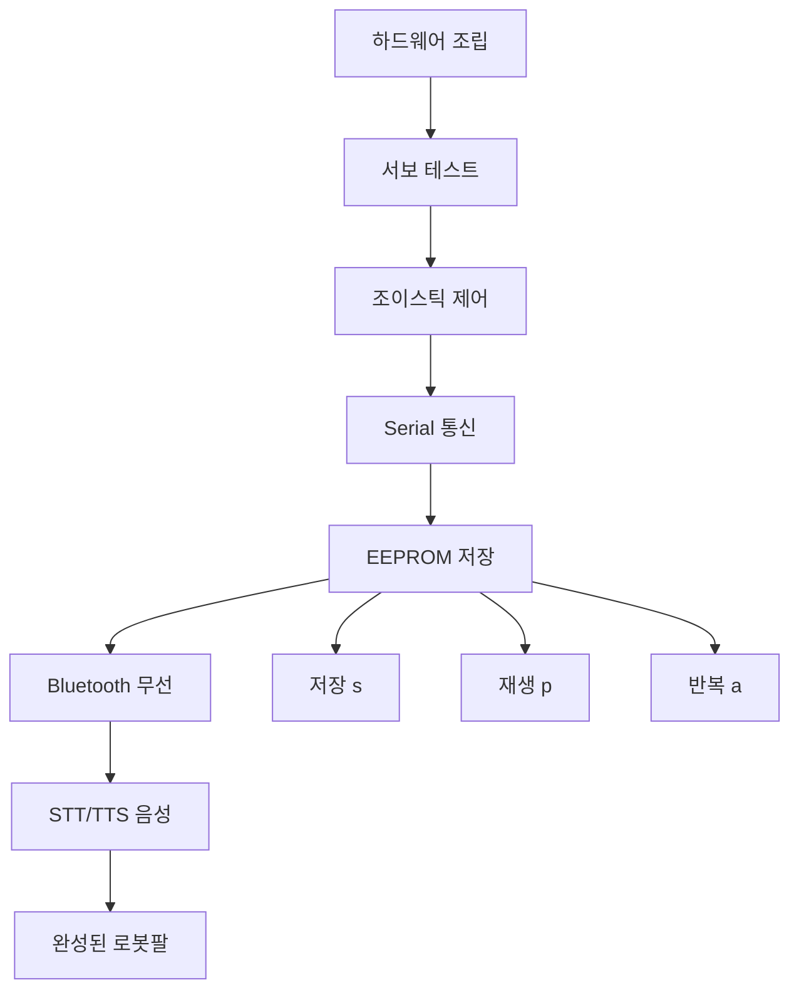
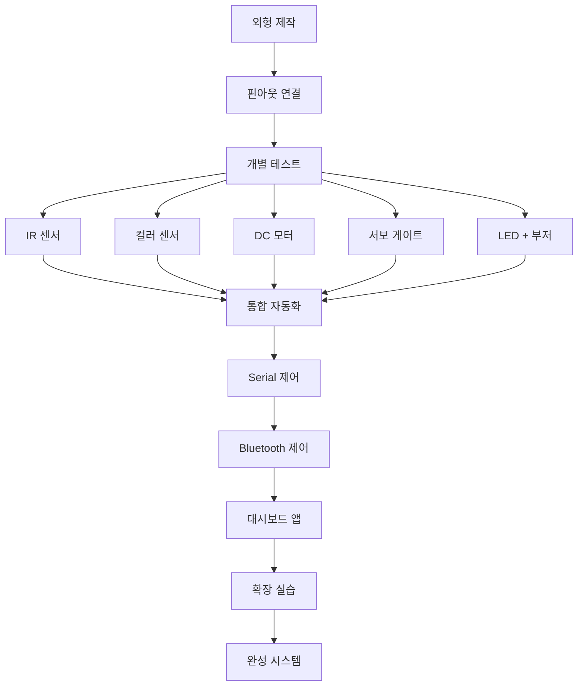
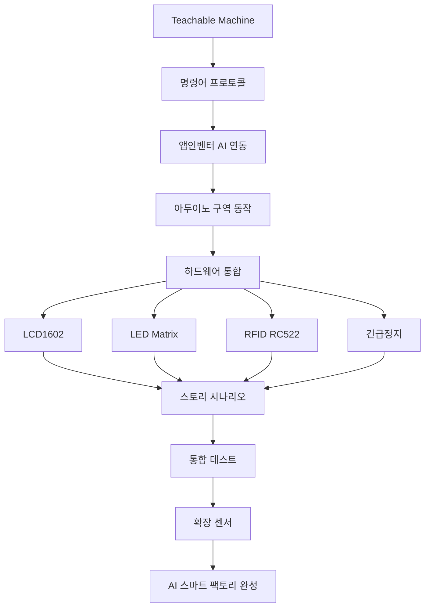
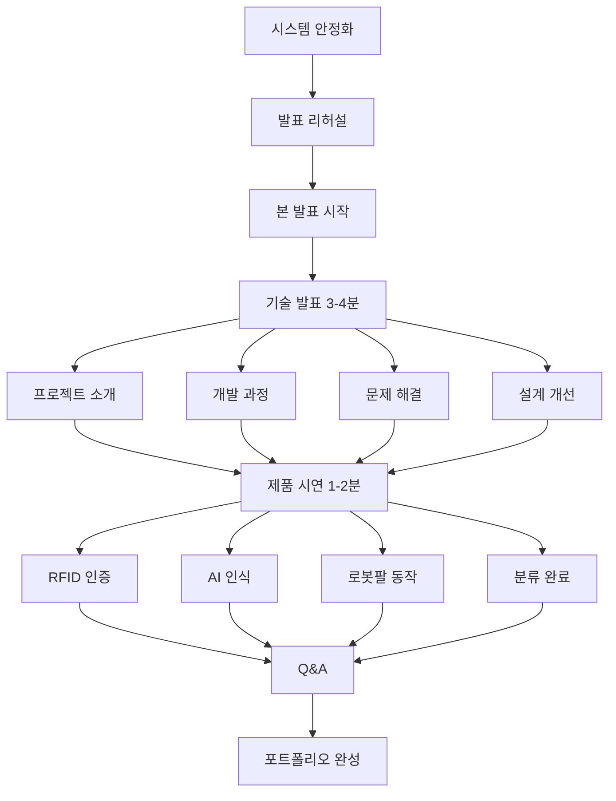
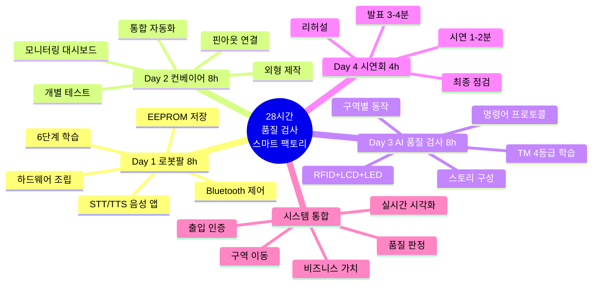

# 스마트 물류 팩토리 28시간 교육 프로젝트

> **"알고리즘으로 생각하고, 시스템으로 구현하고, 비즈니스로 완성한다"**  
> 피지컬 컴퓨팅 + AI를 바탕으로 물류 팩토리 시스템을 만들고 전시하는 알고리즘 중심 교육

---

## 🎯 프로젝트 개요

**대상**: 대학생 42명 (21팀, 2인 1조)  
**기간**: **28시간** (4일 × 7시간)  
**교구재**: [BP Lab AI 로봇팔 4축](https://bplab.kr/order/?idx=178) + [컨베이어 벨트- 자동분류 시스템](https://eduino.kr/product/detail.html?product_no=2335&cate_no=181)  
**목표**: 알고리즘 설계 → 피지컬 AI 통합 → 스마트 물류 시스템 완성

---

## 🚀 핵심 특징

### 1. 알고리즘 중심 교육


- **플로우차트 우선**: 코드 작성 전 알고리즘 설계
- **의사코드 활용**: 논리 검증 후 구현
- **복잡도 분석**: 시간/공간 복잡도 측정
- **최적화**: 병목 지점 찾아서 개선

### 2. 피지컬 AI 통합 (3일 완성)

| 구성 요소 | 역할 | 핵심 알고리즘 | 학습 Day |
|----------|------|--------------|---------|
| **4축 로봇팔** | 물체 자동 줍기 | EEPROM 저장/복구, play_ 명령 실행 | Day 1 |
| **컨베이어 벨트** | 색상 자동 분류 | 색상 판별, 실시간 명령 체크 | Day 2 |
| **센서 시스템** | 제품 카운팅 | count_ 데이터 생성 및 전송 | Day 2 |
| **통신 모듈** | 이중 통신 | Bluetooth 버퍼링, Serial 동시 처리 | Day 1-2 |
| **스마트폰 AI** | 물체 인식 | Teachable Machine → play_ 전송 | Day 3 |
| **8x8 LED Matrix** | 상태 시각화 | 화살표 방향, 센서 상태 표시 | Day 3 |
| **앱인벤터** | 재고 관리 | count_ 파싱, 차트 시각화 | Day 3 |

**완전 자동화 플로우**:
```
RFID 인증 → 카메라 촬영 → AI 품질 판정 → 명령어 전송 → 
로봇팔 구역 이동 → LCD 상태 표시 → LED 품질 등급 표시 → 
컨베이어 분류 (선택) → 대시보드 통계 업데이트
```

### 3. AI 기반 스마트 물류 시스템 (Day 3)


-------
**핵심 통합**:
- Day 1 구역별 제어 + Day 2 자동 분류 + Day 3 AI 품질 검사 = **완전 자동화**
- RFID 인증 → AI 품질 판정 → 로봇팔 구역 이동 → LCD/LED 시각화 → 품질별 통계

### 4. 품질 관리 시스템 (Day 2-3)
------
**Day 2: 데이터 수집 및 모니터링**
- **이중 통신**: Serial + Bluetooth 동시 처리 (50ms 주기)
- **제품 카운팅**: 색상별 실시간 카운터 (red1_, green2_, blue3_)
- **데이터 전송**: count_ 명령으로 앱에 전송
- **모니터링 대시보드**: 일일량, 통합량, 차트

**Day 3: AI 품질 검사**
- **품질 분류 시스템**: 
  - GREEN (정상): 즉시 포장 출하 → 전방 우측
  - RED (불량): 폐기/재활용 → 전방 좌측
  - YELLOW (재검사): 인간 재검수 → 후방 우측
  - BLUE (특수): VIP 포장 → 후방 좌측
- **통계 분석**:
  - 품질별 처리 개수
  - 불량률 계산
  - 재검사율 모니터링
  - 평균 처리 속도

**비즈니스 가치**:
- 자동 품질 검사로 인건비 절감
- 실시간 불량률 파악
- 품질별 수요 분석
- 생산 효율성 측정
- VIP 제품 특별 관리

---

## 📚 교육 커리큘럼

### Day 1: 로봇팔 피지컬 컴퓨팅 (8시간)

**학습 목표**: 4축 로봇팔 제어 기초 → EEPROM 자동화 → 무선 제어 → AI 음성 제어

#### 📋 교시별 세부 커리큘럼

| 교시 | 시간 | 주제 | 학습 내용 | 핵심 알고리즘 | 산출물 |
|------|------|------|----------|--------------|--------|
| **1교시** | 1h | 하드웨어 조립 | • 4축 로봇팔 조립<br>• 서보모터 4개 연결<br>• 전원 배선 (5V 2A) | - | 작동하는 로봇팔 |
| **2교시** | 1h | 서보 테스트<br>(01단계) | • 서보모터 개별 동작 테스트<br>• 0°→180° 왕복 운동<br>• `Servo.h` 라이브러리 사용 | **서보 제어 루프**<br>```cpp<br>for(int angle=0; angle<=180; angle++)<br>  servo.write(angle);<br>``` | `01_servo_motor_test.ino` |
| **3교시** | 1h | 조이스틱 제어<br>(02단계) | • 조이스틱 2개로 4축 제어<br>• `map()` 함수로 각도 변환<br>• 이동 평균 필터 적용 | **각도 매핑**<br>```cpp<br>int angle = map(joyX, 0, 1023, 0, 180);<br>```<br>**스무딩 필터 (O(n))**<br>```cpp<br>int smoothAngle(int raw) {<br>  sum = sum - readings[idx] + raw;<br>  return sum / FILTER_SIZE;<br>}<br>``` | `02_joystick_servo_control.ino` |
| **4교시** | 1.5h | Serial 원격 제어<br>(03단계) | • PC ↔ 아두이노 시리얼 통신<br>• 명령어 파싱 (`arm0_90_`)<br>• 멀티 서보 동시 제어 | **명령어 파싱 (O(n))**<br>```cpp<br>void processCommand(String cmd) {<br>  if(cmd.startsWith("arm")) {<br>    int idx = cmd.substring(3,4).toInt();<br>    int angle = cmd.substring(5).toInt();<br>    servos[idx].write(angle);<br>  }<br>}<br>``` | `03_serial_servo_control.ino` |
| **5교시** | 1.5h | **EEPROM 자동화**<br>(04단계) ⭐ | • 위치 저장 (`s` 명령)<br>• 시퀀스 재생 (`p` 명령)<br>• 자동 반복 (`a` 명령)<br>• EEPROM 메모리 맵 설계 | **저장 알고리즘 (O(1))**<br>```cpp<br>void savePosition() {<br>  int addr = 4 + (stepCount * 4);<br>  for(int i=0; i<4; i++)<br>    EEPROM.write(addr+i, angles[i]);<br>}<br>```<br>**재생 알고리즘 (O(n))**<br>```cpp<br>void playSequence() {<br>  for(int step=0; step<totalSteps; step++) {<br>    // EEPROM 읽기 + 서보 이동<br>  }<br>}<br>```<br>**무한 반복 (O(n×m))** | `04_eeprom_automation.ino` |
| **6교시** | 1.5h | **Bluetooth 무선**<br>(05~06단계) ⭐⭐ | • HC-06 블루투스 연결<br>• 명령 버퍼링 (종료 문자 `_`)<br>• 앱인벤터 제어 앱 연동 | **명령 버퍼링 (O(n))**<br>```cpp<br>char buffer[21];<br>int bufferIndex = 0;<br><br>void loop() {<br>  if(Serial.available()) {<br>    char c = Serial.read();<br>    if(c == '_') {<br>      processCommand(buffer);<br>      bufferIndex = 0;<br>    } else {<br>      buffer[bufferIndex++] = c;<br>    }<br>  }<br>}<br>``` | `05_bluetooth_eeprom.ino`<br>`06_bluetooth_direct.ino` |
| **7교시** | 2h | **음성 제어 앱** 🎤<br>(앱인벤터) | • STT(음성→텍스트) 연동<br>• TTS(텍스트→음성) 피드백<br>• 명령어 매핑 (play→재생)<br>• 블루투스 통신 | **음성 명령 파싱**<br>```blocks<br>when SpeechRecognizer.AfterGettingText<br>  set result to get text<br>  if result contains "재생"<br>    call Bluetooth.SendText("p_")<br>  else if result contains "저장"<br>    call Bluetooth.SendText("s_")<br>``` | `Robot_Arm_STT.aia` |

#### 🧠 Day 1 핵심 알고리즘

1. **EEPROM 저장/복구 (O(1))**
   - 위치: `arduino_code/day1_arm_system/04_eeprom_automation/`
   - 4바이트 × 스텝 수만큼 순차 저장
   - 메모리 맵: `[0-3: stepCount] [4-7: step0] [8-11: step1] ...`

2. **자동 재생/무한 반복 (O(n×m))**
   - n: 저장된 스텝 수
   - m: 반복 횟수
   - 재생 모드: 1회 재생 후 종료
   - 반복 모드: 무한 루프 (사용자 정지까지)

3. **Bluetooth 명령 버퍼링 (O(n))**
   - 종료 문자(`_`) 기반 명령 완성도 체크
   - 20바이트 고정 크기 버퍼 사용
   - 오버플로우 방지 로직

#### 📊 Day 1 학습 흐름도



**결과물**: ✅ 무선 제어 로봇팔 (~1,340줄) + 음성 제어 앱 (STT/TTS)

---

### Day 2: 컨베이어 자동 분류 시스템 (8시간)

**학습 목표**: 하드웨어 조립 → 센서/모터 개별 테스트 → 통합 자동 분류 → 원격 제어 → 대시보드

#### 📋 교시별 세부 커리큘럼

| 교시 | 시간 | 주제 | 학습 내용 | 핵심 알고리즘 | 산출물 |
|------|------|------|----------|--------------|--------|
| **1교시** | 1h | 외형 제작 🔧 | • 컨베이어 벨트 조립<br>• 센서 배치 (IR, 컬러)<br>• 게이트 서보 장착 | - | 완성된 하드웨어 |
| **2교시** | 1h | 핀아웃 연결 📌 | • 12개 핀 배선<br>• 아두이노 UNO 핀맵<br>• 전원 분배 (5V/GND) | **핀맵 테이블**<br>```<br>IR: D2<br>Color: SDA/SCL (A4/A5)<br>Motor: D3/D4/D9<br>Servo: D10<br>LED: D6<br>Buzzer: D11<br>``` | 배선 완료 |
| **3교시** | 1.5h | 개별 테스트 🧪<br>(01~05단계) | • IR 센서 (디바운싱)<br>• 컬러 센서 (TCS34725)<br>• DC 모터 (L298N PWM)<br>• 서보 게이트<br>• RGB LED + 부저 | **IR 디바운싱 (상태 머신)**<br>```cpp<br>enum State { IDLE, DETECTING, DETECTED };<br><br>void loop() {<br>  switch(state) {<br>    case IDLE:<br>      if(IR == LOW) state = DETECTING;<br>      break;<br>    case DETECTING:<br>      if(millis()-time > 50)<br>        state = DETECTED;<br>      break;<br>  }<br>}<br>```<br>**색상 판별 (O(1))**<br>```cpp<br>tcs.getRawData(&r, &g, &b, &c);<br>int red = map(r, 0, 65535, 0, 255);<br><br>if(red>green && red>blue)<br>  color = "RED";<br>``` | `01_infrared_test.ino`<br>`02_color_sensor_test.ino`<br>`03_rgb_led_test.ino`<br>`04_dc_motor_test.ino`<br>`05_servo_motor_test.ino` |
| **4교시** | 1.5h | **통합 자동화** 🔄<br>(06단계) | • 4단계 상태 머신 구현<br>• IDLE → DETECTING → MEASURING → SORTING<br>• 자동 분류 완성 | **통합 상태 머신 (O(1))**<br>```cpp<br>enum State { IDLE, DETECTING, MEASURING, SORTING };<br><br>void stateIdle() {<br>  if(digitalRead(IR_PIN)==LOW)<br>    currentState = DETECTING;<br>}<br><br>void stateMeasuring() {<br>  tcs.getRawData(&r, &g, &b, &c);<br>  detectedColor = identifyColor(r,g,b);<br>  currentState = SORTING;<br>}<br><br>void stateSorting() {<br>  if(color == "RED")<br>    gateServo.write(RED_ANGLE);<br>  else if(color == "GREEN")<br>    gateServo.write(GREEN_ANGLE);<br>  // 카운터 증가<br>  currentState = IDLE;<br>}<br>``` | `06_integrated_conveyor.ino` |
| **5교시** | 1h | Serial 제어 💻<br>(07단계) | • PC → 아두이노 명령<br>• start/stop/reset/init<br>• 비차단 명령 체크 | **비차단 명령 체크 (O(n))**<br>```cpp<br>void checkSerialCommand() {<br>  if(Serial.available()) {<br>    String cmd = Serial.readStringUntil('\n');<br>    cmd.trim();<br>    <br>    if(cmd == "start")<br>      systemRunning = true;<br>    else if(cmd == "stop")<br>      systemRunning = false;<br>    else if(cmd == "reset")<br>      resetCounters();<br>  }<br>}<br>``` | `07_serial_controlled.ino` |
| **6교시** | 1h | Bluetooth 제어 📡<br>(08단계) | • 스마트폰 무선 제어<br>• Serial/Bluetooth 동시 처리<br>• `millis()` 타이머 | **Dual Comm (O(1))**<br>```cpp<br>unsigned long lastCheck = 0;<br><br>void loop() {<br>  if(millis()-lastCheck > 100) {<br>    checkSerialCommand();<br>    checkBluetoothCommand();<br>    lastCheck = millis();<br>  }<br>}<br>``` | `08_dual_comm_system.ino` |
| **7교시** | 1h | 대시보드 앱 📊<br>(앱인벤터) | • 실시간 카운터 표시<br>• 차트 시각화<br>• 원격 명령 전송 | **데이터 프로토콜**<br>```<br>Arduino → App:<br>count_red5_green3_blue2_<br><br>App → Arduino:<br>start_<br>stop_<br>reset_<br>```<br>**파싱 로직**<br>```blocks<br>when Bluetooth.DataReceived<br>  set data to get text<br>  if data contains "count_"<br>    set parts to split(data, "_")<br>    // 차트 업데이트<br>``` | 대시보드 앱 |
| **8교시** | 1h | 확장 실습<br>(09단계) | • 3색 이상 분류 (4~5색)<br>• 유클리드 거리 알고리즘<br>• 정확도 향상 기법 | **유클리드 거리 (O(k))**<br>```cpp<br>float euclideanDistance(<br>  int r, int g, int b,<br>  int refR, int refG, int refB) {<br>  <br>  float dr = r - refR;<br>  float dg = g - refG;<br>  float db = b - refB;<br>  <br>  return sqrt(dr*dr + dg*dg + db*db);<br>}<br><br>String identifyColor(int r, int g, int b) {<br>  float minDist = 999999;<br>  String result = "UNKNOWN";<br>  <br>  for(int i=0; i<colorCount; i++) {<br>    float dist = euclideanDistance(<br>      r, g, b,<br>      refColors[i][0],<br>      refColors[i][1],<br>      refColors[i][2]<br>    );<br>    <br>    if(dist < minDist) {<br>      minDist = dist;<br>      result = colorNames[i];<br>    }<br>  }<br>  return result;<br>}<br>``` | `09_multi_color_classification.ino` |

#### 🧠 Day 2 핵심 알고리즘

4. **색상 판별 알고리즘 (O(1) / O(k))**
   - **최대값 비교 방식**: 3번 비교 (O(1))
   - **유클리드 거리 방식**: k개 색상과 비교 (O(k))
   - 위치: `arduino_code/day2_conveyor_system/02_color_sensor_test/`

5. **실시간 명령 체크 (비차단, O(n))**
   - `delay()` 사용 금지 → `millis()` 타이머 활용
   - Serial/Bluetooth 동시 처리
   - 명령어 길이 n에 비례

6. **제품 카운터 및 전송 (O(1))**
   - 색상별 카운터 증가
   - 100ms마다 앱으로 전송
   - 문자열 조합 및 전송

7. **통합 자동 분류 (상태 머신, O(1))**
   - 4단계 상태 전환: IDLE → DETECTING → MEASURING → SORTING
   - 각 상태마다 1개 함수 호출
   - 일정한 처리 시간

#### 📊 Day 2 학습 흐름도



**결과물**: ✅ 완전 자동화 컨베이어 (~2,188줄) + 원격 모니터링 대시보드 앱

**상세**: [arduino_code/day2_conveyor_system/README.md](arduino_code/day2_conveyor_system/README.md)

---

### Day 3: AI 품질 검사 스마트 팩토리 (8시간)

**학습 목표**: AI 모델 학습 → 명령어 프로토콜 설계 → 구역별 동작 → 하드웨어 통합 → 시나리오 구성

#### 📋 교시별 세부 커리큘럼

| 교시 | 시간 | 주제 | 학습 내용 | 핵심 알고리즘 | 산출물 |
|------|------|------|----------|--------------|--------|
| **1교시** | 1h | Teachable Machine<br>모델 학습 🤖 | • 4가지 품질 클래스 정의<br>  - GREEN (정상)<br>  - RED (불량)<br>  - YELLOW (재검사)<br>  - BLUE (특수)<br>• 클래스당 200+ 이미지 수집<br>• 다양한 각도/조명 촬영 | **데이터 수집 원칙**<br>```<br>1. 클래스당 200+ 이미지<br>2. 다양한 각도 (0°, 45°, 90°)<br>3. 조명 변화 (밝음/어두움)<br>4. 배경 일관성 유지<br>5. 모델 학습 + 테스트<br>``` | AI 모델 (.tm 파일) |
| **2교시** | 1h | 명령어 프로토콜<br>설계 📋 | • 앱 → 아두이노 명령어 정의<br>• 4가지 품질별 명령<br>• 종료 문자 통일 (`_`) | **명령어 매핑 테이블**<br>```<br>AI 분류 → 명령어 → 동작<br>GREEN   → green_ok       → Zone 1<br>RED     → red_defect     → Zone 2<br>YELLOW  → yellow_recheck → Zone 3<br>BLUE    → blue_special   → Zone 4<br>``` | 프로토콜 문서 |
| **3교시** | 1h | 앱인벤터<br>AI 연동 📱 | • TMIC Extension 설치<br>• 카메라 캡처<br>• AI 추론 (Teachable Machine)<br>• 결과 → 명령 변환<br>• 블루투스 전송 | **AI 연동 블록 로직**<br>```blocks<br>when Button.Click<br>  call Camera.TakePicture<br><br>when Camera.AfterPicture<br>  call TMIC.ClassifyImage(image)<br><br>when TMIC.GotClassification<br>  if label == "GREEN"<br>    call BT.SendText("green_ok_")<br>  else if label == "RED"<br>    call BT.SendText("red_defect_")<br>  else if label == "YELLOW"<br>    call BT.SendText("yellow_recheck_")<br>  else if label == "BLUE"<br>    call BT.SendText("blue_special_")<br>``` | AI 제어 앱 |
| **4교시** | 1h | 아두이노<br>구역별 동작 🎯 | • 6축 로봇팔로 업그레이드<br>• 구역별 각도 배열 설계<br>• HOME → PICK → ZONE → HOME | **구역별 각도 배열**<br>```cpp<br>// 6축 로봇팔 위치 정의<br>const int HOME_POS[6] = <br>  {90, 90, 90, 90, 90, 90};<br>const int PICK_POS[6] = <br>  {90, 70, 100, 80, 90, 180};<br><br>// 구역별 배치 위치<br>const int ZONE1_PLACE[6] = <br>  {45, 80, 90, 70, 90, 180};<br>const int ZONE2_PLACE[6] = <br>  {135, 80, 90, 70, 90, 180};<br>const int ZONE3_PLACE[6] = <br>  {45, 100, 70, 90, 90, 180};<br>const int ZONE4_PLACE[6] = <br>  {135, 100, 70, 90, 90, 180};<br><br>void executeZone1() {<br>  moveToPosition(PICK_POS, 800);<br>  gripperClose();<br>  moveToPosition(ZONE1_PLACE, 800);<br>  gripperOpen();<br>  moveToPosition(HOME_POS, 800);<br>}<br>``` | 구역 제어 코드 |
| **5교시** | 1h | 하드웨어<br>통합 🔌 | • LCD1602 (I2C): 상태 표시<br>• 8x8 LED Matrix: 아이콘<br>• RFID RC522: 인증<br>• 긴급정지 버튼 | **LCD 상태 표시**<br>```cpp<br>LiquidCrystal_I2C lcd(0x27, 16, 2);<br><br>void displayCommand(String cmd) {<br>  lcd.clear();<br>  if(cmd == "green_ok") {<br>    lcd.print("OK: GREEN");<br>    lcd.setCursor(0, 1);<br>    lcd.print("Zone 1 Move");<br>  }<br>}<br>```<br>**LED Matrix 아이콘**<br>```cpp<br>const uint8_t ICON_CHECK[] = {<br>  0x00,0x01,0x03,0x16,0x1C,0x08,0x00,0x00<br>};<br>const uint8_t ICON_CROSS[] = {<br>  0x00,0x44,0x28,0x10,0x28,0x44,0x00,0x00<br>};<br><br>void showIcon(const uint8_t* icon) {<br>  for(int i=0; i<8; i++)<br>    mx.setColumn(i, icon[i]);<br>}<br>```<br>**RFID 인증**<br>```cpp<br>bool checkAuthorization(byte* uid, byte size) {<br>  for(int i=0; i<authCount; i++) {<br>    if(compareUID(uid, authorizedUIDs[i]))<br>      return true;<br>  }<br>  return false;<br>}<br>```<br>**긴급정지**<br>```cpp<br>#define EMERGENCY_BTN 2<br>volatile bool emergencyStop = false;<br><br>void handleEmergency() {<br>  emergencyStop = true;<br>  stopAllServos();<br>  digitalWrite(BUZZER, HIGH);<br>  setRGBColor(255, 0, 0); // 빨간색<br>}<br>``` | 통합 시스템 |
| **6교시** | 1h | 스토리<br>시나리오 구성 📖 | • 품질 검사 라인 스토리<br>• 4가지 시나리오 작성<br>  1. 일반 공장 라인<br>  2. 스마트팜 수확<br>  3. 재활용 분류<br>  4. 물류 창고 | **시나리오 예시**<br>```<br>📦 "스마트 물류 창고"<br><br>1. RFID 인증 (관리자 태그)<br>2. AI 카메라로 상품 스캔<br>3. GREEN (정상) → Zone 1 출하<br>4. RED (손상) → Zone 2 반품<br>5. YELLOW (확인 필요) → Zone 3 검수<br>6. BLUE (VIP 고객) → Zone 4 특별 포장<br>7. LCD에 처리 현황 표시<br>8. LED Matrix로 등급 시각화<br>``` | 스토리보드 |
| **7교시** | 1h | 시스템<br>통합 테스트 ✅ | • Day 1 + Day 2 + Day 3 통합<br>• 로봇팔 + 컨베이어 + AI<br>• 전체 시나리오 테스트 | **통합 테스트 체크리스트**<br>```<br>□ 로봇팔 6축 정상 동작<br>□ 컨베이어 자동 분류<br>□ AI 인식 정확도 90%+<br>□ 블루투스 통신 안정<br>□ LCD 상태 표시 정상<br>□ LED Matrix 아이콘 출력<br>□ RFID 인증 기능<br>□ 긴급정지 버튼 작동<br>``` | 완성 시스템 |
| **8교시** | 1h | 확장 센서<br>실습 🔧 | • 초음파 센서 (거리 측정)<br>• 로드셀 (무게 측정)<br>• DHT22 (온습도)<br>• 스테퍼 모터<br>• 리니어 액츄에이터<br>• OLED 디스플레이<br>• WiFi (ESP8266) | **확장 센서 코드 예시**<br>```cpp<br>// 초음파 센서<br>float getDistance() {<br>  digitalWrite(TRIG, LOW);<br>  delayMicroseconds(2);<br>  digitalWrite(TRIG, HIGH);<br>  delayMicroseconds(10);<br>  digitalWrite(TRIG, LOW);<br>  <br>  long duration = pulseIn(ECHO, HIGH);<br>  return duration * 0.034 / 2;<br>}<br><br>// 로드셀 (HX711)<br>HX711 scale;<br>float getWeight() {<br>  return scale.get_units(5);<br>}<br><br>// DHT22<br>DHT dht(DHT_PIN, DHT22);<br>void readTempHumidity() {<br>  float temp = dht.readTemperature();<br>  float humid = dht.readHumidity();<br>}<br><br>// WiFi (ESP8266)<br>void sendDataToCloud(String cmd, int zone) {<br>  HTTPClient http;<br>  String jsonData = <br>    "{\"command\":\"" + cmd + <br>    "\",\"zone\":" + String(zone) + "}";<br>  http.POST(jsonData);<br>}<br>``` | 확장 가이드 |

#### 🧠 Day 3 핵심 개념

**1. Teachable Machine AI 모델 학습**
- 이미지 분류 모델 (Image Project)
- 4가지 품질 클래스 정의
- 클래스당 200+ 다양한 이미지
- 모델 내보내기 (.tm 파일)

**2. 명령어 프로토콜 시스템**
- 일관된 명령 형식: `{color}_{status}_`
- 종료 문자 통일 (`_`)
- 아두이노 파싱 로직

**3. 구역별 각도 배열 설계**
- 6축 로봇팔: 각 축마다 각도 지정
- HOME, PICK, ZONE1~4 위치 정의
- 부드러운 이동 (speed 파라미터)

**4. 하드웨어 통합 아키텍처**
```
┌─────────────┐
│ 앱인벤터 앱  │ (AI 추론 + 명령 전송)
└──────┬──────┘
       │ Bluetooth
       ▼
┌─────────────┐
│  아두이노    │ (명령 처리 + 제어)
├─────────────┤
│ • 로봇팔 6축 │
│ • LCD 상태   │
│ • LED 아이콘 │
│ • RFID 인증  │
│ • 긴급정지   │
└─────────────┘
```

#### 📊 Day 3 학습 흐름도



**결과물**: ✅ AI 품질 검사 스마트 팩토리 완전체 (Day 1 + Day 2 + Day 3 통합)

---

### Day 4: 제품 시연회 (4시간)

**학습 목표**: 시스템 안정화 → 발표 준비 → 기술 프레젠테이션 → 제품 시연

#### 📋 교시별 세부 커리큘럼

| 교시 | 시간 | 주제 | 학습 내용 | 체크리스트 | 산출물 |
|------|------|------|----------|-----------|--------|
| **1교시** | 1h | 시스템<br>안정화 ✅ | • 로봇팔 동작 체크<br>• 컨베이어 정상 작동<br>• AI 인식 정확도 테스트<br>• 백업 파일 준비 | **로봇팔 체크**<br>□ 6축 정상 동작<br>□ 각도 범위 확인<br>□ 전원 안정성<br>□ 블루투스 연결<br><br>**컨베이어 체크**<br>□ 벨트 속도 적정<br>□ 센서 감지 정상<br>□ 게이트 분류 정확<br>□ LED/부저 작동<br><br>**AI 시스템 체크**<br>□ 모델 로딩 확인<br>□ 인식 정확도 90%+<br>□ 명령 전송 안정<br>□ LCD/LED 표시 | 안정화된 시스템 |
| **2교시** | 1h | 발표 리허설 🎤 | • 팀당 5-6분 발표 연습<br>• 기술 발표 (3-4분)<br>• 제품 시연 (1-2분)<br>• 역할 분담 | **발표 구성**<br>```<br>1. 프로젝트 소개 (30초)<br>   - 주제 + 필요성<br><br>2. 개발 과정 (1분)<br>   - Day 1: 로봇팔<br>   - Day 2: 컨베이어<br>   - Day 3: AI 통합<br><br>3. 문제 해결 (1-1.5분)<br>   - 9가지 문제 중 3-4개 선택<br>   - 문제 → 해결 → 결과<br><br>4. 설계 개선 (30초)<br>   - 알고리즘 최적화<br>   - 하드웨어 통합<br><br>5. 최종 구현 (30초)<br>   - 코드 라인 수<br>   - 핵심 기능<br>```<br><br>**역할 분담 (2인 1팀)**<br>- A: 기술 발표 + PPT<br>- B: 제품 시연 + 조작 | 리허설 완료 |
| **3-4교시** | 2h | 본 발표<br>시연 🎬 | • 팀당 5-6분<br>• 21팀 순차 진행<br>• 라이브 데모<br>• Q&A | **시연 시나리오**<br>```<br>[00:00-00:30] 프로젝트 소개<br>"AI 품질 검사 스마트 팩토리입니다"<br><br>[00:30-01:30] 개발 과정<br>"Day 1에서 로봇팔 제어를..."<br><br>[01:30-03:00] 문제 해결<br>"서보 떨림 문제는 외부 전원으로..."<br><br>[03:00-03:30] 설계/개선<br>"EEPROM 알고리즘은 O(1) 복잡도..."<br><br>[03:30-04:00] 최종 구현<br>"총 3,500줄 코드, 7가지 알고리즘..."<br><br>[04:00-06:00] 제품 시연<br>1. RFID 태그 (인증)<br>2. AI 카메라 촬영<br>3. "GREEN" 인식<br>4. 명령 전송<br>5. 로봇팔 Zone 1 이동<br>6. 물체 배치<br>7. LCD/LED 표시<br>```<br><br>**발표 팁**<br>✓ 자신감 있게<br>✓ 기술 용어 명확히<br>✓ 시연 실패 대비<br>✓ 백업 동영상 준비 | 포트폴리오 완성 |

#### 🎯 Day 4 핵심 내용

**1. 문제 해결 사례 (9가지 중 선택)**

| 문제 | 원인 | 해결 방법 | 결과 |
|------|------|----------|------|
| 1. 서보 떨림 | 전원 부족 | 외부 5V 2A 어댑터 | 안정적 동작 |
| 2. EEPROM 데이터 손실 | 휘발성 메모리 사용 | EEPROM 비휘발성 저장 | 영구 저장 |
| 3. 블루투스 명령 손실 | 버퍼 오버플로우 | 종료 문자 `_` 버퍼링 | 100% 전송 |
| 4. 색상 인식 정확도 낮음 | 최대값 비교 방식 | 유클리드 거리 알고리즘 | 95%+ 정확도 |
| 5. Serial/BT 충돌 | 동시 처리 | `millis()` 비차단 체크 | 동시 처리 |
| 6. TM 인식 정확도 낮음 | 데이터 부족 | 200+ 이미지 수집 | 90%+ 정확도 |
| 7. 앱-아두이노 통신 실패 | 명령 형식 불일치 | 프로토콜 표준화 | 안정적 통신 |
| 8. LED Matrix 과도한 밝기 | 기본 최대 밝기 | `setBrightness(7)` | 적정 밝기 |
| 9. 구역 이동 부정확 | 고정 각도 | 보정 + 배열 설계 | 정확한 배치 |

**2. 28시간 학습 성과**

```
📊 코드 라인 통계
├─ Day 1: 로봇팔 (~1,340줄)
├─ Day 2: 컨베이어 (~2,188줄)
├─ Day 3: AI 통합 (~800줄)
└─ 총계: ~4,328줄

🧠 핵심 알고리즘 7가지
1. EEPROM 저장/복구 (O(1))
2. 자동 재생/무한 반복 (O(n×m))
3. Bluetooth 명령 버퍼링 (O(n))
4. 색상 판별 (O(1) / O(k))
5. 실시간 명령 체크 (O(n))
6. 제품 카운터 (O(1))
7. 통합 자동 분류 상태 머신 (O(1))

🎓 학습 역량
✓ 피지컬 컴퓨팅 (센서/모터 제어)
✓ 임베디드 프로그래밍 (Arduino C++)
✓ 무선 통신 (Bluetooth)
✓ 앱 개발 (App Inventor)
✓ AI 모델 학습 (Teachable Machine)
✓ 알고리즘 설계 (시간 복잡도 분석)
✓ 문제 해결 (9가지 실전 이슈)
✓ 기술 발표 (3-4분 프레젠테이션)
```

**3. FAQ 주요 질문 30개**

<details>
<summary><b>하드웨어 관련 (10개)</b></summary>

1. Q: 서보모터가 떨리는 이유는?
   A: 전원 부족. 외부 5V 2A 어댑터 사용.

2. Q: 4축과 6축 로봇팔 차이는?
   A: 6축은 회전 2축 추가로 더 정밀한 제어 가능.

3. Q: IR 센서 오작동 해결 방법은?
   A: 디바운싱 (50ms 지연 + 상태 머신).

4. Q: TCS34725 색상 센서 정확도 높이려면?
   A: 조명 일정 + 유클리드 거리 알고리즘.

5. Q: L298N 모터 드라이버 PWM 범위는?
   A: 0~255 (analogWrite).

6. Q: 서보 게이트 각도는 어떻게 설정?
   A: 실험으로 최적 각도 찾기 (보통 30°, 90°, 150°).

7. Q: NeoPixel LED 색상 설정 방법은?
   A: `setPixelColor(0, R, G, B);`.

8. Q: 블루투스 HC-06 연결 안 될 때?
   A: 보드레이트 9600 확인 + 페어링 재시도.

9. Q: RFID RC522 인식 거리는?
   A: 약 3~5cm.

10. Q: 긴급정지 버튼 원리는?
    A: 인터럽트 (attachInterrupt) + 모든 서보 정지.
</details>

<details>
<summary><b>소프트웨어 관련 (10개)</b></summary>

11. Q: EEPROM 저장 용량은?
    A: Arduino UNO 1KB (1024바이트).

12. Q: `delay()` vs `millis()` 차이는?
    A: delay는 차단, millis는 비차단.

13. Q: 명령어 파싱 알고리즘은?
    A: `substring()`, `indexOf()`, `split()` 활용.

14. Q: 상태 머신 장점은?
    A: 명확한 상태 전환, 디버깅 용이.

15. Q: 유클리드 거리 계산 복잡도는?
    A: O(k), k는 비교할 색상 개수.

16. Q: 블루투스 버퍼 크기 최적값은?
    A: 20~50바이트 (명령어 길이에 따라).

17. Q: 시리얼 통신 속도 설정은?
    A: `Serial.begin(9600);`.

18. Q: EEPROM 쓰기 수명은?
    A: 약 100,000회.

19. Q: PWM 주파수는?
    A: Arduino UNO 490Hz (핀 3, 9, 10, 11).

20. Q: String vs char[] 차이는?
    A: String은 편리하지만 메모리 많이 사용.
</details>

<details>
<summary><b>AI/통신 관련 (10개)</b></summary>

21. Q: Teachable Machine 정확도 향상 방법은?
    A: 데이터 200+ 이미지, 다양한 각도/조명.

22. Q: TMIC Extension 설치 방법은?
    A: .aix 파일 다운로드 → 앱인벤터 Import.

23. Q: 앱인벤터 STT 언어 설정은?
    A: `SpeechRecognizer.Language = "ko-KR"`.

24. Q: 블루투스 데이터 수신 형식은?
    A: `Bluetooth.ReceiveText(-1)` (전체 읽기).

25. Q: 명령어 종료 문자 왜 필요?
    A: 명령 완성 여부 판단.

26. Q: AI 추론 시간은?
    A: 약 0.5~1초 (Teachable Machine).

27. Q: 앱-아두이노 통신 프로토콜은?
    A: `{color}_{status}_` 형식 통일.

28. Q: LCD I2C 주소 찾는 방법은?
    A: I2C Scanner 예제 실행 (보통 0x27).

29. Q: LED Matrix 아이콘 디자인은?
    A: 8x8 비트맵 배열 (0/1).

30. Q: WiFi 확장 시 장점은?
    A: 클라우드 연동, 원격 모니터링.
</details>

#### 📊 Day 4 발표 흐름도



**결과물**: ✅ 포트폴리오 완성 + 기술 발표 역량

**상세**: [curriculum/04_교육_커리큘럼_Day4_발표시연.md](curriculum/04_교육_커리큘럼_Day4_발표시연.md)

---

## 🧠 학습 알고리즘 (Day별 구현)

### Day 1: 로봇팔 제어 알고리즘 (3가지)

<table>
<tr>
<th>알고리즘</th>
<th>시간 복잡도</th>
<th>난이도</th>
<th>활용도</th>
<th>구현 파일</th>
</tr>
<tr>
<td><b>1. EEPROM 저장/복구</b></td>
<td>O(1)</td>
<td>⭐⭐⭐</td>
<td>⭐⭐⭐⭐</td>
<td>04_eeprom_automation</td>
</tr>
<tr>
<td><b>2. 자동 재생/무한 반복</b></td>
<td>O(n×m)</td>
<td>⭐⭐⭐</td>
<td>⭐⭐⭐⭐⭐</td>
<td>04_eeprom_automation</td>
</tr>
<tr>
<td><b>3. Bluetooth 명령 버퍼링</b></td>
<td>O(n)</td>
<td>⭐⭐⭐⭐</td>
<td>⭐⭐⭐⭐⭐</td>
<td>05_bluetooth_eeprom</td>
</tr>
</table>

### Day 2: 센서 및 통합 알고리즘 (4가지)

<table>
<tr>
<th>알고리즘</th>
<th>시간 복잡도</th>
<th>난이도</th>
<th>활용도</th>
<th>구현 파일</th>
</tr>
<tr>
<td><b>4. 색상 판별 (비율 기반)</b></td>
<td>O(1)</td>
<td>⭐⭐⭐</td>
<td>⭐⭐⭐⭐⭐</td>
<td>02_color_sensor_test</td>
</tr>
<tr>
<td><b>5. 실시간 명령 체크 (비차단)</b></td>
<td>O(n)</td>
<td>⭐⭐⭐⭐</td>
<td>⭐⭐⭐⭐⭐</td>
<td>07_serial_controlled</td>
</tr>
<tr>
<td><b>6. 제품 카운터 및 전송</b></td>
<td>O(1)</td>
<td>⭐⭐⭐</td>
<td>⭐⭐⭐⭐</td>
<td>08_dual_comm_system</td>
</tr>
<tr>
<td><b>7. 통합 자동 분류</b></td>
<td>O(1)</td>
<td>⭐⭐⭐⭐</td>
<td>⭐⭐⭐⭐⭐</td>
<td>06_integrated_system</td>
</tr>
</table>

### Day 3: AI 품질 검사 시스템

<table>
<tr>
<th>구성 요소</th>
<th>기능</th>
<th>난이도</th>
<th>활용도</th>
<th>비고</th>
</tr>
<tr>
<td><b>8. AI 품질 분류</b></td>
<td>4가지 품질 등급 인식</td>
<td>⭐⭐⭐</td>
<td>⭐⭐⭐⭐⭐</td>
<td>GREEN/RED/YELLOW/BLUE</td>
</tr>
<tr>
<td><b>9. 명령어 프로토콜</b></td>
<td>품질별 명령 전송</td>
<td>⭐⭐⭐</td>
<td>⭐⭐⭐⭐⭐</td>
<td>green_ok, red_defect 등</td>
</tr>
<tr>
<td><b>10. 구역별 동작</b></td>
<td>4~5개 구역 각도 배열</td>
<td>⭐⭐⭐⭐</td>
<td>⭐⭐⭐⭐⭐</td>
<td>Day1 + Day2 통합</td>
</tr>
<tr>
<td><b>11. RFID 인증</b></td>
<td>출입 권한 관리</td>
<td>⭐⭐</td>
<td>⭐⭐⭐⭐</td>
<td>RC522 SPI 통신</td>
</tr>
<tr>
<td><b>12. LCD/LED 표시</b></td>
<td>실시간 상태 시각화</td>
<td>⭐⭐</td>
<td>⭐⭐⭐⭐</td>
<td>I2C LCD + LED Matrix</td>
</tr>
</table>

**상세 알고리즘 설명**: [알고리즘_설명서.md](arduino_code/알고리즘_설명서.md)

---

## 🔧 하드웨어 사양

### Day 1: 로봇팔 시스템

**주요 부품**:
- **4축 로봇팔**: [BP Lab AI 로봇팔](https://bplab.kr/order/?idx=178) (SG90 서보 4개)
- **조이스틱**: 아날로그 조이스틱 2개 (실시간 제어용)
- **통신**: HC-05/HC-06 블루투스 모듈
- **제어**: 아두이노 우노 호환보드
- **전원**: 5V 외부 전원 (서보 안정 동작)

**서보 각도 범위**:
| 축 | 기능 | 각도 범위 | 용도 |
|----|------|----------|------|
| **1축 (베이스)** | 좌우 회전 | 50-130° | 구역 선택 |
| **2축 (팔1)** | 상하 움직임 | 70-120° | 높이 제어 |
| **3축 (팔2)** | 팔 굽힘 | 60-120° | 위치 조정 |
| **4축 (그립)** | 집기/놓기 | 5-50° | 물체 파지 |

### Day 2: 컨베이어 시스템

**주요 부품**:
- **컬러 센서**: TCS34725 (I2C, RGB 분석)
- **IR 센서**: 적외선 장애물 센서 (물체 감지)
- **DC 모터**: 12V 기어 모터 + L298N 드라이버
- **서보 모터**: SG90 (분류 게이트)
- **RGB LED**: NeoPixel WS2812B 3개 이상
- **부저**: Passive Buzzer (알림음)
- **통신**: HC-05/HC-06 블루투스 모듈
- **제어**: 아두이노 우노/메가
- **전원**: 5V, 12V

### Day 3: AI 품질 검사 통합 시스템 (Day 1 + Day 2 + 추가 부품)

**기존 시스템**:
- Day 1: 로봇팔 시스템 (구역별 이동 완성)
- Day 2: 컨베이어 시스템 (자동 분류 + 모니터링 완성)

**추가 부품**:
- **RFID RC522**: 출입 인증 시스템
  - SPI 통신 (MOSI, MISO, SCK, SS)
  - 카드/태그 인식
  - 권한별 접근 제어
- **LCD1602 (I2C)**: 실시간 상태 표시
  - 16x2 문자 디스플레이
  - 품질 등급 표시
  - 처리 개수 카운팅
- **8x8 LED Matrix**: MAX7219 제어
  - 품질 등급 아이콘 (✓, ✗, ?, ★)
  - 상태 애니메이션
  - 동작 상태 시각화
- **긴급정지 버튼**: 안전 제어
  - Pull-up 저항 방식
  - 즉시 정지 기능
- **스마트폰**: Teachable Machine AI
  - 카메라 품질 검사 (GREEN/RED/YELLOW/BLUE)
  - 신뢰도 표시 (%)
- **앱 인벤터**: 품질 관리 대시보드
  - 실시간 차트 (품질별 비율)
  - 통계 분석
  - green_ok/red_defect 명령 전송

---

## 📂 프로젝트 구조

```
Smart_Factory_Arms_Project/
│
├── 📂 curriculum/                                    # 교육 커리큘럼
│   ├── 00_교육철학_역방향학습.md                    # 교육 철학 및 방법론
│   ├── 01_교육_커리큘럼_Day1_로봇팔제어.md          # Day 1 가이드 (8시간)
│   ├── 02_교육_커리큘럼_Day2_컨베이어시스템.md      # Day 2 가이드 (8시간)
│   ├── 03_교육_커리큘럼_Day3_AI통합.md              # Day 3 가이드 (8시간)
│   ├── 04_교육_커리큘럼_Day4_발표시연.md            # Day 4 가이드 (4시간)
│   ├── 04_시스템_아키텍처_완전가이드.md             # 시스템 아키텍처
│   ├── 05_시스템_아키텍처_레이어별_가이드.md        # 레이어별 상세
│   └── README.md                                   # 커리큘럼 전체 개요
│
├── 📂 docs/                                          # 문서
│   ├── 00_프로젝트_개요.md                          # 프로젝트 소개
│   ├── 01_프로젝트_구조도.md                        # 알고리즘 아키텍처
│   ├── 02_블루투스_프로토콜.md                      # 통신 프로토콜
│   ├── 03_아두이노_피지컬컴퓨팅_가이드.md            # 하드웨어 가이드
│   ├── 03_바이브_코딩_가이드.md                     # 바이브 코딩 방법론
│   ├── 04_피지컬AI_학습방법.md                      # AI 학습 방법
│   ├── 05_비즈니스_모델_설계.md                     # 비즈니스 모델
│   ├── 06_프로젝트_아이디어_모음.md                 # 창의적 아이디어
│   ├── 07_앱인벤터_TM_연동가이드.md                 # AI 연동 가이드
│   └── 08_스마트팩토리_산업분석.md                  # 산업 분석
│
├── 📂 arduino_code/                                  # 아두이노 코드
│   │
│   ├── 📂 day1_arm_system/                          # Day 1: 로봇팔 학습 (6단계)
│   │   ├── 01_servo_motor_test/                    # 서보 동작 테스트
│   │   ├── 02_joystick_servo_control/              # 조이스틱 제어
│   │   ├── 03_serial_servo_control/                # Serial 원격 제어
│   │   ├── 04_eeprom_automation/                   # EEPROM 자동화 ⭐
│   │   ├── 05_bluetooth_eeprom_automation/         # Bluetooth 제어 ⭐⭐
│   │   ├── 06_bluetooth_eeprom_automation copy/    # 향상된 버전
│   │   └── README.md                               # 상세 가이드
│   │
│   ├── 📂 day2_conveyor_system/                     # Day 2: 컨베이어 학습 (8단계)
│   │   ├── 01_infrared_sensor_test/                # IR 센서
│   │   ├── 02_color_sensor_test/                   # 컬러 센서 ⭐
│   │   ├── 03_rgb_led_colors_test/                 # RGB LED
│   │   ├── 04_dc_motor_control_test/               # DC 모터
│   │   ├── 05_servo_motor_control_test/            # 서보 게이트
│   │   ├── 06_integrated_conveyor_system/          # 통합 시스템 ⭐⭐
│   │   ├── 07_serial_controlled_system/            # Serial 제어 ⭐⭐
│   │   ├── 08_dual_comm_system/                    # 이중 통신 ⭐⭐⭐
│   │   └── README.md                               # 상세 가이드
│   │
│   ├── 📂 day3_scenarios/                           # Day 3: AI 통합
│   │   ├── scenario_a_ai_smart.ino                 # AI 스마트 입고
│   │   ├── state_machine.h                         # 상태 머신
│   │   └── state_machine.cpp
│   │
│   ├── README.md                                    # 전체 사용 설명서
│   ├── 알고리즘_설명서.md                           # 알고리즘 상세 (7가지)
│   └── 프로젝트_구조.md                             # 구조 및 학습 가이드
│
├── 📂 app_inventor/                                  # 앱 인벤터 소스
│   ├── source/                                      # 기본 제어 앱 (.aia, .apk)
│   └── inventory_dashboard/                         # Day 3: 재고 관리 앱
│       ├── inventory_app.aia                        # 앱인벤터 소스
│       ├── inventory_app.apk                        # 안드로이드 앱
│       └── README.md                                # 사용 설명서
│           ├── AI 연동 방법
│           ├── 차트 설정 방법
│           └── count_ 데이터 파싱
│
└── 📂 movies/                                        # 시연 영상 (26개)
```

**핵심 파일**:
- ⭐ = 필수 학습
- ⭐⭐ = 중요 알고리즘
- ⭐⭐⭐ = 최고 난이도

---

## 🚦 시작하기

### 1단계: 필수 문서 읽기 (순서대로)

1. **[curriculum/README.md](curriculum/README.md)** ← 커리큘럼 전체 개요 (필수!)
2. **[curriculum/01_교육_커리큘럼_Day1_로봇팔제어.md](curriculum/01_교육_커리큘럼_Day1_로봇팔제어.md)** ← Day 1 가이드
3. **[curriculum/02_교육_커리큘럼_Day2_컨베이어시스템.md](curriculum/02_교육_커리큘럼_Day2_컨베이어시스템.md)** ← Day 2 가이드
4. **[curriculum/03_교육_커리큘럼_Day3_AI통합.md](curriculum/03_교육_커리큘럼_Day3_AI통합.md)** ← Day 3 가이드
5. **[curriculum/04_교육_커리큘럼_Day4_발표시연.md](curriculum/04_교육_커리큘럼_Day4_발표시연.md)** ← Day 4 가이드
6. [arduino_code/README.md](arduino_code/README.md) ← 아두이노 코드 상세
7. [arduino_code/알고리즘_설명서.md](arduino_code/알고리즘_설명서.md) ← 7가지 알고리즘
8. [curriculum/00_교육철학_역방향학습.md](curriculum/00_교육철학_역방향학습.md) ← 교육 철학 (선택)

### 2단계: 하드웨어 준비

**Day 1 (로봇팔)**:
- [ ] BP Lab 로봇팔 4축 ([구매 링크](https://bplab.kr/order/?idx=178))
- [ ] 아두이노 우노
- [ ] 아날로그 조이스틱 2개
- [ ] HC-05/HC-06 블루투스 모듈
- [ ] 5V 외부 전원 (서보용)

**Day 2 (컨베이어)**:
- [ ] TCS34725 컬러 센서
- [ ] IR 장애물 센서
- [ ] L298N + 12V DC 모터
- [ ] SG90 서보 모터
- [ ] NeoPixel RGB LED (3개 이상)
- [ ] Passive Buzzer
- [ ] HC-06 블루투스 모듈 (추가)
- [ ] 12V 전원

**Day 3 (AI 품질 검사)**:
- [ ] RFID RC522 모듈 (SPI)
- [ ] LCD1602 I2C 디스플레이
- [ ] 8x8 LED Matrix (MAX7219)
- [ ] 긴급정지 버튼 + Pull-up 저항
- [ ] 스마트폰 (안드로이드)

### 3단계: 소프트웨어 설치

```bash
# Arduino IDE 설치
1. Arduino IDE 1.8.19 이상 다운로드
2. 필수 라이브러리 설치:
   - Servo.h (기본 내장)
   - EEPROM.h (기본 내장)
   - Wire.h (기본 내장)
   - SoftwareSerial.h (기본 내장)
   - SPI.h (기본 내장)
   - Adafruit NeoPixel (라이브러리 매니저)
   - Adafruit TCS34725 (라이브러리 매니저)
   - MFRC522 (라이브러리 매니저) - Day 3 RFID
   - LiquidCrystal_I2C (라이브러리 매니저) - Day 3 LCD
   - MD_MAX72XX (라이브러리 매니저) - Day 3 LED Matrix

# 앱인벤터 설치
1. ai2.appinventor.mit.edu 접속
2. 구글 계정 로그인
3. TMIC Extension 설치 (Teachable Machine Image Classifier)

# Teachable Machine
1. teachablemachine.withgoogle.com 접속
2. 이미지 프로젝트 생성
3. 4가지 클래스 (GREEN/RED/YELLOW/BLUE) 학습
```

### 4단계: Day 1 시작 (단계별 학습)

```bash
# 1단계: 서보 모터 테스트
cd arduino_code/day1_arm_system/01_servo_motor_test
# Arduino IDE로 열기 → 업로드
# Serial Monitor (9600 baud) 열어서 동작 확인

# 2단계: 조이스틱 제어
cd ../02_joystick_servo_control
# 업로드 후 조이스틱으로 제어

# 3단계: Serial 제어
cd ../03_serial_servo_control
# 업로드 후 Serial Monitor에서 명령 테스트
# 예: arm0_90_ (베이스를 90도로)

# 4단계: EEPROM 자동화 (핵심!)
cd ../04_eeprom_automation
# 업로드 후 위치 저장/재생 테스트
# 명령: save, play, auto, stop, list

# 5단계: Bluetooth 제어
cd ../05_bluetooth_eeprom_automation
# 업로드 후 Bluetooth 연결
# 스마트폰 앱에서 save_, play_, auto_ 테스트
```

### 5단계: Day 2 시작 (모듈별 학습)

```bash
# 모듈 테스트 (01~05)
cd arduino_code/day2_conveyor_system
# 각 폴더의 .ino 파일을 순서대로 업로드

# 통합 시스템 (06~08)
cd 08_dual_comm_system
# 최종 완성본 업로드 및 테스트
# 명령: start_, stop_, init_
# 결과: red1_, green2_, blue3_ 등 count_ 데이터 수신 확인
```

### 6단계: Day 3 (AI 품질 검사 시스템)

**1교시: Teachable Machine 품질 분류 모델 (1시간)**
```bash
1. teachablemachine.withgoogle.com 접속
2. 새 이미지 프로젝트 생성
3. 4가지 클래스 설정:
   - GREEN (정상 제품): 50장 이상
   - RED (불량 제품): 50장 이상
   - YELLOW (재검사): 50장 이상
   - BLUE (특수 처리): 50장 이상
4. 모델 학습 → 내보내기 → 링크 복사
```

**2-3교시: 명령어 프로토콜 + 앱인벤터 연동 (2시간)**
```bash
1. 명령어 프로토콜 설계:
   - GREEN → green_ok
   - RED → red_defect
   - YELLOW → yellow_recheck
   - BLUE → blue_special

2. 앱인벤터 (ai2.appinventor.mit.edu)
   - TMIC Extension 추가
   - 모델 URL 설정
   - 인식 결과 → 명령어 전송
```

**4교시: 아두이노 구역별 동작 (1시간)**
```cpp
// 4개 구역 각도 배열 정의
int zone1[] = {90, 70, 80, 10};  // GREEN 정상 - 전방 우측
int zone2[] = {45, 60, 90, 10};  // RED 불량 - 전방 좌측
int zone3[] = {135, 60, 90, 10}; // YELLOW 재검사 - 후방 우측
int zone4[] = {180, 70, 80, 10}; // BLUE 특수 - 후방 좌측

// 명령어 파싱 및 구역 이동
if (cmd == "green_ok") moveToZone(zone1);
else if (cmd == "red_defect") moveToZone(zone2);
else if (cmd == "yellow_recheck") moveToZone(zone3);
else if (cmd == "blue_special") moveToZone(zone4);
```

**5교시: 하드웨어 통합 (1시간)**
```cpp
// RFID RC522
#include <MFRC522.h>
MFRC522 rfid(SS_PIN, RST_PIN);

// LCD1602 I2C
#include <LiquidCrystal_I2C.h>
LiquidCrystal_I2C lcd(0x27, 16, 2);

// 8x8 LED Matrix
#include <MD_MAX72xx.h>
MD_MAX72XX mx = MD_MAX72XX(HARDWARE_TYPE, CS_PIN, MAX_DEVICES);

// 긴급정지 버튼
const int EMERGENCY_PIN = 2;
pinMode(EMERGENCY_PIN, INPUT_PULLUP);
```

**6-8교시: 스토리 구성 + 통합 테스트 + 확장 (3시간)**
- 품질 검사 라인 시나리오 작성
- 전체 시스템 통합 테스트
- 추가 센서/모터 확장 방법 학습

### 7단계: Day 4 (제품 시연회)

**1교시: 최종 점검 (1시간)**
```bash
# 하드웨어 점검
- 로봇팔 서보 4개 동작 확인
- 컨베이어 센서 정확도 테스트
- RFID 인증 테스트
- LCD/LED 표시 확인

# 소프트웨어 점검
- 아두이노 코드 업로드 확인
- 앱인벤터 AI 모델 테스트
- Bluetooth 통신 안정성

# 백업 계획
- 예비 배터리 준비
- 데모 영상 촬영
- 코드 백업
```

**2교시: 리허설 (1시간)**
```bash
# 역할 분담
- A: 기술 발표 (3-4분)
- B: 제품 시연 (1-2분)

# 타임라인
00:00 - 필요성 소개 (30초)
00:30 - 문제 해결 과정 (2분)
02:30 - 개선 사항 (1분)
03:30 - 제품 시연 시작
04:00 - AI 인식 → 로봇팔 → 분류
05:30 - 마무리

# 리허설 체크
- 시간 관리 (5-6분)
- 말의 명확성
- 시연 안정성
```

---

## 🎓 학습 목표

### Day 1 목표 (로봇팔)

- [ ] **01-03단계**: 서보 모터 제어 기초 이해
- [ ] **04단계**: EEPROM 저장/복구 알고리즘 완벽 이해 ⭐
- [ ] **04단계**: 자동 재생/무한 반복 알고리즘 구현 ⭐
- [ ] **05단계**: Bluetooth 명령 버퍼링 알고리즘 마스터 ⭐⭐
- [ ] 조이스틱 + Serial + Bluetooth 모두 제어 가능

### Day 2 목표 (컨베이어)

- [ ] **01-05단계**: 각 센서/액추에이터 개별 제어
- [ ] **02단계**: 색상 판별 알고리즘 (비율 기반) 이해 ⭐
- [ ] **06단계**: 통합 자동 분류 시스템 완성 ⭐⭐
- [ ] **07단계**: 실시간 명령 체크 (비차단) 구현 ⭐⭐
- [ ] **08단계**: 이중 통신 + 카운터 마스터 ⭐⭐⭐
- [ ] 10회 연속 분류 성공률 80% 이상

### Day 3 목표 (AI 품질 검사 시스템)

- [ ] **Teachable Machine 품질 분류 모델** ⭐⭐⭐
  - 4가지 품질 등급 학습 (GREEN/RED/YELLOW/BLUE)
  - 각 클래스당 50장 이상 데이터 수집
  - 평균 신뢰도 85% 이상 달성
- [ ] **명령어 프로토콜 설계 및 구현** ⭐⭐⭐⭐
  - green_ok, red_defect, yellow_recheck, blue_special
  - 앱인벤터 → 아두이노 명령 전송
  - 아두이노 명령 파싱 및 실행
- [ ] **구역별 동작 제어** ⭐⭐⭐⭐
  - 4~5개 구역 각도 배열 정의
  - 품질별 로봇팔 이동 (Day 1 활용)
  - 구역 도착 후 물체 배치
- [ ] **하드웨어 통합** ⭐⭐⭐
  - RFID RC522 출입 인증
  - LCD1602 상태 표시
  - 8x8 LED Matrix 품질 등급 시각화
  - 긴급정지 버튼 안전 제어
- [ ] **스토리 시나리오 구성** ⭐⭐
  - 품질 검사 라인 스토리보드 작성
  - 각 품질 등급별 처리 프로세스 정의
  - 시연 리허설 1회 이상

### Day 4 목표 (제품 시연회)

- [ ] **최종 점검 및 안정화** ⭐⭐⭐
  - 하드웨어 점검 (로봇팔 + 컨베이어 + 센서)
  - 소프트웨어 점검 (아두이노 + 앱인벤터)
  - 통신 점검 (Bluetooth + RFID)
  - AI 모델 점검 (정확도 테스트)
  - 백업 계획 수립
- [ ] **리허설** ⭐⭐
  - 스토리 발표 연습 (3-4분)
  - 제품 시연 연습 (1-2분)
  - 시간 관리 (총 5-6분)
  - 역할 분담 확정
- [ ] **본 발표** ⭐⭐⭐⭐
  - 필요성 → 문제 해결 과정 → 개선 사항 전달
  - 라이브 시연 성공
  - 질의응답 준비

### 전체 목표

- [ ] **7가지 핵심 알고리즘** 완벽 이해
- [ ] 복잡도 분석 (시간/공간)
- [ ] 병목 지점 찾아서 최적화
- [ ] 모듈화 및 클린 코드 작성
- [ ] 문제 해결 능력 향상

---

## 💡 핵심 개념

### 바이브 코딩 (VIBE Coding)

```
V - Visionary  : 알고리즘 설계 (플로우차트, 의사코드)
I - Implementer: 시스템 구현 (단계별 학습, 14단계 프로그램)
B - Debugger   : 알고리즘 최적화 (복잡도 분석, Early Return)
E - Entrepreneur: 가치 창출 (ROI 계산, 품질 검사 자동화)
```

### 단계별 학습 전략

**Day 1 (8시간)**: 하드웨어 조립 → 6단계 학습 → 음성 제어
- 1교시: 하드웨어 조립
- 2-5교시: 01~06단계 (기본 제어 → EEPROM → Bluetooth)
- 6-7교시: STT/TTS 음성 제어 앱

**Day 2 (8시간)**: 외형 제작 → 개별 테스트 → 통합 → 모니터링
- 1-2교시: 외형 제작 + 핀아웃 연결
- 3교시: 개별 센서/모터 테스트
- 4-6교시: 통합 자동화 + Serial/Bluetooth 제어
- 7교시: 모니터링 대시보드 앱

**Day 3 (8시간)**: AI 품질 검사 + 하드웨어 통합
- 1-4교시: TM 학습 + 프로토콜 + 앱 연동 + 구역별 동작
- 5-6교시: RFID + LCD + LED 통합 + 스토리 구성
- 7-8교시: 통합 테스트 + 확장 학습

**Day 4 (4시간)**: 제품 시연회
- 1교시: 최종 점검
- 2교시: 리허설
- 3-4교시: 본 발표 (21팀 × 5-6분)

### 품질 관리 시스템 (Day 3 핵심)

**AI 품질 분류 (4등급)**:
```
Teachable Machine 학습
- GREEN (정상): 즉시 포장 출하 → 전방 우측
- RED (불량): 폐기/재활용 → 전방 좌측
- YELLOW (재검사): 인간 재검수 → 후방 우측
- BLUE (특수): VIP 포장 → 후방 좌측

명령어 프로토콜
green_ok → 로봇팔 zone1 이동
red_defect → 로봇팔 zone2 이동
yellow_recheck → 로봇팔 zone3 이동
blue_special → 로봇팔 zone4 이동
```

**하드웨어 통합**:
- **RFID RC522**: 출입 권한 인증
- **LCD1602 I2C**: "GREEN: 15개 처리됨" 표시
- **8x8 LED Matrix**: 품질 등급 아이콘 (✓, ✗, ?, ★)
- **긴급정지 버튼**: 안전 제어

**통계 시각화**:
- **대시보드**: 품질별 처리 개수 (GREEN: 15, RED: 3, YELLOW: 2, BLUE: 5)
- **불량률 계산**: (RED / 전체) × 100 = 12%
- **재검사율**: (YELLOW / 전체) × 100 = 8%

### 시스템 통합 플로우 (Day 3)

```
1. RFID 카드 인증 → 출입 권한 확인
   ↓
2. 앱인벤터 카메라로 제품 촬영
   ↓
3. Teachable Machine AI 품질 판정
   - GREEN (정상 95%) → green_ok
   - RED (불량 92%) → red_defect
   - YELLOW (재검사 88%) → yellow_recheck
   - BLUE (특수 90%) → blue_special
   ↓
4. 명령어 전송 → 로봇팔 (Day 1)
   ↓
5. 구역별 이동 실행
   - GREEN → 전방 우측 (정상 구역)
   - RED → 전방 좌측 (불량 구역)
   - YELLOW → 후방 우측 (재검사 구역)
   - BLUE → 후방 좌측 (특수 구역)
   ↓
6. LCD1602 표시: "GREEN: 15개 처리됨"
   ↓
7. 8x8 LED Matrix: 품질 등급 아이콘 (✓, ✗, ?, ★)
   ↓
8. 컨베이어 자동 분류 (Day 2, 선택적)
   ↓
9. 대시보드 앱 업데이트 (품질별 통계)
```

---

## 📊 평가 기준 (Day 4)

| 영역 | 비중 | 세부 내용 |
|------|------|-----------|
| **시스템 완성도** | 30% | Day 1 + Day 2 + Day 3 통합, 작동 안정성 |
| **AI 품질 검사** | 25% | 4가지 등급 분류 정확도, 구역별 동작 |
| **하드웨어 통합** | 20% | RFID + LCD + LED Matrix 연동 |
| **스토리 구성** | 15% | 시나리오 완성도, 비즈니스 가치 |
| **발표 + 시연** | 10% | 기술 발표(3-4분), 제품 시연(1-2분) |

### 세부 평가 항목

**시스템 완성도 (30점)**:
- [ ] Day 1 로봇팔 구역별 이동 (10점)
- [ ] Day 2 컨베이어 자동 분류 + 모니터링 (10점)
- [ ] Day 3 AI 품질 검사 통합 동작 (10점)

**AI 품질 검사 (25점)**:
- [ ] Teachable Machine 4가지 등급 학습 (10점)
- [ ] 명령어 프로토콜 정확도 (green_ok 등) (5점)
- [ ] 구역별 동작 정확도 (4~5개 구역) (10점)

**하드웨어 통합 (20점)**:
- [ ] RFID 출입 인증 시스템 (5점)
- [ ] LCD1602 상태 표시 (5점)
- [ ] 8x8 LED Matrix 품질 등급 시각화 (5점)
- [ ] 긴급정지 버튼 안전 제어 (5점)

**스토리 구성 (15점)**:
- [ ] 품질 검사 라인 시나리오 완성도 (5점)
- [ ] 각 품질 등급별 처리 프로세스 명확성 (5점)
- [ ] 비즈니스 가치 전달력 (5점)

**발표 + 시연 (10점)**:
- [ ] 기술 발표 완성도 (필요성 → 문제 해결) (4점)
- [ ] 제품 시연 안정성 (라이브 데모) (4점)
- [ ] 질의응답 (2점)

---

## 🌟 기대 효과

### 기술 역량



### 포트폴리오

- 📄 **완성된 AI 품질 검사 스마트 팩토리**
  - Day 1: 로봇팔 구역별 제어 (6단계, ~1,340줄) + STT/TTS 음성 앱
  - Day 2: 컨베이어 자동 분류 (8단계, ~2,188줄) + 모니터링 대시보드
  - Day 3: AI 품질 검사 통합 (4등급 분류 + 하드웨어 통합)
  - 총 14단계 프로그램, ~3,528줄 + 앱인벤터 3종
  
- 📱 **앱인벤터 3종**
  - **음성 제어 앱 (Day 1)**: STT/TTS로 로봇팔 제어
  - **모니터링 대시보드 (Day 2)**: 일일량, 통합량, 차트
  - **품질 관리 앱 (Day 3)**: AI 연동, 품질별 명령 전송
  
- 🖥️ **하드웨어 통합**
  - 4축 로봇팔 (SG90 × 4) - 구역별 이동
  - 컨베이어 벨트 (DC 모터 + 센서)
  - RFID RC522 (출입 인증)
  - LCD1602 I2C (상태 표시)
  - 8x8 LED Matrix (품질 등급 시각화)
  - TCS34725 컬러 센서
  - NeoPixel RGB LED
  - 긴급정지 버튼
  
- 📊 **복잡도 분석 보고서**
  - O(1): EEPROM 저장, 색상 판별, 제품 카운터
  - O(n): Bluetooth 버퍼링, 실시간 명령 체크
  - O(n×m): 자동 재생/무한 반복
  
- 🎬 **시연 영상** (5분)
  - AI 인식 → 로봇팔 → 컨베이어 → 차트 업데이트
  - 완전 자동화 프로세스
  
- 📚 **학습 가이드** (3개 문서, 2,872줄)
  - README.md (전체 사용 설명서)
  - 알고리즘_설명서.md (7가지 알고리즘)
  - 프로젝트_구조.md (구조 및 학습)
  
- 📈 **발표 자료**
  - PPT (10분): 시스템 설명, 알고리즘, 결과
  - 시연 시나리오 (5분): 단계별 동작
  - 재고 관리 효과 분석

---

## 🤝 기여 및 참여

이 프로젝트는 교육용 오픈소스입니다.

### 기여 방법

1. Fork this repository
2. 알고리즘 개선 또는 새로운 시나리오 추가
3. Pull Request 제출

### 질문 및 토론

- Issues 탭에서 질문
- Discussions 탭에서 토론

---

## 📖 참고 자료

### 교구재

- [BP Lab AI 로봇팔 4축](https://bplab.kr/order/?idx=178) (99,000원)
- 아두이노 우노 호환보드
- TCS34725 컬러 센서, IR 센서
- L298N 모터 드라이버, NeoPixel LED
- HC-05/HC-06 블루투스 모듈

### 프로젝트 내부 문서 (필독!)

1. **[arduino_code/README.md](arduino_code/README.md)** - 전체 사용 설명서
2. **[arduino_code/알고리즘_설명서.md](arduino_code/알고리즘_설명서.md)** - 7가지 알고리즘 상세
3. **[arduino_code/프로젝트_구조.md](arduino_code/프로젝트_구조.md)** - 구조 및 학습 가이드
4. [arduino_code/day1_arm_system/README.md](arduino_code/day1_arm_system/README.md) - Day 1 가이드
5. [arduino_code/day2_conveyor_system/README.md](arduino_code/day2_conveyor_system/README.md) - Day 2 가이드

### 온라인 리소스

**Day 3 필수 도구**:
- [Teachable Machine](https://teachablemachine.withgoogle.com/) - AI 품질 분류 학습 (4등급)
- [앱인벤터](https://appinventor.mit.edu/) - 품질 관리 앱 제작
  - PersonalImageClassifier (TMIC Extension): AI 연동
  - ChartData: 품질별 차트 시각화
  - BluetoothClient: 통신
  - SpeechRecognizer: STT (Day 1)
  - TextToSpeech: TTS (Day 1)
- [MD_MAX72xx 라이브러리](https://github.com/MajicDesigns/MD_MAX72XX) - 8x8 LED Matrix
- [MFRC522 라이브러리](https://github.com/miguelbalboa/rfid) - RFID RC522
- [LiquidCrystal_I2C 라이브러리](https://github.com/johnrickman/LiquidCrystal_I2C) - LCD1602

**개발 환경**:
- [아두이노 IDE](https://www.arduino.cc/en/software) - 펌웨어 개발
- [Adafruit NeoPixel](https://github.com/adafruit/Adafruit_NeoPixel) - RGB LED
- [Adafruit TCS34725](https://github.com/adafruit/Adafruit_TCS34725) - 컬러 센서

### 알고리즘 학습

- "Introduction to Algorithms" (CLRS)
- "알고리즘 문제 해결 전략" (구종만)
- [Coursera] Algorithms Specialization

### 하드웨어 데이터시트

- [TCS34725 컬러 센서](https://www.adafruit.com/product/1334)
- [L298N 모터 드라이버](https://www.st.com/resource/en/datasheet/l298.pdf)
- [HC-05/HC-06 블루투스](http://www.electronica60norte.com/mwfls/pdf/hc06.pdf)
- [WS2812B NeoPixel](https://cdn-shop.adafruit.com/datasheets/WS2812B.pdf)

---

## 📄 라이선스

MIT License - 교육 목적으로 자유롭게 사용 가능

---

## 👥 제작팀

**Smart Factory Education Team**
- 28시간 교육 커리큘럼 설계 (Day 1: 8h, Day 2: 8h, Day 3: 8h, Day 4: 4h)
- 단계별 학습 시스템 개발 (14단계 프로그램)
- 7가지 핵심 알고리즘 구현 및 문서화
- 하드웨어 통합 가이드 제작 (RFID + LCD + LED Matrix)
- AI 품질 검사 시스템 설계 (4등급 분류)
- 앱인벤터 3종 개발 (음성 제어 + 모니터링 + 품질 관리)
- 역방향 학습 교육 철학 정립
- 총 문서 작성:
  - curriculum 폴더: 8개 파일 (교육 철학 + Day 1-4 + 아키텍처)
  - README.md: 946줄 (curriculum 기반 재구성)
  - 알고리즘 설명서: 1,099줄
  - 프로젝트 구조: 905줄
  - 기타 가이드 문서

---

## 🎉 성공 메시지

```
"28시간 후, 여러분은:

✅ Day 1 (8시간): 로봇팔 피지컬 컴퓨팅을 완벽히 마스터했습니다
   → 하드웨어 조립부터 6단계 학습까지
   → EEPROM 저장/복구, 자동 재생, Bluetooth 버퍼링
   → STT/TTS 음성 제어 앱 완성

✅ Day 2 (8시간): 컨베이어 자동 분류 시스템을 완성했습니다
   → 외형 제작 → 핀아웃 연결 → 개별 테스트 → 통합
   → 색상 판별, 실시간 명령 체크, 이중 통신
   → 원격 모니터링 대시보드 (일일량, 통합량, 차트)

✅ Day 3 (8시간): AI 품질 검사 스마트 팩토리를 구축했습니다
   → Teachable Machine 4가지 품질 등급 (GREEN/RED/YELLOW/BLUE)
   → 명령어 프로토콜 (green_ok, red_defect, yellow_recheck, blue_special)
   → 구역별 동작 제어 (4~5개 구역 각도 배열)
   → RFID 출입 인증 + LCD1602 + 8x8 LED Matrix 통합
   → 품질 검사 라인 스토리 완성

✅ Day 4 (4시간): 제품 시연회에서 성공적으로 발표했습니다
   → 3-4분 기술 발표 (필요성 → 문제 해결 → 개선)
   → 1-2분 제품 시연 (라이브 데모 성공)

✅ 7가지 핵심 알고리즘을 설계하고 구현할 수 있습니다
   → O(1), O(n), O(n×m) 복잡도 분석 및 최적화

✅ 약 3,528줄의 실전 코드를 작성하고 이해했습니다
   → 모듈화, 클린 코드, Early Return 패턴

✅ 하드웨어와 소프트웨어를 완전히 통합했습니다
   → 로봇팔 + 컨베이어 + RFID + LCD + LED + AI + 앱 3종

✅ AI 기반 품질 관리 시스템을 만들었습니다
   → 4가지 품질 등급 자동 분류
   → 실시간 통계 분석 및 시각화
   → 비즈니스 가치 창출 (인건비 절감, 불량률 개선)

더 중요한 것은, 여러분이 **단계별 학습**과 **시스템 통합**을 
체득했다는 것입니다.

Day 1 하드웨어 조립 → Day 2 센서 통합 → Day 3 AI 품질 검사까지
14단계 프로그램을 순차적으로 완성하며 쌓은 경험은
앞으로 모든 스마트 시스템 개발의 기반이 될 것입니다.

자, 28시간의 AI 품질 검사 스마트 팩토리 여정을 시작합니다! 🚀
```

---

**Last Updated**: 2026-01-30  
**Version**: 3.0 (Curriculum 기반 완전 재구성)  
**교구재**: [BP Lab AI 로봇팔](https://bplab.kr/order/?idx=178)  
**시스템 구성**:
- Day 1 (8h): 로봇팔 6단계 (~1,340줄) + STT/TTS 음성 앱
- Day 2 (8h): 컨베이어 8단계 (~2,188줄) + 모니터링 대시보드
- Day 3 (8h): AI 품질 검사 (4등급 분류) + 하드웨어 통합
- Day 4 (4h): 제품 시연회 (3-4분 발표 + 1-2분 시연)
- 총 14단계 프로그램 (~3,528줄) + 앱인벤터 3종
