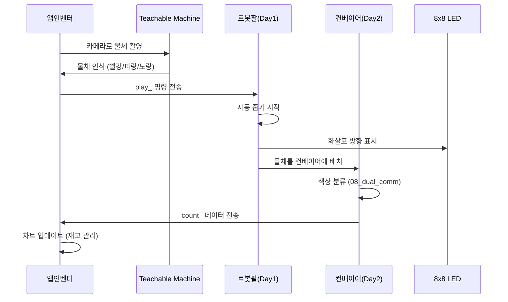
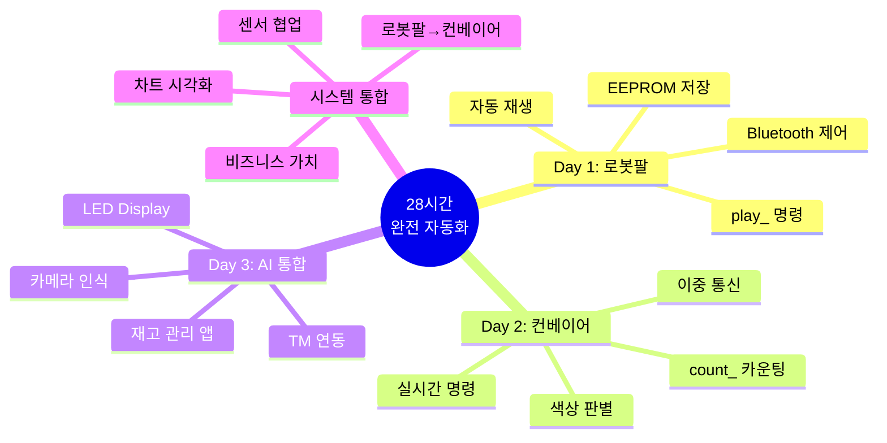

# 스마트 물류 팩토리 28시간 교육 프로젝트

> **"알고리즘으로 생각하고, 시스템으로 구현하고, 비즈니스로 완성한다"**  
> 피지컬 컴퓨팅 + AI를 바탕으로 물류 팩토리 시스템을 만들고 전시하는 알고리즘 중심 교육

---

## 🎯 프로젝트 개요

**대상**: 대학생 42명 (21팀, 2인 1조)  
**기간**: **28시간** (4일 × 7시간)  
**교구재**: [BP Lab AI 로봇팔 4축](https://bplab.kr/order/?idx=178) + 컨베이어 벨트  
**목표**: 알고리즘 설계 → 피지컬 AI 통합 → 스마트 물류 시스템 완성

---

## 🚀 핵심 특징

### 1. 알고리즘 중심 교육


- **플로우차트 우선**: 코드 작성 전 알고리즘 설계
- **의사코드 활용**: 논리 검증 후 구현
- **복잡도 분석**: 시간/공간 복잡도 측정
- **최적화**: 병목 지점 찾아서 개선

### 2. 피지컬 AI 통합 (3일 완성)

| 구성 요소 | 역할 | 핵심 알고리즘 | 학습 Day |
|----------|------|--------------|---------|
| **4축 로봇팔** | 물체 자동 줍기 | EEPROM 저장/복구, play_ 명령 실행 | Day 1 |
| **컨베이어 벨트** | 색상 자동 분류 | 색상 판별, 실시간 명령 체크 | Day 2 |
| **센서 시스템** | 제품 카운팅 | count_ 데이터 생성 및 전송 | Day 2 |
| **통신 모듈** | 이중 통신 | Bluetooth 버퍼링, Serial 동시 처리 | Day 1-2 |
| **스마트폰 AI** | 물체 인식 | Teachable Machine → play_ 전송 | Day 3 |
| **8x8 LED Matrix** | 상태 시각화 | 화살표 방향, 센서 상태 표시 | Day 3 |
| **앱인벤터** | 재고 관리 | count_ 파싱, 차트 시각화 | Day 3 |

**완전 자동화 플로우**:
```
카메라 촬영 → AI 인식 → play_ → 로봇팔 → LED 표시 → 
컨베이어 → 색상 분류 → count_ → 차트 업데이트
```

### 3. AI 기반 스마트 물류 시스템 (Day 3)



**핵심 통합**:
- Day 1 자동 줍기 + Day 2 자동 분류 = **완전 자동화**
- AI 인식 → 로봇팔 이동 → 컨베이어 분류 → 재고 카운팅

### 4. 재고 관리 시스템 (Day 2-3)

**Day 2: 데이터 수집**
- **이중 통신**: Serial + Bluetooth 동시 처리 (50ms 주기)
- **제품 카운팅**: 색상별 실시간 카운터 (red1_, green2_, blue3_)
- **데이터 전송**: count_ 명령으로 앱에 전송

**Day 3: 데이터 시각화**
- **앱인벤터 대시보드**: 
  - 원형 차트: 색상별 비율 (빨강 40%, 초록 20%, 파랑 40%)
  - 막대 차트: 시간별 누적 통계
  - 실시간 업데이트: count_ 수신 시 즉시 반영
- **통계 분석**:
  - 총 제품 개수
  - 색상별 개수
  - 최다 색상
  - 평균 처리 속도

**비즈니스 가치**:
- 실시간 재고 파악
- 색상별 수요 분석
- 생산 효율성 측정
- 의사결정 지원

---

## 📚 교육 커리큘럼

### Day 1: 로봇팔 단계별 학습 (6단계)

| 단계 | 프로그램 | 핵심 알고리즘 | 난이도 |
|------|---------|--------------|--------|
| **01** | 서보 모터 테스트 | 순차 테스트 | ⭐ |
| **02** | 조이스틱 제어 | 아날로그 입력 매핑 | ⭐⭐ |
| **03** | Serial 원격 제어 | 명령 파싱 | ⭐⭐ |
| **04** | EEPROM 자동화 | 저장/복구, 자동 재생, 무한 반복 | ⭐⭐⭐ |
| **05** | Bluetooth 제어 | 문자 버퍼링, 이중 통신 | ⭐⭐⭐⭐ |
| **06** | 향상된 버전 | 안정성 개선, 타이머 충돌 방지 | ⭐⭐⭐⭐ |

**결과물**: ✅ 무선 제어 로봇팔 + 자동 재생 시스템 (~1,340줄)

### Day 2: 컨베이어 모듈별 학습 (8단계)

| 단계 | 프로그램 | 핵심 알고리즘 | 난이도 |
|------|---------|--------------|--------|
| **01** | 적외선 센서 | 임계값 기반 감지 | ⭐ |
| **02** | 컬러 센서 | 비율 기반 색상 판별 | ⭐⭐ |
| **03** | RGB LED | NeoPixel 제어, 효과 생성 | ⭐⭐ |
| **04** | DC 모터 | PWM 속도 제어, 가속/감속 | ⭐⭐ |
| **05** | 서보 모터 | 정밀 각도 제어, 스윕 동작 | ⭐⭐ |
| **06** | 통합 시스템 | 통합 자동 분류 | ⭐⭐⭐⭐ |
| **07** | Serial 제어 | 실시간 명령 체크 (비차단) | ⭐⭐⭐⭐ |
| **08** | 이중 통신 | Serial+Bluetooth, 제품 카운터 | ⭐⭐⭐⭐⭐ |

**결과물**: ✅ 완전 자동화 컨베이어 분류 시스템 (~2,188줄)

**상세**: [arduino_code/README.md](arduino_code/README.md) | [알고리즘_설명서.md](arduino_code/알고리즘_설명서.md)

### Day 3: AI 통합 + 앱인벤터 강화 (오전 3시간)

| 단계 | 내용 | 핵심 기능 | 시간 |
|------|------|----------|------|
| **AI 연동** | 앱인벤터 + Teachable Machine | 카메라 인식 → play_ 명령 | 1.5시간 |
| **하드웨어 추가** | 8x8 LED Matrix | 화살표 방향 + 센서 상태 표시 | 1시간 |
| **재고 관리** | Day 1 + Day 2 통합 | 물체 이동 개수 카운팅 | 0.5시간 |

**결과물**: ✅ AI 기반 스마트 물류 시스템 (로봇팔 + 컨베이어 + AI)

### Day 3: 앱인벤터 재고 관리 시스템 (오후 4시간)

| 단계 | 내용 | 핵심 기능 | 시간 |
|------|------|----------|------|
| **대시보드** | 실시간 재고 현황 | count_ 데이터 수신 및 차트 | 1.5시간 |
| **통계 분석** | 색상별 누적 그래프 | 원형/막대 차트 시각화 | 1시간 |
| **제어 시스템** | start/stop/init 통합 | 전체 시스템 제어 | 0.5시간 |
| **발표 준비** | 시연 리허설 + 자료 정리 | PPT + 시연 시나리오 | 1시간 |

**결과물**: ✅ 완성도 높은 재고 관리 앱 + 발표 자료

### Day 4: 최종 발표 + 시연회

| 시간 | 내용 | 비고 |
|------|------|------|
| **오전** | 최종 점검 및 리허설 | 팀별 최종 테스트 |
| **오후** | 발표 + 시연 (팀당 15분) | 10분 발표 + 5분 시연 |

**상세**: [교육_커리큘럼_하편_Day3-4.md](curriculum/교육_커리큘럼_하편_Day3-4.md)

---

## 🧠 학습 알고리즘 (Day별 구현)

### Day 1: 로봇팔 제어 알고리즘 (3가지)

<table>
<tr>
<th>알고리즘</th>
<th>시간 복잡도</th>
<th>난이도</th>
<th>활용도</th>
<th>구현 파일</th>
</tr>
<tr>
<td><b>1. EEPROM 저장/복구</b></td>
<td>O(1)</td>
<td>⭐⭐⭐</td>
<td>⭐⭐⭐⭐</td>
<td>04_eeprom_automation</td>
</tr>
<tr>
<td><b>2. 자동 재생/무한 반복</b></td>
<td>O(n×m)</td>
<td>⭐⭐⭐</td>
<td>⭐⭐⭐⭐⭐</td>
<td>04_eeprom_automation</td>
</tr>
<tr>
<td><b>3. Bluetooth 명령 버퍼링</b></td>
<td>O(n)</td>
<td>⭐⭐⭐⭐</td>
<td>⭐⭐⭐⭐⭐</td>
<td>05_bluetooth_eeprom</td>
</tr>
</table>

### Day 2: 센서 및 통합 알고리즘 (4가지)

<table>
<tr>
<th>알고리즘</th>
<th>시간 복잡도</th>
<th>난이도</th>
<th>활용도</th>
<th>구현 파일</th>
</tr>
<tr>
<td><b>4. 색상 판별 (비율 기반)</b></td>
<td>O(1)</td>
<td>⭐⭐⭐</td>
<td>⭐⭐⭐⭐⭐</td>
<td>02_color_sensor_test</td>
</tr>
<tr>
<td><b>5. 실시간 명령 체크 (비차단)</b></td>
<td>O(n)</td>
<td>⭐⭐⭐⭐</td>
<td>⭐⭐⭐⭐⭐</td>
<td>07_serial_controlled</td>
</tr>
<tr>
<td><b>6. 제품 카운터 및 전송</b></td>
<td>O(1)</td>
<td>⭐⭐⭐</td>
<td>⭐⭐⭐⭐</td>
<td>08_dual_comm_system</td>
</tr>
<tr>
<td><b>7. 통합 자동 분류</b></td>
<td>O(1)</td>
<td>⭐⭐⭐⭐</td>
<td>⭐⭐⭐⭐⭐</td>
<td>06_integrated_system</td>
</tr>
</table>

### Day 3: AI 통합 및 앱인벤터 재고 관리 시스템

<table>
<tr>
<th>구성 요소</th>
<th>기능</th>
<th>난이도</th>
<th>활용도</th>
<th>비고</th>
</tr>
<tr>
<td><b>8. AI 물체 인식</b></td>
<td>Teachable Machine 연동</td>
<td>⭐⭐⭐</td>
<td>⭐⭐⭐⭐⭐</td>
<td>카메라 인식 → play_</td>
</tr>
<tr>
<td><b>9. 통합 제어 시스템</b></td>
<td>Day1 + Day2 연계</td>
<td>⭐⭐⭐⭐</td>
<td>⭐⭐⭐⭐⭐</td>
<td>로봇팔 → 컨베이어</td>
</tr>
<tr>
<td><b>10. 8x8 LED Display</b></td>
<td>상태 시각화</td>
<td>⭐⭐</td>
<td>⭐⭐⭐⭐</td>
<td>화살표 + 센서 상태</td>
</tr>
<tr>
<td><b>11. 재고 관리 대시보드</b></td>
<td>앱인벤터 차트</td>
<td>⭐⭐⭐</td>
<td>⭐⭐⭐⭐⭐</td>
<td>count_ 데이터 시각화</td>
</tr>
<tr>
<td><b>12. 통계 분석</b></td>
<td>누적 그래프</td>
<td>⭐⭐</td>
<td>⭐⭐⭐⭐</td>
<td>원형/막대 차트</td>
</tr>
</table>

**상세 알고리즘 설명**: [알고리즘_설명서.md](arduino_code/알고리즘_설명서.md)

---

## 🔧 하드웨어 사양

### Day 1: 로봇팔 시스템

**주요 부품**:
- **4축 로봇팔**: [BP Lab AI 로봇팔](https://bplab.kr/order/?idx=178) (SG90 서보 4개)
- **조이스틱**: 아날로그 조이스틱 2개 (실시간 제어용)
- **통신**: HC-05/HC-06 블루투스 모듈
- **제어**: 아두이노 우노 호환보드
- **전원**: 5V 외부 전원 (서보 안정 동작)

**서보 각도 범위**:
| 축 | 기능 | 각도 범위 | 용도 |
|----|------|----------|------|
| **1축 (베이스)** | 좌우 회전 | 50-130° | 구역 선택 |
| **2축 (팔1)** | 상하 움직임 | 70-120° | 높이 제어 |
| **3축 (팔2)** | 팔 굽힘 | 60-120° | 위치 조정 |
| **4축 (그립)** | 집기/놓기 | 5-50° | 물체 파지 |

### Day 2: 컨베이어 시스템

**주요 부품**:
- **컬러 센서**: TCS34725 (I2C, RGB 분석)
- **IR 센서**: 적외선 장애물 센서 (물체 감지)
- **DC 모터**: 12V 기어 모터 + L298N 드라이버
- **서보 모터**: SG90 (분류 게이트)
- **RGB LED**: NeoPixel WS2812B 3개 이상
- **부저**: Passive Buzzer (알림음)
- **통신**: HC-05/HC-06 블루투스 모듈
- **제어**: 아두이노 우노/메가
- **전원**: 5V, 12V

### Day 3: AI 통합 시스템 (Day 1 + Day 2 + 추가 부품)

**기존 시스템**:
- Day 1: 로봇팔 시스템 (자동 줍기 완성)
- Day 2: 컨베이어 시스템 (자동 분류 완성)

**추가 부품**:
- **8x8 LED Matrix**: MAX7219 제어 (상태 표시)
  - 화살표 방향 표시 (←, →, ↑, ↓)
  - 센서 상태 아이콘 (✓, ✗, ●)
  - 동작 상태 애니메이션
- **스마트폰**: Teachable Machine AI
  - 카메라 물체 인식 (빨강/파랑/노랑)
  - 신뢰도 표시 (%)
- **앱 인벤터**: 재고 관리 대시보드
  - 실시간 차트 (원형, 막대)
  - 색상별 누적 통계
  - start/stop/init 제어

---

## 📂 프로젝트 구조

```
Smart_Factory_Arms_Project/
│
├── 📂 curriculum/                                    # 교육 커리큘럼
│   ├── 교육_커리큘럼_상편_Day1-2.md                 # 상편 (기초+센서)
│   ├── 교육_커리큘럼_하편_Day3-4.md                 # 하편 (AI 통합+발표)
│   └── 교육_커리큘럼_시나리오_상세가이드_Day3.md    # Day 3 시나리오
│
├── 📂 docs/                                          # 문서
│   ├── 00_프로젝트_개요.md                          # 프로젝트 소개
│   ├── 01_프로젝트_구조도.md                        # 알고리즘 아키텍처
│   ├── 02_블루투스_프로토콜.md                      # 통신 프로토콜
│   ├── 03_아두이노_피지컬컴퓨팅_가이드.md            # 하드웨어 가이드
│   ├── 03_바이브_코딩_가이드.md                     # 바이브 코딩 방법론
│   ├── 04_피지컬AI_학습방법.md                      # AI 학습 방법
│   ├── 05_비즈니스_모델_설계.md                     # 비즈니스 모델
│   ├── 06_프로젝트_아이디어_모음.md                 # 창의적 아이디어
│   ├── 07_앱인벤터_TM_연동가이드.md                 # AI 연동 가이드
│   └── 08_스마트팩토리_산업분석.md                  # 산업 분석
│
├── 📂 arduino_code/                                  # 아두이노 코드
│   │
│   ├── 📂 day1_arm_system/                          # Day 1: 로봇팔 학습 (6단계)
│   │   ├── 01_servo_motor_test/                    # 서보 동작 테스트
│   │   ├── 02_joystick_servo_control/              # 조이스틱 제어
│   │   ├── 03_serial_servo_control/                # Serial 원격 제어
│   │   ├── 04_eeprom_automation/                   # EEPROM 자동화 ⭐
│   │   ├── 05_bluetooth_eeprom_automation/         # Bluetooth 제어 ⭐⭐
│   │   ├── 06_bluetooth_eeprom_automation copy/    # 향상된 버전
│   │   └── README.md                               # 상세 가이드
│   │
│   ├── 📂 day2_conveyor_system/                     # Day 2: 컨베이어 학습 (8단계)
│   │   ├── 01_infrared_sensor_test/                # IR 센서
│   │   ├── 02_color_sensor_test/                   # 컬러 센서 ⭐
│   │   ├── 03_rgb_led_colors_test/                 # RGB LED
│   │   ├── 04_dc_motor_control_test/               # DC 모터
│   │   ├── 05_servo_motor_control_test/            # 서보 게이트
│   │   ├── 06_integrated_conveyor_system/          # 통합 시스템 ⭐⭐
│   │   ├── 07_serial_controlled_system/            # Serial 제어 ⭐⭐
│   │   ├── 08_dual_comm_system/                    # 이중 통신 ⭐⭐⭐
│   │   └── README.md                               # 상세 가이드
│   │
│   ├── 📂 day3_scenarios/                           # Day 3: AI 통합
│   │   ├── scenario_a_ai_smart.ino                 # AI 스마트 입고
│   │   ├── state_machine.h                         # 상태 머신
│   │   └── state_machine.cpp
│   │
│   ├── README.md                                    # 전체 사용 설명서
│   ├── 알고리즘_설명서.md                           # 알고리즘 상세 (7가지)
│   └── 프로젝트_구조.md                             # 구조 및 학습 가이드
│
├── 📂 app_inventor/                                  # 앱 인벤터 소스
│   ├── source/                                      # 기본 제어 앱 (.aia, .apk)
│   └── inventory_dashboard/                         # Day 3: 재고 관리 앱
│       ├── inventory_app.aia                        # 앱인벤터 소스
│       ├── inventory_app.apk                        # 안드로이드 앱
│       └── README.md                                # 사용 설명서
│           ├── AI 연동 방법
│           ├── 차트 설정 방법
│           └── count_ 데이터 파싱
│
└── 📂 movies/                                        # 시연 영상 (26개)
```

**핵심 파일**:
- ⭐ = 필수 학습
- ⭐⭐ = 중요 알고리즘
- ⭐⭐⭐ = 최고 난이도

---

## 🚦 시작하기

### 1단계: 필수 문서 읽기 (순서대로)

1. **[arduino_code/README.md](arduino_code/README.md)** ← 전체 사용 설명서 (필수!)
2. **[arduino_code/알고리즘_설명서.md](arduino_code/알고리즘_설명서.md)** ← 7가지 알고리즘 상세
3. **[arduino_code/프로젝트_구조.md](arduino_code/프로젝트_구조.md)** ← 학습 가이드
4. [docs/03_바이브_코딩_가이드.md](docs/03_바이브_코딩_가이드.md) ← 방법론
5. [curriculum/교육_커리큘럼_상편_Day1-2.md](curriculum/교육_커리큘럼_상편_Day1-2.md) ← 교육 과정

### 2단계: 하드웨어 준비

**Day 1 (로봇팔)**:
- [ ] BP Lab 로봇팔 4축 ([구매 링크](https://bplab.kr/order/?idx=178))
- [ ] 아두이노 우노
- [ ] 아날로그 조이스틱 2개
- [ ] HC-05/HC-06 블루투스 모듈
- [ ] 5V 외부 전원 (서보용)

**Day 2 (컨베이어)**:
- [ ] TCS34725 컬러 센서
- [ ] IR 장애물 센서
- [ ] L298N + 12V DC 모터
- [ ] SG90 서보 모터
- [ ] NeoPixel RGB LED (3개 이상)
- [ ] Passive Buzzer
- [ ] 12V 전원

### 3단계: 소프트웨어 설치

```bash
# Arduino IDE 설치
1. Arduino IDE 1.8.19 이상 다운로드
2. 필수 라이브러리 설치:
   - Servo.h (기본 내장)
   - EEPROM.h (기본 내장)
   - Wire.h (기본 내장)
   - SoftwareSerial.h (기본 내장)
   - Adafruit NeoPixel (라이브러리 매니저)
   - Adafruit TCS34725 (라이브러리 매니저)
```

### 4단계: Day 1 시작 (단계별 학습)

```bash
# 1단계: 서보 모터 테스트
cd arduino_code/day1_arm_system/01_servo_motor_test
# Arduino IDE로 열기 → 업로드
# Serial Monitor (9600 baud) 열어서 동작 확인

# 2단계: 조이스틱 제어
cd ../02_joystick_servo_control
# 업로드 후 조이스틱으로 제어

# 3단계: Serial 제어
cd ../03_serial_servo_control
# 업로드 후 Serial Monitor에서 명령 테스트
# 예: arm0_90_ (베이스를 90도로)

# 4단계: EEPROM 자동화 (핵심!)
cd ../04_eeprom_automation
# 업로드 후 위치 저장/재생 테스트
# 명령: save, play, auto, stop, list

# 5단계: Bluetooth 제어
cd ../05_bluetooth_eeprom_automation
# 업로드 후 Bluetooth 연결
# 스마트폰 앱에서 save_, play_, auto_ 테스트
```

### 5단계: Day 2 시작 (모듈별 학습)

```bash
# 모듈 테스트 (01~05)
cd arduino_code/day2_conveyor_system
# 각 폴더의 .ino 파일을 순서대로 업로드

# 통합 시스템 (06~08)
cd 08_dual_comm_system
# 최종 완성본 업로드 및 테스트
# 명령: start_, stop_, init_
# 결과: red1_, green2_, blue3_ 등 count_ 데이터 수신 확인
```

### 6단계: Day 3 오전 (AI 통합)

**앱인벤터 + Teachable Machine 연동**:
```
1. Teachable Machine (teachablemachine.withgoogle.com)
   - 새 이미지 프로젝트 생성
   - 클래스 3개: 빨강, 초록, 파랑
   - 각 클래스당 50장 이상 촬영
   - 모델 학습 → 내보내기 → 링크 복사

2. 앱인벤터 (appinventor.mit.edu)
   - PersonalImageClassifier 컴포넌트 추가
   - ClassificationURL: 위 링크 붙여넣기
   - Camera 컴포넌트로 촬영
   - 인식 결과 → play_ 명령 전송
```

**8x8 LED Matrix 추가**:
```cpp
// LED Matrix 라이브러리 설치
#include <MD_MAX72xx.h>

// 화살표 패턴 정의
byte arrow_left[] = {0x10, 0x20, 0x7F, 0x20, 0x10};
byte arrow_right[] = {0x08, 0x04, 0xFE, 0x04, 0x08};

// 표시 함수
void showArrow(String direction) {
  if (direction == "left") {
    display.setBuffer(arrow_left);
  } else if (direction == "right") {
    display.setBuffer(arrow_right);
  }
}
```

### 7단계: Day 3 오후 (앱인벤터 재고 관리)

**차트 컴포넌트 추가**:
```
1. ChartData 블록 사용
   - PieChart: 색상별 비율
   - BarChart: 누적 통계

2. count_ 데이터 파싱
   - red1_ 수신 → redList에 1 추가
   - green2_ 수신 → greenList에 2 추가
   - 차트 업데이트

3. 통계 계산
   - 총 개수 = redList 길이 + greenList 길이 + blueList 길이
   - 비율 = (색상별 개수 / 총 개수) × 100
```

---

## 🎓 학습 목표

### Day 1 목표 (로봇팔)

- [ ] **01-03단계**: 서보 모터 제어 기초 이해
- [ ] **04단계**: EEPROM 저장/복구 알고리즘 완벽 이해 ⭐
- [ ] **04단계**: 자동 재생/무한 반복 알고리즘 구현 ⭐
- [ ] **05단계**: Bluetooth 명령 버퍼링 알고리즘 마스터 ⭐⭐
- [ ] 조이스틱 + Serial + Bluetooth 모두 제어 가능

### Day 2 목표 (컨베이어)

- [ ] **01-05단계**: 각 센서/액추에이터 개별 제어
- [ ] **02단계**: 색상 판별 알고리즘 (비율 기반) 이해 ⭐
- [ ] **06단계**: 통합 자동 분류 시스템 완성 ⭐⭐
- [ ] **07단계**: 실시간 명령 체크 (비차단) 구현 ⭐⭐
- [ ] **08단계**: 이중 통신 + 카운터 마스터 ⭐⭐⭐
- [ ] 10회 연속 분류 성공률 80% 이상

### Day 3 목표 (오전: AI 통합)

- [ ] **앱인벤터 + Teachable Machine 연동** ⭐⭐⭐
  - 카메라 촬영 → AI 인식 → play_ 명령 전송
  - 로봇팔 자동 줍기 실행 (Day 1 활용)
- [ ] **8x8 LED Matrix 추가** ⭐⭐
  - 화살표 방향 표시 (물체 이동 방향)
  - 센서 상태 표시 (감지 중/완료)
- [ ] **Day 1 + Day 2 통합** ⭐⭐⭐⭐
  - 로봇팔이 잡은 물체 → 컨베이어 분류
  - 이동 개수 카운팅 (count_ 데이터 수신)

### Day 3 목표 (오후: 앱인벤터 강화)

- [ ] **재고 관리 대시보드 구현** ⭐⭐⭐⭐
  - count_ 데이터로 실시간 차트 생성
  - 색상별 원형 차트 (빨강/초록/파랑 비율)
  - 누적 막대 차트 (시간별 증가 추이)
- [ ] **통합 제어 시스템** ⭐⭐⭐
  - start_ : 전체 시스템 시작
  - stop_ : 즉시 중지
  - init_ : 카운터 초기화
- [ ] **발표 자료 준비** ⭐⭐
  - PPT 작성 (10분)
  - 시연 시나리오 작성 (5분)
  - 리허설 1회 이상

### Day 4 목표 (최종 발표)

- [ ] 최종 점검 및 리허설
- [ ] 팀별 발표 + 시연 (15분)
- [ ] 10분 발표 + 5분 시연

### 전체 목표

- [ ] **7가지 핵심 알고리즘** 완벽 이해
- [ ] 복잡도 분석 (시간/공간)
- [ ] 병목 지점 찾아서 최적화
- [ ] 모듈화 및 클린 코드 작성
- [ ] 문제 해결 능력 향상

---

## 💡 핵심 개념

### 바이브 코딩 (VIBE Coding)

```
V - Visionary  : 알고리즘 설계 (플로우차트, 의사코드)
I - Implementer: 시스템 구현 (단계별 학습, 19개 프로그램)
B - Debugger   : 알고리즘 최적화 (복잡도 분석, Early Return)
E - Entrepreneur: 가치 창출 (ROI 계산)
```

### 단계별 학습 전략

**Day 1 (6단계)**: 기초 → 중급 → 고급
- 01-03: 기본 제어 (⭐)
- 04: EEPROM 자동화 (⭐⭐⭐)
- 05-06: Bluetooth 제어 (⭐⭐⭐⭐)

**Day 2 (8단계)**: 모듈별 → 통합
- 01-05: 개별 모듈 테스트 (⭐⭐)
- 06-07: 통합 시스템 (⭐⭐⭐⭐)
- 08: 완전 자동화 (⭐⭐⭐⭐⭐)

**Day 3 (통합 + 강화)**: AI + 재고 관리
- 오전: AI 연동 + LED Display 추가
- 오후: 앱인벤터 재고 관리 대시보드

### 재고 관리 시스템 (Day 3 핵심)

**실시간 데이터 수집**:
```
컨베이어 → count_ 데이터 전송
예: red1_, red2_, green1_, blue3_

앱인벤터 → 데이터 파싱 및 저장
빨강: [1, 2]
초록: [1]
파랑: [3]
```

**차트 시각화**:
- **원형 차트**: 색상별 비율 (빨강 40%, 초록 20%, 파랑 40%)
- **막대 차트**: 시간별 누적 (실시간 업데이트)
- **통계 요약**: 총 개수, 평균, 최다 색상

### 시스템 통합 플로우 (Day 3)

```
1. 앱인벤터 카메라 촬영
   ↓
2. Teachable Machine 인식 (예: 빨강 95%)
   ↓
3. play_ 명령 전송 → 로봇팔 (Day 1)
   ↓
4. 자동 줍기 실행 (04_eeprom_automation)
   ↓
5. LED Display: 화살표 → 방향 표시
   ↓
6. 물체를 컨베이어에 배치
   ↓
7. 컨베이어 자동 분류 (Day 2, 08_dual_comm)
   ↓
8. count_ 데이터 전송 (예: red3_)
   ↓
9. 앱인벤터 차트 업데이트 (실시간)
```

---

## 📊 평가 기준 (Day 3-4)

| 영역 | 비중 | 세부 내용 |
|------|------|-----------|
| **시스템 완성도** | 30% | Day 1 + Day 2 + AI 통합, 작동 안정성 |
| **재고 관리 앱** | 25% | 차트 시각화, 실시간 업데이트, UI/UX |
| **AI 연동** | 20% | Teachable Machine 정확도, 자동 제어 |
| **시각화** | 15% | 8x8 LED Display, 앱인벤터 차트 |
| **발표 + 시연** | 10% | 설득력, 안정적 시연, 질의응답 |

### 세부 평가 항목

**시스템 완성도 (30점)**:
- [ ] Day 1 로봇팔 자동 줍기 작동 (10점)
- [ ] Day 2 컨베이어 자동 분류 작동 (10점)
- [ ] 통합 동작 (로봇팔 → 컨베이어) (10점)

**재고 관리 앱 (25점)**:
- [ ] count_ 데이터 수신 및 파싱 (5점)
- [ ] 원형 차트 시각화 (색상별 비율) (10점)
- [ ] 막대 차트 시각화 (누적 통계) (5점)
- [ ] 통합 제어 (start/stop/init) (5점)

**AI 연동 (20점)**:
- [ ] 카메라 촬영 기능 (5점)
- [ ] Teachable Machine 인식 정확도 80% 이상 (10점)
- [ ] play_ 명령 자동 전송 (5점)

**시각화 (15점)**:
- [ ] 8x8 LED Display 화살표 표시 (5점)
- [ ] 센서 상태 아이콘 표시 (5점)
- [ ] 앱인벤터 UI 디자인 (5점)

**발표 + 시연 (10점)**:
- [ ] 발표 자료 완성도 (3점)
- [ ] 시연 안정성 (5점)
- [ ] 질의응답 (2점)

---

## 🌟 기대 효과

### 기술 역량



### 포트폴리오

- 📄 **완성된 스마트 물류 시스템**
  - Day 1: 로봇팔 자동 줍기 (6단계, ~1,340줄)
  - Day 2: 컨베이어 자동 분류 (8단계, ~2,188줄)
  - Day 3: AI 통합 + 재고 관리 앱
  - 총 19개 프로그램, ~4,178줄 + 앱인벤터
  
- 📱 **앱인벤터 재고 관리 시스템**
  - Teachable Machine AI 연동
  - 실시간 차트 (원형/막대)
  - 색상별 누적 통계
  - 통합 제어 시스템 (start/stop/init)
  
- 🖥️ **하드웨어 통합**
  - 4축 로봇팔 (SG90 × 4)
  - 컨베이어 벨트 (DC 모터 + 센서)
  - 8x8 LED Matrix (상태 표시)
  - TCS34725 컬러 센서
  - NeoPixel RGB LED
  
- 📊 **복잡도 분석 보고서**
  - O(1): EEPROM 저장, 색상 판별, 제품 카운터
  - O(n): Bluetooth 버퍼링, 실시간 명령 체크
  - O(n×m): 자동 재생/무한 반복
  
- 🎬 **시연 영상** (5분)
  - AI 인식 → 로봇팔 → 컨베이어 → 차트 업데이트
  - 완전 자동화 프로세스
  
- 📚 **학습 가이드** (3개 문서, 2,872줄)
  - README.md (전체 사용 설명서)
  - 알고리즘_설명서.md (7가지 알고리즘)
  - 프로젝트_구조.md (구조 및 학습)
  
- 📈 **발표 자료**
  - PPT (10분): 시스템 설명, 알고리즘, 결과
  - 시연 시나리오 (5분): 단계별 동작
  - 재고 관리 효과 분석

---

## 🤝 기여 및 참여

이 프로젝트는 교육용 오픈소스입니다.

### 기여 방법

1. Fork this repository
2. 알고리즘 개선 또는 새로운 시나리오 추가
3. Pull Request 제출

### 질문 및 토론

- Issues 탭에서 질문
- Discussions 탭에서 토론

---

## 📖 참고 자료

### 교구재

- [BP Lab AI 로봇팔 4축](https://bplab.kr/order/?idx=178) (99,000원)
- 아두이노 우노 호환보드
- TCS34725 컬러 센서, IR 센서
- L298N 모터 드라이버, NeoPixel LED
- HC-05/HC-06 블루투스 모듈

### 프로젝트 내부 문서 (필독!)

1. **[arduino_code/README.md](arduino_code/README.md)** - 전체 사용 설명서
2. **[arduino_code/알고리즘_설명서.md](arduino_code/알고리즘_설명서.md)** - 7가지 알고리즘 상세
3. **[arduino_code/프로젝트_구조.md](arduino_code/프로젝트_구조.md)** - 구조 및 학습 가이드
4. [arduino_code/day1_arm_system/README.md](arduino_code/day1_arm_system/README.md) - Day 1 가이드
5. [arduino_code/day2_conveyor_system/README.md](arduino_code/day2_conveyor_system/README.md) - Day 2 가이드

### 온라인 리소스

**Day 3 필수 도구**:
- [Teachable Machine](https://teachablemachine.withgoogle.com/) - AI 이미지 분류 학습
- [앱인벤터](https://appinventor.mit.edu/) - 재고 관리 앱 제작
  - PersonalImageClassifier: AI 연동
  - ChartData: 차트 시각화
  - BluetoothClient: 통신
- [MD_MAX72xx 라이브러리](https://github.com/MajicDesigns/MD_MAX72XX) - 8x8 LED Matrix

**개발 환경**:
- [아두이노 IDE](https://www.arduino.cc/en/software) - 펌웨어 개발
- [Adafruit NeoPixel](https://github.com/adafruit/Adafruit_NeoPixel) - RGB LED
- [Adafruit TCS34725](https://github.com/adafruit/Adafruit_TCS34725) - 컬러 센서

### 알고리즘 학습

- "Introduction to Algorithms" (CLRS)
- "알고리즘 문제 해결 전략" (구종만)
- [Coursera] Algorithms Specialization

### 하드웨어 데이터시트

- [TCS34725 컬러 센서](https://www.adafruit.com/product/1334)
- [L298N 모터 드라이버](https://www.st.com/resource/en/datasheet/l298.pdf)
- [HC-05/HC-06 블루투스](http://www.electronica60norte.com/mwfls/pdf/hc06.pdf)
- [WS2812B NeoPixel](https://cdn-shop.adafruit.com/datasheets/WS2812B.pdf)

---

## 📄 라이선스

MIT License - 교육 목적으로 자유롭게 사용 가능

---

## 👥 제작팀

**Smart Factory Education Team**
- 교육 커리큘럼 설계 (Day 1-4)
- 단계별 학습 시스템 개발 (19개 프로그램)
- 7가지 핵심 알고리즘 구현 및 문서화
- 하드웨어 통합 가이드 제작
- AI 통합 시스템 설계 (앱인벤터 + Teachable Machine)
- 재고 관리 대시보드 프로토타입
- 총 2,872줄 문서 작성
  - README 664줄 (Day 3 통합 반영)
  - 알고리즘 설명서 1,099줄
  - 프로젝트 구조 905줄
  - 기타 가이드 204줄

---

## 🎉 성공 메시지

```
"28시간 후, 여러분은:

✅ Day 1: 6단계 로봇팔 제어를 완벽히 마스터했습니다
   → EEPROM 저장/복구, 자동 재생, Bluetooth 버퍼링
   → play_ 명령으로 자동 줍기 실행

✅ Day 2: 8단계 컨베이어 시스템을 완성했습니다
   → 색상 판별, 실시간 명령 체크, 이중 통신
   → count_ 데이터로 제품 카운팅 (red1_, green2_, blue3_)

✅ Day 3: AI 기반 스마트 물류 시스템을 구축했습니다
   → 앱인벤터 + Teachable Machine 연동
   → 카메라 인식 → 로봇팔 → 컨베이어 → 차트
   → 8x8 LED Display로 상태 시각화
   → 재고 관리 대시보드 완성

✅ 7가지 핵심 알고리즘을 설계하고 구현할 수 있습니다
   → O(1), O(n), O(n×m) 복잡도 분석 및 최적화

✅ 약 4,000줄의 실전 코드를 작성하고 이해했습니다
   → 모듈화, 클린 코드, Early Return 패턴

✅ 하드웨어와 소프트웨어를 완전히 통합했습니다
   → 로봇팔 + 컨베이어 + AI + 앱 → 완전 자동화

✅ 실시간 재고 관리 시스템을 만들었습니다
   → 차트 시각화 (원형/막대)
   → 색상별 통계 분석
   → 비즈니스 가치 창출

더 중요한 것은, 여러분이 **단계별 학습**과 **시스템 통합**을 
체득했다는 것입니다.

01_servo_motor_test → 08_dual_comm_system → AI 통합까지
19개 프로그램을 순차적으로 완성하며 쌓은 경험은
앞으로 모든 스마트 시스템 개발의 기반이 될 것입니다.

자, 28시간의 완전 자동화 여정을 시작합니다! 🚀
```

---

**Last Updated**: 2026-01-25  
**Version**: 2.3 (Day 3 AI 통합 + 재고 관리 시스템)  
**교구재**: [BP Lab AI 로봇팔](https://bplab.kr/order/?idx=178)  
**시스템 구성**:
- Day 1: 로봇팔 6단계 (~1,340줄)
- Day 2: 컨베이어 8단계 (~2,188줄)
- Day 3: AI 통합 + 앱인벤터 재고 관리
- 총 19개 프로그램 + 재고 관리 앱
