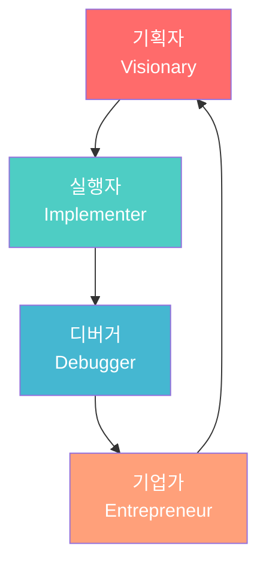
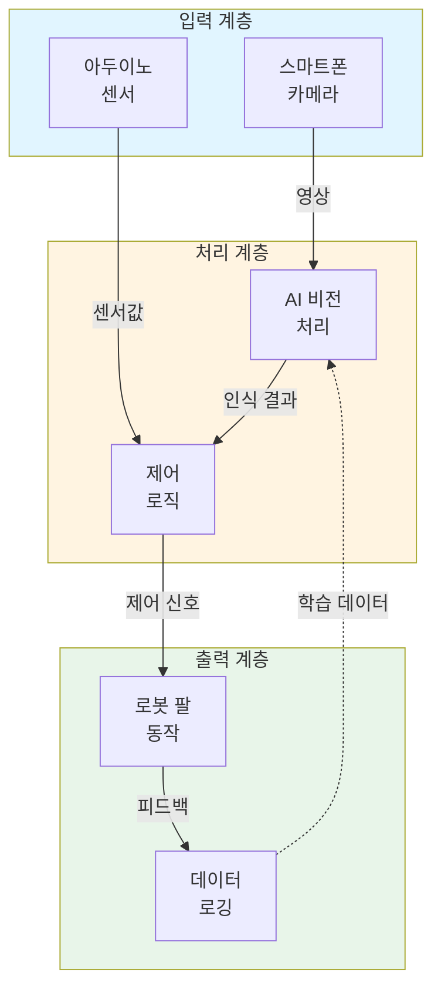
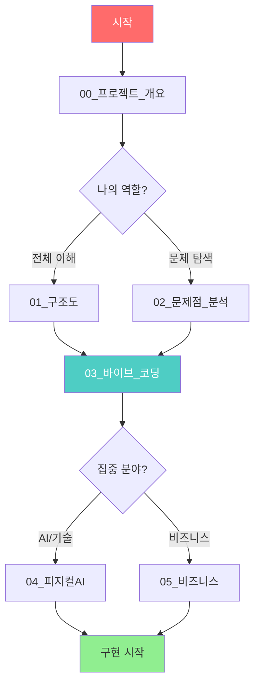
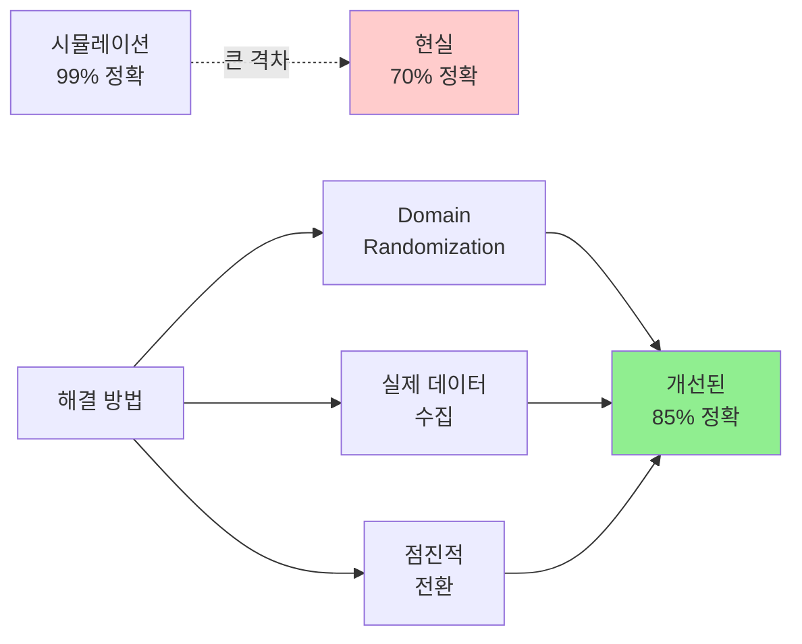
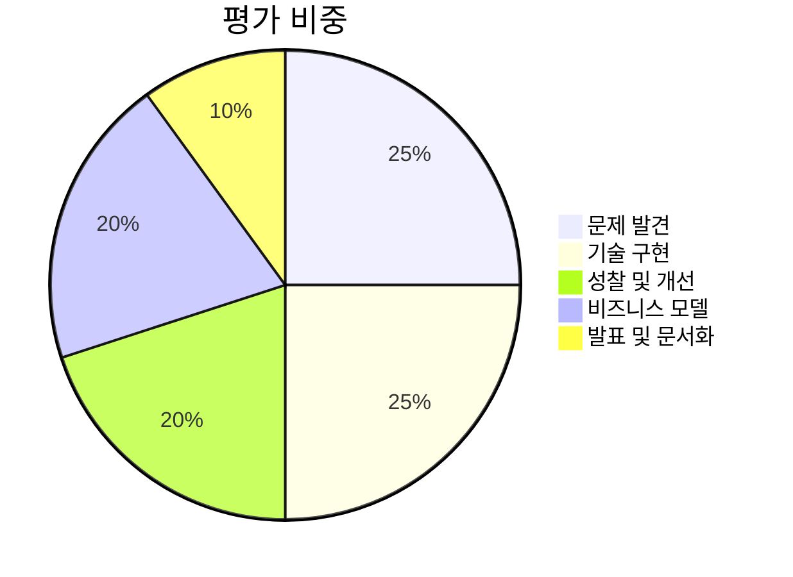
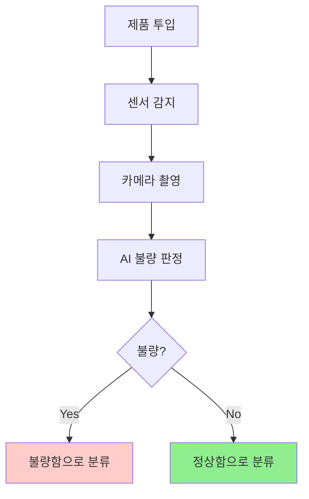
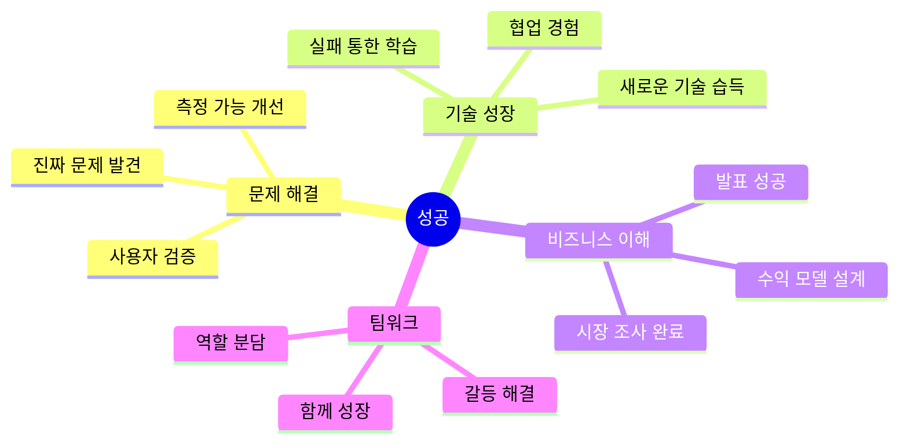

# 스마트 팩토리 & 로봇 팔 프로젝트 수업


## 📋 프로젝트 개요

이 프로젝트는 **28차시 공모전 준비 프로젝트 수업**으로, 학생들이 스마트 팩토리와 로봇 팔 기술을 활용하여 **진짜 문제를 발견하고 해결**하며, **공모전 수준의 결과물**을 만드는 것을 목표로 합니다.

### 🎯 핵심 목표


---

## 🎓 학습 철학: 바이브 코딩 (VIBE Coding)

**인간이 AI보다 잘하는 것에 집중하라!**

| 역할 | 인간의 강점 | AI의 한계 |
|------|-----------|----------|
| 🎨 **기획자** (Visionary) | 공감, 맥락 이해, 진짜 문제 발견 | 문제가 무엇인지 모름 |
| 🔧 **실행자** (Implementer) | 창의적 설계, 복합적 통합 | 정해진 패턴만 반복 |
| 🐛 **디버거** (Debugger) | 원인 분석, 성찰, 통찰 도출 | 왜 실패했는지 모름 |
| 💼 **기업가** (Entrepreneur) | 가치 창출, 시장 이해 | 비즈니스 판단 불가 |



---

## 🛠️ 기술 스택

### 하드웨어
- **로봇 팔**: [ICBANQ P013154977](https://www.icbanq.com/P013154977)
- **스마트 팩토리 모듈**: [ICBANQ P014847535](https://www.icbanq.com/P014847535)
- **아두이노**: 센서 제어 및 모터 구동
- **스마트폰**: AI 비전 처리 (카메라 없는 아두이노의 한계 극복)

### 소프트웨어 & AI
- **컴퓨터 비전**: OpenCV, MediaPipe
- **AI 프레임워크**: TensorFlow Lite, ML Kit
- **피지컬 AI**: Sim-to-Real, Domain Randomization
- **통신**: Bluetooth, Wi-Fi (아두이노 ↔ 스마트폰)

### 시스템 아키텍처



---

## 📚 문서 구조

### 핵심 문서 (꼭 읽어야 할 문서)

| 문서 | 설명 | 대상 |
|------|------|------|
| [00_프로젝트_개요.md](./docs/00_프로젝트_개요.md) | 프로젝트 전체 소개 및 학습 철학 | 모두 |
| [01_프로젝트_구조도.md](./docs/01_프로젝트_구조도.md) | 시스템 아키텍처 및 기술 스택 | 기술팀 |
| [02_문제점_분석.md](./docs/02_문제점_분석.md) | 로봇 팔과 스마트 팩토리의 어려운 문제들 | 모두 |
| [03_바이브_코딩_가이드.md](./docs/03_바이브_코딩_가이드.md) | 4단계 개발 방법론 상세 가이드 | 모두 |
| [04_피지컬AI_학습방법.md](./docs/04_피지컬AI_학습방법.md) | AI 학습 및 Sim-to-Real 전략 | AI팀 |
| [05_비즈니스_모델_설계.md](./docs/05_비즈니스_모델_설계.md) | 사업화 전략 및 공모전 준비 | 기업가팀 |
| [07_앱인벤터_Teachable_Machine_연동가이드.md](./docs/07_앱인벤터_Teachable_Machine_연동가이드.md) | TM 모델을 앱인벤터에서 사용하는 완전 가이드 | 개발팀 |

### 문서 읽기 순서



---

## 🎯 프로젝트 단계별 가이드

### Phase 1: 문제 발견 (1-2주, 4-8차시)

**목표**: 진짜 문제 찾기

- [ ] 현장 관찰 및 인터뷰
- [ ] 문제 정의서 작성
- [ ] 우선순위 결정
- [ ] 해결 방향 설정

📖 **참고 문서**: `03_바이브_코딩_가이드.md` - 1단계: 기획자

### Phase 2: 프로토타입 개발 (3-4주, 9-16차시)

**목표**: 작동하는 시스템 만들기

- [ ] 시스템 설계
- [ ] 하드웨어 조립
- [ ] 소프트웨어 개발
- [ ] AI 모델 학습
- [ ] 통합 테스트

📖 **참고 문서**: 
- `01_프로젝트_구조도.md` - 시스템 설계
- `04_피지컬AI_학습방법.md` - AI 구현

### Phase 3: 테스트 및 개선 (5주, 17-22차시)

**목표**: 문제 해결 및 성찰

- [ ] 실제 환경 테스트
- [ ] 오류 원인 분석
- [ ] 실패 일지 작성
- [ ] 개선 및 최적화
- [ ] 성능 측정

📖 **참고 문서**: 
- `02_문제점_분석.md` - 예상 문제
- `03_바이브_코딩_가이드.md` - 3단계: 디버거

### Phase 4: 비즈니스 모델링 (6주, 23-26차시)

**목표**: 사업화 전략 수립

- [ ] 시장 조사
- [ ] 경쟁 분석
- [ ] 비즈니스 모델 캔버스
- [ ] 손익 계산
- [ ] 피칭 자료 준비

📖 **참고 문서**: `05_비즈니스_모델_설계.md`

### Phase 5: 최종 발표 (7주, 27-28차시)

**목표**: 공모전 제출 및 발표

- [ ] 발표 자료 완성
- [ ] 시연 리허설
- [ ] 최종 점검
- [ ] 발표 및 질의응답

---

## 💡 주요 학습 포인트

### 1. Reality Gap (현실 격차) 극복



### 2. 주요 문제점과 해결 방향

| 문제 영역 | 어려운 점 | 학습 가치 |
|----------|----------|----------|
| **하드웨어** | 백래시, 진동, 토크 부족 | 물리 법칙, 제약 조건 내 설계 |
| **AI 비전** | 조명 변화, Reality Gap | 데이터 품질, 일반화 |
| **통합** | 좌표 변환, 타이밍 동기화 | 시스템 사고, 협업 |
| **비즈니스** | 비용, 시장 진입 | 가치 창출, 지속가능성 |

### 3. 평가 기준



---

## 🚀 빠른 시작 가이드

### 1단계: 환경 설정

```bash
# 프로젝트 클론
git clone https://github.com/your-repo/Smart_Factory_Arms_Project.git
cd Smart_Factory_Arms_Project

# 문서 읽기 시작
cd docs
# 00_프로젝트_개요.md 부터 읽기
```

### 2단계: 팀 구성

**권장 팀 구성 (4명)**:

| 역할 | 담당 업무 | 필요 역량 |
|------|----------|----------|
| **기획자** | 문제 발견, 인터뷰, 문서화 | 공감 능력, 의사소통 |
| **하드웨어 엔지니어** | 조립, 배선, 센서 연결 | 손재주, 꼼꼼함 |
| **소프트웨어 개발자** | 펌웨어, 앱, AI 모델 | 코딩, 문제 해결 |
| **비즈니스 기획자** | 시장 조사, 비즈니스 모델 | 숫자 감각, 발표력 |

**역할 로테이션**: 4주마다 역할 교체하여 전체 프로세스 경험

### 3단계: 교구재 준비

- [ ] 로봇 팔 키트 (P013154977)
- [ ] 스마트 팩토리 모듈 (P014847535)
- [ ] 아두이노 메가 + 센서 세트
- [ ] 스마트폰 (안드로이드 8.0 이상)
- [ ] 전원 공급 장치 (12V 5A)
- [ ] 케이블 및 커넥터

### 4단계: 프로젝트 시작


---

## 📊 프로젝트 예시

### 예시 1: 불량품 자동 검사 시스템



**문제**: 육안 검사의 오류율 5%
**해결**: AI 비전 검사로 오류율 1%로 감소
**비즈니스**: 연 2,400만원 손실 방지, 7개월 투자 회수

### 예시 2: 위험 작업 자동화 시스템

**문제**: 무거운 부품 반복 이동으로 작업자 부상
**해결**: 로봇 팔 자동 이동 시스템
**비즈니스**: 산재 보험료 절감, 생산성 30% 향상

---

## 🤝 기여 및 협업

### 프로젝트 제출

```bash
# 팀 프로젝트 폴더 생성
mkdir projects/team_01
cd projects/team_01

# 필수 파일
- README.md           # 팀 소개 및 프로젝트 개요
- 문제정의서.md        # 문제 정의 및 해결 방향
- 비즈니스모델.md       # 비즈니스 모델 캔버스
- 최종발표자료.pdf     # 발표 슬라이드
- /code               # 소스 코드
- /data               # 데이터셋
- /docs               # 추가 문서
- /media              # 사진, 영상
```

### 문서 기여

문서 개선 사항이 있다면 Issue나 Pull Request를 환영합니다!

---

## 📞 지원 및 질문

### FAQ

**Q: 프로그래밍 경험이 없는데 괜찮나요?**
A: 네! 팀 협업을 통해 역할을 분담하며, 기획과 비즈니스 역할도 중요합니다.

**Q: 28차시가 부족할 것 같아요.**
A: 각 팀의 속도에 맞춰 조정 가능합니다. 핵심은 완벽한 구현보다 '문제 해결 과정'입니다.

**Q: 공모전은 어디에 참가하나요?**
A: 다양한 선택지가 있습니다:
- 스마트 팩토리 관련 공모전
- 메이커 페어
- 창업 경진대회
- 과학 전람회

**Q: 실패하면 어떻게 하나요?**
A: 실패는 학습입니다! 오히려 "무엇을 시도했고, 왜 실패했고, 무엇을 배웠는가"가 핵심 평가 요소입니다.

### 지원 채널

- 📧 이메일: (담당 교사 이메일)
- 💬 디스코드: (팀 협업 채널)
- 📝 GitHub Issues: 기술 질문 및 버그 리포트

---

## 🎉 성공 기준

### 우리 팀이 성공했다는 것은?



### 평가 루브릭 요약

| 수준 | 설명 |
|------|------|
| **미흡** | 문제가 모호하고, 작동하지 않으며, 성찰 없음 |
| **보통** | 일반적 문제, 부분 작동, 기본 성찰 |
| **우수** | 구체적 문제, 안정 작동, 깊은 성찰, 현실적 비즈니스 |
| **탁월** | 검증된 문제, 최적화된 시스템, 통찰 도출, 투자 가능 비즈니스 |

---

## 📜 라이선스 및 인용

이 프로젝트는 교육 목적으로 자유롭게 사용 가능합니다.

```
MIT License

Copyright (c) 2026 Smart Factory Arms Project

Permission is hereby granted, free of charge, to any person obtaining a copy
of this software and associated documentation files...
```

---

## 🌟 마지막 당부

```
"완벽한 로봇을 만드는 것이 목표가 아닙니다.
진짜 문제를 발견하고,
실패를 통해 배우며,
가치를 창출하는 과정이 진짜 배움입니다."
```


**자, 이제 시작해볼까요? 🚀**

---

## 📚 추가 자료

### 공식 문서 및 튜토리얼

- [Arduino 공식 문서](https://www.arduino.cc/)
- [TensorFlow Lite 가이드](https://www.tensorflow.org/lite)
- [OpenCV 튜토리얼](https://docs.opencv.org/)
- [스마트 팩토리 소개 영상](./movies/)

### Teachable Machine & 앱인벤터

| 자료 | 링크 | 설명 |
|------|------|------|
| **Teachable Machine** | [teachablemachine.withgoogle.com](https://teachablemachine.withgoogle.com) | AI 모델 학습 플랫폼 |
| **MIT App Inventor** | [ai2.appinventor.mit.edu](http://ai2.appinventor.mit.edu) | 블록 코딩 앱 개발 |
| **TMIC Extension** | [computacaonaescola.ufsc.br/en/tmic](https://computacaonaescola.ufsc.br/en/tmic/) | TM 모델 앱인벤터 연동 |
| **TMIC 논문** | [arxiv.org/abs/2208.12637](https://arxiv.org/abs/2208.12637) | TMIC 기술 논문 |
| **Technovation 교육자료** | [technovationchallenge.org](https://technovationchallenge.org/courses/ai-in-action-curriculum/lessons/ai-software-options/) | AI 교육 커리큘럼 |
| **MIT AI2 Community** | [community.appinventor.mit.edu](http://community.appinventor.mit.edu) | 질문/답변 포럼 |

---

**Last Updated**: 2026-01-17
**Version**: 1.0.0
**Contributors**: 프로젝트 수업 팀
