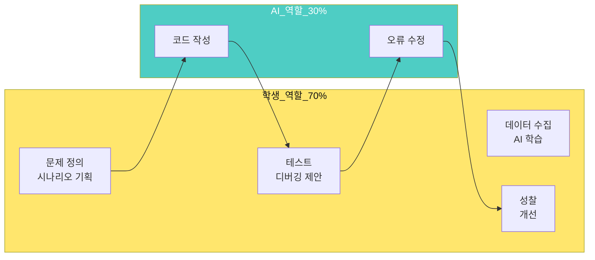

# 스마트 물류 팩토리 시스템 - 28차시 집중 교육 프로그램


## 📋 프로젝트 개요

**4일 집중 부트캠프**로 대학생 42명(21팀, 2인 1조)이 피지컬 컴퓨팅과 AI를 결합한 **스마트 물류 팩토리 시스템**을 제작합니다.

### 🎯 핵심 목표


---

## 📚 **[👉 전체 교육 커리큘럼 보기](./교육_커리큘럼.md)**

**28차시 전체 일정, 세부 실습 내용, 코드 예제, 3가지 시나리오가 모두 포함되어 있습니다.**

---

## 🛠️ 교구재

### 기본 구성

| 항목 | 수량 | 교구재 | 링크 |
|------|------|--------|------|
| **로봇팔** | 21세트 | 4축 로봇팔 (4DOF) | [BP Lab](https://bplab.kr/order/?idx=178) |
| **스마트 팩토리** | 21세트 | 자동 분류 시스템 | [에듀이노](https://eduino.kr/product/detail.html?product_no=2335&cate_no=216&display_group=1) |

### 특징 및 제약사항

| 구성 요소 | 특징 | 주의사항 |
|----------|------|----------|
| **로봇팔 (4DOF)** | 4축 서보모터, 그리퍼, 아두이노 우노 | ⚠️ 팔꿈치(3축) 토크 부족, 가벼운 물체만 가능 |
| **스마트 팩토리** | 컨베이어 벨트, DC 모터, 기본 센서 | 타이밍 조절 필요 (아두이노 순차 처리) |

**해결 전략**:
- 스펀지 블록, 종이컵 등 **가벼운 물체** 사용
- 팔꿈치 각도 **45-135도로 제한**
- 상태 머신으로 **비블로킹 코드** 작성

---

## 📅 4일 일정 요약

| 날짜 | 시간 | 주제 | 목표 |
|------|------|------|------|
| **Day 1** | 8h | 로봇팔 마스터 | 4축 로봇팔 제어 + 앱 원격 제어 |
| **Day 2** | 8h | 스마트 팩토리 | 센서 자동화 + 모니터링 앱 |
| **Day 3** | 8h | 통합 시스템 | 로봇팔+팩토리+AI 통합 + 발표 준비 |
| **Day 4** | 4h | 발표 및 전시 | 시연, 평가, 시상, 성찰 |

**세부 일정은 [교육_커리큘럼.md](./교육_커리큘럼.md)를 참고하세요.**

---

## 🎓 바이브 코딩 (VIBE Coding)

### 학습 철학

> **"코딩은 AI가, 기획과 성찰은 학생이!"**



### 역할 분담

| 누가 | 무엇을 | 예시 |
|------|--------|------|
| **👨 학생** | 기획, 설계, 데이터 수집, 테스트, 성찰 | "로봇팔이 물체를 3단계로 집게 해줘" |
| **🤖 AI** | 코드 작성, 디버깅, 최적화 | [서보모터 제어 코드 작성] |

**핵심**: 학생은 **"무엇을 만들지"** 생각하고, AI는 **"어떻게 만들지"** 실행합니다.

---

## 🎯 3가지 기본 시나리오

각 팀은 아래 3가지 중 1개를 선택하고, 발전시킵니다.

### 1. AI 기반 입고 시스템 ⭐⭐ (추천)

**개요**: AI 카메라로 물체 인식 → 로봇팔 집기 → 센서로 자동 분류

**필요 기술**:
- ✅ Teachable Machine (빨강/파랑 인식)
- ✅ 로봇팔 집기 동작
- ✅ IR 센서 + 컬러 센서
- ✅ 앱인벤터 모니터링

**장점**: AI + 센서 하이브리드, 완성도 높음

---

### 2. 센서 기반 자동 분류 ⭐ (쉬움)

**개요**: 물체 수동 투입 → 센서가 색상 감지 → 자동 분류

**필요 기술**:
- ✅ IR 센서 (물체 감지)
- ✅ 컬러 센서 (색상 인식)
- ✅ 서보모터 (게이트 제어)
- ❌ AI 불필요

**장점**: 구현 간단, 안정적

---

### 3. 음성 명령 물류 시스템 ⭐⭐⭐ (도전)

**개요**: "빨간색 3개" 음성 명령 → AI 인식 → 로봇팔 자동 수집

**필요 기술**:
- ✅ 앱인벤터 Speech Recognition
- ✅ Teachable Machine
- ✅ 로봇팔 + 센서
- ✅ TextToSpeech (완료 알림)

**장점**: 가장 미래지향적, 차별화

**상세 플로우차트는 [교육_커리큘럼.md](./교육_커리큘럼.md)를 참고하세요.**

---

## 💡 핵심 학습 포인트

### 1. 4축 로봇팔 제약 극복

| 축 | 기능 | 제약 | 해결 |
|---|------|------|------|
| 1축 (베이스) | 회전 | 안정적 | ✅ 적극 활용 |
| 2축 (어깨) | 상하 | 부하 시 떨림 | ⚠️ 가벼운 물체 |
| 3축 (팔꿈치) | 굽힘 | **토크 부족** | ❌ 제한적 사용 |
| 4축 (그리퍼) | 집기 | 안정적 | ✅ 적극 활용 |

**핵심 전략**: 어깨만으로 상하 이동, 팔꿈치 90도 고정

---

### 2. AI vs 센서: 언제 무엇을?

| 상황 | 센서 기반 | AI 기반 | 권장 |
|------|----------|---------|------|
| 물체 유무 감지 | ⚡ IR (0.01초) | ❌ 느림 | **센서** |
| 색상 단순 구분 | ✅ 컬러 센서 | ⚠️ 조명 의존 | **센서** |
| 복잡한 분류 | ❌ 한계 | ✅ AI | **AI** |
| 불량품 판정 | ❌ 불가능 | ✅ AI | **AI** |

**하이브리드 전략**: 센서로 1차 필터링 → AI로 정밀 판단 → 센서로 검증 = **정확도 99%**

---

### 3. 타이밍 동기화 (중요!)

**문제**: 아두이노는 순차 처리라서 `delay()` 사용 시 센서를 읽을 수 없음

**해결**: 상태 머신(State Machine) + `millis()` 사용

```cpp
enum State { IDLE, DETECTING, PICKING, SORTING };
State currentState = IDLE;

void loop() {
  switch(currentState) {
    case IDLE:
      // 센서 계속 체크 가능
      if (조건) currentState = DETECTING;
      break;
    // ...
  }
}
```

---

## 📊 평가 기준

| 항목 | 배점 | 세부 기준 |
|------|------|----------|
| **시스템 완성도** | 30점 | 하드웨어 작동, 소프트웨어 안정성, 통합 |
| **기술 이해도** | 25점 | 피지컬 컴퓨팅, AI/센서 활용, 문제 해결 |
| **창의성** | 20점 | 독창적 아이디어, 개선 시도 |
| **발표력** | 15점 | 전달력, 시각 자료, 질의응답 |
| **협업** | 10점 | 역할 분담, 팀워크 |

---

## 🚀 빠른 시작

### 교사 준비 사항

- [ ] 교구재 21세트 도착 확인
- [ ] 사전 조립 및 테스트 (1세트)
- [ ] 추가 센서 구매 (IR, 컬러, 초음파)
- [ ] 아두이노 IDE 설치 (PC 21대)
- [ ] 앱인벤터 계정 생성 안내
- [ ] 예제 코드 준비

### 학생 준비 사항

- [ ] 안드로이드 스마트폰 (팀당 1대)
- [ ] 노트북/PC (팀당 1대)
- [ ] USB 케이블
- [ ] 성찰 노트

---

## 📚 참고 자료

### 온라인 리소스

| 자료 | 링크 | 설명 |
|------|------|------|
| **전체 커리큘럼** | [교육_커리큘럼.md](./교육_커리큘럼.md) | 세부 일정, 코드 예제, 시나리오 |
| **Teachable Machine** | [teachablemachine.withgoogle.com](https://teachablemachine.withgoogle.com) | AI 모델 학습 |
| **MIT App Inventor** | [ai2.appinventor.mit.edu](http://ai2.appinventor.mit.edu) | 앱 개발 |
| **TMIC Extension** | [computacaonaescola.ufsc.br](https://computacaonaescola.ufsc.br/en/tmic/) | TM ↔ 앱인벤터 |
| **Arduino 문서** | [arduino.cc](https://www.arduino.cc/) | 코드 레퍼런스 |

### 문서 구조

```
📁 프로젝트/
  📄 README.md (이 파일) - 프로젝트 개요
  📄 교육_커리큘럼.md - 28차시 상세 커리큘럼 ⭐
  📁 docs/ - 추가 참고 자료
  📁 movies/ - 스마트 팩토리 영상
```

---

## 🌟 마지막 당부

```
"이 28시간은 완벽한 코딩 실력을 키우는 시간이 아닙니다.

AI 시대에 필요한 진짜 능력을 기르는 시간입니다:
- 문제를 발견하고 정의하는 능력
- 시스템을 설계하는 능력
- AI에게 정확히 지시하는 능력
- 실패를 분석하고 개선하는 능력
- 팀원과 협력하는 능력

10년 후, 여러분은 AI를 활용하여
더 복잡한 시스템을 만들고 있을 것입니다.

지금 이 경험이 그 시작입니다."
```

**자, 28시간의 여정을 시작해볼까요? 🚀**

---

## 📞 FAQ

**Q: 코딩 경험이 없는데 가능한가요?**  
A: 가능합니다! 바이브 코딩 방식에서는 학생이 "이렇게 작동했으면 좋겠어"라고 한글로 설명하면, AI가 코드를 작성합니다.

**Q: 4축 로봇팔로 무거운 물체를 들 수 있나요?**  
A: 팔꿈치 토크가 약해서 무거운 물체는 어렵습니다. 스펀지 블록, 종이컵 등 가벼운 물체를 사용하세요.

**Q: 21개 팀을 4일 만에 완성할 수 있나요?**  
A: 3가지 기본 시나리오를 제공하므로, 각 팀이 1개를 선택하여 발전시키면 충분히 가능합니다.

**Q: AI 정확도가 낮으면 어떻게 하나요?**  
A: 센서로 검증하는 하이브리드 방식을 사용하면 정확도를 99%까지 높일 수 있습니다.

**Q: 발표는 어떻게 준비하나요?**  
A: Day 3에 발표 자료 제작 시간이 포함되어 있으며, 5분 발표 구조를 제공합니다.

---

**Last Updated**: 2026-01-22  
**Version**: 2.0 (교육 커리큘럼 통합 버전)  
**Contributors**: Smart Factory Education Team

**문의**: AI 시대를 준비하는 메이커들을 응원합니다! 🎓🤖
