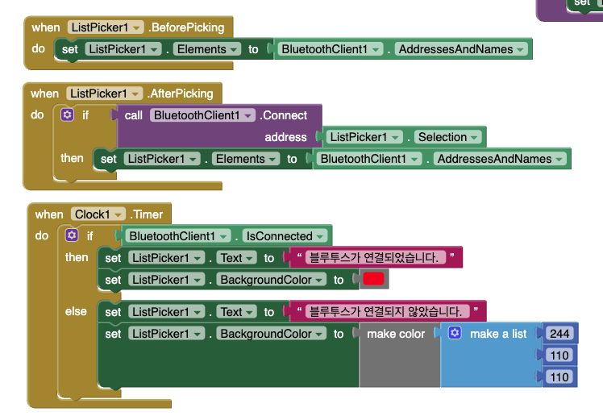
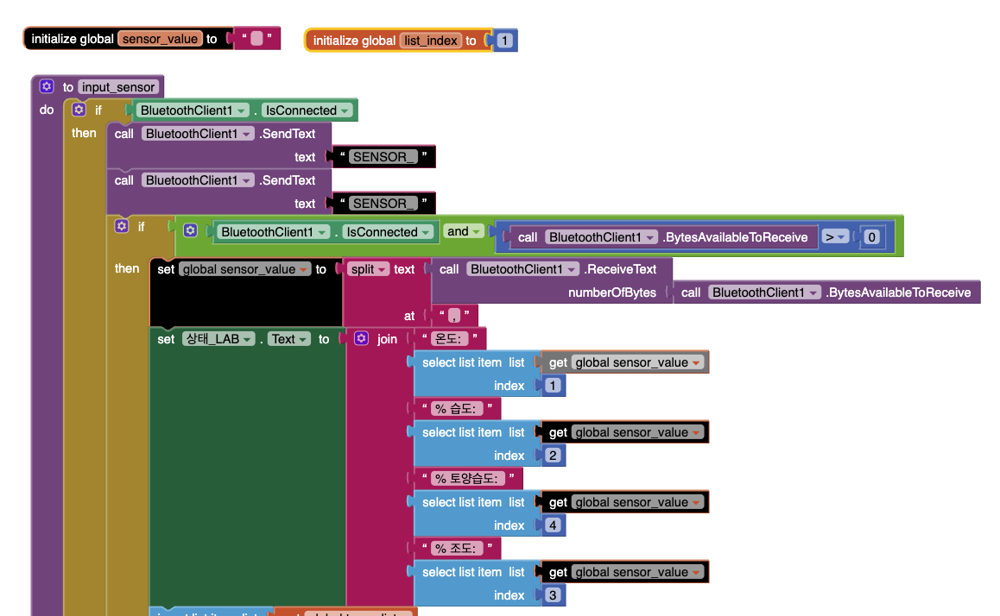

# 앱인벤터 로봇 팔 제어 프로젝트

## 📱 프로젝트 개요

MIT App Inventor를 사용하여 Bluetooth로 로봇 팔을 제어하는 안드로이드 앱 프로젝트입니다.

### 주요 기능
- ✅ Bluetooth 무선 제어
- ✅ 슬라이더로 각도 조정
- ✅ 시퀀스 자동 실행
- ✅ 음성 인식 제어 (STT)
- ✅ AI 비전 (Teachable Machine)

---

## 📂 프로젝트 파일

### 1. 기본 제어 앱
```
Robot_Arm.aia / Robot_Arm.apk
  - 기본 로봇 팔 제어
  - 슬라이더 4개 (베이스, 팔꿈치, 손목, 그립)
  - 저장/재생 기능
  - 시퀀스 제어
```

**주요 기능:**
- Bluetooth 연결/해제
- 실시간 각도 조정
- 위치 저장 및 재생
- 자동 반복 모드

### 2. 음성 인식 앱
```
Robot_Arm_STT.aia / Robot_Arm_STT.apk
  - 음성 명령으로 제어
  - "초기 위치", "물건 집어", "놓아" 등
  - 한글 음성 인식
```

**지원 명령:**
- "초기 위치" → 90,110,150,5_
- "물건 집어" → 시퀀스 시작
- "놓아" → 그립 열기
- "왼쪽" / "오른쪽" → 회전

### 3. AI 비전 + 음성 앱
```
Robot_Arm_STT_TeachableMachine.aia / Robot_Arm_STT_TeachableMachine.apk
  - Teachable Machine 연동
  - 색상 인식 자동 분류
  - 음성 + 비전 통합 제어
```

**AI 기능:**
- 카메라로 물체 색상 인식
- 빨간색 → 왼쪽 박스
- 파란색 → 오른쪽 박스
- 자동 분류 시퀀스

### 4. 공장 자동화 앱
```
factory.aia / factory.apk
  - 스마트 팩토리 시뮬레이션
  - 컨베이어 + 로봇 팔 통합
  - 센서 데이터 모니터링
```

### 5. Teachable Machine 확장
```
TM/App_RecyclingTrash_Final_v50.aia
  - 재활용 쓰레기 분류
  - br.ufsc.gqs.teachablemachineimageclassifier.aix
  - 이미지 분류 확장 기능
```

---

## 🚀 빠른 시작

### 1단계: 프로젝트 열기
```
1. MIT App Inventor 접속
   https://appinventor.mit.edu/

2. Projects → Import project (.aia)

3. Robot_Arm.aia 선택

4. 프로젝트 열림!
```

### 2단계: 앱 테스트
```
방법 1: AI Companion (권장)
  - 스마트폰에 "MIT AI2 Companion" 설치
  - Connect → AI Companion
  - QR 코드 스캔

방법 2: APK 설치
  - Build → Android App (.apk)
  - 다운로드 후 설치
```

### 3단계: 로봇 팔 연결
```
1. 아두이노에 06번 코드 업로드
2. 외부 5V 전원 연결
3. 앱에서 Bluetooth 연결
4. HC-05/06 선택
5. "전송" 버튼으로 테스트
```

---

## 📖 문서 가이드

### 1. 기본 기능 (필수!) ⭐
- **[앱인벤터_기본기능_가이드.md](./앱인벤터_기본기능_가이드.md)**
  - 기본 UI 사용법 (버튼, 레이블, 슬라이더 등)
  - Bluetooth 통신 상세
  - TinyDB 데이터 저장
  - 차트 그리기
  - 미디어 사용 (카메라, 음성인식, 바코드 등)
  - HTTP 통신 (GET, POST, REST API)

### 2. 로봇 팔 제어
- **[앱인벤터_사용가이드.md](./앱인벤터_사용가이드.md)**
  - Bluetooth 연결
  - 로봇 팔 제어
  - 시퀀스 제어 (1초 간격)
  - 실전 예제

### 3. 빠른 시작
- **[빠른시작_가이드.md](./빠른시작_가이드.md)**
  - 5분 안에 앱 만들기
  - 물건 집기 예제
  - 자주 하는 실수

### 4. Clock 사용법 (중요!)
- **[Clock_시간지연_가이드.md](./Clock_시간지연_가이드.md)**
  - delay 대신 Clock 사용
  - 시퀀스 제어 패턴
  - 고급 기법

---

## 🎯 핵심 개념

### ⚠️ 앱인벤터에는 delay가 없습니다!

```
❌ 없는 함수:
   delay(1000)
   sleep(1)
   wait(1000)

✅ 대신 Clock 사용:
   Clock1.TimerInterval = 1000 (1초)
   Clock1.TimerEnabled = true
```

### Clock으로 1초 간격 시퀀스

```
전역 변수:
  initialize global step to 0

Button_Start.Click:
  set global step to 1
  call executeStep
  set Clock1.TimerEnabled to true

Clock1.Timer:
  set global step to (global step + 1)
  call executeStep
  
  if global step > 5
  then
    set Clock1.TimerEnabled to false

Procedure executeStep:
  if global step = 1
  then
    call BluetoothClient1.SendText("90,110,150,5_")
  else if global step = 2
  then
    call BluetoothClient1.SendText("90,150,120,5_")
  // ... 계속
```

**동작:**
```
버튼 클릭 → 1단계 즉시 → 1초 → 2단계 → 1초 → 3단계 → ...
```

---

## 🖼️ 참고 이미지

### 블루투스 연결

- ListPicker로 기기 선택
- Connect 메서드 사용
- 연결 상태 표시

### 블루투스 동작 제어
.png)
- SendText로 명령 전송
- 버튼 클릭 이벤트
- 각도 데이터 전송

### 센서 입력 처리

- ReceiveText로 데이터 수신
- Clock으로 주기적 확인
- 센서 값 표시

---

## 🔧 아두이노 연동

### 명령 형식
```
각도 제어: "90,110,150,5_"
  - 베이스: 90도
  - 팔꿈치: 110도
  - 손목: 150도
  - 그립: 5도

저장/재생:
  - "save_"  : 현재 위치 저장
  - "play_"  : 1회 재생
  - "auto_"  : 자동 반복
  - "stop_"  : 중지
  - "clear_" : 전체 삭제
  - "list_"  : 목록 출력
```

### 아두이노 코드
```
arduino_code/day1_arm_system/06_bluetooth_direct_angle_control/
  - Serial & Bluetooth 동시 지원
  - 각도 직접 제어
  - EEPROM 저장
```

---

## 💡 실전 예제

### 예제 1: 물건 집기 (8단계)

```
Button_PickUp.Click:
  set global step to 1
  call doStep
  set Clock1.TimerEnabled to true

Clock1.Timer:
  set global step to (global step + 1)
  if global step <= 8
  then call doStep
  else set Clock1.TimerEnabled to false

Procedure doStep:
  if global step = 1
  then call BluetoothClient1.SendText("90,110,150,5_")
  else if global step = 2
  then call BluetoothClient1.SendText("90,150,120,5_")
  else if global step = 3
  then call BluetoothClient1.SendText("90,150,120,40_")
  // ... 8단계까지
```

### 예제 2: 좌우 스캔

```
전역 변수:
  initialize global scanAngles to make a list
    item: "0,110,150,5_"
    item: "45,110,150,5_"
    item: "90,110,150,5_"
    item: "135,110,150,5_"
    item: "180,110,150,5_"

Button_Scan.Click:
  set global index to 1
  call sendScanCommand
  set Clock_Scan.TimerEnabled to true

Clock_Scan.Timer:
  set global index to (global index + 1)
  if global index <= 5
  then call sendScanCommand
  else set Clock_Scan.TimerEnabled to false
```

### 예제 3: 색상 분류 (AI)

```
Button_Capture.Click:
  call Camera1.TakePicture

Camera1.AfterPicture:
  call ImageClassifier1.ClassifyImage(image)

ImageClassifier1.GotClassification:
  if result = "RED"
  then call BluetoothClient1.SendText("45,110,150,5_")
  else if result = "BLUE"
  then call BluetoothClient1.SendText("135,110,150,5_")
```

---

## 🛠️ 개발 환경

### 필요한 것
- MIT App Inventor 계정 (Google)
- 안드로이드 스마트폰
- Bluetooth 모듈 (HC-05/06)
- 아두이노 + 로봇 팔

### 권장 사양
- 안드로이드 5.0 이상
- Bluetooth 4.0 이상
- 카메라 (AI 비전 사용 시)

---

## 📚 학습 경로

### 1단계: 기본 제어
```
1. Robot_Arm.aia 열기
2. Bluetooth 연결 이해
3. 슬라이더로 각도 조정
4. 명령 전송 테스트
```

### 2단계: 시퀀스 제어
```
1. Clock 컴포넌트 이해
2. 단계별 실행 구현
3. 물건 집기 시퀀스
4. 일시정지/중지 기능
```

### 3단계: 음성 제어
```
1. SpeechRecognizer 추가
2. 음성 명령 정의
3. 명령어 매핑
4. 피드백 구현
```

### 4단계: AI 비전
```
1. Teachable Machine 학습
2. 모델 내보내기
3. ImageClassifier 연동
4. 자동 분류 구현
```

---

## ❓ 문제 해결

### Bluetooth 연결 안됨
```
1. 스마트폰 Bluetooth 켜기
2. HC-05/06 전원 확인
3. 페어링: 1234 또는 0000
4. 앱 권한 확인
```

### 명령이 전송 안됨
```
1. 연결 상태 확인
2. 명령 형식 확인 (언더스코어 필수)
3. 아두이노 Serial Monitor로 확인
```

### Clock이 작동 안함
```
1. TimerEnabled 확인
2. TimerInterval 확인 (1000 = 1초)
3. 중지 조건 확인
```

### AI 인식 안됨
```
1. 카메라 권한 확인
2. 모델 파일 확인
3. 조명 환경 개선
4. 재학습 고려
```

---

## 🔗 관련 리소스

### 공식 사이트
- MIT App Inventor: https://appinventor.mit.edu/
- 한글 튜토리얼: https://appinventor.mit.edu/explore/kr
- Teachable Machine: https://teachablemachine.withgoogle.com/

### 커뮤니티
- App Inventor Forum: https://community.appinventor.mit.edu/
- 한국 앱인벤터 카페: 네이버 카페 검색

### 아두이노 코드
- `arduino_code/day1_arm_system/06_bluetooth_direct_angle_control/`
- Serial & Bluetooth 통신 지원
- 각도 직접 제어

---

## 📝 라이센스

MIT License

---

## 🤝 기여

이슈 및 개선 제안은 환영합니다!

---

## 📧 문의

문제가 해결되지 않으면:
1. 문서 가이드 참고
2. 예제 파일 확인
3. Serial Monitor로 디버깅

**Happy Coding! 📱🤖**

