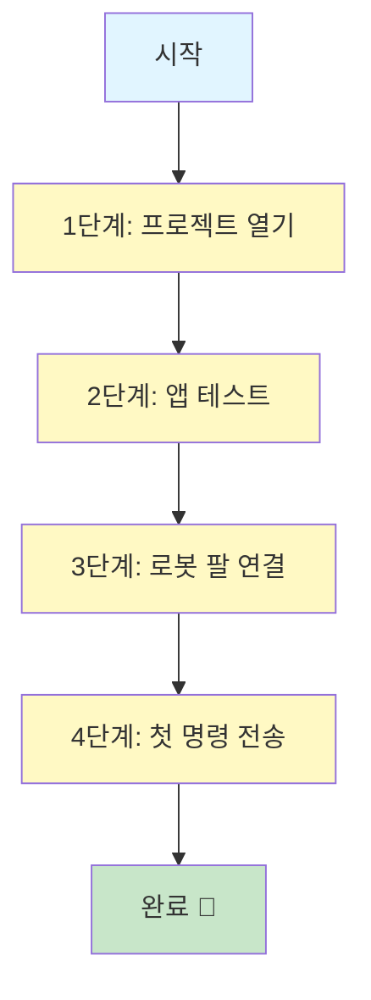
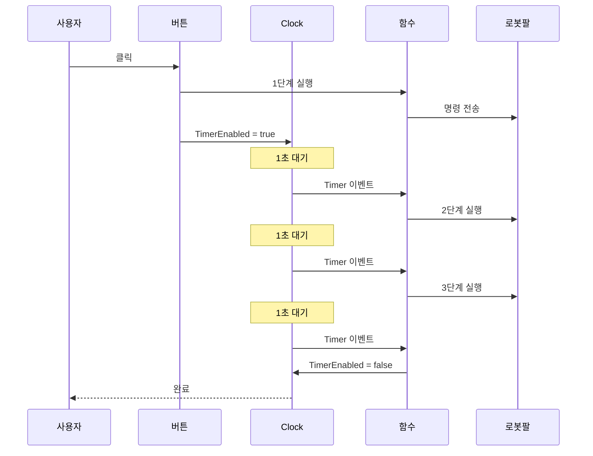
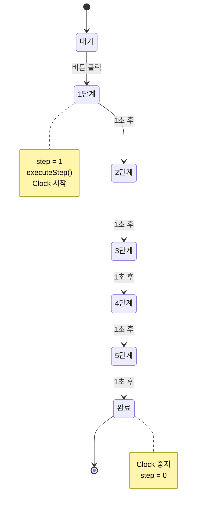
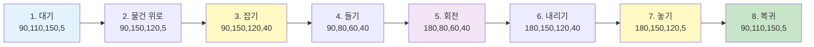
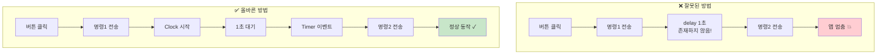
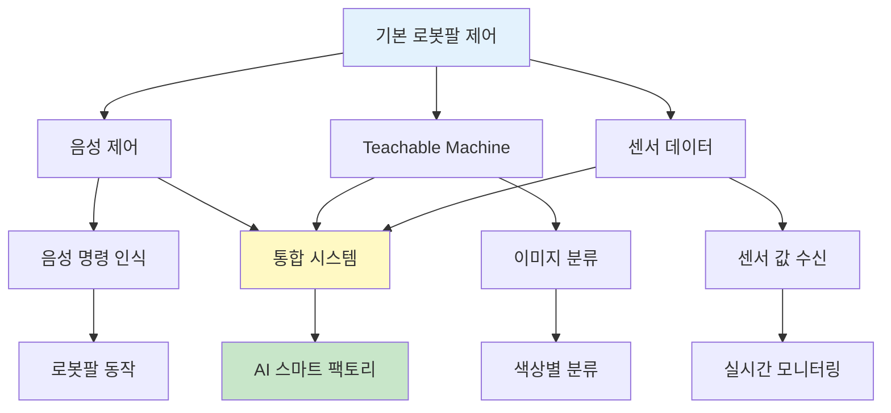
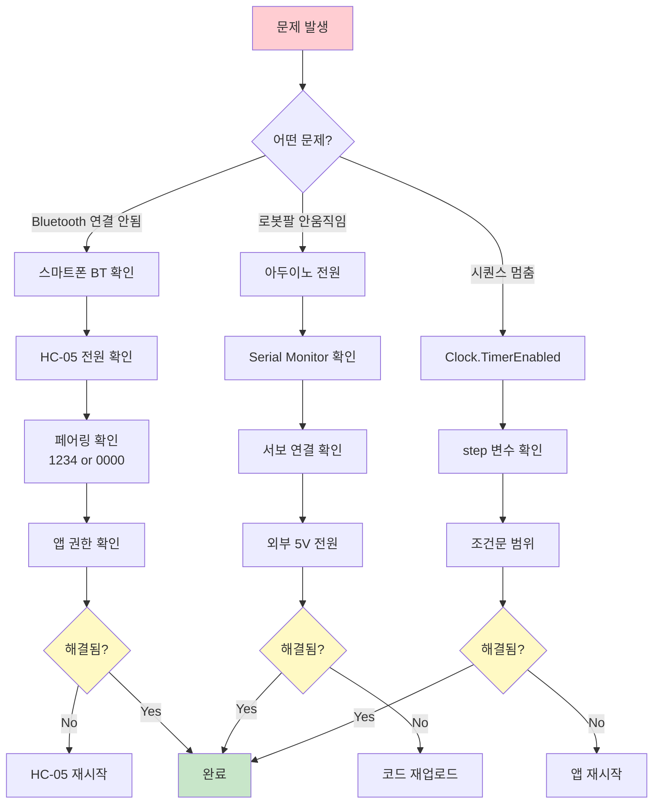
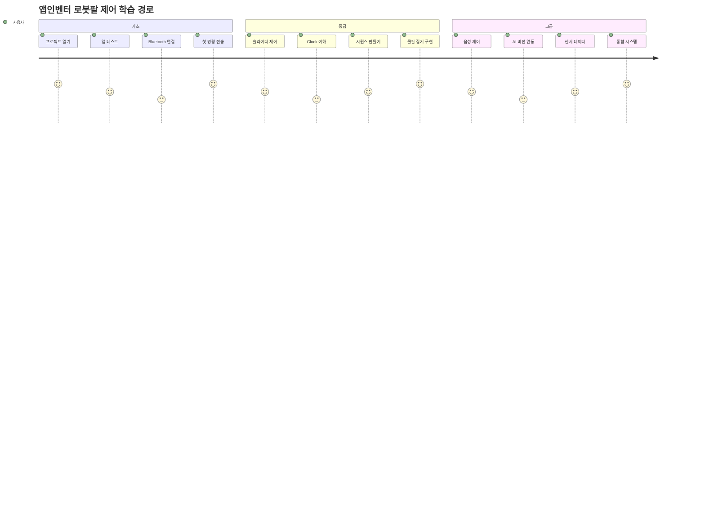

# 앱인벤터 빠른 시작 가이드

## 5분 안에 로봇 팔 제어 앱 만들기

### 전체 흐름도



### 1단계: 프로젝트 열기 (1분)

1. MIT App Inventor 접속: https://appinventor.mit.edu/
2. 로그인 (Google 계정)
3. **Projects → Import project (.aia) from my computer**
4. `Robot_Arm.aia` 파일 선택
5. 프로젝트 열림!

---

### 2단계: 앱 테스트하기 (2분)

#### 방법 1: AI Companion (권장)
```
1. 스마트폰에 "MIT AI2 Companion" 앱 설치
2. 앱인벤터에서 "Connect → AI Companion" 클릭
3. QR 코드 스캔 또는 코드 입력
4. 앱이 스마트폰에 로드됨!
```

#### 방법 2: APK 설치
```
1. Build → Android App (.apk)
2. QR 코드 스캔 또는 다운로드
3. 스마트폰에 설치
```

---

### 3단계: 로봇 팔 연결 (1분)

```
1. 아두이노에 06번 코드 업로드
2. 외부 5V 전원 연결
3. 앱에서 "Bluetooth 연결" 버튼 클릭
4. HC-05 또는 HC-06 선택
5. "연결됨" 표시 확인
```

---

### 4단계: 첫 명령 전송 (1분)

```
1. 슬라이더로 각도 조정
   - 베이스: 90
   - 팔꿈치: 110
   - 손목: 150
   - 그립: 5

2. "전송" 버튼 클릭

3. 로봇 팔이 움직임! 🎉
```

---

## 핵심 개념: Clock으로 시간 지연

### Clock 동작 원리



### ⚠️ 앱인벤터에는 delay가 없습니다!

```
❌ 이런 함수는 없음:
   delay(1000)
   sleep(1)
   wait(1000)

✅ 대신 Clock 사용:
   Clock1.TimerInterval = 1000 (1초)
   Clock1.TimerEnabled = true
```

---

## 1초 간격 시퀀스 만들기

### 블록 구성 (복사해서 사용)

#### 1. 전역 변수 만들기
```
initialize global step to 0
```

#### 2. 시작 버튼
```
Button_Start.Click:
  set global step to 1
  call executeStep
  set Clock1.TimerEnabled to true
```

#### 3. Clock 타이머
```
Clock1.Timer:
  set global step to (global step + 1)
  call executeStep
  
  if global step > 5
  then
    set Clock1.TimerEnabled to false
    set global step to 0
```

#### 4. 단계 실행
```
Procedure executeStep:
  if global step = 1
  then
    call BluetoothClient1.SendText("90,110,150,5_")
    
  else if global step = 2
  then
    call BluetoothClient1.SendText("90,150,120,5_")
    
  else if global step = 3
  then
    call BluetoothClient1.SendText("90,150,120,40_")
    
  else if global step = 4
  then
    call BluetoothClient1.SendText("90,80,60,40_")
    
  else if global step = 5
  then
    call BluetoothClient1.SendText("180,80,60,40_")
```

### 동작 흐름



---

## 실전 예제: 물건 집기

### 물건 집기 시퀀스 다이어그램



### Designer (화면 구성)

```
Components:
  - BluetoothClient1
  - Clock1 (TimerInterval: 1000)
  - Button_PickUp (텍스트: "물건 집기")
  - Button_Stop (텍스트: "중지")
  - Label_Status (텍스트: "대기 중")
```

### Blocks (동작 구현)

```
전역 변수:
  initialize global step to 0

Button_PickUp.Click:
  set global step to 1
  call doStep
  set Clock1.TimerEnabled to true

Clock1.Timer:
  set global step to (global step + 1)
  
  if global step <= 8
  then
    call doStep
  else
    set Clock1.TimerEnabled to false
    set global step to 0
    set Label_Status.Text to "완료!"

Procedure doStep:
  if global step = 1
  then
    call BluetoothClient1.SendText("90,110,150,5_")
    set Label_Status.Text to "1/8: 대기"
    
  else if global step = 2
  then
    call BluetoothClient1.SendText("90,150,120,5_")
    set Label_Status.Text to "2/8: 물건 위로"
    
  else if global step = 3
  then
    call BluetoothClient1.SendText("90,150,120,40_")
    set Label_Status.Text to "3/8: 잡기"
    
  else if global step = 4
  then
    call BluetoothClient1.SendText("90,80,60,40_")
    set Label_Status.Text to "4/8: 들기"
    
  else if global step = 5
  then
    call BluetoothClient1.SendText("180,80,60,40_")
    set Label_Status.Text to "5/8: 회전"
    
  else if global step = 6
  then
    call BluetoothClient1.SendText("180,150,120,40_")
    set Label_Status.Text to "6/8: 내리기"
    
  else if global step = 7
  then
    call BluetoothClient1.SendText("180,150,120,5_")
    set Label_Status.Text to "7/8: 놓기"
    
  else if global step = 8
  then
    call BluetoothClient1.SendText("90,110,150,5_")
    set Label_Status.Text to "8/8: 복귀"

Button_Stop.Click:
  set Clock1.TimerEnabled to false
  set global step to 0
  set Label_Status.Text to "중지됨"
```

---

## 자주 하는 실수

### 실수 비교 다이어그램



### ❌ 실수 1: delay 사용 시도
```
// 이런 블록은 없습니다!
call delay(1000)  ❌
```

**해결:**
```
Clock1.TimerInterval = 1000
Clock1.TimerEnabled = true
```

### ❌ 실수 2: Clock을 켜고 끄지 않음
```
Clock1.Timer:
  call BluetoothClient1.SendText("90,110,150,5_")
  // Clock을 끄지 않으면 계속 반복됨! ❌
```

**해결:**
```
Clock1.Timer:
  call BluetoothClient1.SendText("90,110,150,5_")
  set Clock1.TimerEnabled to false  ✅
```

### ❌ 실수 3: step 초기화 안함
```
Button_Start.Click:
  // step을 초기화하지 않으면 이전 값에서 시작 ❌
  call doStep
```

**해결:**
```
Button_Start.Click:
  set global step to 1  ✅
  call doStep
```

---

## 치트 시트

### Clock 설정
```
1초 = 1000
0.5초 = 500
2초 = 2000
```

### 명령 형식
```
각도: "90,110,150,5_"
저장: "save_"
재생: "play_"
자동: "auto_"
중지: "stop_"
```

### 시퀀스 패턴
```
1. 전역 변수 step = 0
2. 버튼 클릭 → step = 1, Clock 시작
3. Clock.Timer → step++, 실행
4. step > 최대값 → Clock 중지
```

---

## 다음 단계

### 확장 기능 로드맵



### 1. 음성 제어 추가
```
Components:
  - SpeechRecognizer1

Button_Voice.Click:
  call SpeechRecognizer1.GetText

SpeechRecognizer1.AfterGettingText:
  if result = "초기 위치"
  then
    call BluetoothClient1.SendText("90,110,150,5_")
  else if result = "물건 집어"
  then
    // 시퀀스 시작
```

### 2. Teachable Machine 연동
```
Components:
  - Camera1
  - ImageClassifier1

Button_Capture.Click:
  set Camera1.TakePicture

Camera1.AfterPicture:
  call ImageClassifier1.ClassifyImage(image)

ImageClassifier1.GotClassification:
  if result = "빨간색"
  then
    call BluetoothClient1.SendText("45,110,150,5_")
  else if result = "파란색"
  then
    call BluetoothClient1.SendText("135,110,150,5_")
```

### 3. 센서 데이터 받기
```
Clock_Receive.Timer (매 100ms):
  if BluetoothClient1.BytesAvailableToReceive > 0
  then
    set data to BluetoothClient1.ReceiveText(-1)
    set Label_Sensor.Text to data
```

---

## 문제 해결

### 문제 해결 플로우차트



### Bluetooth 연결 안됨
```
1. 스마트폰 Bluetooth 켜기
2. HC-05/06 LED 깜빡임 확인
3. 페어링: 1234 또는 0000
4. 앱 권한 확인
```

### 로봇 팔이 안 움직임
```
1. 아두이노 전원 확인
2. Serial Monitor로 명령 확인
3. 서보 연결 확인
4. 외부 5V 전원 확인
```

### 시퀀스가 멈춤
```
1. Clock.TimerEnabled 확인
2. step 변수 값 확인
3. 조건문 범위 확인
```

---

## 프로젝트 파일

### 제공된 파일
```
Robot_Arm.aia
  - 기본 로봇 팔 제어
  - 슬라이더 + 버튼

Robot_Arm_STT.aia
  - 음성 인식 제어
  - "초기 위치", "물건 집어" 등

Robot_Arm_STT_TeachableMachine.aia
  - AI 비전 + 음성 제어
  - 색상 인식 자동 분류
```

### 이미지 참고
```
블루투스_연결.png
  - Bluetooth 연결 블록 예시

블루투스_동작(ON_OFF).png
  - 동작 제어 블록 예시

센서_입력.png
  - 센서 데이터 받기 예시
```

---

## 요약

### 학습 경로



### Clock으로 시간 지연 (핵심!)
```
1. Clock 컴포넌트 추가
2. TimerInterval = 1000 (1초)
3. TimerEnabled = true (시작)
4. Timer 이벤트에서 다음 동작
5. TimerEnabled = false (중지)
```

### 시퀀스 제어 3단계
```
1. 전역 변수 step
2. Clock.Timer에서 step++
3. Procedure로 단계 실행
```

### 명령 전송
```
call BluetoothClient1.SendText("90,110,150,5_")
```

**5분 만에 로봇 팔 제어 앱 완성! 🎉**

