# 앱인벤터 사용 가이드

## 목차
1. [기본 개념](#기본-개념)
2. [Bluetooth 연결](#bluetooth-연결)
3. [로봇 팔 제어](#로봇-팔-제어)
4. [시퀀스 제어 (1초 간격)](#시퀀스-제어-1초-간격)
5. [실전 예제](#실전-예제)

---

## 기본 개념

### 앱인벤터 구조

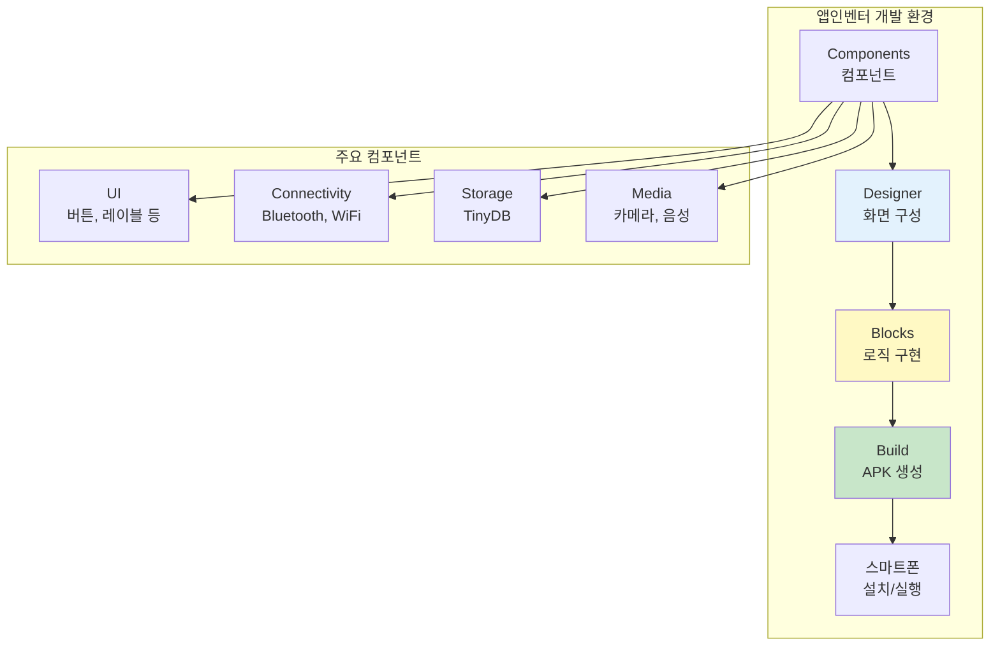

### 앱인벤터란?
- 블록 코딩으로 안드로이드 앱을 만드는 도구
- MIT에서 개발한 무료 교육용 플랫폼
- 프로그래밍 지식 없이도 앱 제작 가능

### 주요 구성 요소
1. **Designer (디자이너)**: UI 화면 구성
2. **Blocks (블록)**: 동작 로직 구현
3. **Components (컴포넌트)**: 버튼, 텍스트, Bluetooth 등

---

## Bluetooth 연결

### Bluetooth 연결 흐름도

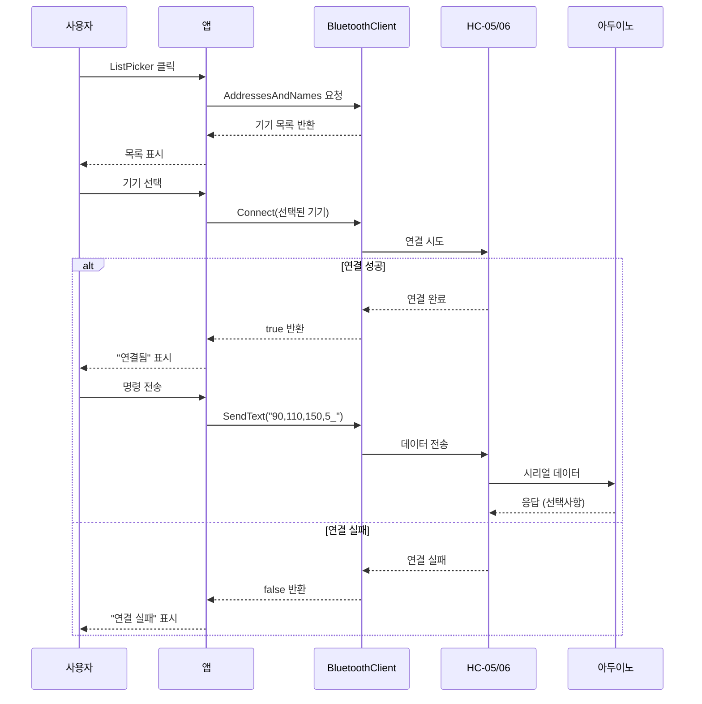

### 1. 필요한 컴포넌트

#### Connectivity (연결)
- **BluetoothClient1**: Bluetooth 통신 담당

#### User Interface (사용자 인터페이스)
- **ListPicker1**: Bluetooth 기기 선택
- **Button_Connect**: 연결 버튼
- **Label_Status**: 연결 상태 표시

### 2. Bluetooth 연결 블록

#### 기기 목록 가져오기
```
ListPicker1.BeforePicking 이벤트:
  set ListPicker1.Elements to BluetoothClient1.AddressesAndNames
```

**설명:**
- 사용 가능한 Bluetooth 기기 목록을 가져옴
- HC-05, HC-06 등이 표시됨

#### 기기 연결하기
```
ListPicker1.AfterPicking 이벤트:
  if BluetoothClient1.Connect(ListPicker1.Selection)
  then
    set Label_Status.Text to "연결됨"
    set Label_Status.BackgroundColor to 초록색
  else
    set Label_Status.Text to "연결 실패"
    set Label_Status.BackgroundColor to 빨간색
```

**설명:**
- 선택한 기기에 연결 시도
- 성공/실패에 따라 상태 표시

#### 연결 해제하기
```
Button_Disconnect.Click 이벤트:
  call BluetoothClient1.Disconnect
  set Label_Status.Text to "연결 해제됨"
```

### 3. 연결 확인

```
if BluetoothClient1.IsConnected
then
  // 연결되어 있을 때 동작
else
  // 연결 안되어 있을 때 경고
  call Notifier1.ShowAlert("Bluetooth를 먼저 연결하세요")
```

---

## 로봇 팔 제어

### 로봇 팔 제어 명령 구조

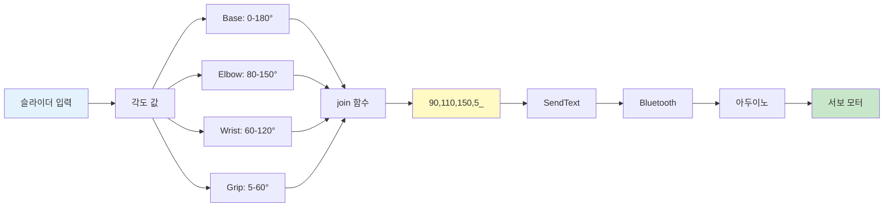

### 명령어 프로토콜

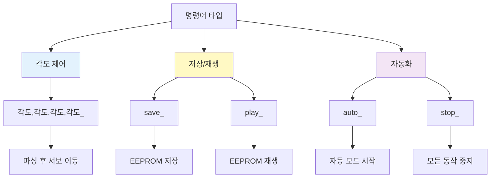

### 1. 기본 명령 전송

#### 각도 제어
```
Button_Move.Click 이벤트:
  set command to join(
    Slider_Base.Value,
    ",",
    Slider_Elbow.Value,
    ",",
    Slider_Wrist.Value,
    ",",
    Slider_Grip.Value,
    "_"
  )
  call BluetoothClient1.SendText(command)
```

**예시 출력:** `90,110,150,5_`

#### 저장/재생 명령
```
Button_Save.Click 이벤트:
  call BluetoothClient1.SendText("save_")

Button_Play.Click 이벤트:
  call BluetoothClient1.SendText("play_")

Button_Auto.Click 이벤트:
  call BluetoothClient1.SendText("auto_")

Button_Stop.Click 이벤트:
  call BluetoothClient1.SendText("stop_")
```

### 2. 슬라이더로 각도 제어

#### Designer 설정
```
Slider_Base:
  - MinValue: 0
  - MaxValue: 180
  - ThumbPosition: 90

Slider_Elbow:
  - MinValue: 80
  - MaxValue: 150
  - ThumbPosition: 110

Slider_Wrist:
  - MinValue: 60
  - MaxValue: 120
  - ThumbPosition: 90

Slider_Grip:
  - MinValue: 5
  - MaxValue: 60
  - ThumbPosition: 5
```

#### 실시간 각도 표시
```
Slider_Base.PositionChanged 이벤트:
  set Label_Base_Value.Text to Slider_Base.ThumbPosition
```

---

## 시퀀스 제어 (1초 간격)

### 시퀀스 제어 방법 비교

```mermaid
graph TB
    subgraph "방법 1: 단계별 실행 (권장)"
        A1[전역 변수 step] --> A2[버튼 클릭]
        A2 --> A3[step = 1]
        A3 --> A4[executeStep 호출]
        A4 --> A5[Clock 시작]
        A5 --> A6[Timer 이벤트]
        A6 --> A7[step++]
        A7 --> A8[executeStep 호출]
        A8 --> A9{step > 최대값?}
        A9 -->|No| A6
        A9 -->|Yes| A10[Clock 중지]
    end
    
    subgraph "방법 2: 리스트 사용"
        B1[commandList 배열] --> B2[currentIndex = 1]
        B2 --> B3[리스트에서 명령 가져오기]
        B3 --> B4[명령 전송]
        B4 --> B5[index++]
        B5 --> B6{index > 리스트 길이?}
        B6 -->|No| B3
        B6 -->|Yes| B7[완료]
    end
    
    style A4 fill:#c8e6c9
    style A10 fill:#e3f2fd
    style B3 fill:#fff9c4
    style B7 fill:#e3f2fd
```

### ⚠️ 중요: 앱인벤터에는 delay 함수가 없습니다!

앱인벤터에는 `delay()` 또는 `sleep()` 함수가 없습니다. 
대신 **Clock 컴포넌트**를 사용하여 시간 지연을 구현합니다.

### 1. Clock 컴포넌트 사용

#### Designer 설정
```
Clock1:
  - TimerEnabled: false (초기에는 꺼짐)
  - TimerInterval: 1000 (1초 = 1000ms)
```

### 2. 시퀀스 제어 방법

#### 방법 1: 단계별 실행 (권장)

```
전역 변수 초기화:
  initialize global step to 0

Button_Start_Sequence.Click 이벤트:
  set global step to 1
  call executeStep
  set Clock1.TimerEnabled to true

Clock1.Timer 이벤트:
  set global step to (global step + 1)
  call executeStep
  
  if global step > 5
  then
    set Clock1.TimerEnabled to false
    set global step to 0

Procedure executeStep:
  if global step = 1
  then
    // 1단계: 초기 위치
    call BluetoothClient1.SendText("90,110,150,5_")
    set Label_Status.Text to "1단계: 초기 위치"
    
  else if global step = 2
  then
    // 2단계: 물건 위로 이동
    call BluetoothClient1.SendText("90,150,120,5_")
    set Label_Status.Text to "2단계: 물건 위로"
    
  else if global step = 3
  then
    // 3단계: 그립 닫기
    call BluetoothClient1.SendText("90,150,120,40_")
    set Label_Status.Text to "3단계: 잡기"
    
  else if global step = 4
  then
    // 4단계: 들어올리기
    call BluetoothClient1.SendText("90,80,60,40_")
    set Label_Status.Text to "4단계: 들어올리기"
    
  else if global step = 5
  then
    // 5단계: 회전
    call BluetoothClient1.SendText("180,80,60,40_")
    set Label_Status.Text to "5단계: 회전"
```

**동작 흐름:**

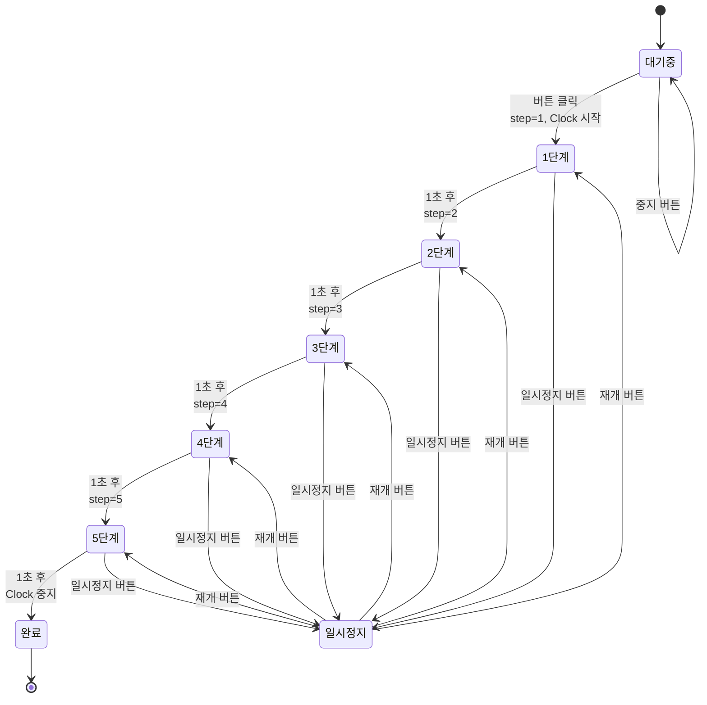

#### 방법 2: 리스트 사용

```
전역 변수 초기화:
  initialize global commandList to create empty list
  initialize global currentIndex to 0

Screen1.Initialize 이벤트:
  set global commandList to make a list
    item: "90,110,150,5_"
    item: "90,150,120,5_"
    item: "90,150,120,40_"
    item: "90,80,60,40_"
    item: "180,80,60,40_"

Button_Start_Sequence.Click 이벤트:
  set global currentIndex to 1
  call sendNextCommand
  set Clock1.TimerEnabled to true

Clock1.Timer 이벤트:
  set global currentIndex to (global currentIndex + 1)
  
  if global currentIndex <= length of list global commandList
  then
    call sendNextCommand
  else
    set Clock1.TimerEnabled to false
    set global currentIndex to 0
    set Label_Status.Text to "시퀀스 완료"

Procedure sendNextCommand:
  set command to select list item
    list: global commandList
    index: global currentIndex
  call BluetoothClient1.SendText(command)
  set Label_Status.Text to join("단계 ", global currentIndex, "/", length of list global commandList)
```

#### 방법 3: 여러 Clock 사용 (복잡한 시퀀스)

```
Clock1:
  - TimerInterval: 1000 (1초)
  - TimerEnabled: false

Clock2:
  - TimerInterval: 2000 (2초)
  - TimerEnabled: false

Button_Start.Click 이벤트:
  // 즉시 실행
  call BluetoothClient1.SendText("90,110,150,5_")
  // 1초 후 실행 예약
  set Clock1.TimerEnabled to true

Clock1.Timer 이벤트:
  set Clock1.TimerEnabled to false
  call BluetoothClient1.SendText("90,150,120,5_")
  // 2초 후 실행 예약
  set Clock2.TimerEnabled to true

Clock2.Timer 이벤트:
  set Clock2.TimerEnabled to false
  call BluetoothClient1.SendText("90,150,120,40_")
```

### 3. 일시 정지 및 중지

```
Button_Pause.Click 이벤트:
  set Clock1.TimerEnabled to false
  set Label_Status.Text to "일시 정지"

Button_Resume.Click 이벤트:
  set Clock1.TimerEnabled to true
  set Label_Status.Text to "재개"

Button_Stop.Click 이벤트:
  set Clock1.TimerEnabled to false
  set global step to 0
  call BluetoothClient1.SendText("stop_")
  set Label_Status.Text to "중지됨"
```

---

## 실전 예제

### 예제 개요

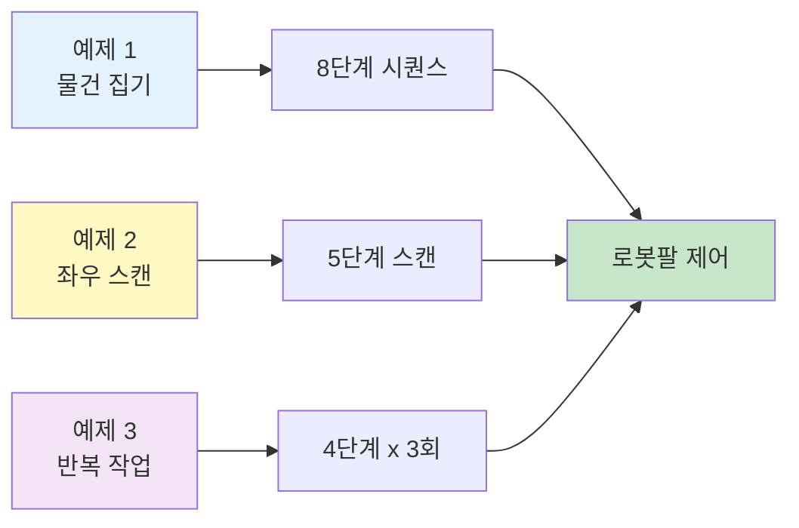

### 예제 1: 물건 집기 시퀀스

#### 물건 집기 프로세스

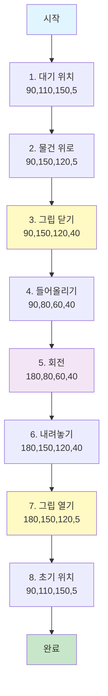

#### Designer 구성
```
Components:
  - BluetoothClient1
  - Clock_Sequence (TimerInterval: 1000)
  - Button_PickUp
  - Button_Stop
  - Label_Status
```

#### Blocks 구현
```
전역 변수:
  initialize global pickupStep to 0

Button_PickUp.Click:
  if BluetoothClient1.IsConnected
  then
    set global pickupStep to 1
    call executePickupStep
    set Clock_Sequence.TimerEnabled to true
  else
    call Notifier1.ShowAlert("Bluetooth 연결 필요")

Clock_Sequence.Timer:
  set global pickupStep to (global pickupStep + 1)
  
  if global pickupStep <= 8
  then
    call executePickupStep
  else
    set Clock_Sequence.TimerEnabled to false
    set global pickupStep to 0
    set Label_Status.Text to "완료"

Procedure executePickupStep:
  if global pickupStep = 1
  then
    call BluetoothClient1.SendText("90,110,150,5_")
    set Label_Status.Text to "1/8: 대기 위치"
    
  else if global pickupStep = 2
  then
    call BluetoothClient1.SendText("90,150,120,5_")
    set Label_Status.Text to "2/8: 물건 위로"
    
  else if global pickupStep = 3
  then
    call BluetoothClient1.SendText("90,150,120,40_")
    set Label_Status.Text to "3/8: 잡기"
    
  else if global pickupStep = 4
  then
    call BluetoothClient1.SendText("90,80,60,40_")
    set Label_Status.Text to "4/8: 들어올리기"
    
  else if global pickupStep = 5
  then
    call BluetoothClient1.SendText("180,80,60,40_")
    set Label_Status.Text to "5/8: 회전"
    
  else if global pickupStep = 6
  then
    call BluetoothClient1.SendText("180,150,120,40_")
    set Label_Status.Text to "6/8: 내려놓기"
    
  else if global pickupStep = 7
  then
    call BluetoothClient1.SendText("180,150,120,5_")
    set Label_Status.Text to "7/8: 놓기"
    
  else if global pickupStep = 8
  then
    call BluetoothClient1.SendText("90,110,150,5_")
    set Label_Status.Text to "8/8: 초기 위치"

Button_Stop.Click:
  set Clock_Sequence.TimerEnabled to false
  set global pickupStep to 0
  call BluetoothClient1.SendText("stop_")
  set Label_Status.Text to "중지됨"
```

### 예제 2: 좌우 스캔

#### 스캔 패턴

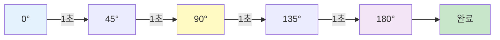

```
전역 변수:
  initialize global scanAngles to create empty list
  initialize global scanIndex to 0

Screen1.Initialize:
  set global scanAngles to make a list
    item: "0,110,150,5_"
    item: "45,110,150,5_"
    item: "90,110,150,5_"
    item: "135,110,150,5_"
    item: "180,110,150,5_"

Button_Scan.Click:
  set global scanIndex to 1
  call sendScanCommand
  set Clock_Scan.TimerEnabled to true

Clock_Scan.Timer:
  set global scanIndex to (global scanIndex + 1)
  
  if global scanIndex <= length of list global scanAngles
  then
    call sendScanCommand
  else
    set Clock_Scan.TimerEnabled to false
    set global scanIndex to 0

Procedure sendScanCommand:
  set angle to select list item
    list: global scanAngles
    index: global scanIndex
  call BluetoothClient1.SendText(angle)
  set Label_Status.Text to join("스캔 ", global scanIndex, "/5")
```

### 예제 3: 반복 작업

#### 반복 작업 사이클

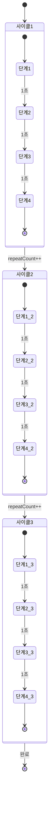

```
전역 변수:
  initialize global repeatCount to 0
  initialize global maxRepeat to 3
  initialize global taskStep to 0

Button_Repeat.Click:
  set global repeatCount to 0
  set global taskStep to 1
  call executeTask
  set Clock_Repeat.TimerEnabled to true

Clock_Repeat.Timer:
  set global taskStep to (global taskStep + 1)
  
  if global taskStep > 4
  then
    // 한 사이클 완료
    set global repeatCount to (global repeatCount + 1)
    set global taskStep to 1
    
    if global repeatCount >= global maxRepeat
    then
      // 모든 반복 완료
      set Clock_Repeat.TimerEnabled to false
      set Label_Status.Text to "반복 완료"
    else
      // 다음 사이클 시작
      set Label_Status.Text to join("반복 ", global repeatCount + 1, "/", global maxRepeat)
  
  call executeTask

Procedure executeTask:
  if global taskStep = 1
  then
    call BluetoothClient1.SendText("90,110,150,5_")
  else if global taskStep = 2
  then
    call BluetoothClient1.SendText("90,150,120,40_")
  else if global taskStep = 3
  then
    call BluetoothClient1.SendText("180,150,120,40_")
  else if global taskStep = 4
  then
    call BluetoothClient1.SendText("180,150,120,5_")
```

---

## 기본 UI 레이아웃

### 권장 화면 구성

```
┌─────────────────────────────┐
│  로봇 팔 제어 앱             │
├─────────────────────────────┤
│  [Bluetooth 연결]            │
│  상태: 연결됨 ●              │
├─────────────────────────────┤
│  베이스:  [━━●━━━━━] 90°    │
│  팔꿈치:  [━━━●━━━━] 110°   │
│  손목:    [━━━━━●━━] 150°   │
│  그립:    [●━━━━━━━] 5°     │
│                              │
│  [전송]  [저장]  [재생]     │
├─────────────────────────────┤
│  시퀀스 제어                 │
│  [물건 집기] [스캔] [반복]  │
│  [일시정지] [중지]           │
│                              │
│  진행: 3/8 단계              │
├─────────────────────────────┤
│  빠른 동작                   │
│  [초기위치] [왼쪽] [오른쪽] │
│  [위로] [아래로] [잡기]     │
└─────────────────────────────┘
```

---

## 디버깅 팁

### 1. 연결 상태 확인
```
Clock_Check.Timer (매 500ms):
  if BluetoothClient1.IsConnected
  then
    set Label_Connection.BackgroundColor to 초록색
  else
    set Label_Connection.BackgroundColor to 빨간색
```

### 2. 전송 명령 로그
```
전역 변수:
  initialize global commandLog to ""

Procedure sendCommand (command):
  call BluetoothClient1.SendText(command)
  set global commandLog to join(
    global commandLog,
    "\n",
    command
  )
  set Label_Log.Text to global commandLog
```

### 3. 응답 받기 (아두이노에서 전송 시)
```
Clock_Receive.Timer (매 100ms):
  if BluetoothClient1.BytesAvailableToReceive > 0
  then
    set response to BluetoothClient1.ReceiveText(-1)
    set Label_Response.Text to response
```

---

## 주의사항

### ❌ 하지 말아야 할 것

1. **delay 함수 사용 시도**
   ```
   // 이런 함수는 없습니다!
   call delay(1000)  ❌
   call sleep(1)     ❌
   call wait(1000)   ❌
   ```

2. **무한 루프**
   ```
   // 앱이 멈춥니다!
   while true
     do something  ❌
   ```

3. **너무 빠른 명령 전송**
   ```
   // 아두이노가 처리 못함
   Clock.TimerInterval: 100  ❌ (너무 빠름)
   ```

### ✅ 해야 할 것

1. **Clock 컴포넌트 사용**
   ```
   Clock.TimerInterval: 1000 이상 권장
   ```

2. **연결 상태 확인**
   ```
   if BluetoothClient1.IsConnected
   then
     // 명령 전송
   ```

3. **적절한 시간 간격**
   ```
   - 각도 이동: 1000ms (1초)
   - 그립 동작: 500ms
   - 빠른 동작: 300ms (최소)
   ```

---

## 문제 해결

### Bluetooth 연결 안됨
```
해결:
1. 스마트폰 Bluetooth 켜기
2. HC-05/06 전원 확인
3. 페어링 코드: 1234 또는 0000
4. 앱 권한 확인 (위치, Bluetooth)
```

### 명령이 전송 안됨
```
해결:
1. 연결 상태 확인
2. 명령 형식 확인 (언더스코어 _ 필수)
3. 아두이노 Serial Monitor로 확인
```

### 시퀀스가 작동 안함
```
해결:
1. Clock.TimerEnabled 확인
2. step 변수 초기화 확인
3. 조건문 범위 확인
```

---

## 참고 자료

### 프로젝트 파일
- `Robot_Arm.aia` - 기본 로봇 팔 제어
- `Robot_Arm_STT.aia` - 음성 인식 제어
- `Robot_Arm_STT_TeachableMachine.aia` - AI 비전 제어

### 이미지 참고
- `블루투스_연결.png` - Bluetooth 연결 블록
- `블루투스_동작(ON_OFF).png` - 동작 제어 블록
- `센서_입력.png` - 센서 입력 처리

### 추가 가이드
- **[앱인벤터_기본기능_가이드.md](./앱인벤터_기본기능_가이드.md)** ⭐
  - 기본 UI 사용법 (버튼, 레이블, 슬라이더 등)
  - Bluetooth 통신 상세
  - TinyDB 데이터 저장
  - 차트 그리기
  - 미디어 사용 (카메라, 음성인식 등)
  - HTTP 통신 (GET, POST)

- **[Clock_시간지연_가이드.md](./Clock_시간지연_가이드.md)**
  - delay 대신 Clock 사용법
  - 시퀀스 제어 패턴
  - 고급 기법

- **[빠른시작_가이드.md](./빠른시작_가이드.md)**
  - 5분 안에 시작하기
  - 물건 집기 예제

### 온라인 리소스
- MIT App Inventor: https://appinventor.mit.edu/
- 한글 튜토리얼: https://appinventor.mit.edu/explore/kr
- 커뮤니티: https://community.appinventor.mit.edu/

---

## 요약

### 전체 학습 구조

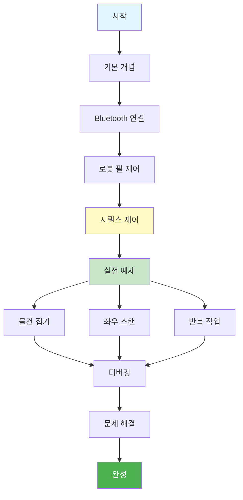

### Clock을 사용한 시간 지연
```
1. Clock 컴포넌트 추가
2. TimerInterval 설정 (1000 = 1초)
3. TimerEnabled로 시작/중지
4. Timer 이벤트에서 다음 동작 실행
```

### 시퀀스 제어 핵심
```
1. 전역 변수로 단계 관리
2. Clock.Timer에서 단계 증가
3. Procedure로 각 단계 실행
4. 마지막 단계에서 Clock 중지
```

### 명령 전송 형식
```
각도: "90,110,150,5_"
저장: "save_"
재생: "play_"
자동: "auto_"
중지: "stop_"
```

**Happy Coding! 📱🤖**

