# 🤖 스마트 로봇 팔 색상 분류 시스템 완전 가이드

> **고등학생도 쉽게 만드는 AI 로봇 팔 프로젝트**  
> 스마트폰 앱으로 로봇 팔을 제어하고, AI로 색상을 인식해서 자동으로 물건을 분류해요!

---

## 📚 목차

1. [프로젝트 소개](#1-프로젝트-소개)
2. [전체 시스템 구조](#2-전체-시스템-구조)
3. [준비물](#3-준비물)
4. [하드웨어 연결](#4-하드웨어-연결)
5. [통신 프로토콜](#5-통신-프로토콜)
6. [아두이노 프로그래밍](#6-아두이노-프로그래밍)
7. [앱인벤터 앱 만들기](#7-앱인벤터-앱-만들기)
8. [사용 방법](#8-사용-방법)
9. [문제 해결](#9-문제-해결)
10. [응용 아이디어](#10-응용-아이디어)

---

## 1. 프로젝트 소개

### 1.1 이 프로젝트는 뭐예요?

**스마트폰**과 **로봇 팔**을 블루투스로 연결해서, **AI가 색상을 인식**하면 자동으로 물건을 분류하는 시스템입니다!

**쉽게 말하면:** 여러분이 만드는 이 프로젝트는 "스마트 공장"의 축소판이에요. 실제 공장에서는 AI 카메라가 제품을 인식하고, 로봇 팔이 자동으로 분류하죠. 우리는 똑같은 원리를 여러분의 책상 위에서 구현할 거예요!

**어떤 부품이 어떻게 협력하나요?**
- 📱 **스마트폰**: AI 두뇌 역할! Teachable Machine이 색상을 보고 판단해요.
- 🔵 **블루투스**: 무선 전령 역할! 스마트폰과 로봇 팔 사이에서 메시지를 전달해요.
- 🤖 **아두이노**: 로봇 팔의 두뇌! 명령을 받아서 서보 모터를 움직여요.
- 🦾 **서보 모터**: 로봇 팔의 근육! 실제로 움직이는 부분이에요.

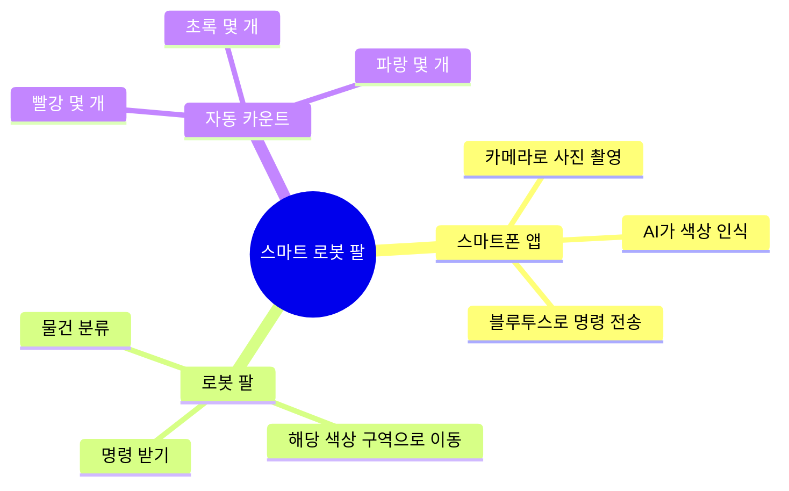

### 1.2 어떻게 작동하나요?

**전체 과정을 한번 따라가 볼까요?**

상상해보세요. 여러분 앞에 빨강, 초록, 파랑 블록이 섞여 있어요. 하나씩 분류하려면 시간이 오래 걸리죠? 하지만 이 로봇 시스템을 사용하면:

1. **촬영**: 스마트폰 카메라가 블록 사진을 찍어요. (1초)
2. **AI 분석**: "음... 이건 빨강 블록이네!" AI가 즉시 판단해요. (1초)
3. **명령 전송**: 앱이 로봇에게 "빨강 구역으로 가!"라고 블루투스로 전달해요. (0.1초)
4. **로봇 이동**: 로봇 팔이 미리 저장된 빨강 구역 위치로 이동해요. (3초)
5. **개수 세기**: "빨강이 이제 13개네!" 아두이노가 개수를 센 후 앱에 알려줘요. (0.1초)
6. **화면 표시**: 앱 화면에 "🔴 빨강: 13개"라고 표시돼요.

이 모든 과정이 **자동으로** 반복되면서, 여러분은 그냥 블록을 카메라 앞에 놓기만 하면 돼요!

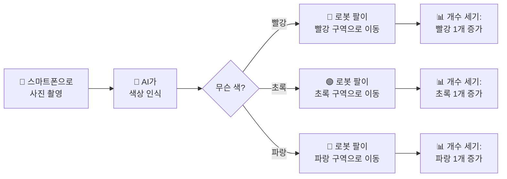

### 1.3 무엇을 배울 수 있나요?

| 분야 | 배우는 내용 |
|------|-----------|
| **하드웨어** | 아두이노, 서보모터, 블루투스 모듈 사용법 |
| **소프트웨어** | 아두이노 프로그래밍, 앱인벤터로 앱 만들기 |
| **AI** | Teachable Machine으로 이미지 인식 AI 학습 |
| **통신** | 블루투스로 데이터 주고받기 |
| **시스템 설계** | 여러 부품을 연결해서 하나의 시스템 만들기 |

---

## 2. 전체 시스템 구조

### 2.1 전체 흐름도

**시스템이 처음부터 끝까지 어떻게 작동하는지 큰 그림을 그려볼게요!**

이 프로젝트는 크게 **준비 단계**와 **실행 단계**로 나뉩니다.

**🔧 준비 단계 (처음 한 번만 하면 돼요!)**
```
- 로봇 팔을 조립하고 전선을 연결해요
- 스마트폰과 블루투스로 연결해요
- 각 색상 구역의 위치를 로봇에게 가르쳐줘요 (예: "빨강은 여기!", "초록은 저기!")
```

**🚀 실행 단계 (자동으로 계속 반복돼요!)**
```
1. 시작 버튼을 누르면 자동 모드가 켜져요
2. 3초마다 카메라가 자동으로 사진을 찍어요
3. AI가 "빨강이다!" 또는 "초록이다!"라고 판단해요
4. 그 색깔에 맞는 명령을 로봇에게 보내요 (예: `redCheck_`)
5. 로봇 팔이 해당 구역으로 이동해요
6. 개수가 하나 늘어나고, 화면에 표시돼요
7. 다시 2번부터 반복! (중지 버튼을 누를 때까지)
```
아래 흐름도를 보면 이 과정이 한눈에 들어올 거예요!

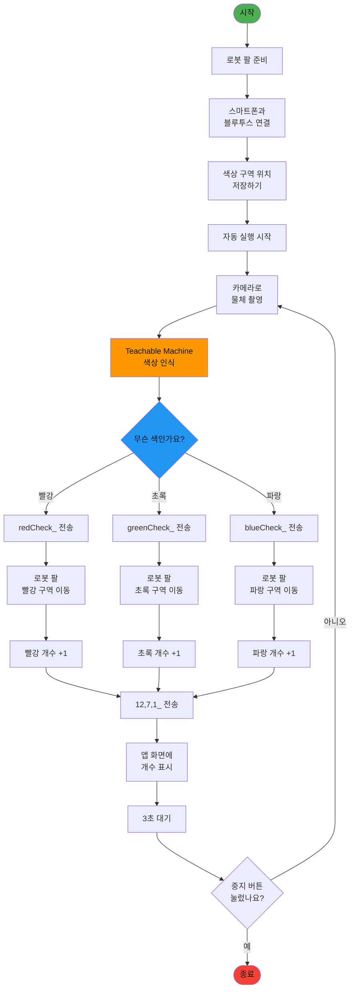

### 2.2 시스템 구성도

**이제 각 부품이 어떻게 연결되어 있는지 자세히 살펴볼까요?**

우리 시스템은 크게 **3개의 영역**으로 나뉩니다:

**📱 스마트폰 영역 (소프트웨어)**
```
- **사용자 화면 (UI)**: 버튼을 누르고 결과를 보는 곳이에요
- **카메라**: 물체 사진을 찍어요
- **Teachable Machine AI**: 사진을 보고 색상을 판단해요 (핵심!)
- **블루투스 통신**: 로봇에게 명령을 보내는 통신 담당
```

**🔵 무선 통신 영역 (블루투스 모듈)**
```
- **HC-05/06 모듈**: 스마트폰과 아두이노 사이의 "무선 다리" 역할
- 왜 블루투스를 쓰나요? 전선이 없으니까 로봇이 자유롭게 움직일 수 있어요!
```

**🤖 아두이노 영역 (하드웨어)**
```
- **블루투스 수신**: HC-05에서 날아온 명령을 받아요
- **명령 처리 (Brain)**: 받은 명령을 해석하고 어떻게 할지 결정해요
- **EEPROM 메모리**: 각 구역 위치를 기억해두는 "장기 기억" 저장소
- **서보 모터 4개**: 실제로 로봇 팔을 움직이는 근육!
- **조이스틱**: 사람이 직접 로봇 팔을 움직일 수 있는 컨트롤러
```

**어떻게 함께 작동하나요?**

흐름을 따라가 보면:
```
1. 사용자가 UI에서 버튼 클릭 → 카메라 촬영
2. AI가 분석 → "빨강!" 판단
3. 블루투스로 `redCheck_` 명령 전송
4. HC-05가 명령을 아두이노로 전달
5. 아두이노 Brain이 명령 해석 → EEPROM에서 빨강 구역 위치 읽기
6. 서보 모터들이 해당 위치로 이동!
```

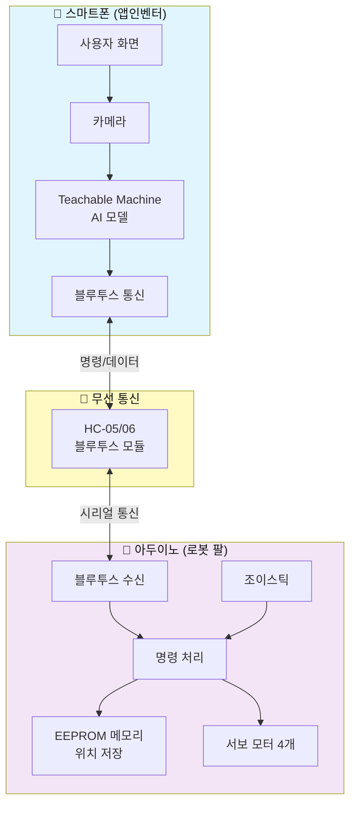

### 2.3 데이터 흐름 (시퀀스 다이어그램)

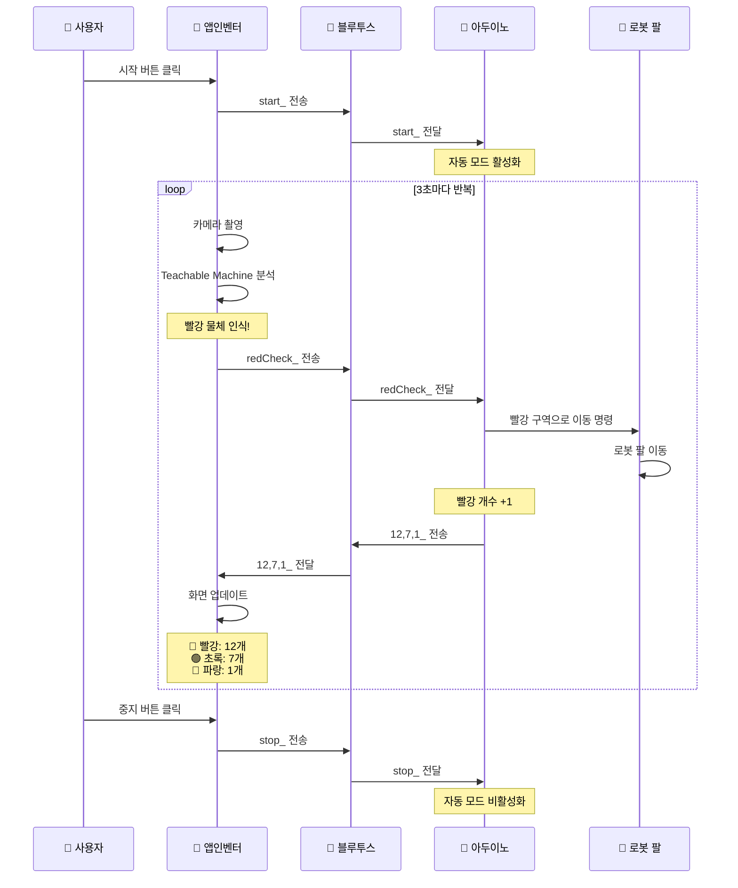

### 2.4 시스템 레이어 구조

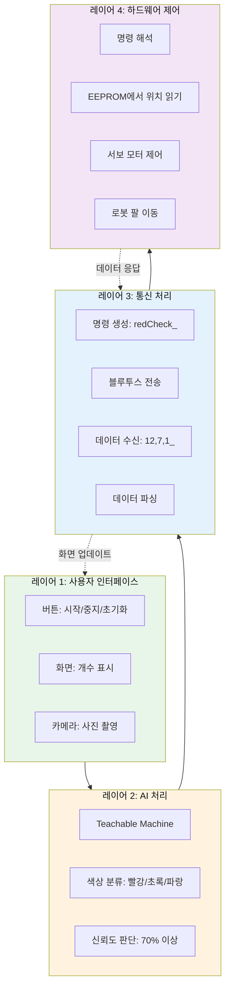

---

## 3. 준비물

### 3.1 필요한 부품 목록

| 분류 | 부품명 | 개수 | 설명 |
|------|--------|------|------|
| **메인 보드** | 아두이노 우노 | 1개 | 로봇 팔의 두뇌 역할 |
| **통신** | HC-05 또는 HC-06 블루투스 모듈 | 1개 | 스마트폰과 무선 연결 |
| **모터** | 서보 모터 (SG90) | 4개 | 로봇 팔을 움직이는 근육 |
| **입력** | 조이스틱 모듈 | 1개 | 수동으로 로봇 팔 조작 |
| **전원** | 5V 2A 어댑터 | 1개 | 로봇 팔에 힘을 주는 전원 |
| **기타** | 점퍼 케이블 | 여러개 | 부품들을 연결하는 전선 |
| **스마트폰** | 안드로이드 폰 | 1대 | 앱을 설치해서 사용 |

### 3.2 소프트웨어 준비

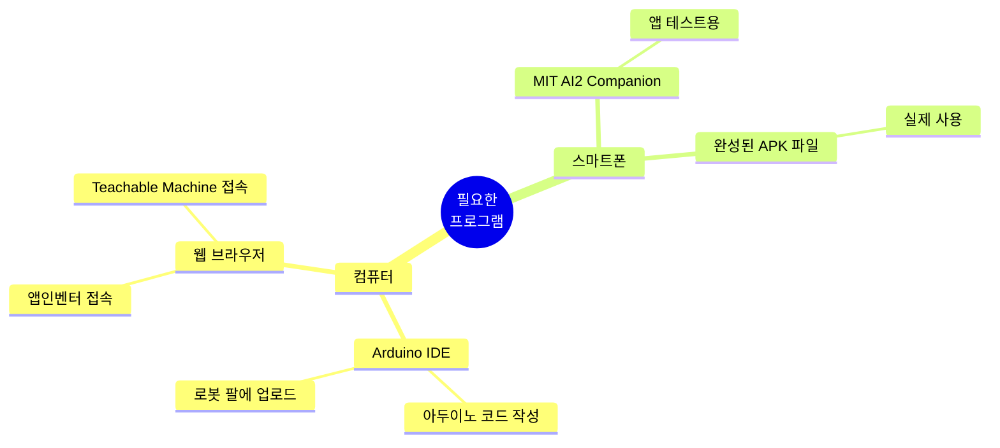

| 소프트웨어 | 용도 | 다운로드 |
|-----------|------|---------|
| **Arduino IDE** | 아두이노 프로그래밍 | https://www.arduino.cc/ |
| **MIT App Inventor** | 스마트폰 앱 만들기 | https://appinventor.mit.edu/ |
| **Teachable Machine** | AI 모델 학습 | https://teachablemachine.withgoogle.com/ |
| **MIT AI2 Companion** | 앱 테스트 (스마트폰) | 구글 플레이 스토어 |

---

## 4. 하드웨어 연결

**부품들을 연결하는 것이 가장 중요해요! 한 군데라도 잘못 연결하면 작동하지 않아요.**

### 4.1 전체 연결도

**하드웨어 연결의 3가지 핵심 원칙**

1. **전원 연결**: 모든 부품에 전기가 들어가야 해요
   - VCC/5V → 플러스(+) 전원
   - GND → 마이너스(-) 전원
   - **중요**: 모든 GND는 하나로 연결! (공통 접지)

2. **신호 연결**: 데이터를 주고받는 선
   - 디지털 핀 (D2, D3, D4...) → 신호 전송
   - 아날로그 핀 (A0, A1...) → 센서 값 읽기

3. **TX-RX 교차**: 블루투스 연결할 때 주의!
   - TX(전송) → RX(수신)로 연결
   - RX(수신) → TX(전송)로 연결
   - 왜? 한쪽이 보내면 다른 쪽이 받아야 하니까!

**연결 전 체크리스트**

- [ ] 아두이노 전원 **끄기** (연결할 때는 꺼야 안전!)
- [ ] 점퍼 케이블 색깔 구분 (빨강=전원, 검정=GND, 다른색=신호)
- [ ] 브레드보드 준비 (전선 꽂기 편하게)
- [ ] 외부 전원 어댑터 준비 (5V 2A 이상)

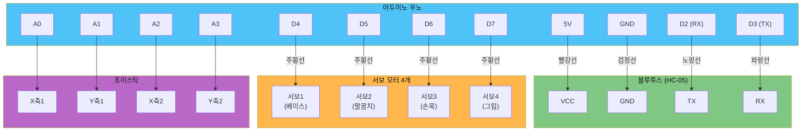

### 4.2 단계별 연결 방법

#### ⚠️ 주의사항

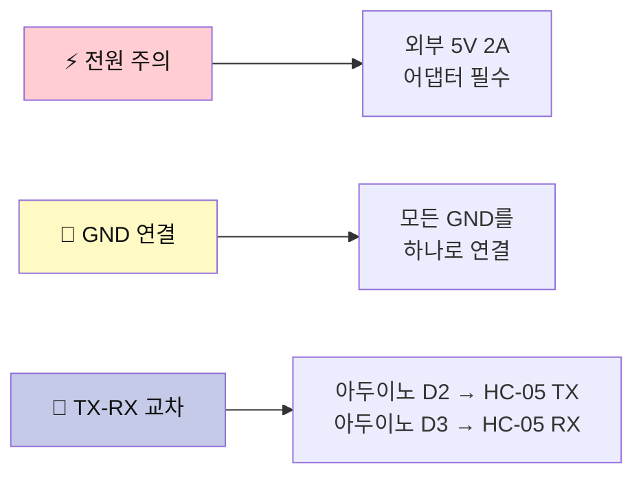

#### 1단계: 블루투스 모듈 연결

**블루투스 모듈(HC-05/HC-06)은 "무선 전령"이에요!**

**왜 필요한가요?**
- 아두이노는 USB 케이블로만 컴퓨터와 통신할 수 있어요
- 스마트폰과 통신하려면? 블루투스 필요!
- 블루투스 모듈이 "번역기" 역할을 해요

**HC-05 vs HC-06 차이**
- HC-05: 마스터/슬레이브 모두 가능 (더 비쌈)
- HC-06: 슬레이브만 가능 (더 저렴)
- 우리 프로젝트: 둘 다 OK! (슬레이브만 필요)

**연결 방법**

```
HC-05/06 핀      →   아두이노 핀
─────────────────────────────
VCC (빨강선)    →   5V
GND (검정선)    →   GND
TXD (노랑선)    →   D2 (RX)  ← 주의: 교차!
RXD (파랑선)    →   D3 (TX)  ← 주의: 교차!
```

**왜 TX-RX를 교차하나요?**

상상해보세요. 두 사람이 전화 통화하는데:
- A의 말하는 쪽(TX) → B의 듣는 쪽(RX)
- A의 듣는 쪽(RX) → B의 말하는 쪽(TX)

마찬가지로:
- HC-05의 TX(송신) → 아두이노 RX(수신)
- HC-05의 RX(수신) → 아두이노 TX(송신)

**연결 후 확인**
1. 전원 켜기
2. HC-05 LED가 깜빡이나요?
   - 빠르게 깜빡임(초당 여러 번) = 정상! 연결 대기 중
   - 느리게 깜빡임(2초에 1번) = 연결됨
   - 안 깜빡임 = 전원 문제! VCC/GND 확인

#### 2단계: 서보 모터 연결

**서보 모터는 로봇 팔의 "근육"이에요!**

**서보 모터란?**
- 일반 모터: 계속 빙빙 돌아요 (선풍기처럼)
- 서보 모터: 정확한 각도로 움직여요! (0°~180°)
- 예: "45도로 가!" → 정확히 45도로 이동

**왜 4개나 필요한가요?**

로봇 팔은 사람 팔처럼 여러 관절이 있어요:
1. **서보1 (베이스)**: 몸통을 좌우로 돌리기 (어깨 회전)
2. **서보2 (팔꿈치)**: 팔을 위아래로 (팔꿈치 굽히기)
3. **서보3 (손목)**: 손목 각도 조절
4. **서보4 (그립)**: 물건 잡고 놓기 (손가락)

**서보 모터 선 3개**
- 빨강/주황 선: VCC (전원 +)
- 갈색/검정 선: GND (전원 -)
- 노랑/주황/흰색 선: 신호선 (아두이노 핀)

**연결표**

| 서보 | 역할 | 아두이노 핀 | 전원 | 색상 |
|------|------|-----------|------|------|
| **서보1** | 베이스 (회전) | D4 | 외부 5V | 주황 |
| **서보2** | 팔꿈치 (위아래) | D5 | 외부 5V | 주황 |
| **서보3** | 손목 (각도) | D6 | 외부 5V | 주황 |
| **서보4** | 그립 (잡기) | D7 | 외부 5V | 주황 |

**중요! 전원 주의사항**

⚠️ **서보 4개 + 블루투스 = 많은 전류 필요!**

- USB 전원만 사용: 500mA (부족! 😢)
- 서보 4개 필요: 2000mA = 2A (많이 필요!)
- 해결책: **외부 5V 2A 어댑터** 필수!

**전원 분배 방법**
```
외부 5V 어댑터
  ↓
브레드보드 전원 레일
  ├→ 서보1 VCC
  ├→ 서보2 VCC
  ├→ 서보3 VCC
  ├→ 서보4 VCC
  └→ HC-05 VCC (선택)

공통 GND 연결
  ├→ 서보 모든 GND
  ├→ HC-05 GND
  └→ 아두이노 GND
```

**테스트**
연결 후 아두이노에 코드 업로드하고:
1. 서보가 초기 위치로 이동하나요?
2. 조이스틱으로 움직이나요?
3. 떨리지 않고 부드럽게 움직이나요?

만약 떨린다면? → 전원 부족! 외부 어댑터 확인

#### 3단계: 조이스틱 연결

**조이스틱은 로봇을 수동으로 조종하는 "컨트롤러"예요!**

**왜 조이스틱이 필요한가요?**

AI 자동 모드도 좋지만, 처음 설정할 때는 **직접 움직여서 위치를 정해야** 해요!

예:
- 빨강 구역을 "왼쪽 앞"으로 설정하고 싶어요
- 조이스틱으로 로봇 팔을 왼쪽 앞으로 이동
- 그 위치를 저장!

**조이스틱이 어떻게 작동하나요?**

조이스틱은 2개의 **가변저항**이에요:
- X축: 좌우로 움직이면 0~1023 값 변화
- Y축: 상하로 움직이면 0~1023 값 변화

중간 위치 (안 움직임): 약 512
왼쪽 끝: 0
오른쪽 끝: 1023

**우리 프로젝트 조이스틱 배치**

조이스틱 2개를 사용해요! (4축 제어)

**조이스틱 1:**
- X축1 (A0): 서보1 제어 (베이스 좌우 회전)
- Y축1 (A1): 서보2 제어 (팔꿈치 위아래)

**조이스틱 2:**
- X축2 (A2): 서보3 제어 (손목 각도)
- Y축2 (A3): 서보4 제어 (그립 열고 닫기)

**연결 방법**

각 조이스틱 모듈에는 보통 핀이 5개:
- VCC → 5V
- GND → GND
- VRx → 아날로그 핀 (X축)
- VRy → 아날로그 핀 (Y축)
- SW → 버튼 (선택사항, 안 써도 됨)

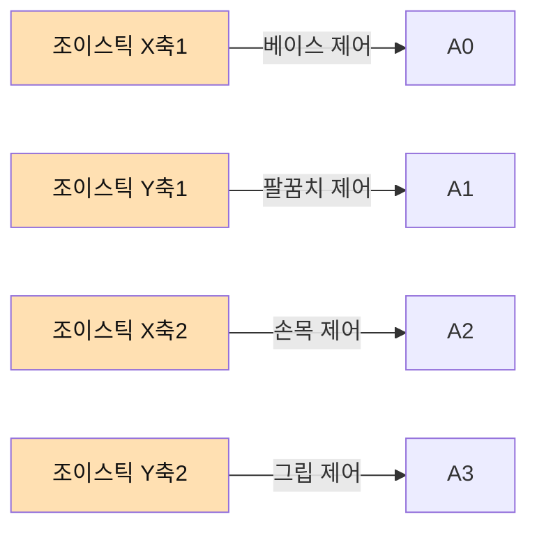

### 4.3 전원 연결 주의사항

**가장 많이 하는 실수가 "전원 부족"이에요!**

**전원이란?**
- 전자 부품을 작동시키는 "전기 에너지"
- 전압 (V): 전기의 세기 (5V, 12V...)
- 전류 (A): 전기의 양 (500mA, 2A...)

**우리 프로젝트 전력 계산**

| 부품 | 소비 전류 |
|------|----------|
| 아두이노 우노 | 50mA |
| HC-05 블루투스 | 30mA |
| 서보 모터 1개 | 최대 500mA |
| **서보 4개** | 최대 2000mA = **2A** |
| **총합** | 약 **2.1A** |

**USB 전원만 사용하면?**

USB 포트 제공: 500mA
필요한 전류: 2100mA
→ **4배 부족!** 😱

결과:
- ❌ 서보가 떨림
- ❌ 블루투스 끊김
- ❌ 아두이노 재부팅
- ❌ 전원 부족 경고

**해결책: 외부 어댑터 사용**

**필요한 어댑터:**
- 전압: 5V (정확히 5V!)
- 전류: 2A 이상 (2A, 3A, 5A 모두 OK)
- 커넥터: DC 잭 또는 브레드보드용

**올바른 전원 연결 방법**

**방법 1: 브레드보드 사용**
```
외부 5V 어댑터
  ↓
브레드보드 전원 레일 (+)
  ├→ 서보1 VCC (빨강선)
  ├→ 서보2 VCC
  ├→ 서보3 VCC
  ├→ 서보4 VCC
  └→ HC-05 VCC

브레드보드 GND 레일 (-)
  ├→ 서보1 GND (검정선)
  ├→ 서보2 GND
  ├→ 서보3 GND
  ├→ 서보4 GND
  ├→ HC-05 GND
  └→ 아두이노 GND ← 중요! 공통 접지
```

**방법 2: 파워 분배 보드 사용**
- 전원 분배 보드 구매 (더 깔끔)
- 입력: 외부 5V
- 출력: 여러 개의 5V/GND 핀

**주의사항 ⚠️**

1. **절대 12V를 5V 핀에 연결하지 마세요!**
   - 아두이노와 서보가 타버려요! 🔥

2. **반드시 GND를 공통 연결하세요!**
   - 외부 전원 GND ↔ 아두이노 GND
   - 안 하면 신호가 이상하게 전달돼요

3. **극성(+/-)을 꼭 확인하세요!**
   - VCC/+ → 빨강선
   - GND/- → 검정선
   - 반대로 연결하면 고장!

4. **서보를 하나씩 연결해서 테스트**
   - 한 번에 4개 연결하면 문제 찾기 어려워요
   - 1개씩 연결하고 작동 확인

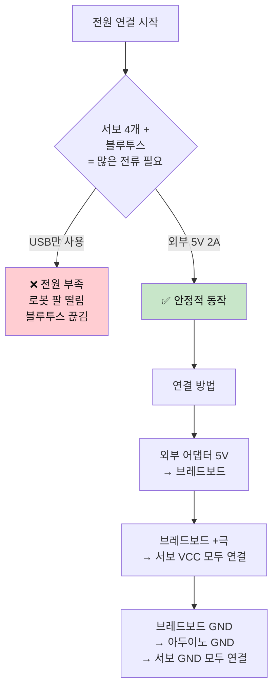

---

## 5. 통신 프로토콜

### 5.1 프로토콜이란?

**프로토콜**은 스마트폰과 로봇 팔이 서로 이야기하는 **약속된 규칙**입니다.  
마치 "안녕"이라고 하면 "안녕"이라고 대답하는 것처럼요!

**왜 프로토콜이 필요한가요?**

상상해보세요. 여러분이 외국 친구와 이야기하는데, 서로 다른 언어를 쓰면 소통이 안 되죠? 마찬가지로 스마트폰(앱인벤터)과 아두이노(C++ 언어)는 원래 서로 다른 "언어"를 씁니다. 그래서 둘이 약속한 공통 규칙이 필요해요!

**우리 프로토콜의 핵심 규칙:**
1. **모든 명령은 언더스코어(_)로 끝나요**: 이게 "명령 끝!" 신호예요
2. **간단한 단어로 명령해요**: `redCheck`, `start`, `stop` 처럼 영어 단어 사용
3. **숫자 데이터는 쉼표(,)로 구분해요**: `12,7,1`처럼 여러 숫자를 한 번에 보낼 때

**실제 예시를 볼까요?**

앱인벤터에서 "빨강 구역으로 가!"라고 명령하고 싶어요. 그럼:
- ❌ "빨강 구역으로 가!" (한글, 띄어쓰기 → 아두이노가 못 알아들어요)
- ❌ `redCheck` (언더스코어 없음 → 명령 끝인지 모르겠어요)
- ✅ `redCheck_` (영어, 언더스코어 → 완벽해요!)

아두이노가 `redCheck_`를 받으면:
1. "아! 빨강 구역 명령이구나!" 이해
2. EEPROM에서 빨강 구역 위치를 읽음 (예: 45°, 90°, 80°, 30°)
3. 서보 모터들을 그 각도로 움직임
4. 빨강 개수를 1 증가 (예: 12 → 13)
5. 앱에게 `13,7,1_` 응답 (빨강13, 초록7, 파랑1)

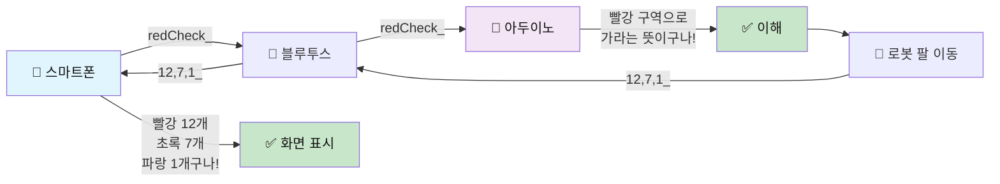

### 5.2 명령어 규칙

#### 기본 규칙

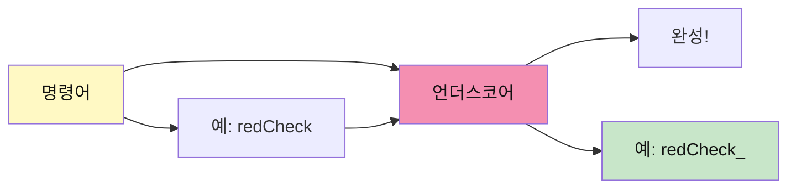

**중요!** 모든 명령은 **언더스코어(_)**로 끝나야 해요!

| 잘못된 예 | 올바른 예 |
|----------|----------|
| ❌ `redCheck` | ✅ `redCheck_` |
| ❌ `start` | ✅ `start_` |
| ❌ `stop` | ✅ `stop_` |

### 5.3 명령어 종류

#### 스마트폰 → 아두이노 (제어 명령)

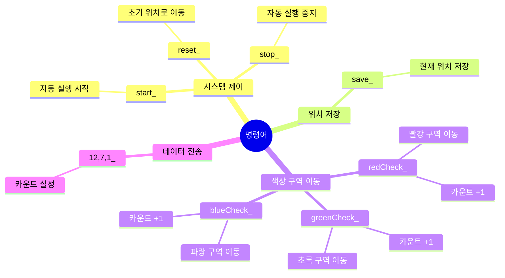

#### 명령어 표

| 명령어 | 하는 일 | 사용 예 |
|--------|---------|---------|
| `start_` | 자동 실행 시작 | 시작 버튼 누를 때 |
| `stop_` | 자동 실행 중지 | 중지 버튼 누를 때 |
| `reset_` | 초기 위치로 이동 | 초기화 버튼 누를 때 |
| `save_` | 현재 위치 저장 | 구역 위치 설정할 때 |
| `redCheck_` | 빨강 구역으로 이동 | AI가 빨강 인식할 때 |
| `greenCheck_` | 초록 구역으로 이동 | AI가 초록 인식할 때 |
| `blueCheck_` | 파랑 구역으로 이동 | AI가 파랑 인식할 때 |
| `12,7,1_` | 카운트 개수 설정 | 빨강12, 초록7, 파랑1 |

#### 아두이노 → 스마트폰 (응답)

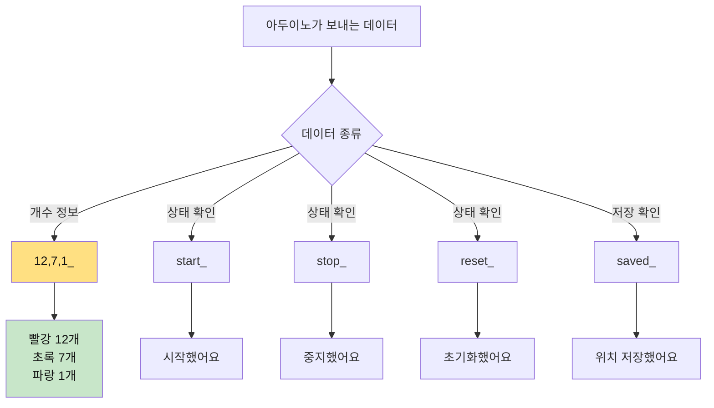

| 응답 | 의미 | 앱에서 하는 일 |
|------|------|---------------|
| `12,7,1_` | 빨강12, 초록7, 파랑1 | 화면에 개수 표시 |
| `start_` | 시작 완료 | "✅ 시작됨" 표시 |
| `stop_` | 중지 완료 | "⏹️ 중지됨" 표시 |
| `reset_` | 초기화 완료 | "🔄 초기화됨" 표시 |
| `saved_` | 저장 완료 | "💾 저장됨" 알림 |

### 5.4 통신 흐름 예시

#### 예시 1: 빨강 물체 분류

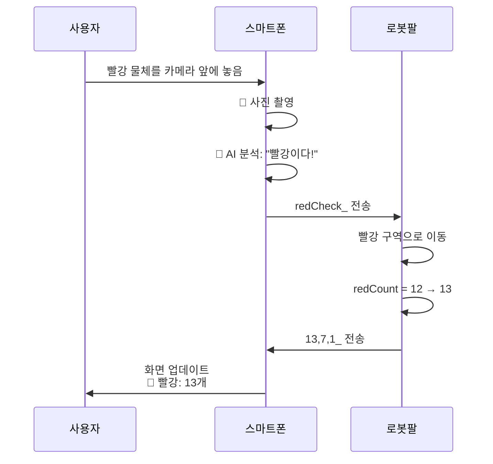

#### 예시 2: 시작부터 중지까지

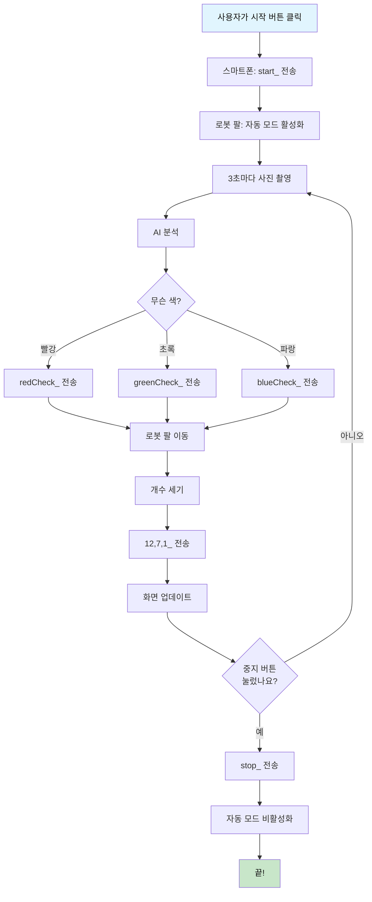

---

## 6. 아두이노 프로그래밍

> 📖 참고: [07_app_inventor_robot_arm_control.ino](file:///Users/kimjongphil/Documents/GitHub/Smart_Factory_Arms_Project/arduino_code/day1_arm_system/07_app_inventor_robot_arm_control/07_app_inventor_robot_arm_control.ino)

### ⚡ 아두이노 핵심 함수 빠른 참조

**이 섹션에서 배울 주요 함수들:**

| 함수 | 역할 | 사용 예 |
|------|------|---------|
| **handleCommand()** | 블루투스 명령 수신 | 매 loop마다 호출 |
| **processCommand()** | 명령 해석 및 실행 | 명령 완성 시 자동 호출 |
| **goToRedZone()** | 빨강 구역 이동 | redCheck_ 수신 시 |
| **goToGreenZone()** | 초록 구역 이동 | greenCheck_ 수신 시 |
| **goToBlueZone()** | 파랑 구역 이동 | blueCheck_ 수신 시 |
| **saveCurrentPosition()** | 현재 위치 저장 | save_ 수신 시 |
| **loadPosition()** | EEPROM에서 위치 읽기 | 구역 이동 전 |
| **moveToPosition()** | 부드럽게 이동 | 목표 위치로 이동 |
| **sendCountData()** | 개수 데이터 전송 | 분류 후 앱에 전송 |

---

### 6.1 코드 구조

**아두이노 프로그램이 어떻게 작동하는지 이해하는 것이 중요해요!**

아두이노 프로그램은 크게 **2개의 주요 함수**로 이루어져 있어요:

**1️⃣ setup() 함수 - "준비 단계"**
```
- 전원을 켜면 **딱 한 번만** 실행돼요
- 무엇을 하나요?
  - 서보 모터 4개를 핀에 연결해요 (D4, D5, D6, D7)
  - 블루투스 통신을 시작해요 (9600 속도)
  - EEPROM에서 저장된 위치를 읽어와요 (전원 꺼져도 기억!)
  - Serial Monitor를 시작해요 (디버그용)
- 마치 아침에 일어나서 준비 운동하는 것과 같아요!
```

**2️⃣ loop() 함수 - "계속 반복"**
```
- setup()이 끝나면 **무한 반복**으로 실행돼요
- 무엇을 하나요?
  - **명령 받기**: 블루투스로 날아온 명령이 있나 계속 체크해요
  - **조이스틱 읽기**: 사람이 조이스틱을 움직이면 로봇 팔이 따라 움직여요
  - **명령 실행**: 받은 명령에 따라 동작해요 (`redCheck_` → 빨강 구역 이동)
- 마치 계속해서 "할 일 없나? 할 일 없나?" 확인하는 거예요!
```

**명령 처리 흐름**
```
1. **명령 받기 (handleCommand)**: 블루투스에서 글자를 하나씩 받아요
   - 예: `r` → `re` → `red` → `redC` → ... → `redCheck_`
   - `_`를 만나면 "아! 명령 완성!"이라고 인식

2. **명령 해석 (processCommand)**: 완성된 명령을 분석해요
   - `strcmp(command, "redCheck")` ← 문자열 비교
   - 일치하면 → `goToRedZone()` 함수 호출

3. **동작 실행**: 해당 함수가 실제 동작을 수행해요
   - EEPROM에서 위치 읽기 → 서보 모터 이동 → 개수 증가 → 응답 전송
```

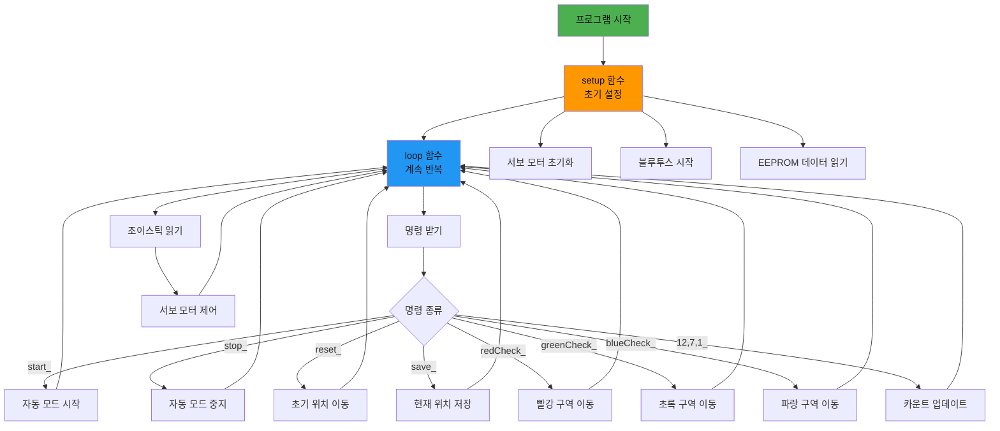

### 6.2 주요 함수 설명

#### 함수 관계도 (호출 흐름)

**함수들이 어떻게 서로 호출하는지 보여줍니다!**

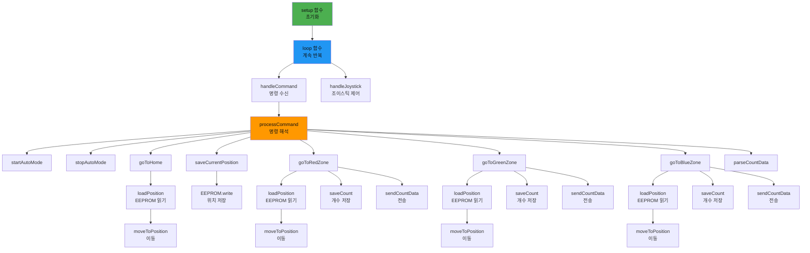

#### 함수 맵 (기능별 분류)

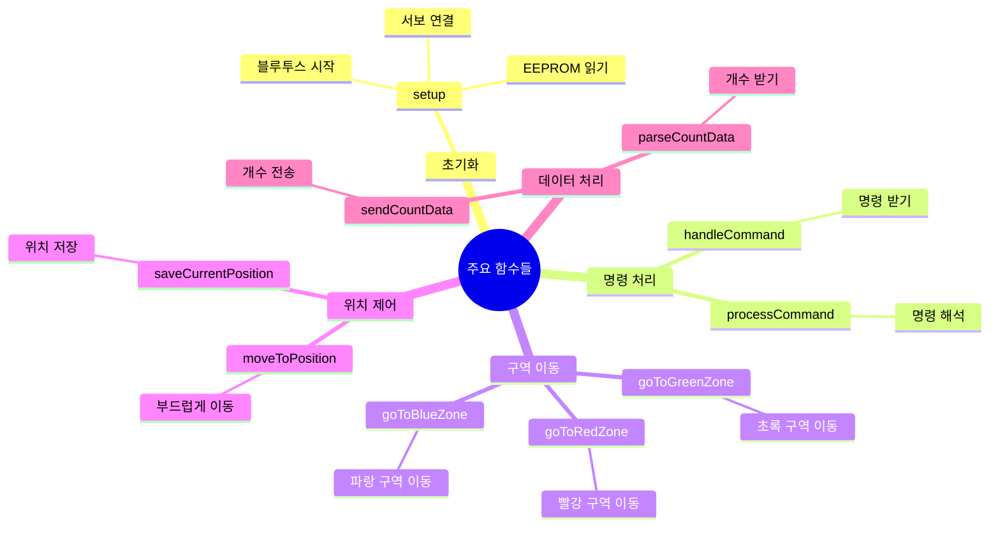

#### 함수 상세 설명

| 함수 이름 | 하는 일 | 입력 | 출력 | 코드 라인 |
|----------|---------|------|------|-----------|
| `handleCommand()` | 블루투스로 명령 받기 | 없음 | 없음 | 157-198 |
| `processCommand()` | 받은 명령 해석하고 실행 | 없음 | 없음 | 200-241 |
| `goToRedZone()` | 빨강 구역으로 이동 + 카운트 | 없음 | 없음 | 295-317 |
| `goToGreenZone()` | 초록 구역으로 이동 + 카운트 | 없음 | 없음 | 319-341 |
| `goToBlueZone()` | 파랑 구역으로 이동 + 카운트 | 없음 | 없음 | 343-365 |
| `moveToPosition()` | 부드럽게 이동 (1도씩) | 목표 각도[4] | 없음 | 513-536 |
| `saveCurrentPosition()` | 현재 위치 EEPROM에 저장 | 없음 | 없음 | 367-420 |
| `loadPosition()` | EEPROM에서 위치 읽기 | 주소, 배열 | bool | 422-437 |
| `sendCountData()` | 개수 데이터 전송 | 없음 | "12,7,1_" | 475-485 |
| `parseCountData()` | 받은 개수 데이터 해석 | "12,7,1_" | 없음 | 439-473 |
| `saveCount()` | 개수를 EEPROM에 저장 | 주소, 값 | 없음 | 495-499 |
| `loadCounts()` | EEPROM에서 개수 읽기 | 없음 | 없음 | 501-511 |

**빠른 찾기:**
- 명령 수신: 157번 줄 `handleCommand()`
- 색상 구역 이동: 295, 319, 343번 줄
- 위치 저장: 367번 줄 `saveCurrentPosition()`
- 부드러운 이동: 513번 줄 `moveToPosition()`

### 6.3 EEPROM 메모리 구조

**EEPROM**은 전원이 꺼져도 데이터가 지워지지 않는 **기억 장치**예요!

**왜 EEPROM이 필요한가요?**

일반 변수는 전원을 끄면 사라져요. 예를 들어:
```cpp
int redCount = 12;  // 전원 끄면 → 사라짐! 😢
```

하지만 여러분이 힘들게 설정한 **구역 위치**와 **개수**가 전원 끌 때마다 사라지면 너무 불편하겠죠? 매번 다시 설정해야 하니까요!

그래서 **EEPROM**에 저장하면:
```cpp
EEPROM.write(0, 90);  // 주소 0에 90 저장
// 전원 꺼도 → 유지됨! 😊
// 다시 켜면 EEPROM.read(0)으로 읽어옴
```

**우리 프로젝트에서 EEPROM 사용법**

EEPROM은 **1024바이트**의 작은 저장 공간이에요. (작은 USB처럼!) 우리는 이 공간을 나눠서 써요:

1. **주소 0~3 (Home 위치)**: 로봇 팔의 "기본 자세"
   - 서보1: 90° (베이스 정면)
   - 서보2: 80° (팔꿈치 중간)
   - 서보3: 90° (손목 중간)
   - 서보4: 15° (그립 열림)

2. **주소 4~7 (빨강 구역)**: 빨강 물건을 놓을 위치
   - 예: 45°, 90°, 80°, 30° (왼쪽 앞)

3. **주소 8~11 (초록 구역)**: 초록 물건을 놓을 위치
   - 예: 90°, 90°, 90°, 30° (정면)

4. **주소 12~15 (파랑 구역)**: 파랑 물건을 놓을 위치
   - 예: 135°, 90°, 80°, 30° (오른쪽 앞)

5. **주소 16~18 (카운트)**: 각 색상별 개수
   - 주소 16: 빨강 개수
   - 주소 17: 초록 개수
   - 주소 18: 파랑 개수

**실제 사용 예시:**

```cpp
// 빨강 구역 위치 저장 (한 번만 설정)
EEPROM.write(4, 45);   // 서보1 각도
EEPROM.write(5, 90);   // 서보2 각도
EEPROM.write(6, 80);   // 서보3 각도
EEPROM.write(7, 30);   // 서보4 각도

// 나중에 읽어서 사용
int angle1 = EEPROM.read(4);  // 45 읽음
int angle2 = EEPROM.read(5);  // 90 읽음
// 서보 모터를 이 각도로 이동!
```

```mermaid
graph TB
    EEPROM[EEPROM 메모리<br/>영구 저장소]
    
    EEPROM --> A[주소 0-3<br/>Home 위치]
    EEPROM --> B[주소 4-7<br/>빨강 구역]
    EEPROM --> C[주소 8-11<br/>초록 구역]
    EEPROM --> D[주소 12-15<br/>파랑 구역]
    EEPROM --> E[주소 16<br/>빨강 개수]
    EEPROM --> F[주소 17<br/>초록 개수]
    EEPROM --> G[주소 18<br/>파랑 개수]
    
    A --> A1[서보1: 90°<br/>서보2: 80°<br/>서보3: 90°<br/>서보4: 15°]
    B --> B1[빨강 구역 각도<br/>4개 저장]
    C --> C1[초록 구역 각도<br/>4개 저장]
    D --> D1[파랑 구역 각도<br/>4개 저장]
    
    style EEPROM fill:#FFE082,color:#111
    style A fill:#E1F5FE,color:#111
    style B fill:#FFCDD2,color:#111
    style C fill:#C8E6C9,color:#111
    style D fill:#BBDEFB,color:#111
```

#### EEPROM 메모리 맵 표

| 주소 | 저장 내용 | 크기 | 예시 데이터 |
|------|----------|------|------------|
| 0-3 | Home 위치 (서보 4개 각도) | 4바이트 | 90, 80, 90, 15 |
| 4-7 | 빨강 구역 위치 | 4바이트 | 45, 90, 80, 30 |
| 8-11 | 초록 구역 위치 | 4바이트 | 90, 90, 90, 30 |
| 12-15 | 파랑 구역 위치 | 4바이트 | 135, 90, 80, 30 |
| 16 | 빨강 개수 | 1바이트 | 12 |
| 17 | 초록 개수 | 1바이트 | 7 |
| 18 | 파랑 개수 | 1바이트 | 1 |

### 6.4 핵심 코드 이해하기

> 📖 참고: [07_app_inventor_robot_arm_control.ino](file:///Users/kimjongphil/Documents/GitHub/Smart_Factory_Arms_Project/arduino_code/day1_arm_system/07_app_inventor_robot_arm_control/07_app_inventor_robot_arm_control.ino)

#### 명령 받기 (handleCommand)

**블루투스로 한 글자씩 받아서 완전한 명령으로 만들어요!**

```cpp
// 블루투스로 명령을 한 글자씩 받아서 모으기
void handleCommand() {
  char ch = '\0';
  
  // 블루투스에서 데이터 읽기
  if (BTSerial.available() > 0) {
    ch = BTSerial.read();
    lastCharTime = millis();  // 마지막 수신 시간 기록
  }
  
  if (ch == '\0') return;  // 받은 데이터 없으면 종료
  
  // 종료 문자 확인 (_)
  if (ch == '_') {
    if (cmdIndex > 0) {
      cmdBuffer[cmdIndex] = '\0';  // 문자열 종료
      processCommand();            // 명령 실행!
      cmdIndex = 0;                // 버퍼 초기화
    }
    return;
  }
  
  // 버퍼에 글자 추가
  if (cmdIndex < 29) {
    cmdBuffer[cmdIndex++] = ch;
  }
}
```

**왜 한 글자씩 받나요?**

블루투스는 데이터를 **순차적으로** 보내요. "redCheck_"를 보내면:
- 1번째: 'r'
- 2번째: 'e'
- 3번째: 'd'
- ...
- 9번째: '_' ← 이때 "명령 완성!"

```mermaid
flowchart LR
    A[r] --> B[e] --> C[d] --> D[C] --> E[h] --> F[e] --> G[c] --> H[k] --> I[_]
    I --> J[완성!<br/>redCheck]
    J --> K[명령 실행]
    
    style I fill:#F48FB1,color:#111
    style J fill:#C8E6C9,color:#111
```

---

#### 명령 실행 (processCommand)

**완성된 명령을 분석해서 해당 함수를 호출해요!**

```cpp
void processCommand() {
  // 문자열 비교로 명령 확인
  
  if (strcmp(cmdBuffer, "start") == 0) {
    startAutoMode();           // 자동 모드 시작
  }
  else if (strcmp(cmdBuffer, "stop") == 0) {
    stopAutoMode();            // 자동 모드 중지
  }
  else if (strcmp(cmdBuffer, "reset") == 0) {
    goToHome();                // 초기 위치
    sendStatus("reset");
  }
  else if (strcmp(cmdBuffer, "save") == 0) {
    saveCurrentPosition();     // 현재 위치 저장
  }
  else if (strcmp(cmdBuffer, "redCheck") == 0) {
    goToRedZone();             // 빨강 구역 이동
  }
  else if (strcmp(cmdBuffer, "greenCheck") == 0) {
    goToGreenZone();           // 초록 구역 이동
  }
  else if (strcmp(cmdBuffer, "blueCheck") == 0) {
    goToBlueZone();            // 파랑 구역 이동
  }
  // 쉼표가 있으면 카운트 데이터
  else if (strchr(cmdBuffer, ',') != NULL) {
    parseCountData(cmdBuffer); // "12,7,1" 파싱
  }
}
```

**strcmp() 함수란?**

두 문자열이 같은지 비교하는 함수예요.
- 같으면 → 0 반환
- 다르면 → 0이 아닌 값 반환

```cpp
strcmp("redCheck", "redCheck")  → 0 (같음!)
strcmp("redCheck", "blueCheck") → 0 아님 (다름!)
```

---

#### 빨강 구역 이동 (goToRedZone)

**핵심! 색상 구역으로 이동하고 개수를 세는 함수예요!**

```cpp
void goToRedZone() {
  // 1단계: 현재 모드를 빨강으로 설정
  currentMode = MODE_RED;
  
  // 2단계: EEPROM에서 빨강 구역 위치 읽기
  int redAngles[4];  // 서보 4개 각도 배열
  
  if (loadPosition(EEPROM_ADDR_RED, redAngles)) {
    // 3단계: 로봇 팔을 해당 위치로 이동
    moveToPosition(redAngles);
    
    // 4단계: 빨강 개수 증가
    redCount++;
    
    // 5단계: EEPROM에 개수 저장 (전원 꺼도 기억)
    saveCount(EEPROM_ADDR_RED_CNT, redCount);
    
    // 6단계: 앱에 현재 개수 전송
    sendCountData();  // "13,7,1_" 형식
    
    // 디버그 출력
    Serial.print("[Move] Red: ");
    printAngles(redAngles);
    Serial.print(" Count:");
    Serial.println(redCount);
  } 
  else {
    // 저장된 위치가 없으면 에러
    Serial.println("[ERR] Red position not saved");
  }
}
```

**중요한 부분 설명:**

**currentMode = MODE_RED;**
- 현재 모드를 빨강으로 설정
- 나중에 `save_` 명령을 받으면, 이 모드에 맞는 EEPROM 주소에 저장해요

**loadPosition(EEPROM_ADDR_RED, redAngles)**
- EEPROM 주소 4~7에서 빨강 구역 각도 읽기
- redAngles[0] = 45° (베이스)
- redAngles[1] = 90° (팔꿈치)
- redAngles[2] = 80° (손목)
- redAngles[3] = 30° (그립)

**moveToPosition(redAngles)**
- 서보 모터를 부드럽게 이동
- 현재 각도에서 목표 각도까지 1도씩 천천히 이동

```mermaid
graph LR
    A[빨강 구역 이동 명령] --> B[EEPROM 주소 4~7<br/>데이터 읽기]
    B --> C[45°, 90°, 80°, 30°]
    C --> D[서보 모터<br/>부드럽게 이동]
    D --> E[개수 +1<br/>12 → 13]
    E --> F[EEPROM 주소 16에<br/>13 저장]
    F --> G[앱에 13,7,1_ 전송]
    
    style A fill:#FFCDD2,color:#111
    style E fill:#C8E6C9,color:#111
```

---

#### EEPROM 위치 읽기 (loadPosition)

**저장된 구역 위치를 EEPROM에서 읽어와요!**

```cpp
bool loadPosition(int addr, int targetAngles[]) {
  bool dataValid = true;
  
  // EEPROM에서 4개 각도 읽기
  for (int i = 0; i < 4; i++) {
    targetAngles[i] = EEPROM.read(addr + i);
    
    // 유효성 검사 (0~180도 범위)
    if (targetAngles[i] < 0 || targetAngles[i] > 180) {
      dataValid = false;
      break;
    }
  }
  
  return dataValid;  // 유효하면 true, 아니면 false
}
```

**예시:**

빨강 구역 위치를 읽을 때:
```cpp
int redAngles[4];
loadPosition(EEPROM_ADDR_RED, redAngles);
// EEPROM_ADDR_RED = 4 (주소)

// 읽는 과정:
EEPROM.read(4)  → redAngles[0] = 45  (베이스)
EEPROM.read(5)  → redAngles[1] = 90  (팔꿈치)
EEPROM.read(6)  → redAngles[2] = 80  (손목)
EEPROM.read(7)  → redAngles[3] = 30  (그립)
```

---

#### 부드럽게 이동 (moveToPosition)

**로봇 팔을 목표 위치로 부드럽게 이동시켜요!**

```cpp
void moveToPosition(int target[]) {
  bool moving = true;
  
  while (moving) {
    handleCommand();  // 이동 중에도 명령 체크
    
    moving = false;
    
    // 4개 서보 모두 체크
    for (int i = 0; i < 4; i++) {
      if (angles[i] < target[i]) {
        angles[i]++;     // 1도 증가
        moving = true;
      }
      else if (angles[i] > target[i]) {
        angles[i]--;     // 1도 감소
        moving = true;
      }
      servo[i].write(angles[i]);  // 서보에 각도 적용
    }
    
    delay(15);  // 15ms 대기 (부드러운 움직임)
  }
}
```

**왜 1도씩 움직이나요?**

한 번에 큰 각도로 움직이면:
- ❌ 로봇 팔이 빠르게 움직여서 위험
- ❌ 모터에 부담
- ❌ 물건을 떨어뜨릴 수 있음

1도씩 천천히:
- ✅ 부드러운 움직임
- ✅ 안전
- ✅ 정확한 제어

**예시:**

현재 베이스 각도: 90°
목표 베이스 각도: 45°

```
1회: 90° → 89° (1도 감소)
2회: 89° → 88°
3회: 88° → 87°
...
45회: 46° → 45° (도착!)
```

총 45번 반복, 45번 × 15ms = 675ms (약 0.7초)

---

#### 현재 위치 저장 (saveCurrentPosition)

**🔥 이게 가장 중요! 커스터마이징의 핵심!**

**조이스틱으로 원하는 위치로 이동한 후, 이 함수로 저장해요!**

```cpp
void saveCurrentPosition() {
  // 1단계: 서보 일시 정지 (안전하게 저장하기 위해)
  for (int i = 0; i < 4; i++) {
    servo[i].detach();  // 서보 분리
  }
  delay(30);
  
  // 2단계: 현재 모드에 따라 저장 위치 결정
  int addr;
  const char* zoneName;
  
  switch (currentMode) {
    case MODE_RED:
      addr = EEPROM_ADDR_RED;    // 주소 4
      zoneName = "Red";
      break;
    case MODE_GREEN:
      addr = EEPROM_ADDR_GREEN;  // 주소 8
      zoneName = "Green";
      break;
    case MODE_BLUE:
      addr = EEPROM_ADDR_BLUE;   // 주소 12
      zoneName = "Blue";
      break;
    case MODE_HOME:
    default:
      addr = EEPROM_ADDR_HOME;   // 주소 0
      zoneName = "Home";
      break;
  }
  
  // 3단계: 현재 각도를 EEPROM에 저장
  for (int i = 0; i < 4; i++) {
    EEPROM.write(addr + i, angles[i]);
    delay(4);  // EEPROM 쓰기 대기
  }
  
  // 4단계: 서보 재연결
  for (int i = 0; i < 4; i++) {
    servo[i].attach(pin[i]);
    servo[i].write(angles[i]);
    delay(15);
  }
  
  Serial.print("[Save] ");
  Serial.print(zoneName);
  Serial.print(": ");
  printAngles(angles);
  
  sendStatus("saved");  // 앱에 "saved_" 전송
}
```

**실제 사용 예시:**

빨강 구역을 왼쪽 앞(45°, 90°, 80°, 30°)으로 설정하고 싶어요.

```
[1단계] 조이스틱으로 이동
  - 베이스를 왼쪽(45°)으로
  - 팔꿈치를 중간(90°)으로
  - 손목을 약간 위(80°)으로
  - 그립을 잡기 자세(30°)로
  
[2단계] 앱에서 "redCheck_" 전송
  → currentMode = MODE_RED
  
[3단계] 앱에서 "save_" 전송
  → saveCurrentPosition() 실행
  → EEPROM 주소 4: 45 저장
  → EEPROM 주소 5: 90 저장
  → EEPROM 주소 6: 80 저장
  → EEPROM 주소 7: 30 저장
  → 완료!
```

이제 언제든지 `redCheck_` 명령만 보내면 로봇이 자동으로 이 위치로 가요!

---

#### 개수 데이터 전송 (sendCountData)

**현재 색상별 개수를 앱에 전송해요!**

```cpp
void sendCountData() {
  BTSerial.print(redCount);      // 빨강 개수
  BTSerial.print(",");           // 쉼표
  BTSerial.print(greenCount);    // 초록 개수
  BTSerial.print(",");           // 쉼표
  BTSerial.print(blueCount);     // 파랑 개수
  BTSerial.println("_");         // 언더스코어 + 줄바꿈
}
```

**출력 예시:**
```
빨강 12개, 초록 7개, 파랑 1개일 때
→ "12,7,1_\n" 전송
```

---

### 6.5 색상 구역 커스터마이징 완전 가이드

**🎨 여러분만의 구역 위치를 만들어보세요!**

#### 방법 1: 조이스틱으로 직접 설정

**가장 쉽고 직관적인 방법이에요!**

**단계별 설정:**

**1️⃣ Home 위치 설정 (기본 자세)**

```
목표: 로봇 팔의 기본 대기 위치

[조이스틱 조작]
- 베이스: 90° (정면)
- 팔꿈치: 80° (약간 들린 상태)
- 손목: 90° (수평)
- 그립: 15° (열림)

[앱에서 명령 전송]
1. currentMode는 기본적으로 MODE_HOME
2. "save_" 전송
3. EEPROM 주소 0~3에 저장됨
4. "saved_" 응답 받음

[확인]
- Serial Monitor: [Save] Home: 90,80,90,15
```

**2️⃣ 빨강 구역 설정 (왼쪽 앞)**

```
목표: 빨강 물건을 놓을 위치

[조이스틱 조작]
- 베이스: 45° (왼쪽으로 회전)
- 팔꿈치: 90° (중간 높이)
- 손목: 80° (약간 위)
- 그립: 30° (잡기 자세)

[앱에서 명령 전송]
1. "redCheck_" 전송 → currentMode = MODE_RED
2. "save_" 전송
3. EEPROM 주소 4~7에 저장됨

[확인]
- Serial Monitor: [Save] Red: 45,90,80,30
```

**3️⃣ 초록 구역 설정 (정면)**

```
목표: 초록 물건을 놓을 위치

[조이스틱 조작]
- 베이스: 90° (정면)
- 팔꿈치: 90° (중간 높이)
- 손목: 90° (수평)
- 그립: 30° (잡기 자세)

[앱에서 명령 전송]
1. "greenCheck_" 전송 → currentMode = MODE_GREEN
2. "save_" 전송
3. EEPROM 주소 8~11에 저장됨

[확인]
- Serial Monitor: [Save] Green: 90,90,90,30
```

**4️⃣ 파랑 구역 설정 (오른쪽 앞)**

```
목표: 파랑 물건을 놓을 위치

[조이스틱 조작]
- 베이스: 135° (오른쪽으로 회전)
- 팔꿈치: 90° (중간 높이)
- 손목: 80° (약간 위)
- 그립: 30° (잡기 자세)

[앱에서 명령 전송]
1. "blueCheck_" 전송 → currentMode = MODE_BLUE
2. "save_" 전송
3. EEPROM 주소 12~15에 저장됨

[확인]
- Serial Monitor: [Save] Blue: 135,90,80,30
```

---

#### 방법 2: 코드에서 직접 수정

**프로그래머를 위한 방법!**

아두이노 코드에서 각도 값을 직접 설정할 수 있어요.

```cpp
// setup() 함수에 추가
void setup() {
  // ... 기존 코드 ...
  
  // 초기 구역 위치 설정 (한 번만 실행)
  initializeZones();
}

// 구역 초기화 함수 추가
void initializeZones() {
  // Home 위치
  int homeAngles[4] = {90, 80, 90, 15};
  for (int i = 0; i < 4; i++) {
    EEPROM.write(EEPROM_ADDR_HOME + i, homeAngles[i]);
  }
  
  // 빨강 구역 (왼쪽 앞)
  int redAngles[4] = {45, 90, 80, 30};
  for (int i = 0; i < 4; i++) {
    EEPROM.write(EEPROM_ADDR_RED + i, redAngles[i]);
  }
  
  // 초록 구역 (정면)
  int greenAngles[4] = {90, 90, 90, 30};
  for (int i = 0; i < 4; i++) {
    EEPROM.write(EEPROM_ADDR_GREEN + i, greenAngles[i]);
  }
  
  // 파랑 구역 (오른쪽 앞)
  int blueAngles[4] = {135, 90, 80, 30};
  for (int i = 0; i < 4; i++) {
    EEPROM.write(EEPROM_ADDR_BLUE + i, blueAngles[i]);
  }
  
  Serial.println("[Init] Zones initialized!");
}
```

**⚠️ 주의:** 이 코드를 한 번 실행한 후, `initializeZones()` 호출을 주석 처리하세요!

```cpp
void setup() {
  // ... 기존 코드 ...
  
  // initializeZones();  // ← 주석 처리 (한 번만 실행)
}
```

왜? EEPROM에 계속 쓰면 수명이 단축돼요!

---

#### 방법 3: Serial Monitor로 실시간 확인

**디버깅과 미세 조정에 최적!**

```cpp
// loop() 함수에 추가
void loop() {
  handleCommand();
  
  if (!isRunning) {
    handleJoystick();
    
    // 1초마다 현재 각도 출력
    static unsigned long lastPrint = 0;
    if (millis() - lastPrint > 1000) {
      Serial.print("Current: ");
      printAngles(angles);
      lastPrint = millis();
    }
  }
}
```

이렇게 하면 조이스틱을 움직이면서 실시간으로 각도를 볼 수 있어요!

```
Current: 45,90,80,30
Current: 46,90,80,30
Current: 47,90,80,30
...
```

원하는 위치에 도달하면 그 각도를 기억했다가 코드에 입력!

---

#### EEPROM 메모리 맵 (완전판)

**어느 주소에 무엇이 저장되는지 한눈에!**

```cpp
/* EEPROM 메모리 구조 */

// Home 위치 (초기 자세)
EEPROM[0] = 90;   // 서보1 (베이스)
EEPROM[1] = 80;   // 서보2 (팔꿈치)
EEPROM[2] = 90;   // 서보3 (손목)
EEPROM[3] = 15;   // 서보4 (그립)

// 빨강 구역
EEPROM[4] = 45;   // 서보1
EEPROM[5] = 90;   // 서보2
EEPROM[6] = 80;   // 서보3
EEPROM[7] = 30;   // 서보4

// 초록 구역
EEPROM[8] = 90;   // 서보1
EEPROM[9] = 90;   // 서보2
EEPROM[10] = 90;  // 서보3
EEPROM[11] = 30;  // 서보4

// 파랑 구역
EEPROM[12] = 135; // 서보1
EEPROM[13] = 90;  // 서보2
EEPROM[14] = 80;  // 서보3
EEPROM[15] = 30;  // 서보4

// 개수 카운트
EEPROM[16] = 12;  // 빨강 개수
EEPROM[17] = 7;   // 초록 개수
EEPROM[18] = 1;   // 파랑 개수
```

---

#### 각도 범위 제한

**로봇 팔이 너무 많이 움직여서 부딪히지 않도록!**

코드에서 각도 범위를 설정할 수 있어요:

```cpp
// 각도 범위 (코드 상단에 정의됨)
int minAngles[4] = {0, 50, 60, 10};    // 최소 각도
int maxAngles[4] = {180, 110, 120, 60}; // 최대 각도
```

**커스터마이징:**

여러분의 로봇 팔 구조에 맞게 수정하세요!

```cpp
// 예: 베이스는 45~135도만 움직이게
int minAngles[4] = {45, 50, 60, 10};
int maxAngles[4] = {135, 110, 120, 60};
```

이렇게 하면 베이스가 45도 미만이나 135도 초과로 가지 않아요!

---

#### 테스트 명령어 순서

**처음 설정할 때 이 순서대로 하세요!**

```
1. 전원 ON
   → Serial Monitor: [System] Ready

2. Home 위치 설정
   앱: (조이스틱으로 이동)
   앱: save_
   응답: saved_
   
3. 빨강 구역 설정
   앱: redCheck_
   앱: (조이스틱으로 이동)
   앱: save_
   응답: saved_
   
4. 초록 구역 설정
   앱: greenCheck_
   앱: (조이스틱으로 이동)
   앱: save_
   응답: saved_
   
5. 파랑 구역 설정
   앱: blueCheck_
   앱: (조이스틱으로 이동)
   앱: save_
   응답: saved_
   
6. 테스트
   앱: redCheck_
   → 로봇이 빨강 구역으로 이동!
   
   앱: greenCheck_
   → 로봇이 초록 구역으로 이동!
   
   앱: blueCheck_
   → 로봇이 파랑 구역으로 이동!
   
7. 완성! 🎉
```

---

## 7. 앱인벤터 앱 만들기

### 7.1 앱 화면 구성

**앱인벤터로 스마트폰 앱을 만들어요!**

앱인벤터는 **블록 코딩** 방식이에요. 마치 레고 블록을 끼우듯이 코드를 만들 수 있어서 초보자도 쉽게 앱을 만들 수 있어요!

**화면은 어떻게 구성하나요?**

우리 앱은 **5개 영역**으로 나뉩니다:

**1️⃣ 상단 연결 영역**
- **블루투스 선택 버튼**: HC-05를 찾아서 연결해요
- **연결 상태 표시**: "✅ 연결됨" 또는 "❌ 연결 안 됨"
- 왜 필요한가요? → 연결이 안 되면 명령을 보낼 수 없으니까!

**2️⃣ AI 영역**
- **카메라 버튼**: 수동으로 사진 찍을 때 (테스트용)
- **사진 미리보기**: 방금 찍은 사진을 볼 수 있어요
- **AI 결과 표시**: "RED (85%)" ← AI가 85% 확률로 빨강이라고 판단!
- 왜 중요한가요? → AI가 잘못 인식하면 로봇이 엉뚱한 곳으로 가니까!

**3️⃣ 제어 버튼 영역**
- **시작 버튼**: 자동 모드 켜기 (3초마다 자동 촬영 시작)
- **중지 버튼**: 자동 모드 끄기
- **초기화 버튼**: 로봇 팔을 Home 위치로 돌려놓기
- 왜 3개나 필요한가요? → 상황에 맞게 제어하려면 각각 필요해요!

**4️⃣ 개수 표시 영역**
- **🔴 빨강: 12개**: 지금까지 빨강 물건을 몇 개 분류했는지
- **🟢 초록: 7개**: 지금까지 초록 물건을 몇 개 분류했는지
- **🔵 파랑: 1개**: 지금까지 파랑 물건을 몇 개 분류했는지
- 왜 보여주나요? → 작업 진행 상황을 한눈에 볼 수 있어요!

**5️⃣ 하단 디버그 영역**
- **디버그 메시지**: "수신: 12,7,1_" ← 블루투스로 뭘 주고받는지 확인
- 왜 필요한가요? → 문제가 생기면 여기를 보고 원인을 찾을 수 있어요!

#### 화면 레이아웃

```mermaid
graph TD
    Screen[Screen1<br/>메인 화면]
    
    Screen --> Top[상단: 연결 영역]
    Screen --> Middle1[중간1: AI 영역]
    Screen --> Middle2[중간2: 제어 영역]
    Screen --> Middle3[중간3: 개수 표시]
    Screen --> Bottom[하단: 디버그]
    
    Top --> T1[블루투스 선택 버튼]
    Top --> T2[연결 상태 표시]
    
    Middle1 --> M1_1[카메라 버튼]
    Middle1 --> M1_2[사진 미리보기]
    Middle1 --> M1_3[AI 결과 표시]
    
    Middle2 --> M2_1[시작 버튼]
    Middle2 --> M2_2[중지 버튼]
    Middle2 --> M2_3[초기화 버튼]
    
    Middle3 --> M3_1[🔴 빨강: 0개]
    Middle3 --> M3_2[🟢 초록: 0개]
    Middle3 --> M3_3[🔵 파랑: 0개]
    
    Bottom --> B1[디버그 메시지]
    
    style Screen fill:#E1F5FE,color:#111
    style Top fill:#C5CAE9,color:#111
    style Middle1 fill:#FFE082,color:#111
    style Middle2 fill:#C8E6C9,color:#111
    style Middle3 fill:#F48FB1,color:#111
```

#### 화면 예시

```
┌──────────────────────────────────┐
│  [블루투스 선택 ▼]  [✅ 연결됨]  │
├──────────────────────────────────┤
│     🤖 AI 색상 인식              │
│  [📷 촬영]                       │
│  ┌────────────────────────┐      │
│  │   사진 미리보기         │      │
│  └────────────────────────┘      │
│  결과: RED (85%)                 │
├──────────────────────────────────┤
│  [시작] [중지] [초기화]          │
├──────────────────────────────────┤
│     📊 물체 개수                 │
│  🔴 빨강: 12개                   │
│  🟢 초록: 7개                    │
│  🔵 파랑: 1개                    │
├──────────────────────────────────┤
│  디버그: 수신 12,7,1_            │
└──────────────────────────────────┘
```

### 7.2 컴포넌트 구성

#### 보이는 컴포넌트

| 컴포넌트 이름 | 종류 | 하는 일 |
|--------------|------|---------|
| `ListPicker_BT` | ListPicker | 블루투스 기기 선택 |
| `Label_Status` | Label | 연결 상태 표시 |
| `Button_Capture` | Button | 사진 촬영 버튼 |
| `Image_Preview` | Image | 사진 미리보기 |
| `Label_AI_Result` | Label | AI 분석 결과 표시 |
| `Button_Start` | Button | 자동 실행 시작 |
| `Button_Stop` | Button | 자동 실행 중지 |
| `Button_Reset` | Button | 초기화 |
| `Label_Red_Count` | Label | 빨강 개수 표시 |
| `Label_Green_Count` | Label | 초록 개수 표시 |
| `Label_Blue_Count` | Label | 파랑 개수 표시 |
| `Label_Debug` | Label | 디버그 메시지 |

#### 보이지 않는 컴포넌트

| 컴포넌트 이름 | 종류 | 하는 일 |
|--------------|------|---------|
| `BluetoothClient1` | BluetoothClient | 블루투스 통신 |
| `Clock_AutoClassify` | Clock | 3초마다 자동 촬영 |
| `Camera1` | Camera | 카메라 기능 |
| `TeachableMachine1` | Extension | AI 모델 사용 |
| `Notifier1` | Notifier | 알림 메시지 |

### 7.3 핵심 블록 코드

#### 블록 코드 구조

```mermaid
graph TD
    Init[Screen1.Initialize<br/>앱 시작] --> Var[전역 변수 초기화]
    
    Var --> V1[isConnected = false]
    Var --> V2[isRunning = false]
    Var --> V3[redCount = 0]
    Var --> V4[greenCount = 0]
    Var --> V5[blueCount = 0]
    
    BT[ListPicker_BT.AfterPicking<br/>블루투스 연결] --> Connect{연결 성공?}
    Connect -->|예| Con1[isConnected = true]
    Connect -->|아니오| Con2[에러 메시지]
    
    Start[Button_Start.Click<br/>시작 버튼] --> Send1[sendCommand start]
    Send1 --> Run1[isRunning = true]
    Run1 --> Timer1[Clock 시작]
    
    Clock[Clock_AutoClassify.Timer<br/>3초마다] --> Take[Camera.TakePicture]
    
    Camera[Camera1.AfterPicture<br/>사진 촬영 후] --> AI[TeachableMachine<br/>분석]
    
    AI --> Class{분류 결과}
    Class -->|RED| Red[sendCommand redCheck]
    Class -->|GREEN| Green[sendCommand greenCheck]
    Class -->|BLUE| Blue[sendCommand blueCheck]
    
    Receive[BluetoothClient1.DataReceived<br/>데이터 수신] --> Parse{데이터 종류}
    Parse -->|12,7,1_| Count[parseCountData]
    Parse -->|start_| Msg1[상태 표시]
    Parse -->|stop_| Msg2[상태 표시]
    
    Count --> Update[updateCountDisplay<br/>화면 업데이트]
    
    style Init fill:#4CAF50,color:#fff,color:#111
    style AI fill:#FF9800,color:#fff,color:#111
    style Update fill:#2196F3,color:#fff,color:#111
```

#### 주요 프로시저

##### 1. sendCommand (명령 전송)

**이 프로시저가 가장 중요해요! 모든 명령이 여기를 거쳐 가거든요.**

**어떻게 작동하나요?**

1. **입력 확인**: 명령어를 받아요 (예: "redCheck")
2. **연결 체크**: 블루투스가 연결되었는지 확인해요
   - 연결 안 됨 → 에러 메시지 표시하고 끝
   - 연결됨 → 다음 단계로!
3. **언더스코어 추가**: "redCheck" → "redCheck_"
   - 왜? 아두이노가 명령 끝을 인식하려면 `_`가 필요해요!
4. **전송**: 블루투스로 명령을 보내요
5. **디버그 표시**: 화면에 "전송: redCheck_" 표시

**실전 예시:**

버튼을 누르면:
```
Button_Start.Click
  → sendCommand("start")
  → "start" + "_" = "start_"
  → 블루투스로 전송
  → 아두이노가 받아서 자동 모드 켜기
```

```
프로시저: sendCommand
입력: command (명령어)

┌─────────────────────────────────┐
│ if isConnected = true           │
│ then                            │
│   fullCommand = command + "_"   │
│   BluetoothClient1.SendText     │
│   Label_Debug = "전송: " + fullCommand │
│ else                            │
│   ShowAlert "블루투스 연결 필요" │
└─────────────────────────────────┘
```

```mermaid
flowchart LR
    A[명령: redCheck] --> B[언더스코어 추가]
    B --> C[redCheck_]
    C --> D{연결됨?}
    D -->|예| E[블루투스 전송]
    D -->|아니오| F[에러 메시지]
    
    style C fill:#C8E6C9,color:#111
    style E fill:#81C784,color:#111
    style F fill:#FFCDD2,color:#111
```

##### 2. parseCountData (개수 데이터 해석)

**아두이노가 보낸 개수 데이터를 분석하는 프로시저예요!**

**왜 필요한가요?**

아두이노는 숫자를 **텍스트로** 보내요: `"12,7,1_"`
하지만 앱은 이걸 **숫자로** 바꿔야 화면에 표시할 수 있어요!

**단계별 과정:**

1. **데이터 받기**: `"12,7,1_"` (문자열)
2. **언더스코어 제거**: `"12,7,1_"` → `"12,7,1"`
   - `replace all` 함수 사용
3. **쉼표로 쪼개기**: `"12,7,1"` → `["12", "7", "1"]` (리스트)
   - `split` 함수 사용
4. **길이 확인**: 리스트에 정확히 3개 있나?
   - 3개 맞음 → 다음 단계
   - 아님 → 에러! (데이터가 잘못됨)
5. **변수에 저장**:
   - `redCount = 12`
   - `greenCount = 7`
   - `blueCount = 1`
6. **화면 업데이트**: `updateCountDisplay()` 호출
   - 화면에 "🔴 빨강: 12개" 표시

**예시:**

아두이노가 `13,7,1_` 전송
```
[수신] "13,7,1_"
  ↓ 언더스코어 제거
"13,7,1"
  ↓ 쉼표로 분리
["13", "7", "1"]
  ↓ 각각 저장
redCount = 13
greenCount = 7
blueCount = 1
  ↓ 화면 표시
"🔴 빨강: 13개"
"🟢 초록: 7개"
"🔵 파랑: 1개"
```

```
프로시저: parseCountData
입력: data ("12,7,1_")

┌─────────────────────────────────┐
│ cleanData = data에서 "_" 제거   │
│ countList = cleanData를 ","로 분리 │
│                                 │
│ if countList 길이 = 3           │
│ then                            │
│   redCount = countList[1]       │
│   greenCount = countList[2]     │
│   blueCount = countList[3]      │
│   updateCountDisplay 호출       │
│ else                            │
│   에러 메시지                    │
└─────────────────────────────────┘
```

```mermaid
flowchart TD
    A["12,7,1_"] --> B[언더스코어 제거]
    B --> C["12,7,1"]
    C --> D[쉼표로 분리]
    D --> E["[12, 7, 1]"]
    E --> F[리스트 길이 3?]
    F -->|예| G[redCount = 12<br/>greenCount = 7<br/>blueCount = 1]
    F -->|아니오| H[에러!]
    G --> I[화면 업데이트]
    
    style E fill:#FFF9C4,color:#111
    style G fill:#C8E6C9,color:#111
    style H fill:#FFCDD2,color:#111
```

### 7.4 Teachable Machine 사용하기

**구글의 Teachable Machine으로 나만의 AI를 만들어요!**

**Teachable Machine이 뭔가요?**

구글에서 만든 무료 AI 학습 도구예요. 코딩 없이도 여러분만의 이미지 인식 AI를 만들 수 있어요!

**어떻게 작동하나요?**

AI는 **"예시"**로 배워요. 마치 아기가 사물을 보고 배우는 것처럼요!

1. **예시 보여주기**: "이건 빨강이야!" (사진 30장)
2. **AI 학습**: "아하! 빨강은 이렇게 생겼구나!"
3. **테스트**: 새로운 빨강 물체 → AI가 "빨강!" 인식

**학습 시 주의사항**

❌ **나쁜 예시:**
- 빨강 물체를 항상 같은 배경에서만 촬영
- 항상 같은 각도에서만 촬영
- 사진이 10장만
→ AI가 "배경"이나 "각도"를 빨강이라고 착각할 수 있어요!

✅ **좋은 예시:**
- 여러 배경에서 촬영 (하얀 책상, 파란 벽 앞, 바깥...)
- 여러 각도에서 촬영 (정면, 옆면, 위에서...)
- 여러 조명에서 촬영 (밝게, 어둡게, 창문 빛...)
- 사진 30~50장
→ AI가 "빨강 색"만 보고 판단하게 돼요!

**신뢰도(Confidence)란?**

AI가 판단할 때 **"얼마나 확신하는지"** 퍼센트로 표시해요.

- **85%**: "아마도 빨강일 거야!" (꽤 확신함)
- **50%**: "빨강일까... 아닐까..." (확신 없음)
- **95%**: "확실히 빨강이야!" (매우 확신함)

우리 프로젝트는 **70% 이상**일 때만 명령을 보내요. 너무 낮으면 잘못된 구역으로 갈 수 있거든요!

#### AI 모델 학습 과정

```mermaid
flowchart TD
    Start[Teachable Machine<br/>웹사이트 접속] --> Create[이미지 프로젝트 생성]
    Create --> Class1[Class 1: RED]
    Create --> Class2[Class 2: GREEN]
    Create --> Class3[Class 3: BLUE]
    
    Class1 --> Take1[빨강 물체 사진<br/>30장 이상 촬영]
    Class2 --> Take2[초록 물체 사진<br/>30장 이상 촬영]
    Class3 --> Take3[파랑 물체 사진<br/>30장 이상 촬영]
    
    Take1 --> Train[모델 학습<br/>Train Model]
    Take2 --> Train
    Take3 --> Train
    
    Train --> Test[테스트<br/>정확도 확인]
    Test --> Export[모델 내보내기]
    Export --> URL[URL 복사]
    URL --> AppInventor[앱인벤터에<br/>URL 입력]
    
    style Start fill:#4CAF50,color:#fff,color:#111
    style Train fill:#FF9800,color:#fff,color:#111
    style AppInventor fill:#2196F3,color:#fff,color:#111
```

#### 모델 학습 팁

| 단계 | 팁 | 이유 |
|------|-----|------|
| **사진 촬영** | 다양한 각도로 30장 이상 | AI가 여러 모습을 학습 |
| **배경** | 여러 배경에서 촬영 | 배경이 달라도 인식 |
| **조명** | 밝은 곳, 어두운 곳 | 조명이 달라도 인식 |
| **거리** | 가깝게, 멀게 | 거리가 달라도 인식 |
| **학습** | Epoch 50 이상 | 더 정확하게 학습 |

### 7.5 전체 이벤트 흐름

```mermaid
sequenceDiagram
    participant User as 👤 사용자
    participant UI as 📱 앱 화면
    participant BT as 🔵 블루투스
    participant Clock as ⏰ 타이머
    participant Camera as 📸 카메라
    participant AI as 🤖 AI
    
    User->>UI: 앱 시작
    UI->>UI: 전역 변수 초기화
    
    User->>UI: 블루투스 선택
    UI->>BT: 연결 시도
    BT-->>UI: 연결 성공
    UI->>User: "✅ 연결됨" 표시
    
    User->>UI: 시작 버튼 클릭
    UI->>BT: start_ 전송
    UI->>Clock: 타이머 시작 (3초)
    
    loop 3초마다 반복
        Clock->>Camera: 사진 촬영
        Camera->>AI: 이미지 분석
        AI-->>Camera: 분류 결과 (RED, 85%)
        Camera->>UI: 결과 표시
        UI->>BT: redCheck_ 전송
        BT-->>UI: 13,7,1_ 수신
        UI->>UI: 화면 업데이트
        UI->>User: 🔴 빨강: 13개 표시
    end
    
    User->>UI: 중지 버튼 클릭
    UI->>BT: stop_ 전송
    UI->>Clock: 타이머 중지
    UI->>User: "⏹️ 중지됨" 표시
```

---

## 7.6 실제 앱인벤터 블록 코드 구현

**이제 앱인벤터에서 실제로 블록을 어떻게 만드는지 보여드릴게요!**

> 📖 참고: [앱인벤터 - Teachable Machine.pdf](file:///Users/kimjongphil/Documents/GitHub/Smart_Factory_Arms_Project/%EC%95%B1%EC%9D%B8%EB%B2%A4%ED%84%B0%20-%20%20Teachable%20Machine.pdf)

### 블록 1: 화면 초기화 (Screen1.Initialize)

**앱이 시작될 때 딱 한 번 실행되는 블록이에요!**

```
┌─────────────────────────────────────────────┐
│ when Screen1.Initialize                     │
│ do                                          │
│   ├─ initialize global isConnected          │
│   │    to false                             │
│   ├─ initialize global isRunning            │
│   │    to false                             │
│   ├─ initialize global redCount             │
│   │    to 0                                 │
│   ├─ initialize global greenCount           │
│   │    to 0                                 │
│   ├─ initialize global blueCount            │
│   │    to 0                                 │
│   ├─ set Label_Status.Text                  │
│   │    to "블루투스를 연결해 주세요"         │
│   ├─ set Label_Red_Count.Text               │
│   │    to "🔴 빨강: 0개"                     │
│   ├─ set Label_Green_Count.Text             │
│   │    to "🟢 초록: 0개"                     │
│   └─ set Label_Blue_Count.Text              │
│        to "🔵 파랑: 0개"                     │
└─────────────────────────────────────────────┘
```

### 블록 2: 블루투스 연결

**PDF 참조 부분: 블루투스 연결 블록**

#### 2-1. 연결 전 기기 목록 가져오기

```
┌─────────────────────────────────────────────┐
│ when ListPicker_BT.BeforePicking            │
│ do                                          │
│   └─ set ListPicker_BT.Elements             │
│        to call BluetoothClient1.            │
│           AddressesAndNames                 │
└─────────────────────────────────────────────┘
```

**설명**: 블루투스 버튼을 누르면 주변의 블루투스 기기 목록을 가져와요.

#### 2-2. 선택한 기기에 연결

```
┌─────────────────────────────────────────────┐
│ when ListPicker_BT.AfterPicking             │
│ do                                          │
│   if call BluetoothClient1.Connect          │
│      address: ListPicker_BT.Selection       │
│   then                                      │
│     ├─ set global isConnected to true       │
│     ├─ set Label_Status.Text                │
│     │    to "✅ 블루투스가 연결되었습니다"   │
│     ├─ set Label_Status.BackgroundColor     │
│     │    to 🟢 green                        │
│     └─ call Notifier1.ShowToast             │
│          message: "연결 성공!"              │
│   else                                      │
│     ├─ set global isConnected to false      │
│     ├─ set Label_Status.Text                │
│     │    to "❌ 연결 실패"                  │
│     └─ set Label_Status.BackgroundColor     │
│          to 🔴 red                          │
└─────────────────────────────────────────────┘
```

#### 2-3. 연결 상태 확인 (Clock으로 계속 체크)

```
┌─────────────────────────────────────────────┐
│ when Clock_ConnectionCheck.Timer            │
│ do                                          │
│   if BluetoothClient1.IsConnected           │
│   then                                      │
│     └─ set Label_Status.BackgroundColor     │
│          to 🟢 green                        │
│   else                                      │
│     ├─ set Label_Status.BackgroundColor     │
│     │    to 🔴 red                          │
│     └─ set Label_Status.Text                │
│          to "연결이 끊겼습니다"              │
└─────────────────────────────────────────────┘
```

### 블록 3: Teachable Machine 설정

**PDF 참조: urlModel 설정**

#### 3-1. TeachableMachine 컴포넌트 속성 설정

**Designer 화면에서 설정:**
```
TeachableMachine1
├─ ModelUrl: "https://teachablemachine.withgoogle.com/models/YourModelID/"
├─ Threshold: 0.7
└─ ReadSpeed: 1000  (1초마다 업데이트)
```

**중요!** ModelUrl은 여러분이 Teachable Machine에서 학습한 모델 URL로 바꿔야 해요!

### 블록 4: 명령 전송 프로시저 (sendCommand)

**핵심 프로시저예요! 모든 명령이 여기를 거쳐가요.**

```
┌─────────────────────────────────────────────┐
│ procedure sendCommand                       │
│   command (input)                           │
│ do                                          │
│   if global isConnected                     │
│   then                                      │
│     ├─ initialize local fullCommand         │
│     │    to join command "_"                │
│     ├─ call BluetoothClient1.SendText       │
│     │    text: local fullCommand            │
│     └─ set Label_Debug.Text                 │
│          to join "전송: " local fullCommand │
│   else                                      │
│     └─ call Notifier1.ShowAlert             │
│          notice: "블루투스 연결이 필요합니다"│
└─────────────────────────────────────────────┘
```

**사용 예시:**
```
call sendCommand ("start")     → "start_" 전송
call sendCommand ("redCheck")  → "redCheck_" 전송
```

### 블록 5: 제어 버튼들

#### 5-1. 시작 버튼

```
┌─────────────────────────────────────────────┐
│ when Button_Start.Click                     │
│ do                                          │
│   ├─ call sendCommand ("start")             │
│   ├─ set global isRunning to true           │
│   ├─ set Button_Start.Enabled to false      │
│   ├─ set Button_Stop.Enabled to true        │
│   ├─ set Label_Status.Text to "🚀 실행 중"  │
│   └─ set Clock_AutoClassify.TimerEnabled    │
│        to true                              │
└─────────────────────────────────────────────┘
```

#### 5-2. 중지 버튼

```
┌─────────────────────────────────────────────┐
│ when Button_Stop.Click                      │
│ do                                          │
│   ├─ call sendCommand ("stop")              │
│   ├─ set global isRunning to false          │
│   ├─ set Button_Start.Enabled to true       │
│   ├─ set Button_Stop.Enabled to false       │
│   ├─ set Label_Status.Text to "⏸️ 중지됨"   │
│   └─ set Clock_AutoClassify.TimerEnabled    │
│        to false                             │
└─────────────────────────────────────────────┘
```

#### 5-3. 초기화 버튼

```
┌─────────────────────────────────────────────┐
│ when Button_Reset.Click                     │
│ do                                          │
│   ├─ call sendCommand ("reset")             │
│   ├─ set global isRunning to false          │
│   ├─ set Clock_AutoClassify.TimerEnabled    │
│   │    to false                             │
│   ├─ set Button_Start.Enabled to true       │
│   ├─ set Button_Stop.Enabled to false       │
│   ├─ set Label_Status.Text to "🔄 초기화됨" │
│   └─ call Notifier1.ShowToast               │
│        message: "로봇 팔 초기 위치로 이동"   │
└─────────────────────────────────────────────┘
```

### 블록 6: AI 분류 (Teachable Machine)

**PDF 참조: 센서값 가져오기 (버튼 방식 + Clock 방식)**

#### 6-1. 수동 촬영 (버튼 클릭)

```
┌─────────────────────────────────────────────┐
│ when Button_Capture.Click                   │
│ do                                          │
│   ├─ call Camera1.TakePicture               │
│   └─ set Label_AI_Result.Text               │
│        to "📸 분석 중..."                    │
└─────────────────────────────────────────────┘
```

#### 6-2. 자동 촬영 (Clock으로 3초마다)

```
┌─────────────────────────────────────────────┐
│ when Clock_AutoClassify.Timer               │
│ do                                          │
│   if global isRunning                       │
│   then                                      │
│     ├─ call Camera1.TakePicture             │
│     └─ set Label_Status.Text                │
│          to "📸 촬영 중..."                  │
└─────────────────────────────────────────────┘
```

**Clock 설정:**
- TimerInterval: 3000 (3초)
- TimerEnabled: false (처음엔 꺼짐, 시작 버튼 누르면 켜짐)

#### 6-3. 사진 촬영 후 AI 분석

```
┌─────────────────────────────────────────────┐
│ when Camera1.AfterPicture                   │
│   image                                     │
│ do                                          │
│   ├─ set Image_Preview.Picture to image     │
│   └─ call TeachableMachine1.ClassifyImage   │
│        image: image                         │
└─────────────────────────────────────────────┘
```

#### 6-4. AI 분류 결과 처리

```
┌─────────────────────────────────────────────┐
│ when TeachableMachine1.GotClassification    │
│   classification                            │
│   confidence                                │
│ do                                          │
│   ├─ set Label_AI_Result.Text               │
│   │    to join "결과: " classification      │
│   │       " (" round(confidence × 100) "%)" │
│   │                                         │
│   if confidence ≥ 0.7                       │
│   then                                      │
│     if classification = "RED"               │
│     then                                    │
│       ├─ call sendCommand ("redCheck")      │
│       └─ set Label_Status.Text              │
│            to "🔴 빨강 구역"                 │
│     else if classification = "GREEN"        │
│     then                                    │
│       ├─ call sendCommand ("greenCheck")    │
│       └─ set Label_Status.Text              │
│            to "🟢 초록 구역"                 │
│     else if classification = "BLUE"         │
│     then                                    │
│       ├─ call sendCommand ("blueCheck")     │
│       └─ set Label_Status.Text              │
│            to "🔵 파랑 구역"                 │
│   else                                      │
│     ├─ set Label_AI_Result.Text             │
│     │    to join "신뢰도 부족: "             │
│     │       round(confidence × 100) "%"     │
│     └─ call Notifier1.ShowToast             │
│          message: "다시 촬영해 주세요"       │
└─────────────────────────────────────────────┘
```

### 블록 7: 데이터 수신 및 파싱

**PDF 참조: 센서값 파싱 (쉼표로 분리)**

#### 7-1. 블루투스 데이터 수신

```
┌─────────────────────────────────────────────┐
│ when BluetoothClient1.DataReceived          │
│   numberOfBytes                             │
│ do                                          │
│   ├─ initialize local receivedText          │
│   │    to call BluetoothClient1.ReceiveText │
│   │       numberOfBytes: -1                 │
│   │                                         │
│   ├─ set Label_Debug.Text                   │
│   │    to join "수신: " receivedText        │
│   │                                         │
│   if call contains                          │
│      text: receivedText                     │
│      piece: ","                             │
│   then                                      │
│     └─ call parseCountData                  │
│          data: receivedText                 │
│   else if receivedText = "start_"          │
│   then                                      │
│     └─ set Label_Status.Text                │
│          to "✅ 시작됨"                      │
│   else if receivedText = "stop_"           │
│   then                                      │
│     └─ set Label_Status.Text                │
│          to "⏹️ 중지됨"                      │
│   else if receivedText = "saved_"          │
│   then                                      │
│     └─ call Notifier1.ShowToast             │
│          message: "위치 저장 완료"          │
└─────────────────────────────────────────────┘
```

#### 7-2. 카운트 데이터 파싱 프로시저

**PDF 참조: "45,67,13,12" 형식을 쉼표로 나눠서 배열로 저장**

```
┌─────────────────────────────────────────────┐
│ procedure parseCountData                    │
│   data (input)                              │
│ do                                          │
│   ├─ initialize local cleanData             │
│   │    to call replace all                  │
│   │       text: data                        │
│   │       segment: "_"                      │
│   │       replacement: ""                   │
│   │    → "12,7,1_" ⇒ "12,7,1"              │
│   │                                         │
│   ├─ initialize global SENSOR_List          │
│   │    to call split                        │
│   │       text: cleanData                   │
│   │       at: ","                           │
│   │    → "12,7,1" ⇒ [12, 7, 1]            │
│   │                                         │
│   if length of list SENSOR_List = 3        │
│   then                                      │
│     ├─ set global redCount                  │
│     │    to select list item                │
│     │       list: SENSOR_List               │
│     │       index: 1                        │
│     │                                       │
│     ├─ set global greenCount                │
│     │    to select list item                │
│     │       list: SENSOR_List               │
│     │       index: 2                        │
│     │                                       │
│     ├─ set global blueCount                 │
│     │    to select list item                │
│     │       list: SENSOR_List               │
│     │       index: 3                        │
│     │                                       │
│     └─ call updateCountDisplay              │
│   else                                      │
│     └─ set Label_Debug.Text                 │
│          to join "데이터 오류: " data       │
└─────────────────────────────────────────────┘
```

#### 7-3. 화면 업데이트 프로시저

```
┌─────────────────────────────────────────────┐
│ procedure updateCountDisplay                │
│ do                                          │
│   ├─ set Label_Red_Count.Text               │
│   │    to join "🔴 빨강: "                  │
│   │       global redCount "개"              │
│   │                                         │
│   ├─ set Label_Green_Count.Text             │
│   │    to join "🟢 초록: "                  │
│   │       global greenCount "개"            │
│   │                                         │
│   ├─ set Label_Blue_Count.Text              │
│   │    to join "🔵 파랑: "                  │
│   │       global blueCount "개"             │
│   │                                         │
│   ├─ initialize local totalCount            │
│   │    to (redCount + greenCount            │
│   │        + blueCount)                     │
│   │                                         │
│   └─ set Label_Status.Text                  │
│        to join "총 " totalCount "개 분류"   │
└─────────────────────────────────────────────┘
```

---

### ⚡ 블록 코드 빠른 참조

**핵심 블록 5개만 기억하세요!**

| 블록 | 하는 일 | 언제 사용 |
|------|---------|----------|
| **ListPicker_BT.AfterPicking** | 블루투스 연결 | 앱 시작 후 처음 한 번 |
| **Button_Start.Click** | 자동 모드 시작 | 분류 시작할 때 |
| **Clock_AutoClassify.Timer** | 3초마다 촬영 | 자동 모드 중 |
| **TeachableMachine1.GotClassification** | AI 결과 처리 | AI 분석 후 |
| **BluetoothClient1.DataReceived** | 데이터 수신 | 아두이노가 보낼 때 |

---

### 📱 앱 제작 순서

**앱인벤터에서 이 순서대로 만들면 돼요!**

1. **Designer 화면**: 컴포넌트 배치 (30분)
   - 버튼, 레이블, ListPicker 등 UI 요소 배치
   - BluetoothClient, Clock, Camera, TeachableMachine 추가

2. **Blocks 화면**: 로직 구현 (1~2시간)
   - 블루투스 연결 블록 (5분)
   - sendCommand 프로시저 (10분)
   - 버튼 3개 블록 (15분)
   - AI 분류 블록 (20분)
   - 데이터 수신/파싱 블록 (30분)

3. **테스트**: MIT AI2 Companion으로 (30분)
   - 블루투스 연결 테스트
   - 명령 전송 테스트
   - AI 분류 테스트
   - 카운트 표시 테스트

4. **APK 빌드**: 실제 앱 파일 생성 (10분)
   - Build → Android App (.apk)
   - 스마트폰에 설치

**총 소요 시간: 약 2~3시간**

---

## 8. 사용 방법

### 8.1 처음 시작하기

#### 단계별 가이드

```mermaid
graph TD
    Step1[1단계: 하드웨어 조립] --> Step2[2단계: 아두이노 코드 업로드]
    Step2 --> Step3[3단계: 앱인벤터 앱 만들기]
    Step3 --> Step4[4단계: Teachable Machine 학습]
    Step4 --> Step5[5단계: 블루투스 연결]
    Step5 --> Step6[6단계: 구역 위치 설정]
    Step6 --> Step7[7단계: 자동 실행 테스트]
    Step7 --> Step8[8단계: 완성! 🎉]
    
    style Step1 fill:#FFE0B2,color:#111
    style Step4 fill:#FFE082,color:#111
    style Step8 fill:#C8E6C9,color:#111
```

### 8.2 구역 위치 설정하기

**중요!** 로봇 팔이 색상별로 어디로 가야 할지 알려줘야 해요!

**왜 이 과정이 필요한가요?**

로봇은 처음엔 "빨강 구역"이 어디인지 몰라요. 우리가 직접 가르쳐줘야 합니다!

마치 새 강아지한테 "앉아"를 가르치는 것처럼, 로봇한테 "빨강은 여기, 초록은 저기, 파랑은 거기"를 가르쳐주는 거예요.

**어떻게 가르치나요?**

**방법 1: 조이스틱으로 수동 이동**
1. 조이스틱을 움직여서 로봇 팔을 원하는 위치로 이동
2. 그 위치를 EEPROM에 저장
3. 전원 꺼도 기억함!

**방법 2: 명령으로 저장**
1. 조이스틱으로 빨강 구역 위치로 이동
2. 앱에서 `redCheck_` 명령 보내기 → "이제 빨강 모드야!"
3. 앱에서 `save_` 명령 보내기 → "이 위치를 빨강 구역으로 저장해!"
4. 아두이노가 EEPROM에 저장 → 완료!

**한 번만 설정하면 계속 사용할 수 있어요!**

전원을 껐다 켜도, 일주일 후에 다시 사용해도, EEPROM에 저장된 위치는 그대로 있어요. 다시 설정할 필요 없어요!

**실제 예시:**

빨강 구역을 왼쪽 앞으로 설정하고 싶어요.

1. 조이스틱을 움직여서 로봇 팔을 왼쪽 앞으로 이동
   - 서보1 (베이스): 45° 정도 (왼쪽)
   - 서보2 (팔꿈치): 90° 정도 (중간)
   - 서보3 (손목): 80° 정도
   - 서보4 (그립): 30° 정도 (잡기 준비)

2. 앱에서 `redCheck_` 전송
   - 아두이노: "아! 지금이 빨강 모드구나!"
   - `currentMode = RED`로 설정

3. 앱에서 `save_` 전송
   - 아두이노: "현재 각도를 빨강 구역으로 저장!"
   - EEPROM 주소 4~7에 `45, 90, 80, 30` 저장

4. 나중에 `redCheck_` 명령 받으면
   - EEPROM 주소 4~7에서 읽기: `45, 90, 80, 30`
   - 서보 모터들을 이 각도로 자동 이동!

**팁:**
- **처음엔 천천히**: 조이스틱으로 부드럽게 움직이세요
- **안전한 위치**: 로봇 팔이 테이블이나 다른 물건에 부딪히지 않는 위치 선택
- **테스트**: 각 구역 저장 후, 명령으로 다시 가보면서 확인

```mermaid
flowchart TD
    Start[구역 위치 설정 시작] --> Home[1. 초기 위치 설정]
    
    Home --> H1[조이스틱으로<br/>초기 위치 이동]
    H1 --> H2[앱: save_ 전송]
    H2 --> H3[✅ Home 위치 저장]
    
    H3 --> Red[2. 빨강 구역 설정]
    Red --> R1[조이스틱으로<br/>빨강 구역 이동]
    R1 --> R2[앱: redCheck_ 전송<br/>빨강 모드 전환]
    R2 --> R4[✅ 빨강 구역 저장]
    
    R4 --> Green[3. 초록 구역 설정]
    Green --> G1[조이스틱으로<br/>초록 구역 이동]
    G1 --> G2[앱: greenCheck_ 전송<br/>초록 모드 전환]
    G2 --> G4[✅ 초록 구역 저장]
    
    G4 --> Blue[4. 파랑 구역 설정]
    Blue --> B1[조이스틱으로<br/>파랑 구역 이동]
    B1 --> B2[앱: blueCheck_ 전송<br/>파랑 모드 전환]
    B2 --> B4[✅ 파랑 구역 저장]
    
    B4 --> Done[설정 완료! 🎉]
    
    style Home fill:#E1F5FE,color:#111
    style Red fill:#FFCDD2,color:#111
    style Green fill:#C8E6C9,color:#111
    style Blue fill:#BBDEFB,color:#111
    style Done fill:#FFF9C4,color:#111
```

#### 설정 체크리스트

- [ ] **1단계**: 조이스틱으로 초기 위치 이동
- [ ] **2단계**: 앱에서 `save_` 전송
- [ ] **3단계**: 시리얼 모니터에서 `[Save] Home: 90,80,90,15` 확인
- [ ] **4단계**: 빨강 구역 위치로 이동
- [ ] **5단계**: 앱에서 `redCheck_` 전송 (빨강 모드)
- [ ] **6단계**: 앱에서 `save_` 전송
- [ ] **7단계**: 초록, 파랑 구역도 반복
- [ ] **8단계**: 모든 구역 설정 완료!

---

#### 아두이노 코드에서 일어나는 일

**각 단계에서 아두이노가 하는 일:**

**1️⃣ redCheck_ 수신 시:**
```cpp
// processCommand()에서 실행
if (strcmp(cmdBuffer, "redCheck") == 0) {
  goToRedZone();  // 빨강 구역 함수 호출
}

// goToRedZone() 내부
void goToRedZone() {
  currentMode = MODE_RED;  // ← 모드 변경! (중요)
  // EEPROM에서 빨강 구역 위치 읽고 이동
  // 개수 증가
}
```

**2️⃣ save_ 수신 시:**
```cpp
// processCommand()에서 실행
if (strcmp(cmdBuffer, "save") == 0) {
  saveCurrentPosition();  // 저장 함수 호출
}

// saveCurrentPosition() 내부
void saveCurrentPosition() {
  // currentMode를 확인!
  switch (currentMode) {
    case MODE_RED:
      addr = EEPROM_ADDR_RED;  // 주소 4
      break;
    // ...
  }
  
  // 현재 각도를 EEPROM에 저장
  for (int i = 0; i < 4; i++) {
    EEPROM.write(addr + i, angles[i]);
  }
}
```

**3️⃣ 다시 redCheck_ 수신 시:**
```cpp
// goToRedZone() 내부
void goToRedZone() {
  int redAngles[4];
  
  // EEPROM에서 저장된 위치 읽기
  loadPosition(EEPROM_ADDR_RED, redAngles);
  // → [45, 90, 80, 30] 읽음
  
  // 로봇 팔 이동
  moveToPosition(redAngles);
  // → 서보 모터가 해당 각도로 이동!
}
```

**핵심 포인트:**
- `currentMode` 변수가 어느 구역을 저장할지 결정해요
- `redCheck_` 명령은 2가지 역할:
  1. 모드 변경 (MODE_RED)
  2. 빨강 구역으로 이동
- `save_` 명령은 현재 모드에 맞는 EEPROM 주소에 저장

### 8.3 자동 실행하기

**이제 진짜 자동으로 분류하는 시스템을 작동시켜요!**

**자동 모드가 뭔가요?**

"자동 모드"는 여러분이 손을 안 대도 로봇이 **혼자서 계속** 작동하는 모드예요!

**수동 vs 자동 비교**

| 구분 | 수동 모드 | 자동 모드 |
|------|----------|----------|
| **사진 촬영** | 버튼 눌러야 함 | 3초마다 자동 |
| **AI 분석** | 매번 결과 확인 | 자동으로 분석 |
| **명령 전송** | 직접 버튼 클릭 | 자동으로 전송 |
| **용도** | 테스트, 디버그 | 실전 사용 |

**자동 모드 작동 원리**

**핵심: Clock 컴포넌트**

Clock은 "타이머" 역할이에요. 3초마다 알람이 울리면 자동으로 사진을 찍는 거죠!

```
시작 버튼 클릭
  ↓
Clock.TimerEnabled = true  ← 타이머 켜기
  ↓
[3초 대기] ← Clock.TimerInterval = 3000ms
  ↓
Clock.Timer 이벤트 발생!
  ↓
Camera.TakePicture  ← 자동 촬영
  ↓
AI 분석
  ↓
명령 전송 (redCheck_)
  ↓
다시 [3초 대기]로 돌아가서 반복...
```

**실제 사용 흐름**

1. **준비**
   - 물건을 카메라 앞에 놓을 수 있게 준비
   - 로봇 팔 주변에 장애물 없는지 확인

2. **시작**
   - 앱에서 "시작" 버튼 클릭
   - `start_` 명령이 아두이노로 전송
   - 자동 모드 활성화! ✅

3. **작동 중**
   ```
   [1회차 - 빨강 블록]
   3초 대기 → 촬영 → AI: "빨강!" → redCheck_ 전송 → 로봇 이동 → 12,7,1_ 수신
   
   [2회차 - 초록 블록]
   3초 대기 → 촬영 → AI: "초록!" → greenCheck_ 전송 → 로봇 이동 → 12,8,1_ 수신
   
   [3회차 - 파랑 블록]
   3초 대기 → 촬영 → AI: "파랑!" → blueCheck_ 전송 → 로봇 이동 → 12,8,2_ 수신
   
   [4회차] ...계속 반복...
   ```

4. **중지**
   - "중지" 버튼 클릭
   - `stop_` 명령 전송
   - Clock.TimerEnabled = false
   - 자동 모드 종료! ⏹️

**왜 3초일까요?**

- **너무 빠르면 (1초)**: 로봇이 이동 중인데 다음 촬영이 시작돼서 충돌!
- **너무 느리면 (10초)**: 작업 속도가 너무 느려서 지루해요
- **3초가 적당**: 로봇 이동(3초) + 여유(0.5초) = 안정적!

필요하면 `Clock_AutoClassify.TimerInterval` 값을 바꿔서 조절할 수 있어요!

**자동 모드 중 할 일**

여러분은 그냥:
1. 물건을 카메라 앞에 놓기
2. 로봇이 분류하는 동안 다음 물건 준비
3. 화면에서 개수 확인
4. 끝!

나머지는 로봇이 다 알아서 해요! 😊

```mermaid
flowchart LR
    Start[시작 버튼 클릭] --> Auto[자동 모드 시작]
    Auto --> Loop{실행 중?}
    
    Loop -->|예| Capture[3초 대기 후<br/>사진 촬영]
    Capture --> AI[AI 색상 인식]
    AI --> Result{인식 결과}
    
    Result -->|빨강 85%| Red[redCheck_ 전송]
    Result -->|초록 92%| Green[greenCheck_ 전송]
    Result -->|파랑 78%| Blue[blueCheck_ 전송]
    Result -->|신뢰도 낮음| Retry[다시 촬영]
    
    Red --> Move[로봇 팔 이동]
    Green --> Move
    Blue --> Move
    Retry --> Loop
    
    Move --> Count[개수 세기]
    Count --> Send[12,7,1_ 전송]
    Send --> Display[화면 업데이트]
    Display --> Loop
    
    Loop -->|아니오<br/>중지 버튼| Stop[자동 모드 종료]
    
    style Start fill:#4CAF50,color:#fff,color:#111
    style AI fill:#FF9800,color:#fff,color:#111
    style Move fill:#2196F3,color:#fff,color:#111
    style Stop fill:#F44336,color:#fff,color:#111
```

### 8.4 실전 사용 예시

#### 시나리오: 빨강, 초록, 파랑 블록 분류하기

```mermaid
gantt
    title 색상 분류 타임라인
    dateFormat ss
    axisFormat %S초
    
    section 준비
    앱 시작 및 연결        :a1, 00, 5s
    시작 버튼 클릭        :a2, after a1, 1s
    
    section 빨강 블록
    카메라 촬영           :b1, after a2, 1s
    AI 분석               :b2, after b1, 1s
    로봇 팔 이동          :b3, after b2, 3s
    개수 업데이트         :b4, after b3, 1s
    
    section 초록 블록
    3초 대기              :c1, after b4, 3s
    카메라 촬영           :c2, after c1, 1s
    AI 분석               :c3, after c2, 1s
    로봇 팔 이동          :c4, after c3, 3s
    개수 업데이트         :c5, after c4, 1s
    
    section 파랑 블록
    3초 대기              :d1, after c5, 3s
    카메라 촬영           :d2, after d1, 1s
    AI 분석               :d3, after d2, 1s
    로봇 팔 이동          :d4, after d3, 3s
    개수 업데이트         :d5, after d4, 1s
    
    section 종료
    중지 버튼 클릭        :e1, after d5, 1s
```

---

## 9. 문제 해결

**문제가 생겼을 때 당황하지 마세요! 체계적으로 해결할 수 있어요.**

### 9.1 문제 해결 흐름도

**문제 해결의 기본 원칙**

1. **증상 파악**: 정확히 무엇이 안 되는가?
2. **원인 추측**: 어느 부분에서 문제가 생겼을까?
3. **단계별 확인**: 하나씩 체크해보기
4. **해결책 적용**: 문제 원인을 고치기
5. **재테스트**: 제대로 작동하는지 확인

**자주 발생하는 5가지 문제**

**문제 1: 블루투스 연결 안 됨**
- **증상**: 앱에서 HC-05가 목록에 안 나옴
- **원인**: 전원 문제 또는 페어링 안 됨
- **해결**:
  1. HC-05 LED가 깜빡이는지 확인 (깜빡임 = 전원 정상)
  2. 스마트폰 설정 → Bluetooth → 기기 검색
  3. HC-05 찾으면 페어링 (비밀번호: 1234 또는 0000)

**문제 2: 명령을 보냈는데 로봇이 안 움직임**
- **증상**: 버튼 눌러도 반응 없음
- **원인**: 명령 형식 잘못 또는 연결 끊김
- **해결**:
  1. 디버그 창 확인: "전송: redCheck_" 나오는가?
  2. 언더스코어(_) 있는가?
  3. Serial Monitor에서 명령 수신 확인

**문제 3: AI가 색상을 잘못 인식**
- **증상**: 빨강인데 초록으로 인식
- **원인**: AI 학습이 부족하거나 조명 문제
- **해결**:
  1. Teachable Machine에서 더 많은 사진으로 재학습
  2. 조명 밝게 (어두우면 색상 구분 어려움)
  3. 카메라 초점 맞추기

**문제 4: 로봇 팔이 떨림**
- **증상**: 움직이긴 하는데 떨리고 불안정함
- **원인**: 전원 부족!
- **해결**:
  1. 외부 5V 2A 어댑터 사용 (USB만으로는 부족)
  2. 모든 GND 연결 확인
  3. 전원 케이블이 느슨하지 않은지 확인

**문제 5: 카운트가 이상함**
- **증상**: 개수가 255 또는 음수
- **원인**: EEPROM 초기화 안 됨
- **해결**:
  1. 앱에서 `0,0,0_` 명령 전송
  2. 모든 카운트가 0으로 초기화
  3. 다시 시작

**디버깅 팁**

1. **Serial Monitor 활용**: 아두이노에서 뭐가 일어나는지 볼 수 있어요
   - 명령 수신 확인: `[CMD] redCheck`
   - 카운트 확인: `[Count] R:12 G:7 B:1`
   
2. **디버그 창 확인**: 앱에서 블루투스 통신 내용 확인
   - "전송: redCheck_" ← 앱이 보낸 명령
   - "수신: 12,7,1_" ← 아두이노가 보낸 응답

3. **한 번에 하나씩**: 여러 문제가 있으면 하나씩 해결

```mermaid
flowchart TD
    Problem[❓ 문제 발생] --> Type{문제 종류}
    
    Type -->|연결 안 됨| BT[블루투스 문제]
    Type -->|명령 안 먹힘| CMD[명령어 문제]
    Type -->|AI 이상함| AI[AI 인식 문제]
    Type -->|로봇 팔 떨림| Power[전원 문제]
    Type -->|카운트 이상| Count[카운트 문제]
    
    BT --> BT1{HC-05 LED<br/>깜빡이나요?}
    BT1 -->|아니오| BT2[전원 연결 확인]
    BT1 -->|예| BT3[스마트폰 페어링<br/>확인]
    BT2 --> Fix1[5V, GND 확인]
    BT3 --> Fix2[비밀번호 1234 입력]
    
    CMD --> CMD1{명령에 _<br/>있나요?}
    CMD1 -->|아니오| Fix3[redCheck_ 형식 확인]
    CMD1 -->|예| CMD2[시리얼 모니터<br/>확인]
    CMD2 --> Fix4[수신 여부 확인]
    
    AI --> AI1{신뢰도<br/>70% 이상?}
    AI1 -->|아니오| Fix5[Teachable Machine<br/>재학습]
    AI1 -->|예| AI2[조명 확인]
    AI2 --> Fix6[밝은 곳에서 촬영]
    
    Power --> Power1{외부 5V<br/>사용 중?}
    Power1 -->|아니오| Fix7[외부 어댑터 연결]
    Power1 -->|예| Power2[전류 용량 확인]
    Power2 --> Fix8[2A 이상 어댑터]
    
    Count --> Count1{EEPROM<br/>초기화됨?}
    Count1 -->|아니오| Fix9[0,0,0_ 전송]
    Count1 -->|예| Count2[구역 저장됨?]
    Count2 --> Fix10[구역 다시 설정]
    
    Fix1 --> Solved[✅ 해결!]
    Fix2 --> Solved
    Fix3 --> Solved
    Fix4 --> Solved
    Fix5 --> Solved
    Fix6 --> Solved
    Fix7 --> Solved
    Fix8 --> Solved
    Fix9 --> Solved
    Fix10 --> Solved
    
    style Problem fill:#FFCDD2,color:#111
    style Solved fill:#C8E6C9,color:#111
```

### 9.2 자주 묻는 질문 (FAQ)

| 질문 | 답변 |
|------|------|
| **Q1. 블루투스가 연결이 안 돼요!** | HC-05 LED가 깜빡이는지 확인하고, 스마트폰 설정에서 페어링(비밀번호: 1234)을 먼저 해보세요. |
| **Q2. 명령을 보냈는데 로봇 팔이 안 움직여요!** | 명령 끝에 언더스코어(_)가 있는지 확인하세요. `redCheck_`처럼요! |
| **Q3. AI가 색상을 잘못 인식해요!** | Teachable Machine에서 더 많은 사진(50장 이상)으로 재학습해보세요. |
| **Q4. 로봇 팔이 떨려요!** | USB 전원만으로는 부족해요. 외부 5V 2A 어댑터를 꼭 연결하세요! |
| **Q5. 카운트가 0으로 리셋이 안 돼요!** | 앱에서 `0,0,0_` 명령을 보내면 모든 카운트가 0으로 초기화됩니다. |
| **Q6. 구역 위치를 어떻게 바꾸나요?** | 조이스틱으로 새 위치로 이동 → `redCheck_` 보내기 → `save_` 보내기 순서로 하면 됩니다! |

---

## 10. 응용 아이디어

**이 프로젝트를 더 발전시킬 수 있는 멋진 아이디어들!**

기본 프로젝트를 완성했다면, 이제 더 재미있고 실용적인 기능들을 추가해볼까요?

### 10.1 프로젝트 확장 아이디어

**🎨 1. 더 많은 색상 추가하기**

현재는 빨강/초록/파랑 3개만 분류하지만, 더 추가할 수 있어요!

**추가할 색상:** 노랑, 보라, 주황...
**필요한 작업:**
- Teachable Machine에서 노랑 클래스 추가
- EEPROM에 노랑 구역 주소 추가 (예: 주소 16-19)
- 아두이노 코드에 `yellowCheck_` 명령 추가
- 앱에서 노랑 카운트 표시 추가

**난이도:** ⭐⭐ (중간)

**🦁 2. 다른 물체 인식하기**

색상이 아니라 **모양**이나 **물건 종류**로 분류할 수 있어요!

**예시:**
- **동물 분류**: 강아지/고양이/토끼 인형 분류
- **과일 분류**: 사과/바나나/오렌지 분류
- **재활용품 분류**: 플라스틱/종이/캔 분류

**필요한 작업:**
- Teachable Machine에서 새로운 클래스로 학습
- 나머지는 동일! (코드 거의 안 바꿔도 됨)

**난이도:** ⭐ (쉬움)

**📡 3. 센서 추가하기**

더 스마트하게 만들려면 센서를 추가하세요!

**거리 센서 (초음파):**
- 물체가 카메라 앞에 있을 때 자동으로 촬영
- 수동으로 물건 놓을 필요 없음!

**무게 센서 (로드셀):**
- 물체 무게를 측정해서 기록
- "빨강 블록 12개, 총 무게 240g"

**난이도:** ⭐⭐⭐ (어려움)

**💾 4. 데이터 저장하기**

작업 기록을 저장하면 나중에 분석할 수 있어요!

**SD 카드 모듈:**
- 날짜/시간별로 기록
- 예: "2026-01-31 14:23 - 빨강 1개 추가"

**Firebase (클라우드):**
- 인터넷으로 데이터 전송
- 컴퓨터에서 그래프로 확인

**난이도:** ⭐⭐⭐⭐ (매우 어려움)

**🏭 5. 완전 자동화**

사람 손을 완전히 빼고 로봇만으로!

**컨베이어 벨트:**
- 물건이 자동으로 이동
- 카메라 앞에서 촬영
- 로봇 팔이 분류

**자동 그립:**
- 물체 감지하면 자동으로 잡기
- 놓기도 자동

**난이도:** ⭐⭐⭐⭐⭐ (최고 난이도)

```mermaid
mindmap
  root((응용<br/>아이디어))
    더 많은 색상
      노랑 추가
      보라 추가
      5가지 색상 분류
    다른 물체 인식
      동물 분류
      과일 분류
      재활용품 분류
    센서 추가
      거리 센서
        물체 자동 감지
      무게 센서
        무게 측정
    데이터 저장
      SD 카드
        작업 기록 저장
      클라우드
        Firebase 연동
    자동화
      컨베이어 벨트
        자동 이송
      자동 그립
        물체 자동 잡기
```

### 10.2 실제 활용 사례

**여러분이 만든 시스템, 실제 세상에서 이렇게 쓰여요!**

이 프로젝트는 단순한 장난감이 아니에요. 실제 산업 현장에서 사용하는 **스마트 공장 시스템**의 축소판이거든요!

**🏭 사례 1: 재활용 분류 공장**

**문제:**
- 재활용품이 뒤섞여서 사람이 손으로 분류
- 느리고, 힘들고, 실수도 많음

**우리 시스템 적용:**
- AI 카메라가 플라스틱/종이/캔/유리 구분
- 로봇 팔이 자동으로 분류
- 시간당 수천 개 처리 가능!

**실제 회사:**
- ZenRobotics (핀란드) - AI 재활용 로봇 회사
- AMP Robotics (미국) - 재활용 자동화 시스템

**💰 효과:**
- 인건비 절감: 30% ↓
- 처리 속도: 3배 ↑
- 정확도: 95% 이상

---

**🍎 사례 2: 과일 등급 선별**

**문제:**
- 과일 크기/색깔/모양으로 등급 나눔
- 사람이 눈으로 보고 분류 (주관적)

**우리 시스템 적용:**
- AI가 과일 사진 분석
  - 크기: 대/중/소
  - 색깔: 빨강/주황/초록
  - 흠집 있는지 체크
- 로봇 팔이 등급별로 분류

**실제 사용처:**
- 농장 출하 센터
- 과일 가공 공장

**💰 효과:**
- 분류 시간: 50% ↓
- 일관성: 항상 같은 기준
- 품질 향상

---

**🔩 사례 3: 부품 조립 라인**

**문제:**
- 전자제품 조립 시 부품이 많음
- 색상별로 정리해야 조립이 편함

**우리 시스템 적용:**
- 빨강 부품 → A 구역
- 파랑 부품 → B 구역
- 초록 부품 → C 구역
- 자동으로 정리정돈!

**실제 회사:**
- 삼성, LG 같은 전자 회사
- 자동차 부품 공장

**💰 효과:**
- 조립 시간: 20% ↓
- 부품 찾는 시간: 70% ↓
- 실수: 거의 0

---

**💊 사례 4: 의약품 분류**

**문제:**
- 약국에서 알약을 종류별로 분류
- 색상과 모양이 다양함

**우리 시스템 적용:**
- AI가 알약 색상/모양 인식
- 로봇이 약병별로 분류
- 자동 카운트로 재고 관리

**실제 사용처:**
- 대형 약국 물류 센터
- 제약 회사 포장 라인

**💰 효과:**
- 분류 정확도: 99.9%
- 속도: 분당 100개 이상
- 사람 실수 방지

---

**여러분의 프로젝트가 실제 산업으로!**

이렇게 여러분이 만든 시스템의 원리는 실제 공장에서 수십억 원짜리 장비로 쓰이고 있어요!

**차이점은?**
| 구분 | 여러분 프로젝트 | 산업용 시스템 |
|------|----------------|--------------|
| **크기** | 책상 위 | 방 크기 |
| **속도** | 초당 1개 | 초당 10개 이상 |
| **가격** | 10만 원 | 1억 원 이상 |
| **정확도** | 70~85% | 95~99% |
| **원리** | **완전히 같음!** | **완전히 같음!** |

원리는 똑같아요! 단지 규모와 정밀도가 다를 뿐이죠.

여러분은 지금 **미래의 스마트 공장 엔지니어**가 되는 첫 걸음을 내딛고 있는 거예요! 🚀

```mermaid
graph TB
    Project[스마트 로봇 팔<br/>프로젝트]
    
    Project --> Case1[재활용 분류 공장]
    Project --> Case2[과일 등급 선별]
    Project --> Case3[부품 조립 라인]
    Project --> Case4[의약품 분류]
    
    Case1 --> C1_1[플라스틱/종이/캔<br/>자동 분류]
    Case2 --> C2_1[크기/색상별<br/>과일 선별]
    Case3 --> C3_1[부품 색상별<br/>자동 조립]
    Case4 --> C4_1[알약 색상별<br/>자동 분류]
    
    style Project fill:#4CAF50,color:#fff,color:#111
    style Case1 fill:#81C784,color:#111
    style Case2 fill:#FFB74D,color:#111
    style Case3 fill:#64B5F6,color:#111
    style Case4 fill:#F48FB1,color:#111
```

---

## 📝 마무리

### 프로젝트 체크리스트

- [ ] **하드웨어** 연결 완료
- [ ] **아두이노** 코드 업로드 완료
- [ ] **앱인벤터** 앱 제작 완료
- [ ] **Teachable Machine** AI 학습 완료
- [ ] **블루투스** 연결 성공
- [ ] **구역 위치** 설정 완료
- [ ] **자동 실행** 테스트 성공
- [ ] **완성!** 🎉🎉🎉

### 다음 단계

1. ✅ 기본 프로젝트 완성
2. 🎨 UI 디자인 개선
3. 🎯 정확도 높이기 (AI 재학습)
4. 🚀 새로운 기능 추가
5. 📱 친구들에게 자랑하기!

---

**작성일:** 2026-01-31  
**버전:** 통합판 1.0  
**대상:** 고등학생  
**프로젝트:** Smart Factory Arms Project

**행복한 코딩 되세요! 🤖✨**
