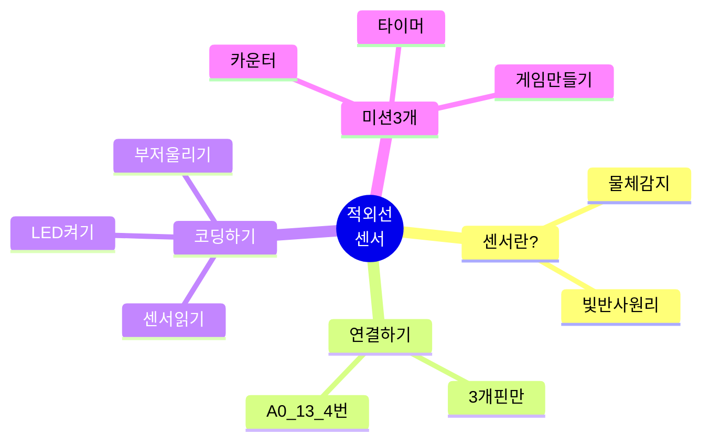
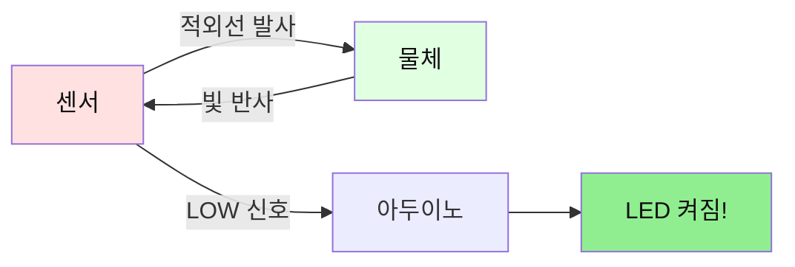
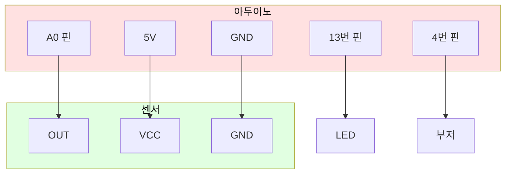
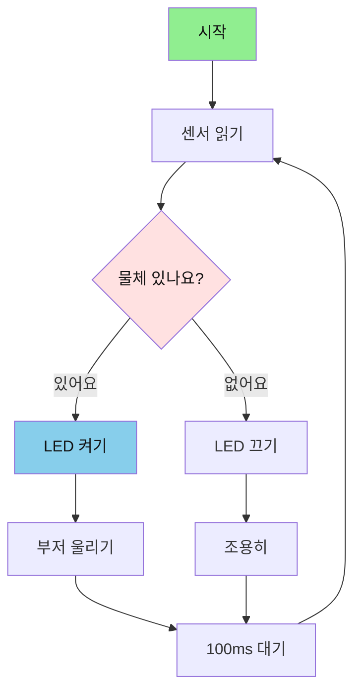
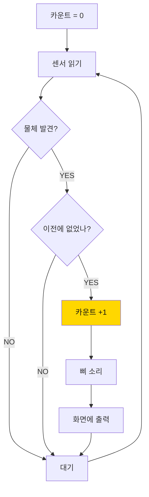
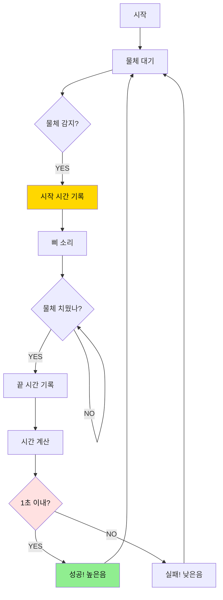
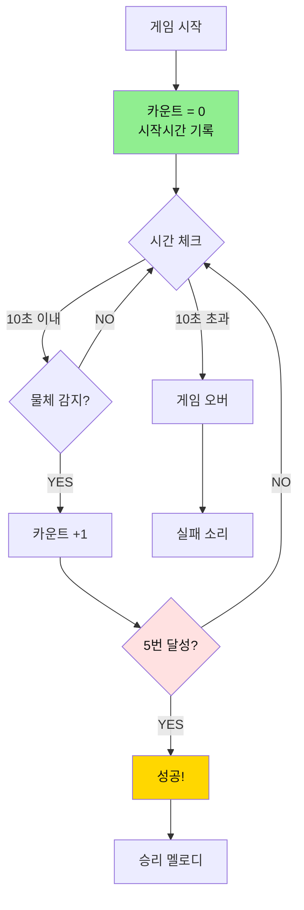

# 01. 적외선 센서

## 📚 무엇을 배울까요?



---

## 1. 적외선 센서가 뭐예요?

### 간단 설명
- **적외선 센서**: 눈에 안 보이는 빛을 쏘아서 물체를 찾는 센서
- **원리**: 빛이 물체에 부딪혀 돌아오면 "물체 있어요!" 신호를 보냄



---

## 2. 준비물

| 이름 | 개수 | 용도 |
|------|------|------|
| 아두이노 우노 | 1개 | 두뇌 |
| 적외선 센서 | 1개 | 물체 찾기 |
| LED | 1개 | 불 켜기 |
| 부저 | 1개 | 소리 내기 |
| 점퍼선 | 7개 | 연결 |

---

## 3. 연결하기 (3개 핀만!)



**연결 순서:**
1. 센서 OUT → 아두이노 A0
2. 센서 VCC → 아두이노 5V
3. 센서 GND → 아두이노 GND
4. LED → 아두이노 13번
5. 부저 → 아두이노 4번

---

## 4. 기본 코드 (복사해서 사용하세요!)

```cpp
// 핀 번호 정하기
#define SENSOR_PIN  A0
#define LED_PIN     13
#define BUZZER_PIN  4

void setup() {
  Serial.begin(9600);
  
  pinMode(SENSOR_PIN, INPUT);   // 센서는 입력
  pinMode(LED_PIN, OUTPUT);     // LED는 출력
  pinMode(BUZZER_PIN, OUTPUT);  // 부저는 출력
  
  Serial.println("Start!");
}

void loop() {
  // 센서 읽기 (LOW = 물체 있음)
  int value = digitalRead(SENSOR_PIN);
  
  if (value == LOW) {
    // 물체 발견!
    digitalWrite(LED_PIN, HIGH);    // LED 켜기
    tone(BUZZER_PIN, 523, 100);     // 삐 소리
    Serial.println("Object detected!");
  } else {
    // 물체 없음
    digitalWrite(LED_PIN, LOW);     // LED 끄기
    Serial.println("No object");
  }
  
  delay(100);
}
```

---

## 5. 동작 원리 (순서도)



---

## 6. 미션 3개 (난이도 순)

### 🎯 미션 1: 물체 카운터 만들기

**목표**: 물체가 몇 번 지나갔는지 세기

**핵심 개념**: 
- 변수로 숫자 세기
- 상태 변화 감지

**순서도:**


**정답 코드:**
```cpp
#define SENSOR_PIN  A0
#define LED_PIN     13
#define BUZZER_PIN  4

int count = 0;              // 몇 번 지나갔는지
bool lastState = false;     // 이전에 물체 있었는지

void setup() {
  Serial.begin(9600);
  pinMode(SENSOR_PIN, INPUT);
  pinMode(LED_PIN, OUTPUT);
  pinMode(BUZZER_PIN, OUTPUT);
  
  Serial.println("=== Object Counter ===");
  Serial.println("Put object in front of sensor!");
}

void loop() {
  // 센서 읽기
  bool detected = (digitalRead(SENSOR_PIN) == LOW);
  
  // 물체가 새로 나타났을 때만 카운트
  if (detected && !lastState) {
    count++;  // 1 증가
    
    digitalWrite(LED_PIN, HIGH);
    tone(BUZZER_PIN, 523, 100);
    
    Serial.print("Object #");
    Serial.println(count);
  }
  
  // 물체 없으면 LED 끄기
  if (!detected) {
    digitalWrite(LED_PIN, LOW);
  }
  
  lastState = detected;
  delay(100);
}
```

**핵심 포인트:**
- `count++`: 1씩 증가
- `lastState`: 새로운 물체인지 확인
- `detected && !lastState`: 물체가 새로 나타났을 때만

---

### 🎯 미션 2: 반응속도 측정기

**목표**: 물체를 빨리 치우는 게임 만들기

**핵심 개념**:
- 시간 측정 (millis)
- 빠르기 판정

**순서도:**


**정답 코드:**
```cpp
#define SENSOR_PIN  A0
#define LED_PIN     13
#define BUZZER_PIN  4

unsigned long startTime = 0;
bool gameOn = false;

void setup() {
  Serial.begin(9600);
  pinMode(SENSOR_PIN, INPUT);
  pinMode(LED_PIN, OUTPUT);
  pinMode(BUZZER_PIN, OUTPUT);
  
  Serial.println("=== Reaction Speed Game ===");
  Serial.println("Put object and remove it quickly!");
}

void loop() {
  bool detected = (digitalRead(SENSOR_PIN) == LOW);
  
  if (detected && !gameOn) {
    // 게임 시작!
    gameOn = true;
    startTime = millis();
    
    digitalWrite(LED_PIN, HIGH);
    tone(BUZZER_PIN, 1000, 200);  // 높은 삐 소리
    
    Serial.println("Remove it NOW!");
    
  } else if (!detected && gameOn) {
    // 게임 끝!
    gameOn = false;
    unsigned long elapsed = millis() - startTime;
    
    digitalWrite(LED_PIN, LOW);
    
    Serial.print("Time: ");
    Serial.print(elapsed);
    Serial.println("ms");
    
    // 1초 이내면 성공!
    if (elapsed < 1000) {
      Serial.println("SUCCESS! You are fast!");
      tone(BUZZER_PIN, 1500, 500);  // 성공 소리
    } else {
      Serial.println("Too slow! Try again!");
      tone(BUZZER_PIN, 300, 500);   // 실패 소리
    }
    
    Serial.println("Put object again!\n");
    delay(2000);
  }
  
  delay(50);
}
```

**핵심 포인트:**
- `millis()`: 시간 재기
- `startTime = millis()`: 시작 시간 기록
- `elapsed = millis() - startTime`: 얼마나 걸렸는지 계산

---

### 🎯 미션 3: 두더지 잡기 게임

**목표**: 10초 안에 5번 물체 대기

**핵심 개념**:
- 제한 시간
- 목표 달성

**순서도:**


**정답 코드:**
```cpp
#define SENSOR_PIN  A0
#define LED_PIN     13
#define BUZZER_PIN  4

int target = 5;              // 5번 달성
int timeLimit = 10000;       // 10초 (밀리초)
int count = 0;
unsigned long startTime;
bool gameOn = false;
bool lastState = false;

void setup() {
  Serial.begin(9600);
  pinMode(SENSOR_PIN, INPUT);
  pinMode(LED_PIN, OUTPUT);
  pinMode(BUZZER_PIN, OUTPUT);
  
  Serial.println("=== Whack-a-Mole Game ===");
  Serial.println("Touch 5 times in 10 seconds!");
  Serial.println("Put object to start!");
}

void loop() {
  bool detected = (digitalRead(SENSOR_PIN) == LOW);
  
  // 게임 시작 대기
  if (!gameOn && detected) {
    gameOn = true;
    count = 0;
    startTime = millis();
    tone(BUZZER_PIN, 1000, 300);
    Serial.println("\nGame START!");
  }
  
  // 게임 중
  if (gameOn) {
    unsigned long elapsed = millis() - startTime;
    unsigned long remaining = timeLimit - elapsed;
    
    // 물체 감지
    if (detected && !lastState) {
      count++;
      digitalWrite(LED_PIN, HIGH);
      tone(BUZZER_PIN, 523 + (count * 100), 100);
      
      Serial.print("Hit ");
      Serial.print(count);
      Serial.print("/");
      Serial.print(target);
      Serial.print(" (Time left: ");
      Serial.print(remaining / 1000);
      Serial.println("s)");
      
      // 목표 달성!
      if (count >= target) {
        Serial.println("\nSUCCESS! You win!");
        
        // 승리 멜로디
        int melody[] = {523, 659, 784, 1047};
        for (int i = 0; i < 4; i++) {
          tone(BUZZER_PIN, melody[i], 200);
          delay(250);
        }
        
        gameOn = false;
        digitalWrite(LED_PIN, LOW);
        Serial.println("\nPut object to play again!\n");
      }
    }
    
    if (!detected) {
      digitalWrite(LED_PIN, LOW);
    }
    
    // 시간 초과
    if (elapsed >= timeLimit && gameOn) {
      Serial.println("\nTime Over!");
      Serial.print("Result: ");
      Serial.print(count);
      Serial.print("/");
      Serial.println(target);
      
      // 실패 소리
      tone(BUZZER_PIN, 200, 1000);
      
      gameOn = false;
      digitalWrite(LED_PIN, LOW);
      Serial.println("\nPut object to try again!\n");
    }
  }
  
  lastState = detected;
  delay(50);
}
```

**핵심 포인트:**
- `elapsed = millis() - startTime`: 지금까지 흐른 시간
- `remaining = timeLimit - elapsed`: 남은 시간 계산
- `if (elapsed >= timeLimit)`: 시간 초과 확인

---

## 7. 자주 묻는 질문 (간단 버전)

### Q1. 센서가 물체를 못 찾아요
**답**: 센서 뒷면의 작은 나사를 드라이버로 돌려보세요 (감도 조절)

### Q2. LED가 계속 깜빡여요
**답**: 정상이에요! 센서가 계속 확인하고 있어요

### Q3. 부저 소리가 안 나요
**답**: 
- 부저 +, - 방향 확인
- 4번 핀에 연결했는지 확인

### Q4. 검은색 물체가 안 잡혀요
**답**: 검은색은 빛을 잘 반사하지 않아요. 흰 종이로 테스트해보세요

### Q5. 코드를 어떻게 업로드하나요?
**답**:
1. 코드 복사
2. 아두이노 IDE에 붙여넣기
3. 보드 선택: "Arduino Uno"
4. 포트 선택: COM3 (숫자는 다를 수 있음)
5. 업로드 버튼 (→) 클릭

---

## 8. 미션 성공 체크리스트


---

## 9. 다음 단계

**다음 배울 것**: [02_컬러센서 가이드](./02_컬러센서_간단가이드.md)

---

**만든 날**: 2026-01-27  
**난이도**: ⭐⭐☆☆☆ (중학생용)

