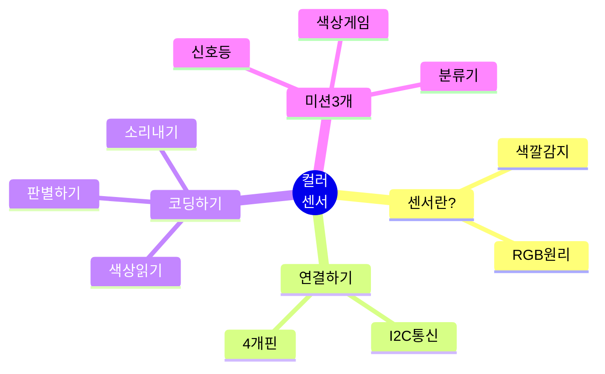
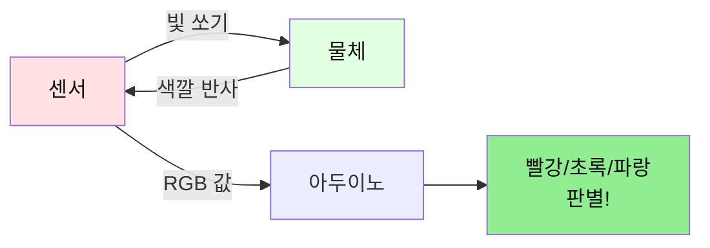
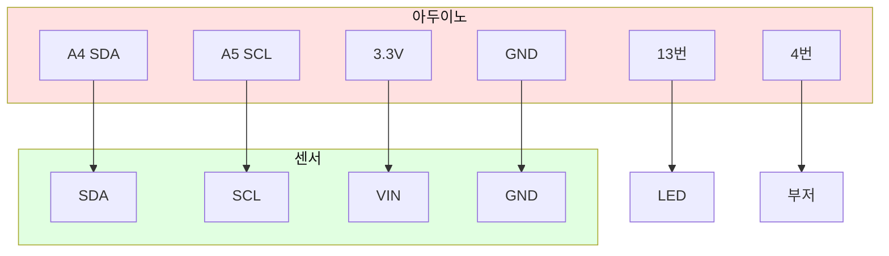
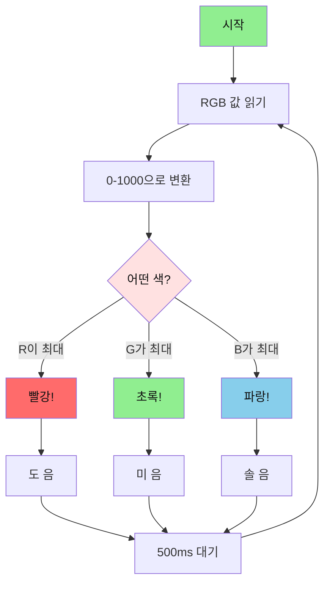
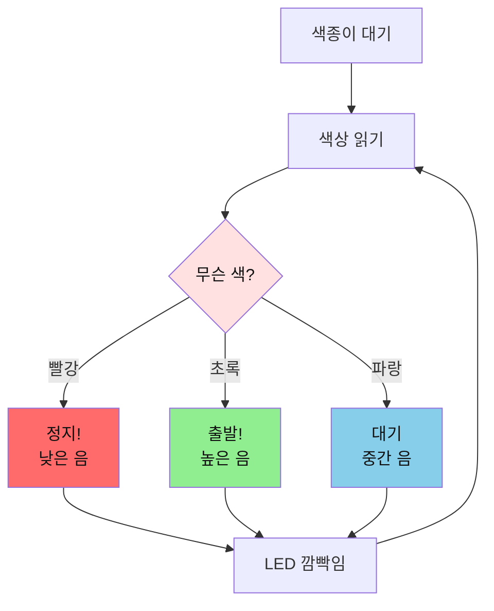
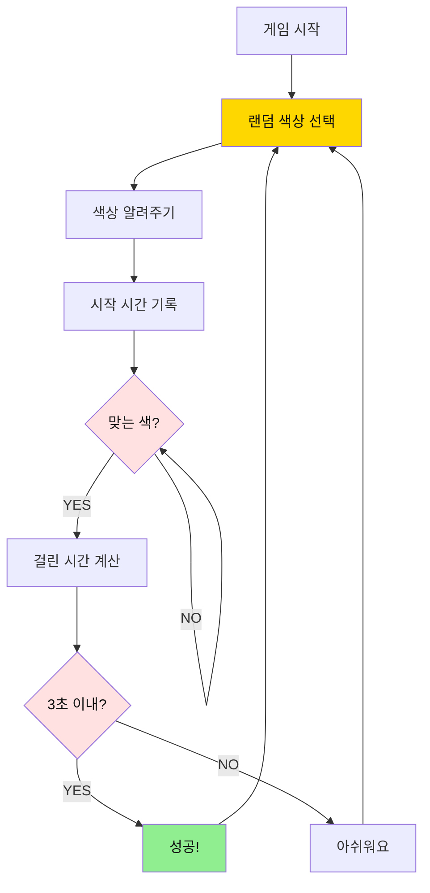
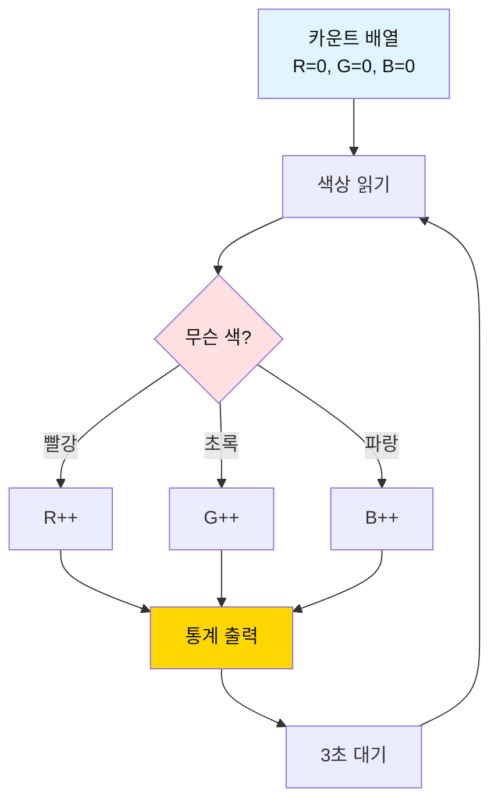

# 02. 컬러 센서

## 📚 무엇을 배울까요?



---

## 1. 컬러 센서가 뭐예요?

### 간단 설명
- **컬러 센서**: 물체의 색깔을 알아내는 센서
- **원리**: 빨강(R), 초록(G), 파랑(B) 빛의 양을 측정해서 색깔 판별



---

## 2. 준비물

| 이름 | 개수 | 용도 |
|------|------|------|
| 아두이노 우노 | 1개 | 두뇌 |
| TCS34725 센서 | 1개 | 색깔 감지 |
| LED | 1개 | 상태 표시 |
| 부저 | 1개 | 소리 내기 |
| 색종이 | 3장 | 빨강, 초록, 파랑 |
| 점퍼선 | 8개 | 연결 |

---

## 3. 연결하기 (4개 핀)



**중요!** 센서는 **3.3V**를 사용해요! (5V 아님)

**연결 순서:**
1. 센서 SDA → 아두이노 A4
2. 센서 SCL → 아두이노 A5
3. 센서 VIN → 아두이노 3.3V (5V 금지!)
4. 센서 GND → 아두이노 GND
5. LED → 13번
6. 부저 → 4번

---

## 4. 라이브러리 설치

**먼저 설치해야 해요!**
1. 아두이노 IDE 열기
2. 스케치 → 라이브러리 포함하기 → 라이브러리 관리
3. "Adafruit TCS34725" 검색
4. 설치 버튼 클릭

---

## 5. 기본 코드

```cpp
#include <Wire.h>
#include <Adafruit_TCS34725.h>

#define LED_PIN    13
#define BUZZER_PIN 4

// 센서 객체 만들기
Adafruit_TCS34725 colorSensor = Adafruit_TCS34725();

void setup() {
  Serial.begin(9600);
  pinMode(LED_PIN, OUTPUT);
  pinMode(BUZZER_PIN, OUTPUT);
  
  // 센서 시작
  if (!colorSensor.begin()) {
    Serial.println("Sensor not found!");
    while (1);  // 멈춤
  }
  
  digitalWrite(LED_PIN, HIGH);
  Serial.println("Color Sensor Ready!");
}

void loop() {
  uint16_t r, g, b, c;
  
  // 색상 읽기
  colorSensor.getRawData(&r, &g, &b, &c);
  
  // 0-1000 범위로 변환
  int red = map(r, 0, 20000, 0, 1000);
  int green = map(g, 0, 20000, 0, 1000);
  int blue = map(b, 0, 20000, 0, 1000);
  
  // 결과 출력
  Serial.print("R:");
  Serial.print(red);
  Serial.print(" G:");
  Serial.print(green);
  Serial.print(" B:");
  Serial.println(blue);
  
  // 색상 판별
  if (red > green && red > blue) {
    Serial.println("RED!");
    tone(BUZZER_PIN, 523, 100);  // 도
  } else if (green > red && green > blue) {
    Serial.println("GREEN!");
    tone(BUZZER_PIN, 659, 100);  // 미
  } else if (blue > red && blue > green) {
    Serial.println("BLUE!");
    tone(BUZZER_PIN, 784, 100);  // 솔
  }
  
  delay(500);
}
```

---

## 6. 동작 원리



---

## 7. 미션 3개

### 미션 1: 신호등 만들기

**목표**: 빨강/초록/파랑 색종이로 신호등 작동

**핵심 개념**:
- 색상 판별
- 각 색상마다 다른 동작

**순서도:**


**정답 코드:**
```cpp
#include <Wire.h>
#include <Adafruit_TCS34725.h>

#define LED_PIN    13
#define BUZZER_PIN 4

Adafruit_TCS34725 colorSensor = Adafruit_TCS34725();

void setup() {
  Serial.begin(9600);
  pinMode(LED_PIN, OUTPUT);
  pinMode(BUZZER_PIN, OUTPUT);
  
  if (!colorSensor.begin()) {
    Serial.println("Sensor error!");
    while (1);
  }
  
  Serial.println("=== Traffic Light ===");
  Serial.println("Show RED/GREEN/BLUE paper!");
}

void loop() {
  uint16_t r, g, b, c;
  colorSensor.getRawData(&r, &g, &b, &c);
  
  int red = map(r, 0, 20000, 0, 1000);
  int green = map(g, 0, 20000, 0, 1000);
  int blue = map(b, 0, 20000, 0, 1000);
  
  // 색상 판별
  if (red > green && red > blue && red > 100) {
    // 빨강 = 정지
    Serial.println("RED - STOP!");
    tone(BUZZER_PIN, 262, 500);  // 낮은 도
    
    // LED 빠르게 깜빡임
    for (int i = 0; i < 5; i++) {
      digitalWrite(LED_PIN, HIGH);
      delay(100);
      digitalWrite(LED_PIN, LOW);
      delay(100);
    }
    
  } else if (green > red && green > blue && green > 100) {
    // 초록 = 출발
    Serial.println("GREEN - GO!");
    tone(BUZZER_PIN, 1047, 500);  // 높은 도
    
    // LED 계속 켜짐
    digitalWrite(LED_PIN, HIGH);
    delay(1000);
    
  } else if (blue > red && blue > green && blue > 100) {
    // 파랑 = 대기
    Serial.println("BLUE - WAIT!");
    tone(BUZZER_PIN, 523, 500);  // 중간 도
    
    // LED 천천히 깜빡임
    for (int i = 0; i < 2; i++) {
      digitalWrite(LED_PIN, HIGH);
      delay(250);
      digitalWrite(LED_PIN, LOW);
      delay(250);
    }
  }
  
  digitalWrite(LED_PIN, LOW);
  delay(500);
}
```

**핵심 포인트:**
- `red > green && red > blue`: 빨강이 가장 클 때
- `red > 100`: 너무 어두운 색 제외
- 색상마다 다른 소리와 LED 패턴

---

### 미션 2: 색상 맞추기 게임

**목표**: 컴퓨터가 말하는 색깔 빨리 찾기

**핵심 개념**:
- 랜덤 색상 선택
- 시간 측정

**순서도:**


**정답 코드:**
```cpp
#include <Wire.h>
#include <Adafruit_TCS34725.h>

#define LED_PIN    13
#define BUZZER_PIN 4

Adafruit_TCS34725 colorSensor = Adafruit_TCS34725();

int targetColor = 0;  // 0=빨강, 1=초록, 2=파랑
unsigned long startTime = 0;
bool gameOn = false;

void setup() {
  Serial.begin(9600);
  pinMode(LED_PIN, OUTPUT);
  pinMode(BUZZER_PIN, OUTPUT);
  
  if (!colorSensor.begin()) {
    Serial.println("Sensor error!");
    while (1);
  }
  
  Serial.println("=== Color Match Game ===");
  randomSeed(analogRead(A0));
  newRound();
}

void newRound() {
  targetColor = random(0, 3);  // 0, 1, 2 중 랜덤
  gameOn = true;
  startTime = millis();
  
  Serial.println("\n--- New Round ---");
  Serial.print("Find: ");
  
  if (targetColor == 0) {
    Serial.println("RED");
  } else if (targetColor == 1) {
    Serial.println("GREEN");
  } else {
    Serial.println("BLUE");
  }
  
  tone(BUZZER_PIN, 1000, 200);
}

void loop() {
  if (!gameOn) return;
  
  uint16_t r, g, b, c;
  colorSensor.getRawData(&r, &g, &b, &c);
  
  int red = map(r, 0, 20000, 0, 1000);
  int green = map(g, 0, 20000, 0, 1000);
  int blue = map(b, 0, 20000, 0, 1000);
  
  int detected = -1;
  
  if (red > green && red > blue && red > 100) {
    detected = 0;  // 빨강
  } else if (green > red && green > blue && green > 100) {
    detected = 1;  // 초록
  } else if (blue > red && blue > green && blue > 100) {
    detected = 2;  // 파랑
  }
  
  // 정답 확인
  if (detected == targetColor) {
    gameOn = false;
    unsigned long elapsed = millis() - startTime;
    
    digitalWrite(LED_PIN, HIGH);
    
    Serial.print("Time: ");
    Serial.print(elapsed / 1000.0);
    Serial.println("s");
    
    if (elapsed < 3000) {
      Serial.println("EXCELLENT!");
      tone(BUZZER_PIN, 1500, 500);
    } else {
      Serial.println("GOOD!");
      tone(BUZZER_PIN, 800, 500);
    }
    
    delay(2000);
    digitalWrite(LED_PIN, LOW);
    newRound();
  }
  
  delay(100);
}
```

**핵심 포인트:**
- `random(0, 3)`: 0, 1, 2 중 랜덤 선택
- `millis() - startTime`: 걸린 시간 계산
- `detected == targetColor`: 정답 확인

---

### 미션 3: 색상 분류기

**목표**: 색깔별로 개수 세기

**핵심 개념**:
- 배열로 개수 저장
- 통계 출력

**순서도:**


**정답 코드:**
```cpp
#include <Wire.h>
#include <Adafruit_TCS34725.h>

#define LED_PIN    13
#define BUZZER_PIN 4

Adafruit_TCS34725 colorSensor = Adafruit_TCS34725();

int colorCount[3] = {0, 0, 0};  // 빨강, 초록, 파랑 개수
int lastColor = -1;

void setup() {
  Serial.begin(9600);
  pinMode(LED_PIN, OUTPUT);
  pinMode(BUZZER_PIN, OUTPUT);
  
  if (!colorSensor.begin()) {
    Serial.println("Sensor error!");
    while (1);
  }
  
  Serial.println("=== Color Sorter ===");
  Serial.println("Show different colors!");
}

void loop() {
  uint16_t r, g, b, c;
  colorSensor.getRawData(&r, &g, &b, &c);
  
  int red = map(r, 0, 20000, 0, 1000);
  int green = map(g, 0, 20000, 0, 1000);
  int blue = map(b, 0, 20000, 0, 1000);
  
  int detected = -1;
  String colorName = "";
  
  if (red > green && red > blue && red > 100) {
    detected = 0;
    colorName = "RED";
  } else if (green > red && green > blue && green > 100) {
    detected = 1;
    colorName = "GREEN";
  } else if (blue > red && blue > green && blue > 100) {
    detected = 2;
    colorName = "BLUE";
  }
  
  // 새로운 색상이면 카운트
  if (detected != -1 && detected != lastColor) {
    colorCount[detected]++;
    
    digitalWrite(LED_PIN, HIGH);
    tone(BUZZER_PIN, 523 + (detected * 131), 200);
    
    Serial.println("\n--- Detected ---");
    Serial.print("Color: ");
    Serial.println(colorName);
    
    // 통계 출력
    Serial.println("\n=== Statistics ===");
    Serial.print("RED:   ");
    Serial.println(colorCount[0]);
    Serial.print("GREEN: ");
    Serial.println(colorCount[1]);
    Serial.print("BLUE:  ");
    Serial.println(colorCount[2]);
    Serial.print("TOTAL: ");
    Serial.println(colorCount[0] + colorCount[1] + colorCount[2]);
    
    delay(1000);
    digitalWrite(LED_PIN, LOW);
  }
  
  lastColor = detected;
  delay(200);
}
```

**핵심 포인트:**
- `int colorCount[3]`: 배열로 3가지 색 개수 저장
- `colorCount[detected]++`: 해당 색 개수 증가
- `detected != lastColor`: 새로운 색상인지 확인

---

## 8. 자주 묻는 질문

### Q1. 센서가 초기화 안 돼요
**답**: 
- 3.3V에 연결했는지 확인 (5V 아님!)
- SDA, SCL 핀 확인 (A4, A5)

### Q2. 색상이 정확하지 않아요
**답**: 
- 센서와 물체 거리 1-3cm 유지
- 조명이 일정한 곳에서 테스트
- 흰색 종이로 먼저 테스트

### Q3. 검은색이 안 잡혀요
**답**: 검은색은 빛을 거의 반사하지 않아서 측정이 어려워요

### Q4. 노란색도 인식하고 싶어요
**답**: 
```cpp
// 노란색 = 빨강 + 초록
if (red > 300 && green > 300 && blue < 200) {
  Serial.println("YELLOW!");
}
```

### Q5. 라이브러리 설치가 안 돼요
**답**: 
1. 스케치 → 라이브러리 포함하기 → 라이브러리 관리
2. "Adafruit TCS34725" 검색
3. 설치 클릭

---

## 9. 다음 단계

**다음 배울 것**: [03_RGB_LED 가이드](./03_RGB_LED_간단가이드.md)

---

**만든 날**: 2026-01-27  
**난이도**: ⭐⭐⭐☆☆ (중학생용)

