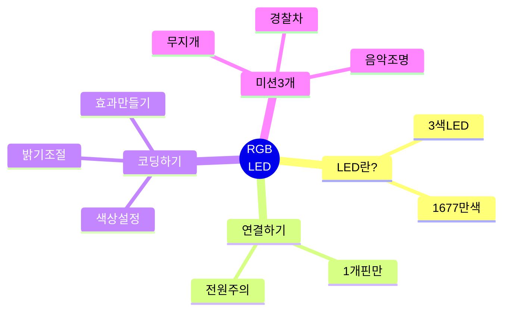
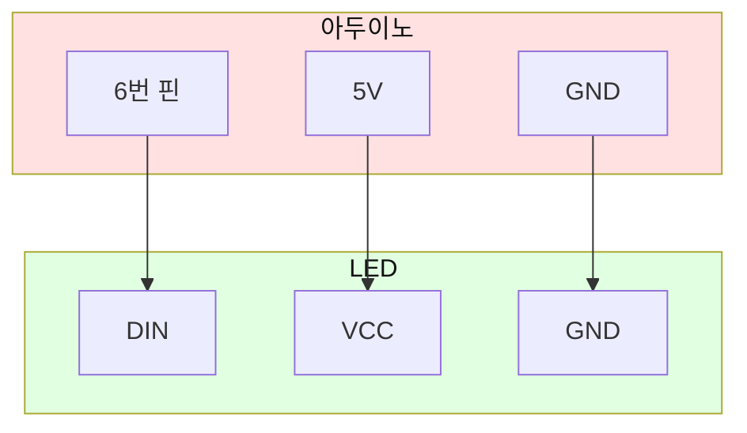
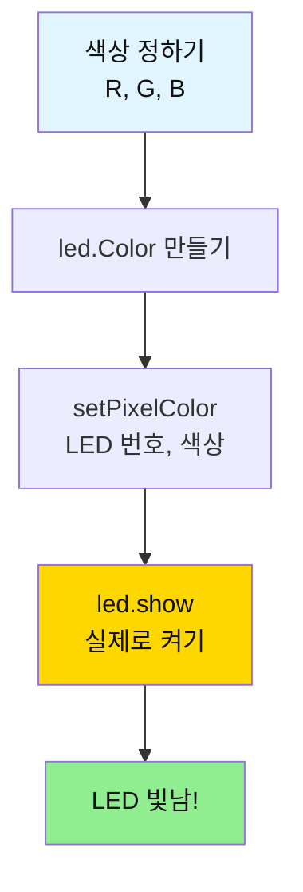
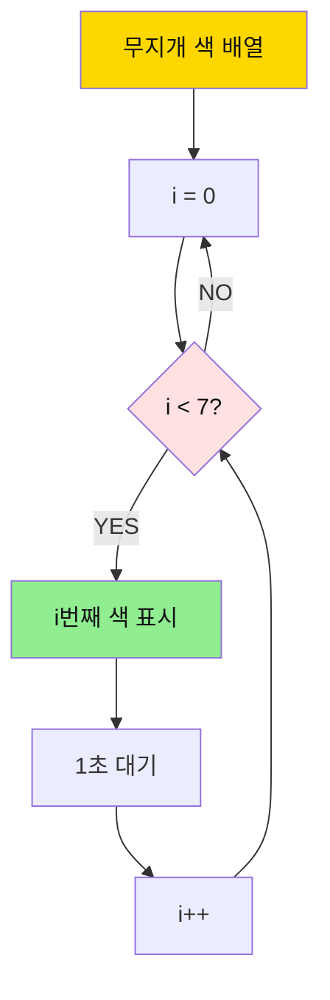
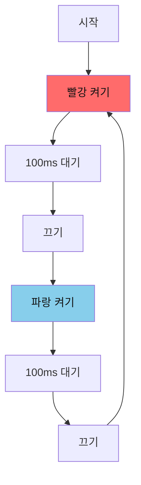
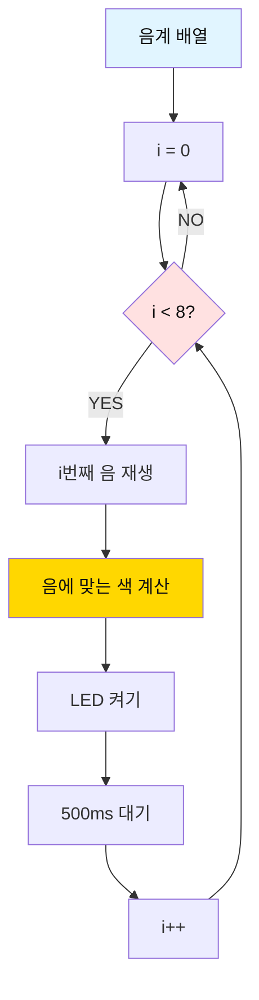

# 03. RGB LED 

## 📚 무엇을 배울까요?



---

## 1. RGB LED가 뭐예요?

### 간단 설명
- **RGB LED**: 빨강(R), 초록(G), 파랑(B) 3가지 색을 섞어서 모든 색을 만드는 LED
- **NeoPixel**: 아두이노로 쉽게 제어할 수 있는 똑똑한 RGB LED


---

## 2. 준비물

| 이름 | 개수 | 용도 |
|------|------|------|
| 아두이노 우노 | 1개 | 두뇌 |
| NeoPixel LED | 3개 | 색깔 표시 |
| 점퍼선 | 3개 | 연결 |

---

## 3. 연결하기 (3개 핀만!)



**연결 순서:**
1. LED DIN → 아두이노 6번
2. LED VCC → 아두이노 5V
3. LED GND → 아두이노 GND

---

## 4. 라이브러리 설치

1. 스케치 → 라이브러리 포함하기 → 라이브러리 관리
2. "Adafruit NeoPixel" 검색
3. 설치 클릭

---

## 5. 기본 코드

```cpp
#include <Adafruit_NeoPixel.h>

#define LED_PIN    6
#define NUM_PIXELS 3  // LED 개수

Adafruit_NeoPixel led = Adafruit_NeoPixel(NUM_PIXELS, LED_PIN);

void setup() {
  Serial.begin(9600);
  led.begin();
  led.setBrightness(100);  // 밝기 (0-255)
  led.show();  // LED 끄기
  
  Serial.println("RGB LED Ready!");
}

void loop() {
  // 빨강
  led.setPixelColor(0, led.Color(255, 0, 0));
  led.show();
  Serial.println("RED");
  delay(1000);
  
  // 초록
  led.setPixelColor(0, led.Color(0, 255, 0));
  led.show();
  Serial.println("GREEN");
  delay(1000);
  
  // 파랑
  led.setPixelColor(0, led.Color(0, 0, 255));
  led.show();
  Serial.println("BLUE");
  delay(1000);
}
```

---

## 6. 동작 원리



**색상 만들기:**
- 빨강: `led.Color(255, 0, 0)`
- 초록: `led.Color(0, 255, 0)`
- 파랑: `led.Color(0, 0, 255)`
- 노랑: `led.Color(255, 255, 0)`
- 보라: `led.Color(255, 0, 255)`
- 흰색: `led.Color(255, 255, 255)`

---

## 7. 미션 3개

### 미션 1: 무지개 만들기

**목표**: 7가지 무지개 색 순서대로 표시

**핵심 개념**:
- 배열로 색상 저장
- 반복문으로 순서대로 표시

**순서도:**


**정답 코드:**
```cpp
#include <Adafruit_NeoPixel.h>

#define LED_PIN    6
#define NUM_PIXELS 3

Adafruit_NeoPixel led = Adafruit_NeoPixel(NUM_PIXELS, LED_PIN);

// 무지개 7색 (R, G, B)
int rainbow[7][3] = {
  {255, 0, 0},      // 빨강
  {255, 127, 0},    // 주황
  {255, 255, 0},    // 노랑
  {0, 255, 0},      // 초록
  {0, 0, 255},      // 파랑
  {75, 0, 130},     // 남색
  {148, 0, 211}     // 보라
};

String colorNames[] = {
  "Red", "Orange", "Yellow", "Green", 
  "Blue", "Indigo", "Violet"
};

void setup() {
  Serial.begin(9600);
  led.begin();
  led.setBrightness(100);
  led.show();
  
  Serial.println("=== Rainbow ===");
}

void loop() {
  for (int i = 0; i < 7; i++) {
    // 모든 LED에 같은 색
    for (int j = 0; j < NUM_PIXELS; j++) {
      led.setPixelColor(j, led.Color(
        rainbow[i][0],  // R
        rainbow[i][1],  // G
        rainbow[i][2]   // B
      ));
    }
    led.show();
    
    Serial.println(colorNames[i]);
    delay(1000);
  }
  
  Serial.println("---");
  delay(500);
}
```

**핵심 포인트:**
- `int rainbow[7][3]`: 2차원 배열로 7가지 색 저장
- `rainbow[i][0]`: i번째 색의 R 값
- 이중 for문: 모든 LED에 같은 색 적용

---

### 미션 2: 경찰차 사이렌

**목표**: 빨강-파랑 번갈아 깜빡이기

**핵심 개념**:
- 빠른 깜빡임
- 2가지 색 번갈아

**순서도:**


**정답 코드:**
```cpp
#include <Adafruit_NeoPixel.h>

#define LED_PIN    6
#define NUM_PIXELS 3

Adafruit_NeoPixel led = Adafruit_NeoPixel(NUM_PIXELS, LED_PIN);

void setup() {
  Serial.begin(9600);
  led.begin();
  led.setBrightness(255);  // 최대 밝기
  led.show();
  
  Serial.println("=== Police Siren ===");
}

void loop() {
  // 빨강 깜빡임 (3회)
  for (int i = 0; i < 3; i++) {
    // 모든 LED 빨강
    for (int j = 0; j < NUM_PIXELS; j++) {
      led.setPixelColor(j, led.Color(255, 0, 0));
    }
    led.show();
    delay(100);
    
    // 끄기
    for (int j = 0; j < NUM_PIXELS; j++) {
      led.setPixelColor(j, led.Color(0, 0, 0));
    }
    led.show();
    delay(100);
  }
  
  // 파랑 깜빡임 (3회)
  for (int i = 0; i < 3; i++) {
    // 모든 LED 파랑
    for (int j = 0; j < NUM_PIXELS; j++) {
      led.setPixelColor(j, led.Color(0, 0, 255));
    }
    led.show();
    delay(100);
    
    // 끄기
    for (int j = 0; j < NUM_PIXELS; j++) {
      led.setPixelColor(j, led.Color(0, 0, 0));
    }
    led.show();
    delay(100);
  }
}
```

**핵심 포인트:**
- `delay(100)`: 빠른 깜빡임
- `led.Color(0, 0, 0)`: LED 끄기
- 3회 반복으로 사이렌 효과

---

### 미션 3: 음악에 맞춘 조명

**목표**: 부저 음에 따라 LED 색 변경

**핵심 개념**:
- 음 높이와 색상 연결
- 동시 제어

**순서도:**


**정답 코드:**
```cpp
#include <Adafruit_NeoPixel.h>

#define LED_PIN    6
#define NUM_PIXELS 3
#define BUZZER_PIN 4

Adafruit_NeoPixel led = Adafruit_NeoPixel(NUM_PIXELS, LED_PIN);

// 도레미파솔라시도
int melody[] = {262, 294, 330, 349, 392, 440, 494, 523};
String notes[] = {"Do", "Re", "Mi", "Fa", "Sol", "La", "Si", "Do"};

void setup() {
  Serial.begin(9600);
  pinMode(BUZZER_PIN, OUTPUT);
  
  led.begin();
  led.setBrightness(200);
  led.show();
  
  Serial.println("=== Music Light ===");
}

void loop() {
  for (int i = 0; i < 8; i++) {
    // 음 재생
    tone(BUZZER_PIN, melody[i], 400);
    
    // 음에 따라 색상 변경
    // 낮은 음 = 빨강, 높은 음 = 파랑
    int red = map(i, 0, 7, 255, 0);
    int blue = map(i, 0, 7, 0, 255);
    
    // 모든 LED에 적용
    for (int j = 0; j < NUM_PIXELS; j++) {
      led.setPixelColor(j, led.Color(red, 0, blue));
    }
    led.show();
    
    Serial.print(notes[i]);
    Serial.print(" - R:");
    Serial.print(red);
    Serial.print(" B:");
    Serial.println(blue);
    
    delay(500);
  }
  
  // 모든 LED 끄기
  for (int j = 0; j < NUM_PIXELS; j++) {
    led.setPixelColor(j, led.Color(0, 0, 0));
  }
  led.show();
  
  Serial.println("---");
  delay(1000);
}
```

**핵심 포인트:**
- `map(i, 0, 7, 255, 0)`: i가 0→7일 때, 255→0으로 변환
- 낮은 음(i=0): 빨강(255, 0, 0)
- 높은 음(i=7): 파랑(0, 0, 255)
- `tone()`과 LED 동시 제어

---

## 8. 자주 묻는 질문

### Q1. LED가 안 켜져요
**답**: 
- `led.show()` 호출했는지 확인
- 전원 연결 확인 (VCC → 5V)

### Q2. 색상이 이상해요
**답**: 
```cpp
// RGB 순서 확인
Adafruit_NeoPixel led = Adafruit_NeoPixel(
  NUM_PIXELS, 
  LED_PIN, 
  NEO_GRB + NEO_KHZ800  // GRB 순서
);
```

### Q3. 일부 LED만 켜져요
**답**: 
- LED 연결 순서 확인 (DIN → DOUT)
- 전원 부족 (LED 많으면 외부 전원)

### Q4. LED를 끄려면?
**답**: 
```cpp
led.setPixelColor(0, led.Color(0, 0, 0));
led.show();
```

### Q5. 밝기를 조절하려면?
**답**: 
```cpp
led.setBrightness(50);  // 0-255
```

---

## 9. 다음 단계

**다음 배울 것**: [04_DC모터 가이드](./04_DC모터_간단가이드.md)

---

**만든 날**: 2026-01-27  
**난이도**: ⭐⭐☆☆☆ (중학생용)

