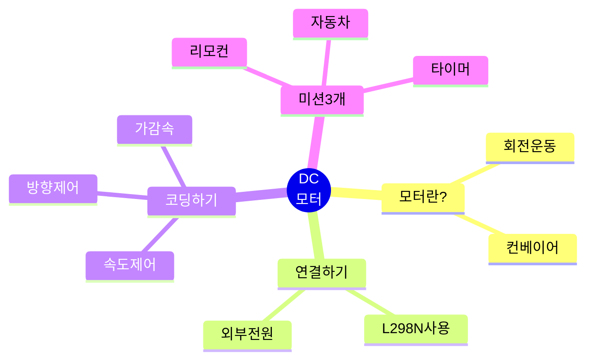
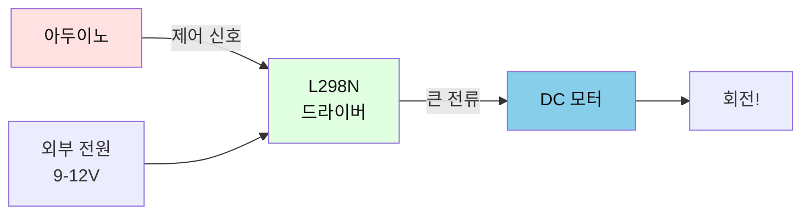
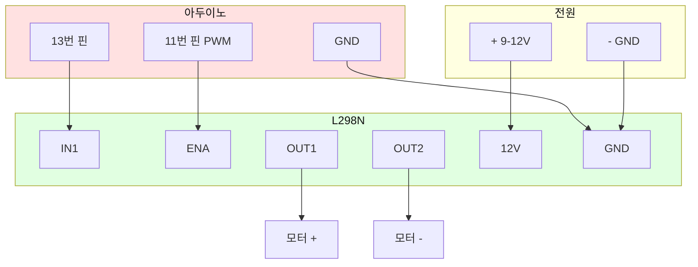
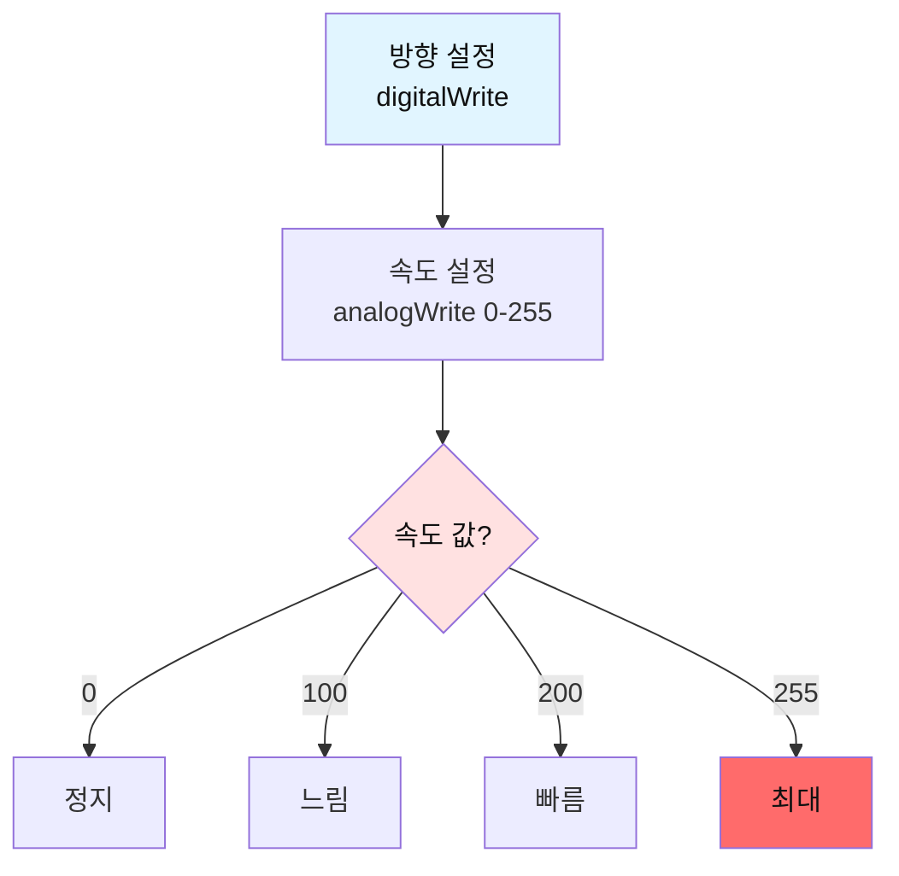
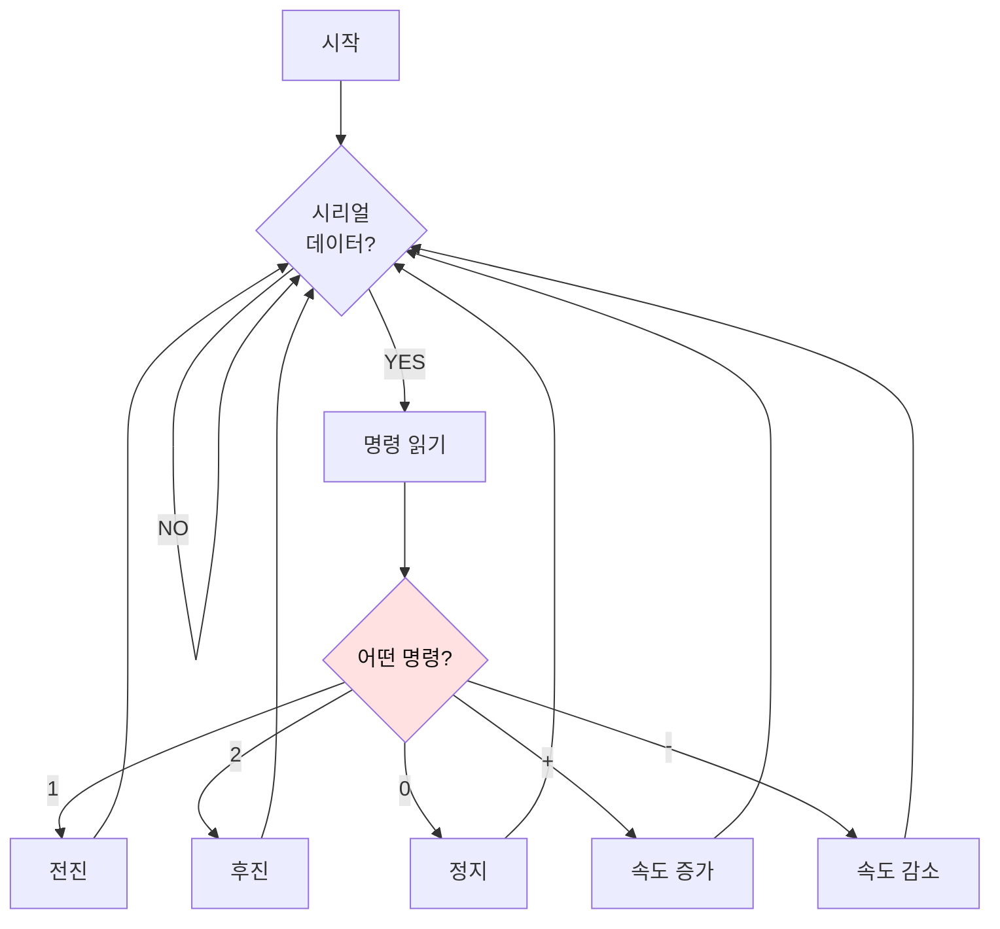
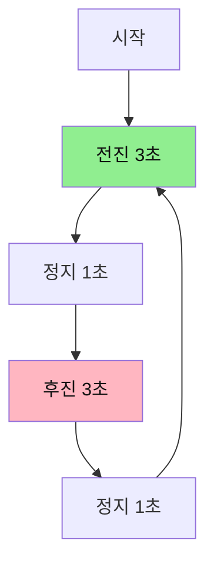
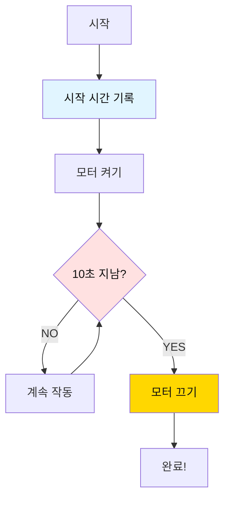

# 04. DC 모터 

## 📚 무엇을 배울까요?



---

## 1. DC 모터가 뭐예요?

### 간단 설명
- **DC 모터**: 전기로 빙글빙글 도는 모터
- **L298N**: 모터를 제어하는 드라이버 (모터는 전기를 많이 먹어서 필요해요)



---

## 2. 준비물

| 이름 | 개수 | 용도 |
|------|------|------|
| 아두이노 우노 | 1개 | 두뇌 |
| DC 모터 | 1개 | 회전 |
| L298N 드라이버 | 1개 | 모터 제어 |
| 외부 전원 | 1개 | 9-12V (모터용) |
| 점퍼선 | 10개 | 연결 |

---

## 3. 연결하기



**중요!** 
- L298N의 **ENA 점퍼를 제거**하세요!
- 외부 전원(9-12V) 꼭 연결하세요!

**연결 순서:**
1. 외부 전원 (+) → L298N 12V
2. 외부 전원 (-) → L298N GND
3. 아두이노 GND → L298N GND (공통 접지!)
4. 아두이노 13번 → L298N IN1
5. 아두이노 11번 → L298N ENA (점퍼 제거 후!)
6. 모터 → L298N OUT1, OUT2

---

## 4. 기본 코드

```cpp
#define DIR_PIN   13  // 방향
#define SPEED_PIN 11  // 속도 (PWM)

void setup() {
  Serial.begin(9600);
  pinMode(DIR_PIN, OUTPUT);
  pinMode(SPEED_PIN, OUTPUT);
  
  // 초기 상태: 정지
  digitalWrite(DIR_PIN, HIGH);
  analogWrite(SPEED_PIN, 0);
  
  Serial.println("Motor Ready!");
}

void loop() {
  // 전진
  Serial.println("Forward");
  digitalWrite(DIR_PIN, HIGH);
  analogWrite(SPEED_PIN, 150);  // 속도 150
  delay(3000);
  
  // 정지
  Serial.println("Stop");
  analogWrite(SPEED_PIN, 0);
  delay(2000);
  
  // 후진
  Serial.println("Backward");
  digitalWrite(DIR_PIN, LOW);
  analogWrite(SPEED_PIN, 150);
  delay(3000);
  
  // 정지
  Serial.println("Stop");
  analogWrite(SPEED_PIN, 0);
  delay(2000);
}
```

---

## 5. 동작 원리



**제어 방법:**
- 방향: `digitalWrite(DIR_PIN, HIGH/LOW)`
- 속도: `analogWrite(SPEED_PIN, 0-255)`
  - 0 = 정지
  - 100 = 느림
  - 200 = 빠름
  - 255 = 최대

---

## 6. 미션 3개

### 미션 1: 시리얼 리모컨

**목표**: 컴퓨터로 모터 제어하기

**핵심 개념**:
- 시리얼 입력 받기
- 명령 처리

**순서도:**


**정답 코드:**
```cpp
#define DIR_PIN   13
#define SPEED_PIN 11

int currentSpeed = 0;
bool forward = true;

void setup() {
  Serial.begin(9600);
  pinMode(DIR_PIN, OUTPUT);
  pinMode(SPEED_PIN, OUTPUT);
  
  digitalWrite(DIR_PIN, HIGH);
  analogWrite(SPEED_PIN, 0);
  
  Serial.println("=== Motor Remote Control ===");
  Serial.println("1: Forward");
  Serial.println("2: Backward");
  Serial.println("0: Stop");
  Serial.println("+: Speed Up");
  Serial.println("-: Speed Down");
}

void loop() {
  if (Serial.available() > 0) {
    char cmd = Serial.read();
    
    switch (cmd) {
      case '1':  // 전진
        forward = true;
        digitalWrite(DIR_PIN, HIGH);
        currentSpeed = 150;
        analogWrite(SPEED_PIN, currentSpeed);
        Serial.println("Forward");
        break;
        
      case '2':  // 후진
        forward = false;
        digitalWrite(DIR_PIN, LOW);
        currentSpeed = 150;
        analogWrite(SPEED_PIN, currentSpeed);
        Serial.println("Backward");
        break;
        
      case '0':  // 정지
        currentSpeed = 0;
        analogWrite(SPEED_PIN, 0);
        Serial.println("Stop");
        break;
        
      case '+':  // 속도 증가
        currentSpeed += 20;
        if (currentSpeed > 255) currentSpeed = 255;
        analogWrite(SPEED_PIN, currentSpeed);
        Serial.print("Speed: ");
        Serial.println(currentSpeed);
        break;
        
      case '-':  // 속도 감소
        currentSpeed -= 20;
        if (currentSpeed < 0) currentSpeed = 0;
        analogWrite(SPEED_PIN, currentSpeed);
        Serial.print("Speed: ");
        Serial.println(currentSpeed);
        break;
    }
  }
}
```

**핵심 포인트:**
- `Serial.available()`: 데이터가 있는지 확인
- `Serial.read()`: 한 글자 읽기
- `switch-case`: 명령 분류

---

### 미션 2: 자동 왕복 자동차

**목표**: 3초 전진, 3초 후진 반복

**핵심 개념**:
- 자동 반복
- 방향 전환

**순서도:**


**정답 코드:**
```cpp
#define DIR_PIN   13
#define SPEED_PIN 11

void setup() {
  Serial.begin(9600);
  pinMode(DIR_PIN, OUTPUT);
  pinMode(SPEED_PIN, OUTPUT);
  
  Serial.println("=== Auto Car ===");
}

void loop() {
  // 전진 3초
  Serial.println("Forward...");
  digitalWrite(DIR_PIN, HIGH);
  analogWrite(SPEED_PIN, 180);
  delay(3000);
  
  // 정지 1초
  Serial.println("Stop");
  analogWrite(SPEED_PIN, 0);
  delay(1000);
  
  // 후진 3초
  Serial.println("Backward...");
  digitalWrite(DIR_PIN, LOW);
  analogWrite(SPEED_PIN, 180);
  delay(3000);
  
  // 정지 1초
  Serial.println("Stop");
  analogWrite(SPEED_PIN, 0);
  delay(1000);
  
  Serial.println("---");
}
```

**핵심 포인트:**
- `digitalWrite(DIR_PIN, HIGH)`: 전진
- `digitalWrite(DIR_PIN, LOW)`: 후진
- 방향 바꾸기 전 꼭 정지!

---

### 미션 3: 타이머 모터

**목표**: 10초 동안만 작동하는 모터

**핵심 개념**:
- 시간 측정
- 자동 정지

**순서도:**


**정답 코드:**
```cpp
#define DIR_PIN   13
#define SPEED_PIN 11

void setup() {
  Serial.begin(9600);
  pinMode(DIR_PIN, OUTPUT);
  pinMode(SPEED_PIN, OUTPUT);
  
  Serial.println("=== Timer Motor ===");
  Serial.println("Motor will run for 10 seconds");
  
  // 시작 시간 기록
  unsigned long startTime = millis();
  
  // 모터 켜기
  digitalWrite(DIR_PIN, HIGH);
  analogWrite(SPEED_PIN, 200);
  Serial.println("Motor ON");
  
  // 10초 동안 작동
  while (millis() - startTime < 10000) {
    unsigned long remaining = 10000 - (millis() - startTime);
    
    Serial.print("Time left: ");
    Serial.print(remaining / 1000);
    Serial.println("s");
    
    delay(1000);
  }
  
  // 모터 끄기
  analogWrite(SPEED_PIN, 0);
  Serial.println("Motor OFF");
  Serial.println("Done!");
}

void loop() {
  // 아무것도 안 함
}
```

**핵심 포인트:**
- `millis()`: 시작 후 경과 시간 (밀리초)
- `millis() - startTime`: 지금까지 흐른 시간
- `while` 루프로 10초 동안만 작동

---

## 7. 자주 묻는 질문

### Q1. 모터가 안 돌아요
**답**: 
- 외부 전원 연결 확인 (9-12V)
- ENA 점퍼 제거 확인
- GND 공통 연결 확인

### Q2. 한 방향으로만 돌아요
**답**: 
- IN2를 GND에 연결했기 때문 (정상)
- 양방향 원하면 IN2도 아두이노에 연결

### Q3. 모터가 약해요
**답**: 
- 전압 확인 (9-12V 권장)
- PWM 값 높이기 (200 이상)

### Q4. 방향이 반대예요
**답**: 
- 모터 전선 바꿔 연결
- 또는 코드에서 HIGH/LOW 반대로

### Q5. 속도 조절이 안 돼요
**답**: 
- ENA 점퍼 제거했는지 확인
- 11번 핀(PWM)에 연결했는지 확인

---

## 8. 완료!


**축하합니다!** 모든 기본 센서와 액추에이터를 배웠어요!

이제 이것들을 합쳐서 **스마트 컨베이어 시스템**을 만들 수 있어요:
1. 적외선 센서 → 물체 감지
2. 컬러 센서 → 색깔 판별
3. RGB LED → 색깔 표시
4. DC 모터 → 컨베이어 작동

---

**만든 날**: 2026-01-27  
**난이도**: ⭐⭐⭐☆☆ (중학생용)

