# 통합 컨베이어 시스템 (06)

## 📋 프로젝트 개요

스마트 팩토리의 핵심인 **자동 색상 분류 컨베이어 시스템**입니다.  
적외선 센서로 제품을 감지하고, 컬러 센서로 색상을 분석하여, 서보 모터로 제품을 자동 분류합니다.

---

## 🎯 주요 기능

### 1. 완전 자동화 시스템
- 전원 인가 시 자동으로 컨베이어 가동
- 제품 감지부터 분류까지 완전 자동 처리

### 2. 실시간 색상 분류
- **빨간색** : 서보 30° 방향으로 분류
- **초록색** : 서보 57° 방향으로 분류
- **파란색** : 서보 2° 방향으로 분류

### 3. 시각적 피드백
- RGB LED로 감지된 색상 실시간 표시
- 부저로 제품 감지/처리 알림음

---

## 🏗️ 시스템 아키텍처

### 레이어 구조도

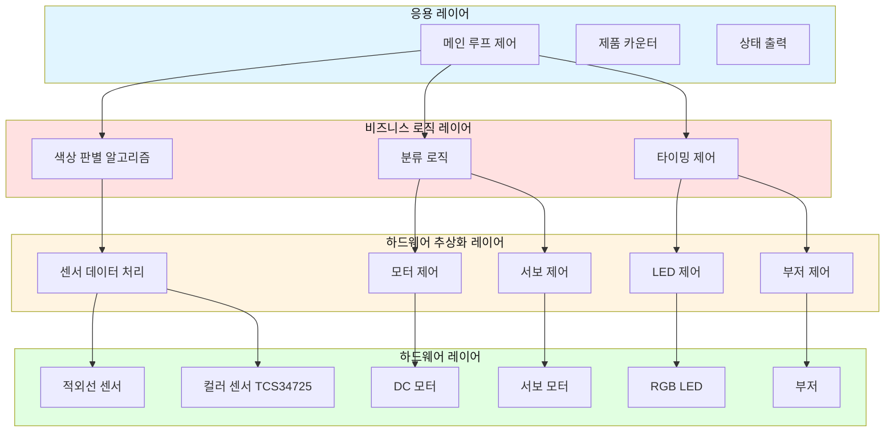

### 전체 시스템 구조도

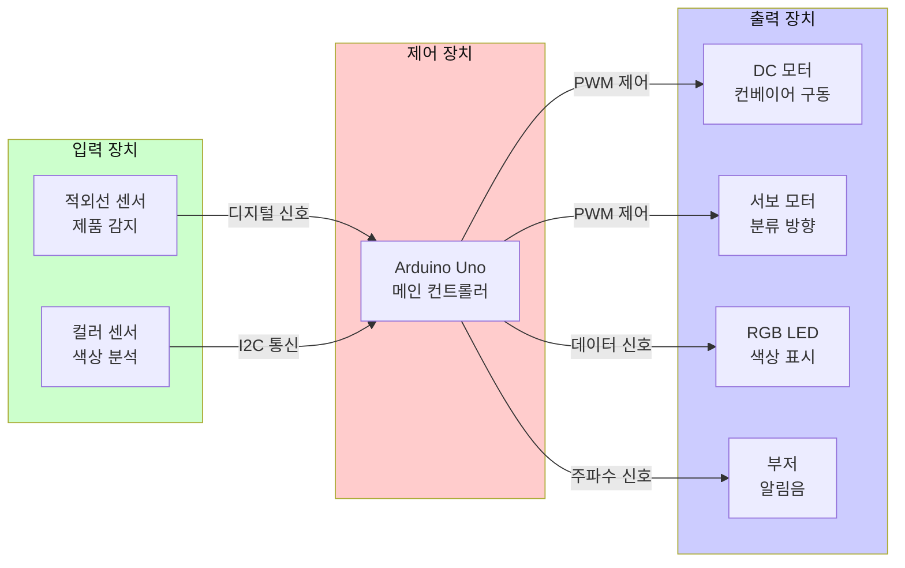

---

## 🔧 하드웨어 구성

### 부품 도표

| 번호 | 부품명 | 모델명 | 수량 | 역할 |
|------|--------|--------|------|------|
| 1 | 메인보드 | Arduino Uno R3 | 1 | 전체 시스템 제어 |
| 2 | DC 모터 드라이버 | L298P | 1 | 컨베이어 모터 제어 |
| 3 | DC 모터 | 6V DC Motor | 1 | 컨베이어 벨트 구동 |
| 4 | 서보 모터 | SG90 | 1 | 제품 분류 방향 설정 |
| 5 | 컬러 센서 | TCS34725 | 1 | RGB 색상 감지 |
| 6 | 적외선 센서 | IR Obstacle Sensor | 1 | 제품 존재 감지 |
| 7 | RGB LED | WS2812B | 3 | 색상 시각화 표시 |
| 8 | 부저 | Passive Buzzer | 1 | 알림음 출력 |
| 9 | 전원 공급 | 5V 2A Adapter | 1 | 시스템 전원 |
| 10 | 점퍼 케이블 | M-M, M-F | 다수 | 회로 연결 |

### 핀맵 (Pin Mapping)

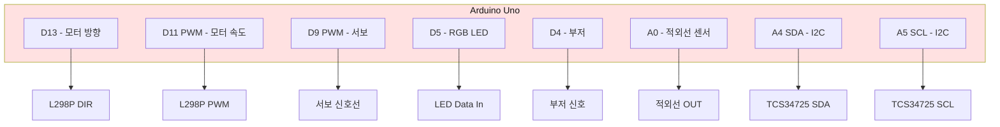

### 상세 핀 연결표

| 핀 번호 | 핀 타입 | 연결 부품 | 신호 타입 | 설명 |
|---------|---------|-----------|-----------|------|
| D13 | Digital Out | L298P DIR | HIGH/LOW | 컨베이어 벨트 방향 제어 (HIGH=전진) |
| D11 | PWM Out | L298P PWM | 0~255 | 컨베이어 벨트 속도 제어 (120=기본) |
| D9 | PWM Out | 서보 모터 | 0~180° | 분류 방향 각도 제어 (2°/30°/57°) |
| D5 | Digital Out | WS2812B DIN | 데이터 | RGB LED 색상 데이터 전송 |
| D4 | Digital Out | 부저 | 주파수 | 알림음 주파수 제어 (523Hz, 784Hz) |
| A0 | Digital In | 적외선 센서 | HIGH/LOW | 제품 감지 (LOW=감지됨) |
| A4 (SDA) | I2C | TCS34725 SDA | I2C 데이터 | 색상 센서 데이터 통신 |
| A5 (SCL) | I2C | TCS34725 SCL | I2C 클럭 | 색상 센서 클럭 신호 |
| 5V | Power | 전체 부품 | 5V | 시스템 전원 공급 |
| GND | Ground | 전체 부품 | 0V | 공통 접지 |

---

## 🔄 전체 동작 순서도

```mermaid
flowchart TD
    Start([시스템 시작]) --> Init[초기화 단계<br/>- 핀 모드 설정<br/>- 센서 초기화<br/>- 서보 테스트<br/>- LED 초기화]
    
    Init --> StartMsg[시작 메시지 출력<br/>부저 알림음]
    
    StartMsg --> ConveyorStart[컨베이어 가동<br/>속도 120]
    
    ConveyorStart --> CheckIR{적외선 센서<br/>제품 감지?}
    
    CheckIR -->|HIGH<br/>제품 없음| CheckIR
    
    CheckIR -->|LOW<br/>제품 감지| CountUp[제품 카운터 증가<br/>Serial 출력]
    
    CountUp --> Stop1[컨베이어 일시 정지<br/>부저 알림음]
    
    Stop1 --> Wait1[2초 대기<br/>DELAY_IR_DETECT]
    
    Wait1 --> MoveToColor[컬러 센서까지 이동<br/>컨베이어 재가동]
    
    MoveToColor --> ReadColor[색상 데이터 읽기<br/>getRawData]
    
    ReadColor --> MapRGB[RGB 값 매핑<br/>0~21504 → 0~1000]
    
    MapRGB --> CalcSum[sum = r + g + b]
    
    CalcSum --> CheckValid{sum >= 15?<br/>유효 색상?}
    
    CheckValid -->|NO| ReadColor
    
    CheckValid -->|YES| Stop2[컨베이어 정지<br/>부저 알림음]
    
    Stop2 --> PrintColor[색상 정보 출력<br/>Raw, RGB 값]
    
    PrintColor --> CompareRGB{RGB 값 비교}
    
    CompareRGB -->|r > g AND<br/>r > b| Red[빨간색 판별<br/>서보 30°<br/>LED 빨강]
    
    CompareRGB -->|g > r AND<br/>g > b| Green[초록색 판별<br/>서보 57°<br/>LED 초록]
    
    CompareRGB -->|나머지| Blue[파란색 판별<br/>서보 2°<br/>LED 파랑]
    
    Red --> ServoAttach[서보 연결<br/>servo.attach]
    Green --> ServoAttach
    Blue --> ServoAttach
    
    ServoAttach --> ServoWrite[서보 각도 설정<br/>0.5초 대기]
    
    ServoWrite --> LEDShow[RGB LED 표시<br/>1.5초 대기]
    
    LEDShow --> ServoDetach[서보 분리<br/>servo.detach]
    
    ServoDetach --> Resume[컨베이어 재가동<br/>속도 120]
    
    Resume --> Wait2[1초 대기<br/>DELAY_NEXT_PRODUCT]
    
    Wait2 --> Complete[제품 처리 완료<br/>Serial 출력]
    
    Complete --> CheckIR
    
    style Start fill:#e1f5ff,color:#111
    style Init fill:#ffe1e1,color:#111
    style Red fill:#ffcccc,color:#111
    style Green fill:#ccffcc,color:#111
    style Blue fill:#ccccff,color:#111
    style Complete fill:#fff4e1,color:#111
```

---

## ⚙️ 핵심 알고리즘 상세 설명

### 1. 색상 판별 알고리즘

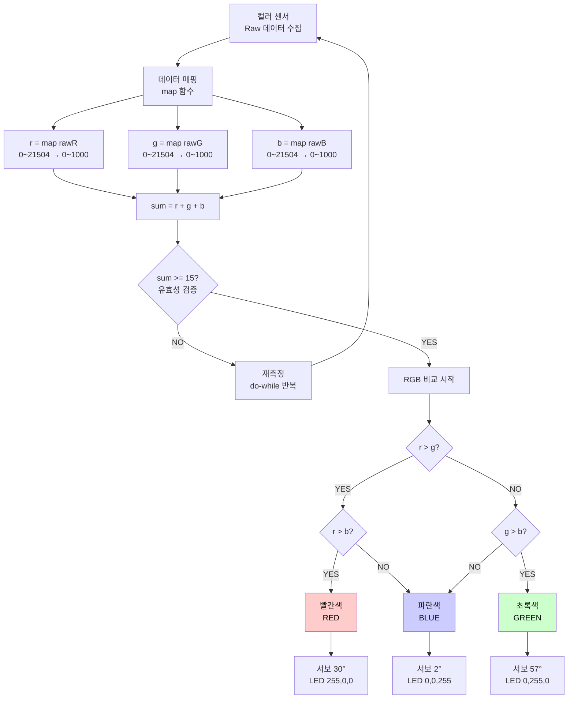

**알고리즘 특징**:
- **Early Return 패턴**: 유효하지 않은 색상은 즉시 재측정
- **단순 비교 로직**: 복잡한 계산 없이 최대값 찾기
- **매핑 정규화**: Raw 데이터를 0~1000 범위로 정규화하여 비교 용이

### 2. 타이밍 제어 알고리즘

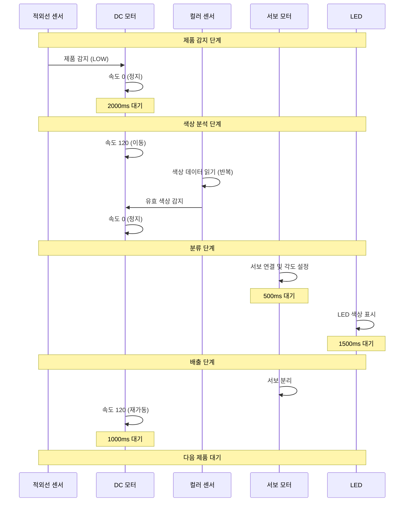

**타이밍 최적화 포인트**:
1. **DELAY_IR_DETECT (2000ms)**: 제품이 센서 영역을 완전히 벗어날 시간
2. **DELAY_COLOR_DETECT (1500ms)**: 사용자가 LED 색상을 인지할 시간
3. **DELAY_NEXT_PRODUCT (1000ms)**: 제품이 분류 영역을 벗어날 시간

### 3. Loop 안정성 체크 알고리즘

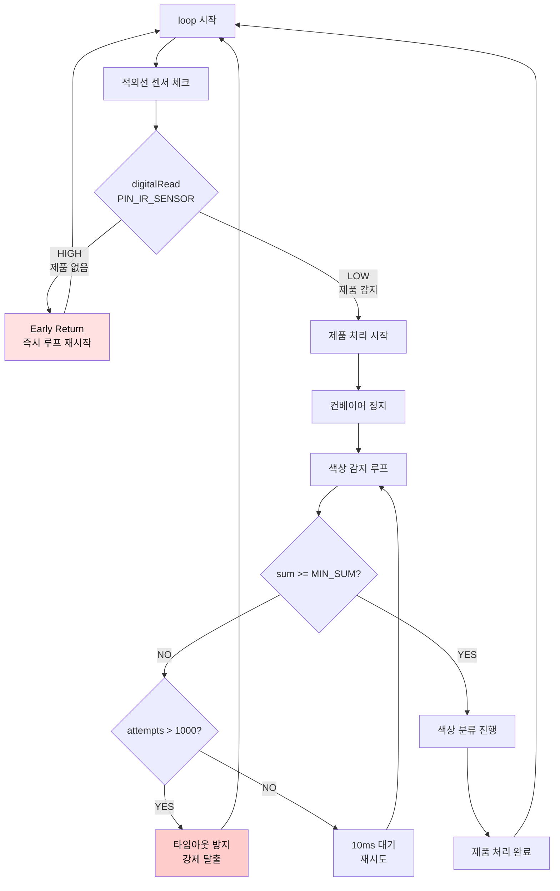

**안정성 보장 방법**:
1. **Early Return**: 제품 없으면 즉시 루프 재시작 (CPU 효율)
2. **타임아웃 방지**: 색상 감지 실패 시 무한 루프 방지 (attempts > 1000)
3. **서보 분리**: 사용 후 즉시 `servo.detach()`로 전력 소모 및 떨림 방지

---

## 📊 상태 다이어그램

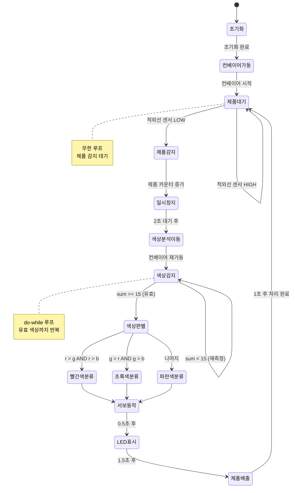

---

## 🔌 전원 공급 구조

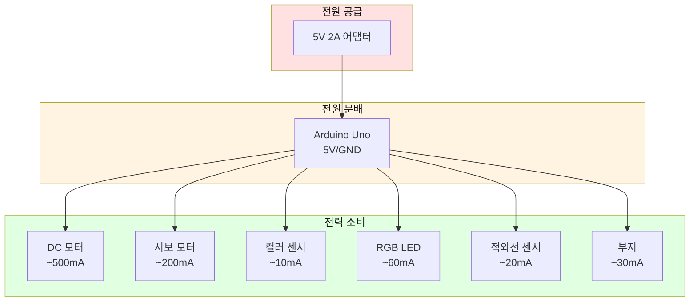

**전력 소비 분석**:
- **총 최대 소비 전력**: 약 820mA
- **권장 어댑터**: 5V 2A (여유 있는 전원 공급)
- **주의사항**: 서보와 DC 모터는 별도 전원 권장 (대전류 소비)

---

## 📝 주요 상수 및 설정값

### 핀 번호 설정

```cpp
#define PIN_MOTOR_DIR       13    // DC 모터 방향
#define PIN_MOTOR_SPEED     11    // DC 모터 속도 (PWM)
#define PIN_SERVO           9     // 서보 모터
#define PIN_LED             5     // RGB LED
#define PIN_IR_SENSOR       A0    // 적외선 센서
#define PIN_BUZZER          4     // 부저
```

### 서보 각도 설정 (캘리브레이션 필요)

```cpp
#define ANGLE_RED           30    // 빨간색 제품 분류 각도
#define ANGLE_GREEN         57    // 초록색 제품 분류 각도
#define ANGLE_BLUE          2     // 파란색 제품 분류 각도
```

**각도 조정 가이드**:
1. 실제 분류함 위치에 따라 각도 조정 필요
2. 서보 모터 0~180° 범위 내에서 설정
3. 각 색상별로 테스트하여 최적 각도 찾기

### 색상 센서 설정

```cpp
#define RAW_MAX             21504 // 센서 최대값 (TCS34725 16비트)
#define MAPPED_MAX          1000  // 매핑 최대값 (계산 편의)
#define MIN_SUM             15    // 유효 색상 최소 합계
```

**센서 캘리브레이션**:
- `MIN_SUM` 값은 환경 조명에 따라 조정 필요
- 너무 낮으면 노이즈 감지, 너무 높으면 감지 실패

### 모터 설정

```cpp
#define MOTOR_SPEED         120   // 컨베이어 속도 (0~255)
#define MOTOR_DIR_FORWARD   HIGH  // 전진 방향
```

**속도 조정 가이드**:
- 낮은 속도 (60~100): 정확도 높음, 처리량 낮음
- 중간 속도 (100~150): 균형잡힌 설정
- 높은 속도 (150~200): 처리량 높음, 정확도 낮음

### 타이밍 설정

```cpp
#define DELAY_IR_DETECT     2000  // 적외선 감지 후 대기 (ms)
#define DELAY_COLOR_DETECT  1500  // 색상 분석 후 대기 (ms)
#define DELAY_NEXT_PRODUCT  1000  // 다음 제품 대기 (ms)
```

**타이밍 최적화**:
- 컨베이어 속도와 연동하여 조정
- 제품 크기에 따라 대기 시간 변경 필요

---

## 🚀 업그레이드 가능 영역

### 1. 센서 레이어 업그레이드

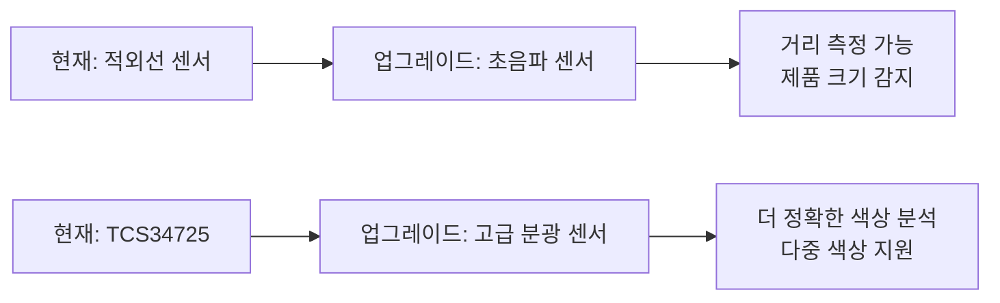

### 2. 통신 레이어 추가

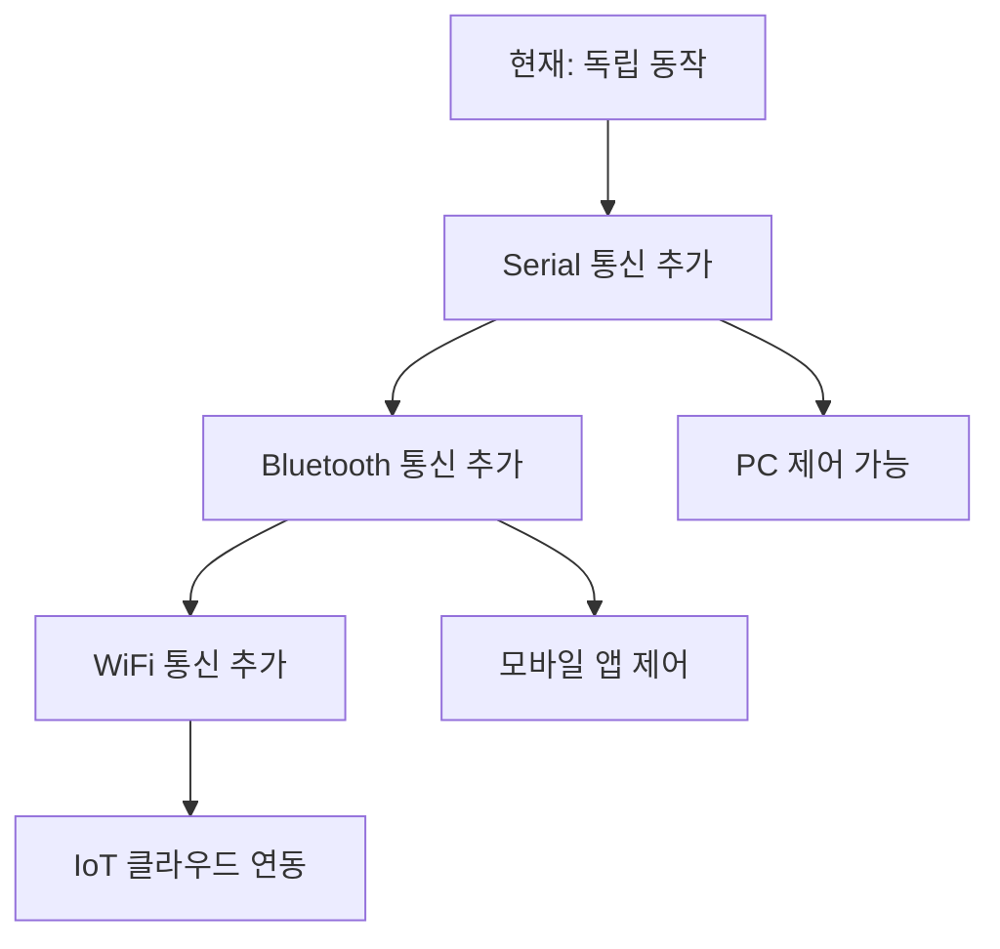

### 3. 데이터 레이어 추가

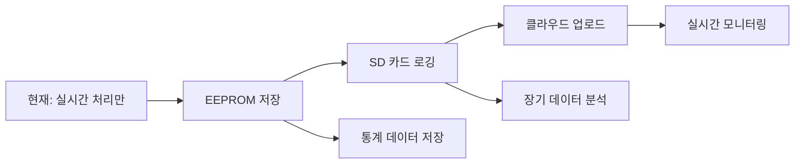

### 4. UI 레이어 추가

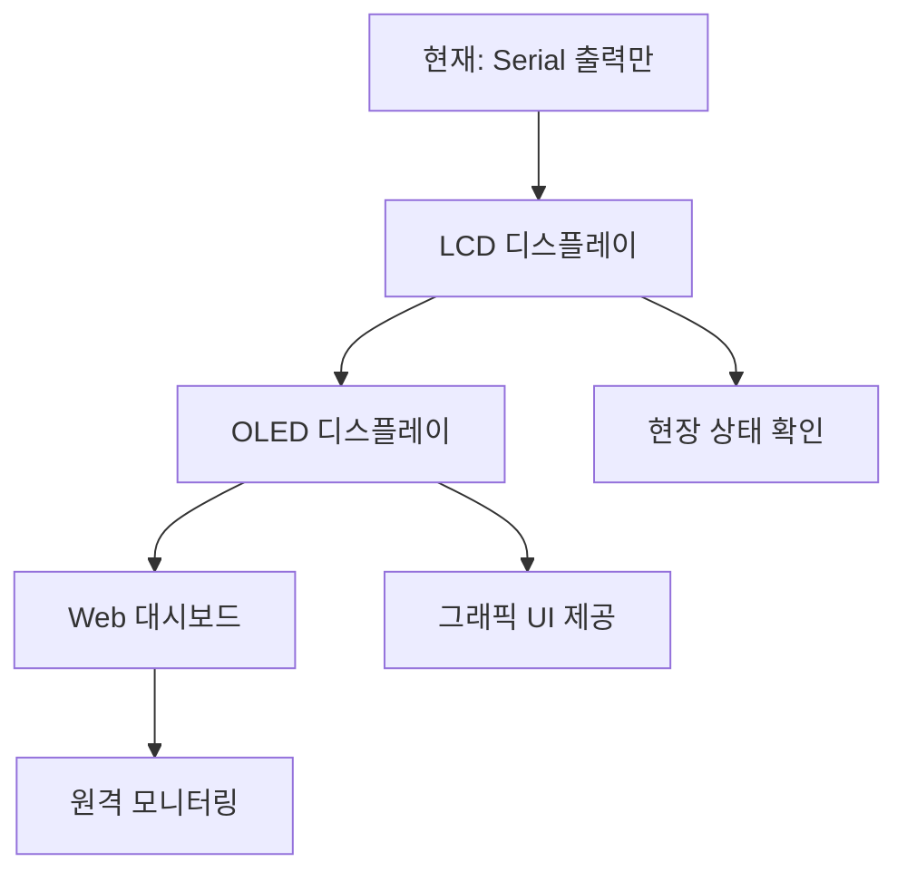

---

## 🎓 자주 묻는 질문 (FAQ) 30개

### 기본 개념 (1~5)

**Q1. 이 시스템의 주요 목적은 무엇인가요?**
A: 스마트 팩토리의 자동 색상 분류 시스템을 학습하기 위한 교육용 프로젝트입니다. 제품을 색상별로 자동 분류하는 컨베이어 시스템을 구현합니다.

**Q2. 어떤 색상을 감지할 수 있나요?**
A: 기본적으로 빨강, 초록, 파랑 3가지 색상을 감지합니다. 코드 수정으로 더 많은 색상 추가 가능합니다.

**Q3. 시스템이 자동으로 시작되나요?**
A: 네, 전원을 켜면 자동으로 컨베이어가 가동되고 제품 감지를 시작합니다.

**Q4. 한 번에 몇 개의 제품을 처리할 수 있나요?**
A: 한 번에 1개씩 순차적으로 처리합니다. 제품 간 최소 5~7초 간격 필요합니다.

**Q5. 이 시스템의 처리 속도는 어떻게 되나요?**
A: 제품 1개당 약 5~7초 소요됩니다. (감지 2초 + 분석 1초 + 분류 2초 + 배출 1초)

### 하드웨어 (6~15)

**Q6. Arduino Uno 대신 다른 보드를 사용할 수 있나요?**
A: 네, Arduino Mega, Nano 등 호환 보드 사용 가능합니다. 단, 핀 번호 조정 필요합니다.

**Q7. 컬러 센서가 감지되지 않습니다.**
A: I2C 연결(SDA, SCL) 확인, 센서 전원 확인, `Wire.h` 라이브러리 설치 확인이 필요합니다.

**Q8. 서보 모터가 떨립니다.**
A: 전원 부족이 원인일 수 있습니다. 서보에 별도 5V 전원 공급하거나, 사용 후 `servo.detach()` 확인하세요.

**Q9. DC 모터가 작동하지 않습니다.**
A: L298P 드라이버 연결 확인, 모터 전원 확인, PWM 핀(D11) 연결 확인이 필요합니다.

**Q10. RGB LED가 켜지지 않습니다.**
A: WS2812B 데이터 핀(D5) 연결 확인, 전원 극성 확인, Adafruit NeoPixel 라이브러리 설치 확인하세요.

**Q11. 적외선 센서가 제품을 감지하지 못합니다.**
A: 센서와 제품 간 거리 조정(2~10cm), 센서 감도 조정, 배선 확인이 필요합니다.

**Q12. 부저에서 소리가 나지 않습니다.**
A: Passive Buzzer 사용 확인, 핀 연결(D4) 확인, 극성 확인이 필요합니다.

**Q13. 전원 어댑터는 몇 V를 사용해야 하나요?**
A: 5V 2A 어댑터를 권장합니다. USB 전원은 전류 부족으로 불안정할 수 있습니다.

**Q14. 서보 모터 각도를 어떻게 조정하나요?**
A: `ANGLE_RED`, `ANGLE_GREEN`, `ANGLE_BLUE` 상수 값을 0~180 범위에서 조정하세요.

**Q15. 컨베이어 벨트 속도를 변경하려면?**
A: `MOTOR_SPEED` 상수 값을 0~255 범위에서 조정하세요. (120이 기본값)

### 소프트웨어 (16~25)

**Q16. 색상 인식이 부정확합니다.**
A: 센서와 제품 간 거리(2~5cm), 조명 환경(밝은 백색광), `MIN_SUM` 값 조정이 필요합니다.

**Q17. 색상 판별 로직을 수정하려면?**
A: `loop()` 함수 내 색상 비교 부분(180~197줄)을 수정하세요. 더 복잡한 조건 추가 가능합니다.

**Q18. 노란색이나 흰색도 감지할 수 있나요?**
A: 가능합니다. RGB 값 조합으로 판별 조건 추가하면 됩니다. (예: r>800 && g>800 && b<200 → 노란색)

**Q19. 제품 카운터를 초기화하려면?**
A: Arduino를 리셋하거나, Serial 명령으로 카운터 초기화 기능 추가 가능합니다.

**Q20. Serial 출력이 너무 많습니다.**
A: `Serial.println()` 부분을 주석 처리하거나, 조건문으로 선택적 출력하도록 수정하세요.

**Q21. 타임아웃이 발생합니다.**
A: 색상 감지 루프의 `attempts > 1000` 조건을 더 큰 값으로 변경하세요.

**Q22. 라이브러리 설치는 어떻게 하나요?**
A: Arduino IDE → 스케치 → 라이브러리 포함하기 → 라이브러리 관리에서 "Adafruit NeoPixel", "Adafruit TCS34725", "Servo" 검색 후 설치하세요.

**Q23. 코드를 수정했는데 동작하지 않습니다.**
A: 컴파일 오류 확인, 업로드 성공 확인, Serial 모니터로 오류 메시지 확인하세요.

**Q24. 여러 제품이 동시에 들어오면?**
A: 현재 시스템은 순차 처리만 지원합니다. 동시 처리는 멀티 센서 및 복잡한 로직 필요합니다.

**Q25. 처리 속도를 높이려면?**
A: `DELAY_IR_DETECT`, `DELAY_COLOR_DETECT`, `DELAY_NEXT_PRODUCT` 값을 줄이고, `MOTOR_SPEED`를 높이세요.

### 응용 및 확장 (26~30)

**Q26. Bluetooth로 제어하고 싶습니다.**
A: 07번 시스템을 참고하여 Serial 통신 부분을 Bluetooth 모듈(HC-06)로 확장하세요.

**Q27. LCD에 상태를 표시하고 싶습니다.**
A: I2C LCD 모듈 추가 후, `LiquidCrystal_I2C` 라이브러리로 상태 출력 코드 추가하세요.

**Q28. 통계 데이터를 저장하고 싶습니다.**
A: EEPROM에 색상별 카운터 저장하거나, SD 카드 모듈로 로그 파일 작성하세요.

**Q29. 웹에서 모니터링하고 싶습니다.**
A: ESP8266/ESP32 모듈 추가 후, WiFi로 데이터 전송하고 웹 서버 구축하세요.

**Q30. 실제 공장에서 사용할 수 있나요?**
A: 교육용 프로토타입입니다. 실제 사용은 산업용 센서, PLC, 안전 장치 등 추가 필요합니다.

---

## 🎯 실습 미션

### 미션 1: 색상 분류 정확도 향상 (난이도: ⭐⭐)

**목표**: 색상 인식 정확도를 95% 이상으로 향상시키기

**요구사항**:
1. 각 색상별로 10회씩 테스트 수행
2. 오분류 발생 시 원인 분석
3. 센서 위치, 조명, 각도 최적화
4. `MIN_SUM`, 서보 각도 캘리브레이션

**체크리스트**:
- [ ] 빨간색 제품 10개 테스트 (성공률: __/10)
- [ ] 초록색 제품 10개 테스트 (성공률: __/10)
- [ ] 파란색 제품 10개 테스트 (성공률: __/10)
- [ ] 센서-제품 최적 거리 측정: ____cm
- [ ] 최적 조명 환경 기록: __________
- [ ] 서보 각도 최종 값: RED=__, GREEN=__, BLUE=__

**평가 기준**:
- 90% 이상: 합격
- 95% 이상: 우수
- 100%: 완벽

---

### 미션 2: 4색 분류 시스템 구현 (난이도: ⭐⭐⭐)

**목표**: 빨강, 초록, 파랑, 노란색 4가지 색상 분류 시스템 구현

**요구사항**:
1. 노란색 판별 로직 추가 (r>500 && g>500 && b<300)
2. 서보 각도 4개 설정 (0°, 45°, 90°, 135°)
3. LED 색상 표시 추가 (노란색: R=255, G=255, B=0)
4. Serial 출력에 노란색 정보 추가
5. 각 색상별 5회씩 테스트

**구현 단계**:

**1단계: 상수 추가**
```cpp
#define ANGLE_YELLOW        90    // 노란색 제품 각도
```

**2단계: 색상 판별 로직 수정**
```cpp
// 기존 if-else 구조에 노란색 조건 추가
if (r > 500 && g > 500 && b < 300) {
    colorName = "노란색";
    servoAngle = ANGLE_YELLOW;
    ledR = 255; ledG = 255; ledB = 0;
}
else if (r > g && r > b) {
    // 빨간색 로직
}
// ... 나머지 색상
```

**3단계: 테스트**
- [ ] 빨간색 5회 테스트 (성공률: __/5)
- [ ] 초록색 5회 테스트 (성공률: __/5)
- [ ] 파란색 5회 테스트 (성공률: __/5)
- [ ] 노란색 5회 테스트 (성공률: __/5)

**4단계: 문서화**
- [ ] 노란색 RGB 임계값 기록
- [ ] 서보 각도 최적값 기록
- [ ] 오분류 케이스 분석

**평가 기준**:
- 4색 모두 인식: 기본 점수
- 정확도 80% 이상: 합격
- 정확도 90% 이상: 우수
- 추가 색상 구현: 보너스

**보너스 과제**:
- 흰색, 검은색 추가 (6색 분류)
- 색상별 통계 출력 기능
- EEPROM에 통계 저장

---

## 📚 참고 자료

### 관련 문서
- **다음 단계**: `07_serial_controlled_system/` (Serial 제어 시스템)
- **알고리즘 설명**: `arduino_code/알고리즘_설명서.md`
- **프로젝트 구조**: `arduino_code/프로젝트_구조.md`

### 라이브러리 문서
- [Adafruit NeoPixel](https://github.com/adafruit/Adafruit_NeoPixel)
- [Adafruit TCS34725](https://github.com/adafruit/Adafruit_TCS34725)
- [Arduino Servo](https://www.arduino.cc/reference/en/libraries/servo/)

---

## 📝 라이센스

본 프로젝트는 교육 목적으로 제작되었습니다.

---

**마지막 업데이트**: 2026-01-27

