# Serial 제어 컨베이어 시스템 - 통합 가이드 (07)

## 📋 문서 개요

이 문서는 **Serial 통신 기반 제어 시스템**의 전체 아키텍처, 안정성 보장 방법, 업그레이드 가능 영역을 다룹니다.

---

## 🏗️ 시스템 전체 아키텍처

### 5계층 레이어 구조

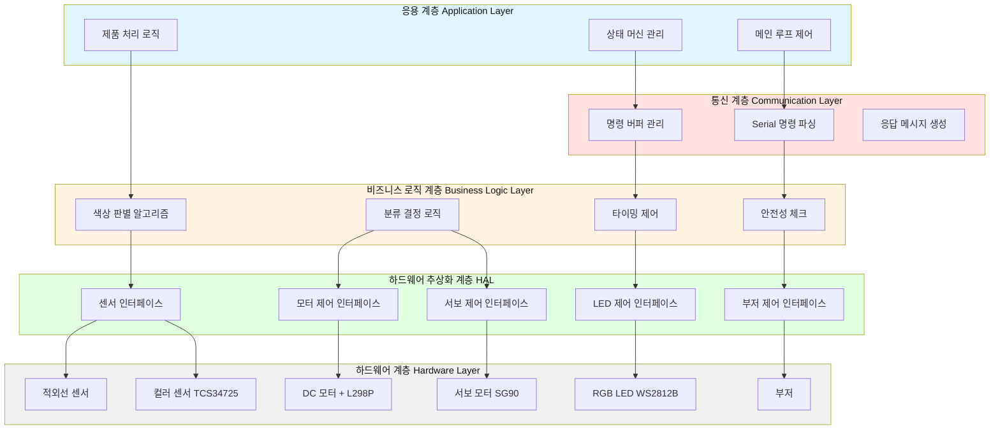

### 계층별 역할 상세

| 계층 | 역할 | 주요 함수/모듈 | 책임 |
|------|------|----------------|------|
| **Layer 5<br/>응용 계층** | 전체 시스템 흐름 제어 | `loop()`, `setup()` | - 시스템 초기화<br/>- 메인 루프 실행<br/>- 상태 전환 관리 |
| **Layer 4<br/>통신 계층** | 외부 명령 처리 | `checkSerialCommand()`<br/>`processCommand()` | - Serial 데이터 수신<br/>- 명령 파싱<br/>- 응답 전송 |
| **Layer 3<br/>비즈니스 로직** | 핵심 알고리즘 구현 | 색상 판별 로직<br/>`delayWithSerialCheck()` | - 색상 분석<br/>- 분류 결정<br/>- 타이밍 최적화<br/>- 안전성 검증 |
| **Layer 2<br/>HAL** | 하드웨어 추상화 | `analogWrite()`<br/>`servo.write()`<br/>`led.setPixelColor()` | - 하드웨어 독립적 인터페이스<br/>- 센서 데이터 변환<br/>- 액추에이터 제어 |
| **Layer 1<br/>하드웨어** | 물리적 장치 | 센서, 모터, LED 등 | - 신호 입출력<br/>- 전기적 동작 |

---

## 🔄 전체 시스템 데이터 흐름도

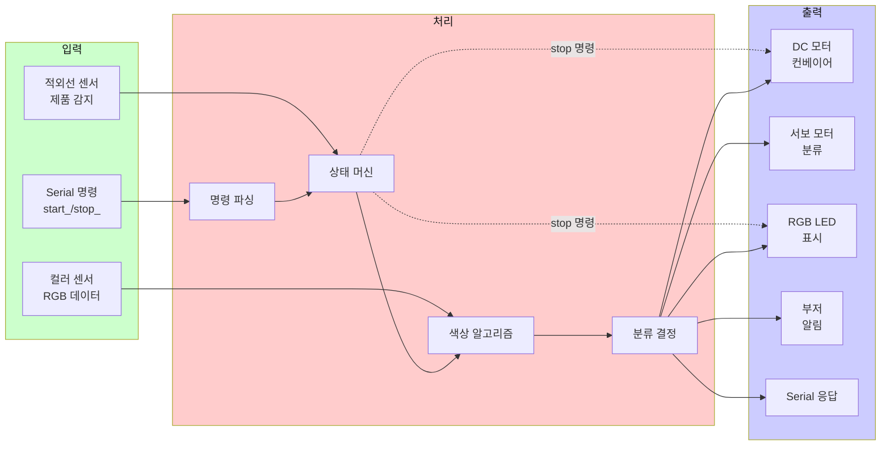

---

## ⚙️ Loop 안정성 보장 메커니즘

### 1. Early Return 패턴

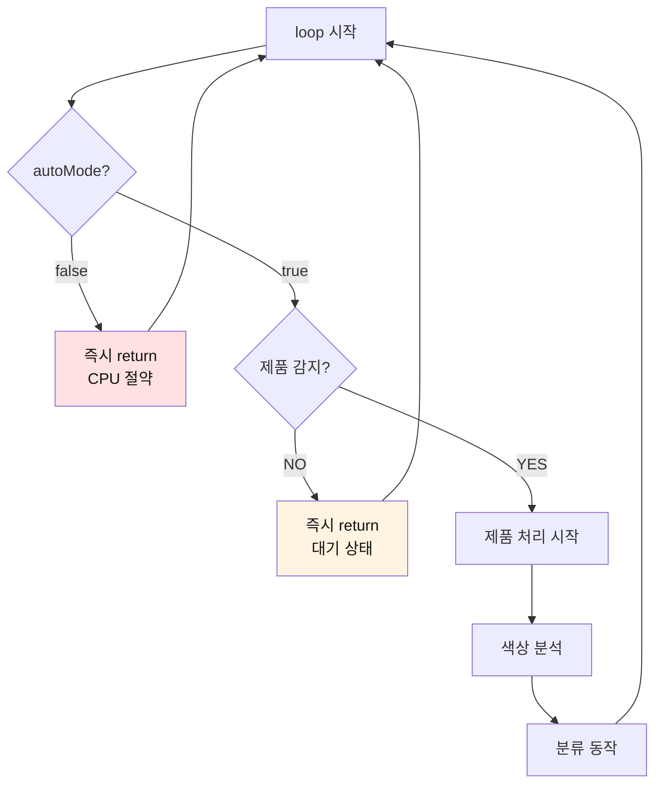

**장점**:
- 불필요한 코드 실행 방지
- CPU 사용률 최소화
- 빠른 응답 속도

**구현 코드**:
```cpp
void loop() {
    checkSerialCommand();
    
    // Early Return 1: 자동화 모드 아님
    if (!autoMode) {
        return;  // 즉시 루프 재시작
    }
    
    // Early Return 2: 제품 없음
    if (digitalRead(PIN_IR_SENSOR) == HIGH) {
        return;  // 즉시 루프 재시작
    }
    
    // 여기부터 실제 제품 처리 로직
    productCount++;
    // ...
}
```

### 2. 실시간 명령 체크 메커니즘

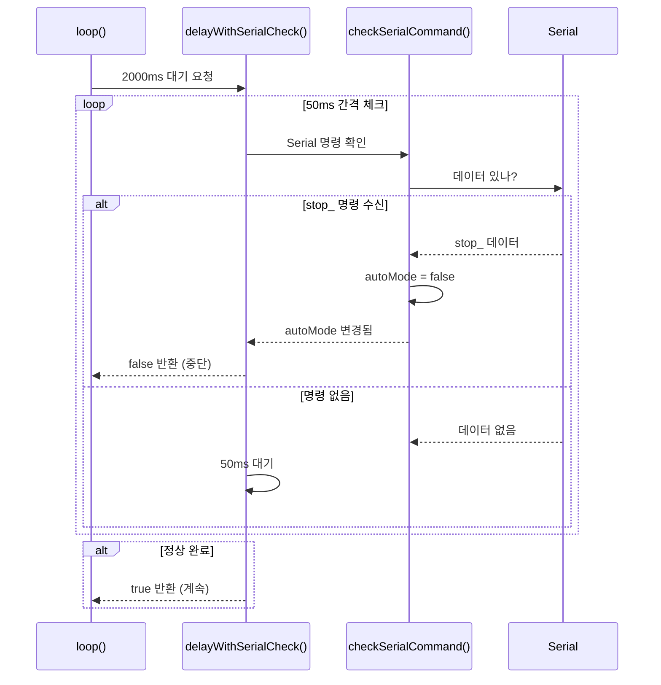

**핵심 함수**:
```cpp
bool delayWithSerialCheck(unsigned long ms) {
    unsigned long startTime = millis();
    
    while (millis() - startTime < ms) {
        checkSerialCommand();  // 50ms마다 체크
        
        if (!autoMode) {
            return false;  // stop 명령 받음
        }
        
        delay(50);  // 짧은 간격으로 체크
    }
    
    return true;  // 정상 완료
}
```

**적용 위치**:
1. 적외선 감지 후 2초 대기
2. 서보 동작 0.5초 대기
3. LED 표시 1.5초 대기
4. 제품 배출 1초 대기

### 3. 타임아웃 방지 메커니즘

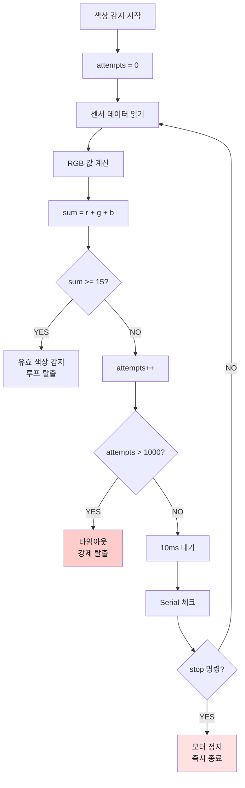

**구현 코드**:
```cpp
int sum = 0;
int attempts = 0;

do {
    // Serial 명령 체크 (stop 즉시 반응)
    checkSerialCommand();
    if (!autoMode) {
        analogWrite(PIN_MOTOR_SPEED, 0);
        return;
    }
    
    // 색상 데이터 읽기
    colorSensor.getRawData(&rawR, &rawG, &rawB, &rawC);
    r = map(rawR, 0, RAW_MAX, 0, MAPPED_MAX);
    g = map(rawG, 0, RAW_MAX, 0, MAPPED_MAX);
    b = map(rawB, 0, RAW_MAX, 0, MAPPED_MAX);
    sum = r + g + b;
    
    attempts++;
    if (attempts > 1000) break;  // 타임아웃 (최대 10초)
    
    delay(10);
} while (sum < MIN_SUM);
```

### 4. 서보 떨림 방지

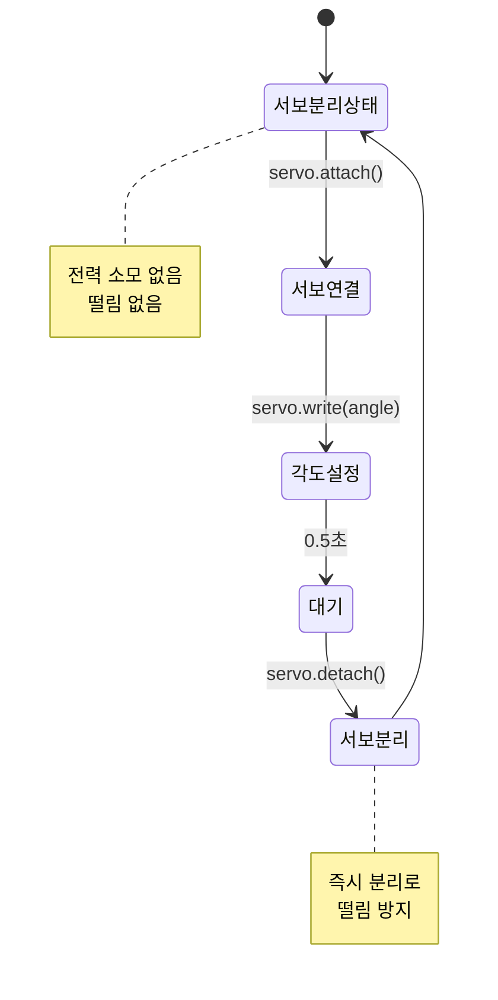

**구현 패턴**:
```cpp
// 사용 전: 연결
servo.attach(PIN_SERVO);
servo.write(servoAngle);
delay(500);  // 동작 완료 대기

// 사용 후: 즉시 분리
servo.detach();  // 떨림 방지 + 전력 절약
```

---

## 📊 상태 머신 상세 다이어그램

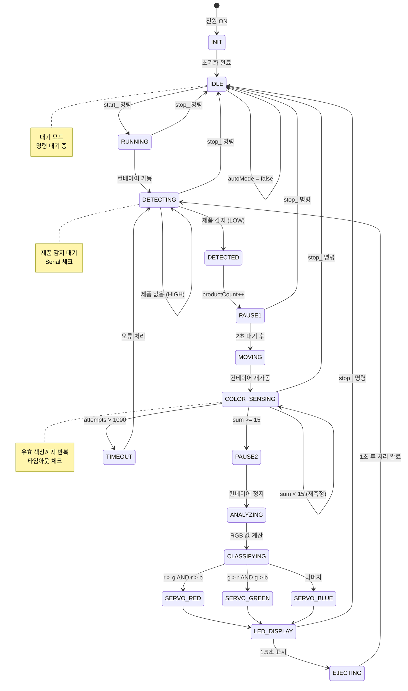

### 상태별 전환 조건

| 현재 상태 | 다음 상태 | 전환 조건 | 동작 |
|-----------|-----------|-----------|------|
| IDLE | RUNNING | `start_` 명령 | 컨베이어 가동, autoMode=true |
| RUNNING | DETECTING | 자동 전환 | 제품 감지 대기 |
| DETECTING | DETECTED | 적외선 LOW | 제품 카운터 증가 |
| DETECTED | PAUSE1 | 자동 전환 | 컨베이어 정지, 부저 알림 |
| PAUSE1 | MOVING | 2초 경과 | 컨베이어 재가동 |
| MOVING | COLOR_SENSING | 자동 전환 | 색상 데이터 읽기 시작 |
| COLOR_SENSING | PAUSE2 | sum >= 15 | 유효 색상 감지 |
| COLOR_SENSING | TIMEOUT | attempts > 1000 | 타임아웃 오류 |
| PAUSE2 | ANALYZING | 자동 전환 | RGB 값 계산 |
| ANALYZING | CLASSIFYING | 자동 전환 | 색상 비교 |
| CLASSIFYING | SERVO_* | 색상 판별 | 서보 각도 설정 |
| SERVO_* | LED_DISPLAY | 0.5초 경과 | LED 색상 표시 |
| LED_DISPLAY | EJECTING | 1.5초 경과 | 컨베이어 재가동 |
| EJECTING | DETECTING | 1초 경과 | 다음 제품 대기 |
| 모든 상태 | IDLE | `stop_` 명령 | 모터 정지, LED OFF |

---

## 🔌 부품 상세 정보

### 1. 컬러 센서 TCS34725

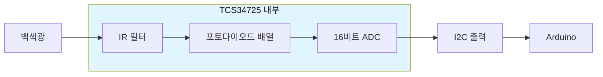

**사양**:
- **통신**: I2C (주소 0x29)
- **해상도**: 16비트 (0~65535)
- **감지 범위**: 380~1000nm
- **적분 시간**: 50ms (설정값)
- **게인**: 4x (설정값)
- **전원**: 3.3V~5V
- **소비 전류**: 약 10mA

**Raw 데이터 범위**:
- 이론 최대값: 65535 (16비트)
- 실제 사용 최대값: 21504 (조명 환경에 따라 다름)

**캘리브레이션 방법**:
1. 흰색 종이를 센서 앞에 놓기
2. Serial 모니터에서 Raw 값 확인
3. 가장 큰 값을 `RAW_MAX`로 설정
4. 여러 조명 환경에서 테스트

### 2. 서보 모터 SG90

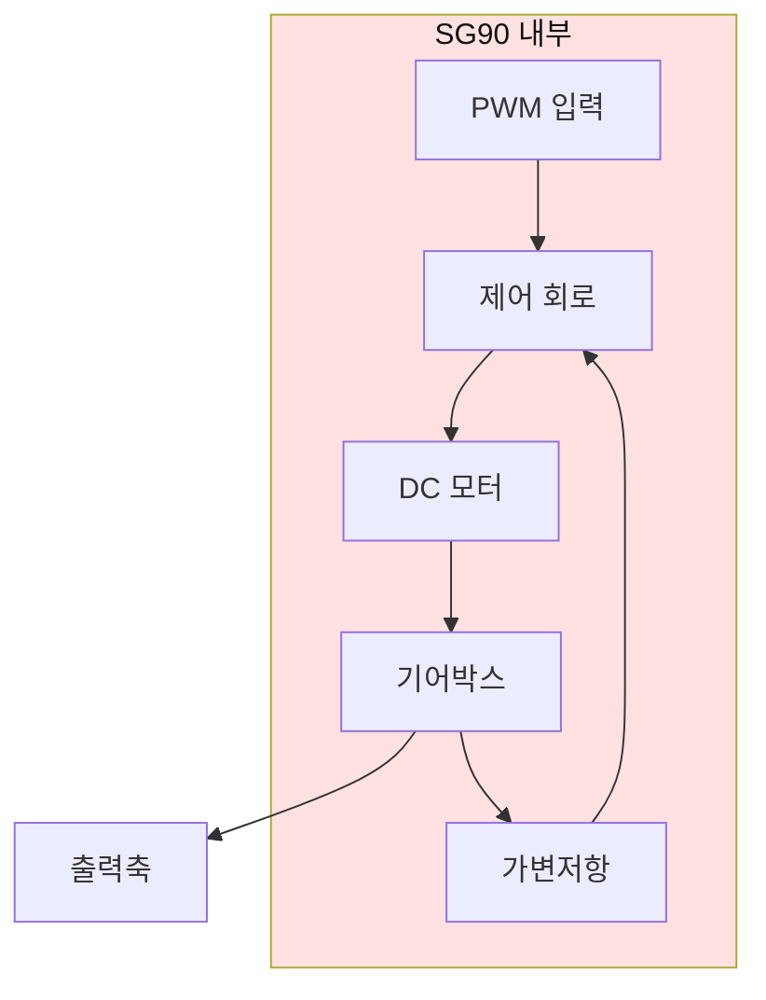

**사양**:
- **동작 전압**: 4.8V~6V
- **동작 각도**: 0°~180°
- **속도**: 0.1초/60° (4.8V)
- **토크**: 1.8kg·cm (4.8V)
- **소비 전류**: 
  - 무부하: 약 10mA
  - 최대 부하: 약 200mA
- **PWM 주기**: 20ms
- **펄스 폭**:
  - 0°: 1ms (5% duty)
  - 90°: 1.5ms (7.5% duty)
  - 180°: 2ms (10% duty)

**각도별 펄스 폭**:

| 각도 | 펄스 폭 | Duty Cycle |
|------|---------|------------|
| 0° | 1.0ms | 5% |
| 30° | 1.17ms | 5.8% |
| 57° | 1.32ms | 6.6% |
| 90° | 1.5ms | 7.5% |
| 180° | 2.0ms | 10% |

### 3. L298P 모터 드라이버

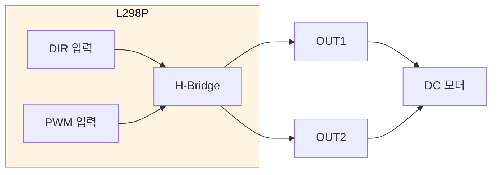

**사양**:
- **입력 전압**: 5V~35V
- **출력 전류**: 최대 2A (연속)
- **논리 전압**: 5V (TTL)
- **PWM 주파수**: 1kHz~20kHz
- **효율**: 약 80%

**제어 로직**:

| DIR | PWM | 동작 |
|-----|-----|------|
| HIGH | 0~255 | 정방향 회전 (속도 가변) |
| LOW | 0~255 | 역방향 회전 (속도 가변) |
| X | 0 | 정지 |

### 4. WS2812B RGB LED

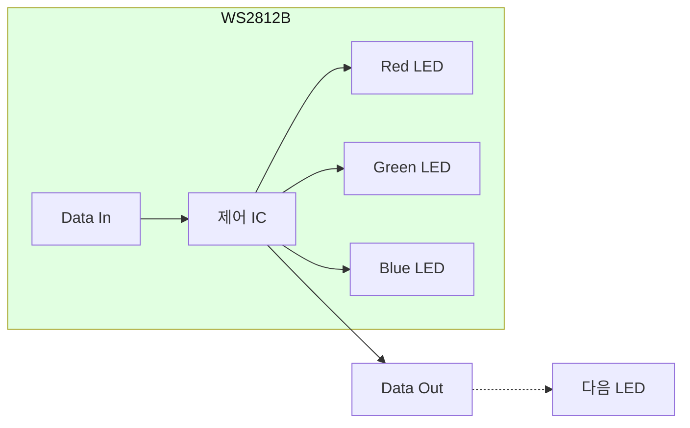

**사양**:
- **전원**: 5V
- **소비 전류**:
  - 1개 최대: 60mA (R+G+B 모두 255)
  - 3개 최대: 180mA
- **색상**: 24비트 (R 8비트 + G 8비트 + B 8비트)
- **밝기**: 0~255 (256단계)
- **통신**: 단방향 직렬 통신
- **데이터 속도**: 800kHz

**색상 코드**:

| 색상 | R | G | B | 16진수 |
|------|---|---|---|--------|
| 빨강 | 255 | 0 | 0 | #FF0000 |
| 초록 | 0 | 255 | 0 | #00FF00 |
| 파랑 | 0 | 0 | 255 | #0000FF |
| 노랑 | 255 | 255 | 0 | #FFFF00 |
| 흰색 | 255 | 255 | 255 | #FFFFFF |
| 꺼짐 | 0 | 0 | 0 | #000000 |

### 5. 적외선 장애물 센서

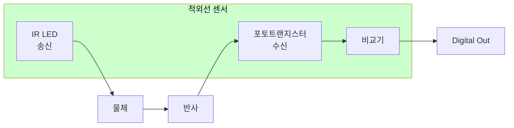

**사양**:
- **전원**: 3.3V~5V
- **출력**: 디지털 (HIGH/LOW)
- **감지 거리**: 2~30cm (가변 저항 조정)
- **감지 각도**: 약 35°
- **응답 시간**: < 10ms
- **소비 전류**: 약 20mA

**출력 로직**:
- **HIGH**: 물체 없음 (적외선 반사 없음)
- **LOW**: 물체 감지 (적외선 반사 있음)

**거리 조정**:
- 센서 뒷면의 가변 저항을 돌려 감지 거리 조정
- 시계 방향: 거리 증가
- 반시계 방향: 거리 감소

---

## 🔧 업그레이드 가능 영역

### 1. 통신 계층 확장

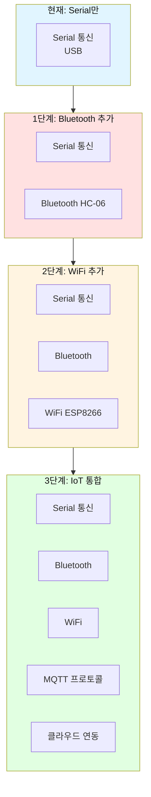

**구현 방법**:

**1단계: Bluetooth 추가**
```cpp
// HC-06 모듈 연결 (TX→D2, RX→D3)
#include <SoftwareSerial.h>
SoftwareSerial bluetooth(2, 3);  // RX, TX

void setup() {
    Serial.begin(9600);
    bluetooth.begin(9600);
}

void checkCommand() {
    // Serial 체크
    if (Serial.available()) {
        processSerialData();
    }
    
    // Bluetooth 체크
    if (bluetooth.available()) {
        processBluetoothData();
    }
}
```

**2단계: WiFi 추가**
```cpp
// ESP8266 모듈 사용
#include <ESP8266WiFi.h>

WiFiServer server(80);

void setup() {
    WiFi.begin("SSID", "PASSWORD");
    server.begin();
}

void loop() {
    WiFiClient client = server.available();
    if (client) {
        String request = client.readStringUntil('\r');
        processWebCommand(request);
    }
}
```

### 2. 데이터 저장 계층 추가

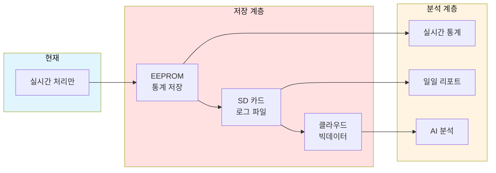

**EEPROM 저장 예시**:
```cpp
#include <EEPROM.h>

// 주소 정의
#define ADDR_RED_COUNT    0
#define ADDR_GREEN_COUNT  4
#define ADDR_BLUE_COUNT   8

int redCount = 0, greenCount = 0, blueCount = 0;

void saveStatistics() {
    EEPROM.put(ADDR_RED_COUNT, redCount);
    EEPROM.put(ADDR_GREEN_COUNT, greenCount);
    EEPROM.put(ADDR_BLUE_COUNT, blueCount);
}

void loadStatistics() {
    EEPROM.get(ADDR_RED_COUNT, redCount);
    EEPROM.get(ADDR_GREEN_COUNT, greenCount);
    EEPROM.get(ADDR_BLUE_COUNT, blueCount);
}

void printStatistics() {
    Serial.println("=== 통계 ===");
    Serial.print("빨강: "); Serial.println(redCount);
    Serial.print("초록: "); Serial.println(greenCount);
    Serial.print("파랑: "); Serial.println(blueCount);
}
```

### 3. UI 계층 추가

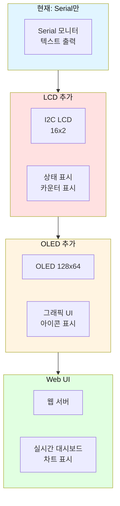

**LCD 추가 예시**:
```cpp
#include <LiquidCrystal_I2C.h>

LiquidCrystal_I2C lcd(0x27, 16, 2);

void setup() {
    lcd.init();
    lcd.backlight();
    lcd.setCursor(0, 0);
    lcd.print("Smart Factory");
}

void updateLCD() {
    lcd.setCursor(0, 1);
    lcd.print("Count: ");
    lcd.print(productCount);
    lcd.print("  ");
}
```

### 4. 센서 퓨전 계층

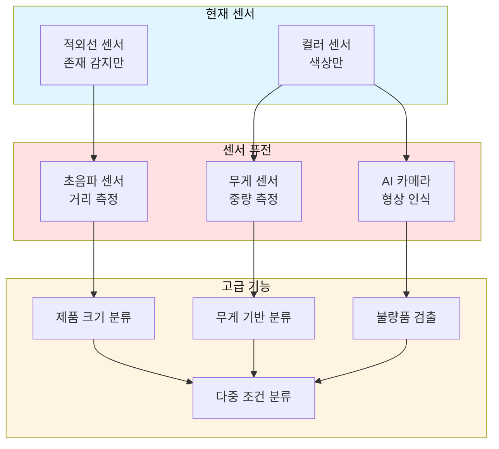

---

## 🎓 자주 묻는 질문 (FAQ) 30개

### 기본 개념 (1~5)

**Q1. 06번과 07번의 차이점은 무엇인가요?**
A: 06번은 전원 인가 시 자동 시작하는 완전 자동화 시스템이고, 07번은 Serial 명령(start_/stop_)으로 제어 가능한 시스템입니다.

**Q2. Serial 명령은 어떻게 보내나요?**
A: Arduino IDE의 Serial 모니터를 열고 `start_` 또는 `stop_`을 입력 후 전송하세요. (Baud Rate: 9600)

**Q3. 왜 명령어 끝에 `_`를 붙이나요?**
A: `_` 문자를 명령 종료 구분자로 사용하여 명령어를 파싱합니다. 개행 문자와 독립적으로 동작합니다.

**Q4. 자동화 중에 stop 명령을 보내면 즉시 멈추나요?**
A: 네, `delayWithSerialCheck()` 함수가 50ms 간격으로 명령을 체크하여 즉시 반응합니다.

**Q5. 처리 중인 제품은 어떻게 되나요?**
A: stop 명령 시 현재 단계를 완료하지 않고 즉시 중단되며, LED가 꺼지고 모터가 정지합니다.

### Serial 통신 (6~15)

**Q6. Baud Rate를 변경할 수 있나요?**
A: 가능합니다. `Serial.begin(9600)`의 9600을 다른 값(예: 115200)으로 변경하되, Serial 모니터 설정도 동일하게 변경하세요.

**Q7. 명령어를 추가하려면 어떻게 하나요?**
A: `processCommand()` 함수에 새로운 `strcmp()` 조건을 추가하면 됩니다.

```cpp
if (strcmp(cmdBuffer, "pause") == 0) {
    // pause 명령 처리
}
```

**Q8. 여러 명령을 연속으로 보낼 수 있나요?**
A: 가능하지만, 각 명령 사이에 충분한 시간(약 100ms) 간격을 두는 것이 좋습니다.

**Q9. 명령 버퍼 크기를 늘리려면?**
A: `#define CMD_BUFFER_SIZE 20`의 값을 원하는 크기로 변경하세요. (메모리 고려 필요)

**Q10. 구분자를 `_` 대신 다른 문자로 변경할 수 있나요?**
A: 가능합니다. `checkSerialCommand()` 함수의 `if (ch == '_')` 부분을 원하는 문자로 변경하세요.

**Q11. Serial 통신이 안 됩니다.**
A: USB 케이블 연결 확인, 올바른 COM 포트 선택, Baud Rate 일치 확인, 드라이버 설치 확인이 필요합니다.

**Q12. 명령을 보냈는데 반응이 없습니다.**
A: `_` 문자 포함 여부 확인, 대소문자 확인(start, not START), 공백 제거 확인하세요.

**Q13. Serial 모니터에 한글이 깨집니다.**
A: Arduino IDE 설정에서 인코딩을 UTF-8로 변경하거나, 영문으로 메시지를 변경하세요.

**Q14. Bluetooth로 명령을 보내려면?**
A: HC-06 모듈을 추가하고 `SoftwareSerial`로 Bluetooth 데이터를 읽어 `processCommand()`에 전달하세요.

**Q15. 명령 응답을 JSON 형식으로 받을 수 있나요?**
A: 가능합니다. `processCommand()` 함수에서 JSON 문자열을 생성하여 전송하면 됩니다.

```cpp
Serial.println("{\"status\":\"started\",\"mode\":\"auto\"}");
```

### 안정성 및 오류 처리 (16~25)

**Q16. 색상 감지 중 무한 루프에 빠질 수 있나요?**
A: 아니요, `attempts > 1000` 조건으로 타임아웃을 방지합니다. (최대 10초)

**Q17. 타임아웃 시간을 조정하려면?**
A: `if (attempts > 1000)` 의 1000을 원하는 값으로 변경하세요. (1000 = 약 10초)

**Q18. stop 명령 응답 시간은 얼마나 되나요?**
A: 최대 50ms입니다. `delayWithSerialCheck()` 함수가 50ms 간격으로 체크합니다.

**Q19. 제품이 센서 사이에 끼이면?**
A: stop 명령으로 시스템을 중지하고 수동으로 제품을 제거한 후 start 명령으로 재시작하세요.

**Q20. 전원이 갑자기 꺼지면?**
A: 재부팅 시 초기 상태(autoMode=false)로 돌아갑니다. start 명령으로 재시작 필요합니다.

**Q21. 서보가 떨리는 문제를 해결하려면?**
A: 사용 후 즉시 `servo.detach()` 호출, 별도 5V 전원 공급, 전원 노이즈 필터 추가를 시도하세요.

**Q22. 컬러 센서가 간헐적으로 오류를 냅니다.**
A: I2C 풀업 저항(4.7kΩ) 추가, 케이블 길이 단축, 전원 안정화를 시도하세요.

**Q23. 모터가 갑자기 멈춥니다.**
A: 전원 용량 확인(2A 이상), L298P 발열 확인, 모터 과부하 확인이 필요합니다.

**Q24. LED가 깜빡입니다.**
A: 전원 부족이 원인일 수 있습니다. LED 밝기를 낮추거나(`LED_BRIGHTNESS` 값 감소) 별도 전원을 공급하세요.

**Q25. 시스템이 느려집니다.**
A: Serial 출력을 줄이거나, delay 시간을 최적화하거나, 불필요한 코드를 제거하세요.

### 확장 및 응용 (26~30)

**Q26. 통계 기능을 추가하려면?**
A: 색상별 카운터 변수를 추가하고, `stats_` 명령으로 출력하는 기능을 구현하세요.

```cpp
int redCount = 0, greenCount = 0, blueCount = 0;

// 색상 판별 후
if (colorName == "빨간색") redCount++;

// stats_ 명령 처리
if (strcmp(cmdBuffer, "stats") == 0) {
    Serial.print("빨강: "); Serial.println(redCount);
    Serial.print("초록: "); Serial.println(greenCount);
    Serial.print("파랑: "); Serial.println(blueCount);
}
```

**Q27. 속도 조절 명령을 추가하려면?**
A: `speed_[0-255]_` 형식의 명령을 파싱하여 `MOTOR_SPEED` 값을 변경하세요.

**Q28. LCD에 상태를 표시하려면?**
A: I2C LCD 모듈을 추가하고 `LiquidCrystal_I2C` 라이브러리로 상태를 출력하세요.

**Q29. 여러 대의 시스템을 동시에 제어하려면?**
A: 각 Arduino에 고유 ID를 부여하고, 명령에 ID를 포함하여 선택적으로 처리하세요.

```cpp
// 명령 형식: [ID]_start_
// 예: 1_start_ (1번 시스템만 시작)
```

**Q30. AI 카메라와 연동하려면?**
A: ESP32-CAM 모듈을 추가하고, WiFi로 이미지를 전송하여 클라우드 AI로 분석 후 결과를 Serial로 받으세요.

---

## 🎯 실습 미션

### 미션 1: 통계 기능 구현 (난이도: ⭐⭐)

**목표**: 색상별 제품 개수를 카운트하고 `stats_` 명령으로 출력하기

**요구사항**:
1. 색상별 카운터 변수 추가 (redCount, greenCount, blueCount)
2. 색상 판별 후 해당 카운터 증가
3. `stats_` 명령 처리 함수 추가
4. Serial 출력 형식: "빨강: X개, 초록: Y개, 파랑: Z개"
5. `reset_` 명령으로 카운터 초기화

**구현 단계**:

**1단계: 전역 변수 추가**
```cpp
int redCount = 0;
int greenCount = 0;
int blueCount = 0;
```

**2단계: 색상 판별 후 카운터 증가**
```cpp
if (r > g && r > b) {
    colorName = "빨간색";
    redCount++;  // 추가
    // ...
}
else if (g > r && g > b) {
    colorName = "초록색";
    greenCount++;  // 추가
    // ...
}
else {
    colorName = "파란색";
    blueCount++;  // 추가
    // ...
}
```

**3단계: processCommand() 함수에 명령 추가**
```cpp
// stats 명령
if (strcmp(cmdBuffer, "stats") == 0) {
    Serial.println("========================================");
    Serial.println("  통계 정보");
    Serial.println("========================================");
    Serial.print("빨간색: "); Serial.print(redCount); Serial.println("개");
    Serial.print("초록색: "); Serial.print(greenCount); Serial.println("개");
    Serial.print("파란색: "); Serial.print(blueCount); Serial.println("개");
    Serial.print("총 제품: "); Serial.print(productCount); Serial.println("개");
    Serial.println("========================================\n");
    return;
}

// reset 명령
if (strcmp(cmdBuffer, "reset") == 0) {
    redCount = 0;
    greenCount = 0;
    blueCount = 0;
    productCount = 0;
    Serial.println("[알림] 통계가 초기화되었습니다.\n");
    return;
}
```

**체크리스트**:
- [ ] 변수 선언 완료
- [ ] 카운터 증가 로직 추가
- [ ] `stats_` 명령 구현
- [ ] `reset_` 명령 구현
- [ ] 테스트: 각 색상 5개씩 처리
- [ ] 통계 출력 확인
- [ ] 리셋 기능 확인

**평가 기준**:
- 카운터 정확도 100%: 합격
- 명령 응답 정상: 우수
- 추가 기능 구현: 완벽

---

### 미션 2: 속도 제어 명령 구현 (난이도: ⭐⭐⭐)

**목표**: `speed_[숫자]_` 명령으로 컨베이어 속도를 동적으로 변경하기

**요구사항**:
1. `speed_100_` 형식의 명령 파싱
2. 숫자 추출 및 유효성 검증 (0~255)
3. 실시간 속도 변경 (자동화 중에도 적용)
4. 현재 속도 표시 명령 (`speed_` 만 입력 시)
5. 잘못된 범위 입력 시 오류 메시지

**구현 단계**:

**1단계: 전역 변수 추가**
```cpp
int currentSpeed = MOTOR_SPEED;  // 현재 속도 저장
```

**2단계: 속도 파싱 함수 구현**
```cpp
int parseSpeed(char* buffer) {
    // "speed_123_" 형식에서 123 추출
    char* start = strchr(buffer, '_');
    if (start == NULL) return -1;
    
    start++;  // '_' 다음 문자
    
    int speed = atoi(start);  // 문자열을 정수로 변환
    
    // 유효성 검증
    if (speed < 0 || speed > 255) {
        return -1;  // 잘못된 값
    }
    
    return speed;
}
```

**3단계: checkSerialCommand() 함수 수정**
```cpp
void checkSerialCommand() {
    if (Serial.available() <= 0) {
        return;
    }
    
    char ch = Serial.read();
    
    if (ch == '\n' || ch == '\r') {
        return;
    }
    
    if (ch == '_') {
        cmdBuffer[cmdIndex] = '\0';
        
        // speed 명령 특별 처리
        if (strncmp(cmdBuffer, "speed", 5) == 0) {
            processSpeedCommand();
        } else {
            processCommand();
        }
        
        cmdIndex = 0;
        return;
    }
    
    if (cmdIndex < CMD_BUFFER_SIZE - 1) {
        cmdBuffer[cmdIndex] = ch;
        cmdIndex++;
    }
}
```

**4단계: 속도 명령 처리 함수**
```cpp
void processSpeedCommand() {
    // "speed" 만 입력 시 현재 속도 출력
    if (strlen(cmdBuffer) == 5) {
        Serial.print("[정보] 현재 속도: ");
        Serial.println(currentSpeed);
        return;
    }
    
    // "speed_123" 형식에서 숫자 추출
    char* numStart = cmdBuffer + 6;  // "speed_" 다음
    int newSpeed = atoi(numStart);
    
    // 유효성 검증
    if (newSpeed < 0 || newSpeed > 255) {
        Serial.println("[오류] 속도는 0~255 범위여야 합니다.");
        return;
    }
    
    // 속도 변경
    currentSpeed = newSpeed;
    
    // 자동화 모드일 때만 즉시 적용
    if (autoMode) {
        analogWrite(PIN_MOTOR_SPEED, currentSpeed);
    }
    
    Serial.print("[알림] 속도가 ");
    Serial.print(currentSpeed);
    Serial.println("으로 변경되었습니다.");
}
```

**5단계: 기존 코드 수정**
```cpp
// 모든 analogWrite(PIN_MOTOR_SPEED, MOTOR_SPEED) 를
// analogWrite(PIN_MOTOR_SPEED, currentSpeed) 로 변경

// 예시:
// 기존
analogWrite(PIN_MOTOR_SPEED, MOTOR_SPEED);

// 변경 후
analogWrite(PIN_MOTOR_SPEED, currentSpeed);
```

**체크리스트**:
- [ ] 전역 변수 추가
- [ ] 파싱 함수 구현
- [ ] 명령 처리 함수 구현
- [ ] 기존 코드 수정 (모든 속도 참조)
- [ ] 테스트: `speed_50_` (느린 속도)
- [ ] 테스트: `speed_200_` (빠른 속도)
- [ ] 테스트: `speed_` (현재 속도 확인)
- [ ] 테스트: `speed_300_` (오류 처리)
- [ ] 자동화 중 속도 변경 테스트

**평가 기준**:
- 명령 파싱 정상: 기본 점수
- 유효성 검증 완벽: 합격
- 실시간 속도 변경: 우수
- 오류 처리 완벽: 완벽

**보너스 과제**:
- 속도 프리셋 명령 (`slow_`, `normal_`, `fast_`)
- 가속/감속 기능 (`accel_`, `decel_`)
- EEPROM에 속도 설정 저장

---

## 📚 참고 자료

### 관련 문서
- **이전 단계**: `06_integrated_conveyor_system/` (기본 통합 시스템)
- **알고리즘 설명**: `arduino_code/알고리즘_설명서.md`
- **프로젝트 구조**: `arduino_code/프로젝트_구조.md`

### 라이브러리 문서
- [Adafruit NeoPixel](https://github.com/adafruit/Adafruit_NeoPixel)
- [Adafruit TCS34725](https://github.com/adafruit/Adafruit_TCS34725)
- [Arduino Servo](https://www.arduino.cc/reference/en/libraries/servo/)

### 추가 학습 자료
- [Arduino Serial 통신 가이드](https://www.arduino.cc/reference/en/language/functions/communication/serial/)
- [상태 머신 패턴](https://en.wikipedia.org/wiki/Finite-state_machine)
- [임베디드 시스템 디자인 패턴](https://www.embedded.com/design-patterns-for-embedded-systems/)

---

## 📝 라이센스

본 프로젝트는 교육 목적으로 제작되었습니다.

---

**마지막 업데이트**: 2026-01-27

