# Serial 제어 컨베이어 시스템 (07)

## 📋 프로젝트 개요

Serial 통신을 통해 **start_/stop_** 명령으로 제어되는 스마트 컨베이어 자동 분류 시스템입니다.  
적외선 센서로 제품을 감지하고, 컬러 센서로 색상을 분석하여, 서보 모터로 제품을 자동 분류합니다.

---

## 🎯 주요 기능

### 1. Serial 명령 제어
- **start_** : 자동화 모드 시작 → 컨베이어 가동
- **stop_** : 자동화 모드 중지 → 컨베이어 정지

### 2. 실시간 명령 반응
- 자동화 동작 중에도 `stop_` 명령 즉시 반응
- `delayWithSerialCheck()` 함수로 모든 대기 시간에 명령 체크

### 3. 자동 색상 분류
- **빨간색** : 서보 30°
- **초록색** : 서보 57°
- **파란색** : 서보 2°

### 4. 시각적 피드백
- RGB LED로 감지된 색상 실시간 표시
- 부저로 제품 감지/처리 알림음

---

## 🔧 하드웨어 구성

### 핀 연결

| 부품 | 핀 번호 | 설명 |
|------|---------|------|
| DC 모터 (방향) | 13 | 컨베이어 벨트 방향 제어 |
| DC 모터 (속도) | 11 (PWM) | 컨베이어 벨트 속도 제어 |
| 서보 모터 | 9 (PWM) | 제품 분류 방향 설정 |
| RGB LED | 5 | 색상 표시 (NeoPixel) |
| 적외선 센서 | A0 | 제품 감지 |
| 부저 | 4 | 알림음 출력 |
| 컬러 센서 | I2C (SDA, SCL) | TCS34725 색상 분석 |

### 필요 부품
- Arduino Uno
- DC 모터 + L298P 드라이버
- 서보 모터 (SG90 등)
- TCS34725 컬러 센서
- 적외선 센서 모듈
- WS2812B RGB LED (3개)
- 부저
- 점퍼 케이블, 브레드보드

---

## 📊 시스템 아키텍처

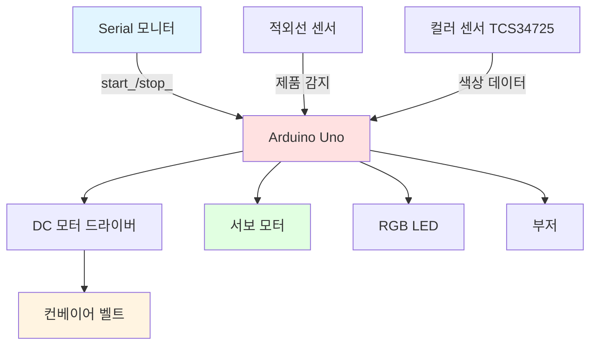

---

## 🔄 전체 동작 순서도

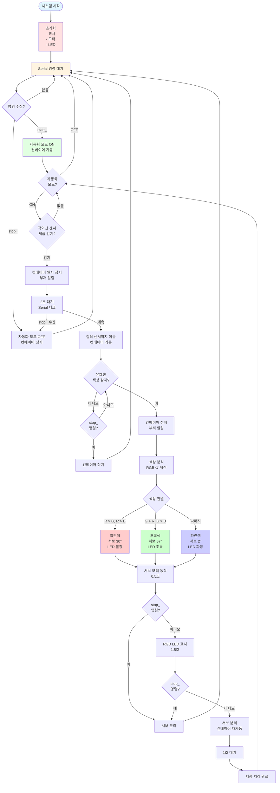

---

## 📝 상태 다이어그램

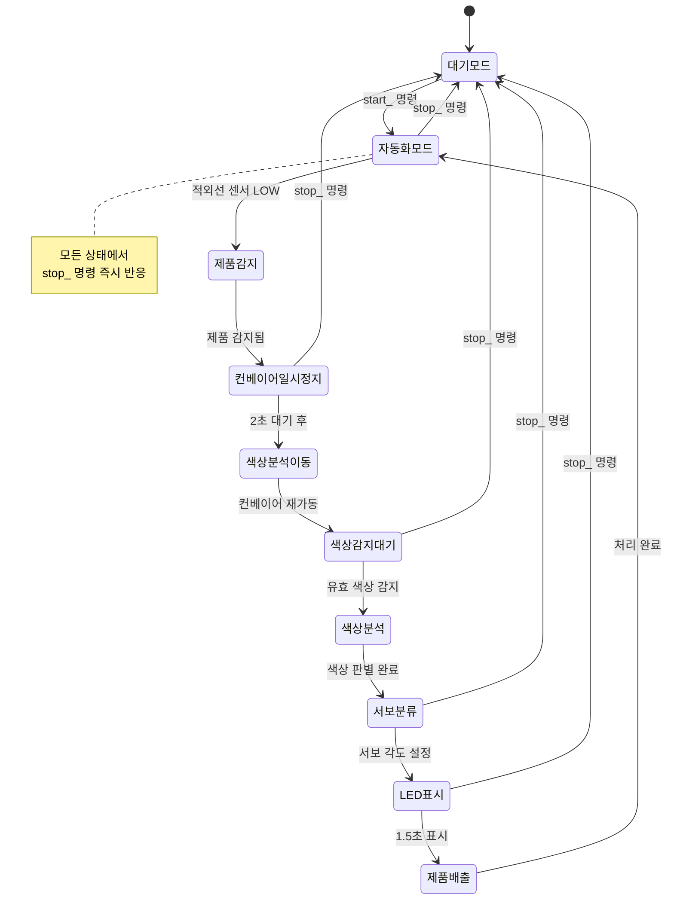

---

## ⚙️ 알고리즘 단계별 설명

### 1단계: 초기화 (setup)

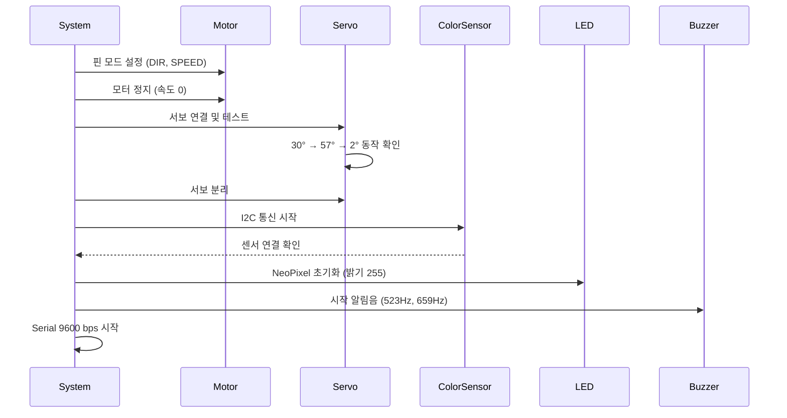

### 2단계: 명령 대기 (loop - 대기 모드)

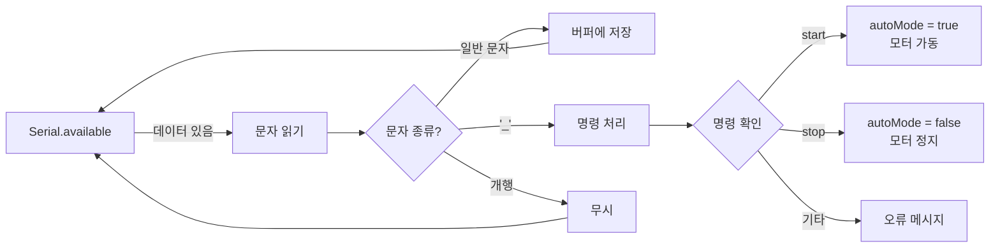

### 3단계: 제품 감지 (loop - 자동화 모드)

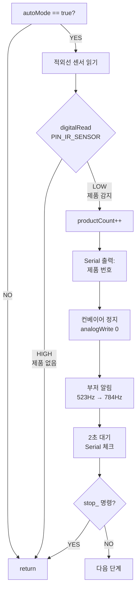

### 4단계: 색상 분석

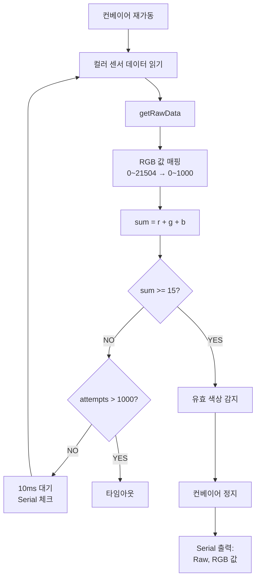

### 5단계: 색상 판별 및 분류

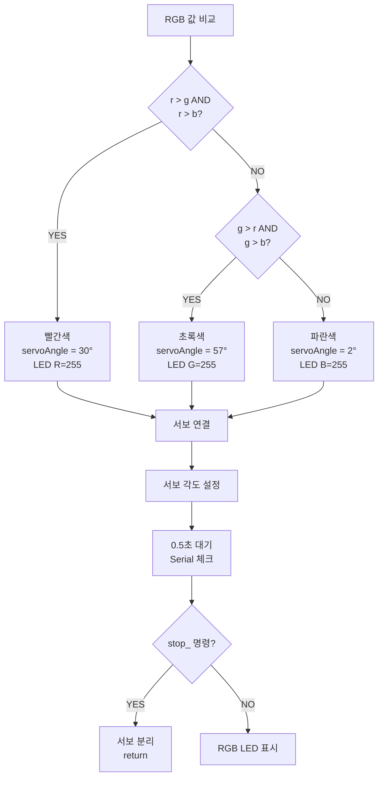

### 6단계: 제품 배출

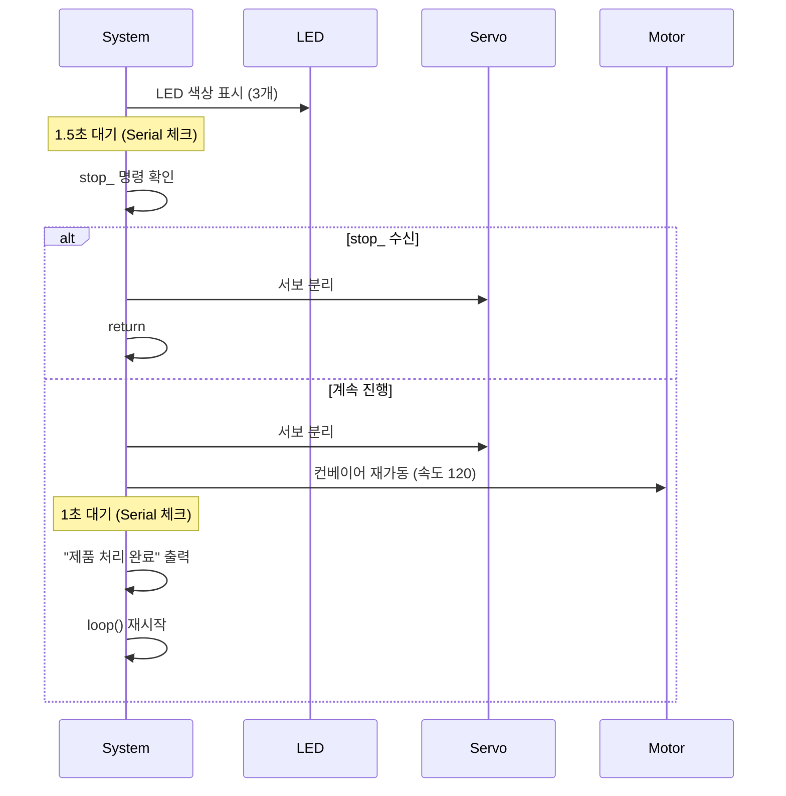

---

## 🔑 핵심 함수 설명

### `checkSerialCommand()`
**역할**: Serial 데이터를 읽고 명령 버퍼에 저장

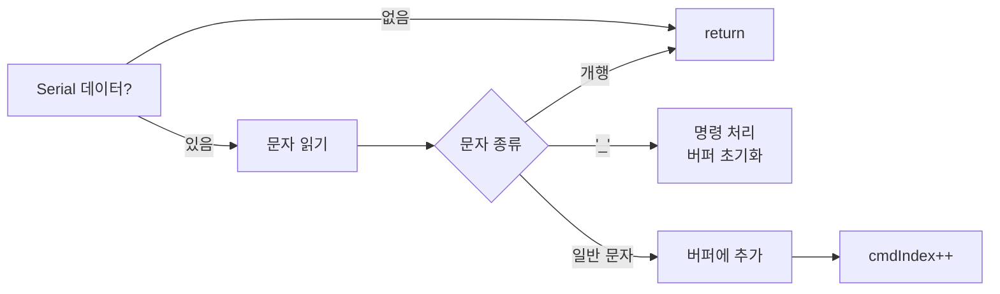

**특징**:
- `_` 문자를 구분자로 사용 (start_, stop_)
- 버퍼 오버플로우 방지 (최대 20자)
- 개행 문자 자동 무시

---

### `processCommand()`
**역할**: 수신된 명령 분석 및 실행

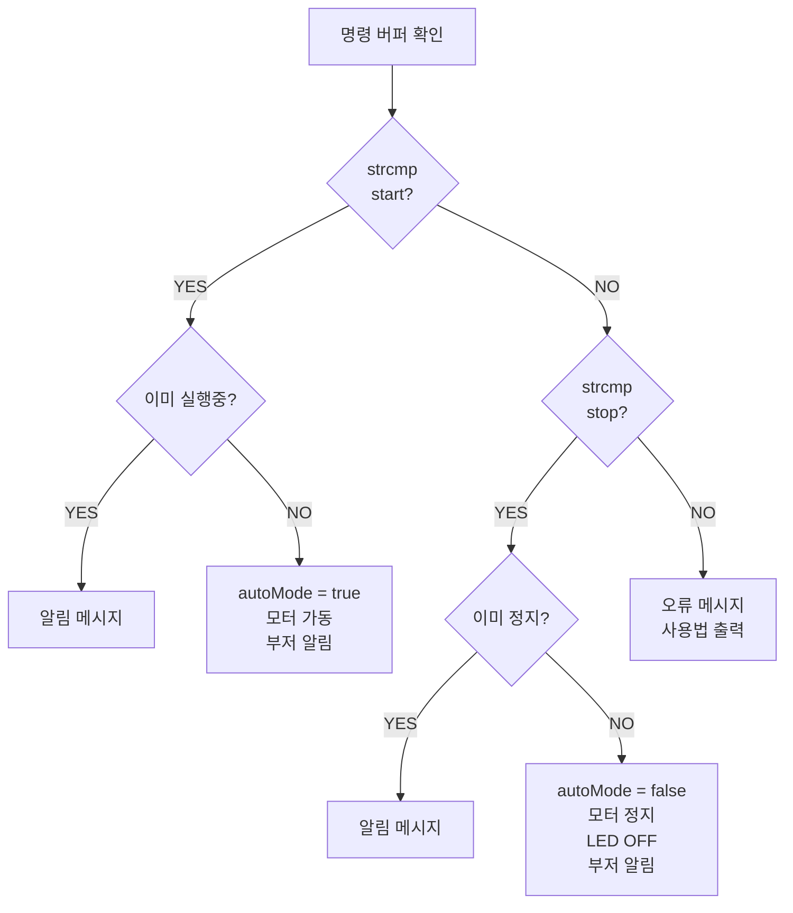

**특징**:
- 중복 명령 방지 (이미 실행중/정지중 체크)
- stop 명령 시 LED 자동 소등
- 알 수 없는 명령 시 사용법 출력

---

### `delayWithSerialCheck(ms)`
**역할**: 대기 중에도 Serial 명령 체크

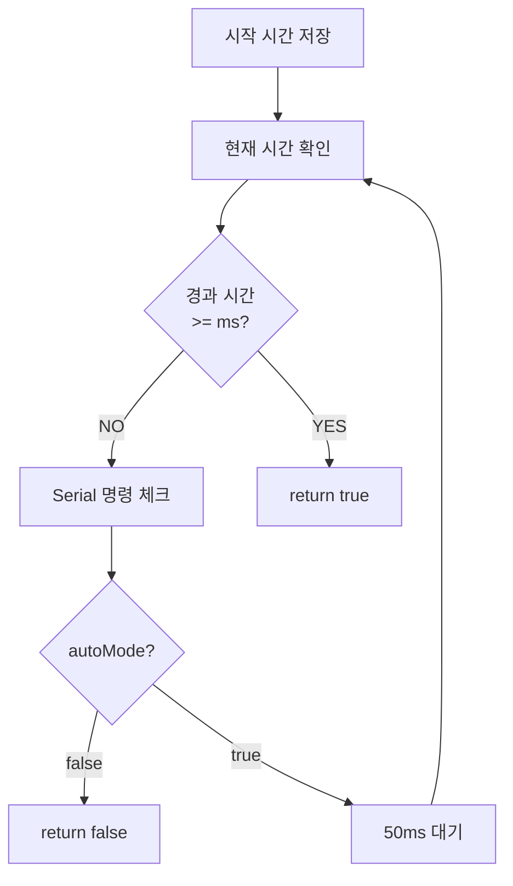

**특징**:
- 모든 대기 시간에 stop 명령 즉시 반응
- 50ms 간격으로 체크 (반응성 향상)
- autoMode가 false로 변경되면 즉시 false 반환

---

## 🎨 색상 판별 알고리즘

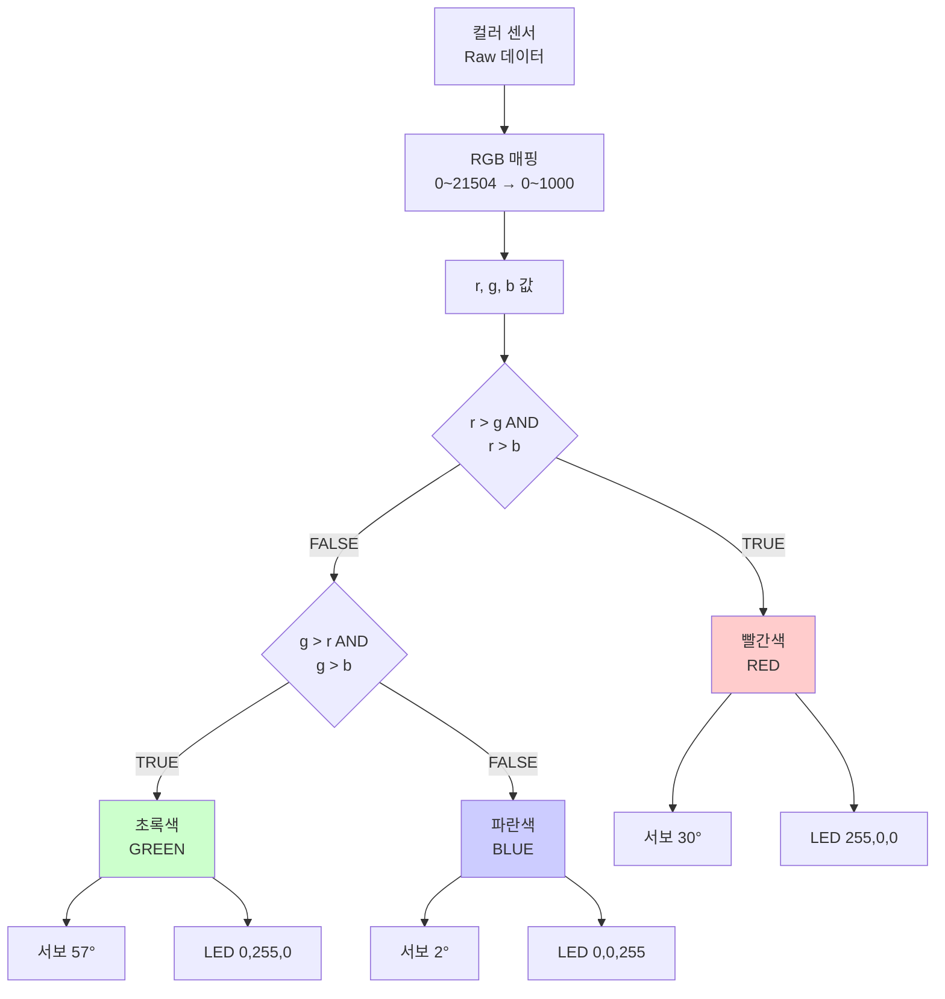

### 색상 판별 조건

| 색상 | 조건 | 서보 각도 | LED (R,G,B) |
|------|------|-----------|-------------|
| 빨간색 | `r > g && r > b` | 30° | (255, 0, 0) |
| 초록색 | `g > r && g > b` | 57° | (0, 255, 0) |
| 파란색 | 나머지 | 2° | (0, 0, 255) |

---

## 📡 Serial 통신 프로토콜

### 명령 형식
```
[명령어]_
```

### 지원 명령

| 명령어 | 형식 | 기능 | 응답 |
|--------|------|------|------|
| start | `start_` | 자동화 시작 | `자동화 시작` |
| stop | `stop_` | 자동화 중지 | `자동화 중지` |

### 통신 설정
- **Baud Rate**: 9600 bps
- **데이터 비트**: 8 bit
- **패리티**: None
- **정지 비트**: 1 bit

### 명령 파싱 방식

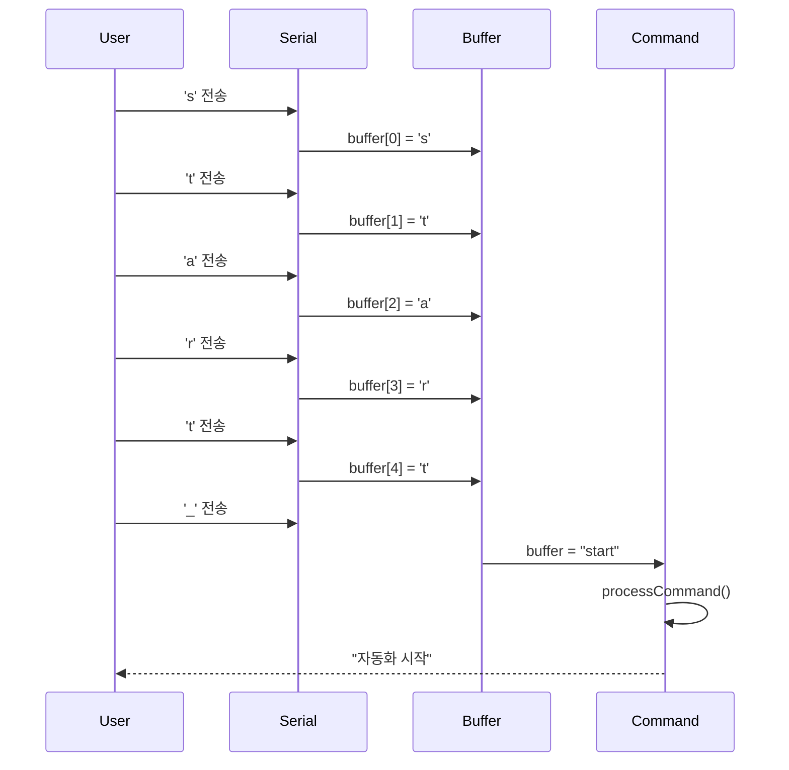

---

## ⚡ 타이밍 다이어그램

```mermaid
gantt
    title 제품 처리 타임라인
    dateFormat X
    axisFormat %L ms
    
    section 감지
    제품 감지 (적외선)    :done, detect, 0, 100
    컨베이어 일시 정지   :done, stop1, 100, 200
    부저 알림 1         :done, buzz1, 100, 300
    2초 대기           :done, wait1, 300, 2300
    
    section 분석
    컬러 센서까지 이동   :active, move, 2300, 3800
    색상 데이터 읽기     :active, read, 3800, 4000
    컨베이어 정지        :done, stop2, 4000, 4100
    부저 알림 2         :done, buzz2, 4000, 4300
    
    section 분류
    서보 모터 동작       :crit, servo, 4300, 4800
    RGB LED 표시        :crit, led, 4800, 6300
    
    section 배출
    컨베이어 재가동      :active, resume, 6300, 7300
    제품 처리 완료       :milestone, done, 7300, 7300
```

### 각 단계별 소요 시간

| 단계 | 시간 | 설명 |
|------|------|------|
| 적외선 감지 후 대기 | 2000ms | `DELAY_IR_DETECT` |
| 색상 분석 후 대기 | 1500ms | `DELAY_COLOR_DETECT` |
| 다음 제품 대기 | 1000ms | `DELAY_NEXT_PRODUCT` |
| 서보 모터 동작 | 500ms | 서보 각도 설정 |
| 총 처리 시간 | 약 5~7초 | 제품당 평균 시간 |

---

## 🚀 사용 방법

### 1. 업로드
```bash
1. Arduino IDE 실행
2. 파일 열기: 07_serial_controlled_system.ino
3. 라이브러리 설치:
   - Adafruit NeoPixel
   - Adafruit TCS34725
   - Servo
4. 보드 선택: Arduino Uno
5. 포트 선택
6. 업로드
```

### 2. Serial 모니터 설정
```
- Baud Rate: 9600
- Line Ending: 개행 문자 포함 (선택사항)
```

### 3. 명령 입력 예시

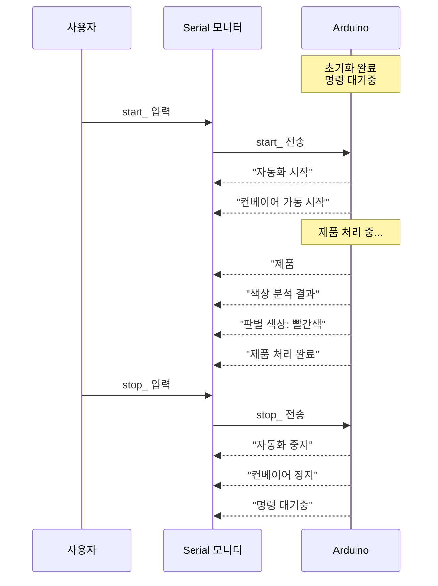

---

## 🔍 문제 해결

### 1. 컬러 센서를 찾을 수 없습니다
```
[오류] 컬러 센서를 찾을 수 없습니다!
```
**해결 방법**:
- I2C 연결 확인 (SDA, SCL)
- TCS34725 센서 전원 확인
- `Wire.h` 라이브러리 설치 확인

### 2. stop 명령이 즉시 반응하지 않음
**해결 방법**:
- Serial 모니터 Baud Rate 확인 (9600)
- `_` 문자 포함 여부 확인 (stop_)
- 명령어 끝에 공백 제거

### 3. 색상 인식이 부정확함
**해결 방법**:
- 센서와 제품 간 거리 조정 (2~5cm 권장)
- 조명 환경 개선 (밝은 백색광)
- `ANGLE_RED`, `ANGLE_GREEN`, `ANGLE_BLUE` 값 조정

### 4. 서보 모터가 떨림
**해결 방법**:
- 서보 전원 분리 (5V 충분한 공급)
- 사용 후 `servo.detach()` 확인
- 케이블 연결 상태 점검

---

## 📈 성능 최적화

### 1. Serial 체크 주기
```cpp
// delayWithSerialCheck() 함수 내
delay(50);  // 50ms 간격 체크 (반응성↑, CPU 사용↓)
```

### 2. 색상 감지 타임아웃
```cpp
if (attempts > 1000) break;  // 최대 10초 (10ms × 1000)
```

### 3. 모터 속도 조정
```cpp
#define MOTOR_SPEED 120  // 0~255 (속도 높을수록 처리량↑)
```

---

## 🎓 학습 포인트

### 1. **비동기 명령 처리**
- `delayWithSerialCheck()` 함수로 대기 중에도 명령 수신
- 상태 변수(`autoMode`)로 즉시 중단 가능

### 2. **문자열 파싱**
- 버퍼를 사용한 명령어 조립
- `_` 구분자 기반 명령 분리

### 3. **센서 데이터 처리**
- Raw 데이터 → 매핑 → 판별
- 유효성 검증 (`sum >= MIN_SUM`)

### 4. **상태 머신 패턴**
- `autoMode` 상태에 따른 동작 분기
- 각 단계별 순차 처리

---

## 📚 확장 아이디어

### 1. 다중 색상 지원
```cpp
// 노란색, 흰색, 검은색 등 추가
if (r > 800 && g > 800 && b < 200) {
    colorName = "노란색";
    servoAngle = ANGLE_YELLOW;
}
```

### 2. 통계 기능
```cpp
int redCount = 0, greenCount = 0, blueCount = 0;
// stats_ 명령으로 통계 출력
```

### 3. 속도 조절
```cpp
// speed_[0-255]_ 명령으로 속도 변경
if (strcmp(cmdBuffer, "speed") == 0) {
    motorSpeed = parseSpeed();
}
```

### 4. LCD 디스플레이
```cpp
// 현재 상태, 제품 수, 색상 정보 표시
lcd.print("제품: ");
lcd.print(productCount);
```

---

## 📖 관련 파일

- **이전 단계**: `06_integrated_conveyor_system/` (기본 통합 시스템)
- **다음 단계**: `08_dual_comm_system/` (Serial + Bluetooth 듀얼 통신)
- **알고리즘 설명**: `arduino_code/알고리즘_설명서.md`

---

## 📝 라이센스

본 프로젝트는 교육 목적으로 제작되었습니다.

---

## 📧 문의

프로젝트 관련 문의사항은 이슈를 등록해 주세요.

---

**마지막 업데이트**: 2026-01-25
