# Day2 컨베이어 시스템 - 아두이노 기본 가이드

## 📚 목차
0. [시스템 전체 개요](#0-시스템-전체-개요)
1. [아두이노 기본 개념](#1-아두이노-기본-개념)
2. [입출력 원리와 알고리즘](#2-입출력-원리와-알고리즘)
3. [디지털 vs PWM vs 아날로그](#3-디지털-vs-pwm-vs-아날로그)
4. [아두이노 소스 코드 기본 구조](#4-아두이노-소스-코드-기본-구조)
5. [시리얼 통신과 디버깅](#5-시리얼-통신과-디버깅)
6. [Day2 사용 부품 특징](#6-day2-사용-부품-특징)
7. [기본 예제 프로젝트](#7-기본-예제-프로젝트)
8. [자주 묻는 질문 (FAQ)](#8-자주-묻는-질문-faq)
9. [주의사항](#9-주의사항)

---

## 0. 시스템 전체 개요

### 0.1 스마트 컨베이어 시스템 구성도

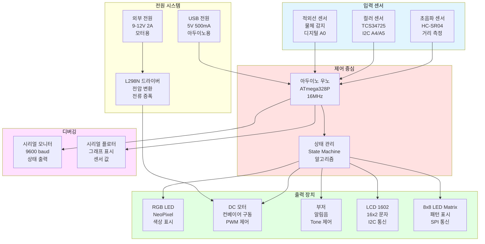

### 0.2 전체 부품 리스트

#### 필수 부품 (Day2 기본)

| 번호 | 카테고리 | 부품명 | 수량 | 전압 | 통신 방식 | 용도 |
|------|---------|--------|------|------|----------|------|
| 1 | 제어 | 아두이노 우노 R3 | 1 | 5V | USB | 메인 컨트롤러 |
| 2 | 센서 | 적외선 센서 | 1 | 5V | 디지털 | 물체 감지 |
| 3 | 센서 | TCS34725 컬러 센서 | 1 | 3.3V | I2C | 색상 판별 |
| 4 | 출력 | NeoPixel RGB LED | 3 | 5V | 1-Wire | 상태 표시 |
| 5 | 출력 | DC 모터 | 1 | 12V | - | 컨베이어 구동 |
| 6 | 드라이버 | L298N 모터 드라이버 | 1 | 5-35V | PWM | 모터 제어 |
| 7 | 출력 | 피에조 부저 | 1 | 5V | PWM | 알림음 |
| 8 | 전원 | 9V 2A 어댑터 | 1 | 9-12V | - | 모터 전원 |
| 9 | 기타 | 브레드보드 | 1 | - | - | 회로 구성 |
| 10 | 기타 | 점퍼 와이어 | 30 | - | - | 연결 |
| 11 | 기타 | 저항 220Ω | 5 | - | - | LED 전류 제한 |

#### 확장 부품 (선택)

| 번호 | 카테고리 | 부품명 | 수량 | 전압 | 통신 방식 | 용도 |
|------|---------|--------|------|------|----------|------|
| 12 | 센서 | HC-SR04 초음파 센서 | 1 | 5V | 디지털 | 거리 측정 |
| 13 | 출력 | LCD 1602 (I2C) | 1 | 5V | I2C | 문자 표시 |
| 14 | 출력 | 8x8 LED Matrix | 1 | 5V | SPI | 패턴 표시 |
| 15 | 센서 | 조이스틱 모듈 | 1 | 5V | 아날로그 | 수동 제어 |
| 16 | 통신 | HC-06 블루투스 | 1 | 5V | UART | 무선 제어 |

### 0.3 핀 맵 전체 구성

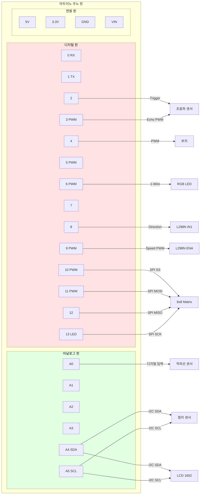

### 0.4 전원 연결 구조

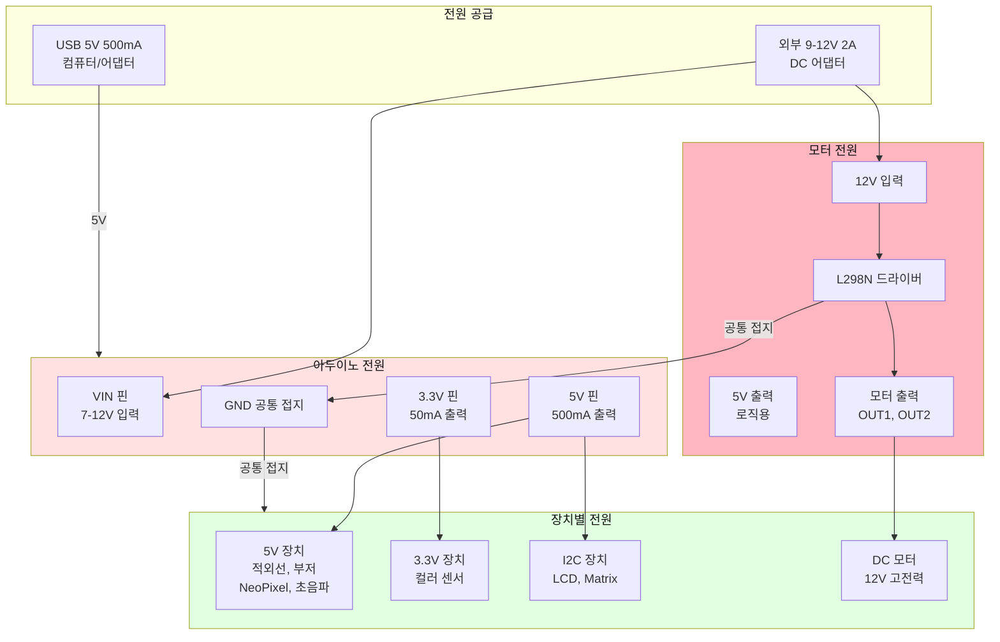

**⚠️ 전원 주의사항:**
- USB 전원만으로는 모터 구동 불가 (전류 부족)
- 모터 사용 시 반드시 외부 전원 연결
- 공통 접지(GND) 연결 필수
- 3.3V 장치에 5V 연결 금지 (센서 손상)

### 0.5 시스템 동작 순서도

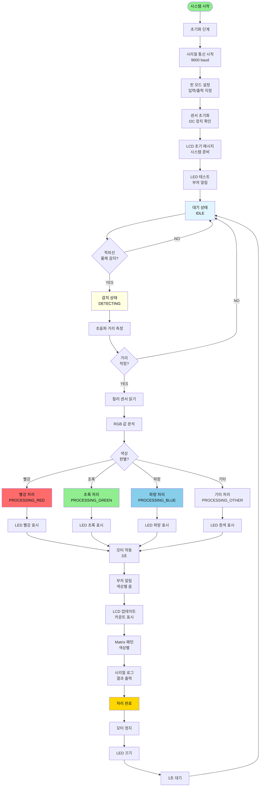

### 0.6 상태 머신 다이어그램

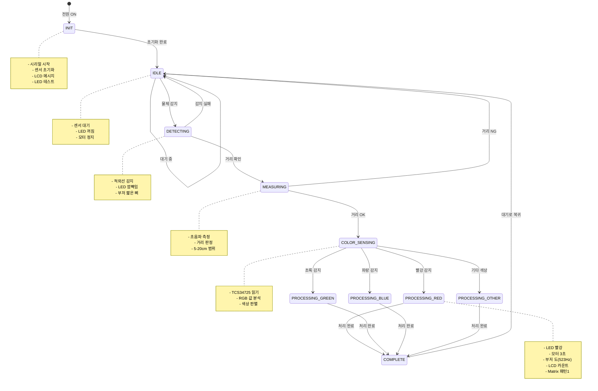

### 0.7 통신 프로토콜 맵

```mermaid
graph TB
    subgraph SERIAL[시리얼 통신]
        S1[USB 시리얼<br/>9600 baud<br/>디버깅용]
        S2[블루투스 시리얼<br/>9600 baud<br/>무선 제어]
    end
    
    subgraph I2C[I2C 통신]
        I1[TCS34725<br/>주소 0x29<br/>컬러 센서]
        I2[LCD 1602<br/>주소 0x27<br/>문자 표시]
    end
    
    subgraph SPI_BUS[SPI 통신]
        P1[8x8 Matrix<br/>MAX7219<br/>패턴 표시]
    end
    
    subgraph ONE_WIRE[1-Wire 통신]
        W1[NeoPixel<br/>WS2812B<br/>RGB LED]
    end
    
    subgraph PWM_SIGNAL[PWM 신호]
        PWM1[모터 속도<br/>0-255<br/>analogWrite]
        PWM2[부저 주파수<br/>20-20000Hz<br/>tone]
    end
    
    subgraph DIGITAL_IO[디지털 입출력]
        D1[적외선 센서<br/>LOW/HIGH<br/>digitalRead]
        D2[초음파 Trigger<br/>10us 펄스<br/>digitalWrite]
        D3[초음파 Echo<br/>거리 계산<br/>pulseIn]
        D4[모터 방향<br/>HIGH/LOW<br/>digitalWrite]
    end
    
    ARDUINO[아두이노 우노<br/>ATmega328P] --> S1
    ARDUINO --> S2
    ARDUINO --> I1
    ARDUINO --> I2
    ARDUINO --> P1
    ARDUINO --> W1
    ARDUINO --> PWM1
    ARDUINO --> PWM2
    ARDUINO --> D1
    ARDUINO --> D2
    ARDUINO --> D3
    ARDUINO --> D4
    
    style SERIAL fill:#E1F5FF,color:#111
    style I2C fill:#FFE1E1,color:#111
    style SPI_BUS fill:#E1FFE1,color:#111
    style ONE_WIRE fill:#FFFFE1,color:#111
    style PWM_SIGNAL fill:#FFE1FF,color:#111
    style DIGITAL_IO fill:#E1E1FF,color:#111
    style ARDUINO fill:#FFD700,color:#111
```

### 0.8 데이터 흐름도

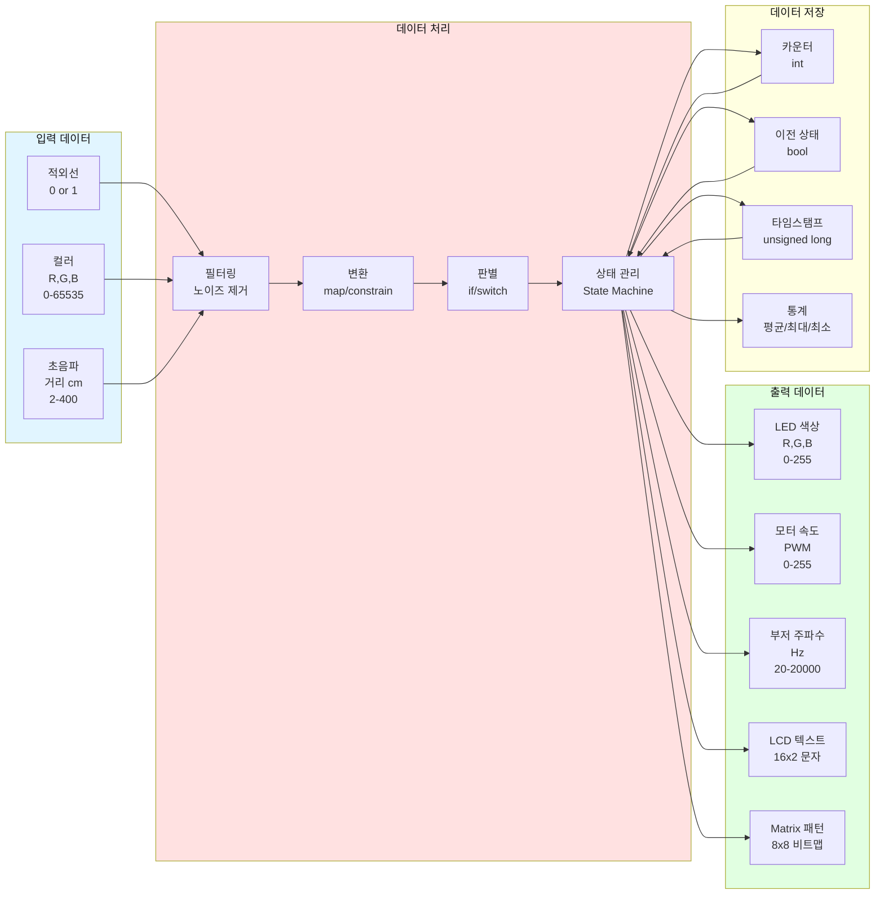

---

## 1. 아두이노 기본 개념

### 1.1 아두이노란?
- **마이크로컨트롤러 보드**: 센서 입력을 받아 처리하고 액추에이터를 제어하는 소형 컴퓨터
- **오픈소스 플랫폼**: 누구나 무료로 사용 가능한 하드웨어/소프트웨어
- **교육용 최적화**: 초보자도 쉽게 배울 수 있는 구조

### 1.2 아두이노의 구성 요소
```
┌─────────────────────────────────────┐
│         아두이노 우노 보드            │
├─────────────────────────────────────┤
│  ┌───────────────────────────────┐  │
│  │   ATmega328P 마이크로컨트롤러  │  │
│  │   - 16MHz 클럭                │  │
│  │   - 32KB 플래시 메모리         │  │
│  │   - 2KB SRAM                  │  │
│  └───────────────────────────────┘  │
│                                     │
│  디지털 핀 (0~13)                   │
│  - 입력/출력 가능                   │
│  - 일부 PWM 지원 (~표시)            │
│                                     │
│  아날로그 핀 (A0~A5)                │
│  - 0~5V → 0~1023 변환              │
│  - 디지털 출력도 가능               │
│                                     │
│  전원 핀                            │
│  - 5V, 3.3V, GND                   │
└─────────────────────────────────────┘
```

### 1.3 아두이노 동작 원리


---

## 2. 입출력 원리와 알고리즘

### 2.1 입력-처리-출력 구조도


**예시: 적외선 센서 → LED 제어**
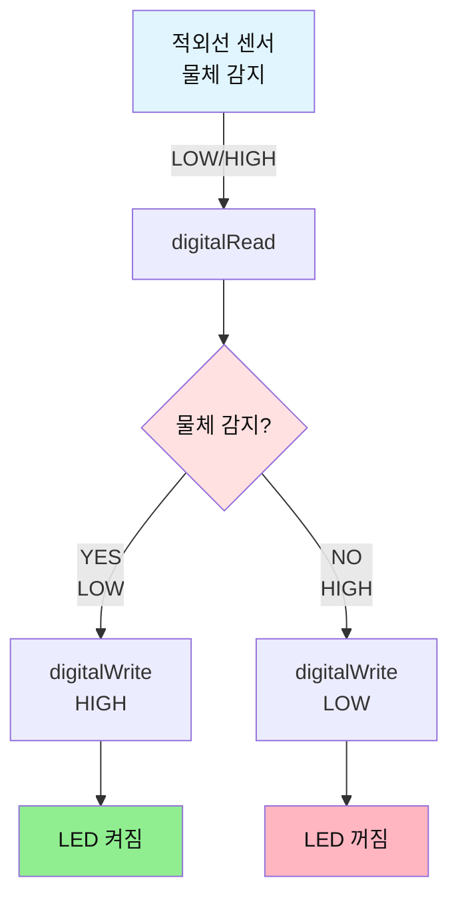

### 2.2 기본 알고리즘 패턴

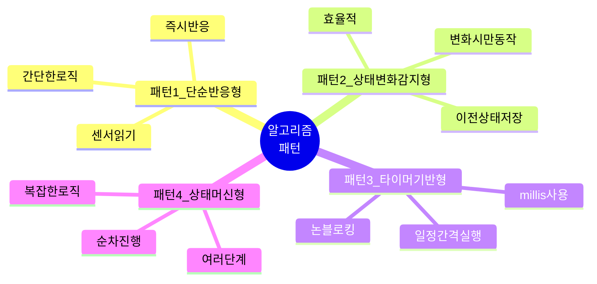

#### 패턴 1: 단순 반응형
```cpp
// 센서 읽기 → 즉시 반응
void loop() {
  int sensorValue = digitalRead(SENSOR_PIN);
  
  if (sensorValue == LOW) {
    digitalWrite(LED_PIN, HIGH);  // 즉시 LED 켜기
  } else {
    digitalWrite(LED_PIN, LOW);   // 즉시 LED 끄기
  }
}
```

#### 패턴 2: 상태 변화 감지형
```cpp
// 상태가 바뀔 때만 동작
bool lastState = HIGH;

void loop() {
  bool currentState = digitalRead(SENSOR_PIN);
  
  // 상태 변화 감지
  if (currentState != lastState) {
    if (currentState == LOW) {
      Serial.println("물체 감지 시작!");
      tone(BUZZER_PIN, 523, 100);
    }
  }
  
  lastState = currentState;
}
```

#### 패턴 3: 타이머 기반형
```cpp
// 일정 시간마다 동작
unsigned long lastTime = 0;
const unsigned long INTERVAL = 1000;  // 1초

void loop() {
  unsigned long currentTime = millis();
  
  if (currentTime - lastTime >= INTERVAL) {
    // 1초마다 실행
    int sensorValue = analogRead(SENSOR_PIN);
    Serial.println(sensorValue);
    
    lastTime = currentTime;
  }
}
```

#### 패턴 4: 상태 머신형
```cpp
// 여러 단계를 순차적으로 진행
enum State {
  IDLE,      // 대기
  DETECTING, // 감지 중
  PROCESSING // 처리 중
};

State currentState = IDLE;

void loop() {
  switch (currentState) {
    case IDLE:
      // 센서 감지 대기
      if (digitalRead(SENSOR_PIN) == LOW) {
        currentState = DETECTING;
      }
      break;
      
    case DETECTING:
      // 색상 판별
      int color = detectColor();
      currentState = PROCESSING;
      break;
      
    case PROCESSING:
      // 결과 처리
      processResult();
      currentState = IDLE;
      break;
  }
}
```

**상태 머신 다이어그램:**
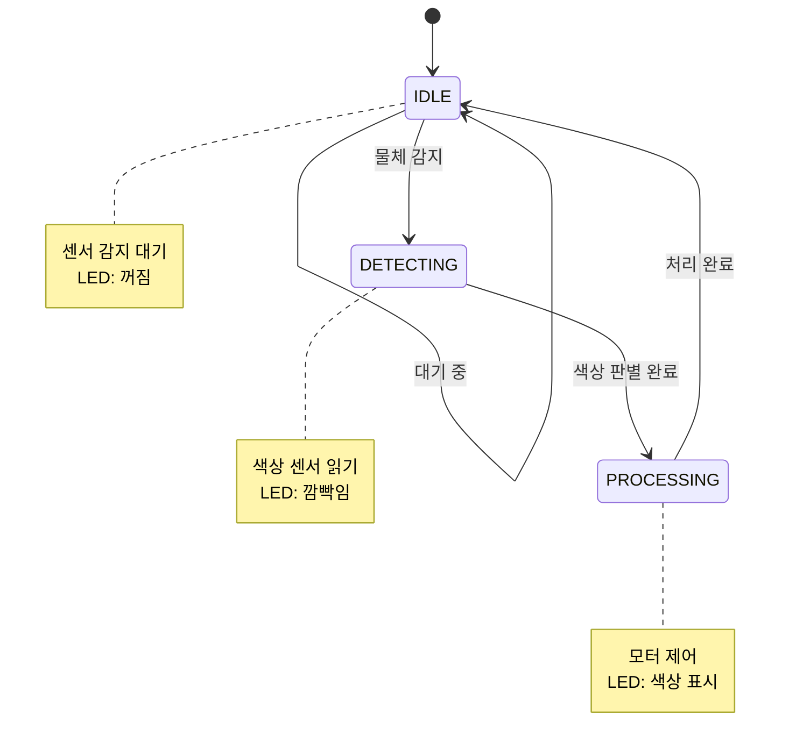

---

## 3. 디지털 vs PWM vs 아날로그

### 3.1 신호 타입 개요

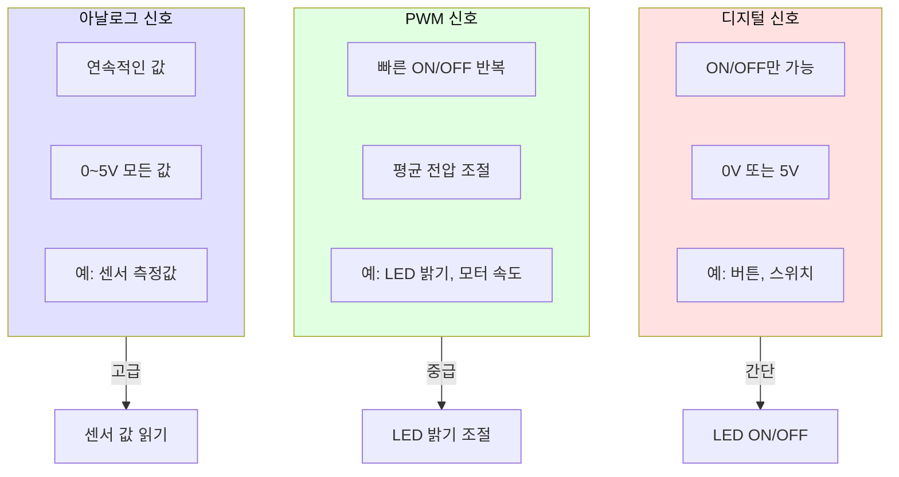

### 3.2 비교 표
| 구분 | 디지털 | PWM | 아날로그 |
|------|--------|-----|----------|
| **신호 형태** | ON/OFF (0 또는 1) | 빠른 ON/OFF 반복 | 연속적인 전압 변화 |
| **전압 값** | 0V 또는 5V | 평균 0~5V | 0~5V 연속 |
| **아두이노 값** | 0 또는 1 (LOW/HIGH) | 0~255 | 0~1023 |
| **사용 핀** | 모든 디지털 핀 | ~표시 핀만 (3,5,6,9,10,11) | 아날로그 입력 핀 (A0~A5) |
| **함수** | `digitalRead/Write` | `analogWrite` | `analogRead` |
| **용도** | 버튼, LED ON/OFF | 모터 속도, LED 밝기 | 센서 값 읽기 |

### 3.2 디지털 신호 (Digital)
```
전압
 5V  ┌───┐   ┌───┐   ┌───┐
     │   │   │   │   │   │
 0V  ┘   └───┘   └───┘   └───
     HIGH LOW HIGH LOW HIGH LOW
     
- 두 가지 상태만 존재: HIGH(1, 5V) 또는 LOW(0, 0V)
- 예: 버튼 눌림/안눌림, LED 켜짐/꺼짐
```

**코드 예시:**
```cpp
// 디지털 입력 (버튼)
int buttonState = digitalRead(BUTTON_PIN);
if (buttonState == HIGH) {
  // 버튼이 눌렸을 때
}

// 디지털 출력 (LED)
digitalWrite(LED_PIN, HIGH);  // LED 켜기
digitalWrite(LED_PIN, LOW);   // LED 끄기
```

### 3.3 PWM 신호 (Pulse Width Modulation)
```
전압
 5V  ┌─┐ ┌─┐ ┌─┐ ┌─┐    ← 50% Duty Cycle (평균 2.5V)
     │ │ │ │ │ │ │ │
 0V  ┘ └─┘ └─┘ └─┘ └─

 5V  ┌───┐ ┌───┐ ┌───┐  ← 75% Duty Cycle (평균 3.75V)
     │   │ │   │ │   │
 0V  ┘   └─┘   └─┘   └─

- 빠르게 ON/OFF를 반복하여 평균 전압 조절
- 0~255 값: 0(0% = 0V), 127(50% = 2.5V), 255(100% = 5V)
- 주파수: 약 490Hz (사람 눈에는 연속으로 보임)
```

**코드 예시:**
```cpp
// PWM 출력 (LED 밝기 조절)
analogWrite(LED_PIN, 0);    // 꺼짐 (0%)
analogWrite(LED_PIN, 64);   // 어두움 (25%)
analogWrite(LED_PIN, 128);  // 중간 (50%)
analogWrite(LED_PIN, 192);  // 밝음 (75%)
analogWrite(LED_PIN, 255);  // 최대 (100%)

// PWM 출력 (모터 속도 조절)
analogWrite(MOTOR_PIN, 100);  // 느린 속도
analogWrite(MOTOR_PIN, 200);  // 빠른 속도
```

### 3.4 아날로그 신호 (Analog Input)
```
전압
 5V  ─────┐     ┌─────────
          │    ╱
 2.5V     │   ╱
          │  ╱
 0V       └─╱
     
     연속적으로 변하는 전압
     
- 0~5V 사이의 모든 값 가능
- 아두이노는 10비트 ADC로 변환: 0~1023
- 예: 가변저항, 조이스틱, 빛 센서, 온도 센서
```

**코드 예시:**
```cpp
// 아날로그 입력 (센서)
int sensorValue = analogRead(SENSOR_PIN);  // 0~1023

// 전압으로 변환
float voltage = sensorValue * (5.0 / 1023.0);

// 다른 범위로 매핑
int brightness = map(sensorValue, 0, 1023, 0, 255);
analogWrite(LED_PIN, brightness);
```

### 3.5 센서별 신호 타입
| 센서 종류 | 신호 타입 | 이유 |
|-----------|----------|------|
| **적외선 센서** | 디지털 | 감지됨/안됨 두 가지 상태만 필요 |
| **컬러 센서** | 아날로그 (I2C) | RGB 값은 연속적인 숫자 |
| **조이스틱** | 아날로그 | X, Y 축의 위치는 연속 값 |
| **버튼** | 디지털 | 눌림/안눌림 두 가지 상태 |
| **온도 센서** | 아날로그 | 온도는 연속적으로 변함 |

---

## 4. 아두이노 소스 코드 기본 구조

### 4.1 전체 구조
```cpp
/* ============================================
 *  1. 주석 및 설명
 * ============================================ */
/**
 * 프로그램 제목
 * 
 * 기능: 무엇을 하는 프로그램인지 설명
 * 작성자: 이름
 * 날짜: 2026-01-27
 */

/* ============================================
 *  2. 라이브러리 포함
 * ============================================ */
#include <Wire.h>              // I2C 통신용
#include <Adafruit_NeoPixel.h> // NeoPixel LED용

/* ============================================
 *  3. 상수 정의 (#define)
 * ============================================ */
#define PIN_LED        13    // LED 핀 번호
#define PIN_SENSOR     A0    // 센서 핀 번호
#define THRESHOLD      500   // 임계값

/* ============================================
 *  4. 전역 변수 선언
 * ============================================ */
int sensorValue = 0;         // 센서 값 저장
bool ledState = false;       // LED 상태
unsigned long lastTime = 0;  // 마지막 시간

/* ============================================
 *  5. setup() 함수 - 초기화 (1회 실행)
 * ============================================ */
void setup() {
  // 시리얼 통신 시작
  Serial.begin(9600);
  
  // 핀 모드 설정
  pinMode(PIN_LED, OUTPUT);
  pinMode(PIN_SENSOR, INPUT);
  
  // 초기 상태 설정
  digitalWrite(PIN_LED, LOW);
  
  // 초기화 메시지
  Serial.println("프로그램 시작!");
}

/* ============================================
 *  6. loop() 함수 - 반복 실행
 * ============================================ */
void loop() {
  // 센서 읽기
  sensorValue = analogRead(PIN_SENSOR);
  
  // 조건 판단
  if (sensorValue > THRESHOLD) {
    digitalWrite(PIN_LED, HIGH);
  } else {
    digitalWrite(PIN_LED, LOW);
  }
  
  // 결과 출력
  Serial.println(sensorValue);
  
  // 대기
  delay(100);
}

/* ============================================
 *  7. 사용자 정의 함수
 * ============================================ */
/**
 * LED를 깜빡이는 함수
 * @param times 깜빡일 횟수
 * @param delayTime 깜빡임 간격(ms)
 */
void blinkLED(int times, int delayTime) {
  for (int i = 0; i < times; i++) {
    digitalWrite(PIN_LED, HIGH);
    delay(delayTime);
    digitalWrite(PIN_LED, LOW);
    delay(delayTime);
  }
}
```

### 4.2 setup() vs loop()
```
프로그램 실행 흐름:

전원 ON
   ↓
setup() 실행 (1회만)
   ├─ 시리얼 통신 시작
   ├─ 핀 모드 설정
   ├─ 변수 초기화
   └─ 센서/모듈 초기화
   ↓
loop() 실행 (무한 반복)
   ├─ 센서 읽기
   ├─ 데이터 처리
   ├─ 출력 제어
   └─ 다시 loop() 처음으로
   ↓
   (전원 OFF까지 계속 반복)
```

### 4.3 주요 함수 정리

#### 입력 함수
```cpp
// 디지털 입력
int value = digitalRead(PIN);  // LOW(0) 또는 HIGH(1)

// 아날로그 입력
int value = analogRead(PIN);   // 0~1023
```

#### 출력 함수
```cpp
// 디지털 출력
digitalWrite(PIN, HIGH);  // 5V 출력
digitalWrite(PIN, LOW);   // 0V 출력

// PWM 출력
analogWrite(PIN, 128);    // 0~255 (평균 전압)
```

#### 시간 함수
```cpp
delay(1000);              // 1초 대기 (블로킹)
unsigned long t = millis(); // 프로그램 시작 후 경과 시간(ms)
delayMicroseconds(100);   // 100마이크로초 대기
```

#### 시리얼 통신 함수
```cpp
Serial.begin(9600);       // 시리얼 통신 시작
Serial.print("값: ");     // 줄바꿈 없이 출력
Serial.println(value);    // 줄바꿈과 함께 출력
```

#### 수학 함수
```cpp
int result = map(value, 0, 1023, 0, 255);  // 범위 변환
int limited = constrain(value, 0, 100);    // 범위 제한
int minimum = min(a, b);                   // 최소값
int maximum = max(a, b);                   // 최대값
```

---

## 5. 시리얼 통신과 디버깅

### 5.1 시리얼 모니터란?
- **PC와 아두이노 간 통신**: USB 케이블을 통해 데이터 주고받기
- **디버깅 도구**: 프로그램 실행 중 값 확인
- **사용자 입력**: PC에서 명령 전송 가능

### 5.2 시리얼 통신 기본 사용법
```cpp
void setup() {
  // 통신 속도 설정 (baud rate)
  // 9600, 19200, 38400, 57600, 115200 등
  Serial.begin(9600);
  
  // 초기화 완료 메시지
  Serial.println("시스템 시작!");
}

void loop() {
  int sensorValue = analogRead(A0);
  
  // 방법 1: 간단한 출력
  Serial.println(sensorValue);
  
  // 방법 2: 설명과 함께 출력
  Serial.print("센서 값: ");
  Serial.println(sensorValue);
  
  // 방법 3: 포맷팅 출력
  Serial.print("센서=");
  Serial.print(sensorValue);
  Serial.print(", 전압=");
  Serial.print(sensorValue * 5.0 / 1023.0);
  Serial.println("V");
  
  delay(1000);
}
```

### 5.3 시리얼 플로터 활용
```cpp
// 여러 값을 동시에 그래프로 표시
void loop() {
  int sensor1 = analogRead(A0);
  int sensor2 = analogRead(A1);
  
  // 쉼표로 구분하여 출력
  Serial.print(sensor1);
  Serial.print(",");
  Serial.println(sensor2);
  
  delay(50);
}

// 도구 → 시리얼 플로터 열기
```

### 5.4 디버깅 기법

#### 기법 1: 단계별 출력
```cpp
void loop() {
  Serial.println("=== 루프 시작 ===");
  
  Serial.println("1. 센서 읽기");
  int value = analogRead(A0);
  Serial.print("   값: ");
  Serial.println(value);
  
  Serial.println("2. 조건 판단");
  if (value > 500) {
    Serial.println("   → 임계값 초과");
  } else {
    Serial.println("   → 정상 범위");
  }
  
  Serial.println("=== 루프 종료 ===\n");
  delay(1000);
}
```

#### 기법 2: 변수 상태 모니터링
```cpp
void loop() {
  static int count = 0;
  
  // 변수 상태 출력
  Serial.print("[");
  Serial.print(count++);
  Serial.print("] ");
  Serial.print("센서=");
  Serial.print(sensorValue);
  Serial.print(", LED=");
  Serial.println(ledState ? "ON" : "OFF");
  
  delay(500);
}
```

#### 기법 3: 에러 체크
```cpp
void setup() {
  Serial.begin(9600);
  
  // 센서 초기화 확인
  if (!sensor.begin()) {
    Serial.println("[ERROR] 센서 초기화 실패!");
    while (1) {
      // 무한 루프로 프로그램 정지
      digitalWrite(LED_BUILTIN, HIGH);
      delay(200);
      digitalWrite(LED_BUILTIN, LOW);
      delay(200);
    }
  }
  
  Serial.println("[OK] 센서 초기화 성공");
}
```

### 5.5 시리얼 입력 받기
```cpp
void loop() {
  // 시리얼 데이터가 있는지 확인
  if (Serial.available() > 0) {
    // 한 글자 읽기
    char command = Serial.read();
    
    // 명령 처리
    switch (command) {
      case '1':
        digitalWrite(LED_PIN, HIGH);
        Serial.println("LED ON");
        break;
        
      case '0':
        digitalWrite(LED_PIN, LOW);
        Serial.println("LED OFF");
        break;
        
      case 'r':
        Serial.println("시스템 리셋");
        resetSystem();
        break;
        
      default:
        Serial.println("알 수 없는 명령");
        break;
    }
  }
}
```

---

## 6. Day2 사용 부품 특징

### 6.1 적외선 센서 (IR Obstacle Sensor)
```
┌─────────────────────┐
│   적외선 센서        │
├─────────────────────┤
│  [LED] ← 발광부     │
│  [수신부] ← 감지    │
│                     │
│  VCC  - 전원 (5V)   │
│  GND  - 접지        │
│  OUT  - 신호 출력   │
└─────────────────────┘
```

**특징:**
- **감지 방식**: 적외선 반사
- **출력**: 디지털 (LOW=감지, HIGH=미감지)
- **감지 거리**: 2~30cm (가변저항으로 조절)
- **장점**: 빠른 반응 속도, 저렴한 가격
- **단점**: 검은색 물체 감지 어려움, 햇빛 영향

**주요 용도:**
- 물체 감지
- 라인 트레이서
- 근접 스위치

**연결 방법:**
```cpp
#define PIN_IR_SENSOR  A0

void setup() {
  pinMode(PIN_IR_SENSOR, INPUT);
}

void loop() {
  int detected = digitalRead(PIN_IR_SENSOR);
  if (detected == LOW) {
    // 물체 감지됨
  }
}
```

### 6.2 컬러 센서 (TCS34725)
```
┌─────────────────────┐
│   TCS34725          │
├─────────────────────┤
│  [RGB 포토다이오드]  │
│  [백색 LED]         │
│                     │
│  VIN - 전원 (3.3V)  │
│  GND - 접지         │
│  SCL - I2C 클럭     │
│  SDA - I2C 데이터   │
└─────────────────────┘
```

**특징:**
- **감지 방식**: RGB 빛 센서
- **통신**: I2C (Wire 라이브러리)
- **출력**: 16비트 RGB 값 (0~65535)
- **내장 LED**: 측정 시 조명 제공
- **장점**: 정확한 색상 측정, 다양한 색상 구분
- **단점**: 주변 조명 영향, 상대적으로 비쌈

**주요 용도:**
- 색상 분류
- 품질 검사
- 색상 매칭

**연결 방법:**
```cpp
#include <Wire.h>
#include <Adafruit_TCS34725.h>

Adafruit_TCS34725 sensor = Adafruit_TCS34725();

void setup() {
  sensor.begin();
}

void loop() {
  uint16_t r, g, b, c;
  sensor.getRawData(&r, &g, &b, &c);
  // r, g, b 값 사용
}
```

### 6.3 RGB LED (NeoPixel WS2812B)
```
┌─────────────────────┐
│   NeoPixel LED      │
├─────────────────────┤
│  [R] [G] [B] LED    │
│  [제어 칩 내장]      │
│                     │
│  VCC  - 전원 (5V)   │
│  GND  - 접지        │
│  DIN  - 데이터 입력 │
│  DOUT - 다음 LED로  │
└─────────────────────┘
```

**특징:**
- **제어 방식**: 디지털 신호 (1-wire)
- **색상**: 1677만 색상 (RGB 각 0~255)
- **개별 제어**: 각 LED를 독립적으로 제어
- **체인 연결**: 여러 개를 직렬 연결 가능
- **장점**: 다양한 색상, 간단한 배선
- **단점**: 전류 소모 큼, 타이밍 민감

**주요 용도:**
- 상태 표시
- 장식 조명
- 시각적 피드백

**연결 방법:**
```cpp
#include <Adafruit_NeoPixel.h>

#define PIN_LED    6
#define NUM_PIXELS 3

Adafruit_NeoPixel led = Adafruit_NeoPixel(NUM_PIXELS, PIN_LED);

void setup() {
  led.begin();
  led.setBrightness(255);
}

void loop() {
  // 첫 번째 LED를 빨간색으로
  led.setPixelColor(0, led.Color(255, 0, 0));
  led.show();
}
```

### 6.4 DC 모터 + L298N 드라이버
```
┌─────────────────────┐
│   L298N 모터 드라이버│
├─────────────────────┤
│  [H-브리지 회로]     │
│                     │
│  IN1, IN2 - 방향    │
│  ENA - 속도 (PWM)   │
│  12V - 모터 전원    │
│  5V  - 로직 전원    │
│  GND - 접지         │
│                     │
│  OUT1, OUT2 - 모터  │
└─────────────────────┘
```

**특징:**
- **제어 방식**: PWM (속도) + 디지털 (방향)
- **전압**: 5~35V
- **전류**: 최대 2A (각 채널)
- **기능**: 속도 제어, 방향 전환, 브레이크
- **장점**: 고전력 제어, 양방향 회전
- **단점**: 발열, 큰 크기

**주요 용도:**
- 컨베이어 벨트
- 로봇 바퀴
- 팬, 펌프

**연결 방법:**
```cpp
#define PIN_DIRECTION  13
#define PIN_SPEED      11  // PWM 핀

void setup() {
  pinMode(PIN_DIRECTION, OUTPUT);
  pinMode(PIN_SPEED, OUTPUT);
}

void loop() {
  // 전진, 중간 속도
  digitalWrite(PIN_DIRECTION, HIGH);
  analogWrite(PIN_SPEED, 128);
}
```

### 6.5 부저 (Buzzer)
```
┌─────────────────────┐
│   피에조 부저        │
├─────────────────────┤
│  [압전 소자]         │
│                     │
│  + (긴 다리)        │
│  - (짧은 다리)      │
└─────────────────────┘
```

**특징:**
- **종류**: 패시브 부저 (주파수 제어 가능)
- **주파수 범위**: 20Hz~20kHz
- **제어**: tone() 함수
- **장점**: 다양한 음 생성, 저렴
- **단점**: 음질 낮음

**주요 용도:**
- 알림음
- 경고음
- 간단한 멜로디

**연결 방법:**
```cpp
#define PIN_BUZZER  4

void setup() {
  pinMode(PIN_BUZZER, OUTPUT);
}

void loop() {
  // 도(523Hz) 음을 100ms 동안
  tone(PIN_BUZZER, 523, 100);
  delay(200);
}
```

### 6.6 부품 비교표
| 부품 | 신호 타입 | 전압 | 전류 | 통신 방식 | 난이도 |
|------|----------|------|------|----------|--------|
| 적외선 센서 | 디지털 입력 | 5V | 20mA | 직접 연결 | ★☆☆ |
| 컬러 센서 | I2C | 3.3V | 3mA | I2C (Wire) | ★★★ |
| RGB LED | 디지털 출력 | 5V | 60mA/개 | 1-wire | ★★☆ |
| DC 모터 | PWM 출력 | 12V | 1A | L298N 드라이버 | ★★☆ |
| 부저 | PWM 출력 | 5V | 30mA | 직접 연결 | ★☆☆ |

---

## 7. 기본 예제 프로젝트

### 7.1 프로젝트: 스마트 물체 감지 시스템
**목표**: 적외선 센서로 물체를 감지하고, LED와 부저로 알림

### 7.2 회로도
```
Arduino UNO
┌─────────────────┐
│                 │
│  A0 ────────────┼──── IR Sensor OUT
│                 │
│  13 ────────────┼──── LED (+ 220Ω)
│                 │
│  4  ────────────┼──── Buzzer (+)
│                 │
│  5V ────────────┼──── IR Sensor VCC, Buzzer (+)
│                 │
│  GND ───────────┼──── IR Sensor GND, LED (-), Buzzer (-)
│                 │
└─────────────────┘
```

### 7.3 부품 리스트
| 번호 | 부품명 | 수량 | 용도 |
|------|--------|------|------|
| 1 | 아두이노 우노 | 1 | 메인 컨트롤러 |
| 2 | 적외선 센서 | 1 | 물체 감지 |
| 3 | LED | 1 | 시각적 알림 |
| 4 | 부저 | 1 | 청각적 알림 |
| 5 | 저항 220Ω | 1 | LED 전류 제한 |
| 6 | 브레드보드 | 1 | 회로 구성 |
| 7 | 점퍼 와이어 | 10 | 연결 |

### 7.4 핀 맵
| 아두이노 핀 | 연결 부품 | 신호 타입 |
|------------|----------|----------|
| A0 | 적외선 센서 OUT | 디지털 입력 |
| 13 | LED (+) | 디지털 출력 |
| 4 | 부저 (+) | PWM 출력 |
| 5V | 센서/부저 전원 | 전원 |
| GND | 공통 접지 | 접지 |

### 7.5 동작 순서도
```
┌─────────────────┐
│   프로그램 시작  │
└────────┬────────┘
         ↓
┌─────────────────┐
│   setup() 실행  │
│ - 시리얼 시작   │
│ - 핀 모드 설정  │
└────────┬────────┘
         ↓
┌─────────────────┐
│  loop() 시작    │
└────────┬────────┘
         ↓
┌─────────────────┐
│ 센서 값 읽기    │
│ (digitalRead)   │
└────────┬────────┘
         ↓
    ┌────┴────┐
    │ 물체    │
    │ 감지?   │
    └─┬────┬──┘
  YES │    │ NO
      ↓    ↓
┌──────────┐  ┌──────────┐
│ LED ON   │  │ LED OFF  │
│ 부저 ON  │  │ 부저 OFF │
│ 메시지출력│  │          │
└────┬─────┘  └────┬─────┘
     │            │
     └────┬───────┘
          ↓
    ┌──────────┐
    │ 100ms    │
    │ 대기     │
    └────┬─────┘
         ↓
    (loop로 돌아감)
```

### 7.6 소스 코드
```cpp
/**
 * 스마트 물체 감지 시스템
 * 
 * 기능:
 * - 적외선 센서로 물체 감지
 * - 감지 시 LED 켜기 및 부저 울림
 * - 시리얼 모니터로 상태 출력
 * - 감지 횟수 카운트
 * 
 * 작성자: Smart Factory Team
 * 날짜: 2026-01-27
 */

/* ===== 라이브러리 포함 ===== */
// (이 예제는 기본 함수만 사용하므로 불필요)

/* ===== 핀 번호 정의 ===== */
#define PIN_IR_SENSOR       A0    // 적외선 센서 입력 핀
#define PIN_LED             13    // LED 출력 핀
#define PIN_BUZZER          4     // 부저 출력 핀

/* ===== 설정값 ===== */
#define LOOP_DELAY          100   // 루프 대기 시간(ms)
#define BUZZER_FREQUENCY    523   // 부저 주파수(Hz) - 도 음
#define BUZZER_DURATION     50    // 부저 울림 시간(ms)

/* ===== 전역 변수 ===== */
bool lastDetected = false;        // 이전 감지 상태
int detectionCount = 0;           // 감지 횟수
unsigned long lastDetectTime = 0; // 마지막 감지 시간

/* ===== 함수 선언 ===== */
void printStatus(bool detected);
void playAlert();

/**
 * 초기화 함수 (1회 실행)
 */
void setup() {
  // 1. 시리얼 통신 시작
  Serial.begin(9600);
  
  // 2. 핀 모드 설정
  pinMode(PIN_IR_SENSOR, INPUT);
  pinMode(PIN_LED, OUTPUT);
  pinMode(PIN_BUZZER, OUTPUT);
  
  // 3. 초기 상태 설정
  digitalWrite(PIN_LED, LOW);
  
  // 4. 시작 메시지 출력
  Serial.println("========================================");
  Serial.println("  스마트 물체 감지 시스템");
  Serial.println("========================================");
  Serial.println("시스템 초기화 완료");
  Serial.println("물체 감지를 시작합니다...\n");
  
  // 5. 시작 알림 (부저 2회)
  tone(PIN_BUZZER, 523, 100);
  delay(150);
  tone(PIN_BUZZER, 659, 100);
  delay(200);
}

/**
 * 메인 루프 (무한 반복)
 */
void loop() {
  // 1. 센서 값 읽기 (LOW = 감지됨, HIGH = 미감지)
  bool detected = (digitalRead(PIN_IR_SENSOR) == LOW);
  
  // 2. 상태 변화 감지
  if (detected != lastDetected) {
    if (detected) {
      // 2-1. 물체 감지 시작
      detectionCount++;
      lastDetectTime = millis();
      
      // LED 켜기
      digitalWrite(PIN_LED, HIGH);
      
      // 부저 울리기
      playAlert();
      
      // 상태 출력
      Serial.println("========================================");
      Serial.print("[감지 #");
      Serial.print(detectionCount);
      Serial.println("] 물체 감지됨!");
      Serial.print("시간: ");
      Serial.print(millis() / 1000.0);
      Serial.println("초");
      
    } else {
      // 2-2. 물체 감지 종료
      unsigned long detectDuration = millis() - lastDetectTime;
      
      // LED 끄기
      digitalWrite(PIN_LED, LOW);
      
      // 상태 출력
      Serial.print("물체 미감지 (감지 시간: ");
      Serial.print(detectDuration);
      Serial.println("ms)");
      Serial.println("========================================\n");
    }
  }
  
  // 3. 현재 상태 저장
  lastDetected = detected;
  
  // 4. 대기
  delay(LOOP_DELAY);
}

/**
 * 알림음 재생 함수
 */
void playAlert() {
  // 감지 횟수에 따라 다른 음 재생
  int frequency = BUZZER_FREQUENCY;
  
  if (detectionCount % 5 == 0) {
    // 5의 배수일 때: 특별한 멜로디
    tone(PIN_BUZZER, 523, 100);  // 도
    delay(120);
    tone(PIN_BUZZER, 659, 100);  // 미
    delay(120);
    tone(PIN_BUZZER, 784, 100);  // 솔
  } else {
    // 일반 알림음
    tone(PIN_BUZZER, frequency, BUZZER_DURATION);
  }
}
```

### 7.7 실행 결과 예시
```
========================================
  스마트 물체 감지 시스템
========================================
시스템 초기화 완료
물체 감지를 시작합니다...

========================================
[감지 #1] 물체 감지됨!
시간: 2.5초
물체 미감지 (감지 시간: 1234ms)
========================================

========================================
[감지 #2] 물체 감지됨!
시간: 5.8초
물체 미감지 (감지 시간: 567ms)
========================================

========================================
[감지 #5] 물체 감지됨!
시간: 12.3초
물체 미감지 (감지 시간: 2345ms)
========================================
```

### 7.8 확장 아이디어
1. **감지 거리 표시**: 아날로그 센서 사용 시 거리 측정
2. **통계 기능**: 평균 감지 시간, 최대/최소 시간 계산
3. **LCD 표시**: 16x2 LCD에 감지 횟수 표시
4. **데이터 로깅**: SD 카드에 감지 기록 저장
5. **무선 전송**: 블루투스로 스마트폰에 알림

---

## 8. 자주 묻는 질문 (FAQ)

### 8.1 하드웨어 관련

**Q1. 아두이노 우노와 메가의 차이는 무엇인가요?**
```
A: 주요 차이점:
┌──────────────┬─────────────┬─────────────┐
│ 항목         │ 우노        │ 메가        │
├──────────────┼─────────────┼─────────────┤
│ 디지털 핀    │ 14개        │ 54개        │
│ 아날로그 핀  │ 6개         │ 16개        │
│ PWM 핀       │ 6개         │ 15개        │
│ 플래시 메모리│ 32KB        │ 256KB       │
│ SRAM         │ 2KB         │ 8KB         │
│ 크기         │ 작음        │ 큼          │
│ 가격         │ 저렴        │ 비쌈        │
└──────────────┴─────────────┴─────────────┘

초보자는 우노로 시작, 복잡한 프로젝트는 메가 사용
```

**Q2. 5V와 3.3V 핀의 차이는 무엇인가요?**
```
A: 
- 5V: 대부분의 센서/모듈에 사용 (최대 500mA)
- 3.3V: 저전압 센서용 (최대 50mA, 전류 제한 주의!)
- 잘못 연결 시 부품 손상 가능
- 예: ESP8266, SD 카드 → 3.3V 필수
```

**Q3. 아날로그 핀을 디지털로 사용할 수 있나요?**
```
A: 가능합니다!
- A0~A5는 디지털 14~19번으로도 사용 가능
- 예: pinMode(A0, OUTPUT); digitalWrite(A0, HIGH);
- 하지만 디지털 핀을 아날로그로는 사용 불가
```

**Q4. PWM 핀이 아닌 곳에서 analogWrite()를 사용하면?**
```
A: 
- 3, 5, 6, 9, 10, 11번만 PWM 지원 (~표시)
- 다른 핀에서는 0~127 → LOW, 128~255 → HIGH로 동작
- 부드러운 밝기 조절 불가, ON/OFF만 가능
```

**Q5. 전원을 USB와 외부 어댑터 둘 다 연결해도 되나요?**
```
A: 안전합니다!
- 아두이노는 자동으로 높은 전압을 선택
- USB(5V) < 외부 어댑터(7~12V) → 외부 사용
- 모터 등 고전력 장치는 외부 어댑터 필수
```

### 8.2 소프트웨어 관련

**Q6. delay()와 millis()의 차이는?**
```
A:
delay(1000):
- 1초 동안 프로그램 정지 (블로킹)
- 다른 작업 불가능
- 간단하지만 비효율적

millis():
- 프로그램 시작 후 경과 시간(ms) 반환
- 다른 작업 동시 수행 가능 (논블로킹)
- 복잡하지만 효율적

예시:
unsigned long lastTime = 0;
void loop() {
  if (millis() - lastTime >= 1000) {
    // 1초마다 실행
    lastTime = millis();
  }
  // 다른 작업도 계속 실행 가능
}
```

**Q7. Serial.print()와 Serial.println()의 차이는?**
```
A:
Serial.print("값: ");    // 줄바꿈 없음
Serial.println(123);     // 줄바꿈 있음

출력 결과:
값: 123
    ↑ 여기서 줄바꿈

Serial.print()만 사용 시:
값: 123값: 456값: 789  (한 줄에 계속)
```

**Q8. 변수 타입을 어떻게 선택하나요?**
```
A: 용도별 선택:
┌──────────┬─────────┬──────────────┬─────────────┐
│ 타입     │ 크기    │ 범위         │ 용도        │
├──────────┼─────────┼──────────────┼─────────────┤
│ bool     │ 1바이트 │ true/false   │ 상태 플래그 │
│ byte     │ 1바이트 │ 0~255        │ 센서 값     │
│ int      │ 2바이트 │ -32768~32767 │ 일반 정수   │
│ long     │ 4바이트 │ ±21억        │ 큰 숫자     │
│ float    │ 4바이트 │ 소수점 6자리 │ 계산 결과   │
│ String   │ 가변    │ 문자열       │ 텍스트      │
└──────────┴─────────┴──────────────┴─────────────┘

메모리 절약 팁: 작은 타입 우선 사용
```

**Q9. #define과 const의 차이는?**
```
A:
#define LED_PIN 13
- 전처리기 매크로 (컴파일 전 텍스트 치환)
- 메모리 사용 안 함
- 타입 없음
- 전통적 방식

const int LED_PIN = 13;
- 상수 변수 (컴파일 시 메모리 할당)
- 메모리 사용 (매우 적음)
- 타입 있음 (안전)
- 현대적 방식

권장: const 사용 (타입 안전성)
```

**Q10. 함수를 언제 만들어야 하나요?**
```
A: 다음 경우에 함수 분리:
1. 같은 코드가 2번 이상 반복될 때
2. 코드가 20줄 이상일 때
3. 독립적인 기능일 때

예시:
// 나쁜 예: 반복 코드
digitalWrite(LED, HIGH);
delay(500);
digitalWrite(LED, LOW);
delay(500);
digitalWrite(LED, HIGH);
delay(500);
digitalWrite(LED, LOW);

// 좋은 예: 함수로 분리
void blinkLED(int times) {
  for (int i = 0; i < times; i++) {
    digitalWrite(LED, HIGH);
    delay(500);
    digitalWrite(LED, LOW);
    delay(500);
  }
}
```

### 8.3 센서/액추에이터 관련

**Q11. 센서 값이 불안정하게 튀는 이유는?**
```
A: 노이즈 문제입니다.
해결 방법:
1. 하드웨어: 0.1μF 커패시터 병렬 연결
2. 소프트웨어: 이동 평균 필터

// 이동 평균 필터 예시
const int SAMPLES = 10;
int readings[SAMPLES];
int index = 0;
int total = 0;

int getStableValue() {
  total -= readings[index];
  readings[index] = analogRead(SENSOR_PIN);
  total += readings[index];
  index = (index + 1) % SAMPLES;
  return total / SAMPLES;
}
```

**Q12. 적외선 센서가 물체를 감지하지 못해요.**
```
A: 체크리스트:
1. 가변저항 조절 (드라이버로 회전)
2. 감지 거리 확인 (2~30cm)
3. 물체 색상 (검은색은 감지 어려움)
4. 배선 확인 (VCC, GND, OUT)
5. 주변 조명 (너무 밝으면 오작동)

테스트 코드:
void loop() {
  int value = digitalRead(IR_PIN);
  Serial.println(value);  // 0 또는 1 확인
  delay(100);
}
```

**Q13. 컬러 센서가 색상을 잘못 인식해요.**
```
A: 보정 필요:
1. 흰색 기준 측정 (최대값 확인)
2. 검은색 기준 측정 (최소값 확인)
3. 주변 조명 차단 (센서에 덮개 씌우기)
4. 거리 일정하게 유지 (1~3cm)

보정 코드:
int r_cal = map(r, r_min, r_max, 0, 255);
int g_cal = map(g, g_min, g_max, 0, 255);
int b_cal = map(b, b_min, b_max, 0, 255);
```

**Q14. RGB LED가 원하는 색상이 안 나와요.**
```
A: 확인 사항:
1. 색상 순서 (GRB? RGB?)
   - WS2812B는 GRB 순서
   - 라이브러리 설정 확인: NEO_GRB or NEO_RGB
2. 밝기 설정
   - led.setBrightness(255); 확인
3. led.show() 호출 확인
4. 전원 부족 (LED 많을 때 외부 전원 필요)
```

**Q15. 모터가 회전하지 않아요.**
```
A: 체크리스트:
1. 외부 전원 연결 (USB 전원으로는 부족)
2. L298N 점퍼 설정 (ENA 점퍼 제거 시 PWM 연결 필요)
3. 모터 전선 연결 확인
4. 코드 확인:
   - digitalWrite(DIR_PIN, HIGH);
   - analogWrite(SPEED_PIN, 200); // 0이 아닌 값
5. 드라이버 LED 확인 (전원 들어오는지)
```

### 8.4 디버깅 관련

**Q16. 업로드 에러: "avrdude: stk500_recv(): programmer is not responding"**
```
A: 해결 방법:
1. USB 케이블 재연결
2. 올바른 포트 선택 (도구 → 포트)
3. 올바른 보드 선택 (도구 → 보드 → Arduino Uno)
4. 다른 USB 포트 시도
5. 아두이노 리셋 버튼 누른 후 업로드
6. USB 케이블 불량 (데이터 전송 가능한 케이블 사용)
```

**Q17. 시리얼 모니터에 깨진 문자가 나와요.**
```
A: Baud Rate 불일치
- 코드: Serial.begin(9600);
- 시리얼 모니터: 우측 하단 9600 baud 선택
- 둘이 일치해야 정상 출력
```

**Q18. 프로그램이 중간에 멈춰요.**
```
A: 원인:
1. 무한 루프
   while (1) { } // 빠져나올 수 없음
   
2. delay() 과다 사용
   delay(10000); // 10초 동안 정지
   
3. 메모리 부족
   String text = ""; // String 반복 사용 시 메모리 누수
   
디버깅:
Serial.println("1"); // 단계별 출력으로 어디서 멈추는지 확인
Serial.println("2");
Serial.println("3");
```

**Q19. 변수 값이 이상하게 나와요.**
```
A: 오버플로우 확인
byte value = 250;
value = value + 10;  // 260이 아닌 4가 됨! (256을 넘어서 순환)

해결: 적절한 타입 사용
int value = 250;
value = value + 10;  // 260 정상
```

**Q20. 여러 센서를 동시에 읽으면 느려져요.**
```
A: delay() 제거 및 millis() 사용
// 나쁜 예
void loop() {
  readSensor1();
  delay(1000);
  readSensor2();
  delay(1000);
}

// 좋은 예
unsigned long lastTime1 = 0;
unsigned long lastTime2 = 0;

void loop() {
  if (millis() - lastTime1 >= 1000) {
    readSensor1();
    lastTime1 = millis();
  }
  
  if (millis() - lastTime2 >= 1000) {
    readSensor2();
    lastTime2 = millis();
  }
}
```

### 8.5 프로젝트 관련

**Q21. 여러 파일로 코드를 나누려면?**
```
A: 탭 기능 사용
1. 아두이노 IDE에서 우측 화살표 클릭
2. "새 탭" 선택
3. 파일명 입력 (예: sensors.h, motors.cpp)
4. 자동으로 같은 폴더에 저장됨

예시:
main.ino:
#include "sensors.h"
void setup() { initSensors(); }

sensors.h:
void initSensors();

sensors.cpp:
#include "sensors.h"
void initSensors() { ... }
```

**Q22. EEPROM에 데이터를 저장하려면?**
```
A:
#include <EEPROM.h>

// 쓰기
EEPROM.write(0, 123);  // 주소 0에 123 저장

// 읽기
int value = EEPROM.read(0);

// 주의: 
// - 100,000회 쓰기 제한
// - 1바이트씩만 저장 (0~255)
// - int는 2바이트로 나눠 저장 필요
```

**Q23. 블루투스로 데이터를 보내려면?**
```
A: HC-06 모듈 사용
// 하드웨어 시리얼 (0, 1번 핀)
void setup() {
  Serial.begin(9600);
}

void loop() {
  Serial.println("Hello");  // 블루투스로 전송
  
  if (Serial.available()) {
    char c = Serial.read();  // 블루투스에서 수신
  }
}

// 소프트웨어 시리얼 (다른 핀)
#include <SoftwareSerial.h>
SoftwareSerial BT(2, 3);  // RX, TX

void setup() {
  BT.begin(9600);
}
```

**Q24. LCD에 한글을 표시할 수 있나요?**
```
A: 일반 LCD는 한글 불가 (영문, 숫자만)
대안:
1. OLED 디스플레이 사용 (한글 폰트 지원)
2. TFT LCD 사용
3. 영문 약어 사용 (예: "Detected" → "DET")
```

**Q25. 여러 서보모터를 동시에 제어하려면?**
```
A:
#include <Servo.h>

Servo servo1, servo2, servo3;

void setup() {
  servo1.attach(9);
  servo2.attach(10);
  servo3.attach(11);
}

void loop() {
  // 동시에 움직임
  servo1.write(90);
  servo2.write(45);
  servo3.write(135);
}

주의: 서보 6개 이상 시 타이머 충돌 가능
```

### 8.6 고급 주제

**Q26. 인터럽트란 무엇인가요?**
```
A: 특정 이벤트 발생 시 즉시 함수 실행
- 핀 변화 감지 (버튼 누름 등)
- loop()와 독립적으로 동작

예시:
volatile int count = 0;

void setup() {
  attachInterrupt(digitalPinToInterrupt(2), countUp, RISING);
}

void countUp() {
  count++;  // 핀 2번이 HIGH가 될 때마다 실행
}

주의: 인터럽트 함수는 짧고 빠르게!
```

**Q27. 아두이노 메모리가 부족해요.**
```
A: 최적화 방법:
1. F() 매크로 사용
   Serial.println(F("긴 문자열"));  // SRAM 대신 플래시 메모리 사용
   
2. String 대신 char 배열
   char text[20] = "Hello";  // String보다 메모리 효율적
   
3. 불필요한 전역 변수 제거
4. PROGMEM 사용 (큰 배열을 플래시에 저장)
```

**Q28. 아두이노로 MP3를 재생할 수 있나요?**
```
A: 가능합니다!
1. DFPlayer Mini 모듈 사용
   - SD 카드에 MP3 파일 저장
   - 시리얼 통신으로 제어
   
2. VS1053 모듈 사용
   - 고음질 재생
   - 상대적으로 비쌈

부저는 단순 톤만 가능, 음악은 별도 모듈 필요
```

**Q29. 아두이노로 인터넷 연결이 가능한가요?**
```
A: 가능합니다!
1. 이더넷 실드 (유선)
2. ESP8266 모듈 (WiFi)
3. GSM/GPRS 모듈 (모바일 네트워크)

예시 (ESP8266):
#include <ESP8266WiFi.h>
WiFi.begin("SSID", "PASSWORD");
// HTTP 요청, MQTT 등 가능
```

**Q30. 아두이노와 라즈베리파이의 차이는?**
```
A:
┌──────────────┬─────────────┬─────────────┐
│ 항목         │ 아두이노    │ 라즈베리파이│
├──────────────┼─────────────┼─────────────┤
│ 종류         │ 마이크로    │ 싱글보드    │
│              │ 컨트롤러    │ 컴퓨터      │
│ OS           │ 없음        │ Linux       │
│ 프로그래밍   │ C/C++       │ Python 등   │
│ 실시간 제어  │ 우수        │ 보통        │
│ 연산 능력    │ 낮음        │ 높음        │
│ 전력 소모    │ 낮음        │ 높음        │
│ 가격         │ 저렴        │ 비쌈        │
│ 용도         │ 센서/제어   │ 복잡한 계산 │
└──────────────┴─────────────┴─────────────┘

조합 사용: 아두이노(센서) + 라즈베리파이(AI 처리)
```

---

## 9. 주의사항

### 9.1 전기 안전

#### ⚠️ 전원 관련
```
1. 전압 확인
   ✓ 5V 센서 → 5V 핀
   ✓ 3.3V 센서 → 3.3V 핀
   ✗ 잘못 연결 시 센서 손상!

2. 전류 제한
   ✓ 5V 핀: 최대 500mA
   ✓ 3.3V 핀: 최대 50mA
   ✗ 초과 시 아두이노 손상!

3. 고전력 장치
   ✓ 모터, 많은 LED → 외부 전원 사용
   ✓ 공통 접지(GND) 연결 필수
   ✗ USB 전원만으로는 부족!

4. 극성 확인
   ✓ +, - 표시 확인
   ✗ 반대로 연결 시 부품 손상!
```

#### ⚠️ 단락(Short Circuit) 방지
```
1. VCC와 GND 직접 연결 금지
   → 과전류로 보드 손상

2. 저항 사용
   ✓ LED: 220Ω~1kΩ 저항 직렬 연결
   ✓ 버튼: 10kΩ 풀업/풀다운 저항

3. 배선 확인
   ✓ 업로드 전 회로 재확인
   ✓ 전선이 서로 닿지 않도록
```

### 9.2 하드웨어 주의사항

#### ⚠️ 핀 보호
```
1. 최대 전류
   ✓ 디지털 핀: 40mA 이하
   ✗ 초과 시 핀 손상 (복구 불가)

2. 정전기 방지
   ✓ 부품 만지기 전 금속 접촉
   ✓ 정전기 방지 매트 사용

3. 핀 번호 확인
   ✓ 0, 1번 핀: 시리얼 통신용 (업로드 시 사용 금지)
   ✓ 13번 핀: 내장 LED 연결됨
```

#### ⚠️ 센서 취급
```
1. 적외선 센서
   ✓ 렌즈 깨끗하게 유지
   ✓ 직사광선 피하기
   ✗ 손으로 렌즈 만지지 않기

2. 컬러 센서
   ✓ 주변 조명 일정하게 유지
   ✓ 센서와 물체 거리 일정
   ✗ 강한 빛에 장시간 노출 금지

3. 서보모터
   ✓ 외부 전원 사용 (5V 2A 이상)
   ✓ 회전 범위 제한 (0~180도)
   ✗ 물리적으로 막힌 상태에서 구동 금지
```

### 9.3 소프트웨어 주의사항

#### ⚠️ 코딩 실수 방지
```
1. 무한 루프
   ✗ while(1) { } // 빠져나올 수 없음
   ✓ 탈출 조건 추가 또는 의도적 사용만

2. delay() 과다 사용
   ✗ delay(10000); // 10초 동안 다른 작업 불가
   ✓ millis() 사용으로 논블로킹 구현

3. 배열 범위 초과
   int arr[5];
   ✗ arr[5] = 10; // 범위 초과! (0~4만 유효)
   ✓ arr[4] = 10;

4. 변수 초기화
   ✗ int value; // 쓰레기 값
   ✓ int value = 0; // 명시적 초기화
```

#### ⚠️ 메모리 관리
```
1. String 과다 사용 금지
   ✗ String text = ""; // 메모리 단편화
   ✓ char text[50]; // 고정 크기 배열

2. 전역 변수 최소화
   ✓ 필요한 것만 전역으로
   ✓ 지역 변수 우선 사용

3. 재귀 함수 주의
   ✗ 깊은 재귀 → 스택 오버플로우
   ✓ 반복문으로 대체 가능 시 반복문 사용
```

### 9.4 디버깅 주의사항

#### ⚠️ 시리얼 통신
```
1. Baud Rate 일치
   ✓ Serial.begin(9600); ↔ 시리얼 모니터 9600
   ✗ 불일치 시 깨진 문자

2. 0, 1번 핀 사용 금지
   ✗ 시리얼 통신 중 다른 용도 사용 불가
   ✓ SoftwareSerial 라이브러리로 다른 핀 사용

3. 과도한 출력
   ✗ loop()에서 delay 없이 Serial.println()
      → 버퍼 오버플로우
   ✓ 적절한 간격으로 출력
```

#### ⚠️ 업로드 문제
```
1. 포트 선택
   ✓ 도구 → 포트 → COM3 (Arduino Uno) 선택
   ✗ 잘못된 포트 선택 시 업로드 실패

2. 보드 선택
   ✓ 도구 → 보드 → Arduino Uno
   ✗ 잘못된 보드 선택 시 오작동

3. 블루투스 연결 해제
   ✓ 업로드 전 블루투스 모듈 분리
   ✗ 0, 1번 핀 사용 시 업로드 불가
```

### 9.5 프로젝트 관리

#### ⚠️ 코드 관리
```
1. 백업
   ✓ 정기적으로 코드 저장
   ✓ Git 사용 권장
   ✗ 한 파일에만 의존 금지

2. 주석 작성
   ✓ 복잡한 로직 설명
   ✓ 핀 번호 변경 시 주석도 수정
   ✗ 오래된 주석 방치 금지

3. 버전 관리
   ✓ 파일명에 날짜 포함 (예: project_20260127.ino)
   ✓ 주요 변경사항 기록
```

#### ⚠️ 회로 관리
```
1. 배선 정리
   ✓ 색상별 구분 (빨강: 5V, 검정: GND, 다른 색: 신호)
   ✓ 짧은 점퍼선 사용
   ✗ 엉킨 배선 → 디버깅 어려움

2. 회로도 작성
   ✓ Fritzing 등 도구 사용
   ✓ 핀 번호 명확히 표시
   ✗ 기억에만 의존 금지

3. 부품 라벨링
   ✓ 센서에 이름표 부착
   ✓ 핀 번호 메모
```

### 9.6 안전 수칙

#### ⚠️ 작업 환경
```
1. 정전기 방지
   ✓ 작업 전 금속 접촉
   ✓ 카펫 위 작업 피하기

2. 환기
   ✓ 납땜 시 환기 필수
   ✗ 밀폐된 공간에서 납땜 금지

3. 정리정돈
   ✓ 작업 후 부품 정리
   ✓ 전원 차단 확인
```

#### ⚠️ 고장 발생 시
```
1. 즉시 전원 차단
2. 발열 부품 확인 (만지지 말고 냄새로 확인)
3. 배선 재확인
4. 부품 교체 테스트
5. 커뮤니티에 질문 (회로도, 코드 첨부)
```

### 9.7 체크리스트

#### 📋 업로드 전 체크리스트
```
□ 올바른 보드 선택 (Arduino Uno)
□ 올바른 포트 선택
□ 코드 컴파일 성공 (에러 없음)
□ 전원 연결 확인
□ 0, 1번 핀 사용 안 함 (또는 분리)
□ 시리얼 모니터 닫기
```

#### 📋 회로 구성 전 체크리스트
```
□ 전원 차단 상태에서 배선
□ VCC, GND 극성 확인
□ 핀 번호 재확인
□ 단락 가능성 확인
□ 저항 값 확인
□ 회로도와 실제 회로 비교
```

#### 📋 디버깅 체크리스트
```
□ 시리얼 모니터로 변수 값 출력
□ LED로 상태 표시
□ 단계별 주석 처리로 문제 구간 찾기
□ 간단한 테스트 코드로 부품 동작 확인
□ 배선 재확인
□ 전원 전압 측정
```

---

## 📚 참고 자료

### 공식 문서
- [아두이노 공식 사이트](https://www.arduino.cc/)
- [아두이노 레퍼런스](https://www.arduino.cc/reference/ko/)
- [아두이노 포럼](https://forum.arduino.cc/)

### 한글 자료
- [아두이노 한국어 레퍼런스](https://www.arduino.cc/reference/ko/)
- [네이버 아두이노 카페](https://cafe.naver.com/arduinostory)

### 부품 데이터시트
- TCS34725: [Adafruit 공식 문서](https://learn.adafruit.com/adafruit-color-sensors)
- WS2812B: [NeoPixel 가이드](https://learn.adafruit.com/adafruit-neopixel-uberguide)
- L298N: [모터 드라이버 가이드](https://lastminuteengineers.com/l298n-dc-stepper-driver-arduino-tutorial/)

---


# Day2 컨베이어 시스템 - 아두이노 기본 가이드 (Mermaid 버전)

## 📚 목차

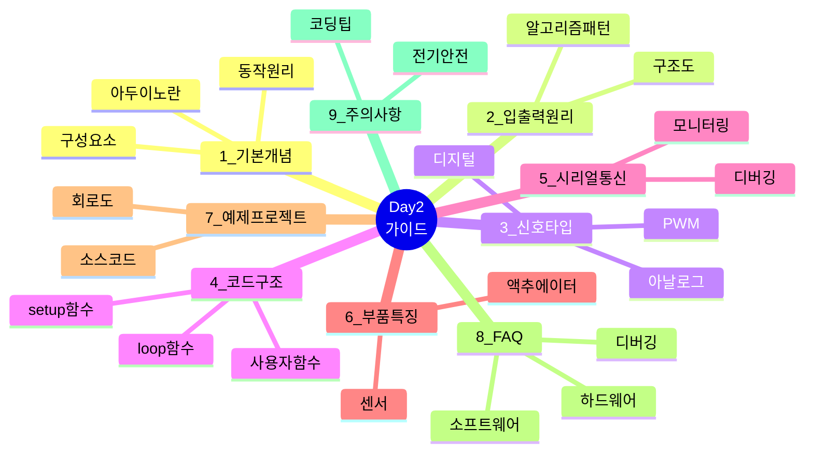

---

## 1. 아두이노 기본 개념

### 1.1 아두이노 시스템 구조

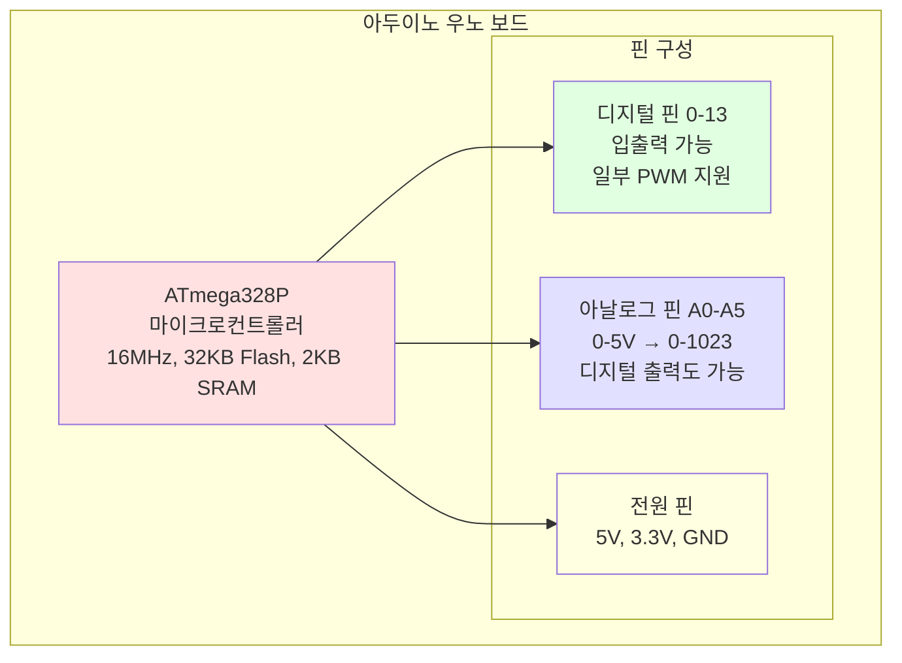

### 1.2 아두이노 동작 원리


---

## 2. 입출력 원리와 알고리즘

### 2.1 입력-처리-출력 구조도

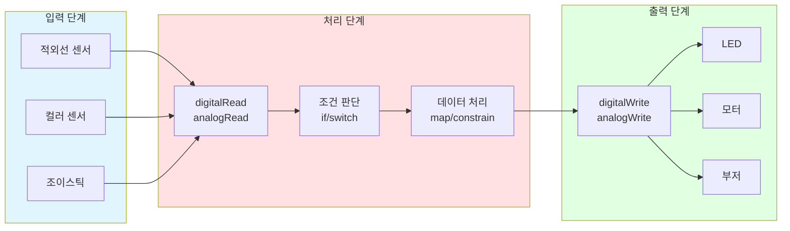

### 2.2 기본 알고리즘 패턴

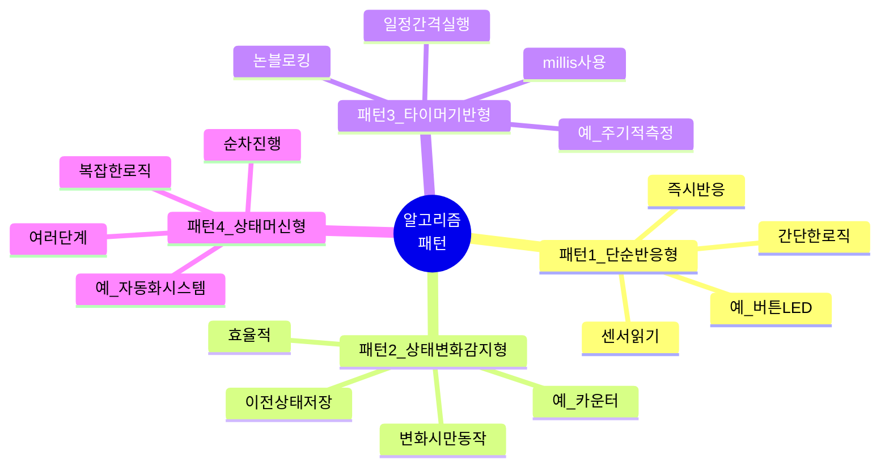

#### 패턴 1: 단순 반응형 순서도

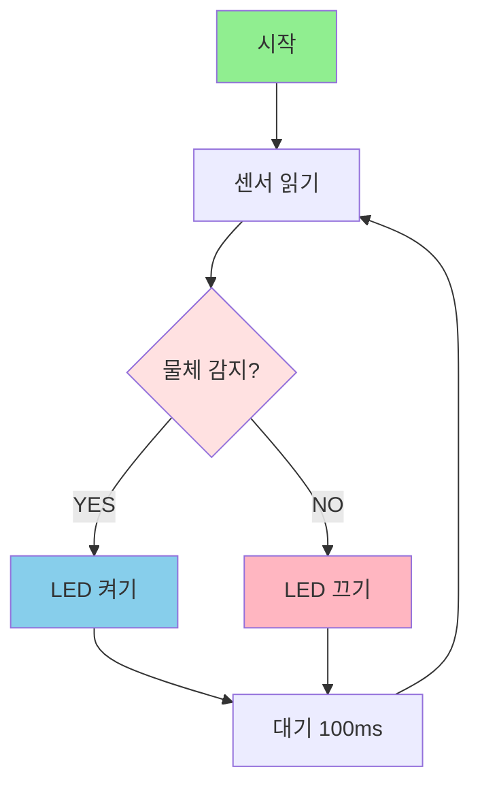

#### 패턴 4: 상태 머신 다이어그램


---

## 3. 디지털 vs PWM vs 아날로그

### 3.1 신호 타입 개요

```mermaid
graph TB
    subgraph DIGITAL[디지털 신호]
        D1[ON/OFF만 가능]
        D2[0V 또는 5V]
        D3[값: 0 또는 1]
        D4[예: 버튼, 스위치]
    end
    
    subgraph PWM[PWM 신호]
        P1[빠른 ON/OFF 반복]
        P2[평균 전압 조절]
        P3[값: 0~255]
        P4[예: LED 밝기, 모터 속도]
    end
    
    subgraph ANALOG[아날로그 신호]
        A1[연속적인 값]
        A2[0~5V 모든 값]
        A3[값: 0~1023]
        A4[예: 센서 측정값]
    end
    
    DIGITAL --> |간단| USE1[LED ON/OFF]
    PWM --> |중급| USE2[LED 밝기 조절]
    ANALOG --> |고급| USE3[센서 값 읽기]
    
    style DIGITAL fill:#FFE1E1
    style PWM fill:#E1FFE1
    style ANALOG fill:#E1E1FF
```

### 3.2 신호 타입 선택 가이드

```mermaid
graph TD
    A[신호 타입 선택] --> B{어떤 동작?}
    B -->|ON/OFF만 필요| C[디지털 신호]
    B -->|밝기/속도 조절| D[PWM 신호]
    B -->|센서 값 읽기| E[아날로그 신호]
    
    C --> C1[digitalWrite<br/>digitalRead]
    D --> D1[analogWrite<br/>0~255]
    E --> E1[analogRead<br/>0~1023]
    
    C1 --> F1[예: LED 켜기/끄기<br/>버튼 상태 읽기]
    D1 --> F2[예: LED 밝기 50%<br/>모터 속도 제어]
    E1 --> F3[예: 온도 측정<br/>조이스틱 위치]
    
    style C fill:#FFE1E1
    style D fill:#E1FFE1
    style E fill:#E1E1FF
```

### 3.3 비교 표

| 구분 | 디지털 | PWM | 아날로그 |
|------|--------|-----|----------|
| **신호 형태** | ON/OFF (0 또는 1) | 빠른 ON/OFF 반복 | 연속적인 전압 변화 |
| **전압 값** | 0V 또는 5V | 평균 0~5V | 0~5V 연속 |
| **아두이노 값** | 0 또는 1 (LOW/HIGH) | 0~255 | 0~1023 |
| **사용 핀** | 모든 디지털 핀 | ~표시 핀만 (3,5,6,9,10,11) | 아날로그 입력 핀 (A0~A5) |
| **함수** | `digitalRead/Write` | `analogWrite` | `analogRead` |
| **용도** | 버튼, LED ON/OFF | 모터 속도, LED 밝기 | 센서 값 읽기 |

---

## 4. 아두이노 소스 코드 기본 구조

### 4.1 프로그램 실행 흐름

```mermaid
graph TD
    A[전원 ON] --> B[setup 함수 실행<br/>1회만]
    B --> C[시리얼 통신 시작<br/>Serial.begin]
    C --> D[핀 모드 설정<br/>pinMode]
    D --> E[변수 초기화]
    E --> F[센서/모듈 초기화]
    F --> G[loop 함수 시작<br/>무한 반복]
    G --> H[센서 읽기]
    H --> I[데이터 처리]
    I --> J[출력 제어]
    J --> K[시리얼 출력]
    K --> G
    
    L[전원 OFF] -.-> M[프로그램 종료]
    
    style B fill:#FFE1E1
    style G fill:#E1FFE1
    style L fill:#FFB6C1
```

### 4.2 코드 구조 마인드맵

```mermaid
mindmap
  root((아두이노<br/>코드))
    1_주석
      프로그램설명
      작성자정보
      날짜
    2_라이브러리
      include문
      외부기능추가
    3_상수정의
      define문
      핀번호
      설정값
    4_전역변수
      센서값저장
      상태플래그
      타이머변수
    5_setup함수
      초기화1회
      시리얼시작
      핀모드설정
    6_loop함수
      무한반복
      센서읽기
      처리및출력
    7_사용자함수
      기능분리
      재사용가능
      코드정리
```

### 4.3 주요 함수 분류

```mermaid
graph LR
    subgraph INPUT[입력 함수]
        A1[digitalRead<br/>디지털 입력]
        A2[analogRead<br/>아날로그 입력]
    end
    
    subgraph OUTPUT[출력 함수]
        B1[digitalWrite<br/>디지털 출력]
        B2[analogWrite<br/>PWM 출력]
        B3[tone<br/>부저 소리]
    end
    
    subgraph TIME[시간 함수]
        C1[delay<br/>대기 블로킹]
        C2[millis<br/>경과 시간]
        C3[delayMicroseconds<br/>마이크로초 대기]
    end
    
    subgraph SERIAL[시리얼 함수]
        D1[Serial.begin<br/>통신 시작]
        D2[Serial.print<br/>출력]
        D3[Serial.read<br/>입력]
    end
    
    subgraph MATH[수학 함수]
        E1[map<br/>범위 변환]
        E2[constrain<br/>범위 제한]
        E3[min/max<br/>최소/최대]
    end
    
    style INPUT fill:#E1F5FF
    style OUTPUT fill:#FFE1E1
    style TIME fill:#E1FFE1
    style SERIAL fill:#FFFFE1
    style MATH fill:#FFE1FF
```

---

## 5. 시리얼 통신과 디버깅

### 5.1 시리얼 통신 흐름

```mermaid
sequenceDiagram
    participant A as 아두이노
    participant U as USB 케이블
    participant P as PC (시리얼 모니터)
    
    A->>A: Serial.begin(9600)
    A->>U: 초기화 완료
    U->>P: 연결 확인
    
    loop 데이터 전송
        A->>A: 센서 읽기
        A->>U: Serial.println(값)
        U->>P: 화면에 표시
    end
    
    P->>U: 명령 입력 (예: '1')
    U->>A: Serial.read()
    A->>A: 명령 처리
    A->>U: 결과 전송
    U->>P: 결과 표시
```

### 5.2 디버깅 프로세스

```mermaid
graph TD
    A[문제 발생] --> B{어디서 문제?}
    B -->|하드웨어| C[배선 확인]
    B -->|소프트웨어| D[코드 확인]
    
    C --> C1[전원 확인]
    C --> C2[핀 연결 확인]
    C --> C3[부품 테스트]
    
    D --> D1[시리얼 출력 추가]
    D --> D2[단계별 주석 처리]
    D --> D3[변수 값 확인]
    
    C1 --> E{해결?}
    C2 --> E
    C3 --> E
    D1 --> E
    D2 --> E
    D3 --> E
    
    E -->|NO| F[커뮤니티 질문]
    E -->|YES| G[문제 해결]
    
    style A fill:#FFB6C1
    style E fill:#FFE1E1
    style G fill:#90EE90
```

---

## 6. Day2 사용 부품 특징

### 6.1 부품 연결 구조

```mermaid
graph TB
    subgraph SENSORS[센서 입력]
        S1[적외선 센서<br/>물체 감지<br/>디지털]
        S2[컬러 센서<br/>RGB 측정<br/>I2C]
    end
    
    subgraph ARDUINO[아두이노 우노]
        A1[디지털 핀]
        A2[아날로그 핀]
        A3[I2C 핀<br/>SDA, SCL]
        A4[PWM 핀]
    end
    
    subgraph ACTUATORS[액추에이터 출력]
        O1[RGB LED<br/>색상 표시<br/>디지털]
        O2[DC 모터<br/>컨베이어<br/>PWM]
        O3[부저<br/>알림음<br/>PWM]
    end
    
    S1 --> A1
    S2 --> A3
    A1 --> O1
    A4 --> O2
    A1 --> O3
    
    style SENSORS fill:#E1F5FF
    style ARDUINO fill:#FFE1E1
    style ACTUATORS fill:#E1FFE1
```

### 6.2 부품별 특징 비교

```mermaid
graph LR
    subgraph IR[적외선 센서]
        IR1[감지 방식: 반사]
        IR2[출력: 디지털]
        IR3[거리: 2-30cm]
        IR4[장점: 빠름, 저렴]
        IR5[단점: 색상 영향]
    end
    
    subgraph COLOR[컬러 센서]
        C1[감지 방식: RGB]
        C2[출력: I2C]
        C3[정확도: 높음]
        C4[장점: 색상 구분]
        C5[단점: 조명 영향]
    end
    
    subgraph LED[RGB LED]
        L1[제어: 1-wire]
        L2[색상: 1677만]
        L3[개별 제어 가능]
        L4[장점: 다양한 색]
        L5[단점: 전류 큼]
    end
    
    subgraph MOTOR[DC 모터]
        M1[제어: PWM]
        M2[드라이버: L298N]
        M3[속도: 0-255]
        M4[장점: 고전력]
        M5[단점: 발열]
    end
    
    style IR fill:#FFE1E1
    style COLOR fill:#E1FFE1
    style LED fill:#E1E1FF
    style MOTOR fill:#FFFFE1
```

---

## 7. 기본 예제 프로젝트

### 7.1 스마트 물체 감지 시스템 구조

```mermaid
graph TB
    A[적외선 센서] -->|물체 감지| B{감지됨?}
    B -->|YES| C[LED 켜기]
    B -->|YES| D[부저 울리기]
    B -->|YES| E[카운터 증가]
    B -->|NO| F[LED 끄기]
    
    C --> G[시리얼 출력]
    D --> G
    E --> G
    F --> G
    
    G --> H[100ms 대기]
    H --> A
    
    style A fill:#E1F5FF
    style B fill:#FFE1E1
    style C fill:#90EE90
    style D fill:#87CEEB
    style E fill:#FFD700
    style F fill:#FFB6C1
```

### 7.2 회로 연결도

```mermaid
graph LR
    subgraph ARDUINO[아두이노 우노]
        A0[A0 핀]
        D13[13번 핀]
        D4[4번 핀]
        V5[5V]
        GND[GND]
    end
    
    subgraph COMPONENTS[부품]
        IR[적외선 센서<br/>OUT]
        LED[LED<br/>+ 220Ω 저항]
        BUZ[부저]
    end
    
    A0 --> IR
    D13 --> LED
    D4 --> BUZ
    V5 --> IR
    V5 --> BUZ
    GND --> IR
    GND --> LED
    GND --> BUZ
    
    style ARDUINO fill:#FFE1E1
    style COMPONENTS fill:#E1FFE1
```

### 7.3 프로그램 동작 순서도

```mermaid
flowchart TD
    START([프로그램 시작]) --> SETUP[setup 함수]
    SETUP --> INIT1[Serial.begin 9600]
    INIT1 --> INIT2[pinMode 설정]
    INIT2 --> INIT3[초기 메시지 출력]
    INIT3 --> INIT4[시작 알림음 2회]
    
    INIT4 --> LOOP[loop 함수 시작]
    LOOP --> READ[센서 읽기<br/>digitalRead]
    READ --> CHECK{물체 감지?<br/>LOW?}
    
    CHECK -->|YES| DETECT[감지 처리]
    CHECK -->|NO| NODETECT[미감지 처리]
    
    DETECT --> COUNT[카운터 증가]
    COUNT --> LED_ON[LED 켜기]
    LED_ON --> BUZZER[부저 울리기]
    BUZZER --> PRINT1[시리얼 출력<br/>감지 메시지]
    
    NODETECT --> LED_OFF[LED 끄기]
    LED_OFF --> PRINT2[시리얼 출력<br/>미감지 메시지]
    
    PRINT1 --> DELAY[100ms 대기]
    PRINT2 --> DELAY
    DELAY --> LOOP
    
    style START fill:#90EE90
    style CHECK fill:#FFE1E1
    style DETECT fill:#87CEEB
    style NODETECT fill:#FFB6C1
```

---

## 8. 자주 묻는 질문 (FAQ)

### 8.1 문제 해결 플로우차트

```mermaid
graph TD
    A[문제 발생] --> B{업로드 실패?}
    B -->|YES| C[포트/보드 확인]
    B -->|NO| D{센서 작동 안함?}
    
    C --> C1[올바른 포트 선택]
    C --> C2[올바른 보드 선택]
    C --> C3[USB 케이블 확인]
    
    D -->|YES| E[배선 확인]
    D -->|NO| F{시리얼 깨짐?}
    
    E --> E1[VCC, GND 확인]
    E --> E2[핀 번호 확인]
    E --> E3[부품 테스트]
    
    F -->|YES| G[Baud Rate 확인]
    F -->|NO| H{프로그램 멈춤?}
    
    G --> G1[코드와 모니터 일치]
    
    H -->|YES| I[무한 루프 확인]
    H -->|NO| J[커뮤니티 질문]
    
    I --> I1[delay 과다 사용]
    I --> I2[while1 확인]
    
    style A fill:#FFB6C1
    style B fill:#FFE1E1
    style D fill:#FFE1E1
    style F fill:#FFE1E1
    style H fill:#FFE1E1
```

### 8.2 FAQ 카테고리

```mermaid
mindmap
  root((FAQ))
    하드웨어
      우노vs메가
      5Vvs3_3V
      아날로그핀디지털사용
      PWM핀위치
      전원연결
    소프트웨어
      delayvsmillis
      printvsprintln
      변수타입선택
      definevs const
      함수분리시점
    센서액추에이터
      센서값불안정
      적외선미감지
      컬러센서오인식
      LED색상이상
      모터회전안함
    디버깅
      업로드에러
      시리얼깨짐
      프로그램멈춤
      변수값이상
      여러센서느림
    프로젝트
      파일분리
      EEPROM사용
      블루투스통신
      LCD한글
      서보모터제어
    고급주제
      인터럽트
      메모리부족
      MP3재생
      인터넷연결
      라즈베리파이차이
```

---

## 9. 주의사항

### 9.1 전기 안전 체크리스트

```mermaid
graph TD
    A[회로 구성 전] --> B{전원 차단?}
    B -->|NO| STOP[❌ 전원 먼저 차단!]
    B -->|YES| C{전압 확인?}
    
    C -->|NO| STOP2[❌ 5V/3.3V 확인!]
    C -->|YES| D{극성 확인?}
    
    D -->|NO| STOP3[❌ +/- 확인!]
    D -->|YES| E{단락 가능성?}
    
    E -->|YES| STOP4[❌ 배선 재확인!]
    E -->|NO| F{저항 필요?}
    
    F -->|YES| G[LED: 220Ω<br/>버튼: 10kΩ]
    F -->|NO| H[✅ 안전]
    
    G --> H
    H --> I[전원 연결 OK]
    
    style STOP fill:#FF6B6B
    style STOP2 fill:#FF6B6B
    style STOP3 fill:#FF6B6B
    style STOP4 fill:#FF6B6B
    style H fill:#90EE90
    style I fill:#87CEEB
```

### 9.2 코딩 주의사항 마인드맵

```mermaid
mindmap
  root((코딩<br/>주의사항))
    무한루프방지
      탈출조건추가
      의도적사용만
    delay과다금지
      millis사용
      논블로킹구현
    배열범위체크
      0부터시작
      크기-1까지
    변수초기화
      명시적초기화
      쓰레기값방지
    메모리관리
      String최소화
      char배열사용
      전역변수최소화
    시리얼통신
      BaudRate일치
      0_1번핀주의
      과도한출력금지
```

### 9.3 업로드 전 체크리스트

```mermaid
graph LR
    A[업로드 준비] --> B[✓ 보드 선택<br/>Arduino Uno]
    B --> C[✓ 포트 선택<br/>COM3]
    C --> D[✓ 컴파일 성공<br/>에러 없음]
    D --> E[✓ 전원 연결]
    E --> F[✓ 0,1번 핀<br/>사용 안함]
    F --> G[✓ 시리얼 모니터<br/>닫기]
    G --> H[✅ 업로드 시작]
    
    style A fill:#FFE1E1
    style H fill:#90EE90
```

---

## 10. 학습 로드맵

```mermaid
graph TD
    START([Day2 학습 시작]) --> BASIC[기본 가이드 학습<br/>이 문서]
    
    BASIC --> TEST1[01_적외선센서<br/>테스트]
    TEST1 --> MISSION1[미션 3개 수행]
    MISSION1 --> QA1[QA 10개 학습]
    
    QA1 --> TEST2[02_컬러센서<br/>테스트]
    TEST2 --> MISSION2[미션 3개 수행]
    MISSION2 --> QA2[QA 10개 학습]
    
    QA2 --> TEST3[03_RGB_LED<br/>테스트]
    TEST3 --> MISSION3[미션 3개 수행]
    MISSION3 --> QA3[QA 10개 학습]
    
    QA3 --> TEST4[04_DC모터<br/>테스트]
    TEST4 --> MISSION4[미션 3개 수행]
    MISSION4 --> QA4[QA 10개 학습]
    
    QA4 --> INTEGRATE[통합 프로젝트<br/>스마트 컨베이어]
    INTEGRATE --> COMPLETE([Day2 완료])
    
    style START fill:#90EE90
    style BASIC fill:#FFE1E1
    style INTEGRATE fill:#87CEEB
    style COMPLETE fill:#FFD700
```

---

## 📚 참고 자료

### 학습 자료 구조

```mermaid
graph TB
    subgraph OFFICIAL[공식 문서]
        O1[Arduino.cc]
        O2[레퍼런스]
        O3[포럼]
    end
    
    subgraph KOREAN[한글 자료]
        K1[한국어 레퍼런스]
        K2[네이버 카페]
        K3[유튜브 강의]
    end
    
    subgraph DATASHEET[데이터시트]
        D1[TCS34725]
        D2[WS2812B]
        D3[L298N]
    end
    
    subgraph NEXT[다음 단계]
        N1[01_적외선센서 가이드]
        N2[02_컬러센서 가이드]
        N3[03_RGB_LED 가이드]
        N4[04_DC모터 가이드]
    end
    
    OFFICIAL --> KOREAN
    KOREAN --> DATASHEET
    DATASHEET --> NEXT
    
    style OFFICIAL fill:#E1F5FF
    style KOREAN fill:#FFE1E1
    style DATASHEET fill:#E1FFE1
    style NEXT fill:#FFD700
```

---

**작성일**: 2026-01-27  
**버전**: 2.0 (Mermaid 통합)  
**작성자**: Smart Factory Team

**다음 문서**: [01_적외선센서 상세 가이드](./01_적외선센서_가이드.md)


## ✅ 다음 단계

이 기본 가이드를 마스터했다면:
1. **01_적외선센서 상세 가이드** 학습
2. **02_컬러센서 상세 가이드** 학습
3. **03_RGB_LED 상세 가이드** 학습
4. **04_DC모터 상세 가이드** 학습
5. **통합 프로젝트** 도전

---

**작성일**: 2026-01-27  
**버전**: 1.0  
**작성자**: Smart Factory Team

