# 01. 적외선 센서 테스트 - 상세 가이드

## 📚 목차

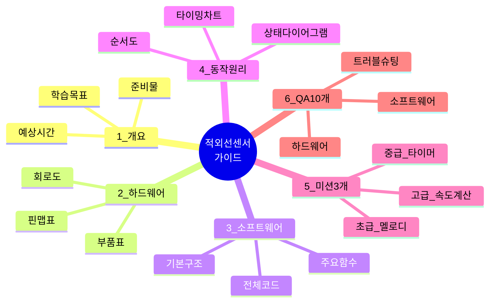

---

## 1. 프로젝트 개요

### 1.1 학습 목표
- ✅ 적외선 센서의 동작 원리 이해
- ✅ 디지털 입력 신호 처리 방법 학습
- ✅ 상태 변화 감지 알고리즘 구현
- ✅ 부저와 LED를 이용한 피드백 시스템 구축

### 1.2 준비물
| 번호 | 부품명 | 수량 | 사양 | 용도 |
|------|--------|------|------|------|
| 1 | 아두이노 우노 | 1 | ATmega328P | 메인 컨트롤러 |
| 2 | 적외선 센서 | 1 | IR Obstacle Sensor | 물체 감지 |
| 3 | LED | 1 | 5mm, 빨강 | 시각적 피드백 |
| 4 | 부저 | 1 | 패시브 부저 | 청각적 피드백 |
| 5 | 저항 220Ω | 1 | 1/4W | LED 전류 제한 |
| 6 | 브레드보드 | 1 | 400홀 | 회로 구성 |
| 7 | 점퍼 와이어 | 10 | M-M | 연결 |

### 1.3 예상 소요 시간
- 회로 구성: 10분
- 코드 업로드 및 테스트: 10분
- 미션 수행: 30분
- **총 소요 시간: 약 50분**

---

## 2. 하드웨어 구성

### 2.1 핀 맵 표

| 아두이노 핀 | 연결 부품 | 신호 타입 | 방향 | 설명 |
|------------|----------|----------|------|------|
| **A0** | 적외선 센서 OUT | 디지털 입력 | INPUT | 물체 감지 신호 (LOW=감지, HIGH=미감지) |
| **13** | LED (+) | 디지털 출력 | OUTPUT | 감지 상태 표시 (HIGH=켜짐) |
| **4** | 부저 (+) | PWM 출력 | OUTPUT | 알림음 재생 (tone 함수 사용) |
| **5V** | 센서 VCC, 부저 VCC | 전원 | POWER | 5V 전원 공급 |
| **GND** | 센서 GND, LED (-), 부저 GND | 접지 | GROUND | 공통 접지 |

### 2.2 부품 상세 정보

#### 적외선 센서 (IR Obstacle Sensor)
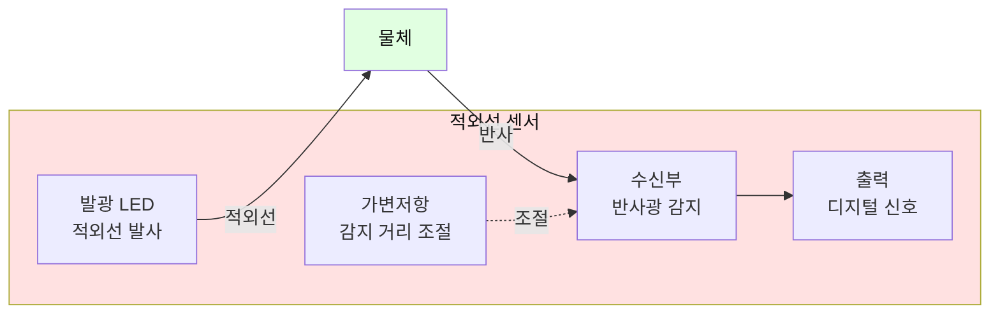

**핀 구성:**
- VCC: 5V 전원
- GND: 접지
- OUT: 디지털 출력 (LOW=감지, HIGH=미감지)

**특징:**
- 감지 거리: 2~30cm (가변저항으로 조절)
- 반응 속도: 매우 빠름 (< 10ms)
- 소비 전류: 약 20mA
- 감지 각도: 약 35도

**주의사항:**
- 검은색 물체는 감지 어려움 (반사율 낮음)
- 직사광선 아래에서 오작동 가능
- 센서와 물체 사이 각도 중요 (수직이 가장 좋음)

### 2.3 회로도

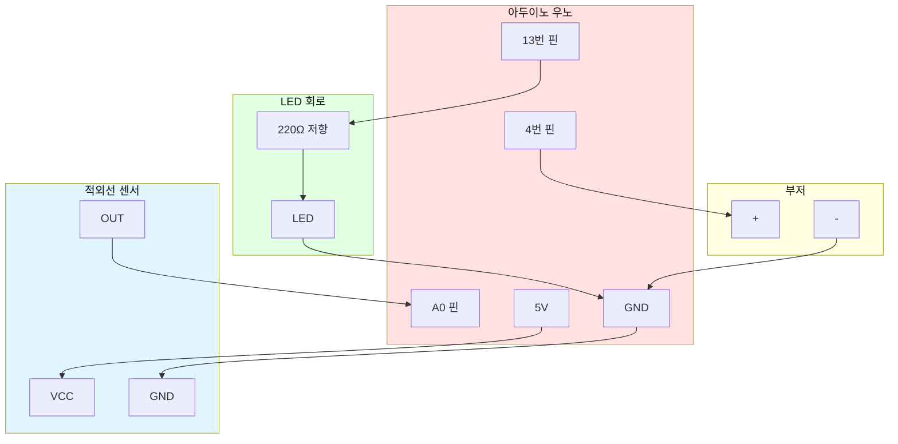

**배선 순서:**
1. 아두이노 5V → 적외선 센서 VCC
2. 아두이노 GND → 적외선 센서 GND
3. 적외선 센서 OUT → 아두이노 A0
4. 아두이노 13번 → 220Ω 저항 → LED (+)
5. LED (-) → 아두이노 GND
6. 아두이노 4번 → 부저 (+)
7. 부저 (-) → 아두이노 GND

---

## 3. 소프트웨어 구조

### 3.1 프로그램 구조도

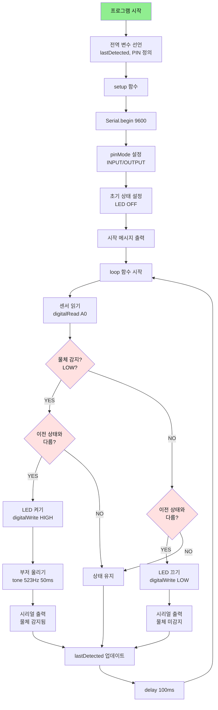

### 3.2 주요 함수 설명

#### digitalRead() - 센서 읽기
```cpp
int detected = digitalRead(PIN_IR_SENSOR);
// 반환값:
// - LOW (0): 물체 감지됨
// - HIGH (1): 물체 미감지
```

#### digitalWrite() - LED 제어
```cpp
digitalWrite(PIN_LED, HIGH);  // LED 켜기
digitalWrite(PIN_LED, LOW);   // LED 끄기
```

#### tone() - 부저 제어
```cpp
tone(PIN_BUZZER, frequency, duration);
// frequency: 주파수 (Hz) - 음 높이
// duration: 지속 시간 (ms)
// 예: tone(4, 523, 50); // 도 음을 50ms 동안
```

### 3.3 전체 소스 코드

```cpp
/**
 * 적외선 센서 테스트 프로그램
 * 
 * 기능: 적외선 센서로 물체 감지
 * - 물체 감지 시 LED 켜기 및 부저 울림
 * - 시리얼 모니터로 상태 출력
 */

/* ===== 핀 번호 설정 ===== */
#define PIN_IR_SENSOR       A0    // 적외선 센서 입력 핀
#define PIN_LED             13    // LED 핀
#define PIN_BUZZER          4     // 부저 핀

/* ===== 설정값 ===== */
#define LOOP_DELAY          100   // 루프 대기 시간(ms)

/* ===== 전역 변수 ===== */
bool lastDetected = false;        // 이전 감지 상태

/**
 * 초기화
 */
void setup() {
  Serial.begin(9600);
  
  pinMode(PIN_IR_SENSOR, INPUT);
  pinMode(PIN_LED, OUTPUT);
  pinMode(PIN_BUZZER, OUTPUT);
  
  digitalWrite(PIN_LED, LOW);
  
  Serial.println("========================================");
  Serial.println("  적외선 센서 테스트 시작");
  Serial.println("========================================\n");
}

/**
 * 메인 루프
 */
void loop() {
  // 센서 읽기 (LOW = 감지됨, HIGH = 미감지)
  bool detected = (digitalRead(PIN_IR_SENSOR) == LOW);
  
  // 상태 변화 감지
  if (detected != lastDetected) {
    if (detected) {
      // LED 켜기
      digitalWrite(PIN_LED, HIGH);
      
      // 부저 울리기
      tone(PIN_BUZZER, 523, 50);
      
      // 상태 출력
      Serial.println("[상태 변화] 물체 감지됨");
      
    } else {
      // LED 끄기
      digitalWrite(PIN_LED, LOW);
      
      // 상태 출력
      Serial.println("[상태 변화] 물체 미감지");
    }
  }
  
  lastDetected = detected;
  delay(LOOP_DELAY);
}
```

---

## 4. 동작 원리

### 4.1 상태 변화 감지 알고리즘

| 상태 | LED | 부저 | 시리얼 출력 | 전환 조건 |
|------|-----|------|-------------|-----------|
| **미감지** | OFF | 무음 | "미감지" | 물체 접근 시 → 감지 상태로 전환 (LOW 신호) |
| **감지** | ON | 삐 (523Hz) | "감지됨" | 물체 제거 시 → 미감지 상태로 전환 (HIGH 신호) |

**상태 전환 흐름:**

### 4.2 타이밍 다이어그램

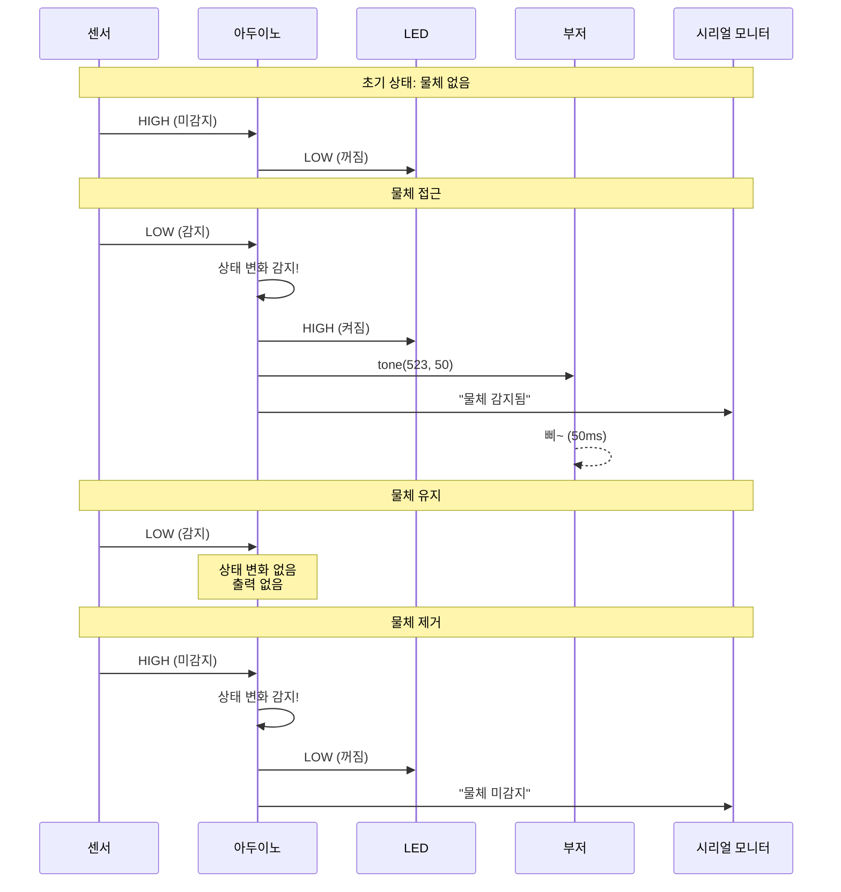

### 4.3 센서 감지 원리

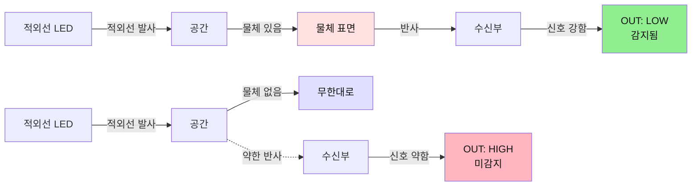

---

## 5. 미션 3개

### 미션 1: 다양한 감지음 만들기 (초급) 🎵

#### 목표
단순 "삐" 소리 대신 3음계 멜로디 재생

#### 요구사항
1. 물체 감지 시 "도-미-솔" 멜로디 재생
2. 각 음은 100ms씩 재생
3. 음 사이에 50ms 간격

#### 힌트
```cpp
// 음계 주파수
#define NOTE_C  523  // 도
#define NOTE_E  659  // 미
#define NOTE_G  784  // 솔

// 멜로디 재생 함수
void playMelody() {
  tone(PIN_BUZZER, NOTE_C, 100);
  delay(150);
  tone(PIN_BUZZER, NOTE_E, 100);
  delay(150);
  tone(PIN_BUZZER, NOTE_G, 100);
}
```

#### 순서도
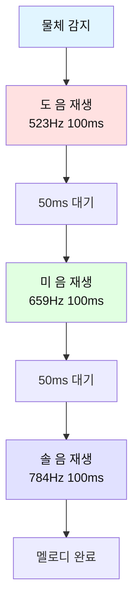

#### 정답 코드
```cpp
/* ===== 음계 정의 ===== */
#define NOTE_C  523  // 도
#define NOTE_E  659  // 미
#define NOTE_G  784  // 솔

/**
 * 멜로디 재생 함수
 */
void playMelody() {
  tone(PIN_BUZZER, NOTE_C, 100);
  delay(150);
  tone(PIN_BUZZER, NOTE_E, 100);
  delay(150);
  tone(PIN_BUZZER, NOTE_G, 100);
}

void loop() {
  bool detected = (digitalRead(PIN_IR_SENSOR) == LOW);
  
  if (detected != lastDetected) {
    if (detected) {
      digitalWrite(PIN_LED, HIGH);
      playMelody();  // 멜로디 재생
      Serial.println("[상태 변화] 물체 감지됨 ♪♪♪");
    } else {
      digitalWrite(PIN_LED, LOW);
      Serial.println("[상태 변화] 물체 미감지");
    }
  }
  
  lastDetected = detected;
  delay(LOOP_DELAY);
}
```

---

### 미션 2: 감지 시간 측정하기 (중급) ⏱️

#### 목표
물체가 센서 앞에 머문 시간을 측정하고 출력

#### 요구사항
1. 물체 감지 시작 시간 기록
2. 물체 제거 시 머문 시간 계산
3. 시리얼 모니터에 "감지 시간: XXXms" 출력
4. 1초 이상 머물면 특별한 소리 재생

#### 힌트
```cpp
unsigned long detectStartTime = 0;  // 감지 시작 시간

// 감지 시작
if (detected && !lastDetected) {
  detectStartTime = millis();
}

// 감지 종료
if (!detected && lastDetected) {
  unsigned long duration = millis() - detectStartTime;
  Serial.print("감지 시간: ");
  Serial.print(duration);
  Serial.println("ms");
}
```

#### 순서도
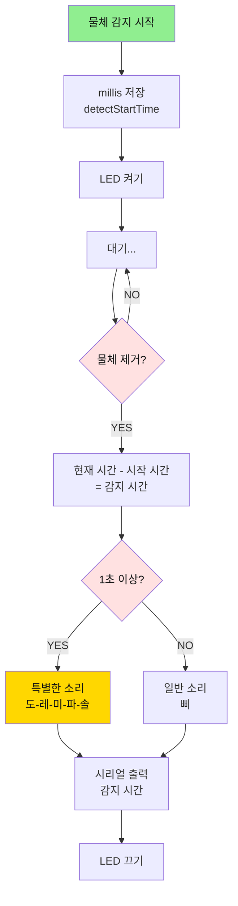

#### 정답 코드
```cpp
/* ===== 전역 변수 추가 ===== */
unsigned long detectStartTime = 0;  // 감지 시작 시간

/* ===== 음계 정의 ===== */
#define NOTE_C  523  // 도
#define NOTE_D  587  // 레
#define NOTE_E  659  // 미
#define NOTE_F  698  // 파
#define NOTE_G  784  // 솔

/**
 * 특별한 멜로디 (1초 이상 감지 시)
 */
void playSpecialMelody() {
  int notes[] = {NOTE_C, NOTE_D, NOTE_E, NOTE_F, NOTE_G};
  for (int i = 0; i < 5; i++) {
    tone(PIN_BUZZER, notes[i], 100);
    delay(120);
  }
}

void loop() {
  bool detected = (digitalRead(PIN_IR_SENSOR) == LOW);
  
  if (detected != lastDetected) {
    if (detected) {
      // 감지 시작
      digitalWrite(PIN_LED, HIGH);
      detectStartTime = millis();
      Serial.println("[상태 변화] 물체 감지 시작");
      
    } else {
      // 감지 종료
      digitalWrite(PIN_LED, LOW);
      
      // 감지 시간 계산
      unsigned long duration = millis() - detectStartTime;
      
      Serial.print("[상태 변화] 물체 미감지 (감지 시간: ");
      Serial.print(duration);
      Serial.println("ms)");
      
      // 1초 이상이면 특별한 소리
      if (duration >= 1000) {
        Serial.println(">>> 1초 이상 감지! <<<");
        playSpecialMelody();
      } else {
        tone(PIN_BUZZER, NOTE_C, 50);
      }
    }
  }
  
  lastDetected = detected;
  delay(LOOP_DELAY);
}
```

---

### 미션 3: 통과 속도 계산하기 (고급) 🚀

#### 목표
물체의 크기를 가정하고 통과 시간으로 속도 추정

#### 요구사항
1. 물체 크기를 5cm로 가정
2. 통과 시간 측정 (감지 시작 ~ 종료)
3. 속도 계산: 속도(cm/s) = 5cm / 시간(s)
4. 속도에 따라 LED 깜빡임 속도 변경
   - 빠름 (> 10cm/s): 빠른 깜빡임
   - 보통 (5~10cm/s): 중간 깜빡임
   - 느림 (< 5cm/s): 느린 깜빡임

#### 힌트
```cpp
float objectSize = 5.0;  // cm
unsigned long duration = millis() - detectStartTime;  // ms
float timeInSeconds = duration / 1000.0;  // 초로 변환
float speed = objectSize / timeInSeconds;  // cm/s

Serial.print("예상 속도: ");
Serial.print(speed);
Serial.println(" cm/s");
```

#### 순서도
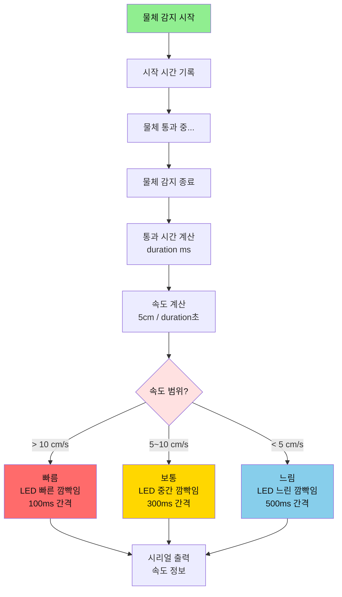

#### 정답 코드
```cpp
/* ===== 전역 변수 추가 ===== */
const float OBJECT_SIZE = 5.0;  // 물체 크기 (cm)

/**
 * 속도에 따른 LED 깜빡임
 */
void blinkBySpeed(float speed) {
  int blinkDelay;
  
  if (speed > 10.0) {
    blinkDelay = 100;  // 빠른 깜빡임
    Serial.println(">>> 빠른 속도! <<<");
  } else if (speed >= 5.0) {
    blinkDelay = 300;  // 중간 깜빡임
    Serial.println(">>> 보통 속도 <<<");
  } else {
    blinkDelay = 500;  // 느린 깜빡임
    Serial.println(">>> 느린 속도 <<<");
  }
  
  // LED 3회 깜빡임
  for (int i = 0; i < 3; i++) {
    digitalWrite(PIN_LED, HIGH);
    delay(blinkDelay);
    digitalWrite(PIN_LED, LOW);
    delay(blinkDelay);
  }
}

void loop() {
  bool detected = (digitalRead(PIN_IR_SENSOR) == LOW);
  
  if (detected != lastDetected) {
    if (detected) {
      // 감지 시작
      digitalWrite(PIN_LED, HIGH);
      detectStartTime = millis();
      Serial.println("[상태 변화] 물체 감지 시작");
      
    } else {
      // 감지 종료
      digitalWrite(PIN_LED, LOW);
      
      // 통과 시간 계산
      unsigned long duration = millis() - detectStartTime;
      float timeInSeconds = duration / 1000.0;
      
      // 속도 계산 (너무 짧은 시간 제외)
      if (duration > 50) {  // 50ms 이상만 계산
        float speed = OBJECT_SIZE / timeInSeconds;
        
        Serial.print("[통과 완료] 시간: ");
        Serial.print(duration);
        Serial.print("ms, 예상 속도: ");
        Serial.print(speed, 2);  // 소수점 2자리
        Serial.println(" cm/s");
        
        // 속도에 따른 피드백
        blinkBySpeed(speed);
        
      } else {
        Serial.println("[통과 완료] 시간이 너무 짧아 속도 계산 불가");
      }
    }
  }
  
  lastDetected = detected;
  delay(LOOP_DELAY);
}
```

---

## 6. 자주 묻는 질문 (QA 10개)

### Q1. 센서가 물체를 감지하지 못해요.

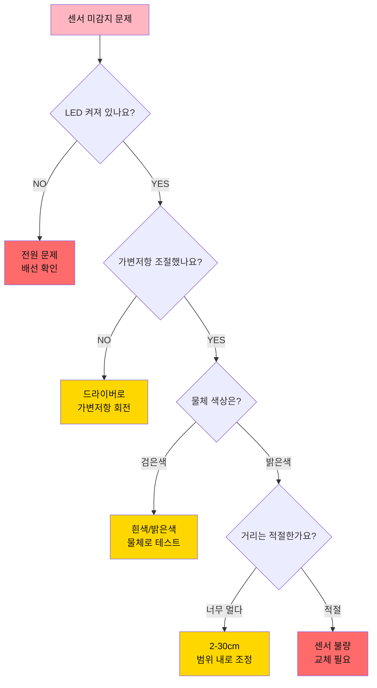

**답변:**
1. **전원 확인**: VCC, GND 연결 확인
2. **가변저항 조절**: 센서 뒷면의 작은 나사를 드라이버로 회전
   - 시계방향: 감도 증가 (먼 거리 감지)
   - 반시계방향: 감도 감소 (가까운 거리만 감지)
3. **물체 색상**: 검은색은 반사율이 낮아 감지 어려움 → 흰색 종이로 테스트
4. **거리**: 2~30cm 범위 내에서 테스트
5. **각도**: 센서와 물체가 수직이 되도록

---

### Q2. 센서 값이 계속 깜빡거려요 (채터링).

**답변:**
노이즈로 인한 채터링 현상입니다. 다음 방법으로 해결하세요:

**소프트웨어 디바운싱:**
```cpp
const int DEBOUNCE_DELAY = 50;  // 50ms
unsigned long lastDebounceTime = 0;
bool stableState = HIGH;

void loop() {
  bool reading = (digitalRead(PIN_IR_SENSOR) == LOW);
  
  // 상태가 변했을 때
  if (reading != lastDetected) {
    lastDebounceTime = millis();
  }
  
  // 50ms 동안 안정적이면 상태 업데이트
  if ((millis() - lastDebounceTime) > DEBOUNCE_DELAY) {
    if (reading != stableState) {
      stableState = reading;
      // 여기서 LED, 부저 제어
    }
  }
  
  lastDetected = reading;
}
```

---

### Q3. 부저 소리가 안 나요.

**체크리스트:**
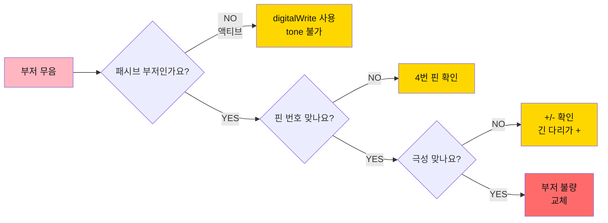

**해결 방법:**
1. **부저 종류 확인**:
   - 패시브 부저: tone() 함수 사용 (주파수 제어 가능)
   - 액티브 부저: digitalWrite() 사용 (고정 주파수)
2. **극성 확인**: 긴 다리(+)를 아두이노 핀에, 짧은 다리(-)를 GND에
3. **코드 확인**: `tone(PIN_BUZZER, 523, 50);` 형식 맞는지
4. **테스트 코드**:
```cpp
void setup() {
  pinMode(4, OUTPUT);
}

void loop() {
  tone(4, 1000, 500);  // 1kHz 음을 500ms
  delay(1000);
}
```

---

### Q4. LED가 희미하게 켜져 있어요.

**답변:**
아두이노 핀의 누설 전류 때문입니다.

**해결 방법:**
```cpp
// setup()에서
pinMode(PIN_LED, OUTPUT);
digitalWrite(PIN_LED, LOW);  // 명시적으로 끄기

// 또는 저항 값 변경
// 220Ω → 1kΩ (LED가 어두워지지만 누설 전류 영향 감소)
```

---

### Q5. 시리얼 모니터에 출력이 너무 많아요.

**답변:**
상태 변화 시에만 출력하도록 수정하세요:

```cpp
void loop() {
  bool detected = (digitalRead(PIN_IR_SENSOR) == LOW);
  
  // 상태가 변했을 때만 출력
  if (detected != lastDetected) {
    if (detected) {
      Serial.println("[변화] 감지됨");
    } else {
      Serial.println("[변화] 미감지");
    }
  }
  
  lastDetected = detected;
  delay(100);
}
```

---

### Q6. 여러 개의 적외선 센서를 사용하고 싶어요.

**답변:**
배열을 사용하여 여러 센서를 관리하세요:

```cpp
const int NUM_SENSORS = 3;
const int SENSOR_PINS[NUM_SENSORS] = {A0, A1, A2};
bool lastStates[NUM_SENSORS] = {false, false, false};

void setup() {
  Serial.begin(9600);
  for (int i = 0; i < NUM_SENSORS; i++) {
    pinMode(SENSOR_PINS[i], INPUT);
  }
}

void loop() {
  for (int i = 0; i < NUM_SENSORS; i++) {
    bool detected = (digitalRead(SENSOR_PINS[i]) == LOW);
    
    if (detected != lastStates[i]) {
      Serial.print("센서 ");
      Serial.print(i + 1);
      Serial.print(": ");
      Serial.println(detected ? "감지" : "미감지");
      
      lastStates[i] = detected;
    }
  }
  delay(100);
}
```

---

### Q7. 감지 거리를 코드로 조절할 수 있나요?

**답변:**
아니요, 감지 거리는 하드웨어(가변저항)로만 조절 가능합니다.

**대안:**
- 소프트웨어로 감지 시간 필터링:
```cpp
unsigned long detectTime = 0;
const unsigned long MIN_DETECT_TIME = 100;  // 100ms 이상만 인정

void loop() {
  bool detected = (digitalRead(PIN_IR_SENSOR) == LOW);
  
  if (detected) {
    if (detectTime == 0) {
      detectTime = millis();
    } else if (millis() - detectTime >= MIN_DETECT_TIME) {
      // 100ms 이상 감지되었을 때만 처리
      Serial.println("확실한 감지!");
    }
  } else {
    detectTime = 0;
  }
  
  delay(10);
}
```

---

### Q8. 센서가 햇빛에 오작동해요.

**답변:**
적외선 센서는 햇빛(적외선 포함)에 민감합니다.

**해결 방법:**
1. **물리적 차단**: 센서에 작은 후드/덮개 설치
2. **소프트웨어 필터링**: 짧은 감지 무시
```cpp
unsigned long lastDetectTime = 0;
const unsigned long IGNORE_TIME = 50;  // 50ms 이하 무시

void loop() {
  bool detected = (digitalRead(PIN_IR_SENSOR) == LOW);
  
  if (detected && !lastDetected) {
    lastDetectTime = millis();
  }
  
  if (!detected && lastDetected) {
    unsigned long duration = millis() - lastDetectTime;
    if (duration > IGNORE_TIME) {
      // 50ms 이상 감지된 것만 처리
      Serial.println("유효한 감지");
    }
  }
  
  lastDetected = detected;
  delay(10);
}
```
3. **다른 센서 사용**: 초음파 센서 (햇빛 영향 없음)

---

### Q9. 물체 종류를 구분할 수 있나요?

**답변:**
적외선 센서만으로는 불가능합니다. 감지/미감지만 판별 가능합니다.

**대안:**
1. **컬러 센서 추가**: 색상으로 구분
2. **무게 센서 추가**: 무게로 구분
3. **여러 센서 조합**:
```cpp
// 적외선 + 컬러 센서 조합 예시
bool objectDetected = (digitalRead(IR_PIN) == LOW);
if (objectDetected) {
  int color = detectColor();  // 컬러 센서 함수
  if (color == RED) {
    Serial.println("빨간 물체");
  } else if (color == BLUE) {
    Serial.println("파란 물체");
  }
}
```

---

### Q10. 감지 횟수를 EEPROM에 저장하고 싶어요.

**답변:**
EEPROM을 사용하여 전원이 꺼져도 데이터를 유지할 수 있습니다:

```cpp
#include <EEPROM.h>

const int EEPROM_ADDRESS = 0;
int detectionCount = 0;

void setup() {
  Serial.begin(9600);
  
  // EEPROM에서 저장된 값 읽기
  EEPROM.get(EEPROM_ADDRESS, detectionCount);
  
  Serial.print("저장된 감지 횟수: ");
  Serial.println(detectionCount);
  
  pinMode(PIN_IR_SENSOR, INPUT);
  pinMode(PIN_LED, OUTPUT);
}

void loop() {
  bool detected = (digitalRead(PIN_IR_SENSOR) == LOW);
  
  if (detected && !lastDetected) {
    detectionCount++;
    
    // EEPROM에 저장 (10회마다)
    if (detectionCount % 10 == 0) {
      EEPROM.put(EEPROM_ADDRESS, detectionCount);
      Serial.println("EEPROM에 저장됨");
    }
    
    Serial.print("총 감지 횟수: ");
    Serial.println(detectionCount);
  }
  
  lastDetected = detected;
  delay(100);
}
```

**주의**: EEPROM은 약 100,000회 쓰기 제한이 있으므로 너무 자주 저장하지 마세요!

---

## 7. 트러블슈팅 가이드

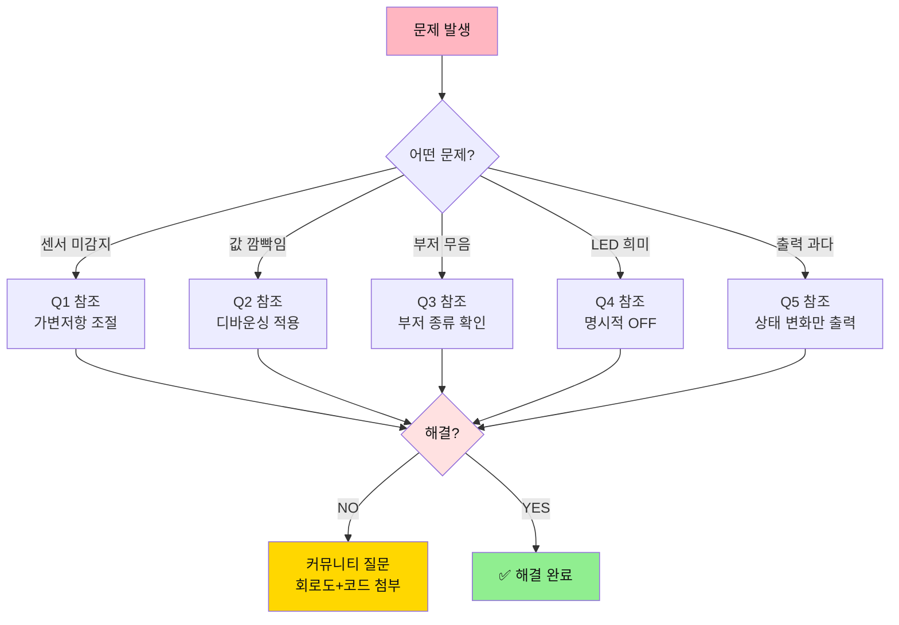

---

## 8. 다음 단계


**다음 문서**: [02_컬러센서 상세 가이드](./02_컬러센서_가이드.md)

---

**작성일**: 2026-01-27  
**버전**: 1.0  
**작성자**: Smart Factory Team

