# 02. 컬러 센서 테스트 - 상세 가이드

## 📚 목차

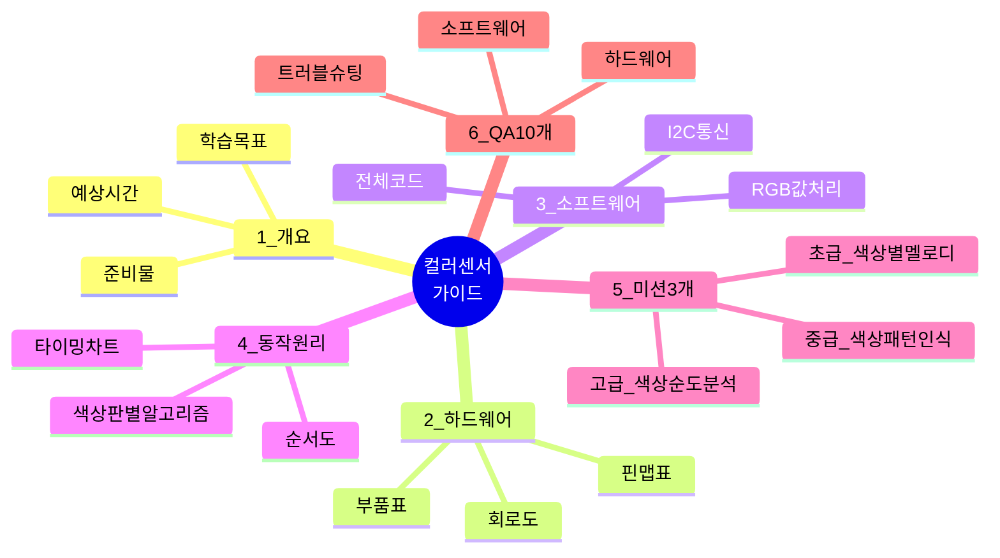

---

## 1. 프로젝트 개요

### 1.1 학습 목표
- ✅ I2C 통신 프로토콜 이해
- ✅ RGB 색상 모델 학습
- ✅ 센서 데이터 정규화 및 매핑 기법
- ✅ 색상 판별 알고리즘 구현

### 1.2 준비물
| 번호 | 부품명 | 수량 | 사양 | 용도 |
|------|--------|------|------|------|
| 1 | 아두이노 우노 | 1 | ATmega328P | 메인 컨트롤러 |
| 2 | TCS34725 컬러 센서 | 1 | RGB + Clear | 색상 측정 |
| 3 | LED | 1 | 5mm, 빨강 | 상태 표시 |
| 4 | 부저 | 1 | 패시브 부저 | 색상별 알림음 |
| 5 | 브레드보드 | 1 | 400홀 | 회로 구성 |
| 6 | 점퍼 와이어 | 10 | M-M, M-F | 연결 |
| 7 | 색상 샘플 | 3+ | 빨강, 초록, 파랑 | 테스트용 |

### 1.3 예상 소요 시간
- 라이브러리 설치: 5분
- 회로 구성: 10분
- 코드 업로드 및 테스트: 15분
- 미션 수행: 40분
- **총 소요 시간: 약 70분**

---

## 2. 하드웨어 구성

### 2.1 핀 맵 표

| 아두이노 핀 | 연결 부품 | 신호 타입 | 방향 | 설명 |
|------------|----------|----------|------|------|
| **SDA (A4)** | TCS34725 SDA | I2C 데이터 | BIDIRECTIONAL | I2C 데이터 라인 (양방향) |
| **SCL (A5)** | TCS34725 SCL | I2C 클럭 | OUTPUT | I2C 클럭 라인 |
| **13** | LED (+) | 디지털 출력 | OUTPUT | 센서 동작 상태 표시 |
| **4** | 부저 (+) | PWM 출력 | OUTPUT | 색상별 알림음 |
| **3.3V** | TCS34725 VIN | 전원 | POWER | 3.3V 전원 (5V 아님!) |
| **GND** | 센서 GND, LED (-), 부저 GND | 접지 | GROUND | 공통 접지 |

⚠️ **중요**: TCS34725는 **3.3V 전원**을 사용합니다. 5V 연결 시 센서 손상!

### 2.2 부품 상세 정보

#### TCS34725 컬러 센서
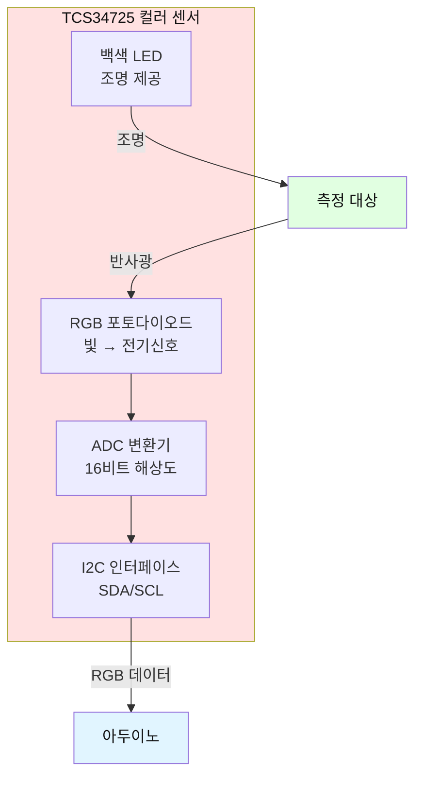

**핀 구성:**
- VIN: 3.3V 전원 (⚠️ 5V 금지!)
- GND: 접지
- SDA: I2C 데이터 (A4 핀)
- SCL: I2C 클럭 (A5 핀)
- LED: 내장 백색 LED (측정 시 자동 점등)
- INT: 인터럽트 (선택사항, 미사용)

**특징:**
- 해상도: 16비트 (0~65535)
- 측정 채널: R, G, B, Clear (투명)
- 통신: I2C (주소 0x29)
- 내장 IR 필터: 적외선 차단
- 측정 거리: 1~3cm (최적)

**주의사항:**
- 주변 조명에 민감 → 일정한 조명 환경 필요
- 센서와 물체 거리 일정하게 유지
- 반사율이 낮은 표면은 측정 어려움

### 2.3 회로도

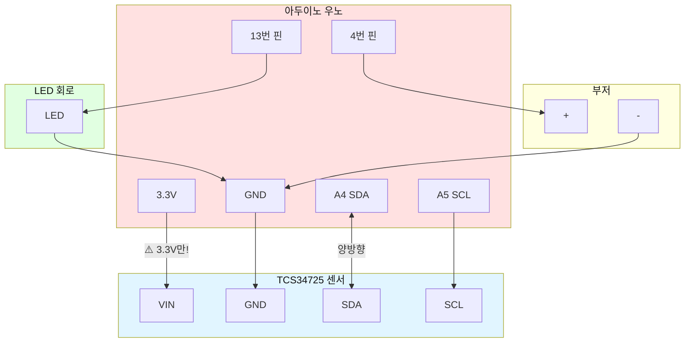

**배선 순서:**
1. ⚠️ 아두이노 **3.3V** → TCS34725 VIN (5V 절대 금지!)
2. 아두이노 GND → TCS34725 GND
3. 아두이노 A4 (SDA) → TCS34725 SDA
4. 아두이노 A5 (SCL) → TCS34725 SCL
5. 아두이노 13번 → LED (+)
6. LED (-) → 아두이노 GND
7. 아두이노 4번 → 부저 (+)
8. 부저 (-) → 아두이노 GND

---

## 3. 소프트웨어 구조

### 3.1 I2C 통신 구조

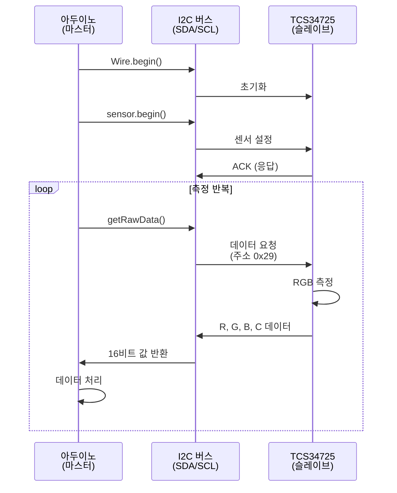

### 3.2 프로그램 구조도

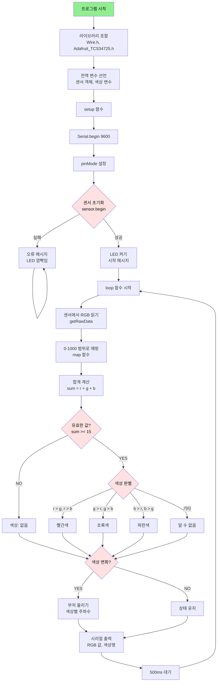

### 3.3 색상 판별 알고리즘

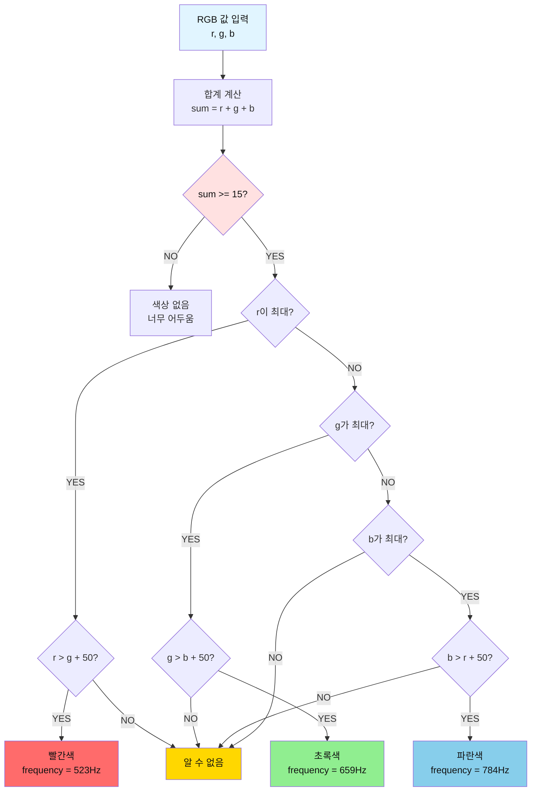

### 3.4 전체 소스 코드

```cpp
/**
 * 컬러 센서 테스트 프로그램
 * 
 * 기능: TCS34725 센서로 색상 측정 및 판별
 * - RGB 값 측정 및 출력
 * - 색상 자동 판별 (빨강, 초록, 파랑)
 */

/* ===== 라이브러리 ===== */
#include <Wire.h>
#include <Adafruit_TCS34725.h>

/* ===== 핀 번호 설정 ===== */
#define PIN_BUZZER          4     // 부저 핀
#define PIN_LED             13    // LED 핀

/* ===== 센서 설정 ===== */
#define RAW_MAX             21504 // 센서 최대값
#define MAPPED_MAX          1000  // 매핑 최대값
#define MIN_SUM             15    // 유효 색상 최소 합계

/* ===== 타이밍 ===== */
#define MEASURE_DELAY       500   // 측정 간격(ms)

/* ===== 음계 정의 ===== */
#define NOTE_C              523   // 도 (빨강)
#define NOTE_E              659   // 미 (초록)
#define NOTE_G              784   // 솔 (파랑)

/* ===== 전역 변수 ===== */
Adafruit_TCS34725 colorSensor = Adafruit_TCS34725(
  TCS34725_INTEGRATIONTIME_50MS, 
  TCS34725_GAIN_4X
);

uint16_t rawR, rawG, rawB, rawC;  // Raw 값
int r, g, b;                       // 매핑된 값
int lastColor = 0;                 // 이전 색상 (0=없음, 1=빨강, 2=초록, 3=파랑)

/**
 * 초기화
 */
void setup() {
  Serial.begin(9600);
  
  pinMode(PIN_BUZZER, OUTPUT);
  pinMode(PIN_LED, OUTPUT);
  
  // 센서 초기화
  if (!colorSensor.begin()) {
    Serial.println("========================================");
    Serial.println("  [오류] 컬러 센서를 찾을 수 없습니다!");
    Serial.println("========================================");
    
    // 오류 표시 (LED 깜빡임)
    while (1) {
      digitalWrite(PIN_LED, HIGH);
      delay(200);
      digitalWrite(PIN_LED, LOW);
      delay(200);
    }
  }
  
  digitalWrite(PIN_LED, HIGH);
  
  Serial.println("========================================");
  Serial.println("  컬러 센서 테스트 시작");
  Serial.println("========================================");
  Serial.println("센서 초기화 완료");
  Serial.println("색상 측정을 시작합니다...\n");
}

/**
 * 메인 루프
 */
void loop() {
  // 1. 센서에서 RGB 값 읽기
  colorSensor.getRawData(&rawR, &rawG, &rawB, &rawC);
  
  // 2. 0~1000 범위로 매핑
  r = map(rawR, 0, RAW_MAX, 0, MAPPED_MAX);
  g = map(rawG, 0, RAW_MAX, 0, MAPPED_MAX);
  b = map(rawB, 0, RAW_MAX, 0, MAPPED_MAX);
  
  int sum = r + g + b;
  
  // 3. 결과 출력
  Serial.println("----------------------------------------");
  Serial.print("Raw -> R: ");
  Serial.print(rawR);
  Serial.print(", G: ");
  Serial.print(rawG);
  Serial.print(", B: ");
  Serial.println(rawB);
  
  Serial.print("RGB -> R: ");
  Serial.print(r);
  Serial.print(", G: ");
  Serial.print(g);
  Serial.print(", B: ");
  Serial.println(b);
  
  Serial.print("합계: ");
  Serial.println(sum);
  
  // 4. 색상 판별
  int currentColor = 0;  // 0=없음
  const char* colorName = "없음";
  
  if (sum >= MIN_SUM) {
    if (r > g && r > b) {
      currentColor = 1;  // 빨강
      colorName = "빨간색";
    } else if (g > r && g > b) {
      currentColor = 2;  // 초록
      colorName = "초록색";
    } else if (b > r && b > g) {
      currentColor = 3;  // 파랑
      colorName = "파란색";
    } else {
      colorName = "알 수 없음";
    }
  }
  
  Serial.print("판별 색상: ");
  Serial.println(colorName);
  
  // 5. 색상 변화 시 부저 울림
  if (currentColor > 0 && currentColor != lastColor) {
    int frequency = NOTE_C;  // 기본 도 음
    if (currentColor == 1) frequency = NOTE_C;  // 빨강: 도
    if (currentColor == 2) frequency = NOTE_E;  // 초록: 미
    if (currentColor == 3) frequency = NOTE_G;  // 파랑: 솔
    
    tone(PIN_BUZZER, frequency, 100);
    Serial.println("\n>>> 색상 변화 감지! <<<\n");
  }
  
  lastColor = currentColor;
  delay(MEASURE_DELAY);
}
```

---

## 4. 동작 원리

### 4.1 RGB 색상 모델

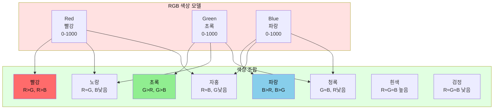

### 4.2 측정 과정 타이밍 차트

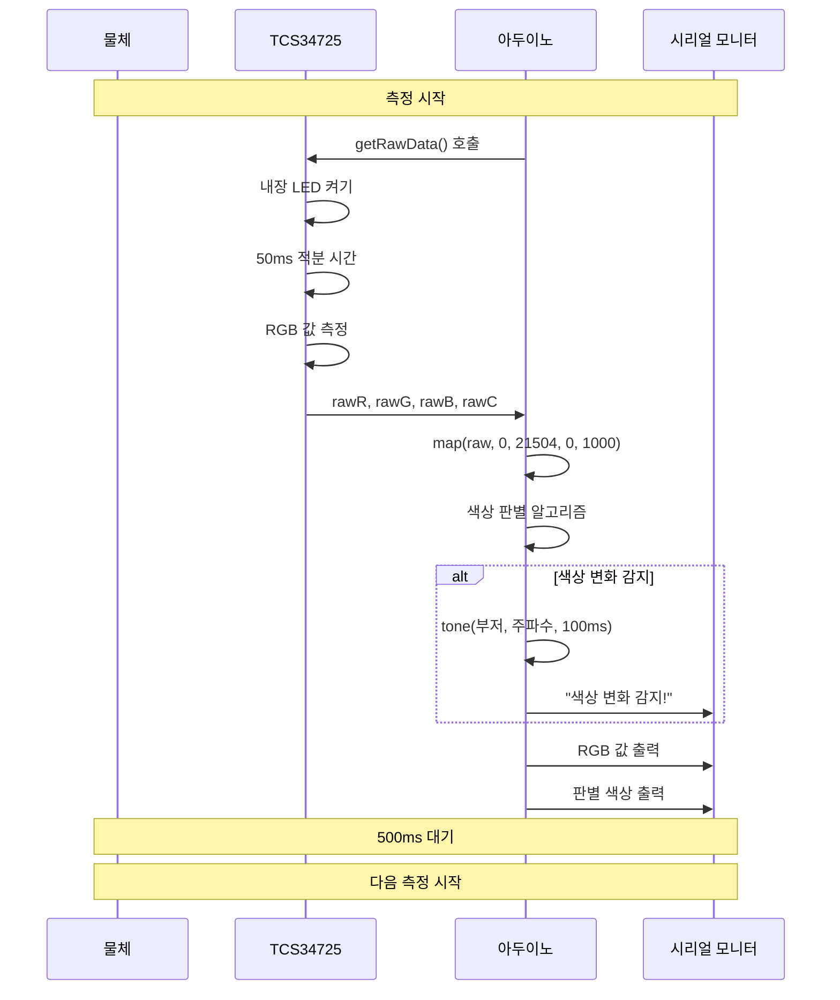

### 4.3 색상 판별 상태 다이어그램

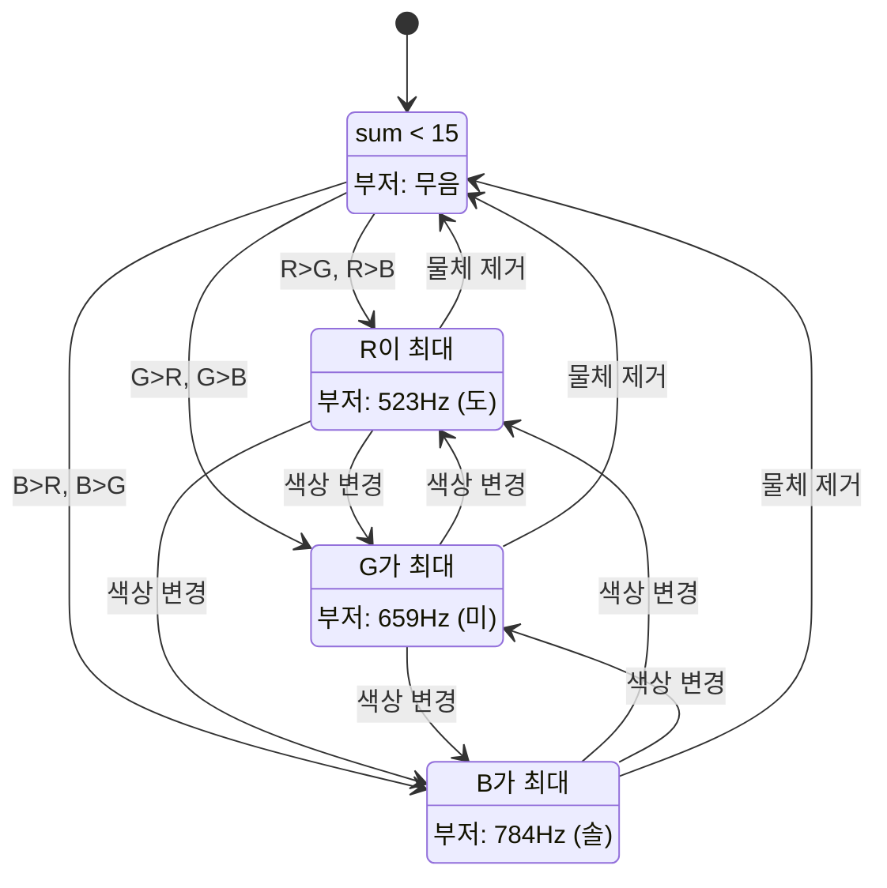

---

## 5. 미션 3개

### 미션 1: 색상별 멜로디 작곡하기 (초급) 🎵

#### 목표
각 색상마다 고유한 3음계 멜로디 재생

#### 요구사항
1. 빨강: 도-도-솔 (경고음 느낌)
2. 초록: 미-솔-도 (상승음)
3. 파랑: 솔-미-도 (하강음)
4. 각 음은 150ms씩 재생

#### 순서도
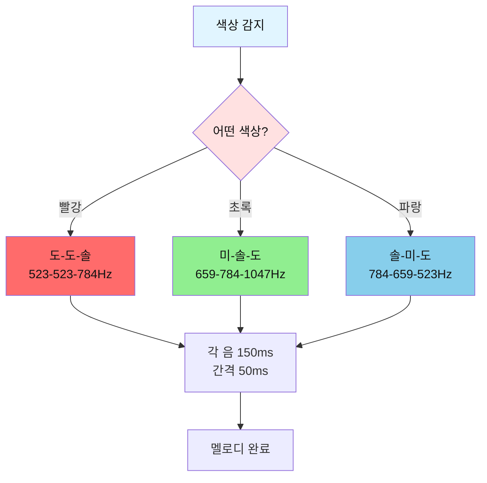

#### 정답 코드
```cpp
/* ===== 음계 정의 추가 ===== */
#define NOTE_C      523   // 도
#define NOTE_E      659   // 미
#define NOTE_G      784   // 솔
#define NOTE_C_HIGH 1047  // 높은 도

/**
 * 색상별 멜로디 재생
 */
void playColorMelody(int color) {
  switch (color) {
    case 1:  // 빨강: 도-도-솔 (경고음)
      tone(PIN_BUZZER, NOTE_C, 150);
      delay(200);
      tone(PIN_BUZZER, NOTE_C, 150);
      delay(200);
      tone(PIN_BUZZER, NOTE_G, 150);
      Serial.println("♪ 빨강 멜로디: 도-도-솔");
      break;
      
    case 2:  // 초록: 미-솔-도 (상승음)
      tone(PIN_BUZZER, NOTE_E, 150);
      delay(200);
      tone(PIN_BUZZER, NOTE_G, 150);
      delay(200);
      tone(PIN_BUZZER, NOTE_C_HIGH, 150);
      Serial.println("♪ 초록 멜로디: 미-솔-도");
      break;
      
    case 3:  // 파랑: 솔-미-도 (하강음)
      tone(PIN_BUZZER, NOTE_G, 150);
      delay(200);
      tone(PIN_BUZZER, NOTE_E, 150);
      delay(200);
      tone(PIN_BUZZER, NOTE_C, 150);
      Serial.println("♪ 파랑 멜로디: 솔-미-도");
      break;
  }
}

void loop() {
  // ... (기존 코드)
  
  // 색상 변화 시 멜로디 재생
  if (currentColor > 0 && currentColor != lastColor) {
    playColorMelody(currentColor);
    Serial.println("\n>>> 색상 변화 감지! <<<\n");
  }
  
  lastColor = currentColor;
  delay(MEASURE_DELAY);
}
```

---

### 미션 2: 색상 패턴 인식하기 (중급) 🎯

#### 목표
특정 색상 순서(빨강→초록→파랑) 감지 시 성공 멜로디 재생

#### 요구사항
1. 최근 3개 색상 이력 저장
2. "빨강 → 초록 → 파랑" 순서 감지
3. 패턴 매칭 시 성공 멜로디 (도-레-미-파-솔)
4. 시리얼 모니터에 "패턴 감지!" 메시지

#### 순서도
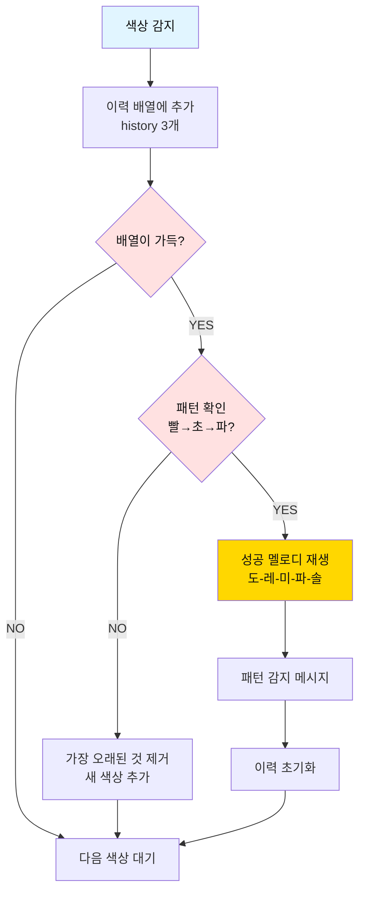

#### 정답 코드
```cpp
/* ===== 전역 변수 추가 ===== */
const int PATTERN_LENGTH = 3;
int colorHistory[PATTERN_LENGTH] = {0, 0, 0};  // 색상 이력
int historyIndex = 0;  // 현재 인덱스

/* ===== 음계 추가 ===== */
#define NOTE_D      587   // 레
#define NOTE_F      698   // 파

/**
 * 색상 이력에 추가
 */
void addToHistory(int color) {
  colorHistory[historyIndex] = color;
  historyIndex = (historyIndex + 1) % PATTERN_LENGTH;
  
  Serial.print("색상 이력: ");
  for (int i = 0; i < PATTERN_LENGTH; i++) {
    Serial.print(colorHistory[i]);
    Serial.print(" ");
  }
  Serial.println();
}

/**
 * 패턴 확인 (빨강→초록→파랑)
 */
bool checkPattern() {
  // 빨강(1) → 초록(2) → 파랑(3) 순서 확인
  int pattern[3] = {1, 2, 3};
  
  for (int i = 0; i < PATTERN_LENGTH; i++) {
    int idx = (historyIndex + i) % PATTERN_LENGTH;
    if (colorHistory[idx] != pattern[i]) {
      return false;
    }
  }
  return true;
}

/**
 * 성공 멜로디
 */
void playSuccessMelody() {
  int notes[] = {NOTE_C, NOTE_D, NOTE_E, NOTE_F, NOTE_G};
  for (int i = 0; i < 5; i++) {
    tone(PIN_BUZZER, notes[i], 150);
    delay(180);
  }
}

void loop() {
  // ... (기존 측정 코드)
  
  // 색상 변화 시
  if (currentColor > 0 && currentColor != lastColor) {
    addToHistory(currentColor);
    
    // 패턴 확인
    if (checkPattern()) {
      Serial.println("\n╔════════════════════════╗");
      Serial.println("║  🎉 패턴 감지 성공! 🎉  ║");
      Serial.println("║  빨강 → 초록 → 파랑   ║");
      Serial.println("╚════════════════════════╝\n");
      
      playSuccessMelody();
      
      // 이력 초기화
      for (int i = 0; i < PATTERN_LENGTH; i++) {
        colorHistory[i] = 0;
      }
      historyIndex = 0;
    }
    
    tone(PIN_BUZZER, currentColor == 1 ? NOTE_C : 
                     currentColor == 2 ? NOTE_E : NOTE_G, 100);
  }
  
  lastColor = currentColor;
  delay(MEASURE_DELAY);
}
```

---

### 미션 3: 색상 순도 분석하기 (고급) 🔬

#### 목표
RGB 값의 비율로 색상 순도를 판별하고 점수화

#### 요구사항
1. 순수한 빨강: R >> G, B (R이 압도적으로 큼)
2. 순도 점수 계산: (최대값 / 평균값) × 100
3. 점수에 따라 부저 음 높이 변경
   - 90점 이상: 높은 음 (1000Hz)
   - 70~90점: 중간 음 (700Hz)
   - 70점 미만: 낮은 음 (500Hz)
4. "색상 순도: XX%" 출력

#### 순서도
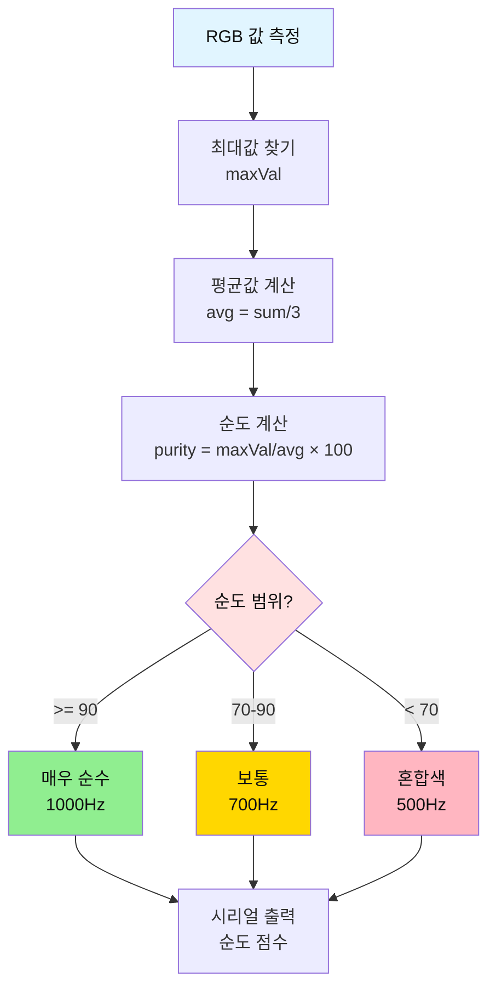

#### 정답 코드
```cpp
/**
 * 색상 순도 계산
 */
float calculatePurity(int r, int g, int b) {
  // 최대값 찾기
  int maxVal = max(r, max(g, b));
  
  // 평균값 계산
  float avg = (r + g + b) / 3.0;
  
  // 순도 계산 (최대값이 평균보다 얼마나 큰지)
  if (avg < 1) return 0;  // 0으로 나누기 방지
  
  float purity = (maxVal / avg) * 100.0;
  return purity;
}

/**
 * 순도에 따른 피드백
 */
void givePurityFeedback(float purity) {
  int frequency;
  const char* grade;
  
  if (purity >= 90) {
    frequency = 1000;
    grade = "매우 순수";
  } else if (purity >= 70) {
    frequency = 700;
    grade = "보통";
  } else {
    frequency = 500;
    grade = "혼합색";
  }
  
  tone(PIN_BUZZER, frequency, 200);
  
  Serial.print("색상 순도: ");
  Serial.print(purity, 1);  // 소수점 1자리
  Serial.print("% (");
  Serial.print(grade);
  Serial.println(")");
}

void loop() {
  // 1. 센서에서 RGB 값 읽기
  colorSensor.getRawData(&rawR, &rawG, &rawB, &rawC);
  
  // 2. 0~1000 범위로 매핑
  r = map(rawR, 0, RAW_MAX, 0, MAPPED_MAX);
  g = map(rawG, 0, RAW_MAX, 0, MAPPED_MAX);
  b = map(rawB, 0, RAW_MAX, 0, MAPPED_MAX);
  
  int sum = r + g + b;
  
  // 3. 결과 출력
  Serial.println("========================================");
  Serial.print("RGB -> R: ");
  Serial.print(r);
  Serial.print(", G: ");
  Serial.print(g);
  Serial.print(", B: ");
  Serial.println(b);
  
  // 4. 색상 판별
  int currentColor = 0;
  const char* colorName = "없음";
  
  if (sum >= MIN_SUM) {
    if (r > g && r > b) {
      currentColor = 1;
      colorName = "빨간색";
    } else if (g > r && g > b) {
      currentColor = 2;
      colorName = "초록색";
    } else if (b > r && b > g) {
      currentColor = 3;
      colorName = "파란색";
    } else {
      colorName = "혼합색";
    }
    
    Serial.print("판별 색상: ");
    Serial.println(colorName);
    
    // 5. 순도 분석
    float purity = calculatePurity(r, g, b);
    givePurityFeedback(purity);
    
    // 6. 색상 변화 시 피드백
    if (currentColor > 0 && currentColor != lastColor) {
      Serial.println("\n>>> 색상 변화 감지! <<<");
    }
  } else {
    Serial.println("판별 색상: 없음 (너무 어두움)");
  }
  
  Serial.println("========================================\n");
  
  lastColor = currentColor;
  delay(MEASURE_DELAY);
}
```

---

## 6. 자주 묻는 질문 (QA 10개)

### Q1. 센서가 초기화되지 않아요 (LED 깜빡임).

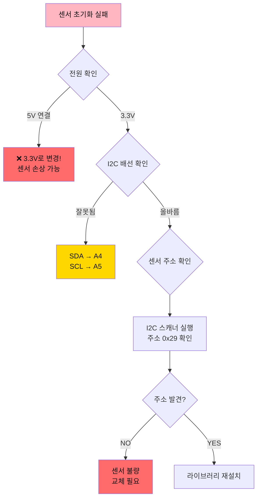

**I2C 스캐너 코드:**
```cpp
#include <Wire.h>

void setup() {
  Serial.begin(9600);
  Wire.begin();
  Serial.println("I2C 스캐너 시작...");
  
  for (byte address = 1; address < 127; address++) {
    Wire.beginTransmission(address);
    byte error = Wire.endTransmission();
    
    if (error == 0) {
      Serial.print("I2C 장치 발견: 0x");
      Serial.println(address, HEX);
    }
  }
  Serial.println("스캔 완료");
}

void loop() {}
```

---

### Q2. 색상이 정확하지 않아요.

**답변:**
환경 조명과 거리가 중요합니다.

**해결 방법:**
1. **조명 일정하게**: 형광등 아래에서 측정
2. **거리 일정하게**: 센서와 물체 1~3cm 유지
3. **보정 필요**: 흰색/검은색 기준 측정

**보정 코드:**
```cpp
/* ===== 보정값 (실측 후 입력) ===== */
int r_min = 50, r_max = 800;
int g_min = 60, g_max = 900;
int b_min = 40, b_max = 700;

void loop() {
  colorSensor.getRawData(&rawR, &rawG, &rawB, &rawC);
  
  // 보정된 값으로 매핑
  r = map(rawR, r_min, r_max, 0, 1000);
  g = map(rawG, g_min, g_max, 0, 1000);
  b = map(rawB, b_min, b_max, 0, 1000);
  
  // 범위 제한
  r = constrain(r, 0, 1000);
  g = constrain(g, 0, 1000);
  b = constrain(b, 0, 1000);
  
  // ... (나머지 코드)
}
```

---

### Q3. 흰색과 검은색을 구분하려면?

**답변:**
Clear 채널(rawC)과 합계를 사용하세요.

```cpp
void loop() {
  colorSensor.getRawData(&rawR, &rawG, &rawB, &rawC);
  
  int sum = r + g + b;
  
  if (sum > 800) {
    Serial.println("흰색 (밝음)");
  } else if (sum < 100) {
    Serial.println("검은색 (어두움)");
  } else {
    // 일반 색상 판별
  }
}
```

---

### Q4. 센서 값이 계속 변해요 (불안정).

**답변:**
여러 번 측정하여 평균내세요.

```cpp
/**
 * 안정적인 RGB 값 읽기 (5회 평균)
 */
void getStableRGB(int* r, int* g, int* b) {
  long sumR = 0, sumG = 0, sumB = 0;
  const int samples = 5;
  
  for (int i = 0; i < samples; i++) {
    colorSensor.getRawData(&rawR, &rawG, &rawB, &rawC);
    sumR += rawR;
    sumG += rawG;
    sumB += rawB;
    delay(50);
  }
  
  *r = map(sumR / samples, 0, RAW_MAX, 0, MAPPED_MAX);
  *g = map(sumG / samples, 0, RAW_MAX, 0, MAPPED_MAX);
  *b = map(sumB / samples, 0, RAW_MAX, 0, MAPPED_MAX);
}

void loop() {
  int r, g, b;
  getStableRGB(&r, &g, &b);
  
  // ... (나머지 코드)
}
```

---

### Q5. 노란색, 보라색 등 다른 색상도 판별하고 싶어요.

**답변:**
RGB 비율로 더 많은 색상을 구분할 수 있습니다.

```cpp
const char* detectDetailedColor(int r, int g, int b) {
  int sum = r + g + b;
  if (sum < 15) return "없음";
  
  // 주요 색상 (한 채널이 압도적)
  if (r > g + 100 && r > b + 100) return "빨강";
  if (g > r + 100 && g > b + 100) return "초록";
  if (b > r + 100 && b > g + 100) return "파랑";
  
  // 혼합 색상
  if (r > 300 && g > 300 && b < 200) return "노랑";
  if (r > 300 && b > 300 && g < 200) return "자홍";
  if (g > 300 && b > 300 && r < 200) return "청록";
  
  // 명도 기반
  if (sum > 800) return "흰색";
  if (sum < 100) return "검은색";
  
  return "혼합색";
}
```

---

### Q6. 내장 LED를 끄고 싶어요.

**답변:**
센서 초기화 후 LED를 끌 수 있습니다.

```cpp
void setup() {
  // ... (기존 초기화)
  
  if (colorSensor.begin()) {
    // 내장 LED 끄기
    colorSensor.setInterrupt(true);  // true = LED OFF
    Serial.println("내장 LED 꺼짐");
  }
}

// 측정 시에만 LED 켜기
void loop() {
  colorSensor.setInterrupt(false);  // LED ON
  delay(100);  // 안정화 대기
  
  colorSensor.getRawData(&rawR, &rawG, &rawB, &rawC);
  
  colorSensor.setInterrupt(true);   // LED OFF
  
  // ... (나머지 처리)
}
```

---

### Q7. 측정 속도를 빠르게 하고 싶어요.

**답변:**
적분 시간(Integration Time)을 줄이세요.

```cpp
// 빠른 측정 (2.4ms, 정확도 낮음)
Adafruit_TCS34725 colorSensor = Adafruit_TCS34725(
  TCS34725_INTEGRATIONTIME_2_4MS,  // 2.4ms
  TCS34725_GAIN_1X                 // 낮은 게인
);

// 기본 측정 (50ms, 균형)
Adafruit_TCS34725 colorSensor = Adafruit_TCS34725(
  TCS34725_INTEGRATIONTIME_50MS,   // 50ms
  TCS34725_GAIN_4X
);

// 정확한 측정 (700ms, 정확도 높음)
Adafruit_TCS34725 colorSensor = Adafruit_TCS34725(
  TCS34725_INTEGRATIONTIME_700MS,  // 700ms
  TCS34725_GAIN_60X                // 높은 게인
);
```

---

### Q8. 여러 개의 컬러 센서를 사용하고 싶어요.

**답변:**
TCS34725는 I2C 주소가 고정(0x29)이라 직접 연결 불가능합니다.

**해결 방법:**
1. **I2C 멀티플렉서 사용** (TCA9548A)
2. **소프트웨어 I2C** 사용 (다른 핀)

```cpp
#include <Wire.h>
#include <Adafruit_TCS34725.h>

// TCA9548A 멀티플렉서 주소
#define TCAADDR 0x70

Adafruit_TCS34725 sensor1 = Adafruit_TCS34725();
Adafruit_TCS34725 sensor2 = Adafruit_TCS34725();

void tcaselect(uint8_t channel) {
  if (channel > 7) return;
  Wire.beginTransmission(TCAADDR);
  Wire.write(1 << channel);
  Wire.endTransmission();
}

void setup() {
  Wire.begin();
  
  // 센서 1 (채널 0)
  tcaselect(0);
  sensor1.begin();
  
  // 센서 2 (채널 1)
  tcaselect(1);
  sensor2.begin();
}

void loop() {
  // 센서 1 읽기
  tcaselect(0);
  sensor1.getRawData(&r1, &g1, &b1, &c1);
  
  // 센서 2 읽기
  tcaselect(1);
  sensor2.getRawData(&r2, &g2, &b2, &c2);
}
```

---

### Q9. 색상 데이터를 SD 카드에 저장하고 싶어요.

**답변:**
SD 카드 모듈을 추가하여 로깅할 수 있습니다.

```cpp
#include <SPI.h>
#include <SD.h>

const int chipSelect = 10;
File dataFile;

void setup() {
  // SD 카드 초기화
  if (!SD.begin(chipSelect)) {
    Serial.println("SD 카드 초기화 실패!");
    return;
  }
  
  // 파일 생성
  dataFile = SD.open("colors.csv", FILE_WRITE);
  if (dataFile) {
    dataFile.println("Time,R,G,B,Color");
    dataFile.close();
  }
}

void loop() {
  // ... (색상 측정)
  
  // SD 카드에 저장
  dataFile = SD.open("colors.csv", FILE_WRITE);
  if (dataFile) {
    dataFile.print(millis());
    dataFile.print(",");
    dataFile.print(r);
    dataFile.print(",");
    dataFile.print(g);
    dataFile.print(",");
    dataFile.print(b);
    dataFile.print(",");
    dataFile.println(colorName);
    dataFile.close();
    
    Serial.println("데이터 저장됨");
  }
  
  delay(1000);
}
```

---

### Q10. RGB 값을 시리얼 플로터로 보고 싶어요.

**답변:**
쉼표로 구분하여 출력하면 그래프로 볼 수 있습니다.

```cpp
void loop() {
  colorSensor.getRawData(&rawR, &rawG, &rawB, &rawC);
  
  r = map(rawR, 0, RAW_MAX, 0, MAPPED_MAX);
  g = map(rawG, 0, RAW_MAX, 0, MAPPED_MAX);
  b = map(rawB, 0, RAW_MAX, 0, MAPPED_MAX);
  
  // 시리얼 플로터용 출력 (쉼표 구분)
  Serial.print("R:");
  Serial.print(r);
  Serial.print(",");
  Serial.print("G:");
  Serial.print(g);
  Serial.print(",");
  Serial.print("B:");
  Serial.println(b);
  
  delay(100);
}

// 도구 → 시리얼 플로터 열기
```

---

## 7. 트러블슈팅 가이드

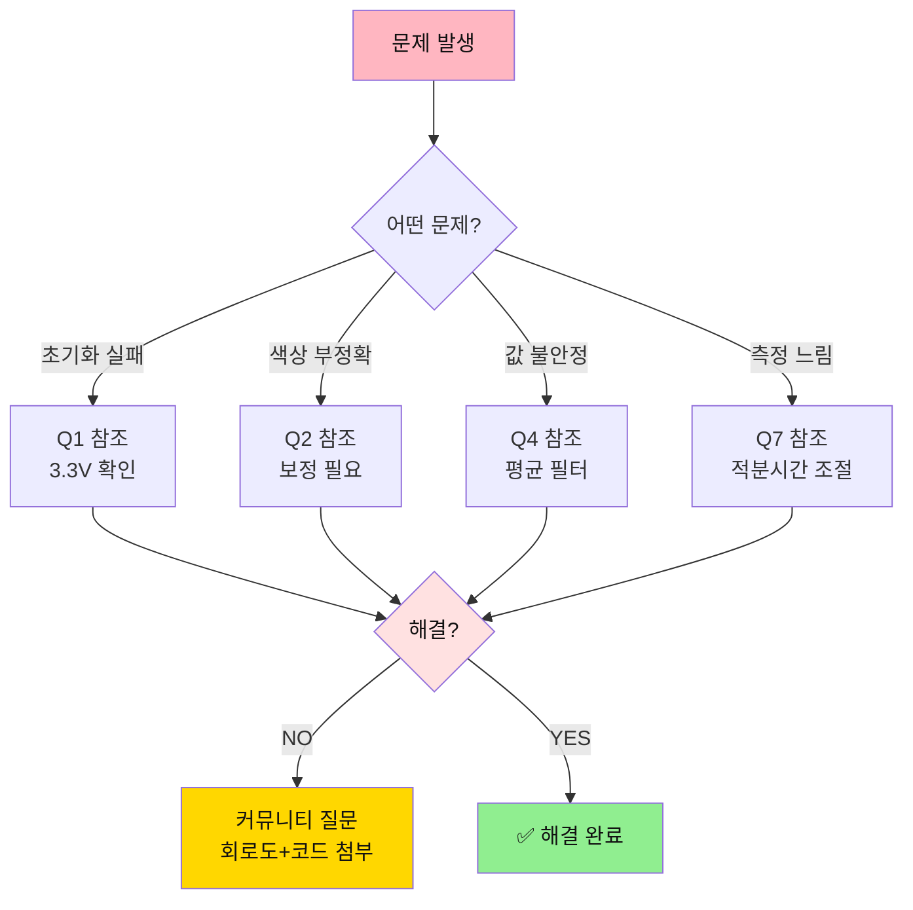

---

## 8. 다음 단계

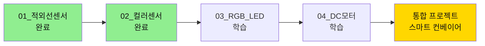

**다음 문서**: [03_RGB_LED 상세 가이드](./03_RGB_LED_가이드.md)

---

**작성일**: 2026-01-27  
**버전**: 1.0  
**작성자**: Smart Factory Team

