# 03. RGB LED 테스트 - 상세 가이드

## 📚 목차

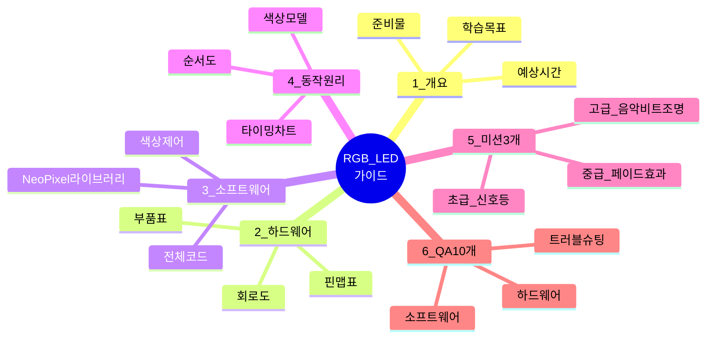

---

## 1. 프로젝트 개요

### 1.1 학습 목표
- ✅ NeoPixel (WS2812B) LED 제어 방법 학습
- ✅ RGB 색상 모델과 HSV 색상 모델 이해
- ✅ 1-wire 통신 프로토콜 개념 파악
- ✅ 다양한 색상 효과 구현 기법

### 1.2 준비물
| 번호 | 부품명 | 수량 | 사양 | 용도 |
|------|--------|------|------|------|
| 1 | 아두이노 우노 | 1 | ATmega328P | 메인 컨트롤러 |
| 2 | NeoPixel LED | 3 | WS2812B | RGB LED 스트립 |
| 3 | 커패시터 | 1 | 1000μF, 6.3V 이상 | 전원 안정화 |
| 4 | 저항 | 1 | 470Ω | 데이터 라인 보호 |
| 5 | 브레드보드 | 1 | 400홀 | 회로 구성 |
| 6 | 점퍼 와이어 | 10 | M-M | 연결 |
| 7 | 외부 전원 (선택) | 1 | 5V 2A | LED 많을 때 |

### 1.3 예상 소요 시간
- 라이브러리 설치: 5분
- 회로 구성: 10분
- 코드 업로드 및 테스트: 10분
- 미션 수행: 35분
- **총 소요 시간: 약 60분**

---

## 2. 하드웨어 구성

### 2.1 핀 맵 표

| 아두이노 핀 | 연결 부품 | 신호 타입 | 방향 | 설명 |
|------------|----------|----------|------|------|
| **6** | NeoPixel DIN | 디지털 출력 | OUTPUT | 데이터 신호 (1-wire 프로토콜) |
| **5V** | NeoPixel VCC | 전원 | POWER | 5V 전원 공급 |
| **GND** | NeoPixel GND | 접지 | GROUND | 공통 접지 |

⚠️ **중요**: LED 3개 이상 사용 시 외부 전원 권장 (USB 전원 부족 가능)

### 2.2 부품 상세 정보

#### WS2812B NeoPixel LED
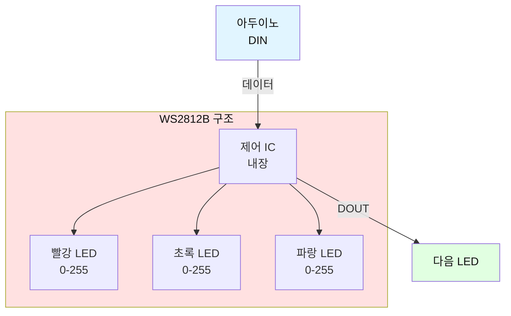

**핀 구성:**
- VCC (또는 5V): 5V 전원
- GND: 접지
- DIN (Data In): 데이터 입력
- DOUT (Data Out): 다음 LED로 데이터 전달

**특징:**
- 색상: 1677만 색상 (RGB 각 0~255)
- 제어: 1-wire 프로토콜 (타이밍 민감)
- 체인 연결: 직렬로 수백 개 연결 가능
- 소비 전류: LED당 최대 60mA (흰색 최대 밝기)
- 전압: 5V (4.5~5.5V)

**주의사항:**
- 전원 먼저 연결 후 데이터 신호 연결
- 긴 배선 시 470Ω 저항 직렬 연결 (데이터 라인 보호)
- 전원에 1000μF 커패시터 병렬 연결 (전압 안정화)
- LED 많을 때 외부 전원 필수

### 2.3 회로도

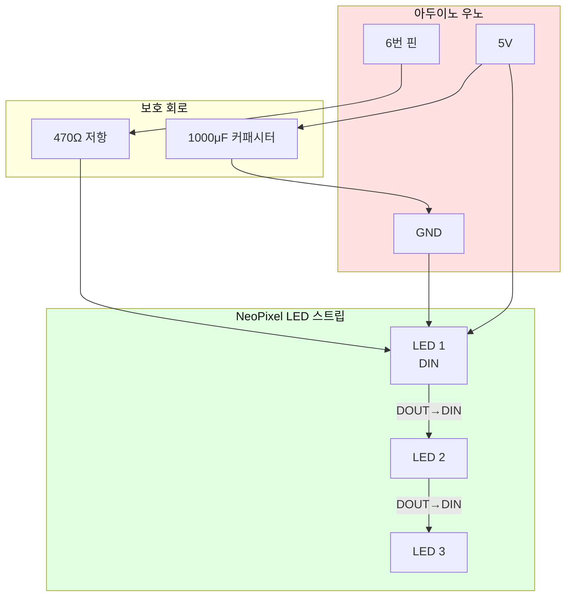

**배선 순서:**
1. 커패시터 1000μF: (+) → 아두이노 5V, (-) → 아두이노 GND
2. 아두이노 6번 → 470Ω 저항 → NeoPixel DIN
3. 아두이노 5V → NeoPixel VCC
4. 아두이노 GND → NeoPixel GND
5. LED 1 DOUT → LED 2 DIN (체인 연결)
6. LED 2 DOUT → LED 3 DIN

---

## 3. 소프트웨어 구조

### 3.1 NeoPixel 제어 구조

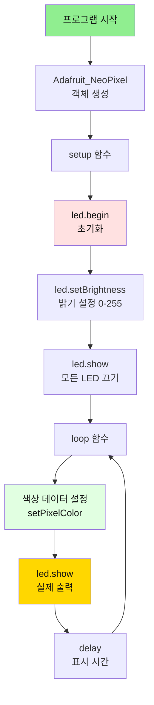

### 3.2 색상 모델 비교

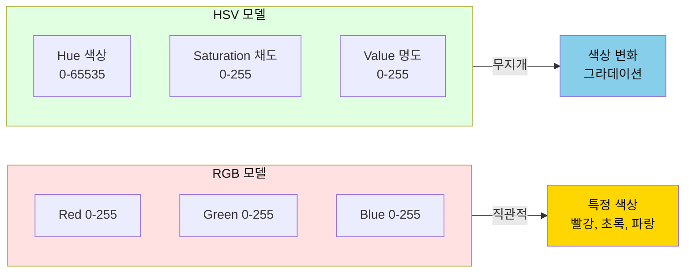

### 3.3 전체 소스 코드

```cpp
/**
 * RGB LED 색상 테스트 프로그램
 * 
 * 기능: NeoPixel LED로 다양한 색상 표시
 * - 15가지 색상 순차 표시
 * - 무지개 효과
 */

/* ===== 라이브러리 ===== */
#include <Adafruit_NeoPixel.h>

/* ===== 핀 번호 설정 ===== */
#define PIN_LED             6    // LED 데이터 핀

/* ===== LED 설정 ===== */
#define NUM_PIXELS          3     // LED 개수
#define BRIGHTNESS          255   // 밝기 (0~255)

/* ===== 타이밍 ===== */
#define COLOR_DELAY         1000  // 색상 표시 시간(ms)

/* ===== 전역 변수 ===== */
Adafruit_NeoPixel led = Adafruit_NeoPixel(
  NUM_PIXELS, 
  PIN_LED, 
  NEO_GRB + NEO_KHZ800
);

/**
 * 초기화
 */
void setup() {
  Serial.begin(9600);
  
  led.begin();
  led.setBrightness(BRIGHTNESS);
  led.show();  // 모든 LED 끄기
  
  Serial.println("========================================");
  Serial.println("  RGB LED 색상 테스트 시작");
  Serial.println("========================================");
  Serial.print("LED 개수: ");
  Serial.println(NUM_PIXELS);
  Serial.println("========================================\n");
  
  delay(1000);
}

/**
 * 메인 루프
 */
void loop() {
  Serial.println("========================================");
  Serial.println("[테스트 1] 기본 색상 표시 (15가지)");
  Serial.println("========================================");
  
  // 15가지 색상 배열 (R, G, B)
  const int colors[15][3] = {
    {255, 0,   0},    // 1. 빨간색
    {0,   255, 0},    // 2. 초록색
    {0,   0,   255},  // 3. 파란색
    {255, 255, 0},    // 4. 노란색
    {255, 0,   255},  // 5. 자홍색
    {0,   255, 255},  // 6. 청록색
    {255, 255, 255},  // 7. 흰색
    {255, 128, 0},    // 8. 주황색
    {128, 0,   128},  // 9. 보라색
    {255, 192, 203},  // 10. 분홍색
    {0,   128, 0},    // 11. 진한 초록
    {0,   0,   128},  // 12. 남색
    {128, 128, 0},    // 13. 올리브
    {255, 215, 0},    // 14. 금색
    {192, 192, 192}   // 15. 은색
  };
  
  const char* names[15] = {
    "빨간색", "초록색", "파란색", "노란색", "자홍색",
    "청록색", "흰색", "주황색", "보라색", "분홍색",
    "진한 초록", "남색", "올리브", "금색", "은색"
  };
  
  // 색상 순차 표시
  for (int i = 0; i < 15; i++) {
    Serial.print("색상 ");
    Serial.print(i + 1);
    Serial.print(": ");
    Serial.println(names[i]);
    
    // 모든 LED에 같은 색상 표시
    for (int j = 0; j < NUM_PIXELS; j++) {
      led.setPixelColor(j, led.Color(
        colors[i][0], 
        colors[i][1], 
        colors[i][2]
      ));
    }
    led.show();
    delay(COLOR_DELAY);
  }
  
  Serial.println();
  delay(2000);
}
```

---

## 4. 동작 원리

### 4.1 1-Wire 통신 프로토콜

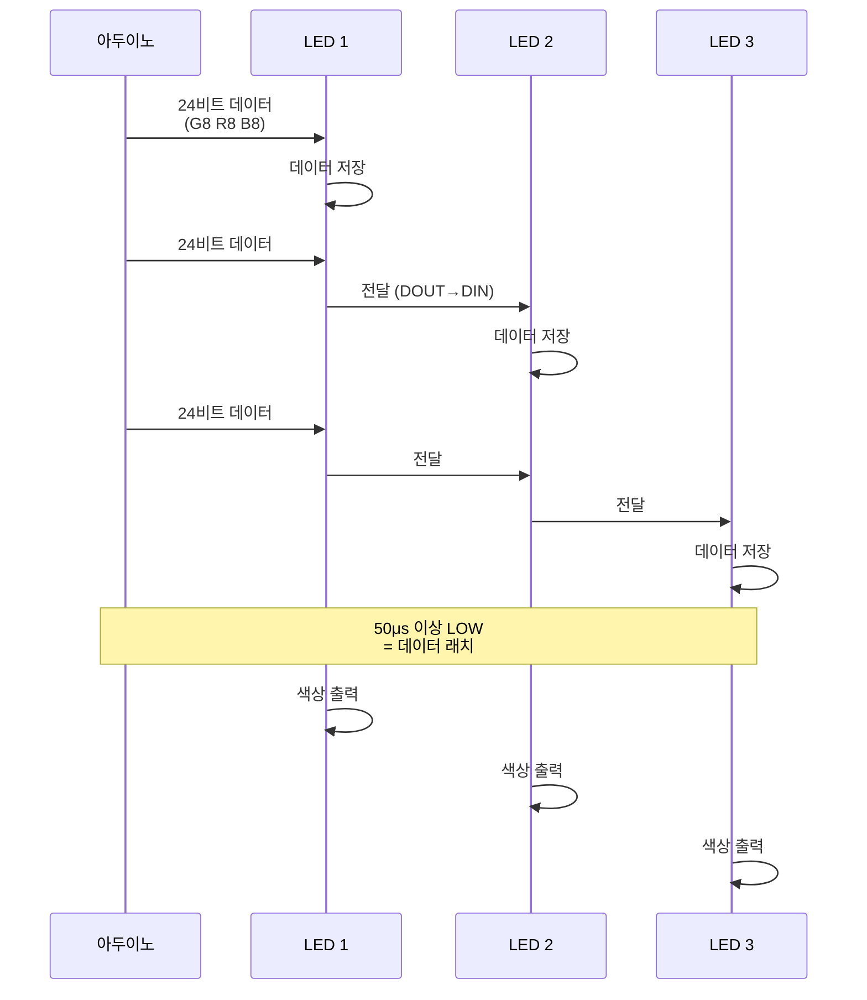

### 4.2 색상 설정 순서도

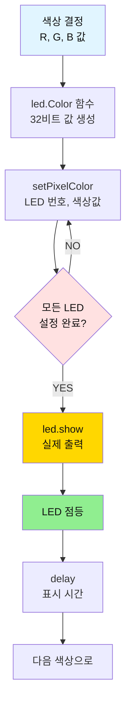

### 4.3 RGB vs HSV 색상 변환

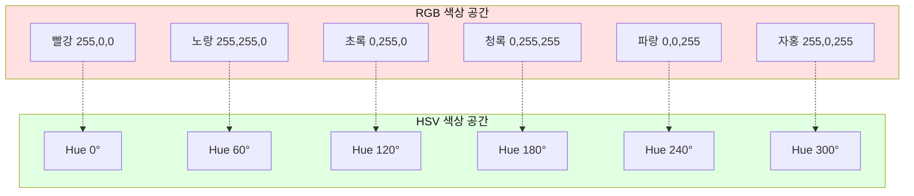

---

## 5. 미션 3개

### 미션 1: 신호등 시뮬레이션 (초급) 🚦

#### 목표
신호등처럼 빨강→노랑→초록 반복

#### 요구사항
1. 빨강 5초 → 노랑 2초 → 초록 5초
2. 각 색상 변경 시 부저로 "삐" 소리 (선택)
3. 시리얼 모니터에 남은 시간 카운트다운
4. LED 3개를 각각 다른 색으로 (신호등처럼)

#### 순서도
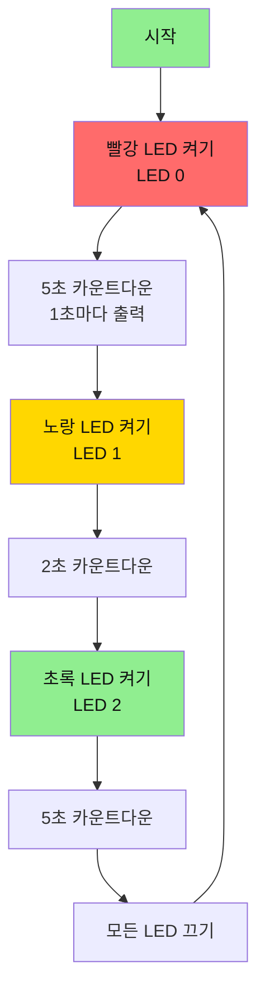

#### 정답 코드
```cpp
/* ===== 핀 번호 추가 ===== */
#define PIN_BUZZER  4  // 부저 핀 (선택)

/* ===== 신호등 시간 설정 ===== */
#define RED_TIME    5  // 빨강 5초
#define YELLOW_TIME 2  // 노랑 2초
#define GREEN_TIME  5  // 초록 5초

/**
 * 카운트다운과 함께 LED 표시
 */
void showLight(int ledNum, uint32_t color, int seconds, const char* name) {
  // 모든 LED 끄기
  for (int i = 0; i < NUM_PIXELS; i++) {
    led.setPixelColor(i, led.Color(0, 0, 0));
  }
  
  // 지정된 LED만 켜기
  led.setPixelColor(ledNum, color);
  led.show();
  
  // 부저 울리기 (선택)
  #ifdef PIN_BUZZER
    tone(PIN_BUZZER, 523, 100);
  #endif
  
  Serial.print("\n[");
  Serial.print(name);
  Serial.println(" 신호]");
  
  // 카운트다운
  for (int i = seconds; i > 0; i--) {
    Serial.print("남은 시간: ");
    Serial.print(i);
    Serial.println("초");
    delay(1000);
  }
}

void loop() {
  Serial.println("========================================");
  Serial.println("  신호등 시뮬레이션");
  Serial.println("========================================");
  
  // 빨강 신호
  showLight(0, led.Color(255, 0, 0), RED_TIME, "빨강");
  
  // 노랑 신호
  showLight(1, led.Color(255, 255, 0), YELLOW_TIME, "노랑");
  
  // 초록 신호
  showLight(2, led.Color(0, 255, 0), GREEN_TIME, "초록");
  
  Serial.println("\n한 사이클 완료\n");
  delay(1000);
}
```

---

### 미션 2: 색상 페이드 효과 (중급) 🌈

#### 목표
한 색상에서 다른 색상으로 부드럽게 전환

#### 요구사항
1. 빨강에서 파랑으로 50단계로 전환
2. 각 단계마다 RGB 값 계산
3. 전환 속도 조절 가능 (delay 값)
4. 여러 색상 조합 구현 (빨→파, 파→초, 초→빨)

#### 순서도
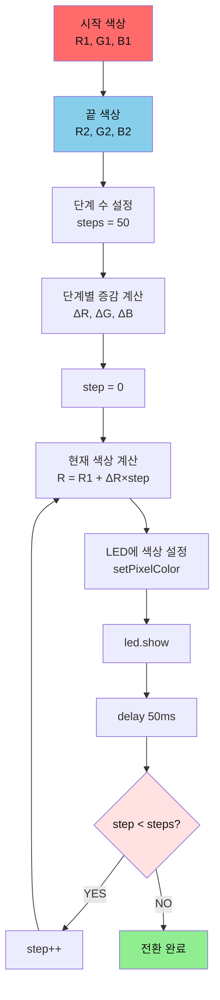

#### 정답 코드
```cpp
/**
 * 색상 페이드 함수
 */
void fadeColor(uint8_t r1, uint8_t g1, uint8_t b1,  // 시작 색상
               uint8_t r2, uint8_t g2, uint8_t b2,  // 끝 색상
               int steps, int delayTime) {
  
  Serial.print("페이드: (");
  Serial.print(r1); Serial.print(",");
  Serial.print(g1); Serial.print(",");
  Serial.print(b1); Serial.print(") → (");
  Serial.print(r2); Serial.print(",");
  Serial.print(g2); Serial.print(",");
  Serial.print(b2); Serial.println(")");
  
  // 단계별 증감량 계산
  float deltaR = (float)(r2 - r1) / steps;
  float deltaG = (float)(g2 - g1) / steps;
  float deltaB = (float)(b2 - b1) / steps;
  
  // 각 단계마다 색상 변경
  for (int step = 0; step <= steps; step++) {
    uint8_t r = r1 + (deltaR * step);
    uint8_t g = g1 + (deltaG * step);
    uint8_t b = b1 + (deltaB * step);
    
    // 모든 LED에 같은 색상 적용
    for (int i = 0; i < NUM_PIXELS; i++) {
      led.setPixelColor(i, led.Color(r, g, b));
    }
    led.show();
    
    // 진행률 출력 (10% 단위)
    if (step % (steps / 10) == 0) {
      Serial.print("진행: ");
      Serial.print((step * 100) / steps);
      Serial.println("%");
    }
    
    delay(delayTime);
  }
  
  Serial.println("페이드 완료\n");
}

void loop() {
  Serial.println("========================================");
  Serial.println("  색상 페이드 효과");
  Serial.println("========================================\n");
  
  // 빨강 → 파랑
  fadeColor(255, 0, 0,    // 빨강
            0, 0, 255,    // 파랑
            50, 30);      // 50단계, 30ms
  delay(1000);
  
  // 파랑 → 초록
  fadeColor(0, 0, 255,    // 파랑
            0, 255, 0,    // 초록
            50, 30);
  delay(1000);
  
  // 초록 → 빨강
  fadeColor(0, 255, 0,    // 초록
            255, 0, 0,    // 빨강
            50, 30);
  delay(1000);
  
  Serial.println("모든 페이드 완료\n");
  delay(2000);
}
```

---

### 미션 3: 음악 비트에 맞춘 조명 (고급) 🎵💡

#### 목표
부저로 멜로디 재생 시 음 높이에 따라 LED 색상 변경

#### 요구사항
1. "도레미파솔라시도" 음계 재생
2. 낮은음: 빨강 → 높은음: 보라 (무지개 색상)
3. 음 높이에 따라 HSV 색상 모델 사용
4. LED 3개가 순차적으로 켜지는 효과

#### 순서도
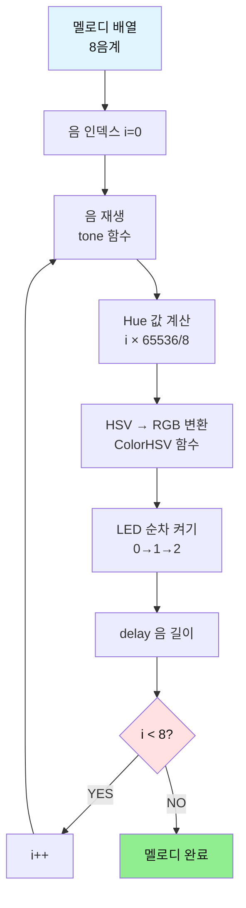

#### 정답 코드
```cpp
/* ===== 음계 정의 ===== */
#define NOTE_C  262  // 도
#define NOTE_D  294  // 레
#define NOTE_E  330  // 미
#define NOTE_F  349  // 파
#define NOTE_G  392  // 솔
#define NOTE_A  440  // 라
#define NOTE_B  494  // 시
#define NOTE_C2 523  // 높은 도

/* ===== 부저 핀 ===== */
#define PIN_BUZZER  4

/**
 * 음악 비트 조명 효과
 */
void musicBeatLight() {
  // 음계 배열
  int melody[] = {
    NOTE_C, NOTE_D, NOTE_E, NOTE_F, 
    NOTE_G, NOTE_A, NOTE_B, NOTE_C2
  };
  
  const char* noteNames[] = {
    "도", "레", "미", "파", "솔", "라", "시", "도(높음)"
  };
  
  int noteDuration = 500;  // 각 음 길이 (ms)
  
  Serial.println("========================================");
  Serial.println("  음악 비트 조명");
  Serial.println("========================================\n");
  
  for (int i = 0; i < 8; i++) {
    // 1. 음 재생
    tone(PIN_BUZZER, melody[i], noteDuration);
    
    // 2. Hue 값 계산 (0~65535, 무지개 색상)
    uint16_t hue = (i * 65536L) / 8;
    
    // 3. HSV → RGB 변환
    uint32_t color = led.ColorHSV(hue, 255, 255);
    
    // 4. LED 순차 켜기 효과
    for (int j = 0; j < NUM_PIXELS; j++) {
      led.setPixelColor(j, color);
      led.show();
      delay(noteDuration / (NUM_PIXELS + 1));
    }
    
    // 5. 정보 출력
    Serial.print("음: ");
    Serial.print(noteNames[i]);
    Serial.print(" (");
    Serial.print(melody[i]);
    Serial.print("Hz), Hue: ");
    Serial.println(hue);
    
    // 6. 남은 시간 대기
    delay(noteDuration - (noteDuration / (NUM_PIXELS + 1)) * NUM_PIXELS);
    
    // 7. LED 끄기
    for (int j = 0; j < NUM_PIXELS; j++) {
      led.setPixelColor(j, led.Color(0, 0, 0));
    }
    led.show();
    delay(50);  // 음 사이 간격
  }
  
  Serial.println("\n멜로디 완료!\n");
}

void loop() {
  musicBeatLight();
  delay(2000);
}
```

---

## 6. 자주 묻는 질문 (QA 10개)

### Q1. LED가 전혀 켜지지 않아요.

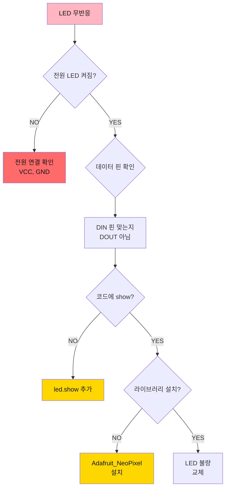

**체크리스트:**
1. 전원 연결: VCC → 5V, GND → GND
2. 데이터 연결: DIN (DOUT 아님!)
3. `led.show()` 호출 확인
4. 라이브러리 설치 확인

---

### Q2. 색상이 이상해요 (빨강인데 초록으로 나옴).

**답변:**
색상 순서가 다를 수 있습니다.

```cpp
// WS2812B는 GRB 순서
Adafruit_NeoPixel led = Adafruit_NeoPixel(
  NUM_PIXELS, 
  PIN_LED, 
  NEO_GRB + NEO_KHZ800  // GRB 순서
);

// 일부 LED는 RGB 순서
Adafruit_NeoPixel led = Adafruit_NeoPixel(
  NUM_PIXELS, 
  PIN_LED, 
  NEO_RGB + NEO_KHZ800  // RGB 순서
);

// 테스트 코드로 확인
void setup() {
  led.begin();
  
  // 빨강 테스트
  led.setPixelColor(0, led.Color(255, 0, 0));
  led.show();
  delay(1000);
  
  // 초록 테스트
  led.setPixelColor(0, led.Color(0, 255, 0));
  led.show();
  delay(1000);
  
  // 파랑 테스트
  led.setPixelColor(0, led.Color(0, 0, 255));
  led.show();
}
```

---

### Q3. LED가 깜빡거려요 (불안정).

**답변:**
전원이 부족하거나 불안정합니다.

**해결 방법:**
1. **커패시터 추가**: 1000μF, 전원에 병렬 연결
2. **외부 전원 사용**: 5V 2A 어댑터
3. **밝기 낮추기**:
```cpp
led.setBrightness(50);  // 0~255, 낮을수록 전류 감소
```
4. **LED 개수 줄이기**: 테스트 시 1~3개만

---

### Q4. 일부 LED만 켜져요.

**답변:**
체인 연결이 끊어졌거나 LED 불량입니다.

**디버깅:**
```cpp
void setup() {
  led.begin();
  Serial.begin(9600);
  
  // 각 LED 개별 테스트
  for (int i = 0; i < NUM_PIXELS; i++) {
    Serial.print("LED ");
    Serial.print(i);
    Serial.println(" 테스트");
    
    // 모두 끄기
    for (int j = 0; j < NUM_PIXELS; j++) {
      led.setPixelColor(j, led.Color(0, 0, 0));
    }
    
    // 하나만 켜기
    led.setPixelColor(i, led.Color(255, 0, 0));
    led.show();
    delay(1000);
  }
}
```

---

### Q5. 흰색이 노란색으로 보여요.

**답변:**
파랑 채널이 약하거나 전원 전압이 낮습니다.

```cpp
// 흰색 테스트
led.setPixelColor(0, led.Color(255, 255, 255));
led.show();

// 전압 부족 시 파랑이 약해짐
// 해결: 외부 5V 전원 사용 또는 밝기 낮추기
led.setBrightness(100);
```

---

### Q6. 여러 LED를 다른 색으로 표시하고 싶어요.

**답변:**
각 LED에 개별적으로 색상을 설정하세요.

```cpp
void loop() {
  // LED 0: 빨강
  led.setPixelColor(0, led.Color(255, 0, 0));
  
  // LED 1: 초록
  led.setPixelColor(1, led.Color(0, 255, 0));
  
  // LED 2: 파랑
  led.setPixelColor(2, led.Color(0, 0, 255));
  
  led.show();  // 한 번만 호출
  delay(1000);
}
```

---

### Q7. 무지개 효과를 만들고 싶어요.

**답변:**
HSV 색상 모델을 사용하세요.

```cpp
void rainbow(int wait) {
  for (long firstPixelHue = 0; firstPixelHue < 65536; firstPixelHue += 256) {
    for (int i = 0; i < NUM_PIXELS; i++) {
      // 각 LED의 Hue 값 계산
      int pixelHue = firstPixelHue + (i * 65536L / NUM_PIXELS);
      
      // HSV → RGB 변환
      led.setPixelColor(i, led.gamma32(led.ColorHSV(pixelHue)));
    }
    led.show();
    delay(wait);
  }
}

void loop() {
  rainbow(20);  // 20ms 간격
}
```

---

### Q8. LED를 끄려면 어떻게 하나요?

**답변:**
색상을 (0, 0, 0)으로 설정하세요.

```cpp
// 모든 LED 끄기
void clearAll() {
  for (int i = 0; i < NUM_PIXELS; i++) {
    led.setPixelColor(i, led.Color(0, 0, 0));
  }
  led.show();
}

// 특정 LED만 끄기
void clearPixel(int pixelNum) {
  led.setPixelColor(pixelNum, led.Color(0, 0, 0));
  led.show();
}
```

---

### Q9. 밝기를 동적으로 변경하고 싶어요.

**답변:**
`setBrightness()` 함수를 사용하세요.

```cpp
void loop() {
  // 밝기 증가 (0 → 255)
  for (int brightness = 0; brightness <= 255; brightness += 5) {
    led.setBrightness(brightness);
    
    // 모든 LED 흰색
    for (int i = 0; i < NUM_PIXELS; i++) {
      led.setPixelColor(i, led.Color(255, 255, 255));
    }
    led.show();
    delay(20);
  }
  
  delay(1000);
  
  // 밝기 감소 (255 → 0)
  for (int brightness = 255; brightness >= 0; brightness -= 5) {
    led.setBrightness(brightness);
    led.show();
    delay(20);
  }
  
  delay(1000);
}
```

---

### Q10. 긴 LED 스트립을 사용하고 싶어요.

**답변:**
외부 전원과 전원 분배에 주의하세요.

```cpp
// 100개 LED 예시
#define NUM_PIXELS 100

// 전원 계산:
// LED당 최대 60mA (흰색 최대 밝기)
// 100개 × 60mA = 6A 필요
// → 5V 10A 전원 권장

// 전원 분배:
// - 30개마다 전원 추가 공급
// - 굵은 전선 사용 (전압 강하 방지)

// 밝기 제한으로 전류 절약
led.setBrightness(50);  // 최대 밝기의 20% → 전류도 20%
```

---

## 7. 트러블슈팅 가이드

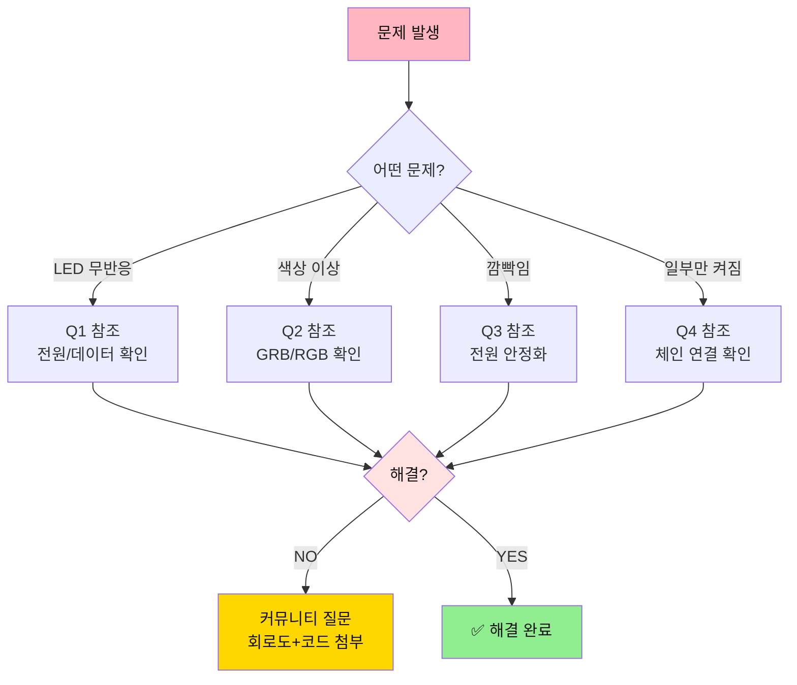

---

## 8. 다음 단계


**다음 문서**: [04_DC모터 상세 가이드](./04_DC모터_가이드.md)

---

**작성일**: 2026-01-27  
**버전**: 1.0  
**작성자**: Smart Factory Team

