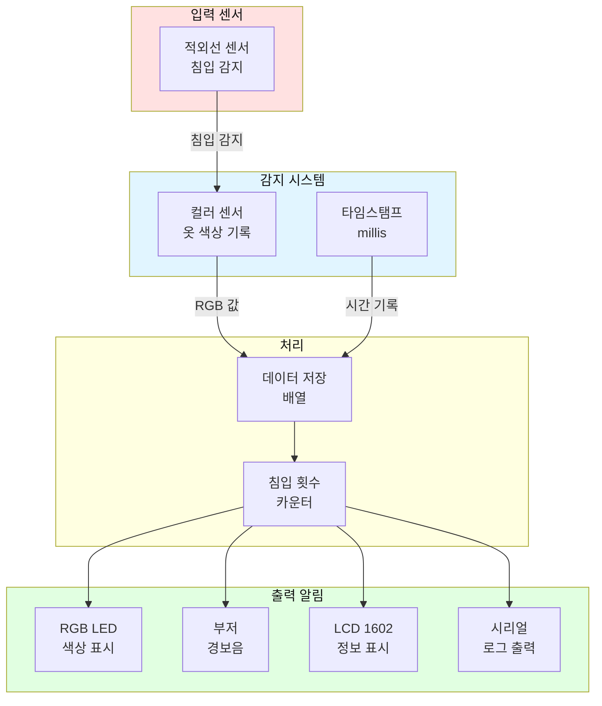
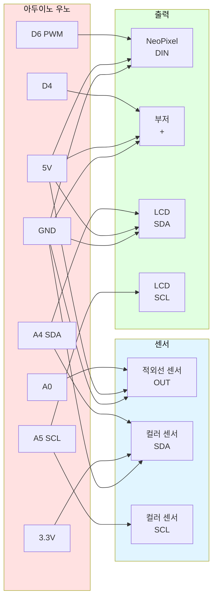

# 실전 예시 01: 범인 알리미 시스템

## 📋 프로젝트 개요

**목표**: 적외선 센서로 침입자를 감지하고, 사진을 찍듯이 컬러를 기록하여 범인의 옷 색상을 알림

**난이도**: ⭐⭐⭐☆☆

**학습 목표**:
- 센서 조합 사용
- 데이터 저장 및 분석
- 알림 시스템 구현

---

## 🎯 시스템 구조도



---

## 📦 부품 리스트

| 번호 | 부품명 | 수량 | 사양 | 용도 |
|------|--------|------|------|------|
| 1 | 아두이노 우노 | 1 | 5V | 메인 컨트롤러 |
| 2 | 적외선 센서 | 1 | 5V, 디지털 | 침입 감지 |
| 3 | TCS34725 컬러 센서 | 1 | 3.3V, I2C | 색상 기록 |
| 4 | NeoPixel LED | 3 | 5V, 1-Wire | 색상 표시 |
| 5 | 피에조 부저 | 1 | 5V, PWM | 경보음 |
| 6 | LCD 1602 (I2C) | 1 | 5V, I2C | 정보 표시 |
| 7 | 브레드보드 | 1 | - | 회로 구성 |
| 8 | 점퍼 와이어 | 20 | - | 연결 |

**예상 비용**: 약 35,000원

---

## 🔌 핀아웃 연결



### 핀 맵 테이블

| 아두이노 핀 | 연결 부품 | 신호 타입 | 설명 |
|------------|----------|----------|------|
| A0 | 적외선 센서 OUT | 디지털 입력 | 침입 감지 |
| A4 (SDA) | 컬러 센서 SDA | I2C | 색상 데이터 |
| A4 (SDA) | LCD SDA | I2C | 문자 표시 |
| A5 (SCL) | 컬러 센서 SCL | I2C | 클럭 신호 |
| A5 (SCL) | LCD SCL | I2C | 클럭 신호 |
| D6 | NeoPixel DIN | 1-Wire | LED 제어 |
| D4 | 부저 + | PWM | 경보음 |
| 5V | 센서/LCD 전원 | 전원 | 5V 공급 |
| 3.3V | 컬러 센서 VIN | 전원 | 3.3V 공급 |
| GND | 공통 접지 | 접지 | 0V |

---

## 🔄 동작 순서도

```mermaid
flowchart TD
    START([시스템 시작]) --> INIT[초기화]
    INIT --> INIT1[시리얼 9600]
    INIT1 --> INIT2[I2C 센서 초기화]
    INIT2 --> INIT3[LCD 초기 메시지]
    INIT3 --> INIT4[LED 테스트]
    INIT4 --> INIT5[경보음 테스트]
    
    INIT5 --> IDLE[대기 모드<br/>IDLE]
    IDLE --> LCD_IDLE[LCD: Waiting...]
    LCD_IDLE --> CHECK{적외선<br/>감지?}
    
    CHECK -->|NO| IDLE
    CHECK -->|YES| ALERT[경보 모드<br/>ALERT]
    
    ALERT --> BUZZER1[부저 울림<br/>1000Hz 500ms]
    BUZZER1 --> LED_RED[LED 빨강 깜빡임]
    LED_RED --> LCD_ALERT[LCD: INTRUDER!]
    
    LCD_ALERT --> CAPTURE[색상 캡처<br/>CAPTURE]
    CAPTURE --> COLOR_READ[컬러 센서 읽기<br/>RGB 값]
    COLOR_READ --> COLOR_ANALYZE[색상 분석]
    
    COLOR_ANALYZE --> SAVE_DATA[데이터 저장]
    SAVE_DATA --> SAVE1[침입 시간 저장]
    SAVE1 --> SAVE2[RGB 값 저장]
    SAVE2 --> SAVE3[카운터 증가]
    
    SAVE3 --> DISPLAY[결과 표시<br/>DISPLAY]
    DISPLAY --> LED_COLOR[LED 감지 색상]
    LED_COLOR --> BUZZER2[부저 색상별 음<br/>3회]
    BUZZER2 --> LCD_INFO[LCD 정보 업데이트]
    
    LCD_INFO --> SERIAL_LOG[시리얼 로그]
    SERIAL_LOG --> LOG1[침입 횟수]
    LOG1 --> LOG2[감지 시간]
    LOG2 --> LOG3[RGB 값]
    LOG3 --> LOG4[판별 색상]
    
    LOG4 --> WAIT[3초 대기]
    WAIT --> RESET[초기화]
    RESET --> IDLE
    
    style START fill:#90EE90,color:#111
    style IDLE fill:#E1F5FF,color:#111
    style ALERT fill:#FF6B6B,color:#111
    style CAPTURE fill:#FFFFE1,color:#111
    style DISPLAY fill:#87CEEB,color:#111
```



---

## 💻 완전한 소스 코드

```cpp
/**
 * 범인 알리미 시스템
 * 
 * 기능:
 * - 적외선 센서로 침입 감지
 * - 컬러 센서로 옷 색상 기록
 * - RGB LED로 색상 표시
 * - LCD에 침입 정보 표시
 * - 시리얼로 로그 출력
 * 
 * 작성자: Smart Factory Team
 * 날짜: 2026-01-27
 */

// ===== 라이브러리 포함 =====
#include <Wire.h>
#include <Adafruit_TCS34725.h>
#include <Adafruit_NeoPixel.h>
#include <LiquidCrystal_I2C.h>

// ===== 핀 정의 =====
#define PIN_IR_SENSOR    A0    // 적외선 센서
#define PIN_NEOPIXEL     6     // RGB LED
#define PIN_BUZZER       4     // 부저

// ===== 설정값 =====
#define NUM_PIXELS       3     // LED 개수
#define MAX_RECORDS      10    // 최대 기록 수
#define ALERT_DURATION   3000  // 경보 지속 시간 (ms)

// ===== 객체 생성 =====
Adafruit_TCS34725 colorSensor = Adafruit_TCS34725();
Adafruit_NeoPixel led = Adafruit_NeoPixel(NUM_PIXELS, PIN_NEOPIXEL);
LiquidCrystal_I2C lcd(0x27, 16, 2);  // I2C 주소 0x27, 16x2

// ===== 상태 정의 =====
enum State {
  IDLE,      // 대기
  ALERT,     // 경보
  CAPTURE,   // 색상 캡처
  DISPLAY    // 결과 표시
};

State currentState = IDLE;

// ===== 데이터 구조 =====
struct IntruderRecord {
  unsigned long timestamp;  // 침입 시간
  int red;                  // 빨강 값
  int green;                // 초록 값
  int blue;                 // 파랑 값
  String colorName;         // 색상 이름
};

IntruderRecord records[MAX_RECORDS];
int recordCount = 0;
int totalIntruders = 0;

// ===== 전역 변수 =====
bool lastIRState = HIGH;
unsigned long alertStartTime = 0;

// ===== 함수 선언 =====
void initSystem();
void checkIntrusion();
void captureColor();
void displayResult();
void playAlertSound();
void playColorSound(String color);
String analyzeColor(int r, int g, int b);
void updateLCD();
void printRecord(int index);

/**
 * 초기화 함수
 */
void setup() {
  // 시리얼 통신 시작
  Serial.begin(9600);
  Serial.println("=== Intruder Alert System ===");
  
  // 핀 모드 설정
  pinMode(PIN_IR_SENSOR, INPUT);
  pinMode(PIN_BUZZER, OUTPUT);
  
  // 센서 초기화
  if (!colorSensor.begin()) {
    Serial.println("ERROR: Color sensor not found!");
    lcd.init();
    lcd.backlight();
    lcd.print("Sensor Error!");
    while (1) {
      tone(PIN_BUZZER, 1000, 100);
      delay(500);
    }
  }
  
  // LCD 초기화
  lcd.init();
  lcd.backlight();
  lcd.clear();
  lcd.setCursor(0, 0);
  lcd.print("Intruder Alert");
  lcd.setCursor(0, 1);
  lcd.print("System Ready");
  
  // LED 초기화
  led.begin();
  led.setBrightness(100);
  led.show();
  
  // 시작 알림
  playAlertSound();
  
  // LED 테스트
  for (int i = 0; i < NUM_PIXELS; i++) {
    led.setPixelColor(i, led.Color(0, 255, 0));
  }
  led.show();
  delay(500);
  led.clear();
  led.show();
  
  Serial.println("System initialized successfully");
  Serial.println("Waiting for intruders...\n");
  
  delay(1000);
  updateLCD();
}

/**
 * 메인 루프
 */
void loop() {
  switch (currentState) {
    case IDLE:
      // 대기 상태: 침입 감지
      checkIntrusion();
      break;
      
    case ALERT:
      // 경보 상태: 경고 표시
      if (millis() - alertStartTime < ALERT_DURATION) {
        // LED 깜빡임
        static unsigned long lastBlink = 0;
        if (millis() - lastBlink > 200) {
          static bool ledOn = false;
          ledOn = !ledOn;
          
          for (int i = 0; i < NUM_PIXELS; i++) {
            led.setPixelColor(i, ledOn ? led.Color(255, 0, 0) : led.Color(0, 0, 0));
          }
          led.show();
          lastBlink = millis();
        }
      } else {
        currentState = CAPTURE;
      }
      break;
      
    case CAPTURE:
      // 색상 캡처
      captureColor();
      currentState = DISPLAY;
      break;
      
    case DISPLAY:
      // 결과 표시
      displayResult();
      delay(5000);
      
      // 초기화
      led.clear();
      led.show();
      currentState = IDLE;
      updateLCD();
      break;
  }
  
  delay(50);
}

/**
 * 침입 감지 확인
 */
void checkIntrusion() {
  bool currentIRState = digitalRead(PIN_IR_SENSOR);
  
  // 상태 변화 감지 (HIGH → LOW)
  if (currentIRState == LOW && lastIRState == HIGH) {
    Serial.println("\n!!! INTRUDER DETECTED !!!");
    
    totalIntruders++;
    currentState = ALERT;
    alertStartTime = millis();
    
    // LCD 업데이트
    lcd.clear();
    lcd.setCursor(0, 0);
    lcd.print("INTRUDER!");
    lcd.setCursor(0, 1);
    lcd.print("Capturing...");
    
    // 경보음
    playAlertSound();
  }
  
  lastIRState = currentIRState;
}

/**
 * 색상 캡처
 */
void captureColor() {
  Serial.println("Capturing color...");
  
  uint16_t r, g, b, c;
  colorSensor.getRawData(&r, &g, &b, &c);
  
  // 0-255 범위로 변환
  int red = map(r, 0, 20000, 0, 255);
  int green = map(g, 0, 20000, 0, 255);
  int blue = map(b, 0, 20000, 0, 255);
  
  // 범위 제한
  red = constrain(red, 0, 255);
  green = constrain(green, 0, 255);
  blue = constrain(blue, 0, 255);
  
  // 색상 분석
  String colorName = analyzeColor(red, green, blue);
  
  // 기록 저장
  if (recordCount < MAX_RECORDS) {
    records[recordCount].timestamp = millis();
    records[recordCount].red = red;
    records[recordCount].green = green;
    records[recordCount].blue = blue;
    records[recordCount].colorName = colorName;
    recordCount++;
  } else {
    // 배열 가득 참: 가장 오래된 기록 삭제
    for (int i = 0; i < MAX_RECORDS - 1; i++) {
      records[i] = records[i + 1];
    }
    records[MAX_RECORDS - 1].timestamp = millis();
    records[MAX_RECORDS - 1].red = red;
    records[MAX_RECORDS - 1].green = green;
    records[MAX_RECORDS - 1].blue = blue;
    records[MAX_RECORDS - 1].colorName = colorName;
  }
  
  Serial.print("RGB: (");
  Serial.print(red);
  Serial.print(", ");
  Serial.print(green);
  Serial.print(", ");
  Serial.print(blue);
  Serial.print(") -> ");
  Serial.println(colorName);
}

/**
 * 결과 표시
 */
void displayResult() {
  int index = recordCount - 1;
  if (index < 0) return;
  
  IntruderRecord record = records[index];
  
  // LED 색상 표시
  for (int i = 0; i < NUM_PIXELS; i++) {
    led.setPixelColor(i, led.Color(record.red, record.green, record.blue));
  }
  led.show();
  
  // LCD 표시
  lcd.clear();
  lcd.setCursor(0, 0);
  lcd.print("Color: ");
  lcd.print(record.colorName);
  lcd.setCursor(0, 1);
  lcd.print("Total: ");
  lcd.print(totalIntruders);
  
  // 색상별 소리
  playColorSound(record.colorName);
  
  // 시리얼 출력
  Serial.println("\n=== Intruder Record ===");
  printRecord(index);
  Serial.println("=======================\n");
}

/**
 * 경보음 재생
 */
void playAlertSound() {
  int melody[] = {1000, 800, 1000, 800};
  for (int i = 0; i < 4; i++) {
    tone(PIN_BUZZER, melody[i], 100);
    delay(150);
  }
}

/**
 * 색상별 소리 재생
 */
void playColorSound(String color) {
  int frequency = 523;  // 기본: 도
  
  if (color == "RED") {
    frequency = 523;  // 도
  } else if (color == "GREEN") {
    frequency = 659;  // 미
  } else if (color == "BLUE") {
    frequency = 784;  // 솔
  } else if (color == "YELLOW") {
    frequency = 698;  // 파
  } else if (color == "WHITE") {
    frequency = 880;  // 라
  } else if (color == "BLACK") {
    frequency = 392;  // 솔(낮음)
  }
  
  for (int i = 0; i < 3; i++) {
    tone(PIN_BUZZER, frequency, 200);
    delay(300);
  }
}

/**
 * 색상 분석
 */
String analyzeColor(int r, int g, int b) {
  // 밝기 계산
  int brightness = (r + g + b) / 3;
  
  // 어두운 색 (검은색)
  if (brightness < 50) {
    return "BLACK";
  }
  
  // 밝은 색 (흰색)
  if (brightness > 200 && abs(r - g) < 30 && abs(g - b) < 30) {
    return "WHITE";
  }
  
  // 색상 판별
  if (r > g && r > b) {
    if (g > 100) {
      return "YELLOW";  // 빨강 + 초록 = 노랑
    }
    return "RED";
  } else if (g > r && g > b) {
    return "GREEN";
  } else if (b > r && b > g) {
    return "BLUE";
  }
  
  return "UNKNOWN";
}

/**
 * LCD 업데이트
 */
void updateLCD() {
  lcd.clear();
  lcd.setCursor(0, 0);
  lcd.print("Waiting...");
  lcd.setCursor(0, 1);
  lcd.print("Total: ");
  lcd.print(totalIntruders);
}

/**
 * 기록 출력
 */
void printRecord(int index) {
  if (index < 0 || index >= recordCount) return;
  
  IntruderRecord record = records[index];
  
  Serial.print("Time: ");
  Serial.print(record.timestamp / 1000.0);
  Serial.println("s");
  
  Serial.print("RGB: (");
  Serial.print(record.red);
  Serial.print(", ");
  Serial.print(record.green);
  Serial.print(", ");
  Serial.print(record.blue);
  Serial.println(")");
  
  Serial.print("Color: ");
  Serial.println(record.colorName);
  
  Serial.print("Record #");
  Serial.print(index + 1);
  Serial.print(" / ");
  Serial.println(recordCount);
}
```

---

## 🎮 사용 방법

### 1단계: 하드웨어 조립
1. 핀아웃 테이블대로 부품 연결
2. I2C 주소 확인 (LCD: 0x27, 컬러센서: 0x29)
3. 전원 연결 확인

### 2단계: 라이브러리 설치
```
스케치 → 라이브러리 포함하기 → 라이브러리 관리
- Adafruit TCS34725
- Adafruit NeoPixel
- LiquidCrystal I2C
```

### 3단계: 코드 업로드
1. 보드: Arduino Uno 선택
2. 포트 선택
3. 업로드

### 4단계: 테스트
1. 시리얼 모니터 열기 (9600 baud)
2. 적외선 센서 앞에 손 대기
3. 색종이로 색상 테스트

---

## 📊 시리얼 출력 예시

```
=== Intruder Alert System ===
System initialized successfully
Waiting for intruders...

!!! INTRUDER DETECTED !!!
Capturing color...
RGB: (180, 50, 40) -> RED

=== Intruder Record ===
Time: 5.2s
RGB: (180, 50, 40)
Color: RED
Record #1 / 1
=======================

!!! INTRUDER DETECTED !!!
Capturing color...
RGB: (40, 150, 60) -> GREEN

=== Intruder Record ===
Time: 12.8s
RGB: (40, 150, 60)
Color: GREEN
Record #2 / 2
=======================
```

---

## 🔧 확장 아이디어

1. **SD 카드 로깅**: 침입 기록을 SD 카드에 저장
2. **블루투스 알림**: 스마트폰으로 실시간 알림
3. **카메라 모듈**: 실제 사진 촬영
4. **시간 표시**: RTC 모듈로 정확한 시간 기록
5. **웹 서버**: ESP8266으로 웹에서 기록 확인

---

**작성일**: 2026-01-27  
**난이도**: ⭐⭐⭐☆☆  
**예상 소요 시간**: 2시간

