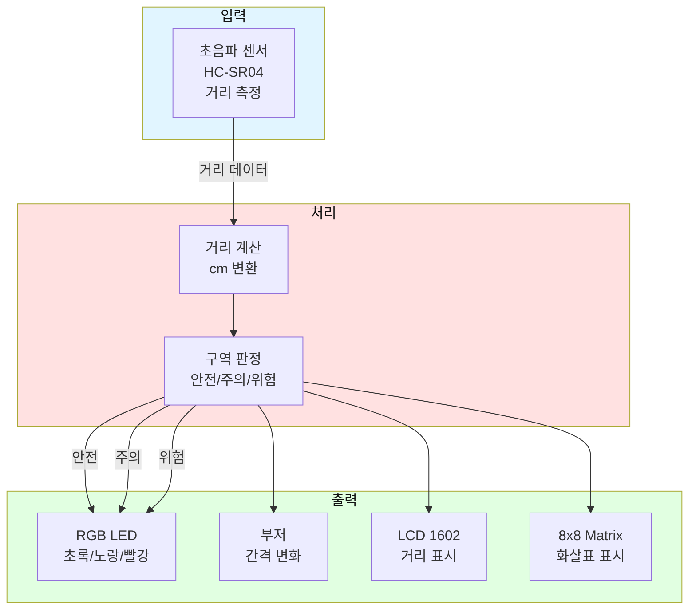
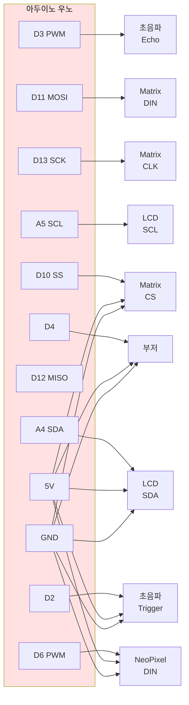
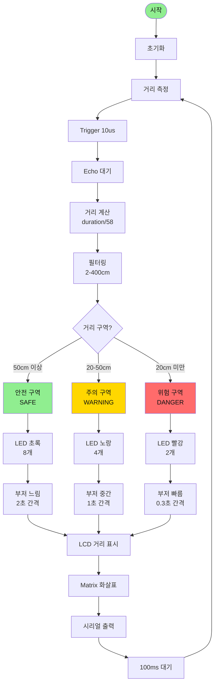

# 실전 예시 02: 스마트 주차 관리 시스템

## 📋 프로젝트 개요

**목표**: 초음파 센서로 주차 공간을 감지하고, 거리에 따라 LED와 부저로 안내

**난이도**: ⭐⭐☆☆☆

**학습 목표**:
- 초음파 센서 거리 측정
- 단계별 피드백 제공
- 실시간 거리 표시

---

## 🎯 시스템 구조도



---

## 📦 부품 리스트

| 번호 | 부품명 | 수량 | 사양 | 용도 |
|------|--------|------|------|------|
| 1 | 아두이노 우노 | 1 | 5V | 메인 컨트롤러 |
| 2 | HC-SR04 초음파 센서 | 1 | 5V, 2-400cm | 거리 측정 |
| 3 | NeoPixel LED | 8 | 5V, 1-Wire | 거리 표시 |
| 4 | 피에조 부저 | 1 | 5V, PWM | 경고음 |
| 5 | LCD 1602 (I2C) | 1 | 5V, I2C | 거리 숫자 표시 |
| 6 | 8x8 LED Matrix | 1 | 5V, SPI | 화살표 표시 |
| 7 | 브레드보드 | 1 | - | 회로 구성 |
| 8 | 점퍼 와이어 | 25 | - | 연결 |

**예상 비용**: 약 30,000원

---

## 🔌 핀아웃 연결



### 핀 맵 테이블

| 아두이노 핀 | 연결 부품 | 신호 타입 | 설명 |
|------------|----------|----------|------|
| D2 | 초음파 Trigger | 디지털 출력 | 10us 펄스 |
| D3 | 초음파 Echo | 디지털 입력 | 거리 신호 |
| D4 | 부저 + | PWM | 경고음 |
| D6 | NeoPixel DIN | 1-Wire | LED 제어 |
| D10 | Matrix CS | SPI | Chip Select |
| D11 | Matrix DIN | SPI | Data In |
| D13 | Matrix CLK | SPI | Clock |
| A4 (SDA) | LCD SDA | I2C | 데이터 |
| A5 (SCL) | LCD SCL | I2C | 클럭 |

---

## 🔄 동작 순서도



---

## 💻 완전한 소스 코드

```cpp
/**
 * 스마트 주차 관리 시스템
 * 
 * 기능:
 * - 초음파 센서로 거리 측정
 * - 거리별 LED 색상 변경
 * - 부저 간격 변화로 경고
 * - LCD에 거리 표시
 * - Matrix에 화살표 표시
 * 
 * 작성자: Smart Factory Team
 * 날짜: 2026-01-27
 */

// ===== 라이브러리 포함 =====
#include <Adafruit_NeoPixel.h>
#include <LiquidCrystal_I2C.h>
#include <LedControl.h>

// ===== 핀 정의 =====
#define PIN_TRIG         2     // 초음파 Trigger
#define PIN_ECHO         3     // 초음파 Echo
#define PIN_BUZZER       4     // 부저
#define PIN_NEOPIXEL     6     // NeoPixel LED
#define PIN_MATRIX_DIN   11    // Matrix Data
#define PIN_MATRIX_CS    10    // Matrix CS
#define PIN_MATRIX_CLK   13    // Matrix Clock

// ===== 설정값 =====
#define NUM_PIXELS       8     // LED 개수
#define SAFE_DISTANCE    50    // 안전 거리 (cm)
#define WARN_DISTANCE    20    // 주의 거리 (cm)
#define MAX_DISTANCE     400   // 최대 측정 거리

// ===== 객체 생성 =====
Adafruit_NeoPixel led = Adafruit_NeoPixel(NUM_PIXELS, PIN_NEOPIXEL);
LiquidCrystal_I2C lcd(0x27, 16, 2);
LedControl matrix = LedControl(PIN_MATRIX_DIN, PIN_MATRIX_CLK, PIN_MATRIX_CS, 1);

// ===== 구역 정의 =====
enum Zone {
  SAFE,      // 안전
  WARNING,   // 주의
  DANGER     // 위험
};

// ===== 전역 변수 =====
unsigned long lastBuzzerTime = 0;
int buzzerInterval = 2000;
Zone currentZone = SAFE;

// ===== 화살표 패턴 (8x8) =====
byte arrowDown[8] = {
  B00011000,
  B00011000,
  B00011000,
  B00011000,
  B01111110,
  B00111100,
  B00011000,
  B00000000
};

byte arrowStop[8] = {
  B11111111,
  B10000001,
  B10000001,
  B10000001,
  B10000001,
  B10000001,
  B10000001,
  B11111111
};

byte arrowWarning[8] = {
  B00011000,
  B00111100,
  B01111110,
  B11111111,
  B00011000,
  B00011000,
  B00011000,
  B00000000
};

/**
 * 초기화
 */
void setup() {
  // 시리얼 시작
  Serial.begin(9600);
  Serial.println("=== Smart Parking System ===");
  
  // 핀 모드 설정
  pinMode(PIN_TRIG, OUTPUT);
  pinMode(PIN_ECHO, INPUT);
  pinMode(PIN_BUZZER, OUTPUT);
  
  // LED 초기화
  led.begin();
  led.setBrightness(100);
  led.show();
  
  // LCD 초기화
  lcd.init();
  lcd.backlight();
  lcd.clear();
  lcd.setCursor(0, 0);
  lcd.print("Parking System");
  lcd.setCursor(0, 1);
  lcd.print("Initializing...");
  
  // Matrix 초기화
  matrix.shutdown(0, false);
  matrix.setIntensity(0, 8);
  matrix.clearDisplay(0);
  
  // 시작 알림
  tone(PIN_BUZZER, 1000, 200);
  delay(300);
  tone(PIN_BUZZER, 1500, 200);
  
  delay(2000);
  lcd.clear();
  
  Serial.println("System ready");
}

/**
 * 메인 루프
 */
void loop() {
  // 거리 측정
  int distance = measureDistance();
  
  // 필터링 (유효 범위)
  if (distance < 2 || distance > MAX_DISTANCE) {
    distance = MAX_DISTANCE;
  }
  
  // 구역 판정
  Zone zone = determineZone(distance);
  
  // 구역 변경 시 알림
  if (zone != currentZone) {
    currentZone = zone;
    playZoneChangeSound();
  }
  
  // LED 업데이트
  updateLED(distance, zone);
  
  // 부저 업데이트
  updateBuzzer(zone);
  
  // LCD 업데이트
  updateLCD(distance, zone);
  
  // Matrix 업데이트
  updateMatrix(zone);
  
  // 시리얼 출력
  printStatus(distance, zone);
  
  delay(100);
}

/**
 * 거리 측정
 */
int measureDistance() {
  // Trigger 신호 (10us)
  digitalWrite(PIN_TRIG, LOW);
  delayMicroseconds(2);
  digitalWrite(PIN_TRIG, HIGH);
  delayMicroseconds(10);
  digitalWrite(PIN_TRIG, LOW);
  
  // Echo 신호 대기 (타임아웃 30ms)
  long duration = pulseIn(PIN_ECHO, HIGH, 30000);
  
  // 거리 계산 (cm)
  int distance = duration / 58;
  
  return distance;
}

/**
 * 구역 판정
 */
Zone determineZone(int distance) {
  if (distance >= SAFE_DISTANCE) {
    return SAFE;
  } else if (distance >= WARN_DISTANCE) {
    return WARNING;
  } else {
    return DANGER;
  }
}

/**
 * LED 업데이트
 */
void updateLED(int distance, Zone zone) {
  led.clear();
  
  int numLit = 0;
  uint32_t color = 0;
  
  switch (zone) {
    case SAFE:
      numLit = 8;
      color = led.Color(0, 255, 0);  // 초록
      break;
      
    case WARNING:
      numLit = map(distance, WARN_DISTANCE, SAFE_DISTANCE, 2, 6);
      color = led.Color(255, 255, 0);  // 노랑
      break;
      
    case DANGER:
      numLit = 2;
      color = led.Color(255, 0, 0);  // 빨강
      // 깜빡임 효과
      if (millis() % 500 < 250) {
        numLit = 0;
      }
      break;
  }
  
  for (int i = 0; i < numLit; i++) {
    led.setPixelColor(i, color);
  }
  led.show();
}

/**
 * 부저 업데이트
 */
void updateBuzzer(Zone zone) {
  // 구역별 간격 설정
  switch (zone) {
    case SAFE:
      buzzerInterval = 2000;  // 2초
      break;
    case WARNING:
      buzzerInterval = 1000;  // 1초
      break;
    case DANGER:
      buzzerInterval = 300;   // 0.3초
      break;
  }
  
  // 간격마다 소리
  if (millis() - lastBuzzerTime >= buzzerInterval) {
    int frequency = (zone == DANGER) ? 2000 : 1000;
    int duration = (zone == DANGER) ? 100 : 50;
    tone(PIN_BUZZER, frequency, duration);
    lastBuzzerTime = millis();
  }
}

/**
 * LCD 업데이트
 */
void updateLCD(int distance, Zone zone) {
  static int lastDistance = -1;
  static Zone lastZone = SAFE;
  
  // 변화가 있을 때만 업데이트
  if (distance != lastDistance || zone != lastZone) {
    lcd.clear();
    
    // 첫 줄: 거리
    lcd.setCursor(0, 0);
    lcd.print("Distance: ");
    if (distance >= MAX_DISTANCE) {
      lcd.print("---");
    } else {
      lcd.print(distance);
      lcd.print("cm");
    }
    
    // 둘째 줄: 상태
    lcd.setCursor(0, 1);
    lcd.print("Status: ");
    switch (zone) {
      case SAFE:
        lcd.print("SAFE");
        break;
      case WARNING:
        lcd.print("WARNING");
        break;
      case DANGER:
        lcd.print("DANGER!");
        break;
    }
    
    lastDistance = distance;
    lastZone = zone;
  }
}

/**
 * Matrix 업데이트
 */
void updateMatrix(Zone zone) {
  matrix.clearDisplay(0);
  
  byte* pattern;
  switch (zone) {
    case SAFE:
      pattern = arrowDown;
      break;
    case WARNING:
      pattern = arrowWarning;
      break;
    case DANGER:
      pattern = arrowStop;
      break;
  }
  
  for (int i = 0; i < 8; i++) {
    matrix.setRow(0, i, pattern[i]);
  }
}

/**
 * 구역 변경 알림음
 */
void playZoneChangeSound() {
  switch (currentZone) {
    case SAFE:
      tone(PIN_BUZZER, 523, 200);  // 도
      break;
    case WARNING:
      tone(PIN_BUZZER, 659, 200);  // 미
      delay(250);
      tone(PIN_BUZZER, 659, 200);
      break;
    case DANGER:
      for (int i = 0; i < 3; i++) {
        tone(PIN_BUZZER, 1000, 100);
        delay(150);
      }
      break;
  }
}

/**
 * 상태 출력
 */
void printStatus(int distance, Zone zone) {
  static unsigned long lastPrint = 0;
  
  // 1초마다 출력
  if (millis() - lastPrint >= 1000) {
    Serial.print("Distance: ");
    Serial.print(distance);
    Serial.print("cm | Zone: ");
    
    switch (zone) {
      case SAFE:
        Serial.println("SAFE");
        break;
      case WARNING:
        Serial.println("WARNING");
        break;
      case DANGER:
        Serial.println("DANGER");
        break;
    }
    
    lastPrint = millis();
  }
}
```

---

## 🎮 사용 방법

### 거리별 동작
- **50cm 이상**: 초록 LED 8개, 부저 2초 간격
- **20-50cm**: 노랑 LED 2-6개, 부저 1초 간격
- **20cm 미만**: 빨강 LED 깜빡임, 부저 0.3초 간격

### 테스트
1. 초음파 센서 앞에 손 대기
2. 거리를 변경하며 LED/부저 확인
3. LCD에 거리 표시 확인

---

**작성일**: 2026-01-27  
**난이도**: ⭐⭐☆☆☆  
**예상 소요 시간**: 1.5시간

