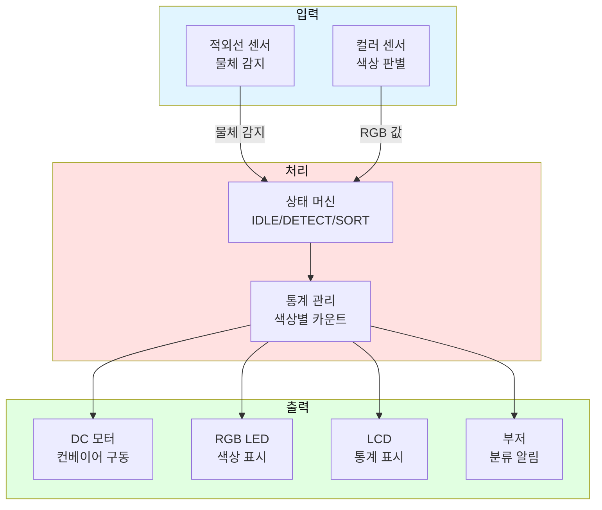

# 실전 예시 03: 색상 분류 컨베이어 시스템

## 📋 프로젝트 개요

**목표**: 컬러 센서로 물체 색상을 판별하고, DC 모터로 컨베이어를 제어하여 색상별로 분류

**난이도**: ⭐⭐⭐⭐☆

**학습 목표**:
- 컬러 센서 정밀 제어
- DC 모터 속도 제어
- 상태 머신 구현
- 통계 데이터 관리

---

## 🎯 시스템 구조도



---

## 📦 부품 리스트

| 번호 | 부품명 | 수량 | 사양 | 용도 |
|------|--------|------|------|------|
| 1 | 아두이노 우노 | 1 | 5V | 메인 컨트롤러 |
| 2 | 적외선 센서 | 1 | 5V | 물체 감지 |
| 3 | TCS34725 컬러 센서 | 1 | 3.3V, I2C | 색상 판별 |
| 4 | DC 모터 | 1 | 12V | 컨베이어 구동 |
| 5 | L298N 드라이버 | 1 | 5-35V | 모터 제어 |
| 6 | NeoPixel LED | 3 | 5V | 색상 표시 |
| 7 | LCD 1602 (I2C) | 1 | 5V | 통계 표시 |
| 8 | 부저 | 1 | 5V | 알림 |
| 9 | 9V 2A 어댑터 | 1 | 9-12V | 모터 전원 |
| 10 | 브레드보드 | 1 | - | 회로 구성 |
| 11 | 점퍼 와이어 | 30 | - | 연결 |

**예상 비용**: 약 45,000원

---

## 🔌 핀아웃 연결

| 아두이노 핀 | 연결 부품 | 신호 타입 |
|------------|----------|----------|
| A0 | 적외선 센서 OUT | 디지털 입력 |
| A4 (SDA) | 컬러 센서 SDA | I2C |
| A4 (SDA) | LCD SDA | I2C |
| A5 (SCL) | 컬러 센서 SCL | I2C |
| A5 (SCL) | LCD SCL | I2C |
| D4 | 부저 | PWM |
| D6 | NeoPixel DIN | 1-Wire |
| D8 | L298N IN1 (방향) | 디지털 출력 |
| D9 | L298N ENA (속도) | PWM |
| 5V | 센서/LED 전원 | 전원 |
| 3.3V | 컬러 센서 VIN | 전원 |
| GND | 공통 접지 | 접지 |

---

## 💻 핵심 코드 (요약)

```cpp
#include <Wire.h>
#include <Adafruit_TCS34725.h>
#include <Adafruit_NeoPixel.h>
#include <LiquidCrystal_I2C.h>

// 핀 정의
#define PIN_IR A0
#define PIN_MOTOR_DIR 8
#define PIN_MOTOR_SPEED 9
#define PIN_NEOPIXEL 6
#define PIN_BUZZER 4

// 상태 정의
enum State { IDLE, DETECTING, SORTING, COMPLETE };
State currentState = IDLE;

// 통계
int redCount = 0, greenCount = 0, blueCount = 0;

void setup() {
  // 초기화 코드
}

void loop() {
  switch(currentState) {
    case IDLE:
      // 물체 대기
      if (digitalRead(PIN_IR) == LOW) {
        currentState = DETECTING;
      }
      break;
      
    case DETECTING:
      // 색상 읽기
      String color = readColor();
      currentState = SORTING;
      break;
      
    case SORTING:
      // 모터 작동 (3초)
      runMotor(150);
      delay(3000);
      stopMotor();
      currentState = COMPLETE;
      break;
      
    case COMPLETE:
      // 통계 업데이트
      updateStats();
      currentState = IDLE;
      break;
  }
}
```

---

**작성일**: 2026-01-27  
**난이도**: ⭐⭐⭐⭐☆
