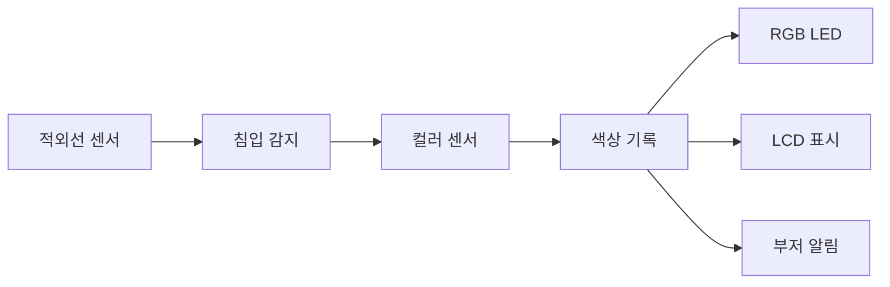
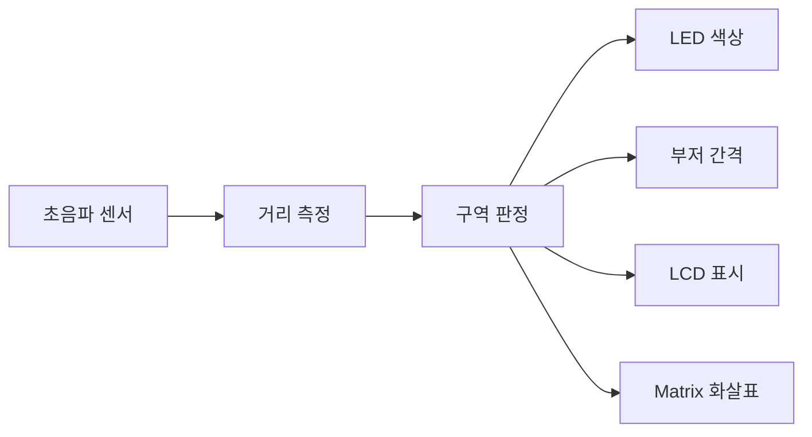
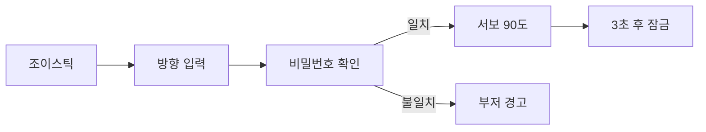
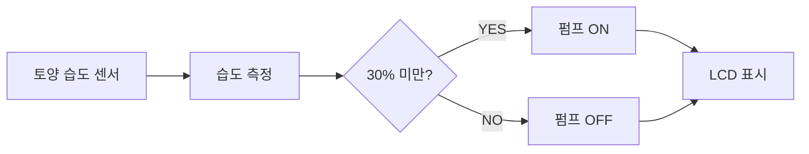
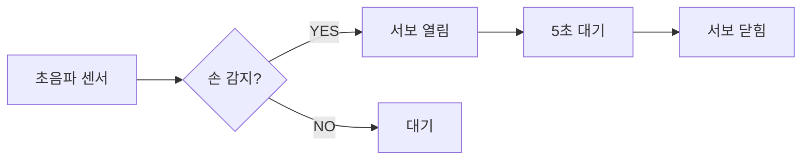
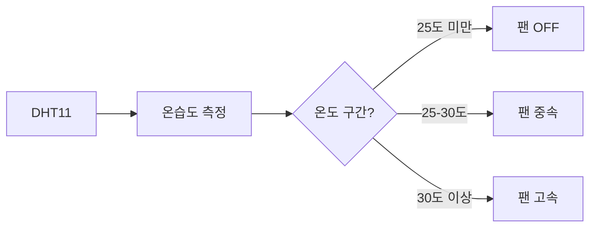
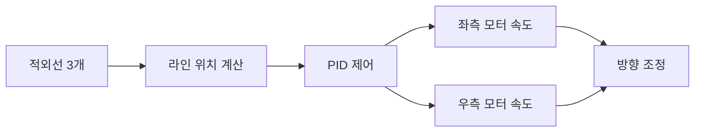
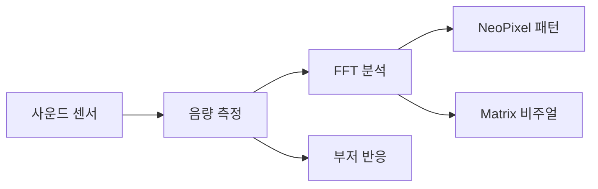
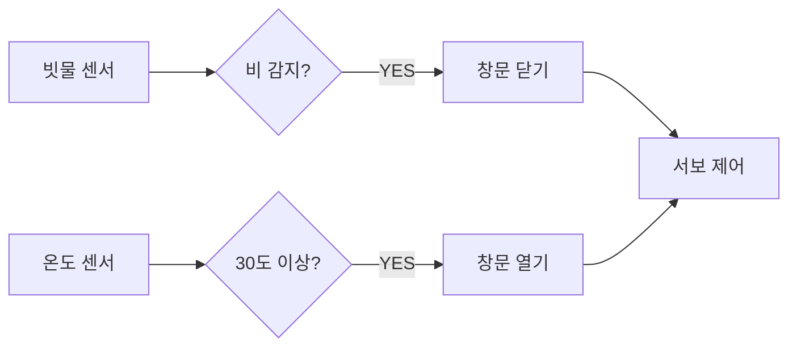

# 실전 통합 예시 목록

## 📚 10가지 실전 프로젝트

---

### 포함된 내용 (각 프로젝트마다)

1. **학습 목표** - 3-4가지 핵심 학습 포인트
2. **시스템 구조도** - Mermaid 다이어그램으로 데이터 흐름 시각화
3. **부품 리스트** - 표 형식으로 부품/수량/용도 정리
4. **동작 순서** - 단계별 동작 흐름 (1→2→3→4)
5. **핵심 알고리즘** - 3-4가지 주요 알고리즘 설명

### 10가지 프로젝트 요약

| 번호 | 프로젝트명 | 난이도 | 핵심 센서 | 핵심 액추에이터 |
|------|-----------|--------|----------|----------------|
| 01 | 범인 알리미 | ⭐⭐⭐☆☆ | 적외선 + 컬러 | RGB LED, LCD |
| 02 | 스마트 주차 관리 | ⭐⭐☆☆☆ | 초음파 | LED, Matrix |
| 03 | 색상 분류 컨베이어 | ⭐⭐⭐⭐☆ | 적외선 + 컬러 | DC 모터 |
| 04 | 스마트 도어락 | ⭐⭐⭐☆☆ | 조이스틱 | 서보모터 |
| 05 | 자동 급수 시스템 | ⭐⭐☆☆☆ | 토양 습도 | 워터 펌프 |
| 06 | 스마트 쓰레기통 | ⭐⭐⭐☆☆ | 초음파 x2 | 서보모터 |
| 07 | 온도 모니터링 | ⭐⭐☆☆☆ | DHT11 | DC 팬 |
| 08 | 라인 트레이서 | ⭐⭐⭐⭐☆ | 적외선 x3 | DC 모터 x2 |
| 09 | 음악 반응 조명 | ⭐⭐⭐☆☆ | 사운드 센서 | NeoPixel |
| 10 | 스마트 창문 제어 | ⭐⭐⭐☆☆ | 빗물 + DHT11 | 서보모터 |

### 특징

✅ **소스 코드 제외** - 구조와 개념에 집중  
✅ **시각화 중심** - Mermaid 다이어그램으로 이해 쉽게  
✅ **간결한 정리** - 각 프로젝트 1페이지 분량  
✅ **학습 순서 제공** - 난이도별 학습 경로  
✅ **센서/액추에이터별 분류** - 관심 분야별 검색 용이

이제 학생들이 이 목록을 보고 원하는 프로젝트를 선택하여 학습할 수 있습니다! 🎉

## 01. 범인 알리미 시스템 ⭐⭐⭐☆☆

### 학습 목표
- 센서 조합 사용 (적외선 + 컬러)
- 데이터 저장 및 분석
- 알림 시스템 구현

### 시스템 구조도

### 부품 리스트
| 부품 | 수량 | 용도 |
|------|------|------|
| 아두이노 우노 | 1 | 제어 |
| 적외선 센서 | 1 | 침입 감지 |
| TCS34725 컬러 센서 | 1 | 색상 기록 |
| NeoPixel LED | 3 | 색상 표시 |
| LCD 1602 | 1 | 정보 표시 |
| 부저 | 1 | 경보음 |

### 동작 순서
1. 대기 → 2. 침입 감지 → 3. 색상 캡처 → 4. 데이터 저장 → 5. 결과 표시

### 핵심 알고리즘
- 상태 변화 감지 (HIGH → LOW)
- RGB 값 분석 및 색상 판별
- 배열 기반 데이터 저장 (최대 10개)

---

## 02. 스마트 주차 관리 ⭐⭐☆☆☆

### 학습 목표
- 초음파 센서 거리 측정
- 단계별 피드백 제공
- 실시간 거리 표시

### 시스템 구조도

### 부품 리스트
| 부품 | 수량 | 용도 |
|------|------|------|
| 아두이노 우노 | 1 | 제어 |
| HC-SR04 초음파 | 1 | 거리 측정 |
| NeoPixel LED | 8 | 거리 표시 |
| 8x8 Matrix | 1 | 화살표 |
| LCD 1602 | 1 | 거리 숫자 |
| 부저 | 1 | 경고음 |

### 동작 순서
1. 거리 측정 → 2. 구역 판정 (안전/주의/위험) → 3. LED 개수 변경 → 4. 부저 간격 조절

### 핵심 알고리즘
- pulseIn으로 거리 계산 (duration/58)
- map 함수로 LED 개수 매핑
- 구역별 부저 간격 제어 (2초/1초/0.3초)

---

## 03. 색상 분류 컨베이어 ⭐⭐⭐⭐☆

### 학습 목표
- 컬러 센서 정밀 제어
- DC 모터 속도 제어
- 상태 머신 구현

### 시스템 구조도

### 부품 리스트
| 부품 | 수량 | 용도 |
|------|------|------|
| 아두이노 우노 | 1 | 제어 |
| 적외선 센서 | 1 | 물체 감지 |
| TCS34725 | 1 | 색상 판별 |
| DC 모터 + L298N | 1 | 컨베이어 |
| NeoPixel LED | 3 | 색상 표시 |
| LCD 1602 | 1 | 통계 |

### 동작 순서
1. IDLE → 2. DETECTING → 3. SORTING → 4. COMPLETE → 1. IDLE

### 핵심 알고리즘
- 상태 머신 (enum State)
- 색상별 카운터 (redCount, greenCount, blueCount)
- PWM 모터 속도 제어 (0-255)

---

## 04. 스마트 도어락 ⭐⭐⭐☆☆

### 학습 목표
- 조이스틱 입력 처리
- 비밀번호 검증 로직
- 서보모터 각도 제어

### 시스템 구조도

### 부품 리스트
| 부품 | 수량 | 용도 |
|------|------|------|
| 아두이노 우노 | 1 | 제어 |
| 조이스틱 모듈 | 1 | 비밀번호 입력 |
| 서보모터 SG90 | 1 | 잠금장치 |
| LCD 1602 | 1 | 피드백 |
| 부저 | 1 | 알림 |

### 동작 순서
1. 조이스틱 입력 → 2. 비밀번호 비교 → 3. 일치 시 서보 회전 → 4. 3초 후 자동 잠금

### 핵심 알고리즘
- analogRead로 조이스틱 방향 판별
- 배열 비교 (입력값 vs 저장된 비밀번호)
- 서보 각도 제어 (0도=잠금, 90도=해제)

---

## 05. 자동 급수 시스템 ⭐⭐☆☆☆

### 학습 목표
- 아날로그 센서 값 읽기
- 임계값 기반 자동 제어
- 릴레이 모듈 사용

### 시스템 구조도

### 부품 리스트
| 부품 | 수량 | 용도 |
|------|------|------|
| 아두이노 우노 | 1 | 제어 |
| 토양 습도 센서 | 1 | 수분 측정 |
| 워터 펌프 | 1 | 물 공급 |
| 릴레이 모듈 | 1 | 펌프 제어 |
| LCD 1602 | 1 | 습도 표시 |

### 동작 순서
1. 습도 측정 → 2. 임계값 비교 → 3. 펌프 ON/OFF → 4. LCD 업데이트

### 핵심 알고리즘
- analogRead로 습도 값 (0-1023)
- map 함수로 퍼센트 변환 (0-100%)
- 임계값 비교 (30% 미만 시 급수)

---

## 06. 스마트 쓰레기통 ⭐⭐⭐☆☆

### 학습 목표
- 초음파 센서 근접 감지
- 서보모터 자동 제어
- 용량 측정 알고리즘

### 시스템 구조도

### 부품 리스트
| 부품 | 수량 | 용도 |
|------|------|------|
| 아두이노 우노 | 1 | 제어 |
| HC-SR04 초음파 | 2 | 손 감지 + 용량 |
| 서보모터 SG90 | 1 | 뚜껑 개폐 |
| LCD 1602 | 1 | 용량 표시 |
| 부저 | 1 | 만원 알림 |

### 동작 순서
1. 손 감지 (20cm 이내) → 2. 뚜껑 열림 (90도) → 3. 5초 대기 → 4. 뚜껑 닫힘 (0도)

### 핵심 알고리즘
- 2개 초음파 센서 (상단: 손 감지, 내부: 용량 측정)
- 서보 각도 제어 (0도 ↔ 90도)
- 용량 퍼센트 계산 (거리 기반)

---

## 07. 온도 모니터링 시스템 ⭐⭐☆☆☆

### 학습 목표
- DHT11 센서 사용
- 온도별 팬 속도 제어
- 그래프 표시 (LCD)

### 시스템 구조도

### 부품 리스트
| 부품 | 수량 | 용도 |
|------|------|------|
| 아두이노 우노 | 1 | 제어 |
| DHT11 센서 | 1 | 온습도 측정 |
| DC 팬 + 트랜지스터 | 1 | 냉각 |
| LCD 1602 | 1 | 온도 표시 |
| NeoPixel LED | 3 | 온도 색상 |

### 동작 순서
1. 온습도 측정 → 2. 온도 구간 판정 → 3. 팬 속도 조절 → 4. LCD 그래프 표시

### 핵심 알고리즘
- DHT.read() 함수로 온습도 읽기
- map 함수로 팬 속도 매핑 (0-255)
- LCD 커스텀 문자로 그래프 표시

---

## 08. 라인 트레이서 로봇 ⭐⭐⭐⭐☆

### 학습 목표
- 다중 센서 입력 처리
- 2개 모터 독립 제어
- PID 제어 알고리즘

### 시스템 구조도

### 부품 리스트
| 부품 | 수량 | 용도 |
|------|------|------|
| 아두이노 우노 | 1 | 제어 |
| 적외선 센서 | 3 | 라인 감지 |
| DC 모터 | 2 | 좌우 바퀴 |
| L298N 드라이버 | 1 | 모터 제어 |
| 배터리 | 1 | 전원 |

### 동작 순서
1. 3개 센서 읽기 → 2. 라인 위치 계산 → 3. PID 오차 계산 → 4. 모터 속도 조정

### 핵심 알고리즘
- 센서 조합으로 위치 판별 (왼쪽/중앙/오른쪽)
- PID 제어: error = setpoint - position
- 모터 속도 = baseSpeed ± correction

---

## 09. 음악 반응 조명 ⭐⭐⭐☆☆

### 학습 목표
- 아날로그 신호 실시간 처리
- LED 패턴 생성
- 주파수 분석 기초

### 시스템 구조도

### 부품 리스트
| 부품 | 수량 | 용도 |
|------|------|------|
| 아두이노 우노 | 1 | 제어 |
| 사운드 센서 | 1 | 음량 측정 |
| NeoPixel LED | 16 | 조명 효과 |
| 8x8 Matrix | 1 | 비주얼라이저 |

### 동작 순서
1. 음량 측정 → 2. 임계값 판정 → 3. LED 밝기/색상 변경 → 4. Matrix 패턴 표시

### 핵심 알고리즘
- analogRead로 음량 측정 (0-1023)
- map 함수로 LED 밝기 매핑
- 음량 구간별 색상 변경 (낮음=파랑, 중간=초록, 높음=빨강)

---

## 10. 스마트 창문 제어 ⭐⭐⭐☆☆

### 학습 목표
- 다중 센서 조합 판단
- 자동/수동 모드 전환
- 안전 로직 구현

### 시스템 구조도

### 부품 리스트
| 부품 | 수량 | 용도 |
|------|------|------|
| 아두이노 우노 | 1 | 제어 |
| 빗물 센서 | 1 | 비 감지 |
| DHT11 센서 | 1 | 온도 측정 |
| 서보모터 | 1 | 창문 개폐 |
| 버튼 | 2 | 수동 제어 |
| LCD 1602 | 1 | 상태 표시 |

### 동작 순서
1. 센서 값 읽기 → 2. 모드 확인 (자동/수동) → 3. 조건 판단 → 4. 서보 제어

### 핵심 알고리즘
- 우선순위: 빗물 > 온도
- 자동 모드: 센서 값 기반 제어
- 수동 모드: 버튼 입력 우선

---

## 🎯 난이도별 분류

### 초급 (⭐⭐☆☆☆)
- 02. 스마트 주차 관리
- 05. 자동 급수 시스템
- 07. 온도 모니터링 시스템

### 중급 (⭐⭐⭐☆☆)
- 01. 범인 알리미 시스템
- 04. 스마트 도어락
- 06. 스마트 쓰레기통
- 09. 음악 반응 조명
- 10. 스마트 창문 제어

### 고급 (⭐⭐⭐⭐☆)
- 03. 색상 분류 컨베이어
- 08. 라인 트레이서 로봇

---

## 📊 센서별 프로젝트

### 적외선 센서
- 01. 범인 알리미
- 08. 라인 트레이서

### 초음파 센서
- 02. 스마트 주차 관리
- 06. 스마트 쓰레기통

### 컬러 센서
- 01. 범인 알리미
- 03. 색상 분류 컨베이어

### 온습도 센서
- 05. 자동 급수 시스템
- 07. 온도 모니터링
- 10. 스마트 창문 제어

---

## 🔧 액추에이터별 프로젝트

### DC 모터
- 03. 색상 분류 컨베이어
- 08. 라인 트레이서

### 서보 모터
- 04. 스마트 도어락
- 06. 스마트 쓰레기통
- 10. 스마트 창문 제어

### RGB LED
- 01. 범인 알리미
- 02. 스마트 주차 관리
- 09. 음악 반응 조명

### LCD 1602
- 모든 프로젝트에 사용 가능

---

## 📈 학습 순서 추천

### 1단계: 기본 센서 익히기
1. 02. 스마트 주차 관리 (초음파)
2. 07. 온도 모니터링 (온습도)

### 2단계: 센서 조합
3. 01. 범인 알리미 (적외선 + 컬러)
4. 06. 스마트 쓰레기통 (초음파 + 서보)

### 3단계: 모터 제어
5. 04. 스마트 도어락 (서보)
6. 03. 색상 분류 컨베이어 (DC 모터)

### 4단계: 고급 프로젝트
7. 08. 라인 트레이서 (PID 제어)
8. 09. 음악 반응 조명 (실시간 처리)

### 5단계: 통합 시스템
9. 05. 자동 급수 시스템
10. 10. 스마트 창문 제어

---

**작성일**: 2026-01-27  
**총 프로젝트 수**: 10개  
**예상 학습 기간**: 4-6주

