# 🔄 역방향 학습 교육 철학

> **"완성품을 먼저 경험하고, 분해하고, 원리를 파악하고, 재창조한다"**

---

## 📌 역방향 학습이란?

### 전통적 학습 vs 역방향 학습

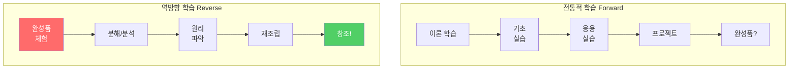

### 왜 역방향 학습인가?

| 측면 | 순방향 학습 | 역방향 학습 |
|------|-----------|-----------|
| **동기부여** | ❓ "왜 배워야 하지?" | ✅ "이걸 만들 수 있구나!" |
| **맥락 이해** | 🔹 부분 → 전체 (어려움) | 🔹 전체 → 부분 (자연스러움) |
| **학습 속도** | 🐌 느림 (기초부터) | 🚀 빠름 (목표 명확) |
| **응용력** | ⚠️ 제한적 | ✅ 창의적 |
| **실패 대응** | 😰 좌절감 | 💪 학습 기회 |

---

## 🎯 교육 철학 3원칙

### 원칙 1: 경험 우선 (Experience First)

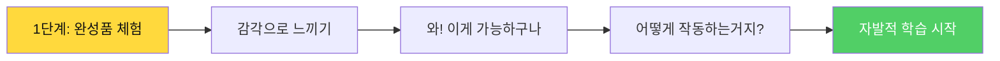

**핵심 개념:**
- 이론보다 **경험**이 먼저
- 설명보다 **시연**이 먼저
- 지식보다 **호기심**이 먼저

**실천 방법:**
1. Day 1 첫 시간: 강사가 완성된 시스템 시연
2. 학생들이 직접 조작해보기
3. "어떻게 만들었을까?" 질문 유도

---

### 원칙 2: 분해와 재조립 (Decomposition & Reconstruction)

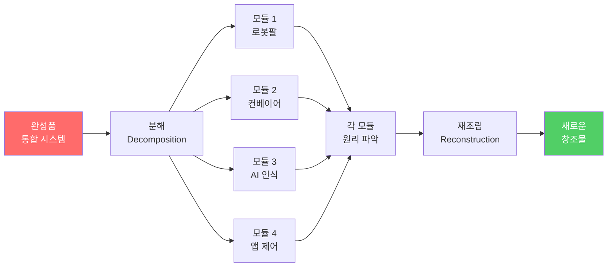

**핵심 개념:**
- 복잡한 시스템을 **작은 모듈**로 분해
- 각 모듈의 **원리** 이해
- 다른 방식으로 **재조립**

**실천 방법:**
1. 완성품을 물리적/논리적으로 분해
2. 각 부품의 역할 파악
3. 다이어그램으로 관계 시각화
4. 새로운 방식으로 재조립

---

### 원칙 3: 실패 주도 학습 (Failure-Driven Learning)

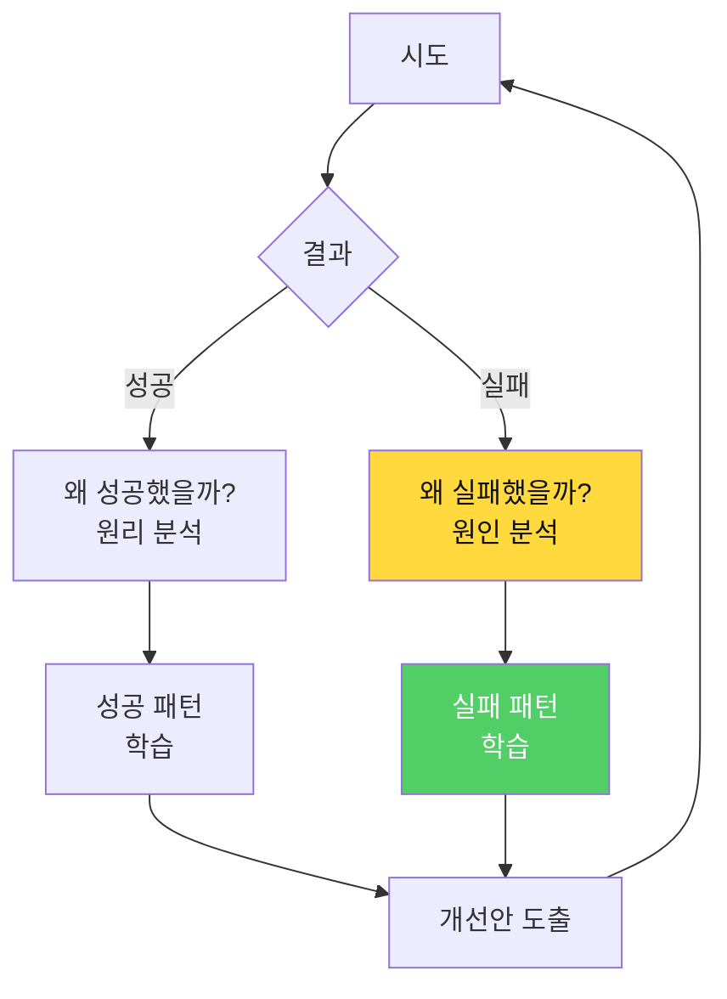

**핵심 개념:**
- 실패는 **학습의 기회**
- 오류 메시지는 **선생님**
- 시행착오는 **필수 과정**

**실천 방법:**
1. "실패 로그" 작성 권장
2. 오류 원인 분석 시간 제공
3. 실패 사례 공유 세션

---

## 🛠️ 메이커 교육 방식

### 메이커 문화의 핵심

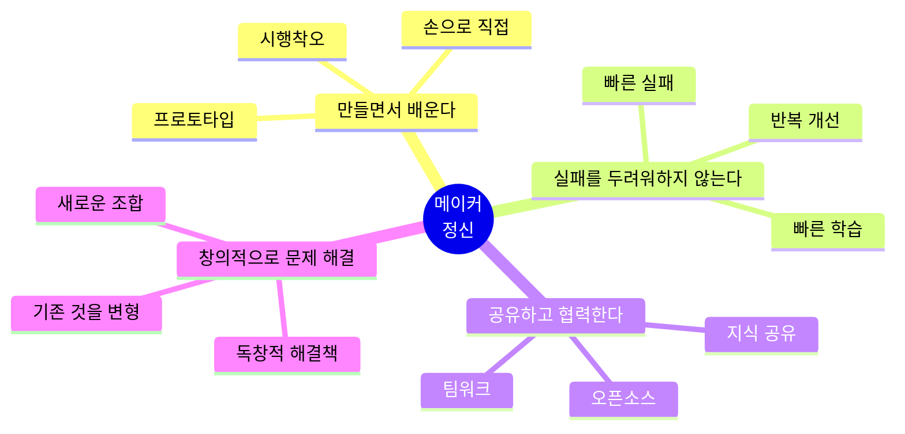

### 메이커 교육 4단계

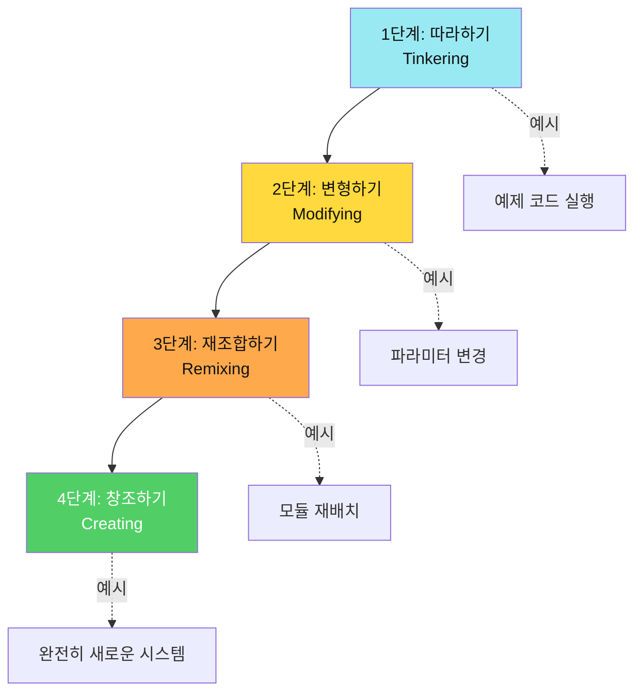

---

## 📊 알고리즘적 사고 훈련

### 알고리즘 중심 학습 프로세스

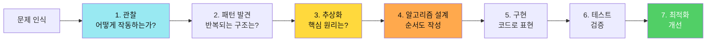

### 알고리즘 표현 도구

| 도구 | 용도 | 사용 시기 |
|------|------|----------|
| **플로우차트** | 제어 흐름 | 조건문, 반복문 설계 시 |
| **시퀀스 다이어그램** | 통신 과정 | 블루투스, 센서 연동 시 |
| **상태 머신** | 시스템 상태 | 복잡한 동작 제어 시 |
| **블록 다이어그램** | 시스템 구조 | 전체 아키텍처 설계 시 |
| **타이밍 다이어그램** | 시간 관계 | 동기화 문제 해결 시 |

---

## 🎓 학습 목표 체계

### Bloom의 인지 단계별 목표

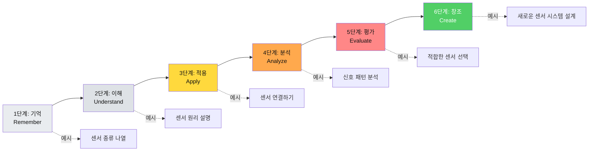

### 이 교육에서의 목표 분포

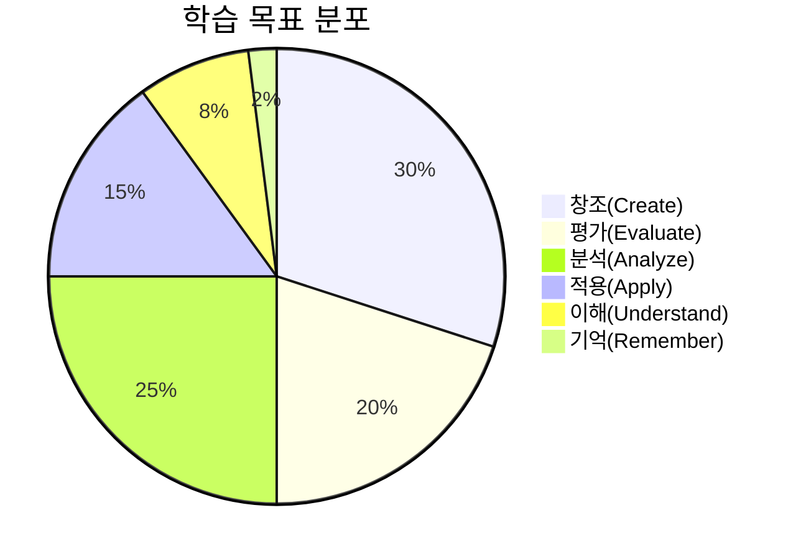

**핵심:**
- 고차원 사고(분석/평가/창조)에 **75%** 집중
- 단순 암기는 **최소화**

---

## 🔬 역방향 학습의 과학적 근거

### 구성주의 학습 이론

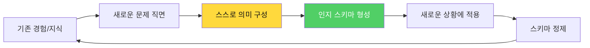

**Piaget의 인지 발달 이론:**
- **동화(Assimilation)**: 기존 스키마에 새 정보 통합
- **조절(Accommodation)**: 스키마 자체를 수정

**역방향 학습이 유리한 이유:**
1. 완성품 체험 → 명확한 **스키마 형성**
2. 분해/분석 → **동화** 과정
3. 재조립 → **조절** 과정

### 프로젝트 기반 학습 (PBL)

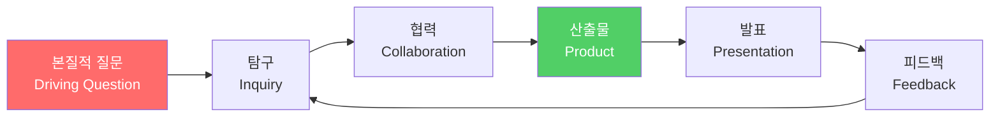

**본 교육의 본질적 질문:**
> "AI는 어떻게 물체를 인식하고, 로봇팔은 어떻게 제어되며,  
> 이를 어떻게 통합하여 스마트 팩토리를 만들 수 있는가?"

---

## 💡 교수자를 위한 가이드

### 역방향 학습 실천 전략

#### 1단계: 동기 부여 (Motivation)

```
✅ DO:
- 완성된 시스템의 '와우' 효과 극대화
- 실생활 적용 사례 강조
- 학생들이 직접 조작할 기회 제공

❌ DON'T:
- "이론부터 알아야 해"라고 말하지 않기
- 너무 많은 사전 지식 요구
- 완벽주의 강요
```

#### 2단계: 분해 유도 (Decomposition)

```
✅ DO:
- "어떤 부품들로 구성되어 있을까?" 질문
- 물리적 분해와 논리적 분해 병행
- 다이어그램 그리기 권장

❌ DON'T:
- 정답을 바로 알려주기
- 한 가지 방법만 제시
- 학생의 분석 과정 가로막기
```

#### 3단계: 원리 탐구 (Exploration)

```
✅ DO:
- 실험과 관찰 중심
- "왜?"라는 질문 반복
- 실패 사례도 공유

❌ DON'T:
- 이론 강의 장시간 진행
- PPT만 보여주기
- 학생 질문 무시
```

#### 4단계: 재창조 지원 (Creation)

```
✅ DO:
- 다양한 해결책 인정
- 창의적 시도 격려
- 실패에서 배우기 강조

❌ DON'T:
- 모범답안 강요
- 시간 압박 과도하게
- 결과만 평가
```

---

## 📚 관련 교육 이론

### 1. Backward Design (역방향 설계)

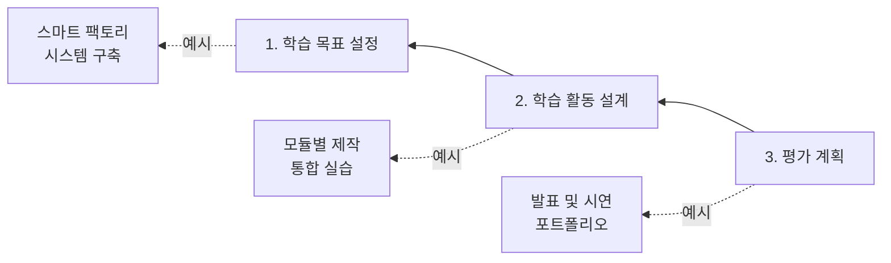

### 2. 5E 학습 모델

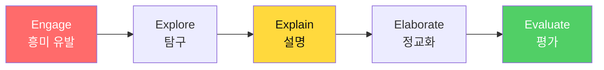

### 3. Kolb의 경험학습 순환

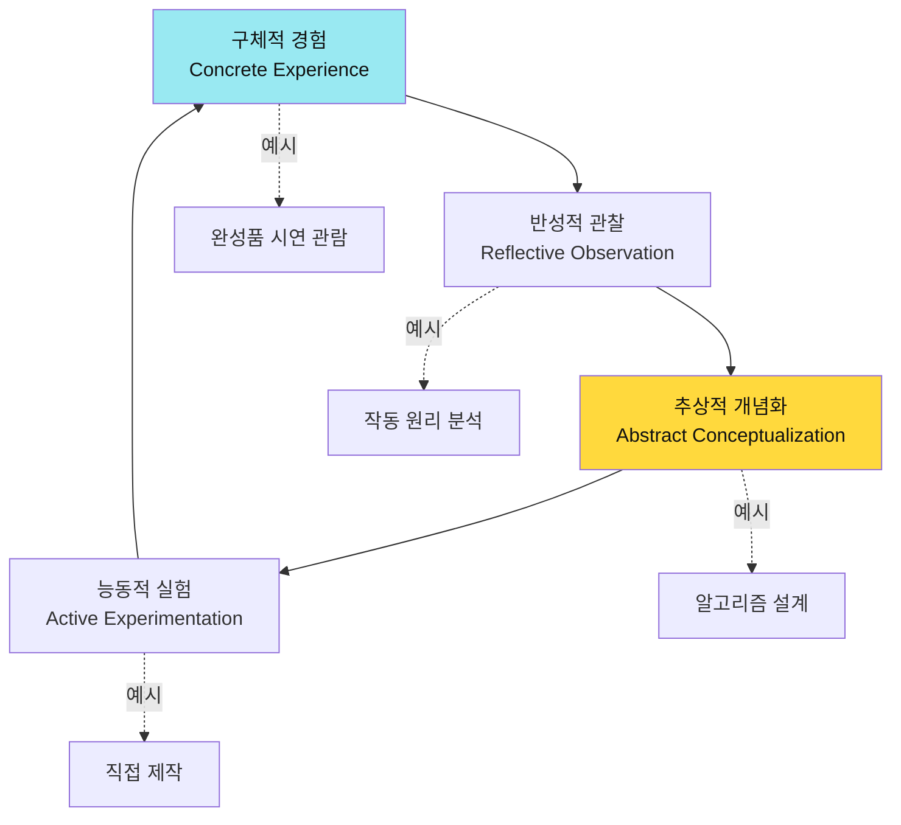

---

## ⚙️ 실천 체크리스트

### 교수자용 체크리스트

#### 수업 준비
- [ ] 완성품 시연 준비 완료
- [ ] 분해 가능한 예제 준비
- [ ] 다이어그램 템플릿 제공
- [ ] 오픈엔디드 질문 목록 작성
- [ ] 다양한 해결책 예시 준비

#### 수업 중
- [ ] 학생 주도 탐구 시간 충분히 제공
- [ ] 실패를 격려하는 분위기 조성
- [ ] 개별/팀별 진도 차이 존중
- [ ] 시각적 자료(다이어그램) 적극 활용
- [ ] 학생 간 지식 공유 촉진

#### 수업 후
- [ ] 학생 포트폴리오 검토
- [ ] 실패 사례 분석 및 피드백
- [ ] 다음 차시 난이도 조정
- [ ] 우수 사례 공유 준비

### 학습자용 체크리스트

#### 학습 전
- [ ] 오늘의 학습 목표 확인
- [ ] 기존 지식 떠올리기
- [ ] 궁금한 점 메모하기

#### 학습 중
- [ ] 적극적으로 질문하기
- [ ] 다이어그램으로 정리하기
- [ ] 팀원과 아이디어 공유
- [ ] 실패해도 좌절하지 않기
- [ ] 다양한 방법 시도하기

#### 학습 후
- [ ] 오늘 배운 핵심 원리 정리
- [ ] 어려웠던 점 기록
- [ ] 해결 방법 문서화
- [ ] 다음 학습 계획 수립

---

## 🎯 성공 지표

### 학습 성과 측정

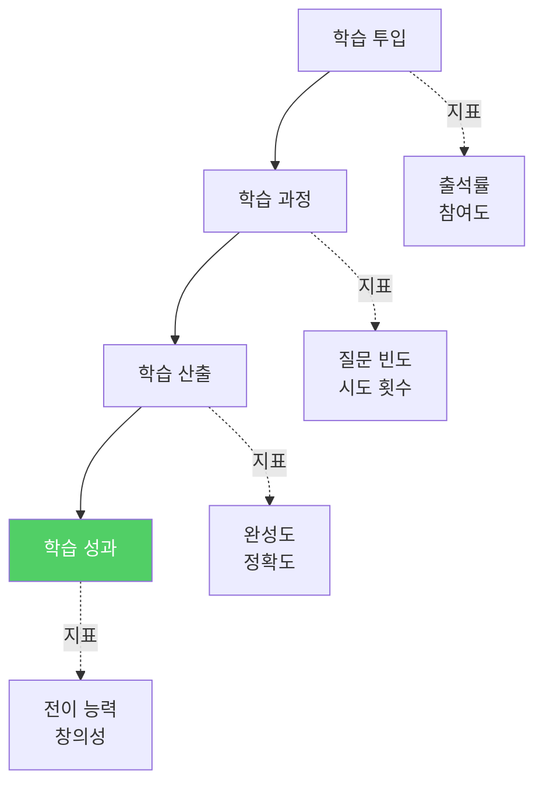

### 정량적 지표

| 지표 | 측정 방법 | 목표 |
|------|----------|------|
| **시스템 완성도** | 체크리스트 | 80% 이상 |
| **알고리즘 이해도** | 다이어그램 평가 | 평균 B+ |
| **창의성 점수** | 독창성 평가 | 70점 이상 |
| **협업 능력** | 동료 평가 | 4.0/5.0 |

### 정성적 지표

- ✅ 스스로 문제를 발견하고 해결하는가?
- ✅ 원리를 다른 사람에게 설명할 수 있는가?
- ✅ 배운 내용을 새로운 상황에 적용하는가?
- ✅ 실패를 학습 기회로 활용하는가?

---

## 🚀 다음 단계

이 교육 철학을 바탕으로:

1. **교육 커리큘럼 완전판** 참고
   - Day 1-3 구체적 실습 내용
   - 시간별 활동 계획

2. **시스템 아키텍처 가이드** 참고
   - 기술적 세부사항
   - 알고리즘 상세 설계

3. **평가 루브릭** 활용
   - 학습 성과 측정
   - 피드백 제공

---

**역방향 학습의 핵심을 기억하세요:**

```
완성품 → 분해 → 원리 → 재창조
Experience → Decompose → Understand → Create
```

**메이커 정신을 잊지 마세요:**

```
만들면서 배우고, 실패에서 배우고, 공유하며 성장한다
Make → Fail → Learn → Share → Grow
```

---

**Last Updated**: 2026-01-25  
**Version**: 1.0 (역방향 학습 교육 철학)  
**제작**: Smart Factory Education Team
