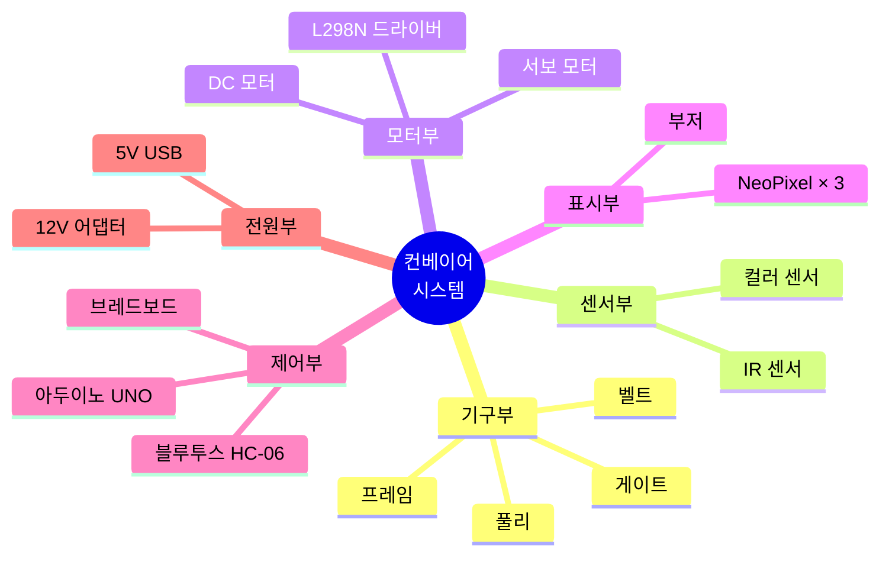
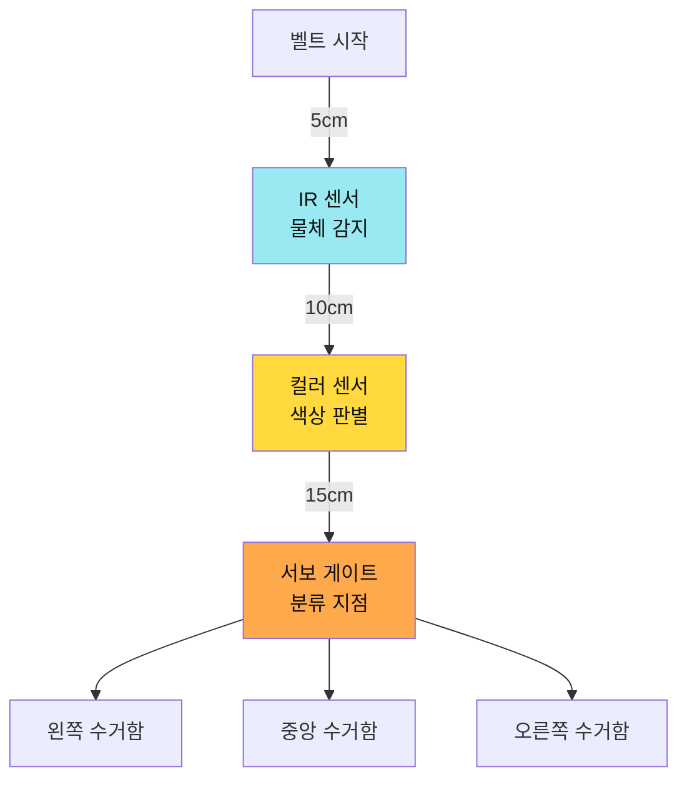
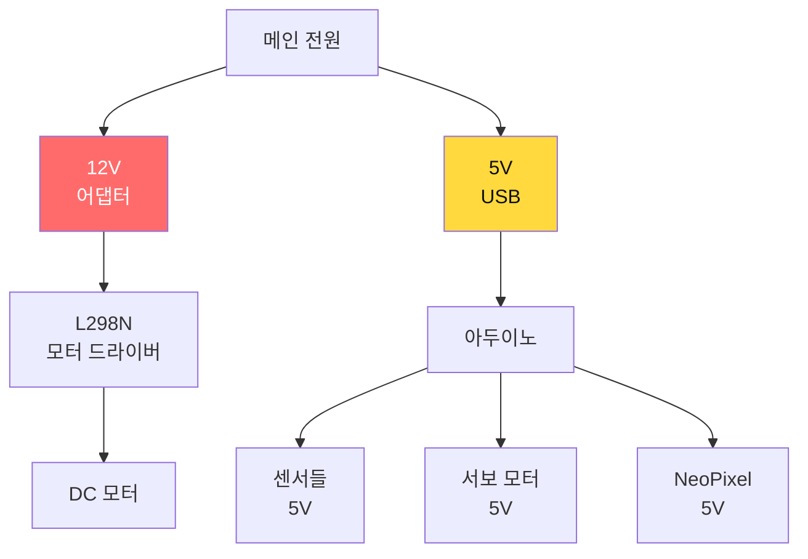
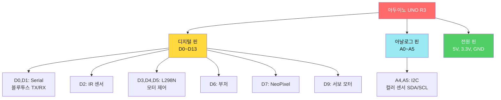
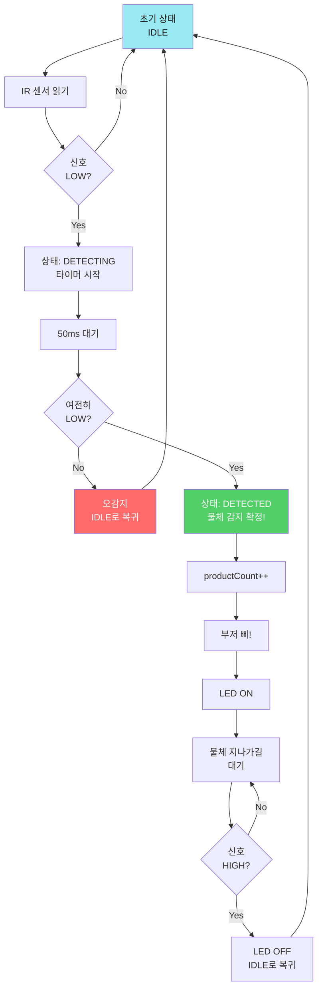
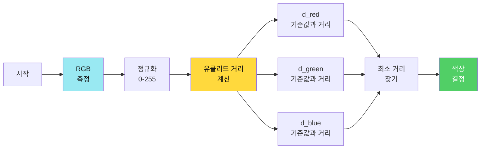
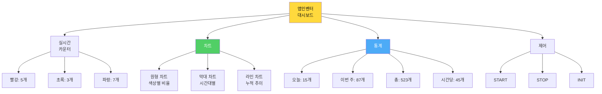

# 📅 Day 2: 컨베이어 자동 분류 시스템 🏭 (8시간)

> **"아두이노 끝판왕: 외형 제작 → 핀아웃 연결 → 개별 테스트 → 통합 → 원격제어"**  
> 하드웨어부터 차근차근, 완벽한 스마트 팩토리 구축

---

## 🎯 Day 2 학습 목표

### 최종 목표: 아두이노 마스터


### 학습 성과 (아두이노 끝판왕 달성!)

- ✅ **하드웨어 제작**: 컨베이어 시스템 완전 조립
- ✅ **핀아웃 마스터**: 12개 핀 완벽 매핑 및 개별 테스트
- ✅ **센서 제어**: IR, 컬러 센서 실전 활용
- ✅ **모터 제어**: DC 모터 PWM, 서보 정밀 제어
- ✅ **핵심 알고리즘**: 색상 판별 (최대값 비교 + 유클리드 거리)
- ✅ **Serial 통신**: 실시간 명령 처리 (millis 비차단)
- ✅ **Bluetooth 원격제어**: 앱인벤터 연동
- ✅ **실전 대시보드**: 일일량, 통합량, 차트 시각화

---

## ⏰ Day 2 시간표 (8시간) - 완전 재구성

| 교시 | 시간 | 활동 | 학습 내용 | 산출물 |
|------|------|------|----------|--------|
| **1교시** | 1h | 🔧 외형 제작 | 컨베이어 조립 + 센서 배치 | 완성된 하드웨어 |
| **2교시** | 1h | 📌 핀아웃 연결 | 12개 핀 배선 + 체크리스트 | 배선 완료 |
| **3교시** | 1.5h | 🧪 개별 테스트 | 센서 5종 × 모터 2종 테스트 | 각 부품 동작 확인 |
| **4교시** | 1.5h | 🔄 통합 자동화 | 전체 시스템 통합 (자동 분류) | 자동 분류 시스템 |
| **5교시** | 1h | 💻 Serial 제어 | PC → 아두이노 실시간 명령 | start/stop/init |
| **6교시** | 1h | 📡 Bluetooth 제어 | 스마트폰 → 아두이노 무선 제어 | 원격 제어 |
| **7교시** | 1h | 📊 대시보드 앱 | 일일량, 통합량, 차트 (앱인벤터) | 실시간 모니터링 앱 |

---

## 1교시: 🔧 외형 제작 - 컨베이어 시스템 조립 (1시간)

> **"하드웨어가 튼튼해야 프로그램도 안정적이다!"**

### 📦 부품 확인 (5분)

**필수 체크리스트**:

| 카테고리 | 부품명 | 수량 | 확인 |
|---------|--------|------|------|
| **기구** | 컨베이어 프레임 | 1세트 | □ |
| | 벨트 (고무 또는 천) | 1개 | □ |
| | 풀리 (대형/소형) | 2개 | □ |
| | 분류 게이트 구조물 | 1개 | □ |
| **제어보드** | 아두이노 UNO R3 | 1개 | □ |
| | 브레드보드 830홀 | 1개 | □ |
| **센서** | 적외선 센서 (IR) | 1개 | □ |
| | TCS34725 컬러 센서 | 1개 | □ |
| **액추에이터** | DC 모터 12V | 1개 | □ |
| | L298N 모터 드라이버 | 1개 | □ |
| | SG90 서보 모터 | 1개 | □ |
| | NeoPixel LED (WS2812B) | 3개 | □ |
| | 부저 (Buzzer) | 1개 | □ |
| **통신** | HC-06 블루투스 모듈 | 1개 | □ |
| **전원** | 12V 2A 어댑터 | 1개 | □ |
| | 5V 전원 (USB 또는 별도) | 1개 | □ |
| **배선** | 점퍼 와이어 M-M | 20개 | □ |
| | 점퍼 와이어 M-F | 20개 | □ |



---

### 🛠️ 조립 프로세스 (55분)

#### Step 1: 프레임 및 벨트 조립 (20분)


**상세 단계**:

1. **프레임 조립** (5분)
   - 컨베이어 베이스 프레임 조립
   - 수평 확인 (물체가 잘 굴러가는지)
   - 체크: □ 프레임이 흔들리지 않는가?

2. **풀리 장착** (5분)
   - 대형 풀리: 모터 축에 연결
   - 소형 풀리: 반대편 끝에 장착
   - 체크: □ 풀리가 자유롭게 회전하는가?

3. **벨트 연결** (5분)
   - 벨트를 풀리 2개에 걸기
   - 장력 조절 (너무 느슨하거나 팽팽하지 않게)
   - 체크: □ 손으로 돌렸을 때 부드럽게 회전하는가?

4. **DC 모터 고정** (5분)
   - DC 모터를 대형 풀리에 연결
   - 브래킷으로 단단히 고정
   - 체크: □ 모터가 흔들리지 않는가?

**🎯 목표**: 손으로 돌렸을 때 부드럽게 회전하는 컨베이어 벨트

---

#### Step 2: 센서 및 게이트 배치 (15분)



**센서 배치 가이드**:

| 센서 | 위치 | 높이 | 각도 | 목적 |
|------|------|------|------|------|
| **IR 센서** | 벨트 시작 후 5cm | 벨트 위 2cm | 수직 하향 | 물체 감지 |
| **컬러 센서** | IR 후 10cm | 벨트 위 1cm | 수직 하향 | 색상 측정 |
| **서보 게이트** | 컬러 센서 후 15cm | 벨트 높이 | - | 분류 동작 |
| **NeoPixel** | 게이트 옆 | 눈에 보이는 곳 | - | 색상 표시 |

**실제 배치 사진 촬영**:
- □ IR 센서가 물체를 감지할 수 있는 위치인가?
- □ 컬러 센서가 벨트 위 물체를 정확히 볼 수 있는가?
- □ 서보 게이트가 3방향 분류를 할 수 있는가?

---

#### Step 3: 전원 시스템 구성 (10분)



**전원 연결 순서**:
1. **12V 전원** → L298N 모터 드라이버
2. **5V USB** → 아두이노 UNO
3. **아두이노 5V 핀** → 센서/서보/LED 공통 VCC
4. **GND 공통 연결** (아두이노 - L298N - 12V 어댑터)

**⚠️ 주의사항**:
- 12V와 5V 절대 혼선 금지!
- GND는 반드시 공통 연결 (아두이노 - L298N)
- 전원 투입 전 배선 재확인

---

#### Step 4: 조립 완성 확인 (10분)

**최종 체크리스트**:
- □ 컨베이어 벨트가 부드럽게 회전하는가?
- □ 센서들이 올바른 위치에 고정되어 있는가?
- □ 서보 게이트가 3방향 분류 가능한가?
- □ 전원이 올바르게 분리되어 있는가? (12V/5V)
- □ 모든 부품이 흔들리지 않고 고정되어 있는가?

**사진 촬영** (나중에 참고용):
- 전체 시스템 정면 사진
- 센서 배치 상세 사진
- 배선 연결 상태 사진

---

**🎉 1교시 완료!**  
**산출물**: 완성된 컨베이어 하드웨어 (배선 전 상태)

---

## 2교시: 📌 핀아웃 연결 - 12개 핀 완벽 매핑 (1시간)

> **"핀아웃만 제대로 연결해도 90% 완성!"**

### 🎯 학습 목표
- 아두이노 UNO 핀맵 완벽 이해
- 12개 핀 체계적 연결 및 체크
- 디지털/아날로그/PWM/I2C 핀 구분

---

### 📍 아두이노 UNO 핀맵 (컨베이어 시스템용)



---

### 🔌 핀아웃 연결 테이블 (완전판)

| 순번 | 아두이노 핀 | 연결 부품 | 핀 타입 | 용도 | 체크 |
|------|------------|----------|---------|------|------|
| 1 | **D0 (RX)** | HC-06 TX | Serial | 블루투스 수신 | □ |
| 2 | **D1 (TX)** | HC-06 RX | Serial | 블루투스 송신 | □ |
| 3 | **D2** | IR 센서 OUT | Digital | 물체 감지 | □ |
| 4 | **D3** | L298N IN1 | Digital | 모터 방향1 | □ |
| 5 | **D4** | L298N IN2 | Digital | 모터 방향2 | □ |
| 6 | **D5** | L298N ENA | PWM | 모터 속도 제어 | □ |
| 7 | **D6** | 부저 (+) | Digital | 알림음 | □ |
| 8 | **D7** | NeoPixel DIN | Digital | LED 데이터 | □ |
| 9 | **D9** | 서보 Signal | PWM | 게이트 각도 제어 | □ |
| 10 | **A4 (SDA)** | TCS34725 SDA | I2C | 컬러 센서 데이터 | □ |
| 11 | **A5 (SCL)** | TCS34725 SCL | I2C | 컬러 센서 클럭 | □ |
| 12 | **5V** | 모든 센서 VCC | Power | 5V 전원 공급 | □ |
| 13 | **GND** | 모든 부품 GND | Power | 공통 그라운드 | □ |

---

### 🛠️ 단계별 연결 프로세스 (50분)

#### Step 1: 전원 라인 구성 (5분) ⚡

```
아두이노 5V  ━━━━━┳━━━━> IR 센서 VCC
                  ┃
                  ┣━━━━> 컬러 센서 VCC
                  ┃
                  ┣━━━━> 서보 VCC (빨강선)
                  ┃
                  ┗━━━━> NeoPixel VCC

아두이노 GND ━━━━━┳━━━━> 모든 센서 GND
                  ┃
                  ┣━━━━> L298N GND
                  ┃
                  ┗━━━━> 12V 어댑터 GND (공통)
```

**체크**:
- □ 5V 레일이 브레드보드에 연결되었는가?
- □ GND가 모든 부품에 공통 연결되었는가?
- □ 12V 전원의 GND도 공통 연결되었는가?

---

#### Step 2: IR 센서 연결 (5분) 🔴

```cpp
// 핀 배치
const int PIN_IR_SENSOR = 2;  // 디지털 입력

// IR 센서 물리적 연결
IR 센서 VCC ━━> 아두이노 5V
IR 센서 GND ━━> 아두이노 GND
IR 센서 OUT ━━> 아두이노 D2
```

**테스트 코드** (간단 확인):
```cpp
void setup() {
  Serial.begin(9600);
  pinMode(2, INPUT);
}

void loop() {
  int ir = digitalRead(2);
  Serial.print("IR 센서: ");
  Serial.println(ir == LOW ? "감지됨" : "없음");
  delay(500);
}
```

**체크**:
- □ IR 센서 앞에 손을 대면 "감지됨"이 뜨는가?
- □ 손을 떼면 "없음"이 뜨는가?

---

#### Step 3: 컬러 센서 연결 (5분) 🌈

```cpp
// I2C 핀 (아두이노 UNO 고정)
const int PIN_SDA = A4;  // I2C 데이터
const int PIN_SCL = A5;  // I2C 클럭

// 컬러 센서 물리적 연결
TCS34725 VCC ━━> 아두이노 5V (또는 3.3V)
TCS34725 GND ━━> 아두이노 GND
TCS34725 SDA ━━> 아두이노 A4 (SDA)
TCS34725 SCL ━━> 아두이노 A5 (SCL)
TCS34725 LED ━━> 3.3V (내장 LED 활성화)
```

**테스트 코드**:
```cpp
#include <Wire.h>
#include <Adafruit_TCS34725.h>

Adafruit_TCS34725 tcs = Adafruit_TCS34725(TCS34725_INTEGRATIONTIME_50MS, TCS34725_GAIN_4X);

void setup() {
  Serial.begin(9600);
  if (tcs.begin()) {
    Serial.println("✅ 컬러 센서 연결 성공!");
  } else {
    Serial.println("❌ 컬러 센서 연결 실패!");
  }
}

void loop() {
  uint16_t r, g, b, c;
  tcs.getRawData(&r, &g, &b, &c);
  Serial.print("R:"); Serial.print(r);
  Serial.print(" G:"); Serial.print(g);
  Serial.print(" B:"); Serial.println(b);
  delay(1000);
}
```

**체크**:
- □ "컬러 센서 연결 성공!" 메시지가 뜨는가?
- □ 빨간 물체를 대면 R 값이 크게 나오는가?

---

#### Step 4: L298N 모터 드라이버 연결 (10분) 🚗

```cpp
// L298N 핀 배치
const int PIN_MOTOR_IN1 = 3;    // 방향 제어
const int PIN_MOTOR_IN2 = 4;    // 방향 제어
const int PIN_MOTOR_SPEED = 5;  // PWM 속도 제어

// L298N 물리적 연결
아두이노 D3 ━━> L298N IN1
아두이노 D4 ━━> L298N IN2
아두이노 D5 ━━> L298N ENA (속도)
아두이노 GND ━━> L298N GND
12V 어댑터 +━━> L298N 12V
12V 어댑터 -━━> L298N GND (아두이노 GND와 공통)

L298N OUT1 ━━> DC 모터 +
L298N OUT2 ━━> DC 모터 -
```

**⚠️ 중요**: 
- ENA 점퍼 제거 (PWM 제어 위해)
- 12V GND와 아두이노 GND 반드시 공통 연결!

**테스트 코드**:
```cpp
void setup() {
  pinMode(3, OUTPUT);  // IN1
  pinMode(4, OUTPUT);  // IN2
  pinMode(5, OUTPUT);  // ENA (PWM)
  
  // 전진 방향 설정
  digitalWrite(3, HIGH);
  digitalWrite(4, LOW);
}

void loop() {
  // 속도 0 → 255 가속
  for(int speed = 0; speed <= 255; speed += 5) {
    analogWrite(5, speed);
    delay(50);
  }
  
  delay(2000);  // 최고속 2초
  
  // 감속
  for(int speed = 255; speed >= 0; speed -= 5) {
    analogWrite(5, speed);
    delay(50);
  }
  
  delay(1000);  // 정지 1초
}
```

**체크**:
- □ 컨베이어 벨트가 부드럽게 가속하는가?
- □ 최고속에서 안정적으로 회전하는가?
- □ 감속 후 완전히 멈추는가?

---

#### Step 5: 서보 모터 연결 (5분) 🎯

```cpp
// 서보 핀 배치
const int PIN_SERVO = 9;  // PWM 핀

// 서보 물리적 연결
서보 빨강선 (VCC) ━━> 아두이노 5V
서보 갈색선 (GND) ━━> 아두이노 GND
서보 주황선 (Signal) ━━> 아두이노 D9
```

**테스트 코드**:
```cpp
#include <Servo.h>

Servo gateServo;

void setup() {
  Serial.begin(9600);
  gateServo.attach(9);
  Serial.println("서보 테스트 시작");
}

void loop() {
  // 0° (왼쪽)
  Serial.println("0° - 왼쪽");
  gateServo.write(0);
  delay(1000);
  
  // 90° (중앙)
  Serial.println("90° - 중앙");
  gateServo.write(90);
  delay(1000);
  
  // 180° (오른쪽)
  Serial.println("180° - 오른쪽");
  gateServo.write(180);
  delay(1000);
}
```

**체크**:
- □ 서보가 0° - 90° - 180° 정확히 회전하는가?
- □ 게이트가 3방향 분류를 할 수 있는가?
- □ 최적 각도 측정 (빨강: __°, 초록: __°, 파랑: __°)

---

#### Step 6: NeoPixel LED 연결 (5분) 💡

```cpp
// NeoPixel 핀 배치
const int PIN_LED = 7;
const int NUM_PIXELS = 3;

// NeoPixel 물리적 연결
NeoPixel VCC ━━> 아두이노 5V
NeoPixel GND ━━> 아두이노 GND
NeoPixel DIN ━━> 아두이노 D7
```

**테스트 코드**:
```cpp
#include <Adafruit_NeoPixel.h>

Adafruit_NeoPixel pixels(3, 7, NEO_GRB + NEO_KHZ800);

void setup() {
  pixels.begin();
  pixels.setBrightness(50);  // 밝기 50%
}

void loop() {
  // 빨강
  pixels.fill(pixels.Color(255, 0, 0));
  pixels.show();
  delay(1000);
  
  // 초록
  pixels.fill(pixels.Color(0, 255, 0));
  pixels.show();
  delay(1000);
  
  // 파랑
  pixels.fill(pixels.Color(0, 0, 255));
  pixels.show();
  delay(1000);
  
  // 끄기
  pixels.clear();
  pixels.show();
  delay(1000);
}
```

**체크**:
- □ 3개 LED 모두 빨강-초록-파랑이 정확히 표시되는가?
- □ 밝기가 적절한가? (너무 밝으면 눈부심)

---

#### Step 7: 부저 연결 (5분) 🔊

```cpp
// 부저 핀 배치
const int PIN_BUZZER = 6;

// 부저 물리적 연결
부저 + ━━> 아두이노 D6
부저 - ━━> 아두이노 GND
```

**테스트 코드**:
```cpp
void setup() {
  pinMode(6, OUTPUT);
}

void loop() {
  // 도 (523Hz)
  tone(6, 523, 200);
  delay(300);
  
  // 레 (587Hz)
  tone(6, 587, 200);
  delay(300);
  
  // 미 (659Hz)
  tone(6, 659, 200);
  delay(300);
  
  delay(1000);
}
```

**체크**:
- □ 도-레-미 음계가 들리는가?
- □ 소리가 너무 크지 않은가? (수업 방해 주의)

---

#### Step 8: 블루투스 모듈 연결 (10분) 📡

```cpp
// 블루투스 핀 배치
// HC-06은 Hardware Serial 사용 (D0, D1)

// HC-06 물리적 연결
HC-06 VCC ━━> 아두이노 5V
HC-06 GND ━━> 아두이노 GND
HC-06 TXD ━━> 아두이노 D0 (RX)
HC-06 RXD ━━> 아두이노 D1 (TX)
```

**⚠️ 주의**: 
- 코드 업로드 시 RX/TX 핀 연결 제거!
- 업로드 완료 후 다시 연결

**테스트 코드**:
```cpp
void setup() {
  Serial.begin(9600);  // HC-06 기본 보드레이트
  Serial.println("Bluetooth Ready");
}

void loop() {
  // PC → 블루투스 전송
  if(Serial.available()) {
    String data = Serial.readStringUntil('\n');
    Serial.print("수신: ");
    Serial.println(data);
  }
  
  delay(100);
}
```

**스마트폰 테스트**:
1. 블루투스 시리얼 앱 설치 (Android)
2. HC-06 페어링 (비밀번호: 1234 또는 0000)
3. 앱에서 "test" 전송
4. 아두이노 시리얼 모니터에 "수신: test" 표시되는지 확인

**체크**:
- □ 스마트폰에서 HC-06이 검색되는가?
- □ 페어링이 성공하는가?
- □ 데이터 송수신이 정상인가?

---

### 📊 최종 핀아웃 다이어그램

```
아두이노 UNO R3
┏━━━━━━━━━━━━━━━━━━━━━┓
┃  D0 (RX) ━━━━━━━━━━━━━━━━> HC-06 TXD
┃  D1 (TX) ━━━━━━━━━━━━━━━━> HC-06 RXD
┃  D2 ━━━━━━━━━━━━━━━━━━━━> IR 센서 OUT
┃  D3 ━━━━━━━━━━━━━━━━━━━━> L298N IN1
┃  D4 ━━━━━━━━━━━━━━━━━━━━> L298N IN2
┃  D5 (PWM) ━━━━━━━━━━━━━━> L298N ENA
┃  D6 ━━━━━━━━━━━━━━━━━━━━> 부저 +
┃  D7 ━━━━━━━━━━━━━━━━━━━━> NeoPixel DIN
┃  D9 (PWM) ━━━━━━━━━━━━━━> 서보 Signal
┃  
┃  A4 (SDA) ━━━━━━━━━━━━━━> TCS34725 SDA
┃  A5 (SCL) ━━━━━━━━━━━━━━> TCS34725 SCL
┃  
┃  5V ━━━━━━━━━━━━━━━━━━━━> 모든 센서 VCC
┃  GND ━━━━━━━━━━━━━━━━━━━> 공통 GND
┗━━━━━━━━━━━━━━━━━━━━━┛
```

---

### ✅ 최종 체크리스트

**센서**:
- □ IR 센서: 물체 감지 정상
- □ 컬러 센서: RGB 값 측정 정상

**액추에이터**:
- □ DC 모터: 가속/감속/정지 정상
- □ 서보 모터: 0-180° 회전 정상
- □ NeoPixel: 빨강/초록/파랑 표시 정상
- □ 부저: 소리 출력 정상

**통신**:
- □ 블루투스: 데이터 송수신 정상

**전원**:
- □ 5V 공급: 모든 센서 정상 동작
- □ 12V 공급: DC 모터 정상 동작
- □ GND 공통: 모든 부품 연결 확인

---

**🎉 2교시 완료!**  
**산출물**: 완전히 배선된 컨베이어 시스템 (각 부품 개별 테스트 완료)

---

## 3교시: 🧪 개별 테스트 - 센서 5종 × 모터 2종 (1.5시간)

> **"하나씩 확실하게 테스트하면 통합에서 문제 없다!"**

### 🎯 학습 목표
- 각 센서/모터의 동작 원리 완벽 이해
- 실전 알고리즘 구현 (디바운싱, 색상 판별 등)
- 문제 해결 능력 향상 (트러블슈팅)

---

### 📋 테스트 체크리스트

| 순번 | 테스트 항목 | 시간 | 난이도 | 체크 |
|------|-----------|------|-------|------|
| 1 | IR 센서 디바운싱 | 15분 | ⭐ | □ |
| 2 | 컬러 센서 캘리브레이션 | 20분 | ⭐⭐⭐ | □ |
| 3 | DC 모터 PWM 제어 | 15분 | ⭐⭐ | □ |
| 4 | 서보 각도 캘리브레이션 | 15분 | ⭐⭐ | □ |
| 5 | NeoPixel 15색 테스트 | 10분 | ⭐ | □ |
| 6 | 부저 멜로디 | 10분 | ⭐ | □ |
| 7 | 통합 동작 시뮬레이션 | 5분 | ⭐ | □ |

---

### 01단계: IR 센서 디바운싱 ⭐ (15분)

**학습 목표**: 적외선 센서로 물체 감지 + 디바운싱 완벽 구현

#### ❓ 문제: 왜 디바운싱이 필요한가?

```
센서 신호 (노이즈 있음):
HIGH ━━┓    ┏┓  ┏━━━━━━━━━━━━┓
        ┗━━━━┛┗━━┛              ┗━━━━━━> 
        잡음!  잡음!   실제 감지

디바운싱 후:
HIGH ━━━┓                     ┏━━━━━━━━>
         ┗━━━━━━━━━━━━━━━━━━━┛
         확실한 감지!
```

**노이즈 원인**:
- 센서 신호 불안정
- 전원 노이즈
- 물체 경계면 감지 오류

---

#### 🎯 디바운싱 알고리즘 (상태 머신)



---

#### 💻 실전 코드 (상태 머신 버전)

**파일명**: `arduino_code/day2_conveyor_system/01_infrared_sensor_test/01_infrared_sensor_test.ino`

```cpp
/*
 * IR 센서 디바운싱 테스트
 * 기능: 물체 감지 + 카운팅 + 부저 알림
 * 알고리즘: 상태 머신 (IDLE → DETECTING → DETECTED)
 */

// ============ 핀 설정 ============
const int PIN_IR_SENSOR = 2;
const int PIN_LED = LED_BUILTIN;  // 내장 LED (D13)
const int PIN_BUZZER = 6;

// ============ 상태 정의 ============
enum State {
  IDLE,       // 대기 상태
  DETECTING,  // 감지 중 (디바운싱 진행)
  DETECTED    // 감지 확정 (물체 통과 대기)
};

State currentState = IDLE;

// ============ 변수 ============
int productCount = 0;              // 제품 카운터
unsigned long detectedTime = 0;    // 감지 시작 시간
const unsigned long DEBOUNCE_DELAY = 50;  // 디바운싱 시간 (50ms)

void setup() {
  Serial.begin(9600);
  
  pinMode(PIN_IR_SENSOR, INPUT);
  pinMode(PIN_LED, OUTPUT);
  pinMode(PIN_BUZZER, OUTPUT);
  
  digitalWrite(PIN_LED, LOW);
  
  Serial.println("=== IR 센서 디바운싱 테스트 ===");
  Serial.println("물체를 센서 앞에 놓으세요.");
  Serial.println();
}

void loop() {
  int irValue = digitalRead(PIN_IR_SENSOR);  // LOW = 감지됨, HIGH = 없음
  
  switch(currentState) {
    
    case IDLE:
      // 대기 상태: 물체 감지 대기
      if(irValue == LOW) {
        currentState = DETECTING;
        detectedTime = millis();
        Serial.println("[DETECTING] 물체 감지 중... 확인 대기");
      }
      break;
      
    case DETECTING:
      // 감지 중: 디바운싱 진행
      if(irValue == HIGH) {
        // 오감지 (노이즈)
        currentState = IDLE;
        Serial.println("[IDLE] 오감지 (노이즈) - 복귀");
      } 
      else if(millis() - detectedTime >= DEBOUNCE_DELAY) {
        // 50ms 동안 지속 → 확정!
        currentState = DETECTED;
        productCount++;
        
        Serial.println("━━━━━━━━━━━━━━━━━━━━━━");
        Serial.print("✅ [DETECTED] 제품 #");
        Serial.print(productCount);
        Serial.println(" 감지 확정!");
        Serial.println("━━━━━━━━━━━━━━━━━━━━━━");
        
        // 알림
        digitalWrite(PIN_LED, HIGH);
        tone(PIN_BUZZER, 1000, 100);  // 1kHz, 100ms
      }
      break;
      
    case DETECTED:
      // 감지 확정: 물체가 지나가길 대기
      if(irValue == HIGH) {
        // 물체 통과 완료
        currentState = IDLE;
        digitalWrite(PIN_LED, LOW);
        
        Serial.println("[IDLE] 물체 통과 완료. 다음 대기...");
        Serial.println();
      }
      break;
  }
  
  delay(10);  // 루프 안정화
}
```

---

#### 📊 테스트 시나리오

| 테스트 | 동작 | 예상 결과 | 실제 결과 |
|--------|------|----------|----------|
| 1. 정상 감지 | 물체를 센서 앞에 1초 놓기 | productCount = 1, 부저 소리 | □ |
| 2. 연속 감지 | 물체 5개 연속 통과 | productCount = 5 | □ |
| 3. 빠른 손동작 | 손을 빠르게 지나가기 (노이즈) | 오감지 메시지, Count 증가 안 함 | □ |
| 4. 느린 통과 | 물체를 천천히 움직이기 | Count = 1 (중복 카운팅 없음) | □ |

---

#### 🔧 트러블슈팅

**문제 1**: 아무것도 감지 안 됨
- ✅ 해결: IR 센서 VCC/GND 연결 확인
- ✅ 해결: 센서 감지 거리 확인 (보통 2-10cm)
- ✅ 해결: 물체 색상 (검은색은 감지 어려움)

**문제 2**: 계속 감지됨 (오감지)
- ✅ 해결: 센서 앞에 장애물 제거
- ✅ 해결: 센서 각도 조정 (수직 하향)
- ✅ 해결: DEBOUNCE_DELAY 증가 (50 → 100ms)

**문제 3**: 중복 카운팅
- ✅ 해결: DETECTED 상태에서 HIGH 될 때까지 대기하는 로직 확인
- ✅ 해결: 물체 크기가 너무 작아서 여러 번 감지될 수 있음

---

#### 🎓 핵심 개념 정리

**상태 머신 (State Machine)**:
- 시스템이 명확한 상태를 가지고 전환됨
- 예: IDLE → DETECTING → DETECTED → IDLE
- 장점: 복잡한 로직을 단순하게 관리

**디바운싱 (Debouncing)**:
- 신호 노이즈 제거 기법
- 방법: 일정 시간 동안 신호가 유지되는지 확인
- 적용: 버튼, 센서 등 모든 디지털 입력

**시간 복잡도**: O(1) (고정 시간)  
**공간 복잡도**: O(1) (변수 개수 고정)

---

### 02단계: 컬러 센서 캘리브레이션 ⭐⭐⭐ (20분)

**학습 목표**: TCS34725로 RGB 색상 판별 + 실전 캘리브레이션

#### ❓ 문제: 어떻게 색상을 구분할 것인가?

**방법 1**: 최대값 비교 (간단)
```
빨강: R > G && R > B
초록: G > R && G > B  파랑: B > R && B > G
```

**방법 2**: 유클리드 거리 (정확)
```
기준 색상과의 거리 계산
d = √[(R-R₀)² + (G-G₀)² + (B-B₀)²]
가장 가까운 색상 선택
```

👉 **이번 단계에서는 방법 1 사용** (빠르고 실용적)

#### 색상 판별 알고리즘 (유클리드 거리)



#### 유클리드 거리 공식

$$
d = \sqrt{(R_{측정} - R_{기준})^2 + (G_{측정} - G_{기준})^2 + (B_{측정} - B_{기준})^2}
$$

#### 기준 색상 값 (캘리브레이션)

```cpp
// 기준 색상 값 (측정 후 입력)
struct ColorRef {
  int r, g, b;
};

ColorRef RED_REF    = {255, 50, 50};   // 빨강
ColorRef GREEN_REF  = {50, 255, 50};   // 초록
ColorRef BLUE_REF   = {50, 50, 255};   // 파랑
ColorRef YELLOW_REF = {255, 255, 50};  // 노랑

// 유클리드 거리 계산
float distance(int r1, int g1, int b1, int r2, int g2, int b2) {
  int dr = r1 - r2;
  int dg = g1 - g2;
  int db = b1 - b2;
  return sqrt(dr*dr + dg*dg + db*db);
}
```


---

#### 💻 실전 코드 (캘리브레이션 도구)

**파일명**: `02_color_sensor_test.ino`

```cpp
#include <Wire.h>
#include <Adafruit_TCS34725.h>

Adafruit_TCS34725 tcs = Adafruit_TCS34725(TCS34725_INTEGRATIONTIME_50MS, TCS34725_GAIN_4X);

const int RAW_MAX = 21504;
const int MAPPED_MAX = 1000;

void setup() {
  Serial.begin(9600);
  
  if (tcs.begin()) {
    Serial.println("✅ 컬러 센서 초기화 성공!");
  } else {
    Serial.println("❌ 컬러 센서 연결 실패!");
    while(1);
  }
  
  Serial.println("\n=== 색상 캘리브레이션 도구 ===");
  Serial.println("물체를 센서 위에 놓으세요.\n");
}

void loop() {
  // 1. Raw 데이터 읽기
  uint16_t r, g, b, c;
  tcs.getRawData(&r, &g, &b, &c);
  
  // 2. 0~1000으로 정규화
  int red = map(r, 0, RAW_MAX, 0, MAPPED_MAX);
  int green = map(g, 0, RAW_MAX, 0, MAPPED_MAX);
  int blue = map(b, 0, RAW_MAX, 0, MAPPED_MAX);
  
  // 3. 유효성 체크
  int sum = red + green + blue;
  if(sum < 15) {
    Serial.println("⚪ 색상 없음 (배경)");
    delay(1000);
    return;
  }
  
  // 4. 색상 판별 (최대값 비교)
  String colorName = "알 수 없음";
  String emoji = "❓";
  
  if(red > green && red > blue) {
    colorName = "빨간색";
    emoji = "🔴";
  } else if(green > red && green > blue) {
    colorName = "초록색";
    emoji = "🟢";
  } else if(blue > red && blue > green) {
    colorName = "파란색";
    emoji = "🔵";
  }
  
  // 5. 결과 출력
  Serial.println("━━━━━━━━━━━━━━━━━━━━━━");
  Serial.print(emoji);
  Serial.print(" 판별 색상: ");
  Serial.println(colorName);
  Serial.print("   RGB 값: R=");
  Serial.print(red);
  Serial.print(", G=");
  Serial.print(green);
  Serial.print(", B=");
  Serial.println(blue);
  Serial.print("   Raw 값: R=");
  Serial.print(r);
  Serial.print(", G=");
  Serial.print(g);
  Serial.print(", B=");
  Serial.println(b);
  Serial.println("━━━━━━━━━━━━━━━━━━━━━━\n");
  
  delay(1000);
}
```

#### 📊 캘리브레이션 시트 (직접 측정)

| 색상 | R 값 | G 값 | B 값 | 비고 |
|------|------|------|------|------|
| 🔴 빨간색 | ___ | ___ | ___ | 빨간 블록 사용 |
| 🟢 초록색 | ___ | ___ | ___ | 초록 블록 사용 |
| 🔵 파란색 | ___ | ___ | ___ | 파란 블록 사용 |
| ⚪ 배경 (벨트) | ___ | ___ | ___ | 아무것도 없을 때 |

**측정 방법**:
1. 빨간 블록을 센서 위에 놓기
2. Serial Monitor에서 RGB 값 확인
3. 표에 기록
4. 3가지 색상 모두 반복

---

### 03단계: DC 모터 PWM 제어 ⭐⭐ (15분)

**학습 목표**: L298N으로 부드러운 가속/감속 구현

#### 💻 실전 코드

**파일명**: `04_dc_motor_control_test.ino`

```cpp
const int PIN_MOTOR_IN1 = 3;
const int PIN_MOTOR_IN2 = 4;
const int PIN_MOTOR_SPEED = 5;  // PWM

const int MOTOR_SPEED = 120;  // 기본 속도 (0~255)

void setup() {
  Serial.begin(9600);
  
  pinMode(PIN_MOTOR_IN1, OUTPUT);
  pinMode(PIN_MOTOR_IN2, OUTPUT);
  pinMode(PIN_MOTOR_SPEED, OUTPUT);
  
  // 전진 방향 설정
  digitalWrite(PIN_MOTOR_IN1, HIGH);
  digitalWrite(PIN_MOTOR_IN2, LOW);
  
  Serial.println("=== DC 모터 PWM 제어 테스트 ===\n");
}

void loop() {
  Serial.println("🚀 가속 중...");
  motorAccelerate(MOTOR_SPEED);
  
  Serial.println("🏃 정속 주행 (3초)");
  delay(3000);
  
  Serial.println("🛑 감속 중...");
  motorDecelerate();
  
  Serial.println("⏸️  정지 (2초)\n");
  delay(2000);
}

// 부드러운 가속
void motorAccelerate(int targetSpeed) {
  for(int speed = 0; speed <= targetSpeed; speed += 5) {
    analogWrite(PIN_MOTOR_SPEED, speed);
    Serial.print("  속도: ");
    Serial.println(speed);
    delay(30);
  }
}

// 부드러운 감속
void motorDecelerate() {
  for(int speed = MOTOR_SPEED; speed >= 0; speed -= 5) {
    analogWrite(PIN_MOTOR_SPEED, speed);
    Serial.print("  속도: ");
    Serial.println(speed);
    delay(30);
  }
}
```

---

### 04단계: 서보 각도 캘리브레이션 ⭐⭐ (15분)

**목표**: 3방향 분류를 위한 최적 각도 찾기

#### 💻 실전 코드

```cpp
#include <Servo.h>

Servo gateServo;
const int PIN_SERVO = 9;

void setup() {
  Serial.begin(9600);
  gateServo.attach(PIN_SERVO);
  
  Serial.println("=== 서보 각도 캘리브레이션 ===");
  Serial.println("각도를 확인하고 최적값을 기록하세요.\n");
  
  testAngles();
}

void loop() {
  // 테스트는 setup에서 1회만 실행
}

void testAngles() {
  for(int angle = 0; angle <= 180; angle += 10) {
    Serial.print("각도: ");
    Serial.print(angle);
    Serial.println("°");
    
    gateServo.write(angle);
    delay(1000);  // 각도마다 1초 대기 (육안 확인)
  }
  
  Serial.println("\n최적 각도를 기록하세요:");
  Serial.println("- 빨강(왼쪽): __°");
  Serial.println("- 초록(중앙): __°");
  Serial.println("- 파랑(오른쪽): __°");
  
  gateServo.detach();
}
```

**📝 측정 결과 기록**:
- 🔴 빨강 (왼쪽): __°
- 🟢 초록 (중앙): __°
- 🔵 파랑 (오른쪽): __°

---

### 05단계: NeoPixel 15색 테스트 ⭐ (10분)

```cpp
#include <Adafruit_NeoPixel.h>

Adafruit_NeoPixel pixels(3, 7, NEO_GRB + NEO_KHZ800);

void setup() {
  pixels.begin();
  pixels.setBrightness(50);
}

void loop() {
  // 빨강-초록-파랑 순환
  pixels.fill(pixels.Color(255, 0, 0)); pixels.show(); delay(500);
  pixels.fill(pixels.Color(0, 255, 0)); pixels.show(); delay(500);
  pixels.fill(pixels.Color(0, 0, 255)); pixels.show(); delay(500);
  pixels.clear(); pixels.show(); delay(500);
}
```

---

**🎉 3교시 완료!**  
**산출물**: 모든 센서/모터 개별 동작 확인 완료

---

## 4교시: 🔄 통합 자동화 시스템 (1.5시간)

> **"모든 부품을 하나의 시스템으로 통합!"**

### 🎯 학습 목표
- 상태 머신 기반 자동 분류 시스템
- IR 감지 → 색상 판별 → 서보 분류 → LED 표시
- 완전 자동 동작

### 📋 통합 시스템 플로우차트

```mermaid
graph LR
    START[시스템 시작] --> MOTOR_ON[컨베이어<br/>가동]
    MOTOR_ON --> WAIT_IR[IR 센서<br/>감지 대기]
    
    WAIT_IR --> IR_DETECT{물체<br/>감지?}
    IR_DETECT -->|No| WAIT_IR
    
    IR_DETECT -->|Yes| MOTOR_STOP1[컨베이어<br/>정지]
    MOTOR_STOP1 --> BUZZER1[알림음 1]
    BUZZER1 --> DELAY1[2초 대기]
    
    DELAY1 --> MOTOR_MOVE[색상 센서로<br/>이동]
    MOTOR_MOVE --> COLOR_READ[색상 측정<br/>대기]
    
    COLOR_READ --> COLOR_CHECK{유효<br/>색상?}
    COLOR_CHECK -->|No| COLOR_READ
    
    COLOR_CHECK -->|Yes| MOTOR_STOP2[컨베이어<br/>정지]
    MOTOR_STOP2 --> COLOR_DETECT[색상 판별]
    
    COLOR_DETECT --> SERVO_MOVE[서보 각도<br/>설정]
    SERVO_MOVE --> LED_SHOW[LED 색상<br/>표시]
    LED_SHOW --> BUZZER2[알림음 2]
    
    BUZZER2 --> DELAY2[1.5초 대기<br/>분류 시간]
    DELAY2 --> SERVO_DETACH[서보 분리]
    SERVO_DETACH --> MOTOR_RESTART[컨베이어<br/>재가동]
    
    MOTOR_RESTART --> WAIT_IR
    
    style START fill:#99E9F2,color:#111
    style COLOR_DETECT fill:#FFD93D,color:#111
    style SERVO_MOVE fill:#FFA94D,color:#111
    style LED_SHOW fill:#51CF66,color:#fff
```



### 💻 통합 시스템 코드

**파일명**: `06_integrated_conveyor_system.ino`

```cpp
#include <Wire.h>
#include <Adafruit_TCS34725.h>
#include <Adafruit_NeoPixel.h>
#include <Servo.h>

// ============ 핀 설정 ============
const int PIN_IR_SENSOR = 2;
const int PIN_MOTOR_IN1 = 3;
const int PIN_MOTOR_IN2 = 4;
const int PIN_MOTOR_SPEED = 5;
const int PIN_BUZZER = 6;
const int PIN_LED = 7;
const int PIN_SERVO = 9;

// ============ 객체 생성 ============
Adafruit_TCS34725 tcs = Adafruit_TCS34725(TCS34725_INTEGRATIONTIME_50MS, TCS34725_GAIN_4X);
Adafruit_NeoPixel pixels(3, PIN_LED, NEO_GRB + NEO_KHZ800);
Servo gateServo;

// ============ 설정값 (캘리브레이션 결과 입력) ============
const int MOTOR_SPEED = 120;

// 서보 각도 (직접 측정값 입력)
const int ANGLE_RED = 30;    // 빨강: 왼쪽
const int ANGLE_GREEN = 90;  // 초록: 중앙
const int ANGLE_BLUE = 150;  // 파랑: 오른쪽

// 색상 센서
const int RAW_MAX = 21504;
const int MAPPED_MAX = 1000;
const int MIN_SUM = 15;

// ============ 변수 ============
int productCount = 0;
enum State { IDLE, DETECTING, MEASURING, SORTING };
State currentState = IDLE;

void setup() {
  Serial.begin(9600);
  
  // 핀 모드
  pinMode(PIN_IR_SENSOR, INPUT);
  pinMode(PIN_MOTOR_IN1, OUTPUT);
  pinMode(PIN_MOTOR_IN2, OUTPUT);
  pinMode(PIN_MOTOR_SPEED, OUTPUT);
  pinMode(PIN_BUZZER, OUTPUT);
  
  // 모터 방향 (전진)
  digitalWrite(PIN_MOTOR_IN1, HIGH);
  digitalWrite(PIN_MOTOR_IN2, LOW);
  
  // 센서 초기화
  if (!tcs.begin()) {
    Serial.println("❌ 컬러 센서 오류!");
    while(1);
  }
  
  // LED 초기화
  pixels.begin();
  pixels.setBrightness(50);
  pixels.clear();
  pixels.show();
  
  // 서보 테스트
  gateServo.attach(PIN_SERVO);
  gateServo.write(ANGLE_GREEN);
  delay(500);
  gateServo.detach();
  
  Serial.println("🏭 === 컨베이어 자동 분류 시스템 ===");
  Serial.println("✅ 시스템 준비 완료!\n");
  
  // 시작 알림음
  tone(PIN_BUZZER, 1000, 200);
  delay(300);
  tone(PIN_BUZZER, 1500, 200);
  
  // 컨베이어 시작
  analogWrite(PIN_MOTOR_SPEED, MOTOR_SPEED);
}

void loop() {
  switch(currentState) {
    case IDLE:
      stateIdle();
      break;
    case DETECTING:
      stateDetecting();
      break;
    case MEASURING:
      stateMeasuring();
      break;
    case SORTING:
      stateSorting();
      break;
  }
}

// ============ 상태: IDLE (물체 감지 대기) ============
void stateIdle() {
  if(digitalRead(PIN_IR_SENSOR) == LOW) {
    currentState = DETECTING;
    productCount++;
    
    Serial.println("━━━━━━━━━━━━━━━━━━━━━━");
    Serial.print("📦 제품 #");
    Serial.print(productCount);
    Serial.println(" 감지!");
    Serial.println("━━━━━━━━━━━━━━━━━━━━━━");
    
    // 컨베이어 정지
    analogWrite(PIN_MOTOR_SPEED, 0);
    tone(PIN_BUZZER, 1000, 100);
    
    delay(2000);  // 안정화
    
    // 색상 센서로 이동
    analogWrite(PIN_MOTOR_SPEED, MOTOR_SPEED);
    currentState = MEASURING;
  }
  delay(10);
}

// ============ 상태: DETECTING (디바운싱) ============
void stateDetecting() {
  // (IDLE에서 직접 MEASURING으로 이동)
}

// ============ 상태: MEASURING (색상 측정) ============
void stateMeasuring() {
  uint16_t r, g, b, c;
  tcs.getRawData(&r, &g, &b, &c);
  
  int red = map(r, 0, RAW_MAX, 0, MAPPED_MAX);
  int green = map(g, 0, RAW_MAX, 0, MAPPED_MAX);
  int blue = map(b, 0, RAW_MAX, 0, MAPPED_MAX);
  
  int sum = red + green + blue;
  
  if(sum >= MIN_SUM) {
    // 유효한 색상 감지!
    analogWrite(PIN_MOTOR_SPEED, 0);
    tone(PIN_BUZZER, 1500, 100);
    
    Serial.print("🎨 RGB: R=");
    Serial.print(red);
    Serial.print(", G=");
    Serial.print(green);
    Serial.print(", B=");
    Serial.println(blue);
    
    // 색상 판별
    String colorName;
    int servoAngle;
    uint32_t ledColor;
    
    if(red > green && red > blue) {
      colorName = "🔴 빨간색";
      servoAngle = ANGLE_RED;
      ledColor = pixels.Color(255, 0, 0);
    } else if(green > red && green > blue) {
      colorName = "🟢 초록색";
      servoAngle = ANGLE_GREEN;
      ledColor = pixels.Color(0, 255, 0);
    } else {
      colorName = "🔵 파란색";
      servoAngle = ANGLE_BLUE;
      ledColor = pixels.Color(0, 0, 255);
    }
    
    Serial.print("✅ 판별: ");
    Serial.println(colorName);
    
    // 서보 + LED
    gateServo.attach(PIN_SERVO);
    gateServo.write(servoAngle);
    delay(500);
    
    pixels.fill(ledColor);
    pixels.show();
    
    delay(1500);  // 분류 시간
    
    gateServo.detach();
    pixels.clear();
    pixels.show();
    
    // 재가동
    analogWrite(PIN_MOTOR_SPEED, MOTOR_SPEED);
    delay(1000);
    
    Serial.println("✔️  처리 완료!\n");
    
    currentState = IDLE;
  }
  
  delay(100);
}

// ============ 상태: SORTING (분류 동작) ============
void stateSorting() {
  // (MEASURING에서 통합 처리)
}
```

**🎉 4교시 완료!**  
**산출물**: 완전 자동 분류 시스템

---

## 5교시: 💻 Serial 실시간 제어 (1시간)

> **"PC에서 명령을 보내면 즉시 반응하는 시스템!"**

### 🎯 명령어 프로토콜

| 명령어 | 기능 | 응답 |
|--------|------|------|
| `start_` | 시스템 시작 | `OK:START` |
| `stop_` | 즉시 중지 | `OK:STOP` |
| `init_` | 초기화 | `OK:INIT` |
| `status_` | 상태 확인 | `STATUS:...` |

### 💻 코드 (millis 비차단)

```cpp
bool systemRunning = false;

void loop() {
  checkSerialCommand();  // 항상 체크
  
  if(systemRunning) {
    // 자동 분류 로직
  }
}

void checkSerialCommand() {
  if(Serial.available() > 0) {
    String cmd = Serial.readStringUntil('\n');
    cmd.trim();
    
    if(cmd == "start_") {
      systemRunning = true;
      analogWrite(PIN_MOTOR_SPEED, MOTOR_SPEED);
      Serial.println("OK:START");
    } else if(cmd == "stop_") {
      systemRunning = false;
      analogWrite(PIN_MOTOR_SPEED, 0);
      Serial.println("OK:STOP");
    }
  }
}
```

---

## 6교시: 📡 Bluetooth 원격제어 (1시간)

> **"스마트폰으로 공장을 제어한다!"**

### 🎯 학습 목표
- HC-06 블루투스 모듈 활용
- 앱인벤터와 연동
- start/stop/init 무선 제어

### 💻 코드 (Serial과 동일)

```cpp
// Serial과 Bluetooth는 동일한 Serial 포트 사용
// 위의 Serial 코드 그대로 사용!
// HC-06이 RX/TX에 연결되어 있으면 자동으로 블루투스로 통신
```

---

## 7교시: 📊 대시보드 앱 - 완전판 (1시간)

> **"일일량, 통합량, 차트까지! 실전 생산 관리 시스템"**

### 🎯 대시보드 기능 (대폭 확장!)



### 📱 화면 구성

**Screen1 레이아웃**:
```
┏━━━━━━━━━━━━━━━━━━━━━━━━━━━━┓
┃  🏭 스마트 팩토리 대시보드    ┃
┣━━━━━━━━━━━━━━━━━━━━━━━━━━━━┫
┃  [Bluetooth 연결]  [ 연결됨 ] ┃
┣━━━━━━━━━━━━━━━━━━━━━━━━━━━━┫
┃  📊 실시간 생산량              ┃
┃  🔴 빨강: 5개 (33%)           ┃
┃  🟢 초록: 3개 (20%)           ┃
┃  🔵 파랑: 7개 (47%)           ┃
┃  ━━━━━━━━━━━━━━━━━━━━━━━━ ┃
┃  📈 총 15개                   ┃
┣━━━━━━━━━━━━━━━━━━━━━━━━━━━━┫
┃  📊 [원형 차트]               ┃
┃     (색상별 비율 시각화)       ┃
┣━━━━━━━━━━━━━━━━━━━━━━━━━━━━┫
┃  📉 통계                      ┃
┃  오늘: 15개                   ┃
┃  이번 주: 87개                ┃
┃  전체: 523개                  ┃
┃  시간당: 45개 (TPH)           ┃
┣━━━━━━━━━━━━━━━━━━━━━━━━━━━━┫
┃  [START] [STOP] [INIT]       ┃
┗━━━━━━━━━━━━━━━━━━━━━━━━━━━━┛
```

### 📡 아두이노 데이터 전송 프로토콜

**확장된 count_ 프로토콜**:
```cpp
void sendCountData() {
  // 개별 카운트
  Serial.print("count_red");
  Serial.print(redCount);
  Serial.println("_");
  
  Serial.print("count_green");
  Serial.print(greenCount);
  Serial.println("_");
  
  Serial.print("count_blue");
  Serial.print(blueCount);
  Serial.println("_");
  
  // 총합
  Serial.print("count_total");
  Serial.print(redCount + greenCount + blueCount);
  Serial.println("_");
  
  // 시간당 처리량 (TPH: Throughput Per Hour)
  unsigned long elapsedMinutes = millis() / 60000;
  if(elapsedMinutes > 0) {
    int tph = (redCount + greenCount + blueCount) * 60 / elapsedMinutes;
    Serial.print("tph_");
    Serial.print(tph);
    Serial.println("_");
  }
}
```

### 🎨 앱인벤터 블록 코딩 (핵심 부분)

**1. count_ 데이터 파싱**:
```
when BluetoothClient1.AfterReceive
  set data to BluetoothClient1.ReceiveText(-1)
  
  if contains(data, "count_red")
    set lblRedCount.Text to extractNumber(data)
    call updateChart()
  
  else if contains(data, "count_green")
    set lblGreenCount.Text to extractNumber(data)
    call updateChart()
  
  else if contains(data, "count_blue")
    set lblBlueCount.Text to extractNumber(data)
    call updateChart()
  
  else if contains(data, "count_total")
    set lblTotalCount.Text to extractNumber(data)
  
  else if contains(data, "tph_")
    set lblTPH.Text to extractNumber(data) + "개/시간"
```

**2. 원형 차트 그리기**:
```
procedure updateChart()
  set total to lblRedCount + lblGreenCount + lblBlueCount
  
  if total > 0
    set redPercent to round((lblRedCount / total) × 360)
    set greenPercent to round((lblGreenCount / total) × 360)
    set bluePercent to round((lblBlueCount / total) × 360)
    
    call Canvas1.Clear()
    
    // 빨강 부채꼴
    call Canvas1.DrawArc(centerX, centerY, radius, 0, redPercent, RED)
    
    // 초록 부채꼴
    call Canvas1.DrawArc(centerX, centerY, radius, redPercent, redPercent + greenPercent, GREEN)
    
    // 파랑 부채꼴
    call Canvas1.DrawArc(centerX, centerY, radius, redPercent + greenPercent, 360, BLUE)
```

**3. 통계 계산**:
```
procedure updateStatistics()
  // 오늘 생산량 (TinyDB 저장)
  call TinyDB1.StoreValue("today_count", lblTotalCount.Text)
  
  // 이번 주 누적
  set weekCount to call TinyDB1.GetValue("week_count", 0)
  call TinyDB1.StoreValue("week_count", weekCount + 1)
  
  // 전체 누적
  set totalCount to call TinyDB1.GetValue("total_count", 0)
  call TinyDB1.StoreValue("total_count", totalCount + 1)
```

---

**🎉 Day 2 완료!**

**📊 최종 산출물**:
1. ✅ 완성된 컨베이어 하드웨어
2. ✅ 12개 핀 완벽 배선
3. ✅ 개별 센서/모터 테스트 코드 7종
4. ✅ 통합 자동 분류 시스템
5. ✅ Serial + Bluetooth 제어
6. ✅ **실전 대시보드 앱** (일일/주간/총 통계 + 차트)

---

**Last Updated**: 2026-01-30  
**Version**: 4.0 (아두이노 끝판왕 에디션)  
**총 학습 시간**: 8시간  
**핵심**: 외형 → 핀아웃 → 테스트 → 통합 → Serial → BT → 대시보드

---

## 📚 참고 자료

### 코드 파일 위치
```
arduino_code/day2_conveyor_system/
├── 01_infrared_sensor_test/          # IR 센서 디바운싱
├── 02_color_sensor_test/             # 컬러 센서 캘리브레이션
├── 03_rgb_led_colors_test/           # NeoPixel 테스트
├── 04_dc_motor_control_test/         # DC 모터 PWM
├── 05_servo_motor_control_test/      # 서보 각도 테스트
├── 06_integrated_conveyor_system/    # 통합 자동 분류
├── 07_serial_controlled_system/      # Serial 실시간 제어
└── 08_dual_comm_system/              # Bluetooth + 대시보드
```

### 앱인벤터 프로젝트
```
app_inventor/
└── conveyor_dashboard.aia            # 대시보드 앱 (일일/주간/총 통계)
```

---

## 🎓 학습 성과 평가

### 하드웨어 역량 ✅
- [ ] 컨베이어 시스템 완전 조립 가능
- [ ] 12개 핀 정확한 배선 가능
- [ ] 센서/모터 트러블슈팅 가능

### 소프트웨어 역량 ✅
- [ ] 상태 머신 설계 및 구현
- [ ] 디바운싱 알고리즘 이해
- [ ] PWM 제어 원리 이해
- [ ] millis() 비차단 타이밍 구현

### 통신 역량 ✅
- [ ] Serial 프로토콜 설계 및 구현
- [ ] Bluetooth 무선 통신 구현
- [ ] count_ 데이터 형식 설계

### 앱 개발 역량 ✅
- [ ] 앱인벤터 UI/UX 디자인
- [ ] 데이터 파싱 알고리즘 구현
- [ ] 실시간 차트 시각화
- [ ] TinyDB 데이터 저장/관리

---

## 🚀 Day 3 예고

**"AI가 색상을 인식하면, 로봇팔이 자동으로 분류한다!"**


### Day 3 미리보기
- ✅ Teachable Machine 이미지 학습 (빨강/초록/파랑 인식률 95%+)
- ✅ 로봇팔 + 컨베이어 통합 시스템
- ✅ 8x8 LED Matrix 화살표 표시
- ✅ 완전 자동화: AI → 로봇 → 분류 → 통계

**준비물**: 스마트폰, 색깔 블록 (빨강/초록/파랑), Wi-Fi

---

**🎉 축하합니다! 아두이노 끝판왕을 완성하셨습니다!** 🏆

