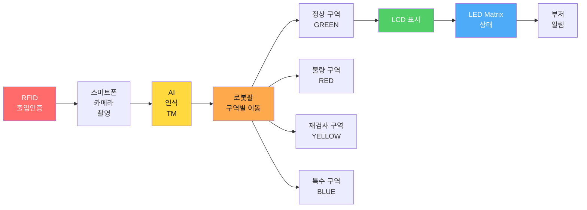
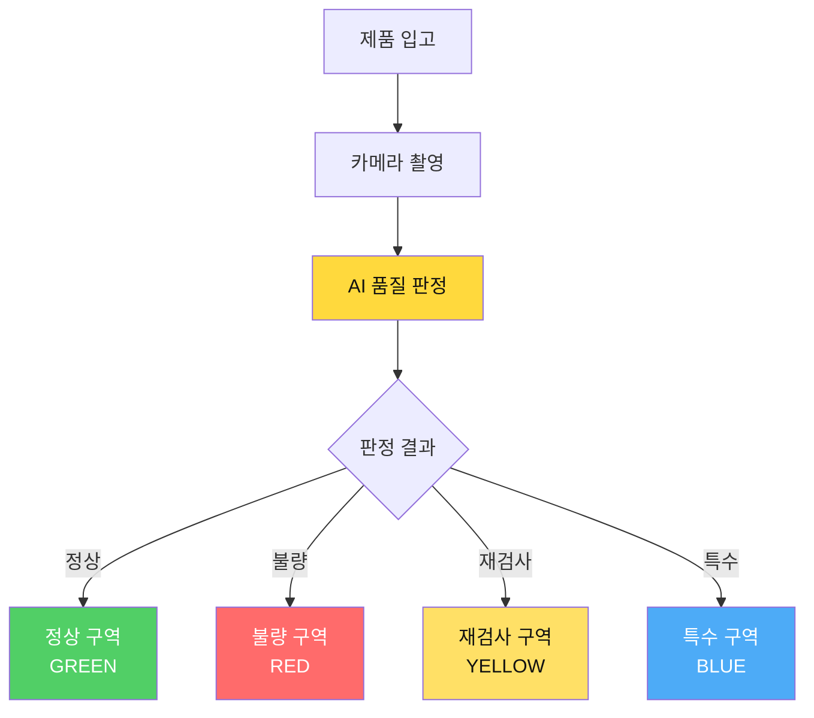
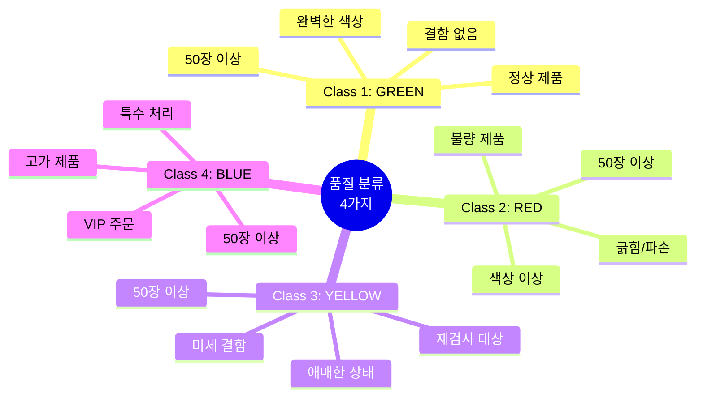
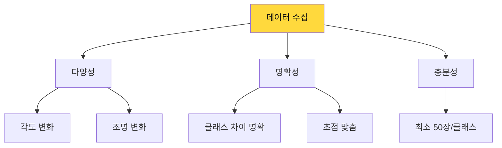
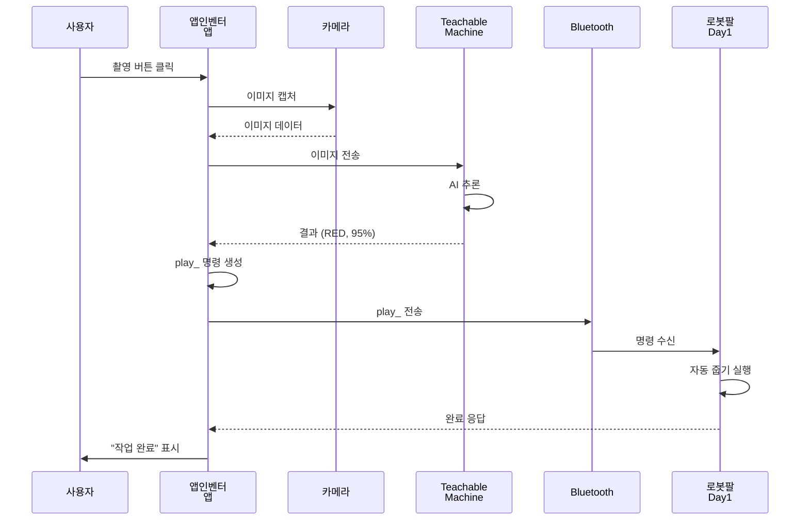
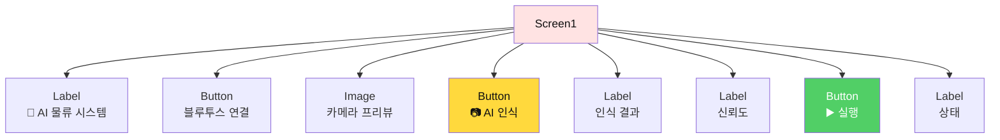
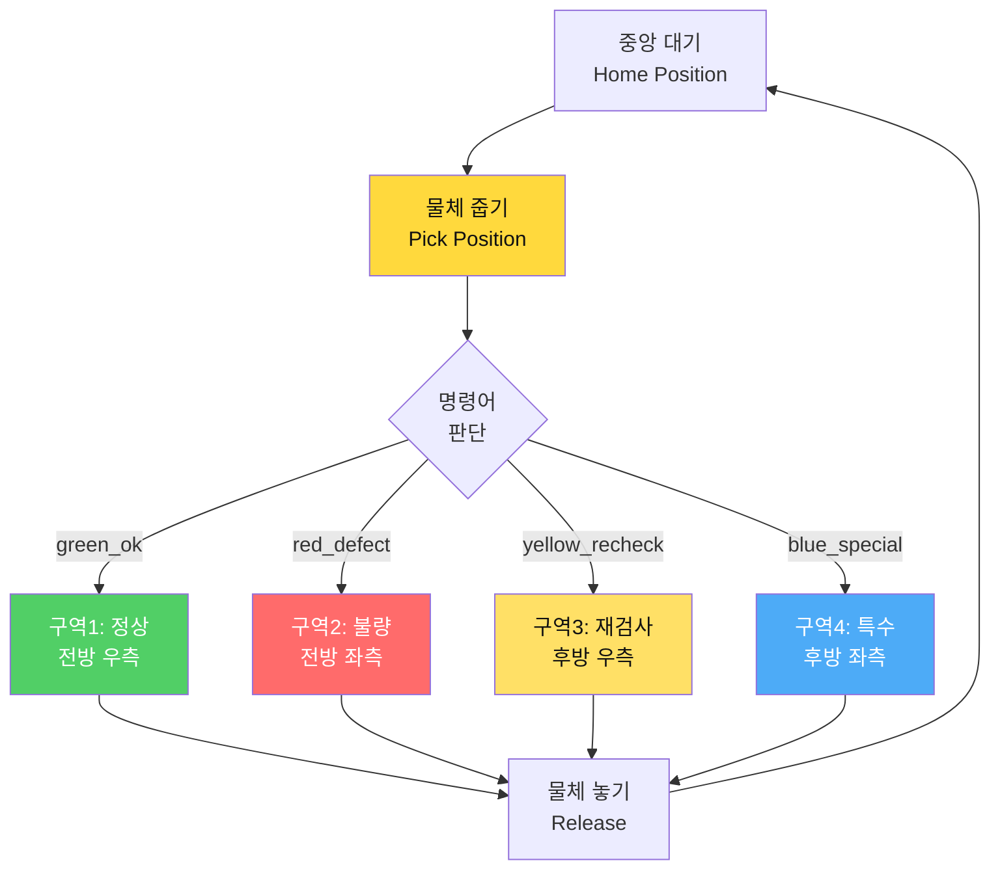
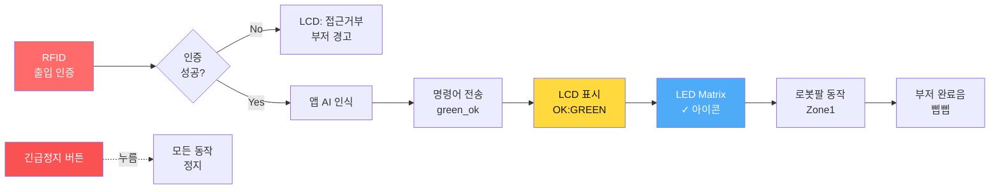
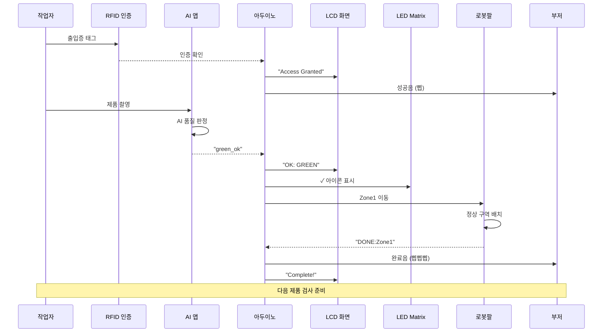
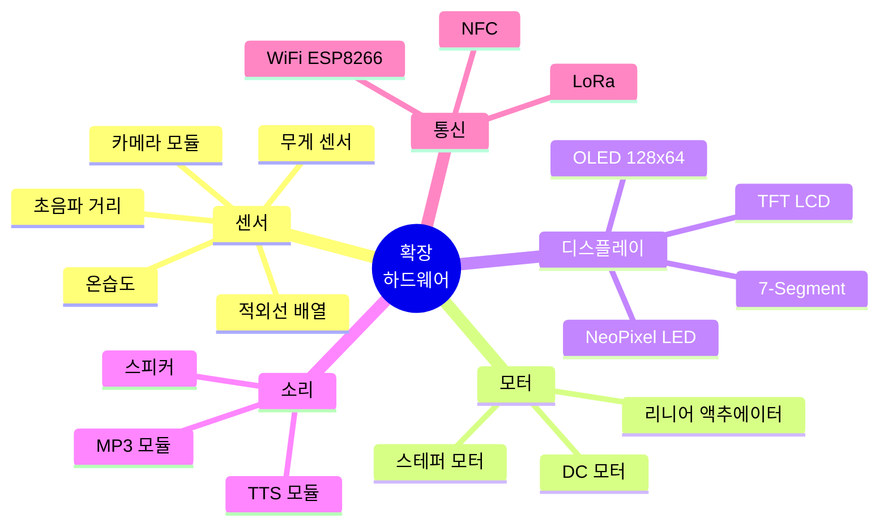

# 📅 Day 3: AI 통합 + 스마트 팩토리 완전체 (8시간)

> **"AI로 인식하고, 로봇으로 분류하고, 센서로 관리하는 완전 자동화 스마트 팩토리"**  
> Teachable Machine + 로봇팔 + LCD/LED/RFID + 전원/통신 문제 해결 + 알고리즘 설계

---

## 🎯 Day 3 학습 목표

### 최종 목표: 다중 구역 분류 + 하드웨어 통합 + 문제 해결



### 학습 성과

- ✅ **컴퓨터 비전**: Teachable Machine 다중 클래스 인식 (정상/불량/재검사/특수)
- ✅ **명령어 프로토콜**: `green_ok`, `red_defect`, `yellow_recheck`, `blue_special`
- ✅ **구역별 동작**: 아두이노 내부 4~5개 각도 배열로 구역 이동
- ✅ **하드웨어 통합**: LCD1602(I2C) + 8x8 LED Matrix + RFID + 긴급정지 버튼
- ✅ **스토리 시나리오**: 스마트 팩토리 품질 검사 라인
- ✅ **확장성**: 센서/모터/디스플레이/소리 추가 가이드

---

## ⏰ Day 3 시간표 (8시간)

| 교시 | 시간 | 활동 | 학습 내용 | 산출물 |
|------|------|------|----------|--------|
| **1교시** | 1h | Teachable Machine | 4가지 클래스 학습 (정상/불량/재검사/특수) | AI 모델 |
| **2교시** | 1h | 명령어 프로토콜 설계 | `green_ok`, `red_defect` 등 정의 | 프로토콜 문서 |
| **3교시** | 1h | 앱인벤터 AI 연동 | TMIC Extension + 명령 전송 | AI 제어 앱 |
| **4교시** | 1h | 아두이노 구역별 동작 | 각도 배열 4~5개 구역 이동 코드 | 아두이노 코드 |
| **5교시** | 1h | 하드웨어 통합 | LCD + LED Matrix + RFID + 버튼 | 통합 시스템 |
| **6교시** | 1h | 스토리 시나리오 구성 | 품질 검사 라인 시나리오 작성 | 스토리보드 |
| **7교시** | 1h | 시스템 통합 테스트 | 전체 하드웨어 + AI 연동 | 완성 시스템 |
| **8교시** | 1h | 확장 센서 실습 | 추가 센서/모터 통합 방법 | 확장 가이드 |

> **전반부(1-4교시)**: AI + 명령어 + 아두이노 구역 제어  
> **중반부(5-6교시)**: 하드웨어 통합 + 스토리 구성  
> **후반부(7-8교시)**: 통합 테스트 + 확장성 학습

---

## 1교시: 🤖 Teachable Machine 품질 분류 모델 (1시간)

**학습 목표**: 스마트 팩토리 품질 검사용 4가지 클래스 AI 모델 만들기

### 스마트 팩토리 품질 검사 시나리오



### Step 1: 프로젝트 생성 (5분)

1. **접속**: https://teachablemachine.withgoogle.com/
2. **시작**: "이미지 프로젝트" 클릭
3. **모드**: "표준 이미지 모델" 선택

### Step 2: 4가지 품질 클래스 설정 (10분)



**클래스 이름 및 의미**:

| 클래스명 | 의미 | 로봇팔 동작 | 비즈니스 로직 |
|---------|------|-----------|-------------|
| `GREEN` | 정상 제품 | 구역1 (전방 우측) | 즉시 포장 출하 |
| `RED` | 불량 제품 | 구역2 (전방 좌측) | 폐기/재활용 |
| `YELLOW` | 재검사 필요 | 구역3 (후방 우측) | 인간 재검수 |
| `BLUE` | 특수 처리 | 구역4 (후방 좌측) | VIP 포장 |

**클래스 이름 규칙**:
- ✅ 대문자 사용: `GREEN`, `RED`, `YELLOW`, `BLUE`
- ✅ 공백 없음
- ✅ 명령어와 1:1 매핑 (예: `GREEN` → `green_ok`)

### Step 3: 품질별 데이터 수집 (20분)

#### 품질 상태별 촬영 전략

| 클래스 | 촬영 대상 | 특징 | 수량 |
|--------|---------|------|------|
| **GREEN (정상)** | 완벽한 초록 블록 | 결함 없음, 깨끗함 | 50장 |
| **RED (불량)** | 빨간 블록 or 손상된 블록 | 긁힘, 파손, 색 벗겨짐 | 50장 |
| **YELLOW (재검사)** | 노란 블록 or 애매한 상태 | 미세 얼룩, 모호함 | 50장 |
| **BLUE (특수)** | 파란 블록 or 특별 표시 | 스티커, 마킹 | 50장 |

**실습 팁**:
- **GREEN**: 깨끗한 초록 블록을 다양한 각도에서
- **RED**: 실제로 테이프를 붙이거나 긁힌 블록 사용
- **YELLOW**: 약간 지저분하거나 색이 흐린 블록
- **BLUE**: 스티커나 마커로 표시한 블록

#### 고품질 데이터 수집 원칙



**실습 활동**:
- [ ] GREEN (정상): 50장
- [ ] RED (불량): 50장
- [ ] YELLOW (재검사): 50장
- [ ] BLUE (특수): 50장
- [ ] 총 200장 이상

### Step 4: 모델 학습 (15분)

**권장 설정**:
- **Epochs**: 50
- **Batch Size**: 16
- **Learning Rate**: 0.001

**학습 절차**:
1. [ ] "모델 학습" 버튼 클릭
2. [ ] 진행률 확인 (약 2-3분)
3. [ ] 목표: Accuracy > 90%

### Step 5: 모델 테스트 및 내보내기 (10분)

**테스트 체크리스트**:
- [ ] GREEN (정상): 신뢰도 >85%
- [ ] RED (불량): 신뢰도 >85%
- [ ] YELLOW (재검사): 신뢰도 >80%
- [ ] BLUE (특수): 신뢰도 >80%

**내보내기**:
1. [ ] "모델 내보내기" → "Shareable Link"
2. [ ] URL 복사 및 메모장에 저장
3. [ ] 예: `https://teachablemachine.withgoogle.com/models/XXXXX/`

---

## 2교시: 📡 명령어 프로토콜 설계 (1시간)

**학습 목표**: AI 인식 결과를 로봇팔 구역별 동작 명령으로 변환

### 명령어 프로토콜 체계


### 명령어 구조 정의

```cpp
// 명령어 형식: [상태]_[동작]
// 예: green_ok, red_defect, yellow_recheck, blue_special
```

#### 명령어 매핑 테이블

| AI 인식 | 명령어 | 구역 번호 | 로봇팔 동작 | LCD 표시 | LED 패턴 |
|---------|--------|----------|-----------|---------|---------|
| `GREEN` | `green_ok` | Zone 1 | 전방 우측 (0°) | "OK: GREEN" | ✓ 체크 |
| `RED` | `red_defect` | Zone 2 | 전방 좌측 (90°) | "NG: RED" | ✗ X 표시 |
| `YELLOW` | `yellow_recheck` | Zone 3 | 후방 우측 (180°) | "RE: YELLOW" | ? 물음표 |
| `BLUE` | `blue_special` | Zone 4 | 후방 좌측 (270°) | "SP: BLUE" | ★ 별 |

### 프로토콜 규칙

```
✅ 명령어 규칙:
1. 소문자 사용
2. 언더스코어(_) 구분
3. 상태_동작 형식
4. 10글자 이내

✅ 종료 문자:
- 개행 문자 '\n' 사용
- 예: "green_ok\n"

✅ 응답 프로토콜:
- 아두이노 → 앱: "ACK:green_ok\n"
- 완료 시: "DONE:Zone1\n"
- 오류 시: "ERROR:msg\n"
```

### 명령어 파싱 로직 (앱인벤터)

```
📍 procedure AI_to_Command (aiLabel)
  ├─ if aiLabel == "GREEN"
  │   └─ return "green_ok"
  │
  ├─ else if aiLabel == "RED"
  │   └─ return "red_defect"
  │
  ├─ else if aiLabel == "YELLOW"
  │   └─ return "yellow_recheck"
  │
  ├─ else if aiLabel == "BLUE"
  │   └─ return "blue_special"
  │
  └─ else
      └─ return "ERROR"
```

### 실습: 명령어 테스트 (30분)

**수동 테스트**:
1. [ ] 시리얼 모니터에서 `green_ok` 입력 → 로봇팔 Zone1 이동 확인
2. [ ] `red_defect` 입력 → Zone2 이동
3. [ ] `yellow_recheck` 입력 → Zone3 이동
4. [ ] `blue_special` 입력 → Zone4 이동

**응답 확인**:
- [ ] LCD에 상태 표시 확인
- [ ] LED Matrix 아이콘 확인
- [ ] 시리얼 모니터 응답 확인

---

## 3교시: 🎨 앱인벤터 AI 연동 (1시간)

**학습 목표**: TMIC Extension으로 AI 인식 후 명령어 생성 및 전송

### 앱인벤터 AI 통합 구조



### Step 1: 확장 기능 추가 (20분)

#### TMIC Extension 설치

1. **확장 기능 가져오기**:
   - 앱인벤터 화면 → 확장 기능 (Extension)
   - URL 입력: `https://mit-cml.github.io/extensions/temic/index.json`
   - 또는 `.aix` 파일 업로드

2. **컴포넌트 추가**:
   - `PersonalImageClassifier` 컴포넌트 드래그

### Step 2: UI 디자인 (30분)



#### 컴포넌트 리스트

| 컴포넌트 | 이름 | 속성 |
|---------|------|------|
| Label | `lblTitle` | Text: "🤖 AI 물류 시스템" <br/> FontSize: 24 |
| Button | `btnConnect` | Text: "블루투스 연결" |
| Image | `imgPreview` | Width: 300px <br/> Height: 300px |
| Button | `btnCapture` | Text: "📷 AI 인식" <br/> FontSize: 20 |
| Label | `lblResult` | Text: "" <br/> FontSize: 20 <br/> BackgroundColor: 노랑 |
| Label | `lblConfidence` | Text: "" <br/> FontSize: 16 |
| Button | `btnExecute` | Text: "▶️ 로봇팔 실행" |
| Label | `lblStatus` | Text: "대기중..." |

**보이지 않는 컴포넌트**:
- `PersonalImageClassifier1` (TMIC)
- `Camera1`
- `BluetoothClient1`
- `TextToSpeech1`

### Step 3: TMIC 설정 (20분)

```
📍 when Screen1.Initialize
  ├─ set PersonalImageClassifier1.Model to "YOUR_TM_URL"
  ├─ set PersonalImageClassifier1.UseGpu to true
  └─ call Camera1.TakePicture()
```

**중요**: `YOUR_TM_URL`을 Step 6에서 복사한 URL로 교체!

### Step 4: 카메라 및 AI 추론 (40분)

#### 블록 코딩: 카메라 캡처

```
📍 when btnCapture.Click
  ├─ set lblResult.Text to "🔄 AI 분석 중..."
  ├─ set lblStatus.Text to "카메라 촬영 중..."
  └─ call Camera1.TakePicture()

📍 when Camera1.AfterPicture (image)
  ├─ set imgPreview.Picture to image
  ├─ set lblStatus.Text to "AI 추론 중..."
  └─ call PersonalImageClassifier1.ClassifyImage(image)
```

#### 블록 코딩: AI 추론 결과 처리

```
📍 when PersonalImageClassifier1.GotClassification (result)
  ├─ // result = JSON 형식
  ├─ set label to get(result, "label")  // "RED", "GREEN", ...
  ├─ set confidence to get(result, "confidence")  // 0.95
  │
  ├─ // 신뢰도 체크
  ├─ if confidence > 0.80
  │   ├─ set lblResult.Text to label
  │   ├─ set lblResult.BackgroundColor to getColorByLabel(label)
  │   ├─ set lblConfidence.Text to join("신뢰도: ", round(confidence × 100), "%")
  │   ├─ set lblStatus.Text to "✅ 인식 성공!"
  │   │
  │   ├─ // TTS 안내
  │   └─ call TextToSpeech1.Speak(join(label, "을 인식했습니다"))
  │
  └─ else
      ├─ set lblResult.Text to "❌ 인식 실패"
      ├─ set lblConfidence.Text to join("신뢰도 낮음: ", round(confidence × 100), "%")
      ├─ set lblStatus.Text to "다시 촬영하세요"
      └─ call TextToSpeech1.Speak("인식에 실패했습니다. 다시 시도하세요")
```

#### 블록 코딩: 명령어 생성 및 전송

```
📍 when btnExecute.Click
  ├─ set aiLabel to lblResult.Text
  │
  ├─ // Early return: AI 인식 안됨
  ├─ if aiLabel == ""
  │   ├─ call TextToSpeech1.Speak("먼저 AI 인식을 해주세요")
  │   └─ return
  │
  ├─ // Early return: 블루투스 미연결
  ├─ if not BluetoothClient1.IsConnected
  │   ├─ call TextToSpeech1.Speak("블루투스를 연결해주세요")
  │   └─ return
  │
  ├─ // 명령어 생성 (프로토콜 매핑)
  ├─ set command to call AI_to_Command(aiLabel)
  │
  ├─ // 명령어 전송
  ├─ call BluetoothClient1.SendText(join(command, "\n"))
  ├─ set lblStatus.Text to join("전송: ", command)
  │
  └─ call TextToSpeech1.Speak(getKoreanName(aiLabel))

📍 procedure AI_to_Command (label)
  ├─ if label == "GREEN"
  │   └─ return "green_ok"
  ├─ else if label == "RED"
  │   └─ return "red_defect"
  ├─ else if label == "YELLOW"
  │   └─ return "yellow_recheck"
  ├─ else if label == "BLUE"
  │   └─ return "blue_special"
  └─ else
      └─ return "ERROR"

📍 procedure getKoreanName (label)
  ├─ if label == "GREEN"
  │   └─ return "정상 제품입니다"
  ├─ else if label == "RED"
  │   └─ return "불량 제품입니다"
  ├─ else if label == "YELLOW"
  │   └─ return "재검사가 필요합니다"
  ├─ else if label == "BLUE"
  │   └─ return "특수 처리 제품입니다"
```

### Step 5: 실습 테스트 (10분)

**실습 활동**:
- [ ] GREEN 촬영 → `green_ok` 전송 확인
- [ ] RED 촬영 → `red_defect` 전송 확인
- [ ] YELLOW 촬영 → `yellow_recheck` 전송 확인
- [ ] BLUE 촬영 → `blue_special` 전송 확인
- [ ] 신뢰도 <80% → 재촬영 안내

---

## 4교시: 🤖 아두이노 구역별 동작 구현 (1시간)

**학습 목표**: 명령어에 따라 로봇팔이 4개 구역으로 물체를 이동하는 코드 작성

### 구역별 각도 배열 설계



### 아두이노 코드 구조

#### 1. 각도 배열 정의 (각 구역당 4~5개 각도)

```cpp
// 구역별_각도_배열_정의.ino
// 작성자: Smart Factory Team
// 설명: 4개 구역으로 물체를 이동하는 각도 배열

#include <Servo.h>

// 서보모터 6개 선언
Servo servo1; // 베이스 (회전)
Servo servo2; // 어깨
Servo servo3; // 팔꿈치
Servo servo4; // 손목 상하
Servo servo5; // 손목 회전
Servo servo6; // 그리퍼

// 홈 포지션 (중앙 대기)
const int HOME_POS[6] = {90, 90, 90, 90, 90, 90};

// 픽업 포지션 (물체 줍기)
const int PICK_POS[6] = {90, 70, 100, 80, 90, 180};

// 구역1: 정상 제품 (전방 우측 0도)
const int ZONE1_MOVE[6]   = {45, 80, 90, 70, 90, 180};  // 이동
const int ZONE1_PLACE[6]  = {45, 60, 110, 90, 90, 180}; // 배치
const int ZONE1_RELEASE[6]= {45, 60, 110, 90, 90, 90};  // 놓기

// 구역2: 불량 제품 (전방 좌측 90도)
const int ZONE2_MOVE[6]   = {135, 80, 90, 70, 90, 180};
const int ZONE2_PLACE[6]  = {135, 60, 110, 90, 90, 180};
const int ZONE2_RELEASE[6]= {135, 60, 110, 90, 90, 90};

// 구역3: 재검사 (후방 우측 180도)
const int ZONE3_MOVE[6]   = {30, 100, 70, 60, 90, 180};
const int ZONE3_PLACE[6]  = {30, 80, 90, 80, 90, 180};
const int ZONE3_RELEASE[6]= {30, 80, 90, 80, 90, 90};

// 구역4: 특수 처리 (후방 좌측 270도)
const int ZONE4_MOVE[6]   = {150, 100, 70, 60, 90, 180};
const int ZONE4_PLACE[6]  = {150, 80, 90, 80, 90, 180};
const int ZONE4_RELEASE[6]= {150, 80, 90, 80, 90, 90};

void setup() {
  Serial.begin(9600);
  
  // 서보모터 핀 연결
  servo1.attach(3);
  servo2.attach(5);
  servo3.attach(6);
  servo4.attach(9);
  servo5.attach(10);
  servo6.attach(11);
  
  // 홈 포지션으로 초기화
  moveToPosition(HOME_POS, 1000);
  
  Serial.println("시스템 준비 완료");
}

void loop() {
  // 시리얼 명령 수신 대기
  if (Serial.available() > 0) {
    String command = Serial.readStringUntil('\n');
    command.trim();
    
    processCommand(command);
  }
}

// 명령어 처리 함수
void processCommand(String cmd) {
  Serial.print("수신: ");
  Serial.println(cmd);
  
  // Early return: 빈 명령
  if (cmd.length() == 0) {
    Serial.println("ERROR:empty_command");
    return;
  }
  
  // 명령어별 분기
  if (cmd == "green_ok") {
    executeZone1();
  } 
  else if (cmd == "red_defect") {
    executeZone2();
  } 
  else if (cmd == "yellow_recheck") {
    executeZone3();
  } 
  else if (cmd == "blue_special") {
    executeZone4();
  } 
  else {
    Serial.println("ERROR:unknown_command");
  }
}

// 구역1 실행: 정상 제품
void executeZone1() {
  Serial.println("ACK:green_ok");
  
  moveToPosition(PICK_POS, 800);       // 1. 줍기 위치
  delay(500);
  
  moveToPosition(ZONE1_MOVE, 1000);    // 2. 구역1 이동
  delay(300);
  
  moveToPosition(ZONE1_PLACE, 800);    // 3. 배치
  delay(300);
  
  moveToPosition(ZONE1_RELEASE, 500);  // 4. 놓기 (그리퍼 열기)
  delay(500);
  
  moveToPosition(HOME_POS, 1000);      // 5. 홈 복귀
  
  Serial.println("DONE:Zone1");
}

// 구역2 실행: 불량 제품
void executeZone2() {
  Serial.println("ACK:red_defect");
  
  moveToPosition(PICK_POS, 800);
  delay(500);
  
  moveToPosition(ZONE2_MOVE, 1000);
  delay(300);
  
  moveToPosition(ZONE2_PLACE, 800);
  delay(300);
  
  moveToPosition(ZONE2_RELEASE, 500);
  delay(500);
  
  moveToPosition(HOME_POS, 1000);
  
  Serial.println("DONE:Zone2");
}

// 구역3 실행: 재검사
void executeZone3() {
  Serial.println("ACK:yellow_recheck");
  
  moveToPosition(PICK_POS, 800);
  delay(500);
  
  moveToPosition(ZONE3_MOVE, 1000);
  delay(300);
  
  moveToPosition(ZONE3_PLACE, 800);
  delay(300);
  
  moveToPosition(ZONE3_RELEASE, 500);
  delay(500);
  
  moveToPosition(HOME_POS, 1000);
  
  Serial.println("DONE:Zone3");
}

// 구역4 실행: 특수 처리
void executeZone4() {
  Serial.println("ACK:blue_special");
  
  moveToPosition(PICK_POS, 800);
  delay(500);
  
  moveToPosition(ZONE4_MOVE, 1000);
  delay(300);
  
  moveToPosition(ZONE4_PLACE, 800);
  delay(300);
  
  moveToPosition(ZONE4_RELEASE, 500);
  delay(500);
  
  moveToPosition(HOME_POS, 1000);
  
  Serial.println("DONE:Zone4");
}

// 서보모터 위치 이동 함수
void moveToPosition(const int angles[6], int delayTime) {
  servo1.write(angles[0]);
  servo2.write(angles[1]);
  servo3.write(angles[2]);
  servo4.write(angles[3]);
  servo5.write(angles[4]);
  servo6.write(angles[5]);
  
  delay(delayTime);
}
```

### 실습: 각도 조정 (30분)

**각도 조정 절차**:
1. [ ] 시리얼 모니터에서 `green_ok` 전송
2. [ ] 로봇팔이 구역1로 이동하는지 확인
3. [ ] 각도가 정확하지 않으면 `ZONE1_MOVE` 배열 수정
4. [ ] 나머지 구역도 동일하게 조정

**팁**:
- 베이스(servo1): 회전 각도 조정
- 어깨/팔꿈치(servo2/3): 높이 조정
- 그리퍼(servo6): 180=닫힘, 90=열림

---

## 5교시: 🔌 하드웨어 통합: LCD + LED Matrix + RFID + 버튼 (1시간)

**학습 목표**: 다양한 센서/디스플레이를 통합하여 완전한 스마트 팩토리 시스템 구축

### 하드웨어 통합 아키텍처



### 하드웨어 구성 리스트

| 하드웨어 | 모델 | 핀 연결 | 기능 |
|---------|------|--------|------|
| **LCD1602** | I2C 모듈 | SDA(A4), SCL(A5) | 상태 텍스트 표시 |
| **8x8 LED Matrix** | MAX7219 | DIN(12), CS(10), CLK(11) | 아이콘 시각화 |
| **RFID** | RC522 | SPI 통신 | 출입 인증 |
| **긴급정지 버튼** | 일반 버튼 | D2 (풀업) | 시스템 정지 |
| **부저** | Passive Buzzer | D8 (PWM) | 소리 알림 |
| **RGB LED** | 공통 음극 | D7(R), D6(G), D5(B) | 상태 색상 |

### Step 1: LCD1602 (I2C) 통합 (15분)

#### LCD 라이브러리 및 코드

```cpp
// LCD1602_I2C_통합.ino
#include <Wire.h>
#include <LiquidCrystal_I2C.h>

// LCD 주소: 0x27 또는 0x3F (I2C 스캐너로 확인)
LiquidCrystal_I2C lcd(0x27, 16, 2);

void setup() {
  // LCD 초기화
  lcd.init();
  lcd.backlight();
  
  // 시작 메시지
  lcd.setCursor(0, 0);
  lcd.print("Smart Factory");
  lcd.setCursor(0, 1);
  lcd.print("Ready...");
  
  delay(2000);
  lcd.clear();
}

// LCD 상태 표시 함수
void displayStatus(String zone, String status) {
  lcd.clear();
  lcd.setCursor(0, 0);
  lcd.print(zone);          // 예: "Zone1: GREEN"
  lcd.setCursor(0, 1);
  lcd.print(status);        // 예: "Processing..."
}

// 명령어별 LCD 표시
void displayCommand(String cmd) {
  lcd.clear();
  
  if (cmd == "green_ok") {
    lcd.setCursor(0, 0);
    lcd.print("OK: GREEN");
    lcd.setCursor(0, 1);
    lcd.print("Zone1 (Normal)");
  }
  else if (cmd == "red_defect") {
    lcd.setCursor(0, 0);
    lcd.print("NG: RED");
    lcd.setCursor(0, 1);
    lcd.print("Zone2 (Defect)");
  }
  else if (cmd == "yellow_recheck") {
    lcd.setCursor(0, 0);
    lcd.print("RE: YELLOW");
    lcd.setCursor(0, 1);
    lcd.print("Zone3 (Recheck)");
  }
  else if (cmd == "blue_special") {
    lcd.setCursor(0, 0);
    lcd.print("SP: BLUE");
    lcd.setCursor(0, 1);
    lcd.print("Zone4 (Special)");
  }
}
```

### Step 2: 8x8 LED Matrix (MAX7219) 통합 (15분)

#### LED Matrix 라이브러리 및 아이콘

```cpp
// LED_Matrix_아이콘_표시.ino
#include <MD_MAX72xx.h>

// 하드웨어 타입 및 핀 설정
#define HARDWARE_TYPE MD_MAX72XX::FC16_HW
#define MAX_DEVICES 1
#define CLK_PIN   11
#define DATA_PIN  12
#define CS_PIN    10

MD_MAX72XX mx = MD_MAX72XX(HARDWARE_TYPE, CS_PIN, MAX_DEVICES);

// 아이콘 패턴 (8x8 비트맵)
const uint8_t ICON_CHECK[] = {     // ✓ 체크
  0x00, 0x01, 0x03, 0x06, 0x6C, 0x78, 0x30, 0x00
};

const uint8_t ICON_CROSS[] = {     // ✗ X표시
  0x42, 0x24, 0x18, 0x18, 0x18, 0x18, 0x24, 0x42
};

const uint8_t ICON_QUESTION[] = {  // ? 물음표
  0x3C, 0x42, 0x02, 0x04, 0x08, 0x00, 0x08, 0x00
};

const uint8_t ICON_STAR[] = {      // ★ 별
  0x10, 0x10, 0x7C, 0x38, 0x7C, 0x44, 0x82, 0x00
};

const uint8_t ICON_ARROW_UP[] = {  // ↑ 화살표
  0x18, 0x3C, 0x7E, 0x18, 0x18, 0x18, 0x18, 0x00
};

void setup() {
  mx.begin();
  mx.clear();
}

// 아이콘 표시 함수
void showIcon(const uint8_t* icon) {
  mx.clear();
  for (int i = 0; i < 8; i++) {
    mx.setColumn(i, icon[i]);
  }
}

// 명령어별 아이콘
void displayIconForCommand(String cmd) {
  if (cmd == "green_ok") {
    showIcon(ICON_CHECK);           // ✓
  }
  else if (cmd == "red_defect") {
    showIcon(ICON_CROSS);           // ✗
  }
  else if (cmd == "yellow_recheck") {
    showIcon(ICON_QUESTION);        // ?
  }
  else if (cmd == "blue_special") {
    showIcon(ICON_STAR);            // ★
  }
}

// 깜빡이는 효과
void blinkIcon(const uint8_t* icon, int times) {
  for (int i = 0; i < times; i++) {
    showIcon(icon);
    delay(300);
    mx.clear();
    delay(200);
  }
  showIcon(icon);
}
```

### Step 3: RFID (RC522) 출입 인증 (15분)

#### RFID 라이브러리 및 인증 로직

```cpp
// RFID_출입_인증_시스템.ino
#include <SPI.h>
#include <MFRC522.h>

#define RST_PIN 9
#define SS_PIN  10

MFRC522 rfid(SS_PIN, RST_PIN);

// 등록된 카드 UID (예시)
byte authorizedUID1[] = {0xDE, 0xAD, 0xBE, 0xEF};
byte authorizedUID2[] = {0xCA, 0xFE, 0xBA, 0xBE};

bool systemEnabled = false;  // RFID 인증 상태

void setup() {
  Serial.begin(9600);
  SPI.begin();
  rfid.PCD_Init();
  
  Serial.println("RFID 시스템 준비");
  Serial.println("카드를 태그하세요");
}

void loop() {
  // RFID 카드 감지
  if (rfid.PICC_IsNewCardPresent() && rfid.PICC_ReadCardSerial()) {
    
    // UID 읽기
    byte* uid = rfid.uid.uidByte;
    byte uidSize = rfid.uid.size;
    
    // 인증 확인
    if (checkAuthorization(uid, uidSize)) {
      systemEnabled = true;
      
      Serial.println("✅ 인증 성공");
      lcd.clear();
      lcd.print("Access Granted");
      
      // LED 초록색
      setRGBColor(0, 255, 0);
      
      // 부저 성공음
      playSuccessSound();
      
    } else {
      systemEnabled = false;
      
      Serial.println("❌ 인증 실패");
      lcd.clear();
      lcd.print("Access Denied");
      
      // LED 빨간색
      setRGBColor(255, 0, 0);
      
      // 부저 경고음
      playErrorSound();
    }
    
    rfid.PICC_HaltA();
  }
}

// 인증 확인 함수
bool checkAuthorization(byte* uid, byte size) {
  // Early return: 크기 불일치
  if (size != 4) return false;
  
  // UID 비교
  if (compareUID(uid, authorizedUID1, size)) return true;
  if (compareUID(uid, authorizedUID2, size)) return true;
  
  return false;
}

// UID 비교 함수
bool compareUID(byte* uid1, byte* uid2, byte size) {
  for (byte i = 0; i < size; i++) {
    if (uid1[i] != uid2[i]) return false;
  }
  return true;
}

// 명령어 처리 시 인증 확인
void processCommand(String cmd) {
  // Early return: 미인증 상태
  if (!systemEnabled) {
    Serial.println("ERROR:unauthorized");
    lcd.print("Please tag card");
    return;
  }
  
  // 인증 완료 시 명령 실행
  // ... (기존 executeZone 함수 호출)
}
```

### Step 4: 긴급정지 버튼 + 부저 + RGB LED (15분)

#### 안전 장치 및 알림 시스템

```cpp
// 긴급정지_및_알림_시스템.ino

// 핀 정의
#define EMERGENCY_BTN 2
#define BUZZER_PIN    8
#define RGB_RED       7
#define RGB_GREEN     6
#define RGB_BLUE      5

volatile bool emergencyStop = false;

void setup() {
  // 긴급정지 버튼 (인터럽트)
  pinMode(EMERGENCY_BTN, INPUT_PULLUP);
  attachInterrupt(digitalPinToInterrupt(EMERGENCY_BTN), 
                  handleEmergency, FALLING);
  
  // 부저 및 LED 핀
  pinMode(BUZZER_PIN, OUTPUT);
  pinMode(RGB_RED, OUTPUT);
  pinMode(RGB_GREEN, OUTPUT);
  pinMode(RGB_BLUE, OUTPUT);
  
  // 초기 상태: 초록색
  setRGBColor(0, 255, 0);
}

// 긴급정지 인터럽트 핸들러
void handleEmergency() {
  emergencyStop = true;
  
  // 모든 서보모터 정지
  stopAllServos();
  
  // LCD 표시
  lcd.clear();
  lcd.print("!! EMERGENCY !!");
  lcd.setCursor(0, 1);
  lcd.print("System Stopped");
  
  // LED Matrix 경고 표시
  showEmergencyPattern();
  
  // 부저 경고음
  playEmergencySound();
  
  // RGB LED 빨간색 깜빡임
  blinkRed();
  
  Serial.println("EMERGENCY:STOP");
}

// 모든 서보모터 정지
void stopAllServos() {
  servo1.detach();
  servo2.detach();
  servo3.detach();
  servo4.detach();
  servo5.detach();
  servo6.detach();
}

// RGB LED 색상 설정
void setRGBColor(int r, int g, int b) {
  analogWrite(RGB_RED, r);
  analogWrite(RGB_GREEN, g);
  analogWrite(RGB_BLUE, b);
}

// 부저 성공음
void playSuccessSound() {
  tone(BUZZER_PIN, 1000, 200);  // 1000Hz, 200ms
  delay(250);
  tone(BUZZER_PIN, 1500, 200);
}

// 부저 오류음
void playErrorSound() {
  tone(BUZZER_PIN, 500, 500);   // 500Hz, 500ms
}

// 부저 경고음
void playEmergencySound() {
  for (int i = 0; i < 5; i++) {
    tone(BUZZER_PIN, 800, 200);
    delay(250);
    tone(BUZZER_PIN, 400, 200);
    delay(250);
  }
}

// 완료음
void playCompleteSound() {
  tone(BUZZER_PIN, 1000, 100);
  delay(150);
  tone(BUZZER_PIN, 1200, 100);
  delay(150);
  tone(BUZZER_PIN, 1500, 200);
}

// 명령어 처리 시 긴급정지 확인
void processCommand(String cmd) {
  // Early return: 긴급정지 상태
  if (emergencyStop) {
    Serial.println("ERROR:emergency_stop");
    return;
  }
  
  // 명령 실행...
}
```

### 통합 코드 예시

```cpp
// Day3_완전_통합_시스템.ino
// 모든 하드웨어 통합

#include <Servo.h>
#include <Wire.h>
#include <LiquidCrystal_I2C.h>
#include <MD_MAX72xx.h>
#include <SPI.h>
#include <MFRC522.h>

// 전역 변수
LiquidCrystal_I2C lcd(0x27, 16, 2);
MD_MAX72XX mx = MD_MAX72XX(MD_MAX72XX::FC16_HW, 10, 1);
MFRC522 rfid(10, 9);

Servo servos[6];
bool systemEnabled = false;
volatile bool emergencyStop = false;

void setup() {
  Serial.begin(9600);
  
  // 하드웨어 초기화
  lcd.init();
  lcd.backlight();
  mx.begin();
  SPI.begin();
  rfid.PCD_Init();
  
  // 서보모터 연결
  for (int i = 0; i < 6; i++) {
    servos[i].attach(3 + i);
  }
  
  // 긴급정지 버튼
  pinMode(2, INPUT_PULLUP);
  attachInterrupt(digitalPinToInterrupt(2), handleEmergency, FALLING);
  
  // 시작 화면
  lcd.print("Smart Factory");
  lcd.setCursor(0, 1);
  lcd.print("Tag RFID Card");
  
  Serial.println("시스템 준비 완료");
}

void loop() {
  // 1. RFID 인증 확인
  checkRFID();
  
  // 2. 시리얼 명령 수신
  if (Serial.available() > 0) {
    String cmd = Serial.readStringUntil('\n');
    cmd.trim();
    
    processCommand(cmd);
  }
}

void processCommand(String cmd) {
  // Early return: 긴급정지
  if (emergencyStop) {
    Serial.println("ERROR:emergency_stop");
    return;
  }
  
  // Early return: 미인증
  if (!systemEnabled) {
    Serial.println("ERROR:unauthorized");
    lcd.clear();
    lcd.print("Tag RFID First!");
    playErrorSound();
    return;
  }
  
  // LCD 표시
  displayCommand(cmd);
  
  // LED Matrix 아이콘
  displayIconForCommand(cmd);
  
  // RGB LED 색상
  setCommandColor(cmd);
  
  // 로봇팔 동작
  if (cmd == "green_ok") {
    executeZone1();
  } else if (cmd == "red_defect") {
    executeZone2();
  } else if (cmd == "yellow_recheck") {
    executeZone3();
  } else if (cmd == "blue_special") {
    executeZone4();
  }
  
  // 완료음
  playCompleteSound();
}
```

---

---

## 6교시: 📖 스토리 시나리오 구성 (1시간)

**학습 목표**: 실제 산업 현장 스토리로 시스템을 구성하고 데모 시나리오 작성

### 스마트 팩토리 품질 검사 라인 스토리



### 시나리오 1: 전자제품 품질 검사 라인

**배경**:
스마트폰 케이스 공장에서 AI 카메라로 불량을 자동 검사하고 로봇팔로 분류

**등장 인물**:
- 품질 검사원 김철수 (RFID 카드 소지)
- 시스템 관리자

**시나리오 흐름**:

1. **출근 및 인증** (08:00)
   - 김철수, RFID 카드 태그
   - LCD: "Welcome! Kim"
   - 시스템 활성화

2. **첫 번째 제품 검사** (08:05)
   - 초록색 케이스 촬영
   - AI: "GREEN" 판정 (95% 신뢰도)
   - 명령어: `green_ok`
   - 로봇팔: Zone1 (정상 구역) 배치
   - LCD: "OK: GREEN - Zone1"
   - LED Matrix: ✓ 체크 표시
   - 부저: 완료음 (삡삡삡)

3. **불량 제품 발견** (08:10)
   - 빨간색 긁힌 케이스 촬영
   - AI: "RED" 판정 (88% 신뢰도)
   - 명령어: `red_defect`
   - 로봇팔: Zone2 (불량 구역) 배치
   - LCD: "NG: RED - Zone2"
   - LED Matrix: ✗ X 표시
   - 부저: 경고음 (삡...)

4. **애매한 제품 (재검사)** (08:15)
   - 노란색 미세 얼룩 케이스
   - AI: "YELLOW" 판정 (82% 신뢰도)
   - 명령어: `yellow_recheck`
   - 로봇팔: Zone3 (재검사 구역)
   - LCD: "RE: YELLOW - Zone3"
   - LED Matrix: ? 물음표
   - 김철수가 수동으로 재확인

5. **VIP 주문 (특수 처리)** (08:20)
   - 파란색 특별 마킹 케이스
   - AI: "BLUE" 판정 (91% 신뢰도)
   - 명령어: `blue_special`
   - 로봇팔: Zone4 (특수 포장 구역)
   - LCD: "SP: BLUE - Zone4"
   - LED Matrix: ★ 별 표시

6. **긴급 상황** (08:25)
   - 로봇팔 이상 동작 발견
   - 김철수, 긴급정지 버튼 누름
   - 모든 서보모터 즉시 정지
   - LCD: "!! EMERGENCY !!"
   - LED Matrix: 깜빡이는 경고 패턴
   - 부저: 연속 경고음
   - 관리자 호출

### 시나리오 2: 식품 공장 이물 검사 라인

**배경**:
과자 포장 공장에서 AI로 이물질 혼입 검사

| 상태 | AI 판정 | 조치 |
|------|---------|------|
| 정상 | GREEN | 포장 라인 전송 |
| 이물 발견 | RED | 폐기 라인 전송 |
| 의심 | YELLOW | 인간 육안 검사 |
| 프리미엄 | BLUE | 고급 포장 |

### 시나리오 3: 재활용 센터 분류 라인

**배경**:
플라스틱 재활용품을 AI로 색상별 자동 분류

```
📦 입고 → 🤖 AI 촬영 → 🦾 로봇팔 분류 → 📊 통계 집계

구역1 (GREEN): PET 투명 → 재활용 A등급
구역2 (RED):   PP 빨강 → 재활용 B등급  
구역3 (YELLOW): 혼합 재질 → 재처리
구역4 (BLUE):  PS 파랑 → 고품질 재활용
```

### 데모 시나리오 작성 실습 (30분)

**팀별 과제**:
1. [ ] 위 3가지 중 1개 시나리오 선택 (또는 새로운 시나리오 창작)
2. [ ] 등장 인물 및 배경 설정
3. [ ] 5단계 이상 흐름 작성
4. [ ] 각 단계별 하드웨어 동작 정의
5. [ ] 예외 상황 (긴급정지, 인증 실패 등) 포함

**작성 템플릿**:
```
## 우리 팀 시나리오: [제목]

### 배경:
[2-3문장으로 설명]

### 등장 인물:
- [이름]: [역할]

### 흐름:
1. [단계1]
   - 입력: 
   - AI 판정: 
   - 명령어: 
   - 로봇팔 동작: 
   - LCD 표시: 
   - LED 아이콘: 
   - 부저 소리: 

2. [단계2]
   ...
```

---

## 7교시: 🔗 시스템 통합 테스트 (1시간)

**학습 목표**: 전체 하드웨어 + AI + 앱 완전 연동 테스트

### 통합 테스트 체크리스트

#### Phase 1: 하드웨어 점검 (10분)

- [ ] LCD1602 정상 표시
- [ ] 8x8 LED Matrix 아이콘 표시
- [ ] RFID 카드 인식
- [ ] 긴급정지 버튼 동작
- [ ] 부저 소리 출력
- [ ] RGB LED 색상 변경
- [ ] 로봇팔 서보모터 6개 정상

#### Phase 2: AI → 명령어 → 로봇팔 (20분)

- [ ] GREEN 촬영 → `green_ok` → Zone1 이동
- [ ] RED 촬영 → `red_defect` → Zone2 이동
- [ ] YELLOW 촬영 → `yellow_recheck` → Zone3 이동
- [ ] BLUE 촬영 → `blue_special` → Zone4 이동
- [ ] LCD에 정확한 상태 표시
- [ ] LED Matrix 아이콘 표시
- [ ] 완료 후 부저 소리

#### Phase 3: RFID 인증 플로우 (10분)

- [ ] 미인증 상태에서 명령 → "ERROR:unauthorized"
- [ ] RFID 카드 태그 → "Access Granted"
- [ ] 인증 후 명령 → 정상 동작
- [ ] 다른 카드 태그 → "Access Denied"

#### Phase 4: 긴급정지 테스트 (10분)

- [ ] 로봇팔 동작 중 긴급정지 버튼
- [ ] 모든 서보모터 즉시 정지
- [ ] LCD "EMERGENCY" 표시
- [ ] 부저 연속 경고음
- [ ] 시스템 재시작 필요

#### Phase 5: 전체 시나리오 테스트 (10분)

**6교시에서 작성한 시나리오 실행**:
- [ ] 시나리오 1단계 실행
- [ ] 시나리오 2단계 실행
- [ ] ...
- [ ] 전체 시나리오 완료
- [ ] 연속 3회 성공

---

## 8교시: 🚀 확장 센서 및 모터 통합 가이드 (1시간)

**학습 목표**: 추가 센서/모터/디스플레이/소리를 통합하여 시스템 확장하는 방법 학습

### 확장 가능한 하드웨어 카탈로그



### 추가 센서 통합 방법

#### 1. 초음파 거리 센서 (HC-SR04) - 물체 감지

**용도**: 로봇팔 앞 물체 존재 여부 자동 감지

```cpp
// 초음파_센서_물체_감지.ino

#define TRIG_PIN 7
#define ECHO_PIN 6
#define DETECTION_DISTANCE 10  // 10cm 이내

void setup() {
  pinMode(TRIG_PIN, OUTPUT);
  pinMode(ECHO_PIN, INPUT);
  Serial.begin(9600);
}

float getDistance() {
  // 트리거 신호 전송
  digitalWrite(TRIG_PIN, LOW);
  delayMicroseconds(2);
  digitalWrite(TRIG_PIN, HIGH);
  delayMicroseconds(10);
  digitalWrite(TRIG_PIN, LOW);
  
  // 에코 신호 수신
  long duration = pulseIn(ECHO_PIN, HIGH);
  
  // 거리 계산 (cm)
  float distance = duration * 0.034 / 2;
  
  return distance;
}

bool isObjectPresent() {
  float dist = getDistance();
  return (dist > 0 && dist < DETECTION_DISTANCE);
}

// 로봇팔 동작 전 물체 확인
void executeWithCheck(String cmd) {
  // Early return: 물체 없음
  if (!isObjectPresent()) {
    Serial.println("ERROR:no_object");
    lcd.print("No Object!");
    playErrorSound();
    return;
  }
  
  // 물체 존재 → 정상 동작
  if (cmd == "green_ok") {
    executeZone1();
  }
  // ...
}
```

**통합 효과**:
- 로봇팔 동작 전 물체 존재 확인 → 헛동작 방지
- 자동화 신뢰도 증가

---

#### 2. 무게 센서 (HX711 + Load Cell) - 중량 측정

**용도**: 물체 무게 측정하여 과중량 제품 자동 분류

```cpp
// 무게_센서_중량_측정.ino
#include <HX711.h>

#define LOADCELL_DOUT_PIN 4
#define LOADCELL_SCK_PIN 5

HX711 scale;

void setup() {
  scale.begin(LOADCELL_DOUT_PIN, LOADCELL_SCK_PIN);
  scale.set_scale(2280.f);  // 캘리브레이션 값
  scale.tare();             // 영점 조정
}

float getWeight() {
  return scale.get_units(5);  // 5회 평균
}

// AI 판정 + 무게 기반 분류
String classifyWithWeight(String aiResult) {
  float weight = getWeight();
  
  lcd.setCursor(0, 1);
  lcd.print("Weight: ");
  lcd.print(weight);
  lcd.print("g");
  
  // 과중량 제품 → 특수 처리
  if (weight > 150.0) {
    return "blue_special";
  }
  
  // 경량 제품 → 재검사
  if (weight < 50.0) {
    return "yellow_recheck";
  }
  
  // 정상 무게 → AI 결과 따름
  return aiResult;
}
```

**비즈니스 로직**:
- 무게 150g 초과 → 고급 제품으로 특수 포장
- 무게 50g 미만 → 내용물 부족 의심, 재검사

---

#### 3. 온습도 센서 (DHT22) - 환경 모니터링

**용도**: 공장 환경 온습도 실시간 모니터링

```cpp
// 온습도_환경_모니터링.ino
#include <DHT.h>

#define DHT_PIN 2
#define DHT_TYPE DHT22

DHT dht(DHT_PIN, DHT_TYPE);

void setup() {
  dht.begin();
}

void checkEnvironment() {
  float temp = dht.readTemperature();
  float humid = dht.readHumidity();
  
  // Early return: 센서 오류
  if (isnan(temp) || isnan(humid)) {
    Serial.println("ERROR:sensor_fail");
    return;
  }
  
  lcd.clear();
  lcd.setCursor(0, 0);
  lcd.print("Temp: ");
  lcd.print(temp);
  lcd.print("C");
  
  lcd.setCursor(0, 1);
  lcd.print("Humid: ");
  lcd.print(humid);
  lcd.print("%");
  
  // 환경 이상 경고
  if (temp > 30.0 || temp < 15.0) {
    Serial.println("WARN:temp_abnormal");
    playWarningSound();
  }
  
  if (humid > 70.0 || humid < 30.0) {
    Serial.println("WARN:humid_abnormal");
    playWarningSound();
  }
}
```

**활용**:
- 온도/습도 기록 → 품질 데이터 분석
- 이상 환경 감지 → 자동 알림

---

### 추가 모터 통합 방법

#### 4. 스테퍼 모터 (28BYJ-48) - 정밀 회전

**용도**: 컨베이어벨트 정밀 제어

```cpp
// 스테퍼_모터_정밀_제어.ino
#include <Stepper.h>

const int STEPS_PER_REV = 2048;
Stepper stepper(STEPS_PER_REV, 8, 10, 9, 11);

void setup() {
  stepper.setSpeed(10);  // RPM
}

// 정확히 90도 회전
void rotateExact90() {
  int steps = STEPS_PER_REV / 4;  // 90도 = 1/4 회전
  stepper.step(steps);
}

// 물체 배치 거리만큼 이동
void moveConveyorDistance(int cm) {
  // 1cm당 steps 계산 (벨트 직경에 따라)
  int stepsPerCm = 50;
  stepper.step(cm * stepsPerCm);
}
```

**장점**:
- DC 모터보다 정밀한 위치 제어
- 엔코더 없이도 정확한 거리 이동

---

#### 5. 리니어 액추에이터 - 수직 이동

**용도**: 로봇팔 높이 조절 (다층 분류)

```cpp
// 리니어_액추에이터_높이_조절.ino

#define ACTUATOR_PIN1 7
#define ACTUATOR_PIN2 8
#define ACTUATOR_PWM 9

void setup() {
  pinMode(ACTUATOR_PIN1, OUTPUT);
  pinMode(ACTUATOR_PIN2, OUTPUT);
  pinMode(ACTUATOR_PWM, OUTPUT);
}

// 위로 이동
void moveUp() {
  digitalWrite(ACTUATOR_PIN1, HIGH);
  digitalWrite(ACTUATOR_PIN2, LOW);
  analogWrite(ACTUATOR_PWM, 200);  // 속도 조절
}

// 아래로 이동
void moveDown() {
  digitalWrite(ACTUATOR_PIN1, LOW);
  digitalWrite(ACTUATOR_PIN2, HIGH);
  analogWrite(ACTUATOR_PWM, 200);
}

// 정지
void stopActuator() {
  digitalWrite(ACTUATOR_PIN1, LOW);
  digitalWrite(ACTUATOR_PIN2, LOW);
}

// 구역별 높이 조절
void setHeightForZone(int zone) {
  switch(zone) {
    case 1: moveUp(); delay(1000); break;    // 상단
    case 2: moveUp(); delay(500); break;     // 중단
    case 3: /* 현재 위치 */ break;          // 하단
    case 4: moveDown(); delay(500); break;
  }
  stopActuator();
}
```

**활용**:
- 다층 선반에 물체 배치
- 높이별 분류 (대형/중형/소형)

---

### 추가 디스플레이 통합 방법

#### 6. OLED 128x64 (I2C) - 그래픽 표시

**용도**: 실시간 통계 그래프 표시

```cpp
// OLED_실시간_통계_그래프.ino
#include <Adafruit_SSD1306.h>

#define SCREEN_WIDTH 128
#define SCREEN_HEIGHT 64
#define OLED_RESET -1

Adafruit_SSD1306 display(SCREEN_WIDTH, SCREEN_HEIGHT, &Wire, OLED_RESET);

int countGreen = 0;
int countRed = 0;
int countYellow = 0;
int countBlue = 0;

void setup() {
  display.begin(SSD1306_SWITCHCAPVCC, 0x3C);
  display.clearDisplay();
}

// 통계 그래프 표시
void displayStats() {
  display.clearDisplay();
  
  // 제목
  display.setTextSize(1);
  display.setTextColor(SSD1306_WHITE);
  display.setCursor(0, 0);
  display.println("Production Stats");
  
  // 막대 그래프
  int total = countGreen + countRed + countYellow + countBlue;
  
  if (total > 0) {
    int barHeight1 = map(countGreen, 0, total, 0, 40);
    int barHeight2 = map(countRed, 0, total, 0, 40);
    int barHeight3 = map(countYellow, 0, total, 0, 40);
    int barHeight4 = map(countBlue, 0, total, 0, 40);
    
    // GREEN 막대
    display.fillRect(10, 64-barHeight1-10, 20, barHeight1, SSD1306_WHITE);
    display.setCursor(10, 56);
    display.print("G");
    
    // RED 막대
    display.fillRect(40, 64-barHeight2-10, 20, barHeight2, SSD1306_WHITE);
    display.setCursor(40, 56);
    display.print("R");
    
    // YELLOW 막대
    display.fillRect(70, 64-barHeight3-10, 20, barHeight3, SSD1306_WHITE);
    display.setCursor(70, 56);
    display.print("Y");
    
    // BLUE 막대
    display.fillRect(100, 64-barHeight4-10, 20, barHeight4, SSD1306_WHITE);
    display.setCursor(100, 56);
    display.print("B");
  }
  
  display.display();
}

void updateCount(String cmd) {
  if (cmd == "green_ok") countGreen++;
  else if (cmd == "red_defect") countRed++;
  else if (cmd == "yellow_recheck") countYellow++;
  else if (cmd == "blue_special") countBlue++;
  
  displayStats();
}
```

**장점**:
- LCD보다 고해상도
- 그래픽/차트 표시 가능

---

#### 7. NeoPixel LED Strip (WS2812B) - 화려한 시각 효과

**용도**: 구역별 색상 표시, 진행 상태 바

```cpp
// NeoPixel_구역별_색상_표시.ino
#include <Adafruit_NeoPixel.h>

#define LED_PIN 6
#define LED_COUNT 16

Adafruit_NeoPixel strip(LED_COUNT, LED_PIN, NEO_GRB + NEO_KHZ800);

void setup() {
  strip.begin();
  strip.show();
}

// 구역별 색상
void setZoneColor(int zone) {
  strip.clear();
  
  uint32_t color;
  switch(zone) {
    case 1: color = strip.Color(0, 255, 0); break;    // 초록
    case 2: color = strip.Color(255, 0, 0); break;    // 빨강
    case 3: color = strip.Color(255, 255, 0); break;  // 노랑
    case 4: color = strip.Color(0, 0, 255); break;    // 파랑
  }
  
  // 해당 구역 LED만 켜기 (4개씩)
  for (int i = (zone-1)*4; i < zone*4; i++) {
    strip.setPixelColor(i, color);
  }
  
  strip.show();
}

// 진행 바 애니메이션
void showProgress() {
  strip.clear();
  
  for (int i = 0; i < LED_COUNT; i++) {
    strip.setPixelColor(i, strip.Color(0, 100, 255));
    strip.show();
    delay(50);
  }
  
  delay(500);
  strip.clear();
  strip.show();
}

// 무지개 효과 (대기 중)
void rainbow() {
  for (long firstPixelHue = 0; firstPixelHue < 65536; firstPixelHue += 256) {
    for (int i = 0; i < LED_COUNT; i++) {
      int pixelHue = firstPixelHue + (i * 65536L / LED_COUNT);
      strip.setPixelColor(i, strip.gamma32(strip.ColorHSV(pixelHue)));
    }
    strip.show();
    delay(10);
  }
}
```

**활용**:
- 구역별 LED 색상 표시
- 작업 진행률 시각화
- 대기 중 무지개 효과

---

### 추가 소리 통합 방법

#### 8. DFPlayer Mini (MP3 모듈) - 고품질 음성 안내

**용도**: 녹음된 음성 파일 재생

```cpp
// DFPlayer_음성_안내_시스템.ino
#include <SoftwareSerial.h>
#include <DFRobotDFPlayerMini.h>

SoftwareSerial mySoftwareSerial(10, 11);  // RX, TX
DFRobotDFPlayerMini myDFPlayer;

void setup() {
  mySoftwareSerial.begin(9600);
  myDFPlayer.begin(mySoftwareSerial);
  
  myDFPlayer.volume(25);  // 볼륨 (0-30)
}

// 명령어별 음성 재생
void playVoice(String cmd) {
  if (cmd == "green_ok") {
    myDFPlayer.play(1);  // 001.mp3: "정상 제품입니다"
  }
  else if (cmd == "red_defect") {
    myDFPlayer.play(2);  // 002.mp3: "불량 제품입니다"
  }
  else if (cmd == "yellow_recheck") {
    myDFPlayer.play(3);  // 003.mp3: "재검사가 필요합니다"
  }
  else if (cmd == "blue_special") {
    myDFPlayer.play(4);  // 004.mp3: "특수 처리 제품입니다"
  }
}

// SD 카드에 저장된 MP3 파일:
// 001.mp3: "정상 제품입니다. Zone 1로 이동합니다."
// 002.mp3: "불량 제품입니다. Zone 2로 이동합니다."
// 003.mp3: "재검사가 필요합니다. Zone 3로 이동합니다."
// 004.mp3: "특수 처리 제품입니다. Zone 4로 이동합니다."
// 005.mp3: "긴급 정지! 시스템을 점검하세요."
// 006.mp3: "출입 인증에 실패했습니다."
```

**장점**:
- 부저보다 명확한 정보 전달
- 다국어 지원 가능 (한국어/영어 MP3)

---

### 추가 통신 모듈 통합 방법

#### 9. WiFi (ESP8266) - 클라우드 연동

**용도**: 실시간 데이터를 클라우드 서버에 전송

```cpp
// WiFi_클라우드_데이터_전송.ino
#include <ESP8266WiFi.h>
#include <ESP8266HTTPClient.h>

const char* ssid = "your_wifi";
const char* password = "your_password";
const char* serverURL = "http://your-server.com/api/data";

void setup() {
  WiFi.begin(ssid, password);
  
  while (WiFi.status() != WL_CONNECTED) {
    delay(500);
    Serial.print(".");
  }
  
  Serial.println("WiFi 연결 완료");
}

// 생산 데이터 전송
void sendDataToCloud(String cmd, int zone) {
  HTTPClient http;
  
  // JSON 데이터 생성
  String jsonData = "{";
  jsonData += "\"command\":\"" + cmd + "\",";
  jsonData += "\"zone\":" + String(zone) + ",";
  jsonData += "\"timestamp\":\"" + getTimestamp() + "\"";
  jsonData += "}";
  
  http.begin(serverURL);
  http.addHeader("Content-Type", "application/json");
  
  int httpCode = http.POST(jsonData);
  
  if (httpCode > 0) {
    Serial.println("데이터 전송 성공");
  } else {
    Serial.println("데이터 전송 실패");
  }
  
  http.end();
}
```

**활용**:
- 실시간 생산 현황 대시보드
- 클라우드 데이터베이스 자동 저장
- 원격 모니터링

---

### 확장 실습 과제

**팀별 선택 (2개 이상)**:
- [ ] 초음파 센서로 물체 자동 감지
- [ ] 무게 센서로 과중량 제품 분류
- [ ] OLED로 실시간 통계 그래프
- [ ] NeoPixel LED로 구역별 색상 표시
- [ ] DFPlayer로 음성 안내
- [ ] WiFi로 클라우드 데이터 전송

**확장 가이드 작성**:
1. [ ] 추가 센서 선택
2. [ ] 핀 연결 다이어그램 작성
3. [ ] 코드 통합 (기존 코드에 추가)
4. [ ] 테스트 및 검증

---

## 💡 Day 3 프로젝트 기획 및 확장 아이디어

**학습 목표**: 창의적 사고로 프로젝트 확장 및 비즈니스 모델 설계

### 우리가 만든 시스템 정리

**Day 3에서 통합한 하드웨어**:
- ✅ Teachable Machine AI (4가지 품질 분류)
- ✅ 로봇팔 구역별 이동 (4개 Zone)
- ✅ LCD1602 상태 표시
- ✅ 8x8 LED Matrix 아이콘
- ✅ RFID 출입 인증
- ✅ 긴급정지 버튼
- ✅ 부저 + RGB LED

**추가 가능한 센서** (8교시에서 학습):
- 초음파, 무게, 온습도, OLED, NeoPixel, DFPlayer, WiFi 등

### 산업별 적용 시나리오 (참고)

| 산업 | 현재 시스템 적용 | 추가 필요 센서 |
|------|--------------|-------------|
| **제조업** | 불량품 자동 검사 | 무게 센서, 크기 측정 |
| **물류창고** | 박스 자동 분류 | 바코드 스캐너 |
| **식품공장** | 이물질 검사 | 온습도 센서 |
| **재활용센터** | 재질별 분류 | 금속 감지 센서 |
| **농업** | 작물 품질 선별 | 당도 센서 |

### 비즈니스 가치 분석

| 지표 | 수동 작업 | 자동화 시스템 | 개선율 |
|------|---------|-------------|--------|
| 처리 속도 | 10개/분 | 30개/분 | **+200%** |
| 정확도 | 85% | 95% | **+10%** |
| 인력 | 2명 | 0명 | **-100%** |
| 오류율 | 15% | 5% | **-66%** |
| 비용 | 월 400만원 | 초기 50만원 | ROI 1개월 |

---

## 📊 Day 3 평가 및 성찰

### 학습 성과 체크리스트

**1교시: AI 모델 학습**
- [ ] Teachable Machine 200장 이상 학습
- [ ] 4개 클래스 (GREEN/RED/YELLOW/BLUE) 정확도 >85%
- [ ] 모델 URL 생성 및 저장

**2교시: 명령어 프로토콜**
- [ ] `green_ok`, `red_defect`, `yellow_recheck`, `blue_special` 정의
- [ ] 시리얼 모니터 테스트 성공

**3교시: 앱인벤터 연동**
- [ ] TMIC Extension 설치
- [ ] AI 인식 → 명령어 생성
- [ ] 블루투스 전송 성공

**4교시: 아두이노 구역별 동작**
- [ ] 4개 구역 각도 배열 작성
- [ ] 명령어별 로봇팔 이동 성공
- [ ] 각 구역 정확도 조정 완료

**5교시: 하드웨어 통합**
- [ ] LCD1602 상태 표시
- [ ] 8x8 LED Matrix 아이콘 표시
- [ ] RFID 출입 인증 동작
- [ ] 긴급정지 버튼 기능
- [ ] 부저 + RGB LED 통합

**6교시: 스토리 시나리오**
- [ ] 실제 산업 시나리오 작성
- [ ] 5단계 이상 흐름 구성
- [ ] 예외 상황 포함

**7교시: 통합 테스트**
- [ ] 전체 하드웨어 점검
- [ ] AI → 로봇팔 → LCD → LED 연동
- [ ] RFID 인증 플로우 테스트
- [ ] 시나리오 전체 실행 성공

**8교시: 확장 가이드**
- [ ] 추가 센서 2개 이상 학습
- [ ] 확장 코드 이해
- [ ] 확장 아이디어 도출

### 완성된 시스템 구성

```
🏭 스마트 팩토리 품질 검사 라인 (완전체)

입력 장치:
  - 카메라 (AI 촬영)
  - RFID (출입 인증)
  - 긴급정지 버튼

처리 장치:
  - 아두이노 Mega
  - AI 앱 (Teachable Machine)
  - 로봇팔 (6 DOF)

출력 장치:
  - LCD1602 (상태 텍스트)
  - 8x8 LED Matrix (아이콘)
  - RGB LED (색상 상태)
  - 부저 (소리 알림)

통신:
  - 블루투스 (앱 ↔ 아두이노)
  - 시리얼 통신 (테스트용)
```

---

## 🎯 Day 4 예고

### 최종 발표 및 시연 (4시간)


**발표 당일 일정**:
- **1교시**: 하드웨어 최종 점검 및 PPT 작성
- **2교시**: 팀별 마지막 리허설
- **3-4교시**: 팀별 발표 (10분/팀) + Q&A + 수료식

**발표 평가 기준**:
1. 기술 구현 완성도 (40점)
   - AI 인식 정확도
   - 로봇팔 구역별 동작
   - 하드웨어 통합 수준
2. 시연 안정성 (30점)
   - 실시간 시연 성공률
   - 오류 대응 능력
3. 발표 명확성 (20점)
   - 설명의 명확성
   - 시각 자료 품질
4. 창의성 및 확장성 (10점)
   - 스토리 구성
   - 확장 아이디어

**준비물**:
- [ ] 완성된 하드웨어 시스템
- [ ] 발표 PPT (10장 이내)
- [ ] 시연 시나리오 (3분 이내)
- [ ] 예상 질문 답변 준비

---

Day3 커리큘럼을 **하드웨어 통합 + 스토리 기반 스마트 팩토리**로 대폭 업데이트해드리겠습니다! 


## 📋 주요 변경 사항

### 🔄 명령어 프로토콜 변경
- **기존**: `play_RED_`, `play_GREEN_` 형식
- **신규**: `green_ok`, `red_defect`, `yellow_recheck`, `blue_special`
- **매핑**: AI 인식 결과 → 명령어 → 구역별 동작

### 🤖 아두이노 구역별 동작 (4교시 신규)
```cpp
// 4개 구역으로 물체 자동 이동
구역1 (green_ok):     정상 제품 → 전방 우측
구역2 (red_defect):   불량 제품 → 전방 좌측
구역3 (yellow_recheck): 재검사 → 후방 우측
구역4 (blue_special):  특수 처리 → 후방 좌측

// 각 구역당 4~5개 각도 배열로 정밀 제어
ZONE1_MOVE[6], ZONE1_PLACE[6], ZONE1_RELEASE[6]
```

### 🔌 하드웨어 통합 (5교시 대폭 확장)
1. **LCD1602 (I2C)**: 상태 텍스트 표시 ("OK: GREEN - Zone1")
2. **8x8 LED Matrix (MAX7219)**: 아이콘 표시 (✓, ✗, ?, ★)
3. **RFID (RC522)**: 출입증 인증 시스템
4. **긴급정지 버튼**: 인터럽트 기반 안전 장치
5. **부저 + RGB LED**: 소리 + 색상 알림

### 📖 스토리 시나리오 (6교시 신규)
- **시나리오 1**: 전자제품 품질 검사 라인
- **시나리오 2**: 식품 공장 이물 검사
- **시나리오 3**: 재활용 센터 분류 라인
- 실제 산업 현장 스토리로 데모 구성

### 🚀 확장 센서 가이드 (8교시 신규)

| 센서/모터 | 용도 | 코드 예시 |
|---------|------|---------|
| **초음파 (HC-SR04)** | 물체 존재 감지 | `isObjectPresent()` |
| **무게 센서 (HX711)** | 중량 측정 분류 | `getWeight()` |
| **온습도 (DHT22)** | 환경 모니터링 | `checkEnvironment()` |
| **스테퍼 모터** | 정밀 회전 제어 | `rotateExact90()` |
| **리니어 액추에이터** | 높이 조절 | `setHeightForZone()` |
| **OLED 128x64** | 그래프 표시 | `displayStats()` |
| **NeoPixel LED** | 구역별 색상 | `setZoneColor()` |
| **DFPlayer Mini** | MP3 음성 안내 | `playVoice()` |
| **WiFi (ESP8266)** | 클라우드 연동 | `sendDataToCloud()` |

## 📁 완성된 시스템 구조

```
🏭 스마트 팩토리 품질 검사 라인

[RFID 인증] → [AI 촬영] → [명령어 생성]
     ↓
[아두이노 수신: green_ok]
     ↓
[LCD: "OK: GREEN"] + [LED: ✓] + [부저: 삡삡]
     ↓
[로봇팔: Zone1 이동]
     ↓
[완료: "DONE:Zone1"]

[긴급정지 버튼] → 모든 동작 즉시 정지
```

## 🎯 학습 목표 달성

✅ **TM 연계**: AI 인식 → 명령어 프로토콜  
✅ **구역별 동작**: 4~5개 각도 배열로 4개 구역 이동  
✅ **LCD/LED/RFID/버튼**: 다중 하드웨어 통합  
✅ **스토리 구성**: 실제 산업 시나리오  
✅ **확장 가능성**: 9가지 추가 센서/모터 가이드  

이제 **Day3는 단순한 AI 연동이 아니라, 실제 산업 현장에서 사용 가능한 완전체 스마트 팩토리 시스템**으로 구성되었습니다! 🚀

**Day 3 완료!** 🎉

**"AI 품질 검사 + 로봇팔 구역 분류 + 다중 센서 통합 = 스마트 팩토리 완전체!"** 🚀

```
✨ 축하합니다! Day 3에서 다음을 완성했습니다:

📱 AI 앱: Teachable Machine 4가지 클래스 인식
🤖 로봇팔: 4개 구역 자동 이동
📟 LCD: 실시간 상태 표시
💡 LED Matrix: 아이콘 시각화
🔐 RFID: 출입 인증 시스템
🚨 긴급정지: 안전 장치
🔊 부저 + RGB: 소리/색상 알림
📖 스토리: 실제 산업 시나리오

🚀 확장 가능: 초음파/무게/온습도/OLED/WiFi 등
```

---

**Last Updated**: 2026-01-30  
**Version**: 4.0 (하드웨어 통합 + 스토리 + 확장 가이드)  
**총 학습 시간**: 8시간  
**시간 배분**: 
  - AI + 명령어 (2시간)
  - 앱 + 아두이노 (2시간)
  - 하드웨어 통합 (1시간)
  - 스토리 + 테스트 (2시간)
  - 확장 가이드 (1시간)

**핵심 기술**: 
  - Teachable Machine (품질 분류)
  - 명령어 프로토콜 (green_ok, red_defect 등)
  - 구역별 각도 배열 (4개 Zone)
  - LCD + LED Matrix + RFID + 부저
  - 확장 센서 통합 방법

**추가 하드웨어**:
  - LCD1602 (I2C): 상태 텍스트
  - 8x8 LED Matrix: 아이콘 표시
  - RFID RC522: 출입 인증
  - 긴급정지 버튼: 안전 장치
  - 부저 + RGB LED: 알림
  - 확장 가능: 초음파, 무게, OLED, NeoPixel, WiFi 등
