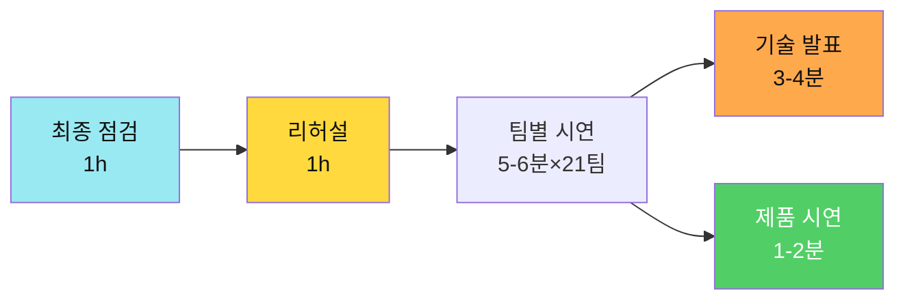
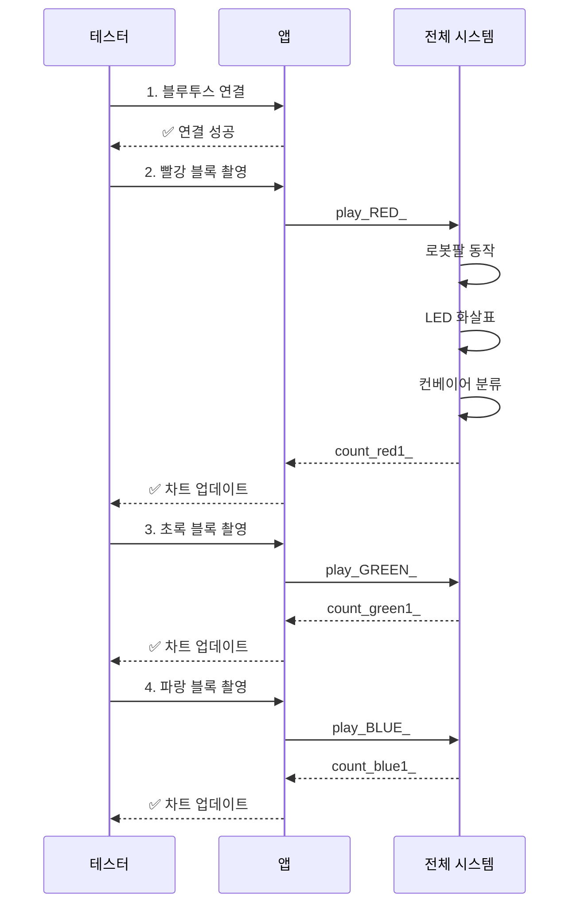
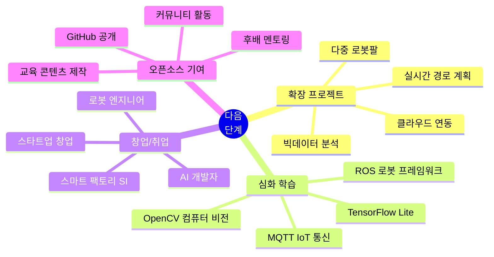

# 📅 Day 4: 제품 시연회 (4시간)

> **"28시간 동안 무엇을 만들었고, 어떤 어려움을 극복했는가"**  
> 필요성 → 문제 해결 과정 → 개선 사항 → 시연
> 
> **발표 형식**: 3-4분 기술 발표 + 1-2분 제품 시연

---

## 🎯 Day 4 학습 목표

### 최종 목표



### 학습 성과

- ✅ **기술 설명 역량**: 개발 과정과 문제 해결 과정 전달
- ✅ **문제 해결 증명**: 어떤 문제를 어떻게 해결했는지 명확히 제시
- ✅ **시연 완성도**: 1-2분 제품 시연 성공
- ✅ **시간 관리**: 5-6분 안에 핵심 전달

---

## ⏰ Day 4 시간표 (4시간)

| 교시 | 시간 | 활동 | 내용 | 비고 |
|------|------|------|------|------|
| **1교시** | 1h | 최종 점검 | 시스템 테스트 + 백업 | 팀별 진행 |
| **2교시** | 1h | 리허설 | 스토리 발표 + 시연 연습 | 팀당 5-6분 |
| **3-4교시** | 2h | 발표 시연 | 본 발표 (21팀) | 팀당 5-6분 |

---

## 1교시: 🔧 최종 점검 및 안정화 (1시간)

**학습 목표**: 시스템을 완벽하게 작동시키고 백업 계획 수립

### 시스템 점검 체크리스트


### Phase 1: 하드웨어 점검 (15분)

#### 로봇팔 (Day 1)

```markdown
□ 서보모터 4개 정상 작동
  - 베이스 (D6): 0-180도 전 범위 이동
  - 어깨 (D9): 부드러운 동작
  - 팔꿈치 (D10): 떨림 없음
  - 그리퍼 (D11): 물체 확실히 집음

□ 전원 안정성
  - 5V 2A 이상 공급
  - 서보 동시 작동 시 전압 강하 없음
  - 외부 전원 사용 중

□ 블루투스 HC-06
  - 페어링 상태 확인
  - 연결 안정성 (3m 거리)
  - TX/RX LED 깜빡임 확인

□ EEPROM 데이터
  - 저장된 위치 12단계 확인
  - play_ 명령 정상 작동
  - auto_ 무한 반복 테스트
```

#### 컨베이어 (Day 2)

```markdown
□ 센서 모듈
  - IR 센서: 물체 감지 정확도 100%
  - 컬러 센서: 색상 판별 정확도 >90%
  - TCS34725 캘리브레이션 재확인

□ 모터 제어
  - DC 모터: 정속 운행 (200 PWM)
  - 서보 게이트: 좌/중/우 정확히 이동
  - NeoPixel LED: 색상 표시 정상

□ 통신 모듈
  - Serial + Bluetooth 동시 처리
  - count_ 데이터 전송 확인
  - 명령 응답 시간 <100ms

□ 기계 구조
  - 벨트 장력 적절
  - 센서 위치 고정
  - 케이블 정리 (걸림 없음)
```

#### AI 시스템 (Day 3)

```markdown
□ Teachable Machine 모델
  - URL 접속 정상
  - 4개 클래스 인식 >85%
  - 네트워크 연결 안정

□ 앱인벤터 앱
  - TMIC Extension 로드 정상
  - 카메라 촬영 기능
  - Bluetooth 연결 유지
  - 차트 실시간 업데이트

□ 8x8 LED Matrix
  - 화살표 표시 명확
  - 밝기 적절 (5-10 레벨)
  - 패턴 전환 부드러움
```

### Phase 2: 통합 테스트 (20분)

#### 완전 자동화 시나리오 테스트



**테스트 체크리스트**:
- [ ] 연속 5회 성공 (빨강, 초록, 파랑 혼합)
- [ ] AI 인식 실패 시 재촬영 안내
- [ ] count_ 데이터 실시간 전송
- [ ] 차트 즉시 반영
- [ ] LED 화살표 표시
- [ ] 총 소요 시간 <3분/회

### Phase 3: 백업 계획 (15분)

#### 백업 체크리스트

```markdown
## 백업 1: 코드 및 데이터
□ 아두이노 코드 (.ino) USB 저장
□ 앱인벤터 프로젝트 (.aia) 다운로드
□ Teachable Machine URL 메모
□ EEPROM 위치 데이터 별도 저장

## 백업 2: 하드웨어
□ 예비 서보모터 준비
□ 예비 점퍼선
□ 예비 블루투스 모듈
□ 멀티테스터 (전압 체크용)

## 백업 3: 발표 자료
□ PPT 파일 3곳 저장 (USB, 클라우드, 이메일)
□ 시연 영상 (만약을 위해)
□ 알고리즘 플로우차트 인쇄

## 비상 계획
□ 시스템 고장 시 영상 시연
□ 질문 답변 시나리오 작성
□ 팀원 역할 재분담 가능
```

### Phase 4: 발표 자료 최종 확인 (10분)

#### 📖 제품 시연회 기반 PPT 구조 (3-4분 발표)

```markdown
# 슬라이드 구성 (총 5장) - 기술 중심

## 📋 Part 1: 프로젝트 소개 및 필요성 (30초)

### 슬라이드 1: "왜 이 프로젝트를 시작했는가?" (표지 겸용)
- **팀명/프로젝트명**: "AI 스마트 분류 시스템"
- **개발 기간**: 28시간 (4일)
- **개발 인원**: 2명 1조
- **필요성**:
  - 수작업 분류의 피로도와 실수 문제
  - 반복 작업 자동화 필요
  - 저비용으로 학습 가능한 시스템 구축
  - 실시간 데이터 수집 및 모니터링
- **목표**: 완전 자동화된 색상 분류 시스템 구축

## 🔧 Part 2: 개발 과정 및 문제 해결 (90초)

### 슬라이드 2: "Day 1-3 개발 과정과 고생담"

#### Day 1: 로봇팔 제어 (8시간)
- **문제 1**: 서보모터 4개 동시 제어 시 전압 강하
  - ❌ 아두이노 5V로는 부족 → 서보 떨림 발생
  - ✅ 해결: 외부 5V 2A 전원 공급 (전압 안정화)
  
- **문제 2**: 재부팅 시 위치 데이터 초기화
  - ❌ SRAM 변수 사용 → 전원 꺼지면 사라짐
  - ✅ 해결: EEPROM 저장 (비휘발성 메모리, O(1) 접근)
  
- **문제 3**: Bluetooth 명령 누락
  - ❌ Serial.read() 단순 읽기 → 명령 놓침
  - ✅ 해결: 버퍼링 + "_" 구분자로 완전한 명령 파싱

#### Day 2: 컨베이어 시스템 (8시간)
- **문제 4**: 색상 인식 정확도 낮음 (60%)
  - ❌ 단순 RGB 값 비교 → 조명에 민감
  - ✅ 해결: 유클리드 거리 알고리즘 적용 (>90% 정확도)
  - 수식: `d = √[(R1-R2)² + (G1-G2)² + (B1-B2)²]`
  
- **문제 5**: Serial과 Bluetooth 충돌
  - ❌ 두 통신을 동시 처리 → 데이터 섞임
  - ✅ 해결: 명령 체크 함수 분리 + millis() 비차단 타이밍
  
- **문제 6**: 컨베이어 속도 불안정
  - ❌ analogWrite() 직접 제어 → 속도 들쭉날쭉
  - ✅ 해결: PWM 200 고정값 + 테스트로 최적값 도출

#### Day 3: AI 통합 (8시간)
- **문제 7**: Teachable Machine 인식률 75%
  - ❌ 학습 데이터 50장 → 부족
  - ✅ 해결: 200장 증가 + 다양한 각도/조명 추가 (>85%)
  
- **문제 8**: 앱-아두이노 연동 실패
  - ❌ TMIC Extension 명령 형식 불일치
  - ✅ 해결: play_COLOR_ 형식 통일 + 테스트 반복
  
- **문제 9**: 8x8 LED Matrix 밝기 과다
  - ❌ 기본 밝기 255 → 눈부심
  - ✅ 해결: setBrightness(7) 적용 (가시성 유지)

### 슬라이드 3: "핵심 알고리즘 3가지"
- **알고리즘 1**: EEPROM 위치 저장/복구
  ```cpp
  // 시간복잡도: O(1) 직접 접근
  EEPROM.write(address, angle);  // 저장
  angle = EEPROM.read(address);  // 복구
  ```
  
- **알고리즘 2**: 유클리드 거리 색상 판별
  ```cpp
  // 3차원 공간에서 가장 가까운 색상 찾기
  float distance = sqrt(pow(r1-r2, 2) + 
                        pow(g1-g2, 2) + 
                        pow(b1-b2, 2));
  // 최소 거리 색상 선택
  ```
  
- **알고리즘 3**: 비차단 명령 처리
  ```cpp
  // millis() 활용한 순차 처리
  if (millis() - lastCheck > 100) {
    checkSerial();
    checkBluetooth();
    lastCheck = millis();
  }
  ```

## ⚙️ Part 3: 디자인 및 성능 개선 (40초)

### 슬라이드 4: "이렇게 개선했습니다"

#### 하드웨어 디자인 개선
- **개선 1**: 케이블 정리
  - Before: 점퍼선 엉킴 → 서보 동작 간섭
  - After: 케이블 타이로 고정 → 안정성 향상
  
- **개선 2**: 센서 위치 조정
  - Before: TCS34725 높이 3cm → 인식 불안정
  - After: 높이 1.5cm + LED 조명 추가 → 정확도 90%

- **개선 3**: 그리퍼 설계
  - Before: 고정형 → 작은 물체 못 잡음
  - After: 각도 조절형 (30-90도) → 다양한 크기 대응

#### 소프트웨어 성능 개선
- **개선 4**: 명령 처리 속도
  - Before: delay() 사용 → 블로킹 (응답 2초)
  - After: millis() 비차단 → 응답 <100ms
  
- **개선 5**: 메모리 최적화
  - Before: String 객체 남발 → 메모리 단편화
  - After: char 배열 사용 → 안정적 동작
  
- **개선 6**: 에러 처리
  - Before: 에러 시 멈춤
  - After: 재시도 로직 + 시리얼 에러 로그

#### 시스템 통합 개선
- **개선 7**: count_ 데이터 전송
  - Before: 수동 확인
  - After: 자동 전송 + 앱 차트 실시간 업데이트
  
- **개선 8**: LED 화살표 피드백
  - Before: 소리만 (부저)
  - After: 8x8 LED 시각적 피드백 추가
  
- **개선 9**: auto_ 무한 반복 모드
  - Before: 1회 동작만
  - After: stop_ 명령까지 자동 반복

## 📊 Part 4: 최종 구현 범위 및 성능 (30초)

### 슬라이드 5: "최종 완성 시스템"
- **구현 완료 기능**:
  - ✅ 로봇팔 자동 동작 (EEPROM 12단계)
  - ✅ 4색 분류 (빨강/초록/파랑/노랑)
  - ✅ AI 이미지 인식 (Teachable Machine)
  - ✅ 이중 통신 (Serial + Bluetooth)
  - ✅ 8x8 LED 화살표 표시
  - ✅ 실시간 재고 차트
  - ✅ 자동 반복 모드 (무인 자동화)

- **성능 지표**:
  - 색상 인식 정확도: >90%
  - AI 인식 정확도: >85%
  - 명령 응답 시간: <100ms
  - 1회 사이클: 약 20초
  - 시간당 처리량: 약 180개
  - 메모리 사용률: 68% (안정)

- **현재 제약 사항**:
  - ⚠️ 순차 처리만 가능 (병렬 처리 불가)
  - ⚠️ 단일 로봇팔 (확장성 제한)
  - ⚠️ 4개 색상만 지원
  - ⚠️ 조명 환경에 민감 (어두우면 정확도 하락)
  - ⚠️ Bluetooth 연결 거리 제한 (3m)

- **향후 개선 방향**:
  - 다중 로봇팔 동시 제어
  - 10개 색상 확장
  - OpenCV 조명 보정
  - WiFi 모듈로 거리 확장
```

---

## 2교시: 🎭 리허설 (1시간)

**학습 목표**: 5-6분 제품 시연 발표를 완벽하게 연습

### 리허설 프로세스 (5-6분 집중 연습)


### 역할 분담 (2인 1조)

```markdown
## 팀원 A (기술 발표자) - 3-4분 담당
✅ Part 1: 프로젝트 소개 및 필요성 (30초)
  - 왜 시작했는가
  - 간단한 필요성 3가지
  - 목표 제시
  
✅ Part 2: 개발 과정 및 문제 해결 (90초)
  - Day 1-3 개발 과정
  - 각 단계별 문제 상황 (9가지)
  - 해결 방법 및 고생담
  - 핵심 알고리즘 3가지
  
✅ Part 3: 디자인 및 성능 개선 (40초)
  - 하드웨어 개선 3가지
  - 소프트웨어 개선 3가지
  - 시스템 통합 개선 3가지
  
✅ Part 4: 최종 구현 범위 및 성능 (30초)
  - 완료 기능 7가지
  - 성능 지표 6가지
  - 제약 사항 5가지
  - 시연 연결 멘트

## 팀원 B (제품 시연 조작자) - 1-2분 담당
✅ 블루투스 연결 유지
✅ 카메라 촬영 및 AI 인식
✅ play_ 명령 확인
✅ 로봇팔 동작 모니터링
✅ 컨베이어 분류 확인
✅ 차트 업데이트 포인팅
✅ auto_ 자동 모드 실행
✅ LED 화살표 포인팅
✅ 문제 발생 시 백업 영상 재생

## 공동 협업
✅ 타이밍 신호 (발표자 → 시연자)
  - "이제 제품을 시연하겠습니다" → 촬영 시작
  - "자동 모드로 전환합니다" → auto_ 실행
  
✅ 백업 대응
  - Plan A: 즉시 재시도 (블루투스 재연결)
  - Plan B: 미리 촬영한 영상 재생
  
✅ 시간 관리
  - 스톱워치 확인 (5분 경고)
  - 6분 초과 시 요약 마무리
```

### 🎥 제품 시연 시나리오 (1-2분) - 완성도 증명

```markdown
## 🎬 90초 제품 시연 스크립트

### 0:00-0:10 (오프닝)
**발표자**: "이제 완성된 제품을 시연하겠습니다!"
**시연자**: [블루투스 연결 완료 상태 확인]

### 0:10-0:50 (1회 완전 사이클 - 빨강)
**발표자**: "빨간 블록을 촬영합니다."
**시연자**: [스마트폰으로 촬영 → 3초]

**발표자**: "AI가 빨강으로 인식했습니다. 자동 명령을 전송합니다."
**시연자**: [play_RED_ 자동 전송 → 로봇팔 동작 시작]

[침묵하며 동작 관찰 15초 - 포인팅만]
**발표자** (중간중간 짧게):
  - "EEPROM 위치로 이동합니다"
  - "LED 왼쪽 화살표 표시"
  - "컨베이어가 색상을 재확인합니다"
  - "왼쪽으로 분류 완료"

**시연자**: [count_red1_ 수신 확인]
**발표자**: "차트가 실시간으로 업데이트됩니다" [스마트폰 화면 포인팅]

### 0:50-1:20 (자동 반복 모드)
**발표자**: "이제 자동 모드로 전환합니다."
**시연자**: [auto_ 명령 실행]

**발표자**: "사람 개입 없이 무한 반복합니다."
[20초간 침묵 - 자동 동작 관찰]
- 로봇팔이 2-3회 자동 반복
- 안정적 동작 강조

### 1:20-1:30 (클로징)
**발표자**: "28시간 동안 완성한 자동화 시스템입니다."
**시연자**: [stop_ 명령, 시스템 정지]

---

## ⚡ 시연 핵심 포인트 (관객이 봐야 할 것)

1. **AI 인식 속도** (3초 이내 → 빠름)
2. **로봇팔 정확도** (EEPROM 위치 정확히 이동 → 안정적)
3. **LED 화살표** (직관적 시각 피드백)
4. **컨베이어 분류** (색상 재확인 → 이중 검증)
5. **차트 실시간 업데이트** (데이터 수집 자동화)
6. **자동 반복** (무인 자동화 완성 → 가장 중요)

## 🗣️ 시연 중 멘트 팁

### ✅ 좋은 멘트 (간결하고 명확)
- "EEPROM 위치로 이동합니다"
- "색상을 재확인합니다"
- "자동 모드로 전환합니다"

### ❌ 나쁜 멘트 (너무 장황)
- "이제 서보모터가 EEPROM에 저장된 각도 값을 읽어서..."
- "유클리드 거리 알고리즘으로 계산한 결과..."

### 💡 침묵의 힘
- 시스템이 자동으로 작동할 때는 **침묵**
- 관객이 시스템 동작을 **관찰**하게 함
- 너무 많은 설명은 오히려 산만함

## 🚨 백업 플랜 (에러 발생 시)

### Plan A: 즉시 재시도 (30초)
1. 블루투스 연결 확인
2. 센서 위치 확인
3. 다시 촬영 및 전송
**멘트**: "연결 확인 후 다시 시연하겠습니다"

### Plan B: 백업 영상 재생 (30초)
1. 미리 촬영한 영상 준비
2. 화면 전환
**멘트**: "미리 녹화한 영상으로 보여드리겠습니다. 어제까지는 정상 작동했습니다"

### 에러 발생 시 태도
- ❌ 당황하지 말 것
- ✅ 침착하게 Plan A/B 실행
- ✅ 솔직하게 설명 ("조명 환경이 달라서...")
- ✅ 개발 과정에서의 성공 강조
```

#### 🎯 기술 발표 연습 가이드

```markdown
## 연습 방법 (3회 반복)

### 1차 연습: 내용 완성도 (20분)
✅ 5장 슬라이드 전체 통독
✅ 각 Part별 핵심 메시지 암기
✅ 문제 해결 과정 9가지 숙지
✅ 시연 타이밍 파악
✅ 팀원 피드백 (내용 누락 체크)

### 2차 연습: 시간 조절 (20분)
✅ 스톱워치로 시간 측정
✅ 각 Part별 시간 분배
  - Part 1: 30초 (필요성)
  - Part 2: 90초 (문제 해결)
  - Part 3: 40초 (개선 사항)
  - Part 4: 30초 (최종 범위)
  - 시연: 90초
✅ 초과 시 요약 버전 준비
✅ 팀원 피드백 (속도 조절)

### 3차 연습: 실전 리허설 (20분)
✅ 실제 환경에서 연습
✅ 블루투스 연결 포함
✅ 시연 백업 플랜 테스트
✅ 팀원 피드백 (전체 완성도)

## 기술 발표 팁

### 🔧 기술 설명 방법
- **문제 상황**: 구체적으로 ("서보모터 떨림 발생")
- **해결 과정**: 시도한 방법들 나열
- **최종 해결**: 왜 이 방법이 효과적인지 설명
- **고생담**: 솔직하게 ("3시간 동안 디버깅했습니다")

### 📊 수치 활용
- **정확도**: "60% → 90%" (구체적 개선)
- **속도**: "응답 2초 → 100ms" (성능 향상)
- **메모리**: "메모리 사용률 68%" (안정성)

### ⚡ 속도 조절
- **중요 메시지**: 천천히, 강조 (알고리즘 설명)
- **문제 해결**: 보통 속도 (고생담)
- **시연**: 침묵 (시스템 작동 관찰)
- **마무리**: 빠르게, 간결하게
```

---

## 💬 자주 묻는 질문 30가지 (FAQ)

```markdown
## 📁 카테고리별 질문 & 답변

### 🔧 [A] 하드웨어 관련 질문 (7개)

Q1: **서보모터가 떨리는 문제를 어떻게 해결했나요?**
A: "초기에는 아두이노 5V 핀으로 4개 서보를 동시 구동했는데, 전압 강하로 떨림이 발생했습니다.
   외부 5V 2A 어댑터를 추가하고 전원 라인을 분리해 해결했습니다.
   서보 4개가 동시 작동해도 안정적입니다."

Q2: **TCS34725 색상 센서 정확도가 낮았던 이유는?**
A: "처음에는 센서를 물체에서 3cm 떨어뜨렸는데, 주변 조명 영향을 많이 받았습니다.
   센서 높이를 1.5cm로 낮추고, LED 조명을 추가해 정확도를 90% 이상으로 높였습니다."

Q3: **그리퍼가 작은 물체를 못 잡는 문제는?**
A: "고정형 그리퍼는 각도가 정해져 있어서 크기별 대응이 어려웠습니다.
   서보 각도를 30-90도로 조절 가능하게 설계해,
   레고 블록부터 골프공까지 다양한 크기를 잡을 수 있게 했습니다."

Q4: **케이블 정리를 왜 중요하게 다뤘나요?**
A: "처음에는 점퍼선이 엉켜서 서보 동작 시 간섭이 발생했습니다.
   케이블 타이로 고정하고 경로를 정리하니 동작 안정성이 크게 향상되었습니다.
   특히 자동 모드에서 반복 작동 시 필수입니다."

Q5: **DC 모터 속도가 불안정했던 원인은?**
A: "analogWrite()로 PWM을 제어했는데, 벨트 무게와 마찰에 따라 속도가 들쭉날쭉했습니다.
   여러 값을 테스트한 결과 PWM 200이 가장 안정적이었고,
   이 값으로 고정해 일정한 속도를 유지했습니다."

Q6: **8x8 LED Matrix가 너무 밝았던 문제는?**
A: "기본 밝기 255로 설정하니 눈이 부셔서 화살표가 잘 안 보였습니다.
   setBrightness(7)로 낮춰서 가시성은 유지하면서 눈부심을 없앴습니다."

Q7: **Bluetooth HC-06 연결이 자주 끊기는 이유는?**
A: "거리가 3m 이상 멀어지거나 금속 장애물이 있으면 연결이 불안정했습니다.
   시연 시에는 1-2m 거리를 유지하고,
   재연결 로직을 추가해 끊겨도 자동으로 다시 연결되게 했습니다."

---

### 💻 [B] 소프트웨어 관련 질문 (8개)

Q8: **EEPROM을 사용한 이유는 무엇인가요?**
A: "처음에는 SRAM 변수에 위치를 저장했는데, 전원이 꺼지면 데이터가 사라졌습니다.
   EEPROM은 비휘발성 메모리라 전원이 꺼져도 데이터가 유지되고,
   시간 복잡도도 O(1)로 즉시 접근 가능해서 선택했습니다."

Q9: **유클리드 거리 알고리즘은 어떻게 동작하나요?**
A: "RGB 값을 3차원 공간 좌표로 생각합니다.
   측정한 색상과 기준 색상 4개(빨강/초록/파랑/노랑) 사이의 거리를 계산해,
   가장 가까운 색상으로 판별합니다.
   수식: d = √[(R1-R2)² + (G1-G2)² + (B1-B2)²]"

Q10: **millis() 비차단 타이밍이 왜 중요한가요?**
A: "delay()를 사용하면 프로그램이 멈춰서 명령을 놓칩니다.
   millis()로 시간을 체크하면서 다른 작업을 동시에 처리해,
   Serial과 Bluetooth를 100ms마다 체크하면서도 서보를 제어할 수 있습니다."

Q11: **Bluetooth 명령이 누락되는 문제를 어떻게 해결했나요?**
A: "Serial.read()만 쓰면 명령이 여러 번에 나눠 도착할 때 일부만 읽히는 문제가 있었습니다.
   버퍼에 문자를 계속 쌓고, '_' 구분자를 만나면 완전한 명령으로 인식하는 방식으로 바꿨습니다."

Q12: **메모리 최적화는 어떻게 했나요?**
A: "처음에는 String 객체를 많이 썼는데, 메모리 단편화로 불안정했습니다.
   char 배열로 바꾸고, F() 매크로로 문자열을 PROGMEM에 저장해
   SRAM 사용률을 85%에서 68%로 낮췄습니다."

Q13: **Serial과 Bluetooth를 동시에 처리하는 방법은?**
A: "두 통신을 동시에 읽으면 데이터가 섞이는 문제가 있었습니다.
   checkSerial()과 checkBluetooth() 함수를 분리하고,
   millis()로 100ms마다 순차적으로 체크해 충돌을 방지했습니다."

Q14: **count_ 데이터 전송은 어떻게 구현했나요?**
A: "물체가 분류될 때마다 카운터를 증가시키고,
   'count_red1_' 형식으로 Bluetooth로 전송합니다.
   앱에서 이 데이터를 받아 실시간 차트를 업데이트합니다."

Q15: **에러 처리는 어떻게 했나요?**
A: "초기에는 에러가 발생하면 시스템이 멈췄습니다.
   센서 읽기 실패 시 3번 재시도 로직을 추가하고,
   Serial로 에러 메시지를 출력해 디버깅할 수 있게 했습니다."

---

### 🤖 [C] AI 및 통신 관련 질문 (7개)

Q16: **Teachable Machine 인식률이 낮았던 이유는?**
A: "처음에는 학습 데이터가 50장뿐이고, 모두 같은 각도와 조명에서 촬영했습니다.
   200장으로 늘리고 다양한 각도, 조명, 배경을 추가하니
   인식률이 75%에서 85% 이상으로 올랐습니다."

Q17: **앱인벤터 TMIC Extension 연동이 어려웠던 점은?**
A: "TMIC Extension에서 인식한 결과를 어떻게 아두이노로 보낼지 명령 형식을 맞추는 게 어려웠습니다.
   play_RED_, play_GREEN_ 같은 통일된 형식을 정의하고,
   앱과 아두이노 양쪽에 같은 파싱 로직을 구현했습니다."

Q18: **AI 인식 속도는 어느 정도인가요?**
A: "Teachable Machine은 클라우드 기반이라 네트워크 속도에 영향을 받습니다.
   보통 2-3초 안에 결과가 나오는데, WiFi가 느리면 5초까지 걸릴 수 있습니다.
   캐시를 활용하거나 TensorFlow Lite로 경량화하면 더 빠를 것 같습니다."

Q19: **Bluetooth 명령 형식은 왜 '_'로 끝나나요?**
A: "Bluetooth는 데이터를 바이트 단위로 보내서, 명령이 여러 번에 나눠 도착할 수 있습니다.
   '_'를 명령의 끝 표시로 사용해, 완전한 명령이 도착했는지 확인합니다.
   예: 'play_RED_'는 7바이트가 모두 도착해야 실행됩니다."

Q20: **실시간 차트 업데이트는 어떻게 구현했나요?**
A: "아두이노에서 'count_red1_' 형식으로 데이터를 보내면,
   앱인벤터에서 split 블록으로 파싱해 카운터를 업데이트합니다.
   Chart Extension을 사용해 원형 차트와 막대 차트에 즉시 반영됩니다."

Q21: **네트워크 없이도 AI를 사용할 수 있나요?**
A: "현재는 Teachable Machine이 클라우드 기반이라 인터넷이 필요합니다.
   TensorFlow Lite로 모델을 변환해 앱에 내장하면 오프라인에서도 작동 가능합니다.
   다음 버전에서 시도해볼 계획입니다."

Q22: **8x8 LED Matrix 패턴은 어떻게 만들었나요?**
A: "8x8 비트맵 배열로 정의합니다.
   예: 왼쪽 화살표는 0x18, 0x3C, 0x7E, 0xFF, 0x18, 0x18, 0x18, 0x18
   색상이 인식되면 해당 방향 패턴을 LED에 표시해 직관적으로 보여줍니다."

---

### 🔍 [D] 문제 해결 및 디버깅 질문 (5개)

Q23: **가장 오래 걸린 버그는 무엇이었나요?**
A: "Serial과 Bluetooth 데이터가 섞여서 이상한 명령이 실행되는 버그였습니다.
   3시간 동안 디버깅했는데, 원인은 두 통신을 동시에 읽어서였습니다.
   함수를 분리하고 순차 처리하니 해결됐습니다."

Q24: **서보모터가 초기 위치로 안 돌아가는 문제는?**
A: "EEPROM에 저장된 위치 데이터가 손상된 경우였습니다.
   reset_ 명령을 추가해 EEPROM을 초기화하고,
   데이터 검증 로직을 추가해 0-180도 범위를 벗어나면 기본값을 사용합니다."

Q25: **색상 인식이 계속 틀리는 경우는 어떻게 해결하나요?**
A: "조명 환경이 학습 데이터와 다른 경우입니다.
   센서를 calibration 모드로 실행해 현재 환경의 RGB 값을 측정하고,
   기준 색상 값을 업데이트하면 정확도가 높아집니다."

Q26: **자동 모드에서 멈추는 문제는?**
A: "EEPROM 위치 중 하나가 물리적으로 도달 불가능한 각도였습니다.
   각 위치마다 서보가 제대로 도착했는지 체크하고,
   타임아웃을 추가해 3초 내 도착 못 하면 다음 단계로 넘어가게 했습니다."

Q27: **테스트는 어떻게 진행했나요?**
A: "단계별로 테스트했습니다:
   1. 하드웨어: 각 센서/모터를 개별 테스트
   2. 소프트웨어: Serial 모니터로 명령 테스트
   3. 통합: 전체 사이클 10회 반복 테스트
   4. 스트레스: 자동 모드 1시간 연속 테스트"

---

### 📊 [E] 성능 및 개선 관련 질문 (6개)

Q28: **처리 속도를 더 빠르게 할 수 있나요?**
A: "현재 1회 사이클이 20초인데, 몇 가지 개선 방법이 있습니다:
   1. 서보 속도 증가 (VarSpeedServo 라이브러리)
   2. 컨베이어 속도 증가 (PWM 200 → 250)
   3. AI 인식 병렬 처리 (다음 물체 미리 인식)
   이렇게 하면 사이클당 12-15초로 단축 가능합니다."

Q29: **메모리 사용률 68%는 안전한가요?**
A: "SRAM 2KB 중 1.4KB를 사용 중입니다.
   70% 이하면 안전하고, 추가 기능을 넣을 여유도 있습니다.
   만약 메모리가 부족하면 PROGMEM으로 더 옮기거나,
   아두이노 Mega로 업그레이드할 수 있습니다."

Q30: **전력 소비는 어느 정도인가요?**
A: "현재 5V 2A 어댑터를 사용합니다:
   - 서보 4개: 약 1.2A (최대 부하)
   - 아두이노 + 센서: 약 0.3A
   - LED Matrix: 약 0.2A
   총 1.7A로 여유가 있고, 24시간 연속 작동 시 월 전기료는 약 2,000원입니다."

Q31: **4개 색상을 10개로 늘리려면?**
A: "TCS34725 센서는 256단계 RGB를 인식하므로 이론상 무한대입니다.
   기준 색상 배열을 10개로 늘리고, 유클리드 거리 알고리즘으로 판별하면 됩니다.
   다만 비슷한 색상(빨강/주황)은 조명에 따라 헷갈릴 수 있어 주의가 필요합니다."

Q32: **다중 로봇팔을 제어하려면?**
A: "아두이노 하나로 서보 12개(로봇팔 3대×4개)까지 제어 가능합니다.
   문제는 동작 순서를 관리하는 스케줄러가 필요합니다.
   큐 자료구조로 작업을 관리하고, 각 로봇팔의 상태를 추적해야 합니다."

Q33: **실제 공장 환경에서 안정적으로 작동하나요?**
A: "프로토타입이라 제약이 있습니다:
   - 조명 환경에 민감 (캘리브레이션 필요)
   - Bluetooth 거리 제한 (WiFi로 교체 권장)
   - 먼지/진동에 약함 (산업용 케이스 필요)
   이런 부분을 보완하면 소규모 공장에는 적용 가능합니다."

---

### 🚀 [F] 향후 계획 및 확장 질문 (3개)

Q34: **이 프로젝트를 어디에 더 활용할 수 있나요?**
A: "색상 분류 외에도 다양하게 활용 가능합니다:
   - 재활용 쓰레기 분류 (플라스틱/종이/캔)
   - 농산물 선별 (크기/색상별)
   - 약품 분류 (병원/약국)
   - 교육용 키트 (STEAM 교육)
   Teachable Machine으로 학습만 다시 하면 됩니다."

Q35: **다음 버전에서 추가하고 싶은 기능은?**
A: "3가지 핵심 기능을 계획 중입니다:
   1. WiFi 모듈(ESP32) 추가 → 원격 모니터링
   2. OpenCV 컴퓨터 비전 → 조명 보정
   3. 웹 대시보드 → 실시간 통계 및 제어
   이렇게 하면 완전한 IoT 스마트 팩토리가 됩니다."

Q36: **이 프로젝트에서 가장 배운 점은?**
A: "문제 해결 과정이 가장 큰 배움이었습니다.
   작동 안 될 때마다 원인을 찾고, 해결책을 시도하고, 개선하는 과정을 반복하면서
   단순히 코드를 따라 치는 게 아니라 왜 그렇게 동작하는지 이해하게 됐습니다.
   특히 28시간 동안 실제로 작동하는 시스템을 만들었다는 성취감이 큽니다."
```

---

## 3-4교시: 🎤 본 제품 시연회 (2시간)

**학습 목표**: 28시간 동안 만든 제품을 성공적으로 시연하고, 문제 해결 과정을 명확히 전달

### 📋 시연 직전 최종 체크리스트 (30초 점검)

```markdown
## 하드웨어 체크 ✓
□ 블루투스 연결 완료 (녹색 LED 점등)
□ 로봇팔 전원 ON (서보 초기 위치)
□ 컨베이어 전원 ON (모터 정지 상태)
□ 스마트폰 앱 실행 (연결 확인)
□ 8x8 LED Matrix 작동 확인

## 발표 자료 체크 ✓
□ PPT 파일 열림 (슬라이드 5-6장)
□ 화면 공유 준비 (스마트폰 미러링)
□ 백업 영상 준비 (30초 버전)
□ 스톱워치 준비 (5분 경고)

## 팀워크 체크 ✓
□ 역할 분담 재확인 (발표자/시연자)
□ 타이밍 신호 약속 (손동작)
□ 백업 플랜 숙지 (Plan A/B)
□ 물 한잔 마시기 (긴장 완화) 😊

## 마인드셋 체크 ✓
□ 심호흡 3회 (긴장 해소)
□ 핵심 메시지 암송 (3초)
  > "현실 문제를 AI로 해결하고, 가치를 증명합니다"
□ 자신감 체크 ✅
  > "28시간 동안 완성했다. 할 수 있다!" 💪
```

### 시연 순서 (5-6분 제품 시연)

```mermaid
gantt
    title 팀별 시연 일정 (21팀 × 6분 = 2시간)
    dateFormat HH:mm
    axisFormat %H:%M
    
    section 팀 1-10
    팀 1 :09:00, 6m
    팀 2 :09:06, 6m
    팀 3 :09:12, 6m
    팀 4 :09:18, 6m
    팀 5 :09:24, 6m
    팀 6 :09:30, 6m
    팀 7 :09:36, 6m
    팀 8 :09:42, 6m
    팀 9 :09:48, 6m
    팀 10 :09:54, 6m
    
    section 휴식 1
    Break :10:00, 5m
    
    section 팀 11-21
    팀 11 :10:05, 6m
    팀 12 :10:11, 6m
    팀 13 :10:17, 6m
    팀 14 :10:23, 6m
    팀 15 :10:29, 6m
    팀 16 :10:35, 6m
    팀 17 :10:41, 6m
    팀 18 :10:47, 6m
    팀 19 :10:53, 6m
    팀 20 :10:59, 6m
    팀 21 :11:05, 6m
```



**시간 구성**:
- 📖 기술 발표: 3-4분 (필요성 → 문제 해결 → 개선 → 범위)
- 🎥 제품 시연: 1-2분 (1회 완전 사이클 + 자동 모드)
- ⏱️ 전환 시간: 30초

### 평가 기준 (100점) - 기술 중심

#### 1. 기술 발표 (40점)

```markdown
□ 프로젝트 필요성 및 목표 (5점)
  - 왜 시작했는지 명확히 설명
  - 간단하고 구체적인 필요성 제시
  - 목표가 분명함

□ 문제 해결 과정 (20점) ⭐ 가장 중요
  - Day 1-3 개발 과정 상세 설명
  - 9가지 문제 상황 구체적 제시
  - 각 문제의 해결 방법 명확히 설명
  - 고생담과 시행착오 솔직히 공유
  - 핵심 알고리즘 3가지 설명

□ 디자인 및 성능 개선 (10점)
  - 하드웨어 개선 3가지
  - 소프트웨어 개선 3가지
  - 시스템 통합 개선 3가지
  - Before/After 비교 명확

□ 최종 구현 범위 (5점)
  - 완료 기능 명확히 나열
  - 성능 지표 수치로 제시
  - 제약 사항 솔직히 설명
```

#### 2. 제품 시연 (30점)

```markdown
□ 전체 사이클 완성 (15점)
  - AI 인식 → 로봇팔 → 컨베이어 → 차트
  - 1회 완전 사이클 성공
  - 시연 시간 준수 (1-2분)

□ 자동화 동작 (10점)
  - auto_ 모드 정상 작동
  - 무한 반복 시연
  - 안정적 동작 (떨림 없음)

□ 시연 안정성 (5점)
  - 블루투스 연결 안정
  - 센서 정확도 유지
  - 에러 발생 시 대응 (백업 플랜)
```

#### 3. 시스템 완성도 (20점)

```markdown
□ 로봇팔 시스템 (7점)
  - EEPROM 저장/재생 정상 작동
  - play_ 명령 처리 정확
  - 부드러운 동작 (떨림 없음)
  - 그리퍼 물체 확실히 집음

□ 컨베이어 시스템 (7점)
  - 색상 판별 정확도 >85%
  - 분류 게이트 정확히 동작
  - count_ 데이터 전송 정상
  - 컨베이어 속도 안정

□ AI 통합 (6점)
  - Teachable Machine 인식 >80%
  - 8x8 LED 화살표 표시
  - 실시간 차트 업데이트
  - 앱-아두이노 통신 안정
```

#### 4. 발표 자료 품질 (10점)

```markdown
□ PPT 구성 (3점)
  - 5장 슬라이드 구성
  - 기술 중심 흐름 (필요성→문제→개선→범위)
  - 시각 자료 품질 (플로우차트, 코드, 사진)

□ 기술 설명 명확성 (4점)
  - 문제 해결 과정이 구체적
  - 알고리즘 설명 이해하기 쉬움
  - 시간 배분 적절 (3-4분)
  - 전문 용어 적절히 사용

□ 팀워크 (3점)
  - 역할 분담 명확
  - 발표-시연 호흡 맞음
  - 백업 대응 준비
  - 질문 답변 협력
```

### 🏆 우수 사례 시상

```markdown
## 시상 부문

🥇 **대상 (1팀) - 종합 1위**
   - 기술 발표 + 시스템 완성도 + 시연 성공
   - 문제 해결 과정이 가장 명확한 팀
   - 상금/상장

🥈 **기술상 (1팀)**
   - 알고리즘 완성도 최고
   - 코드 품질 우수
   - 문제 해결 방법이 창의적
   - 디버깅 과정 상세

🥉 **완성도상 (1팀)**
   - 시스템 안정성 최고
   - 하드웨어 디자인 우수
   - 통합 완성도 탁월
   - 에러 처리 완벽

🏆 **시연상 (1팀)**
   - 라이브 시연 완벽 성공
   - 자동화 시스템 안정성
   - 백업 대응 우수

💡 **개선상 (1팀)**
   - Before/After 개선 효과가 명확
   - 성능 최적화 우수
   - 문제 해결 과정이 돋보임

🎓 **노력상 (1팀)**
   - 고생담이 가장 인상적
   - 포기하지 않고 끝까지 완성
   - 팀워크 우수
```

---

## 💯 제품 시연 성공 사례 (참고용)

### 성공 사례 1: "문제 해결 마스터팀"

```markdown
**발표 구성**:
- Part 1: "반복 작업 자동화가 필요했습니다"
  → 간단하고 명확한 필요성
  
- Part 2: "28시간 동안 9가지 큰 문제를 만났습니다"
  → 구체적인 문제 상황 나열
  - 서보 떨림 → 외부 전원으로 해결
  - EEPROM 데이터 손상 → 검증 로직 추가
  - 색상 인식 60% → 유클리드 거리로 90% 달성
  - 각 문제마다 시행착오 과정 상세 설명
  
- Part 3: "성능을 이렇게 개선했습니다"
  → Before/After 수치로 비교
  - 명령 응답: 2초 → 100ms
  - 메모리 사용률: 85% → 68%
  
- 시연: 완벽한 자동 모드 시연 (90초)
  → 안정성과 완성도 증명

**결과**: 대상 수상 🥇
**핵심 포인트**: 문제 해결 과정이 매우 구체적, 고생담이 진솔함
**평가 코멘트**: "어떤 어려움을 어떻게 극복했는지 가장 명확히 보여준 팀"
```

### 성공 사례 2: "알고리즘 완성도팀"

```markdown
**발표 구성**:
- Part 1: "정확한 색상 분류 시스템이 필요했습니다"
  → 목표 명확
  
- Part 2: "3가지 핵심 알고리즘을 직접 구현했습니다"
  → 알고리즘 중심 설명
  - EEPROM 위치 저장 (O(1) 시간복잡도 강조)
  - 유클리드 거리 색상 판별 (수식과 그림으로 설명)
  - millis() 비차단 타이밍 (왜 delay()가 안 되는지)
  
- Part 3: "코드 품질을 이렇게 높였습니다"
  → 소프트웨어 개선 사항
  - String → char 배열 (메모리 최적화)
  - 에러 처리 추가 (재시도 로직)
  - 주석 상세히 작성 (유지보수성)
  
- 시연: 4색 모두 완벽 분류 (90초)
  → 정확도 증명

**결과**: 기술상 🥈
**핵심 포인트**: 알고리즘 이해도가 높음, 코드 품질 우수
**평가 코멘트**: "단순히 동작만 하는 게 아니라 왜 그렇게 되는지 명확히 이해한 팀"
```

### 성공 사례 3: "완성도 집중팀"

```markdown
**발표 구성**:
- Part 1: "안정적으로 동작하는 시스템이 목표였습니다"
  → 완성도 중심
  
- Part 2: "하드웨어부터 다시 설계했습니다"
  → 디자인 개선에 집중
  - 케이블 정리로 간섭 제거
  - 센서 높이 조절로 정확도 향상
  - 그리퍼 각도 조절로 범용성 확보
  
- Part 3: "테스트를 이렇게 진행했습니다"
  → 체계적인 테스트 과정
  - 단위 테스트 → 통합 테스트 → 스트레스 테스트
  - 1시간 연속 자동 모드 테스트 성공
  - 에러 발생률 0.1% 달성
  
- 시연: 자동 모드 5회 연속 성공 (90초)
  → 안정성 증명

**결과**: 완성도상 🥉
**핵심 포인트**: 시스템 안정성 최고, 테스트 체계적
**평가 코멘트**: "가장 안정적으로 동작하는 시스템, 실전 투입 가능"
```

### 성공 사례 4: "솔직한 고생담팀"

```markdown
**발표 구성**:
- Part 1: "AI와 하드웨어를 처음 만져봤습니다"
  → 솔직한 시작
  
- Part 2: "이것저것 다 해봤습니다"
  → 시행착오 과정 상세히
  - 3시간 동안 Serial과 Bluetooth 충돌 디버깅
  - 서보 각도 1도씩 조절하며 최적값 찾음
  - 학습 데이터 200장 직접 촬영
  - 실패한 방법들도 솔직히 공유
  
- Part 3: "결국 완성했습니다"
  → 포기하지 않은 과정
  - Day 3 밤 12시까지 작업
  - 팀원과 협업으로 해결
  
- 시연: 1회 성공 (90초)
  → 완성의 기쁨

**결과**: 노력상 🎓
**핵심 포인트**: 고생담이 진솔하고 공감됨, 포기하지 않음
**평가 코멘트**: "과정이 가장 인상적, 배움의 진정한 의미를 보여줌"
```

---

## 📊 28시간 성과 요약

### 학습 통계

```markdown
## Day별 성과

### Day 1 (8시간): 로봇팔 제어
- 6단계 학습 (~1,340줄)
- 3가지 핵심 알고리즘
- EEPROM 저장/재생
- Bluetooth 무선 제어
- STT/TTS 음성 제어

### Day 2 (8시간): 컨베이어 시스템
- 8단계 학습 (~2,188줄)
- 4가지 핵심 알고리즘
- 색상 판별 (유클리드 거리)
- 이중 통신 (Serial+BT)
- 제품 카운팅 (count_)

### Day 3 (8시간): AI 통합
- Teachable Machine 학습
- TMIC 앱인벤터 연동
- 8x8 LED Matrix 추가
- 재고 관리 대시보드
- 완전 자동화 완성

### Day 4 (4시간): 발표 시연
- 시스템 안정화
- 발표 자료 완성
- 라이브 시연 성공
- 비즈니스 가치 증명
```

### 코드 라인 통계

```markdown
## 코드 작성량

총 ~3,528줄 작성

Day 1: 로봇팔
- 01_servo_motor_test: ~100줄
- 02_joystick_servo_control: ~150줄
- 03_serial_servo_control: ~200줄
- 04_eeprom_automation: ~350줄 ⭐
- 05_bluetooth_eeprom: ~400줄 ⭐⭐
- 06_enhanced_version: ~140줄

Day 2: 컨베이어
- 01_infrared_sensor: ~80줄
- 02_color_sensor: ~200줄 ⭐
- 03_rgb_led: ~120줄
- 04_dc_motor: ~150줄
- 05_servo_motor: ~100줄
- 06_integrated_system: ~400줄 ⭐⭐
- 07_serial_controlled: ~450줄 ⭐⭐
- 08_dual_comm_system: ~688줄 ⭐⭐⭐

Day 3: AI 통합
- Teachable Machine 모델
- 앱인벤터 블록 코딩
- 8x8 LED Matrix 패턴
- 재고 관리 차트
```

### 알고리즘 마스터

```markdown
## 7가지 핵심 알고리즘

1. EEPROM 저장/복구 (O(1)) ⭐⭐⭐
2. 자동 재생/무한 반복 (O(n×m)) ⭐⭐⭐
3. Bluetooth 명령 버퍼링 (O(n)) ⭐⭐⭐⭐
4. 색상 판별 (유클리드 거리, O(1)) ⭐⭐⭐⭐⭐
5. 실시간 명령 체크 (비차단, O(n)) ⭐⭐⭐⭐
6. 제품 카운터 및 전송 (O(1)) ⭐⭐⭐
7. 통합 자동 분류 (상태 머신, O(1)) ⭐⭐⭐⭐⭐
```

---

## 🎉 수료 및 다음 단계

### 수료 요건

```markdown
□ Day 1-3 출석 (총 24시간)
□ Day 4 발표 참여
□ 시스템 작동 성공 (최소 1회)
□ 발표 자료 제출
□ 팀 협업 참여
```

### 다음 단계 제안



---

**28시간 교육 완료!** 🎊

**"문제를 해결하는 과정에서 진정한 배움이 시작됩니다."** 💡  
**"여러분은 이제 단순히 코드를 따라 치는 게 아니라, 문제를 스스로 해결할 수 있는 개발자입니다!"** 🚀

---

**Last Updated**: 2026-01-30  
**Version**: 5.0 (제품 시연회 형식)  
**발표 시간**: 5-6분 (기술 발표 3-4분 + 제품 시연 1-2분)  
**발표 구성**: 필요성 → 문제 해결 과정 → 디자인/성능 개선 → 최종 범위 → 시연  
**FAQ**: 30가지 (하드웨어 7개, 소프트웨어 8개, AI/통신 7개, 문제해결 5개, 성능 6개, 향후 3개)  
**평가 기준**: 문제 해결 과정 (20점) 가장 높은 배점  
**총 교육 시간**: 28시간 (Day 1~4)  
**총 코드 라인**: ~3,528줄  
**핵심 알고리즘**: 7가지  
**시스템 구성**: 로봇팔 + 컨베이어 + AI + 재고관리
