# 🏗️ 스마트 팩토리 시스템 아키텍처 완전 가이드

> **"구조를 이해하면 시스템이 보인다"**  
> Day3 업데이트: LCD + LED Matrix + RFID + 구역별 동작 + 시나리오 기반 설계

---

## 📌 문서 개요

### 목적
이 문서는 **알고리즘과 구조 중심**으로 스마트 팩토리 시스템의 전체 아키텍처를 설명합니다.

### 대상 독자
- 시스템 설계를 이해하고 싶은 학습자
- 개발 프로세스를 배우고 싶은 메이커
- 확장 및 개선을 계획하는 개발자

### 시스템 개요

**스마트 팩토리 품질 검사 라인**
- AI 카메라 품질 인식 (GREEN/RED/YELLOW/BLUE)
- 로봇팔 4개 구역 자동 분류
- LCD/LED Matrix 실시간 표시
- RFID 출입 인증 시스템
- 긴급정지 안전 장치

### 문서 구성

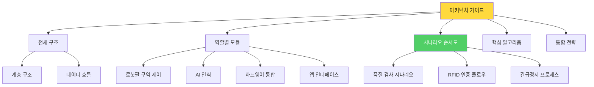

---

## 🌐 시스템 전체 구조

### 계층 아키텍처 (Layered Architecture) - Day3 업데이트

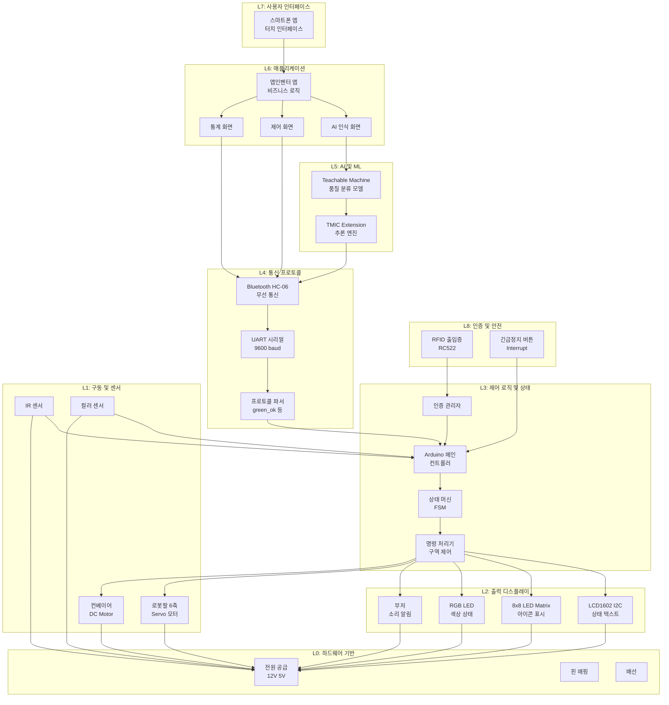

### 역할별 시스템 구조도

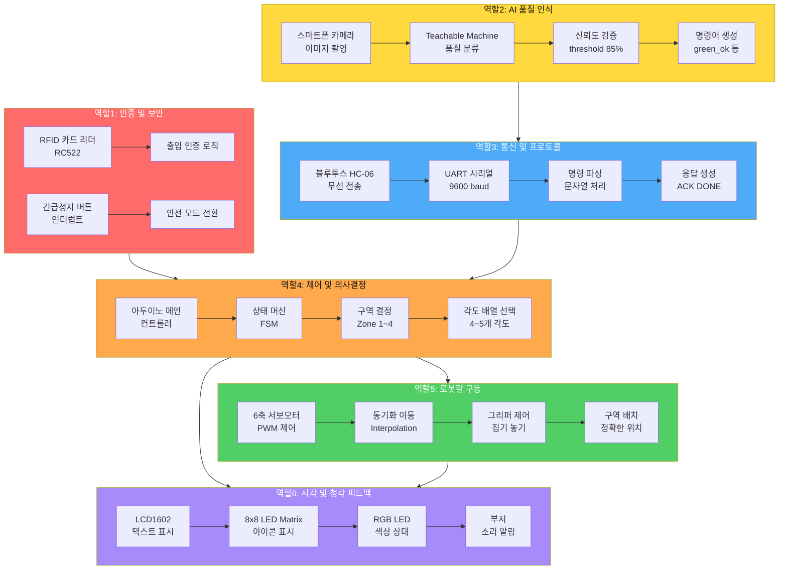

### 전체 시나리오 순서도

#### 시나리오: 스마트 팩토리 품질 검사 라인

```mermaid
graph TD
    START([시스템 시작]) --> INIT[하드웨어 초기화]
    INIT --> LCD_INIT[LCD: Smart Factory]
    LCD_INIT --> WAIT_RFID[RFID 카드 대기]
    
    WAIT_RFID --> TAG{카드 태그?}
    TAG -->|No| WAIT_RFID
    TAG -->|Yes| AUTH_CHECK{인증 확인}
    
    AUTH_CHECK -->|실패| DENY[LCD: Access Denied<br/>부저: 경고음<br/>RGB: 빨강]
    DENY --> WAIT_RFID
    
    AUTH_CHECK -->|성공| GRANT[LCD: Access Granted<br/>부저: 성공음<br/>RGB: 초록]
    GRANT --> ENABLE[시스템 활성화]
    
    ENABLE --> READY[LCD: Ready<br/>LED Matrix: 대기 아이콘]
    READY --> WAIT_AI[AI 촬영 대기]
    
    WAIT_AI --> CAPTURE{앱에서<br/>촬영?}
    CAPTURE -->|No| CHECK_EMERGENCY{긴급정지<br/>버튼?}
    CHECK_EMERGENCY -->|Yes| EMERGENCY_STOP
    CHECK_EMERGENCY -->|No| WAIT_AI
    
    CAPTURE -->|Yes| AI_INFERENCE[Teachable Machine<br/>품질 판정]
    AI_INFERENCE --> AI_RESULT{신뢰도<br/>>85%?}
    
    AI_RESULT -->|No| RETRY[앱: 재촬영 요청<br/>TTS: 다시 시도]
    RETRY --> WAIT_AI
    
    AI_RESULT -->|Yes| CLASSIFY{품질 분류}
    
    CLASSIFY -->|GREEN| CMD_GREEN[명령: green_ok]
    CLASSIFY -->|RED| CMD_RED[명령: red_defect]
    CLASSIFY -->|YELLOW| CMD_YELLOW[명령: yellow_recheck]
    CLASSIFY -->|BLUE| CMD_BLUE[명령: blue_special]
    
    CMD_GREEN --> SEND_BT[블루투스 전송]
    CMD_RED --> SEND_BT
    CMD_YELLOW --> SEND_BT
    CMD_BLUE --> SEND_BT
    
    SEND_BT --> ARDUINO_RECV[아두이노 수신<br/>명령 파싱]
    
    ARDUINO_RECV --> UPDATE_LCD[LCD 업데이트<br/>예: OK: GREEN]
    UPDATE_LCD --> UPDATE_LED[LED Matrix<br/>아이콘 표시]
    UPDATE_LED --> UPDATE_RGB[RGB LED<br/>색상 표시]
    UPDATE_RGB --> PLAY_SOUND[부저 소리]
    
    PLAY_SOUND --> SELECT_ZONE{구역 선택}
    
    SELECT_ZONE -->|Zone 1| ZONE1[각도 배열 로드<br/>ZONE1_ANGLES]
    SELECT_ZONE -->|Zone 2| ZONE2[각도 배열 로드<br/>ZONE2_ANGLES]
    SELECT_ZONE -->|Zone 3| ZONE3[각도 배열 로드<br/>ZONE3_ANGLES]
    SELECT_ZONE -->|Zone 4| ZONE4[각도 배열 로드<br/>ZONE4_ANGLES]
    
    ZONE1 --> PICK[STEP 1: 물체 집기<br/>PICK_POS]
    ZONE2 --> PICK
    ZONE3 --> PICK
    ZONE4 --> PICK
    
    PICK --> MOVE_ZONE[STEP 2: 구역 이동<br/>ZONE_MOVE]
    MOVE_ZONE --> PLACE[STEP 3: 배치<br/>ZONE_PLACE]
    PLACE --> RELEASE[STEP 4: 놓기<br/>ZONE_RELEASE]
    
    RELEASE --> HOME_RETURN[STEP 5: 홈 복귀<br/>HOME_POS]
    
    HOME_RETURN --> SEND_ACK[아두이노 → 앱<br/>DONE:Zone1]
    SEND_ACK --> UPDATE_STATS[앱: 통계 업데이트<br/>차트 갱신]
    
    UPDATE_STATS --> COMPLETE_SOUND[부저: 완료음<br/>삡삡삡]
    COMPLETE_SOUND --> LCD_COMPLETE[LCD: Complete!]
    
    LCD_COMPLETE --> NEXT{다음 제품?}
    NEXT -->|Yes| WAIT_AI
    NEXT -->|No| LOGOUT{로그아웃?}
    
    LOGOUT -->|Yes| WAIT_RFID
    LOGOUT -->|No| WAIT_AI
    
    EMERGENCY_STOP[긴급정지 프로세스] --> E1[모든 서보 정지<br/>servo.detach]
    E1 --> E2[LCD: EMERGENCY!!]
    E2 --> E3[LED Matrix: 경고 패턴]
    E3 --> E4[RGB LED: 빨강 깜빡임]
    E4 --> E5[부저: 연속 경고음]
    E5 --> E6[시리얼: EMERGENCY:STOP]
    E6 --> SAFE_MODE[안전 모드<br/>재시작 필요]
    SAFE_MODE --> END([시스템 종료])
    
    style START fill:#99E9F2,color:#111
    style GRANT fill:#51CF66,color:#fff
    style DENY fill:#FF6B6B,color:#fff
    style AI_INFERENCE fill:#FFD93D,color:#111
    style PICK fill:#FFA94D,color:#111
    style COMPLETE_SOUND fill:#51CF66,color:#fff
    style EMERGENCY_STOP fill:#FF6B6B,color:#fff
    style END fill:#868E96,color:#fff
```

---

## 🤖 모듈 1: 로봇팔 구역별 제어 시스템

### 로봇팔 아키텍처 (6축)

#### 하드웨어 구조

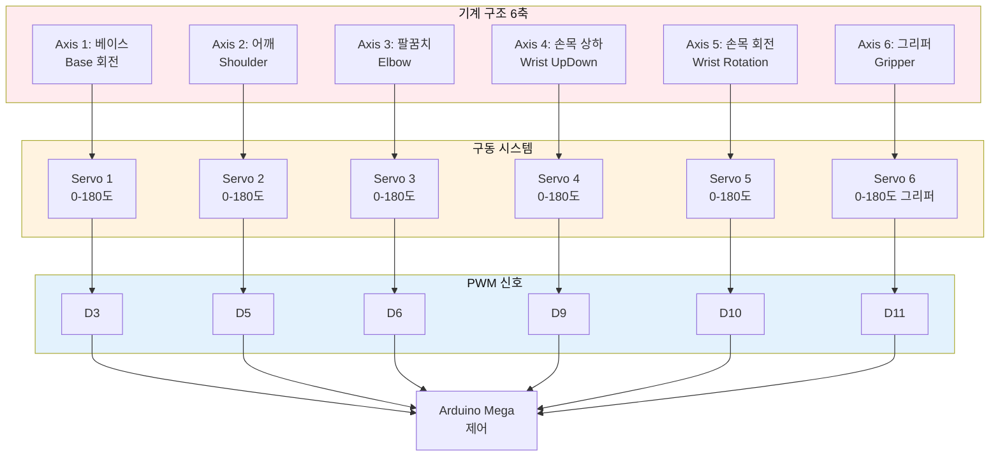

### 구역별 동작 구조

#### 4개 구역 매핑

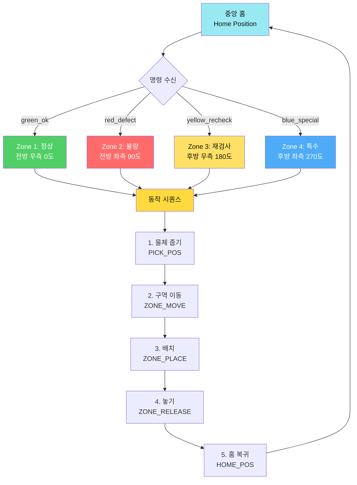

#### 각도 배열 구조

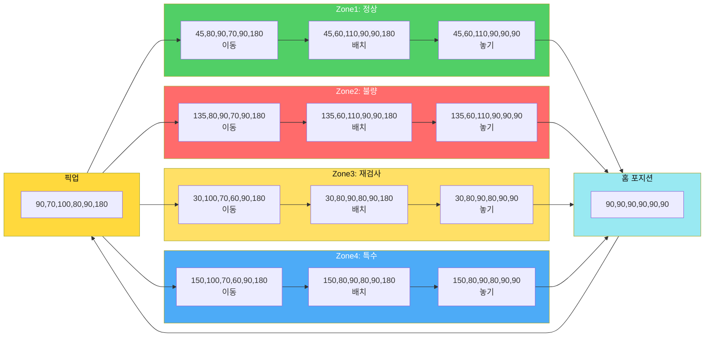

#### 좌표 시스템

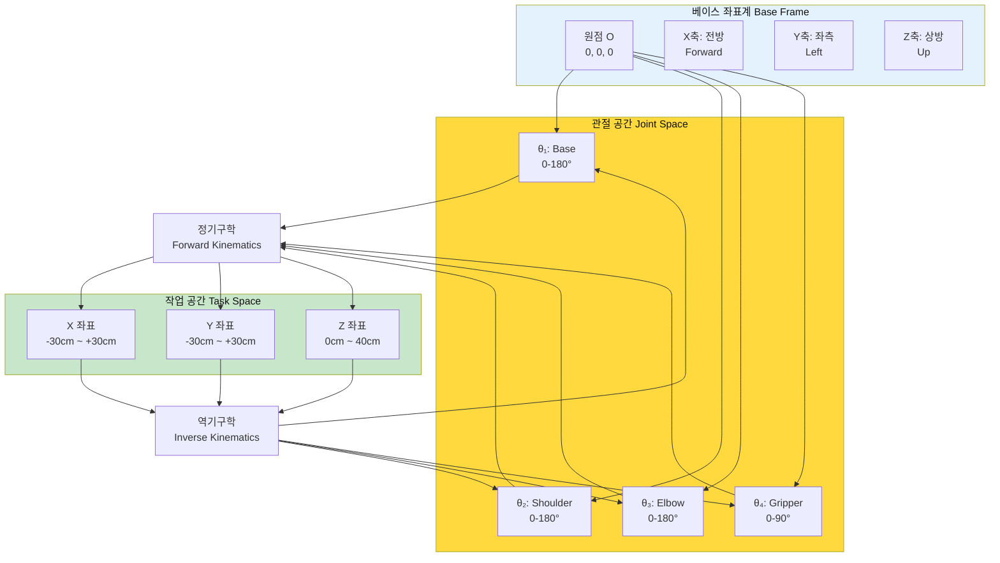

### 핵심 알고리즘: 동기화 이동

#### 알고리즘 흐름

```mermaid
graph TD
    START[입력:<br/>targetAngles[4]] --> VALIDATE[각도 범위<br/>검증]
    
    VALIDATE --> CALC_DIST[각 축별<br/>거리 계산]
    CALC_DIST -.공식.-> FORMULA1["d[i] = |target[i] - current[i]|"]
    
    CALC_DIST --> FIND_MAX[최대 거리<br/>찾기]
    FIND_MAX -.공식.-> FORMULA2["maxDist = max(d[0], d[1], d[2], d[3])"]
    
    FIND_MAX --> CALC_STEPS[스텝 수<br/>결정]
    CALC_STEPS -.공식.-> FORMULA3["steps = maxDist / stepSize"]
    
    CALC_STEPS --> LOOP_START[FOR step = 1 TO steps]
    
    LOOP_START --> CALC_RATIO[진행 비율<br/>계산]
    CALC_RATIO -.공식.-> FORMULA4["ratio = step / steps"]
    
    CALC_RATIO --> INTERPOLATE[선형 보간<br/>계산]
    INTERPOLATE -.공식.-> FORMULA5["angle[i] = current[i] +<br/>(target[i] - current[i]) × ratio"]
    
    INTERPOLATE --> MOVE_ALL[4축 동시<br/>이동]
    MOVE_ALL --> DELAY[delay<br/>stepDelay ms]
    
    DELAY --> CHECK_LOOP{step < steps?}
    CHECK_LOOP -->|Yes| LOOP_START
    CHECK_LOOP -->|No| FINAL_POS[최종 위치<br/>보정]
    
    FINAL_POS --> UPDATE[currentAngles<br/>업데이트]
    UPDATE --> DONE[완료]
    
    style START fill:#99E9F2,color:#111
    style INTERPOLATE fill:#FFD93D,color:#111
    style DONE fill:#51CF66,color:#fff
```

#### 타이밍 다이어그램

```mermaid
gantt
    title 동기화 이동 타이밍 (90도 → 45도, 45도 → 90도)
    dateFormat X
    axisFormat %L ms
    
    section Axis 1 (Base)
    이동 45도: a1, 0, 45
    
    section Axis 2 (Shoulder)
    이동 45도: a2, 0, 45
    
    section Axis 3 (Elbow)
    대기: a3_wait, 0, 45
    
    section Axis 4 (Gripper)
    대기: a4_wait, 0, 45
    
    section Timing
    Step Delay 15ms: crit, 0, 15
    Step Delay 15ms: crit, 15, 30
    Step Delay 15ms: crit, 30, 45
```

### 상태 머신

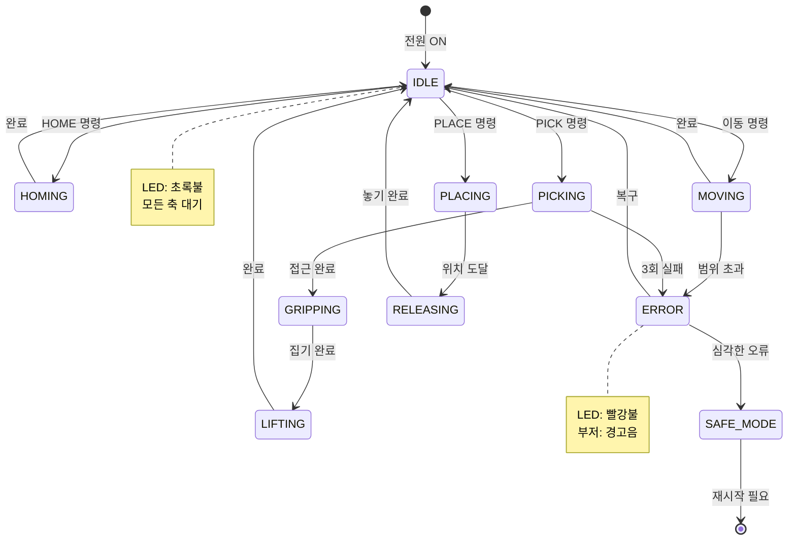

---

## 🚛 모듈 2: 컨베이어 시스템

### 컨베이어 아키텍처

#### 하드웨어 구성

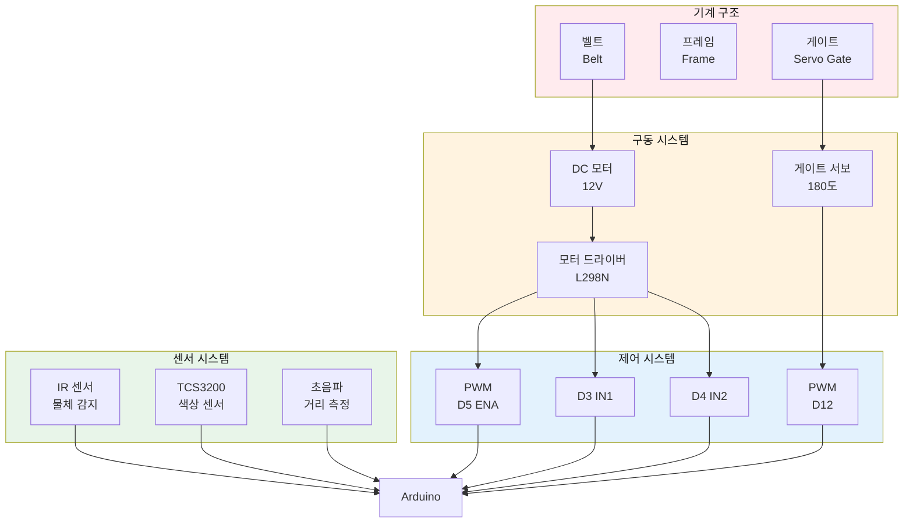

### 핵심 알고리즘: 색상 판단

#### TCS3200 센서 측정 알고리즘

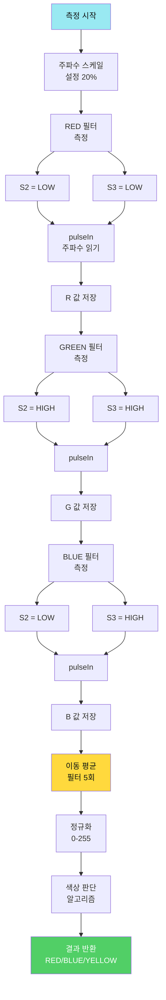

#### 유클리드 거리 계산

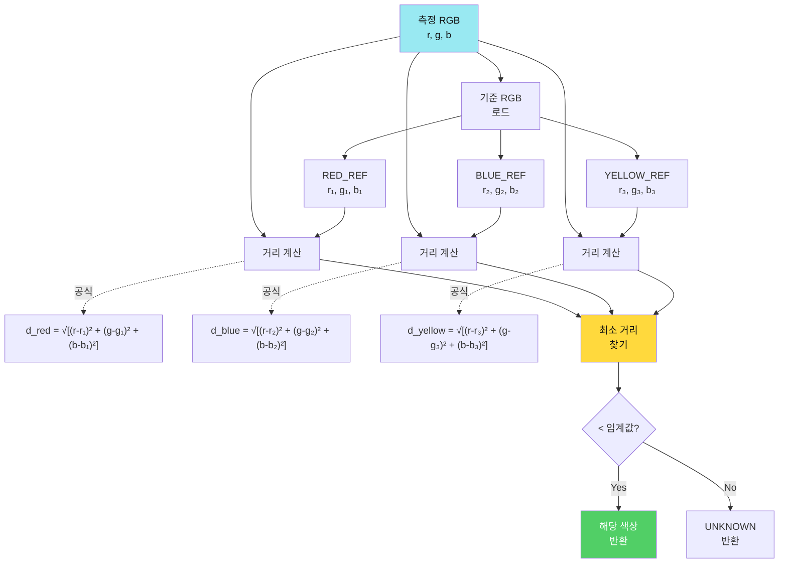

### 상태 머신

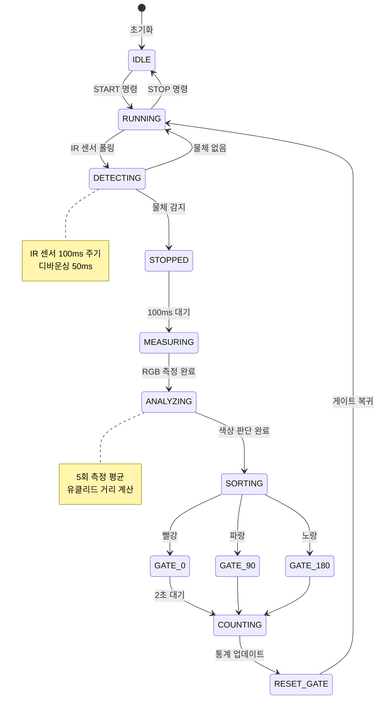

---

## 🤖 모듈 3: AI 인식 시스템

### AI 시스템 아키텍처

#### 전체 파이프라인

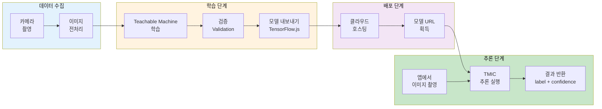

### 학습 알고리즘

#### 데이터 수집 전략

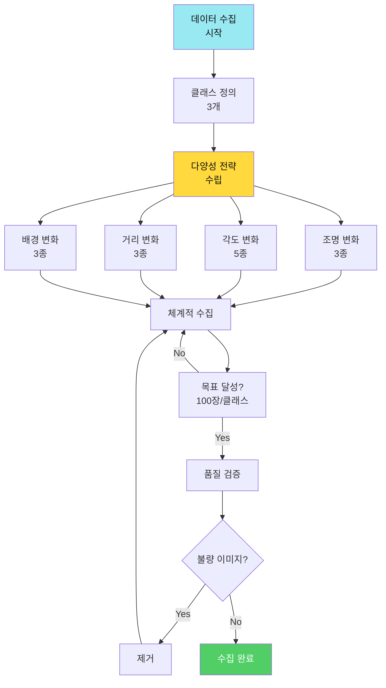

#### 학습 프로세스

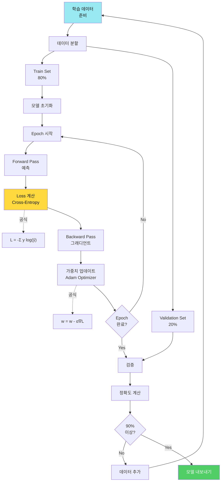

### 추론 알고리즘

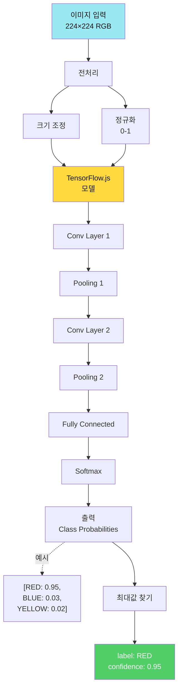

---

## 📱 모듈 4: 앱인벤터 앱

### 앱 아키텍처

#### MVC 패턴

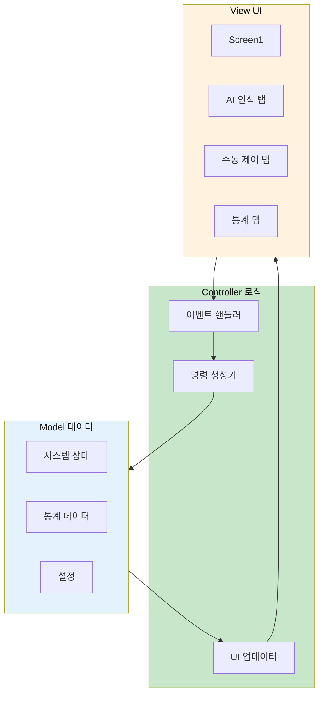

#### 화면 구성

```mermaid
graph TD
    APP[App Start] --> SPLASH[Splash Screen<br/>2초]
    SPLASH --> MAIN[Main Screen]
    
    MAIN --> TAB1[Tab 1:<br/>AI 인식]
    MAIN --> TAB2[Tab 2:<br/>수동 제어]
    MAIN --> TAB3[Tab 3:<br/>통계]
    
    TAB1 --> CAMERA[Camera<br/>Component]
    TAB1 --> TMIC[TMIC<br/>Extension]
    TAB1 --> IMG[Image<br/>Display]
    TAB1 --> RESULT[Result<br/>Label]
    TAB1 --> ZONE[Zone<br/>Spinner]
    
    TAB2 --> SLIDER1[Slider<br/>Base]
    TAB2 --> SLIDER2[Slider<br/>Shoulder]
    TAB2 --> SLIDER3[Slider<br/>Elbow]
    TAB2 --> SLIDER4[Slider<br/>Gripper]
    TAB2 --> BTN_SEND[Send<br/>Button]
    
    TAB3 --> CHART[Pie Chart]
    TAB3 --> TABLE[Statistics<br/>Table]
    TAB3 --> BTN_RESET[Reset<br/>Button]
    
    MAIN --> BT[BluetoothClient]
    MAIN --> CLOCK[Clock<br/>Timer 1s]
    
    style APP fill:#99E9F2,color:#111
    style MAIN fill:#FFD93D,color:#111
```

### 핵심 알고리즘: 이벤트 처리

#### AI 인식 플로우

```mermaid
sequenceDiagram
    participant User
    participant Button
    participant Camera
    participant TMIC
    participant Bluetooth
    participant Arduino
    
    User->>Button: 촬영 버튼 클릭
    Button->>Camera: TakePicture()
    Camera->>Camera: 사진 촬영
    Camera->>TMIC: AfterPicture(image)
    
    TMIC->>TMIC: 이미지 전처리
    TMIC->>TMIC: 모델 추론
    
    alt confidence > 0.8
        TMIC->>User: GotClassification(label, conf)
        User->>Button: Zone 선택 + 전송
        Button->>Bluetooth: SendText("AI_RED_1")
        Bluetooth->>Arduino: 명령 전달
        Arduino-->>Bluetooth: "OK:PICK"
        Bluetooth-->>User: 결과 표시
    else confidence <= 0.8
        TMIC->>User: "재촬영 필요"
    end
```

#### 블록 코딩 구조

```mermaid
graph TD
    INIT[Screen.Initialize] --> SETUP[초기 설정]
    
    SETUP --> LOAD_MODEL[TMIC.ModelURL<br/>설정]
    SETUP --> CONNECT_BT[Bluetooth<br/>연결 시도]
    SETUP --> START_TIMER[Clock.Timer<br/>시작]
    
    CLICK[Button_Capture.Click] --> TAKE[Camera.TakePicture]
    
    AFTER[Camera.AfterPicture] --> SHOW_IMG[Image.Picture<br/>← image]
    SHOW_IMG --> CLASSIFY[TMIC.ClassifyImage]
    
    GOT[TMIC.GotClassification] --> CHECK_CONF{confidence<br/> > 0.8?}
    CHECK_CONF -->|Yes| SHOW_RESULT[Label 업데이트]
    CHECK_CONF -->|No| RETRY[재촬영 요청]
    
    SHOW_RESULT --> GET_ZONE[Spinner 값 읽기]
    GET_ZONE --> BUILD_CMD[명령 문자열<br/>생성]
    BUILD_CMD -.예시.-> CMD_EX["AI_RED_1"]
    
    BUILD_CMD --> SEND[Bluetooth.SendText]
    
    TIMER[Clock.Timer] --> REQUEST[상태 요청<br/>?]
    REQUEST --> RECEIVE[Bluetooth.ReceiveText]
    RECEIVE --> PARSE[데이터 파싱]
    PARSE --> UPDATE_UI[UI 업데이트]
    
    style INIT fill:#99E9F2,color:#111
    style CLASSIFY fill:#FFD93D,color:#111
    style SEND fill:#51CF66,color:#fff
```

---

## 🔗 통신 프로토콜 (Day3 업데이트)

### 블루투스 프로토콜 명세

#### 명령 프로토콜 구조

```mermaid
graph TD
    subgraph 앱_to_아두이노[앱 → 아두이노 명령]
        CMD1[green_ok<br/>정상 제품]
        CMD2[red_defect<br/>불량 제품]
        CMD3[yellow_recheck<br/>재검사]
        CMD4[blue_special<br/>특수 처리]
        CMD5[home<br/>홈 복귀]
        CMD6[emergency<br/>긴급정지]
    end
    
    subgraph 아두이노_처리[아두이노 처리]
        PARSE[명령 파싱<br/>readStringUntil]
        AUTH[인증 확인<br/>RFID]
        EXECUTE[실행<br/>executeZone]
        DISPLAY[디스플레이<br/>LCD LED]
    end
    
    subgraph 아두이노_to_앱[아두이노 → 앱 응답]
        RESP1[ACK:green_ok<br/>명령 수신]
        RESP2[DONE:Zone1<br/>작업 완료]
        RESP3[ERROR:unauthorized<br/>인증 실패]
        RESP4[ERROR:emergency_stop<br/>긴급정지]
    end
    
    CMD1 --> PARSE
    CMD2 --> PARSE
    CMD3 --> PARSE
    CMD4 --> PARSE
    CMD5 --> PARSE
    CMD6 --> PARSE
    
    PARSE --> AUTH
    AUTH --> EXECUTE
    EXECUTE --> DISPLAY
    
    DISPLAY --> RESP1
    DISPLAY --> RESP2
    DISPLAY --> RESP3
    DISPLAY --> RESP4
    
    style 앱_to_아두이노 fill:#E3F2FD,color:#111
    style 아두이노_처리 fill:#FFD93D,color:#111
    style 아두이노_to_앱 fill:#C8E6C9,color:#111
```

#### 프로토콜 상세 명세 (Day3)

| 방향 | 명령어 | 형식 | 예시 | 동작 | LCD 표시 | LED 아이콘 |
|------|--------|------|------|------|---------|-----------|
| 앱→아두이노 | 정상 제품 | `green_ok\n` | `green_ok` | Zone1 배치 | "OK: GREEN" | ✓ 체크 |
| 앱→아두이노 | 불량 제품 | `red_defect\n` | `red_defect` | Zone2 배치 | "NG: RED" | ✗ X표시 |
| 앱→아두이노 | 재검사 | `yellow_recheck\n` | `yellow_recheck` | Zone3 배치 | "RE: YELLOW" | ? 물음표 |
| 앱→아두이노 | 특수 처리 | `blue_special\n` | `blue_special` | Zone4 배치 | "SP: BLUE" | ★ 별 |
| 앱→아두이노 | 홈 복귀 | `home\n` | `home` | 홈 포지션 | "Home" | - |
| 앱→아두이노 | 긴급정지 | `emergency\n` | `emergency` | 즉시 정지 | "EMERGENCY!!" | ⚠ 경고 |
| 아두이노→앱 | 명령 수신 | `ACK:<cmd>\n` | `ACK:green_ok` | 수신 확인 | - | - |
| 아두이노→앱 | 작업 완료 | `DONE:<zone>\n` | `DONE:Zone1` | 동작 완료 | - | - |
| 아두이노→앱 | 오류: 인증 | `ERROR:unauthorized\n` | - | RFID 미인증 | "Tag RFID!" | - |
| 아두이노→앱 | 오류: 긴급 | `ERROR:emergency_stop\n` | - | 긴급정지 상태 | - | - |
| 아두이노→앱 | 오류: 명령 | `ERROR:unknown_command\n` | - | 알 수 없는 명령 | - | - |

#### 명령어 규칙

```
✅ 명령어 형식:
- 소문자 사용
- 언더스코어(_) 구분자
- 개행 문자(\n) 종료
- 10글자 이내

✅ 예시:
앱 전송: "green_ok\n"
아두이노 수신: "green_ok"
아두이노 응답: "ACK:green_ok\n"
작업 완료: "DONE:Zone1\n"

✅ 오류 처리:
- 빈 문자열 → ERROR:empty_command
- 미인증 상태 → ERROR:unauthorized  
- 긁정지 상태 → ERROR:emergency_stop
- 알 수 없는 명령 → ERROR:unknown_command
```

### 데이터 흐름 시퀀스 (Day3 완전 시나리오)

```mermaid
sequenceDiagram
    participant Worker as 작업자
    participant RFID as RFID 리더
    participant App as 앱인벤터
    participant Camera as 카메라
    participant TM as Teachable Machine
    participant BT as 블루투스
    participant Arduino as 아두이노
    participant LCD as LCD1602
    participant LED as LED Matrix
    participant Buzzer as 부저
    participant Robot as 로봇팔
    
    Note over Worker,Robot: 1. 출입 인증
    Worker->>RFID: 카드 태그
    RFID->>Arduino: UID 읽기
    Arduino->>Arduino: 인증 확인
    
    alt 인증 성공
        Arduino->>LCD: "Access Granted"
        Arduino->>Buzzer: 성공음 (삡)
        Arduino->>Arduino: systemEnabled = true
    else 인증 실패
        Arduino->>LCD: "Access Denied"
        Arduino->>Buzzer: 오류음 (삡...)
        Note over Worker,Robot: 시스템 사용 불가
    end
    
    Note over Worker,Robot: 2. AI 품질 인식
    Worker->>App: 촬영 버튼 클릭
    App->>Camera: TakePicture()
    Camera-->>App: image
    App->>TM: ClassifyImage(image)
    TM->>TM: AI 추론
    
    alt 신뢰도 > 85%
        TM-->>App: label: GREEN, confidence: 0.95
        App->>App: AI_to_Command("GREEN")
    else 신뢰도 낮음
        TM-->>App: confidence < 0.85
        App->>Worker: "재촬영 필요"
        Note over Worker,Robot: 다시 촬영
    end
    
    Note over Worker,Robot: 3. 명령 전송
    App->>BT: "green_ok\n"
    BT->>Arduino: UART 수신
    Arduino->>Arduino: parseCommand()
    
    Note over Worker,Robot: 4. 인증 확인
    alt systemEnabled == true
        Arduino->>BT: "ACK:green_ok\n"
        BT-->>App: 수신 확인
    else 미인증 상태
        Arduino->>BT: "ERROR:unauthorized\n"
        Arduino->>LCD: "Tag RFID First!"
        Note over Worker,Robot: 명령 거부
    end
    
    Note over Worker,Robot: 5. 디스플레이 업데이트
    Arduino->>LCD: "OK: GREEN<br/>Zone1 (Normal)"
    Arduino->>LED: 체크 아이콘 ✓
    Arduino->>Buzzer: 작업 시작음
    
    Note over Worker,Robot: 6. 로봇팔 동작
    Arduino->>Robot: moveToPosition(PICK_POS)
    Robot-->>Arduino: 완료
    Arduino->>Robot: moveToPosition(ZONE1_MOVE)
    Robot-->>Arduino: 완료
    Arduino->>Robot: moveToPosition(ZONE1_PLACE)
    Robot-->>Arduino: 완료
    Arduino->>Robot: moveToPosition(ZONE1_RELEASE)
    Robot-->>Arduino: 완료
    Arduino->>Robot: moveToPosition(HOME_POS)
    Robot-->>Arduino: 완료
    
    Note over Worker,Robot: 7. 완료 알림
    Arduino->>BT: "DONE:Zone1\n"
    BT-->>App: 수신
    App->>App: 통계 업데이트 (countGreen++)
    Arduino->>LCD: "Complete!"
    Arduino->>Buzzer: 완료음 (삡삡삡)
    Arduino->>LED: 완료 아이콘
    
    Note over Worker,Robot: 8. 다음 제품 대기
    Arduino->>LCD: "Ready..."
    
    Note over Worker,Robot: 긴급 상황 (언제든지)
    Worker->>Arduino: 긴급정지 버튼
    Arduino->>Robot: servo.detach() 모든 축
    Arduino->>LCD: "!! EMERGENCY !!"
    Arduino->>LED: 경고 패턴 깜빡임
    Arduino->>Buzzer: 연속 경고음
    Arduino->>BT: "ERROR:emergency_stop\n"
```

---

## 🔌 모듈 5: 하드웨어 통합 시스템 (Day3 신규)

### 하드웨어 통합 아키텍처

#### 입출력 디바이스 구성

```mermaid
graph TD
    subgraph 입력장치[입력 장치 Input]
        I1[RFID RC522<br/>SPI 통신]
        I2[긴급정지 버튼<br/>D2 인터럽트]
        I3[블루투스 HC-06<br/>RX TX]
    end
    
    subgraph 제어장치[제어 장치 Control]
        C1[Arduino Mega<br/>메인 컨트롤러]
        C2[상태 머신<br/>FSM]
        C3[인증 관리자]
        C4[긴급정지 핸들러]
    end
    
    subgraph 출력장치[출력 장치 Output]
        O1[LCD1602 I2C<br/>SDA A4 SCL A5]
        O2[8x8 LED Matrix<br/>DIN12 CS10 CLK11]
        O3[RGB LED<br/>D7 D6 D5]
        O4[Passive Buzzer<br/>D8 PWM]
    end
    
    subgraph 구동장치[구동 장치 Actuator]
        A1[로봇팔 6축<br/>Servo D3~D11]
        A2[컨베이어<br/>DC Motor]
        A3[게이트<br/>Servo]
    end
    
    I1 --> C3
    I2 --> C4
    I3 --> C1
    
    C3 --> C1
    C4 --> C1
    C1 --> C2
    
    C2 --> O1
    C2 --> O2
    C2 --> O3
    C2 --> O4
    C2 --> A1
    C2 --> A2
    C2 --> A3
    
    style 입력장치 fill:#E3F2FD,color:#111
    style 제어장치 fill:#FFD93D,color:#111
    style 출력장치 fill:#A78BFA,color:#fff
    style 구동장치 fill:#51CF66,color:#fff
```

### LCD1602 역할 및 표시 내용

#### 상태별 LCD 표시

| 상태 | Line 1 | Line 2 | 의미 |
|------|--------|--------|------|
| **초기화** | "Smart Factory" | "Ready..." | 시스템 준비 완료 |
| **RFID 대기** | "Tag RFID Card" | "" | 카드 태그 대기 |
| **인증 성공** | "Access Granted" | "Welcome!" | 출입 허가 |
| **인증 실패** | "Access Denied" | "Try Again" | 출입 거부 |
| **정상 제품** | "OK: GREEN" | "Zone1 (Normal)" | 정상 구역 배치 |
| **불량 제품** | "NG: RED" | "Zone2 (Defect)" | 불량 구역 배치 |
| **재검사** | "RE: YELLOW" | "Zone3 (Recheck)" | 재검사 구역 |
| **특수 처리** | "SP: BLUE" | "Zone4 (Special)" | 특수 구역 배치 |
| **작업 완료** | "Complete!" | "Next Item..." | 작업 완료 |
| **긴급정지** | "!! EMERGENCY !!" | "System Stopped" | 긴급 정지 |

#### LCD 제어 알고리즘

```mermaid
graph TD
    CMD[명령 수신] --> CLEAR[lcd.clear]
    CLEAR --> SET_LINE1[lcd.setCursor 0 0]
    SET_LINE1 --> PRINT1[lcd.print 메시지1]
    PRINT1 --> SET_LINE2[lcd.setCursor 0 1]
    SET_LINE2 --> PRINT2[lcd.print 메시지2]
    PRINT2 --> DONE[표시 완료]
    
    style CMD fill:#99E9F2,color:#111
    style DONE fill:#51CF66,color:#fff
```

### LED Matrix 역할 및 아이콘

#### 명령어별 아이콘 패턴

```mermaid
graph LR
    subgraph ICONS[8x8 LED 아이콘]
        I1[체크 ✓<br/>green_ok]
        I2[X 표시 ✗<br/>red_defect]
        I3[물음표 ?<br/>yellow_recheck]
        I4[별 ★<br/>blue_special]
        I5[화살표 ↑<br/>작업 중]
        I6[경고 ⚠<br/>emergency]
    end
    
    COMMAND{명령} --> I1
    COMMAND --> I2
    COMMAND --> I3
    COMMAND --> I4
    COMMAND --> I5
    COMMAND --> I6
    
    style ICONS fill:#4DABF7,color:#fff
```

#### 아이콘 비트맵 (8x8)

```
✓ 체크 (ICON_CHECK):
  0x00, 0x01, 0x03, 0x06, 0x6C, 0x78, 0x30, 0x00

✗ X표시 (ICON_CROSS):
  0x42, 0x24, 0x18, 0x18, 0x18, 0x18, 0x24, 0x42

? 물음표 (ICON_QUESTION):
  0x3C, 0x42, 0x02, 0x04, 0x08, 0x00, 0x08, 0x00

★ 별 (ICON_STAR):
  0x10, 0x10, 0x7C, 0x38, 0x7C, 0x44, 0x82, 0x00
```

### RFID 인증 시스템

#### RFID 인증 플로우

```mermaid
graph TD
    START[RFID 스캔 대기] --> DETECT{카드 감지?}
    DETECT -->|No| START
    DETECT -->|Yes| READ[UID 읽기]
    
    READ --> CHECK[등록된 UID와 비교]
    
    CHECK --> MATCH1{UID1 일치?}
    MATCH1 -->|Yes| AUTH_OK
    MATCH1 -->|No| MATCH2{UID2 일치?}
    
    MATCH2 -->|Yes| AUTH_OK
    MATCH2 -->|No| AUTH_FAIL
    
    AUTH_OK[인증 성공] --> ENABLE[systemEnabled = true]
    ENABLE --> LCD_OK[LCD: Access Granted]
    LCD_OK --> RGB_GREEN[RGB: 초록색]
    RGB_GREEN --> SOUND_OK[부저: 성공음]
    SOUND_OK --> READY[시스템 사용 가능]
    
    AUTH_FAIL[인증 실패] --> DISABLE[systemEnabled = false]
    DISABLE --> LCD_FAIL[LCD: Access Denied]
    LCD_FAIL --> RGB_RED[RGB: 빨간색]
    RGB_RED --> SOUND_FAIL[부저: 오류음]
    SOUND_FAIL --> HALT[명령 거부]
    
    HALT --> START
    
    style AUTH_OK fill:#51CF66,color:#fff
    style AUTH_FAIL fill:#FF6B6B,color:#fff
```

#### 등록된 UID 관리

```cpp
// 등록된 카드 UID (예시)
byte authorizedUID1[] = {0xDE, 0xAD, 0xBE, 0xEF};  // 관리자
byte authorizedUID2[] = {0xCA, 0xFE, 0xBA, 0xBE};  // 작업자

bool checkAuthorization(byte* uid, byte size) {
  if (size != 4) return false;
  
  if (compareUID(uid, authorizedUID1, size)) return true;
  if (compareUID(uid, authorizedUID2, size)) return true;
  
  return false;
}
```

### 긴급정지 시스템

#### 인터럽트 기반 긴급정지

```mermaid
graph TD
    NORMAL[정상 동작 중] --> BTN{긴급정지<br/>버튼 누름?}
    BTN -->|No| NORMAL
    BTN -->|Yes| ISR[인터럽트<br/>핸들러 실행]
    
    ISR --> FLAG[emergencyStop = true]
    FLAG --> DETACH[모든 서보<br/>detach]
    DETACH --> LCD_E[LCD: EMERGENCY!!]
    LCD_E --> LED_E[LED: 경고 패턴]
    LED_E --> RGB_E[RGB: 빨강 깜빡임]
    RGB_E --> BUZZER_E[부저: 연속 경고음]
    BUZZER_E --> SERIAL_E[시리얼: ERROR:emergency_stop]
    
    SERIAL_E --> SAFE[안전 모드]
    SAFE --> RESTART{재시작?}
    RESTART -->|Yes| RESET[시스템 리셋]
    RESTART -->|No| HALT[정지 상태 유지]
    
    style ISR fill:#FF6B6B,color:#fff
    style SAFE fill:#FA5252,color:#fff
```

#### 긴급정지 인터럽트 코드

```cpp
volatile bool emergencyStop = false;

void setup() {
  pinMode(EMERGENCY_BTN, INPUT_PULLUP);
  attachInterrupt(digitalPinToInterrupt(EMERGENCY_BTN), 
                  handleEmergency, FALLING);
}

void handleEmergency() {
  emergencyStop = true;
  
  // 모든 서보 즉시 정지
  for (int i = 0; i < 6; i++) {
    servos[i].detach();
  }
  
  lcd.clear();
  lcd.print("!! EMERGENCY !!");
  
  Serial.println("ERROR:emergency_stop");
}
```

### 부저 소리 패턴

#### 상황별 부저 알림

| 상황 | 주파수 | 지속시간 | 패턴 | 코드 |
|------|--------|---------|------|------|
| **성공음** | 1000Hz, 1500Hz | 200ms × 2 | 삡 삡 | `playSuccessSound()` |
| **오류음** | 500Hz | 500ms | 삡... | `playErrorSound()` |
| **경고음** | 800Hz, 400Hz | 200ms 반복 | 삡 삡 삡 삡 | `playWarningSound()` |
| **완료음** | 1000/1200/1500Hz | 100ms × 3 | 삡삡삡 | `playCompleteSound()` |
| **긴급음** | 800Hz, 400Hz | 연속 | 삐-삐-삐- | `playEmergencySound()` |

```mermaid
graph LR
    EVENT{이벤트} --> SUCCESS[성공<br/>1000Hz 200ms<br/>1500Hz 200ms]
    EVENT --> ERROR[오류<br/>500Hz 500ms]
    EVENT --> WARNING[경고<br/>800Hz 200ms<br/>400Hz 200ms 반복]
    EVENT --> COMPLETE[완료<br/>1000/1200/1500Hz<br/>100ms 각]
    EVENT --> EMERGENCY[긴급<br/>800/400Hz<br/>연속]
    
    style SUCCESS fill:#51CF66,color:#fff
    style ERROR fill:#FF6B6B,color:#fff
    style EMERGENCY fill:#FA5252,color:#fff
```

---

## ⚙️ 핵심 알고리즘 모음

### 1. 제어 알고리즘

#### PID 제어 (선택적)

```mermaid
graph TD
    TARGET[목표값<br/>Target] --> ERROR[오차 계산<br/>e = target - current]
    CURRENT[현재값<br/>Current] --> ERROR
    
    ERROR --> P[비례 P<br/>Kp × e]
    ERROR --> I[적분 I<br/>Ki × Σe]
    ERROR --> D[미분 D<br/>Kd × Δe]
    
    P & I & D --> SUM[합산]
    SUM --> OUTPUT[제어 출력]
    
    OUTPUT --> ACTUATOR[액츄에이터]
    ACTUATOR --> FEEDBACK[피드백]
    FEEDBACK --> CURRENT
    
    style TARGET fill:#99E9F2,color:#111
    style SUM fill:#FFD93D,color:#111
    style OUTPUT fill:#51CF66,color:#fff
```

### 2. 필터 알고리즘

#### 이동 평균 필터

```mermaid
graph TD
    NEW[새 샘플<br/>입력] --> BUFFER[순환 버퍼]
    BUFFER -.크기.-> SIZE[windowSize = 5]
    
    BUFFER --> ADD[버퍼에 추가]
    ADD --> FULL{버퍼<br/>가득?}
    FULL -->|No| WAIT[대기]
    FULL -->|Yes| SUM[합계 계산]
    
    SUM --> AVG[평균 계산]
    AVG -.공식.-> FORMULA["avg = Σsamples / windowSize"]
    
    AVG --> OUTPUT[필터링된<br/>값 출력]
    
    style NEW fill:#99E9F2,color:#111
    style AVG fill:#FFD93D,color:#111
    style OUTPUT fill:#51CF66,color:#fff
```

#### 칼만 필터 (고급)

```mermaid
graph TD
    PREDICT[예측 단계<br/>Prediction] --> P1[상태 예측<br/>x̂ = Ax + Bu]
    P1 --> P2[오차 예측<br/>P = APA' + Q]
    
    UPDATE[업데이트 단계<br/>Update] --> U1[칼만 이득<br/>K = PH'/(HPH'+R)]
    U1 --> U2[상태 업데이트<br/>x̂ = x̂ + K(z-Hx̂)]
    U2 --> U3[오차 업데이트<br/>P = (I-KH)P]
    
    P2 --> UPDATE
    U3 --> PREDICT
    
    style PREDICT fill:#FFD93D,color:#111
    style UPDATE fill:#FFA94D,color:#111
```

### 3. 의사결정 알고리즘

#### 규칙 기반 시스템

```mermaid
graph TD
    INPUT[입력<br/>센서 데이터] --> RULE1{규칙 1:<br/>IR 감지?}
    
    RULE1 -->|Yes| RULE2{규칙 2:<br/>색상 판단}
    RULE1 -->|No| IDLE[대기]
    
    RULE2 -->|빨강| ACTION1[게이트 0도]
    RULE2 -->|파랑| ACTION2[게이트 90도]
    RULE2 -->|노랑| ACTION3[게이트 180도]
    RULE2 -->|기타| ERROR[오류 처리]
    
    ACTION1 & ACTION2 & ACTION3 --> OUTPUT[실행]
    
    style INPUT fill:#99E9F2,color:#111
    style RULE1 fill:#FFD93D,color:#111
    style OUTPUT fill:#51CF66,color:#fff
```

---

## 🔄 시스템 통합 전략

### 모듈 통합 순서

```mermaid
graph TD
    START[개별 모듈<br/>개발 완료] --> INT1[통합 1단계]
    
    INT1 --> STEP1[로봇팔 + 앱<br/>블루투스 연결]
    STEP1 --> TEST1[기본 제어<br/>테스트]
    TEST1 --> VERIFY1{성공?}
    VERIFY1 -->|No| DEBUG1[디버깅]
    DEBUG1 --> STEP1
    VERIFY1 -->|Yes| INT2
    
    INT2[통합 2단계] --> STEP2[컨베이어 + 센서<br/>추가]
    STEP2 --> TEST2[센서 연동<br/>테스트]
    TEST2 --> VERIFY2{성공?}
    VERIFY2 -->|No| DEBUG2[디버깅]
    DEBUG2 --> STEP2
    VERIFY2 -->|Yes| INT3
    
    INT3[통합 3단계] --> STEP3[AI 모델<br/>연동]
    STEP3 --> TEST3[AI 추론<br/>테스트]
    TEST3 --> VERIFY3{성공?}
    VERIFY3 -->|No| DEBUG3[디버깅]
    DEBUG3 --> STEP3
    VERIFY3 -->|Yes| INT4
    
    INT4[통합 4단계] --> STEP4[전체 시스템<br/>통합]
    STEP4 --> TEST4[End-to-End<br/>테스트]
    TEST4 --> VERIFY4{성공?}
    VERIFY4 -->|No| DEBUG4[최적화]
    DEBUG4 --> STEP4
    VERIFY4 -->|Yes| DONE[통합 완료]
    
    style START fill:#99E9F2,color:#111
    style INT1 fill:#FFD93D,color:#111
    style INT2 fill:#FFD93D,color:#111
    style INT3 fill:#FFD93D,color:#111
    style INT4 fill:#FFD93D,color:#111
    style DONE fill:#51CF66,color:#fff
```

### 인터페이스 설계 원칙

```mermaid
graph TD
    PRINCIPLE[인터페이스<br/>설계 원칙] --> P1[명확성<br/>Clear]
    PRINCIPLE --> P2[일관성<br/>Consistent]
    PRINCIPLE --> P3[최소성<br/>Minimal]
    PRINCIPLE --> P4[견고성<br/>Robust]
    
    P1 --> E1[명확한 입출력<br/>정의]
    P2 --> E2[프로토콜<br/>표준화]
    P3 --> E3[최소 의존성<br/>유지]
    P4 --> E4[오류 처리<br/>필수]
    
    style PRINCIPLE fill:#FFD93D,color:#111
```

---

## 📈 성능 최적화

### 병목 지점 분석

```mermaid
graph TD
    PROFILE[프로파일링] --> MEASURE[시간 측정]
    
    MEASURE --> T1[로봇팔 이동<br/>5초]
    MEASURE --> T2[AI 추론<br/>3초]
    MEASURE --> T3[센서 측정<br/>1초]
    MEASURE --> T4[통신<br/>0.5초]
    
    T1 & T2 & T3 & T4 --> ANALYZE[분석]
    ANALYZE --> BOTTLENECK[병목: AI 추론<br/>3초]
    
    BOTTLENECK --> OPTIMIZE[최적화 전략]
    OPTIMIZE --> O1[이미지 크기<br/>감소]
    OPTIMIZE --> O2[모델 경량화<br/>선택]
    OPTIMIZE --> O3[비동기 처리]
    
    O1 & O2 & O3 --> RETEST[재측정]
    RETEST --> IMPROVED[개선: 1.5초<br/>50% 향상]
    
    style BOTTLENECK fill:#FF6B6B,color:#fff
    style IMPROVED fill:#51CF66,color:#fff
```

---

## 🎓 확장 가능성

### 시스템 확장 로드맵

```mermaid
graph TD
    CURRENT[현재 시스템<br/>3일 완성] --> EXPAND[확장 방향]
    
    EXPAND --> EXP1[하드웨어<br/>확장]
    EXPAND --> EXP2[소프트웨어<br/>확장]
    EXPAND --> EXP3[AI<br/>확장]
    
    EXP1 --> H1[6축 로봇팔]
    EXP1 --> H2[비전 카메라]
    EXP1 --> H3[다중 센서]
    
    EXP2 --> S1[클라우드 연동]
    EXP2 --> S2[웹 대시보드]
    EXP2 --> S3[데이터베이스]
    
    EXP3 --> A1[객체 검출]
    EXP3 --> A2[강화학습]
    EXP3 --> A3[예측 유지보수]
    
    style CURRENT fill:#FFD93D,color:#111
    style EXP1 fill:#99E9F2,color:#111
    style EXP2 fill:#FFA94D,color:#111
    style EXP3 fill:#C8E6C9,color:#111
```

---

## 📊 시스템 통합 체크리스트

### 하드웨어 통합 확인

- [ ] **로봇팔 6축**: Servo 6개 정상 동작
- [ ] **LCD1602 I2C**: SDA(A4), SCL(A5) 연결, 텍스트 표시
- [ ] **8x8 LED Matrix**: DIN(12), CS(10), CLK(11) 연결, 아이콘 표시
- [ ] **RFID RC522**: SPI 통신, 카드 인식
- [ ] **긴급정지 버튼**: D2 인터럽트, 즉시 정지
- [ ] **RGB LED**: D7(R), D6(G), D5(B) 색상 표시
- [ ] **부저**: D8 PWM, 소리 알림

### 소프트웨어 통합 확인

- [ ] **명령어 프로토콜**: `green_ok`, `red_defect`, `yellow_recheck`, `blue_special`
- [ ] **RFID 인증**: 인증 성공/실패 처리
- [ ] **구역별 동작**: 4개 Zone 각도 배열
- [ ] **상태 머신**: FSM 정상 동작
- [ ] **긴급정지**: 인터럽트 정상 동작
- [ ] **블루투스 통신**: ACK, DONE, ERROR 응답

### AI 연동 확인

- [ ] **Teachable Machine**: 4가지 품질 분류 (GREEN/RED/YELLOW/BLUE)
- [ ] **신뢰도 검증**: 85% 이상
- [ ] **앱인벤터 TMIC**: 추론 성공
- [ ] **명령 생성**: AI 결과 → 명령어 변환

### 전체 시나리오 테스트

- [ ] **RFID 인증** → **AI 촬영** → **명령 전송** → **LCD/LED 표시** → **로봇팔 동작** → **완료 알림**
- [ ] **연속 5회 성공**
- [ ] **긴급정지 테스트**

---

## 🎯 시스템 확장 가이드

### Phase 1: 센서 추가 (난이도: ★★☆☆☆)

```mermaid
graph LR
    CURRENT[현재 시스템] --> ADD1[초음파 센서<br/>물체 감지]
    CURRENT --> ADD2[무게 센서<br/>중량 측정]
    CURRENT --> ADD3[온습도 센서<br/>환경 모니터링]
    
    style CURRENT fill:#FFD93D,color:#111
    style ADD1 fill:#99E9F2,color:#111
    style ADD2 fill:#99E9F2,color:#111
    style ADD3 fill:#99E9F2,color:#111
```

### Phase 2: 통신 업그레이드 (난이도: ★★★☆☆)

```mermaid
graph LR
    BT[Bluetooth<br/>현재] --> WIFI[WiFi ESP8266<br/>클라우드 연동]
    WIFI --> DB[데이터베이스<br/>실시간 저장]
    DB --> DASH[웹 대시보드<br/>원격 모니터링]
    
    style BT fill:#FFD93D,color:#111
    style WIFI fill:#4DABF7,color:#fff
    style DASH fill:#51CF66,color:#fff
```

### Phase 3: AI 고도화 (난이도: ★★★★☆)

```mermaid
graph LR
    TM[Teachable Machine<br/>분류] --> OD[Object Detection<br/>위치 인식]
    OD --> SEG[Segmentation<br/>영역 분할]
    SEG --> RL[강화학습<br/>자율 최적화]
    
    style TM fill:#FFD93D,color:#111
    style OD fill:#FFA94D,color:#111
    style RL fill:#FF6B6B,color:#fff
```

---

## 📚 참고 자료

### 주요 라이브러리

| 라이브러리 | 용도 | 설치 명령 |
|----------|------|----------|
| `Servo.h` | 서보모터 제어 | 기본 포함 |
| `LiquidCrystal_I2C.h` | LCD I2C 제어 | Arduino IDE 라이브러리 매니저 |
| `MD_MAX72xx.h` | LED Matrix 제어 | Arduino IDE 라이브러리 매니저 |
| `MFRC522.h` | RFID RC522 제어 | Arduino IDE 라이브러리 매니저 |
| `Wire.h` | I2C 통신 | 기본 포함 |
| `SPI.h` | SPI 통신 | 기본 포함 |

### 핀 매핑 요약

| 장치 | 핀 번호 | 통신 방식 |
|------|--------|----------|
| Servo 1 (Base) | D3 | PWM |
| Servo 2 (Shoulder) | D5 | PWM |
| Servo 3 (Elbow) | D6 | PWM |
| Servo 4 (Wrist UD) | D9 | PWM |
| Servo 5 (Wrist Rot) | D10 | PWM |
| Servo 6 (Gripper) | D11 | PWM |
| LCD1602 | A4(SDA), A5(SCL) | I2C |
| LED Matrix | D12(DIN), D10(CS), D11(CLK) | SPI |
| RFID RC522 | D10(SS), D9(RST) | SPI |
| 긴급정지 버튼 | D2 | Interrupt |
| RGB LED R | D7 | Digital |
| RGB LED G | D6 | Digital |
| RGB LED B | D5 | Digital |
| 부저 | D8 | PWM |
| 블루투스 HC-06 | RX(D0), TX(D1) | UART |

---

**시스템 아키텍처 가이드 완료!** 🎉

```
✨ Day3 업데이트 완료:

📱 AI 품질 인식: Teachable Machine 4가지 분류
🤖 구역별 제어: 4개 Zone 각도 배열
📟 LCD 표시: 실시간 상태 텍스트
💡 LED Matrix: 아이콘 시각화
🔐 RFID 인증: 출입 보안 시스템
🚨 긴급정지: 안전 장치
🔊 부저 + RGB: 소리/색상 피드백
📡 프로토콜: green_ok, red_defect 등
```

이제 구조를 이해했으니, 원리를 파악하고, 창의적으로 확장할 수 있습니다!

---

**Last Updated**: 2026-01-30  
**Version**: 2.0 (Day3 하드웨어 통합 + 시나리오 순서도)  
**제작**: Smart Factory Education Team  
**주요 업데이트**:
  - 역할별 시스템 구조도 추가
  - 전체 시나리오 순서도 추가 (RFID → AI → 로봇팔 → 디스플레이)
  - 하드웨어 통합 모듈 (LCD/LED Matrix/RFID/부저) 상세 설명
  - 명령어 프로토콜 Day3 업데이트 (green_ok 등)
  - 구역별 각도 배열 구조 추가
  - 긴급정지 인터럽트 시스템 추가
  - 데이터 흐름 시퀀스 완전 시나리오 반영
