# 📅 Day 1: 로봇팔 피지컬 컴퓨팅 (8시간)

> **"손으로 만지고, 코드로 제어하고, 음성으로 명령한다"**  
> 4축 로봇팔을 6단계로 정복하고 음성 제어까지 완성하는 피지컬 AI 여정

---

## 🎯 Day 1 학습 목표

### 최종 목표


### 학습 성과

- ✅ **피지컬 컴퓨팅**: 4축 로봇팔 하드웨어 완전 이해
- ✅ **단계별 학습**: 01~06단계 순차 학습 (~1,340줄)
- ✅ **핵심 알고리즘**: EEPROM 저장/복구, Bluetooth 버퍼링
- ✅ **음성 인터페이스**: STT/TTS 적용한 앱인벤터 제어
- ✅ **원격 제어**: 스마트폰으로 로봇팔 완전 제어

---

## ⏰ Day 1 시간표 (8시간)

| 교시 | 시간 | 활동 | 학습 내용 | 산출물 |
|------|------|------|----------|--------|
| **1교시** | 1h | 하드웨어 조립 | 로봇팔 4축 조립 + 배선 | 작동하는 로봇팔 |
| **2교시** | 1h | 01~02단계 | Servo 테스트 + 조이스틱 | 실시간 제어 |
| **3교시** | 1h | 03단계 | Serial 원격 제어 | 명령 파싱 |
| **4교시** | 1.5h | 04단계 ⭐ | EEPROM 자동화 | 저장/재생 |
| **5교시** | 1.5h | 05~06단계 ⭐⭐ | Bluetooth 무선 제어 | 완성된 로봇팔 |
| **6-7교시** | 2h | 음성 제어 앱 🎤 | STT/TTS 앱인벤터 | 음성 제어 완성 |

---

## 1교시: 🔧 하드웨어 조립과 이해 (1시간)

### 📦 부품 확인

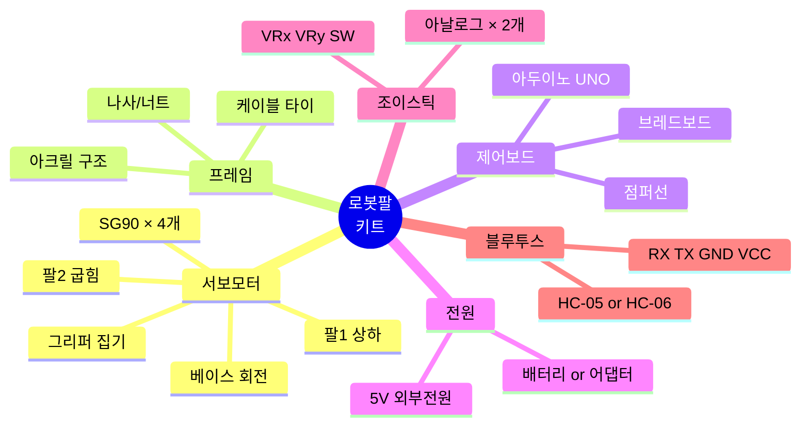

### 🛠️ 조립 프로세스

#### Step 1: 베이스 조립 (15분)


**체크 포인트**:
- [ ] 베이스 서보가 수평으로 고정되었나?
- [ ] 나사가 단단히 조여졌나?
- [ ] 서보 혼(Horn)이 중앙(90도)인가?

#### Step 2: 팔 조립 (20분)


**주의사항**:
- 서보 케이블이 꼬이지 않도록
- 각 관절이 자유롭게 움직이는지 확인
- 케이블을 케이블 타이로 정리

#### Step 3: 배선 (15분)

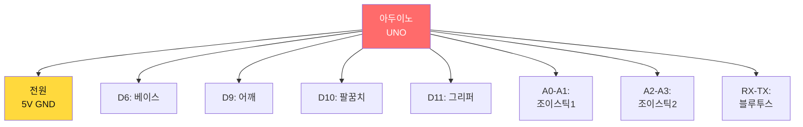

**배선 체크리스트**:

| 부품 | 아두이노 핀 | 신호선 색 | 확인 |
|------|------------|----------|------|
| 베이스 서보 (1축) | D6 | 주황 | □ |
| 어깨 서보 (2축) | D9 | 노랑 | □ |
| 팔꿈치 서보 (3축) | D10 | 초록 | □ |
| 그리퍼 서보 (4축) | D11 | 파랑 | □ |
| 조이스틱1 X | A0 | 보라 | □ |
| 조이스틱1 Y | A1 | 회색 | □ |
| 조이스틱2 X | A2 | 흰색 | □ |
| 조이스틱2 Y | A3 | 검정 | □ |
| 블루투스 RX | TX (D1) | 빨강 | □ |
| 블루투스 TX | RX (D0) | 갈색 | □ |

#### Step 4: 전원 연결 (10분)


**전원 주의사항**:
- ⚠️ 서보 4개를 동시에 구동하려면 **최소 2A 전원** 필요
- ⚠️ USB 전원만으로는 부족 → 서보가 떨림
- ⚠️ 극성 확인 (빨강 +, 검정 -)

---

## 2교시: 📝 01~02단계 - 기본 제어 (1시간)

### 01단계: 서보 모터 테스트 (20분)

**학습 목표**: 4개 서보 모터가 모두 정상 작동하는지 확인

#### 알고리즘 플로우차트

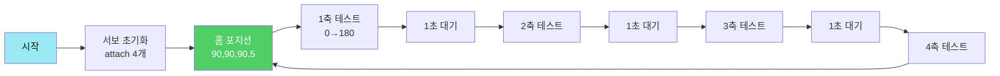

#### 핵심 코드 (01_servo_motor_test.ino)

```cpp
// 서보 초기화
#include <Servo.h>
Servo servo[4];
int pins[] = {6, 9, 10, 11};

void setup() {
  Serial.begin(9600);
  
  // 4개 서보 연결
  for(int i = 0; i < 4; i++) {
    servo[i].attach(pins[i]);
  }
  
  Serial.println("서보 모터 테스트 시작");
}

void loop() {
  // 홈 포지션
  servo[0].write(90);  // 베이스 중앙
  servo[1].write(90);  // 어깨 중앙
  servo[2].write(90);  // 팔꿈치 중앙
  servo[3].write(5);   // 그리퍼 열림
  
  delay(2000);
  
  // 각 축 테스트
  testServo(0, "베이스");
  testServo(1, "어깨");
  testServo(2, "팔꿈치");
  testServo(3, "그리퍼");
}

void testServo(int index, String name) {
  Serial.println(name + " 테스트 중...");
  
  // 최소 → 최대
  for(int angle = 0; angle <= 180; angle += 5) {
    servo[index].write(angle);
    delay(50);
  }
  
  // 최대 → 최소
  for(int angle = 180; angle >= 0; angle -= 5) {
    servo[index].write(angle);
    delay(50);
  }
  
  Serial.println(name + " 완료");
}
```

**실습 활동**:
- [ ] 코드 업로드
- [ ] Serial Monitor 열기 (9600 baud)
- [ ] 4개 서보가 모두 움직이는지 확인
- [ ] 이상한 소리가 나는지 체크

### 02단계: 조이스틱 제어 (40분)

**학습 목표**: 조이스틱으로 로봇팔을 실시간 제어

#### 알고리즘 플로우차트

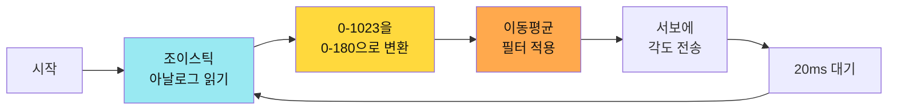

#### 핵심 알고리즘: 매핑 함수

```cpp
// 조이스틱 값을 서보 각도로 변환
int joyX1 = analogRead(A0);  // 0~1023
int angle0 = map(joyX1, 0, 1023, 0, 180);  // 0~180도

// 이동 평균 필터 (떨림 방지)
const int FILTER_SIZE = 5;
int angleBuffer[4][FILTER_SIZE];
int bufferIndex = 0;

int smoothAngle(int servoIndex, int rawAngle) {
  angleBuffer[servoIndex][bufferIndex] = rawAngle;
  
  int sum = 0;
  for(int i = 0; i < FILTER_SIZE; i++) {
    sum += angleBuffer[servoIndex][i];
  }
  
  return sum / FILTER_SIZE;
}
```

**실습 활동**:
- [ ] 조이스틱1로 베이스와 어깨 제어
- [ ] 조이스틱2로 팔꿈치와 그리퍼 제어
- [ ] 물체를 집어서 옮겨보기
- [ ] 부드럽게 움직이는지 확인

---

## 3교시: 📡 03단계 - Serial 원격 제어 (1시간)

**학습 목표**: Serial 명령으로 로봇팔을 원격 제어

### Serial 프로토콜 설계


### 명령어 테이블

| 명령어 | 형식 | 기능 | 예시 | 응답 |
|--------|------|------|------|------|
| `arm0_` | `arm0_90_` | 베이스 90도 이동 | `arm0_90_` | `OK:ARM0_90` |
| `arm1_` | `arm1_120_` | 어깨 120도 이동 | `arm1_120_` | `OK:ARM1_120` |
| `arm2_` | `arm2_60_` | 팔꿈치 60도 이동 | `arm2_60_` | `OK:ARM2_60` |
| `arm3_` | `arm3_50_` | 그리퍼 50도 (닫기) | `arm3_50_` | `OK:ARM3_50` |
| `home_` | `home_` | 홈 포지션 | `home_` | `OK:HOME` |
| `pos_` | `pos_90,90,90,5_` | 전체 포지션 | `pos_90,90,90,5_` | `OK:POS` |

### 명령 파싱 알고리즘

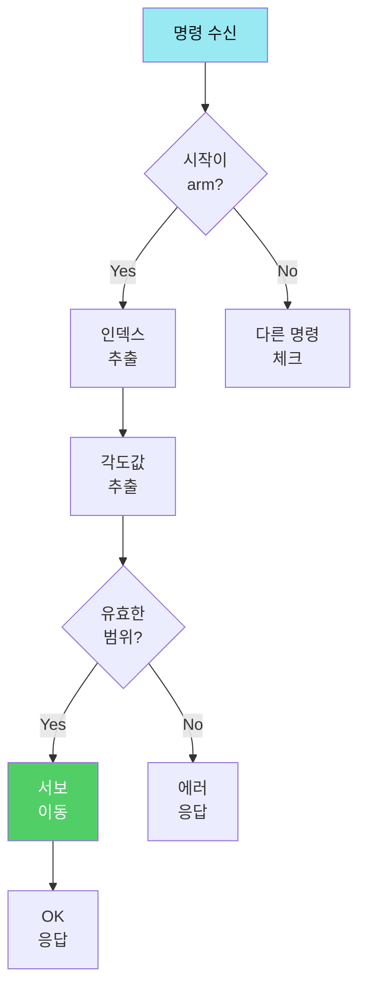

### 핵심 코드 (파싱 함수)

```cpp
void processCommand(String cmd) {
  cmd.trim();  // 공백 제거
  
  if(cmd.startsWith("arm")) {
    // arm0_90_ 형식 파싱
    int index = cmd.charAt(3) - '0';  // '0' → 0
    int underscorePos = cmd.indexOf('_', 4);
    String angleStr = cmd.substring(4, underscorePos);
    int angle = angleStr.toInt();
    
    // 유효성 검사
    if(index >= 0 && index < 4 && angle >= 0 && angle <= 180) {
      servo[index].write(angle);
      Serial.println("OK:ARM" + String(index) + "_" + String(angle));
    } else {
      Serial.println("ERR:INVALID_RANGE");
    }
    
  } else if(cmd == "home_") {
    // 홈 포지션
    servo[0].write(90);
    servo[1].write(90);
    servo[2].write(90);
    servo[3].write(5);
    Serial.println("OK:HOME");
    
  } else if(cmd.startsWith("pos_")) {
    // pos_90,90,90,5_ 형식
    parsePosition(cmd);
  }
}
```

**실습 활동**:
- [ ] Serial Monitor에서 명령 테스트
- [ ] `arm0_45_` → 베이스 45도
- [ ] `arm1_120_` → 어깨 120도
- [ ] `home_` → 홈 포지션
- [ ] `pos_90,120,60,50_` → 전체 이동

---

## 4교시: 💾 04단계 - EEPROM 자동화 ⭐ (1.5시간)

**학습 목표**: 핵심! 위치를 저장하고 자동 재생하는 알고리즘 마스터

### EEPROM 저장 구조

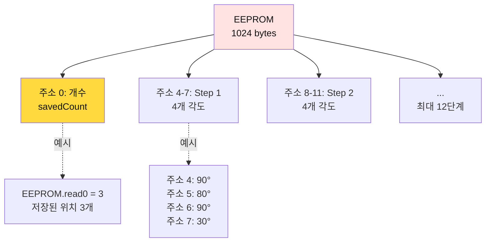

### 메모리 맵

| 주소 | 내용 | 크기 | 설명 | 예시 |
|------|------|------|------|------|
| 0 | savedCount | 1 byte | 저장된 위치 개수 (0~12) | 3 |
| 1-3 | 예약 | 3 bytes | 미사용 | - |
| 4-7 | Position #1 | 4 bytes | [base, shoulder, elbow, grip] | [90, 80, 90, 30] |
| 8-11 | Position #2 | 4 bytes | [base, shoulder, elbow, grip] | [45, 100, 80, 50] |
| ... | ... | ... | ... | ... |
| 48-51 | Position #12 | 4 bytes | 최대 12번째 위치 | [130, 70, 100, 15] |

### 핵심 알고리즘 1: save (저장)

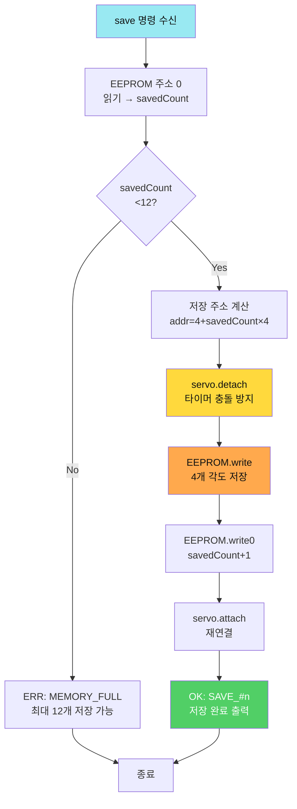

**세부 단계 (의사코드)**:
```
1. savedCount = EEPROM.read(0)
2. if savedCount >= 12 then
     print "ERR:MEMORY_FULL"
     return
3. addr = 4 + (savedCount × 4)
4. for i = 0 to 3 do
     angle = servo[i].read()
     EEPROM.write(addr + i, angle)
5. EEPROM.write(0, savedCount + 1)
6. print "OK:SAVE_" + (savedCount + 1)
```

```cpp
void savePosition() {
  int stepCount = EEPROM.read(0);
  
  if(stepCount >= 12) {
    Serial.println("ERR:MEMORY_FULL");
    return;
  }
  
  // 현재 각도를 EEPROM에 저장
  int addr = 4 + (stepCount * 4);
  for(int i = 0; i < 4; i++) {
    int angle = servo[i].read();
    EEPROM.write(addr + i, angle);
  }
  
  // 스텝 개수 증가
  EEPROM.write(0, stepCount + 1);
  
  Serial.println("OK:SAVE_" + String(stepCount + 1));
}
```

### 핵심 알고리즘 2: play (재생)

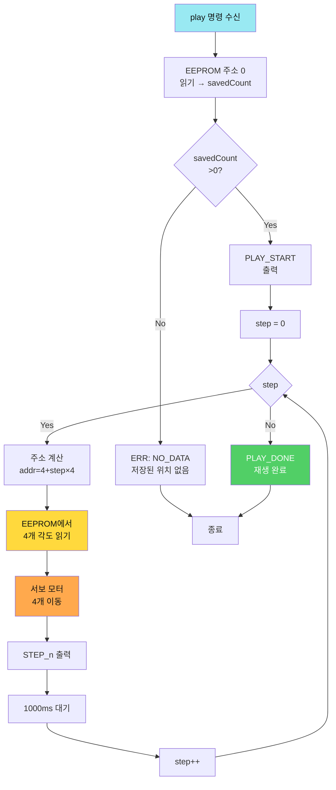

**세부 단계 (의사코드)**:
```
1. savedCount = EEPROM.read(0)
2. if savedCount == 0 then
     print "ERR:NO_DATA"
     return
3. print "PLAY_START:" + savedCount
4. for step = 0 to savedCount-1 do
     addr = 4 + (step × 4)
     for i = 0 to 3 do
       angle = EEPROM.read(addr + i)
       servo[i].write(angle)
     print "STEP_" + (step + 1)
     delay(1000)
5. print "PLAY_DONE"
```

**시간 복잡도**: O(n), n = savedCount (저장된 위치 개수)

### 핵심 알고리즘 3: auto (무한 반복)

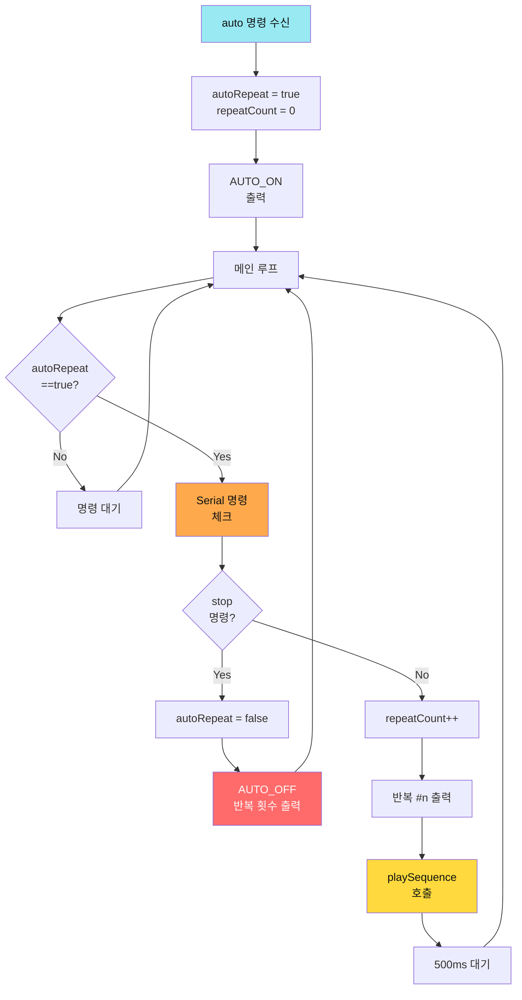

**세부 단계 (의사코드)**:
```
1. 명령 수신: auto
2. autoRepeat = true
3. repeatCount = 0
4. print "AUTO_ON"

loop():
  5. if autoRepeat == true then
       checkSerialCommand()  // stop 명령 체크
       if stopReceived then
         autoRepeat = false
         print "AUTO_OFF: 총 " + repeatCount + "회"
         return
       
       repeatCount++
       print "반복 #" + repeatCount
       playSequence()  // 저장된 위치 재생
       delay(500)
```

**시간 복잡도**: O(n × m), n = savedCount, m = 반복 횟수

**주의사항**:
- ✅ loop() 내에서 항상 Serial 명령 체크
- ✅ stop 명령 시 즉시 반복 중지
- ✅ 반복 횟수 카운팅 (디버깅용)


### 명령어 테이블

| 명령어 | 기능 | 예시 시나리오 |
|--------|------|--------------|
| `save_` | 현재 위치 저장 | 조이스틱으로 위치 잡고 저장 |
| `play_` | 저장된 동작 재생 | 한번 실행 후 멈춤 |
| `auto_` | 무한 반복 재생 | 계속 반복 |
| `stop_` | 자동 재생 중지 | 무한 반복 멈춤 |
| `clear_` | 모든 데이터 삭제 | 처음부터 다시 |
| `list_` | 저장된 위치 목록 | 몇 개 저장됐는지 확인 |

**실습 활동**:
1. [ ] 조이스틱으로 원하는 위치로 이동
2. [ ] `save_` 명령으로 저장 (최대 12번)
3. [ ] 다른 위치로 이동 후 `save_`
4. [ ] `play_` 명령으로 재생 확인
5. [ ] `auto_` 명령으로 무한 반복
6. [ ] `stop_` 명령으로 중지

---

## 5교시: 📡 05~06단계 - Bluetooth 무선 제어 ⭐⭐ (1.5시간)

**학습 목표**: 스마트폰으로 무선 제어 + 안정성 개선

### Bluetooth 통신 구조

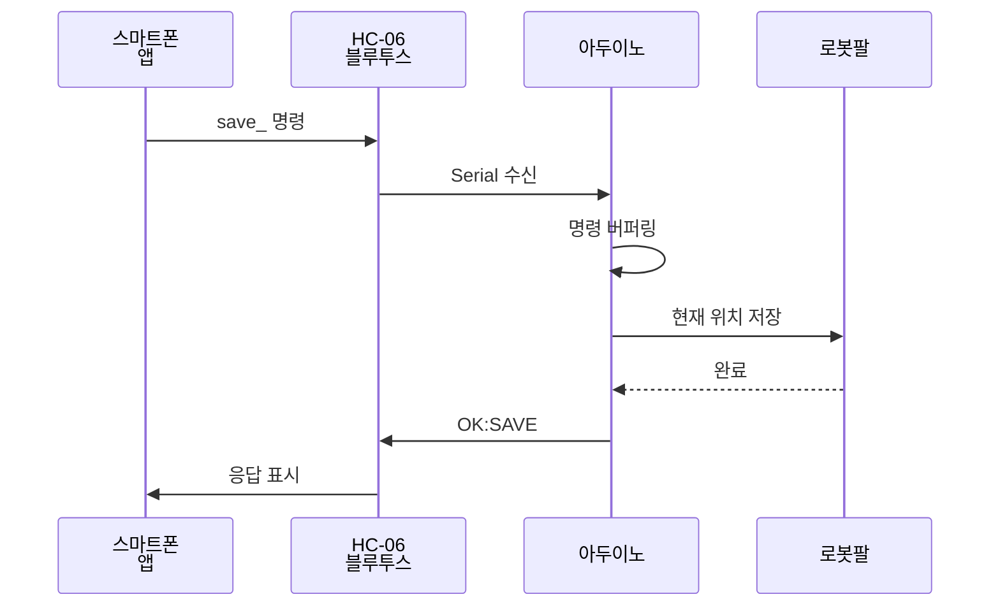

### 핵심 알고리즘: 명령 버퍼링

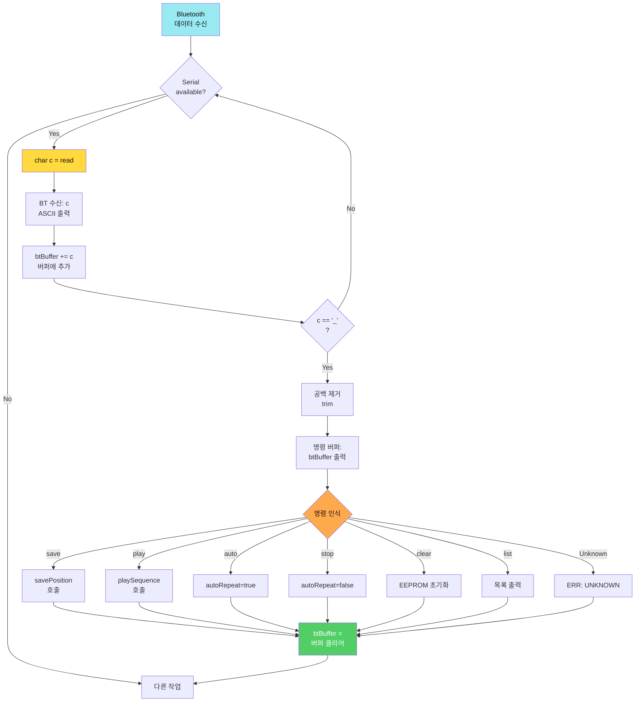

**세부 단계 (의사코드)**:
```
String btBuffer = ""  // 전역 버퍼

loop():
  1. while Serial.available() > 0 do
       c = Serial.read()
       print "[BT 수신] '" + c + "' (ASCII: " + ASCII(c) + ")"
       
       btBuffer += c
       print "[버퍼 추가] 현재: \"" + btBuffer + "\" (" + length + "자)"
       
       if c == '_' then  // 명령 종료 문자
         btBuffer.trim()  // 공백 제거
         print "[명령 종료 문자: '_']"
         print "명령어 버퍼: \"" + btBuffer + "\" (길이: " + length + ")"
         
         // 명령 처리
         if btBuffer == "save" then
           savePosition()
         else if btBuffer == "play" then
           playSequence()
         else if btBuffer == "auto" then
           autoRepeat = true
           print "OK:AUTO_ON"
         else if btBuffer == "stop" then
           autoRepeat = false
           print "OK:AUTO_OFF"
         else if btBuffer == "clear" then
           clearAllPositions()
         else if btBuffer == "list" then
           listAllPositions()
         else
           print "ERR:UNKNOWN_COMMAND"
         
         btBuffer = ""  // 버퍼 초기화
  
  2. if autoRepeat == true then
       playSequence()
       delay(500)
```

**버퍼링이 필요한 이유**:
1. **비동기 통신**: Bluetooth는 한 글자씩 수신 (`s` → `a` → `v` → `e` → `_`)
2. **패킷 분리**: 여러 명령이 연속으로 올 수 있음
3. **종료 구분자**: `_`로 명령의 끝을 구분
4. **안정성**: 부분 명령 무시 (`sa`만 오고 끊기면 무시)

**실제 수신 예시**:
```
[BT 수신] 's' (ASCII: 115)
[버퍼 추가] 현재: "s" (1자)
[BT 수신] 'a' (ASCII: 97)
[버퍼 추가] 현재: "sa" (2자)
[BT 수신] 'v' (ASCII: 118)
[버퍼 추가] 현재: "sav" (3자)
[BT 수신] 'e' (ASCII: 101)
[버퍼 추가] 현재: "save" (4자)
[BT 수신] '_' (ASCII: 95)
[명령 종료 문자: '_'] 명령어 버퍼: "save" (길이: 4)
[인식] save 명령 실행
```

**시간 복잡도**: O(n), n = 명령 길이 (보통 4~6자)

**공간 복잡도**: O(n), 버퍼 크기 (최대 20자)

### 06단계: 안정성 개선

**주요 개선 사항**:
- ✅ 타이머 충돌 방지 (Servo 라이브러리와 millis() 사용)
- ✅ 명령 검증 (잘못된 명령 무시)
- ✅ 메모리 보호 (EEPROM 범위 체크)
- ✅ 응답 일관성 (모든 명령에 OK/ERR 응답)

```cpp
// millis() 사용한 비차단 delay
unsigned long lastMoveTime = 0;
const int MOVE_INTERVAL = 1000;

void loop() {
  checkBluetooth();
  
  if(autoMode) {
    unsigned long currentTime = millis();
    if(currentTime - lastMoveTime >= MOVE_INTERVAL) {
      playOneStep();
      lastMoveTime = currentTime;
    }
  }
}
```

**실습 활동**:
- [ ] HC-06 페어링 (비밀번호: 1234 또는 0000)
- [ ] Serial Bluetooth Terminal 앱 설치
- [ ] 스마트폰에서 명령 전송 테스트
- [ ] save_, play_, auto_, stop_ 모두 테스트

---

## 6-7교시: 🎤 음성 제어 앱인벤터 (2시간)

**학습 목표**: STT/TTS를 적용한 음성 로봇팔 제어 앱 만들기

### 📋 통신 프로토콜 정의

#### 명령 프로토콜 (앱 → 아두이노)

| 명령어 | 형식 | 파라미터 | 종료 문자 | 예시 |
|--------|------|---------|----------|------|
| **save** | `save_` | 없음 | `_` | `save_` |
| **play** | `play_` | 없음 | `_` | `play_` |
| **auto** | `auto_` | 없음 | `_` | `auto_` |
| **stop** | `stop_` | 없음 | `_` | `stop_` |
| **clear** | `clear_` | 없음 | `_` | `clear_` |
| **list** | `list_` | 없음 | `_` | `list_` |
| **home** | `home_` | 없음 | `_` | `home_` |
| **arm** | `arm{N}_{각도}_` | N(0-3), 각도(0-180) | `_` | `arm0_90_` |
| **pos** | `pos_{a0},{a1},{a2},{a3}_` | 4개 각도 | `_` | `pos_90,120,60,5_` |

**프로토콜 규칙**:
- ✅ 모든 명령은 `_`로 종료
- ✅ 대소문자 구분 없음 (소문자 권장)
- ✅ 공백 허용 안 함
- ✅ 한 번에 하나의 명령만 전송

#### 응답 프로토콜 (아두이노 → 앱)

| 응답 유형 | 형식 | 예시 | 의미 |
|---------|------|------|------|
| **성공** | `OK:{명령}` | `OK:SAVE_3` | 명령 실행 성공 (저장 3번째) |
| **시작** | `{동작}_START:{개수}` | `PLAY_START:5` | 재생 시작 (5단계) |
| **진행** | `STEP_{n}` | `STEP_2` | n번째 단계 실행 중 |
| **완료** | `{동작}_DONE` | `PLAY_DONE` | 동작 완료 |
| **자동 모드** | `AUTO_{상태}:{횟수}` | `AUTO_ON` / `AUTO_OFF:15` | 자동 모드 상태 |
| **에러** | `ERR:{이유}` | `ERR:MEMORY_FULL` | 오류 발생 |
| **정보** | `INFO:{내용}` | `INFO:COUNT_5` | 정보 출력 |

**에러 코드 정의**:
- `ERR:MEMORY_FULL` - EEPROM 저장 공간 부족 (12개 초과)
- `ERR:NO_DATA` - 저장된 데이터 없음
- `ERR:INVALID_RANGE` - 각도 범위 초과 (0-180)
- `ERR:UNKNOWN_COMMAND` - 알 수 없는 명령

### 🔄 완전한 동작 순서도

#### Sequence 1: 음성 명령 전체 흐름

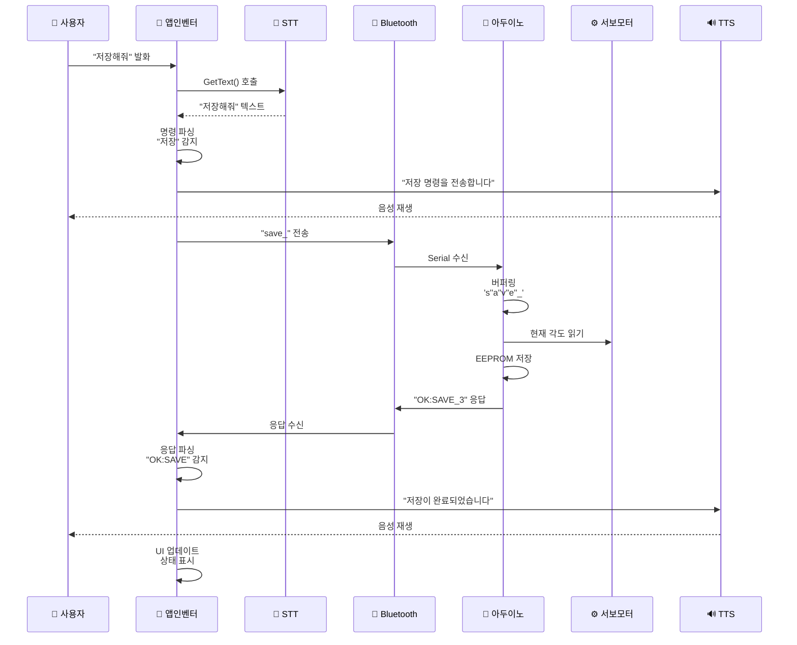

#### Sequence 2: 자동 재생 흐름

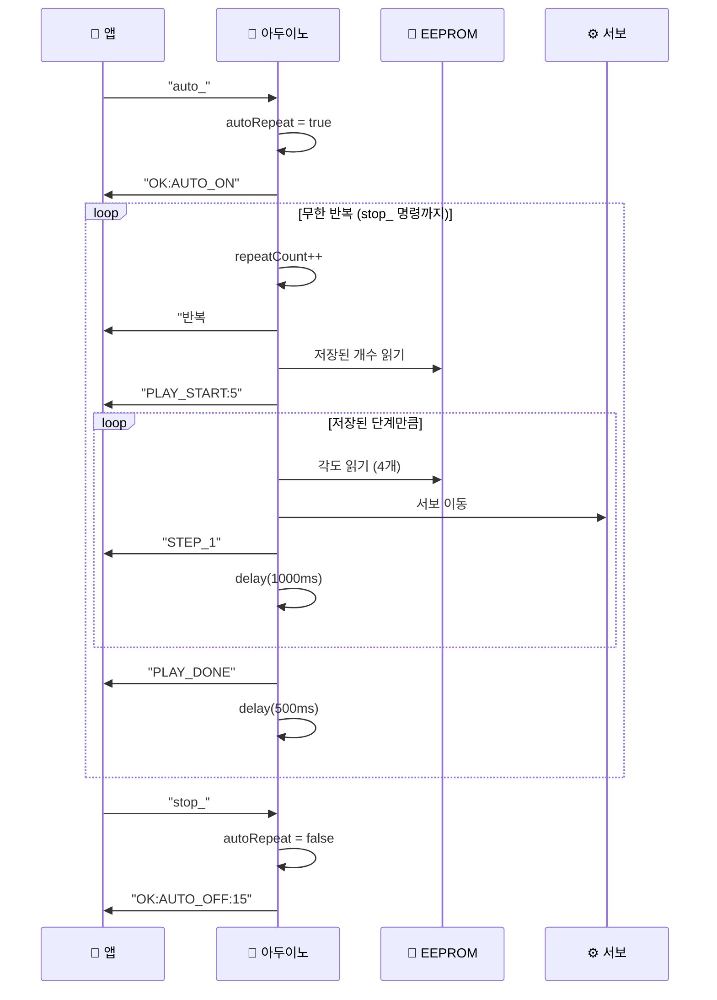

### 🔀 앱인벤터 상태 기계

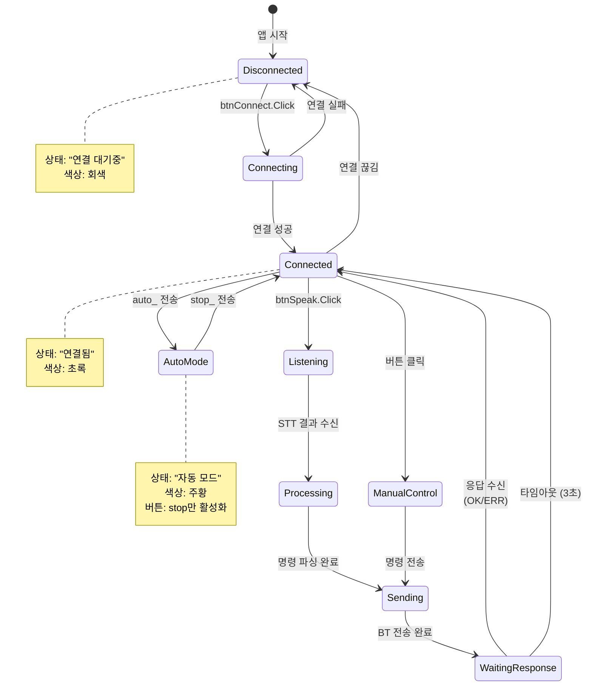

### 음성 제어 시스템 구조

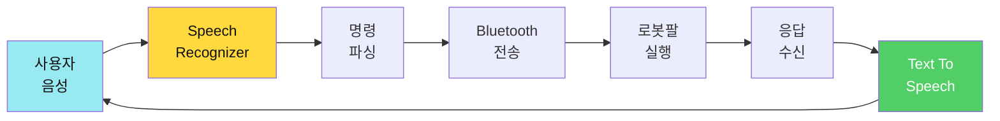

### 📱 앱인벤터 상세 설계

#### UI 구조도

```mermaid
graph TD
    SCREEN[Screen1<br/>배경색: 흰색] --> HEADER[VerticalArrangement<br/>헤더 영역]
    SCREEN --> CONNECTION[HorizontalArrangement<br/>연결 영역]
    SCREEN --> VOICE[VerticalArrangement<br/>음성 영역]
    SCREEN --> MANUAL[HorizontalArrangement<br/>수동 제어]
    SCREEN --> STATUS[VerticalArrangement<br/>상태 표시]
    SCREEN --> LOG[ScrollableArrangement<br/>로그]
    
    HEADER --> TITLE[Label<br/>🤖 음성 로봇팔]
    
    CONNECTION --> BTN_CONN[ListPicker<br/>BT 연결]
    CONNECTION --> LBL_CONN[Label<br/>연결 상태]
    
    VOICE --> BTN_VOICE[Button<br/>🎤 말하기]
    VOICE --> LBL_RESULT[Label<br/>인식 결과]
    
    MANUAL --> BTN_SAVE[Button<br/>💾 저장]
    MANUAL --> BTN_PLAY[Button<br/>▶️ 재생]
    MANUAL --> BTN_AUTO[Button<br/>🔄 자동]
    MANUAL --> BTN_STOP[Button<br/>⏹️ 중지]
    MANUAL --> BTN_HOME[Button<br/>🏠 홈]
    MANUAL --> BTN_CLEAR[Button<br/>🗑️ 초기화]
    
    STATUS --> LBL_STATUS[Label<br/>상태 메시지]
    STATUS --> PROGRESS[Slider<br/>진행률]
    STATUS --> LBL_PROGRESS[Label<br/>단계 표시]
    
    LOG --> LIST_LOG[ListView<br/>통신 로그]
    
    style SCREEN fill:#FFE3E3,color:#111
    style VOICE fill:#FFD93D,color:#111
    style MANUAL fill:#FFA94D,color:#111
```

#### 컴포넌트 상세 속성표

**1. 레이아웃 컴포넌트**

| 컴포넌트 | 이름 | 속성 | 값 |
|---------|------|------|-----|
| VerticalArrangement | `VA_Header` | Width | Fill parent |
|  |  | Height | 10% |
|  |  | AlignHorizontal | Center |
|  |  | BackgroundColor | #3498db (파랑) |
| HorizontalArrangement | `HA_Connection` | Width | Fill parent |
|  |  | Height | 60px |
|  |  | AlignVertical | Center |
| VerticalArrangement | `VA_Voice` | Width | Fill parent |
|  |  | Height | 20% |
|  |  | AlignHorizontal | Center |
|  |  | BackgroundColor | #f1c40f (노랑) |
| HorizontalArrangement | `HA_Manual` | Width | Fill parent |
|  |  | Height | 80px |
|  |  | AlignVertical | Center |
| ScrollableArrangement | `SA_Log` | Width | Fill parent |
|  |  | Height | 200px |
|  |  | BackgroundColor | #ecf0f1 (회색) |

**2. 버튼 컴포넌트**

| 컴포넌트 | 이름 | 속성 | 값 |
|---------|------|------|-----|
| ListPicker | `ListPickerBT` | Text | "📡 블루투스 연결" |
|  |  | Width | 200px |
|  |  | Height | 50px |
|  |  | FontSize | 16 |
|  |  | BackgroundColor | #3498db |
|  |  | TextColor | 흰색 |
| Button | `btnSpeak` | Text | "🎤 말하기" |
|  |  | Width | Fill parent |
|  |  | Height | 80px |
|  |  | FontSize | 24 |
|  |  | BackgroundColor | #e74c3c (빨강) |
|  |  | TextColor | 흰색 |
|  |  | Enabled | false (초기) |
| Button | `btnSave` | Text | "💾" |
|  |  | Width | 15% |
|  |  | Height | 60px |
|  |  | FontSize | 20 |
|  |  | BackgroundColor | #2ecc71 (초록) |
|  |  | Enabled | false |
| Button | `btnPlay` | Text | "▶️" |
|  |  | Width | 15% |
|  |  | Height | 60px |
|  |  | FontSize | 20 |
|  |  | BackgroundColor | #3498db (파랑) |
|  |  | Enabled | false |
| Button | `btnAuto` | Text | "🔄" |
|  |  | Width | 15% |
|  |  | Height | 60px |
|  |  | FontSize | 20 |
|  |  | BackgroundColor | #f39c12 (주황) |
|  |  | Enabled | false |
| Button | `btnStop` | Text | "⏹️" |
|  |  | Width | 15% |
|  |  | Height | 60px |
|  |  | FontSize | 20 |
|  |  | BackgroundColor | #e74c3c (빨강) |
|  |  | Enabled | false |
| Button | `btnHome` | Text | "🏠" |
|  |  | Width | 15% |
|  |  | Height | 60px |
|  |  | FontSize | 20 |
|  |  | BackgroundColor | #95a5a6 (회색) |
|  |  | Enabled | false |
| Button | `btnClear` | Text | "🗑️" |
|  |  | Width | 15% |
|  |  | Height | 60px |
|  |  | FontSize | 20 |
|  |  | BackgroundColor | #c0392b (진한 빨강) |
|  |  | Enabled | false |

**3. 레이블 컴포넌트**

| 컴포넌트 | 이름 | 속성 | 값 |
|---------|------|------|-----|
| Label | `lblTitle` | Text | "🤖 음성 로봇팔 제어" |
|  |  | Width | Fill parent |
|  |  | Height | 50px |
|  |  | FontSize | 24 |
|  |  | FontBold | true |
|  |  | TextAlignment | Center |
|  |  | TextColor | 흰색 |
| Label | `lblConnStatus` | Text | "⚪ 연결 대기중" |
|  |  | Width | Fill parent |
|  |  | FontSize | 14 |
|  |  | TextColor | 검정 |
| Label | `lblResult` | Text | "" |
|  |  | Width | Fill parent |
|  |  | Height | 40px |
|  |  | FontSize | 18 |
|  |  | TextAlignment | Center |
|  |  | BackgroundColor | #fff9c4 (연노랑) |
| Label | `lblStatus` | Text | "대기 중..." |
|  |  | Width | Fill parent |
|  |  | Height | 50px |
|  |  | FontSize | 16 |
|  |  | TextAlignment | Center |
|  |  | BackgroundColor | #ecf0f1 |
| Label | `lblProgress` | Text | "0 / 0" |
|  |  | Width | Fill parent |
|  |  | FontSize | 14 |
|  |  | TextAlignment | Center |

**4. 기타 컴포넌트**

| 컴포넌트 | 이름 | 속성 | 값 |
|---------|------|------|-----|
| Slider | `SliderProgress` | Width | Fill parent |
|  |  | MinValue | 0 |
|  |  | MaxValue | 12 |
|  |  | ThumbEnabled | false (읽기 전용) |
| ListView | `ListViewLog` | Width | Fill parent |
|  |  | Height | 200px |
|  |  | BackgroundColor | 흰색 |
|  |  | TextColor | 검정 |
|  |  | FontSize | 12 |

**5. 보이지 않는 컴포넌트**

| 컴포넌트 | 이름 | 속성 | 값 |
|---------|------|------|-----|
| BluetoothClient | `BluetoothClient1` | DelimiterByte | 10 (줄바꿈) |
| SpeechRecognizer | `SpeechRecognizer1` | Language | "ko-KR" (한국어) |
| TextToSpeech | `TextToSpeech1` | Language | "ko-KR" |
|  |  | Pitch | 1.0 |
|  |  | SpeechRate | 1.0 |
| Clock | `Clock1` | TimerInterval | 100 (0.1초) |
|  |  | TimerEnabled | true |
| Notifier | `Notifier1` | (알림용) | |

### 블록 코딩 플로우차트

#### Flow 1: 블루투스 연결 알고리즘

```mermaid
graph TD
    START[버튼 클릭<br/>btnConnect] --> LIST_PICKER[ListPicker<br/>디바이스 선택]
    LIST_PICKER --> BEFORE_PICK[BeforePicking<br/>이벤트]
    
    BEFORE_PICK --> GET_LIST[BluetoothClient<br/>AddressesAndNames]
    GET_LIST --> SHOW_LIST[선택 화면<br/>표시]
    
    SHOW_LIST --> AFTER_PICK[AfterPicking<br/>이벤트]
    AFTER_PICK --> EXTRACT[선택된<br/>주소 추출]
    
    EXTRACT --> TRY_CONNECT{Connect<br/>시도}
    TRY_CONNECT -->|성공| SUCCESS[상태: 연결됨<br/>색상: 초록]
    TRY_CONNECT -->|실패| FAIL[상태: 연결 실패<br/>색상: 빨강]
    
    SUCCESS --> TTS_OK[TTS: 연결됨]
    FAIL --> TTS_ERR[TTS: 실패]
    
    TTS_OK --> ENABLE[제어 버튼<br/>활성화]
    TTS_ERR --> DISABLE[버튼<br/>비활성화]
    
    style START fill:#99E9F2,color:#111
    style SUCCESS fill:#51CF66,color:#fff
    style FAIL fill:#FF6B6B,color:#fff
```

### 블록 코딩: Bluetooth 연결

```
📍 when btnConnect.Click
  ├─ call ListPickerBT.Open()  // 디바이스 선택 화면

📍 when ListPickerBT.BeforePicking
  ├─ set ListPickerBT.Elements to BluetoothClient1.AddressesAndNames
  └─ // 페어링된 디바이스 목록 표시

📍 when ListPickerBT.AfterPicking
  ├─ set selection to ListPickerBT.Selection
  ├─ set btAddress to segment(selection, " ", 1)  // 주소 추출
  │
  ├─ set lblStatus.Text to "연결 중..."
  ├─ set lblStatus.BackgroundColor to 노랑
  │
  ├─ if BluetoothClient1.Connect(btAddress)
  │   ├─ set lblStatus.Text to "✅ 연결 성공!"
  │   ├─ set lblStatus.BackgroundColor to 초록
  │   ├─ call TextToSpeech1.Speak("로봇팔에 연결되었습니다")
  │   │
  │   ├─ // 제어 버튼 활성화
  │   ├─ set btnSpeak.Enabled to true
  │   ├─ set btnSave.Enabled to true
  │   ├─ set btnPlay.Enabled to true
  │   ├─ set btnAuto.Enabled to true
  │   └─ set btnStop.Enabled to true
  │
  └─ else
      ├─ set lblStatus.Text to "❌ 연결 실패"
      ├─ set lblStatus.BackgroundColor to 빨강
      ├─ call TextToSpeech1.Speak("연결에 실패했습니다")
      └─ // 버튼 비활성화 유지
```

#### Flow 2: 음성 인식 및 명령 파싱

```mermaid
graph TD
    START[버튼 클릭<br/>btnSpeak] --> CHECK_CONN{BT<br/>연결?}
    CHECK_CONN -->|No| ERR_CONN[TTS: 먼저<br/>연결하세요]
    CHECK_CONN -->|Yes| SHOW_UI[UI: 듣는 중]
    
    SHOW_UI --> STT_START[STT.GetText<br/>호출]
    STT_START --> WAIT[사용자<br/>발화 대기]
    
    WAIT --> STT_RESULT{인식<br/>성공?}
    STT_RESULT -->|No| ERR_STT[TTS: 인식<br/>실패]
    STT_RESULT -->|Yes| DISPLAY[결과 표시<br/>lblResult]
    
    DISPLAY --> PARSE[명령어<br/>파싱]
    PARSE --> MATCH{키워드<br/>매칭?}
    
    MATCH -->|저장| CMD_SAVE[save_]
    MATCH -->|재생| CMD_PLAY[play_]
    MATCH -->|자동| CMD_AUTO[auto_]
    MATCH -->|중지| CMD_STOP[stop_]
    MATCH -->|홈| CMD_HOME[home_]
    MATCH -->|No| ERR_PARSE[TTS: 명령<br/>이해 못함]
    
    CMD_SAVE & CMD_PLAY & CMD_AUTO & CMD_STOP & CMD_HOME --> SEND[sendCommand<br/>호출]
    
    SEND --> BT_SEND[Bluetooth<br/>전송]
    BT_SEND --> WAIT_RESP[응답<br/>대기]
    
    style START fill:#99E9F2,color:#111
    style PARSE fill:#FFD93D,color:#111
    style SEND fill:#51CF66,color:#fff
```

### 블록 코딩: 음성 인식 (STT)

```
📍 when btnSpeak.Click
  ├─ // 연결 확인
  ├─ if not BluetoothClient1.IsConnected
  │   ├─ call TextToSpeech1.Speak("먼저 블루투스를 연결해주세요")
  │   └─ return
  │
  ├─ // UI 업데이트
  ├─ set lblResult.Text to "🎤 듣는 중..."
  ├─ set lblResult.BackgroundColor to 노랑
  ├─ set btnSpeak.Enabled to false  // 중복 방지
  │
  └─ call SpeechRecognizer1.GetText()

📍 when SpeechRecognizer1.AfterGettingText (result)
  ├─ set btnSpeak.Enabled to true  // 다시 활성화
  │
  ├─ // 인식 결과 확인
  ├─ if result == "" or result == null
  │   ├─ set lblResult.Text to "❌ 인식 실패"
  │   ├─ set lblResult.BackgroundColor to 빨강
  │   ├─ call TextToSpeech1.Speak("음성을 인식하지 못했습니다")
  │   └─ return
  │
  ├─ // 결과 표시
  ├─ set lblResult.Text to result
  ├─ set lblResult.BackgroundColor to 초록
  │
  ├─ // 명령 파싱 및 실행
  └─ call parseVoiceCommand(result)
```

### 블록 코딩: 음성 명령 파싱

```
📍 procedure parseVoiceCommand (text)
  ├─ // 소문자 변환 (영어 명령 대비)
  ├─ set lowerText to lowercase(text)
  │
  ├─ // 키워드 매칭 (한글 + 영어)
  ├─ if contains(lowerText, "저장") or contains(lowerText, "세이브") or contains(lowerText, "save")
  │   ├─ call sendCommand("save_")
  │   └─ call TextToSpeech1.Speak("위치를 저장합니다")
  │
  ├─ else if contains(lowerText, "재생") or contains(lowerText, "플레이") or contains(lowerText, "play")
  │   ├─ call sendCommand("play_")
  │   └─ call TextToSpeech1.Speak("저장된 동작을 재생합니다")
  │
  ├─ else if contains(lowerText, "자동") or contains(lowerText, "오토") or contains(lowerText, "auto")
  │   ├─ call sendCommand("auto_")
  │   └─ call TextToSpeech1.Speak("자동 모드를 시작합니다")
  │
  ├─ else if contains(lowerText, "중지") or contains(lowerText, "멈춰") or contains(lowerText, "스탑") or contains(lowerText, "stop")
  │   ├─ call sendCommand("stop_")
  │   └─ call TextToSpeech1.Speak("중지합니다")
  │
  ├─ else if contains(lowerText, "홈") or contains(lowerText, "처음") or contains(lowerText, "home")
  │   ├─ call sendCommand("home_")
  │   └─ call TextToSpeech1.Speak("홈 위치로 이동합니다")
  │
  ├─ else if contains(lowerText, "초기화") or contains(lowerText, "리셋") or contains(lowerText, "clear")
  │   ├─ call sendCommand("clear_")
  │   └─ call TextToSpeech1.Speak("저장된 데이터를 삭제합니다")
  │
  ├─ else if contains(lowerText, "목록") or contains(lowerText, "리스트") or contains(lowerText, "list")
  │   ├─ call sendCommand("list_")
  │   └─ call TextToSpeech1.Speak("저장된 위치를 확인합니다")
  │
  └─ else
      ├─ set lblStatus.Text to "❌ 알 수 없는 명령"
      └─ call TextToSpeech1.Speak("명령을 이해하지 못했습니다. 다시 말씀해주세요")
```

#### Flow 3: 명령 전송 및 응답 처리

```mermaid
graph TD
    START[sendCommand<br/>호출] --> CHECK_BT{BT<br/>연결?}
    CHECK_BT -->|No| ERR_BT[TTS: 연결<br/>필요]
    CHECK_BT -->|Yes| SEND[BT.SendText<br/>cmd]
    
    SEND --> UI_SEND[UI: 전송 중<br/>노랑]
    UI_SEND --> TIMER_START[타이머<br/>시작]
    
    TIMER_START --> CLOCK[Clock1.Timer<br/>100ms 주기]
    CLOCK --> CHECK_DATA{데이터<br/>수신?}
    
    CHECK_DATA -->|No| CHECK_TIME{3초<br/>초과?}
    CHECK_TIME -->|No| CLOCK
    CHECK_TIME -->|Yes| TIMEOUT[타임아웃<br/>에러]
    
    CHECK_DATA -->|Yes| RECEIVE[ReceiveText<br/>데이터 읽기]
    RECEIVE --> PARSE_RESP[응답<br/>파싱]
    
    PARSE_RESP --> TYPE{응답<br/>유형?}
    
    TYPE -->|OK:SAVE| RESP_SAVE[TTS: 저장<br/>완료]
    TYPE -->|OK:PLAY| RESP_PLAY[TTS: 재생<br/>시작]
    TYPE -->|PLAY_DONE| RESP_DONE[TTS: 재생<br/>완료]
    TYPE -->|OK:AUTO_ON| RESP_AUTO_ON[TTS: 자동<br/>시작]
    TYPE -->|OK:AUTO_OFF| RESP_AUTO_OFF[TTS: 자동<br/>중지]
    TYPE -->|STEP_n| RESP_STEP[UI: 단계<br/>표시]
    TYPE -->|ERR:| RESP_ERR[TTS: 오류<br/>발생]
    
    RESP_SAVE & RESP_PLAY & RESP_DONE & RESP_AUTO_ON & RESP_AUTO_OFF --> UI_OK[UI: 성공<br/>초록]
    RESP_ERR & TIMEOUT --> UI_ERR[UI: 실패<br/>빨강]
    
    UI_OK --> LOG[로그에<br/>기록]
    UI_ERR --> LOG
    
    style START fill:#99E9F2,color:#111
    style PARSE_RESP fill:#FFD93D,color:#111
    style UI_OK fill:#51CF66,color:#fff
    style UI_ERR fill:#FF6B6B,color:#fff
```

### 블록 코딩: 명령 전송 및 응답

```
📍 global variables
  ├─ waitingForResponse = false  // 응답 대기 상태
  ├─ lastCommandTime = 0  // 마지막 명령 전송 시각
  ├─ TIMEOUT_MS = 3000  // 타임아웃 3초
  └─ responseBuffer = ""  // 응답 버퍼

📍 procedure sendCommand (cmd)
  ├─ // 연결 확인
  ├─ if not BluetoothClient1.IsConnected
  │   ├─ set lblStatus.Text to "❌ 연결 필요"
  │   ├─ call TextToSpeech1.Speak("먼저 블루투스를 연결해주세요")
  │   └─ return
  │
  ├─ // 명령 전송
  ├─ call BluetoothClient1.SendText(cmd)
  ├─ set lblStatus.Text to "📤 전송: " + cmd
  ├─ set lblStatus.BackgroundColor to 노랑
  │
  ├─ // 응답 대기 상태 설정
  ├─ set waitingForResponse to true
  ├─ set lastCommandTime to Clock1.SystemTime
  │
  └─ // 로그 기록
      └─ call addToLog("전송", cmd, Clock1.FormatDateTime)

📍 when Clock1.Timer (매 100ms)
  ├─ // 응답 대기 중인지 확인
  ├─ if waitingForResponse
  │   │
  │   ├─ // 타임아웃 체크 (3초)
  │   ├─ set elapsed to Clock1.SystemTime - lastCommandTime
  │   ├─ if elapsed > TIMEOUT_MS
  │   │   ├─ set waitingForResponse to false
  │   │   ├─ set lblStatus.Text to "⏱️ 응답 없음 (타임아웃)"
  │   │   ├─ set lblStatus.BackgroundColor to 빨강
  │   │   ├─ call TextToSpeech1.Speak("로봇팔이 응답하지 않습니다")
  │   │   └─ return
  │
  ├─ // 블루투스 데이터 확인
  ├─ if BluetoothClient1.IsConnected
  │   │
  │   ├─ if BluetoothClient1.BytesAvailableToReceive > 0
  │   │   │
  │   │   ├─ // 데이터 수신
  │   │   ├─ set response to BluetoothClient1.ReceiveText(-1)
  │   │   ├─ set responseBuffer to responseBuffer + response
  │   │   │
  │   │   ├─ // 줄바꿈으로 구분된 완전한 메시지만 처리
  │   │   ├─ if contains(responseBuffer, "\n")
  │   │   │   ├─ set messages to split(responseBuffer, "\n")
  │   │   │   │
  │   │   │   ├─ for each message in messages
  │   │   │   │   └─ call handleResponse(message)
  │   │   │   │
  │   │   │   └─ set responseBuffer to ""
  │   │
  │   └─ else
  │       ├─ // 연결 끊김
  │       ├─ set lblStatus.Text to "❌ 연결 끊김"
  │       └─ set waitingForResponse to false

📍 procedure handleResponse (response)
  ├─ call addToLog("수신", response, Clock1.FormatDateTime)
  ├─ set waitingForResponse to false  // 응답 받음
  │
  ├─ // OK: 성공 응답
  ├─ if contains(response, "OK:SAVE")
  │   ├─ set lblStatus.Text to "✅ 저장 완료"
  │   ├─ set lblStatus.BackgroundColor to 초록
  │   ├─ call TextToSpeech1.Speak("저장이 완료되었습니다")
  │   └─ call extractSaveNumber(response)  // "OK:SAVE_3" → 3번째
  │
  ├─ else if contains(response, "OK:PLAY")
  │   ├─ set lblStatus.Text to "▶️ 재생 시작"
  │   ├─ call TextToSpeech1.Speak("재생을 시작합니다")
  │
  ├─ else if contains(response, "PLAY_START")
  │   ├─ set stepCount to extractNumber(response)  // "PLAY_START:5" → 5
  │   ├─ set lblStatus.Text to "재생 중 (" + stepCount + "단계)"
  │   └─ call initProgressBar(stepCount)
  │
  ├─ else if contains(response, "STEP_")
  │   ├─ set stepNum to extractNumber(response)  // "STEP_3" → 3
  │   ├─ set lblStatus.Text to "▶️ 단계 " + stepNum
  │   └─ call updateProgressBar(stepNum)
  │
  ├─ else if contains(response, "PLAY_DONE")
  │   ├─ set lblStatus.Text to "✅ 재생 완료"
  │   ├─ set lblStatus.BackgroundColor to 초록
  │   └─ call TextToSpeech1.Speak("재생이 완료되었습니다")
  │
  ├─ else if contains(response, "OK:AUTO_ON")
  │   ├─ set lblStatus.Text to "🔄 자동 모드 ON"
  │   ├─ set lblStatus.BackgroundColor to 주황
  │   ├─ set btnAuto.Enabled to false
  │   ├─ set btnStop.Enabled to true
  │   └─ call TextToSpeech1.Speak("자동 모드를 시작합니다")
  │
  ├─ else if contains(response, "OK:AUTO_OFF")
  │   ├─ set repeatCount to extractNumber(response)  // "OK:AUTO_OFF:15" → 15회
  │   ├─ set lblStatus.Text to "⏹️ 자동 모드 OFF (총 " + repeatCount + "회)"
  │   ├─ set lblStatus.BackgroundColor to 초록
  │   ├─ set btnAuto.Enabled to true
  │   ├─ set btnStop.Enabled to false
  │   └─ call TextToSpeech1.Speak("자동 모드를 중지했습니다")
  │
  ├─ else if contains(response, "ERR:MEMORY_FULL")
  │   ├─ set lblStatus.Text to "❌ 메모리 가득참 (최대 12개)"
  │   ├─ call TextToSpeech1.Speak("메모리가 가득 찼습니다")
  │
  ├─ else if contains(response, "ERR:NO_DATA")
  │   ├─ set lblStatus.Text to "❌ 저장된 데이터 없음"
  │   ├─ call TextToSpeech1.Speak("저장된 위치가 없습니다")
  │
  ├─ else if contains(response, "ERR:INVALID_RANGE")
  │   ├─ set lblStatus.Text to "❌ 각도 범위 오류"
  │   ├─ call TextToSpeech1.Speak("각도 값이 잘못되었습니다")
  │
  ├─ else if contains(response, "ERR:")
  │   ├─ set lblStatus.Text to "❌ 오류: " + response
  │   ├─ call TextToSpeech1.Speak("오류가 발생했습니다")
  │
  └─ else
      ├─ // 기타 응답 (INFO, DEBUG 등)
      └─ set lblStatus.Text to response
```

### 음성 명령 매핑 테이블

| 사용자 발화 | 인식 텍스트 | 전송 명령 | TTS 응답 |
|-----------|-----------|---------|---------|
| "저장해줘" | "저장해줘" | `save_` | "저장 완료" |
| "재생" | "재생" | `play_` | "재생 시작" |
| "자동으로 해줘" | "자동으로 해줘" | `auto_` | "자동 모드 시작" |
| "멈춰" | "멈춰" | `stop_` | "자동 모드 중지" |
| "처음으로" | "처음으로" | `home_` | "홈 위치로 이동합니다" |
| "초기화" | "초기화" | `clear_` | "데이터를 삭제합니다" |

### 유틸리티 함수

```
📍 procedure extractNumber (text)
  // "PLAY_START:5" → 5 추출
  // "OK:SAVE_3" → 3 추출
  // "STEP_2" → 2 추출
  │
  ├─ if contains(text, ":")
  │   ├─ set parts to split(text, ":")
  │   └─ return parts[2]
  │
  ├─ else if contains(text, "_")
  │   ├─ set parts to split(text, "_")
  │   ├─ set lastPart to parts[length(parts)]
  │   └─ return toNumber(lastPart)
  │
  └─ else
      └─ return 0

📍 procedure addToLog (type, message, time)
  // 로그 리스트에 항목 추가
  │
  ├─ set icon to ""
  ├─ if type == "전송" then icon = "📤"
  ├─ if type == "수신" then icon = "📥"
  ├─ if type == "에러" then icon = "❌"
  │
  ├─ set logItem to join(icon, " ", time, " | ", message)
  ├─ add logItem to global logList
  │
  ├─ // 최대 50개 유지
  ├─ if length(logList) > 50
  │   └─ remove item 1 from logList
  │
  └─ set ListView_Log.Elements to logList

📍 procedure initProgressBar (totalSteps)
  // 진행률 표시 초기화
  │
  ├─ set lblProgress.Text to "0 / " + totalSteps
  ├─ set Slider_Progress.MaxValue to totalSteps
  └─ set Slider_Progress.ThumbPosition to 0

📍 procedure updateProgressBar (currentStep)
  // 진행률 업데이트
  │
  ├─ set Slider_Progress.ThumbPosition to currentStep
  └─ set lblProgress.Text to currentStep + " / " + Slider_Progress.MaxValue
```

### 에러 처리 전략

```mermaid
graph TD
    ERROR[에러 발생] --> TYPE{에러<br/>유형?}
    
    TYPE -->|연결 끊김| ERR_CONN[재연결<br/>시도]
    TYPE -->|타임아웃| ERR_TIMEOUT[명령 재전송<br/>제안]
    TYPE -->|메모리 가득| ERR_MEM[clear_ 또는<br/>play_ 제안]
    TYPE -->|데이터 없음| ERR_DATA[save_ 먼저<br/>하도록 안내]
    TYPE -->|잘못된 명령| ERR_CMD[사용 가능한<br/>명령 안내]
    
    ERR_CONN --> NOTIFY[사용자에게<br/>TTS 알림]
    ERR_TIMEOUT --> NOTIFY
    ERR_MEM --> NOTIFY
    ERR_DATA --> NOTIFY
    ERR_CMD --> NOTIFY
    
    NOTIFY --> LOG[로그 기록]
    LOG --> UI[UI 업데이트]
    
    style ERROR fill:#FF6B6B,color:#fff
    style NOTIFY fill:#FFD93D,color:#111
```

### 실습 활동 및 테스트

#### 테스트 시나리오 1: 기본 명령 (15분)

```
✅ 체크리스트:
1. [ ] 블루투스 연결 테스트
   - HC-06 페어링
   - ListPicker로 선택
   - 연결 성공 확인

2. [ ] 수동 버튼 제어
   - "저장" 버튼 → save_ 전송 → OK:SAVE 응답
   - "재생" 버튼 → play_ 전송 → PLAY_START, STEP_n, PLAY_DONE 수신
   - "자동" 버튼 → auto_ 전송 → 무한 반복 확인
   - "중지" 버튼 → stop_ 전송 → 반복 중지 확인

3. [ ] 응답 확인
   - lblStatus에 상태 표시 확인
   - TTS 음성 응답 확인
   - 로그에 기록 확인
```

#### 테스트 시나리오 2: 음성 제어 (15분)

```
✅ 체크리스트:
1. [ ] 한글 음성 명령
   - "저장해줘" → save_ 전송
   - "재생해줘" → play_ 전송
   - "자동으로 해줘" → auto_ 전송
   - "멈춰" → stop_ 전송

2. [ ] 영어 음성 명령
   - "save" → save_ 전송
   - "play" → play_ 전송
   - "auto" → auto_ 전송
   - "stop" → stop_ 전송

3. [ ] 혼합 명령
   - "저장 save" → 인식 성공
   - "재생 play" → 인식 성공
```

#### 테스트 시나리오 3: 에러 처리 (10분)

```
✅ 체크리스트:
1. [ ] 연결 없이 명령
   - 블루투스 끊고 명령 → "연결이 필요합니다" TTS

2. [ ] 메모리 가득 참
   - 12개 이상 저장 → ERR:MEMORY_FULL → "메모리가 가득 찼습니다" TTS

3. [ ] 데이터 없이 재생
   - clear_ 후 play_ → ERR:NO_DATA → "저장된 위치가 없습니다" TTS

4. [ ] 타임아웃 테스트
   - 아두이노 전원 끄고 명령 → 3초 후 "응답 없음" 표시
```

#### 테스트 시나리오 4: 통합 테스트 (20분)

```
🎯 완전한 사용 시나리오:

1. 앱 시작 → 블루투스 연결
2. 조이스틱으로 위치 1 설정 → "저장" 음성 명령
3. 조이스틱으로 위치 2 설정 → 버튼으로 저장
4. 조이스틱으로 위치 3 설정 → "세이브" 음성 명령
5. "재생" 음성 명령 → 3단계 실행 확인
6. "자동" 버튼 클릭 → 무한 반복 확인
7. 5회 반복 후 "멈춰" 음성 명령
8. 응답 확인: "OK:AUTO_OFF:5"
9. "처음으로" 음성 명령 → 홈 위치 이동
10. "초기화" 음성 명령 → 데이터 삭제 확인
```

### 디버깅 팁

```
🔍 흔한 문제와 해결:

1. 음성 인식 안됨
   ✓ 인터넷 연결 확인 (STT는 온라인 필요)
   ✓ 마이크 권한 허용 확인
   ✓ 조용한 환경에서 천천히 말하기

2. 블루투스 연결 안됨
   ✓ HC-06 전원 확인 (빨간 LED)
   ✓ 페어링 확인 (설정 → 블루투스)
   ✓ 앱 위치 권한 허용 (안드로이드 12+)

3. 응답 받지 못함
   ✓ Serial Monitor에서 아두이노 응답 확인
   ✓ baud rate 9600 확인
   ✓ 종료 문자 '_' 포함 확인

4. TTS 작동 안함
   ✓ 구글 TTS 엔진 설치 확인
   ✓ 볼륨 확인
   ✓ 언어 설정 확인 (한국어)
```

### 📋 앱인벤터 프로토콜 완전 가이드

#### 명령-응답 매핑표

| 명령 전송 | 아두이노 동작 | 응답 메시지 | 앱 처리 |
|---------|------------|----------|--------|
| `save_` | 현재 위치 EEPROM 저장 | `OK:SAVE_3` | "저장 완료" TTS |
| `play_` | 저장된 위치 순차 재생 | `PLAY_START:5` → `STEP_1` ~ `STEP_5` → `PLAY_DONE` | 진행률 표시 |
| `auto_` | 무한 반복 모드 ON | `OK:AUTO_ON` | 자동 버튼 비활성화 |
| `stop_` | 무한 반복 중지 | `OK:AUTO_OFF:15` | "15회 반복 완료" TTS |
| `home_` | 홈 위치(90,90,90,5) 이동 | `OK:HOME` | "홈 위치" TTS |
| `clear_` | EEPROM 전체 삭제 | `OK:CLEAR` | "초기화 완료" TTS |
| `list_` | 저장된 위치 개수 확인 | `INFO:COUNT_5` | "5개 저장됨" 표시 |
| `arm0_90_` | 베이스 90도 회전 | `OK:ARM0_90` | 상태 표시 |
| `pos_90,120,60,5_` | 4축 동시 이동 | `OK:POS` | 상태 표시 |

#### 통신 타이밍 다이어그램

```
시간축 →

앱: ────┬─ save_ 전송
       │
100ms  │
       │
아두이노: ─┴─ 버퍼링 's''a''v''e''_'
          │
          ├─ EEPROM 쓰기 (10ms)
          │
          └─ OK:SAVE_3 응답

앱: ──────┬─ 응답 수신 (Clock1.Timer)
          │
          └─ TTS "저장 완료"

총 소요 시간: ~150ms
```

#### 에러 코드 상세

```
ERR:MEMORY_FULL
  원인: 12개 초과 저장 시도
  해결: clear_ 또는 기존 데이터 재생 후 덮어쓰기

ERR:NO_DATA
  원인: 저장된 위치 없이 play_ 실행
  해결: save_ 먼저 실행

ERR:INVALID_RANGE
  원인: 각도 0-180 범위 초과
  해결: 올바른 각도 값 전송

ERR:UNKNOWN_COMMAND
  원인: 정의되지 않은 명령
  해결: 명령어 테이블 확인

ERR:EEPROM_WRITE_FAIL
  원인: EEPROM 쓰기 실패
  해결: 아두이노 재부팅

ERR:SERVO_DETACH_FAIL
  원인: 서보 모터 분리 실패
  해결: 하드웨어 연결 확인
```

### 🎓 학습 정리

#### 핵심 개념 복습

```mermaid
mindmap
  root((Day 1<br/>핵심))
    하드웨어
      4축 로봇팔
      서보 모터 PWM
      외부 전원 2A
    알고리즘
      EEPROM 저장 O 1
      자동 재생 O n×m
      BT 버퍼링 O n
    통신
      Serial 9600
      Bluetooth HC-06
      명령 종료자 _
    앱인벤터
      STT 음성 인식
      TTS 음성 응답
      Clock 폴링
      상태 기계
```

#### 코드 복잡도 정리

| 기능 | 시간 복잡도 | 공간 복잡도 | 실행 시간 | 설명 |
|------|-----------|-----------|---------|------|
| **EEPROM 저장** | O(1) | O(1) | ~10ms | 4 bytes 고정 쓰기 |
| **EEPROM 읽기** | O(1) | O(1) | ~5ms | 4 bytes 고정 읽기 |
| **1회 재생** | O(n) | O(1) | n×1000ms | n=스텝 개수 |
| **무한 반복** | O(n×m) | O(1) | 무제한 | m=반복 횟수 |
| **BT 버퍼링** | O(k) | O(k) | ~50ms | k=명령 길이(4-6자) |
| **음성 인식** | - | - | 1-2초 | 네트워크 의존 |
| **TTS 재생** | - | - | 1-3초 | 텍스트 길이 의존 |

---

## 📊 Day 1 평가 및 성찰

### 학습 성과 체크리스트

**하드웨어 이해**:
- [ ] 4축 로봇팔 구조 완전 이해
- [ ] 서보모터 PWM 제어 원리
- [ ] 전원 요구사항 (2A 이상)

**단계별 학습**:
- [ ] 01단계: 서보 테스트 성공
- [ ] 02단계: 조이스틱 제어 성공
- [ ] 03단계: Serial 명령 파싱
- [ ] 04단계: EEPROM 저장/재생 ⭐
- [ ] 05단계: Bluetooth 무선 제어 ⭐
- [ ] 06단계: 안정성 개선

**핵심 알고리즘**:
- [ ] EEPROM 저장/복구 (O(1))
- [ ] 자동 재생/무한 반복 (O(n×m))
- [ ] Bluetooth 명령 버퍼링 (O(n))

**음성 제어**:
- [ ] STT 음성 인식 작동
- [ ] TTS 음성 응답 작동
- [ ] 명령 파싱 정확도 80% 이상
- [ ] 블루투스 통신 안정성

### 복잡도 분석

| 알고리즘 | 시간 복잡도 | 공간 복잡도 | 비고 |
|---------|-----------|-----------|------|
| EEPROM 저장 | O(1) | O(1) | 4 bytes 고정 |
| EEPROM 읽기 | O(1) | O(1) | 4 bytes 고정 |
| 재생 (n스텝) | O(n) | O(1) | n = 스텝 개수 |
| 무한 반복 (m회) | O(n×m) | O(1) | m = 반복 횟수 |
| 명령 버퍼링 | O(n) | O(n) | n = 명령 길이 |

### 성찰 질문

```markdown
## Day 1 성찰

### 1. 가장 어려웠던 부분은?
_______________________________________

### 2. EEPROM 알고리즘의 핵심은?
_______________________________________

### 3. Bluetooth 버퍼링이 왜 필요한가?
_______________________________________

### 4. 음성 제어의 장단점은?
장점: ___________________________________
단점: ___________________________________

### 5. 내일 컨베이어 시스템에서 기대되는 것은?
_______________________________________
```

---

## 🎯 Day 2 예고

### 내일 배울 것

```mermaid
graph LR
    SENSOR[센서<br/>IR/Color] --> MOTOR[모터<br/>DC/Servo]
    MOTOR --> LED[LED<br/>NeoPixel]
    LED --> INTEGRATED[통합<br/>자동 분류]
    INTEGRATED --> DUAL[이중 통신<br/>count_]
    
    style SENSOR fill:#99E9F2,color:#111
    style INTEGRATED fill:#FFD93D,color:#111
    style DUAL fill:#51CF66,color:#fff
```

**핵심 알고리즘 (Day 2)**:
- ✅ 색상 판별 (유클리드 거리)
- ✅ 실시간 명령 체크 (비차단)
- ✅ 제품 카운팅 (count_ 데이터)
- ✅ 이중 통신 (Serial + Bluetooth)

---

**Day 1 완료!** 🎉

**"오늘 우리는 로봇팔을 정복했습니다. 내일은 컨베이어 시스템으로!"** 🚀

---

**Last Updated**: 2026-01-25  
**Version**: 3.0 (README.md 기준 재구성)  
**총 학습 시간**: 8시간  
**코드 라인**: ~1,340줄 (01~06단계)  
**핵심 알고리즘**: 3가지 (EEPROM, 자동 재생, Bluetooth)
