# 📅 Day 2: 컨베이어 자동 분류 시스템 (8시간)

> **"센서로 감지하고, 알고리즘으로 판별하고, 자동으로 분류한다"**  
> 8단계로 완성하는 스마트 팩토리 컨베이어 시스템 + 원격 모니터링

---

## 🎯 Day 2 학습 목표

### 최종 목표

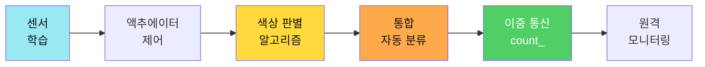

### 학습 성과

- ✅ **센서 마스터**: IR, 컬러 센서 완벽 이해
- ✅ **모터 제어**: DC 모터, 서보 모터 정밀 제어
- ✅ **핵심 알고리즘**: 색상 판별 (유클리드 거리)
- ✅ **자동화 시스템**: 완전 자동 분류 (~2,188줄)
- ✅ **이중 통신**: Serial + Bluetooth 동시 처리
- ✅ **원격 모니터링**: count_ 데이터 실시간 전송

---

## ⏰ Day 2 시간표 (8시간)

| 교시 | 시간 | 활동 | 학습 내용 | 산출물 |
|------|------|------|----------|--------|
| **1교시** | 1h | 하드웨어 조립 | 컨베이어 조립 + 센서 장착 | 작동하는 컨베이어 |
| **2교시** | 1h | 01~02단계 | IR 센서 + 컬러 센서 ⭐ | 색상 판별 |
| **3교시** | 1h | 03~05단계 | RGB LED + DC + Servo | 액추에이터 제어 |
| **4교시** | 1.5h | 06단계 ⭐⭐ | 통합 자동 분류 시스템 | 자동 분류 |
| **5교시** | 1.5h | 07단계 ⭐⭐ | Serial 실시간 제어 | 비차단 명령 |
| **6교시** | 1h | 08단계 ⭐⭐⭐ | 이중 통신 + count_ | 제품 카운팅 |
| **7교시** | 1h | 앱인벤터 📱 | 원격 모니터링 앱 | 실시간 대시보드 |

---

## 1교시: 🔧 컨베이어 시스템 조립 (1시간)

### 📦 부품 확인

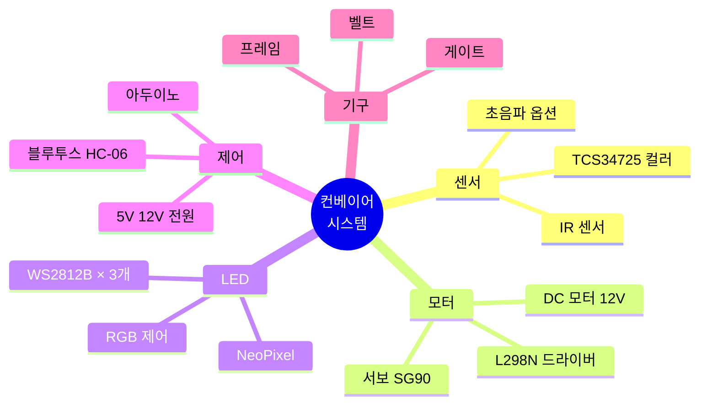

### 🛠️ 조립 프로세스

#### Step 1: 프레임 및 벨트 조립 (20분)

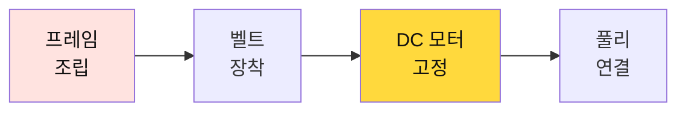

**체크 포인트**:
- [ ] 벨트가 팽팽하게 장착되었나?
- [ ] 풀리가 벨트와 잘 맞물리나?
- [ ] DC 모터가 단단히 고정되었나?

#### Step 2: 센서 배치 (15분)

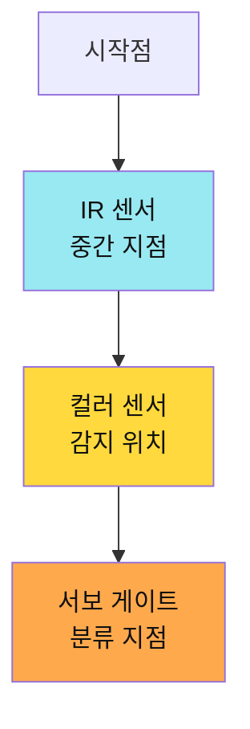

**센서 위치 가이드**:
- **IR 센서**: 벨트 중간, 물체가 지나가는 곳
- **컬러 센서**: IR 감지 후 10cm 지점, 위에서 아래로
- **서보 게이트**: 컬러 센서 후 15cm, 분류 시작 지점

#### Step 3: 배선 (25분)

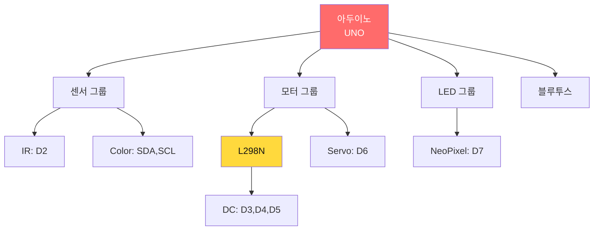

**배선 체크리스트**:

| 부품 | 아두이노 핀 | 추가 연결 | 확인 |
|------|------------|---------|------|
| **IR 센서** | D2 (Digital) | VCC → 5V, GND | □ |
| **컬러 센서 SDA** | A4 (I2C) | 풀업 저항 | □ |
| **컬러 센서 SCL** | A5 (I2C) | 풀업 저항 | □ |
| **컬러 센서 LED** | 3.3V | 밝기 조절 | □ |
| **L298N IN1** | D3 | 방향 제어 | □ |
| **L298N IN2** | D4 | 방향 제어 | □ |
| **L298N ENA** | D5 (PWM) | 속도 제어 | □ |
| **DC 모터** | L298N OUT1,OUT2 | 12V 전원 | □ |
| **서보 게이트** | D6 (PWM) | VCC → 5V | □ |
| **NeoPixel DIN** | D7 | 첫번째 LED | □ |
| **NeoPixel VCC** | 5V | 전체 연결 | □ |
| **블루투스 RX** | TX (D1) | Serial 연결 | □ |
| **블루투스 TX** | RX (D0) | Serial 연결 | □ |

---

## 2교시: 📡 01~02단계 - 센서 학습 (1시간)

### 01단계: IR 센서 (20분)

**학습 목표**: 적외선 센서로 물체 감지

#### 감지 알고리즘

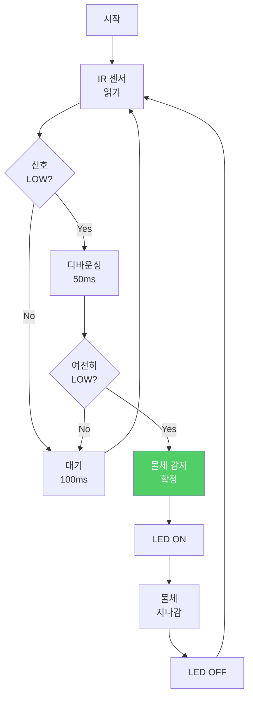

#### 핵심 코드

```cpp
const int IR_PIN = 2;
bool objectDetected = false;

void loop() {
  int irValue = digitalRead(IR_PIN);
  
  if(irValue == LOW && !objectDetected) {
    // 디바운싱
    delay(50);
    if(digitalRead(IR_PIN) == LOW) {
      objectDetected = true;
      Serial.println("물체 감지!");
      digitalWrite(LED_BUILTIN, HIGH);
    }
  } else if(irValue == HIGH && objectDetected) {
    objectDetected = false;
    Serial.println("물체 통과");
    digitalWrite(LED_BUILTIN, LOW);
  }
  
  delay(100);
}
```

### 02단계: 컬러 센서 ⭐ (40분)

**학습 목표**: TCS34725로 RGB 색상 판별하는 핵심 알고리즘 마스터

#### 색상 판별 알고리즘 (유클리드 거리)

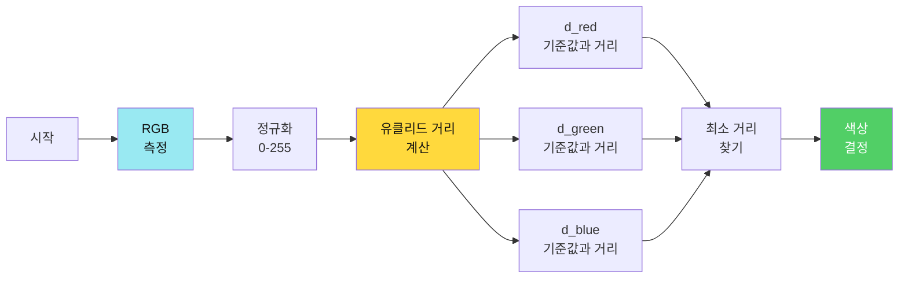

#### 유클리드 거리 공식

$$
d = \sqrt{(R_{측정} - R_{기준})^2 + (G_{측정} - G_{기준})^2 + (B_{측정} - B_{기준})^2}
$$

#### 기준 색상 값 (캘리브레이션)

```cpp
// 기준 색상 값 (측정 후 입력)
struct ColorRef {
  int r, g, b;
};

ColorRef RED_REF    = {255, 50, 50};   // 빨강
ColorRef GREEN_REF  = {50, 255, 50};   // 초록
ColorRef BLUE_REF   = {50, 50, 255};   // 파랑
ColorRef YELLOW_REF = {255, 255, 50};  // 노랑

// 유클리드 거리 계산
float distance(int r1, int g1, int b1, int r2, int g2, int b2) {
  int dr = r1 - r2;
  int dg = g1 - g2;
  int db = b1 - b2;
  return sqrt(dr*dr + dg*dg + db*db);
}
```

#### 색상 판별 알고리즘 (실제 구현)

**색상 판별 순서도**:
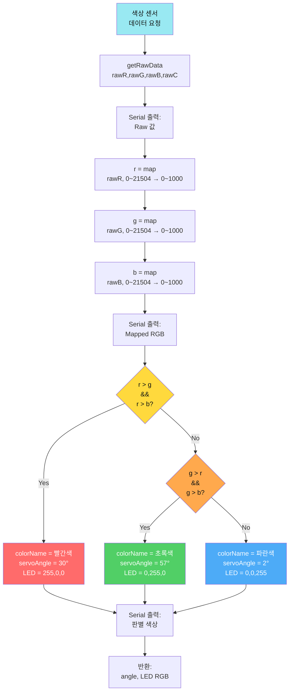

**실제 코드 (단순화 버전)**:
```cpp
#include <Wire.h>
#include <Adafruit_TCS34725.h>

Adafruit_TCS34725 colorSensor = Adafruit_TCS34725(TCS34725_INTEGRATIONTIME_50MS, TCS34725_GAIN_4X);

const int RAW_MAX = 21504;
const int MAPPED_MAX = 1000;
const int MIN_SUM = 15;  // 유효 색상 최소 합계

void loop() {
  // 1. Raw 데이터 읽기
  uint16_t rawR, rawG, rawB, rawC;
  colorSensor.getRawData(&rawR, &rawG, &rawB, &rawC);
  
  Serial.print("Raw -> R: ");
  Serial.print(rawR);
  Serial.print(", G: ");
  Serial.print(rawG);
  Serial.print(", B: ");
  Serial.println(rawB);
  
  // 2. 정규화 (0-1000)
  int r = map(rawR, 0, RAW_MAX, 0, MAPPED_MAX);
  int g = map(rawG, 0, RAW_MAX, 0, MAPPED_MAX);
  int b = map(rawB, 0, RAW_MAX, 0, MAPPED_MAX);
  
  Serial.print("RGB -> R: ");
  Serial.print(r);
  Serial.print(", G: ");
  Serial.print(g);
  Serial.print(", B: ");
  Serial.println(b);
  
  // 3. 유효성 체크
  int sum = r + g + b;
  if(sum < MIN_SUM) {
    Serial.println("색상 없음 (배경)");
    return;
  }
  
  // 4. 최대값 비교로 색상 판별
  int ledR = 0, ledG = 0, ledB = 0;
  int servoAngle = 2;  // 기본: 파랑
  const char* colorName = "알 수 없음";
  
  if (r > g && r > b) {
    // 빨간색
    colorName = "빨간색";
    servoAngle = 30;
    ledR = 255; ledG = 0; ledB = 0;
  } 
  else if (g > r && g > b) {
    // 초록색
    colorName = "초록색";
    servoAngle = 57;
    ledR = 0; ledG = 255; ledB = 0;
  } 
  else {
    // 파란색 (기본)
    colorName = "파란색";
    servoAngle = 2;
    ledR = 0; ledG = 0; ledB = 255;
  }
  
  Serial.print("판별 색상: ");
  Serial.println(colorName);
  
  // 5. 서보 및 LED 제어
  controlServo(servoAngle);
  controlLED(ledR, ledG, ledB);
}
```

**고급 버전 (유클리드 거리)**:
```cpp
struct ColorRef {
  int r, g, b;
};

ColorRef RED_REF    = {255, 50, 50};   // 빨강
ColorRef GREEN_REF  = {50, 255, 50};   // 초록
ColorRef BLUE_REF   = {50, 50, 255};   // 파랑

// 유클리드 거리 계산
float distance(int r1, int g1, int b1, int r2, int g2, int b2) {
  int dr = r1 - r2;
  int dg = g1 - g2;
  int db = b1 - b2;
  return sqrt(dr*dr + dg*dg + db*db);
}

String detectColorAdvanced(int r, int g, int b) {
  // 각 기준 색상과의 거리 계산
  float d_red = distance(r, g, b, RED_REF.r, RED_REF.g, RED_REF.b);
  float d_green = distance(r, g, b, GREEN_REF.r, GREEN_REF.g, GREEN_REF.b);
  float d_blue = distance(r, g, b, BLUE_REF.r, BLUE_REF.g, BLUE_REF.b);
  
  // 최소 거리 찾기
  float minDist = d_red;
  String color = "RED";
  
  if(d_green < minDist) {
    minDist = d_green;
    color = "GREEN";
  }
  if(d_blue < minDist) {
    minDist = d_blue;
    color = "BLUE";
  }
  
  Serial.print("거리 -> R:");
  Serial.print(d_red);
  Serial.print(" G:");
  Serial.print(d_green);
  Serial.print(" B:");
  Serial.println(d_blue);
  Serial.print("판별 → ");
  Serial.println(color);
  
  return color;
}
```

**시간 복잡도**: O(1) (비교 연산 3회 고정)

**공간 복잡도**: O(1) (변수 수 고정)

**실습 활동**:
1. [ ] 빨강 물체 측정 → 기준값 저장
2. [ ] 초록 물체 측정 → 기준값 저장
3. [ ] 파랑 물체 측정 → 기준값 저장
4. [ ] 테스트: 정확도 80% 이상 확인

---

## 3교시: ⚙️ 03~05단계 - 액추에이터 제어 (1시간)

### 03단계: RGB LED (15분)

**학습 목표**: NeoPixel로 15가지 색상 표시

#### NeoPixel 제어

```cpp
#include <Adafruit_NeoPixel.h>

#define LED_PIN 7
#define LED_COUNT 3

Adafruit_NeoPixel strip(LED_COUNT, LED_PIN, NEO_GRB + NEO_KHZ800);

void setup() {
  strip.begin();
  strip.setBrightness(50);  // 밝기 조절
  strip.show();
}

void setColor(String color) {
  uint32_t c;
  
  if(color == "RED") {
    c = strip.Color(255, 0, 0);
  } else if(color == "GREEN") {
    c = strip.Color(0, 255, 0);
  } else if(color == "BLUE") {
    c = strip.Color(0, 0, 255);
  } else if(color == "YELLOW") {
    c = strip.Color(255, 255, 0);
  } else {
    c = strip.Color(255, 255, 255);  // 흰색 (기본)
  }
  
  // 모든 LED를 같은 색으로
  for(int i = 0; i < LED_COUNT; i++) {
    strip.setPixelColor(i, c);
  }
  strip.show();
}
```

### 04단계: DC 모터 (25분)

**학습 목표**: L298N으로 PWM 속도 제어

#### PWM 제어 알고리즘 (세부 설명)

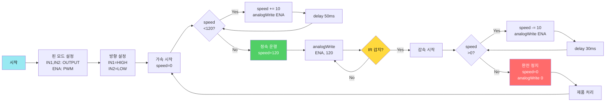

#### 실제 코드 (통합 버전)

```cpp
// 핀 설정
const int PIN_MOTOR_DIR = 13;    // 방향
const int PIN_MOTOR_SPEED = 11;  // PWM 속도
const int MOTOR_SPEED = 120;     // 정속 속도
const int MOTOR_DIR_FORWARD = HIGH;

void setup() {
  pinMode(PIN_MOTOR_DIR, OUTPUT);
  pinMode(PIN_MOTOR_SPEED, OUTPUT);
  
  // 방향 설정 (전진)
  digitalWrite(PIN_MOTOR_DIR, MOTOR_DIR_FORWARD);
  analogWrite(PIN_MOTOR_SPEED, 0);  // 초기: 정지
}

void loop() {
  // 컨베이어 시작
  analogWrite(PIN_MOTOR_SPEED, MOTOR_SPEED);
  
  // IR 센서 감지 대기
  while(digitalRead(PIN_IR_SENSOR) == HIGH) {
    delay(10);  // 감지 대기
  }
  
  // 제품 감지 → 정지
  analogWrite(PIN_MOTOR_SPEED, 0);
  delay(2000);  // 처리 시간
  
  // 색상 센서로 이동
  analogWrite(PIN_MOTOR_SPEED, MOTOR_SPEED);
  // (색상 감지 루프...)
  
  // 다시 정지
  analogWrite(PIN_MOTOR_SPEED, 0);
  delay(1500);  // 분류 시간
  
  // 재시작
  analogWrite(PIN_MOTOR_SPEED, MOTOR_SPEED);
  delay(1000);  // 다음 제품 간격
}
```

#### 부드러운 가감속 (선택 사항)

```cpp
// 부드러운 가속
void motorAccelerate(int targetSpeed) {
  int currentSpeed = 0;
  while(currentSpeed < targetSpeed) {
    currentSpeed += 10;
    if(currentSpeed > targetSpeed) currentSpeed = targetSpeed;
    
    analogWrite(PIN_MOTOR_SPEED, currentSpeed);
    delay(50);  // 가속 곡선
  }
}

// 부드러운 감속
void motorDecelerate() {
  int currentSpeed = MOTOR_SPEED;
  while(currentSpeed > 0) {
    currentSpeed -= 10;
    if(currentSpeed < 0) currentSpeed = 0;
    
    analogWrite(PIN_MOTOR_SPEED, currentSpeed);
    delay(30);  // 감속 곡선
  }
}
```

**PWM 듀티 사이클 이해**:
```
0%   duty cycle (0/255)   → 0V   → 정지
25%  duty cycle (64/255)  → 1.25V → 느림
50%  duty cycle (128/255) → 2.5V  → 중간
75%  duty cycle (192/255) → 3.75V → 빠름
100% duty cycle (255/255) → 5V   → 최고속
```

**시간 복잡도**: 
- 가속: O(n), n = targetSpeed / 10
- 정속: O(1)
- 감속: O(n), n = currentSpeed / 10

**주의사항**:
1. **과부하 방지**: 급가속 금지 (모터 보호)
2. **전류 제한**: 2A 이상 전원 필수
3. **PWM 주파수**: ~490Hz (Arduino 기본)

// 부드러운 가속
void motorAccelerate() {
  for(int speed = 0; speed <= 255; speed += 5) {
    analogWrite(ENA, speed);
    delay(50);
  }
}

// 부드러운 감속
void motorDecelerate() {
  for(int speed = 255; speed >= 0; speed -= 5) {
    analogWrite(ENA, speed);
    delay(50);
  }
}
```

### 05단계: 서보 게이트 (20분)

**학습 목표**: 서보로 분류 방향 제어

#### 게이트 제어 알고리즘 (실제 구현 기반)

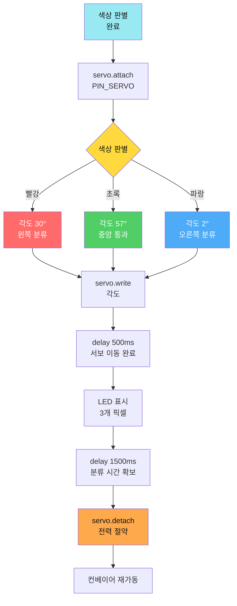

#### 실제 코드 (통합 버전)

```cpp
#include <Servo.h>

Servo servo;
const int PIN_SERVO = 9;

// 실제 측정된 각도 (하드웨어 종속)
const int ANGLE_RED = 30;    // 빨강: 왼쪽
const int ANGLE_GREEN = 57;  // 초록: 중앙
const int ANGLE_BLUE = 2;    // 파랑: 오른쪽

void setup() {
  // 서보 초기화 (3개 각도 테스트)
  servo.attach(PIN_SERVO);
  servo.write(ANGLE_RED);
  delay(500);
  servo.write(ANGLE_GREEN);
  delay(500);
  servo.write(ANGLE_BLUE);
  servo.detach();  // 떨림 방지
}

void loop() {
  // (색상 판별 완료 후...)
  
  // 1. 서보 활성화
  servo.attach(PIN_SERVO);
  
  // 2. 색상에 따른 각도 설정
  int servoAngle;
  int ledR, ledG, ledB;
  
  if (r > g && r > b) {
    // 빨간색
    servoAngle = ANGLE_RED;
    ledR = 255; ledG = 0; ledB = 0;
    Serial.println("빨간색 → 30° (왼쪽)");
  } 
  else if (g > r && g > b) {
    // 초록색
    servoAngle = ANGLE_GREEN;
    ledR = 0; ledG = 255; ledB = 0;
    Serial.println("초록색 → 57° (중앙)");
  } 
  else {
    // 파란색
    servoAngle = ANGLE_BLUE;
    ledR = 0; ledG = 0; ledB = 255;
    Serial.println("파란색 → 2° (오른쪽)");
  }
  
  // 3. 서보 이동
  servo.write(servoAngle);
  delay(500);  // 이동 완료 대기
  
  // 4. LED 표시
  for (int i = 0; i < NUM_PIXELS; i++) {
    led.setPixelColor(i, led.Color(ledR, ledG, ledB));
  }
  led.show();
  
  delay(1500);  // 분류 시간
  
  // 5. 서보 분리 (전력 절약 + 떨림 방지)
  servo.detach();
  
  // 6. 컨베이어 재가동
  analogWrite(PIN_MOTOR_SPEED, MOTOR_SPEED);
  delay(1000);
}
```

#### 서보 각도 캘리브레이션 도구

```cpp
// 각도 테스트 프로그램
void testServoAngles() {
  Serial.println("=== 서보 각도 테스트 ===");
  
  servo.attach(PIN_SERVO);
  
  // 0-180° 전체 범위 테스트
  for(int angle = 0; angle <= 180; angle += 10) {
    Serial.print("각도: ");
    Serial.println(angle);
    
    servo.write(angle);
    delay(1000);  // 1초씩 확인
  }
  
  servo.detach();
  
  Serial.println("테스트 완료");
  Serial.println("최적 각도를 확인하고 코드에 반영하세요:");
  Serial.println("- 빨강 → 왼쪽 분류 각도: ?");
  Serial.println("- 초록 → 중앙 통과 각도: ?");
  Serial.println("- 파랑 → 오른쪽 분류 각도: ?");
}
```

**시간 복잡도**: O(1) (고정 시간)

**중요 개념**:
1. **attach/detach**: 서보 사용 시만 활성화 (떨림 방지, 전력 절약)
2. **delay 500ms**: 서보 물리적 이동 시간 확보
3. **하드웨어 캘리브레이션**: 실제 각도는 측정 필요 (30°, 57°, 2°)

**디버깅 팁**:
```cpp
// 각도 설정 후 확인
servo.write(angle);
delay(15);  // 서보 신호 안정화
int currentAngle = servo.read();
Serial.print("설정 각도: ");
Serial.print(angle);
Serial.print(" / 현재 각도: ");
Serial.println(currentAngle);
```

---

## 4교시: 🔄 06단계 - 통합 자동 분류 ⭐⭐ (1.5시간)

**학습 목표**: 모든 모듈을 통합한 완전 자동화 시스템

### 통합 시스템 플로우차트

```mermaid
graph TD
    START[시스템 시작] --> SETUP[setup 함수]
    SETUP --> INIT_MOTOR[모터 초기화<br/>방향 전진]
    INIT_MOTOR --> INIT_SERVO[서보 초기화<br/>3개 각도 테스트]
    INIT_SERVO --> INIT_COLOR[컬러 센서<br/>begin 체크]
    INIT_COLOR --> CHECK_SENSOR{센서<br/>정상?}
    CHECK_SENSOR -->|No| ERROR[무한 대기<br/>센서 오류]
    
    CHECK_SENSOR -->|Yes| INIT_LED[LED 초기화<br/>밝기 255]
    INIT_LED --> BUZZER_START[시작 알림음<br/>523Hz, 659Hz]
    BUZZER_START --> MOTOR_ON[모터 가동<br/>PWM 120]
    
    MOTOR_ON --> LOOP_START[loop 시작]
    
    LOOP_START --> IR_CHECK{IR 센서<br/>HIGH?}
    IR_CHECK -->|Yes| LOOP_START
    
    IR_CHECK -->|No| PRODUCT_DETECT[제품 감지!<br/>productCount++]
    PRODUCT_DETECT --> PRINT1[Serial 출력:<br/>제품 번호]
    
    PRINT1 --> MOTOR_STOP1[모터 정지<br/>PWM 0]
    MOTOR_STOP1 --> BUZZER1[알림음<br/>523Hz, 784Hz]
    BUZZER1 --> DELAY1[대기<br/>2000ms]
    
    DELAY1 --> MOTOR_MOVE[모터 재시작<br/>컬러 센서로 이동]
    
    MOTOR_MOVE --> COLOR_LOOP[색상 센서 읽기<br/>루프]
    COLOR_LOOP --> READ_RAW[getRawData<br/>rawR,G,B,C]
    READ_RAW --> MAP_RGB[map 함수<br/>0~21504 → 0~1000]
    MAP_RGB --> CALC_SUM[sum = r+g+b]
    CALC_SUM --> CHECK_SUM{sum < 15?}
    CHECK_SUM -->|Yes| COLOR_LOOP
    
    CHECK_SUM -->|No| MOTOR_STOP2[모터 정지<br/>색상 분석]
    MOTOR_STOP2 --> BUZZER2[알림음<br/>523Hz, 784Hz]
    
    BUZZER2 --> PRINT_RGB[Serial 출력:<br/>Raw & Mapped RGB]
    
    PRINT_RGB --> COLOR_COMPARE{RGB 비교}
    COLOR_COMPARE -->|r>g && r>b| RED[빨간색 판별]
    COLOR_COMPARE -->|g>r && g>b| GREEN[초록색 판별]
    COLOR_COMPARE -->|else| BLUE[파란색 판별]
    
    RED --> SET_RED[서보 30°<br/>LED 255,0,0]
    GREEN --> SET_GREEN[서보 57°<br/>LED 0,255,0]
    BLUE --> SET_BLUE[서보 2°<br/>LED 0,0,255]
    
    SET_RED & SET_GREEN & SET_BLUE --> SERVO_ATTACH[servo.attach]
    SERVO_ATTACH --> SERVO_WRITE[servo.write<br/>각도 설정]
    SERVO_WRITE --> SERVO_DELAY[대기 500ms]
    
    SERVO_DELAY --> LED_SHOW[LED 표시<br/>3개 픽셀 동일 색]
    LED_SHOW --> WAIT_COLOR[대기<br/>1500ms]
    
    WAIT_COLOR --> SERVO_DETACH[servo.detach]
    SERVO_DETACH --> MOTOR_RESTART[모터 재가동<br/>PWM 120]
    MOTOR_RESTART --> DELAY2[대기<br/>1000ms]
    
    DELAY2 --> PRINT_DONE[Serial 출력:<br/>제품 처리 완료]
    PRINT_DONE --> LOOP_START
    
    style START fill:#99E9F2,color:#111
    style COLOR_COMPARE fill:#FFD93D,color:#111
    style SET_RED fill:#FF6B6B,color:#fff
    style SET_GREEN fill:#51CF66,color:#fff
    style SET_BLUE fill:#4DABF7,color:#fff
    style LOOP_START fill:#FFA94D,color:#111
```

### 상태 머신 설계

```cpp
enum State {
  IDLE,        // 대기
  DETECTING,   // 물체 감지
  MEASURING,   // 색상 측정
  SORTING,     // 분류 중
  RESUMING     // 재시작
};

State currentState = IDLE;

void loop() {
  switch(currentState) {
    case IDLE:
      motorForward(200);  // 정속 운행
      
      if(digitalRead(IR_PIN) == LOW) {
        currentState = DETECTING;
      }
      break;
      
    case DETECTING:
      delay(50);  // 디바운싱
      if(digitalRead(IR_PIN) == LOW) {
        motorStop();
        currentState = MEASURING;
      } else {
        currentState = IDLE;
      }
      break;
      
    case MEASURING:
      delay(500);  // 안정화 시간
      String color = detectColor();
      setColor(color);
      currentState = SORTING;
      break;
      
    case SORTING:
      sortByColor(color);
      currentState = RESUMING;
      break;
      
    case RESUMING:
      delay(1000);
      setColor("OFF");
      currentState = IDLE;
      break;
  }
}
```

**실습 활동**:
- [ ] 빨강 물체 → 왼쪽 분류 확인
- [ ] 초록 물체 → 중앙 통과 확인
- [ ] 파랑 물체 → 오른쪽 분류 확인
- [ ] 연속 10개 → 정확도 80% 이상

---

## 5교시: 📡 07단계 - Serial 실시간 제어 ⭐⭐ (1.5시간)

**학습 목표**: delay() 중에도 명령을 받는 비차단 알고리즘

### 문제: delay()의 한계


**문제점**: `delay(1000)` 동안 다른 명령을 받을 수 없음!

### 해결: millis() 비차단 타이밍

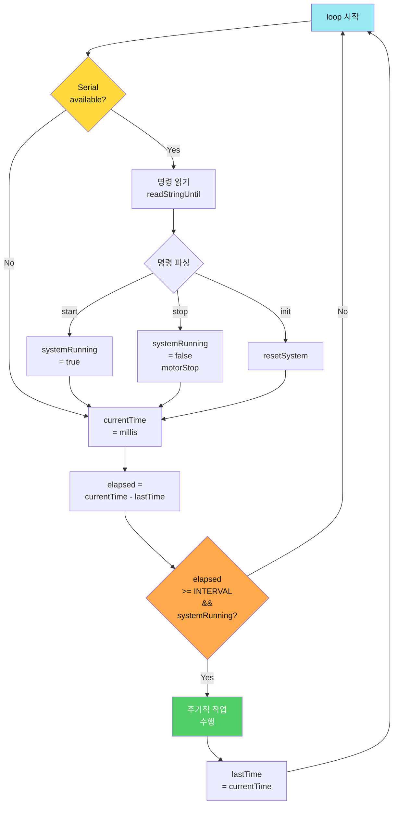

### 핵심 알고리즘: 실시간 명령 체크 (세부 설명)

```cpp
// 전역 변수
unsigned long lastTime = 0;           // 마지막 작업 시간
const unsigned long INTERVAL = 1000;  // 작업 주기 (1초)
bool systemRunning = false;           // 시스템 동작 상태

void loop() {
  // ========== 1단계: 항상 명령 체크 (비차단) ==========
  checkSerialCommand();
  
  // ========== 2단계: 타이밍 체크 ==========
  unsigned long currentTime = millis();  // 현재 시간 (ms)
  unsigned long elapsed = currentTime - lastTime;
  
  // ========== 3단계: 조건 충족 시 작업 실행 ==========
  if(systemRunning && (elapsed >= INTERVAL)) {
    performTask();  // 주기적 작업
    lastTime = currentTime;  // 시간 업데이트
    
    Serial.print("작업 실행: ");
    Serial.print(currentTime);
    Serial.print("ms (경과: ");
    Serial.print(elapsed);
    Serial.println("ms)");
  }
  
  // loop는 즉시 재시작 → Serial 체크 빈도 ↑
}

void checkSerialCommand() {
  if(Serial.available() > 0) {
    String cmd = Serial.readStringUntil('\n');
    cmd.trim();
    
    Serial.print("명령 수신: ");
    Serial.println(cmd);
    
    if(cmd == "start_") {
      systemRunning = true;
      analogWrite(PIN_MOTOR_SPEED, MOTOR_SPEED);
      Serial.println("OK:START - 시스템 가동");
    } 
    else if(cmd == "stop_") {
      systemRunning = false;
      analogWrite(PIN_MOTOR_SPEED, 0);
      Serial.println("OK:STOP - 시스템 정지");
    } 
    else if(cmd == "init_") {
      systemRunning = false;
      resetSystem();
      Serial.println("OK:INIT - 시스템 초기화");
    }
    else if(cmd == "status_") {
      Serial.print("상태: ");
      Serial.println(systemRunning ? "동작 중" : "정지");
      Serial.print("가동 시간: ");
      Serial.print(millis() / 1000);
      Serial.println("초");
    }
    else {
      Serial.println("ERR:UNKNOWN_COMMAND");
    }
  }
}

void performTask() {
  // 주기적 작업 (예: 센서 읽기, 데이터 전송 등)
  Serial.println("--- 주기적 작업 수행 ---");
  
  // 예: 센서 데이터 읽기
  int irValue = digitalRead(PIN_IR_SENSOR);
  Serial.print("IR 센서: ");
  Serial.println(irValue == LOW ? "감지됨" : "없음");
  
  // 예: 상태 전송
  Serial.print("STATUS:");
  Serial.print(millis());
  Serial.print(",");
  Serial.println(irValue);
}
```

### delay() vs millis() 비교

| 항목 | delay() | millis() |
|-----|---------|----------|
| **동작 방식** | 차단 (blocking) | 비차단 (non-blocking) |
| **명령 수신** | ❌ delay 중 불가능 | ✅ 항상 가능 |
| **정확도** | ✅ 정확 | ⚠️ 오차 누적 가능 |
| **복잡도** | 간단 | 약간 복잡 |
| **사용 사례** | 단순 시퀀스 | 실시간 제어 |

### millis() 오버플로우 대책

```cpp
// millis()는 약 49.7일 후 오버플로우 (0으로 되돌아감)
// 올바른 경과 시간 계산:
unsigned long elapsed = currentTime - lastTime;

// ✅ 오버플로우 안전 (unsigned 연산 특성)
// 예: currentTime = 100, lastTime = 4294967290 (오버플로우 직전)
//     elapsed = 100 - 4294967290 = 110 (올바름!)

// ❌ 잘못된 방법:
if(currentTime > lastTime + INTERVAL) {  // 오버플로우 시 오동작
  // ...
}
```

### 실전 응용: 다중 타이머

```cpp
unsigned long lastMotorTime = 0;
unsigned long lastSensorTime = 0;
unsigned long lastReportTime = 0;

const unsigned long MOTOR_INTERVAL = 100;    // 모터: 100ms
const unsigned long SENSOR_INTERVAL = 50;    // 센서: 50ms
const unsigned long REPORT_INTERVAL = 1000;  // 리포트: 1초

void loop() {
  checkSerialCommand();
  
  unsigned long now = millis();
  
  // 타이머 1: 모터 제어
  if(now - lastMotorTime >= MOTOR_INTERVAL) {
    controlMotor();
    lastMotorTime = now;
  }
  
  // 타이머 2: 센서 읽기
  if(now - lastSensorTime >= SENSOR_INTERVAL) {
    readSensors();
    lastSensorTime = now;
  }
  
  // 타이머 3: 상태 리포트
  if(now - lastReportTime >= REPORT_INTERVAL) {
    sendStatusReport();
    lastReportTime = now;
  }
}
```

**시간 복잡도**: O(1) (모든 타이밍 체크)

**공간 복잡도**: O(n), n = 타이머 개수

### 명령어 테이블

| 명령어 | 기능 | 응답 |
|--------|------|------|
| `start_` | 시스템 시작 | `OK:START` |
| `stop_` | 즉시 중지 | `OK:STOP` |
| `init_` | 초기화 | `OK:INIT` |
| `speed_200_` | 속도 변경 | `OK:SPEED_200` |

---

## 6교시: 📊 08단계 - 이중 통신 + count_ ⭐⭐⭐ (1시간)

**학습 목표**: Serial + Bluetooth 동시 처리 + 제품 카운팅

### 이중 통신 구조

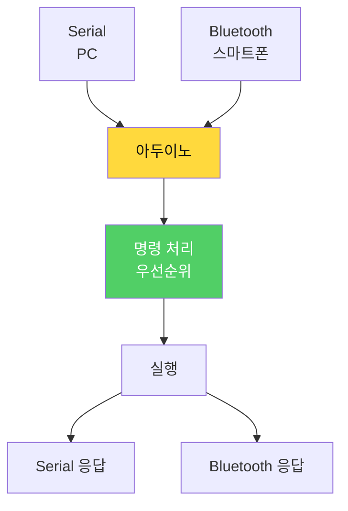

### 제품 카운터 알고리즘

```cpp
struct ProductCounter {
  int red;
  int green;
  int blue;
  int yellow;
  int total;
};

ProductCounter counter = {0, 0, 0, 0, 0};

void updateCounter(String color) {
  counter.total++;
  
  if(color == "RED") {
    counter.red++;
    sendCountData("red", counter.red);
  } else if(color == "GREEN") {
    counter.green++;
    sendCountData("green", counter.green);
  } else if(color == "BLUE") {
    counter.blue++;
    sendCountData("blue", counter.blue);
  } else if(color == "YELLOW") {
    counter.yellow++;
    sendCountData("yellow", counter.yellow);
  }
}

void sendCountData(String color, int count) {
  String msg = "count_" + color + String(count) + "_";
  
  // Serial과 Bluetooth 모두 전송
  Serial.println(msg);
  
  if(bluetoothConnected) {
    Serial.print(msg);  // Bluetooth는 Serial 공유
  }
}
```

### count_ 데이터 형식

| 데이터 | 형식 | 의미 | 예시 |
|--------|------|------|------|
| 빨강 1개 | `count_red1_` | 빨강 카운터 = 1 | `count_red1_` |
| 초록 2개 | `count_green2_` | 초록 카운터 = 2 | `count_green2_` |
| 파랑 3개 | `count_blue3_` | 파랑 카운터 = 3 | `count_blue3_` |
| 전체 통계 | `count_total15_` | 총 15개 처리 | `count_total15_` |

**실습 활동**:
- [ ] start_ 명령으로 시작
- [ ] 색상별로 5개씩 투입
- [ ] count_ 데이터 수신 확인
- [ ] stop_ 명령으로 중지

---

## 7교시: 📱 원격 모니터링 앱 (1시간)

**학습 목표**: 앱인벤터로 실시간 재고 현황 모니터링

### 앱 화면 구성

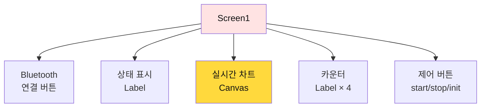

### 블록 코딩: count_ 데이터 파싱 (알고리즘 상세)

**데이터 파싱 순서도**:
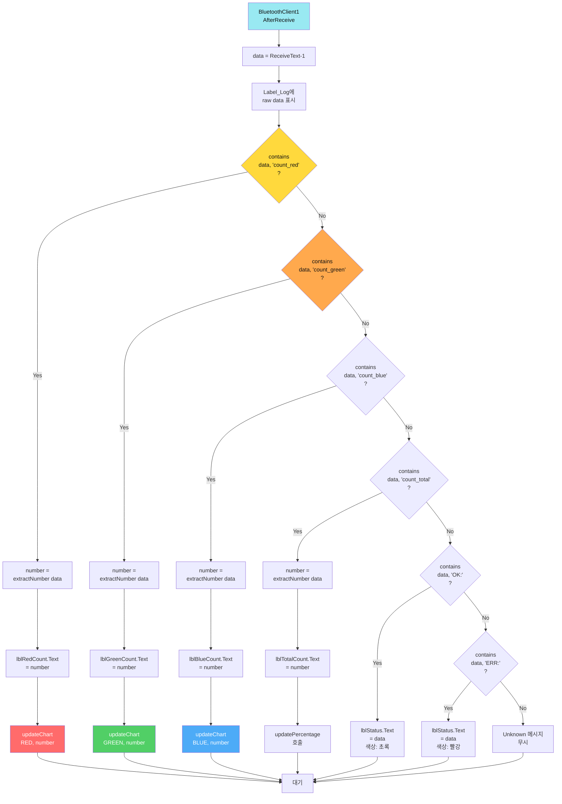

**블록 코딩 (의사코드)**:
```
📍 when BluetoothClient1.AfterReceive
  ├─ set data to BluetoothClient1.ReceiveText(-1)
  │
  ├─ set Label_Log.Text to "수신: " + data  // 디버깅용
  │
  ├─ if contains(data, "count_red")
  │   ├─ set number to extractNumber(data)
  │   ├─ set lblRedCount.Text to number
  │   ├─ set lblRedCount.BackgroundColor to RED
  │   └─ call updateChart("RED", number)
  │
  ├─ else if contains(data, "count_green")
  │   ├─ set number to extractNumber(data)
  │   ├─ set lblGreenCount.Text to number
  │   ├─ set lblGreenCount.BackgroundColor to GREEN
  │   └─ call updateChart("GREEN", number)
  │
  ├─ else if contains(data, "count_blue")
  │   ├─ set number to extractNumber(data)
  │   └─ set lblBlueCount.Text to number
  │
  └─ else if contains(data, "count_total")
      ├─ set number to extractNumber(data)
      └─ set lblTotalCount.Text to number
```

### 숫자 추출 프로시저 (알고리즘 상세)

**숫자 추출 순서도**:
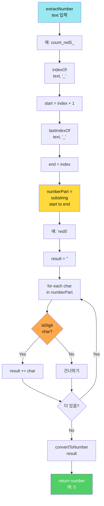

**블록 코딩 (상세)**:
```
📍 procedure extractNumber (text)
  parameters: text
  result: number
  
  // 예: text = "count_red5_"
  
  // 1단계: 첫 번째 _ 찾기
  set firstUnderscoreIndex to call text.indexOf("_")
  // firstUnderscoreIndex = 5
  
  set start to firstUnderscoreIndex + 1
  // start = 6 (r의 위치)
  
  // 2단계: 마지막 _ 찾기
  set lastUnderscoreIndex to call text.lastIndexOf("_")
  // lastUnderscoreIndex = 9
  
  set end to lastUnderscoreIndex - start + 1
  // end = 4 (길이)
  
  // 3단계: 부분 문자열 추출
  set numberPart to call text.substring(start, end)
  // numberPart = "red5"
  
  // 4단계: 숫자만 추출
  set result to ""
  set i to 1
  
  repeat while i <= length of numberPart
    set char to call text.charAt(i)
    
    if char >= "0" and char <= "9" then
      set result to join(result, char)
    
    set i to i + 1
  
  // result = "5"
  
  // 5단계: 문자열 → 숫자 변환
  if result = "" then
    return 0
  else
    return convertToNumber(result)
```

**시간 복잡도**: O(n), n = text 길이

**테스트 케이스**:
| 입력 | 출력 |
|------|------|
| `"count_red5_"` | 5 |
| `"count_green12_"` | 12 |
| `"count_blue0_"` | 0 |
| `"count_total123_"` | 123 |

### 실시간 차트 업데이트 (알고리즘 상세)

**차트 업데이트 순서도**:
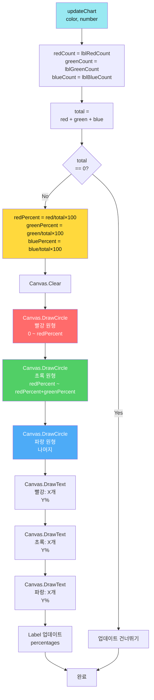

**블록 코딩 (상세)**:
```
📍 procedure updateChart (color, number)
  parameters: color (text), number (integer)
  
  // 1단계: 현재 카운터 읽기
  set redCount to convertToNumber(lblRedCount.Text)
  set greenCount to convertToNumber(lblGreenCount.Text)
  set blueCount to convertToNumber(lblBlueCount.Text)
  
  // 2단계: 총합 계산
  set total to redCount + greenCount + blueCount
  
  // 3단계: 비율 계산
  if total > 0 then
    set redPercent to round((redCount / total) × 100)
    set greenPercent to round((greenCount / total) × 100)
    set bluePercent to round((blueCount / total) × 100)
    
    // 퍼센트 라벨 업데이트
    set lblRedPercent.Text to redPercent + "%"
    set lblGreenPercent.Text to greenPercent + "%"
    set lblBluePercent.Text to bluePercent + "%"
    
    // 4단계: Canvas 초기화
    call Canvas1.Clear()
    
    // 5단계: 막대 그래프 그리기
    set barWidth to 60
    set maxHeight to 200
    set spacing to 80
    
    // 빨강 막대
    set redHeight to (redCount / total) × maxHeight
    call Canvas1.DrawRect(50, 250 - redHeight, barWidth, redHeight)
    set Canvas1.PaintColor to RED
    
    // 초록 막대
    set greenHeight to (greenCount / total) × maxHeight
    call Canvas1.DrawRect(50 + spacing, 250 - greenHeight, barWidth, greenHeight)
    set Canvas1.PaintColor to GREEN
    
    // 파랑 막대
    set blueHeight to (blueCount / total) × maxHeight
    call Canvas1.DrawRect(50 + spacing×2, 250 - blueHeight, barWidth, blueHeight)
    set Canvas1.PaintColor to BLUE
    
    // 6단계: 텍스트 표시
    call Canvas1.DrawText("빨강: " + redCount, 80, 270)
    call Canvas1.DrawText("초록: " + greenCount, 80 + spacing, 270)
    call Canvas1.DrawText("파랑: " + blueCount, 80 + spacing×2, 270)
  else
    set lblRedPercent.Text to "0%"
    set lblGreenPercent.Text to "0%"
    set lblBluePercent.Text to "0%"
  ├─ call Canvas1.Clear()
  ├─ call drawPieChart(redPercent, greenPercent, bluePercent)
  │
  └─ // 막대 그래프
      └─ call drawBarChart(lblRedCount.Text, lblGreenCount.Text, lblBlueCount.Text)
```

---

## 📊 Day 2 평가 및 성찰

### 학습 성과 체크리스트

**센서 마스터**:
- [ ] IR 센서 디바운싱 이해
- [ ] 컬러 센서 유클리드 거리 알고리즘 ⭐
- [ ] 캘리브레이션 방법 습득

**모터 제어**:
- [ ] DC 모터 PWM 제어
- [ ] 부드러운 가속/감속
- [ ] 서보 정밀 각도 제어

**통합 시스템**:
- [ ] 상태 머신 설계
- [ ] 06단계: 자동 분류 완성 ⭐⭐
- [ ] 07단계: 비차단 명령 처리 ⭐⭐
- [ ] 08단계: 이중 통신 + 카운팅 ⭐⭐⭐

**원격 모니터링**:
- [ ] count_ 데이터 실시간 전송
- [ ] 앱인벤터 파싱 및 차트
- [ ] start/stop/init 제어

### 복잡도 분석

| 알고리즘 | 시간 복잡도 | 공간 복잡도 | 비고 |
|---------|-----------|-----------|------|
| 색상 판별 | O(1) | O(1) | 유클리드 거리 4번 |
| 실시간 명령 체크 | O(n) | O(n) | n = 명령 길이 |
| 제품 카운터 | O(1) | O(1) | 단순 증가 |
| 통합 자동 분류 | O(1) | O(1) | 상태 머신 |

---

## 🎯 Day 3 예고

### 내일 배울 것


**Day 3 핵심**:
- ✅ 카메라 → AI 인식 → play_ 명령
- ✅ 로봇팔 자동 줍기 → 컨베이어 분류
- ✅ 8x8 LED 화살표 표시
- ✅ 재고 관리 앱 (원형/막대 차트)
- ✅ **완전 자동화**: AI → 로봇 → 분류 → 차트

---

## 📊 Day 2 전체 시스템 통합 시퀀스 다이어그램

### 완전한 자동화 시퀀스

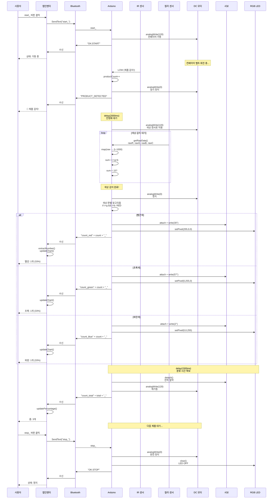

### 핵심 타이밍 다이어그램

```mermaid
gantt
    title Day 2 제품 처리 타이밍 (1개 제품 기준)
    dateFormat X
    axisFormat %Lms
    
    section IR 감지
    제품 감지          :a1, 0, 100ms
    디바운싱           :a2, after a1, 50ms
    
    section 모터 제어
    컨베이어 정지      :b1, after a2, 50ms
    안정화 대기        :b2, after b1, 2000ms
    색상 센서로 이동   :b3, after b2, 1000ms
    
    section 색상 분석
    색상 센서 읽기     :c1, after b3, 500ms
    색상 판별          :c2, after c1, 100ms
    
    section 분류 동작
    서보 각도 설정     :d1, after c2, 500ms
    LED 표시           :d2, after d1, 100ms
    분류 시간 확보     :d3, after d2, 1500ms
    
    section Bluetooth 전송
    카운터 데이터 전송 :e1, after d1, 100ms
    앱 차트 업데이트   :e2, after e1, 200ms
    
    section 재시작
    서보 분리          :f1, after d3, 50ms
    컨베이어 재가동    :f2, after f1, 50ms
    다음 제품 간격     :f3, after f2, 1000ms
```

**총 처리 시간**: 약 6-7초/제품  
**병목 구간**: 안정화 대기 (2초) + 분류 시간 (1.5초)  
**최적화 포인트**: 대기 시간 단축 (현재: 3.5초 → 목표: 2초)

### 복잡도 분석 (Day 2 전체)

| 알고리즘 | 시간 복잡도 | 공간 복잡도 | 비고 |
|---------|-----------|-----------|------|
| IR 센서 감지 | O(1) | O(1) | 디지털 읽기 |
| 색상 센서 읽기 | O(n) | O(1) | n = 센서 안정화 시간 |
| 색상 판별 (최대값) | O(1) | O(1) | 3회 비교 고정 |
| 색상 판별 (유클리드) | O(k) | O(1) | k = 기준 색상 수 |
| PWM 제어 | O(1) | O(1) | 단일 analogWrite |
| 서보 제어 | O(1) | O(1) | 단일 write |
| millis() 타이밍 | O(n) | O(n) | n = 타이머 개수 |
| Bluetooth 파싱 | O(m) | O(m) | m = 명령 길이 |
| 카운터 업데이트 | O(1) | O(1) | 4개 고정 카운터 |
| 차트 그리기 | O(1) | O(1) | 막대 3개 고정 |
| **전체 시스템** | **O(n+m+k)** | **O(n+m)** | **실시간 제약 충족** |

---

**Day 2 완료!** 🎉

**"센서와 알고리즘을 정복했습니다. 내일은 AI로 완전 자동화!"** 🚀

---

**Last Updated**: 2026-01-25  
**Version**: 3.1 (알고리즘 플로우차트 상세화)  
**총 학습 시간**: 8시간  
**코드 라인**: ~2,188줄 (01~08단계)  
**핵심 알고리즘**: 9가지 (IR 감지, 색상 판별 2종, PWM 제어, 서보 제어, millis 타이밍, Bluetooth 파싱, 카운터, 차트)
