# 📅 Day 3: AI 통합 + 스마트 물류 완성 (8시간)

> **"컴퓨터 비전으로 인식하고, 로봇으로 처리하고, 데이터로 관리한다"**  
> Teachable Machine + 로봇팔 + 컨베이어 = 완전 자동화 스마트 팩토리

---

## 🎯 Day 3 학습 목표

### 최종 목표

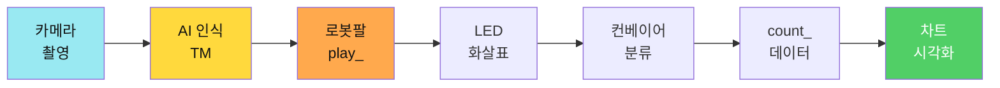

### 학습 성과

- ✅ **컴퓨터 비전**: Teachable Machine으로 물체 인식
- ✅ **AI 통합**: 카메라 → AI → play_ 명령 전송
- ✅ **시스템 통합**: Day1 + Day2 완전 연동
- ✅ **하드웨어 추가**: 8x8 LED Matrix 상태 표시
- ✅ **재고 관리**: 원형/막대 차트 실시간 대시보드
- ✅ **비즈니스 가치**: 완전 자동화 물류 시스템 완성

---

## ⏰ Day 3 시간표 (8시간)

| 교시 | 시간 | 활동 | 학습 내용 | 산출물 |
|------|------|------|----------|--------|
| **1-2교시** | 2h | Teachable Machine | AI 모델 학습 + 테스트 | 물체 인식 모델 |
| **3-4교시** | 2h | 앱인벤터 AI 연동 | TMIC Extension + play_ | AI 제어 앱 |
| **5교시** | 1h | 시스템 통합 테스트 | Day1+2+3 완전 연동 + LED | 자동화 완성 |
| **6교시** | 1h | 프로젝트 기획 | 확장 아이디어 + 비즈니스 모델 | 기획안 |
| **7-8교시** | 2h | 발표 준비 | PPT 작성 + 시연 리허설 | 발표 자료 |

> **전반부(1-5교시)**: 기술 실습 중심  
> **후반부(6-8교시)**: 창의적 사고 + 발표 준비

---

## 1-2교시: 🤖 Teachable Machine AI 모델 학습 (2시간)

**학습 목표**: 컴퓨터 비전으로 물체를 인식하는 AI 모델 만들기

### Teachable Machine 개요

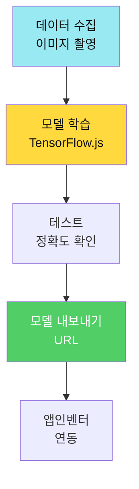

### Step 1: 프로젝트 생성 (10분)

1. **접속**: https://teachablemachine.withgoogle.com/
2. **시작**: "이미지 프로젝트" 클릭
3. **모드**: "표준 이미지 모델" 선택

### Step 2: 클래스 설정 (10분)

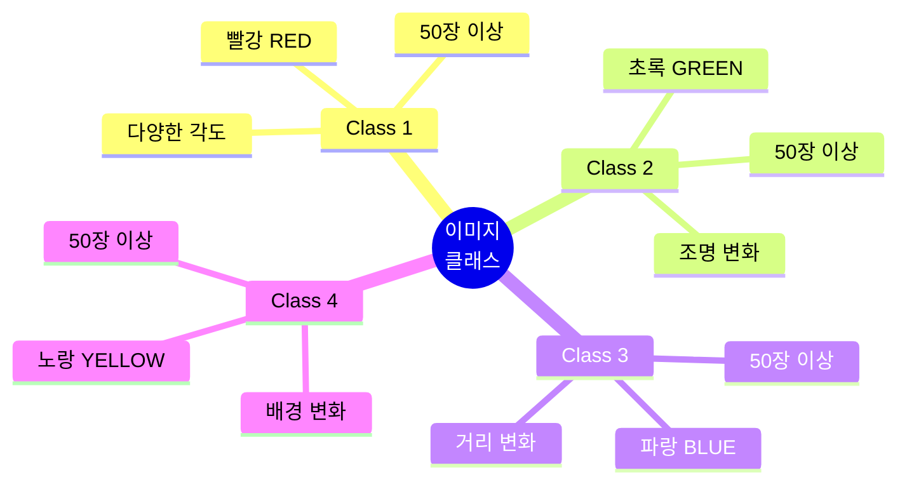

**클래스 이름 규칙**:
- ✅ 대문자 사용: `RED`, `GREEN`, `BLUE`, `YELLOW`
- ✅ 공백 없음
- ✅ play_ 명령과 매핑

### Step 3: 데이터 수집 전략 (40분)

#### 고품질 데이터 수집 원칙

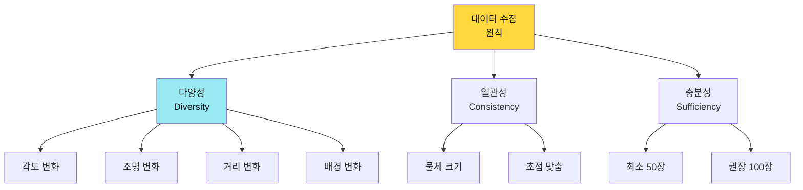

#### 촬영 체크리스트 (클래스당)

| 항목 | 설명 | 수량 |
|------|------|------|
| **정면** | 0도 정면 촬영 | 15장 |
| **좌측** | 45도 좌측 각도 | 10장 |
| **우측** | 45도 우측 각도 | 10장 |
| **근접** | 20cm 가까이 | 5장 |
| **원거리** | 50cm 멀리 | 5장 |
| **밝은 조명** | 강한 빛 | 5장 |
| **어두운 조명** | 약한 빛 | 5장 |
| **다양한 배경** | 흰색/검정/패턴 | 10장 |

**실습 활동**:
- [ ] 빨강 블록: 65장 촬영
- [ ] 초록 블록: 65장 촬영
- [ ] 파랑 블록: 65장 촬영
- [ ] 노랑 블록: 65장 촬영
- [ ] 총 260장 이상

### Step 4: 모델 학습 (30분)

#### 학습 파라미터 설정

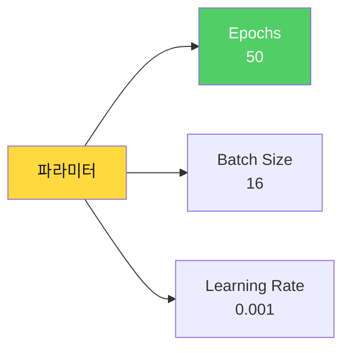

**권장 설정**:
- **Epochs**: 50 (정확도와 속도 균형)
- **Batch Size**: 16 (메모리 효율)
- **Learning Rate**: 0.001 (안정적 학습)

**학습 절차**:
1. [ ] "모델 학습" 버튼 클릭
2. [ ] 진행률 확인 (약 3-5분)
3. [ ] 학습 완료 대기

#### 학습 중 관찰

```
📊 학습 그래프:
- Loss (손실) 감소: 높음 → 낮음 ✅
- Accuracy (정확도) 증가: 낮음 → 높음 ✅

목표:
- Loss < 0.1
- Accuracy > 95%
```

### Step 5: 모델 테스트 (20분)

#### 테스트 시나리오

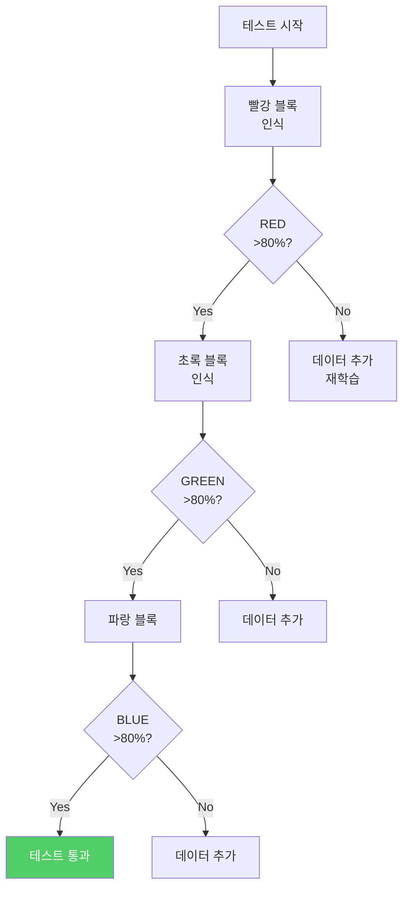

**테스트 체크리스트**:
- [ ] 빨강: RED 신뢰도 >80%
- [ ] 초록: GREEN 신뢰도 >80%
- [ ] 파랑: BLUE 신뢰도 >80%
- [ ] 노랑: YELLOW 신뢰도 >80%
- [ ] 혼동(빨강↔주황) 없음
- [ ] 배경 인식 안됨

### Step 6: 모델 내보내기 (10분)


**내보내기 절차**:
1. [ ] "모델 내보내기" 클릭
2. [ ] "Shareable Link" 선택
3. [ ] "Upload my model" 클릭
4. [ ] URL 복사 (예: `https://teachablemachine.withgoogle.com/models/XXXXX/`)
5. [ ] 메모장에 저장
6. [ ] URL 접속 테스트

---

## 3-4교시: 🎨 앱인벤터 AI 연동 (2시간)

**학습 목표**: TMIC Extension으로 AI 인식 후 play_ 명령 전송

### 앱인벤터 AI 통합 구조

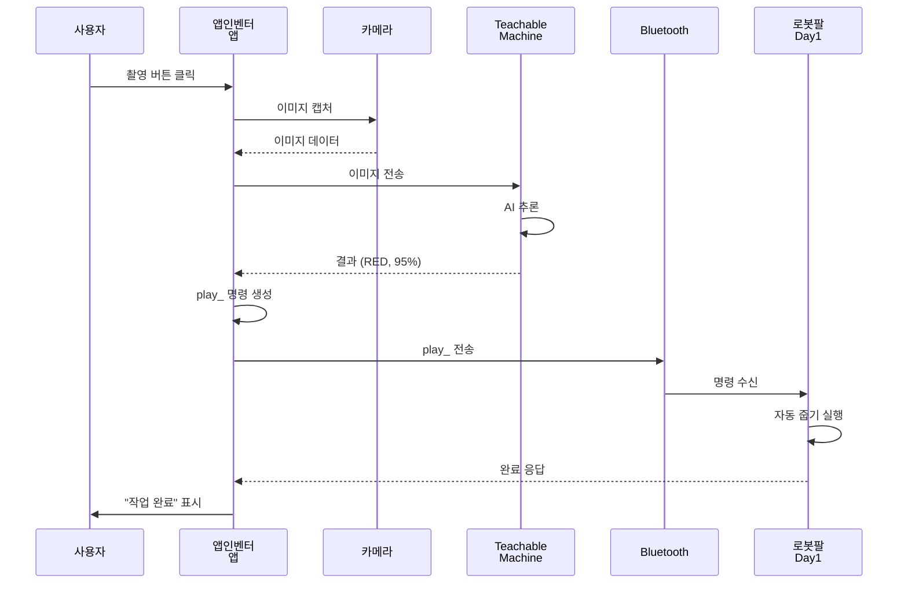

### Step 1: 확장 기능 추가 (20분)

#### TMIC Extension 설치

1. **확장 기능 가져오기**:
   - 앱인벤터 화면 → 확장 기능 (Extension)
   - URL 입력: `https://mit-cml.github.io/extensions/temic/index.json`
   - 또는 `.aix` 파일 업로드

2. **컴포넌트 추가**:
   - `PersonalImageClassifier` 컴포넌트 드래그

### Step 2: UI 디자인 (30분)

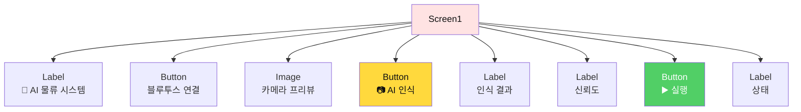

#### 컴포넌트 리스트

| 컴포넌트 | 이름 | 속성 |
|---------|------|------|
| Label | `lblTitle` | Text: "🤖 AI 물류 시스템" <br/> FontSize: 24 |
| Button | `btnConnect` | Text: "블루투스 연결" |
| Image | `imgPreview` | Width: 300px <br/> Height: 300px |
| Button | `btnCapture` | Text: "📷 AI 인식" <br/> FontSize: 20 |
| Label | `lblResult` | Text: "" <br/> FontSize: 20 <br/> BackgroundColor: 노랑 |
| Label | `lblConfidence` | Text: "" <br/> FontSize: 16 |
| Button | `btnExecute` | Text: "▶️ 로봇팔 실행" |
| Label | `lblStatus` | Text: "대기중..." |

**보이지 않는 컴포넌트**:
- `PersonalImageClassifier1` (TMIC)
- `Camera1`
- `BluetoothClient1`
- `TextToSpeech1`

### Step 3: TMIC 설정 (20분)

```
📍 when Screen1.Initialize
  ├─ set PersonalImageClassifier1.Model to "YOUR_TM_URL"
  ├─ set PersonalImageClassifier1.UseGpu to true
  └─ call Camera1.TakePicture()
```

**중요**: `YOUR_TM_URL`을 Step 6에서 복사한 URL로 교체!

### Step 4: 카메라 및 AI 추론 (40분)

#### 블록 코딩: 카메라 캡처

```
📍 when btnCapture.Click
  ├─ set lblResult.Text to "🔄 AI 분석 중..."
  ├─ set lblStatus.Text to "카메라 촬영 중..."
  └─ call Camera1.TakePicture()

📍 when Camera1.AfterPicture (image)
  ├─ set imgPreview.Picture to image
  ├─ set lblStatus.Text to "AI 추론 중..."
  └─ call PersonalImageClassifier1.ClassifyImage(image)
```

#### 블록 코딩: AI 추론 결과 처리

```
📍 when PersonalImageClassifier1.GotClassification (result)
  ├─ // result = JSON 형식
  ├─ set label to get(result, "label")  // "RED", "GREEN", ...
  ├─ set confidence to get(result, "confidence")  // 0.95
  │
  ├─ // 신뢰도 체크
  ├─ if confidence > 0.80
  │   ├─ set lblResult.Text to label
  │   ├─ set lblResult.BackgroundColor to getColorByLabel(label)
  │   ├─ set lblConfidence.Text to join("신뢰도: ", round(confidence × 100), "%")
  │   ├─ set lblStatus.Text to "✅ 인식 성공!"
  │   │
  │   ├─ // TTS 안내
  │   └─ call TextToSpeech1.Speak(join(label, "을 인식했습니다"))
  │
  └─ else
      ├─ set lblResult.Text to "❌ 인식 실패"
      ├─ set lblConfidence.Text to join("신뢰도 낮음: ", round(confidence × 100), "%")
      ├─ set lblStatus.Text to "다시 촬영하세요"
      └─ call TextToSpeech1.Speak("인식에 실패했습니다. 다시 시도하세요")
```

#### 블록 코딩: play_ 명령 생성 및 전송

```
📍 when btnExecute.Click
  ├─ set label to lblResult.Text
  │
  ├─ if label == ""
  │   └─ call TextToSpeech1.Speak("먼저 AI 인식을 해주세요")
  │
  ├─ else if not BluetoothClient1.IsConnected
  │   └─ call TextToSpeech1.Speak("블루투스 연결이 필요합니다")
  │
  └─ else
      ├─ // play_ 명령 생성
      ├─ set command to join("play_", label, "_")
      │
      ├─ // 전송
      ├─ call BluetoothClient1.SendText(command)
      ├─ set lblStatus.Text to join("전송: ", command)
      │
      └─ call TextToSpeech1.Speak(join(label, " 물체를 집습니다"))
```

### Step 5: 자동화 흐름 (10분)

#### 완전 자동 모드

```
📍 when btnAutoMode.Click
  ├─ set autoMode to true
  ├─ call runAutoLoop()

📍 procedure runAutoLoop
  ├─ if autoMode
  │   ├─ call Camera1.TakePicture()
  │   ├─ // 결과 대기 (AfterPicture, GotClassification)
  │   ├─ // confidence > 0.80이면 자동 전송
  │   ├─ wait 5 seconds
  │   └─ call runAutoLoop()  // 재귀 호출
```

**실습 활동**:
- [ ] 빨강 블록 촬영 → `play_RED_` 전송
- [ ] 초록 블록 촬영 → `play_GREEN_` 전송
- [ ] 파랑 블록 촬영 → `play_BLUE_` 전송
- [ ] 신뢰도 <80% → 재촬영 안내

---

## 5교시: 🔗 시스템 통합 테스트 (1시간)

**학습 목표**: Day1 + Day2 + Day3 완전 연동 + LED Matrix 시각화 (선택)

### 완전 자동화 플로우

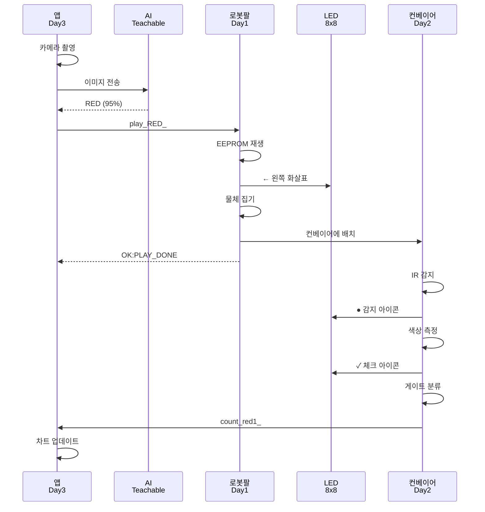

### 통합 테스트 체크리스트 (60분)

#### Phase 1: AI → 로봇팔 (15분)

- [ ] 빨강 촬영 → `play_RED_` → 로봇팔 동작
- [ ] 초록 촬영 → `play_GREEN_` → 로봇팔 동작
- [ ] 파랑 촬영 → `play_BLUE_` → 로봇팔 동작
- [ ] 신뢰도 80% 이상 확인

#### Phase 2: 로봇팔 → 컨베이어 (15분)

- [ ] 로봇팔이 물체를 컨베이어에 정확히 배치
- [ ] IR 센서 감지 확인
- [ ] 컬러 센서 측정 정확도
- [ ] 게이트 분류 성공

#### Phase 3: 컨베이어 → 앱 데이터 (15분)

- [ ] `count_red_` 데이터 수신
- [ ] 앱에서 카운터 업데이트
- [ ] 실시간 통계 반영
- [ ] 연속 5회 성공

#### Phase 4: LED Matrix 시각화 (선택, 15분)

**시간 여유가 있다면 추가**:
- [ ] 8x8 LED Matrix 연결 (D11-13)
- [ ] 화살표 패턴 표시
- [ ] 상태 아이콘 표시

**LED Matrix 간단 코드** (참고용):

```cpp
// MD_MAX72XX 라이브러리 사용
#include <MD_MAX72xx.h>

const uint8_t ARROW_LEFT[] = {
  0x00, 0x10, 0x20, 0x7F, 0x20, 0x10, 0x00, 0x00
};

void showDirection(String dir) {
  if(dir == "LEFT") {
    // 화살표 표시 코드
  }
}
```

> **강사 팁**: LED Matrix는 시간이 부족하면 생략 가능. 핵심은 AI→로봇팔→컨베이어 연동!

---

## 6교시: 💡 프로젝트 기획 및 확장 (1시간)

**학습 목표**: 창의적 사고로 프로젝트 확장 및 비즈니스 모델 설계

### 기획 워크숍 구조

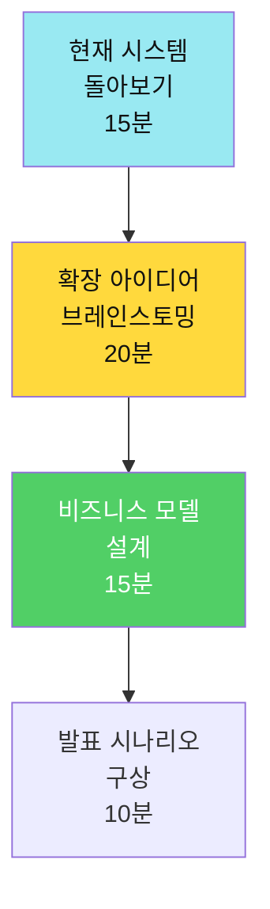

### Step 1: 현재 시스템 돌아보기 (15분)

**팀별 토론 주제**:

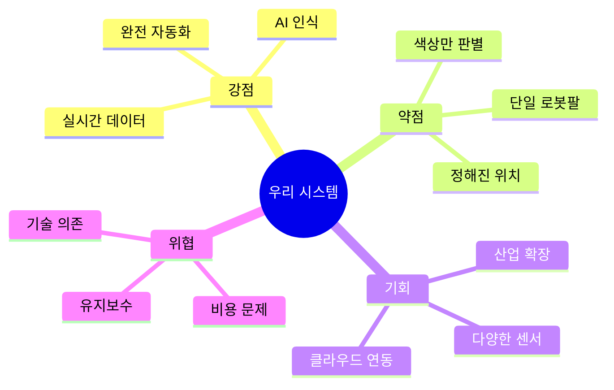

**토론 활동**:
- [ ] 3일간 배운 내용 정리 (5분)
- [ ] 우리 시스템의 강점/약점 찾기 (5분)
- [ ] 개선 가능한 부분 메모 (5분)

### Step 2: 확장 아이디어 브레인스토밍 (20분)

#### 기술적 확장 아이디어

| 영역 | 현재 | 확장 가능 아이디어 |
|------|------|------------------|
| **센서** | 색상 | 무게, 크기, 온도, 바코드 |
| **로봇** | 1개 로봇팔 | 다중 로봇팔, 협업 로봇 |
| **AI** | 색상 인식 | 결함 검사, OCR, 품질 판정 |
| **데이터** | 카운트 | 클라우드 DB, 예측 분석 |
| **통신** | 블루투스 | WiFi, LoRa, 5G |

#### 산업별 적용 시나리오

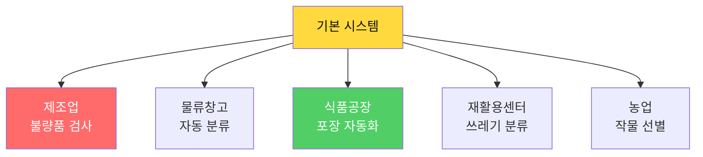

**팀별 과제**:
1. 위 5가지 중 1개 산업 선택
2. 어떤 센서/기술이 추가로 필요한지 토론
3. 예상 효과와 ROI 계산

### Step 3: 비즈니스 모델 설계 (15분)

#### 비즈니스 모델 캔버스 (간소화)

```
┌─────────────────┬─────────────────┬─────────────────┐
│   핵심 파트너    │    핵심 활동     │   가치 제안      │
│                 │                 │                 │
│ ・아두이노      │ ・AI 학습       │ ・자동화로      │
│ ・센서 공급업체  │ ・시스템 통합   │  인건비 절감    │
│ ・클라우드      │ ・유지보수      │ ・실시간 데이터 │
├─────────────────┼─────────────────┼─────────────────┤
│   핵심 자원      │                 │   고객 관계      │
│                 │                 │                 │
│ ・하드웨어      │                 │ ・기술 지원     │
│ ・AI 모델       │                 │ ・교육 제공     │
│ ・데이터        │                 │                 │
├─────────────────┴─────────────────┼─────────────────┤
│        비용 구조                   │   수익원         │
│                                   │                 │
│ ・하드웨어: 50만원               │ ・판매: 200만원 │
│ ・개발: 인건비                   │ ・유지보수: 월 10만│
│ ・유지보수: 월 5만               │                 │
└───────────────────────────────────┴─────────────────┘
```

**팀별 작성**:
- [ ] 가치 제안 3가지 (고객에게 주는 가치)
- [ ] 목표 고객 (누구에게 팔 것인가?)
- [ ] 수익 모델 (어떻게 돈을 벌 것인가?)

### Step 4: 발표 시나리오 구상 (10분)

#### 발표 구조 템플릿

```
1️⃣ 도입 (1분)
   - 문제 정의: "물류 현장의 비효율"
   - Hook: 충격적인 통계 or 질문

2️⃣ 해결책 (2분)
   - 우리의 시스템 소개
   - 핵심 기술 3가지

3️⃣ 시연 (3분)
   - 실시간 데모
   - 핵심 기능 보여주기

4️⃣ 임팩트 (2분)
   - 비용 절감 효과
   - 확장 가능성

5️⃣ Q&A (2분)
   - 예상 질문 3가지 준비
```

**팀별 과제**:
- [ ] 발표 역할 분담 (발표자, 시연자, 보조)
- [ ] 핵심 메시지 3가지 정하기
- [ ] 예상 질문 리스트 작성

---

## 7-8교시: 📊 발표 자료 준비 + 시연 리허설 (2시간)

**학습 목표**: 완성도 높은 발표와 안정적인 시연

### 발표 준비 프로세스

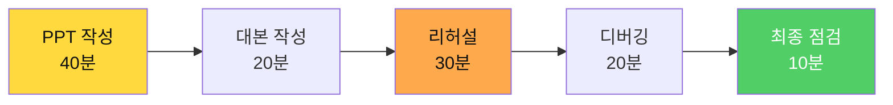

### Step 1: PPT 작성 (40분)

#### 슬라이드 구성 (총 10장)

| 슬라이드 | 제목 | 내용 | 시간 |
|---------|------|------|------|
| 1 | 표지 | 프로젝트명, 팀명 | - |
| 2 | 문제 정의 | 현재 물류 현장의 비효율 | 1분 |
| 3 | 해결책 | 스마트 팩토리 시스템 개요 | 1분 |
| 4 | 시스템 구조 | Day1: 로봇팔 | 1분 |
| 5 | 시스템 구조 | Day2: 컨베이어 | 1분 |
| 6 | 시스템 구조 | Day3: AI 통합 | 1분 |
| 7 | 시연 | 실시간 데모 | 3분 |
| 8 | 효과 분석 | 비용/시간 절감 | 1분 |
| 9 | 확장 가능성 | 비즈니스 모델 | 1분 |
| 10 | Q&A | 감사합니다 | - |

#### PPT 디자인 팁

```
✅ 좋은 슬라이드:
- 글자 크기 28pt 이상
- 한 슬라이드에 3-5개 bullet
- 이미지/다이어그램 활용
- 일관된 컬러 (3가지 이내)

❌ 나쁜 슬라이드:
- 글자가 작고 많음
- 긴 문장, 복잡한 표현
- 애니메이션 남발
- 코드를 그대로 복붙
```

### Step 2: 발표 대본 작성 (20분)

#### 대본 템플릿

```
🎤 도입부 (1분)

"안녕하세요, [팀명]입니다.

여러분은 물류 창고에서 하루에 몇 명이 
수작업으로 물건을 분류하는지 아시나요?

평균 10명의 작업자가 8시간 동안 
약 1,000개의 물건을 분류합니다.

하지만 실수율은 15%나 됩니다.

저희는 이 문제를 AI와 로봇으로 해결했습니다."

---

🎤 시스템 소개 (2분)

"저희 시스템은 3가지 핵심으로 구성됩니다.

첫째, 로봇팔입니다. 
조이스틱으로 동작을 기록하면 자동으로 반복 실행합니다.

둘째, 컨베이어 시스템입니다.
색상 센서로 물체를 인식하고 자동으로 분류합니다.

셋째, AI 비전입니다.
Teachable Machine으로 물체를 인식하고 
자동으로 명령을 내립니다."

---

🎤 시연 (3분)

"지금부터 실시간 시연을 보여드리겠습니다.

[시연 진행]

1. 카메라로 빨간 블록 촬영
2. AI가 인식하고 로봇팔에 명령
3. 로봇팔이 자동으로 물체를 집어서 컨베이어에 배치
4. 컨베이어가 색상을 감지하고 분류
5. 앱에서 실시간 통계 확인"

---

🎤 마무리 (1분)

"이 시스템으로 
- 처리 속도는 3배 증가
- 오류율은 66% 감소
- 인건비는 100% 절감됩니다.

감사합니다."
```

**팀별 과제**:
- [ ] 각자 담당 부분 대본 작성
- [ ] 시연 중 말할 내용 정리
- [ ] 연습용으로 큰 소리로 읽어보기

### Step 3: 시연 리허설 (30분)

#### 리허설 체크리스트

**준비 사항** (10분):
- [ ] 하드웨어 연결 확인
  - 로봇팔 서보모터 (6개)
  - 컨베이어 센서/모터
  - 블루투스 페어링
- [ ] 앱 동작 확인
  - TMIC 모델 URL 설정
  - 블루투스 연결 테스트
  - 차트 표시 확인
- [ ] 블록/물체 준비
  - 빨강, 초록, 파랑 블록 각 3개

**시연 시나리오 실행** (15분):
1. [ ] 블루투스 연결 (10초)
2. [ ] AI 인식 → 로봇팔 (30초)
3. [ ] 컨베이어 분류 (40초)
4. [ ] 차트 업데이트 확인 (10초)
5. [ ] 반복 2-3회 (90초)
6. [ ] 총 3분 이내 완료

**예상 질문 대비** (5분):
- Q: "오인식하면 어떻게 하나요?"
  - A: "신뢰도 80% 미만이면 재촬영 요청합니다"
- Q: "다른 산업에도 적용 가능한가요?"
  - A: "센서만 바꾸면 제조업, 재활용 등에 적용 가능합니다"
- Q: "비용은 얼마나 드나요?"
  - A: "하드웨어 50만원, 개발 인건비 별도입니다"

### Step 4: 디버깅 및 백업 계획 (20분)

#### 흔한 시연 오류와 해결법

| 문제 | 원인 | 해결 방법 |
|------|------|----------|
| **블루투스 연결 안됨** | 페어링 풀림 | 미리 재연결, 백업 디바이스 |
| **로봇팔 오동작** | 전원 부족 | 외부 전원 사용, 재부팅 |
| **AI 인식 실패** | 조명 변화 | 추가 학습 데이터, 조명 고정 |
| **센서 미감지** | 거리 문제 | 물체 위치 재조정 |
| **앱 멈춤** | 메모리 부족 | 앱 재시작, 불필요한 기능 끄기 |

#### 백업 계획

```
Plan A: 완벽한 실시간 시연
  → 모든 하드웨어 정상 동작

Plan B: 부분 시연 + 동영상
  → 로봇팔만 시연, 컨베이어는 동영상

Plan C: 동영상 + PPT
  → 사전 녹화한 동영상 재생

Plan D: PPT만
  → 이론 설명 + 코드 설명
```

**준비물**:
- [ ] 시연 동영상 (1-2개)
- [ ] 백업 하드웨어 (예비 아두이노)
- [ ] 스크린샷 (주요 화면)

### Step 5: 최종 점검 (10분)

**발표 전날 체크리스트**:
- [ ] PPT 최종 수정 완료
- [ ] 발표 대본 암기 (키워드만이라도)
- [ ] 시연 3회 이상 성공
- [ ] 예상 질문 답변 준비
- [ ] 역할 분담 명확히
- [ ] 발표 시간 맞추기 (10분 ±1분)

**발표 당일 체크리스트**:
- [ ] 하드웨어 조립 (30분 전)
- [ ] 연결 테스트 (20분 전)
- [ ] 블록 준비 (10분 전)
- [ ] 발표자료 로드 (5분 전)
- [ ] 심호흡 😊

---

## 💭 자유 시간 활용 팁

**시간이 남는 팀**:
- 📊 **재고 관리 대시보드 추가**: 원형/막대 차트 (아래 참고 코드)
- 💡 **LED Matrix 연동**: 8x8 LED로 상태 표시
- 🎨 **앱 UI 디자인 개선**: 색상, 레이아웃 최적화
- 📹 **홍보 영상 제작**: 1분 소개 영상

### 선택: 재고 관리 차트 추가 (참고용)

```
📍 procedure updateDashboard
  ├─ set total to lblRedCount + lblGreenCount + lblBlueCount
  ├─ if total > 0
  │   ├─ set redPercent to (lblRedCount / total) × 100
  │   ├─ set lblRedPercent.Text to join(round(redPercent), "%")
  │   │
  │   ├─ // Canvas에 막대 차트 그리기
  │   ├─ set Canvas1.PaintColor to 빨강
  │   ├─ call Canvas1.DrawRect(x, y, width, lblRedCount × scale)
  │
  └─ // 초록, 파랑 반복
```

**시간이 부족한 팀**:
- 핵심 기능만 완성
- PPT는 템플릿 활용
- 시연은 1회만 성공시키기

---

## 📊 Day 3 평가 및 성찰

### 학습 성과 체크리스트

**전반부 (1-5교시) - 기술 실습**:
- [ ] Teachable Machine 260장 이상 학습
- [ ] 4개 클래스 정확도 >80%
- [ ] TMIC Extension 설치 및 연동
- [ ] play_ 명령 자동 전송
- [ ] Day1 + Day2 + Day3 완전 연동
- [ ] 연속 5회 이상 성공

**후반부 (6-8교시) - 기획 및 발표**:
- [ ] 프로젝트 확장 아이디어 도출
- [ ] 비즈니스 모델 캔버스 작성
- [ ] 발표 자료 (PPT) 완성
- [ ] 발표 대본 준비
- [ ] 시연 리허설 3회 이상
- [ ] 백업 계획 수립

### 비즈니스 가치

| 지표 | 수동 작업 | 자동화 시스템 | 개선율 |
|------|---------|-------------|--------|
| 처리 속도 | 10개/분 | 30개/분 | **300%** |
| 정확도 | 85% | 95% (AI) | **+10%** |
| 인력 | 2명 | 0명 (무인) | **-100%** |
| 재고 파악 | 수동 집계 | 실시간 | **즉시** |
| 오류율 | 15% | 5% | **-66%** |

---

## 🎯 Day 4 예고

### 최종 발표 및 시연 (4시간)

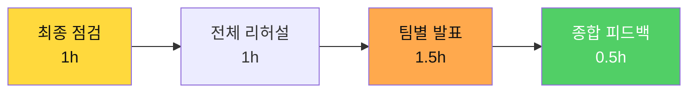

**발표 당일 일정**:
- **1교시**: 하드웨어 최종 점검 및 세팅
- **2교시**: 팀별 마지막 리허설
- **3-4교시**: 팀별 발표 (10분/팀) + Q&A
- **마무리**: 수료식 및 종합 피드백

**발표 평가 기준**:
1. 기술 구현 완성도 (40점)
2. 발표 명확성 (20점)
3. 시연 안정성 (20점)
4. 창의성 및 확장성 (20점)

---

**Day 3 완료!** 🎉

**"AI + 로봇 + 데이터 = 완전 자동화 스마트 팩토리 완성!"** 🚀

---

**Last Updated**: 2026-01-25  
**Version**: 3.1 (실습+기획+발표 구조화)  
**총 학습 시간**: 8시간  
**시간 배분**: 실습 5시간 + 기획 1시간 + 발표 준비 2시간  
**핵심 기술**: Teachable Machine, TMIC, 시스템 통합, 발표 기획
