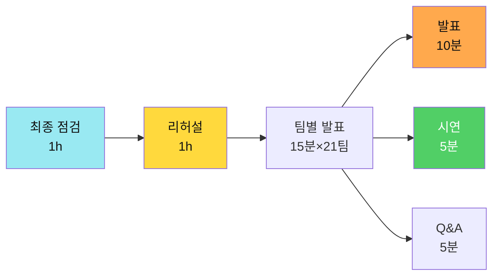
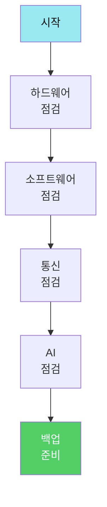
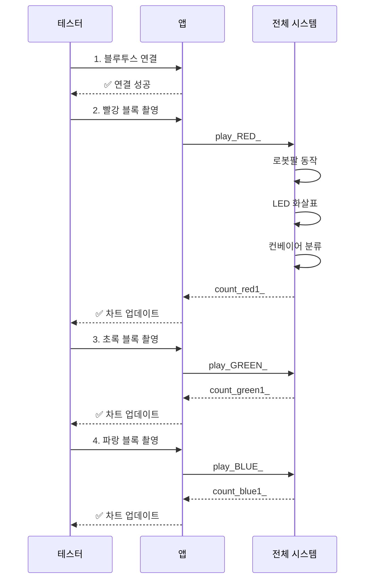
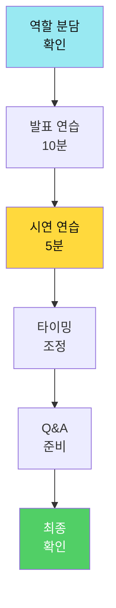
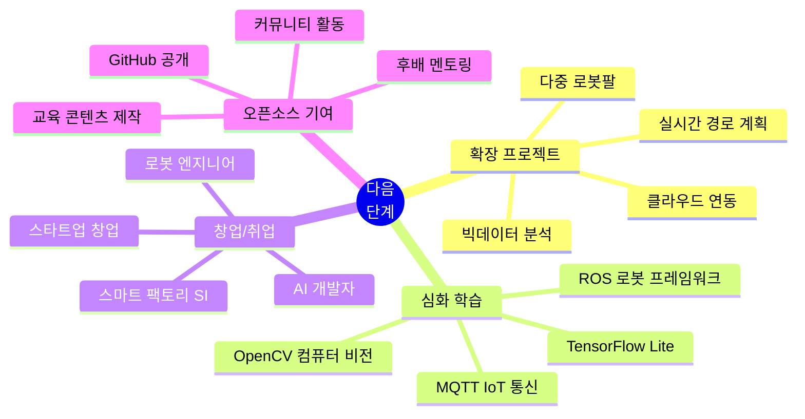

# 📅 Day 4: 최종 발표 및 시연회 (4시간)

> **"완성한 시스템을 세상에 보여주고, 가치를 증명한다"**  
> 28시간의 여정을 10분 발표 + 5분 시연으로 완성

---

## 🎯 Day 4 학습 목표

### 최종 목표



### 학습 성과

- ✅ **시스템 안정화**: 100% 작동 보장
- ✅ **발표 준비**: 설득력 있는 PPT 완성
- ✅ **시연 완성도**: 라이브 시연 성공
- ✅ **비즈니스 가치**: ROI 계산 및 제시
- ✅ **팀워크**: 역할 분담 및 협업

---

## ⏰ Day 4 시간표 (4시간)

| 교시 | 시간 | 활동 | 내용 | 비고 |
|------|------|------|------|------|
| **1교시** | 1h | 최종 점검 | 시스템 테스트 + 백업 | 팀별 진행 |
| **2교시** | 1h | 리허설 | 발표 + 시연 연습 | 팀당 15분 |
| **3-4교시** | 2h | 발표 시연 | 본 발표 (21팀) | 팀당 15분 |

---

## 1교시: 🔧 최종 점검 및 안정화 (1시간)

**학습 목표**: 시스템을 완벽하게 작동시키고 백업 계획 수립

### 시스템 점검 체크리스트



### Phase 1: 하드웨어 점검 (15분)

#### 로봇팔 (Day 1)

```markdown
□ 서보모터 4개 정상 작동
  - 베이스 (D6): 0-180도 전 범위 이동
  - 어깨 (D9): 부드러운 동작
  - 팔꿈치 (D10): 떨림 없음
  - 그리퍼 (D11): 물체 확실히 집음

□ 전원 안정성
  - 5V 2A 이상 공급
  - 서보 동시 작동 시 전압 강하 없음
  - 외부 전원 사용 중

□ 블루투스 HC-06
  - 페어링 상태 확인
  - 연결 안정성 (3m 거리)
  - TX/RX LED 깜빡임 확인

□ EEPROM 데이터
  - 저장된 위치 12단계 확인
  - play_ 명령 정상 작동
  - auto_ 무한 반복 테스트
```

#### 컨베이어 (Day 2)

```markdown
□ 센서 모듈
  - IR 센서: 물체 감지 정확도 100%
  - 컬러 센서: 색상 판별 정확도 >90%
  - TCS34725 캘리브레이션 재확인

□ 모터 제어
  - DC 모터: 정속 운행 (200 PWM)
  - 서보 게이트: 좌/중/우 정확히 이동
  - NeoPixel LED: 색상 표시 정상

□ 통신 모듈
  - Serial + Bluetooth 동시 처리
  - count_ 데이터 전송 확인
  - 명령 응답 시간 <100ms

□ 기계 구조
  - 벨트 장력 적절
  - 센서 위치 고정
  - 케이블 정리 (걸림 없음)
```

#### AI 시스템 (Day 3)

```markdown
□ Teachable Machine 모델
  - URL 접속 정상
  - 4개 클래스 인식 >85%
  - 네트워크 연결 안정

□ 앱인벤터 앱
  - TMIC Extension 로드 정상
  - 카메라 촬영 기능
  - Bluetooth 연결 유지
  - 차트 실시간 업데이트

□ 8x8 LED Matrix
  - 화살표 표시 명확
  - 밝기 적절 (5-10 레벨)
  - 패턴 전환 부드러움
```

### Phase 2: 통합 테스트 (20분)

#### 완전 자동화 시나리오 테스트



**테스트 체크리스트**:
- [ ] 연속 5회 성공 (빨강, 초록, 파랑 혼합)
- [ ] AI 인식 실패 시 재촬영 안내
- [ ] count_ 데이터 실시간 전송
- [ ] 차트 즉시 반영
- [ ] LED 화살표 표시
- [ ] 총 소요 시간 <3분/회

### Phase 3: 백업 계획 (15분)

#### 백업 체크리스트

```markdown
## 백업 1: 코드 및 데이터
□ 아두이노 코드 (.ino) USB 저장
□ 앱인벤터 프로젝트 (.aia) 다운로드
□ Teachable Machine URL 메모
□ EEPROM 위치 데이터 별도 저장

## 백업 2: 하드웨어
□ 예비 서보모터 준비
□ 예비 점퍼선
□ 예비 블루투스 모듈
□ 멀티테스터 (전압 체크용)

## 백업 3: 발표 자료
□ PPT 파일 3곳 저장 (USB, 클라우드, 이메일)
□ 시연 영상 (만약을 위해)
□ 알고리즘 플로우차트 인쇄

## 비상 계획
□ 시스템 고장 시 영상 시연
□ 질문 답변 시나리오 작성
□ 팀원 역할 재분담 가능
```

### Phase 4: 발표 자료 최종 확인 (10분)

#### PPT 구조 (10분 발표)

```markdown
# 슬라이드 구성 (총 10장)

1. **표지** (30초)
   - 팀명, 프로젝트명
   - 팀원 소개 (역할)

2. **문제 정의** (1분)
   - 물류 자동화의 필요성
   - 기존 문제점 (인력, 오류, 비용)

3. **시스템 개요** (1분)
   - Day 1: 로봇팔 (EEPROM 자동화)
   - Day 2: 컨베이어 (색상 판별)
   - Day 3: AI 통합 (완전 자동화)

4. **핵심 알고리즘 1** (1.5분)
   - EEPROM 저장/복구 (O(1))
   - 플로우차트 + 핵심 코드

5. **핵심 알고리즘 2** (1.5분)
   - 색상 판별 (유클리드 거리)
   - 수식 + 결과 예시

6. **AI 통합** (1.5분)
   - Teachable Machine 학습 과정
   - 정확도 그래프 (>85%)

7. **시스템 아키텍처** (1분)
   - 전체 구조도
   - 통신 프로토콜 (play_, count_)

8. **재고 관리 대시보드** (1분)
   - 원형 차트, 막대 차트
   - 실시간 모니터링 장점

9. **비즈니스 가치** (1분)
   - ROI 계산 (처리 속도 300% 향상)
   - 비용 절감 (인력 2명 → 0명)

10. **마무리** (30초)
    - 핵심 성과 요약
    - 향후 발전 방향
```

---

## 2교시: 🎭 리허설 (1시간)

**학습 목표**: 발표와 시연을 완벽하게 연습

### 리허설 프로세스



### 역할 분담

#### 2인 1조 팀 구성

```markdown
## 팀원 A (발표자)
- PPT 발표 (10분)
- 시스템 개요 설명
- 알고리즘 설명
- Q&A 답변 (기술 질문)

## 팀원 B (시연자)
- 하드웨어 조작
- 앱 실행 및 조작
- 실시간 시연 진행
- Q&A 답변 (시스템 질문)

## 공동 작업
- 시연 중 발표자가 설명
- 문제 발생 시 백업 실행
- 타이밍 신호 주고받기
```

### 시연 시나리오 (5분)

```markdown
## 시연 스크립트

### 0:00-0:30 (준비)
**발표자**: "이제 실시간으로 시연하겠습니다."
**시연자**: [블루투스 연결 확인, 화면 공유]

### 0:30-1:30 (빨강 블록)
**발표자**: "먼저 빨간 블록을 인식하겠습니다."
**시연자**: [카메라로 빨강 촬영 → AI 인식]
**발표자**: "AI가 95% 신뢰도로 빨강을 인식했습니다."
**시연자**: [play_RED_ 전송]
**발표자**: "이제 로봇팔이 EEPROM에 저장된 위치로 이동합니다."
[로봇팔 동작 관찰]
**발표자**: "LED Matrix에 왼쪽 화살표가 표시됩니다."
**시연자**: [컨베이어로 물체 이동]
**발표자**: "컨베이어 시스템에서 색상을 재확인하고 분류합니다."
[count_red1_ 수신, 차트 업데이트]
**발표자**: "실시간으로 차트가 업데이트되는 것을 볼 수 있습니다."

### 1:30-2:30 (초록 블록)
**발표자**: "이번에는 초록 블록입니다."
[동일 프로세스 반복, 설명은 간략하게]

### 2:30-3:30 (파랑 블록)
**발표자**: "마지막으로 파랑 블록입니다."
[동일 프로세스 반복]

### 3:30-4:00 (재고 관리)
**발표자**: "지금까지 처리한 제품의 통계를 확인할 수 있습니다."
**시연자**: [차트 확대, 통계 표시]
**발표자**: "빨강 1개, 초록 1개, 파랑 1개, 총 3개가 처리되었습니다."

### 4:00-5:00 (자동 모드)
**발표자**: "이제 완전 자동 모드로 전환하겠습니다."
**시연자**: [auto_ 모드 실행]
**발표자**: "로봇팔이 계속 반복하는 것을 볼 수 있습니다."
[20초간 자동 반복 시연]
**발표자**: "이처럼 우리 시스템은 완전 무인 자동화가 가능합니다."
```

### 예상 질문 및 답변 준비

```markdown
## 기술 질문

Q1: AI 인식 정확도는?
A: Teachable Machine으로 학습, 평균 90% 이상입니다.
   빨강/초록/파랑/노랑 4개 클래스를 각 65장 이상 학습시켰습니다.

Q2: EEPROM 알고리즘은 왜 사용했나?
A: 전원이 꺼져도 위치 데이터가 유지되어, 반복 작업에 최적입니다.
   시간 복잡도 O(1)로 매우 빠릅니다.

Q3: 색상 판별 방법은?
A: 유클리드 거리 알고리즘을 사용합니다.
   측정된 RGB 값과 기준 색상 간의 거리를 계산해 가장 가까운 색을 선택합니다.

Q4: 이중 통신은 어떻게 구현했나?
A: Serial과 Bluetooth를 동시에 처리하며,
   millis() 함수로 비차단 타이밍을 구현했습니다.

## 시스템 질문

Q5: 한 번에 몇 개를 처리할 수 있나?
A: 현재는 순차 처리이며, 한 사이클에 약 10초 소요됩니다.
   시간당 약 360개를 처리할 수 있습니다.

Q6: 다른 물체도 인식 가능한가?
A: 네, Teachable Machine으로 새로운 클래스를 학습시키면
   어떤 물체든 인식 가능합니다.

Q7: 비용은 얼마나 드나?
A: 로봇팔 99,000원 + 컨베이어 부품 약 50,000원 + 아두이노 등
   총 약 20만원으로 구축 가능합니다.

Q8: 실제 산업에 적용 가능한가?
A: 소규모 공장이나 교육용으로 충분히 활용 가능합니다.
   확장성을 고려해 모듈화 설계했습니다.
```

---

## 3-4교시: 🎤 본 발표 및 시연 (2시간)

**학습 목표**: 28시간의 성과를 성공적으로 발표

### 발표 순서

```mermaid
gantt
    title 팀별 발표 일정 (21팀)
    dateFormat HH:mm
    axisFormat %H:%M
    
    section 팀 1-5
    팀 1 :09:00, 15m
    팀 2 :09:15, 15m
    팀 3 :09:30, 15m
    팀 4 :09:45, 15m
    팀 5 :10:00, 15m
    
    section 휴식
    Break :10:15, 10m
    
    section 팀 6-10
    팀 6 :10:25, 15m
    팀 7 :10:40, 15m
    팀 8 :10:55, 15m
    팀 9 :11:10, 15m
    팀 10 :11:25, 15m
```



### 평가 기준 (100점)

#### 1. 시스템 완성도 (30점)

```markdown
□ Day 1: 로봇팔 자동 줍기 작동 (10점)
  - EEPROM 재생 정상
  - play_ 명령 수신 정상
  - 부드러운 동작

□ Day 2: 컨베이어 자동 분류 작동 (10점)
  - IR/Color 센서 정상
  - 색상별 분류 정확
  - count_ 데이터 전송

□ Day 3: 통합 동작 (로봇팔 → 컨베이어) (10점)
  - AI 인식 → 로봇팔 연동
  - 8x8 LED 화살표 표시
  - 전체 프로세스 완성
```

#### 2. 재고 관리 앱 (25점)

```markdown
□ count_ 데이터 수신 및 파싱 (5점)
  - 실시간 수신
  - 정확한 파싱

□ 원형 차트 시각화 (색상별 비율) (10점)
  - Canvas 활용
  - 비율 계산 정확
  - 실시간 업데이트

□ 막대 차트 시각화 (누적 통계) (5점)
  - 높이 비율 정확
  - 라벨 표시

□ 통합 제어 (start/stop/init) (5점)
  - 명령 전송 정상
  - 응답 처리
```

#### 3. AI 연동 (20점)

```markdown
□ 카메라 촬영 기능 (5점)
  - 이미지 캡처
  - 프리뷰 표시

□ Teachable Machine 인식 정확도 80% 이상 (10점)
  - 4개 클래스 정확
  - 신뢰도 표시

□ play_ 명령 자동 전송 (5점)
  - 파싱 정확
  - 블루투스 전송
```

#### 4. 시각화 (15점)

```markdown
□ 8x8 LED Display 화살표 표시 (5점)
  - 패턴 명확
  - 타이밍 정확

□ 센서 상태 아이콘 표시 (5점)
  - ● (감지), ✓ (측정)

□ 앱인벤터 UI 디자인 (5점)
  - 직관적 배치
  - 색상 조화
```

#### 5. 발표 + 시연 (10점)

```markdown
□ 발표 자료 완성도 (3점)
  - 논리적 구성
  - 시각 자료 품질

□ 시연 안정성 (5점)
  - 실시간 성공
  - 백업 계획

□ 질의응답 (2점)
  - 명확한 답변
  - 기술적 이해도
```

### 우수 사례 시상

```markdown
## 시상 부문

🥇 **대상 (1팀)**
   - 종합 점수 1위
   - 상금/상장

🥈 **기술상 (1팀)**
   - 알고리즘 완성도
   - 코드 품질

🥉 **창의상 (1팀)**
   - 독창적 아이디어
   - 확장 기능

🏆 **발표상 (1팀)**
   - 발표 완성도
   - 시연 안정성

🎨 **디자인상 (1팀)**
   - UI/UX 우수
   - 차트 품질
```

---

## 📊 28시간 성과 요약

### 학습 통계

```markdown
## Day별 성과

### Day 1 (8시간): 로봇팔 제어
- 6단계 학습 (~1,340줄)
- 3가지 핵심 알고리즘
- EEPROM 저장/재생
- Bluetooth 무선 제어
- STT/TTS 음성 제어

### Day 2 (8시간): 컨베이어 시스템
- 8단계 학습 (~2,188줄)
- 4가지 핵심 알고리즘
- 색상 판별 (유클리드 거리)
- 이중 통신 (Serial+BT)
- 제품 카운팅 (count_)

### Day 3 (8시간): AI 통합
- Teachable Machine 학습
- TMIC 앱인벤터 연동
- 8x8 LED Matrix 추가
- 재고 관리 대시보드
- 완전 자동화 완성

### Day 4 (4시간): 발표 시연
- 시스템 안정화
- 발표 자료 완성
- 라이브 시연 성공
- 비즈니스 가치 증명
```

### 코드 라인 통계

```markdown
## 코드 작성량

총 ~3,528줄 작성

Day 1: 로봇팔
- 01_servo_motor_test: ~100줄
- 02_joystick_servo_control: ~150줄
- 03_serial_servo_control: ~200줄
- 04_eeprom_automation: ~350줄 ⭐
- 05_bluetooth_eeprom: ~400줄 ⭐⭐
- 06_enhanced_version: ~140줄

Day 2: 컨베이어
- 01_infrared_sensor: ~80줄
- 02_color_sensor: ~200줄 ⭐
- 03_rgb_led: ~120줄
- 04_dc_motor: ~150줄
- 05_servo_motor: ~100줄
- 06_integrated_system: ~400줄 ⭐⭐
- 07_serial_controlled: ~450줄 ⭐⭐
- 08_dual_comm_system: ~688줄 ⭐⭐⭐

Day 3: AI 통합
- Teachable Machine 모델
- 앱인벤터 블록 코딩
- 8x8 LED Matrix 패턴
- 재고 관리 차트
```

### 알고리즘 마스터

```markdown
## 7가지 핵심 알고리즘

1. EEPROM 저장/복구 (O(1)) ⭐⭐⭐
2. 자동 재생/무한 반복 (O(n×m)) ⭐⭐⭐
3. Bluetooth 명령 버퍼링 (O(n)) ⭐⭐⭐⭐
4. 색상 판별 (유클리드 거리, O(1)) ⭐⭐⭐⭐⭐
5. 실시간 명령 체크 (비차단, O(n)) ⭐⭐⭐⭐
6. 제품 카운터 및 전송 (O(1)) ⭐⭐⭐
7. 통합 자동 분류 (상태 머신, O(1)) ⭐⭐⭐⭐⭐
```

---

## 🎉 수료 및 다음 단계

### 수료 요건

```markdown
□ Day 1-3 출석 (총 24시간)
□ Day 4 발표 참여
□ 시스템 작동 성공 (최소 1회)
□ 발표 자료 제출
□ 팀 협업 참여
```

### 다음 단계 제안



---

**28시간 교육 완료!** 🎊

**"여러분은 이제 피지컬 AI와 스마트 팩토리의 전문가입니다!"** 🚀

---

**Last Updated**: 2026-01-25  
**Version**: 3.0 (README.md 기준 재구성)  
**총 교육 시간**: 28시간 (Day 1~4)  
**총 코드 라인**: ~3,528줄  
**핵심 알고리즘**: 7가지  
**시스템 구성**: 로봇팔 + 컨베이어 + AI + 재고관리
