```mermaid
stateDiagram-v2
    [*] --> IDLE: 전원 ON
    
    IDLE --> HOMING: HOME 명령
    HOMING --> IDLE: 완료
    
    IDLE --> MOVING: 이동 명령
    MOVING --> IDLE: 완료
    MOVING --> ERROR: 범위 초과
    
    IDLE --> PICKING: PICK 명령
    PICKING --> GRIPPING: 접근 완료
    GRIPPING --> LIFTING: 집기 완료
    LIFTING --> IDLE: 완료
    PICKING --> ERROR: 3회 실패
    
    IDLE --> PLACING: PLACE 명령
    PLACING --> RELEASING: 위치 도달
    RELEASING --> IDLE: 놓기 완료
    
    ERROR --> IDLE: 복구
    ERROR --> SAFE_MODE: 심각한 오류
    SAFE_MODE --> [*]: 재시작 필요
    
    note right of IDLE
        LED: 초록불
        모든 축 대기
    end note
    
    note right of ERROR
        LED: 빨강불
        부저: 경고음
    end note
```

# 🏗️ 스마트 팩토리 시스템 아키텍처 완전 가이드

> **"구조를 이해하면 시스템이 보인다"**

---

## 📌 문서 개요

### 목적
이 문서는 **알고리즘과 구조 중심**으로 스마트 팩토리 시스템의 전체 아키텍처를 설명합니다.

### 대상 독자
- 시스템 설계를 이해하고 싶은 학습자
- 개발 프로세스를 배우고 싶은 메이커
- 확장 및 개선을 계획하는 개발자

### 문서 구성


---

## 🌐 시스템 전체 구조

### 계층 아키텍처 (Layered Architecture)


### 시스템 블록 다이어그램


---

## 🤖 모듈 1: 로봇팔 시스템

### 로봇팔 아키텍처

#### 하드웨어 구조


#### 좌표 시스템


### 핵심 알고리즘: 동기화 이동

#### 알고리즘 흐름

```mermaid
graph TD
    START[입력:<br/>targetAngles[4]] --> VALIDATE[각도 범위<br/>검증]
    
    VALIDATE --> CALC_DIST[각 축별<br/>거리 계산]
    CALC_DIST -.공식.-> FORMULA1["d[i] = |target[i] - current[i]|"]
    
    CALC_DIST --> FIND_MAX[최대 거리<br/>찾기]
    FIND_MAX -.공식.-> FORMULA2["maxDist = max(d[0], d[1], d[2], d[3])"]
    
    FIND_MAX --> CALC_STEPS[스텝 수<br/>결정]
    CALC_STEPS -.공식.-> FORMULA3["steps = maxDist / stepSize"]
    
    CALC_STEPS --> LOOP_START[FOR step = 1 TO steps]
    
    LOOP_START --> CALC_RATIO[진행 비율<br/>계산]
    CALC_RATIO -.공식.-> FORMULA4["ratio = step / steps"]
    
    CALC_RATIO --> INTERPOLATE[선형 보간<br/>계산]
    INTERPOLATE -.공식.-> FORMULA5["angle[i] = current[i] +<br/>(target[i] - current[i]) × ratio"]
    
    INTERPOLATE --> MOVE_ALL[4축 동시<br/>이동]
    MOVE_ALL --> DELAY[delay<br/>stepDelay ms]
    
    DELAY --> CHECK_LOOP{step < steps?}
    CHECK_LOOP -->|Yes| LOOP_START
    CHECK_LOOP -->|No| FINAL_POS[최종 위치<br/>보정]
    
    FINAL_POS --> UPDATE[currentAngles<br/>업데이트]
    UPDATE --> DONE[완료]
    
    style START fill:#99E9F2,color:#111
    style INTERPOLATE fill:#FFD93D,color:#111
    style DONE fill:#51CF66,color:#fff
```

#### 타이밍 다이어그램


### 상태 머신



---

## 🚛 모듈 2: 컨베이어 시스템

### 컨베이어 아키텍처

#### 하드웨어 구성


### 핵심 알고리즘: 색상 판단

#### TCS3200 센서 측정 알고리즘


#### 유클리드 거리 계산


### 상태 머신


---

## 🤖 모듈 3: AI 인식 시스템

### AI 시스템 아키텍처

#### 전체 파이프라인


### 학습 알고리즘

#### 데이터 수집 전략


#### 학습 프로세스


### 추론 알고리즘


---

## 📱 모듈 4: 앱인벤터 앱

### 앱 아키텍처

#### MVC 패턴


#### 화면 구성


### 핵심 알고리즘: 이벤트 처리

#### AI 인식 플로우


#### 블록 코딩 구조

```mermaid
graph TD
    INIT[Screen.Initialize] --> SETUP[초기 설정]
    
    SETUP --> LOAD_MODEL[TMIC.ModelURL<br/>설정]
    SETUP --> CONNECT_BT[Bluetooth<br/>연결 시도]
    SETUP --> START_TIMER[Clock.Timer<br/>시작]
    
    CLICK[Button_Capture.Click] --> TAKE[Camera.TakePicture]
    
    AFTER[Camera.AfterPicture] --> SHOW_IMG[Image.Picture<br/>← image]
    SHOW_IMG --> CLASSIFY[TMIC.ClassifyImage]
    
    GOT[TMIC.GotClassification] --> CHECK_CONF{confidence<br/> > 0.8?}
    CHECK_CONF -->|Yes| SHOW_RESULT[Label 업데이트]
    CHECK_CONF -->|No| RETRY[재촬영 요청]
    
    SHOW_RESULT --> GET_ZONE[Spinner 값 읽기]
    GET_ZONE --> BUILD_CMD[명령 문자열<br/>생성]
    BUILD_CMD -.예시.-> CMD_EX["AI_RED_1"]
    
    BUILD_CMD --> SEND[Bluetooth.SendText]
    
    TIMER[Clock.Timer] --> REQUEST[상태 요청<br/>"?"]
    REQUEST --> RECEIVE[Bluetooth.ReceiveText]
    RECEIVE --> PARSE[데이터 파싱]
    PARSE --> UPDATE_UI[UI 업데이트]
    
    style INIT fill:#99E9F2,color:#111
    style CLASSIFY fill:#FFD93D,color:#111
    style SEND fill:#51CF66,color:#fff
```

---

## 🔗 통신 프로토콜

### 블루투스 프로토콜 명세

#### 명령 프로토콜

```mermaid
graph TD
    subgraph 앱_to_아두이노[앱 → 아두이노]
        CMD1[AI_color_zone<br/>예: AI_RED_1]
        CMD2[MANUAL_a,b,c,d<br/>예: MANUAL_90,90,90,0]
        CMD3[SENSOR_AUTO<br/>센서 자동 모드]
        CMD4[?<br/>상태 조회]
        CMD5[RESET<br/>초기화]
    end
    
    subgraph 아두이노_to_앱[아두이노 → 앱]
        RESP1[OK:action<br/>예: OK:PICK]
        RESP2[ERR:message<br/>예: ERR:FAIL]
        RESP3[STATUS:state<br/>예: STATUS:IDLE]
        RESP4[JSON<br/>통계 데이터]
    end
    
    CMD1 & CMD2 & CMD3 & CMD4 & CMD5 --> PARSE[파싱]
    PARSE --> EXECUTE[실행]
    EXECUTE --> RESP1 & RESP2 & RESP3 & RESP4
    
    style 앱_to_아두이노 fill:#E3F2FD,color:#111
    style 아두이노_to_앱 fill:#C8E6C9,color:#111
```

#### 프로토콜 상세 명세

| 방향 | 명령 | 형식 | 예시 | 설명 |
|------|------|------|------|------|
| 앱→아두이노 | AI 피킹 | `AI_<COLOR>_<ZONE>` | `AI_RED_1` | AI 인식 결과로 피킹 |
| 앱→아두이노 | 수동 제어 | `MANUAL_<a>,<b>,<c>,<d>` | `MANUAL_90,90,90,0` | 각도 직접 제어 |
| 앱→아두이노 | 센서 자동 | `SENSOR_AUTO` | `SENSOR_AUTO` | 센서 기반 자동 분류 |
| 앱→아두이노 | 상태 조회 | `?` | `?` | 현재 상태 요청 |
| 앱→아두이노 | 홈 포지션 | `H` | `H` | 홈으로 복귀 |
| 아두이노→앱 | 성공 응답 | `OK:<ACTION>` | `OK:PICK` | 명령 실행 성공 |
| 아두이노→앱 | 오류 응답 | `ERR:<MESSAGE>` | `ERR:FAIL` | 명령 실행 실패 |
| 아두이노→앱 | 상태 응답 | `STATUS:<STATE>` | `STATUS:IDLE` | 현재 상태 |
| 아두이노→앱 | 통계 JSON | `{"red":5,"blue":3}` | JSON 문자열 | 실시간 통계 |

### 데이터 흐름

```mermaid
sequenceDiagram
    participant App as 앱
    participant BT as 블루투스
    participant Parse as 파서
    participant State as 상태머신
    participant Robot as 로봇팔
    participant Sensor as 센서
    
    Note over App,Sensor: 초기 연결
    App->>BT: 페어링 요청
    BT-->>App: 연결 성공
    
    Note over App,Sensor: AI 명령 전송
    App->>BT: "AI_RED_1\n"
    BT->>Parse: 시리얼 수신
    Parse->>State: parseCommand()
    State->>Robot: pickFromZone(1, "RED")
    Robot-->>State: 완료
    State->>BT: "OK:PICK\n"
    BT-->>App: 응답 수신
    
    Note over App,Sensor: 주기적 상태 업데이트
    loop 1초마다
        State->>BT: JSON 통계
        BT->>App: 수신
        App->>App: UI 업데이트
    end
    
    Note over App,Sensor: 센서 이벤트
    Sensor->>State: IR 감지
    State->>Sensor: 색상 측정
    Sensor-->>State: RGB 값
    State->>State: 색상 판단
    State->>BT: JSON 업데이트
    BT->>App: 수신
```

---

## ⚙️ 핵심 알고리즘 모음

### 1. 제어 알고리즘

#### PID 제어 (선택적)

```mermaid
graph TD
    TARGET[목표값<br/>Target] --> ERROR[오차 계산<br/>e = target - current]
    CURRENT[현재값<br/>Current] --> ERROR
    
    ERROR --> P[비례 P<br/>Kp × e]
    ERROR --> I[적분 I<br/>Ki × Σe]
    ERROR --> D[미분 D<br/>Kd × Δe]
    
    P & I & D --> SUM[합산]
    SUM --> OUTPUT[제어 출력]
    
    OUTPUT --> ACTUATOR[액츄에이터]
    ACTUATOR --> FEEDBACK[피드백]
    FEEDBACK --> CURRENT
    
    style TARGET fill:#99E9F2,color:#111
    style SUM fill:#FFD93D,color:#111
    style OUTPUT fill:#51CF66,color:#fff
```

### 2. 필터 알고리즘

#### 이동 평균 필터

```mermaid
graph TD
    NEW[새 샘플<br/>입력] --> BUFFER[순환 버퍼]
    BUFFER -.크기.-> SIZE[windowSize = 5]
    
    BUFFER --> ADD[버퍼에 추가]
    ADD --> FULL{버퍼<br/>가득?}
    FULL -->|No| WAIT[대기]
    FULL -->|Yes| SUM[합계 계산]
    
    SUM --> AVG[평균 계산]
    AVG -.공식.-> FORMULA["avg = Σsamples / windowSize"]
    
    AVG --> OUTPUT[필터링된<br/>값 출력]
    
    style NEW fill:#99E9F2,color:#111
    style AVG fill:#FFD93D,color:#111
    style OUTPUT fill:#51CF66,color:#fff
```

#### 칼만 필터 (고급)

```mermaid
graph TD
    PREDICT[예측 단계<br/>Prediction] --> P1[상태 예측<br/>x̂ = Ax + Bu]
    P1 --> P2[오차 예측<br/>P = APA' + Q]
    
    UPDATE[업데이트 단계<br/>Update] --> U1[칼만 이득<br/>K = PH'/(HPH'+R)]
    U1 --> U2[상태 업데이트<br/>x̂ = x̂ + K(z-Hx̂)]
    U2 --> U3[오차 업데이트<br/>P = (I-KH)P]
    
    P2 --> UPDATE
    U3 --> PREDICT
    
    style PREDICT fill:#FFD93D,color:#111
    style UPDATE fill:#FFA94D,color:#111
```

### 3. 의사결정 알고리즘

#### 규칙 기반 시스템

```mermaid
graph TD
    INPUT[입력<br/>센서 데이터] --> RULE1{규칙 1:<br/>IR 감지?}
    
    RULE1 -->|Yes| RULE2{규칙 2:<br/>색상 판단}
    RULE1 -->|No| IDLE[대기]
    
    RULE2 -->|빨강| ACTION1[게이트 0도]
    RULE2 -->|파랑| ACTION2[게이트 90도]
    RULE2 -->|노랑| ACTION3[게이트 180도]
    RULE2 -->|기타| ERROR[오류 처리]
    
    ACTION1 & ACTION2 & ACTION3 --> OUTPUT[실행]
    
    style INPUT fill:#99E9F2,color:#111
    style RULE1 fill:#FFD93D,color:#111
    style OUTPUT fill:#51CF66,color:#fff
```

---

## 🔄 시스템 통합 전략

### 모듈 통합 순서

```mermaid
graph TD
    START[개별 모듈<br/>개발 완료] --> INT1[통합 1단계]
    
    INT1 --> STEP1[로봇팔 + 앱<br/>블루투스 연결]
    STEP1 --> TEST1[기본 제어<br/>테스트]
    TEST1 --> VERIFY1{성공?}
    VERIFY1 -->|No| DEBUG1[디버깅]
    DEBUG1 --> STEP1
    VERIFY1 -->|Yes| INT2
    
    INT2[통합 2단계] --> STEP2[컨베이어 + 센서<br/>추가]
    STEP2 --> TEST2[센서 연동<br/>테스트]
    TEST2 --> VERIFY2{성공?}
    VERIFY2 -->|No| DEBUG2[디버깅]
    DEBUG2 --> STEP2
    VERIFY2 -->|Yes| INT3
    
    INT3[통합 3단계] --> STEP3[AI 모델<br/>연동]
    STEP3 --> TEST3[AI 추론<br/>테스트]
    TEST3 --> VERIFY3{성공?}
    VERIFY3 -->|No| DEBUG3[디버깅]
    DEBUG3 --> STEP3
    VERIFY3 -->|Yes| INT4
    
    INT4[통합 4단계] --> STEP4[전체 시스템<br/>통합]
    STEP4 --> TEST4[End-to-End<br/>테스트]
    TEST4 --> VERIFY4{성공?}
    VERIFY4 -->|No| DEBUG4[최적화]
    DEBUG4 --> STEP4
    VERIFY4 -->|Yes| DONE[통합 완료]
    
    style START fill:#99E9F2,color:#111
    style INT1 fill:#FFD93D,color:#111
    style INT2 fill:#FFD93D,color:#111
    style INT3 fill:#FFD93D,color:#111
    style INT4 fill:#FFD93D,color:#111
    style DONE fill:#51CF66,color:#fff
```

### 인터페이스 설계 원칙

```mermaid
graph TD
    PRINCIPLE[인터페이스<br/>설계 원칙] --> P1[명확성<br/>Clear]
    PRINCIPLE --> P2[일관성<br/>Consistent]
    PRINCIPLE --> P3[최소성<br/>Minimal]
    PRINCIPLE --> P4[견고성<br/>Robust]
    
    P1 --> E1[명확한 입출력<br/>정의]
    P2 --> E2[프로토콜<br/>표준화]
    P3 --> E3[최소 의존성<br/>유지]
    P4 --> E4[오류 처리<br/>필수]
    
    style PRINCIPLE fill:#FFD93D,color:#111
```

---

## 📈 성능 최적화

### 병목 지점 분석

```mermaid
graph TD
    PROFILE[프로파일링] --> MEASURE[시간 측정]
    
    MEASURE --> T1[로봇팔 이동<br/>5초]
    MEASURE --> T2[AI 추론<br/>3초]
    MEASURE --> T3[센서 측정<br/>1초]
    MEASURE --> T4[통신<br/>0.5초]
    
    T1 & T2 & T3 & T4 --> ANALYZE[분석]
    ANALYZE --> BOTTLENECK[병목: AI 추론<br/>3초]
    
    BOTTLENECK --> OPTIMIZE[최적화 전략]
    OPTIMIZE --> O1[이미지 크기<br/>감소]
    OPTIMIZE --> O2[모델 경량화<br/>선택]
    OPTIMIZE --> O3[비동기 처리]
    
    O1 & O2 & O3 --> RETEST[재측정]
    RETEST --> IMPROVED[개선: 1.5초<br/>50% 향상]
    
    style BOTTLENECK fill:#FF6B6B,color:#fff
    style IMPROVED fill:#51CF66,color:#fff
```

---

## 🎓 확장 가능성

### 시스템 확장 로드맵

```mermaid
graph TD
    CURRENT[현재 시스템<br/>3일 완성] --> EXPAND[확장 방향]
    
    EXPAND --> EXP1[하드웨어<br/>확장]
    EXPAND --> EXP2[소프트웨어<br/>확장]
    EXPAND --> EXP3[AI<br/>확장]
    
    EXP1 --> H1[6축 로봇팔]
    EXP1 --> H2[비전 카메라]
    EXP1 --> H3[다중 센서]
    
    EXP2 --> S1[클라우드 연동]
    EXP2 --> S2[웹 대시보드]
    EXP2 --> S3[데이터베이스]
    
    EXP3 --> A1[객체 검출]
    EXP3 --> A2[강화학습]
    EXP3 --> A3[예측 유지보수]
    
    style CURRENT fill:#FFD93D,color:#111
    style EXP1 fill:#99E9F2,color:#111
    style EXP2 fill:#FFA94D,color:#111
    style EXP3 fill:#C8E6C9,color:#111
```

---

**시스템 아키텍처 가이드 완료!** 🎉

이제 구조를 이해했으니, 원리를 파악하고, 창의적으로 확장할 수 있습니다!

---

**Last Updated**: 2026-01-25  
**Version**: 1.0 (알고리즘 중심 아키텍처)  
**제작**: Smart Factory Education Team
