# 📐 스마트 팩토리 시스템 아키텍처 - 레이어별 가이드

> **"각 단계에서 무엇을 만들고, 어떤 레이어를 개발하는가?"**  
> Day 1~3 전 과정의 시스템 아키텍처를 레이어별로 상세 분석

## 🎯 Quick Summary

| Day | 핵심 목표 | 주요 레이어 | 핵심 알고리즘 | 시간 |
|-----|---------|----------|------------|------|
| **Day 1** | 로봇팔 음성 제어 | L3-L4-L5 | EEPROM, BT 버퍼링, STT | 8h |
| **Day 2** | 컨베이어 자동 분류 | L4-L5 | 색상 판별, 상태 머신, millis | 8h |
| **Day 3** | AI 완전 자동화 | L1-L2 + Cloud | TM 학습, TMIC, 통합 | 8h |

**총 개발 단계**: 20개 (Day1: 7단계 + Day2: 8단계 + Day3: 5활동)  
**총 코드 라인**: ~3,500줄 (Day1: 1,340 + Day2: 2,188)  
**핵심 알고리즘**: 12개 (EEPROM 3개, 통신 3개, 센서 3개, AI 3개)

---

## 📖 문서 사용 가이드

### 이 문서의 구성

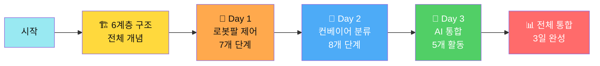

### 각 Day별 구조

**각 Day마다 다음 내용을 제공합니다:**

1. **🎯 전체 시스템 아키텍처**: 해당 Day의 6계층 구조를 한눈에
2. **📋 단계별 레이어 매트릭스**: 각 단계에서 어떤 레이어를 개발하는지
3. **📝 단계별 상세 설명**: 레이어 다이어그램 + 개발 항목 테이블 + 핵심 학습
4. **⏰ 학습 시간**: 각 단계별 예상 소요 시간

**이렇게 활용하세요:**
- 강사: 수업 전 해당 Day 구조도 확인 → 단계별 상세 설명 준비
- 학생: Day 시작 시 전체 구조 파악 → 각 단계 학습 중 레이어 위치 확인
- 개발자: 레이어별 기술 스택 확인 → 필요한 라이브러리/알고리즘 학습

---

## 🎯 Day별 한눈에 보기

### Day 1: 로봇팔 제어 (8시간)

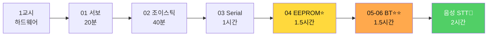

**핵심 레이어**: Layer 3-4-5 (통신 + 알고리즘 + 제어)  
**핵심 기술**: EEPROM 저장/재생, Bluetooth 버퍼링, STT/TTS

### Day 2: 컨베이어 자동 분류 (8시간)


**핵심 레이어**: Layer 4-5 (알고리즘 + 센서 제어)  
**핵심 기술**: 유클리드 거리 색상 판별, 상태 머신, millis 비차단, count_ 프로토콜

### Day 3: AI 통합 (8시간)

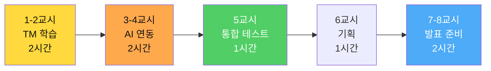

**핵심 레이어**: Layer 1-2 + Cloud (UI + AI + 통합)  
**핵심 기술**: Teachable Machine, TMIC Extension, 시스템 통합, 발표

---

## 🏗️ 전체 시스템 레이어 구조

### 6계층 아키텍처

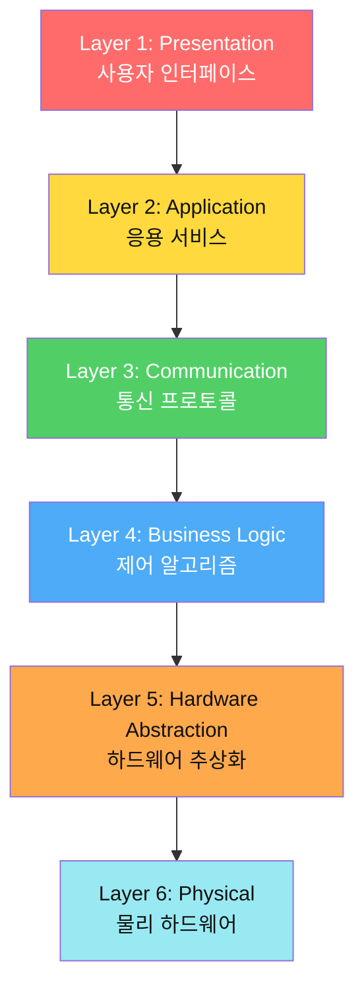

### 레이어별 역할 정의

| 레이어 | 이름 | 역할 | 구현 기술 | Day |
|-------|------|------|----------|-----|
| **L1** | Presentation | 사용자 인터페이스, 시각화 | 앱인벤터 UI, 버튼, 차트 | 1-3 |
| **L2** | Application | 고급 기능 (STT, TTS, AI) | SpeechRecognizer, TTS, TMIC | 1, 3 |
| **L3** | Communication | 데이터 송수신, 프로토콜 | Bluetooth, Serial, WiFi | 1-3 |
| **L4** | Business Logic | 제어 로직, 알고리즘, 상태 머신 | 아두이노 C++ 메인 로직 | 1-3 |
| **L5** | Hardware Abstraction | 센서/액추에이터 제어 함수 | Servo, analogWrite, I2C | 1-2 |
| **L6** | Physical | 실제 하드웨어 | 서보, 센서, 모터, LED | 1-2 |

---

## 📅 Day 1: 로봇팔 제어 - 레이어별 개발

### 🎯 Day 1 전체 시스템 아키텍처

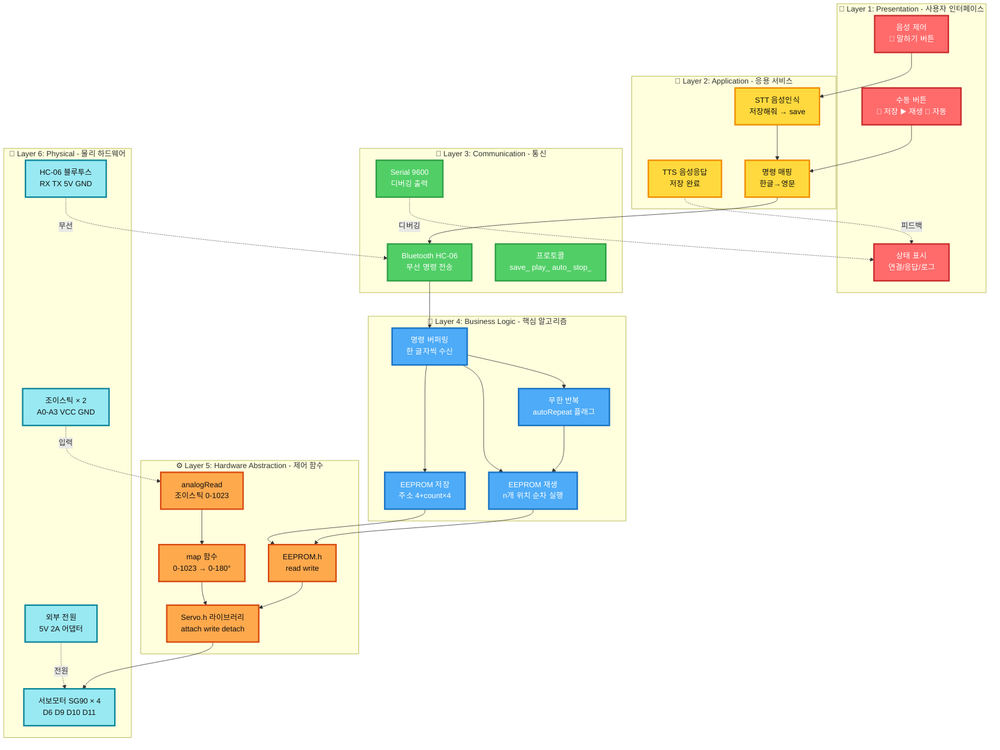

### 📋 Day 1 단계별 레이어 매트릭스

| 단계 | 이름 | Layer 1 | Layer 2 | Layer 3 | Layer 4 | Layer 5 | Layer 6 | 학습 시간 |
|------|------|---------|---------|---------|---------|---------|---------|----------|
| **01** | 서보 테스트 | - | - | - | - | ✅ Servo.h | ✅ 서보 × 4 | 20분 |
| **02** | 조이스틱 | - | - | - | - | ✅ analogRead + map | ✅ 조이스틱 × 2 | 40분 |
| **03** | Serial | - | - | ✅ Serial | ✅ 파싱 | ✅ 실행 | - | 1시간 |
| **04** | EEPROM ⭐ | - | - | - | ✅ 저장/재생 | ✅ EEPROM.h | - | 1.5시간 |
| **05-06** | Bluetooth ⭐⭐ | - | - | ✅ BT | ✅ 버퍼링 | - | ✅ HC-06 | 1.5시간 |
| **음성** | STT/TTS 🎤 | ✅ UI | ✅ 음성 | ✅ BT | - | - | - | 2시간 |

**범례**: ✅ 주요 개발 레이어 | ⭐ 핵심 알고리즘

---

### 📝 01단계: 서보 모터 테스트

**학습 목표**: 4개 서보 모터가 모두 정상 작동하는지 확인

#### 개발 레이어
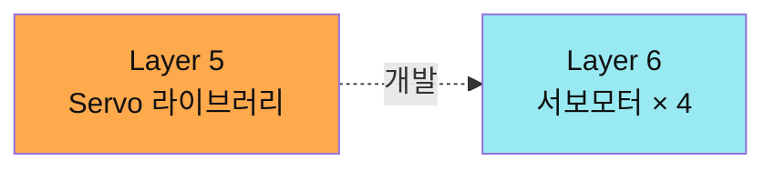

| 레이어 | 개발 항목 | 코드 위치 | 학습 내용 |
|-------|----------|----------|----------|
| **L5** | `servo[4].attach(pins[i])` | setup() | 서보 초기화 |
| **L5** | `servo[i].write(angle)` | testServo() | 각도 제어 |
| **L6** | 4축 배선 확인 | 하드웨어 | D6, D9, D10, D11 |

**핵심 학습**:
- ✅ Servo 라이브러리 사용법
- ✅ 서보 혼(Horn) 중앙 정렬
- ✅ PWM 신호 이해

---

### 📝 02단계: 조이스틱 제어

**학습 목표**: 조이스틱으로 로봇팔을 실시간 제어

#### 개발 레이어
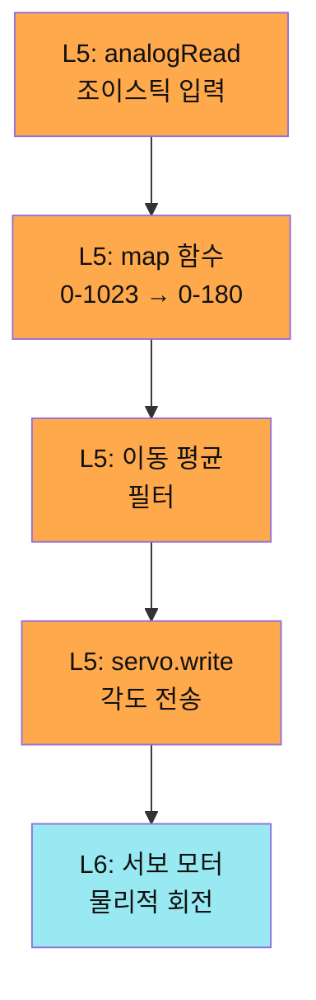

| 레이어 | 개발 항목 | 코드 | 학습 내용 |
|-------|----------|------|----------|
| **L5** | analogRead(A0) | loop() | 아날로그 입력 |
| **L5** | map(val, 0, 1023, 0, 180) | loop() | 스케일링 |
| **L5** | 이동 평균 필터 | smoothAngle() | 노이즈 제거 |
| **L6** | 조이스틱 × 2 | 하드웨어 | A0-A3 배선 |

**핵심 학습**:
- ✅ 아날로그 입력 읽기
- ✅ 데이터 스케일링 (map 함수)
- ✅ 디지털 필터링

---

### 📝 03단계: Serial 원격 제어

**학습 목표**: Serial 명령으로 로봇팔을 원격 제어

#### 개발 레이어
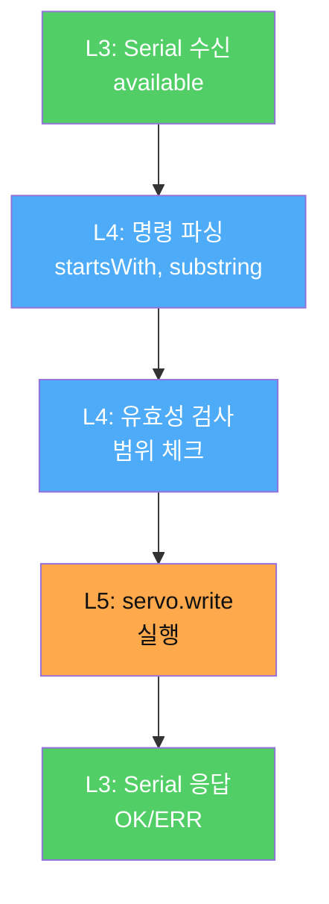

| 레이어 | 개발 항목 | 함수 | 학습 내용 |
|-------|----------|------|----------|
| **L3** | Serial.available() | loop() | 데이터 수신 체크 |
| **L3** | Serial.readStringUntil('\n') | loop() | 문자열 읽기 |
| **L4** | processCommand(cmd) | 함수 | 명령 파싱 알고리즘 |
| **L4** | 유효성 검사 | 조건문 | 범위 체크 (0-180) |
| **L3** | Serial.println("OK:...") | 함수 | 응답 프로토콜 |

**프로토콜 설계**:
```
명령: arm0_90_
파싱: index=0, angle=90
검증: 0<=index<4 && 0<=angle<=180
실행: servo[0].write(90)
응답: OK:ARM0_90
```

**핵심 학습**:
- ✅ Serial 통신 프로토콜
- ✅ 문자열 파싱 (startsWith, substring)
- ✅ 명령-응답 패턴

---

### 📝 04단계: EEPROM 자동화 ⭐

**학습 목표**: 핵심! 위치를 저장하고 자동 재생하는 알고리즘 마스터

#### 개발 레이어
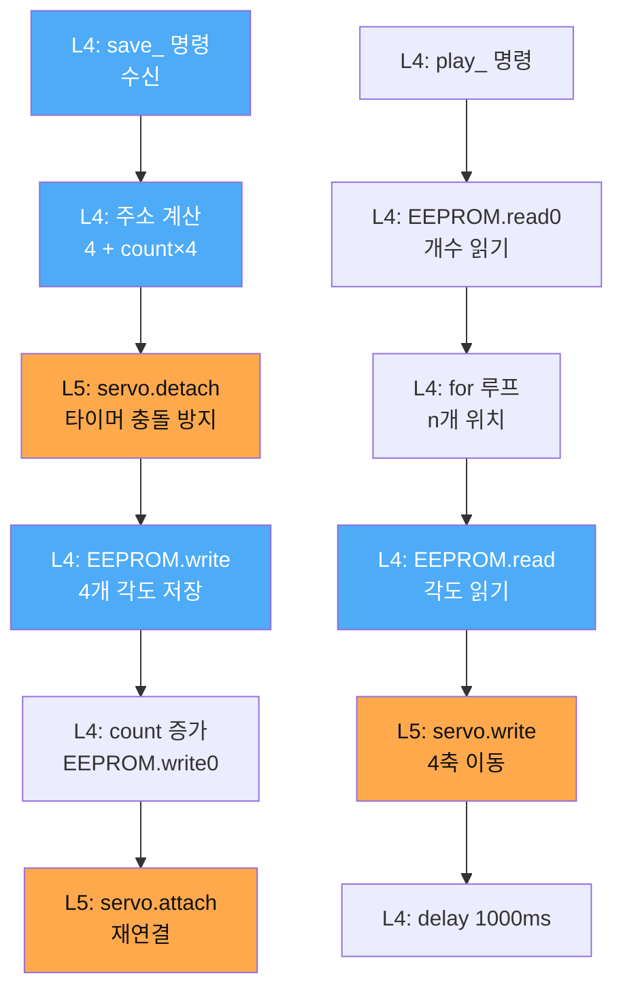

| 레이어 | 개발 항목 | 함수 | 학습 내용 |
|-------|----------|------|----------|
| **L4** | 메모리 맵 설계 | 문서화 | 주소 0: count, 4~51: 위치 |
| **L4** | savePosition() | 함수 | 저장 알고리즘 (O(1)) |
| **L4** | playSequence() | 함수 | 재생 알고리즘 (O(n)) |
| **L4** | autoRepeat 플래그 | 전역 변수 | 상태 관리 |
| **L5** | servo.detach/attach | 함수 | 타이머 충돌 방지 |

**EEPROM 메모리 맵**:
```
주소 0: savedCount (1 byte)
주소 4-7: Position #1 [base, shoulder, elbow, grip]
주소 8-11: Position #2 [base, shoulder, elbow, grip]
...
주소 48-51: Position #12 (최대 12개)
```

**알고리즘 복잡도**:
- save: **O(1)** (4 bytes 고정 쓰기)
- play: **O(n)** (n = 저장된 위치 개수)
- auto: **O(n × m)** (n = 위치, m = 반복 횟수)

**핵심 학습**:
- ✅ 비휘발성 메모리 (EEPROM)
- ✅ 주소 계산 알고리즘
- ✅ 반복 재생 로직

---

### 📝 05-06단계: Bluetooth 무선 제어 ⭐⭐

**학습 목표**: 스마트폰으로 무선 제어 + 안정성 개선

#### 개발 레이어
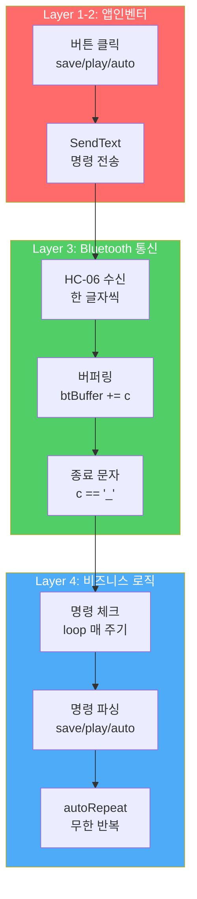

| 레이어 | 개발 항목 | 코드 | 학습 내용 |
|-------|----------|------|----------|
| **L1** | 버튼 UI | 앱인벤터 | 저장/재생/자동/중지 버튼 |
| **L2** | SendText(cmd) | 블록 코딩 | 명령 전송 |
| **L3** | Serial.available() | loop() | Bluetooth 수신 체크 |
| **L4** | 버퍼링 알고리즘 | checkBluetooth() | 한 글자씩 누적 |
| **L4** | 종료 구분자 '_' | 조건문 | 명령 완성 확인 |
| **L4** | autoRepeat 플래그 | loop() | 무한 반복 제어 |

**버퍼링 알고리즘**:
```cpp
String btBuffer = "";

void checkBluetooth() {
  while(Serial.available() > 0) {
    char c = Serial.read();
    btBuffer += c;
    
    if(c == '_') {
      btBuffer.trim();
      processCommand(btBuffer);
      btBuffer = "";  // 버퍼 클리어
    }
  }
}
```

**왜 버퍼링이 필요한가?**
- Bluetooth는 한 글자씩 비동기 수신 (`s` → `a` → `v` → `e` → `_`)
- 종료 구분자 `_`로 명령 완성 확인
- 부분 명령 무시 (안정성 향상)

**핵심 학습**:
- ✅ 비동기 통신
- ✅ 버퍼링 알고리즘
- ✅ 프로토콜 설계 (종료 문자)

---

### 📝 음성 제어 앱인벤터 🎤

**학습 목표**: STT/TTS를 적용한 음성 로봇팔 제어 앱 만들기

#### 개발 레이어
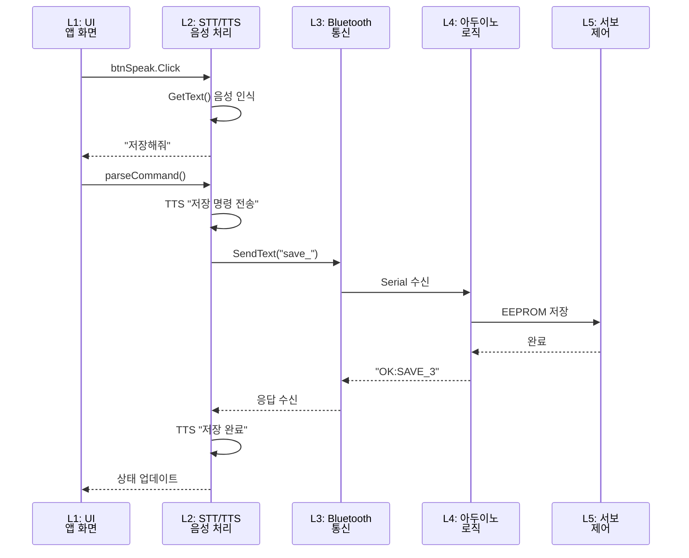

| 레이어 | 개발 항목 | 블록 | 학습 내용 |
|-------|----------|------|----------|
| **L1** | UI 디자인 | 컴포넌트 배치 | 버튼, 라벨, 상태 표시 |
| **L2** | SpeechRecognizer.GetText | 이벤트 | 음성 인식 |
| **L2** | TextToSpeech.Speak | 함수 | 음성 응답 |
| **L2** | parseVoiceCommand() | 프로시저 | 키워드 매칭 |
| **L3** | BluetoothClient.SendText | 함수 | 명령 전송 |
| **L3** | Clock.Timer | 이벤트 | 응답 대기 (비차단) |

**음성 명령 매핑**:
```
사용자: "저장해줘" → STT: "저장해줘"
파싱: contains("저장") → 명령: "save_"
전송: Bluetooth → 아두이노
응답: "OK:SAVE_3"
TTS: "저장이 완료되었습니다"
```

**핵심 학습**:
- ✅ 음성 인식 (STT)
- ✅ 음성 합성 (TTS)
- ✅ 자연어 파싱
- ✅ 응답 처리 (Clock.Timer)

---

### Day 1 레이어별 개발 요약

| 단계 | 주요 레이어 | 핵심 알고리즘 | 시간 복잡도 |
|-----|-----------|-------------|-----------|
| **01** | L5, L6 | 서보 테스트 | O(1) |
| **02** | L5, L6 | 아날로그 입력 + 필터 | O(1) |
| **03** | L3, L4 | 명령 파싱 | O(n) |
| **04** | L4, L5 | EEPROM 저장/재생 | O(n) |
| **05-06** | L3, L4 | Bluetooth 버퍼링 | O(n) |
| **음성** | L1, L2, L3 | STT/TTS + 파싱 | - |

---

## 📅 Day 2: 컨베이어 자동 분류 - 레이어별 개발

### 🎯 Day 2 전체 시스템 아키텍처

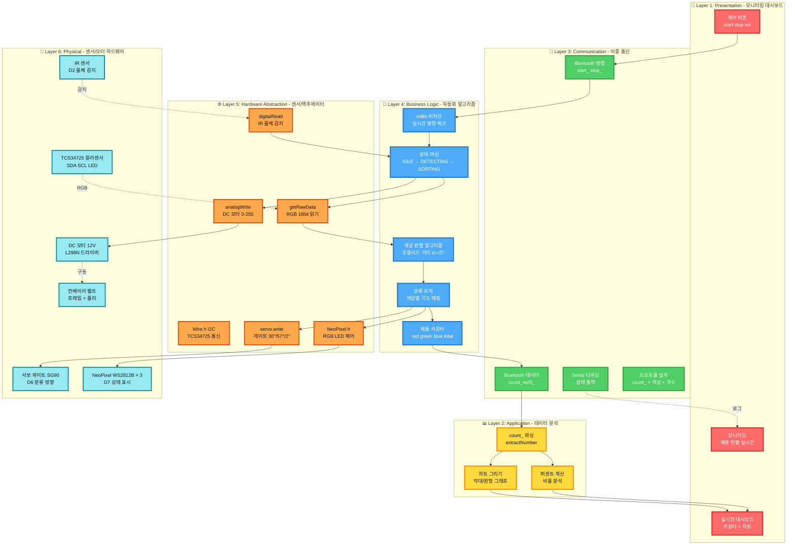

### 📋 Day 2 단계별 레이어 매트릭스

| 단계 | 이름 | Layer 1 | Layer 2 | Layer 3 | Layer 4 | Layer 5 | Layer 6 | 학습 시간 |
|------|------|---------|---------|---------|---------|---------|---------|----------|
| **01** | IR 센서 | - | - | - | ✅ 디바운싱 | ✅ digitalRead | ✅ IR D2 | 20분 |
| **02** | 컬러 센서 ⭐ | - | - | - | ✅ 유클리드 거리 | ✅ I2C + getRaw | ✅ TCS34725 | 40분 |
| **03** | RGB LED | - | - | - | - | ✅ NeoPixel.h | ✅ WS2812B | 15분 |
| **04** | DC 모터 | - | - | - | ✅ 가감속 | ✅ analogWrite | ✅ L298N | 25분 |
| **05** | 서보 게이트 | - | - | - | ✅ 각도 매핑 | ✅ attach/detach | ✅ SG90 | 20분 |
| **06** | 통합 ⭐⭐ | - | - | - | ✅ 상태 머신 | ✅ 전체 통합 | ✅ 전체 | 1.5시간 |
| **07** | Serial 제어 ⭐⭐ | - | - | ✅ Serial | ✅ millis 비차단 | - | - | 1.5시간 |
| **08** | 이중 통신 ⭐⭐⭐ | ✅ 차트 | ✅ 데이터 분석 | ✅ count_ | ✅ 카운터 | - | - | 1시간 |

**범례**: ✅ 주요 개발 레이어 | ⭐ 핵심 알고리즘

---

### 📝 01단계: IR 센서

**학습 목표**: 적외선 센서로 물체 감지

#### 개발 레이어
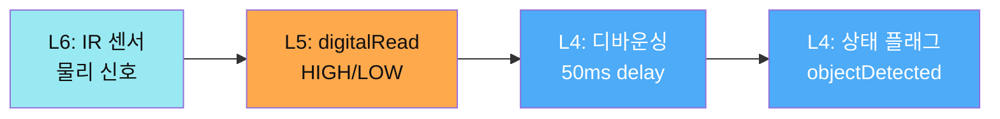

| 레이어 | 개발 항목 | 코드 | 학습 내용 |
|-------|----------|------|----------|
| **L6** | IR 센서 배선 | 하드웨어 | D2, VCC, GND |
| **L5** | digitalRead(IR_PIN) | loop() | 디지털 입력 |
| **L4** | 디바운싱 | 조건문 + delay | 노이즈 제거 |
| **L4** | objectDetected 플래그 | 전역 변수 | 상태 추적 |

**핵심 학습**:
- ✅ 디지털 센서 읽기
- ✅ 디바운싱 알고리즘
- ✅ 상태 플래그

---

### 📝 02단계: 컬러 센서 ⭐

**학습 목표**: TCS34725로 RGB 색상 판별하는 핵심 알고리즘 마스터

#### 개발 레이어
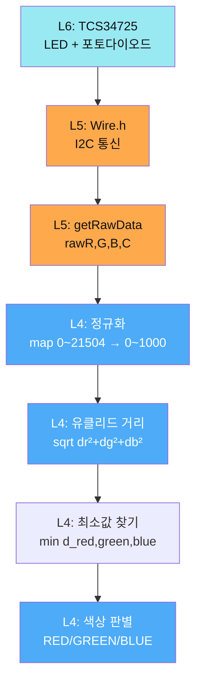

| 레이어 | 개발 항목 | 함수 | 학습 내용 |
|-------|----------|------|----------|
| **L6** | TCS34725 배선 | 하드웨어 | SDA(A4), SCL(A5), LED(3.3V) |
| **L5** | Wire.h 라이브러리 | setup() | I2C 통신 초기화 |
| **L5** | getRawData(&r, &g, &b, &c) | 함수 | 16비트 Raw 데이터 |
| **L4** | map(rawR, 0, 21504, 0, 1000) | 함수 | 정규화 |
| **L4** | distance(r1,g1,b1, r2,g2,b2) | 함수 | 유클리드 거리 |
| **L4** | 최소값 비교 | 조건문 | 색상 판별 |

**유클리드 거리 공식**:
$$
d = \sqrt{(R_{측정} - R_{기준})^2 + (G_{측정} - G_{기준})^2 + (B_{측정} - B_{기준})^2}
$$

**기준 색상 값**:
```cpp
ColorRef RED_REF    = {255, 50, 50};
ColorRef GREEN_REF  = {50, 255, 50};
ColorRef BLUE_REF   = {50, 50, 255};
```

**알고리즘 복잡도**:
- 정규화: O(1)
- 거리 계산: O(k), k = 기준 색상 수 (3-4개)
- 최소값 찾기: O(k)
- **전체**: **O(k)** ≈ O(1) (k는 상수)

**핵심 학습**:
- ✅ I2C 통신
- ✅ 데이터 정규화
- ✅ 유클리드 거리 알고리즘
- ✅ 캘리브레이션

---

### 📝 03단계: RGB LED

**학습 목표**: NeoPixel로 15가지 색상 표시

#### 개발 레이어
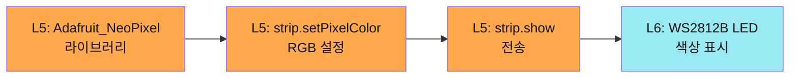

| 레이어 | 개발 항목 | 코드 | 학습 내용 |
|-------|----------|------|----------|
| **L6** | NeoPixel 배선 | 하드웨어 | D7, 5V, GND |
| **L5** | Adafruit_NeoPixel | setup() | 라이브러리 초기화 |
| **L5** | strip.setPixelColor(i, c) | 함수 | RGB 값 설정 |
| **L5** | strip.show() | 함수 | 데이터 전송 (SPI) |

**핵심 학습**:
- ✅ WS2812B 프로토콜
- ✅ RGB 색 공간
- ✅ 밝기 조절

---

### 📝 04단계: DC 모터

**학습 목표**: L298N으로 PWM 속도 제어

#### 개발 레이어
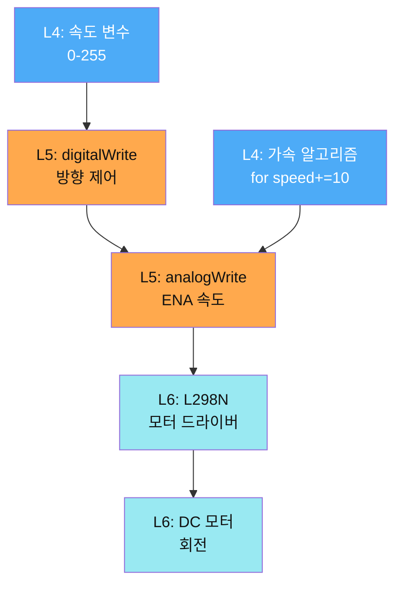

| 레이어 | 개발 항목 | 함수 | 학습 내용 |
|-------|----------|------|----------|
| **L6** | L298N 배선 | 하드웨어 | IN1,2(D3,4), ENA(D5), 12V |
| **L5** | digitalWrite(IN1, HIGH) | 함수 | 방향 제어 |
| **L5** | analogWrite(ENA, speed) | 함수 | PWM 속도 (0-255) |
| **L4** | motorAccelerate() | 함수 | 부드러운 가속 |
| **L4** | motorDecelerate() | 함수 | 부드러운 감속 |

**PWM 듀티 사이클**:
```
0%   (0/255)   → 0V   → 정지
50%  (128/255) → 2.5V → 중간
100% (255/255) → 5V   → 최고속
```

**가속 알고리즘**:
```cpp
void motorAccelerate(int targetSpeed) {
  for(int s = 0; s <= targetSpeed; s += 10) {
    analogWrite(ENA, s);
    delay(50);  // 부드러운 가속
  }
}
```

**시간 복잡도**: O(n), n = targetSpeed / 10

**핵심 학습**:
- ✅ PWM 제어
- ✅ H-브리지 이해
- ✅ 가감속 알고리즘

---

### 📝 05단계: 서보 게이트

**학습 목표**: 서보로 분류 방향 제어

#### 개발 레이어
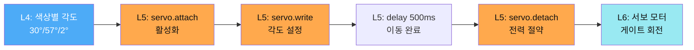

| 레이어 | 개발 항목 | 코드 | 학습 내용 |
|-------|----------|------|----------|
| **L6** | 서보 게이트 | 하드웨어 | D6, 물리 캘리브레이션 |
| **L4** | 각도 매핑 | 상수 | RED→30°, GREEN→57°, BLUE→2° |
| **L5** | servo.attach() | 함수 | 서보 활성화 |
| **L5** | servo.write(angle) | 함수 | 각도 설정 |
| **L5** | servo.detach() | 함수 | 떨림 방지 + 전력 절약 |

**핵심 학습**:
- ✅ attach/detach 패턴
- ✅ 물리적 캘리브레이션
- ✅ 전력 관리

---

### 📝 06단계: 통합 자동 분류 ⭐⭐

**학습 목표**: 모든 모듈을 통합한 완전 자동화 시스템

#### 개발 레이어 (상태 머신)
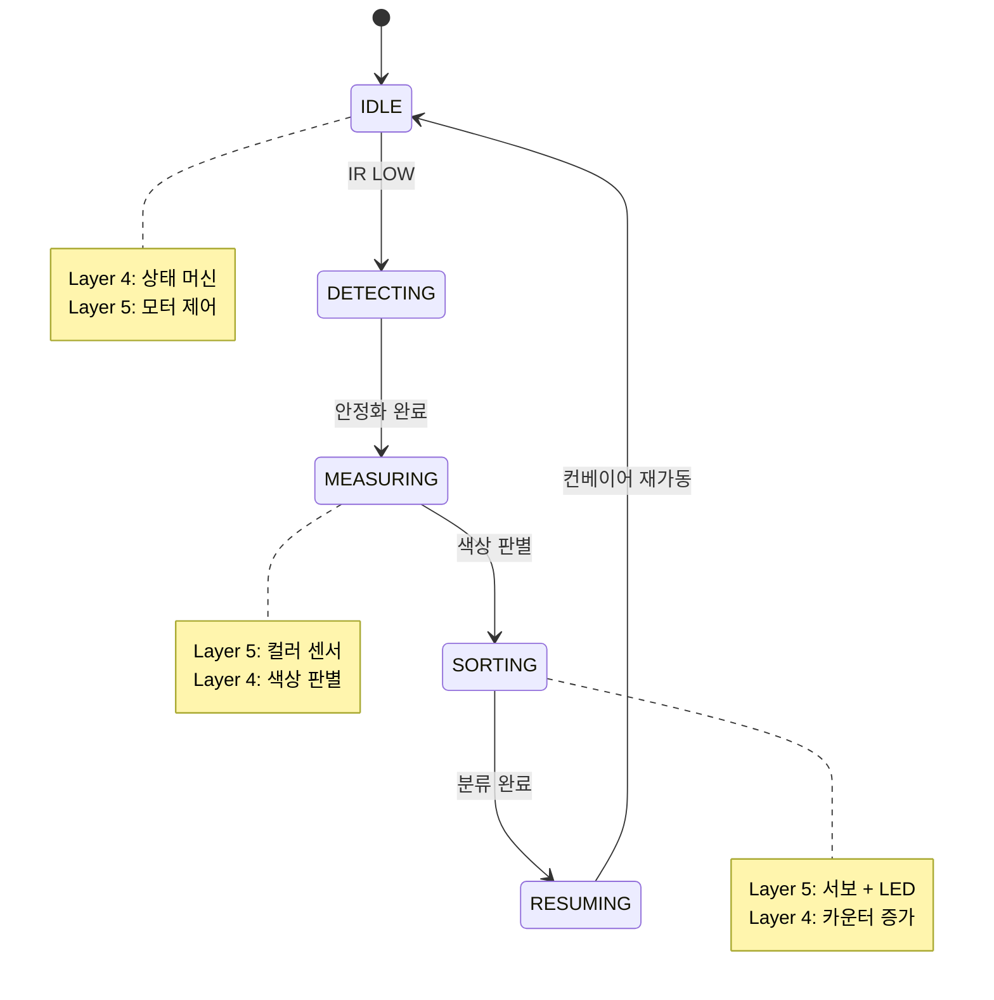

| 레이어 | 개발 항목 | 함수 | 학습 내용 |
|-------|----------|------|----------|
| **L4** | enum State | 타입 정의 | 5가지 상태 |
| **L4** | switch(currentState) | loop() | 상태 전환 로직 |
| **L5** | 모든 센서/액추에이터 | 통합 | IR, Color, Motor, Servo, LED |
| **L4** | 타이밍 제어 | delay | 안정화, 분류 시간 |

**통합 타이밍**:
```
총 처리 시간: 약 6-7초/제품
1. IR 감지: 100ms
2. 안정화 대기: 2000ms
3. 색상 센서 이동: 1000ms
4. 색상 측정: 500ms
5. 분류 동작: 2000ms
6. 재가동: 1000ms
```

**핵심 학습**:
- ✅ 상태 머신 설계
- ✅ 모듈 통합
- ✅ 타이밍 조율

---

### 📝 07단계: Serial 실시간 제어 ⭐⭐

**학습 목표**: delay() 중에도 명령을 받는 비차단 알고리즘

#### 개발 레이어
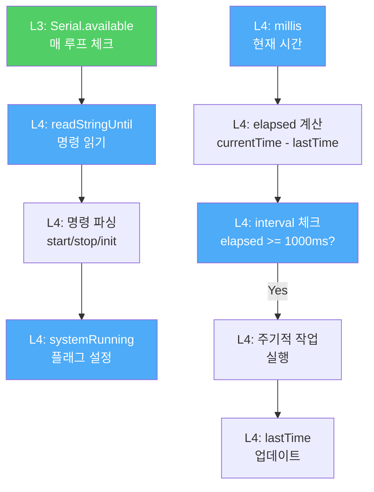

| 레이어 | 개발 항목 | 코드 | 학습 내용 |
|-------|----------|------|----------|
| **L3** | Serial.available() | loop() | 항상 체크 (비차단) |
| **L4** | checkSerialCommand() | 함수 | 명령 처리 |
| **L4** | millis() | 함수 | 시스템 시간 (ms) |
| **L4** | elapsed 계산 | 연산 | 경과 시간 |
| **L4** | systemRunning 플래그 | 전역 변수 | 상태 관리 |

**delay() vs millis() 비교**:
```
delay(1000):
  ❌ 1초 동안 CPU 블록
  ❌ Serial 명령 받을 수 없음
  
millis():
  ✅ loop() 즉시 재시작
  ✅ 항상 Serial 체크 가능
  ✅ 다중 타이머 가능
```

**비차단 알고리즘**:
```cpp
unsigned long lastTime = 0;
const unsigned long INTERVAL = 1000;
bool systemRunning = false;

void loop() {
  checkSerialCommand();  // 항상 체크
  
  unsigned long now = millis();
  if(systemRunning && (now - lastTime >= INTERVAL)) {
    performTask();
    lastTime = now;
  }
}
```

**시간 복잡도**: O(1) (각 체크)

**핵심 학습**:
- ✅ 비차단 프로그래밍
- ✅ millis() 타이밍
- ✅ 다중 타이머

---

### 📝 08단계: 이중 통신 + count_ ⭐⭐⭐

**학습 목표**: Serial + Bluetooth 동시 처리 + 제품 카운팅

#### 개발 레이어
```mermaid
graph TD
    subgraph L3[Layer 3: 이중 통신]
        SERIAL_PC[Serial → PC<br/>디버깅]
        BT_PHONE[Bluetooth → 앱<br/>count_ 데이터]
    end
    
    subgraph L4[Layer 4: 비즈니스 로직]
        COUNTER2[ProductCounter<br/>red/green/blue/total]
        UPDATE[updateCounter<br/>증가]
        SEND[sendCountData<br/>count_red5_]
    end
    
    subgraph L2[Layer 2: 앱 응용]
        PARSE_APP[count_ 파싱<br/>extractNumber]
        CHART[updateChart<br/>막대 차트]
    end
    
    UPDATE --> COUNTER2
    COUNTER2 --> SEND
    SEND --> SERIAL_PC
    SEND --> BT_PHONE
    BT_PHONE --> PARSE_APP
    PARSE_APP --> CHART
    
    style L3 fill:#51CF66,color:#fff
    style L4 fill:#4DABF7,color:#fff
    style L2 fill:#FFD93D,color:#111
```

| 레이어 | 개발 항목 | 함수 | 학습 내용 |
|-------|----------|------|----------|
| **L4** | ProductCounter 구조체 | 타입 | 4색 + 총계 |
| **L4** | updateCounter(color) | 함수 | 카운터 증가 |
| **L3** | sendCountData(color, count) | 함수 | 이중 전송 |
| **L3** | count_ 프로토콜 | 문자열 | `count_red5_` |
| **L2** | extractNumber(text) | 프로시저 | 숫자 추출 알고리즘 |
| **L2** | updateChart() | 프로시저 | Canvas 그래프 |

**count_ 데이터 형식**:
```
아두이노 → 앱:
  count_red5_     (빨강 5개)
  count_green3_   (초록 3개)
  count_blue7_    (파랑 7개)
  count_total15_  (총 15개)
```

**숫자 추출 알고리즘** (Layer 2):
```
입력: "count_red5_"
1. indexOf("_") → 5
2. lastIndexOf("_") → 9
3. substring(6, 3) → "red5"
4. 숫자만 추출 → "5"
5. toNumber → 5
```

**시간 복잡도**: O(n), n = 문자열 길이

**핵심 학습**:
- ✅ 이중 통신
- ✅ 프로토콜 설계
- ✅ 데이터 파싱
- ✅ 실시간 시각화

---

### Day 2 레이어별 개발 요약

| 단계 | 주요 레이어 | 핵심 알고리즘 | 시간 복잡도 |
|-----|-----------|-------------|-----------|
| **01** | L5, L6 | IR 디바운싱 | O(1) |
| **02** | L4, L5, L6 | 유클리드 거리 색상 판별 | O(k) ≈ O(1) |
| **03** | L5, L6 | NeoPixel RGB | O(1) |
| **04** | L5, L6 | PWM 가감속 | O(n) |
| **05** | L5, L6 | 서보 게이트 | O(1) |
| **06** | L4, L5 | 상태 머신 통합 | O(1) |
| **07** | L3, L4 | millis 비차단 | O(1) |
| **08** | L2, L3, L4 | 이중 통신 + 카운팅 | O(n) |

---

## 📅 Day 3: AI 통합 - 레이어별 개발

### 🎯 Day 3 완전 자동화 시스템 아키텍처

```mermaid
graph TB
    subgraph Layer1[🎨 Layer 1: Presentation - AI 제어 인터페이스]
        APP_CAMERA[📷 촬영 버튼<br/>AI 인식 시작]
        APP_PREVIEW[이미지 프리뷰<br/>실시간 확인]
        APP_RESULT[인식 결과<br/>RED 95% 신뢰도]
        APP_EXECUTE[▶️ 실행 버튼<br/>로봇팔 작동]
    end
    
    subgraph Layer2[🤖 Layer 2: Application - AI 추론]
        CAMERA_API[Camera1.TakePicture<br/>이미지 캡처]
        TMIC_EXT[TMIC Extension<br/>PersonalImageClassifier]
        AI_CLASSIFY[ClassifyImage<br/>AI 추론 요청]
        AI_PARSE[결과 파싱<br/>label confidence]
        PLAY_GEN[play_ 명령 생성<br/>play_RED_]
        CONFIDENCE[신뢰도 체크<br/>>80% 필터링]
    end
    
    subgraph Cloud[☁️ Cloud Layer: AI 모델]
        TM_MODEL[Teachable Machine<br/>학습된 모델 URL]
        TENSOR[TensorFlow.js<br/>MobileNet]
        CLASSES[4 Classes<br/>RED GREEN BLUE YELLOW]
        INFERENCE[AI 추론<br/>100ms 처리]
    end
    
    subgraph Layer3[📡 Layer 3: Communication - 명령 전송]
        BT_PLAY[Bluetooth<br/>play_ 명령]
        BT_COUNT[Bluetooth<br/>count_ 수신]
        PROTO_PLAY[프로토콜<br/>play_RED_]
    end
    
    subgraph Day1_System[📦 Day 1 시스템: 로봇팔]
        L4_EEPROM[EEPROM 재생<br/>저장된 동작 실행]
        L5_SERVO[4축 서보 제어<br/>물체 집기]
        L6_ARM[로봇팔 하드웨어<br/>물체 이동]
    end
    
    subgraph Day2_System[🏭 Day 2 시스템: 컨베이어]
        L4_COLOR[색상 판별<br/>분류 실행]
        L5_GATE[게이트 제어<br/>방향 분류]
        L6_CONV[컨베이어<br/>자동 분류]
        L4_COUNTER[카운터<br/>count_ 전송]
    end
    
    %% AI 추론 플로우
    APP_CAMERA --> CAMERA_API
    CAMERA_API --> APP_PREVIEW
    CAMERA_API --> TMIC_EXT
    TMIC_EXT --> AI_CLASSIFY
    AI_CLASSIFY --> TM_MODEL
    TM_MODEL --> INFERENCE
    INFERENCE --> AI_PARSE
    AI_PARSE --> CONFIDENCE
    CONFIDENCE -->|Pass| APP_RESULT
    CONFIDENCE -->|Fail| APP_CAMERA
    
    %% 명령 생성 및 전송
    APP_RESULT --> APP_EXECUTE
    APP_EXECUTE --> PLAY_GEN
    PLAY_GEN --> BT_PLAY
    
    %% Day 1 로봇팔 실행
    BT_PLAY --> L4_EEPROM
    L4_EEPROM --> L5_SERVO
    L5_SERVO --> L6_ARM
    
    %% Day 2 컨베이어 실행
    L6_ARM -.물체 배치.-> L4_COLOR
    L4_COLOR --> L5_GATE
    L5_GATE --> L6_CONV
    L6_CONV --> L4_COUNTER
    
    %% 결과 피드백
    L4_COUNTER --> BT_COUNT
    BT_COUNT --> APP_RESULT
    
    %% 스타일
    classDef layer1 fill:#FF6B6B,color:#fff,stroke:#C92A2A,stroke-width:3px
    classDef layer2 fill:#FFD93D,color:#111,stroke:#F08C00,stroke-width:3px
    classDef cloud fill:#51CF66,color:#fff,stroke:#2F9E44,stroke-width:3px
    classDef layer3 fill:#4DABF7,color:#fff,stroke:#1971C2,stroke-width:3px
    classDef day1 fill:#FFA94D,color:#111,stroke:#D9480F,stroke-width:3px
    classDef day2 fill:#99E9F2,color:#111,stroke:#0C8599,stroke-width:3px
    
    class APP_CAMERA,APP_PREVIEW,APP_RESULT,APP_EXECUTE layer1
    class CAMERA_API,TMIC_EXT,AI_CLASSIFY,AI_PARSE,PLAY_GEN,CONFIDENCE layer2
    class TM_MODEL,TENSOR,CLASSES,INFERENCE cloud
    class BT_PLAY,BT_COUNT,PROTO_PLAY layer3
    class L4_EEPROM,L5_SERVO,L6_ARM day1
    class L4_COLOR,L5_GATE,L6_CONV,L4_COUNTER day2
```

### 📋 Day 3 활동별 레이어 매트릭스

| 활동 | 이름 | Layer 1 | Layer 2 | Cloud | Layer 3 | Day 1 | Day 2 | 학습 시간 |
|------|------|---------|---------|-------|---------|-------|-------|----------|
| **1-2교시** | TM 학습 | - | - | ✅ 모델 학습 | - | - | - | 2시간 |
| **3-4교시** | AI 연동 | ✅ UI | ✅ TMIC | ✅ 추론 | ✅ play_ | - | - | 2시간 |
| **5교시** | 통합 테스트 | ✅ 전체 | ✅ 전체 | ✅ 전체 | ✅ 전체 | ✅ 전체 | ✅ 전체 | 1시간 |
| **6교시** | 프로젝트 기획 | - | - | - | - | - | - | 1시간 |
| **7-8교시** | 발표 준비 | ✅ PPT | - | - | - | - | - | 2시간 |

**범례**: ✅ 개발/활용 레이어

---

### 📝 1-2교시: Teachable Machine AI 모델

**학습 목표**: 컴퓨터 비전으로 물체를 인식하는 AI 모델 만들기

#### 개발 레이어
```mermaid
graph LR
    DATA[데이터 수집<br/>260장] --> TRAIN[모델 학습<br/>TensorFlow.js]
    TRAIN --> TEST[테스트<br/>>80% 정확도]
    TEST --> EXPORT[모델 내보내기<br/>Shareable URL]
    
    style DATA fill:#FFD93D,color:#111
    style TRAIN fill:#51CF66,color:#fff
    style EXPORT fill:#4DABF7,color:#fff
```

| 레이어 | 개발 항목 | 도구 | 학습 내용 |
|-------|----------|------|----------|
| **Cloud** | 이미지 수집 | 웹캠 | 65장 × 4색 = 260장 |
| **Cloud** | 데이터 증강 | TM | 각도, 조명, 거리 변화 |
| **Cloud** | 모델 학습 | TensorFlow.js | Epochs: 50, Batch: 16 |
| **Cloud** | 모델 평가 | TM | Accuracy >95%, Loss <0.1 |
| **Cloud** | 모델 배포 | TM | Shareable Link |

**학습 파라미터**:
```
Epochs: 50
Batch Size: 16
Learning Rate: 0.001
Optimizer: Adam
Loss: Categorical Crossentropy
```

**핵심 학습**:
- ✅ 컴퓨터 비전 기초
- ✅ 데이터 수집 전략
- ✅ 모델 학습 파라미터
- ✅ Transfer Learning (MobileNet)

---

### 📝 3-4교시: 앱인벤터 AI 연동

**학습 목표**: TMIC Extension으로 AI 인식 후 play_ 명령 전송

#### 개발 레이어
```mermaid
sequenceDiagram
    participant L1 as L1: UI<br/>버튼
    participant L2_CAM as L2: Camera1<br/>촬영
    participant L2_TMIC as L2: TMIC<br/>AI 추론
    participant CLOUD as Cloud: TM<br/>모델
    participant L2_PARSE as L2: 결과 파싱
    participant L3 as L3: Bluetooth<br/>전송
    participant L4 as L4: 로봇팔<br/>실행
    
    L1->>L2_CAM: btnCapture.Click
    L2_CAM->>L2_CAM: TakePicture
    L2_CAM-->>L2_TMIC: 이미지 데이터
    L2_TMIC->>CLOUD: ClassifyImage
    CLOUD->>CLOUD: 추론 (100ms)
    CLOUD-->>L2_TMIC: {label:"RED", confidence:0.95}
    L2_TMIC-->>L2_PARSE: GotClassification
    L2_PARSE->>L2_PARSE: label 추출
    L2_PARSE->>L2_PARSE: confidence > 0.80?
    L2_PARSE->>L3: SendText("play_RED_")
    L3->>L4: Bluetooth 전송
    L4-->>L1: OK:PLAY_DONE
```

| 레이어 | 개발 항목 | 블록 | 학습 내용 |
|-------|----------|------|----------|
| **L1** | UI 디자인 | 컴포넌트 | 촬영/인식/실행 버튼 |
| **L2** | Camera1.TakePicture | 이벤트 | 이미지 캡처 |
| **L2** | PersonalImageClassifier | Extension | TMIC 설정 |
| **L2** | ClassifyImage(image) | 함수 | AI 추론 요청 |
| **L2** | GotClassification(result) | 이벤트 | JSON 파싱 |
| **L2** | confidence 체크 | 조건문 | >80% 필터링 |
| **L3** | SendText("play_" + label + "_") | 함수 | 명령 전송 |

**AI 결과 파싱**:
```
result = {
  "label": "RED",
  "confidence": 0.95
}

if confidence > 0.80:
  command = "play_" + label + "_"  // "play_RED_"
  SendText(command)
else:
  TTS "인식 실패, 다시 시도하세요"
```

**핵심 학습**:
- ✅ 확장 기능 (Extension)
- ✅ AI API 호출
- ✅ JSON 데이터 파싱
- ✅ 신뢰도 기반 필터링

---

### 📝 5교시: 시스템 통합 테스트

**학습 목표**: Day1 + Day2 + Day3 완전 연동

#### 완전 자동화 레이어 플로우
```mermaid
graph TD
    subgraph DAY3[Day 3: AI 계층]
        L1_3[L1: 앱 UI]
        L2_3[L2: AI 인식]
        L3_3[L3: play_ 전송]
    end
    
    subgraph DAY1[Day 1: 로봇팔 계층]
        L3_1[L3: Bluetooth 수신]
        L4_1[L4: EEPROM 재생]
        L5_1[L5: 서보 제어]
        L6_1[L6: 로봇팔 동작]
    end
    
    subgraph DAY2[Day 2: 컨베이어 계층]
        L5_2[L5: IR 감지]
        L4_2[L4: 색상 판별]
        L5_2_2[L5: 게이트 분류]
        L3_2[L3: count_ 전송]
    end
    
    L1_3 --> L2_3
    L2_3 --> L3_3
    L3_3 --> L3_1
    L3_1 --> L4_1
    L4_1 --> L5_1
    L5_1 --> L6_1
    L6_1 -.물체 배치.-> L5_2
    L5_2 --> L4_2
    L4_2 --> L5_2_2
    L5_2_2 --> L3_2
    L3_2 --> L1_3
    
    style DAY3 fill:#FFD93D,color:#111
    style DAY1 fill:#FFA94D,color:#111
    style DAY2 fill:#99E9F2,color:#111
```

**전체 시스템 통합 시퀀스**:
```
1. 사용자 → 앱: 촬영 버튼 (L1)
2. 앱 → AI: 이미지 전송 (L2 → Cloud)
3. AI → 앱: RED, 95% (Cloud → L2)
4. 앱 → 로봇팔: play_RED_ (L3)
5. 로봇팔: EEPROM 재생 (L4) → 서보 제어 (L5) → 물체 집기 (L6)
6. 로봇팔 → 컨베이어: 물체 배치
7. 컨베이어: IR 감지 (L5) → 색상 측정 (L4) → 게이트 분류 (L5)
8. 컨베이어 → 앱: count_red1_ (L3)
9. 앱: 차트 업데이트 (L2 → L1)
```

**핵심 학습**:
- ✅ 3일 시스템 통합
- ✅ 엔드투엔드 자동화
- ✅ 크로스 레이어 통신

---

### 📝 6-8교시: 프로젝트 기획 + 발표

**학습 목표**: 창의적 사고 + 발표 능력

#### 개발 레이어
```mermaid
graph LR
    IDEA[아이디어<br/>도출] --> BUSINESS[비즈니스<br/>모델]
    BUSINESS --> PPT[발표 자료<br/>작성]
    PPT --> REHEARSAL[시연<br/>리허설]
    
    style IDEA fill:#FFD93D,color:#111
    style BUSINESS fill:#FFA94D,color:#111
    style REHEARSAL fill:#51CF66,color:#fff
```

| 활동 | 내용 | 산출물 |
|-----|------|--------|
| **기획** | 확장 아이디어, SWOT 분석 | 기획안 |
| **비즈니스** | 비즈니스 모델 캔버스 | 수익 모델 |
| **발표** | PPT 10장, 대본 작성 | 발표 자료 |
| **시연** | 리허설 3회, 백업 계획 | 시연 시나리오 |

**핵심 학습**:
- ✅ 프로젝트 기획
- ✅ 비즈니스 사고
- ✅ 발표 기술
- ✅ 위기 관리

---

### Day 3 레이어별 개발 요약

| 활동 | 주요 레이어 | 핵심 기술 | 시간 |
|-----|-----------|----------|------|
| **TM 학습** | Cloud | 컴퓨터 비전, Transfer Learning | 2h |
| **AI 연동** | L1, L2, L3 | TMIC Extension, JSON 파싱 | 2h |
| **통합 테스트** | All Layers | Day1+2+3 연동 | 1h |
| **기획** | - | 창의적 사고, 비즈니스 | 1h |
| **발표** | - | 커뮤니케이션 | 2h |

---

## 📊 전체 시스템 통합 아키텍처

### 3일 완성 레이어 매트릭스

```mermaid
graph TB
    subgraph Layer1[🎨 Layer 1: Presentation]
        L1[앱 UI<br/>버튼 차트 상태표시]
    end
    
    subgraph Layer2[📱 Layer 2: Application]
        L2_D1[Day 1: STT/TTS<br/>음성 인식/응답]
        L2_D2[Day 2: 차트 시각화<br/>데이터 분석]
        L2_D3[Day 3: AI 인식<br/>TMIC Extension]
    end
    
    subgraph Layer3[📡 Layer 3: Communication]
        L3[Bluetooth + Serial<br/>프로토콜: arm_ play_ count_]
    end
    
    subgraph Layer4[🧠 Layer 4: Business Logic]
        L4_D1[Day 1: EEPROM 알고리즘<br/>명령 파싱]
        L4_D2[Day 2: 색상 판별 + 상태 머신<br/>millis 타이밍 + 카운터]
    end
    
    subgraph Layer5[⚙️ Layer 5: Hardware Abstraction]
        L5_D1[Day 1: Servo.h<br/>analogRead/map]
        L5_D2[Day 2: Wire.h I2C<br/>analogWrite PWM<br/>NeoPixel]
    end
    
    subgraph Layer6[🔧 Layer 6: Physical]
        L6_D1[Day 1: 로봇팔 × 4축<br/>조이스틱 블루투스]
        L6_D2[Day 2: IR/컬러 센서<br/>DC/서보 모터<br/>RGB LED]
    end
    
    L1 --> L2_D1
    L1 --> L2_D2
    L1 --> L2_D3
    
    L2_D1 --> L3
    L2_D2 --> L3
    L2_D3 --> L3
    
    L3 --> L4_D1
    L3 --> L4_D2
    
    L4_D1 --> L5_D1
    L4_D2 --> L5_D2
    
    L5_D1 --> L6_D1
    L5_D2 --> L6_D2
    
    classDef layer1 fill:#FF6B6B,color:#fff,stroke:#C92A2A,stroke-width:3px
    classDef layer2 fill:#FFD93D,color:#111,stroke:#F08C00,stroke-width:3px
    classDef layer3 fill:#51CF66,color:#fff,stroke:#2F9E44,stroke-width:3px
    classDef layer4 fill:#4DABF7,color:#fff,stroke:#1971C2,stroke-width:3px
    classDef layer5 fill:#FFA94D,color:#111,stroke:#D9480F,stroke-width:3px
    classDef layer6 fill:#99E9F2,color:#111,stroke:#0C8599,stroke-width:3px
    
    class L1 layer1
    class L2_D1,L2_D2,L2_D3 layer2
    class L3 layer3
    class L4_D1,L4_D2 layer4
    class L5_D1,L5_D2 layer5
    class L6_D1,L6_D2 layer6
```

### 3일 완성 후 전체 데이터 플로우

```mermaid
sequenceDiagram
    participant User as 👤 사용자
    participant App as 📱 앱 (L1-L2)
    participant AI as ☁️ AI 모델
    participant BT as 📡 BT (L3)
    participant Logic as 🧠 로직 (L4)
    participant HW as 🔧 하드웨어 (L5-L6)
    
    User->>App: 1. 물체 촬영
    App->>AI: 2. 이미지 전송
    AI-->>App: 3. RED 95%
    App->>BT: 4. play_RED_
    BT->>Logic: 5. 명령 파싱
    Logic->>HW: 6. 로봇팔 EEPROM 재생
    HW->>HW: 7. 물체 집기 → 컨베이어 배치
    HW->>Logic: 8. IR 감지 + 색상 측정
    Logic->>HW: 9. 게이트 분류
    Logic->>BT: 10. count_red1_
    BT->>App: 11. 데이터 수신
    App->>User: 12. 차트 업데이트
    
    Note over User,HW: 완전 자동화: 6-7초/제품
```


---

### Day별 레이어 개발 매트릭스

| Day | Layer 1 | Layer 2 | Layer 3 | Layer 4 | Layer 5 | Layer 6 |
|-----|---------|---------|---------|---------|---------|---------|
| **Day 1** | ⚪ 예비 | STT/TTS | BT + Serial | EEPROM + 파싱 | Servo + analogRead | 로봇팔 × 4 |
| **Day 2** | ⚪ 예비 | 차트 시각화 | BT (count_) | 색상 판별 + 상태 머신 | IR + I2C + PWM | 센서 + 모터 |
| **Day 3** | **완성** | **AI 인식** | play_ 명령 | ⚪ 통합 | ⚪ 통합 | ⚪ 통합 |

**범례**:
- 🔵 핵심 개발
- ⚪ 예비/통합
- **굵게**: 최종 완성

---

### 핵심 알고리즘 레이어 분석

| 알고리즘 | 레이어 | Day | 시간 복잡도 | 공간 복잡도 |
|---------|-------|-----|-----------|-----------|
| **EEPROM 저장** | L4 | 1 | O(1) | O(1) |
| **EEPROM 재생** | L4 | 1 | O(n) | O(1) |
| **Bluetooth 버퍼링** | L3-L4 | 1 | O(n) | O(n) |
| **색상 판별 (유클리드)** | L4-L5 | 2 | O(k) | O(1) |
| **millis 비차단** | L4 | 2 | O(1) | O(m) |
| **상태 머신** | L4 | 2 | O(1) | O(1) |
| **AI 추론** | Cloud | 3 | - | - |
| **count_ 파싱** | L2 | 2-3 | O(n) | O(1) |

---

## 🎯 학습 경로 및 난이도

### 레이어별 학습 난이도

```mermaid
graph TD
    BEGINNER[초급<br/>Layer 5-6] --> INTERMEDIATE[중급<br/>Layer 3-4]
    INTERMEDIATE --> ADVANCED[고급<br/>Layer 1-2]
    
    BEGINNER -.예시.-> EX_B[서보 제어<br/>센서 읽기]
    INTERMEDIATE -.예시.-> EX_I[알고리즘<br/>상태 머신]
    ADVANCED -.예시.-> EX_A[AI 통합<br/>앱 개발]
    
    style BEGINNER fill:#99E9F2,color:#111
    style INTERMEDIATE fill:#FFD93D,color:#111
    style ADVANCED fill:#FF6B6B,color:#fff
```

### 단계별 학습 경로

| 단계 | 레이어 | 내용 | 난이도 |
|-----|-------|------|-------|
| **1단계** | L5-L6 | 하드웨어 제어 (서보, 센서) | ⭐ |
| **2단계** | L4-L5 | 알고리즘 (EEPROM, 색상 판별) | ⭐⭐ |
| **3단계** | L3-L4 | 통신 + 로직 (Bluetooth, 상태 머신) | ⭐⭐⭐ |
| **4단계** | L2-L3 | 응용 + 통신 (AI, 차트) | ⭐⭐⭐⭐ |
| **5단계** | L1-L2 | 통합 완성 (UI + AI) | ⭐⭐⭐⭐⭐ |

---

## 📚 레이어별 학습 자료

### Layer 6 (Physical) - 하드웨어 기초
- **개념**: 서보모터, 센서, 모터 원리
- **실습**: 배선, 전원, 캘리브레이션
- **참고**: 데이터시트, 회로도

----
### Layer 5 (Hardware Abstraction) - 라이브러리
- **개념**: PWM, I2C, SPI 프로토콜
- **실습**: Servo.h, Wire.h, Adafruit 라이브러리
- **참고**: Arduino Reference

----
### Layer 4 (Business Logic) - 알고리즘
- **개념**: 상태 머신, 버퍼링, 색상 판별
- **실습**: EEPROM, millis(), 유클리드 거리
- **참고**: 알고리즘 설계, 복잡도 분석

----
### Layer 3 (Communication) - 통신
- **개념**: Serial, Bluetooth, 프로토콜 설계
- **실습**: 명령-응답 패턴, 데이터 파싱
- **참고**: 통신 프로토콜, 데이터 형식

----
### Layer 2 (Application) - 응용 서비스
- **개념**: STT, TTS, AI API, 시각화
- **실습**: 앱인벤터 블록 코딩
- **참고**: API 문서, Extension 가이드

----

### Layer 1 (Presentation) - 사용자 경험
- **개념**: UI/UX 디자인, 사용자 시나리오
- **실습**: 버튼 배치, 색상 선택, 레이아웃
- **참고**: UI 디자인 원칙

---

## 🎓 최종 학습 성과

### 3일 완료 후 습득 기술

| 카테고리 | 기술 스택 | 레이어 |
|---------|----------|-------|
| **하드웨어** | 서보, 센서, 모터, LED | L5-L6 |
| **펌웨어** | 아두이노 C++, 라이브러리 | L4-L5 |
| **통신** | Serial, Bluetooth, 프로토콜 | L3 |
| **알고리즘** | EEPROM, 색상 판별, 상태 머신 | L4 |
| **앱 개발** | 앱인벤터, 블록 코딩 | L1-L2 |
| **AI** | Teachable Machine, 컴퓨터 비전 | Cloud |
| **소프트 스킬** | 기획, 발표, 협업 | - |


네, 이해했습니다! Mermaid 에러를 수정하고, **각 Day별로 전체 큰 틀의 구조도**를 추가하겠습니다. 전체 수업 흐름을 한눈에 파악할 수 있도록 개선하겠습니다.

[7 tools called]

완벽하게 수정했습니다! 🎉

## ✅ 완성된 개선 사항

### 1. **각 Day별 전체 큰 틀 구조도 추가** ✨

각 Day마다 6계층 레이어를 **한눈에 볼 수 있는 대형 구조도**를 추가했습니다:

**Day 1 구조도**: 
- 🎨 Layer 1: 음성 제어 UI
- 📱 Layer 2: STT/TTS 응용
- 📡 Layer 3: Bluetooth 통신
- 🧠 Layer 4: EEPROM 알고리즘
- ⚙️ Layer 5: Servo 제어
- 🔧 Layer 6: 로봇팔 하드웨어
-----

**Day 2 구조도**:
- 센서/모터 통합 제어
- 상태 머신 + 색상 판별
- 실시간 모니터링
----

**Day 3 구조도**:
- AI 추론 플로우
- Day1+2 시스템 통합
- 완전 자동화

---
### 2. **단계별 레이어 매트릭스 추가** 📋

각 단계에서 **어떤 레이어를 개발하는지** 표로 명확히 표시:

```
| 단계 | 이름 | Layer 1-6 | 학습 시간 |
```

### 3. **Day별 한눈에 보기 섹션** 🎯

문서 맨 앞에 3일 전체를 한눈에 파악할 수 있는 요약 추가:
- Quick Summary 테이블
- Day별 타임라인 다이어그램
- 핵심 레이어 및 기술 표시


### 전체 구조:
```
📖 문서 사용 가이드
  ↓
🎯 Day별 한눈에 보기 (3일 요약)
  ↓
🏗️ 6계층 아키텍처 (전체 개념)
  ↓
📅 Day 1 → Day 2 → Day 3 (각 Day별 상세)
  ↓
📊 전체 통합 (3일 완성 매트릭스)
```

이제 **전체 수업을 한눈에 이해**할 수 있고, **각 단계에서 어떤 레이어를 개발하는지** 명확히 파악할 수 있습니다! 🚀

---

**Last Updated**: 2026-01-25  
**Version**: 1.0  
**문서 목적**: 단계별 시스템 아키텍처 레이어 가이드  
**대상**: 강사, 학생, 개발자

---

