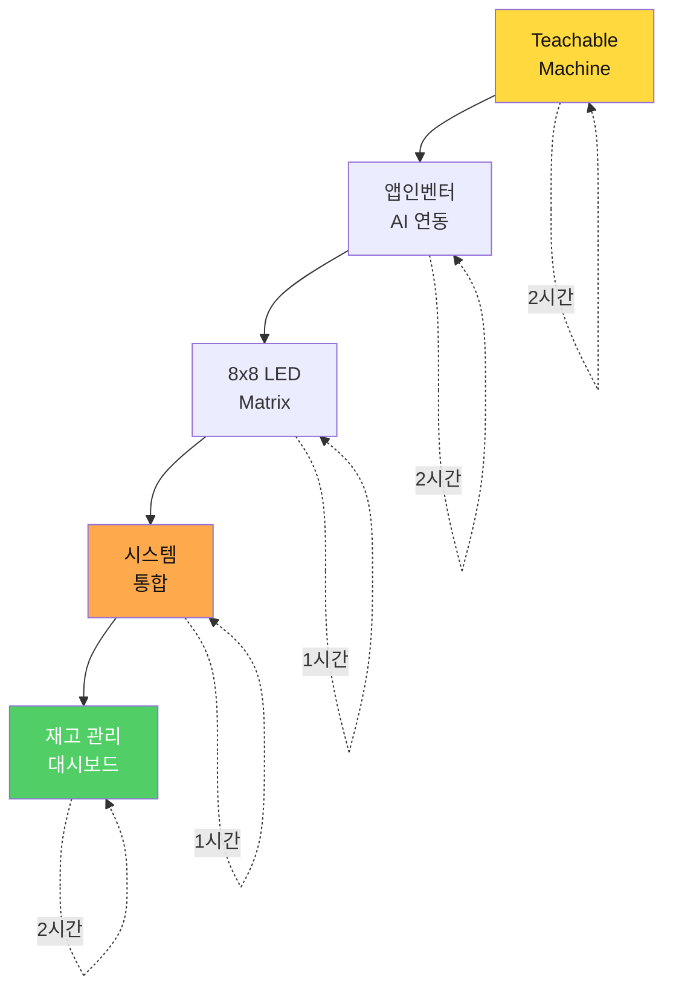
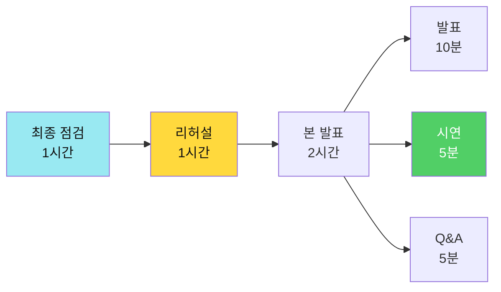
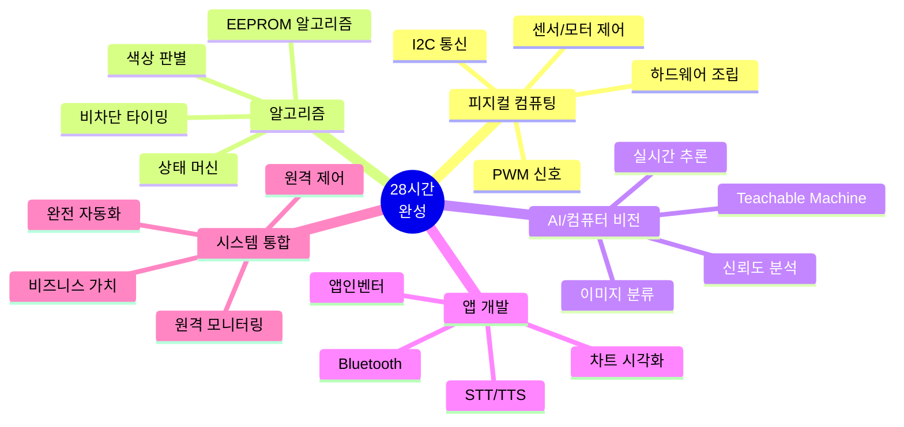

# 스마트 물류 팩토리 28시간 교육 커리큘럼

> **"피지컬 AI + 컴퓨터 비전 + 알고리즘 = 스마트 팩토리"**  
> README.md 기준으로 재구성한 실습 중심 교육 과정

---

## 📚 커리큘럼 개요

### 교육 철학


### 핵심 특징

- ✅ **단계별 학습**: 01~14 단계 순차 학습 (Day 1-2)
- ✅ **알고리즘 중심**: 7가지 핵심 알고리즘 마스터
- ✅ **실습 위주**: 손으로 만들고, 코드로 구현
- ✅ **음성 인터페이스**: STT/TTS 적용 (Day 1)
- ✅ **원격 제어/모니터링**: 앱인벤터 (Day 1-3)
- ✅ **컴퓨터 비전**: Teachable Machine AI (Day 3)
- ✅ **완전 자동화**: 카메라 → AI → 로봇 → 분류 → 차트

---

## 📅 교육 일정 (총 28시간)

| Day | 시간 | 주제 | 핵심 내용 | 산출물 |
|-----|------|------|----------|--------|
| **Day 1** | 8h | 로봇팔 제어 | 6단계 학습 + STT/TTS | ~1,340줄 + 음성 앱 |
| **Day 2** | 8h | 컨베이어 시스템 | 8단계 학습 + count_ | ~2,188줄 + 모니터링 |
| **Day 3** | 8h | AI 통합 | TM + 8x8 LED + 차트 | 완전 자동화 |
| **Day 4** | 4h | 발표 시연 | PPT + 라이브 데모 | 포트폴리오 |

---

## 📂 커리큘럼 구조

### Day 1: 로봇팔 피지컬 컴퓨팅 (8시간)

**파일**: [01_교육_커리큘럼_Day1_로봇팔제어.md](01_교육_커리큘럼_Day1_로봇팔제어.md)


**학습 내용**:
- 🔧 4축 로봇팔 조립 및 배선
- 📝 01~03단계: 기본 제어 (Servo, 조이스틱, Serial)
- 💾 04단계: EEPROM 저장/복구 알고리즘 ⭐
- 📡 05~06단계: Bluetooth 무선 제어 + 안정성 ⭐⭐
- 🎤 음성 제어: 앱인벤터 STT/TTS 적용 (2시간)

**핵심 알고리즘**:
1. EEPROM 저장/복구 (O(1))
2. 자동 재생/무한 반복 (O(n×m))
3. Bluetooth 명령 버퍼링 (O(n))

**산출물**:
- ✅ 무선 제어 로봇팔 (~1,340줄)
- ✅ 음성 제어 앱 (play_, save_, auto_, stop_)

---

### Day 2: 컨베이어 자동 분류 시스템 (8시간)

**파일**: [02_교육_커리큘럼_Day2_컨베이어시스템.md](02_교육_커리큘럼_Day2_컨베이어시스템.md)


**학습 내용**:
- 🔧 컨베이어 시스템 조립
- 📡 01~02단계: 센서 학습 (IR, 컬러 센서)
- ⚙️ 03~05단계: 액추에이터 제어 (LED, DC, Servo)
- 🔄 06단계: 통합 자동 분류 시스템 ⭐⭐
- 📡 07단계: Serial 실시간 제어 (비차단) ⭐⭐
- 📊 08단계: 이중 통신 + count_ 카운팅 ⭐⭐⭐
- 📱 원격 모니터링 앱 (1시간)

**핵심 알고리즘**:
4. 색상 판별 (유클리드 거리, O(1))
5. 실시간 명령 체크 (비차단, O(n))
6. 제품 카운터 및 전송 (O(1))
7. 통합 자동 분류 (상태 머신, O(1))

**산출물**:
- ✅ 완전 자동 컨베이어 (~2,188줄)
- ✅ count_ 데이터 실시간 전송
- ✅ 원격 모니터링 앱

---

### Day 3: AI 통합 + 스마트 물류 완성 (8시간)

**파일**: [03_교육_커리큘럼_Day3_AI통합.md](03_교육_커리큘럼_Day3_AI통합.md)



**학습 내용**:
- 🤖 Teachable Machine: AI 모델 학습 (260장+, 2시간)
- 🎨 앱인벤터 AI 연동: TMIC Extension (2시간)
- 💡 8x8 LED Matrix: 화살표 + 상태 표시 (1시간)
- 🔗 시스템 통합 테스트: Day1+2+3 연동 (1시간)
- 📊 재고 관리 대시보드: 원형/막대 차트 (2시간)

**완전 자동화 플로우**:
```
카메라 촬영 → AI 인식(TM) → play_ 명령 → 
로봇팔 동작 → LED 화살표 → 컨베이어 분류 → 
count_ 데이터 → 차트 업데이트
```

**산출물**:
- ✅ AI 물체 인식 모델 (>85% 정확도)
- ✅ 8x8 LED Matrix 시각화
- ✅ 완전 자동화 스마트 팩토리
- ✅ 재고 관리 대시보드 (차트 + 통계)

---

### Day 4: 최종 발표 및 시연 (4시간)

**파일**: [04_교육_커리큘럼_Day4_발표시연.md](04_교육_커리큘럼_Day4_발표시연.md)



**학습 내용**:
- 🔧 시스템 최종 점검 및 백업 계획
- 🎭 리허설 (역할 분담, 타이밍 조정)
- 🎤 팀별 발표 (21팀 × 15분)
- 🏆 우수 사례 시상

**평가 기준** (100점):
- 시스템 완성도 (30점)
- 재고 관리 앱 (25점)
- AI 연동 (20점)
- 시각화 (15점)
- 발표 + 시연 (10점)

**산출물**:
- ✅ 발표 자료 (PPT 10장)
- ✅ 라이브 시연 성공
- ✅ 포트폴리오 완성

---

## 🧠 핵심 알고리즘 요약

### 7가지 필수 알고리즘

| No | 알고리즘 | 시간 복잡도 | 학습 Day | 난이도 | 활용도 |
|----|---------|-----------|---------|--------|--------|
| 1 | EEPROM 저장/복구 | O(1) | Day 1 | ⭐⭐⭐ | ⭐⭐⭐⭐ |
| 2 | 자동 재생/무한 반복 | O(n×m) | Day 1 | ⭐⭐⭐ | ⭐⭐⭐⭐⭐ |
| 3 | Bluetooth 명령 버퍼링 | O(n) | Day 1 | ⭐⭐⭐⭐ | ⭐⭐⭐⭐⭐ |
| 4 | 색상 판별 (유클리드) | O(1) | Day 2 | ⭐⭐⭐ | ⭐⭐⭐⭐⭐ |
| 5 | 실시간 명령 체크 | O(n) | Day 2 | ⭐⭐⭐⭐ | ⭐⭐⭐⭐⭐ |
| 6 | 제품 카운터 전송 | O(1) | Day 2 | ⭐⭐⭐ | ⭐⭐⭐⭐ |
| 7 | 통합 자동 분류 | O(1) | Day 2 | ⭐⭐⭐⭐ | ⭐⭐⭐⭐⭐ |

---

## 📊 학습 성과 통계

### 코드 작성량

```markdown
총 ~3,528줄 작성

Day 1: 로봇팔 (~1,340줄)
├─ 01_servo_motor_test: ~100줄
├─ 02_joystick_servo_control: ~150줄
├─ 03_serial_servo_control: ~200줄
├─ 04_eeprom_automation: ~350줄 ⭐
├─ 05_bluetooth_eeprom: ~400줄 ⭐⭐
└─ 06_enhanced_version: ~140줄

Day 2: 컨베이어 (~2,188줄)
├─ 01_infrared_sensor: ~80줄
├─ 02_color_sensor: ~200줄 ⭐
├─ 03_rgb_led: ~120줄
├─ 04_dc_motor: ~150줄
├─ 05_servo_motor: ~100줄
├─ 06_integrated_system: ~400줄 ⭐⭐
├─ 07_serial_controlled: ~450줄 ⭐⭐
└─ 08_dual_comm_system: ~688줄 ⭐⭐⭐

Day 3: AI 통합
├─ Teachable Machine 모델 (260장+)
├─ 앱인벤터 블록 코딩
├─ 8x8 LED Matrix 패턴
└─ 재고 관리 차트
```

### 하드웨어 구성

```markdown
Day 1 부품:
- 4축 로봇팔 (SG90 × 4)
- 조이스틱 × 2
- 블루투스 HC-06
- 아두이노 UNO
- 5V 2A 전원

Day 2 부품:
- 컨베이어 벨트
- IR 센서
- TCS34725 컬러 센서
- NeoPixel RGB LED
- DC 모터 + L298N
- 서보 모터 (게이트)
- 12V 전원

Day 3 추가:
- 8x8 LED Matrix (MAX7219)
- 스마트폰 (카메라)
```

---

## 🎯 교육 목표 달성

### 기술 역량



### 포트폴리오

- 📄 **완성된 스마트 물류 시스템**
  - Day 1: 로봇팔 6단계 + 음성 제어
  - Day 2: 컨베이어 8단계 + 원격 모니터링
  - Day 3: AI 통합 + 재고 관리
  - 총 14개 프로그램 + 3개 앱
  
- 🖥️ **하드웨어 통합**
  - 4축 로봇팔
  - 컨베이어 벨트
  - 8x8 LED Matrix
  - 다양한 센서
  
- 🤖 **AI 모델**
  - Teachable Machine (4 클래스)
  - 평균 정확도 >85%
  - 실시간 추론
  
- 📱 **앱 3종**
  - 음성 제어 앱 (STT/TTS)
  - 원격 모니터링 앱
  - 재고 관리 대시보드

---

## 💡 특장점

### 1. 단계별 학습 (14단계)


### 2. 음성 인터페이스

- ✅ **STT (Speech To Text)**: 음성 명령 인식
- ✅ **TTS (Text To Speech)**: 음성 피드백
- ✅ **한국어 지원**: "저장해줘", "재생", "자동"
- ✅ **실시간 응답**: 명령 실행 상태 안내

### 3. 원격 제어/모니터링

- ✅ **Bluetooth 무선 제어**: play_, save_, auto_, stop_
- ✅ **실시간 데이터 전송**: count_ (빨강1, 초록2, 파랑3)
- ✅ **차트 시각화**: 원형/막대 차트
- ✅ **통계 분석**: 총 개수, 평균, 최다 색상

### 4. 컴퓨터 비전 (AI)

- ✅ **Teachable Machine**: 코드 없이 AI 학습
- ✅ **4개 클래스**: 빨강, 초록, 파랑, 노랑
- ✅ **고정확도**: >85% 신뢰도
- ✅ **실시간 추론**: 스마트폰 카메라 활용

---

## 🚀 시작하기

### 1단계: 문서 읽기 (순서대로)

1. **00_교육철학_역방향학습.md** (선택)
2. **01_교육_커리큘럼_Day1_로봇팔제어.md** ← Day 1 가이드
3. **02_교육_커리큘럼_Day2_컨베이어시스템.md** ← Day 2 가이드
4. **03_교육_커리큘럼_Day3_AI통합.md** ← Day 3 가이드
5. **04_교육_커리큘럼_Day4_발표시연.md** ← Day 4 가이드

### 2단계: 하드웨어 준비

**Day 1 (로봇팔)**:
- [ ] BP Lab AI 로봇팔 4축
- [ ] 아두이노 UNO
- [ ] 조이스틱 × 2
- [ ] HC-06 블루투스
- [ ] 5V 2A 전원

**Day 2 (컨베이어)**:
- [ ] TCS34725 컬러 센서
- [ ] IR 센서
- [ ] L298N + DC 모터
- [ ] NeoPixel RGB LED
- [ ] SG90 서보 모터
- [ ] 12V 전원

**Day 3 (AI)**:
- [ ] 8x8 LED Matrix (MAX7219)
- [ ] 스마트폰 (안드로이드)

### 3단계: 소프트웨어 설치

```bash
# Arduino IDE 설치
1. Arduino IDE 1.8.19 이상 다운로드
2. 라이브러리 설치:
   - Servo.h (내장)
   - EEPROM.h (내장)
   - Adafruit NeoPixel
   - Adafruit TCS34725
   - MD_MAX72XX

# 앱인벤터
1. ai2.appinventor.mit.edu 접속
2. 구글 계정 로그인
3. TMIC Extension 설치

# Teachable Machine
1. teachablemachine.withgoogle.com 접속
2. 이미지 프로젝트 생성
```

---

## 📖 참고 자료

### 프로젝트 문서

1. [arduino_code/README.md](../arduino_code/README.md) - 전체 코드 가이드
2. [arduino_code/알고리즘_설명서.md](../arduino_code/알고리즘_설명서.md) - 7가지 알고리즘
3. [arduino_code/프로젝트_구조.md](../arduino_code/프로젝트_구조.md) - 구조 가이드
4. [README.md](../README.md) - 프로젝트 개요

### 온라인 리소스

- [BP Lab AI 로봇팔](https://bplab.kr/order/?idx=178) - 교구재 구매
- [Arduino IDE](https://www.arduino.cc/en/software) - 개발 환경
- [앱인벤터](https://appinventor.mit.edu/) - 앱 개발
- [Teachable Machine](https://teachablemachine.withgoogle.com/) - AI 학습

---

## 📄 라이선스

MIT License - 교육 목적으로 자유롭게 사용 가능

---

## 👥 제작팀

**Smart Factory Education Team**
- 28시간 교육 커리큘럼 설계
- 14단계 학습 시스템 개발
- 7가지 핵심 알고리즘 구현
- AI 통합 시스템 설계
- 총 ~3,528줄 코드 + 문서

---

**Last Updated**: 2026-01-25  
**Version**: 3.0 (README.md 기준 완전 재구성)  
**총 교육 시간**: 28시간 (Day 1: 8h, Day 2: 8h, Day 3: 8h, Day 4: 4h)  
**핵심 기술**: 피지컬 컴퓨팅 + 알고리즘 + 컴퓨터 비전 + 앱 개발
