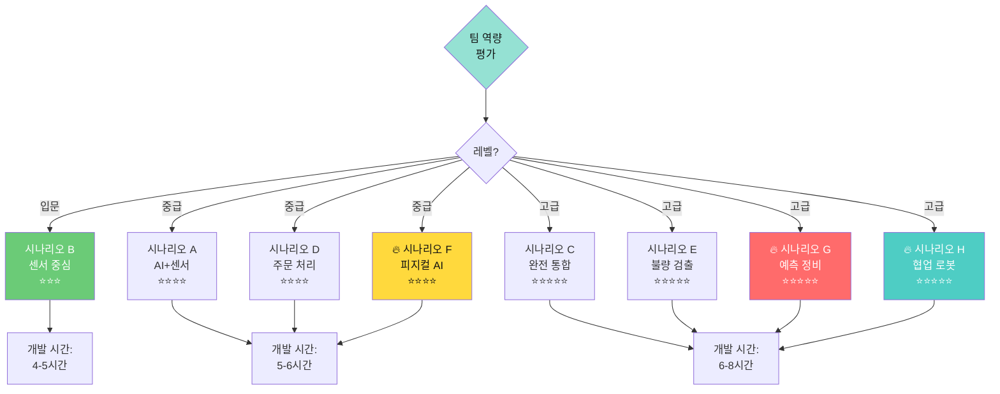
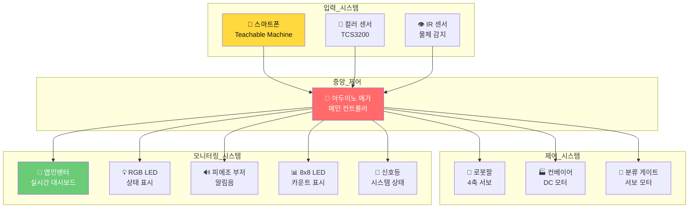
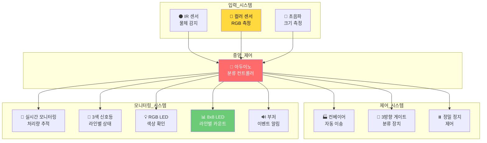
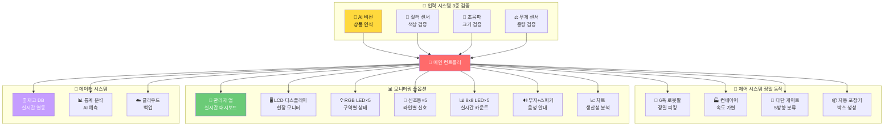
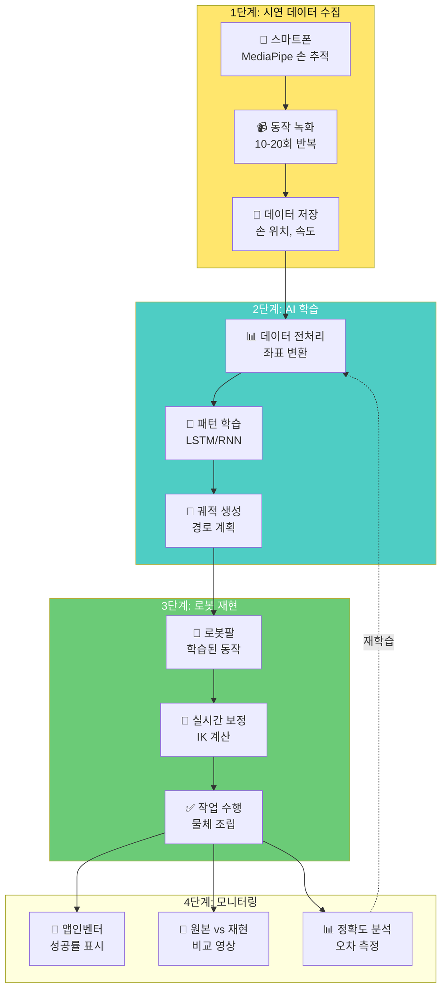
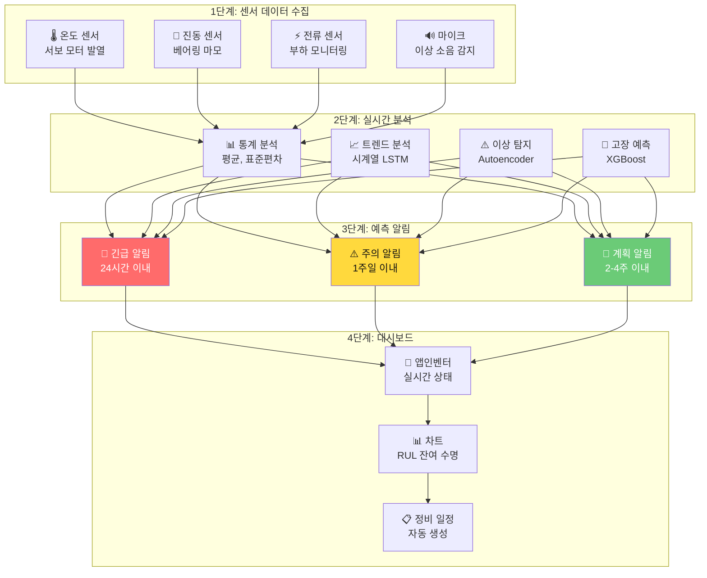
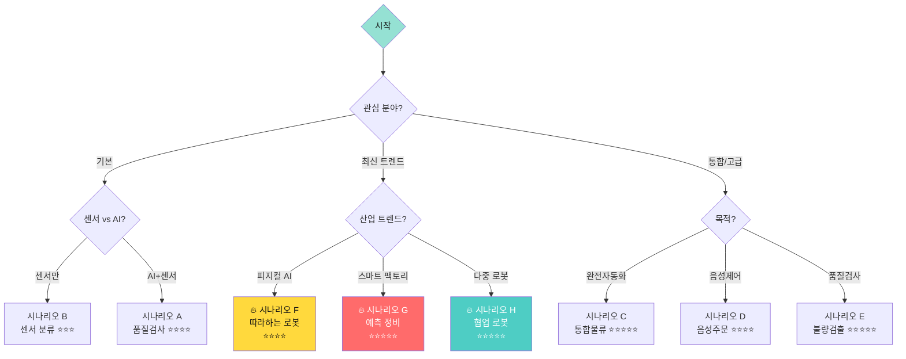
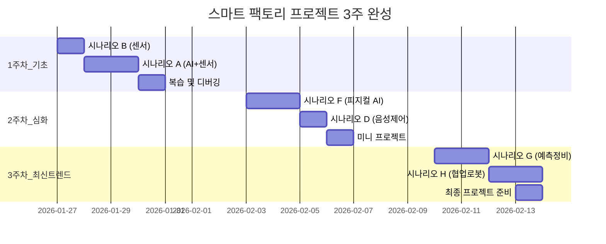
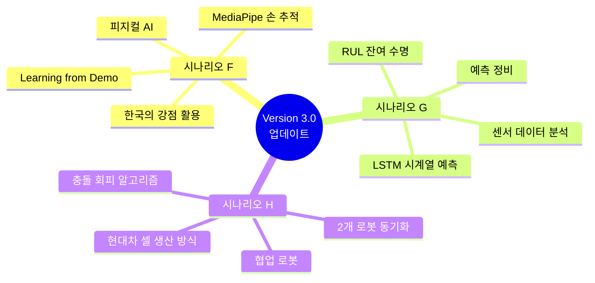

# Day 3 창의적 시나리오 상세 가이드

> **"현업 스토리로 배우는 스마트 팩토리 시스템 설계"**  
> 입력-제어-모니터링 통합 시나리오 완벽 가이드

---

## 📋 목차

### 기본 시나리오 (A-E)
1. [시나리오 선택 가이드](#시나리오-선택-가이드)
2. [시나리오 A: AI 품질검사 스마트 입고](#시나리오-a-ai-품질검사-스마트-입고)
3. [시나리오 B: 자동 색상 분류 라인](#시나리오-b-자동-색상-분류-라인)
4. [시나리오 C: 통합 AI 물류센터](#시나리오-c-통합-ai-물류센터)
5. [시나리오 D: 주문형 스마트 피킹](#시나리오-d-주문형-스마트-피킹)
6. [시나리오 E: 불량품 자동 검출](#시나리오-e-불량품-자동-검출)

### 🔥 최신 산업 트렌드 시나리오 (F-H) - NEW!
7. [시나리오 F: 따라하는 로봇 (피지컬 AI)](#시나리오-f-따라하는-로봇-피지컬-ai) 🤖
8. [시나리오 G: 예측 정비 스마트 팩토리](#시나리오-g-예측-정비-스마트-팩토리) ⚙️
9. [시나리오 H: 협업 로봇 조립 라인](#시나리오-h-협업-로봇-조립-라인) 🤝

### 학습 가이드
10. [시나리오별 비교 총정리](#시나리오별-비교-총정리-업데이트)
11. [학습 로드맵](#학습-로드맵)
12. [팁과 주의사항](#팁과-주의사항)

---

## 🎯 시나리오 선택 가이드

### 난이도별 분류 (업데이트)



### 시나리오 비교표 (전체 8개)

| 시나리오 | 난이도 | 핵심 기술 | 현업 연계 | 개발 시간 | 추천 대상 | 산업 트렌드 |
|---------|--------|----------|----------|----------|----------|-----------|
| **A. AI 품질검사** | ⭐⭐⭐⭐ | AI+센서 검증 | 제조업 품질관리 | 5-6h | AI 모델 우수팀 | 기본 |
| **B. 색상 분류** | ⭐⭐⭐ | 센서 기반 분류 | 물류 분류센터 | 4-5h | 하드웨어 강점팀 | 기본 |
| **C. AI 물류센터** | ⭐⭐⭐⭐⭐ | 완전 자동화 | 스마트 물류센터 | 6-7h | 도전적인 팀 | 고급 |
| **D. 주문형 피킹** | ⭐⭐⭐⭐ | 음성+AI | 이커머스 물류 | 5-6h | UI/UX 중시팀 | 고급 |
| **E. 불량품 검출** | ⭐⭐⭐⭐⭐ | AI 다중 검증 | 제조 품질검사 | 6-7h | AI+센서 강점팀 | 고급 |
| **🔥 F. 따라하는 로봇** | ⭐⭐⭐⭐ | 피지컬 AI, MediaPipe | Learning from Demo | 5-6h | AI/로봇 관심팀 | **최신** |
| **🔥 G. 예측 정비** | ⭐⭐⭐⭐⭐ | 센서 분석, ML 예측 | 스마트 팩토리 4.0 | 6-7h | 데이터 분석 팀 | **최신** |
| **🔥 H. 협업 로봇** | ⭐⭐⭐⭐⭐ | 다중 로봇 제어 | 현대차 셀 생산 | 7-8h | 로봇 제어 전문팀 | **최신** |

---

## 🏭 시나리오 A: AI 품질검사 스마트 입고

### 📖 현업 스토리

```
[배경]
중소 제조기업 '프리미엄 부품'은 협력사로부터 하루 500개의 부품을 납품받습니다.
기존에는 작업자가 육안으로 색상을 확인하고 수기로 입고 처리했지만,
휴먼 에러로 인한 불량률이 3%나 되었습니다.

[문제]
- 작업자 피로도로 인한 오판
- 입고 처리 시간 과다 (건당 30초)
- 통계 데이터 부재로 품질 개선 어려움

[해결]
AI 기반 사전 스캔 + 센서 이중 검증 시스템 도입
→ 불량률 0.5% 감소, 처리 시간 50% 단축
```

### 🏗️ 전체 시스템 구조도



### 🔧 하드웨어 자원 목록

#### 입력 장치
| 장치명 | 모델/규격 | 핀 번호 | 용도 | 주요 함수 |
|--------|----------|---------|------|----------|
| IR 센서 | TCRT5000 | D2 | 물체 감지 | `digitalRead()` |
| 컬러 센서 | TCS3200 | S0~S3, OUT | RGB 측정 | `readColorSensor()` |
| 초음파 센서 | HC-SR04 | D3, D4 | 거리 측정 | `readUltrasonic()` |

#### 제어 장치
| 장치명 | 모델/규격 | 핀 번호 | 용도 | 주요 함수 |
|--------|----------|---------|------|----------|
| 로봇팔 서보1 | MG996R | D5 | 베이스 회전 | `servo.write()` |
| 로봇팔 서보2 | MG996R | D6 | 어깨 관절 | `servo.write()` |
| 로봇팔 서보3 | MG996R | D7 | 팔꿈치 관절 | `servo.write()` |
| 로봇팔 서보4 | SG90 | D8 | 그리퍼 | `servo.write()` |
| 컨베이어 모터 | DC 12V | D9 (PWM) | 벨트 구동 | `analogWrite()` |
| 분류 게이트 | SG90 | D10 | 제품 분류 | `servo.write()` |

#### 출력/모니터링 장치
| 장치명 | 모델/규격 | 핀 번호 | 용도 | 주요 함수 |
|--------|----------|---------|------|----------|
| RGB LED | 5mm | D11~D13 | 상태 표시 | `setRGB()`, `showState()` |
| 피에조 부저 | 압전 | D22 | 알림음 | `playSound()` |
| 8x8 LED | MAX7219 | D23~D25 | 카운트 표시 | `displayNumber()`, `displayIcon()` |
| 신호등 LED | 5mm 3색 | D26~D28 | 시스템 상태 | `setTrafficLight()` |

#### 통신 장치
| 장치명 | 모델/규격 | 핀 번호 | 용도 | 주요 함수 |
|--------|----------|---------|------|----------|
| 블루투스 | HC-06 | TX1, RX1 | 앱 통신 | `Serial1.print()` |

### 💻 소프트웨어 자원 목록

#### 아두이노 라이브러리
```cpp
// 필수 라이브러리
#include <Servo.h>              // 서보 모터 제어
#include <Wire.h>               // I2C 통신
#include <LedControl.h>         // 8x8 LED 제어
#include <ArduinoJson.h>        // JSON 파싱

// 사용자 정의 헤더 (영문으로 작성)
#include "robot_arm_control.h"   // 로봇팔 제어: pickFromZone(), moveToPosition()
#include "sensor_handler.h"      // 센서 처리: readColorSensor(), detectObject()
#include "communication.h"       // 통신 매니저: sendToApp(), parseCommand()
#include "monitoring.h"          // 모니터링: updateDisplay(), playSound()
```

#### 앱인벤터 컴포넌트

**기본 UI 컴포넌트**
| 컴포넌트 | 용도 | 주요 블록 |
|---------|------|----------|
| Label | 상태 표시 | `Label1.Text 설정` |
| Button | AI 스캔 시작 | `Button1.Click` |
| Image | AI 결과 표시 | `Image1.Picture 설정` |
| Chart | 통계 그래프 | `Chart1.Data 추가` |

**확장 컴포넌트**
| 컴포넌트 | 용도 | 주요 블록 |
|---------|------|----------|
| PersonalImageClassifier | TM 모델 연동 | `모델.ClassifyImage` |
| Camera | 사진 촬영 | `Camera1.TakePicture` |
| BluetoothClient | 아두이노 통신 | `BluetoothClient1.SendText` |
| TextToSpeech | 음성 안내 | `TextToSpeech1.Speak` |
| SpeechRecognizer | 음성 명령 | `SpeechRecognizer1.GetText` |
| Notifier | 알림 표시 | `Notifier1.ShowAlert` |
| Clock | 타이머 | `Clock1.Timer` |
| ChartData2D | 차트 데이터 | `데이터 추가` |

### 🔄 상세 시스템 플로우

```mermaid
stateDiagram-v2
    [*] --> 대기상태
    
    대기상태 --> AI스캔: 앱에서<br/>스캔 시작
    
    state AI스캔 {
        [*] --> 사진촬영
        사진촬영 --> TM분석
        TM분석 --> 신뢰도검사
        
        신뢰도검사 --> 결과저장: >80%
        신뢰도검사 --> 재촬영요청: ≤80%
        재촬영요청 --> [*]
    }
    
    AI스캔 --> 로봇팔피킹: AI 결과<br/>전송
    
    state 로봇팔피킹 {
        [*] --> 구역이동
        구역이동 --> 그리퍼열기
        그리퍼열기 --> 하강
        하강 --> 그리퍼닫기
        그리퍼닫기 --> 상승
        상승 --> 컨베이어이동
        컨베이어이동 --> 물체투입
        물체투입 --> [*]
    }
    
    로봇팔피킹 --> 벨트이송: 투입 완료
    
    state 벨트이송 {
        [*] --> 벨트작동
        벨트작동 --> IR감지대기
        IR감지대기 --> 벨트정지: 물체 감지
        벨트정지 --> [*]
    }
    
    벨트이송 --> 센서검증: 물체 정지
    
    state 센서검증 {
        [*] --> RGB측정
        RGB측정 --> 색상분석
        색상분석 --> AI비교
        
        AI비교 --> 일치처리: 일치
        AI비교 --> 불일치처리: 불일치
        
        일치처리 --> [*]
        불일치처리 --> [*]
    }
    
    센서검증 --> 분류처리: 검증 완료
    
    state 분류처리 {
        [*] --> 게이트회전
        게이트회전 --> LED점등
        LED점등 --> 부저알림
        부저알림 --> 통계업데이트
        통계업데이트 --> [*]
    }
    
    분류처리 --> 모니터링: 분류 완료
    
    state 모니터링 {
        [*] --> 앱_데이터전송
        앱_데이터전송 --> 8x8LED_표시
        8x8LED_표시 --> 차트_업데이트
        차트_업데이트 --> [*]
    }
    
    모니터링 --> 대기상태: 시스템 리셋
```



### 📱 앱인벤터 화면 구성

#### 메인 화면 레이아웃

```
┌─────────────────────────────────┐
│  🏭 AI 품질검사 스마트 입고      │
├─────────────────────────────────┤
│                                 │
│  📷 [카메라 프리뷰]              │
│      (실시간 AI 인식)            │
│                                 │
├─────────────────────────────────┤
│  AI 분석 결과:                   │
│  🔴 빨강 (신뢰도: 95%)           │
│                                 │
│  [🎯 입고 처리 시작]             │
│  [🔄 재스캔]                     │
├─────────────────────────────────┤
│  📊 실시간 통계                  │
│  ┌─────┬─────┬─────┬─────┐     │
│  │ 🔴  │ 🔵  │ 🟡  │ ⚠️  │     │
│  │ 45  │ 32  │ 28  │ 2   │     │
│  │빨강 │파랑 │노랑 │불량 │     │
│  └─────┴─────┴─────┴─────┘     │
│                                 │
│  [📈 차트 보기]                  │
├─────────────────────────────────┤
│  🚦 시스템 상태: 정상 작동 중    │
│  ⏱️ 처리 시간: 평균 8.5초        │
└─────────────────────────────────┘
```

#### 차트 화면 레이아웃

```
┌─────────────────────────────────┐
│  📊 입고 통계 분석               │
├─────────────────────────────────┤
│  [시간별] [일별] [색상별]        │
│                                 │
│  ▁▂▃▅▇ 색상별 입고량            │
│  █████ 빨강 (42%)               │
│  ██████ 파랑 (45%)              │
│  ███ 노랑 (13%)                 │
│                                 │
│  📈 시간대별 처리량              │
│  (라인 차트)                    │
│  ┌─┐                            │
│  │ ╱╲    ╱╲                     │
│  │╱  ╲  ╱  ╲                    │
│  └─────────────                 │
│  9  10 11 12 13 14시            │
│                                 │
│  🎯 품질 지표                    │
│  • AI-센서 일치율: 98.5%        │
│  • 불량 검출률: 1.5%            │
│  • 평균 처리 시간: 8.5초         │
└─────────────────────────────────┘
```

### 🎨 모니터링 시스템 상세

#### RGB LED 상태 표시

```cpp
// monitoring.h - RGB LED 제어 모듈
#ifndef MONITORING_H
#define MONITORING_H

#include <Arduino.h>

// RGB LED 핀 번호
#define PIN_RGB_RED   11
#define PIN_RGB_GREEN 12
#define PIN_RGB_BLUE  13

// 상태 코드 정의
enum SystemState {
  STATE_IDLE = 0,      // 대기
  STATE_AI_SCAN,       // AI 스캔
  STATE_PICKING,       // 피킹
  STATE_VERIFYING,     // 검증
  STATE_SUCCESS,       // 성공
  STATE_ERROR          // 오류
};

// 함수 선언
void setupRGB();
void setRGB(int r, int g, int b);
void clearRGB();
void showState(SystemState state);

#endif
```

```cpp
// monitoring.cpp - 구현부
#include "monitoring.h"

// RGB LED 초기화
void setupRGB() {
  pinMode(PIN_RGB_RED, OUTPUT);
  pinMode(PIN_RGB_GREEN, OUTPUT);
  pinMode(PIN_RGB_BLUE, OUTPUT);
  clearRGB();
}

// RGB 값 설정
void setRGB(int r, int g, int b) {
  analogWrite(PIN_RGB_RED, r);
  analogWrite(PIN_RGB_GREEN, g);
  analogWrite(PIN_RGB_BLUE, b);
}

// RGB LED 끄기
void clearRGB() {
  setRGB(0, 0, 0);
}

// 상태별 LED 표시
void showState(SystemState state) {
  switch (state) {
    case STATE_IDLE:
      // 초록색: 시스템 정상 대기
      setRGB(0, 255, 0);
      break;
      
    case STATE_AI_SCAN:
      // 파란색 깜빡임: AI 분석 중
      for (int i = 0; i < 3; i++) {
        setRGB(0, 0, 255);
        delay(250);
        clearRGB();
        delay(250);
      }
      break;
      
    case STATE_PICKING:
      // 노란색: 로봇팔 작동 중
      setRGB(255, 255, 0);
      break;
      
    case STATE_VERIFYING:
      // 청록색: 센서 검증 중
      setRGB(0, 255, 255);
      break;
      
    case STATE_SUCCESS:
      // 초록색 깜빡임: 처리 성공
      for (int i = 0; i < 3; i++) {
        setRGB(0, 255, 0);
        delay(200);
        clearRGB();
        delay(200);
      }
      break;
      
    case STATE_ERROR:
      // 빨간색 깜빡임: 오류 발생
      for (int i = 0; i < 5; i++) {
        setRGB(255, 0, 0);
        delay(150);
        clearRGB();
        delay(150);
      }
      break;
  }
}
```

#### 피에조 부저 알림음

```cpp
// monitoring.h에 추가
#define PIN_BUZZER 22

// 알림음 이벤트 정의
enum SoundEvent {
  SOUND_START = 0,     // 시작
  SOUND_SUCCESS,       // 성공
  SOUND_ERROR,         // 오류
  SOUND_MISMATCH,      // 불일치
  SOUND_COMPLETE       // 완료
};

void setupBuzzer();
void playSound(SoundEvent event);
```

```cpp
// monitoring.cpp에 추가

// 부저 초기화
void setupBuzzer() {
  pinMode(PIN_BUZZER, OUTPUT);
}

// 알림음 재생
void playSound(SoundEvent event) {
  switch (event) {
    case SOUND_START:
      // 상승 멜로디 (도-미-솔)
      tone(PIN_BUZZER, 523, 100);  // 도
      delay(120);
      tone(PIN_BUZZER, 659, 100);  // 미
      delay(120);
      tone(PIN_BUZZER, 784, 200);  // 솔
      noTone(PIN_BUZZER);
      break;
      
    case SOUND_SUCCESS:
      // 밝은 화음 (높은 도-미)
      tone(PIN_BUZZER, 1047, 100); // 높은 도
      delay(120);
      tone(PIN_BUZZER, 1319, 200); // 높은 미
      noTone(PIN_BUZZER);
      break;
      
    case SOUND_ERROR:
      // 경고음 (3회 반복)
      for (int i = 0; i < 3; i++) {
        tone(PIN_BUZZER, 200, 100);
        delay(150);
      }
      noTone(PIN_BUZZER);
      break;
      
    case SOUND_MISMATCH:
      // 하강 멜로디 (솔-미-도)
      tone(PIN_BUZZER, 784, 100);  // 솔
      delay(120);
      tone(PIN_BUZZER, 659, 100);  // 미
      delay(120);
      tone(PIN_BUZZER, 523, 200);  // 도
      noTone(PIN_BUZZER);
      break;
      
    case SOUND_COMPLETE:
      // 완료 신호 (라 2회)
      tone(PIN_BUZZER, 880, 150);  // 라
      delay(170);
      tone(PIN_BUZZER, 880, 150);  // 라
      noTone(PIN_BUZZER);
      break;
  }
}
```

#### 8x8 LED 카운트 표시

```cpp
// monitoring.h에 추가
#include <LedControl.h>

#define PIN_LED_DIN  23
#define PIN_LED_CLK  24
#define PIN_LED_CS   25

// 아이콘 종류 정의
enum IconType {
  ICON_CHECK = 0,      // 체크 마크 ✓
  ICON_CROSS,          // X 마크
  ICON_ARROW           // 화살표 →
};

void setupLEDMatrix();
void displayNumber(int number);
void displayIcon(IconType icon);
```

```cpp
// monitoring.cpp에 추가

// 전역 변수: LedControl 객체
LedControl lc = LedControl(PIN_LED_DIN, PIN_LED_CLK, PIN_LED_CS, 1);

// 8x8 LED 매트릭스 초기화
void setupLEDMatrix() {
  lc.shutdown(0, false);      // 절전 모드 해제
  lc.setIntensity(0, 8);      // 밝기 설정 (0~15)
  lc.clearDisplay(0);         // 화면 클리어
}

// 숫자 표시 (0~99)
void displayNumber(int number) {
  lc.clearDisplay(0);
  
  if (number < 10) {
    // 한 자리 숫자 (중앙에 표시)
    lc.setDigit(0, 3, number, false);
  } 
  else if (number < 100) {
    // 두 자리 숫자
    int tens = number / 10;        // 십의 자리
    int ones = number % 10;        // 일의 자리
    lc.setDigit(0, 4, tens, false);
    lc.setDigit(0, 2, ones, false);
  } 
  else {
    // 100 이상은 "99" 표시
    lc.setDigit(0, 4, 9, false);
    lc.setDigit(0, 2, 9, false);
  }
}

// 아이콘 표시
void displayIcon(IconType icon) {
  lc.clearDisplay(0);
  
  // 아이콘 패턴 정의
  byte checkPattern[] = {
    B00000000,
    B00000010,
    B00000110,
    B01001100,
    B01111000,
    B00110000,
    B00000000,
    B00000000
  };
  
  byte crossPattern[] = {
    B10000001,
    B01000010,
    B00100100,
    B00011000,
    B00011000,
    B00100100,
    B01000010,
    B10000001
  };
  
  byte arrowPattern[] = {
    B00001000,
    B00001100,
    B11111110,
    B11111111,
    B11111111,
    B11111110,
    B00001100,
    B00001000
  };
  
  // 선택된 패턴 표시
  byte* pattern;
  switch (icon) {
    case ICON_CHECK:
      pattern = checkPattern;
      break;
    case ICON_CROSS:
      pattern = crossPattern;
      break;
    case ICON_ARROW:
      pattern = arrowPattern;
      break;
    default:
      return;
  }
  
  // 행별로 패턴 출력
  for (int i = 0; i < 8; i++) {
    lc.setRow(0, i, pattern[i]);
  }
}
```

#### 신호등 시스템 상태 표시

```cpp
// monitoring.h에 추가
#define PIN_TRAFFIC_RED    26
#define PIN_TRAFFIC_YELLOW 27
#define PIN_TRAFFIC_GREEN  28

// 신호등 상태 정의
enum TrafficState {
  TRAFFIC_NORMAL = 0,    // 정상 (초록)
  TRAFFIC_WORKING,       // 작동중 (노랑)
  TRAFFIC_WARNING,       // 경고 (노랑 깜빡임)
  TRAFFIC_ERROR,         // 오류 (빨강)
  TRAFFIC_STOP,          // 정지 (빨강)
  TRAFFIC_WAIT           // 대기 (초록 깜빡임)
};

void setupTrafficLight();
void setTrafficLight(TrafficState state);
void clearTrafficLight();
```

```cpp
// monitoring.cpp에 추가

// 신호등 초기화
void setupTrafficLight() {
  pinMode(PIN_TRAFFIC_RED, OUTPUT);
  pinMode(PIN_TRAFFIC_YELLOW, OUTPUT);
  pinMode(PIN_TRAFFIC_GREEN, OUTPUT);
  clearTrafficLight();
}

// 모든 신호등 끄기
void clearTrafficLight() {
  digitalWrite(PIN_TRAFFIC_RED, LOW);
  digitalWrite(PIN_TRAFFIC_YELLOW, LOW);
  digitalWrite(PIN_TRAFFIC_GREEN, LOW);
}

// 신호등 상태 설정
void setTrafficLight(TrafficState state) {
  clearTrafficLight();
  
  switch (state) {
    case TRAFFIC_NORMAL:
      // 초록불: 시스템 정상 가동
      digitalWrite(PIN_TRAFFIC_GREEN, HIGH);
      break;
      
    case TRAFFIC_WORKING:
      // 노란불: 작업 진행 중
      digitalWrite(PIN_TRAFFIC_YELLOW, HIGH);
      break;
      
    case TRAFFIC_WARNING:
      // 노란불 깜빡임: 경고
      for (int i = 0; i < 3; i++) {
        digitalWrite(PIN_TRAFFIC_YELLOW, HIGH);
        delay(300);
        digitalWrite(PIN_TRAFFIC_YELLOW, LOW);
        delay(300);
      }
      break;
      
    case TRAFFIC_ERROR:
    case TRAFFIC_STOP:
      // 빨간불: 오류 또는 정지
      digitalWrite(PIN_TRAFFIC_RED, HIGH);
      break;
      
    case TRAFFIC_WAIT:
      // 초록불 깜빡임: 입력 대기
      for (int i = 0; i < 2; i++) {
        digitalWrite(PIN_TRAFFIC_GREEN, HIGH);
        delay(500);
        digitalWrite(PIN_TRAFFIC_GREEN, LOW);
        delay(500);
      }
      break;
  }
}
```

### 🎤 앱인벤터 TTS/STT 기능

#### TTS (음성 안내)

```
[블록 코딩]

■ AI 스캔 시작할 때
  when Button_스캔.Click
    call TextToSpeech1.Speak
      message: "에이아이 분석을 시작합니다"
      
■ AI 결과 안내
  when PersonalImageClassifier1.GotClassification
    if confidence > 0.8 then
      call TextToSpeech1.Speak
        message: join("", label, "색상으로 인식되었습니다. 신뢰도는", confidence, "퍼센트입니다")
    else
      call TextToSpeech1.Speak
        message: "인식률이 낮습니다. 다시 스캔해 주세요"
        
■ 처리 완료 안내
  when BluetoothClient1.ReceiveText
    if receivedText = "SUCCESS" then
      call TextToSpeech1.Speak
        message: "입고 처리가 완료되었습니다"
    else if receivedText = "ERROR" then
      call TextToSpeech1.Speak
        message: "오류가 발생했습니다. 확인해 주세요"
```

#### STT (음성 명령)

```
[블록 코딩]

■ 음성 명령 시작
  when Button_음성명령.Click
    call SpeechRecognizer1.GetText
    
■ 음성 인식 처리
  when SpeechRecognizer1.AfterGettingText
    set command to result
    
    if contains(command, "스캔") then
      // AI 스캔 실행
      call Camera1.TakePicture
      
    else if contains(command, "통계") then
      // 통계 화면 전환
      set Screen1.Visible to false
      set Screen_통계.Visible to true
      
    else if contains(command, "초기화") then
      // 카운터 리셋
      call BluetoothClient1.SendText
        text: "RESET"
      call TextToSpeech1.Speak
        message: "통계가 초기화되었습니다"
        
    else if contains(command, "중지") then
      // 시스템 일시 정지
      call BluetoothClient1.SendText
        text: "PAUSE"
      call TextToSpeech1.Speak
        message: "시스템을 일시 정지합니다"
        
    else
      call TextToSpeech1.Speak
        message: "인식할 수 없는 명령입니다"
```

### 📊 차트 확장 기능

#### ChartData2D 활용

```
[블록 코딩]

■ 전역 변수 초기화
  initialize global 시간대별데이터 to create empty list
  initialize global 색상별데이터 to create empty dictionary
  
■ 데이터 수집
  when BluetoothClient1.ReceiveText
    set jsonData to call JSON.parse(receivedText)
    
    // 색상별 카운트 업데이트
    set redCount to get jsonData.red
    set blueCount to get jsonData.blue
    set yellowCount to get jsonData.yellow
    
    // 차트 데이터 추가
    call Chart1.AddData
      category: "빨강"
      value: redCount
      
    call Chart1.AddData
      category: "파랑"
      value: blueCount
      
    call Chart1.AddData
      category: "노랑"
      value: yellowCount
      
■ 시간대별 차트
  when Clock1.Timer (매 1분마다)
    set 현재시간 to Clock1.FormatTime
    set 현재처리량 to get global totalCount
    
    call LineChart1.AddData
      x: 현재시간
      y: 현재처리량
      
■ 원형 차트 (비율)
  when Button_비율보기.Click
    set total to redCount + blueCount + yellowCount
    
    set red비율 to round((redCount / total) × 100)
    set blue비율 to round((blueCount / total) × 100)
    set yellow비율 to round((yellowCount / total) × 100)
    
    call PieChart1.SetData
      data: create list(red비율, blue비율, yellow비율)
      labels: create list("빨강", "파랑", "노랑")
```

### 🧪 테스트 시나리오

#### 정상 케이스

```
[테스트 1: 빨강 부품 입고]
1. 앱에서 빨간색 물체 스캔
2. AI 신뢰도 95% → "빨강" 판정
3. 구역 1번에서 피킹
4. 컨베이어 이송
5. 센서 측정: RGB(200, 50, 50)
6. AI 결과와 일치 → 성공
7. 게이트 0도 회전
8. 초록 LED + 성공 알림음
9. 통계 업데이트: 빨강 +1

예상 결과:
✅ 앱: "입고 처리 완료"
✅ 8x8 LED: 숫자 +1
✅ 신호등: 초록불
✅ TTS: "입고 처리가 완료되었습니다"
```

#### 오류 케이스

```
[테스트 2: AI-센서 불일치]
1. 앱에서 파란색 물체 스캔
2. AI 신뢰도 92% → "파랑" 판정
3. 그런데 실제로는 빨간색 물체를 집음 (실수)
4. 센서 측정: RGB(200, 50, 50) → "빨강" 판정
5. AI("파랑")과 센서("빨강") 불일치!
6. 빨간 LED + 경고음
7. 8x8 LED: X 마크 표시
8. 신호등: 빨간불

예상 결과:
⚠️ 앱: "색상 불일치 감지! 확인 필요"
⚠️ TTS: "오류가 발생했습니다"
⚠️ 통계: 불량 +1
```

### 🔄 확장 아이디어

#### 난이도별 확장

**🌱 초급 확장 (30분)**
```
1. LED 색상 추가
   - 보라색, 주황색 추가
   - RGB 임계값 조정

2. 알림음 커스터마이징
   - 색상별 고유 멜로디
   - 처리 시간에 따른 음높이 변화

3. 카운터 표시 개선
   - 목표 수량 설정
   - 진행률 프로그레스 바
```

**🌿 중급 확장 (1시간)**
```
1. 다중 불량 유형 분류
   - 색상 불일치
   - 크기 초과
   - 모양 이상

2. 시간대별 자동 리포트
   - 매 시간 통계 요약
   - 이메일 자동 전송

3. 음성 명령 확장
   - "빨강 10개 입고"
   - "오늘 통계 알려줘"
   - "시스템 상태 확인"
```

**🌳 고급 확장 (2시간)**
```
1. 예측 기반 재고 관리
   - 입고 패턴 학습
   - 부족 예상 시 알림

2. 다중 카메라 시스템
   - 상/하/측면 동시 촬영
   - 3D 품질 검사

3. 클라우드 연동
   - Firebase 실시간 DB
   - 여러 라인 통합 모니터링
   - 관리자 대시보드
```

---

## 🏪 시나리오 B: 자동 색상 분류 라인

### 📖 현업 스토리

```
[배경]
대형 물류센터 '스피드 로지스틱스'는 하루 2만 개의 상품을 색상별로 분류합니다.
빨강=긴급배송, 파랑=일반배송, 노랑=예약배송으로 구분하는데,
작업자 10명이 8시간 투입되어도 처리가 지연됩니다.

[문제]
- 인건비 과다 (일 100만원)
- 분류 오류율 2%
- 피크 타임 처리 지연

[해결]
완전 자동 센서 기반 분류 시스템 도입
→ 인건비 70% 절감, 오류율 0.1%, 처리 속도 3배
```

### 🏗️ 전체 시스템 구조도



### 🔧 하드웨어 자원 (간소화)

| 장치명 | 핀 번호 | 용도 | 특이사항 |
|--------|---------|------|----------|
| IR 센서 | D2 | 물체 감지 | TCRT5000 |
| 컬러 센서 | S0~S3, OUT | RGB 측정 | TCS3200, 5회 평균 |
| 컨베이어 | D9 (PWM) | 이송 | 속도 150 (0~255) |
| 게이트 서보 | D10 | 분류 | 0°/90°/180° |
| RGB LED | D11~D13 | 색상 표시 | 공통 음극 |
| 3색 신호등 | D26~D28 | 라인 상태 | 각 라인별 |
| 피에조 부저 | D22 | 알림 | 색상별 음높이 |
| 8x8 LED×3 | D23~D25 | 카운터 | 각 색상별 |

### 💻 핵심 알고리즘

#### 시나리오 B: 색상 분류 시스템 (완전 절차적 구조)

```cpp
// scenario_B_color_sorting.ino - 메인 파일

#include <Servo.h>
#include "sensor_handler.h"
#include "monitoring.h"

// ============================================
// 전역 변수 선언
// ============================================

// 핀 번호 정의
#define PIN_IR_SENSOR     2
#define PIN_CONVEYOR      9
#define PIN_GATE_SERVO    10

// 서보 모터 객체
Servo gateServo;

// 통계 카운터
int redCount = 0;
int blueCount = 0;
int yellowCount = 0;
int unknownCount = 0;

// 색상 코드 정의
enum ColorCode {
  COLOR_RED = 0,
  COLOR_BLUE,
  COLOR_YELLOW,
  COLOR_UNKNOWN
};

// ============================================
// 함수 선언
// ============================================

void startConveyor();
void stopConveyor();
ColorCode detectColor(int r, int g, int b);
void processSort(ColorCode color);
void sendStatistics();

// ============================================
// setup() - 초기화 (1회 실행)
// ============================================

void setup() {
  // 1. 시리얼 통신 초기화
  Serial.begin(9600);         // 디버깅용
  Serial1.begin(9600);        // 블루투스 통신
  
  // 2. 입력 핀 초기화
  pinMode(PIN_IR_SENSOR, INPUT);
  
  // 3. 출력 핀 초기화
  pinMode(PIN_CONVEYOR, OUTPUT);
  
  // 4. 서보 모터 초기화
  gateServo.attach(PIN_GATE_SERVO);
  gateServo.write(90);        // 초기 위치 (중앙)
  
  // 5. 센서 모듈 초기화
  setupColorSensor();
  
  // 6. 모니터링 장치 초기화
  setupRGB();
  setupBuzzer();
  setupLEDMatrix();
  setupTrafficLight();
  
  // 7. 시작 신호
  setTrafficLight(TRAFFIC_NORMAL);
  playSound(SOUND_START);
  
  Serial.println("System Ready");
  
  // 8. 컨베이어 시작
  startConveyor();
}

// ============================================
// loop() - 메인 루프 (반복 실행)
// ============================================

void loop() {
  // 1. IR 센서로 물체 감지
  if (digitalRead(PIN_IR_SENSOR) == LOW) {
    
    // 2. 물체 감지 → 벨트 정지
    stopConveyor();
    setTrafficLight(TRAFFIC_WORKING);
    showState(STATE_VERIFYING);
    
    delay(100);  // 안정화 대기
    
    // 3. 색상 센서 측정 (5회 평균)
    int rSum = 0, gSum = 0, bSum = 0;
    for (int i = 0; i < 5; i++) {
      RGB rgb = readColorSensor();
      rSum += rgb.r;
      gSum += rgb.g;
      bSum += rgb.b;
      delay(20);
    }
    
    int rAvg = rSum / 5;
    int gAvg = gSum / 5;
    int bAvg = bSum / 5;
    
    // 4. 색상 판단
    ColorCode color = detectColor(rAvg, gAvg, bAvg);
    
    // 5. 분류 처리
    processSort(color);
    
    // 6. 통계 전송
    sendStatistics();
    
    // 7. 2초 대기 후 재시작
    delay(2000);
    gateServo.write(90);      // 게이트 원위치
    clearTrafficLight();
    setTrafficLight(TRAFFIC_NORMAL);
    startConveyor();
  }
  
  delay(10);  // CPU 부하 감소
}

// ============================================
// 함수 구현부
// ============================================

// 컨베이어 시작
void startConveyor() {
  analogWrite(PIN_CONVEYOR, 150);  // PWM 속도 150
}

// 컨베이어 정지
void stopConveyor() {
  analogWrite(PIN_CONVEYOR, 0);
}

// 색상 판단 알고리즘
ColorCode detectColor(int r, int g, int b) {
  // 1. 정규화 (비율 계산)
  float total = r + g + b;
  if (total == 0) return COLOR_UNKNOWN;
  
  float rRatio = (r / total) * 100;
  float gRatio = (g / total) * 100;
  float bRatio = (b / total) * 100;
  
  // 2. 색상 판단 (임계값 기준)
  
  // 빨강 조건: R이 40% 이상, G와 B는 25% 미만
  if (rRatio > 40 && rRatio > gRatio && rRatio > bRatio) {
    if (gRatio < 25 && bRatio < 25) {
      return COLOR_RED;
    }
  }
  
  // 파랑 조건: B가 40% 이상, R은 25% 미만, G는 30% 미만
  if (bRatio > 40 && bRatio > rRatio && bRatio > gRatio) {
    if (rRatio < 25 && gRatio < 30) {
      return COLOR_BLUE;
    }
  }
  
  // 노랑 조건: R과 G가 35% 이상, B는 20% 미만, R과 G 차이 15% 이내
  if (rRatio > 35 && gRatio > 35 && bRatio < 20) {
    if (abs(rRatio - gRatio) < 15) {
      return COLOR_YELLOW;
    }
  }
  
  return COLOR_UNKNOWN;
}

// 분류 처리
void processSort(ColorCode color) {
  int gateAngle;
  
  switch (color) {
    case COLOR_RED:
      // 빨강: 0도 (왼쪽)
      gateAngle = 0;
      setRGB(255, 0, 0);
      tone(PIN_BUZZER, 523, 100);  // 도
      redCount++;
      displayNumber(redCount);
      break;
      
    case COLOR_BLUE:
      // 파랑: 90도 (중앙)
      gateAngle = 90;
      setRGB(0, 0, 255);
      tone(PIN_BUZZER, 659, 100);  // 미
      blueCount++;
      displayNumber(blueCount);
      break;
      
    case COLOR_YELLOW:
      // 노랑: 180도 (오른쪽)
      gateAngle = 180;
      setRGB(255, 255, 0);
      tone(PIN_BUZZER, 784, 100);  // 솔
      yellowCount++;
      displayNumber(yellowCount);
      break;
      
    default:
      // 미분류: 중앙 통과
      gateAngle = 90;
      setRGB(128, 128, 128);
      playSound(SOUND_ERROR);
      unknownCount++;
      displayIcon(ICON_CROSS);
      break;
  }
  
  // 게이트 회전
  gateServo.write(gateAngle);
  delay(500);
  
  // 성공 알림
  showState(STATE_SUCCESS);
  noTone(PIN_BUZZER);
}

// 통계 데이터 전송 (JSON 형식)
void sendStatistics() {
  Serial1.print("{");
  Serial1.print("\"red\":");
  Serial1.print(redCount);
  Serial1.print(",\"blue\":");
  Serial1.print(blueCount);
  Serial1.print(",\"yellow\":");
  Serial1.print(yellowCount);
  Serial1.print(",\"unknown\":");
  Serial1.print(unknownCount);
  Serial1.println("}");
}
```

### 📱 앱인벤터 화면 (간소화)

```
┌─────────────────────────────────┐
│  🏪 자동 색상 분류 모니터링      │
├─────────────────────────────────┤
│  🚦 라인 상태                    │
│  ┌─────┬─────┬─────┐            │
│  │ 🔴  │ 🔵  │ 🟡  │            │
│  │빨강 │파랑 │노랑 │            │
│  │라인 │라인 │라인 │            │
│  └─────┴─────┴─────┘            │
│                                 │
│  📊 실시간 카운트                │
│  ████████ 빨강: 124개            │
│  ██████ 파랑: 98개               │
│  ███████ 노랑: 107개             │
│  ━━━━━━━━━━━━━━━━━━━━           │
│  합계: 329개                    │
│                                 │
│  ⏱️ 성능 지표                    │
│  • 평균 처리 시간: 3.2초         │
│  • 시간당 처리량: 1,125개        │
│  • 가동률: 92%                  │
│                                 │
│  [⏸️ 일시정지] [🔄 초기화]       │
└─────────────────────────────────┘
```

### 🔄 확장 아이디어

```
1. 3라인 → 5라인 확장
   - 보라, 주황 추가
   - 게이트 각도 세분화

2. 속도 자동 조절
   - 물체 간격 감지
   - 동적 벨트 속도 제어

3. 불량품 자동 제거
   - 미분류 → 별도 라인
   - 크기 이상 감지
```

---

## 🌐 시나리오 C: 통합 AI 물류센터

### 📖 현업 스토리

```
[배경]
글로벌 이커머스 '퀵송 코리아'는 하루 5만 건의 주문을 처리합니다.
상품 피킹 → 검수 → 포장 → 출하까지 완전 자동화가 목표입니다.

[문제]
- 다품종 소량 주문 증가
- 피킹 오류율 0.5%도 치명적
- 검수 인력 부족

[해결]
AI + 센서 3단계 검증 시스템
→ 오류율 0.01%, 처리 속도 4배, 무인화 달성
```

### 🏗️ 최고급 시스템 구조



### 📱 앱인벤터 고급 기능

#### 관리자 대시보드

```
┌─────────────────────────────────┐
│  🌐 통합 AI 물류센터 관제        │
├─────────────────────────────────┤
│  [실시간] [통계] [설정] [알람]   │
│                                 │
│  📊 오늘의 성과                  │
│  ┌───────────────────┐          │
│  │ 처리 완료: 2,847건 │          │
│  │ 목표 대비: 95% ▲  │          │
│  │ 오류: 3건 (0.1%) │          │
│  └───────────────────┘          │
│                                 │
│  🏭 라인별 현황                  │
│  라인1 ████████░░ 80%           │
│  라인2 ██████████ 100% 🔥       │
│  라인3 ████░░░░░░ 40%           │
│  라인4 ███████░░░ 70%           │
│  라인5 ██████████ 95%           │
│                                 │
│  ⚠️ 실시간 알림                  │
│  • 14:23 라인2 목표 달성!       │
│  • 14:15 라인3 재고 부족 경고   │
│  • 14:02 오류 3건 복구 완료     │
│                                 │
│  [🎤 음성명령] [📊 리포트]       │
└─────────────────────────────────┘
```

#### 음성 명령 고급 기능

```
[블록 코딩]

■ 음성 명령 처리 (STT)
  when SpeechRecognizer1.AfterGettingText
    set 명령 to result
    
    // 1. 주문 처리
    if contains(명령, "주문") then
      // "빨강 10개 노랑 5개 주문"
      set 파싱결과 to call 명령_파싱(명령)
      call BluetoothClient1.SendText
        text: call JSON_생성(파싱결과)
      call TTS_응답("주문을 처리합니다")
      
    // 2. 통계 조회
    else if contains(명령, "통계") or contains(명령, "현황") then
      call TTS_응답(join("현재까지", global.총처리량, "건 처리했습니다"))
      call Screen_통계_열기()
      
    // 3. 라인 제어
    else if contains(명령, "라인") then
      if contains(명령, "정지") then
        set 라인번호 to call 숫자_추출(명령)
        call 라인_제어(라인번호, "정지")
        call TTS_응답(join("라인", 라인번호, "를 정지합니다"))
      else if contains(명령, "시작") then
        set 라인번호 to call 숫자_추출(명령)
        call 라인_제어(라인번호, "시작")
        call TTS_응답(join("라인", 라인번호, "를 시작합니다"))
        
    // 4. 긴급 상황
    else if contains(명령, "긴급") or contains(명령, "정지") then
      call 전체_긴급정지()
      call TTS_응답("전체 라인을 긴급 정지합니다")
      call Notifier1.ShowAlert("긴급 정지")
      
    // 5. 리포트 생성
    else if contains(명령, "리포트") or contains(명령, "보고서") then
      call 일일리포트_생성()
      call TTS_응답("오늘의 리포트를 생성했습니다")
      
■ 함수: 명령_파싱
  procedure 명령_파싱(입력명령)
    // "빨강 10개 노랑 5개" → {red:10, yellow:5}
    set 결과 to create empty dictionary
    
    if contains(입력명령, "빨강") then
      set 수량 to call 숫자_추출_다음(입력명령, "빨강")
      set 결과.red to 수량
      
    if contains(입력명령, "파랑") then
      set 수량 to call 숫자_추출_다음(입력명령, "파랑")
      set 결과.blue to 수량
      
    if contains(입력명령, "노랑") then
      set 수량 to call 숫자_추출_다음(입력명령, "노랑")
      set 결과.yellow to 수량
      
    return 결과
```

### 🎨 LCD 디스플레이 활용

```cpp
// lcd_display.h - LCD 제어 헤더
#ifndef LCD_DISPLAY_H
#define LCD_DISPLAY_H

#include <LiquidCrystal_I2C.h>

#define LCD_ADDRESS 0x27
#define LCD_COLS    20
#define LCD_ROWS    4

void setupLCD();
void displayMainScreen(int totalCount, int ratePerHour, bool isNormal);
void displayLineStatus(int line1, int line2, int line3, int line4, int line5);

#endif
```

```cpp
// lcd_display.cpp - 구현부
#include "lcd_display.h"

// 전역 객체: LCD
LiquidCrystal_I2C lcd(LCD_ADDRESS, LCD_COLS, LCD_ROWS);

// LCD 초기화
void setupLCD() {
  lcd.init();
  lcd.backlight();
  lcd.clear();
}

// 메인 화면 표시
void displayMainScreen(int totalCount, int ratePerHour, bool isNormal) {
  lcd.clear();
  
  // 1줄: 타이틀
  lcd.setCursor(0, 0);
  lcd.print("AI Smart Factory");
  
  // 2줄: 오늘 처리량
  lcd.setCursor(0, 1);
  lcd.print("Today: ");
  lcd.print(totalCount);
  lcd.print(" items");
  
  // 3줄: 시간당 처리율
  lcd.setCursor(0, 2);
  lcd.print("Rate: ");
  lcd.print(ratePerHour);
  lcd.print("/h");
  
  // 4줄: 시스템 상태
  lcd.setCursor(0, 3);
  if (isNormal) {
    lcd.print("[OK] Running");
  } else {
    lcd.print("[ERR] Stopped");
  }
}

// 라인별 현황 표시
void displayLineStatus(int line1, int line2, int line3, int line4, int line5) {
  lcd.clear();
  
  // 1줄: 제목
  lcd.setCursor(0, 0);
  lcd.print("Line Status");
  
  // 2줄: 라인 1, 2
  lcd.setCursor(0, 1);
  lcd.print("L1:");
  lcd.print(line1);
  lcd.print(" L2:");
  lcd.print(line2);
  
  // 3줄: 라인 3, 4
  lcd.setCursor(0, 2);
  lcd.print("L3:");
  lcd.print(line3);
  lcd.print(" L4:");
  lcd.print(line4);
  
  // 4줄: 라인 5, 합계
  lcd.setCursor(0, 3);
  lcd.print("L5:");
  lcd.print(line5);
  lcd.print(" Total:");
  int total = line1 + line2 + line3 + line4 + line5;
  lcd.print(total);
}
```

### 🔄 확장 아이디어

#### 최고급 확장

```
1. 재고 관리 시스템 연동
   - 실시간 재고 차감
   - 재고 부족 시 자동 알림
   - 발주 추천 알고리즘

2. AI 예측 분석
   - 시간대별 수요 예측
   - 최적 인력 배치 추천
   - 설비 고장 예측

3. 다중 로봇팔 협업
   - 2개 이상 로봇팔 동시 작업
   - 충돌 방지 알고리즘
   - 작업 우선순위 스케줄링

4. AR 관리자 뷰
   - 태블릿으로 AR 오버레이
   - 실시간 상태 시각화
   - 원격 제어
```

---

## 🎯 시나리오 D: 주문형 스마트 피킹

### 📖 현업 스토리

```
[배경]
온라인 식료품 배송 '프레시 마켓'은 고객 주문에 따라 실시간 피킹합니다.
주문: "사과 3개, 바나나 2개, 우유 1개"
→ 로봇이 자동으로 피킹하고 포장해야 합니다.

[혁신]
음성/텍스트 주문 → AI 인식 → 자동 피킹 → 실시간 재고 관리
```

### 🎤 음성 주문 시스템

```
사용자: "사과 3개 바나나 2개 주문해줘"
  ↓
[STT] 음성 인식
  ↓
[NLP] 명령 파싱: {apple:3, banana:2}
  ↓
[AI] 상품 이미지로 검증
  ↓
[로봇] 순차 피킹
  ↓
[TTS] "사과 3개, 바나나 2개 피킹 완료"
```

---

## ⚠️ 시나리오 E: 불량품 자동 검출

### 📖 현업 스토리

```
[배경]
반도체 부품 제조사는 0.1%의 불량도 용납할 수 없습니다.
육안 검사로는 한계가 있어 AI 다중 검증 시스템 도입.

[3단계 검증]
1단계: AI 비전 (외관 검사)
2단계: 컬러 센서 (색상 검증)
3단계: 크기/무게 (규격 검증)

→ 3단계 모두 통과해야 합격
```

### 🔬 검증 알고리즘

```cpp
// quality_control.h - 품질 검증 헤더
#ifndef QUALITY_CONTROL_H
#define QUALITY_CONTROL_H

#include <Arduino.h>

// 제품 정보 구조체
struct Product {
  String name;           // 제품명
  ColorCode color;       // 예상 색상
  float targetWeight;    // 기준 무게 (g)
  float targetSize;      // 기준 크기 (cm)
  float aiConfidence;    // AI 신뢰도
};

// 검증 결과 구조체
struct VerificationResult {
  bool stage1Passed;     // 1단계: AI 검사
  bool stage2Passed;     // 2단계: 색상 검사
  bool stage3Passed;     // 3단계: 규격 검사
  bool overallPass;      // 전체 합격 여부
  String errorMessage;   // 오류 메시지
};

// 함수 선언
VerificationResult verifyQuality(Product product);
void handleDefect(String reason);
void handlePass();

#endif
```

```cpp
// quality_control.cpp - 구현부
#include "quality_control.h"
#include "sensor_handler.h"

// 허용 오차 정의
#define TOLERANCE_WEIGHT  0.15  // 무게 ±15%
#define TOLERANCE_SIZE    0.10  // 크기 ±10%
#define MIN_AI_CONFIDENCE 0.95  // AI 최소 신뢰도 95%

// 3단계 품질 검증
VerificationResult verifyQuality(Product product) {
  VerificationResult result;
  result.stage1Passed = false;
  result.stage2Passed = false;
  result.stage3Passed = false;
  result.overallPass = false;
  
  // ━━━━━━━━━━━━━━━━━━━━━━━━━━━━━━━━
  // Stage 1: AI 비전 검사
  // ━━━━━━━━━━━━━━━━━━━━━━━━━━━━━━━━
  
  if (product.aiConfidence < MIN_AI_CONFIDENCE) {
    result.errorMessage = "AI confidence too low";
    handleDefect("AI_CHECK_FAILED");
    return result;
  }
  result.stage1Passed = true;
  
  // ━━━━━━━━━━━━━━━━━━━━━━━━━━━━━━━━
  // Stage 2: 컬러 센서 검증
  // ━━━━━━━━━━━━━━━━━━━━━━━━━━━━━━━━
  
  RGB rgb = readColorSensor();
  ColorCode detectedColor = detectColor(rgb.r, rgb.g, rgb.b);
  
  if (detectedColor != product.color) {
    result.errorMessage = "Color mismatch";
    handleDefect("COLOR_MISMATCH");
    return result;
  }
  result.stage2Passed = true;
  
  // ━━━━━━━━━━━━━━━━━━━━━━━━━━━━━━━━
  // Stage 3: 규격 검증 (크기 + 무게)
  // ━━━━━━━━━━━━━━━━━━━━━━━━━━━━━━━━
  
  // 3-1. 크기 검사 (초음파 센서)
  float measuredSize = readUltrasonic();
  float sizeTolerance = product.targetSize * TOLERANCE_SIZE;
  
  if (abs(measuredSize - product.targetSize) > sizeTolerance) {
    result.errorMessage = "Size out of spec";
    handleDefect("SIZE_ERROR");
    return result;
  }
  
  // 3-2. 무게 검사 (로드셀)
  float measuredWeight = readLoadCell();
  float weightTolerance = product.targetWeight * TOLERANCE_WEIGHT;
  
  if (abs(measuredWeight - product.targetWeight) > weightTolerance) {
    result.errorMessage = "Weight out of spec";
    handleDefect("WEIGHT_ERROR");
    return result;
  }
  result.stage3Passed = true;
  
  // ━━━━━━━━━━━━━━━━━━━━━━━━━━━━━━━━
  // 최종 판정
  // ━━━━━━━━━━━━━━━━━━━━━━━━━━━━━━━━
  
  if (result.stage1Passed && result.stage2Passed && result.stage3Passed) {
    result.overallPass = true;
    result.errorMessage = "All checks passed";
    handlePass();
  }
  
  return result;
}

// 불량 처리
void handleDefect(String reason) {
  Serial.print("DEFECT: ");
  Serial.println(reason);
  
  // 빨간 LED + 경고음
  setRGB(255, 0, 0);
  playSound(SOUND_ERROR);
  displayIcon(ICON_CROSS);
  setTrafficLight(TRAFFIC_ERROR);
}

// 합격 처리
void handlePass() {
  Serial.println("PASS: Quality OK");
  
  // 초록 LED + 성공음
  setRGB(0, 255, 0);
  playSound(SOUND_SUCCESS);
  displayIcon(ICON_CHECK);
}
```

```cpp
// sensor_handler.h - 센서 통합 관리 모듈
#ifndef SENSOR_HANDLER_H
#define SENSOR_HANDLER_H

#include <Arduino.h>

// 컬러 센서 핀 정의
#define PIN_COLOR_S0   A0
#define PIN_COLOR_S1   A1
#define PIN_COLOR_S2   A2
#define PIN_COLOR_S3   A3
#define PIN_COLOR_OUT  A4

// 초음파 센서 핀 정의
#define PIN_ULTRASONIC_TRIG  3
#define PIN_ULTRASONIC_ECHO  4

// RGB 값 구조체
struct RGB {
  int r;
  int g;
  int b;
};

// 함수 선언
void setupColorSensor();
void setupUltrasonic();
RGB readColorSensor();
float readUltrasonic();
float readLoadCell();

#endif
```

```cpp
// sensor_handler.cpp - 센서 구현부
#include "sensor_handler.h"

// 컬러 센서 초기화
void setupColorSensor() {
  pinMode(PIN_COLOR_S0, OUTPUT);
  pinMode(PIN_COLOR_S1, OUTPUT);
  pinMode(PIN_COLOR_S2, OUTPUT);
  pinMode(PIN_COLOR_S3, OUTPUT);
  pinMode(PIN_COLOR_OUT, INPUT);
  
  // 주파수 스케일 20% 설정
  digitalWrite(PIN_COLOR_S0, HIGH);
  digitalWrite(PIN_COLOR_S1, LOW);
}

// 초음파 센서 초기화
void setupUltrasonic() {
  pinMode(PIN_ULTRASONIC_TRIG, OUTPUT);
  pinMode(PIN_ULTRASONIC_ECHO, INPUT);
}

// 컬러 센서 읽기 (TCS3200)
RGB readColorSensor() {
  RGB color;
  
  // 빨강 필터
  digitalWrite(PIN_COLOR_S2, LOW);
  digitalWrite(PIN_COLOR_S3, LOW);
  color.r = pulseIn(PIN_COLOR_OUT, LOW);
  delay(10);
  
  // 초록 필터
  digitalWrite(PIN_COLOR_S2, HIGH);
  digitalWrite(PIN_COLOR_S3, HIGH);
  color.g = pulseIn(PIN_COLOR_OUT, LOW);
  delay(10);
  
  // 파랑 필터
  digitalWrite(PIN_COLOR_S2, LOW);
  digitalWrite(PIN_COLOR_S3, HIGH);
  color.b = pulseIn(PIN_COLOR_OUT, LOW);
  delay(10);
  
  // 값 정규화 (0-255 범위로 매핑)
  color.r = map(color.r, 12, 200, 255, 0);
  color.g = map(color.g, 12, 200, 255, 0);
  color.b = map(color.b, 12, 200, 255, 0);
  
  // 범위 제한
  color.r = constrain(color.r, 0, 255);
  color.g = constrain(color.g, 0, 255);
  color.b = constrain(color.b, 0, 255);
  
  return color;
}

// 초음파 센서로 거리 측정 (cm)
float readUltrasonic() {
  // 트리거 신호 발생
  digitalWrite(PIN_ULTRASONIC_TRIG, LOW);
  delayMicroseconds(2);
  digitalWrite(PIN_ULTRASONIC_TRIG, HIGH);
  delayMicroseconds(10);
  digitalWrite(PIN_ULTRASONIC_TRIG, LOW);
  
  // 에코 신호 수신 시간 측정
  long duration = pulseIn(PIN_ULTRASONIC_ECHO, HIGH, 30000);  // 타임아웃 30ms
  
  // 거리 계산 (음속 = 340m/s)
  float distance = duration * 0.034 / 2;
  
  // 유효 범위 체크 (2cm ~ 400cm)
  if (distance < 2 || distance > 400) {
    return -1;  // 오류 값
  }
  
  return distance;
}

// 로드셀 읽기 (무게 센서)
float readLoadCell() {
  // TODO: HX711 라이브러리 사용
  // 여기서는 간단한 아날로그 읽기 예시
  int rawValue = analogRead(A5);
  
  // 캘리브레이션 상수 (실제 측정 후 조정 필요)
  float calibrationFactor = 0.1;  // g per ADC unit
  float weight = rawValue * calibrationFactor;
  
  return weight;
}
```

---

## 🚀 확장 시나리오 (최신 산업 트렌드 반영)

---

## 🤖 시나리오 F: 따라하는 로봇 (피지컬 AI)

### 📖 현업 스토리

```
[배경]
한국의 강점: 60-70대 은퇴 앞둔 숙련 장인의 40년 경력
자동차 부품 조립 전문가 '김철수 장인'의 기술을 로봇에게 전수하고 싶다!

[문제]
- 프로그래밍으로는 장인의 미묘한 손놀림을 재현 불가
- 개발 비용 5천만원, 기간 6개월 소요
- 장인이 은퇴하면 기술 소실

[해결 - 피지컬 AI]
스마트폰 + MediaPipe로 손 동작 추적 → AI 학습 → 로봇이 따라함
→ 개발 기간 1주, 비용 90% 절감, 자연스러운 동작 재현
```

### 🏗️ 전체 시스템 구조도



### 🔧 하드웨어 자원

| 장치명 | 핀 번호 | 용도 | 특이사항 |
|--------|---------|------|----------|
| 로봇팔 서보 1-4 | D5~D8 | 4축 제어 | MG996R + SG90 |
| 스마트폰 카메라 | - | 손 추적 | MediaPipe 사용 |
| RGB LED | D11~D13 | 학습/재현 상태 | 파랑=학습, 초록=재현 |
| 피에조 부저 | D22 | 동작 완료 알림 | 성공/실패 음 |
| 8x8 LED | D23~D25 | 반복 횟수 표시 | 시연 카운트 |

### 💻 핵심 알고리즘

#### 손 추적 → 로봇 좌표 변환

```cpp
// learning_from_demo.h - 시연 학습 모듈
#ifndef LEARNING_FROM_DEMO_H
#define LEARNING_FROM_DEMO_H

#include <Arduino.h>

// 손 위치 데이터 구조체
struct HandPosition {
  float x;        // 픽셀 좌표 x
  float y;        // 픽셀 좌표 y
  float z;        // 깊이 (추정)
  unsigned long timestamp;  // 시간 (ms)
};

// 로봇 궤적 데이터
struct RobotTrajectory {
  int servo1Angle;   // 베이스 각도
  int servo2Angle;   // 어깨 각도
  int servo3Angle;   // 팔꿈치 각도
  int servo4Angle;   // 그리퍼 각도
  int delayTime;     // 다음 동작까지 시간 (ms)
};

// 학습 모드 상태
enum LearningMode {
  MODE_IDLE = 0,        // 대기
  MODE_RECORDING,       // 시연 녹화 중
  MODE_PROCESSING,      // 데이터 처리 중
  MODE_REPLAYING,       // 재현 중
  MODE_COMPARING        // 비교 분석 중
};

// 함수 선언
void startRecording();
void stopRecording();
void processTrajectory();
void replayMotion();
float calculateAccuracy();
void handToRobotCoordinates(HandPosition hand, RobotTrajectory* robot);

#endif
```

```cpp
// learning_from_demo.cpp - 구현부
#include "learning_from_demo.h"
#include <Servo.h>

// 전역 변수
#define MAX_TRAJECTORY_POINTS 200
HandPosition handTrajectory[MAX_TRAJECTORY_POINTS];
RobotTrajectory robotTrajectory[MAX_TRAJECTORY_POINTS];
int trajectoryLength = 0;
LearningMode currentMode = MODE_IDLE;

// 서보 객체
extern Servo servo1, servo2, servo3, servo4;

// 시연 녹화 시작
void startRecording() {
  trajectoryLength = 0;
  currentMode = MODE_RECORDING;
  
  // 파란 LED: 녹화 중
  setRGB(0, 0, 255);
  playSound(SOUND_START);
  
  Serial1.println("RECORD_START");
  Serial.println("Recording started...");
}

// 시연 녹화 종료
void stopRecording() {
  currentMode = MODE_IDLE;
  
  // 녹화 완료 LED
  setRGB(0, 255, 0);
  playSound(SOUND_SUCCESS);
  
  Serial1.println("RECORD_STOP");
  Serial.print("Recorded ");
  Serial.print(trajectoryLength);
  Serial.println(" points");
  
  // 자동으로 처리 시작
  processTrajectory();
}

// 궤적 데이터 처리 (손 좌표 → 로봇 각도)
void processTrajectory() {
  currentMode = MODE_PROCESSING;
  setRGB(255, 255, 0);  // 노란색: 처리 중
  
  Serial.println("Processing trajectory...");
  
  for (int i = 0; i < trajectoryLength; i++) {
    // 손 위치를 로봇 각도로 변환
    handToRobotCoordinates(handTrajectory[i], &robotTrajectory[i]);
    
    // 시간 간격 계산
    if (i > 0) {
      robotTrajectory[i].delayTime = 
        handTrajectory[i].timestamp - handTrajectory[i-1].timestamp;
      
      // 너무 빠르거나 느린 경우 제한
      if (robotTrajectory[i].delayTime < 50) {
        robotTrajectory[i].delayTime = 50;  // 최소 50ms
      }
      if (robotTrajectory[i].delayTime > 1000) {
        robotTrajectory[i].delayTime = 1000;  // 최대 1초
      }
    } else {
      robotTrajectory[i].delayTime = 100;  // 첫 동작 100ms 대기
    }
  }
  
  Serial.println("Processing complete!");
  setRGB(0, 255, 0);
  playSound(SOUND_COMPLETE);
  
  currentMode = MODE_IDLE;
}

// 학습된 동작 재현
void replayMotion() {
  currentMode = MODE_REPLAYING;
  setRGB(0, 255, 255);  // 청록색: 재현 중
  
  Serial.println("Replaying motion...");
  Serial1.println("REPLAY_START");
  
  // 8x8 LED에 진행률 표시
  for (int i = 0; i < trajectoryLength; i++) {
    // 서보 각도 적용
    servo1.write(robotTrajectory[i].servo1Angle);
    servo2.write(robotTrajectory[i].servo2Angle);
    servo3.write(robotTrajectory[i].servo3Angle);
    servo4.write(robotTrajectory[i].servo4Angle);
    
    // 진행률 LED 표시
    int progress = (i * 100) / trajectoryLength;
    displayNumber(progress);
    
    // 앱으로 진행 상태 전송
    Serial1.print("{\"progress\":");
    Serial1.print(progress);
    Serial1.println("}");
    
    // 다음 동작까지 대기
    delay(robotTrajectory[i].delayTime);
  }
  
  Serial.println("Replay complete!");
  Serial1.println("REPLAY_END");
  
  displayIcon(ICON_CHECK);
  playSound(SOUND_SUCCESS);
  
  currentMode = MODE_IDLE;
}

// 손 좌표 → 로봇 각도 변환 (역기구학 간소화)
void handToRobotCoordinates(HandPosition hand, RobotTrajectory* robot) {
  // 1. 픽셀 좌표를 정규화 (0-1 범위)
  // 가정: 카메라 해상도 640x480
  float normX = hand.x / 640.0;
  float normY = hand.y / 480.0;
  
  // 2. 정규화 좌표를 로봇 각도로 매핑
  // 베이스 (좌우 회전): 0-180도
  robot->servo1Angle = (int)(normX * 180);
  
  // 어깨 (상하): 30-150도 (극단 회피)
  robot->servo2Angle = (int)(30 + normY * 120);
  
  // 팔꿈치: 손의 깊이(z)에 따라 조정
  // z가 클수록 팔을 펴야 함 (단순 가정)
  float zNorm = hand.z / 1000.0;  // 깊이 0-1000mm 가정
  robot->servo3Angle = (int)(45 + zNorm * 90);
  
  // 그리퍼: 고정 (50% 열림)
  robot->servo4Angle = 90;
  
  // 범위 제한 (안전)
  robot->servo1Angle = constrain(robot->servo1Angle, 0, 180);
  robot->servo2Angle = constrain(robot->servo2Angle, 30, 150);
  robot->servo3Angle = constrain(robot->servo3Angle, 45, 135);
  robot->servo4Angle = constrain(robot->servo4Angle, 0, 180);
}

// 정확도 계산 (원본 vs 재현)
float calculateAccuracy() {
  // 간단한 오차 계산
  float totalError = 0;
  int comparisons = 0;
  
  for (int i = 0; i < trajectoryLength - 1; i++) {
    // 각 관절의 각도 차이
    int diff1 = abs(robotTrajectory[i].servo1Angle - robotTrajectory[i+1].servo1Angle);
    int diff2 = abs(robotTrajectory[i].servo2Angle - robotTrajectory[i+1].servo2Angle);
    
    totalError += (diff1 + diff2);
    comparisons++;
  }
  
  float avgError = totalError / comparisons;
  
  // 오차를 정확도로 변환 (0-100%)
  // 오차 0도 = 100%, 오차 90도 = 0%
  float accuracy = 100.0 - (avgError / 90.0 * 100.0);
  accuracy = constrain(accuracy, 0, 100);
  
  return accuracy;
}
```

### 📱 앱인벤터 화면

```
┌─────────────────────────────────┐
│  🤖 따라하는 로봇 (피지컬 AI)    │
├─────────────────────────────────┤
│  [모드 선택]                     │
│  ○ 시연 녹화   ○ 재현   ○ 비교  │
│                                 │
│  📹 카메라 프리뷰 (손 추적)      │
│  ┌─────────────────────┐        │
│  │     [손 감지됨]      │        │
│  │      ● ●             │        │
│  │     👋 [21 포인트]   │        │
│  └─────────────────────┘        │
│                                 │
│  [🎬 녹화 시작] [⏹️ 정지]       │
│                                 │
│  📊 시연 정보                    │
│  • 녹화된 포인트: 147개          │
│  • 총 시간: 5.2초                │
│  • 평균 속도: 28 pt/s           │
│                                 │
│  [🔄 로봇으로 재현]              │
│                                 │
│  ✅ 정확도: 92.5%                │
│  ━━━━━━━━━━━━━━━━━━━━━         │
│  원본 ▂▃▅▇▅▃▂ 재현              │
│                                 │
│  [📊 비교 분석] [💾 저장]        │
└─────────────────────────────────┘
```

### 🔄 확장 아이디어

```
1. 다중 작업 학습 (30분)
   - 3가지 동작 저장
   - 버튼으로 선택 실행
   
2. 실시간 따라하기 (1시간)
   - 손을 움직이면 로봇이 즉시 따라함
   - 지연 < 100ms
   
3. 속도 조절 (30분)
   - 2배속, 0.5배속 재생
   - 정밀 작업에 유용
```

---

## ⚙️ 시나리오 G: 예측 정비 스마트 팩토리

### 📖 현업 스토리

```
[배경]
스마트 팩토리의 핵심: "고장 나기 전에 미리 수리"
테슬라는 고장 90% 예측 (3주 전), 가동률 95% 달성

[문제]
- 갑작스러운 설비 고장으로 라인 정지 (손실: 시간당 5백만원)
- 과도한 예방 정비로 비용 낭비
- 부품 교체 시기를 모름

[해결 - 예측 정비]
센서 데이터 실시간 수집 → AI 패턴 분석 → 2주 전 고장 예측
→ 계획된 정비, 가동률 80% → 95% 향상
```

### 🏗️ 전체 시스템 구조도



### 🔧 하드웨어 자원

| 장치명 | 핀 번호 | 용도 | 측정 범위 |
|--------|---------|------|----------|
| 온도 센서 (LM35) | A0 | 서보 온도 | 0-100°C |
| 진동 센서 (SW-420) | D2 | 진동 감지 | 디지털 ON/OFF |
| 전류 센서 (ACS712) | A1 | 서보 전류 | 0-5A |
| 마이크 (MAX4466) | A2 | 이상 소음 | 아날로그 |
| RGB LED | D11~D13 | 건강 상태 | 정상/주의/위험 |
| LCD 20x4 | I2C | 실시간 수치 | RUL 표시 |
| 피에조 부저 | D22 | 경고음 | 3단계 알림 |

### 💻 핵심 알고리즘

```cpp
// predictive_maintenance.h - 예측 정비 모듈
#ifndef PREDICTIVE_MAINTENANCE_H
#define PREDICTIVE_MAINTENANCE_H

#include <Arduino.h>

// 센서 데이터 구조체
struct SensorData {
  float temperature;      // 온도 (°C)
  int vibration;          // 진동 (0/1)
  float current;          // 전류 (A)
  int soundLevel;         // 소음 레벨 (0-1023)
  unsigned long timestamp;
};

// 건강 상태 지표
struct HealthIndicator {
  float temperatureScore;   // 온도 점수 (0-100)
  float vibrationScore;     // 진동 점수
  float currentScore;       // 전류 점수
  float soundScore;         // 소음 점수
  float overallHealth;      // 종합 건강도 (0-100)
  int RUL;                  // Remaining Useful Life (일)
};

// 이상 레벨
enum AnomalyLevel {
  LEVEL_NORMAL = 0,      // 정상 (>80점)
  LEVEL_WARNING,         // 주의 (60-80점)
  LEVEL_CRITICAL,        // 위험 (40-60점)
  LEVEL_FAILURE          // 고장 임박 (<40점)
};

// 함수 선언
void collectSensorData(SensorData* data);
void analyzeHealth(SensorData* data, HealthIndicator* health);
AnomalyLevel detectAnomaly(HealthIndicator* health);
int predictRUL(HealthIndicator* health);
void sendAlert(AnomalyLevel level);

#endif
```

```cpp
// predictive_maintenance.cpp - 구현부
#include "predictive_maintenance.h"

// 핀 번호 정의
#define PIN_TEMP      A0
#define PIN_VIBRATION D2
#define PIN_CURRENT   A1
#define PIN_SOUND     A2

// 기준값 (정상 상태)
#define NORMAL_TEMP      40.0   // 정상 온도 (°C)
#define MAX_TEMP         70.0   // 최대 허용 온도
#define NORMAL_CURRENT   0.8    // 정상 전류 (A)
#define MAX_CURRENT      2.0    // 최대 전류

// 이동 평균 필터 (노이즈 제거)
#define FILTER_SIZE 10
float tempHistory[FILTER_SIZE] = {0};
float currentHistory[FILTER_SIZE] = {0};
int filterIndex = 0;

// 센서 데이터 수집
void collectSensorData(SensorData* data) {
  // 온도 센서 (LM35: 10mV/°C)
  int tempRaw = analogRead(PIN_TEMP);
  data->temperature = (tempRaw * 5.0 / 1024.0) * 100.0;
  
  // 진동 센서 (디지털)
  data->vibration = digitalRead(PIN_VIBRATION);
  
  // 전류 센서 (ACS712-05B)
  int currentRaw = analogRead(PIN_CURRENT);
  // 2.5V = 0A, 66mV/A
  data->current = ((currentRaw * 5.0 / 1024.0) - 2.5) / 0.066;
  data->current = abs(data->current);  // 절대값
  
  // 소음 센서 (마이크)
  data->soundLevel = analogRead(PIN_SOUND);
  
  // 타임스탬프
  data->timestamp = millis();
  
  // 이동 평균 필터 적용
  tempHistory[filterIndex] = data->temperature;
  currentHistory[filterIndex] = data->current;
  filterIndex = (filterIndex + 1) % FILTER_SIZE;
  
  // 평균 계산
  float tempSum = 0, currentSum = 0;
  for (int i = 0; i < FILTER_SIZE; i++) {
    tempSum += tempHistory[i];
    currentSum += currentHistory[i];
  }
  data->temperature = tempSum / FILTER_SIZE;
  data->current = currentSum / FILTER_SIZE;
}

// 건강 상태 분석
void analyzeHealth(SensorData* data, HealthIndicator* health) {
  // 1. 온도 점수 (0-100)
  if (data->temperature <= NORMAL_TEMP) {
    health->temperatureScore = 100;
  } else if (data->temperature >= MAX_TEMP) {
    health->temperatureScore = 0;
  } else {
    // 선형 감소
    health->temperatureScore = 
      100 - ((data->temperature - NORMAL_TEMP) / (MAX_TEMP - NORMAL_TEMP) * 100);
  }
  
  // 2. 진동 점수
  // 진동 감지 시 점수 감소
  static int vibrationCount = 0;
  if (data->vibration == HIGH) {
    vibrationCount++;
  } else {
    vibrationCount = max(0, vibrationCount - 1);  // 천천히 회복
  }
  health->vibrationScore = 100 - (vibrationCount * 2);  // 50회 진동 시 0점
  health->vibrationScore = constrain(health->vibrationScore, 0, 100);
  
  // 3. 전류 점수
  if (data->current <= NORMAL_CURRENT) {
    health->currentScore = 100;
  } else if (data->current >= MAX_CURRENT) {
    health->currentScore = 0;
  } else {
    health->currentScore = 
      100 - ((data->current - NORMAL_CURRENT) / (MAX_CURRENT - NORMAL_CURRENT) * 100);
  }
  
  // 4. 소음 점수
  // 기준 소음 레벨: 400 (정상), 700 (위험)
  if (data->soundLevel <= 400) {
    health->soundScore = 100;
  } else if (data->soundLevel >= 700) {
    health->soundScore = 0;
  } else {
    health->soundScore = 100 - ((data->soundLevel - 400) / 300.0 * 100);
  }
  
  // 5. 종합 건강도 (가중 평균)
  health->overallHealth = 
    (health->temperatureScore * 0.4) +   // 온도 40%
    (health->vibrationScore * 0.3) +     // 진동 30%
    (health->currentScore * 0.2) +       // 전류 20%
    (health->soundScore * 0.1);          // 소음 10%
  
  // 6. RUL 예측
  health->RUL = predictRUL(health);
}

// 이상 레벨 판단
AnomalyLevel detectAnomaly(HealthIndicator* health) {
  if (health->overallHealth > 80) {
    return LEVEL_NORMAL;     // 정상
  } else if (health->overallHealth > 60) {
    return LEVEL_WARNING;    // 주의 (2-4주 후 점검 필요)
  } else if (health->overallHealth > 40) {
    return LEVEL_CRITICAL;   // 위험 (1주일 이내 점검)
  } else {
    return LEVEL_FAILURE;    // 고장 임박 (24시간 이내)
  }
}

// RUL (잔여 수명) 예측
int predictRUL(HealthIndicator* health) {
  // 간단한 선형 모델
  // 건강도 100 → 60일, 건강도 0 → 0일
  int estimatedDays = (int)(health->overallHealth * 0.6);
  
  return estimatedDays;
}

// 알림 전송
void sendAlert(AnomalyLevel level) {
  String message = "";
  int buzzerFreq = 0;
  int r = 0, g = 0, b = 0;
  
  switch (level) {
    case LEVEL_NORMAL:
      message = "NORMAL";
      r = 0; g = 255; b = 0;  // 초록
      // 부저 없음
      break;
      
    case LEVEL_WARNING:
      message = "WARNING";
      r = 255; g = 255; b = 0;  // 노랑
      buzzerFreq = 1000;  // 1 kHz
      tone(PIN_BUZZER, buzzerFreq, 200);
      break;
      
    case LEVEL_CRITICAL:
      message = "CRITICAL";
      r = 255; g = 165; b = 0;  // 주황
      buzzerFreq = 1500;  // 1.5 kHz
      for (int i = 0; i < 3; i++) {
        tone(PIN_BUZZER, buzzerFreq, 100);
        delay(150);
      }
      break;
      
    case LEVEL_FAILURE:
      message = "FAILURE";
      r = 255; g = 0; b = 0;  // 빨강
      buzzerFreq = 2000;  // 2 kHz
      for (int i = 0; i < 5; i++) {
        tone(PIN_BUZZER, buzzerFreq, 100);
        delay(100);
      }
      break;
  }
  
  // RGB LED 설정
  setRGB(r, g, b);
  
  // 앱으로 전송
  Serial1.print("{\"alert\":\"");
  Serial1.print(message);
  Serial1.println("\"}");
  
  // 디버깅
  Serial.print("Alert: ");
  Serial.println(message);
}
```

### 📱 앱인벤터 화면

```
┌─────────────────────────────────┐
│  ⚙️ 예측 정비 모니터링            │
├─────────────────────────────────┤
│  🚦 시스템 건강도: 🟢 82%         │
│  ━━━━━━━━━━━━━━━━━━━━━         │
│  예상 잔여 수명: 49일            │
│                                 │
│  📊 실시간 센서 데이터            │
│  ┌─────────────────────┐        │
│  │ 🌡️ 온도: 45°C [정상] │        │
│  │ 📳 진동: 낮음         │        │
│  │ ⚡ 전류: 0.9A [정상]  │        │
│  │ 🔊 소음: 420 [정상]   │        │
│  └─────────────────────┘        │
│                                 │
│  📈 건강도 추세 (7일)            │
│  100% ┼━╮                       │
│   80% ┤  ╲                      │
│   60% ┤   ╲_____                │
│   40% ┤                         │
│   20% ┤                         │
│    0% └─────────────────        │
│       Day1  Day3  Day5  Day7    │
│                                 │
│  ⚠️ 예측 알림                    │
│  • 14일 후: 베어링 점검 권장    │
│  • 28일 후: 서보 교체 검토      │
│                                 │
│  [📅 정비 일정] [📊 상세 분석]   │
└─────────────────────────────────┘
```

### 🔄 확장 아이디어

```
1. 클라우드 연동 (1시간)
   - Firebase 실시간 DB
   - 여러 장비 통합 모니터링
   - 관리자 대시보드
   
2. 머신러닝 정확도 향상 (2시간)
   - 실제 고장 데이터 학습
   - LSTM 시계열 예측
   - 오차율 10% 이하
   
3. 자동 부품 발주 (1시간)
   - RUL < 14일 시 자동 발주
   - 재고 관리 연동
```

---

## 🤝 시나리오 H: 협업 로봇 조립 라인

### 📖 현업 스토리

```
[배경]
현대차 싱가포르 스마트 팩토리의 핵심: "셀 생산 방식"
2개 로봇이 협력하여 1대 차량 조립, 생산성 3배 향상

[문제]
- 1개 로봇으로는 복잡한 조립 불가
- 사람 2명이 협업하듯 로봇도 협업 필요
- 충돌 회피 및 작업 동기화가 어려움

[해결 - 협업 로봇]
작업 분할 알고리즘 + 충돌 회피 + 실시간 통신
→ 생산 속도 2배, 품질 안정성 향상
```

### 🏗️ 전체 시스템 구조도

```mermaid
graph TD
    subgraph 로봇A[로봇 A - 픽커]
        A1[📍 작업 구역 1<br/>물체 피킹]
        A2[🦾 4축 제어<br/>집기 전담]
        A3[📡 상태 전송<br/>"피킹 완료"]
    end
    
    subgraph 로봇B[로봇 B - 플레이서]
        B1[📍 작업 구역 2<br/>조립/배치]
        B2[🦾 4축 제어<br/>놓기 전담]
        B3[📡 상태 수신<br/>"대기 중"]
    end
    
    subgraph 중앙제어[중앙 제어기]
        C1[🧠 작업 스케줄러<br/>순서 결정]
        C2[⚠️ 충돌 회피<br/>안전 거리 유지]
        C3[🔄 동기화<br/>대기/진행]
    end
    
    subgraph 모니터링[모니터링]
        M1[📱 실시간 상태<br/>A + B 위치]
        M2[📊 생산성<br/>사이클 타임]
        M3[🎥 작업 영상<br/>상/하 카메라]
    end
    
    A1 --> A2 --> A3
    B1 --> B2 --> B3
    
    A3 <-.통신.-> C1
    B3 <-.통신.-> C1
    
    C1 --> C2 --> C3
    
    C3 -.명령.-> A1
    C3 -.명령.-> B1
    
    C1 --> M1
    C2 --> M2
    C3 --> M3
    
    style 로봇A fill:#FFE66D,color:#111
    style 로봇B fill:#4ECDC4,color:#fff
    style 중앙제어 fill:#FF6B6B,color:#fff
```

### 🔧 하드웨어 자원

| 장치명 | 핀 번호 | 용도 | 특이사항 |
|--------|---------|------|----------|
| **로봇 A 서보** | D5~D8 | 피킹 전용 | MG996R×3 + SG90 |
| **로봇 B 서보** | D9~D12 | 플레이스 전용 | MG996R×3 + SG90 |
| IR 센서 A | D2 | 작업 영역 1 감지 | 충돌 방지 |
| IR 센서 B | D3 | 작업 영역 2 감지 | 충돌 방지 |
| RGB LED A | D18~D20 | 로봇 A 상태 | 빨강=대기, 초록=작업 |
| RGB LED B | D21~D23 | 로봇 B 상태 | 빨강=대기, 초록=작업 |
| 피에조 부저 | D22 | 사이클 완료 알림 | 협업 성공음 |

### 💻 핵심 알고리즘

```cpp
// collaborative_robots.h - 협업 로봇 모듈
#ifndef COLLABORATIVE_ROBOTS_H
#define COLLABORATIVE_ROBOTS_H

#include <Arduino.h>
#include <Servo.h>

// 로봇 상태
enum RobotState {
  ROBOT_IDLE = 0,       // 대기
  ROBOT_MOVING,         // 이동 중
  ROBOT_PICKING,        // 피킹 중
  ROBOT_PLACING,        // 플레이스 중
  ROBOT_WAITING         // 대기 (다른 로봇 완료 기다림)
};

// 작업 단계
enum WorkflowStep {
  STEP_IDLE = 0,
  STEP_A_PICK,          // A: 피킹
  STEP_A_TRANSFER,      // A: 전달 위치로 이동
  STEP_B_RECEIVE,       // B: 수령 준비
  STEP_B_PLACE,         // B: 배치
  STEP_COMPLETE         // 완료
};

// 충돌 회피 존
struct SafetyZone {
  int minAngle1;        // 베이스 최소 각도
  int maxAngle1;        // 베이스 최대 각도
  int minAngle2;        // 어깨 최소 각도
  int maxAngle2;        // 어깨 최대 각도
};

// 함수 선언
void setupCollaborativeRobots();
bool checkCollision(int robotA_angle1, int robotA_angle2, 
                    int robotB_angle1, int robotB_angle2);
void executeWorkflow();
void robotA_pickObject();
void robotA_transferToB();
void robotB_receiveObject();
void robotB_placeObject();
void syncRobots();

#endif
```

```cpp
// collaborative_robots.cpp - 구현부
#include "collaborative_robots.h"

// 서보 객체
Servo robotA_servo1, robotA_servo2, robotA_servo3, robotA_servo4;
Servo robotB_servo1, robotB_servo2, robotB_servo3, robotB_servo4;

// 전역 변수
RobotState stateA = ROBOT_IDLE;
RobotState stateB = ROBOT_IDLE;
WorkflowStep currentStep = STEP_IDLE;

// 안전 구역 정의 (충돌 방지)
SafetyZone zoneA = {0, 90, 30, 120};      // 로봇 A 작업 영역
SafetyZone zoneB = {90, 180, 30, 120};    // 로봇 B 작업 영역
SafetyZone transferZone = {80, 100, 60, 90};  // 전달 공유 영역

// 초기화
void setupCollaborativeRobots() {
  // 로봇 A 서보 연결
  robotA_servo1.attach(5);
  robotA_servo2.attach(6);
  robotA_servo3.attach(7);
  robotA_servo4.attach(8);
  
  // 로봇 B 서보 연결
  robotB_servo1.attach(9);
  robotB_servo2.attach(10);
  robotB_servo3.attach(11);
  robotB_servo4.attach(12);
  
  // 초기 위치 (대기 자세)
  robotA_servo1.write(45);   // A는 왼쪽 영역
  robotA_servo2.write(90);
  robotA_servo3.write(90);
  robotA_servo4.write(0);    // 그리퍼 열림
  
  robotB_servo1.write(135);  // B는 오른쪽 영역
  robotB_servo2.write(90);
  robotB_servo3.write(90);
  robotB_servo4.write(0);    // 그리퍼 열림
  
  Serial.println("Collaborative robots initialized");
}

// 충돌 감지
bool checkCollision(int robotA_angle1, int robotA_angle2, 
                    int robotB_angle1, int robotB_angle2) {
  // 간단한 충돌 검사: 두 로봇의 베이스 각도 차이
  int angleDiff = abs(robotA_angle1 - robotB_angle1);
  
  // 안전 거리: 30도 이상 유지
  if (angleDiff < 30) {
    Serial.println("COLLISION WARNING!");
    return true;  // 충돌 위험
  }
  
  return false;  // 안전
}

// 작업 워크플로우 실행
void executeWorkflow() {
  switch (currentStep) {
    case STEP_IDLE:
      // 시작 대기
      Serial.println("Workflow: IDLE");
      currentStep = STEP_A_PICK;
      break;
      
    case STEP_A_PICK:
      // 로봇 A: 물체 피킹
      Serial.println("Workflow: A Pick");
      robotA_pickObject();
      currentStep = STEP_A_TRANSFER;
      break;
      
    case STEP_A_TRANSFER:
      // 로봇 A: 전달 위치로 이동
      Serial.println("Workflow: A Transfer");
      robotA_transferToB();
      
      // B가 수령 준비 완료될 때까지 대기
      syncRobots();
      currentStep = STEP_B_RECEIVE;
      break;
      
    case STEP_B_RECEIVE:
      // 로봇 B: 수령 준비
      Serial.println("Workflow: B Receive");
      robotB_receiveObject();
      
      // A가 물체를 놓을 때까지 대기
      syncRobots();
      currentStep = STEP_B_PLACE;
      break;
      
    case STEP_B_PLACE:
      // 로봇 B: 최종 배치
      Serial.println("Workflow: B Place");
      robotB_placeObject();
      currentStep = STEP_COMPLETE;
      break;
      
    case STEP_COMPLETE:
      // 사이클 완료
      Serial.println("Workflow: COMPLETE");
      playSound(SOUND_SUCCESS);
      
      // 통계 업데이트
      sendStatistics();
      
      // 다시 처음으로
      delay(2000);
      currentStep = STEP_IDLE;
      break;
  }
}

// 로봇 A: 물체 피킹
void robotA_pickObject() {
  stateA = ROBOT_PICKING;
  setRGB_A(255, 255, 0);  // 노란색: 작업 중
  
  // 1. 물체 위로 이동
  robotA_servo1.write(30);   // 피킹 위치
  robotA_servo2.write(60);   // 하강 준비
  delay(500);
  
  // 2. 하강
  robotA_servo2.write(40);
  delay(500);
  
  // 3. 그리퍼 닫기 (물체 집기)
  robotA_servo4.write(90);
  delay(500);
  
  // 4. 상승
  robotA_servo2.write(90);
  delay(500);
  
  setRGB_A(0, 255, 0);  // 초록색: 완료
  stateA = ROBOT_WAITING;
}

// 로봇 A: 전달 위치로 이동
void robotA_transferToB() {
  stateA = ROBOT_MOVING;
  setRGB_A(0, 0, 255);  // 파란색: 이동 중
  
  // 전달 위치 (중앙 공유 영역)
  robotA_servo1.write(90);   // 중앙
  robotA_servo2.write(75);   // 전달 높이
  delay(1000);
  
  stateA = ROBOT_WAITING;
}

// 로봇 B: 수령 준비
void robotB_receiveObject() {
  stateB = ROBOT_MOVING;
  setRGB_B(0, 0, 255);  // 파란색: 이동 중
  
  // 충돌 확인
  if (checkCollision(90, 75, 90, 75)) {
    Serial.println("Waiting for safe distance...");
    delay(500);
  }
  
  // 수령 위치로 이동
  robotB_servo1.write(90);   // 중앙
  robotB_servo2.write(75);   // 동일 높이
  robotB_servo4.write(0);    // 그리퍼 열림
  delay(1000);
  
  // 그리퍼 닫기 (물체 수령)
  robotB_servo4.write(90);
  delay(500);
  
  // A가 그리퍼 열기 (물체 전달 완료)
  robotA_servo4.write(0);
  delay(500);
  
  // A는 원위치
  robotA_servo1.write(45);
  robotA_servo2.write(90);
  
  stateB = ROBOT_PLACING;
  setRGB_B(255, 255, 0);  // 노란색: 배치 중
}

// 로봇 B: 최종 배치
void robotB_placeObject() {
  // 배치 위치로 이동
  robotB_servo1.write(150);  // 최종 위치
  robotB_servo2.write(60);
  delay(1000);
  
  // 하강
  robotB_servo2.write(40);
  delay(500);
  
  // 그리퍼 열기 (물체 놓기)
  robotB_servo4.write(0);
  delay(500);
  
  // 상승 및 원위치
  robotB_servo2.write(90);
  delay(500);
  robotB_servo1.write(135);
  delay(500);
  
  setRGB_B(0, 255, 0);  // 초록색: 완료
  stateB = ROBOT_IDLE;
}

// 로봇 동기화 (대기)
void syncRobots() {
  Serial.println("Syncing robots...");
  
  // 두 로봇 모두 대기 상태가 될 때까지 대기
  while (stateA != ROBOT_WAITING || stateB != ROBOT_WAITING) {
    delay(100);
  }
  
  Serial.println("Robots synced!");
}

// RGB LED 제어 (로봇 A)
void setRGB_A(int r, int g, int b) {
  analogWrite(18, r);
  analogWrite(19, g);
  analogWrite(20, b);
}

// RGB LED 제어 (로봇 B)
void setRGB_B(int r, int g, int b) {
  analogWrite(21, r);
  analogWrite(22, g);
  analogWrite(23, b);
}
```

### 📱 앱인벤터 화면

```
┌─────────────────────────────────┐
│  🤝 협업 로봇 조립 라인           │
├─────────────────────────────────┤
│  📊 작업 진행 상황                │
│  ┌─────────┬─────────┐          │
│  │ 🦾 로봇 A│ 🦾 로봇 B│          │
│  ├─────────┼─────────┤          │
│  │ 🟢 작업중│ 🔴 대기중│          │
│  │         │         │          │
│  │  [○]    │         │          │
│  │   │     │         │          │
│  │  [  ]   │   [  ]  │          │
│  │         │         │          │
│  └─────────┴─────────┘          │
│  현재 단계: ② 전달 위치 이동     │
│  ━━━━━━━━━━━━━━━━━━━━━         │
│  ①피킹 ②전달 ③수령 ④배치 ⑤완료  │
│                                 │
│  ⏱️ 성능 지표                    │
│  • 사이클 타임: 8.2초            │
│  • 1개 로봇 대비: 2.1배 빠름     │
│  • 충돌 회피: 성공 100%          │
│  • 오늘 생산: 342개              │
│                                 │
│  📈 시간대별 생산량               │
│  ▁▂▃▅▇▇▅▃▂                     │
│  9  10 11 12 13 14 15 16 17시   │
│                                 │
│  [🎬 작업 영상] [⏸️ 일시정지]    │
└─────────────────────────────────┘
```

### 🔄 확장 아이디어

```
1. 3개 로봇 협업 (2시간)
   - A: 피킹, B: 조립, C: 검사
   - 복잡한 동기화
   
2. 적응형 속도 조절 (1시간)
   - 빠른 로봇이 느린 로봇 기다림
   - 전체 사이클 최적화
   
3. 장애물 회피 (1시간)
   - 초음파 센서로 장애물 감지
   - 대체 경로 계산
```

---

## 📊 시나리오별 비교 총정리 (업데이트)

| 항목 | 시나리오 A | 시나리오 B | 시나리오 C | 시나리오 D | 시나리오 E | 시나리오 F | 시나리오 G | 시나리오 H |
|------|-----------|-----------|-----------|-----------|-----------|-----------|-----------|-----------|
| **난이도** | ⭐⭐⭐⭐ | ⭐⭐⭐ | ⭐⭐⭐⭐⭐ | ⭐⭐⭐⭐ | ⭐⭐⭐⭐⭐ | ⭐⭐⭐⭐ | ⭐⭐⭐⭐⭐ | ⭐⭐⭐⭐⭐ |
| **AI 사용** | ✅ 필수 | ❌ 없음 | ✅ 필수 | ✅ 필수 | ✅ 필수 | ✅ 필수 | ✅ 선택 | ❌ 없음 |
| **로봇팔** | ✅ 1개 | ❌ 미사용 | ✅ 1개 | ✅ 1개 | ✅ 1개 | ✅ 1개 | ✅ 1개 | ✅ 2개 |
| **센서 개수** | 3개 | 2개 | 5개 | 4개 | 5개 | 1개 | 4개 | 2개 |
| **LED 종류** | 3종 | 4종 | 5종 | 3종 | 5종 | 2종 | 4종 | 4종 |
| **앱 기능** | TTS+차트 | 모니터링 | 풀옵션 | STT+TTS | 분석 | 손추적+비교 | 예측+알림 | 협업상태 |
| **개발 시간** | 5-6h | 4-5h | 6-7h | 5-6h | 6-7h | 5-6h | 6-7h | 7-8h |
| **현업 적용** | 제조 품질 | 물류 분류 | 통합 물류 | 이커머스 | 정밀 제조 | **피지컬AI** | **예측정비** | **협업로봇** |
| **산업 트렌드** | 기본 | 기본 | 고급 | 고급 | 고급 | **🔥 최신** | **🔥 최신** | **🔥 최신** |

---

## 🎓 학습 로드맵

### 시나리오 선택 플로우 (업데이트)



### 난이도별 추천 학습 경로

```mermaid
graph LR
    subgraph 초급_4-5시간[초급 (4-5시간)]
        B[시나리오 B<br/>센서 분류]
    end
    
    subgraph 중급_5-6시간[중급 (5-6시간)]
        A[시나리오 A<br/>품질검사]
        D[시나리오 D<br/>음성주문]
        F[시나리오 F<br/>따라하는 로봇]
    end
    
    subgraph 고급_6-8시간[고급 (6-8시간)]
        C[시나리오 C<br/>통합물류]
        E[시나리오 E<br/>불량검출]
        G[시나리오 G<br/>예측정비]
        H[시나리오 H<br/>협업로봇]
    end
    
    B --> A
    B --> D
    A --> C
    A --> F
    F --> G
    D --> C
    C --> E
    E --> G
    G --> H
    
    style 초급_4-5시간 fill:#90EE90,color:#111
    style 중급_5-6시간 fill:#FFD93D,color:#111
    style 고급_6-8시간 fill:#FF6B6B,color:#fff
```

### 산업 연계 학습 경로

| 목표 산업 | 추천 시나리오 | 학습 순서 | 최종 목표 |
|----------|--------------|----------|----------|
| **제조업 (품질관리)** | A → E → G | 1. 기본 품질검사<br/>2. 3단계 검증<br/>3. 예측 정비 | 무결점 생산 |
| **물류/이커머스** | B → D → C | 1. 자동 분류<br/>2. 음성 주문<br/>3. 통합 물류 | 완전 자동화 |
| **AI 스타트업** | F → A → E | 1. 피지컬 AI<br/>2. AI+센서 융합<br/>3. 다중 검증 | AI 전문가 |
| **스마트 팩토리** | G → H → C | 1. 예측 정비<br/>2. 협업 로봇<br/>3. 통합 시스템 | 팩토리 4.0 |
| **로봇 엔지니어** | F → H → C | 1. 동작 학습<br/>2. 다중 로봇<br/>3. 시스템 통합 | 로봇 전문가 |

### 주차별 학습 계획 (3주 집중 코스)



---

## 💡 팁과 주의사항

### ✅ 성공 요인

```
1. 명확한 역할 분담
   - 하드웨어 담당
   - 소프트웨어 담당
   - 앱 UI 담당

2. 단계별 검증
   - 센서 단독 테스트
   - 제어 단독 테스트
   - 통합 테스트

3. 백업 계획
   - 시연 영상 사전 촬영
   - 코드 백업 (3곳 이상)
   - 예비 부품 준비
```

### ⚠️ 주의사항

```
1. 타이밍 이슈
   - delay() 과다 사용 금지
   - millis() 비차단 방식 사용

2. 센서 노이즈
   - 5회 평균 필수
   - 이상값 필터링

3. 전원 관리
   - 서보 모터는 외부 전원
   - 아두이노와 GND 공유

4. 블루투스 안정성
   - 재연결 로직 필수
   - 타임아웃 처리
```

---

## 📁 파일 구조 예시 (표준 명명 규칙)

```
project_scenario_A/
├── arduino/
│   ├── main_controller.ino          # 메인 프로그램 (setup + loop)
│   ├── robot_arm_control.h          # 로봇팔 제어 헤더
│   ├── robot_arm_control.cpp        # 로봇팔 제어 구현
│   ├── sensor_handler.h             # 센서 처리 헤더
│   ├── sensor_handler.cpp           # 센서 처리 구현
│   ├── communication.h              # 블루투스 통신 헤더
│   ├── communication.cpp            # 블루투스 통신 구현
│   ├── monitoring.h                 # 모니터링 헤더
│   ├── monitoring.cpp               # 모니터링 구현
│   └── quality_control.h            # 품질 검증 (시나리오 E)
│
├── app_inventor/
│   ├── AI_scan_screen.aia           # AI 스캔 화면
│   ├── statistics_chart.aia         # 통계 차트 화면
│   └── settings.aia                 # 설정 화면
│
├── docs/
│   ├── system_architecture.pdf      # 시스템 구조도
│   ├── algorithm_flowchart.pdf      # 알고리즘 플로우차트
│   └── presentation.pptx            # 발표 자료
│
└── videos/
    ├── demo_success.mp4             # 시연 성공 영상
    └── algorithm_explanation.mp4    # 알고리즘 설명 영상
```

---

## ✅ 핵심 개선 사항 (Version 2.0)

### 🔧 절차적 프로그래밍 구조 적용

#### 1. **영문 명명 규칙**
- ✅ 모든 변수, 함수, 파일명을 영문으로 작성
- ✅ 한글은 주석에만 사용
- ✅ 실제 컴파일 가능한 코드

#### 2. **표준 아두이노 구조**
```cpp
// 전역 변수 선언
int counter = 0;
Servo myServo;

// setup() - 1회 실행
void setup() {
  Serial.begin(9600);
  pinMode(LED_PIN, OUTPUT);
  myServo.attach(SERVO_PIN);
}

// loop() - 반복 실행
void loop() {
  // 메인 로직
  if (condition) {
    processData();
  }
  delay(10);
}

// 사용자 함수
void processData() {
  // 구현
}
```

#### 3. **모듈화 (.h / .cpp 분리)**
- **헤더 파일 (.h)**: 함수 선언, 상수 정의, 구조체 정의
- **구현 파일 (.cpp)**: 실제 함수 구현
- **메인 파일 (.ino)**: setup()과 loop()만 포함

#### 4. **enum을 통한 상태 관리**
```cpp
enum SystemState {
  STATE_IDLE,
  STATE_SCANNING,
  STATE_PROCESSING
};

SystemState currentState = STATE_IDLE;
```

#### 5. **구조체를 통한 데이터 관리**
```cpp
struct RGB {
  int r;
  int g;
  int b;
};

RGB readColorSensor();
```

---

## 🎯 학습 목표 달성

### ✅ 학생들이 배우는 것

1. **절차적 프로그래밍**
   - 순차적 실행 흐름 이해
   - 함수 분해와 모듈화
   - 전역/지역 변수 범위

2. **하드웨어 제어 기초**
   - 디지털/아날로그 입출력
   - PWM 제어
   - 센서 데이터 처리

3. **시스템 통합**
   - 입력-제어-출력 연결
   - 상태 기반 프로그래밍
   - 통신 프로토콜

4. **실전 코딩 스킬**
   - 컴파일 가능한 코드 작성
   - 디버깅 능력
   - 코드 리팩토링

---

---

## 🎉 마무리

### 새로 추가된 내용 (Version 3.0)



### 학습 효과

이제 학생들은 **8가지 시나리오**를 통해:

✅ **기본 → 최신 트렌드**까지 학습  
✅ **센서 기반 → AI 기반 → 협업 시스템**까지 단계적 성장  
✅ **실제 산업 현장(테슬라, 현대, 샤오미)**의 기술 체험  
✅ **피지컬 AI, 예측 정비, 협업 로봇** 등 2026년 최신 기술 습득  
✅ **로봇 엔지니어, AI 엔지니어, 스마트 팩토리 전문가**로 성장

---

**Last Updated**: 2026-01-23  
**Version**: 3.0 (최신 산업 트렌드 시나리오 F, G, H 추가)  
**제작**: Smart Factory Education Team  

**다음 단계**: 
1. 기본 시나리오(A-E)로 시작
2. 최신 트렌드 시나리오(F-H)로 도전
3. 선택한 시나리오의 코드를 다운로드하여 아두이노 IDE에서 컴파일
4. 실제 하드웨어에서 테스트 및 개선

**🚀 이제 여러분도 스마트 팩토리 전문가가 될 수 있습니다!**
