# 스마트 물류 팩토리 28차시 교육 커리큘럼 (하편)
## Day 3-4: 창의적 시나리오 구현 + 발표

> **"알고리즘으로 설계하고, 창의성으로 완성하고, 발표로 공유한다"**  
> 통합-창조-공유의 최종 단계

---

## 📊 하편 개요

| 항목 | 내용 |
|------|------|
| **하편 범위** | Day 3-4 (시나리오 구현 + 발표) |
| **핵심 목표** | 창의적 알고리즘 설계 + 시스템 통합 |
| **최종 산출물** | 완성된 스마트 팩토리 시스템 + 포트폴리오 |

### 🎯 하편 학습 목표

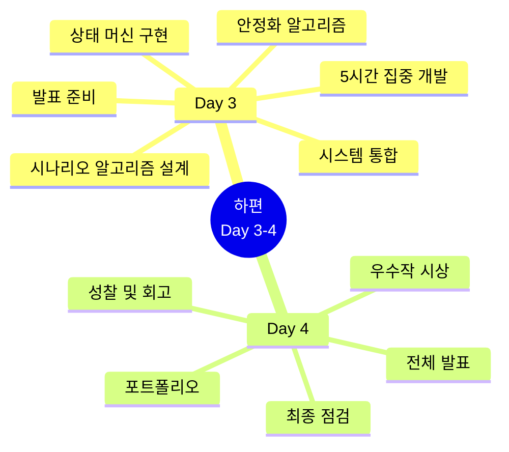

### 📊 하편 알고리즘 학습 구조

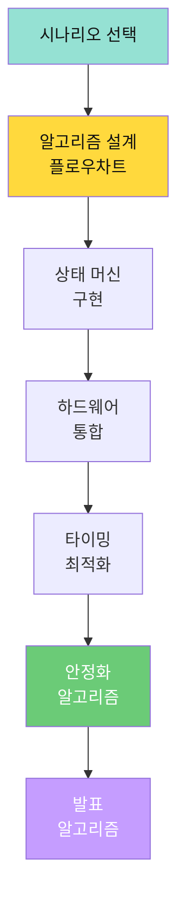

---

## 📙 Day 3: 창의적 시나리오 구현 (7.5시간)

### 🎯 Day 3 최종 목표
> **알고리즘 설계 → 시스템 통합 → 안정화 → 발표 준비**

### 🧠 Day 3 시나리오 알고리즘 맵

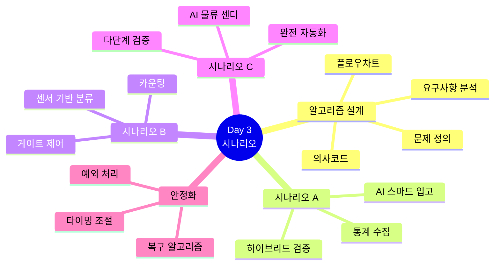

### 📊 Day 3 개발 프로세스 알고리즘

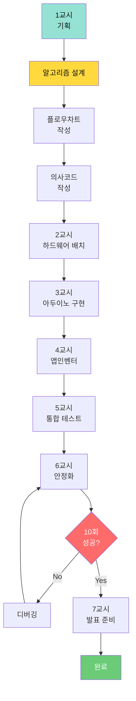

---

### 1교시 (1시간): 시나리오 알고리즘 설계

**목표**: 3가지 기본 시나리오 분석 및 알고리즘 설계

#### 시나리오 선택 의사결정 알고리즘

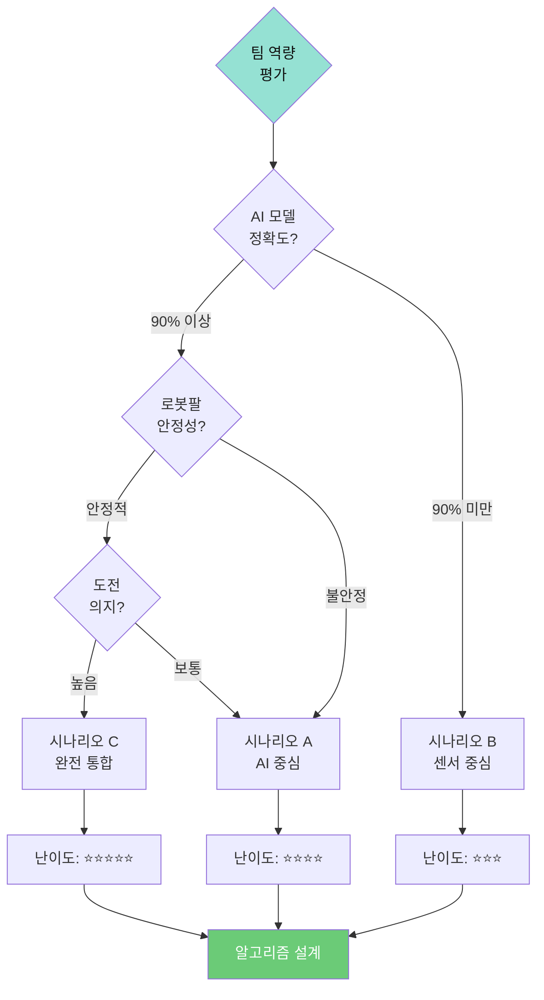

---

### 시나리오 A: AI 기반 스마트 입고 알고리즘

#### 전체 시스템 플로우

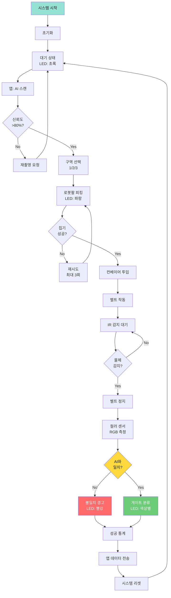

#### 상태 머신 알고리즘 (시나리오 A)

```
알고리즘: State_Machine_Scenario_A
━━━━━━━━━━━━━━━━━━━━━━━━━━━━━━━━━
상태 정의:
  - IDLE: 대기
  - SCANNING: AI 스캔 중
  - PICKING: 로봇팔 집기
  - TRANSPORTING: 이송 중
  - DETECTING: IR 감지 중
  - VERIFYING: 색상 검증
  - SORTING: 분류 중
  - ERROR: 오류 처리

전이 조건:
  IDLE → SCANNING: AI 명령 수신
  SCANNING → PICKING: 신뢰도 > 80%
  SCANNING → IDLE: 신뢰도 ≤ 80%
  PICKING → TRANSPORTING: 집기 성공
  PICKING → ERROR: 3회 실패
  TRANSPORTING → DETECTING: 3초 경과
  DETECTING → VERIFYING: IR 감지
  VERIFYING → SORTING: 색상 일치
  VERIFYING → ERROR: 색상 불일치
  SORTING → IDLE: 분류 완료
  ERROR → IDLE: 오류 처리 완료

프로세스:
  state ← IDLE
  retryCount ← 0
  
  WHILE true:
    SWITCH state:
      CASE IDLE:
        displayIcon(ICON_HOME)
        setLED(GREEN)
        IF command_received THEN
          state ← SCANNING
        END IF
      
      CASE SCANNING:
        displayIcon(ICON_SCAN)
        setLED(YELLOW)
        IF ai_result.confidence > 0.8 THEN
          aiColor ← ai_result.color
          state ← PICKING
          retryCount ← 0
        ELSE
          state ← IDLE
          sendToApp("LOW_CONFIDENCE")
        END IF
      
      CASE PICKING:
        displayIcon(ICON_PICK)
        setLED(BLUE)
        result ← pickFromZone(aiColor, zone)
        IF result == SUCCESS THEN
          state ← TRANSPORTING
          startTime ← millis()
        ELSE IF retryCount >= 3 THEN
          state ← ERROR
          errorType ← "PICK_FAILED"
        ELSE
          retryCount++
        END IF
      
      CASE TRANSPORTING:
        displayIcon(ICON_MOVE)
        beltOn(150)
        IF millis() - startTime >= 3000 THEN
          state ← DETECTING
        END IF
      
      CASE DETECTING:
        IF ir_sensor.detected() THEN
          beltStop()
          state ← VERIFYING
          delay(1000)
        END IF
      
      CASE VERIFYING:
        sensorColor ← colorSensor.read()
        IF sensorColor == aiColor THEN
          state ← SORTING
        ELSE
          state ← ERROR
          errorType ← "COLOR_MISMATCH"
        END IF
      
      CASE SORTING:
        displayIcon(ICON_DONE)
        sortByGate(aiColor)
        updateStatistics(aiColor, SUCCESS)
        sendToApp(statistics)
        state ← IDLE
      
      CASE ERROR:
        displayIcon(ICON_ERROR)
        setLED(RED)
        handleError(errorType)
        updateStatistics(aiColor, FAIL)
        sendToApp(error_report)
        delay(2000)
        state ← IDLE
    END SWITCH
    
    delay(10)  // 루프 딜레이
  END WHILE
━━━━━━━━━━━━━━━━━━━━━━━━━━━━━━━━━
```

**핵심 개념**:
- **상태 머신 (State Machine)**: 시스템 동작을 명확한 상태로 분리
- **전이 조건 (Transition)**: 상태 전환 규칙 명시
- **하이브리드 검증**: AI + 센서 이중 확인 (정확도 향상)

---

### 시나리오 B: 센서 기반 색상 분류 알고리즘

#### 간소화된 플로우

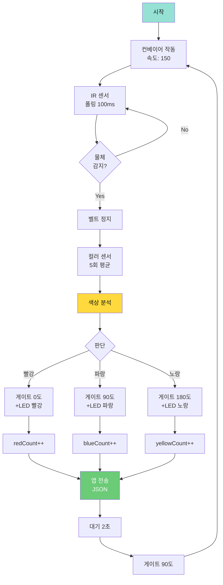

#### 색상 분류 알고리즘 (의사코드)

```
알고리즘: Classify_And_Sort
━━━━━━━━━━━━━━━━━━━━━━━━━━━━━━━━━
입력: rgb[3] (컬러 센서 RGB 값)

데이터 구조:
  statistics = {red: 0, blue: 0, yellow: 0, unknown: 0}

프로세스:
  1. 노이즈 필터링 (5회 평균)
     FOR i = 0 TO 4:
       samples[i] ← readColorSensor()
       delay(50)
     END FOR
     
     rgb_filtered ← median(samples)
  
  2. 색상 판단
     color ← detectColor(rgb_filtered)
  
  3. 게이트 제어 및 통계
     SWITCH color:
       CASE "RED":
         gateAngle ← 0
         ledColor ← RED
         statistics.red++
       
       CASE "BLUE":
         gateAngle ← 90
         ledColor ← BLUE
         statistics.blue++
       
       CASE "YELLOW":
         gateAngle ← 180
         ledColor ← YELLOW
         statistics.yellow++
       
       DEFAULT:
         gateAngle ← 90  // 중앙 (pass-through)
         statistics.unknown++
     END SWITCH
  
  4. 동작 실행
     gate.write(gateAngle)
     setLEDColor(ledColor)
     playTone(colorFrequency[color], 200)
  
  5. 데이터 전송
     json ← createJSON(statistics)
     bluetoothSend(json)
  
  6. 리셋
     delay(2000)
     gate.write(90)
     clearLED()

출력: 분류 완료 + 통계 업데이트
━━━━━━━━━━━━━━━━━━━━━━━━━━━━━━━━━
```

**핵심 개념**:
- **중앙값 필터 (Median Filter)**: 이동 평균보다 노이즈에 강함
- **게이트 제어**: 서보 각도로 물체 경로 변경
- **실시간 통계**: 각 색상 카운팅 (생산성 분석)

---

### 시나리오 C: AI 물류 센터 알고리즘

#### 최고급 통합 플로우

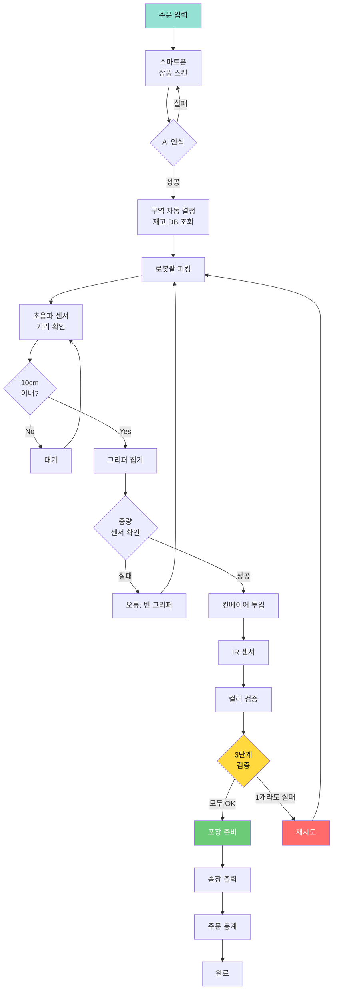

#### 3단계 검증 알고리즘

```
알고리즘: Three_Stage_Verification
━━━━━━━━━━━━━━━━━━━━━━━━━━━━━━━━━
입력:
  - expectedProduct: AI 인식 상품
  - zone: 재고 위치

데이터 구조:
  VerificationResult = {
    stage1: boolean,  // 초음파 위치 확인
    stage2: boolean,  // 중량 센서 확인
    stage3: boolean,  // 컬러 센서 확인
    overall: boolean
  }

프로세스:
  1. Stage 1: 위치 확인 (초음파)
     distance ← ultrasonic.read()
     IF distance <= 10cm THEN
       result.stage1 ← TRUE
     ELSE
       result.stage1 ← FALSE
       RETURN result
     END IF
  
  2. Stage 2: 중량 확인 (그리퍼 후)
     gripper.close()
     delay(500)
     weight ← weightSensor.read()
     
     expectedWeight ← productDB[expectedProduct].weight
     tolerance ← expectedWeight × 0.15  // 15% 허용
     
     IF abs(weight - expectedWeight) <= tolerance THEN
       result.stage2 ← TRUE
     ELSE
       result.stage2 ← FALSE
       gripper.open()
       RETURN result
     END IF
  
  3. Stage 3: 색상 확인 (컨베이어 도착 후)
     // 물체를 컨베이어에 투입
     placeOnConveyor()
     waitForIR()
     
     sensorColor ← colorSensor.read()
     expectedColor ← productDB[expectedProduct].color
     
     IF sensorColor == expectedColor THEN
       result.stage3 ← TRUE
     ELSE
       result.stage3 ← FALSE
       RETURN result
     END IF
  
  4. 최종 판정
     IF result.stage1 AND result.stage2 AND result.stage3 THEN
       result.overall ← TRUE
     ELSE
       result.overall ← FALSE
     END IF
     
     RETURN result

출력: VerificationResult (3단계 검증 결과)
━━━━━━━━━━━━━━━━━━━━━━━━━━━━━━━━━
```

**핵심 개념**:
- **다단계 검증**: 여러 센서로 교차 확인 (신뢰성)
- **재고 DB**: 상품별 특성 저장 (무게, 색상)
- **허용 오차 (Tolerance)**: 센서 오차 고려 (±15%)

---

### 2-5교시 (5시간): 집중 개발 알고리즘

#### 타임 슬롯 알고리즘

```mermaid
gantt
    title 5시간 집중 개발 타임라인
    dateFormat HH:mm
    axisFormat %H:%M
    
    section 하드웨어
    센서 배치 및 테스트: 09:00, 30m
    배선 정리 및 고정: 09:30, 30m
    
    section 소프트웨어
    상태 머신 구현: 10:00, 60m
    센서 통합 코딩: 11:00, 30m
    오류 처리 추가: 11:30, 30m
    
    section 앱인벤터
    UI 디자인: 12:00, 30m
    블록 코딩: 12:30, 45m
    AI 연동: 13:15, 15m
    
    section 통합
    블루투스 통합: 13:30, 30m
    전체 테스트: 14:00, 30m
```

#### 디버깅 알고리즘

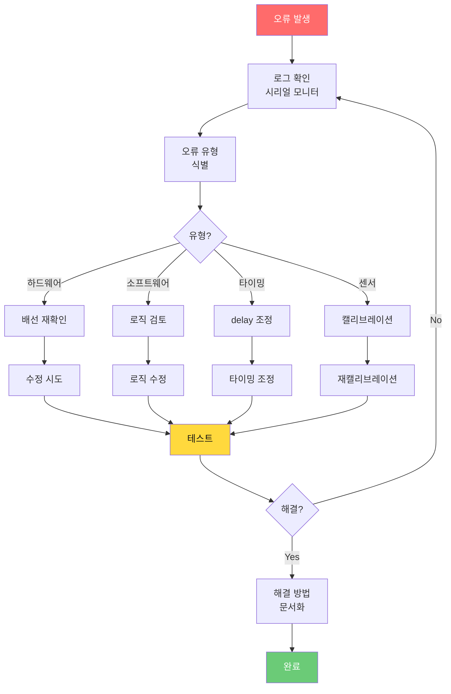

---

### 6교시 (1시간): 시스템 안정화 알고리즘

**목표**: 10회 연속 성공 달성

#### 안정화 전략 알고리즘

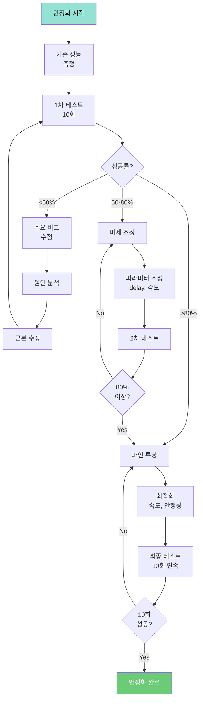

#### 예외 처리 알고리즘

```
알고리즘: Exception_Handler
━━━━━━━━━━━━━━━━━━━━━━━━━━━━━━━━━
입력: exception (예외 객체)

예외 유형:
  - HARDWARE_FAULT: 하드웨어 오류
  - SENSOR_TIMEOUT: 센서 응답 없음
  - COMMUNICATION_LOST: 통신 끊김
  - POSITION_ERROR: 위치 오차
  - UNKNOWN: 미정의 오류

프로세스:
  1. 예외 유형 분류
     SWITCH exception.type:
       CASE HARDWARE_FAULT:
         action ← EMERGENCY_STOP
       
       CASE SENSOR_TIMEOUT:
         action ← RETRY_WITH_DELAY
       
       CASE COMMUNICATION_LOST:
         action ← RECONNECT
       
       CASE POSITION_ERROR:
         action ← RECALIBRATE
       
       DEFAULT:
         action ← SAFE_MODE
     END SWITCH
  
  2. 액션 실행
     SWITCH action:
       CASE EMERGENCY_STOP:
         stopAllMotors()
         displayError("EMERGENCY_STOP")
         waitForReset()
         RETURN HALTED
       
       CASE RETRY_WITH_DELAY:
         retryCount++
         IF retryCount < MAX_RETRY THEN
           delay(RETRY_DELAY × retryCount)  // 지수 백오프
           RETURN RETRY
         ELSE
           RETURN FAIL
         END IF
       
       CASE RECONNECT:
         closeConnection()
         delay(1000)
         IF reconnect() == SUCCESS THEN
           RETURN RECOVERED
         ELSE
           RETURN FAIL
         END IF
       
       CASE RECALIBRATE:
         goHome()
         loadCalibration()
         RETURN RECOVERED
       
       CASE SAFE_MODE:
         stopAllMotors()
         goHome()
         displayWarning("SAFE_MODE")
         RETURN SAFE
     END SWITCH
  
  3. 로그 기록
     timestamp ← getCurrentTime()
     logEntry ← {
       time: timestamp,
       exception: exception.type,
       action: action,
       result: result
     }
     logToEEPROM(logEntry)
     sendNotification(admin, logEntry)

출력: 예외 처리 결과 (RETRY, RECOVERED, FAIL, SAFE, HALTED)
━━━━━━━━━━━━━━━━━━━━━━━━━━━━━━━━━
```

**핵심 개념**:
- **예외 처리 (Exception Handling)**: 오류 상황 대응
- **지수 백오프 (Exponential Backoff)**: 재시도 간격 증가 (과부하 방지)
- **안전 모드 (Safe Mode)**: 최소 동작 상태 (추가 손상 방지)

---

### 7교시 (30분): 발표 자료 준비 알고리즘

#### 발표 구조 최적화

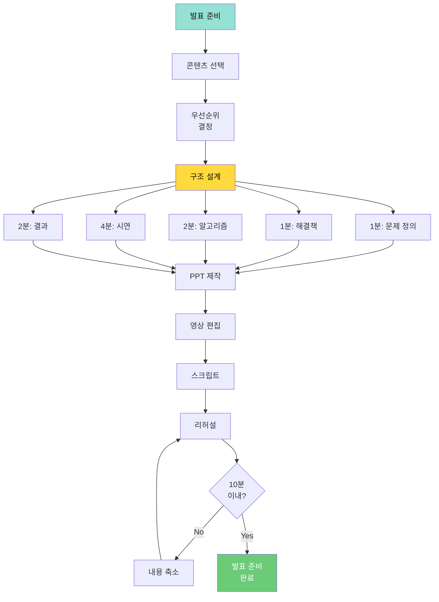

**결과물**: ✅ **발표 자료 (PPT + 영상 + 스크립트)**

---

## 💬 Day 3 Q&A (알고리즘 중심)

### Q1. 상태 머신과 단순 if문의 차이는?

**A1**: 확장성과 유지보수성이 다릅니다.

```
단순 if문 (비추천):
━━━━━━━━━━━━━━━━━━━━━━━━━━━━━━━━━
IF command == "pick" THEN
  pickObject()
ELSE IF command == "place" THEN
  placeObject()
ELSE IF command == "home" THEN
  goHome()
END IF

문제점:
  - 상태 전이 로직이 복잡해짐
  - 타이밍 제어 어려움
  - 디버깅 어려움
  - 확장 시 if문 계속 추가

상태 머신 (권장):
━━━━━━━━━━━━━━━━━━━━━━━━━━━━━━━━━
SWITCH currentState:
  CASE IDLE:
    IF command_received THEN
      currentState ← NEXT_STATE
    END IF
  
  CASE PICKING:
    executePickingSequence()
    IF completed THEN
      currentState ← IDLE
    END IF
END SWITCH

장점:
  - 명확한 상태 전이
  - 타이밍 제어 용이
  - 디버깅 쉬움 (현재 상태 확인)
  - 확장 용이 (새 상태 추가)
```

---

### Q2. 타이밍 문제는 어떻게 해결하나요?

**A2**: `millis()` 기반 비차단 지연을 사용합니다.

```
BAD (차단 방식):
━━━━━━━━━━━━━━━━━━━━━━━━━━━━━━━━━
pickObject()
delay(3000)  // 3초 동안 아무것도 못함
checkSensor()

문제점: 다른 작업 불가 (블로킹)

GOOD (비차단 방식):
━━━━━━━━━━━━━━━━━━━━━━━━━━━━━━━━━
state ← PICKING
startTime ← millis()
started ← FALSE

WHILE true:
  SWITCH state:
    CASE PICKING:
      IF NOT started THEN
        pickObject()
        started ← TRUE
      ELSE IF millis() - startTime >= 3000 THEN
        state ← CHECKING
      END IF
      
      // 이 사이에 다른 작업 가능 (센서 읽기, 통신 등)
    
    CASE CHECKING:
      checkSensor()
      state ← IDLE
  END SWITCH
END WHILE

장점: 비차단 (non-blocking)
```

---

### Q3. 10회 연속 성공이 어려운 이유는?

**A3**: 누적 오차와 환경 변화 때문입니다.

**안정화 체크리스트**:

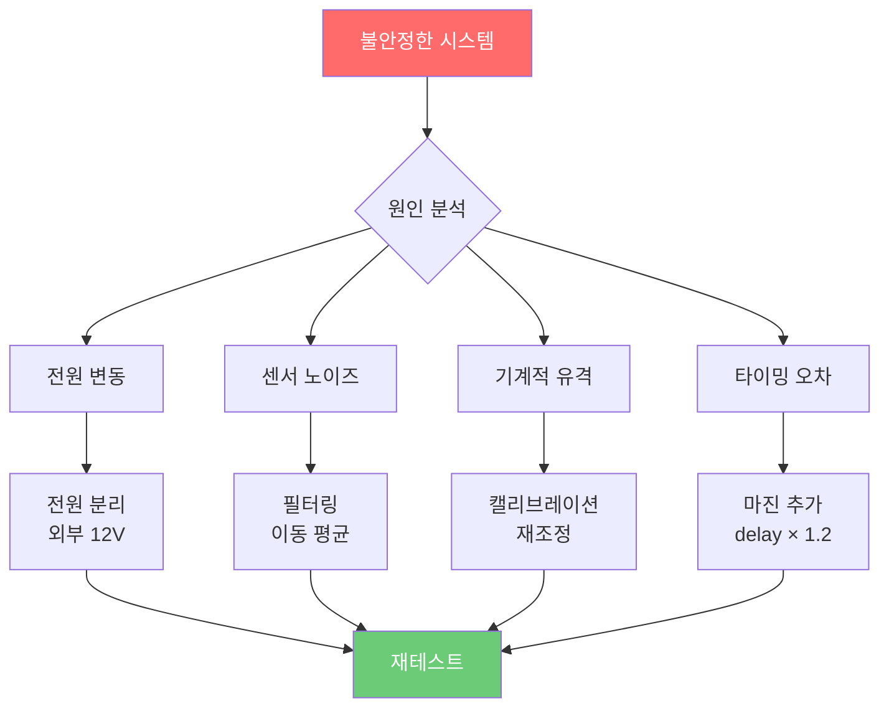

---

## 📕 Day 4: 발표 및 시연 + 성찰 (7시간)

### 🎯 Day 4 최종 목표
> **완벽한 발표 → 성과 공유 → 성찰 → 다음 단계 계획**

### 🧠 Day 4 발표 알고리즘

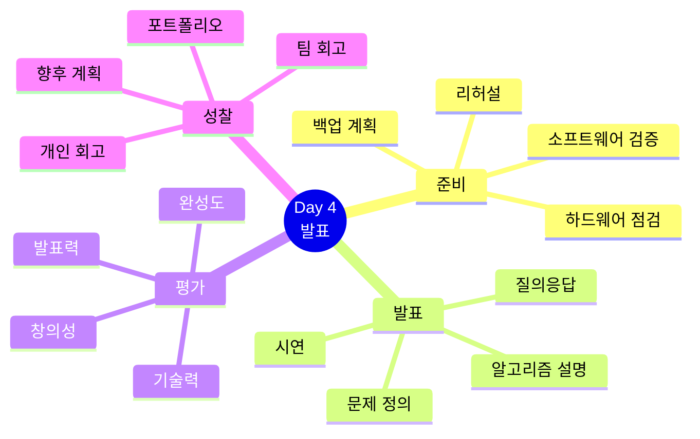

### 📊 발표 프로세스 알고리즘

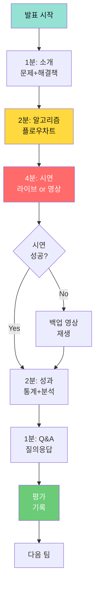

---

### 1교시 (1시간): 최종 점검 알고리즘

**목표**: 발표 준비 완성

#### 점검 체크리스트 알고리즘

```
알고리즘: Final_Checkup
━━━━━━━━━━━━━━━━━━━━━━━━━━━━━━━━━
입력: system (전체 시스템)

프로세스:
  1. 하드웨어 검증
     components ← [robot, conveyor, sensors, bluetooth]
     FOR each component IN components:
       result ← testComponent(component)
       IF result == FAIL THEN
         repairOrReplace(component)
       END IF
     END FOR
  
  2. 소프트웨어 검증
     result ← runTestSuite()
     IF result.failCount > 0 THEN
       FOR each test IN result.failedTests:
         fixBug(test)
       END FOR
       runTestSuite()  // 재테스트
     END IF
  
  3. 통신 검증
     IF NOT testBluetoothConnection() THEN
       reconnect()
       IF NOT testBluetoothConnection() THEN
         ALERT "COMMUNICATION_ISSUE"
       END IF
     END IF
  
  4. 시연 리허설 (3회)
     successCount ← 0
     FOR i = 1 TO 3:
       result ← fullSystemTest()
       IF result == SUCCESS THEN
         successCount++
       ELSE
         logFailure(result)
       END IF
     END FOR
     
     IF successCount < 2 THEN
       RETURN NOT_READY
     END IF
  
  5. 백업 준비
     IF demoVideo NOT exists THEN
       recordDemoVideo()
     END IF
     
     // 백업 파일 (다중 장치)
     copyFiles([ppt, video, code], [laptop, usb, cloud])
  
  6. 발표자 준비
     rehearsePresentation()
     timerCheck()  // 10분 이내 확인

출력: READY / NOT_READY
━━━━━━━━━━━━━━━━━━━━━━━━━━━━━━━━━
```

---

### 2-5교시 (4시간): 팀별 발표 알고리즘

#### 평가 알고리즘

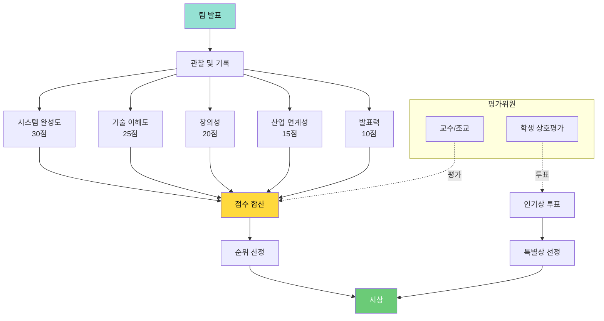

#### 발표 스코어링 알고리즘

```
알고리즘: Scoring_Algorithm
━━━━━━━━━━━━━━━━━━━━━━━━━━━━━━━━━
입력:
  - presentation: 발표 데이터
  - evaluators: 평가위원 리스트

프로세스:
  1. 시스템 완성도 (30점)
     score1 ← 0
     IF system.stability >= 80% THEN score1 += 10
     IF system.integration == COMPLETE THEN score1 += 10
     IF system.speed >= target THEN score1 += 10
  
  2. 기술 이해도 (25점)
     score2 ← 0
     IF explanation.sensors == EXCELLENT THEN score2 += 10
     IF explanation.algorithm == EXCELLENT THEN score2 += 10
     IF problemSolving == EXCELLENT THEN score2 += 5
  
  3. 창의성 (20점)
     score3 ← 0
     IF idea.originality == HIGH THEN score3 += 10
     IF improvement == SIGNIFICANT THEN score3 += 10
  
  4. 산업 연계성 (15점)
     score4 ← 0
     IF applicability == HIGH THEN score4 += 10
     IF benchmarking == EXCELLENT THEN score4 += 5
  
  5. 발표력 (10점)
     score5 ← 0
     IF delivery == CLEAR THEN score5 += 5
     IF visuals == EXCELLENT THEN score5 += 3
     IF qa == EXCELLENT THEN score5 += 2
  
  6. 최종 점수 계산
     totalScore ← score1 + score2 + score3 + score4 + score5
     
     // 가중 평균 (교수 70%, 학생 30%)
     professorAvg ← average(professorScores)
     studentAvg ← average(studentScores)
     finalScore ← professorAvg × 0.7 + studentAvg × 0.3

출력: finalScore (0-100점)
━━━━━━━━━━━━━━━━━━━━━━━━━━━━━━━━━
```

---

### 6교시 (1시간): 우수작 시상 알고리즘

#### 시상 선정 알고리즘

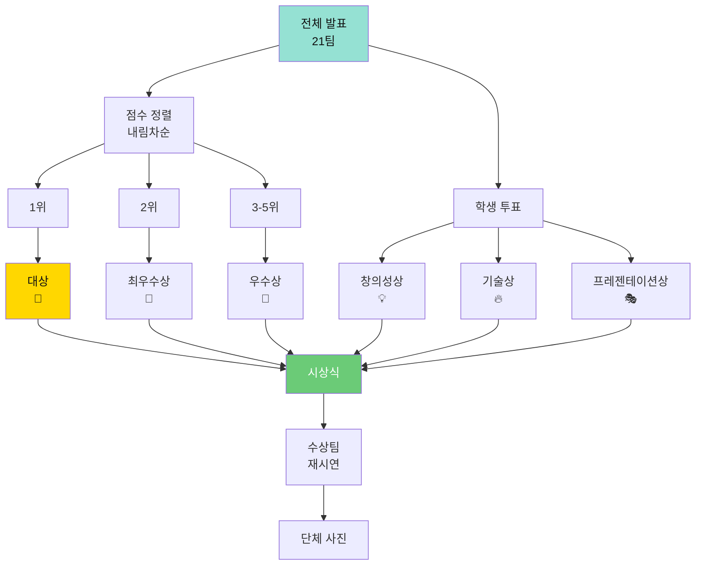

---

### 7교시 (1시간): 전체 성찰 알고리즘

#### 성찰 프로세스

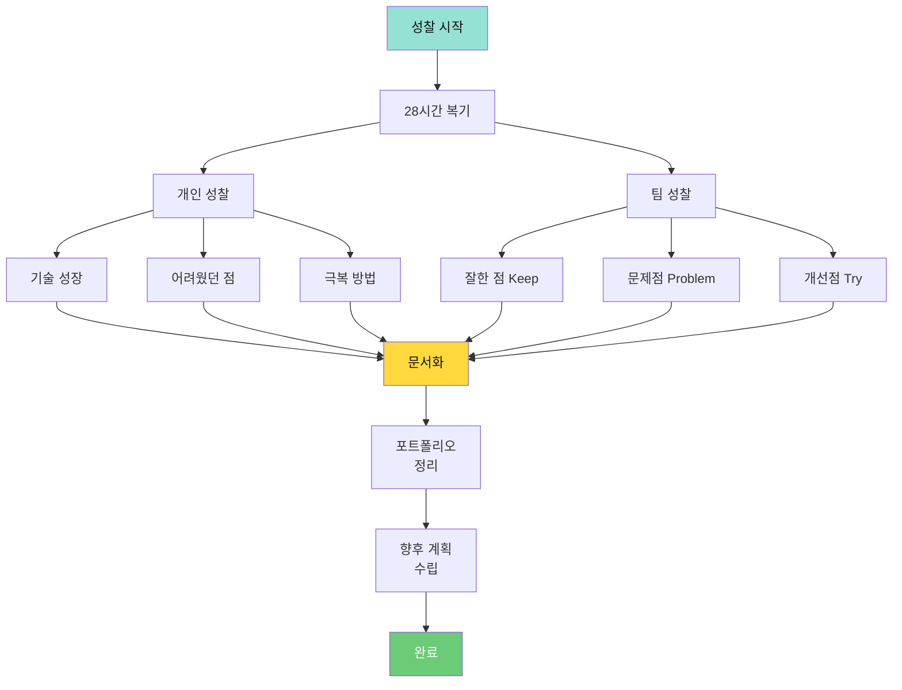

#### 성장 측정 알고리즘

```
알고리즘: Measure_Growth
━━━━━━━━━━━━━━━━━━━━━━━━━━━━━━━━━
입력:
  - day1Skills: Day 1 시작 시 역량
  - day4Skills: Day 4 종료 시 역량

데이터 구조:
  domains ← ["hardware", "software", "AI", "integration"]

프로세스:
  1. 영역별 성장도 계산
     FOR each domain IN domains:
       growth[domain] ← (day4Skills[domain] - day1Skills[domain]) / 
                         day1Skills[domain] × 100
     END FOR
  
  2. 종합 성장률
     avgGrowth ← average(growth)
  
  3. 등급 부여
     IF avgGrowth >= 150% THEN
       grade ← "EXCELLENT"
     ELSE IF avgGrowth >= 100% THEN
       grade ← "OUTSTANDING"
     ELSE IF avgGrowth >= 50% THEN
       grade ← "GOOD"
     ELSE
       grade ← "FAIR"
     END IF
  
  4. 강점/약점 분석
     strongestDomain ← argmax(growth)
     weakestDomain ← argmin(growth)
  
  5. 향후 학습 추천
     recommendations ← []
     IF weakestDomain == "hardware" THEN
       recommendations.add("전자공학 기초", "회로 설계")
     ELSE IF weakestDomain == "software" THEN
       recommendations.add("알고리즘 심화", "자료구조")
     ELSE IF weakestDomain == "AI" THEN
       recommendations.add("머신러닝 기초", "딥러닝")
     ELSE IF weakestDomain == "integration" THEN
       recommendations.add("시스템 설계", "프로젝트 관리")
     END IF

출력:
  - 성장 리포트
  - 학습 추천
━━━━━━━━━━━━━━━━━━━━━━━━━━━━━━━━━
```

---

## 📊 핵심 알고리즘 총정리

### 1. 제어 알고리즘
- **동기화 이동**: 선형 보간, 4축 동시 제어
- **집기/놓기 시퀀스**: 단계별 타이밍 제어

### 2. 센서 알고리즘
- **이동 평균 필터**: 노이즈 제거
- **중앙값 필터**: 이상치 제거
- **컬러 분석**: 유클리드 거리

### 3. 상태 머신 알고리즘
- **상태 정의**: IDLE, SCANNING, PICKING, VERIFYING 등
- **전이 조건**: 명확한 상태 전환 규칙
- **타이밍 제어**: millis() 기반 비차단

### 4. 통신 알고리즘
- **프로토콜 파싱**: 명령어 해석
- **JSON 처리**: 구조화된 데이터 전송

### 5. AI 알고리즘
- **데이터 수집**: 다양성 확보 (각도, 조명, 거리)
- **실시간 추론**: 신뢰도 임계값 (80%)

### 6. 통합 알고리즘
- **하이브리드 검증**: AI + 센서
- **3단계 검증**: 위치 + 중량 + 색상

### 7. 안정화 알고리즘
- **예외 처리**: 5가지 예외 유형 대응
- **지수 백오프**: 재시도 간격 증가

### 8. 평가 알고리즘
- **스코어링**: 5개 항목 가중 평균
- **성장 측정**: 4개 영역 성장률

---

## 🎓 알고리즘 학습 성과

### 학습한 핵심 알고리즘 목록 (19개)

| 분류 | 알고리즘 | 난이도 | 활용도 |
|------|----------|--------|--------|
| **제어** | 동기화 이동 | ⭐⭐⭐ | ⭐⭐⭐⭐⭐ |
| | PWM 제어 | ⭐⭐ | ⭐⭐⭐⭐ |
| **센서** | 이동 평균 필터 | ⭐⭐ | ⭐⭐⭐⭐⭐ |
| | 중앙값 필터 | ⭐⭐ | ⭐⭐⭐⭐ |
| | 컬러 분석 | ⭐⭐⭐ | ⭐⭐⭐⭐ |
| **통신** | 프로토콜 파싱 | ⭐⭐ | ⭐⭐⭐⭐⭐ |
| | JSON 처리 | ⭐⭐ | ⭐⭐⭐⭐ |
| **저장** | EEPROM 알고리즘 | ⭐⭐⭐ | ⭐⭐⭐⭐ |
| | 체크섬 검증 | ⭐⭐ | ⭐⭐⭐⭐ |
| **AI** | 데이터 수집 전략 | ⭐⭐ | ⭐⭐⭐⭐⭐ |
| | 실시간 추론 | ⭐⭐⭐ | ⭐⭐⭐⭐ |
| **통합** | 상태 머신 | ⭐⭐⭐⭐ | ⭐⭐⭐⭐⭐ |
| | 예외 처리 | ⭐⭐⭐ | ⭐⭐⭐⭐⭐ |
| | 하이브리드 검증 | ⭐⭐⭐ | ⭐⭐⭐⭐ |
| | 3단계 검증 | ⭐⭐⭐⭐ | ⭐⭐⭐ |
| **최적화** | 안정화 전략 | ⭐⭐⭐ | ⭐⭐⭐⭐ |
| | 디버깅 | ⭐⭐⭐ | ⭐⭐⭐⭐⭐ |
| **평가** | 스코어링 | ⭐⭐⭐ | ⭐⭐⭐ |
| | 성장 측정 | ⭐⭐ | ⭐⭐⭐ |

---

## 🌟 교육 완료 메시지

```
축하합니다! 28시간의 알고리즘 여정을 완주했습니다! 🎉

여러분은 이제:
✅ 19가지 핵심 알고리즘을 설계하고 구현할 수 있습니다
✅ 복잡한 시스템을 상태 머신으로 모델링할 수 있습니다
✅ 하드웨어와 소프트웨어를 통합할 수 있습니다
✅ AI와 센서를 융합한 하이브리드 시스템을 만들 수 있습니다
✅ 문제를 알고리즘으로 분해하고 해결할 수 있습니다

더 중요한 것은,
여러분이 "알고리즘적 사고(Algorithmic Thinking)"를 
체득했다는 것입니다.

이 능력은 스마트 팩토리뿐만 아니라,
모든 엔지니어링 분야에서 빛을 발할 것입니다.

10년 후, 여러분은 이 알고리즘으로
세상을 바꾸는 엔지니어가 되어 있을 것입니다.

감사합니다! 🚀
```

---

## 📚 추가 학습 자료

### 알고리즘 심화 학습

#### 추천 서적
- "Introduction to Algorithms" (CLRS)
- "알고리즘 문제 해결 전략" (구종만)
- "Real-Time Systems" (Jane W. S. Liu)

#### 온라인 코스
- [Coursera] Algorithms Specialization
- [edX] Data Structures and Algorithms
- [MIT OCW] Introduction to Algorithms

### 프로젝트 확장 아이디어

#### Level 2 (중급)
1. **다중 로봇팔 협업** - 작업 스케줄링 알고리즘 (⭐⭐⭐⭐)
2. **비전 카메라 통합** - 객체 추적 알고리즘 (⭐⭐⭐⭐⭐)
3. **재고 관리 시스템** - 데이터베이스 연동 (⭐⭐⭐)

#### Level 3 (고급)
1. **강화학습 기반 최적화** - Q-Learning (⭐⭐⭐⭐⭐)
2. **경로 계획 알고리즘** - A* 알고리즘 (⭐⭐⭐⭐⭐)
3. **예측 유지보수** - 시계열 분석 (⭐⭐⭐⭐)

---

## 📐 알고리즘 설계 가이드

### 알고리즘 설계 5단계

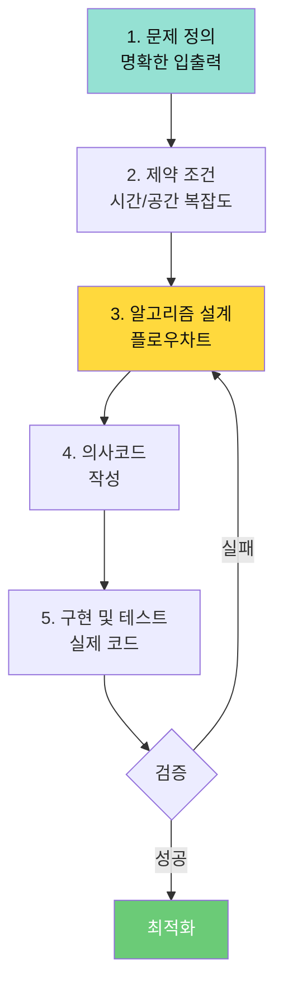

### 좋은 알고리즘의 조건

```
CORRECT: 정확성
  - 모든 입력에 대해 올바른 출력
  - 경계 조건 처리
  - 예외 상황 대응

EFFICIENT: 효율성
  - 시간 복잡도 최소화
  - 공간 복잡도 최소화
  - 하드웨어 자원 고려

READABLE: 가독성
  - 명확한 변수명
  - 적절한 주석
  - 일관된 스타일

MAINTAINABLE: 유지보수성
  - 모듈화
  - 재사용 가능
  - 확장 가능

ROBUST: 견고성
  - 오류 처리
  - 복구 메커니즘
  - 안전장치
```

---

## 🎓 수료 인증

### 알고리즘 역량 인증서

```
━━━━━━━━━━━━━━━━━━━━━━━━━━━━━━━━━━
        스마트 팩토리 알고리즘 교육
           28시간 수료 인증
━━━━━━━━━━━━━━━━━━━━━━━━━━━━━━━━━━

이름: _______________
팀명: _______________

인증 내용:
✅ 제어 알고리즘 설계 및 구현
✅ 센서 데이터 처리 알고리즘
✅ 상태 머신 알고리즘
✅ 통신 프로토콜 알고리즘
✅ AI 통합 알고리즘
✅ 시스템 통합 및 최적화

최종 프로젝트:
  시나리오: _______________
  성공률: ____%
  평가 점수: _____점

날짜: 2026년 1월 22일
━━━━━━━━━━━━━━━━━━━━━━━━━━━━━━━━━━
```

---

## 📖 상/하편 연계 학습 맵

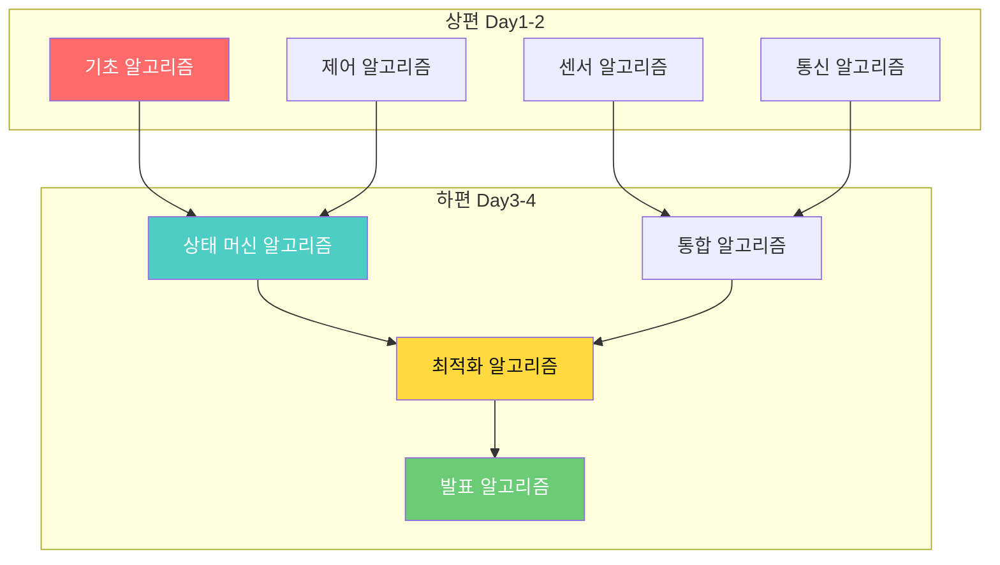

---

**Last Updated**: 2026-01-22  
**Version**: 2.0 (알고리즘 중심, 소스코드 제거)  
**제작**: Smart Factory Education Team  
**교구재**: [BP Lab](https://bplab.kr/order/?idx=178)

**상편과 함께 학습하세요!** 📘📙
