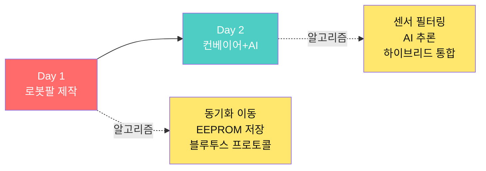
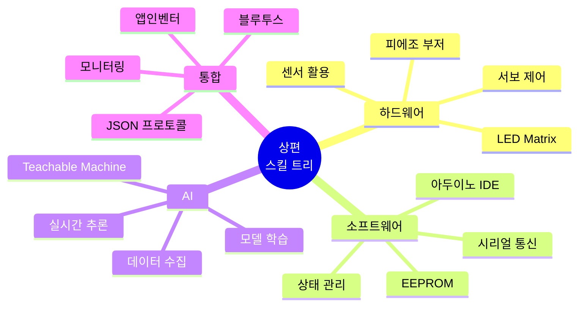
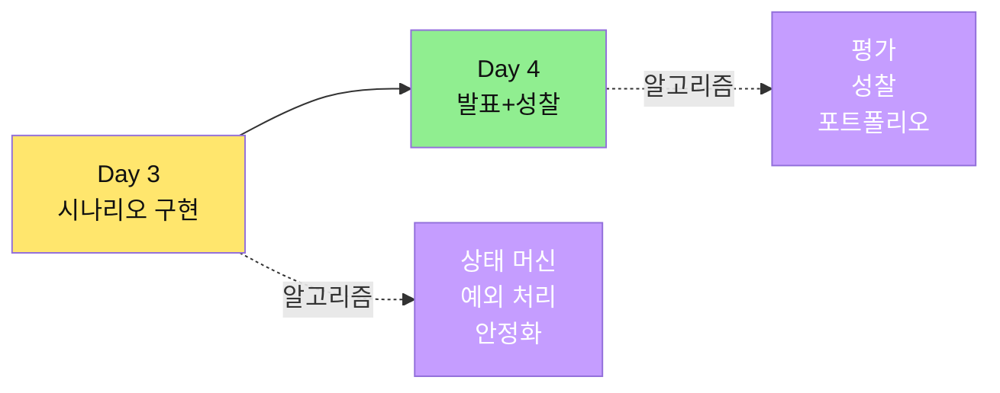
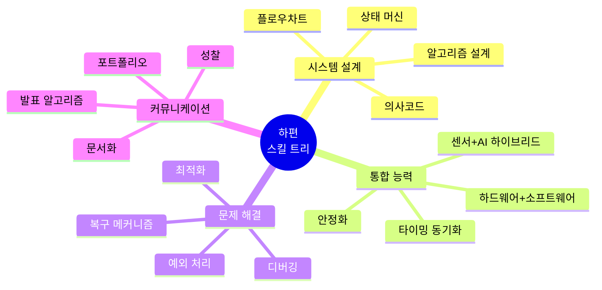
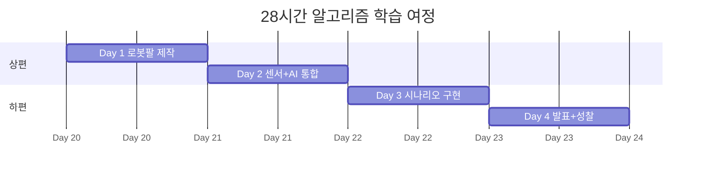
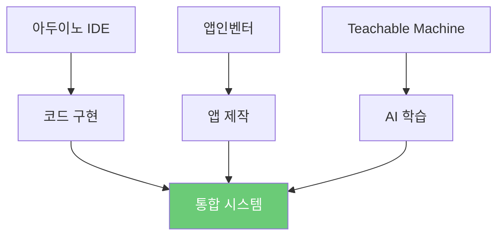

# 📚 스마트 물류 팩토리 28차시 교육 커리큘럼

## 🎯 알고리즘 중심 교육 과정

> **"알고리즘으로 생각하고, 코드로 구현하고, 하드웨어로 완성한다"**

---

## 📖 커리큘럼 구성

### 🔹 상편: Day 1-2 (기초 제작 + 센서/AI 통합)

**파일**: [`교육_커리큘럼_상편_Day1-2.md`](./교육_커리큘럼_상편_Day1-2.md)



#### 📌 상편 주요 내용

| 챕터 | 내용 | 핵심 알고리즘 |
|------|------|--------------|
| **Day 1 - 1교시** | 로봇팔 조립 | 순차적 조립 알고리즘 |
| **Day 1 - 2교시** | 피지컬 컴퓨팅 | PWM 제어 알고리즘 |
| **Day 1 - 3교시** | 4축 동기화 | 동기화 이동 알고리즘 |
| **Day 1 - 4교시** | 블루투스 통신 | 프로토콜 파싱 알고리즘 |
| **Day 1 - 5교시** | 이중 모니터링 | LED Matrix + 앱 통합 |
| **Day 1 - 6교시** | EEPROM 저장 | 체크섬 검증 알고리즘 |
| **Day 2 - 1교시** | 컨베이어 제어 | DC 모터 제어 알고리즘 |
| **Day 2 - 2교시** | 센서 통합 | 이동 평균 필터 |
| **Day 2 - 4-5교시** | AI 학습 | 데이터 수집 전략 |
| **Day 2 - 6교시** | AI + 로봇팔 통합 | 3구역 매핑 알고리즘 |

#### 🎓 상편에서 배우는 핵심 스킬



---

### 🔸 하편: Day 3-4 (시나리오 구현 + 발표)

**파일**: [`교육_커리큘럼_하편_Day3-4.md`](./교육_커리큘럼_하편_Day3-4.md)



#### 📌 하편 주요 내용

| 챕터 | 내용 | 핵심 알고리즘 |
|------|------|--------------|
| **Day 3 - 1교시** | 시나리오 설계 | 의사결정 알고리즘 |
| **Day 3 - 시나리오 A** | AI 스마트 입고 | 상태 머신 알고리즘 |
| **Day 3 - 시나리오 B** | 센서 기반 분류 | 색상 판단 알고리즘 |
| **Day 3 - 시나리오 C** | AI 물류 센터 | 다단계 검증 알고리즘 |
| **Day 3 - 2-5교시** | 집중 개발 | 디버깅 알고리즘 |
| **Day 3 - 6교시** | 안정화 | 예외 처리 알고리즘 |
| **Day 3 - 7교시** | 발표 준비 | 발표 구조 최적화 |
| **Day 4 - 1교시** | 최종 점검 | 체크리스트 알고리즘 |
| **Day 4 - 2-5교시** | 팀별 발표 | 평가 알고리즘 |
| **Day 4 - 6교시** | 시상 | 시상 선정 알고리즘 |
| **Day 4 - 7교시** | 성찰 | 성장 측정 알고리즘 |

#### 🎓 하편에서 배우는 핵심 스킬



---

## 🗺️ 학습 로드맵

### 28시간 전체 여정



### 난이도 그래프


---

## 📊 알고리즘 커버리지

### 배우게 될 알고리즘 목록

| 분류 | 알고리즘 | 난이도 | 파일 |
|------|----------|--------|------|
| **제어** | 동기화 이동 알고리즘 | ⭐⭐⭐ | 상편 |
| | PWM 제어 알고리즘 | ⭐⭐ | 상편 |
| | DC 모터 제어 알고리즘 | ⭐⭐ | 상편 |
| **센서** | 이동 평균 필터 | ⭐⭐ | 상편 |
| | 컬러 RGB 분석 알고리즘 | ⭐⭐⭐ | 상편 |
| | 중앙값 필터 | ⭐⭐ | 하편 |
| **통신** | 프로토콜 파싱 알고리즘 | ⭐⭐ | 상편 |
| | JSON 처리 알고리즘 | ⭐⭐ | 상편 |
| **저장** | EEPROM 저장/복구 알고리즘 | ⭐⭐⭐ | 상편 |
| | 체크섬 검증 알고리즘 | ⭐⭐ | 상편 |
| **AI** | 데이터 수집 전략 알고리즘 | ⭐⭐ | 상편 |
| | 실시간 추론 알고리즘 | ⭐⭐⭐ | 상편 |
| **통합** | 상태 머신 알고리즘 | ⭐⭐⭐⭐ | 하편 |
| | 예외 처리 알고리즘 | ⭐⭐⭐ | 하편 |
| | 디버깅 알고리즘 | ⭐⭐⭐ | 하편 |
| **최적화** | 파라미터 튜닝 알고리즘 | ⭐⭐⭐⭐ | 하편 |
| | 안정화 알고리즘 | ⭐⭐⭐ | 하편 |
| **평가** | 평가 알고리즘 | ⭐⭐⭐ | 하편 |
| | 성장 측정 알고리즘 | ⭐⭐ | 하편 |

**총 19개 핵심 알고리즘 습득**

---

## 🎯 학습 목표

### 📘 상편 학습 목표

```
✅ 로봇팔 4축 제어 알고리즘을 설계하고 구현할 수 있다
✅ 센서 데이터를 필터링하고 분석하는 알고리즘을 작성할 수 있다
✅ 블루투스 통신 프로토콜을 설계하고 구현할 수 있다
✅ EEPROM에 데이터를 안전하게 저장하고 복구할 수 있다
✅ AI 모델을 학습시키고 실시간 추론 시스템을 구축할 수 있다
✅ 센서와 AI를 하이브리드로 통합할 수 있다
```

### 📙 하편 학습 목표

```
✅ 복잡한 시스템을 상태 머신 알고리즘으로 모델링할 수 있다
✅ 창의적인 시나리오를 알고리즘으로 설계할 수 있다
✅ 예외 상황을 처리하는 견고한 알고리즘을 구현할 수 있다
✅ 시스템을 안정화하고 최적화할 수 있다
✅ 디버깅 알고리즘을 활용하여 문제를 해결할 수 있다
✅ 알고리즘 중심으로 발표하고 성찰할 수 있다
```

---

## 🛠️ 교구재 및 환경

### 필수 교구재

| 구분 | 품목 | 상편 활용 | 하편 활용 |
|------|------|-----------|-----------|
| **로봇팔** | BP Lab AI 4축 로봇팔 | ✅✅✅ | ✅✅✅ |
| **컨베이어** | DC 모터 + 벨트 키트 | ✅✅ | ✅✅✅ |
| **센서** | IR, 초음파, TCS3200 | ✅✅ | ✅✅✅ |
| **모니터링** | 8x8 LED Matrix, 부저 | ✅✅ | ✅✅ |
| **통신** | HC-06 블루투스 | ✅✅ | ✅✅ |
| **전원** | 12V 어댑터 | ✅ | ✅ |

### 소프트웨어 환경



---

## 📚 학습 자료 활용법

### 1단계: 상편 읽기 (Day 1-2)

```bash
# 1. 상편 파일 열기
open 교육_커리큘럼_상편_Day1-2.md

# 2. Day 1 알고리즘 학습
- 조립 알고리즘
- 동기화 이동 알고리즘
- 블루투스 프로토콜 알고리즘
- EEPROM 저장 알고리즘

# 3. Day 2 알고리즘 학습
- DC 모터 제어 알고리즘
- 센서 필터링 알고리즘
- AI 데이터 수집 알고리즘
- 하이브리드 통합 알고리즘
```

### 2단계: 하편 읽기 (Day 3-4)

```bash
# 1. 하편 파일 열기
open 교육_커리큘럼_하편_Day3-4.md

# 2. Day 3 알고리즘 학습
- 상태 머신 알고리즘
- 시나리오 A/B/C 알고리즘
- 디버깅 알고리즘
- 안정화 알고리즘

# 3. Day 4 알고리즘 학습
- 발표 최적화 알고리즘
- 평가 알고리즘
- 성장 측정 알고리즘
```

### 3단계: 알고리즘 설계 연습

```
1. 문제 정의
   └─ 명확한 입력/출력 정의

2. 플로우차트 작성
   └─ Mermaid 다이어그램 활용

3. 의사코드 작성
   └─ 알고리즘 로직 검증

4. 코드 구현
   └─ 아두이노 IDE에서 구현

5. 테스트 및 디버깅
   └─ 디버깅 알고리즘 적용
```

---

## 🎓 수료 기준

### 최소 수료 요건

```
✅ 28시간 교육 이수 (출석률 80% 이상)
✅ Day 1-2 실습 완료
✅ Day 3 시나리오 구현 완료
✅ Day 4 발표 및 시연
✅ 10가지 이상 알고리즘 이해
```

### 우수 수료 기준

```
🌟 시스템 안정화 (10회 연속 성공)
🌟 창의적 알고리즘 설계
🌟 발표 점수 80점 이상
🌟 15가지 이상 알고리즘 마스터
🌟 포트폴리오 제출
```

---

## 💡 학습 팁

### 📌 알고리즘 학습 전략


### 🔥 빠른 습득을 위한 꿀팁

1. **알고리즘부터 이해하기**
   - 코드보다 알고리즘 로직을 먼저 파악
   - "왜 이렇게 동작하는가?"를 항상 질문

2. **플로우차트 적극 활용**
   - 복잡한 로직은 반드시 시각화
   - Mermaid 문법 익히기

3. **의사코드 작성 습관**
   - 코딩 전에 의사코드로 검증
   - 변수명, 조건문 명확히 정의

4. **단계별 테스트**
   - 전체를 한 번에 구현하지 말 것
   - 함수 단위로 테스트

5. **디버깅 로그 활용**
   - `Serial.println()` 적극 사용
   - 상태 변화를 모니터링

---

## 🌐 추가 리소스

### 공식 문서

- [아두이노 공식 문서](https://www.arduino.cc/reference/en/)
- [앱인벤터 가이드](http://ai2.appinventor.mit.edu/reference/)
- [Teachable Machine](https://teachablemachine.withgoogle.com/)

### 커뮤니티

- [아두이노 포럼](https://forum.arduino.cc/)
- [MIT App Inventor 포럼](https://community.appinventor.mit.edu/)

### 교구재 구매

- [BP Lab AI 로봇팔](https://bplab.kr/order/?idx=178)

---

## 📞 문의

**교육 문의**: Smart Factory Education Team  
**교구재 문의**: [BP Lab](https://bplab.kr)  
**업데이트**: 2026-01-22

---

## 🚀 시작하기

### 지금 바로 시작하세요!

```bash
# 1. 상편부터 시작
📘 교육_커리큘럼_상편_Day1-2.md 읽기

# 2. Day 1 로봇팔 제작
└─ 알고리즘 설계 → 조립 → 코딩 → 테스트

# 3. Day 2 AI 통합
└─ 센서 알고리즘 → AI 학습 → 통합

# 4. 하편으로 진행
📙 교육_커리큘럼_하편_Day3-4.md 읽기

# 5. Day 3 시나리오 구현
└─ 상태 머신 설계 → 통합 → 안정화

# 6. Day 4 발표 및 성찰
└─ 발표 → 평가 → 성찰 → 포트폴리오
```

---

```
━━━━━━━━━━━━━━━━━━━━━━━━━━━━━━━━━━━━━
   알고리즘으로 세상을 바꾸는 엔지니어가 되세요!
━━━━━━━━━━━━━━━━━━━━━━━━━━━━━━━━━━━━━
```

**행운을 빕니다! 🎉**
