# 스마트 물류 팩토리 28차시 교육 커리큘럼 (상편)
## Day 1-2: 기초 제작 + 센서/AI 통합

> **"알고리즘으로 이해하고, 설계하고, 구현한다"**  
> 제작-학습-통합의 체계적 교육

---

## 📊 교육 개요

| 항목 | 내용 |
|------|------|
| **대상** | 대학생 42명 (21팀, 2인 1조) |
| **총 시간** | 28시간 (4일 × 7시간) |
| **교구재** | [BP Lab AI 로봇팔](https://bplab.kr/order/?idx=178) (4축) + 컨베이어 벨트 (팀당 1세트) |
| **교육 철학** | 알고리즘 설계 → 하드웨어 통합 → 시스템 완성 |
| **상편 범위** | Day 1-2 (기초 제작 + 센서/AI 통합) |

### 🎯 상편 학습 목표

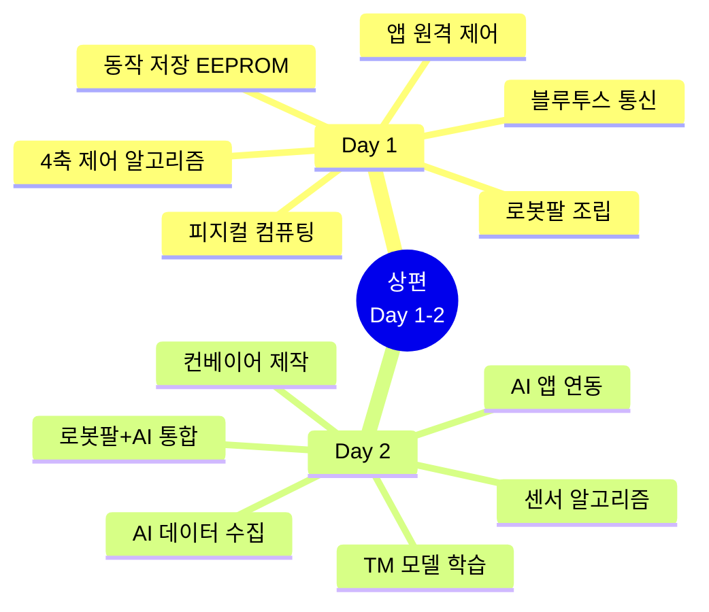

### 📊 알고리즘 중심 학습 프로세스

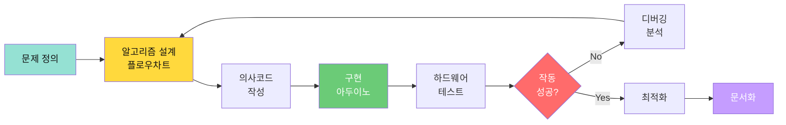

---

## 🔧 교구재 상세 정보

### 필수 교구재

| 구분 | 품목 | 수량 | 용도 |
|------|------|------|------|
| **로봇팔** | BP Lab AI 로봇팔 키트 | 팀당 1개 | 물체 피킹 |
| **컨베이어** | DC모터 + 벨트 키트 | 팀당 1개 | 물체 이송 |
| **센서** | IR, 초음파, TCS3200 컬러 | 각 1개 | 물체 감지/분류 |
| **모니터링** | 8x8 LED Matrix, 피에조 부저 | 각 1개 | 상태 표시 |
| **통신** | HC-06 블루투스 모듈 | 팀당 1개 | 앱 제어 |
| **전원** | 12V 어댑터 + USB | 각 1개 | 전력 공급 |

### 4축 로봇팔 특성

| 축 | 기능 | 제약사항 | 해결 전략 |
|---|------|----------|----------|
| **1축 (베이스)** | 좌우 회전 (0-180°) | 비교적 안정적 | ✅ 적극 활용 |
| **2축 (어깨)** | 상하 움직임 (0-180°) | 부하 시 떨림 | ⚠️ 가벼운 물체 (50g 이하) |
| **3축 (팔꿈치)** | 팔 굽힘 (0-180°) | 어깨 부하 증가 | ⚠️ 45-135도 제한 |
| **4축 (그리퍼)** | 집기 (0-90°) | 안정적 | ✅ 적극 활용 |

---

## 📘 Day 1: 로봇팔 제작 + 알고리즘 제어 (7.5시간)

### 🎯 Day 1 최종 목표
> **알고리즘으로 설계 → 하드웨어 구현 → 로봇팔 제어 → 앱으로 모니터링**

### 🧠 Day 1 학습 알고리즘 맵

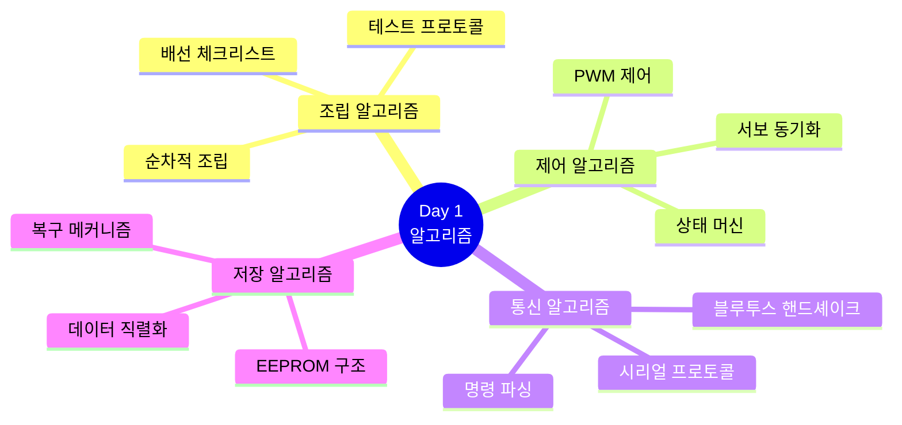

### 📊 Day 1 핵심 알고리즘 다이어그램

#### 1. 로봇팔 제어 메인 알고리즘

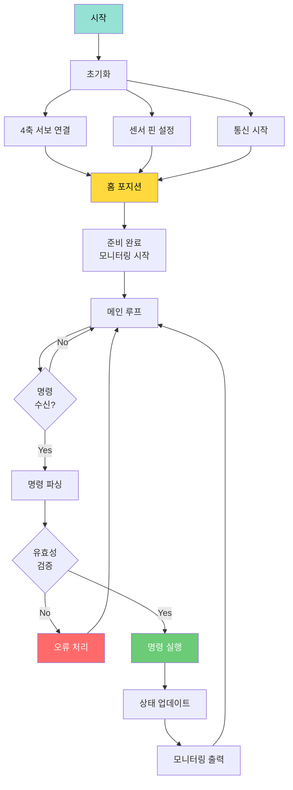

#### 2. 집기 동작 알고리즘 (Pick Sequence)

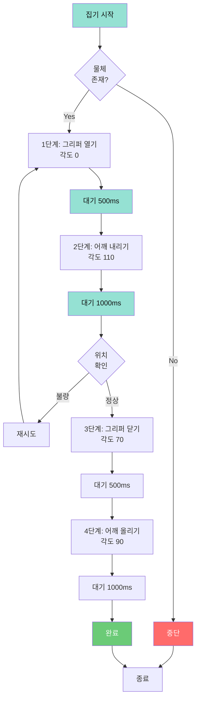

---

### 1교시 (1시간): 로봇팔 조립 알고리즘

**목표**: 체계적 조립 프로세스 완성

#### 조립 알고리즘 플로우

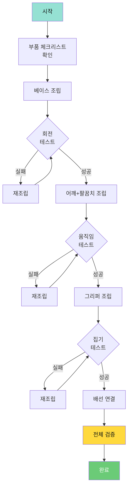

#### 배선 체크리스트 알고리즘

```
알고리즘: Wire_Connection_Checklist
━━━━━━━━━━━━━━━━━━━━━━━━━━━━━━━━━
입력: 4개 서보모터, 아두이노 UNO, 점퍼 와이어

프로세스:
  1. 핀 매핑 정의
     - 베이스 서보 → D6
     - 어깨 서보 → D9
     - 팔꿈치 서보 → D10
     - 그리퍼 서보 → D11
  
  2. 전원 연결 (각 서보)
     - Signal → 디지털 핀
     - VCC → 5V (공통)
     - GND → GND (공통)
  
  3. 전원 분리 검증
     IF (4개 서보 동시 작동) THEN
       외부 12V 전원 사용
     END IF
  
  4. 단계별 테스트
     FOR each servo IN servos:
       단독 테스트(servo)
       결과 기록
     END FOR
     
     전체 동시 작동 테스트

출력: 배선 완료 로봇팔
━━━━━━━━━━━━━━━━━━━━━━━━━━━━━━━━━
```

**결과물**: ✅ **로봇팔 조립 완료**

---

### 2교시 (1.5시간): 피지컬 컴퓨팅 알고리즘

**목표**: LED + 부저 + 서보 통합 제어 알고리즘 구현

#### PWM 제어 알고리즘

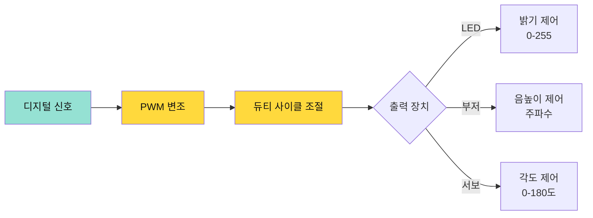

#### LED Matrix 출력 알고리즘

```
알고리즘: Display_Icon_On_Matrix
━━━━━━━━━━━━━━━━━━━━━━━━━━━━━━━━━
입력: 
  - state: 상태 코드 (HOME, PICK, MOVE, DONE)
  - matrix: 8x8 LED Matrix 객체

데이터 구조:
  iconMap = {
    HOME: [[1,1,1,...], [0,1,0,...], ...],
    PICK: [[0,0,1,...], [0,1,1,...], ...],
    MOVE: [[0,0,1,...], [0,1,0,...], ...],
    DONE: [[0,0,0,...], [1,1,1,...], ...]
  }

프로세스:
  1. matrix.clear()
  
  2. bitmap = iconMap[state]
  
  3. FOR row = 0 TO 7:
       FOR col = 0 TO 7:
         IF bitmap[row][col] == 1 THEN
           matrix.setPixel(row, col, ON)
         END IF
       END FOR
     END FOR
  
  4. 부저 동시 출력
     frequency = getFrequency(state)
     playTone(frequency, 200)

출력: LED Matrix 시각적 피드백 + 부저 청각적 피드백
━━━━━━━━━━━━━━━━━━━━━━━━━━━━━━━━━
```

#### 통합 모니터링 알고리즘

```
알고리즘: Triple_Monitoring_System
━━━━━━━━━━━━━━━━━━━━━━━━━━━━━━━━━
입력: robotState (현재 상태)

프로세스:
  1. LED Matrix 표시
     displayIcon(robotState)
  
  2. 부저 소리 알림
     frequency = stateFrequencyMap[robotState]
     playTone(frequency, 200)
  
  3. 시리얼 로그 출력
     timestamp = getCurrentTime()
     print("[" + timestamp + "] State: " + robotState)
  
  4. 블루투스 전송 (앱으로)
     json = createJSON(robotState, angles, stats)
     bluetoothSend(json)

출력: 삼중 모니터링 (로컬 + 원격)
━━━━━━━━━━━━━━━━━━━━━━━━━━━━━━━━━
```

**결과물**: ✅ **피지컬 컴퓨팅 통합 시스템**

---

### 3교시 (1.5시간): 4축 동기화 알고리즘

**목표**: 4개 서보 동시 제어 알고리즘 완성

#### 동기화 알고리즘 (Synchronized Movement)

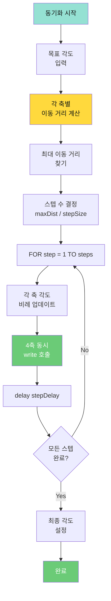

#### 동기화 이동 알고리즘 (의사코드)

```
알고리즘: Synchronized_Move
━━━━━━━━━━━━━━━━━━━━━━━━━━━━━━━━━
입력:
  - currentAngles[4]: 현재 각도 배열
  - targetAngles[4]: 목표 각도 배열
  - stepSize: 한 번에 움직일 각도 (기본 1도)
  - stepDelay: 스텝 간 지연 시간 (기본 15ms)

프로세스:
  1. 각 축별 이동 거리 계산
     FOR i = 0 TO 3:
       distance[i] = abs(targetAngles[i] - currentAngles[i])
     END FOR
  
  2. 최대 이동 거리 찾기
     maxDistance = max(distance[])
     steps = ceil(maxDistance / stepSize)
  
  3. 동기화된 이동
     FOR step = 1 TO steps:
       progress = step / steps
       
       FOR axis = 0 TO 3:
         // 선형 보간 (Linear Interpolation)
         newAngle = currentAngles[axis] + 
                    (targetAngles[axis] - currentAngles[axis]) × progress
         
         servos[axis].write(round(newAngle))
       END FOR
       
       delay(stepDelay)
     END FOR
  
  4. 최종 위치 보정
     FOR axis = 0 TO 3:
       servos[axis].write(targetAngles[axis])
       currentAngles[axis] = targetAngles[axis]
     END FOR

출력: 부드러운 동기화 이동 완료
━━━━━━━━━━━━━━━━━━━━━━━━━━━━━━━━━
```

**핵심 개념**:
- **선형 보간 (Linear Interpolation)**: 시작점과 끝점 사이를 균등하게 분할
- **비례 이동**: 거리가 긴 축은 빠르게, 짧은 축은 느리게 → 동시 도착
- **부드러운 움직임**: 작은 stepSize (1도), 짧은 delay (15ms)

**결과물**: ✅ **4축 동기화 제어 알고리즘 구현**

---

### 4교시 (1.5시간): 블루투스 통신 프로토콜 알고리즘

**목표**: 명령 프로토콜 설계 및 구현

#### 통신 프로토콜 알고리즘

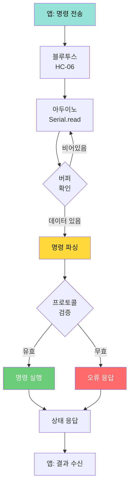

#### 명령 프로토콜 설계

| 명령어 | 파라미터 | 기능 | 응답 |
|--------|---------|------|------|
| `H` | 없음 | 홈 포지션 | `OK:HOME` |
| `P` | 없음 | 집기 동작 | `OK:PICK` |
| `L` | 없음 | 왼쪽 놓기 | `OK:PLACE_LEFT` |
| `R` | 없음 | 오른쪽 놓기 | `OK:PLACE_RIGHT` |
| `M` | `b,s,e,g` | 수동 이동 | `OK:MOVE` |
| `S` | `slot` | 포지션 저장 | `OK:SAVE:slot` |
| `L` | `slot` | 포지션 불러오기 | `OK:LOAD:slot` |
| `?` | 없음 | 상태 조회 | `STATUS:angles` |

#### 명령 파싱 알고리즘

```
알고리즘: Parse_Command
━━━━━━━━━━━━━━━━━━━━━━━━━━━━━━━━━
입력: serialBuffer (시리얼 버퍼 데이터)

데이터 구조:
  Command {
    type: char
    params: array[4]
    valid: boolean
  }

프로세스:
  1. 버퍼 확인
     IF Serial.available() == 0 THEN
       RETURN NULL
     END IF
  
  2. 명령 읽기
     cmd = Serial.read()
  
  3. 명령 타입별 처리
     SWITCH cmd:
       CASE 'H':  // 홈
         RETURN Command('H', NULL, TRUE)
       
       CASE 'P':  // 집기
         RETURN Command('P', NULL, TRUE)
       
       CASE 'M':  // 수동 이동
         // 파라미터 파싱: "M90,90,90,0"
         params = readUntil('\n').split(',')
         IF params.length == 4 THEN
           RETURN Command('M', params, TRUE)
         ELSE
           RETURN ERROR
         END IF
       
       CASE 'S':  // 저장
         slot = Serial.parseInt()
         IF slot >= 1 AND slot <= 3 THEN
           RETURN Command('S', [slot], TRUE)
         ELSE
           RETURN ERROR
         END IF
       
       DEFAULT:
         RETURN ERROR
     END SWITCH

출력: Command 객체 또는 ERROR
━━━━━━━━━━━━━━━━━━━━━━━━━━━━━━━━━
```

**핵심 개념**:
- **프로토콜**: 약속된 통신 규칙 (명령어 형식)
- **파싱 (Parsing)**: 문자열을 구조화된 데이터로 변환
- **검증 (Validation)**: 유효성 체크 (범위, 형식)

**결과물**: ✅ **블루투스 통신 프로토콜 알고리즘 구현**

---

### 5교시 (1시간): 앱인벤터 이중 모니터링 알고리즘

**목표**: 앱 + 피지컬 모니터링 통합

#### 이중 모니터링 시스템 알고리즘

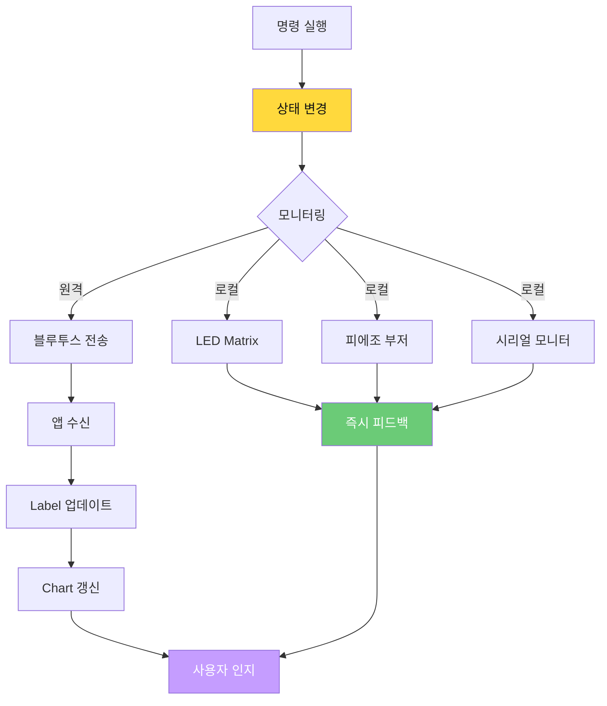

#### 상태 전송 알고리즘

```
알고리즘: Send_Monitoring_Data
━━━━━━━━━━━━━━━━━━━━━━━━━━━━━━━━━
입력:
  - currentState: 현재 로봇 상태
  - currentAngles[4]: 현재 각도 배열
  - statistics: 통계 데이터

프로세스:
  1. 로컬 모니터링
     displayIcon(currentState)
     playTone(stateFrequency[currentState], 200)
     Serial.print("STATUS:")
     Serial.print(getStateName(currentState))
  
  2. 원격 모니터링 (JSON 포맷)
     json = "{"
     json += "\"state\":\"" + stateName + "\","
     json += "\"angles\":[" + angles[0] + "," + ... + "],"
     json += "\"count\":" + totalCount + ","
     json += "\"timestamp\":" + millis()
     json += "}"
     
     Serial.println(json)
  
  3. 앱 수신 처리 (앱인벤터 블록)
     [BluetoothClient.ReceiveText]
       IF contains("STATUS:") THEN
         data = split(receivedText, ":")
         Label_State.Text = data[1]
       ELSE IF is_JSON(receivedText) THEN
         obj = parse_JSON(receivedText)
         updateDashboard(obj)
       END IF

출력:
  - 로컬: LED Matrix + 부저 + 시리얼
  - 원격: 앱 대시보드
━━━━━━━━━━━━━━━━━━━━━━━━━━━━━━━━━
```

**핵심 개념**:
- **이중 모니터링**: 로컬 (즉시) + 원격 (기록/분석)
- **JSON**: 구조화된 데이터 포맷 (JavaScript Object Notation)
- **실시간 대시보드**: 앱인벤터 Label + Chart

**결과물**: ✅ **이중 모니터링 시스템 알고리즘**

---

### 6교시 (1시간): EEPROM 저장 알고리즘

**목표**: 비휘발성 메모리 활용 알고리즘

#### EEPROM 메모리 맵 설계

```
주소 맵 (0-1023 바이트):
━━━━━━━━━━━━━━━━━━━━━━━
0-3   : 포지션 1 (base, shoulder, elbow, gripper)
4-7   : 포지션 2
8-11  : 포지션 3
12-15 : 체크섬 (데이터 무결성)
16-19 : 메타데이터 (저장 시간, 버전)
━━━━━━━━━━━━━━━━━━━━━━━
```

#### 저장/복구 알고리즘

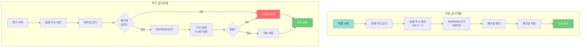

#### EEPROM 알고리즘 (의사코드)

```
알고리즘: Save_To_EEPROM
━━━━━━━━━━━━━━━━━━━━━━━━━━━━━━━━━
입력:
  - slot: 저장 슬롯 (1-3)
  - angles[4]: 저장할 각도 배열

프로세스:
  1. 주소 계산
     baseAddr = (slot - 1) × 4
  
  2. 각도 검증
     FOR i = 0 TO 3:
       IF angles[i] < 0 OR angles[i] > 180 THEN
         RETURN ERROR
       END IF
     END FOR
  
  3. 데이터 쓰기
     FOR i = 0 TO 3:
       EEPROM.write(baseAddr + i, angles[i])
     END FOR
  
  4. 체크섬 계산 및 저장
     checksum = (angles[0] + angles[1] + angles[2] + angles[3]) MOD 256
     EEPROM.write(12 + slot - 1, checksum)
  
  5. 확인
     RETURN SUCCESS

출력: SUCCESS / ERROR
━━━━━━━━━━━━━━━━━━━━━━━━━━━━━━━━━
```

```
알고리즘: Load_From_EEPROM
━━━━━━━━━━━━━━━━━━━━━━━━━━━━━━━━━
입력: slot (1-3)

프로세스:
  1. 주소 계산
     baseAddr = (slot - 1) × 4
  
  2. 체크섬 검증
     storedChecksum = EEPROM.read(12 + slot - 1)
     sum = 0
     FOR i = 0 TO 3:
       angles[i] = EEPROM.read(baseAddr + i)
       sum += angles[i]
     END FOR
     calculatedChecksum = sum MOD 256
     
     IF storedChecksum != calculatedChecksum THEN
       RETURN ERROR_CORRUPTED
     END IF
  
  3. 각도 검증
     FOR i = 0 TO 3:
       IF angles[i] > 180 THEN
         RETURN ERROR_INVALID
       END IF
     END FOR
  
  4. 복구
     RETURN angles

출력: 복구된 각도 배열 / ERROR
━━━━━━━━━━━━━━━━━━━━━━━━━━━━━━━━━
```

**핵심 개념**:
- **EEPROM**: 비휘발성 메모리 (전원 꺼도 데이터 유지)
- **체크섬 (Checksum)**: 데이터 무결성 검증 (간단한 오류 검출)
- **메모리 맵**: 주소 공간을 논리적으로 분할

**결과물**: ✅ **EEPROM 저장/복구 알고리즘 구현**

---

### 7교시 (30분): Day 1 성찰

**성찰 프로세스 알고리즘**:


**결과물**: ✅ **Day 1 성찰 + 알고리즘 이해도 평가**

---

## 💬 Day 1 Q&A (알고리즘 중심)

### Q1. 동기화 이동이 필요한 이유는?

**A1**: 부드러운 동작과 부하 분산을 위해서입니다.

**비동기 vs 동기 비교**:

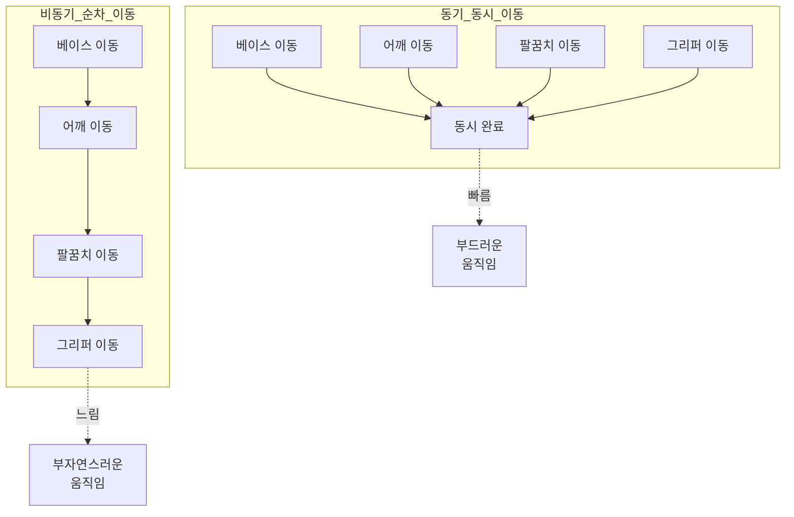

---

### Q2. 체크섬은 왜 필요한가요?

**A2**: 데이터 무결성 보장을 위해서입니다.

**체크섬 검증 알고리즘**:

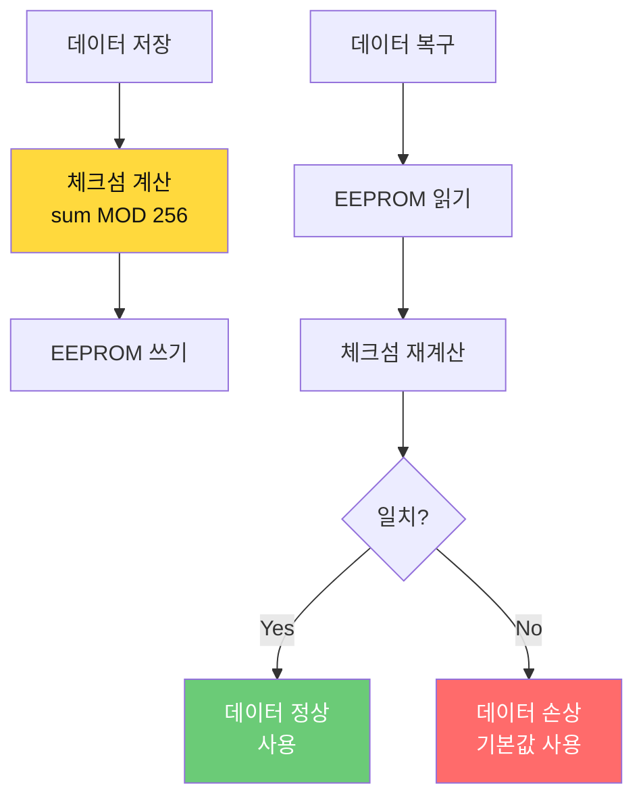

---

### Q3. PWM 제어 원리는?

**A3**: 듀티 사이클을 조절하여 평균 전압을 제어합니다.

**PWM 개념**:
```
PWM (Pulse Width Modulation):

주기 = 20ms (50Hz)
듀티 사이클 = HIGH 시간 / 주기

서보 모터:
  0도   → 1ms HIGH (5% 듀티)
  90도  → 1.5ms HIGH (7.5% 듀티)
  180도 → 2ms HIGH (10% 듀티)

analogWrite(pin, value):
  value: 0-255
  실제 듀티 = value / 255 × 100%
```

---

## 📗 Day 2: 컨베이어 + 센서 + AI 통합 (7.5시간)

### 🎯 Day 2 최종 목표
> **센서 알고리즘 → AI 학습 → 통합 시스템 완성**

### 🧠 Day 2 학습 알고리즘 맵

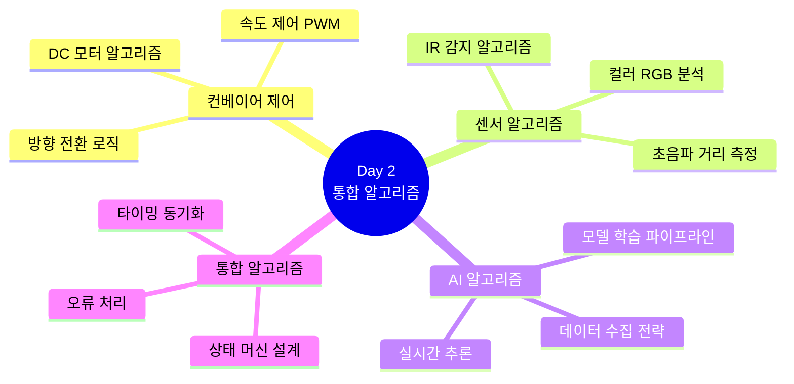

### 📊 Day 2 핵심 알고리즘

#### 1. 센서 기반 자동 분류 알고리즘

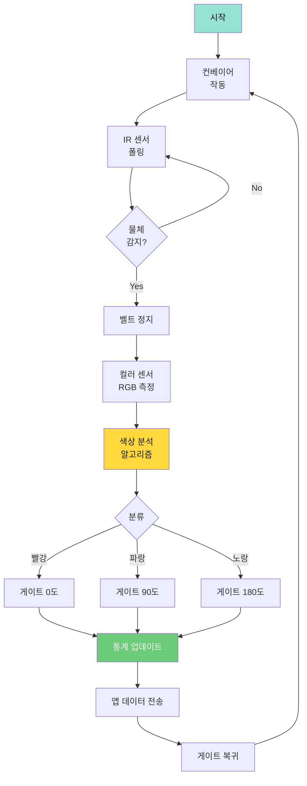

---

### 1교시 (1시간): 컨베이어 제어 알고리즘

**목표**: DC 모터 제어 알고리즘 완성

#### DC 모터 제어 알고리즘

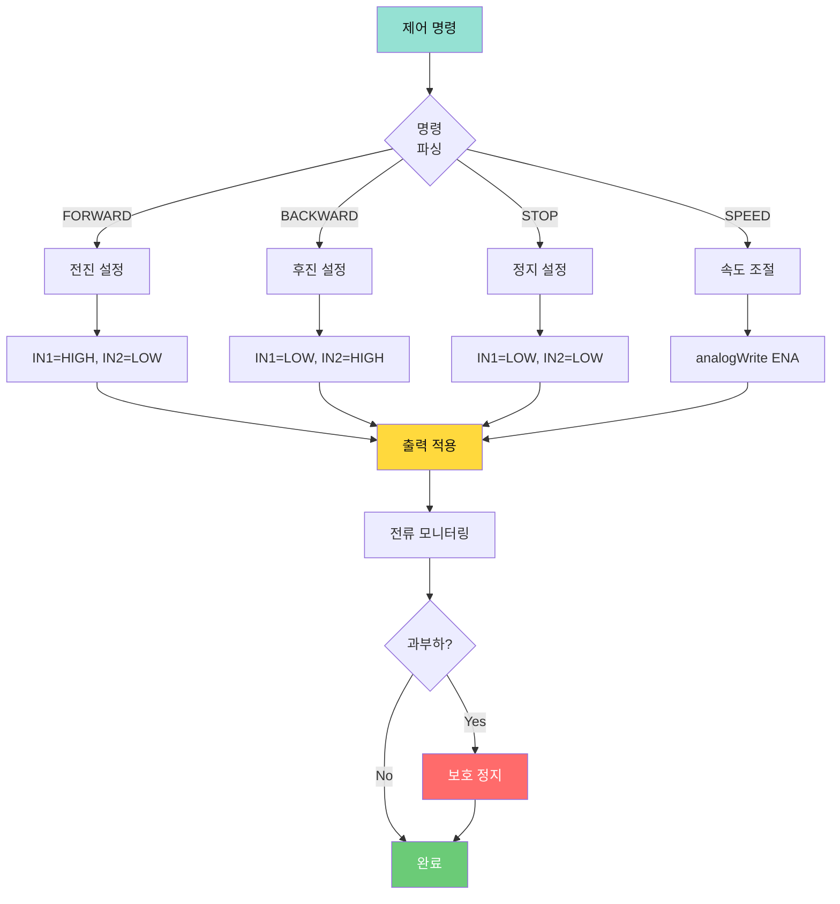

#### 속도 제어 알고리즘 (의사코드)

```
알고리즘: Set_Motor_Speed
━━━━━━━━━━━━━━━━━━━━━━━━━━━━━━━━━
입력:
  - targetSpeed: 목표 속도 (0-255)
  - direction: 방향 (FORWARD, BACKWARD, STOP)

프로세스:
  1. 속도 검증
     IF targetSpeed < 0 THEN targetSpeed = 0
     IF targetSpeed > 255 THEN targetSpeed = 255
  
  2. 방향 설정 (L298N 드라이버)
     SWITCH direction:
       CASE FORWARD:
         digitalWrite(IN1, HIGH)
         digitalWrite(IN2, LOW)
       CASE BACKWARD:
         digitalWrite(IN1, LOW)
         digitalWrite(IN2, HIGH)
       CASE STOP:
         digitalWrite(IN1, LOW)
         digitalWrite(IN2, LOW)
         targetSpeed = 0
     END SWITCH
  
  3. PWM 속도 제어
     analogWrite(ENA, targetSpeed)
  
  4. 부드러운 가속/감속 (선택적)
     currentSpeed = getMotorSpeed()
     WHILE abs(targetSpeed - currentSpeed) > THRESHOLD:
       step = sign(targetSpeed - currentSpeed) × ACCEL_RATE
       currentSpeed += step
       analogWrite(ENA, currentSpeed)
       delay(ACCEL_DELAY)
     END WHILE

출력: 모터 속도 및 방향 설정 완료
━━━━━━━━━━━━━━━━━━━━━━━━━━━━━━━━━
```

**핵심 개념**:
- **H-Bridge (L298N)**: 모터 방향 제어 (IN1, IN2)
- **PWM 속도 제어**: ENA 핀으로 속도 조절 (0-255)
- **가속/감속**: 급격한 속도 변화 방지 (부드러운 시작/정지)

**결과물**: ✅ **DC 모터 제어 알고리즘 구현**

---

### 2교시 (1.5시간): 센서 알고리즘 통합

**목표**: IR, 초음파, 컬러 센서 알고리즘 구현

#### 컬러 센서 RGB 분석 알고리즘

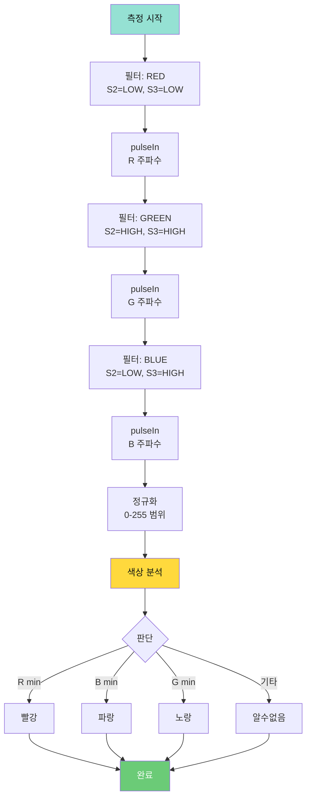

#### 색상 판단 알고리즘 (의사코드)

```
알고리즘: Detect_Color
━━━━━━━━━━━━━━━━━━━━━━━━━━━━━━━━━
입력: r, g, b (RGB 주파수 값)

데이터 구조:
  ColorRef = {
    RED: [low_r, high_g, high_b],
    BLUE: [high_r, high_g, low_b],
    YELLOW: [low_r, low_g, high_b]
  }

프로세스:
  1. 정규화 (주파수 → 0-255)
     maxVal = max(r, g, b)
     IF maxVal > 0 THEN
       r_norm = (r / maxVal) × 255
       g_norm = (g / maxVal) × 255
       b_norm = (b / maxVal) × 255
     END IF
  
  2. 유클리드 거리 계산
     FOR each color IN ColorRef:
       distance[color] = sqrt(
         (r_norm - ColorRef[color][0])² +
         (g_norm - ColorRef[color][1])² +
         (b_norm - ColorRef[color][2])²
       )
     END FOR
  
  3. 최소 거리 색상 선택
     closestColor = argmin(distance)
     
     IF distance[closestColor] < ACCEPT_THRESHOLD THEN
       RETURN closestColor
     ELSE
       RETURN "UNKNOWN"
     END IF

출력: 색상 문자열 ("RED", "BLUE", "YELLOW", "UNKNOWN")
━━━━━━━━━━━━━━━━━━━━━━━━━━━━━━━━━
```

**핵심 개념**:
- **TCS3200**: 빛의 주파수를 디지털 신호로 변환
- **필터 전환**: S2, S3 핀으로 R/G/B 필터 선택
- **유클리드 거리**: 3차원 색공간에서 가장 가까운 색 찾기

**결과물**: ✅ **센서 통합 알고리즘 구현**

---

### 4-5교시 (3시간): AI 학습 및 연동 알고리즘

**목표**: Teachable Machine 학습 + 앱 연동

#### AI 파이프라인 알고리즘

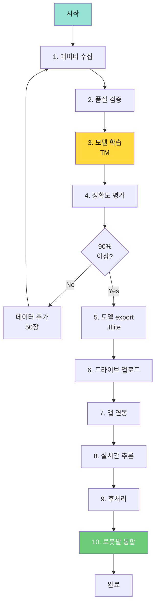

#### 데이터 수집 전략 알고리즘

```
알고리즘: Collect_Training_Data
━━━━━━━━━━━━━━━━━━━━━━━━━━━━━━━━━
입력:
  - objectClasses: ["Red_Block", "Blue_Block", "Yellow_Block"]
  - samplesPerClass: 100

환경 설정:
  - 조명: 일정하게 유지
  - 배경: 단색 (흰색 또는 검정)
  - 카메라 거리: 30cm 고정

프로세스:
  1. 클래스별 데이터 수집
     FOR each class IN objectClasses:
       sampleCount = 0
       
       WHILE sampleCount < samplesPerClass:
         // 다양한 각도 (5가지)
         angles = [0°, 45°, -45°, 90°, -90°]
         FOR each angle IN angles:
           captureImage(class, angle)
           sampleCount++
         END FOR
         
         // 다양한 거리 (3가지)
         distances = [20cm, 30cm, 40cm]
         FOR each dist IN distances:
           captureImage(class, dist)
           sampleCount++
         END FOR
         
         // 조명 변화 (3가지)
         lightings = [밝음, 보통, 어두움]
         FOR each light IN lightings:
           captureImage(class, light)
           sampleCount++
         END FOR
       END WHILE
     END FOR
  
  2. 배경 클래스 수집 (False Positive 방지)
     FOR i = 1 TO 50:
       captureImage("Background", random_position)
     END FOR
  
  3. 품질 검증
     FOR each image:
       IF is_blurry(image) OR is_overexposed(image) THEN
         reject(image)
         sampleCount--
       END IF
     END FOR

출력: 고품질 학습 데이터 세트 (클래스당 100장)
━━━━━━━━━━━━━━━━━━━━━━━━━━━━━━━━━
```

#### AI 추론 알고리즘 (앱인벤터 블록 로직)

```
알고리즘: AI_Inference_And_Integration
━━━━━━━━━━━━━━━━━━━━━━━━━━━━━━━━━
앱인벤터 블록 순서:

1. 초기화
   [Screen.Initialize]
     PersonalImageClassifier.LoadModelFromURL(modelURL)
     confidence_threshold ← 0.8

2. 촬영
   [Button_Capture.Click]
     Camera.TakePicture()

3. 분류
   [Camera.AfterPicture]
     image ← Camera.Picture
     PersonalImageClassifier.ClassifyImage(image)

4. 결과 처리
   [PersonalImageClassifier.GotClassification]
     result ← classification
     confidence ← confidence_score
     
     IF confidence > confidence_threshold THEN
       // 유효한 인식
       Label_Result.Text ← result
       Label_Confidence.Text ← confidence
       
       // 색상 매핑
       color ← mapResultToColor(result)
       zone ← getUserSelectedZone()  // 1, 2, 3
       
       // 아두이노 명령 전송
       command ← "AI_" + color + "_" + zone
       BluetoothClient.SendText(command)
       
       // 시각적 피드백
       Label_Result.BackgroundColor ← colorMap[color]
       playSound("beep.mp3")
     ELSE
       // 인식 실패
       Label_Result.Text ← "재시도"
       Label_Result.BackgroundColor ← GRAY
     END IF

출력: 명령 전송 (예: "AI_RED_1")
━━━━━━━━━━━━━━━━━━━━━━━━━━━━━━━━━
```

**핵심 개념**:
- **전이 학습 (Transfer Learning)**: 사전 학습된 모델 활용 (빠른 학습)
- **데이터 증강 (Data Augmentation)**: 다양한 각도/조명 (일반화)
- **신뢰도 임계값**: 0.8 이상만 유효 (오인식 방지)

**결과물**: ✅ **AI 학습 및 추론 알고리즘 구현**

---

### 6교시 (1시간): 로봇팔 + AI 통합 알고리즘

**목표**: 3구역 시스템 + AI 연동

#### 3구역 매핑 알고리즘

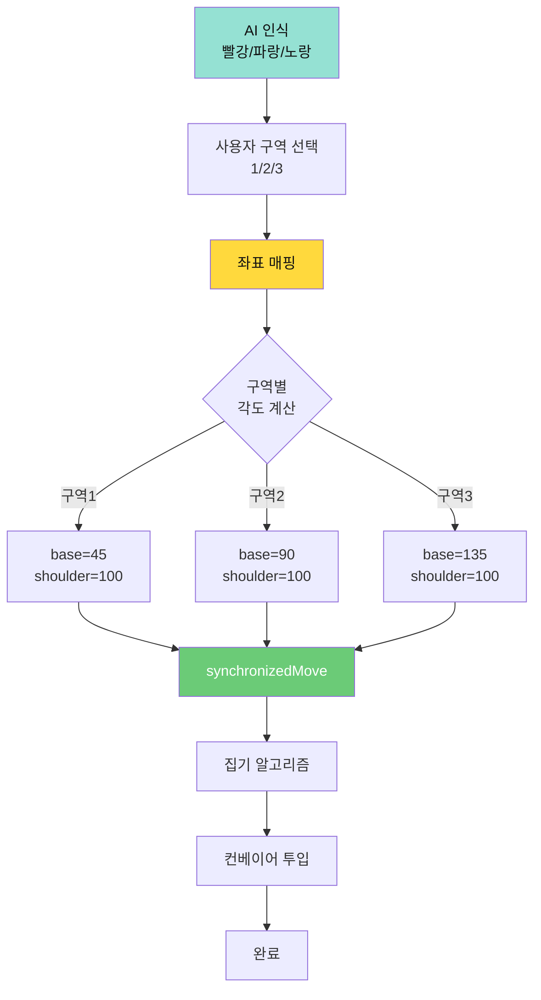

#### 구역 기반 피킹 알고리즘 (의사코드)

```
알고리즘: Pick_From_Zone_With_AI
━━━━━━━━━━━━━━━━━━━━━━━━━━━━━━━━━
입력:
  - aiColor: AI 인식 색상 ("RED", "BLUE", "YELLOW")
  - zone: 물체 위치 구역 (1, 2, 3)

데이터 구조:
  zoneAngles = {
    1: {base: 45,  shoulder: 100, elbow: 90, gripper: 0},
    2: {base: 90,  shoulder: 100, elbow: 90, gripper: 0},
    3: {base: 135, shoulder: 100, elbow: 90, gripper: 0}
  }

프로세스:
  1. 구역 각도 조회
     targetAngles = zoneAngles[zone]
  
  2. 시각적 피드백
     displayIcon(ICON_PICK)
     playTone(1000, 200)
     Serial.print("AI: " + aiColor + ", Zone: " + zone)
  
  3. 그리퍼 열기
     gripper.write(0)
     delay(500)
  
  4. 해당 구역으로 이동
     currentPos = getCurrentAngles()
     synchronizedMove(currentPos, targetAngles)
  
  5. 내려가기 (집기 준비)
     targetAngles.shoulder = 110
     synchronizedMove(targetAngles)
     delay(1000)
  
  6. 집기
     gripper.write(70)
     delay(500)
  
  7. 올리기
     targetAngles.shoulder = 90
     synchronizedMove(targetAngles)
     delay(1000)
  
  8. 컨베이어 투입 위치로 이동
     conveyorPos = {base: 0, shoulder: 100, elbow: 90, gripper: 70}
     synchronizedMove(conveyorPos)
  
  9. 놓기
     gripper.write(0)
     delay(500)
  
  10. 홈으로 복귀
      goHome()
  
  11. 통계 업데이트
      statistics[aiColor]++
      sendToApp(statistics)

출력: 집기 성공/실패
━━━━━━━━━━━━━━━━━━━━━━━━━━━━━━━━━
```

**핵심 개념**:
- **3구역 시스템**: 작업 공간을 3개 영역으로 분할 (확장 가능)
- **AI + 사용자 입력**: AI는 "무엇", 사용자는 "어디"
- **통계 수집**: 색상별 카운팅 (성능 분석)

**결과물**: ✅ **AI 기반 스마트 피킹 알고리즘 완성**

---

### 7교시 (30분): Day 2 성찰

**알고리즘 이해도 평가**:

```mermaid
graph TD
    A[학습 완료] --> B{알고리즘<br/>이해?}
    B -->|상| C[창의적 응용<br/>가능]
    B -->|중| D[기본 구현<br/>가능]
    B -->|하| E[추가 학습<br/>필요]
    
    C --> F[우수]
    D --> G[양호]
    E --> H[보완]
    
    style B fill:#FFD93D,color:#111
    style F fill:#6BCB77,color:#fff
```

**결과물**: ✅ **Day 2 성찰 + 알고리즘 설계 능력 평가**

---

## 💬 Day 2 Q&A (알고리즘 중심)

### Q1. 센서 노이즈를 어떻게 처리하나요?

**A1**: 이동 평균 필터 알고리즘을 사용합니다.

```
알고리즘: Moving_Average_Filter
━━━━━━━━━━━━━━━━━━━━━━━━━━━━━━━━━
입력: samples[], windowSize

데이터 구조:
  buffer[windowSize] ← {0}
  index ← 0

프로세스:
  1. 샘플 추가
     buffer[index] ← newSample
     index ← (index + 1) MOD windowSize
  
  2. 평균 계산
     sum ← 0
     FOR i = 0 TO windowSize-1:
       sum += buffer[i]
     END FOR
     average ← sum / windowSize
  
  3. RETURN average

적용 예:
  rawDistance ← getUltrasonicDistance()
  filteredDistance ← movingAverageFilter(rawDistance, 10)
━━━━━━━━━━━━━━━━━━━━━━━━━━━━━━━━━
```

---

### Q2. AI 정확도를 높이려면?

**A2**: 데이터 증강 전략을 적용합니다.

```mermaid
graph TD
    ORIG[원본 이미지] --> AUG[데이터 증강]
    
    AUG --> ROT[회전<br/>±15도]
    AUG --> FLIP[좌우 반전]
    AUG --> BRIGHT[밝기 조절<br/>±20%]
    AUG --> NOISE[노이즈 추가]
    
    ROT --> DATASET[확장된<br/>데이터셋]
    FLIP --> DATASET
    BRIGHT --> DATASET
    NOISE --> DATASET
    
    DATASET --> TRAIN[재학습]
    TRAIN --> ACC[정확도 향상]
    
    style AUG fill:#FFD93D,color:#111
    style ACC fill:#6BCB77,color:#fff
```

---

## 📚 상편 핵심 알고리즘 요약

### 1. 로봇팔 제어 알고리즘
- 동기화 이동 알고리즘 (선형 보간)
- 집기/놓기 시퀀스 알고리즘
- PWM 제어 알고리즘

### 2. 통신 알고리즘
- 시리얼 프로토콜 파싱
- 블루투스 명령 처리
- JSON 데이터 전송

### 3. 센서 알고리즘
- 컬러 RGB 분석 (유클리드 거리)
- 이동 평균 필터 (노이즈 제거)
- 거리 측정 보정

### 4. AI 알고리즘
- 데이터 수집 전략 (다양성 확보)
- 모델 학습 파이프라인
- 실시간 추론 처리

### 5. 통합 알고리즘
- 3구역 매핑
- AI + 센서 하이브리드
- 오류 처리 및 복구

---

## 📖 하편 예고

**하편 (Day 3-4)에서 다룰 내용**:
- 창의적 시나리오 알고리즘 설계
- 상태 머신 고급 알고리즘
- 실시간 시스템 타이밍 알고리즘
- 발표 및 평가 알고리즘

**계속해서 하편에서 만나요!** 🚀

---

**Last Updated**: 2026-01-22  
**Version**: 2.0 (알고리즘 중심, 소스코드 제거)  
**제작**: Smart Factory Education Team  
**교구재**: [BP Lab](https://bplab.kr/order/?idx=178)
