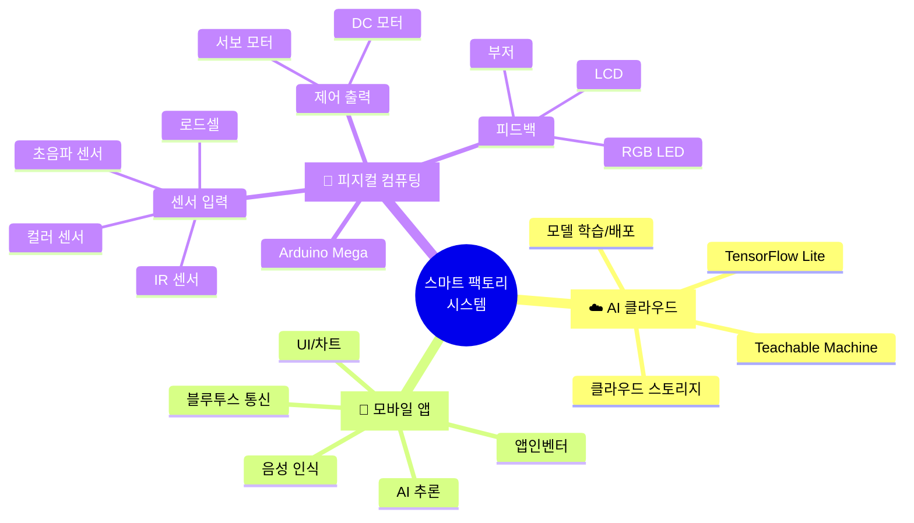
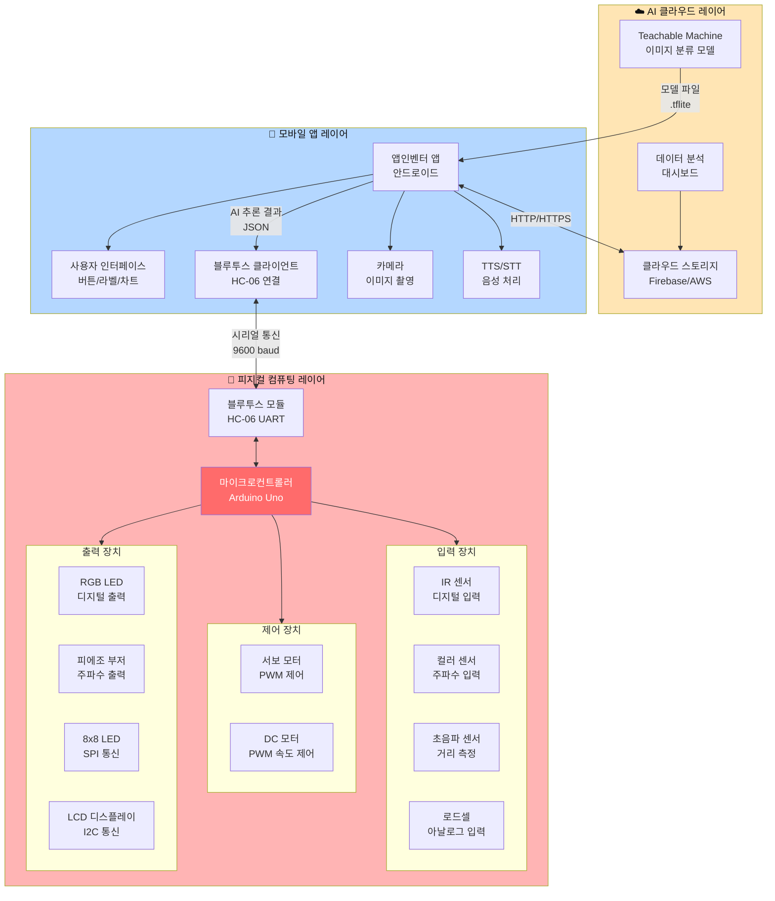
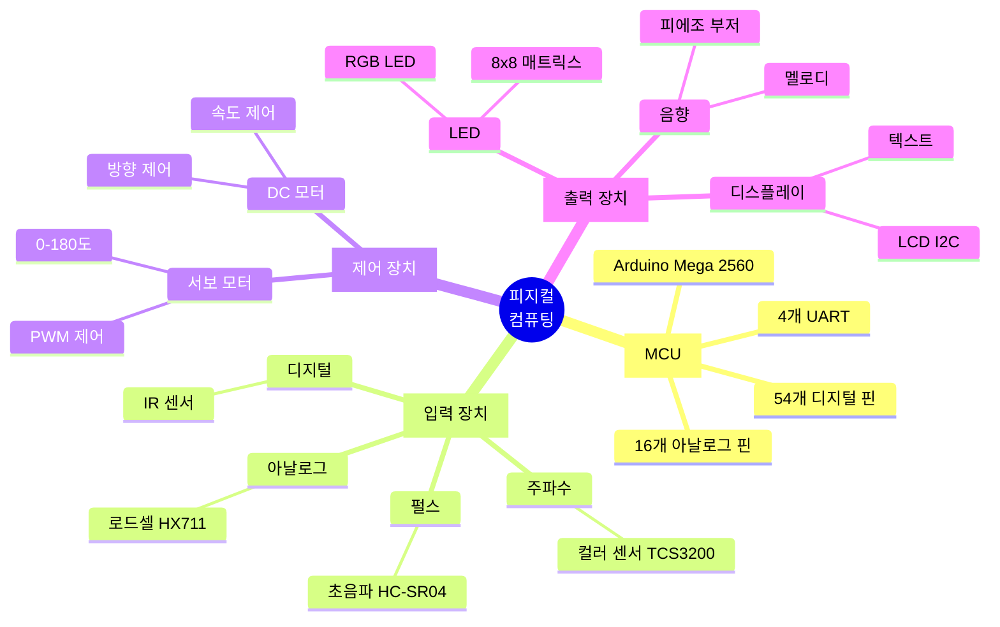
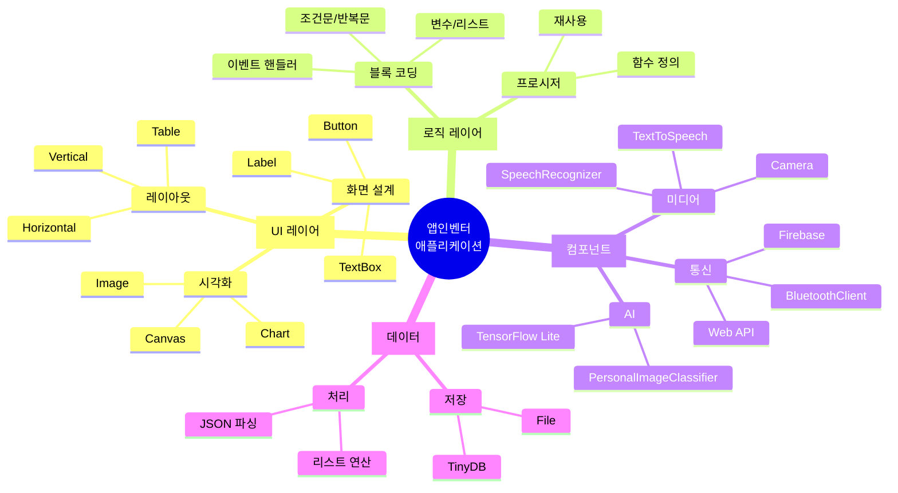
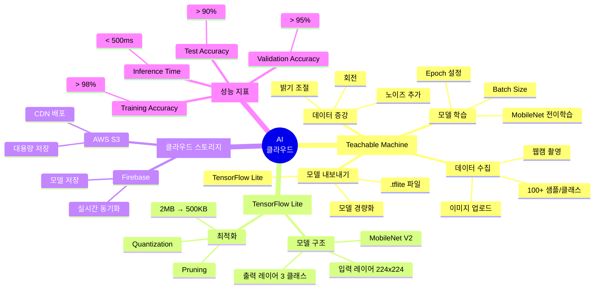

# 스마트 팩토리 시스템 아키텍처 완전 가이드 【상편】

> **📍 문서 구성**: 상편 (PART 1-4) | [👉 하편 보기](./시스템_아키텍처_완전가이드_하편.md) (PART 5-8)  
> **"3계층 시스템: 피지컬 컴퓨팅 ↔ 모바일 앱 ↔ AI 클라우드"**  
> 하드웨어부터 AI까지 전체 시스템 설계 바이블

---

## 📊 문서 통계 한눈에 보기

```
┌─────────────────────────────────────────────────────────────┐
│                    문서 구성 요약                              │
├─────────────────────────────────────────────────────────────┤
│  📖 총 PART 수:        8개 (아키텍처 → 참고자료)               │
│  📑 총 섹션 수:        12개 주요 섹션                          │
│  📄 총 페이지:         ~4,700줄 (약 150페이지)                │
│  ⏱️  예상 학습 시간:    40-50시간 (전체 마스터)                │
│                                                               │
│  🎯 핵심 콘텐츠:                                               │
│     • 마인드맵:       10개 (각 섹션별)                         │
│     • 비교표:         25개 (성능/기능/파라미터)                │
│     • 알고리즘:       15개 (Arduino C 코드)                    │
│     • 순서도:         8개 (Mermaid 다이어그램)                │
│     • FAQ:            30문 (하드웨어/소프트웨어/AI)           │
│     • 용어:           100+ (7개 카테고리)                     │
│     • 프로젝트:       16개 (초급→전문가)                       │
│                                                               │
│  🔧 실습 코드:                                                 │
│     • Arduino C:      10개 완전한 예제                        │
│     • 앱인벤터:       5개 블록 코딩 패턴                       │
│     • AI 모델:        3개 학습 가이드                         │
└─────────────────────────────────────────────────────────────┘
```

### 빠른 참조 테이블

| 찾고 싶은 내용 | 섹션 | 페이지 | 난이도 | 예상 시간 |
|--------------|------|--------|--------|----------|
| **Arduino 기초 시작** | PART 2 → MCU | 상단 | ⭐ | 1시간 |
| **센서 연결 방법** | PART 2 → 입력 장치 | 중단 | ⭐⭐ | 2시간 |
| **블루투스 통신 구현** | PART 5 → 프로토콜 | 중단 | ⭐⭐⭐ | 3시간 |
| **앱 만들기** | PART 3 → 앱인벤터 | 중단 | ⭐⭐⭐ | 5시간 |
| **AI 모델 학습** | PART 4 → Teachable Machine | 하단 | ⭐⭐⭐⭐ | 2시간 |
| **PID 제어 구현** | PART 6 → 알고리즘 | 하단 | ⭐⭐⭐⭐ | 3시간 |
| **문제 해결** | PART 7 → FAQ | 하단 | 다양 | 10분 |
| **용어 찾기** | PART 8 → 용어 사전 | 하단 | ⭐ | 즉시 |

### 학습 경로 추천


---

## 📋 목차 (상편)

### 📖 PART 1: 시스템 아키텍처 개요
1. [🏗️ 시스템 3계층 아키텍처](#-시스템-3계층-아키텍처)
   - 전체 시스템 구조도
   - 계층별 역할 정의
   - 마인드맵 및 요약표

### 📖 PART 2: 하드웨어 계층
2. [🔧 피지컬 컴퓨팅 레이어](#-피지컬-컴퓨팅-레이어)
   - 마이크로컨트롤러 (MCU)
   - 입력 장치 (센서)
   - 제어 장치 (액추에이터)
   - 출력 장치 (디스플레이/알림)
   - 핵심 요소 비교표

### 📖 PART 3: 소프트웨어 계층
3. [📱 모바일 앱 레이어](#-모바일-앱-레이어-앱인벤터)
   - 앱인벤터 아키텍처
   - 핵심 컴포넌트
   - 블록 코딩 패턴표

### 📖 PART 4: AI 및 머신러닝
4. [☁️ AI 클라우드 레이어](#-ai-클라우드-레이어-teachable-machine)
   - Teachable Machine 워크플로우
   - 데이터 수집 가이드라인
   - 모델 최적화
   - 학습 파라미터 비교표

---

> **💡 하편 바로가기**: [👉 시스템_아키텍처_완전가이드_하편.md](./시스템_아키텍처_완전가이드_하편.md)  
> (PART 5: 통신 프로토콜, PART 6: 핵심 알고리즘, PART 7: 학습 가이드, PART 8: 참고 자료)

---
---
# 📖 PART 1: 시스템 아키텍처 개요

```
╔═══════════════════════════════════════════════════════════════╗
║  📖 PART 1 학습 목표                                            ║
╠═══════════════════════════════════════════════════════════════╣
║  ✅ 스마트 팩토리 3계층 시스템 이해                              ║
║  ✅ 각 계층의 역할과 통신 방식 파악                              ║
║  ✅ 전체 아키텍처 구조 파악                                      ║
║                                                                 ║
║  📊 포함 내용:                                                   ║
║     • 마인드맵: 1개 (전체 시스템)                               ║
║     • 요약표: 2개 (계층별 비교, 통신 방식)                      ║
║     • 다이어그램: 1개 (Mermaid 구조도)                          ║
║                                                                 ║
║  ⏱️  예상 학습 시간: 1-2시간                                    ║
║  🎯 난이도: ⭐⭐ (초급)                                          ║
╚═══════════════════════════════════════════════════════════════╝
```

---
---

## 🏗️ 시스템 3계층 아키텍처

### 섹션 마인드맵



### 계층별 요약표

| 계층 | 핵심 역할 | 주요 기술 | 통신 방식 | 처리 속도 |
|------|----------|----------|----------|-----------|
| **☁️ AI 클라우드** | 모델 학습/배포 | Teachable Machine<br/>TensorFlow Lite | HTTP/HTTPS | 학습: 5분<br/>배포: 즉시 |
| **📱 모바일 앱** | UI + AI 추론 | 앱인벤터<br/>Personal Image Classifier | 블루투스<br/>9600 bps | 추론: <500ms<br/>통신: <100ms |
| **🔧 피지컬 컴퓨팅** | 센서/제어 | Arduino C/C++<br/>임베디드 시스템 | UART<br/>I2C, SPI | loop(): <10ms<br/>실시간 제어 |

### 전체 시스템 구조도



### 계층별 역할 정의

| 계층 | 주요 역할 | 핵심 기술 | 데이터 흐름 |
|------|----------|----------|------------|
| **☁️ AI 클라우드** | 모델 학습 및 배포 | Teachable Machine, TensorFlow Lite | 모델 → 앱 (다운로드) |
| **📱 모바일 앱** | 사용자 인터페이스 + AI 추론 | 앱인벤터, Personal Image Classifier | 사진 → AI 결과 → 아두이노 |
| **🔧 피지컬 컴퓨팅** | 센서 입력 + 액추에이터 제어 | Arduino C/C++, 임베디드 시스템 | 센서 → 처리 → 모터/LED |

---
---

# 📖 PART 2: 하드웨어 계층

```
╔═══════════════════════════════════════════════════════════════╗
║  📖 PART 2 학습 목표                                            ║
╠═══════════════════════════════════════════════════════════════╣
║  ✅ Arduino Mega 2560 핀 구성 및 기능 이해                      ║
║  ✅ 센서 4종 (IR, 컬러, 초음파, 로드셀) 사용법                 ║
║  ✅ 모터 2종 (서보, DC) 제어 방법                               ║
║  ✅ 출력 장치 (LED, 부저, LCD) 활용                             ║
║                                                                 ║
║  📊 포함 내용:                                                   ║
║     • Arduino C 코드: 10개 (완전한 예제)                       ║
║     • 마인드맵: 1개 (전체 하드웨어 구성)                       ║
║     • 비교표: 3개 (센서/통신/성능)                             ║
║     • 알고리즘: 8개 (센서 제어, 모터 제어)                     ║
║                                                                 ║
║  ⏱️  예상 학습 시간: 12-15시간                                  ║
║  🎯 난이도: ⭐⭐⭐ (중급)                                        ║
╚═══════════════════════════════════════════════════════════════╝
```

---
---

## 🔧 피지컬 컴퓨팅 레이어

### 섹션 마인드맵



### 피지컬 컴퓨팅 핵심 요소 비교표

| 구분 | 센서/장치명 | 인터페이스 | 측정 범위/출력 | 정확도 | 응답 시간 | 소비 전력 |
|------|-----------|-----------|---------------|--------|-----------|----------|
| **입력** | IR 센서 (TCRT5000) | 디지털 | 1-10cm | ±1cm | <1ms | 20mA |
| **입력** | 컬러 센서 (TCS3200) | 주파수 | RGB 0-255 | ±10% | 30-100ms | 50mA |
| **입력** | 초음파 (HC-SR04) | 펄스 | 2-400cm | ±3mm | 2-30ms | 15mA |
| **입력** | 로드셀 (HX711) | 시리얼 | 0-5kg | 0.1g | 100ms | 10mA |
| **제어** | 서보 (MG996R) | PWM | 0-180° | ±1° | 170ms/60° | 500mA |
| **제어** | DC 모터 | PWM | 0-255 | 가변 | 즉시 | 500mA |
| **출력** | RGB LED | PWM | 0-255 (각) | - | 즉시 | 60mA |
| **출력** | 부저 | 주파수 | 20Hz-20kHz | - | 즉시 | 10mA |
| **출력** | LCD 1602 | I2C | 16x2 문자 | - | 100ms | 50mA |
| **출력** | LED 매트릭스 | SPI | 8x8 픽셀 | - | 10ms | 100mA |

### 통신 프로토콜 비교표

| 프로토콜 | 선 개수 | 속도 | 최대 거리 | 장치 수 | Arduino 핀 | 사용 예시 |
|---------|--------|------|----------|--------|-----------|-----------|
| **UART** | 2 (TX/RX) | 9600-115200 bps | 10-50m | 1:1 | Serial 0-3 | 블루투스, GPS |
| **I2C** | 2 (SDA/SCL) | 100-400 kHz | 1-2m | 127 | 20, 21 | LCD, EEPROM |
| **SPI** | 4 (MOSI/MISO/SCK/CS) | 8-10 MHz | <1m | 여러개 | 50-53 | LED 매트릭스, SD카드 |
| **PWM** | 1 | 490 Hz (기본) | <2m | 핀당 1개 | 2-13, 44-46 | 서보, LED 밝기 |
| **디지털** | 1 | 즉시 | <5m | 핀당 1개 | 0-53 | 버튼, LED, 릴레이 |
| **아날로그** | 1 | 10kHz | <1m | 핀당 1개 | A0-A15 | 가변저항, 센서 |

### 1. 마이크로컨트롤러 (MCU)

#### Arduino Uno 스펙

```
┌────────────────────────────────────┐
│         Arduino Uno (ATmega328P)   │
├────────────────────────────────────┤
│ CPU Clock:        16 MHz           │
│ Flash Memory:     32 KB            │
│ SRAM:             2 KB             │
│ EEPROM:           1 KB             │
│                                    │
│ Digital I/O:      14 pins          │
│ - PWM:            6 pins           │
│ Analog Input:     6 pins (A0-A5)   │
│                                    │
│ UART:             1개 (Serial)     │
│ I2C:              1개 (SDA, SCL)   │
│ SPI:              1개 (MOSI,MISO)  │
│                                    │
│ Operating Voltage: 5V              │
│ Input Voltage:    7-12V (권장)     │
│ DC Current:       40mA per pin     │
└────────────────────────────────────┘
```
└─────────────────────────────────────┘
```

#### 역할과 책임

```
[MCU의 5가지 핵심 역할]

1. 센서 데이터 수집
   - 디지털 입력 읽기 (HIGH/LOW)
   - 아날로그 입력 읽기 (0-1023)
   - 주파수 측정 (pulseIn)
   
2. 신호 처리
   - 노이즈 필터링 (이동 평균, 중앙값)
   - 데이터 정규화 (0-255 매핑)
   - 임계값 비교 (if-else 로직)
   
3. 제어 신호 출력
   - 디지털 출력 (digitalWrite)
   - PWM 출력 (analogWrite)
   - 주파수 생성 (tone)
   
4. 통신 관리
   - UART 시리얼 통신 (블루투스)
   - I2C 통신 (LCD, EEPROM)
   - SPI 통신 (LED 매트릭스)
   
5. 상태 관리
   - 상태 머신 구현
   - 타이밍 제어 (millis)
   - 인터럽트 처리
```

---

### 2. 입력 장치 (센서)

#### 2.1 디지털 센서: IR 센서 (TCRT5000)

```
[IR 센서 동작 원리]

    IR LED                포토트랜지스터
    (적외선 방출)         (반사광 감지)
        ↓                     ↑
        ●─────────────────────●
               물체 표면
        
동작 과정:
1. IR LED가 적외선 방출
2. 물체가 있으면 적외선 반사
3. 포토트랜지스터가 반사광 감지
4. 전압 변화 → 디지털 신호 출력

출력 신호:
  - HIGH (5V): 물체 없음
  - LOW (0V):  물체 감지 (10cm 이내)


**스펙 시트**

| 항목 | 값 | 설명 |
|------|-----|------|
| **전원 전압** | 5V DC | 아두이노 5V 핀 연결 |
| **출력 타입** | 디지털 (HIGH/LOW) | D2 핀에 연결 |
| **감지 거리** | 1~10cm | 검은색: 1cm, 흰색: 10cm |
| **응답 시간** | < 1ms | 빠른 물체 감지 가능 |
| **소비 전류** | 20mA | 저전력 |

**알고리즘**

```cpp
// ━━━━━━━━━━━━━━━━━━━━━━━━━━━━━━━━
// 함수명: detectObject
// 목적: IR 센서로 물체 감지
// 입력: 없음
// 출력: true (감지됨) / false (없음)
// 시간 복잡도: O(1)
// 공간 복잡도: O(1)
// ━━━━━━━━━━━━━━━━━━━━━━━━━━━━━━━━

#define PIN_IR_SENSOR 2  // IR 센서 핀

bool detectObject() {
  // 1. IR 센서의 디지털 값 읽기
  int sensorValue = digitalRead(PIN_IR_SENSOR);
  
  // 2. 논리 반전 (센서는 LOW가 감지)
  if (sensorValue == LOW) {
    return true;   // 물체 감지됨
  } else {
    return false;  // 물체 없음
  }
}

// 사용 예시:
void loop() {
  if (detectObject()) {
    Serial.println("물체 감지!");
  }
}
```

#### 2.2 주파수 입력: 컬러 센서 (TCS3200)

```
[컬러 센서 동작 원리]

  백색 LED 조명
       ↓
  ┌──────────┐
  │ 필터 선택 │
  │ S2  S3   │
  ├──────────┤
  │  R G B C │ ← 4가지 필터
  ├──────────┤
  │ 광다이오드 │
  └─────┬────┘
        │
     주파수 출력
     (OUT 핀)

필터 선택 (S2, S3):
  S2=L, S3=L → Red 필터
  S2=H, S3=H → Green 필터
  S2=L, S3=H → Blue 필터
  S2=H, S3=L → Clear (필터 없음)
```

**스펙 시트**

| 항목 | 값 | 설명 |
|------|-----|------|
| **전원 전압** | 2.7-5.5V | 5V 사용 권장 |
| **출력 타입** | 주파수 (Hz) | 0-600 kHz |
| **주파수 스케일** | S0, S1으로 조절 | 20%, 2% 등 선택 가능 |
| **측정 시간** | 10-100ms | 필터당 |
| **정확도** | ±10% | 조도에 영향받음 |

**알고리즘**


**Arduino C 코드:**

```cpp
// ━━━━━━━━━━━━━━━━━━━━━━━━━━━━━━━━
// 함수명: readColorSensor
// 목적: TCS3200 컬러 센서로 RGB 값 측정
// 시간 복잡도: O(1) [약 30-100ms]
// ━━━━━━━━━━━━━━━━━━━━━━━━━━━━━━━━

// 핀 정의
#define S0 8
#define S1 9
#define S2 10
#define S3 11
#define OUT 12

// RGB 구조체 정의
struct RGB {
  int r;
  int g;
  int b;
};

RGB readColorSensor() {
  RGB color;
  unsigned long redFreq, greenFreq, blueFreq;
  
  // 1. 주파수 스케일 설정 (20%)
  digitalWrite(S0, HIGH);
  digitalWrite(S1, LOW);
  
  // 2. Red 필터 선택 및 측정
  digitalWrite(S2, LOW);
  digitalWrite(S3, LOW);
  redFreq = pulseIn(OUT, LOW, 100000);  // 타임아웃 100ms
  delay(10);
  
  // 3. Green 필터 선택 및 측정
  digitalWrite(S2, HIGH);
  digitalWrite(S3, HIGH);
  greenFreq = pulseIn(OUT, LOW, 100000);
  delay(10);
  
  // 4. Blue 필터 선택 및 측정
  digitalWrite(S2, LOW);
  digitalWrite(S3, HIGH);
  blueFreq = pulseIn(OUT, LOW, 100000);
  delay(10);
  
  // 5. 주파수 → RGB 값 변환 (역비례 관계: 주파수가 낮을수록 색이 진함)
  color.r = map(redFreq, 12, 200, 255, 0);
  color.g = map(greenFreq, 12, 200, 255, 0);
  color.b = map(blueFreq, 12, 200, 255, 0);
  
  // 6. 범위 제한 (0-255)
  color.r = constrain(color.r, 0, 255);
  color.g = constrain(color.g, 0, 255);
  color.b = constrain(color.b, 0, 255);
  
  return color;
}

// 초기화 함수
void setupColorSensor() {
  pinMode(S0, OUTPUT);
  pinMode(S1, OUTPUT);
  pinMode(S2, OUTPUT);
  pinMode(S3, OUTPUT);
  pinMode(OUT, INPUT);
}

// 사용 예시
void loop() {
  RGB color = readColorSensor();
  Serial.print("R:"); Serial.print(color.r);
  Serial.print(" G:"); Serial.print(color.g);
  Serial.print(" B:"); Serial.println(color.b);
}

/*
주의사항:
  - 조도에 따라 캘리브레이션 필요
  - 센서와 물체 거리: 5-10mm 권장
*/
```

#### 2.3 거리 측정: 초음파 센서 (HC-SR04)

```
[초음파 센서 동작 원리]

  TRIG 핀       ECHO 핀
  (송신)        (수신)
     ↓             ↑
  ┌─────┐      ┌─────┐
  │ ))) │──→   │ ((( │
  └─────┘ 초음파 └─────┘
           ↓        ↑
         물체 표면 (반사)

타이밍 다이어그램:
  TRIG  ___╔═╗_________________
           10μs
  
  ECHO  ____╔═══════════╗______
            ← duration →
            (왕복 시간)

거리 계산:
  distance = duration × 음속 / 2
           = duration × 0.034 / 2 (cm)
           = duration × 0.017 (cm)
```

**스펙 시트**

| 항목 | 값 | 설명 |
|------|-----|------|
| **전원 전압** | 5V DC | |
| **측정 범위** | 2-400cm | |
| **정확도** | ±3mm | 온도 보정 필요 |
| **측정 각도** | 15도 | 원뿔형 |
| **주파수** | 40kHz | 초음파 주파수 |
| **최소 대기시간** | 60ms | 연속 측정 간격 |

**Arduino C 코드:**

```cpp
// ━━━━━━━━━━━━━━━━━━━━━━━━━━━━━━━━
// 함수명: measureDistance
// 목적: HC-SR04 초음파 센서로 거리 측정
// 시간 복잡도: O(1) [약 2-30ms]
// ━━━━━━━━━━━━━━━━━━━━━━━━━━━━━━━━

// 핀 정의
#define TRIG_PIN 6
#define ECHO_PIN 7

// 상수 정의
#define SOUND_SPEED 0.034  // cm/μs (음속, 20°C 기준)
#define TIMEOUT 30000      // μs (최대 대기 시간)

// 초기화 함수
void setupUltrasonic() {
  pinMode(TRIG_PIN, OUTPUT);
  pinMode(ECHO_PIN, INPUT);
}

float measureDistance() {
  long duration;
  float distance;
  
  // 1. 트리거 신호 생성 (10μs 펄스)
  digitalWrite(TRIG_PIN, LOW);
  delayMicroseconds(2);
  digitalWrite(TRIG_PIN, HIGH);
  delayMicroseconds(10);
  digitalWrite(TRIG_PIN, LOW);
  
  // 2. 에코 신호 대기 (펄스 폭 측정)
  duration = pulseIn(ECHO_PIN, HIGH, TIMEOUT);
  
  // 3. 타임아웃 체크
  if (duration == 0) {
    return -1;  // 측정 실패
  }
  
  // 4. 거리 계산 (왕복 시간 / 2)
  distance = duration * SOUND_SPEED / 2.0;
  
  // 5. 유효 범위 검증 (2-400cm)
  if (distance < 2 || distance > 400) {
    return -1;  // 범위 초과
  }
  
  return distance;
}

// 온도 보정 거리 측정 (선택사항)
float measureDistanceWithTemp(float temperature) {
  long duration;
  float distance;
  float soundSpeed;
  
  // 온도에 따른 음속 계산: 331.3 + (0.606 × 온도) m/s
  // 예: 25°C → 346.5 m/s = 0.03465 cm/μs
  soundSpeed = (331.3 + (0.606 * temperature)) / 10000.0;
  
  // 트리거 신호 생성
  digitalWrite(TRIG_PIN, LOW);
  delayMicroseconds(2);
  digitalWrite(TRIG_PIN, HIGH);
  delayMicroseconds(10);
  digitalWrite(TRIG_PIN, LOW);
  
  // 에코 신호 측정
  duration = pulseIn(ECHO_PIN, HIGH, TIMEOUT);
  
  if (duration == 0) {
    return -1;
  }
  
  distance = duration * soundSpeed / 2.0;
  
  if (distance < 2 || distance > 400) {
    return -1;
  }
  
  return distance;
}

// 사용 예시
void setup() {
  Serial.begin(9600);
  setupUltrasonic();
}

void loop() {
  float dist = measureDistance();
  
  if (dist > 0) {
    Serial.print("거리: ");
    Serial.print(dist);
    Serial.println(" cm");
  } else {
    Serial.println("측정 실패");
  }
  
  delay(100);  // 최소 60ms 대기 권장
}
```

#### 2.4 아날로그 센서: 로드셀 (무게 센서)

```
[로드셀 동작 원리]

  스트레인 게이지 (저항 변화)
  ┌─────────────────┐
  │   휘트스톤 브리지   │
  │   R1    R2       │
  │    ├─┬─┤         │
  │   R3    R4       │
  └──────┬───────────┘
         │
    증폭기 (HX711)
         │
      아날로그 전압 출력

무게 → 변형 → 저항 변화 → 전압 변화
```

**스펙 시트 (HX711 증폭기)**

| 항목 | 값 | 설명 |
|------|-----|------|
| **전원 전압** | 2.6-5.5V | |
| **출력 타입** | 24bit ADC | 고정밀 |
| **샘플링 속도** | 10/80 Hz | 선택 가능 |
| **측정 범위** | 0-5kg (센서 따라 다름) | |
| **정확도** | 0.1g | |
| **통신 방식** | 시리얼 (2-wire) | DT, SCK |

**알고리즘**

```
알고리즘: 로드셀_무게측정
━━━━━━━━━━━━━━━━━━━━━━━━━━━━━━━━
입력: 없음
출력: float weight (g)

전역 변수:
  calibrationFactor = 420.0  // 캘리브레이션 계수
  tareOffset = 0             // 영점 오프셋

프로세스:
  1. HX711에서 24bit 원시 값 읽기
     rawValue ← hx711.read()
  
  2. 영점 보정
     adjustedValue ← rawValue - tareOffset
  
  3. 무게 계산
     weight ← adjustedValue / calibrationFactor
  
  4. RETURN weight

캘리브레이션 알고리즘:
━━━━━━━━━━━━━━━━━━━━━━━━━━━━━━━━
  1. 영점 조정 (Tare)
     FOR i = 1 TO 10:
       samples[i] ← hx711.read()
     END FOR
     tareOffset ← average(samples)
  
  2. 계수 계산 (알려진 무게로)
     knownWeight ← 100.0  // g (알려진 무게)
     rawValue ← hx711.read()
     calibrationFactor ← (rawValue - tareOffset) / knownWeight
  
  3. EEPROM에 저장
     EEPROM.put(0, calibrationFactor)
     EEPROM.put(4, tareOffset)

시간 복잡도: O(1) [약 100ms]
공간 복잡도: O(1)
━━━━━━━━━━━━━━━━━━━━━━━━━━━━━━━━
```

---

### 3. 제어 장치 (액추에이터)

#### 3.1 서보 모터 (PWM 제어)

```
[서보 모터 동작 원리]

PWM 신호 (20ms 주기)
  
  0도:   1ms   HIGH ╔═╗_______________
              (5%)
  
  90도:  1.5ms HIGH ╔════╗____________
              (7.5%)
  
  180도: 2ms   HIGH ╔═════╗___________
              (10%)

  ← 20ms (50Hz) →

제어 방식:
  - PWM 듀티비 변화 → 각도 제어
  - 내부 피드백 회로로 정밀 위치 제어
  - ±1도 정확도
```

**스펉 시트 (MG996R)**

| 항목 | 값 | 설명 |
|------|-----|------|
| **전원 전압** | 4.8-6.6V | 외부 전원 필수 |
| **회전 범위** | 0-180도 | |
| **토크** | 11 kg·cm (6V) | 강력한 힘 |
| **속도** | 0.17 sec/60° | 빠른 응답 |
| **제어 신호** | PWM (50Hz) | 1-2ms 펄스 폭 |
| **중량** | 55g | |

**Arduino C 코드:**

```cpp
// ━━━━━━━━━━━━━━━━━━━━━━━━━━━━━━━━
// 서보 모터 각도 제어
// ━━━━━━━━━━━━━━━━━━━━━━━━━━━━━━━━

#include <Servo.h>

// 서보 객체 생성
Servo myServo;

// 핀 정의
#define SERVO_PIN 10

// 초기화 함수
void setupServo() {
  myServo.attach(SERVO_PIN);  // 서보 핀 연결
}

// ━━━━━━━━━━━━━━━━━━━━━━━━━━━━━━━━
// 함수명: setServoAngle
// 목적: 서보 모터 각도 제어 (안정화 대기 포함)
// 시간 복잡도: O(1)
// ━━━━━━━━━━━━━━━━━━━━━━━━━━━━━━━━
void setServoAngle(int targetAngle) {
  // 1. 각도 범위 제한 (0-180도)
  targetAngle = constrain(targetAngle, 0, 180);
  
  // 2. 현재 각도 읽기
  int currentAngle = myServo.read();
  
  // 3. PWM 신호 전송
  myServo.write(targetAngle);
  
  // 4. 안정화 대기 (각도 차이에 비례)
  int angleDiff = abs(targetAngle - currentAngle);
  int delayTime = angleDiff * 3;  // ms (경험적 값: 각도당 3ms)
  delay(delayTime);
}

// ━━━━━━━━━━━━━━━━━━━━━━━━━━━━━━━━
// 함수명: smoothServoMove
// 목적: 부드러운 서보 이동 (점진적 각도 변화)
// 시간 복잡도: O(n) [n = 각도 차이]
// ━━━━━━━━━━━━━━━━━━━━━━━━━━━━━━━━
void smoothServoMove(int startAngle, int endAngle, int duration) {
  // 1. 이동 거리 및 단계 계산
  int totalSteps = abs(endAngle - startAngle);
  
  if (totalSteps == 0) {
    return;  // 이동할 필요 없음
  }
  
  int stepDelay = duration / totalSteps;  // 각 단계당 지연 시간
  int direction = (endAngle > startAngle) ? 1 : -1;  // 방향 결정
  
  // 2. 점진적 이동
  int currentAngle = startAngle;
  myServo.write(currentAngle);  // 시작 위치로 이동
  delay(100);  // 초기 안정화
  
  for (int step = 0; step < totalSteps; step++) {
    currentAngle += direction;
    myServo.write(currentAngle);
    delay(stepDelay);
  }
}

// 사용 예시
void setup() {
  Serial.begin(9600);
  setupServo();
  
  // 초기 위치 (90도 - 중앙)
  setServoAngle(90);
  delay(1000);
}

void loop() {
  // 빠른 이동
  Serial.println("0도로 빠르게 이동");
  setServoAngle(0);
  delay(1000);
  
  Serial.println("180도로 빠르게 이동");
  setServoAngle(180);
  delay(1000);
  
  // 부드러운 이동 (2초 동안)
  Serial.println("0도로 부드럽게 이동 (2초)");
  smoothServoMove(180, 0, 2000);
  delay(1000);
  
  Serial.println("180도로 부드럽게 이동 (2초)");
  smoothServoMove(0, 180, 2000);
  delay(1000);
  
  // 스윕 동작 (왕복 운동)
  Serial.println("스윕 동작");
  for (int angle = 0; angle <= 180; angle += 5) {
    myServo.write(angle);
    delay(15);
  }
  for (int angle = 180; angle >= 0; angle -= 5) {
    myServo.write(angle);
    delay(15);
  }
  delay(1000);
}
```

#### 3.2 DC 모터 (속도 제어)

```
[DC 모터 PWM 속도 제어]

PWM 듀티비 → 평균 전압 → 속도

  0%    ___________________  정지
  
  25%   ╔═╗_╔═╗_╔═╗_╔═╗_  느림
  
  50%   ╔═══╗_╔═══╗_╔═══╗  중간
  
  75%   ╔═════╗_╔═════╗_╔  빠름
  
  100%  ╔═══════════════  최고속

PWM 주파수: 약 490Hz (Arduino 기본)
```

**스펙 시트**

| 항목 | 값 | 설명 |
|------|-----|------|
| **전원 전압** | 3-12V | 모터 종류에 따라 |
| **정격 전압** | 12V | 컨베이어용 |
| **속도 제어** | PWM (0-255) | analogWrite |
| **방향 제어** | H-Bridge (L298N) | 정방향/역방향 |
| **정격 전류** | 500mA | 외부 전원 필수 |

**Arduino C 코드:**

```cpp
// ━━━━━━━━━━━━━━━━━━━━━━━━━━━━━━━━
// DC 모터 속도 및 방향 제어
// ━━━━━━━━━━━━━━━━━━━━━━━━━━━━━━━━

// 핀 정의
#define MOTOR_PWM_PIN 9    // ENA 핀 (L298N)
#define MOTOR_DIR_PIN1 7   // IN1 핀
#define MOTOR_DIR_PIN2 8   // IN2 핀

// 방향 정의
#define FORWARD 1
#define BACKWARD 0

// 전역 변수
int currentSpeed = 0;

// 초기화 함수
void setupMotor() {
  pinMode(MOTOR_PWM_PIN, OUTPUT);
  pinMode(MOTOR_DIR_PIN1, OUTPUT);
  pinMode(MOTOR_DIR_PIN2, OUTPUT);
}

// ━━━━━━━━━━━━━━━━━━━━━━━━━━━━━━━━
// 함수명: setMotorSpeed
// 목적: DC 모터 속도 및 방향 제어
// 시간 복잡도: O(1)
// ━━━━━━━━━━━━━━━━━━━━━━━━━━━━━━━━
void setMotorSpeed(int speed, int direction) {
  // 1. 속도 범위 제한 (0-255)
  speed = constrain(speed, 0, 255);
  
  // 2. 방향 설정
  if (direction == FORWARD) {
    digitalWrite(MOTOR_DIR_PIN1, HIGH);
    digitalWrite(MOTOR_DIR_PIN2, LOW);
  } else {  // BACKWARD
    digitalWrite(MOTOR_DIR_PIN1, LOW);
    digitalWrite(MOTOR_DIR_PIN2, HIGH);
  }
  
  // 3. PWM 속도 출력
  analogWrite(MOTOR_PWM_PIN, speed);
}

// ━━━━━━━━━━━━━━━━━━━━━━━━━━━━━━━━
// 함수명: smoothAccelerate
// 목적: 부드러운 가감속 제어
// 시간 복잡도: O(n) [n = 속도 차이 / 가속도]
// ━━━━━━━━━━━━━━━━━━━━━━━━━━━━━━━━
void smoothAccelerate(int targetSpeed, int acceleration) {
  // 가속도 기본값
  if (acceleration <= 0) {
    acceleration = 5;  // 기본 가속도
  }
  
  // 목표 속도까지 점진적 증가/감소
  while (currentSpeed != targetSpeed) {
    if (currentSpeed < targetSpeed) {
      // 가속
      currentSpeed += acceleration;
      if (currentSpeed > targetSpeed) {
        currentSpeed = targetSpeed;  // 목표 속도 초과 방지
      }
    } else {
      // 감속
      currentSpeed -= acceleration;
      if (currentSpeed < targetSpeed) {
        currentSpeed = targetSpeed;  // 목표 속도 미만 방지
      }
    }
    
    // PWM 출력 및 지연
    analogWrite(MOTOR_PWM_PIN, currentSpeed);
    delay(20);  // 부드러운 가속을 위한 지연 (20ms)
  }
}

// 사용 예시
void setup() {
  setupMotor();
}

void loop() {
  // 정방향으로 천천히 가속 (0 → 200)
  setMotorSpeed(0, FORWARD);
  smoothAccelerate(200, 5);
  delay(2000);
  
  // 부드럽게 감속 (200 → 0)
  smoothAccelerate(0, 5);
  delay(1000);
  
  // 역방향으로 가속
  setMotorSpeed(0, BACKWARD);
  smoothAccelerate(150, 10);
  delay(2000);
  
  // 정지
  smoothAccelerate(0, 10);
  delay(1000);
}
```

---

### 4. 출력 장치 (디스플레이/알림)

#### 4.1 RGB LED (디지털 출력)

```
[RGB LED 색상 조합]

        RED (255, 0, 0)
           ●
          ╱ ╲
         ╱   ╲
        ╱     ╲
       ●───────● 
  BLUE        GREEN
(0,0,255)   (0,255,0)

색상 조합:
  - 빨강 + 초록 = 노랑 (255, 255, 0)
  - 빨강 + 파랑 = 마젠타 (255, 0, 255)
  - 초록 + 파랑 = 청록 (0, 255, 255)
  - 전부 켜기 = 흰색 (255, 255, 255)
```

**알고리즘**

```
알고리즘: RGB_색상_설정
━━━━━━━━━━━━━━━━━━━━━━━━━━━━━━━━
입력: r (0-255), g (0-255), b (0-255)
출력: 없음

프로세스:
  1. 공통 음극 vs 공통 양극 확인
     IF 공통 음극 THEN
       // 직접 출력
       analogWrite(PIN_RED, r)
       analogWrite(PIN_GREEN, g)
       analogWrite(PIN_BLUE, b)
     ELSE  // 공통 양극
       // 반전 출력
       analogWrite(PIN_RED, 255 - r)
       analogWrite(PIN_GREEN, 255 - g)
       analogWrite(PIN_BLUE, 255 - b)
     END IF

시간 복잡도: O(1)
공간 복잡도: O(1)
━━━━━━━━━━━━━━━━━━━━━━━━━━━━━━━━
```

#### 4.2 피에조 부저 (주파수 출력)

```
[음계 주파수 표]

옥타브 4 (중음):
  도(C4):  262 Hz
  레(D4):  294 Hz
  미(E4):  330 Hz
  파(F4):  349 Hz
  솔(G4):  392 Hz
  라(A4):  440 Hz (표준음)
  시(B4):  494 Hz
  
옥타브 5 (고음):
  도(C5):  523 Hz
  레(D5):  587 Hz
  미(E5):  659 Hz
  파(F5):  698 Hz
  솔(G5):  784 Hz
  라(A5):  880 Hz
  시(B5):  988 Hz
```

**알고리즘**

```
알고리즘: 멜로디_재생
━━━━━━━━━━━━━━━━━━━━━━━━━━━━━━━━
입력: melody[] (주파수 배열), duration[] (길이 배열), length
출력: 없음

프로세스:
  FOR i = 0 TO length-1:
    // 음 재생
    tone(BUZZER_PIN, melody[i], duration[i])
    
    // 음 길이 대기
    delay(duration[i])
    
    // 음 간격 (10%)
    noTone(BUZZER_PIN)
    delay(duration[i] × 0.1)
  END FOR

예시: 도레미 연주
  melody[] = {262, 294, 330}
  duration[] = {200, 200, 400}
  length = 3

시간 복잡도: O(n)
공간 복잡도: O(1)
━━━━━━━━━━━━━━━━━━━━━━━━━━━━━━━━
```

#### 4.3 8x8 LED 매트릭스 (SPI 통신)

```
[MAX7219 칩 제어]

SPI 통신 (3선):
  DIN  (Data In)   → 데이터
  CLK  (Clock)     → 클럭 신호
  CS   (Chip Select) → 칩 선택

레지스터 주소:
  0x09: Decode Mode (BCD/직접)
  0x0A: Intensity (밝기 0-15)
  0x0B: Scan Limit (행 수)
  0x0C: Shutdown (켜기/끄기)
  0x01-0x08: Digit 0-7 (각 행 데이터)
```

**알고리즘**

```
알고리즘: LED매트릭스_패턴_표시
━━━━━━━━━━━━━━━━━━━━━━━━━━━━━━━━
입력: pattern[8] (byte 배열)
출력: 없음

프로세스:
  1. 8개 행에 대해 반복
     FOR row = 0 TO 7:
       // 각 행 데이터 전송
       lc.setRow(0, row, pattern[row])
     END FOR

예시: 웃는 얼굴
  pattern[8] = {
    B00111100,  // 행 0
    B01000010,  // 행 1
    B10100101,  // 행 2
    B10000001,  // 행 3
    B10100101,  // 행 4
    B10011001,  // 행 5
    B01000010,  // 행 6
    B00111100   // 행 7
  }

시간 복잡도: O(1) [8행 고정]
공간 복잡도: O(1)
━━━━━━━━━━━━━━━━━━━━━━━━━━━━━━━━
```

#### 4.4 LCD 디스플레이 (I2C 통신)

```
[I2C 통신 프로토콜]

2선 통신:
  SDA (Serial Data)  → 양방향 데이터
  SCL (Serial Clock) → 클럭 신호

주소 지정:
  LCD 주소: 0x27 (일반적)
  다른 I2C 장치와 공존 가능

속도:
  Standard: 100 kHz
  Fast:     400 kHz
```

**알고리즘**

```
알고리즘: LCD_텍스트_출력
━━━━━━━━━━━━━━━━━━━━━━━━━━━━━━━━
입력: row (0-3), col (0-19), text (문자열)
출력: 없음

프로세스:
  1. 커서 위치 설정
     lcd.setCursor(col, row)
  
  2. 텍스트 출력
     lcd.print(text)

시간 복잡도: O(n) [n = 문자열 길이]
공간 복잡도: O(1)

━━━━━━━━━━━━━━━━━━━━━━━━━━━━━━━━

알고리즘: LCD_스크롤_텍스트
━━━━━━━━━━━━━━━━━━━━━━━━━━━━━━━━
입력: text (긴 문자열), row, scrollSpeed (ms)
출력: 없음

프로세스:
  1. 텍스트가 화면보다 길 경우
     textLength ← length(text)
     IF textLength <= 20 THEN
       // 그냥 출력
       lcd.setCursor(0, row)
       lcd.print(text)
     ELSE
       // 스크롤
       FOR offset = 0 TO textLength - 20:
         substring ← text[offset : offset+20]
         lcd.setCursor(0, row)
         lcd.print(substring)
         delay(scrollSpeed)
       END FOR
     END IF

시간 복잡도: O(n) [n = 문자열 길이]
공간 복잡도: O(1)
━━━━━━━━━━━━━━━━━━━━━━━━━━━━━━━━
```

---
---

# 📖 PART 3: 소프트웨어 계층

```
╔═══════════════════════════════════════════════════════════════╗
║  📖 PART 3 학습 목표                                            ║
╠═══════════════════════════════════════════════════════════════╣
║  ✅ 앱인벤터 UI 설계 및 블록 코딩                               ║
║  ✅ BluetoothClient 컴포넌트 활용                               ║
║  ✅ PersonalImageClassifier AI 연동                             ║
║  ✅ 차트 및 데이터 시각화                                       ║
║                                                                 ║
║  📊 포함 내용:                                                   ║
║     • 마인드맵: 1개 (앱 아키텍처)                              ║
║     • 비교표: 2개 (컴포넌트, 블록 패턴)                        ║
║     • 블록 코딩 예시: 8개 (주요 기능)                          ║
║     • UI 설계 가이드: 3개 화면                                 ║
║                                                                 ║
║  ⏱️  예상 학습 시간: 10-12시간                                  ║
║  🎯 난이도: ⭐⭐⭐ (중급)                                        ║
╚═══════════════════════════════════════════════════════════════╝
```

---
---

## 📱 모바일 앱 레이어 (앱인벤터)

### 섹션 마인드맵



### 앱인벤터 핵심 컴포넌트 비교표

| 카테고리 | 컴포넌트 | 주요 기능 | 이벤트 | 메서드 | 속성 | 사용 난이도 |
|---------|---------|----------|--------|--------|------|-----------|
| **통신** | BluetoothClient | 블루투스 통신 | Connected<br/>Disconnected | Connect<br/>SendText<br/>ReceiveText | IsConnected<br/>Baud Rate | ⭐⭐⭐ |
| **통신** | Web | HTTP 요청 | GotText<br/>GotFile | Get<br/>PostText<br/>JsonTextDecode | Url<br/>ResponseCode | ⭐⭐⭐⭐ |
| **AI** | PersonalImageClassifier | 이미지 분류 | GotClassification<br/>ClassifyingError | LoadModel<br/>ClassifyImage | ModelPath<br/>Confidence | ⭐⭐⭐⭐⭐ |
| **미디어** | Camera | 사진 촬영 | AfterPicture | TakePicture | UseFront<br/>Quality | ⭐⭐ |
| **미디어** | TextToSpeech | 음성 출력 | AfterSpeaking | Speak | Language<br/>Pitch<br/>SpeechRate | ⭐ |
| **미디어** | SpeechRecognizer | 음성 인식 | AfterGettingText | GetText | Language | ⭐⭐ |
| **차트** | ChartData2D | 데이터 시각화 | - | AddData<br/>ClearData<br/>RemoveData | ChartType<br/>Colors | ⭐⭐⭐ |
| **저장** | TinyDB | 로컬 DB | - | StoreValue<br/>GetValue<br/>ClearAll | Namespace | ⭐ |
| **저장** | File | 파일 I/O | AfterRead<br/>AfterWrite | ReadFrom<br/>SaveFile | FileName | ⭐⭐ |

### 앱인벤터 블록 코딩 패턴표

| 패턴 | 사용 시기 | 블록 종류 | 예시 | 복잡도 |
|------|----------|----------|------|--------|
| **이벤트 처리** | 버튼 클릭, 센서 입력 | when...do | Button.Click → Action | ⭐ |
| **조건 분기** | 상태 판단 | if...then...else | 신뢰도 > 80% → 전송 | ⭐⭐ |
| **반복 처리** | 리스트 순회 | for each...in list | 모든 센서 값 읽기 | ⭐⭐ |
| **변수 관리** | 데이터 저장 | global/local variable | 카운터, 상태 플래그 | ⭐ |
| **프로시저** | 코드 재사용 | procedure...result | 거리 계산 함수 | ⭐⭐⭐ |
| **리스트 연산** | 다중 데이터 | list operations | 통계 데이터 배열 | ⭐⭐⭐ |
| **JSON 처리** | 구조화 데이터 | JsonTextDecode | 센서 데이터 파싱 | ⭐⭐⭐⭐ |
| **비동기 처리** | 시간 지연 | Clock.Timer | 주기적 데이터 수신 | ⭐⭐⭐ |

### 1. 앱인벤터 아키텍처

```
┌─────────────────────────────────────────┐
│        앱인벤터 애플리케이션 구조         │
├─────────────────────────────────────────┤
│                                         │
│  ┌─────────────────────────────────┐   │
│  │   UI 레이어 (Designer)           │   │
│  │   - Screen                       │   │
│  │   - Button, Label, TextBox       │   │
│  │   - Camera, Canvas               │   │
│  │   - Chart, ListPicker            │   │
│  └─────────────────────────────────┘   │
│           ↓ 이벤트 연결                 │
│  ┌─────────────────────────────────┐   │
│  │   로직 레이어 (Blocks Editor)     │   │
│  │   - Event Handlers               │   │
│  │   - Procedures                   │   │
│  │   - Variables                    │   │
│  │   - Control Flow                 │   │
│  └─────────────────────────────────┘   │
│           ↓ 호출                        │
│  ┌─────────────────────────────────┐   │
│  │   컴포넌트 레이어                 │   │
│  │   - BluetoothClient              │   │
│  │   - PersonalImageClassifier      │   │
│  │   - TextToSpeech                 │   │
│  │   - SpeechRecognizer             │   │
│  │   - ChartData2D                  │   │
│  └─────────────────────────────────┘   │
│           ↓ 통신                        │
│  ┌─────────────────────────────────┐   │
│  │   외부 인터페이스                 │   │
│  │   - 블루투스 (아두이노)           │   │
│  │   - 카메라 (이미지 촬영)          │   │
│  │   - 인터넷 (Firebase, API)       │   │
│  └─────────────────────────────────┘   │
│                                         │
└─────────────────────────────────────────┘
```

### 2. 핵심 컴포넌트 역할

#### 2.1 BluetoothClient (블루투스 클라이언트)

**역할**: 아두이노와 무선 통신

```
[블루투스 연결 상태 머신]

     ┌──────┐
     │ 대기 │
     └───┬──┘
         │ ListPicker 선택
         ↓
     ┌──────┐
     │ 연결 │ ← Connect("HC-06")
     └───┬──┘
         │ 연결 성공
         ↓
    ┌────────┐
    │ 데이터  │ ← SendText / ReceiveText
    │ 교환    │
    └───┬────┘
        │ Disconnect
        ↓
    ┌───────┐
    │ 연결  │
    │ 해제  │
    └───────┘
```

**주요 블록**

```
■ 장치 검색 및 연결
  when ListPicker_Bluetooth.BeforePicking
    set ListPicker_Bluetooth.Elements to
      BluetoothClient1.AddressesAndNames
      
  when ListPicker_Bluetooth.AfterPicking
    call BluetoothClient1.Connect
      address: ListPicker_Bluetooth.Selection

■ 데이터 송신
  when Button_Send.Click
    if BluetoothClient1.IsConnected then
      call BluetoothClient1.SendText
        text: TextBox_Command.Text
        
■ 데이터 수신
  when Clock_Receive.Timer
    if BluetoothClient1.BytesAvailableToReceive > 0 then
      set receivedData to
        BluetoothClient1.ReceiveText(-1)  // -1: 모두 읽기
      // 데이터 파싱 및 처리
```

#### 2.2 PersonalImageClassifier (AI 이미지 분류)

**역할**: Teachable Machine 모델로 이미지 분류

```
[AI 추론 파이프라인]

  1. 모델 로드
     ↓
  2. 이미지 입력 (카메라/갤러리)
     ↓
  3. AI 추론 (TensorFlow Lite)
     ↓
  4. 결과 반환
     - Label: "red", "blue", "yellow"
     - Confidence: 0.95 (95%)
```

**주요 블록**

```
■ 모델 로드 (Screen1.Initialize)
  when Screen1.Initialize
    call PersonalImageClassifier1.LoadModel
      modelPath: "model.tflite"

■ 이미지 촬영
  when Button_TakePhoto.Click
    call Camera1.TakePicture
    
  when Camera1.AfterPicture
    set Image1.Picture to image
    call PersonalImageClassifier1.ClassifyImage
      image: image

■ AI 결과 처리
  when PersonalImageClassifier1.GotClassification
    if confidence > 0.8 then
      set Label_Result.Text to label
      set Label_Confidence.Text to 
        join(round(confidence × 100), "%")
      
      // 아두이노에 결과 전송
      call BluetoothClient1.SendText
        text: join("COLOR:", label)
    else
      call Notifier1.ShowAlert
        message: "낮은 신뢰도. 다시 촬영하세요."
```

#### 2.3 TextToSpeech & SpeechRecognizer

**역할**: 음성 입출력 (사용자 경험 향상)

```
[음성 인터페이스 플로우]

  사용자 말하기
       ↓
  SpeechRecognizer.GetText
       ↓
  음성 → 텍스트 변환
       ↓
  명령어 파싱 (if-else)
       ↓
  동작 실행
       ↓
  TextToSpeech.Speak (피드백)
```

**주요 블록**

```
■ 음성 인식 시작
  when Button_VoiceCommand.Click
    call SpeechRecognizer1.GetText

■ 음성 인식 결과 처리
  when SpeechRecognizer1.AfterGettingText
    set command to result
    
    // 명령어 파싱
    if contains(command, "빨강") then
      set color to "red"
      set quantity to extractNumber(command)
      
    else if contains(command, "통계") then
      // 통계 화면으로 전환
      
    else if contains(command, "정지") then
      call BluetoothClient1.SendText
        text: "STOP"
        
    else
      call TextToSpeech1.Speak
        message: "인식할 수 없는 명령입니다"

■ 음성 피드백
  when Button_Speak.Click
    call TextToSpeech1.Speak
      message: Label_Status.Text
```

#### 2.4 ChartData2D (데이터 시각화)

**역할**: 실시간 통계 차트 표시

```
[차트 종류]

1. 막대 차트 (Bar Chart)
   ██████ 빨강: 45개
   ████ 파랑: 30개
   ███████ 노랑: 52개

2. 원형 차트 (Pie Chart)
   🔴 35%
   🔵 24%
   🟡 41%

3. 라인 차트 (Line Chart)
   처리량
    │    ╱╲
    │   ╱  ╲  ╱
    │  ╱    ╲╱
    └─────────────→ 시간
```

**주요 블록**

```
■ 차트 데이터 추가 (실시간)
  when BluetoothClient1.ReceiveText
    set jsonData to call JSON.parse(receivedText)
    
    // 막대 차트 업데이트
    call Chart_Bar.ClearData
    call Chart_Bar.AddData
      category: "빨강"
      value: get jsonData.red
    call Chart_Bar.AddData
      category: "파랑"
      value: get jsonData.blue
    call Chart_Bar.AddData
      category: "노랑"
      value: get jsonData.yellow

■ 원형 차트 (비율)
  set total to jsonData.red + jsonData.blue + jsonData.yellow
  set redPercent to round((jsonData.red / total) × 100)
  
  call Chart_Pie.SetData
    data: create list(redPercent, bluePercent, yellowPercent)
    labels: create list("빨강", "파랑", "노랑")
    colors: create list(RED, BLUE, YELLOW)

■ 라인 차트 (시간대별)
  when Clock_Update.Timer  // 매 1분
    set currentTime to Clock1.FormatTime
    set currentCount to get global.totalCount
    
    call Chart_Line.AddDataPoint
      x: currentTime
      y: currentCount
```

---
---

# 📖 PART 4: AI 및 머신러닝

```
╔═══════════════════════════════════════════════════════════════╗
║  📖 PART 4 학습 목표                                            ║
╠═══════════════════════════════════════════════════════════════╣
║  ✅ Teachable Machine으로 AI 모델 학습                          ║
║  ✅ 데이터 수집 및 증강 기법                                    ║
║  ✅ TensorFlow Lite 모델 최적화                                 ║
║  ✅ 모델 성능 평가 및 튜닝                                      ║
║                                                                 ║
║  📊 포함 내용:                                                   ║
║     • 마인드맵: 1개 (AI 워크플로우)                            ║
║     • 비교표: 3개 (파라미터, 데이터 품질, 성능 지표)           ║
║     • 학습 가이드: 3단계 (수집→학습→배포)                      ║
║     • 체크리스트: 7개 항목 (데이터 품질)                       ║
║                                                                 ║
║  ⏱️  예상 학습 시간: 8-10시간                                   ║
║  🎯 난이도: ⭐⭐⭐⭐ (고급)                                      ║
╚═══════════════════════════════════════════════════════════════╝
```

---
---

## ☁️ AI 클라우드 레이어 (Teachable Machine)

### 섹션 마인드맵



### Teachable Machine 학습 파라미터 비교표

| 파라미터 | 기본값 | 권장 범위 | 영향 | 조정 시기 |
|---------|--------|----------|------|-----------|
| **Epochs** | 50 | 50-100 | 학습 반복 횟수<br/>높을수록 정확하지만 과적합 위험 | 정확도 낮을 때 증가 |
| **Batch Size** | 16 | 8-32 | 한 번에 처리할 이미지 수<br/>클수록 빠르지만 메모리 많이 사용 | GPU 메모리 고려 |
| **Learning Rate** | 0.001 | 0.0001-0.01 | 학습 속도<br/>높으면 빠르지만 불안정 | 학습 불안정 시 감소 |
| **Image Size** | 224x224 | 고정 | MobileNet 입력 크기 | 변경 불가 |
| **Data Augmentation** | ON | ON | 데이터 다양성 증가<br/>과적합 방지 | 항상 켜기 |
| **Validation Split** | 20% | 15-25% | 검증용 데이터 비율 | 데이터 부족 시 감소 |

### 데이터 수집 품질 체크리스트

| 요소 | 최소 기준 | 권장 기준 | 확인 방법 |
|------|----------|----------|-----------|
| **샘플 수** | 클래스당 50장 | 클래스당 100-200장 | 파일 개수 확인 |
| **각도 다양성** | 3방향 | 6방향 (정면, 좌우, 위아래, 측면) | 다각도 촬영 |
| **조명 조건** | 2종류 | 4종류 (밝음, 보통, 어두움, 역광) | 다양한 시간대 촬영 |
| **거리 다양성** | 1거리 | 3거리 (10cm, 30cm, 50cm) | 거리 측정 |
| **배경 다양성** | 1배경 | 3배경 (흰색, 검은색, 자연) | 배경 변경 촬영 |
| **클래스 균형** | 비율 1:2 이내 | 비율 1:1.2 이내 | 샘플 수 비교 |
| **이미지 품질** | 초점 맞춤 | 선명하고 흔들림 없음 | 육안 확인 |

### 모델 성능 지표 기준표

| 단계 | 지표 | 목표값 | 달성 방법 | 문제 해결 |
|------|------|--------|----------|-----------|
| **Training** | Training Accuracy | > 98% | Epoch 증가<br/>학습 지속 | 데이터 품질 확인<br/>모델 복잡도 증가 |
| **Validation** | Validation Accuracy | > 95% | 데이터 증강<br/>Regularization | 과적합 방지<br/>Dropout 적용 |
| **Test** | Test Accuracy | > 90% | 다양한 테스트 데이터 | 실제 환경과 유사하게 |
| **추론** | Inference Time | < 500ms | 모델 경량화<br/>Quantization | 불필요한 레이어 제거 |
| **크기** | Model Size | < 3MB | 양자화<br/>Pruning | .tflite 변환 |
| **신뢰도** | Confidence | > 80% | 명확한 이미지<br/>좋은 조명 | 재촬영 또는 재학습 |

### 1. Teachable Machine 워크플로우

```
[AI 모델 학습 파이프라인]

Step 1: 데이터 수집
  ┌─────────────────────┐
  │ 웹캠으로 이미지 촬영  │
  │ - 빨강: 100장        │
  │ - 파랑: 100장        │
  │ - 노랑: 100장        │
  └──────────┬──────────┘
             │
Step 2: 데이터 증강 (자동)
  ┌──────────▼──────────┐
  │ 회전, 밝기, 노이즈    │
  │ → 데이터셋 3배 증가   │
  └──────────┬──────────┘
             │
Step 3: 모델 학습
  ┌──────────▼──────────┐
  │ MobileNet 전이학습   │
  │ - Epoch: 50         │
  │ - Batch Size: 16    │
  └──────────┬──────────┘
             │
Step 4: 모델 내보내기
  ┌──────────▼──────────┐
  │ TensorFlow Lite     │
  │ .tflite 파일 다운로드 │
  └──────────┬──────────┘
             │
Step 5: 앱인벤터에 업로드
  ┌──────────▼──────────┐
  │ PersonalImage       │
  │ Classifier에 로드    │
  └─────────────────────┘
```

### 2. 데이터 수집 가이드라인

```
알고리즘: 최적_데이터셋_구축
━━━━━━━━━━━━━━━━━━━━━━━━━━━━━━━━
목표: 정확도 95% 이상

데이터 다양성 체크리스트:

1. 각도 다양성 (6가지)
   - 정면 (0도)
   - 좌측 30도
   - 우측 30도
   - 위에서 45도
   - 아래에서 30도
   - 측면 90도

2. 조명 다양성 (4가지)
   - 밝은 조명 (1000 lux 이상)
   - 일반 조명 (500 lux)
   - 어두운 조명 (200 lux)
   - 역광 (백라이트)

3. 거리 다양성 (3가지)
   - 가까이 (10cm)
   - 중간 (30cm)
   - 멀리 (50cm)

4. 배경 다양성 (3가지)
   - 흰색 배경
   - 검은색 배경
   - 자연 배경

최소 샘플 수:
  각 클래스당 = 6 × 4 × 3 × 3 = 216장
  
  3개 클래스 = 216 × 3 = 648장
  
권장: 클래스당 100-200장 (증강 포함)

시간 투자:
  - 촬영: 30분
  - 라벨링: 10분 (자동)
  - 학습: 5분
  - 테스트: 10분
  ────────────────
  총: 약 55분
━━━━━━━━━━━━━━━━━━━━━━━━━━━━━━━━
```

### 3. 모델 최적화

```
[하이퍼파라미터 튜닝]

파라미터          기본값    추천값    설명
─────────────────────────────────────
Epochs            50       50-100   학습 반복 횟수
Batch Size        16       8-32     한 번에 처리할 이미지 수
Learning Rate     0.001    0.001    학습 속도
Image Size        224x224  224x224  입력 이미지 크기

과적합 방지:
  - Dropout: 0.5 (50% 뉴런 비활성화)
  - Data Augmentation: ON
  - Early Stopping: Validation Loss 증가 시 중단

모델 정확도 목표:
  - Training Accuracy: > 98%
  - Validation Accuracy: > 95%
  - Test Accuracy: > 90%
```

---
---

