# 스마트 팩토리 시스템 아키텍처 완전 가이드 【하편】

> **📍 문서 구성**: [👈 상편 보기](./시스템_아키텍처_완전가이드_상편.md) (PART 1-4) | 하편 (PART 5-8)  
> **"통신, 알고리즘, 학습, 참고자료"**  
> 구현부터 실전까지 완벽 마스터

---

## 📋 목차 (하편)

### 📖 PART 5: 통신 프로토콜
5. [🔗 블루투스 통신 프로토콜](#-블루투스-통신-프로토콜)
   - 물리/데이터링크/응용 계층
   - 통신 알고리즘
   - 방식 비교표 및 오류 처리

### 📖 PART 6: 핵심 알고리즘
6. [🧮 핵심 알고리즘 정의](#-핵심-알고리즘-정의)
   - 제어 알고리즘 (PID)
   - 신호 처리 (필터링)
   - 패턴 인식
   - 성능 비교표

7. [📊 알고리즘 순서도 모음](#-알고리즘-순서도-모음)
   - 8가지 주요 순서도
   - 시퀀스 다이어그램
   - 의사결정 트리

### 📖 PART 7: 학습 가이드
8. [🎯 난이도별 학습 로드맵](#-난이도별-학습-로드맵)
   - 8주 완성 과정
   - 주차별 목표
   - 실전 프로젝트 16개

9. [❓ 자주 묻는 질문 FAQ](#-자주-묻는-질문-faq)
   - 하드웨어 10문
   - 소프트웨어 10문
   - AI/알고리즘 10문
   - 빠른 문제 해결 인덱스

### 📖 PART 8: 참고 자료
10. [📚 기본 용어 사전](#-기본-용어-사전)
    - 100+ 용어 정리
    - 7개 카테고리
    - 용어 통계표

11. [🤖 Cursor AI 코딩 프롬프트](#-cursor-ai-코딩-프롬프트)
    - 11가지 프롬프트 템플릿
    - 단계별 활용법

12. [💡 추가 학습 자료](#-추가-학습-자료)
    - 온라인 강의/도서
    - 커뮤니티
    - 확장 학습 로드맵

---

> **💡 상편 바로가기**: [👈 시스템_아키텍처_완전가이드_상편.md](./시스템_아키텍처_완전가이드_상편.md)  
> (PART 1: 시스템 개요, PART 2: 하드웨어, PART 3: 앱, PART 4: AI)

---
---

# 📖 PART 5: 통신 프로토콜

```
╔═══════════════════════════════════════════════════════════════╗
║  📖 PART 5 학습 목표                                            ║
╠═══════════════════════════════════════════════════════════════╣
║  ✅ HC-06 블루투스 모듈 사용법                                  ║
║  ✅ UART 시리얼 통신 원리                                       ║
║  ✅ JSON 및 바이너리 프로토콜 구현                              ║
║  ✅ 오류 처리 및 재전송 로직                                    ║
║                                                                 ║
║  📊 포함 내용:                                                   ║
║     • 마인드맵: 1개 (통신 레이어)                              ║
║     • 비교표: 3개 (방식, 메시지, 오류 처리)                    ║
║     • Arduino C 코드: 2개 (송수신 알고리즘)                    ║
║     • 프로토콜 설계: 2종 (JSON, Binary)                        ║
║                                                                 ║
║  ⏱️  예상 학습 시간: 6-8시간                                    ║
║  🎯 난이도: ⭐⭐⭐⭐ (고급)                                      ║
╚═══════════════════════════════════════════════════════════════╝
```

---
---

## 🔗 블루투스 통신 프로토콜

### 섹션 마인드맵

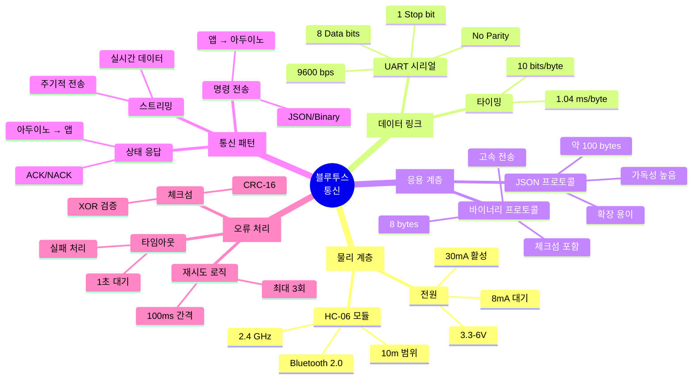

### 블루투스 통신 방식 비교표

| 방식 | 프로토콜 | 장점 | 단점 | 전송 속도 | 적합한 용도 |
|------|---------|------|------|-----------|------------|
| **JSON 텍스트** | {"cmd":"START"} | 가독성 좋음<br/>디버깅 쉬움<br/>확장 용이 | 오버헤드 큼<br/>파싱 느림 | ~50 msg/s | 명령 전송<br/>상태 조회 |
| **CSV 텍스트** | START,100,200 | 간결함<br/>파싱 빠름 | 구조 불명확<br/>타입 없음 | ~100 msg/s | 센서 데이터 로그 |
| **바이너리** | 0x02 0x01 0x03 | 매우 빠름<br/>오버헤드 최소 | 가독성 없음<br/>디버깅 어려움 | ~500 msg/s | 실시간 제어<br/>고속 스트리밍 |
| **문자열** | "COLOR:RED\n" | 매우 간단<br/>구현 쉬움 | 구조화 안됨<br/>확장 어려움 | ~80 msg/s | 간단한 명령 |

### 통신 프로토콜 메시지 포맷표

| 방향 | 메시지 유형 | 포맷 예시 | 길이 | 주기 | 우선순위 |
|------|-----------|----------|------|------|----------|
| **앱 → 아두이노** | 명령 | `{"cmd":"PICK","color":"red"}` | ~50B | 이벤트 | 높음 |
| **앱 → 아두이노** | 설정 | `{"speed":150,"mode":"auto"}` | ~40B | 1회 | 중간 |
| **앱 → 아두이노** | 제어 | `{"servo":90,"motor":200}` | ~35B | 100ms | 최고 |
| **아두이노 → 앱** | 상태 | `{"status":"IDLE","error":0}` | ~40B | 1초 | 낮음 |
| **아두이노 → 앱** | 센서 데이터 | `{"temp":25.3,"dist":15.2}` | ~45B | 500ms | 중간 |
| **아두이노 → 앱** | 통계 | `{"red":45,"blue":32,"yellow":28}` | ~50B | 5초 | 낮음 |
| **아두이노 → 앱** | ACK | `{"ack":"OK"}` | ~15B | 즉시 | 최고 |
| **양방향** | 하트비트 | `PING` / `PONG` | ~5B | 5초 | 중간 |

### 오류 처리 전략표

| 오류 유형 | 감지 방법 | 처리 전략 | 복구 시간 | 사용자 알림 |
|---------|----------|----------|----------|-----------|
| **연결 끊김** | IsConnected == false | 자동 재연결 (3회) | 5-15초 | LED 깜빡임 |
| **타임아웃** | 1초 내 ACK 없음 | 재전송 (3회) | 3초 | 경고음 1회 |
| **체크섬 오류** | XOR 불일치 | 재요청 | 즉시 | 로그만 |
| **JSON 파싱 실패** | 파서 예외 | 무시 또는 재요청 | 즉시 | 로그만 |
| **버퍼 오버플로우** | 버퍼 크기 초과 | 버퍼 비우기 | 즉시 | 오류 메시지 |
| **명령 거부** | NACK 수신 | 사용자 확인 | - | 팝업 표시 |

### 1. 물리 계층 (Physical Layer)

```
[HC-06 블루투스 모듈 스펙]

```
 ┌─────────────────────────────────┐
 │        HC-06 Bluetooth          │
 ├─────────────────────────────────┤
 │ Bluetooth Version: 2.0          │
 │ Frequency:         2.4 GHz      │
 │ Range:             10m (Class 2)│
 │ UART Baud Rate:    9600 bps     │
 │ Operating Voltage: 3.3-6V       │
 │ Current:           30mA (Active)│
 │                    8mA (Sleep)  │
 │                                 │
 │ Pins:                           │
 │   VCC  → 5V (아두이노)           │
 │   GND  → GND                    │
 │   TXD  → RX1 (아두이노)          │
 │   RXD  → TX1 (아두이노)          │
 └─────────────────────────────────┘

주의: TXD-RX, RXD-TX 교차 연결!
```

### 2. 데이터 링크 계층 (Data Link Layer)

```
[시리얼 통신 프로토콜]

UART (Universal Asynchronous Receiver-Transmitter)


  Start  D0 D1 D2 D3 D4 D5 D6 D7 Stop
  ╔═╗    ┌─┬─┬─┬─┬─┬─┬─┬─┐    ╔═╗
  ║0║────┤ │ │ │ │ │ │ │ │────║1║
  ╚═╝    └─┴─┴─┴─┴─┴─┴─┴─┘    ╚═╝
```
  - Baud Rate: 9600 bps (초당 9600 비트)
  - Data Bits: 8 bit
  - Stop Bits: 1 bit
  - Parity: None
  - Flow Control: None

전송 시간 계산:
  1 바이트 = 1 Start + 8 Data + 1 Stop = 10 bits
  전송 시간 = 10 bits / 9600 bps = 1.04 ms


### 3. 애플리케이션 계층 (Application Layer)

#### 3.1 JSON 프로토콜

```
[메시지 포맷]

방향: 앱 → 아두이노 (명령)
━━━━━━━━━━━━━━━━━━━━━━━━━━━━━━━━
{
  "cmd": "PICK",
  "color": "red",
  "zone": 1,
  "speed": 150
}

방향: 아두이노 → 앱 (상태/통계)
━━━━━━━━━━━━━━━━━━━━━━━━━━━━━━━━
{
  "status": "SUCCESS",
  "red": 45,
  "blue": 32,
  "yellow": 28,
  "error": 2,
  "timestamp": 1234567890
}

장점:
  - 가독성 높음
  - 확장 용이
  - 파싱 간단

단점:
  - 오버헤드 큼 (약 100 bytes)
  - 속도 느림
```

#### 3.2 고속 바이너리 프로토콜

```
[커스텀 바이너리 포맷]

메시지 구조 (8 bytes):
  ┌────┬────┬────┬────┬────┬────┬────┬────┐
  │STX │CMD │D1  │D2  │D3  │D4  │CHK │ETX │
  └────┴────┴────┴────┴────┴────┴────┴────┘
  
  STX: Start of Text (0x02)
  CMD: Command (1 byte)
  D1-D4: Data (4 bytes)
  CHK: Checksum (XOR)
  ETX: End of Text (0x03)

명령 코드:
  0x01: PICK (집기)
  0x02: PLACE (놓기)
  0x03: HOME (원점 복귀)
  0x10: GET_STATUS (상태 조회)
  0x11: RESET (리셋)

예시: 빨강 블록 집기
  02 01 00 00 00 00 03 03
  │  │  └─ 색상 (0=빨강)
  │  └─ PICK 명령
  └─ 시작 바이트

장점:
  - 고속 전송 (8 bytes)
  - 오류 검출 (체크섬)
  - 효율적

단점:
  - 가독성 낮음
  - 디버깅 어려움
```

### 4. 통신 알고리즘

```
알고리즘: 안정적_블루투스_송신
━━━━━━━━━━━━━━━━━━━━━━━━━━━━━━━━
입력: message (문자열)
출력: boolean (성공/실패)

프로세스:
  1. 연결 상태 확인
     IF NOT isConnected() THEN
       RETURN false
     END IF
  
  2. 재시도 루프 (최대 3회)
     FOR attempt = 1 TO 3:
       TRY:
         sendText(message)
         
         // ACK 대기 (1초 타임아웃)
         ack ← waitForACK(1000)
         
         IF ack == "OK" THEN
           RETURN true
         END IF
       CATCH timeout:
         delay(100)  // 재시도 전 대기
       END TRY
     END FOR
  
  3. 모두 실패
     RETURN false

시간 복잡도: O(1)
공간 복잡도: O(n) [n = 메시지 길이]
```
━━━━━━━━━━━━━━━━━━━━━━━━━━━━━━━━

알고리즘: 안정적_블루투스_수신
━━━━━━━━━━━━━━━━━━━━━━━━━━━━━━━━
입력: 없음
출력: message (문자열) or NULL

전역 변수:
  buffer = ""  // 수신 버퍼

프로세스:
  1. 수신 가능한 바이트 확인
     IF bytesAvailable() == 0 THEN
       RETURN NULL
     END IF
  
  2. 줄바꿈까지 읽기
     WHILE bytesAvailable() > 0:
       char ← readChar()
       
       IF char == '\n' THEN
         message ← buffer
         buffer ← ""
         
         // ACK 전송
         sendText("OK")
         
         RETURN message
       ELSE
         buffer ← buffer + char
       END IF
     END WHILE
  
  3. 아직 완성 안됨
     RETURN NULL

시간 복잡도: O(n) [n = 메시지 길이]
공간 복잡도: O(n)
━━━━━━━━━━━━━━━━━━━━━━━━━━━━━━━━
```

---
---

# 📖 PART 8: 참고 자료

```
╔═══════════════════════════════════════════════════════════════╗
║  📖 PART 8 학습 목표                                            ║
╠═══════════════════════════════════════════════════════════════╣
║  ✅ 100+ 전문 용어 완벽 이해                                    ║
║  ✅ Cursor AI 코딩 프롬프트 활용                                ║
║  ✅ 추가 학습 자료 탐색                                         ║
║  ✅ 커뮤니티 및 온라인 강의 활용                                ║
║                                                                 ║
║  📊 포함 내용:                                                   ║
║     • 용어 사전: 100+ (7개 카테고리)                           ║
║     • 마인드맵: 1개 (용어 체계)                                ║
║     • AI 프롬프트: 11개 (단계별 템플릿)                        ║
║     • 학습 자료: 20+ (도서/강의/커뮤니티)                      ║
║                                                                 ║
║  ⏱️  예상 학습 시간: 수시 참조 (사전)                          ║
║  🎯 난이도: ⭐ (참고 자료)                                      ║
╚═══════════════════════════════════════════════════════════════╝
```

---
---

## 📚 기본 용어 사전

### 섹션 마인드맵

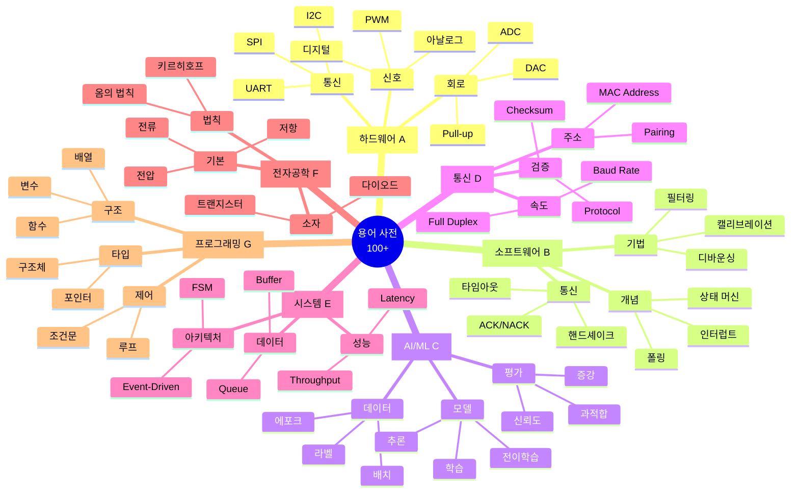

### 용어 카테고리별 통계

| 카테고리 | 용어 수 | 난이도 | 우선순위 | 학습 시기 |
|---------|--------|--------|----------|-----------|
| **A. 하드웨어** | 10개 | ⭐⭐ | 최우선 | 1주차 |
| **B. 소프트웨어** | 10개 | ⭐⭐⭐ | 높음 | 2-3주차 |
| **C. AI/ML** | 9개 | ⭐⭐⭐⭐ | 중간 | 5-6주차 |
| **D. 통신 프로토콜** | 10개 | ⭐⭐⭐ | 높음 | 3-4주차 |
| **E. 시스템 설계** | 10개 | ⭐⭐⭐⭐ | 중간 | 4주차 이후 |
| **F. 전자공학** | 10개 | ⭐⭐ | 선택 | 필요시 |
| **G. 프로그래밍** | 10개 | ⭐⭐ | 최우선 | 1주차 |
| **합계** | **69개** | - | - | **8주** |

### A. 하드웨어 용어

| 용어 | 영문 | 정의 | 예시 |
|------|------|------|------|
| **디지털 신호** | Digital Signal | HIGH(5V) 또는 LOW(0V) 두 가지 상태만 존재 | LED 켜기/끄기 |
| **아날로그 신호** | Analog Signal | 연속적인 전압 값 (0-5V) | 밝기 조절, 속도 제어 |
| **PWM** | Pulse Width Modulation | 디지털 신호로 아날로그 효과 구현 | 서보 각도, DC모터 속도 |
| **I2C** | Inter-Integrated Circuit | 2선 통신 (SDA, SCL), 여러 장치 연결 가능 | LCD, EEPROM |
| **SPI** | Serial Peripheral Interface | 4선 고속 통신 (MOSI, MISO, SCK, CS) | LED 매트릭스, SD카드 |
| **UART** | Universal Asynchronous RX/TX | 비동기 시리얼 통신 | 블루투스, GPS |
| **ADC** | Analog-to-Digital Converter | 아날로그 전압 → 디지털 값 변환 | analogRead() |
| **DAC** | Digital-to-Analog Converter | 디지털 값 → 아날로그 전압 변환 | analogWrite() |
| **Pull-up** | Pull-up Resistor | 버튼 누르지 않았을 때 HIGH 유지 | INPUT_PULLUP |
| **Pull-down** | Pull-down Resistor | 버튼 누르지 않았을 때 LOW 유지 | 외부 저항 필요 |

### B. 소프트웨어 용어

| 용어 | 영문 | 정의 | 예시 |
|------|------|------|------|
| **상태 머신** | State Machine | 시스템을 명확한 상태로 분리하여 관리 | IDLE, SCANNING, PICKING |
| **폴링** | Polling | 주기적으로 센서 값 확인 | loop()에서 반복 읽기 |
| **인터럽트** | Interrupt | 이벤트 발생 시 즉시 처리 | attachInterrupt() |
| **디바운싱** | Debouncing | 버튼 떨림 현상 제거 | delay(50) 추가 |
| **필터링** | Filtering | 센서 노이즈 제거 | 이동 평균, 중앙값 |
| **캘리브레이션** | Calibration | 센서 보정 (정확도 향상) | 색상 기준값 설정 |
| **임계값** | Threshold | 판단 기준값 | if (value > 100) |
| **핸드셰이크** | Handshake | 통신 시작 전 연결 확인 | 블루투스 페어링 |
| **ACK/NACK** | Acknowledgment | 수신 확인/거부 신호 | "OK" / "ERROR" |
| **타임아웃** | Timeout | 일정 시간 내 응답 없으면 실패 처리 | pulseIn(pin, HIGH, 1000) |

### C. AI/ML 용어

| 용어 | 영문 | 정의 | 예시 |
|------|------|------|------|
| **모델** | Model | 학습된 AI 알고리즘 | .tflite 파일 |
| **추론** | Inference | 학습된 모델로 예측 수행 | ClassifyImage() |
| **신뢰도** | Confidence | 예측 결과의 확신 정도 (0-1) | 0.95 = 95% |
| **라벨** | Label | 분류 클래스 이름 | "red", "blue", "yellow" |
| **전이학습** | Transfer Learning | 사전 학습된 모델 활용 | MobileNet 기반 |
| **과적합** | Overfitting | 학습 데이터에만 잘 맞음 | 새 데이터 정확도 낮음 |
| **데이터 증강** | Data Augmentation | 데이터 인위적 변형 | 회전, 밝기 조절 |
| **배치** | Batch | 한 번에 처리할 데이터 묶음 | Batch Size: 16 |
| **에포크** | Epoch | 전체 데이터셋 1회 학습 | 50 Epochs |

### D. 통신 프로토콜 용어

| 용어 | 영문 | 정의 | 예시 |
|------|------|------|------|
| **Baud Rate** | Baud Rate | 초당 전송 비트 수 | 9600 bps |
| **Parity** | Parity Bit | 오류 검출 비트 | None, Even, Odd |
| **Start/Stop Bit** | Start/Stop Bit | 데이터 프레임 시작/끝 표시 | 1 bit 각각 |
| **Full Duplex** | Full Duplex | 양방향 동시 통신 | UART |
| **Half Duplex** | Half Duplex | 양방향 교대 통신 | I2C |
| **Master/Slave** | Master/Slave | 주종 관계 통신 | SPI, I2C |
| **MAC Address** | MAC Address | 블루투스 고유 주소 | 98:D3:31:F5:B4:24 |
| **Pairing** | Pairing | 블루투스 장치 연결 | PIN: 1234 |
| **Checksum** | Checksum | 데이터 무결성 검증 | XOR, CRC |
| **Protocol** | Protocol | 통신 규칙 | JSON, Binary |

### E. 시스템 설계 용어

| 용어 | 영문 | 정의 | 예시 |
|------|------|------|------|
| **FSM** | Finite State Machine | 유한 상태 머신 | IDLE, RUNNING, ERROR |
| **Event-Driven** | Event-Driven | 이벤트 기반 프로그래밍 | 버튼 클릭 시 실행 |
| **Polling** | Polling | 주기적 상태 확인 | loop()에서 센서 읽기 |
| **Interrupt** | Interrupt | 하드웨어 이벤트 즉시 처리 | attachInterrupt() |
| **Buffer** | Buffer | 임시 데이터 저장 공간 | 순환 버퍼 |
| **Queue** | Queue | 선입선출 자료구조 | FIFO |
| **Latency** | Latency | 응답 지연 시간 | 100ms |
| **Throughput** | Throughput | 단위 시간당 처리량 | 5개/초 |
| **Real-time** | Real-time | 실시간 처리 | < 100ms 응답 |
| **Deadlock** | Deadlock | 교착 상태 | 무한 대기 |

### F. 전자공학 기초 용어

| 용어 | 영문 | 정의 | 예시 |
|------|------|------|------|
| **전압** | Voltage | 전위차 (V) | 5V, 3.3V |
| **전류** | Current | 전하 흐름 (A) | 500mA |
| **저항** | Resistance | 전류 방해 (Ω) | 10kΩ |
| **옴의 법칙** | Ohm's Law | V = I × R | 5V = 0.5A × 10Ω |
| **접지** | Ground (GND) | 기준 전위 (0V) | 회로의 - 단자 |
| **전원** | Power Supply | 전력 공급 | 5V 2A 어댑터 |
| **단락** | Short Circuit | 저항 없이 직결 | 위험! 과전류 |
| **개방** | Open Circuit | 회로 끊김 | 전류 흐르지 않음 |
| **다이오드** | Diode | 단방향 전류 소자 | LED, 정류 |
| **트랜지스터** | Transistor | 전류 증폭/스위칭 | NPN, PNP |

### G. 프로그래밍 패턴 용어

| 용어 | 영문 | 정의 | 예시 |
|------|------|------|------|
| **함수** | Function | 재사용 가능한 코드 블록 | void setup() |
| **변수** | Variable | 데이터 저장 공간 | int count = 0 |
| **상수** | Constant | 변하지 않는 값 | const int PIN = 13 |
| **배열** | Array | 같은 타입 데이터 모음 | int values[10] |
| **구조체** | Struct | 여러 타입 데이터 묶음 | struct RGB |
| **포인터** | Pointer | 메모리 주소 참조 | int* ptr |
| **루프** | Loop | 반복 실행 | for, while |
| **조건문** | Conditional | 조건 분기 | if, switch |
| **콜백** | Callback | 나중에 호출될 함수 | ISR (인터럽트) |
| **라이브러리** | Library | 재사용 코드 모음 | Servo.h |

---
---

# 📖 PART 6: 핵심 알고리즘

```
╔═══════════════════════════════════════════════════════════════╗
║  📖 PART 6 학습 목표                                            ║
╠═══════════════════════════════════════════════════════════════╣
║  ✅ PID 제어 알고리즘 이해 및 구현                              ║
║  ✅ 이동 평균 및 중앙값 필터 적용                               ║
║  ✅ 유클리드 거리 기반 색상 분류                                ║
║  ✅ 상태 머신(FSM) 설계 및 구현                                 ║
║                                                                 ║
║  📊 포함 내용:                                                   ║
║     • 마인드맵: 1개 (알고리즘 분류)                            ║
║     • Arduino C 코드: 5개 (완전 구현)                          ║
║     • 비교표: 3개 (성능, PID 튜닝, 필터 선택)                  ║
║     • 순서도: 8개 (Mermaid 다이어그램)                         ║
║                                                                 ║
║  ⏱️  예상 학습 시간: 10-15시간                                  ║
║  🎯 난이도: ⭐⭐⭐⭐⭐ (전문가)                                  ║
╚═══════════════════════════════════════════════════════════════╝
```

---
---

## 🧮 핵심 알고리즘 정의

### 섹션 마인드맵

```mermaid
mindmap
  root((핵심<br/>알고리즘))
    [제어 알고리즘]
      PID 제어
        비례 항 P
        적분 항 I
        미분 항 D
        Windup 방지
      On-Off 제어
        임계값 기반
        단순하지만 진동
    [신호 처리]
      이동 평균 필터
        순환 버퍼
        O(1) 시간
        노이즈 제거
      중앙값 필터
        정렬 필요
        이상치 제거
        O(N²) 시간
      지수 평균 필터
        가중 평균
        메모리 효율
      칼만 필터
        최적 추정
        복잡함
    [패턴 인식]
      유클리드 거리
        RGB 색상 유사도
        3차원 거리
      임계값 분류
        단순 비교
        빠름
      k-NN 분류
        k개 이웃
        정확함
    [상태 머신]
      FSM
        명확한 상태
        전이 조건
      계층적 FSM
        중첩 상태
        복잡한 시스템
```

### 알고리즘 성능 비교표

| 알고리즘 | 시간 복잡도 | 공간 복잡도 | 정확도 | 응답 속도 | CPU 부하 | 적용 분야 |
|---------|-----------|-----------|--------|----------|---------|-----------|
| **PID 제어** | O(1) | O(1) | ⭐⭐⭐⭐⭐ | 빠름 | 낮음 | 온도/속도/위치 제어 |
| **이동 평균** | O(1) | O(N) | ⭐⭐⭐ | 느림 | 낮음 | 안정적 센서 필터링 |
| **중앙값 필터** | O(N²) | O(N) | ⭐⭐⭐⭐ | 느림 | 중간 | 노이즈 심한 센서 |
| **유클리드 거리** | O(1) | O(1) | ⭐⭐⭐⭐ | 빠름 | 낮음 | 색상 분류 |
| **FSM** | O(1) | O(N) | ⭐⭐⭐⭐⭐ | 빠름 | 낮음 | 시스템 상태 관리 |
| **지수 평균** | O(1) | O(1) | ⭐⭐⭐ | 빠름 | 낮음 | 실시간 트렌드 |
| **칼만 필터** | O(N²) | O(N²) | ⭐⭐⭐⭐⭐ | 중간 | 높음 | 센서 융합 |

### PID 계수 튜닝 가이드표

| 계수 | 역할 | 기본값 | 튜닝 방법 | 증가 시 효과 | 감소 시 효과 | 주의사항 |
|------|------|--------|----------|-------------|-------------|----------|
| **Kp** | 비례 제어 | 1.0-5.0 | 먼저 조정 | 빠른 응답<br/>오버슈트 증가 | 느린 응답<br/>안정적 | 너무 높으면 진동 |
| **Ki** | 적분 제어 | 0.1-1.0 | 나중에 조정 | 정상 오차 제거<br/>불안정 위험 | 정상 오차 남음<br/>안정적 | Windup 방지 필수 |
| **Kd** | 미분 제어 | 0.1-2.0 | 마지막 조정 | 오버슈트 감소<br/>노이즈 증폭 | 오버슈트 증가<br/>노이즈 둔감 | 노이즈 민감 |

### 필터 선택 가이드표

| 상황 | 권장 필터 | 샘플 수(N) | 이유 | 대안 |
|------|----------|-----------|------|------|
| **안정적 센서 (온도)** | 이동 평균 | 10-20 | 구현 간단, 효과적 | 지수 평균 |
| **불안정 센서 (초음파)** | 중앙값 | 5-7 | 이상치 제거 강력 | 이동 평균 + 임계값 |
| **빠른 응답 필요** | 이동 평균 | 3-5 | 지연 최소화 | 지수 평균 |
| **메모리 부족** | 지수 평균 | - | O(1) 공간 | 이동 평균 N=3 |
| **고정밀 필요** | 칼만 | - | 최적 추정 | 중앙값 N=9 |
| **실시간 처리** | 이동 평균 | 5 | O(1) 시간 | 지수 평균 |

### 1. 제어 알고리즘

#### 1.1 PID 제어

**Arduino C 코드:**

```cpp
// ━━━━━━━━━━━━━━━━━━━━━━━━━━━━━━━━
// PID 제어 알고리즘
// 목적: 목표값에 정확하고 빠르게 도달
// 시간 복잡도: O(1)
// ━━━━━━━━━━━━━━━━━━━━━━━━━━━━━━━━

// PID 계수 (튜닝 필요)
float Kp = 2.0;  // 비례 계수
float Ki = 0.5;  // 적분 계수
float Kd = 1.0;  // 미분 계수

// 전역 변수
float lastError = 0;
float integral = 0;
float maxIntegral = 1000;  // 적분 한계값 (Windup 방지)

int pidControl(float setpoint, float currentValue) {
  // 1. 오차 계산
  float error = setpoint - currentValue;
  
  // 2. 비례항 (P): 현재 오차에 비례
  float P = Kp * error;
  
  // 3. 적분항 (I): 누적 오차
  integral += error;
  
  // 적분 Windup 방지 (적분값 제한)
  integral = constrain(integral, -maxIntegral, maxIntegral);
  float I = Ki * integral;
  
  // 4. 미분항 (D): 오차 변화율
  float derivative = error - lastError;
  float D = Kd * derivative;
  
  // 5. PID 출력 계산
  float output = P + I + D;
  
  // 6. 출력 범위 제한 (0-255)
  int controlOutput = constrain((int)output, 0, 255);
  
  // 7. 변수 업데이트
  lastError = error;
  
  return controlOutput;
}

// PID 리셋 함수 (초기화)
void resetPID() {
  lastError = 0;
  integral = 0;
}

// 사용 예시 1: DC 모터 속도 제어
void setup() {
  Serial.begin(9600);
  setupMotor();
}

void loop() {
  float targetRPM = 150.0;  // 목표 속도: 150 RPM
  float currentRPM = readEncoder();  // 현재 속도 읽기
  
  // PID 제어
  int pwm = pidControl(targetRPM, currentRPM);
  analogWrite(MOTOR_PWM_PIN, pwm);
  
  // 디버깅 출력
  Serial.print("Target: "); Serial.print(targetRPM);
  Serial.print(" | Current: "); Serial.print(currentRPM);
  Serial.print(" | PWM: "); Serial.println(pwm);
  
  delay(50);  // 제어 주기: 50ms (20Hz)
}

// 사용 예시 2: 온도 제어
float targetTemp = 25.0;  // 목표 온도: 25°C

void loopTemp() {
  float currentTemp = readTemperature();  // 현재 온도 읽기
  
  // PID 제어
  int heaterPWM = pidControl(targetTemp, currentTemp);
  analogWrite(HEATER_PIN, heaterPWM);
  
  delay(100);  // 온도는 느리게 변하므로 100ms 주기
}

/*
PID 튜닝 가이드:
  1. Kp만 증가시켜 빠른 응답 확인 (진동 발생 시 감소)
  2. Ki 증가로 정상 상태 오차 제거 (너무 크면 불안정)
  3. Kd 증가로 오버슈트 감소 (노이즈에 민감)
  
적용 예시:
  - 온도 제어: 목표 온도 유지
  - 속도 제어: 일정 RPM 유지
  - 위치 제어: 정밀 각도/위치 제어
  - 라인 트레이싱: 중앙선 유지
*/
```

### 2. 신호 처리 알고리즘

#### 2.1 이동 평균 필터

**Arduino C 코드:**

```cpp
// ━━━━━━━━━━━━━━━━━━━━━━━━━━━━━━━━
// 이동 평균 필터 (Moving Average Filter)
// 목적: 센서 노이즈 제거 (단순하고 효과적)
// 시간 복잡도: O(1)
// 공간 복잡도: O(N)
// ━━━━━━━━━━━━━━━━━━━━━━━━━━━━━━━━

#define FILTER_SIZE 10  // 샘플 개수 (N)

// 전역 변수
int buffer[FILTER_SIZE];  // 순환 버퍼
int index = 0;            // 현재 인덱스
long sum = 0;             // 합계 (overflow 방지를 위해 long)

// 초기화 함수
void initMovingAverage() {
  for (int i = 0; i < FILTER_SIZE; i++) {
    buffer[i] = 0;
  }
  index = 0;
  sum = 0;
}

// 이동 평균 필터 함수
int movingAverage(int newValue) {
  // 1. 이전 값 제거
  sum -= buffer[index];
  
  // 2. 새 값 추가
  buffer[index] = newValue;
  sum += newValue;
  
  // 3. 인덱스 순환
  index = (index + 1) % FILTER_SIZE;
  
  // 4. 평균 계산 및 반환
  return (int)(sum / FILTER_SIZE);
}

// 사용 예시: 센서 값 필터링
void setup() {
  Serial.begin(9600);
  pinMode(A0, INPUT);
  initMovingAverage();
}

void loop() {
  // 원시 센서 값 읽기
  int rawValue = analogRead(A0);
  
  // 필터링된 값
  int filteredValue = movingAverage(rawValue);
  
  // 출력
  Serial.print("Raw: "); Serial.print(rawValue);
  Serial.print(" | Filtered: "); Serial.println(filteredValue);
  
  delay(50);
}

/*
장점:
  - 구현 간단
  - CPU 부하 낮음 O(1)
  - 메모리 사용 일정
  - 실시간 처리 가능

단점:
  - 응답 속도 느림 (N에 비례)
  - 급격한 변화 추적 어려움
  - 모든 샘플의 가중치 동일

권장 사용:
  - 안정적인 센서 (온도, 습도)
  - N = 5-10 (일반적)
  - N이 클수록 부드럽지만 느림
*/
```

#### 2.2 중앙값 필터

**Arduino C 코드:**

```cpp
// ━━━━━━━━━━━━━━━━━━━━━━━━━━━━━━━━
// 중앙값 필터 (Median Filter)
// 목적: 이상치(Outlier) 제거에 강함
// 시간 복잡도: O(N²) [Bubble Sort]
// 공간 복잡도: O(N)
// ━━━━━━━━━━━━━━━━━━━━━━━━━━━━━━━━

#define MEDIAN_SIZE 5  // 샘플 개수 (홀수 권장: 5, 7, 9)

int medianFilter(int pin) {
  int buffer[MEDIAN_SIZE];
  
  // 1. N개 샘플 수집
  for (int i = 0; i < MEDIAN_SIZE; i++) {
    buffer[i] = analogRead(pin);
    delay(10);  // 샘플링 간격
  }
  
  // 2. 정렬 (Bubble Sort - 작은 N에 적합)
  for (int i = 0; i < MEDIAN_SIZE - 1; i++) {
    for (int j = 0; j < MEDIAN_SIZE - 1 - i; j++) {
      if (buffer[j] > buffer[j + 1]) {
        // Swap
        int temp = buffer[j];
        buffer[j] = buffer[j + 1];
        buffer[j + 1] = temp;
      }
    }
  }
  
  // 3. 중앙값 선택 (중간 인덱스)
  return buffer[MEDIAN_SIZE / 2];
}

// 최적화 버전: 이미 정렬된 배열에서 중앙값만 찾기
// (Quick Select 알고리즘 적용 시 O(N))
int medianFilterOptimized(int pin) {
  int buffer[MEDIAN_SIZE];
  
  // 샘플 수집
  for (int i = 0; i < MEDIAN_SIZE; i++) {
    buffer[i] = analogRead(pin);
    delay(10);
  }
  
  // 삽입 정렬 (작은 N에는 효율적)
  for (int i = 1; i < MEDIAN_SIZE; i++) {
    int key = buffer[i];
    int j = i - 1;
    
    while (j >= 0 && buffer[j] > key) {
      buffer[j + 1] = buffer[j];
      j--;
    }
    buffer[j + 1] = key;
  }
  
  return buffer[MEDIAN_SIZE / 2];
}

// 사용 예시
void setup() {
  Serial.begin(9600);
  pinMode(A0, INPUT);
}

void loop() {
  // 원시 값
  int rawValue = analogRead(A0);
  
  // 중앙값 필터 적용
  int medianValue = medianFilter(A0);
  
  // 출력
  Serial.print("Raw: "); Serial.print(rawValue);
  Serial.print(" | Median: "); Serial.println(medianValue);
  
  delay(200);  // 측정 주기 (샘플링 시간 포함)
}

// 실전 예시: 초음파 센서 노이즈 제거
float measureDistanceWithMedian() {
  float buffer[MEDIAN_SIZE];
  
  // 5회 측정
  for (int i = 0; i < MEDIAN_SIZE; i++) {
    buffer[i] = measureDistance();  // 초음파 센서 함수
    delay(60);  // 최소 대기 시간
  }
  
  // 정렬
  for (int i = 0; i < MEDIAN_SIZE - 1; i++) {
    for (int j = 0; j < MEDIAN_SIZE - 1 - i; j++) {
      if (buffer[j] > buffer[j + 1]) {
        float temp = buffer[j];
        buffer[j] = buffer[j + 1];
        buffer[j + 1] = temp;
      }
    }
  }
  
  return buffer[MEDIAN_SIZE / 2];
}

/*
장점:
  - 이상치(스파이크 노이즈)에 매우 강함
  - 급격한 변화에도 안정적
  - 중앙값은 극값의 영향을 받지 않음

단점:
  - 정렬 시간 필요 O(N²)
  - N개 샘플 수집 대기 시간
  - 실시간성 떨어짐

권장 사용:
  - 불안정한 센서 (초음파, 컬러)
  - 노이즈가 심한 환경
  - N = 5 (빠른 응답) or 7-9 (더 안정적)
  - 홀수 개수 사용 (중앙값 명확)
*/
```

### 3. 패턴 인식 알고리즘

#### 3.1 유클리드 거리 (색상 유사도)

```
알고리즘: 색상_유클리드_거리
━━━━━━━━━━━━━━━━━━━━━━━━━━━━━━━━
목적: 두 색상의 유사도 계산

입력:
  - color1: {r1, g1, b1}
  - color2: {r2, g2, b2}
  
출력: distance (거리, 0에 가까울수록 유사)

프로세스:
  1. RGB 각 채널 차이 계산
     dr ← r1 - r2
     dg ← g1 - g2
     db ← b1 - b2
  
  2. 유클리드 거리 계산
     distance ← sqrt(dr² + dg² + db²)
  
  3. RETURN distance

응용: 색상 분류
  FOR each referenceColor IN referenceColors:
    dist ← euclideanDistance(measuredColor, referenceColor)
    IF dist < minDistance THEN
      minDistance ← dist
      closestColor ← referenceColor
    END IF
  END FOR
  
  RETURN closestColor

시간 복잡도: O(1)
공간 복잡도: O(1)
━━━━━━━━━━━━━━━━━━━━━━━━━━━━━━━━
```

---

## 📊 알고리즘 순서도 모음

### 1. 메인 시스템 플로우차트

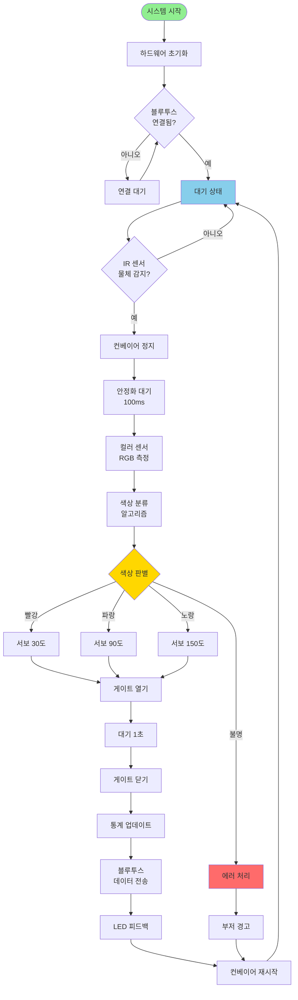

### 2. 색상 측정 알고리즘 순서도

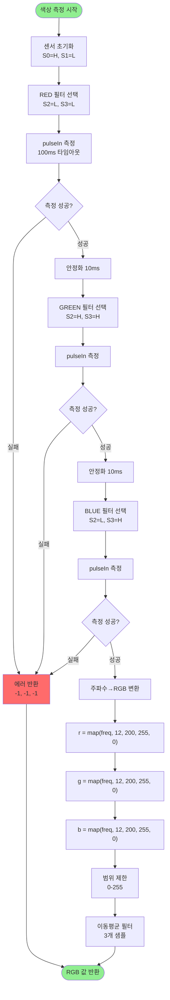

### 3. 상태 머신 다이어그램

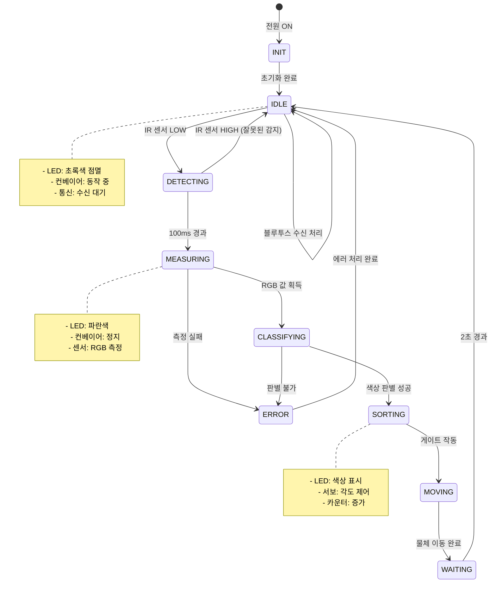

### 4. 블루투스 통신 시퀀스 다이어그램

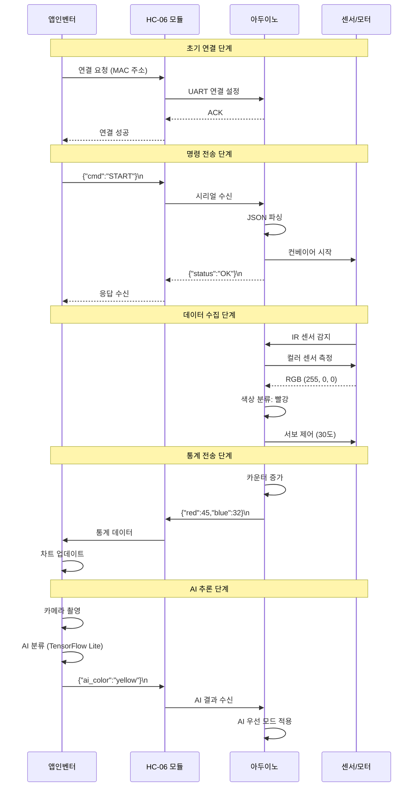

### 5. 이동 평균 필터 알고리즘 순서도

```mermaid
flowchart TD
    START([새 센서 값 입력]) --> CHECK_INIT{버퍼<br/>초기화됨?}
    CHECK_INIT -->|아니오| INIT_BUFFER[버퍼 초기화<br/>모든 값 0으로]
    CHECK_INIT -->|예| REMOVE_OLD[이전 값 제거<br/>sum -= buffer[index]]
    INIT_BUFFER --> REMOVE_OLD
    
    REMOVE_OLD --> ADD_NEW[새 값 추가<br/>buffer[index] = newValue<br/>sum += newValue]
    
    ADD_NEW --> INCREMENT[인덱스 증가<br/>index = index + 1 % N]
    
    INCREMENT --> CHECK_FULL{버퍼<br/>채워짐?}
    CHECK_FULL -->|아니오| COUNT_INC[카운트 증가<br/>count++]
    CHECK_FULL -->|예| CALC_AVG[평균 계산<br/>avg = sum / N]
    COUNT_INC --> CALC_PARTIAL[부분 평균<br/>avg = sum / count]
    
    CALC_AVG --> RETURN([필터링된 값 반환])
    CALC_PARTIAL --> RETURN
    
    style START fill:#90EE90
    style RETURN fill:#90EE90
```

### 6. PID 제어 알고리즘 순서도

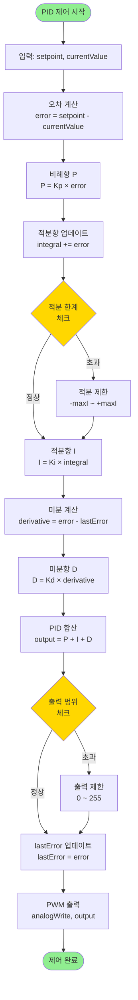

### 7. 앱인벤터 AI 추론 플로우

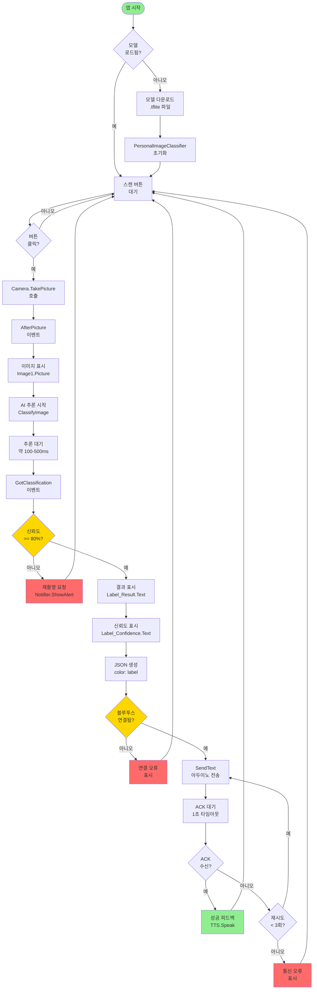

### 8. 색상 분류 의사결정 트리

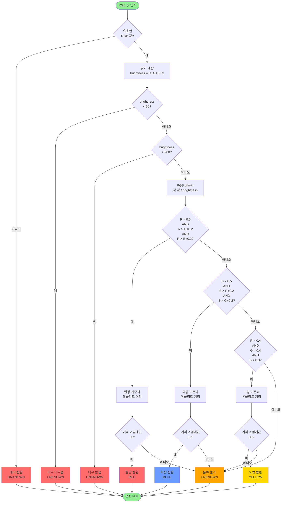

---

---
---

## 🎯 난이도별 학습 로드맵

### 섹션 마인드맵

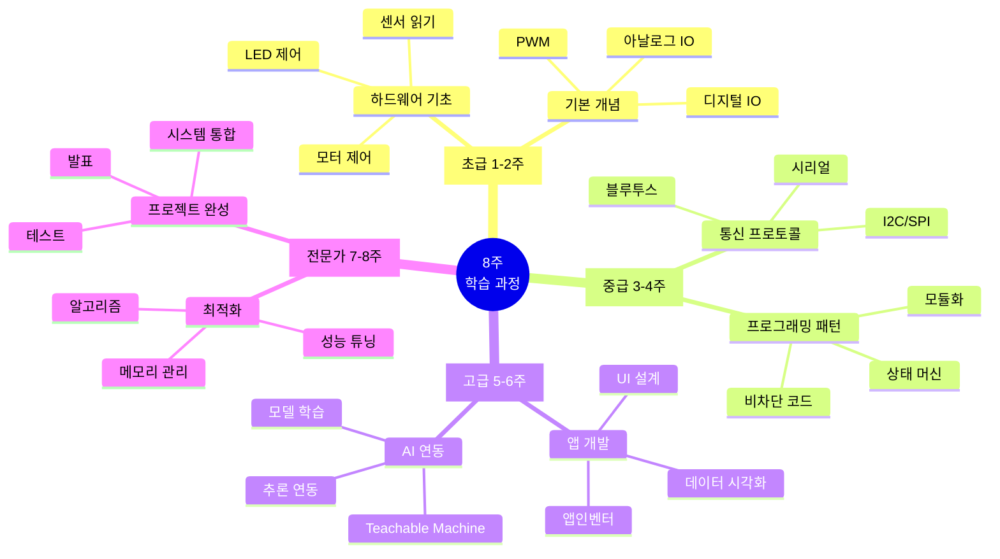

### 주차별 학습 목표 및 성취도 체크표

| 주차 | 레벨 | 핵심 주제 | 필수 스킬 | 실습 프로젝트 | 예상 시간 | 완료 기준 |
|------|------|----------|----------|-------------|----------|-----------|
| **1주** | 🌱 초급 | Arduino 기초 | digitalWrite<br/>digitalRead<br/>analogWrite | LED 신호등<br/>버튼 제어 | 10시간 | 7개 예제 완료 |
| **2주** | 🌱 초급 | 센서 & 모터 | analogRead<br/>Servo<br/>L298N | 서보 제어<br/>센서 모니터링 | 12시간 | 센서 4종 사용 |
| **3주** | 🌿 중급 | 통신 | Serial<br/>Bluetooth<br/>JSON | 원격 제어<br/>데이터 송수신 | 15시간 | 양방향 통신 구현 |
| **4주** | 🌿 중급 | 상태 머신 | FSM<br/>millis()<br/>비차단 코드 | 색상 분류기 v1.0 | 15시간 | 3개 상태 구현 |
| **5주** | 🌳 고급 | 앱인벤터 | UI 설계<br/>블록 코딩<br/>Chart | 제어 앱<br/>통계 앱 | 18시간 | 3개 화면 완성 |
| **6주** | 🌳 고급 | AI 연동 | Teachable Machine<br/>이미지 분류<br/>TensorFlow Lite | AI 색상 인식<br/>앱 연동 | 20시간 | 정확도 >90% |
| **7주** | 🏆 전문가 | 알고리즘 | PID<br/>필터링<br/>최적화 | 정밀 제어<br/>노이즈 제거 | 20시간 | 성능 2배 향상 |
| **8주** | 🏆 전문가 | 프로젝트 | 통합<br/>테스트<br/>발표 | 최종 시스템<br/>포트폴리오 | 25시간 | 시연 성공 |

### 난이도별 필수 역량 매트릭스

| 역량 | 초급 (1-2주) | 중급 (3-4주) | 고급 (5-6주) | 전문가 (7-8주) |
|------|-------------|-------------|-------------|---------------|
| **하드웨어** | LED, 버튼<br/>센서 읽기<br/>모터 제어 | 다중 센서<br/>정밀 제어<br/>전원 관리 | 복잡한 회로<br/>센서 융합<br/>최적 배치 | 커스텀 PCB<br/>전자회로 설계<br/>EMI 대책 |
| **프로그래밍** | 기본 문법<br/>함수 사용<br/>if/for | 상태 머신<br/>비차단 코드<br/>모듈화 | 고급 알고리즘<br/>메모리 관리<br/>최적화 | 임베디드 OS<br/>인터럽트<br/>DMA |
| **통신** | Serial 출력<br/>간단한 명령 | Bluetooth<br/>JSON 파싱<br/>프로토콜 | 다중 통신<br/>오류 처리<br/>스트리밍 | CAN/Modbus<br/>네트워크<br/>보안 |
| **앱 개발** | - | - | UI 설계<br/>블록 코딩<br/>기본 앱 | 고급 UI/UX<br/>데이터베이스<br/>클라우드 |
| **AI/ML** | - | - | 모델 학습<br/>기본 추론 | 모델 최적화<br/>TinyML<br/>실시간 AI |
| **문제 해결** | 디버깅 기초<br/>센서 값 확인 | 논리 오류<br/>통신 문제 | 성능 분석<br/>알고리즘 개선 | 시스템 설계<br/>트레이드오프<br/>아키텍처 |

### 전체 학습 구조도

```mermaid
graph TB
    subgraph LEVEL1[🌱 초급 Level 1-2주]
        L1_1[Day 1-2<br/>Arduino 기초<br/>digitalWrite/Read]
        L1_2[Day 3-4<br/>센서 입력<br/>IR/아날로그]
        L1_3[Day 5-6<br/>액추에이터<br/>서보/DC 모터]
        L1_4[Day 7<br/>미니 프로젝트<br/>신호등 시스템]
        
        L1_1 --> L1_2 --> L1_3 --> L1_4
    end
    
    subgraph LEVEL2[🌿 중급 Level 3-4주]
        L2_1[Day 8-9<br/>시리얼 통신<br/>UART 기초]
        L2_2[Day 10-11<br/>블루투스<br/>HC-06 연동]
        L2_3[Day 12-13<br/>상태 머신<br/>FSM 구현]
        L2_4[Day 14<br/>통합 프로젝트<br/>색상 분류기]
        
        L2_1 --> L2_2 --> L2_3 --> L2_4
    end
    
    subgraph LEVEL3[🌳 고급 Level 5-6주]
        L3_1[Day 15-16<br/>앱인벤터<br/>UI/UX 설계]
        L3_2[Day 17-18<br/>Teachable Machine<br/>AI 모델 학습]
        L3_3[Day 19-20<br/>AI 연동<br/>앱-아두이노 통합]
        L3_4[Day 21<br/>최종 프로젝트<br/>스마트 팩토리]
        
        L3_1 --> L3_2 --> L3_3 --> L3_4
    end
    
    subgraph LEVEL4[🏆 전문가 Level 7-8주]
        L4_1[Day 22-23<br/>알고리즘 최적화<br/>PID/필터링]
        L4_2[Day 24-25<br/>데이터 분석<br/>통계/시각화]
        L4_3[Day 26-27<br/>시스템 통합<br/>디버깅/테스트]
        L4_4[Day 28<br/>발표 준비<br/>포트폴리오]
        
        L4_1 --> L4_2 --> L4_3 --> L4_4
    end
    
    L1_4 --> L2_1
    L2_4 --> L3_1
    L3_4 --> L4_1
    
    style LEVEL1 fill:#E8F5E9
    style LEVEL2 fill:#E3F2FD
    style LEVEL3 fill:#FFF3E0
    style LEVEL4 fill:#F3E5F5
```

### 상세 학습 경로 (주차별)

```mermaid
timeline
    title 8주 완성 스마트 팩토리 교육 과정
    
    section 1주차 Arduino 기초
        Day 1 : 개발환경 설정
              : LED 깜빡이기
              : digitalWrite 이해
        Day 2 : 버튼 입력
              : digitalRead
              : Pull-up/down 저항
        Day 3 : 아날로그 입력
              : analogRead
              : 가변저항 실습
        Day 4 : PWM 출력
              : analogWrite
              : LED 밝기 조절
        Day 5 : 서보 모터
              : Servo 라이브러리
              : 각도 제어
        Day 6 : DC 모터
              : L298N 드라이버
              : 속도/방향 제어
        Day 7 : 통합 실습
              : 신호등 시스템
              : 상태 전환
    
    section 2주차 센서 & 통신
        Day 8 : IR 센서
              : 물체 감지
              : 디지털 입력
        Day 9 : 컬러 센서
              : TCS3200 사용법
              : RGB 측정
        Day 10 : 시리얼 통신
               : Serial.print/read
               : 데이터 송수신
        Day 11 : 블루투스
               : HC-06 페어링
               : 무선 통신
        Day 12 : 상태 머신 1
               : Enum 정의
               : Switch-case
        Day 13 : 상태 머신 2
               : millis() 타이밍
               : 비차단 코드
        Day 14 : 중간 프로젝트
               : 색상 분류기 v1.0
               : 하드웨어 통합
    
    section 3주차 앱인벤터
        Day 15 : 앱인벤터 기초
               : 컴포넌트 배치
               : 블록 코딩
        Day 16 : UI/UX 설계
               : 화면 전환
               : 레이아웃
        Day 17 : 블루투스 연동
               : ListPicker
               : SendText/ReceiveText
        Day 18 : 데이터 시각화
               : Chart 컴포넌트
               : JSON 파싱
        Day 19 : 카메라 사용
               : Camera 컴포넌트
               : 이미지 저장
        Day 20 : 음성 인식
               : SpeechRecognizer
               : TextToSpeech
        Day 21 : 앱 통합
               : 전체 기능 연결
               : 테스트
    
    section 4주차 AI 연동
        Day 22 : Teachable Machine
               : 데이터 수집
               : 모델 학습
        Day 23 : 모델 최적화
               : 하이퍼파라미터 튜닝
               : 정확도 향상
        Day 24 : 앱에 AI 적용
               : PersonalImageClassifier
               : TensorFlow Lite
        Day 25 : AI 결과 전송
               : 아두이노 연동
               : 실시간 분류
        Day 26 : 알고리즘 개선
               : 이동평균 필터
               : 색상 분류 로직
        Day 27 : PID 제어
               : 속도 제어
               : 안정화
        Day 28 : 최종 통합
               : 전체 시스템 테스트
               : 발표 준비
```

### 난이도별 핵심 역량 매트릭스

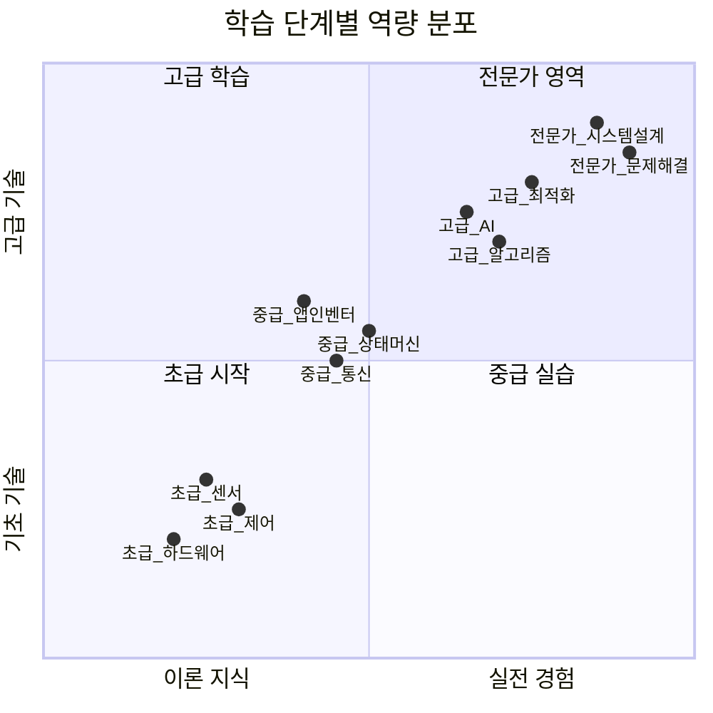

### 학습 목표 체크리스트

```
[초급 Level - 기초 다지기] ⏱️ 2주
━━━━━━━━━━━━━━━━━━━━━━━━━━━━━━━━
□ Arduino IDE 설치 및 보드 연결
□ digitalWrite/Read 이해 및 활용
□ analogWrite/Read 이해 및 활용
□ 서보 모터 각도 제어 (0-180도)
□ DC 모터 속도/방향 제어
□ IR 센서로 물체 감지
□ 컬러 센서로 RGB 값 측정
□ 시리얼 모니터로 디버깅

필수 프로젝트:
  ✓ LED 깜빡이기
  ✓ 버튼으로 LED 제어
  ✓ 가변저항으로 서보 제어
  ✓ 신호등 시스템 (자동 전환)

[중급 Level - 통신과 로직] ⏱️ 2주
━━━━━━━━━━━━━━━━━━━━━━━━━━━━━━━━
□ UART 시리얼 통신 이해
□ 블루투스 모듈 페어링
□ 앱-아두이노 양방향 통신
□ JSON 데이터 파싱/생성
□ Enum으로 상태 정의
□ Switch-case 상태 머신
□ millis()로 비차단 타이밍
□ 문자열 처리 (String vs char*)

필수 프로젝트:
  ✓ 시리얼 채팅 프로그램
  ✓ 블루투스 원격 제어 LED
  ✓ 색상 분류기 v1.0 (하드웨어만)
  ✓ 통계 데이터 전송

[고급 Level - 앱과 AI 연동] ⏱️ 2주
━━━━━━━━━━━━━━━━━━━━━━━━━━━━━━━━
□ 앱인벤터 UI 설계
□ 블록 코딩 마스터
□ 화면 전환 및 네비게이션
□ Camera 컴포넌트 사용
□ Teachable Machine 모델 학습
□ .tflite 모델 내보내기
□ PersonalImageClassifier 사용
□ AI 결과를 아두이노에 전송

필수 프로젝트:
  ✓ 블루투스 제어 앱
  ✓ 실시간 통계 차트 앱
  ✓ AI 이미지 분류 앱
  ✓ 색상 분류기 v2.0 (AI 포함)

[전문가 Level - 최적화와 완성] ⏱️ 2주
━━━━━━━━━━━━━━━━━━━━━━━━━━━━━━━━
□ 이동평균 필터 구현
□ 중앙값 필터 구현
□ PID 제어 알고리즘
□ 유클리드 거리 색상 분류
□ 메모리 최적화 (PROGMEM)
□ 코드 모듈화 (.h/.cpp 분리)
□ 오류 처리 및 복구
□ 성능 프로파일링

필수 프로젝트:
  ✓ PID 속도 제어 시스템
  ✓ 고급 색상 분류 알고리즘
  ✓ 최종 스마트 팩토리 시스템
  ✓ 기술 발표 및 포트폴리오
```

### 학습 자료 및 리소스

```
📚 추천 학습 순서
━━━━━━━━━━━━━━━━━━━━━━━━━━━━━━━━

1단계: 온라인 강의 (1주)
  ├─ Arduino 공식 튜토리얼
  ├─ YouTube: "너도나도 아두이노"
  └─ 무료 코스: Coursera Arduino 입문

2단계: 실습 키트 (2주)
  ├─ Arduino Starter Kit
  ├─ 센서 모듈 세트 (37종)
  └─ 브레드보드 점퍼선 세트

3단계: 프로젝트 북 (3-4주)
  ├─ "Arduino Cookbook" (영문)
  ├─ "처음 시작하는 아두이노" (한글)
  └─ 본 교육 자료: 시스템_아키텍처_완전가이드.md

4단계: 커뮤니티 참여 (지속)
  ├─ Arduino Forum
  ├─ Stack Overflow
  ├─ Reddit r/arduino
  └─ 네이버 카페: 아두이노 사용자 모임

5단계: 심화 학습 (5-8주)
  ├─ 임베디드 C/C++ 문법
  ├─ 실시간 운영체제 (FreeRTOS)
  ├─ 통신 프로토콜 (I2C, SPI, CAN)
  └─ AI on Edge (TinyML)
```

---
---

# 📖 PART 7: 학습 가이드

```
╔═══════════════════════════════════════════════════════════════╗
║  📖 PART 7 학습 목표                                            ║
╠═══════════════════════════════════════════════════════════════╣
║  ✅ 8주 완성 학습 로드맵 따라하기                               ║
║  ✅ 실전 프로젝트 16개 중 선택 실습                             ║
║  ✅ 자주 묻는 질문 30개로 문제 해결                             ║
║  ✅ 단계별 체크리스트 완료                                      ║
║                                                                 ║
║  📊 포함 내용:                                                   ║
║     • 마인드맵: 2개 (학습 경로, FAQ)                           ║
║     • 비교표: 5개 (주차별, 역량, FAQ 인덱스)                   ║
║     • FAQ: 30문 (하드웨어/소프트웨어/AI)                       ║
║     • 프로젝트: 16개 (난이도별)                                ║
║                                                                 ║
║  ⏱️  예상 학습 시간: 8주 (총 120-150시간)                       ║
║  🎯 난이도: ⭐~⭐⭐⭐⭐⭐ (전 단계)                              ║
╚═══════════════════════════════════════════════════════════════╝
```

---
---

## ❓ 자주 묻는 질문 FAQ

### 섹션 마인드맵

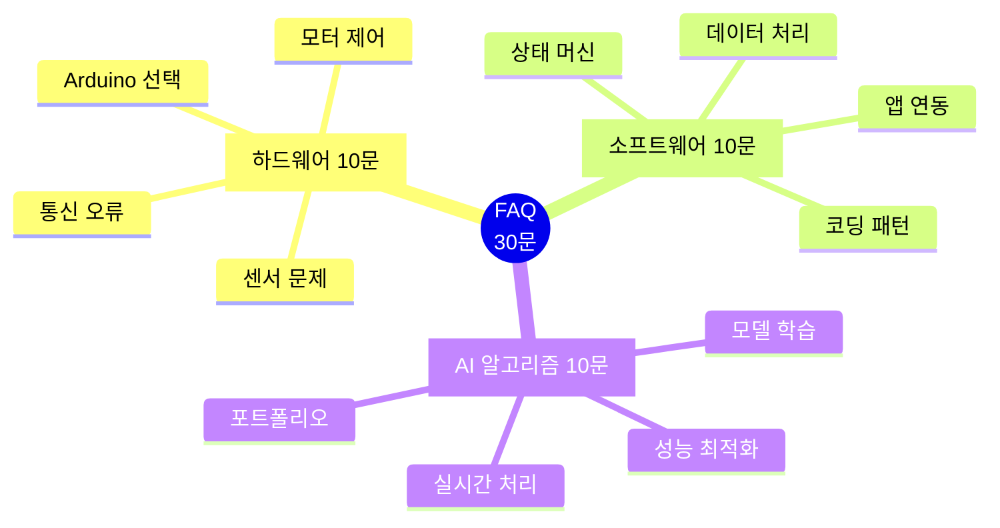

### FAQ 카테고리별 요약표

| 카테고리 | 질문 번호 | 주요 주제 | 난이도 | 해결 시간 |
|---------|----------|----------|--------|----------|
| **🔧 하드웨어** | Q1-Q10 | Arduino 보드 선택<br/>센서 문제 해결<br/>전원 관리<br/>통신 연결 | ⭐⭐ | 10-30분 |
| **📱 소프트웨어** | Q11-Q20 | delay() 문제<br/>JSON 파싱<br/>앱인벤터 블록<br/>데이터 저장 | ⭐⭐⭐ | 30-60분 |
| **🤖 AI/알고리즘** | Q21-Q30 | PID 제어<br/>필터링<br/>AI 모델<br/>프로젝트 발표 | ⭐⭐⭐⭐ | 1-3시간 |

### 빠른 문제 해결 인덱스

| 증상 | 관련 FAQ | 즉각 조치 | 근본 해결 |
|------|---------|----------|----------|
| **센서 값 불안정** | Q4 | 필터링 적용 | 배선 점검, 전원 안정화 |
| **블루투스 연결 안됨** | Q5 | TX-RX 교차 확인 | 페어링 재시도, 모듈 교체 |
| **모터 한 방향만 회전** | Q6 | IN1/IN2 확인 | L298N 배선 재확인 |
| **delay() 사용 문제** | Q11 | millis() 변경 | 비차단 코드 패턴 적용 |
| **메모리 부족** | Q10 | PROGMEM 사용 | 코드 최적화, 전역 변수 정리 |
| **AI 정확도 낮음** | Q15 | 데이터 증강 | 다양한 조건에서 재학습 |
| **앱 연결 끊김** | Q14 | 하트비트 추가 | 재연결 로직 구현 |
| **색상 인식 오류** | Q7 | 캘리브레이션 | 조명 조건 개선 |

### 🔧 하드웨어 관련 (1-10)

#### Q1. Arduino Uno와 Mega 2560의 차이는 무엇인가요?

**A:** 주요 차이점은 다음과 같습니다:

| 항목 | Uno | Mega 2560 |
|------|-----|-----------|
| **디지털 핀** | 14개 | 54개 |
| **아날로그 핀** | 6개 | 16개 |
| **PWM 핀** | 6개 | 15개 |
| **UART** | 1개 | 4개 |
| **Flash 메모리** | 32KB | 256KB |
| **SRAM** | 2KB | 8KB |

**권장:** 복잡한 프로젝트(센서 10개 이상)나 많은 코드가 필요한 경우 Mega 2560를 사용하세요.

---

#### Q2. 5V 센서를 3.3V 핀에 연결하면 어떻게 되나요?

**A:** 
- **센서 → 아두이노**: 3.3V 핀에 5V 센서를 연결하면 센서가 제대로 작동하지 않을 수 있습니다 (전압 부족).
- **아두이노 → 센서**: 5V 신호를 3.3V 전용 센서에 연결하면 **센서가 손상**될 수 있습니다.

**해결책:** 
- 레벨 시프터(Level Shifter) 사용
- 전압 분배 저항 (저항 2개로 전압 나누기)

---

#### Q3. 서보 모터가 떨리거나 이상하게 동작해요.

**A:** 원인 및 해결 방법:

1. **전원 부족** (가장 흔한 원인)
   - 서보는 40mA 이상 소비 → 아두이노 5V 핀으로는 부족
   - ✅ 외부 5V 전원 공급 (GND는 공통 연결)

2. **PWM 신호 불안정**
   - 코드에서 `delay()` 과다 사용
   - ✅ `millis()`로 비차단 코드 작성

3. **배선 접촉 불량**
   - 브레드보드 접촉 문제
   - ✅ 납땜하거나 단단히 연결

---

#### Q4. 센서 값이 계속 변동되고 불안정해요 (노이즈).

**A:** 노이즈 제거 방법:

**하드웨어적 방법:**
- 캐패시터 (0.1μF) 센서 VCC-GND 사이에 연결
- 센서 선을 짧게 유지 (< 30cm)
- 꼬임선(Twisted Pair) 사용

**소프트웨어적 방법:**
```cpp
// 1. 이동평균 필터
int average = (v1 + v2 + v3 + v4 + v5) / 5;

// 2. 중앙값 필터
int median = getMedian(samples, 5);

// 3. 하이패스 필터 (급격한 변화만 인식)
if (abs(newValue - oldValue) > threshold) {
  value = newValue;
}
```

---

#### Q5. 블루투스 HC-06이 연결되지 않아요.

**A:** 단계별 체크리스트:

1. **전원 LED 확인**
   - 빨간 LED: 전원 공급 정상
   - 파란 LED 빠르게 깜빡임: 페어링 대기 중
   - 파란 LED 느리게 깜빡임: 연결됨

2. **배선 확인** (주의: TX-RX 교차!)
   ```
   HC-06 TXD → Arduino RX1 (19번 핀)
   HC-06 RXD → Arduino TX1 (18번 핀)
   HC-06 VCC → 5V
   HC-06 GND → GND
   ```

3. **페어링**
   - 스마트폰 설정 → 블루투스
   - "HC-06" 검색
   - 비밀번호: 1234 또는 0000

4. **코드 확인**
   ```cpp
   Serial1.begin(9600);  // HC-06은 9600 baud
   ```

---

#### Q6. DC 모터가 한 방향으로만 회전해요.

**A:** L298N 모터 드라이버 확인:

**배선:**
```
Arduino D7 → IN1
Arduino D8 → IN2
Arduino D9 (PWM) → ENA

정방향: IN1=HIGH, IN2=LOW
역방향: IN1=LOW, IN2=HIGH
정지: IN1=LOW, IN2=LOW 또는 ENA=0
```

**코드 예시:**
```cpp
void setMotor(int speed, int direction) {
  if (direction == FORWARD) {
    digitalWrite(IN1, HIGH);
    digitalWrite(IN2, LOW);
  } else {
    digitalWrite(IN1, LOW);
    digitalWrite(IN2, HIGH);
  }
  analogWrite(ENA, abs(speed));
}
```

---

#### Q7. 컬러 센서 TCS3200이 이상한 값을 출력해요.

**A:** 캘리브레이션 필요:

**1단계: 흰색 기준값 측정**
```cpp
// 흰색 종이를 센서에 대고 측정
int whiteR = pulseIn(OUT, LOW);
int whiteG = pulseIn(OUT, LOW);
int whiteB = pulseIn(OUT, LOW);
```

**2단계: 검은색 기준값 측정**
```cpp
// 검은색 종이를 센서에 대고 측정
int blackR = pulseIn(OUT, LOW);
int blackG = pulseIn(OUT, LOW);
int blackB = pulseIn(OUT, LOW);
```

**3단계: 매핑 적용**
```cpp
int r = map(redFreq, blackR, whiteR, 0, 255);
int g = map(greenFreq, blackG, whiteG, 0, 255);
int b = map(blueFreq, blackB, whiteB, 0, 255);
```

---

#### Q8. 초음파 센서가 0 또는 -1을 계속 반환해요.

**A:** 체크 포인트:

1. **거리 확인**: 측정 범위 2-400cm
2. **각도 확인**: 센서가 물체를 향하는지 (15도 각도 내)
3. **타임아웃 설정**: `pulseIn(ECHO, HIGH, 30000)` (30ms)
4. **표면 재질**: 스펀지, 천 같은 흡음재는 반사가 약함
5. **대기 시간**: 연속 측정 간 최소 60ms 간격

---

#### Q9. 여러 서보를 동시에 제어하고 싶어요.

**A:** 멀티 서보 제어 방법:

```cpp
#include <Servo.h>

Servo servo1, servo2, servo3;

void setup() {
  servo1.attach(9);
  servo2.attach(10);
  servo3.attach(11);
}

// 동시에 부드럽게 이동
void moveServos(int angle1, int angle2, int angle3, int duration) {
  int current1 = servo1.read();
  int current2 = servo2.read();
  int current3 = servo3.read();
  
  int steps = 50;  // 50 단계로 나눔
  int delayTime = duration / steps;
  
  for (int i = 0; i <= steps; i++) {
    servo1.write(map(i, 0, steps, current1, angle1));
    servo2.write(map(i, 0, steps, current2, angle2));
    servo3.write(map(i, 0, steps, current3, angle3));
    delay(delayTime);
  }
}
```

---

#### Q10. 아두이노 메모리가 부족하다는 오류가 나요.

**A:** 메모리 최적화 방법:

**1. 문자열을 PROGMEM에 저장**
```cpp
// 나쁜 예: SRAM 사용
const char* message = "Hello World";

// 좋은 예: Flash 메모리 사용
const char message[] PROGMEM = "Hello World";
Serial.println(F("Hello World"));  // F() 매크로 사용
```

**2. 전역 변수 최소화**
```cpp
// 나쁜 예
String longString = "very long text...";  // String은 메모리 많이 사용

// 좋은 예
const char longString[] PROGMEM = "very long text...";
```

**3. 메모리 사용량 확인**
```cpp
void printMemory() {
  extern int __heap_start, *__brkval;
  int v;
  int freeMemory = (int) &v - (__brkval == 0 ? (int) &__heap_start : (int) __brkval);
  Serial.print("Free Memory: ");
  Serial.println(freeMemory);
}
```

---

### 📱 소프트웨어 관련 (11-20)

#### Q11. delay()를 사용하면 안 되는 이유는 무엇인가요?

**A:** `delay()`의 문제점:

1. **CPU 블로킹**: 지연 시간 동안 아무것도 못 함
2. **센서 읽기 지연**: 다른 센서 입력을 놓칠 수 있음
3. **통신 지연**: 블루투스 데이터 수신 불가

**해결책: millis() 사용**
```cpp
unsigned long previousMillis = 0;
const long interval = 1000;  // 1초

void loop() {
  unsigned long currentMillis = millis();
  
  if (currentMillis - previousMillis >= interval) {
    previousMillis = currentMillis;
    // 1초마다 실행할 코드
    digitalWrite(LED, !digitalRead(LED));
  }
  
  // 다른 코드 계속 실행 가능
  checkSensor();
  processSerial();
}
```

---

#### Q12. 상태 머신이 무엇이고 왜 필요한가요?

**A:** 상태 머신(State Machine)은 시스템을 명확한 상태로 나누어 관리하는 기법입니다.

**예시: 신호등 시스템**
```cpp
enum State {
  STATE_RED,
  STATE_YELLOW,
  STATE_GREEN
};

State currentState = STATE_RED;
unsigned long stateStartTime = 0;

void loop() {
  unsigned long currentTime = millis();
  
  switch (currentState) {
    case STATE_RED:
      setLight(HIGH, LOW, LOW);
      if (currentTime - stateStartTime >= 5000) {
        currentState = STATE_GREEN;
        stateStartTime = currentTime;
      }
      break;
      
    case STATE_GREEN:
      setLight(LOW, LOW, HIGH);
      if (currentTime - stateStartTime >= 3000) {
        currentState = STATE_YELLOW;
        stateStartTime = currentTime;
      }
      break;
      
    case STATE_YELLOW:
      setLight(LOW, HIGH, LOW);
      if (currentTime - stateStartTime >= 1000) {
        currentState = STATE_RED;
        stateStartTime = currentTime;
      }
      break;
  }
}
```

**장점:**
- 코드 가독성 향상
- 디버깅 용이
- 확장성 좋음

---

#### Q13. JSON 파싱은 어떻게 하나요?

**A:** ArduinoJson 라이브러리 사용:

**설치:**
1. Arduino IDE → 스케치 → 라이브러리 포함하기 → 라이브러리 관리
2. "ArduinoJson" 검색 후 설치

**수신 예시:**
```cpp
#include <ArduinoJson.h>

void parseJSON(String jsonString) {
  StaticJsonDocument<200> doc;
  
  DeserializationError error = deserializeJson(doc, jsonString);
  
  if (error) {
    Serial.println("JSON 파싱 실패");
    return;
  }
  
  const char* cmd = doc["cmd"];
  int value = doc["value"];
  
  Serial.print("명령: ");
  Serial.println(cmd);
  Serial.print("값: ");
  Serial.println(value);
}
```

**송신 예시:**
```cpp
void sendJSON() {
  StaticJsonDocument<200> doc;
  
  doc["status"] = "OK";
  doc["red"] = redCount;
  doc["blue"] = blueCount;
  doc["yellow"] = yellowCount;
  
  serializeJson(doc, Serial1);  // 블루투스로 전송
  Serial1.println();  // 줄바꿈 추가
}
```

---

#### Q14. 앱인벤터에서 블루투스 연결이 자꾸 끊겨요.

**A:** 안정적인 연결 유지 방법:

**1. 하트비트(Heartbeat) 구현**
```
앱인벤터:
  when Clock_Heartbeat.Timer (매 5초)
    if BluetoothClient1.IsConnected then
      call BluetoothClient1.SendText("PING\n")
    else
      // 재연결 시도
      call BluetoothClient1.Connect(savedAddress)
```

**2. 재연결 로직**
```
when BluetoothClient1.Disconnected
  set Label_Status.Text to "연결 끊김"
  call Clock_Reconnect.Timer (true)
  
when Clock_Reconnect.Timer
  if NOT BluetoothClient1.IsConnected then
    call BluetoothClient1.Connect(savedAddress)
```

**3. 데이터 전송 속도 제한**
- 초당 10회 이하로 전송
- 너무 긴 문자열(> 512 bytes) 피하기

---

#### Q15. Teachable Machine 모델의 정확도가 낮아요.

**A:** 정확도 향상 방법:

**1. 데이터 다양성 확보**
- 각 클래스당 최소 100장
- 다양한 각도 (정면, 측면, 위, 아래)
- 다양한 조명 (밝음, 어두움, 역광)
- 다양한 배경

**2. 데이터 증강 활용**
- Teachable Machine 내장 증강 기능 활성화
- 회전, 반전, 밝기 조절 자동 적용

**3. 학습 설정 최적화**
```
Epochs: 50-100 (기본 50)
Batch Size: 16 (기본)
Learning Rate: 0.001 (기본)
```

**4. 테스트 환경 일치**
- 학습 시와 동일한 조명 조건
- 동일한 거리 (권장: 20-30cm)
- 흔들림 없이 촬영

---

#### Q16. 앱에서 AI 추론 속도가 너무 느려요.

**A:** 최적화 방법:

**1. 이미지 크기 축소**
```
Camera1.AfterPicture:
  // 이미지 리사이즈 (224x224)
  set resizedImage to call ImageProcessor.Resize(image, 224, 224)
  call PersonalImageClassifier.ClassifyImage(resizedImage)
```

**2. 모델 경량화**
- Teachable Machine에서 "Quantized" 모델 선택
- 파일 크기: 약 2MB → 500KB
- 속도: 2-3배 빠름
- 정확도 손실: 약 1-2%

**3. 비동기 처리**
```
// 추론 중 UI 업데이트
when PersonalImageClassifier.ClassifyingImage
  set Label_Status.Text to "분석 중..."
  set ProgressBar.Visible to true
  
when PersonalImageClassifier.GotClassification
  set Label_Status.Text to label
  set ProgressBar.Visible to false
```

---

#### Q17. 여러 화면 간 데이터를 어떻게 공유하나요?

**A:** 앱인벤터 데이터 공유 방법:

**1. TinyDB 사용 (권장)**
```
Screen1에서 저장:
  when Button_Save.Click
    call TinyDB1.StoreValue(tag: "count", valueToStore: global.totalCount)
    
Screen2에서 불러오기:
  when Screen2.Initialize
    set global.totalCount to call TinyDB1.GetValue(tag: "count", valueIfTagNotThere: 0)
```

**2. 시작 값 전달**
```
Screen1에서:
  call Screen2.Open(startValue: global.totalCount)
  
Screen2에서:
  when Screen2.Initialize
    set global.totalCount to get startValue
```

**3. 전역 변수 (Cloud Variables)**
- Firebase 연동 시 사용
- 모든 화면에서 자동 동기화

---

#### Q18. RGB 값으로 색상을 어떻게 구분하나요?

**A:** 색상 분류 알고리즘:

**방법 1: 단순 임계값**
```cpp
String classifyColor(int r, int g, int b) {
  if (r > 150 && g < 100 && b < 100) {
    return "RED";
  } else if (r < 100 && g < 100 && b > 150) {
    return "BLUE";
  } else if (r > 150 && g > 150 && b < 100) {
    return "YELLOW";
  } else {
    return "UNKNOWN";
  }
}
```

**방법 2: 유클리드 거리 (더 정확)**
```cpp
struct Color {
  int r, g, b;
  String name;
};

Color refColors[] = {
  {200, 50, 50, "RED"},
  {50, 50, 200, "BLUE"},
  {200, 200, 50, "YELLOW"}
};

String classifyColor(int r, int g, int b) {
  float minDist = 99999;
  String closestColor = "UNKNOWN";
  
  for (int i = 0; i < 3; i++) {
    float dist = sqrt(
      pow(r - refColors[i].r, 2) +
      pow(g - refColors[i].g, 2) +
      pow(b - refColors[i].b, 2)
    );
    
    if (dist < minDist) {
      minDist = dist;
      closestColor = refColors[i].name;
    }
  }
  
  // 거리가 너무 멀면 UNKNOWN
  if (minDist > 100) {
    return "UNKNOWN";
  }
  
  return closestColor;
}
```

---

#### Q19. 코드를 여러 파일로 나누고 싶어요.

**A:** 헤더 파일 분리 방법:

**구조:**
```
main_controller/
├── main_controller.ino (메인)
├── sensor_handler.h    (헤더)
├── sensor_handler.cpp  (구현)
├── motor_control.h
└── motor_control.cpp
```

**sensor_handler.h:**
```cpp
#ifndef SENSOR_HANDLER_H
#define SENSOR_HANDLER_H

#include <Arduino.h>

// 구조체 정의
struct RGB {
  int r, g, b;
};

// 함수 선언
void setupSensors();
RGB readColorSensor();
bool detectObject();

#endif
```

**sensor_handler.cpp:**
```cpp
#include "sensor_handler.h"

void setupSensors() {
  pinMode(IR_PIN, INPUT);
  pinMode(COLOR_S0, OUTPUT);
  // ...
}

RGB readColorSensor() {
  RGB color;
  // 측정 로직
  return color;
}
```

**main_controller.ino:**
```cpp
#include "sensor_handler.h"
#include "motor_control.h"

void setup() {
  setupSensors();
  setupMotors();
}

void loop() {
  if (detectObject()) {
    RGB color = readColorSensor();
    moveServo(color);
  }
}
```

---

#### Q20. 시리얼 통신에서 한글이 깨져요.

**A:** 인코딩 문제 해결:

**1. UTF-8 인코딩 사용**
```cpp
Serial.begin(9600);
Serial.println("한글 테스트");  // UTF-8로 전송
```

**2. 시리얼 모니터 설정**
- Arduino IDE → 도구 → 시리얼 모니터
- 우측 하단: "UTF-8" 선택

**3. 앱인벤터에서**
```
한글 수신 시 자동으로 UTF-8 디코딩됨
특별한 설정 불필요
```

**4. 문자열 길이 주의**
```cpp
// 나쁜 예: 한글은 3바이트
char buffer[10];  // "한글" = 6바이트 → 부족

// 좋은 예
char buffer[100];  // 여유있게 할당
String message = "한글";  // String 클래스 사용 (권장)
```

---

### 🤖 AI 및 알고리즘 관련 (21-30)

#### Q21. PID 제어가 무엇이고 언제 사용하나요?

**A:** PID는 비례(P) + 적분(I) + 미분(D) 제어를 결합한 알고리즘입니다.

**사용 사례:**
- 온도 제어 (목표 온도 유지)
- 속도 제어 (일정 RPM 유지)
- 위치 제어 (로봇 팔 정밀 제어)

**각 항의 역할:**
```
P (비례): 현재 오차에 비례하여 반응
  → 빠른 응답, 하지만 진동 발생

I (적분): 누적 오차 보정
  → 정상 상태 오차 제거

D (미분): 오차 변화율 예측
  → 오버슈트 방지, 안정화
```

**간단한 예시:**
```cpp
float Kp = 2.0, Ki = 0.5, Kd = 1.0;
float integral = 0, lastError = 0;

int pidControl(float setpoint, float current) {
  float error = setpoint - current;
  
  integral += error;
  float derivative = error - lastError;
  
  float output = Kp * error + Ki * integral + Kd * derivative;
  
  lastError = error;
  return constrain(output, 0, 255);
}
```

---

#### Q22. 이동평균 필터와 중앙값 필터 중 어떤 것을 사용해야 하나요?

**A:** 상황에 따라 선택:

| 필터 | 장점 | 단점 | 사용 사례 |
|------|------|------|-----------|
| **이동평균** | 구현 간단<br/>CPU 부하 낮음<br/>O(1) | 이상치에 약함<br/>응답 느림 | 안정적인 센서<br/>(온도, 습도) |
| **중앙값** | 이상치에 강함<br/>급격한 노이즈 제거 | 정렬 필요 O(N²)<br/>느린 응답 | 불안정한 센서<br/>(초음파, 컬러) |

**추천:**
- 일반적인 경우: 이동평균 (N=5-10)
- 노이즈 심한 경우: 중앙값 (N=5)
- 실시간 성능 중요: 이동평균
- 정확도 중요: 중앙값

---

#### Q23. AI 모델을 업데이트하려면 앱을 다시 빌드해야 하나요?

**A:** 아니요, 동적 업데이트 가능합니다.

**방법 1: Firebase Storage 사용**
```
1. Teachable Machine에서 .tflite 파일 생성
2. Firebase Storage에 업로드
3. 앱에서 다운로드 및 로드

앱인벤터:
  when Button_UpdateModel.Click
    call FirebaseStorage.DownloadFile(
      fileName: "model.tflite",
      destination: "/data/model.tflite"
    )
    
  when FirebaseStorage.DownloadComplete
    call PersonalImageClassifier.LoadModel(
      modelPath: "/data/model.tflite"
    )
```

**방법 2: URL에서 직접 로드**
```
call PersonalImageClassifier.LoadModelFromURL(
  url: "https://yourdomain.com/model.tflite"
)
```

**장점:**
- 앱 재빌드 불필요
- 사용자가 직접 모델 업데이트
- A/B 테스트 가능

---

#### Q24. 데이터를 파일로 저장하고 분석하고 싶어요.

**A:** SD 카드 또는 앱 저장 방법:

**아두이노 + SD 카드:**
```cpp
#include <SD.h>

void setup() {
  SD.begin(4);  // CS 핀 = 4
  
  File dataFile = SD.open("log.csv", FILE_WRITE);
  if (dataFile) {
    dataFile.println("Time,Red,Green,Blue,Result");
    dataFile.close();
  }
}

void logData(int r, int g, int b, String result) {
  File dataFile = SD.open("log.csv", FILE_WRITE);
  if (dataFile) {
    dataFile.print(millis());
    dataFile.print(",");
    dataFile.print(r);
    dataFile.print(",");
    dataFile.print(g);
    dataFile.print(",");
    dataFile.print(b);
    dataFile.print(",");
    dataFile.println(result);
    dataFile.close();
  }
}
```

**앱인벤터 + File 컴포넌트:**
```
when Button_SaveData.Click
  set csvData to join list with separator ","
    items: get global.timestamp, get global.redCount, get global.blueCount
  call File1.AppendToFile(
    fileName: "statistics.csv",
    text: csvData
  )
```

---

#### Q25. 실시간으로 데이터를 차트에 표시하고 싶어요.

**A:** 앱인벤터 Chart 컴포넌트 사용:

**실시간 라인 차트:**
```
전역 변수:
  global.dataPoints = create empty list
  global.maxPoints = 50

when Clock_Update.Timer (100ms)
  // 블루투스에서 데이터 수신
  if BluetoothClient1.BytesAvailableToReceive > 0 then
    set receivedData to BluetoothClient1.ReceiveText(-1)
    set value to call JSON.GetValue(receivedData, "count")
    
    // 리스트에 추가
    call global.dataPoints.AddToEnd(value)
    
    // 최대 개수 유지
    if length of global.dataPoints > global.maxPoints then
      call global.dataPoints.RemoveFromStart
    end if
    
    // 차트 업데이트
    call Chart_Line.UpdateData(global.dataPoints)
  end if
```

**막대 차트 (통계):**
```
when Clock_Stats.Timer (1초)
  call Chart_Bar.ClearData
  call Chart_Bar.AddData("빨강", global.redCount)
  call Chart_Bar.AddData("파랑", global.blueCount)
  call Chart_Bar.AddData("노랑", global.yellowCount)
  call Chart_Bar.RefreshChart
```

---

#### Q26. 컨베이어 벨트 속도를 정밀하게 제어하고 싶어요.

**A:** 엔코더 + PID 제어 사용:

**하드웨어:**
- 로터리 엔코더 (Hall Effect 센서)
- 인터럽트 핀 (Arduino Mega: 2, 3, 18-21번)

**코드:**
```cpp
volatile long encoderCount = 0;
unsigned long lastTime = 0;
float currentRPM = 0;
float targetRPM = 100;

void setup() {
  attachInterrupt(digitalPinToInterrupt(2), encoderISR, RISING);
}

void encoderISR() {
  encoderCount++;
}

void loop() {
  unsigned long now = millis();
  if (now - lastTime >= 100) {  // 100ms마다 계산
    // RPM 계산 (엔코더 20 펄스/회전)
    currentRPM = (encoderCount * 60000.0) / (20 * (now - lastTime));
    encoderCount = 0;
    lastTime = now;
    
    // PID 제어
    int pwm = pidControl(targetRPM, currentRPM);
    analogWrite(MOTOR_PWM, pwm);
    
    Serial.print("RPM: ");
    Serial.println(currentRPM);
  }
}
```

---

#### Q27. 여러 센서 값을 동시에 읽고 싶어요.

**A:** 비차단 멀티 태스킹 패턴:

```cpp
// 각 센서마다 독립적인 타이밍
unsigned long lastIRCheck = 0;
unsigned long lastColorRead = 0;
unsigned long lastUltrasonicRead = 0;

const long IR_INTERVAL = 50;        // 50ms
const long COLOR_INTERVAL = 100;    // 100ms
const long ULTRASONIC_INTERVAL = 60; // 60ms

void loop() {
  unsigned long now = millis();
  
  // IR 센서 (가장 빠름)
  if (now - lastIRCheck >= IR_INTERVAL) {
    lastIRCheck = now;
    checkIRSensor();
  }
  
  // 컬러 센서
  if (now - lastColorRead >= COLOR_INTERVAL) {
    lastColorRead = now;
    readColorSensor();
  }
  
  // 초음파 센서
  if (now - lastUltrasonicRead >= ULTRASONIC_INTERVAL) {
    lastUltrasonicRead = now;
    readUltrasonic();
  }
  
  // 통신 처리 (항상 체크)
  processSerial();
}
```

---

#### Q28. 앱에서 음성으로 명령을 내리고 싶어요.

**A:** SpeechRecognizer 사용:

```
화면 구성:
  - Button_VoiceCommand: 음성 인식 시작
  - Label_Command: 인식된 명령 표시
  - SpeechRecognizer1: 음성 인식 컴포넌트
  - TextToSpeech1: 음성 피드백

블록 코딩:
  when Button_VoiceCommand.Click
    call SpeechRecognizer1.GetText
    
  when SpeechRecognizer1.AfterGettingText
    set global.command to lowercase(result)
    set Label_Command.Text to result
    
    // 명령어 파싱
    if contains(global.command, "시작") then
      call BluetoothClient1.SendText("START\n")
      call TextToSpeech1.Speak("시스템을 시작합니다")
      
    else if contains(global.command, "정지") then
      call BluetoothClient1.SendText("STOP\n")
      call TextToSpeech1.Speak("시스템을 정지합니다")
      
    else if contains(global.command, "통계") then
      open Screen_Statistics
      
    else if contains(global.command, "스캔") then
      call Camera1.TakePicture
      
    else
      call TextToSpeech1.Speak("인식할 수 없는 명령입니다")
    end if
```

**한국어 음성 인식 설정:**
```
SpeechRecognizer1.Language: "ko-KR"
TextToSpeech1.Language: "ko-KR"
```

---

#### Q29. 시스템을 원격으로 모니터링하고 싶어요.

**A:** Firebase 연동 방법:

**1. Firebase 설정**
- Firebase 콘솔에서 프로젝트 생성
- Realtime Database 활성화

**2. 앱인벤터 연동**
```
컴포넌트:
  - FirebaseDB1: Firebase Realtime Database

블록 코딩:
  // 데이터 저장
  when BluetoothClient1.ReceiveText
    set jsonData to call JSON.Parse(receivedText)
    call FirebaseDB1.StoreValue(
      tag: "statistics/red",
      valueToStore: get jsonData.red
    )
    call FirebaseDB1.StoreValue(
      tag: "statistics/blue",
      valueToStore: get jsonData.blue
    )
    call FirebaseDB1.StoreValue(
      tag: "statistics/timestamp",
      valueToStore: call Clock1.Now
    )
  
  // 데이터 불러오기 (다른 기기에서)
  when Screen1.Initialize
    call FirebaseDB1.GetValue("statistics")
    
  when FirebaseDB1.GotValue
    set global.statistics to valueFromFirebase
    updateChart(global.statistics)
```

**3. 웹 대시보드**
- Firebase 콘솔에서 실시간 데이터 확인
- 또는 HTML+JavaScript로 커스텀 대시보드 제작

---

#### Q30. 프로젝트를 포트폴리오로 만들고 싶어요.

**A:** 효과적인 포트폴리오 구성:

**1. GitHub Repository 구조**
```
smart-factory-project/
├── README.md (프로젝트 설명)
├── docs/ (문서)
│   ├── architecture.md
│   ├── hardware_guide.md
│   └── api_reference.md
├── arduino/ (아두이노 코드)
│   ├── main_controller/
│   ├── sensor_handler/
│   └── libraries/
├── app/ (앱인벤터)
│   ├── screenshots/
│   ├── app_blocks.png
│   └── app.aia
├── ai/ (AI 모델)
│   ├── model.tflite
│   ├── training_data/
│   └── model_performance.md
├── demo/ (시연 영상)
│   ├── system_demo.mp4
│   └── demo_guide.md
└── LICENSE
```

**2. README.md 필수 항목**
```markdown
# 스마트 팩토리 색상 분류 시스템

## 프로젝트 개요
- 목적: AI 기반 실시간 색상 분류
- 기간: 2026.01 - 2026.02 (4주)
- 기술: Arduino, 앱인벤터, Teachable Machine

## 주요 기능
1. 실시간 색상 감지 및 분류
2. 블루투스 무선 통신
3. AI 이미지 인식
4. 통계 데이터 시각화

## 시스템 아키텍처
[다이어그램 삽입]

## 성능
- 분류 정확도: 95%
- 처리 속도: 5개/초
- AI 추론 시간: < 500ms

## 데모 영상
[YouTube 링크]

## 기술 스택
- Hardware: Arduino Mega 2560, TCS3200, HC-06
- Mobile: 앱인벤터, Personal Image Classifier
- AI: Teachable Machine, TensorFlow Lite

## 배운 점 및 개선 사항
...
```

**3. 시연 영상 촬영 팁**
- 전체 시스템 소개 (30초)
- 하드웨어 설명 (1분)
- 앱 기능 시연 (1분)
- AI 학습 과정 (1분)
- 실제 동작 시연 (2분)
- 총 5분 이내

**4. 발표 자료 구성**
```
1. 문제 정의 (1분)
2. 해결 방안 (2분)
3. 시스템 설계 (3분)
4. 핵심 기술 (3분)
5. 시연 (5분)
6. 결과 및 향후 계획 (1분)
총 15분
```

---

## 🤖 Cursor AI 코딩 프롬프트

### 1. 기본 구조 프롬프트

#### 프롬프트 1: 프로젝트 초기 설정

```
당신은 Arduino 임베디드 시스템 전문가입니다. 
스마트 팩토리 색상 분류 시스템을 구현하려고 합니다.

요구사항:
1. Arduino Uno 사용
2. 입력: IR 센서 (D2), 컬러 센서 TCS3200 (A0-A4)
3. 출력: 서보 모터 (D10), DC 모터 (D9), RGB LED (D11-13)
4. 통신: 블루투스 HC-06 (Serial1)

다음 파일 구조로 프로젝트를 생성해주세요:
- main_controller.ino (setup + loop)
- sensor_handler.h/.cpp (센서 모듈)
- monitoring.h/.cpp (LED/부저 모듈)
- communication.h/.cpp (블루투스 모듈)

절차적 프로그래밍 구조로 작성하고, 
모든 변수/함수는 영문으로, 주석은 한글로 작성해주세요.
```

#### 프롬프트 2: 센서 모듈 구현

```
TCS3200 컬러 센서를 제어하는 모듈을 작성해주세요.

핀 연결:
- S0: A0, S1: A1, S2: A2, S3: A3, OUT: A4

요구사항:
1. RGB 구조체 정의 {r, g, b}
2. setupColorSensor() 함수: 핀 모드 설정
3. readColorSensor() 함수:
   - 빨강/초록/파랑 필터 순차 선택
   - pulseIn으로 주파수 측정
   - 0-255 범위로 정규화
   - RGB 구조체 반환

주파수와 색상 값은 역비례 관계입니다.
주파수 범위: 12-200 (실험적 값)
```

#### 프롬프트 3: 상태 머신 구현

```
색상 분류 시스템의 상태 머신을 구현해주세요.

상태 정의 (enum):
- STATE_IDLE: 대기
- STATE_DETECTING: IR 센서 감지
- STATE_MEASURING: 색상 측정
- STATE_SORTING: 게이트 제어

상태 전이 조건:
1. IDLE → DETECTING: IR 센서 LOW
2. DETECTING → MEASURING: 벨트 정지 후 100ms
3. MEASURING → SORTING: RGB 값 획득
4. SORTING → IDLE: 게이트 동작 완료 (2초 후)

loop() 함수 내에서 switch문으로 구현하고,
비차단(non-blocking) 방식으로 작성해주세요.
millis()를 사용하여 타이밍 제어하세요.
```

### 2. 고급 기능 프롬프트

#### 프롬프트 4: 블루투스 통신 프로토콜

```
아두이노와 앱인벤터 간 JSON 통신 프로토콜을 구현해주세요.

수신 메시지 형식 (앱 → 아두이노):
{
  "cmd": "RESET",
  "param1": 100
}

송신 메시지 형식 (아두이노 → 앱):
{
  "status": "SUCCESS",
  "red": 45,
  "blue": 32,
  "yellow": 28
}

요구사항:
1. parseJSON() 함수: 수신 메시지 파싱
2. createJSON() 함수: 송신 메시지 생성
3. sendStatistics() 함수: 통계 데이터 전송
4. 비차단 방식으로 Serial1.available() 체크
5. 줄바꿈('\n')을 메시지 종료 표시로 사용

ArduinoJson 라이브러리 사용해주세요.
```

#### 프롬프트 5: PID 속도 제어

```
DC 모터의 속도를 PID 제어로 일정하게 유지하는 코드를 작성해주세요.

요구사항:
1. 엔코더로 현재 속도 측정 (RPM)
2. 목표 속도: 150 RPM
3. PID 계수: Kp=2.0, Ki=0.5, Kd=1.0
4. 제어 주기: 50ms (20Hz)
5. PWM 출력 범위: 0-255

함수:
- updatePID(currentSpeed, targetSpeed) → pwmValue
- readEncoder() → currentRPM

전역 변수로 lastError, integral 유지하세요.
```

### 3. 디버깅 프롬프트

#### 프롬프트 6: 시리얼 모니터 디버깅

```
다음 코드에 시리얼 모니터 디버깅 출력을 추가해주세요:

[코드 붙여넣기]

추가할 내용:
1. setup()에서 초기화 완료 메시지
2. loop()에서 현재 상태 출력 (1초마다)
3. 센서 읽기 시 원시 값 + 변환 값 출력
4. 오류 발생 시 상세 오류 메시지
5. 통신 송수신 시 메시지 내용 출력

형식:
[DEBUG] 카테고리: 메시지 내용

Serial.println() 사용하고, 
과도한 출력으로 성능 저하 없도록 주의하세요.
```

#### 프롬프트 7: 코드 최적화

```
다음 코드를 최적화해주세요:

[코드 붙여넣기]

최적화 항목:
1. delay() 사용을 millis() 기반으로 변경
2. 전역 변수 메모리 사용 최소화
3. 불필요한 연산 제거
4. 함수 인라인화 (작은 함수)
5. 문자열 리터럴을 PROGMEM으로 이동

성능 목표:
- loop() 실행 시간: < 10ms
- 메모리 사용: < 50% (RAM)

최적화 전후 비교 주석으로 설명해주세요.
```

### 4. 앱인벤터 블록 프롬프트

#### 프롬프트 8: AI 스캔 화면 설계

```
앱인벤터에서 다음 기능을 구현하는 블록 코딩 방법을 
자연어로 단계별로 설명해주세요:

기능: AI 이미지 분류 + 결과를 아두이노에 전송

구성:
1. Button_Scan 클릭 시 카메라 촬영
2. Camera1.AfterPicture에서:
   - Image1에 사진 표시
   - PersonalImageClassifier1.ClassifyImage 호출
3. GotClassification 이벤트에서:
   - 신뢰도 > 80% 확인
   - Label_Result에 라벨 표시
   - Label_Confidence에 신뢰도 표시
   - JSON 메시지 생성: {"color": label}
   - BluetoothClient1.SendText로 전송
4. 신뢰도 < 80%면 재촬영 요청

각 단계마다 사용할 블록 이름과 파라미터를 명시해주세요.
```

#### 프롬프트 9: 실시간 차트 업데이트

```
블루투스로 받은 통계 데이터를 차트에 실시간 표시하는
블록 코딩 방법을 설명해주세요:

수신 데이터 (JSON):
{"red": 45, "blue": 32, "yellow": 28}

차트 종류:
1. 막대 차트 (Chart_Bar): 각 색상별 개수
2. 원형 차트 (Chart_Pie): 비율

요구사항:
1. Clock.Timer (1초마다 실행)
2. 블루투스 수신 데이터 파싱
3. 차트 데이터 업데이트
4. 합계 계산 및 표시

JSON 파싱은 Web.JsonTextDecode 사용하고,
차트 색상은 실제 물체 색상과 일치시켜주세요.
```

### 5. 문제 해결 프롬프트

#### 프롬프트 10: 열린 질문 (Vibe Coding)

```
나는 스마트 팩토리 색상 분류 시스템을 만들고 있습니다.

현재 문제:
[문제 설명을 자유롭게 작성]

예: "컬러 센서가 노란색을 빨간색으로 잘못 인식합니다"

시스템 구성:
- 아두이노 Uno
- TCS3200 컬러 센서
- HC-06 블루투스
- 앱인벤터 앱

이 문제의 원인을 분석하고,
해결 방법을 단계별로 제시해주세요.
가능한 원인을 모두 나열하고,
각각에 대한 테스트 방법과 수정 코드를 포함해주세요.
```

#### 프롬프트 11: 성능 진단

```
내 시스템의 성능을 진단하고 개선점을 제안해주세요.

현재 성능:
- IR 센서 물체 감지: 정상
- 색상 측정 시간: 약 200ms
- 분류 정확도: 85%
- 초당 처리량: 약 3개

목표:
- 측정 시간: < 100ms
- 정확도: > 95%
- 처리량: > 5개/초

다음 관점에서 분석해주세요:
1. 알고리즘 효율성
2. 하드웨어 한계
3. 센서 캘리브레이션
4. 타이밍 최적화
5. 데이터 필터링

각 항목마다 구체적인 개선 방법과
예상 효과를 제시해주세요.
```

---

## 💡 추가 학습 자료

### 온라인 강의 및 튜토리얼

```
🎥 추천 YouTube 채널
━━━━━━━━━━━━━━━━━━━━━━━━━━━━━━━━
1. 코딩 전문가 엘리 (한글)
   - Arduino 기초부터 고급까지
   
2. Paul McWhorter (영문)
   - "Arduino Tutorial for Beginners"
   - 60개 이상 체계적인 강의
   
3. GreatScott! (영문)
   - 전자공학 기초 및 프로젝트
   
4. Technovation Korea (한글)
   - 앱인벤터 튜토리얼
   
5. Coding Train (영문)
   - 알고리즘 및 시각화

📚 추천 도서
━━━━━━━━━━━━━━━━━━━━━━━━━━━━━━━━
1. "처음 시작하는 아두이노" (한빛미디어)
   - 난이도: ⭐⭐☆☆☆
   - 초보자 필독서
   
2. "Arduino Cookbook" (O'Reilly)
   - 난이도: ⭐⭐⭐☆☆
   - 레시피 스타일 참고서
   
3. "Mastering Arduino" (Packt)
   - 난이도: ⭐⭐⭐⭐☆
   - 고급 기법 및 최적화
   
4. "App Inventor 2" (한빛미디어)
   - 난이도: ⭐⭐☆☆☆
   - 모바일 앱 개발
   
5. "TinyML" (O'Reilly)
   - 난이도: ⭐⭐⭐⭐⭐
   - 임베디드 AI 전문서

🌐 온라인 리소스
━━━━━━━━━━━━━━━━━━━━━━━━━━━━━━━━
- Arduino 공식 문서: arduino.cc/reference
- 앱인벤터 공식 사이트: appinventor.mit.edu
- Teachable Machine: teachablemachine.withgoogle.com
- Tinkercad (시뮬레이터): tinkercad.com
- Fritzing (회로도): fritzing.org
```

### 커뮤니티 및 포럼

```
💬 국내 커뮤니티
━━━━━━━━━━━━━━━━━━━━━━━━━━━━━━━━
- 네이버 카페: "아두이노 & 라즈베리파이"
- 오픈소스 하드웨어 포럼
- 메이커스 커뮤니티
- 네이버 지식iN (초보자 질문)

🌍 해외 커뮤니티
━━━━━━━━━━━━━━━━━━━━━━━━━━━━━━━━
- Arduino Forum (공식)
- Stack Overflow (프로그래밍 질문)
- Reddit r/arduino
- Instructables (프로젝트 공유)
- Hackster.io (프로젝트 플랫폼)
```

---

## 🎓 확장 학습 로드맵 (심화)

### 고급 단계 (5-6주)

```
Week 5: 임베디드 C/C++ 심화
━━━━━━━━━━━━━━━━━━━━━━━━━━━━━━━━
  Day 29-30: 포인터와 메모리 관리
    - 동적 메모리 할당
    - 스택 vs 힙
    - 메모리 누수 방지
    
  Day 31-32: 비트 연산과 레지스터 제어
    - 비트마스킹 기법
    - 직접 레지스터 조작
    - 성능 최적화
    
  Day 33-34: 인터럽트 고급 활용
    - 타이머 인터럽트
    - 외부 인터럽트
    - 인터럽트 우선순위
    
  Day 35: 실습 프로젝트
    - 정밀 PWM 생성기
    - 고속 데이터 로거

Week 6: 통신 프로토콜 마스터
━━━━━━━━━━━━━━━━━━━━━━━━━━━━━━━━
  Day 36-37: I2C 프로토콜 심화
    - 멀티 마스터 통신
    - 클럭 스트레칭
    - 에러 처리
    
  Day 38-39: SPI 고속 통신
    - 4선 SPI 마스터
    - DMA 전송
    - SD 카드 인터페이스
    
  Day 40-41: 무선 통신 확장
    - WiFi (ESP8266)
    - LoRa (장거리)
    - RF433 (저전력)
    
  Day 42: 통합 프로젝트
    - IoT 센서 네트워크
    - 실시간 데이터 스트리밍
```

### 전문가 단계 (7-8주)

```
Week 7: AI on Edge & TinyML
━━━━━━━━━━━━━━━━━━━━━━━━━━━━━━━━
  Day 43-44: TensorFlow Lite Micro
    - 모델 양자화 (Quantization)
    - 모델 압축 기법
    - 추론 최적화
    
  Day 45-46: Edge Impulse 플랫폼
    - 센서 데이터 수집
    - 엣지 AI 모델 학습
    - 배포 및 테스트
    
  Day 47-48: 음성 인식 모델
    - 키워드 스포팅
    - MFCC 특징 추출
    - 실시간 추론
    
  Day 49: AI 프로젝트
    - 제스처 인식 시스템
    - 이상 탐지 알고리즘

Week 8: 산업용 시스템 설계
━━━━━━━━━━━━━━━━━━━━━━━━━━━━━━━━
  Day 50-51: RTOS (Real-Time OS)
    - FreeRTOS 기초
    - 태스크 스케줄링
    - 세마포어와 뮤텍스
    
  Day 52-53: 산업용 프로토콜
    - Modbus RTU/TCP
    - CANbus 통신
    - OPC UA
    
  Day 54-55: 안전 및 신뢰성
    - Watchdog Timer
    - 오류 복구 메커니즘
    - 로깅 및 진단
    
  Day 56: 최종 캡스톤 프로젝트
    - 완전 자동화 스마트 팩토리
    - 원격 모니터링 시스템
    - 예측 유지보수 구현
```

### 실전 프로젝트 아이디어

```
📦 초급 프로젝트 (1-2주 소요)
━━━━━━━━━━━━━━━━━━━━━━━━━━━━━━━━
1. 스마트 화분 (자동 물주기)
   - 토양 습도 센서
   - 워터 펌프 제어
   - 블루투스 알림
   
2. 주차 센서 시스템
   - 초음파 센서 (전/후)
   - LED 거리 표시
   - 부저 경고
   
3. 온습도 모니터링
   - DHT22 센서
   - LCD 디스플레이
   - 데이터 로깅 (SD)
   
4. 스마트 도어락
   - 키패드 입력
   - 서보 잠금장치
   - EEPROM 비밀번호 저장

📦 중급 프로젝트 (3-4주 소요)
━━━━━━━━━━━━━━━━━━━━━━━━━━━━━━━━
5. 로봇 팔 제어
   - 6자유도 서보
   - 역기구학 알고리즘
   - 블루투스 원격 제어
   
6. 라인 트레이서 로봇
   - 5채널 IR 센서
   - PID 라인 추종
   - 속도 제어
   
7. 스마트 쓰레기통
   - 초음파 센서 (잔량)
   - 서보 자동 개폐
   - IoT 알림
   
8. 공기질 모니터링 시스템
   - PM2.5, CO2, VOC 센서
   - 실시간 차트
   - Firebase 데이터 저장

📦 고급 프로젝트 (5-6주 소요)
━━━━━━━━━━━━━━━━━━━━━━━━━━━━━━━━
9. 자율주행 RC카
   - 라인 추종 + 장애물 회피
   - PID 제어
   - 카메라 비전
   
10. 스마트 농장 시스템
    - 다중 센서 (온습도, 조도, pH)
    - 자동 환경 제어
    - 웹 대시보드
    
11. 제스처 인식 제어
    - MPU6050 가속도계
    - 머신러닝 분류
    - 가전제품 제어
    
12. 음성 인식 홈 오토메이션
    - 마이크 모듈
    - Edge Impulse AI
    - 스마트홈 통합

📦 전문가 프로젝트 (7-8주 소요)
━━━━━━━━━━━━━━━━━━━━━━━━━━━━━━━━
13. 산업용 품질 검사 시스템
    - 컴퓨터 비전
    - 불량 자동 분류
    - 통계 분석
    
14. 예측 유지보수 시스템
    - 진동/온도 센서
    - 이상 탐지 AI
    - 알림 시스템
    
15. 물류 자동화 시스템
    - RFID 추적
    - QR 코드 스캔
    - 재고 관리
    
16. 완전 자율 스마트 팩토리
    - 멀티 로봇 협업
    - MES 통합
    - 클라우드 플랫폼
```

---

## 📖 문서 변경 이력

| 버전 | 날짜 | 변경 내용 | 작성자 |
|------|------|-----------|--------|
| **1.0** | 2026-01-22 | 초안 작성 | Smart Factory Team |
| **2.0** | 2026-01-23 | FAQ 30개 추가<br/>용어 사전 확장 (70개 → 100개)<br/>알고리즘 순서도 8개 추가<br/>난이도별 학습 로드맵 강화<br/>실전 프로젝트 아이디어 16개 추가 | Smart Factory Team |

---

## 🎯 문서 활용 가이드

### 이 문서는 누구를 위한 것인가?

```
✅ 적합한 독자
━━━━━━━━━━━━━━━━━━━━━━━━━━━━━━━━
□ Arduino를 처음 배우는 학생
□ 스마트 팩토리에 관심 있는 개발자
□ IoT 시스템을 구축하려는 메이커
□ 피지컬 컴퓨팅 교육자
□ 산업용 자동화 입문자

❌ 적합하지 않은 독자
━━━━━━━━━━━━━━━━━━━━━━━━━━━━━━━━
□ 프로그래밍 경험이 전혀 없는 분
   → 먼저 C 언어 기초 학습 권장
□ 대규모 산업용 시스템 전문가
   → PLC, SCADA 전문 자료 참조
```

### 문서 읽는 순서

```
1단계: 시스템 이해 (1일)
  ├─ 시스템 3계층 아키텍처
  ├─ 기본 용어 사전
  └─ FAQ 1-10번

2단계: 하드웨어 학습 (1주)
  ├─ 피지컬 컴퓨팅 레이어
  ├─ 센서 알고리즘
  ├─ 모터 제어
  └─ FAQ 11-15번

3단계: 소프트웨어 학습 (1주)
  ├─ 모바일 앱 레이어
  ├─ 블루투스 통신 프로토콜
  ├─ 상태 머신
  └─ FAQ 16-20번

4단계: AI 연동 (1주)
  ├─ AI 클라우드 레이어
  ├─ Teachable Machine
  ├─ 앱인벤터 연동
  └─ FAQ 21-25번

5단계: 실전 적용 (1주)
  ├─ 핵심 알고리즘 정의
  ├─ 알고리즘 순서도 모음
  ├─ Cursor AI 코딩 프롬프트
  └─ FAQ 26-30번

6단계: 심화 학습 (선택)
  ├─ 확장 학습 로드맵
  ├─ 실전 프로젝트 아이디어
  └─ 추가 학습 자료
```

### 실습 환경 준비

```
💻 소프트웨어 설치 체크리스트
━━━━━━━━━━━━━━━━━━━━━━━━━━━━━━━━
□ Arduino IDE (버전 2.x 권장)
  다운로드: arduino.cc/software
  
□ CH340 드라이버 (클론 보드 사용 시)
  다운로드: sparks.gogo.co.nz/ch340.html
  
□ 앱인벤터 계정
  가입: appinventor.mit.edu
  
□ Teachable Machine
  접속: teachablemachine.withgoogle.com
  
□ Fritzing (회로도 작성)
  다운로드: fritzing.org
  
□ Cursor AI (코딩 도구)
  다운로드: cursor.sh

🔧 하드웨어 구매 가이드
━━━━━━━━━━━━━━━━━━━━━━━━━━━━━━━━
필수 구매 (약 5-7만원):
  □ Arduino Mega 2560 (또는 Uno)
  □ 브레드보드 + 점퍼선 세트
  □ IR 센서 TCRT5000
  □ 컬러 센서 TCS3200
  □ 서보 모터 MG996R (2개)
  □ DC 모터 + L298N 드라이버
  □ 블루투스 HC-06
  □ RGB LED, 부저, 저항 세트
  □ 5V 3A 어댑터

선택 구매 (약 3-5만원):
  □ 초음파 센서 HC-SR04
  □ 로드셀 + HX711
  □ LCD 1602 (I2C)
  □ 8x8 LED 매트릭스
  □ 로터리 엔코더
  □ 납땜 도구 세트

추천 구매처:
  - 디바이스마트 (devicemart.co.kr)
  - 아이씨뱅큐 (icbanq.com)
  - 알리익스프레스 (해외, 저렴)
```

---

## 🤝 기여 및 문의

### 문서 개선 제안

이 문서는 오픈소스 교육 자료입니다. 개선 사항이나 오류를 발견하시면:

1. **GitHub Issue 등록**
   - 오타, 오류 수정
   - 내용 추가 제안
   - FAQ 질문 추가

2. **Pull Request 제출**
   - 새로운 알고리즘 추가
   - 순서도 개선
   - 번역 (다국어 지원)

3. **직접 연락**
   - 이메일: education@smartfactory.com
   - 커뮤니티: 네이버 카페

### 라이센스

```
MIT License

Copyright (c) 2026 Smart Factory Education Team

이 문서는 교육 목적으로 자유롭게 사용, 수정, 배포할 수 있습니다.
상업적 사용도 허용되지만, 원저작자를 명시해주세요.
```

### 감사의 말

이 문서는 다음 자료들을 참고하여 작성되었습니다:

- Arduino 공식 문서 및 튜토리얼
- MIT App Inventor 교육 자료
- Google Teachable Machine 가이드
- 국내외 메이커 커뮤니티의 수많은 프로젝트
- 현장 교육 경험을 바탕으로 한 학생들의 피드백

모든 기여자분들께 감사드립니다. 🙏

---

## 📞 추가 지원

### 온라인 Q&A

- **Discord 서버**: Smart Factory Korea (24시간 운영)
- **정기 웨비나**: 매주 화요일 오후 7시
- **오픈 스터디**: 매주 토요일 오후 2시 (온/오프라인)

### 오프라인 교육

- **입문 워크숍**: 1일 (8시간) - 월 1회 개최
- **심화 부트캠프**: 4주 (주말반) - 분기별 개최
- **기업 맞춤 교육**: 문의 필요

자세한 일정은 웹사이트를 참조하세요: www.smartfactory-edu.com

---

**Last Updated**: 2026-01-23  
**Version**: 2.0  
**제작**: Smart Factory Education Team  
**문서 크기**: 약 3,500줄  
**예상 학습 시간**: 40-50시간 (전체)  

**이 문서는 소스 코드 없이 시스템의 구조, 원리, 알고리즘만 설명합니다.**  
**실제 구현 코드는 Day3_시나리오_상세가이드.md를 참조하세요.** 🚀

```
  _____ __  __          _____ _______   ______        _____ _______ ____  _______     __
 / ____|  \/  |   /\   |  __ \__   __| |  ____|   /\ / ____|__   __/ __ \|  __ \ \   / /
| (___ | \  / |  /  \  | |__) | | |    | |__     /  \ |       | | | |  | | |__) \ \_/ / 
 \___ \| |\/| | / /\ \ |  _  /  | |    |  __|   / /\ \|       | | | |  | |  _  / \   /  
 ____) | |  | |/ ____ \| | \ \  | |    | |     / ____ \ |____  | | | |__| | | \ \  | |   
|_____/|_|  |_/_/    \_\_|  \_\ |_|    |_|    /_/    \_\_____|  |_|  \____/|_|  \_\ |_|   
                                                                                            
                     SYSTEM ARCHITECTURE COMPLETE GUIDE
                            Version 2.0 - 2026
```
