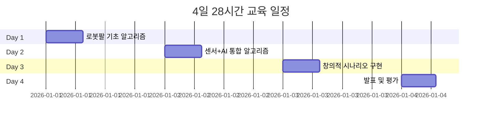
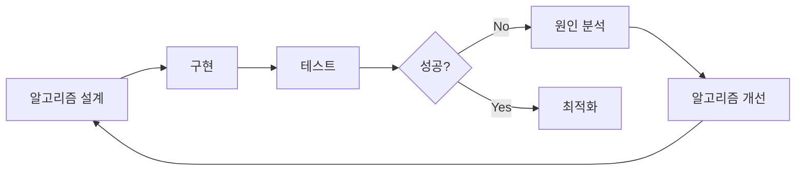
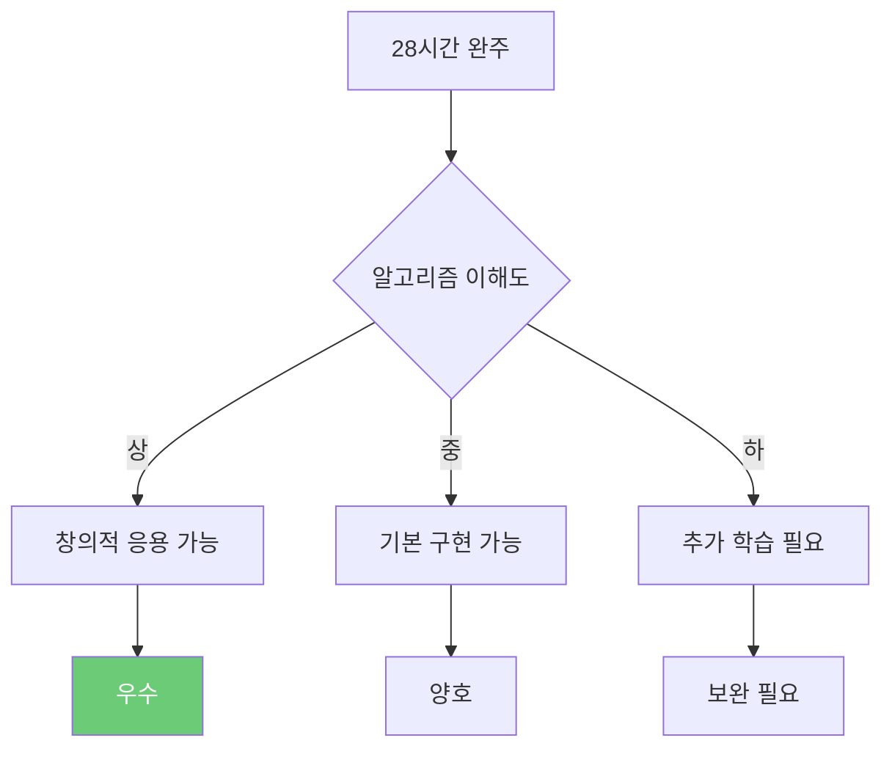

# 스마트 팩토리와 로봇 팔 프로젝트 교육 개요

## 프로젝트 목표

**알고리즘으로 생각하고, 시스템으로 구현하라!**
- 알고리즘 설계 능력 배양
- 피지컬 컴퓨팅 + AI 통합 시스템 구축
- 실제 산업 현장 문제 해결
- 창의적 비즈니스 모델 개발

이 프로젝트는 대학생들이 **알고리즘적 사고(Algorithmic Thinking)**를 바탕으로 스마트 팩토리 시스템을 설계하고, 
**피지컬 AI 기술**로 구현하며, **공모전 수준의 결과물**을 완성하는 것을 목표로 합니다.

---

## 핵심 학습 철학: 알고리즘 중심 바이브 코딩

### 새로운 학습 접근법


### 바이브 코딩 4단계 (알고리즘 중심)

#### 1. 기획자 (Visionary) - 알고리즘 설계
- **인간의 강점**: 문제를 알고리즘으로 분해
- **활동**: 플로우차트 작성, 상태 머신 설계, 요구사항 정의
- **질문**: "이 문제를 어떤 단계로 나눌 수 있는가?"

#### 2. 실행자 (Implementer) - 시스템 구현
- **기술**: 아두이노, 로봇 팔, AI, 센서 통합
- **활동**: 의사코드 → 실제 코드, 하드웨어 통합
- **질문**: "알고리즘을 어떻게 하드웨어로 구현할 것인가?"

#### 3. 디버거 (Debugger) - 알고리즘 최적화
- **인간의 강점**: 병목 지점 분석, 복잡도 개선
- **활동**: 타이밍 분석, 상태 전이 검증, 오류 처리
- **질문**: "어느 알고리즘이 비효율적인가? 왜 실패했는가?"

#### 4. 기업가 (Entrepreneur) - 가치 창출
- **인간의 강점**: 기술을 비즈니스로 전환
- **활동**: 성능 지표 측정, ROI 계산, 시장 조사
- **질문**: "이 알고리즘이 얼마의 가치를 창출하는가?"

---

## 교육 과정 구성

### 기본 정보

| 항목 | 내용 |
|------|------|
| **대상** | 대학생 42명 (21팀, 2인 1조) |
| **총 시간** | **28시간** (4일 × 7시간) |
| **교육 방식** | 알고리즘 설계 → 의사코드 → 하드웨어 구현 |
| **최종 목표** | AI 기반 스마트 물류 시스템 완성 |

### 28시간 구성



**상편**: Day 1-2 (기초 제작 + 센서/AI 통합)  
**하편**: Day 3-4 (창의적 시나리오 + 발표)

---

## 기술 구성

### 하드웨어

| 항목 | 수량 | 사양 | 링크 |
|------|------|------|------|
| **로봇팔** | 21세트 | **4축 (4DOF)** BP Lab AI 로봇팔 | [BP Lab](https://bplab.kr/order/?idx=178) |
| **컨베이어** | 21세트 | DC 모터 + 벨트 | 자체 제작 |
| **센서** | 팀당 | IR, 초음파, TCS3200 컬러 센서 | - |
| **모니터링** | 팀당 | 8x8 LED Matrix, 피에조 부저 | - |
| **통신** | 21개 | HC-06 블루투스 모듈 | - |

### 로봇팔 특성 및 제약사항

| 구성 요소 | 특징 | 주의사항 |
|----------|------|----------|
| **4축 로봇팔** | 베이스, 어깨, 팔꿈치, 그리퍼 | ⚠️ 어깨 부하 시 떨림, 50g 이하 물체 권장 |
| **아두이노 우노** | 디지털 핀 충분 | 순차 처리 특성상 타이밍 조절 필수 |
| **서보 모터** | SG90, 토크 1.8kg·cm | 팔꿈치 45-135도 제한 사용 |

### 소프트웨어 & AI

- **앱인벤터**: 스마트폰 AI 비전, 블록 코딩, 모니터링 대시보드
- **Teachable Machine**: 이미지 분류 학습 (노코드)
- **아두이노 IDE**: 피지컬 컴퓨팅, 상태 머신 구현
- **통신**: Bluetooth (아두이노 ↔ 스마트폰)

### 핵심 알고리즘 학습 목록

| 분류 | 알고리즘 | 활용 |
|------|----------|------|
| **제어** | 동기화 이동, PWM 제어 | 로봇팔 |
| **센서** | 이동 평균 필터, 컬러 분석 | 센서 데이터 처리 |
| **통신** | 프로토콜 파싱, JSON 처리 | 앱 통신 |
| **저장** | EEPROM, 체크섬 검증 | 데이터 저장 |
| **AI** | 데이터 수집, 실시간 추론 | 물체 인식 |
| **통합** | 상태 머신, 예외 처리 | 시스템 통합 |

---

## 학습 대상 및 사전 지식

### 대상
- **대학생** (공학 계열 또는 비전공자)
- 피지컬 컴퓨팅 + AI에 관심 있는 학습자
- 알고리즘적 사고를 배우고 싶은 학생

### 권장 사전 지식
- [ ] 기본 프로그래밍 (변수, 조건문, 반복문)
- [ ] 간단한 수학 (좌표, 각도, 거리 계산)
- [ ] 논리적 사고 (플로우차트 읽기)

**중요**: 코딩 전문가가 아니어도 괜찮습니다! **알고리즘 설계**와 **의사코드 작성**에 집중합니다.

---

## 최종 결과물

### 1. 작동하는 시스템
- AI 기반 스마트 물류 시스템
- 센서 + 로봇팔 + 앱 통합
- 10회 연속 성공률 80% 이상

### 2. 알고리즘 문서
```
📁 알고리즘_문서/
  📄 플로우차트.png (시스템 전체 흐름)
  📄 상태_머신_다이어그램.png
  📄 의사코드.md (핵심 알고리즘)
  📄 성능_분석.md (시간 복잡도, 병목)
```

### 3. 발표 자료
- 10분 발표 PPT
- 시연 영상 (5분)
- 알고리즘 설명 (플로우차트 중심)

### 4. 비즈니스 모델
- ROI 계산 (투자 대비 효과)
- 시장 조사 결과
- 경쟁사 비교 분석

---

## 평가 기준

| 영역 | 비중 | 세부 내용 |
|------|------|-----------|
| **알고리즘 설계** | 30% | 플로우차트, 상태 머신, 복잡도 분석 |
| **시스템 완성도** | 25% | 작동 안정성, 통합 수준, 속도 |
| **기술 이해도** | 20% | 센서/AI 활용, 문제 해결 능력 |
| **창의성** | 15% | 독창적 아이디어, 개선 노력 |
| **발표 및 비즈니스** | 10% | 설득력, 시장성, 실현 가능성 |

---

## 학습 철학

### 1. 알고리즘적 사고 우선

```
"코드를 쓰기 전에 알고리즘을 그려라"

1. 문제를 단계로 나눈다 (분해)
2. 각 단계를 플로우차트로 표현한다 (시각화)
3. 의사코드로 작성한다 (추상화)
4. 실제 코드로 구현한다 (구체화)
5. 성능을 분석한다 (최적화)
```

### 2. 실패를 통한 학습



- 센서 노이즈, 타이밍 오차 경험
- "왜 이 알고리즘이 실패했는가?" 분석
- 병목 지점 찾기 → 개선 → 재측정

### 3. 산업 현장 벤치마킹

| 기업 | 기술 | 우리 시스템 적용 |
|------|------|-----------------|
| Tesla | 자동화율 95% | 센서 + AI 하이브리드 |
| 현대차 | AI 비전 검사 | Teachable Machine |
| Amazon | 로봇 피킹 | 4축 로봇팔 + 알고리즘 |

---

## 프로젝트 구조

### 문서 체계

```
📁 Smart_Factory_Arms_Project/
│
├── 📂 curriculum/                    # 교육 커리큘럼
│   ├── 교육_커리큘럼_상편_Day1-2.md  # 상편 (알고리즘 중심)
│   └── 교육_커리큘럼_하편_Day3-4.md  # 하편 (통합 + 발표)
│
├── 📂 docs/                          # 참고 문서
│   ├── 00_프로젝트_개요.md          # 현재 문서
│   ├── 01_프로젝트_구조도.md        # 알고리즘 아키텍처
│   ├── 02_블루투스_프로토콜.md      # 통신 프로토콜
│   ├── 03_아두이노_피지컬컴퓨팅_가이드.md
│   ├── 03_바이브_코딩_가이드.md     # 바이브 코딩 상세
│   ├── 04_피지컬AI_학습방법.md
│   ├── 05_비즈니스_모델_설계.md
│   ├── 06_프로젝트_아이디어_모음.md
│   └── 07_앱인벤터_TM_연동가이드.md
│
├── 📂 arduino_code/                  # 예제 코드 (의사코드 중심)
│   ├── day1_robot_control/
│   ├── day2_conveyor_sensor/
│   └── day3_scenarios/
│
└── 📂 algorithms/                    # 알고리즘 문서
    ├── flowcharts/                   # 플로우차트
    ├── pseudocode/                   # 의사코드
    └── performance_analysis/         # 성능 분석
```

---

## 다음 단계

### 필수 읽기 순서

1. **curriculum/교육_커리큘럼_상편_Day1-2.md** ← Day 1-2 상세 일정
2. **curriculum/교육_커리큘럼_하편_Day3-4.md** ← Day 3-4 상세 일정
3. **docs/01_프로젝트_구조도.md** ← 알고리즘 아키텍처
4. **docs/03_바이브_코딩_가이드.md** ← 바이브 코딩 방법론
5. **docs/03_아두이노_피지컬컴퓨팅_가이드.md** ← 하드웨어 가이드

### 참고 자료

- **02_블루투스_프로토콜.md**: 통신 프로토콜 설계
- **04_피지컬AI_학습방법.md**: 피지컬 AI 개념
- **05_비즈니스_모델_설계.md**: 사업화 전략
- **06_프로젝트_아이디어_모음.md**: 공모전 아이디어

---

## 자주 묻는 질문 (FAQ)

### Q: 알고리즘을 배우면 코딩을 안 해도 되나요?
**A**: 아닙니다! 알고리즘 설계 → 의사코드 → 실제 코드 순서로 진행합니다. 
하지만 **코딩보다 알고리즘 설계에 더 많은 시간**을 할애합니다.

### Q: 4축 로봇팔로 충분한가요?
**A**: 네! 교육용으로는 4축이 적합합니다. 
- 제어 알고리즘이 단순해서 학습하기 좋음
- 3구역 시스템으로 충분히 응용 가능

### Q: 프로그래밍 경험이 없는데 괜찮을까요?
**A**: 괜찮습니다! 
- **플로우차트**부터 시작 (시각적 사고)
- **의사코드** 작성 (자연어 + 코드)
- 필요하면 AI(ChatGPT 등) 도움

### Q: 28시간이면 충분한가요?
**A**: 충분합니다! 
- Day 1-2: 기초 알고리즘 (15시간)
- Day 3: 집중 개발 (7.5시간)
- Day 4: 발표 및 성찰 (4시간)
- 핵심은 **집중도**입니다.

---

## 성공 기준

### 개인 학습 목표



### 팀 프로젝트 목표

- [ ] 시스템 10회 연속 성공 (80% 이상)
- [ ] 19가지 핵심 알고리즘 이해
- [ ] 상태 머신 설계 및 구현
- [ ] AI + 센서 하이브리드 시스템
- [ ] 비즈니스 모델 완성

---

## 교육 철학 요약

```
"알고리즘으로 생각하고, 시스템으로 구현하고, 비즈니스로 완성한다"

1. 문제를 알고리즘으로 분해한다
2. 플로우차트로 시각화한다
3. 의사코드로 구조화한다
4. 하드웨어로 구현한다
5. 성능을 측정하고 최적화한다
6. 비즈니스 가치로 전환한다

→ 이것이 진짜 엔지니어의 능력입니다.
```

---

**Last Updated**: 2026-01-22  
**Version**: 2.0 (알고리즘 중심 바이브 코딩)  
**제작**: Smart Factory Education Team  
**교구재**: [BP Lab AI 로봇팔](https://bplab.kr/order/?idx=178)

**자, 28시간의 알고리즘 여정을 시작합니다! 🚀**
