# 스마트 팩토리 & 로봇 팔 프로젝트 전체 구조도 (교육용)
> **대학생 대상 교육용 구조 - 앱인벤터 + Teachable Machine + 아두이노**

## 📌 핵심 설계 철학
- **단순함**: 복잡한 코딩보다 문제 해결에 집중
- **접근성**: 비전공자도 2주 내 학습 가능
- **실용성**: 실제 작동하는 프로토타입 제작
- **피지컬 컴퓨팅**: 아두이노의 한계를 인정하고 큰 틀에서 해결

## 1. 프로젝트 전체 시스템 아키텍처 (교육용 단순화)

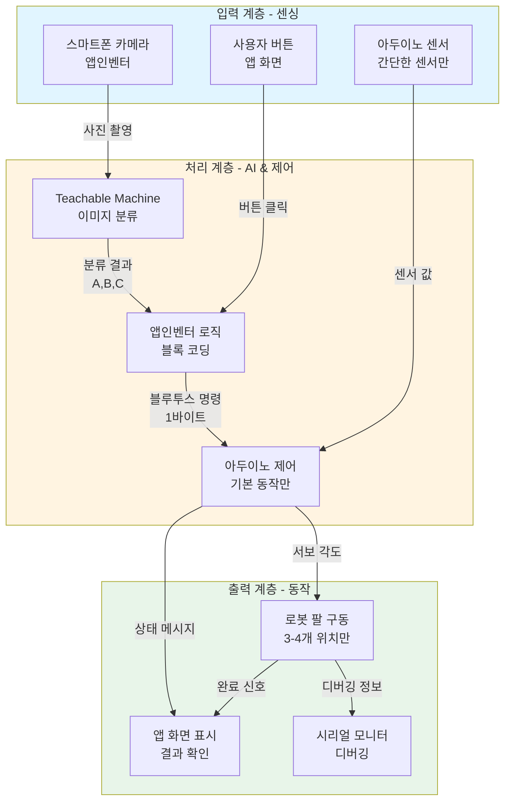

## 2. 하드웨어 통합 구조 (교육용 단순화)

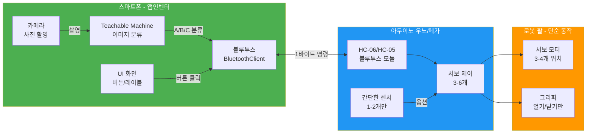

**💡 교육용 단순화 포인트:**
- ❌ 복잡한 센서 네트워크 제거
- ✅ 블루투스 통신으로 단순화
- ✅ 앱인벤터 블록 코딩
- ✅ Teachable Machine 3-5가지 분류만

## 3. 교구재 연결 다이어그램

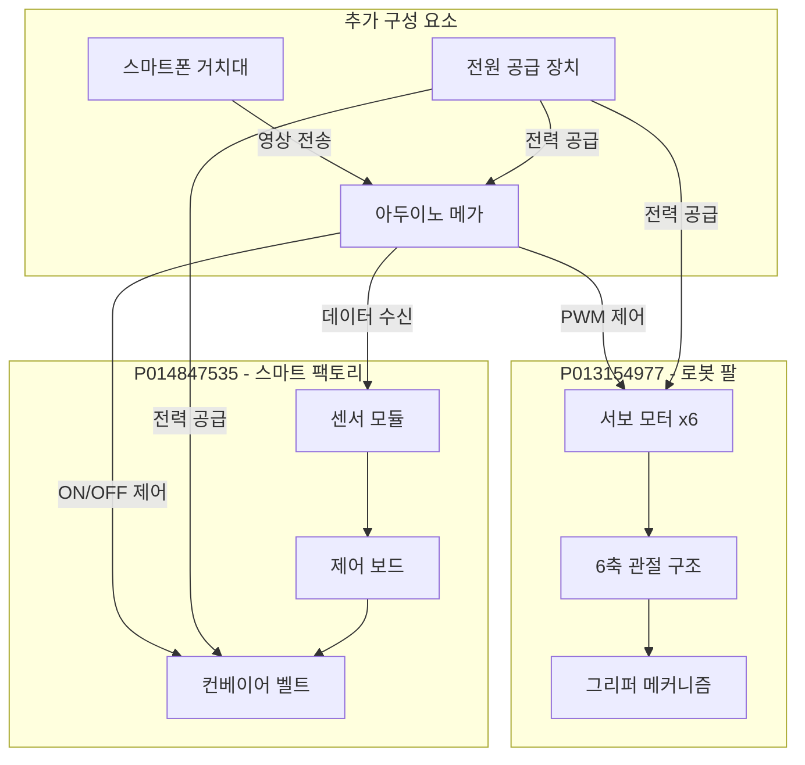

## 4. 데이터 흐름도 (교육용 단순화)

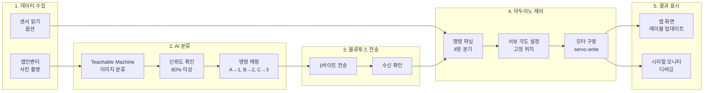

**💡 단순화 포인트:**
- ❌ 복잡한 전처리 제거 (Teachable Machine이 자동 처리)
- ❌ 역기구학 계산 제거 (고정 위치만 사용)
- ✅ 블루투스 1바이트 단순 전송
- ✅ if문 분기로 제어 단순화

## 5. 기술 스택 계층 구조 (교육용)

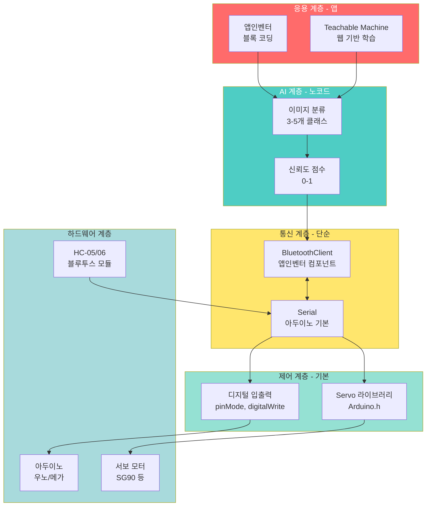

**📚 교육용 기술 스택 특징:**

| 계층 | 기술 | 학습 시간 | 난이도 |
|------|------|----------|--------|
| **앱** | 앱인벤터 블록 코딩 | 1주 | ⭐ 쉬움 |
| **AI** | Teachable Machine | 2일 | ⭐ 쉬움 |
| **통신** | 블루투스 시리얼 | 3일 | ⭐⭐ 보통 |
| **제어** | 아두이노 기본 | 1주 | ⭐⭐ 보통 |
| **하드웨어** | 조립 및 배선 | 3일 | ⭐⭐ 보통 |
| **총** | - | **2-3주** | **비전공자 가능** |

## 6. 시스템 동작 시퀀스 (교육용 단순화)

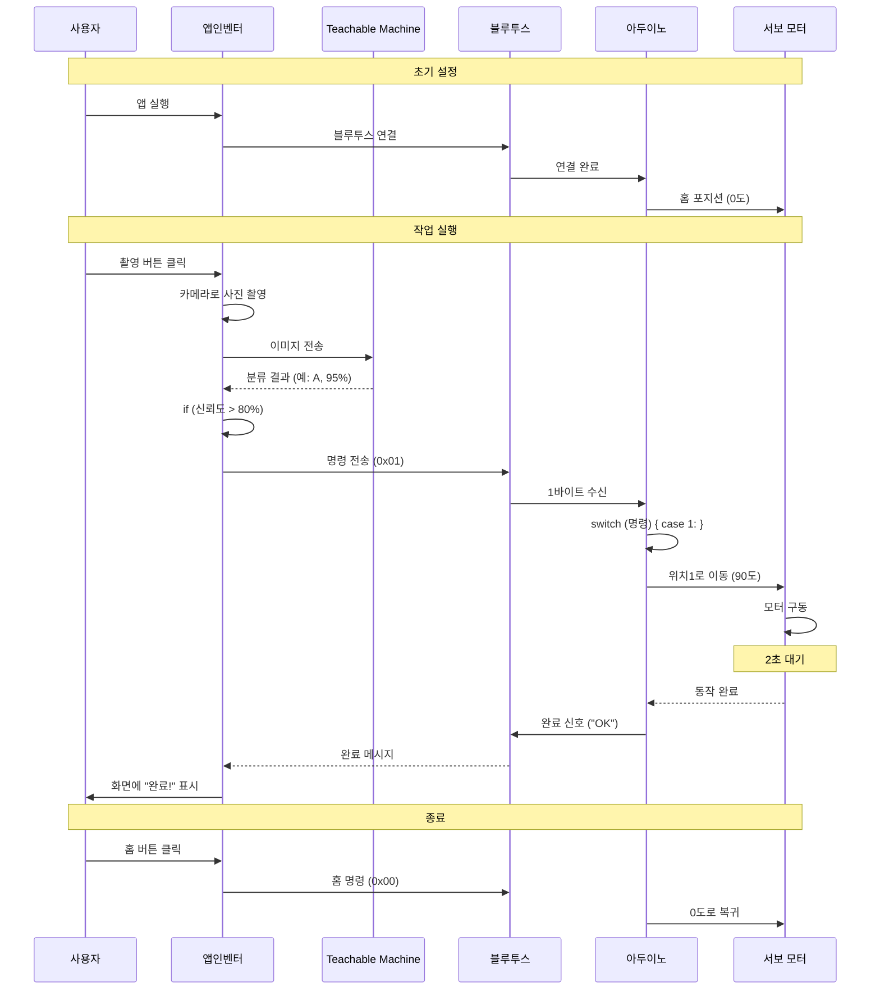

**💡 교육용 포인트:**
- ✅ 실시간이 아닌 **버튼 클릭 방식**
- ✅ 복잡한 센서 읽기 제거
- ✅ 고정된 **3-4개 위치**만 사용
- ✅ 명령은 **1바이트** 단순 전송

## 7. 주요 컴포넌트별 역할 및 사양 (교육용)

| 컴포넌트 | 역할 | 주요 사양 | 교육 난이도 |
|---------|------|----------|-----------|
| **스마트폰** | AI 학습 및 추론 | - 앱인벤터 설치 가능<br/>- 블루투스 지원<br/>- 카메라 있음 | ⭐ 쉬움 |
| **Teachable Machine** | 이미지 분류 학습 | - 웹 브라우저 사용<br/>- 클래스당 50-100장<br/>- 내보내기: 앱인벤터용 | ⭐ 쉬움 |
| **아두이노 우노/메가** | 서보 모터 제어 | - 아두이노 IDE<br/>- Serial 통신 (9600 baud)<br/>- 6-12개 PWM 핀 | ⭐⭐ 보통 |
| **HC-05 / HC-06** | 블루투스 통신 | - Baud: 9600<br/>- VCC: 5V<br/>- RX/TX 연결 | ⭐⭐ 보통 |
| **로봇 팔 (P013154977)** | 물리적 동작 | - 서보 3-6개<br/>- 고정 위치 3-4개만<br/>- 정밀도: ±5mm (교육용 충분) | ⭐⭐ 보통 |
| **컨베이어 (P014847535)** | 물체 이송 (옵션) | - ON/OFF만 제어<br/>- 센서는 선택사항 | ⭐ 쉬움 |
| **서보 모터** | 각도 제어 | - SG90 (토크 1.8kg·cm)<br/>- 0-180도<br/>- PWM 50Hz | ⭐⭐ 보통 |

**💡 교육용 권장 최소 구성:**
- ✅ 필수: 스마트폰 + 아두이노 우노 + HC-05 + 서보 3개
- 🔶 권장: 로봇 팔 키트 (P013154977)
- ⭕ 선택: 컨베이어, 추가 센서

## 8. 블루투스 통신 구조 (교육용 단순화)

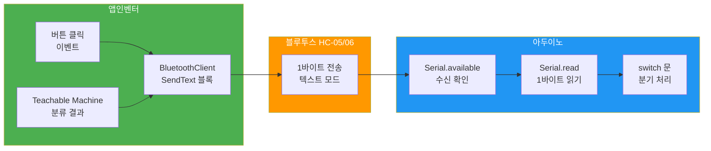

**💡 단순화된 통신 구조:**
- ❌ 복잡한 패킷 헤더 제거
- ❌ CRC 체크섬 제거
- ✅ **1바이트 텍스트** 전송 ('A', 'B', 'C', '0', '1', '2')
- ✅ Serial.read()로 바로 읽기
- ✅ switch 문으로 간단히 분기

## 9. 블루투스 프로토콜 정의 (교육용 초간단)

### 통신 방식: **1바이트 텍스트 문자**

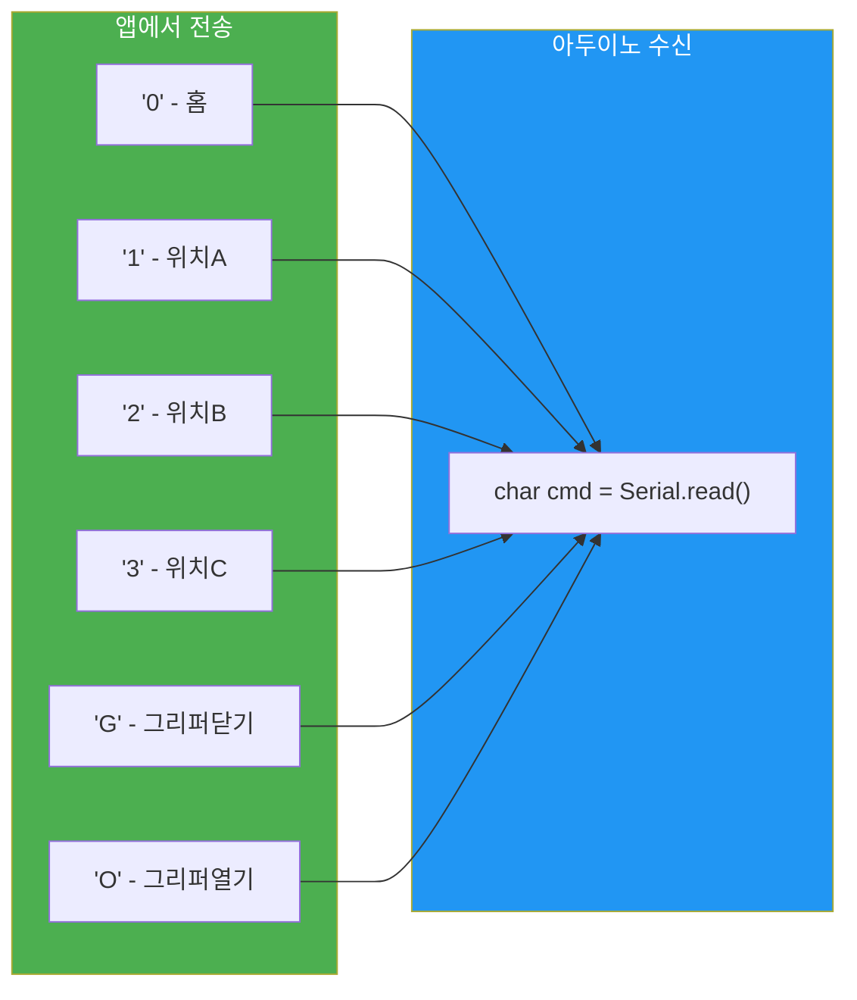

### 명령 코드 정의 (교육용)

| 명령 문자 | 명령 이름 | 동작 설명 | 예제 코드 |
|---------|---------|---------|----------|
| `'0'` | HOME | 홈 포지션 (모든 서보 0도) | `if(cmd=='0') servo1.write(0);` |
| `'1'` | 위치 A | 고정 위치 1 (예: 왼쪽) | `if(cmd=='1') servo1.write(90);` |
| `'2'` | 위치 B | 고정 위치 2 (예: 중앙) | `if(cmd=='2') servo1.write(45);` |
| `'3'` | 위치 C | 고정 위치 3 (예: 오른쪽) | `if(cmd=='3') servo1.write(135);` |
| `'G'` | 그리퍼 닫기 | 그리퍼 서보 닫기 | `if(cmd=='G') gripperServo.write(180);` |
| `'O'` | 그리퍼 열기 | 그리퍼 서보 열기 | `if(cmd=='O') gripperServo.write(0);` |
| `'S'` | 정지 | 모든 동작 중지 | `if(cmd=='S') { /* 정지 */ }` |

**💡 교육용 장점:**
- ✅ 문자 하나로 간단 제어
- ✅ 시리얼 모니터로 테스트 가능
- ✅ 앱인벤터 SendText 블록으로 전송
- ✅ if문 또는 switch문으로 쉽게 파싱

## 10. 전력 관리 구조 (교육용 단순화)

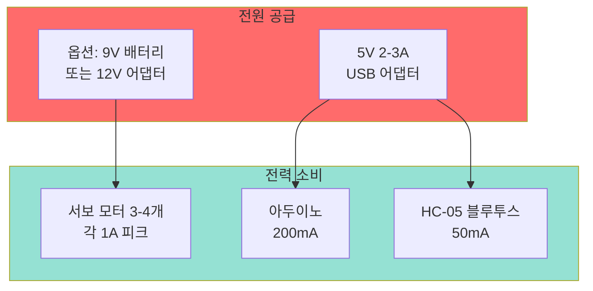

**💡 교육용 전력 관리 팁:**
- ✅ 서보는 **별도 전원** (9V 배터리 또는 12V 어댑터)
- ✅ 아두이노는 **USB 전원** (컴퓨터 또는 5V 어댑터)
- ✅ 서보와 아두이노 **GND 공통 연결** 필수
- ⚠️ **주의**: 서보를 아두이노 5V에 연결하면 리셋됨!

### 권장 전원 구성

| 항목 | 전원 | 용량 | 연결 |
|------|------|------|------|
| 아두이노 + HC-05 | USB 5V | 500mA | USB 케이블 |
| 서보 모터 3-4개 | 9V 배터리 | 1A 이상 | VCC, GND |
| **GND** | **공통 연결** | - | 반드시 연결! |

## 11. 안전 고려사항 (교육용)

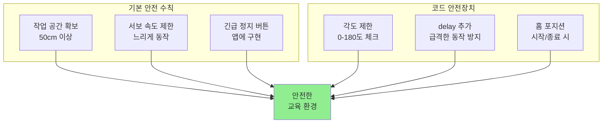

**⚠️ 교육용 안전 체크리스트:**

- [ ] **물리적 안전**
  - 로봇 팔 주변 50cm 이상 장애물 없음
  - 케이블이 움직이는 부분에 걸리지 않음
  - 작동 중 손 넣지 않기
  
- [ ] **전기 안전**
  - 전원 극성 확인 (+ / -)
  - GND 공통 연결 확인
  - 쇼트 방지 (절연 테이프)
  
- [ ] **코드 안전**
  ```cpp
  // 각도 제한 예시
  int angle = constrain(angle, 0, 180);
  servo.write(angle);
  delay(1000); // 천천히 움직이도록
  ```

## 12. 파일 구조 (교육용 단순화)

```
Smart_Factory_Arms_Project/
│
├── docs/                          # 📚 문서 폴더
│   ├── 00_프로젝트_개요.md
│   ├── 01_프로젝트_구조도.md      # 현재 문서 (교육용)
│   ├── 02_블루투스_프로토콜.md    # 통신 가이드
│   ├── 03_아두이노_가이드.md      # 피지컬 컴퓨팅 가이드
│   ├── 04_앱인벤터_가이드.md      # 앱 제작 가이드
│   └── 05_Teachable_Machine_가이드.md  # AI 학습 가이드
│
├── arduino/                       # 🔧 아두이노 코드
│   ├── basic_servo_test/          # 1단계: 서보 테스트
│   │   └── basic_servo_test.ino
│   │
│   ├── bluetooth_test/            # 2단계: 블루투스 테스트
│   │   └── bluetooth_test.ino
│   │
│   └── main_control/              # 3단계: 통합 제어
│       └── main_control.ino       # 메인 코드 (200줄 이하)
│
├── app_inventor/                  # 📱 앱인벤터 파일
│   ├── app_project.aia            # 앱인벤터 프로젝트 파일
│   ├── screenshots/               # 스크린샷
│   └── blocks_guide.pdf           # 블록 구성 가이드
│
├── teachable_machine/             # 🤖 AI 모델
│   ├── training_images/           # 학습 이미지
│   │   ├── class_A/               # 클래스 A (50-100장)
│   │   ├── class_B/               # 클래스 B
│   │   └── class_C/               # 클래스 C
│   │
│   └── model/                     # 학습된 모델
│       └── model_link.txt         # Teachable Machine URL
│
├── circuit_diagrams/              # ⚡ 회로도
│   ├── arduino_servo.png          # 아두이노-서보 연결
│   ├── bluetooth_wiring.png       # 블루투스 연결
│   └── power_supply.png           # 전원 구성
│
└── student_projects/              # 👨‍🎓 학생 프로젝트
    ├── team_01_분류로봇/
    ├── team_02_검사로봇/
    └── team_03_조립로봇/
```

**💡 교육용 파일 구조 특징:**
- ✅ **단계별 학습**: 기본 → 통신 → 통합
- ✅ **간단한 파일명**: 직관적으로 이해 가능
- ✅ **독립적인 폴더**: 각 단계별 독립 실행 가능
- ✅ **학생 프로젝트**: 팀별로 관리

## 13. 교육용 개발 워크플로우 (3주 과정)

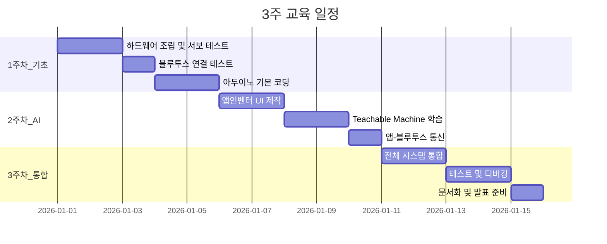

### 단계별 체크리스트

#### 1주차: 기초 구축
- [ ] 아두이노 IDE 설치
- [ ] 서보 모터 1개 제어 성공
- [ ] HC-05 블루투스 연결 확인
- [ ] 시리얼 모니터로 명령 테스트

#### 2주차: AI 및 앱
- [ ] Teachable Machine에서 3개 클래스 학습 (각 50장)
- [ ] 앱인벤터 기본 UI 완성 (버튼 3개 + 라벨)
- [ ] 앱에서 블루투스로 '1', '2', '3' 전송 성공

#### 3주차: 통합 및 완성
- [ ] 앱에서 사진 촬영 → AI 분류 → 블루투스 전송
- [ ] 아두이노가 명령 받아서 서보 제어
- [ ] 전체 시스템 10회 연속 성공

---

## 📖 다음 문서 가이드

### 필수 읽기 (순서대로)
1. **02_블루투스_프로토콜.md** ← 통신 프로토콜 상세 설명
2. **03_아두이노_가이드.md** ← 피지컬 컴퓨팅 코드 작성법
3. **04_앱인벤터_가이드.md** ← 앱 제작 단계별 튜토리얼
4. **05_Teachable_Machine_가이드.md** ← AI 학습 방법

### 참고 자료
- **06_프로젝트_아이디어_모음.md** ← 공모전 아이디어
- **02_문제점_분석.md** ← 트러블슈팅
- **03_바이브_코딩_가이드.md** ← 문제 해결 방법론

---

## 💬 자주 묻는 질문 (FAQ)

**Q: 앱인벤터로 정말 AI를 사용할 수 있나요?**  
A: 네! Teachable Machine Extension을 사용하면 이미지 분류를 블록 코딩으로 구현 가능합니다.

**Q: 아두이노 우노로도 가능한가요?**  
A: 네! 서보 3-4개 정도는 우노로 충분합니다. 더 많은 서보가 필요하면 메가를 추천합니다.

**Q: 프로그래밍을 처음 해보는데 가능할까요?**  
A: 네! 이 프로젝트는 비전공자도 3주 안에 완성할 수 있도록 설계되었습니다.

**Q: YOLO 같은 고급 AI는 언제 배우나요?**  
A: 교육용으로는 Teachable Machine으로 충분합니다. 고급 AI는 이후 심화 과정에서 다룹니다.
