# 스마트 팩토리 & 로봇 팔 프로젝트 전체 구조도
> **알고리즘 중심 아키텍처 - 대학생 28시간 교육용**

## 📌 핵심 설계 철학

- **알고리즘 우선**: 코드 작성 전 플로우차트 설계
- **계층적 구조**: 입력 → 처리 → 출력 명확히 분리
- **상태 머신**: 복잡한 시스템을 상태로 관리
- **피지컬 모니터링**: 로컬(LED+부저) + 원격(앱) 이중 피드백

---

## 1. 전체 시스템 알고리즘 아키텍처

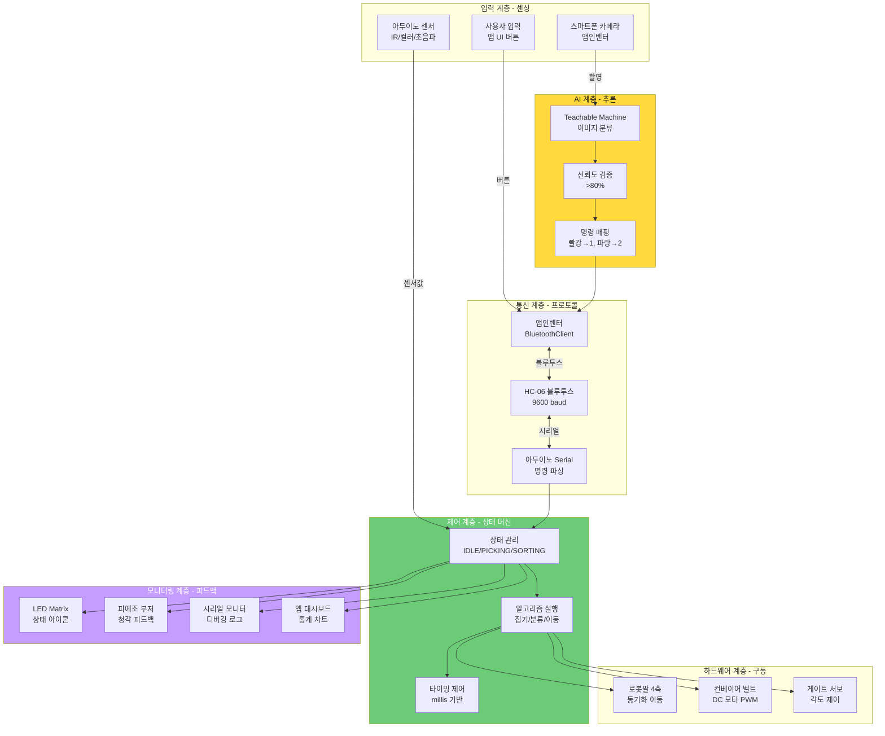

---

## 2. 핵심 알고리즘 구조

### 2.1 상태 머신 알고리즘

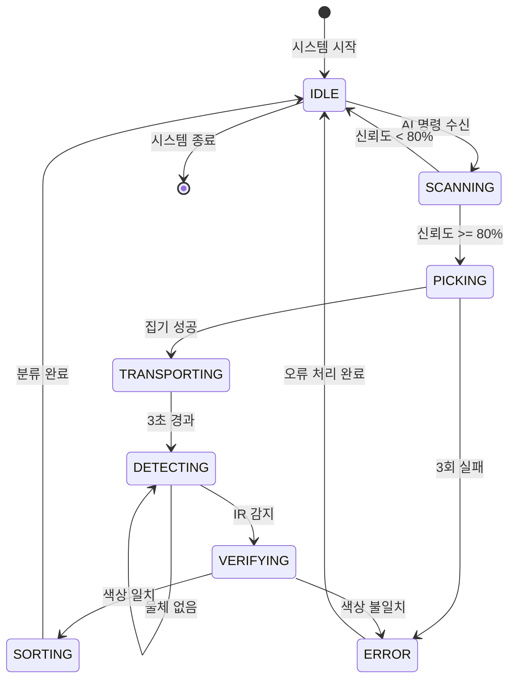

**핵심 특징**:
- 명확한 상태 정의 (7개 상태)
- 조건에 따른 상태 전이
- 오류 상태로 안전하게 복귀

### 2.2 제어 알고리즘 계층 구조

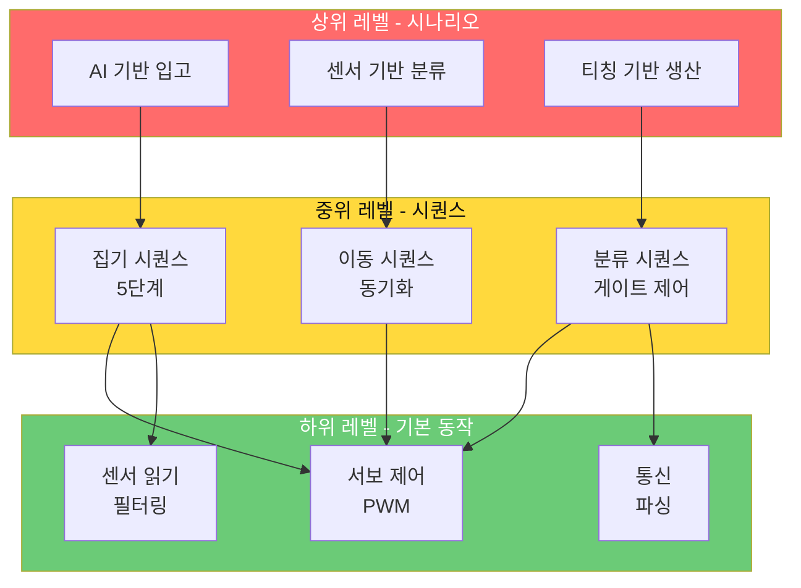

---

## 3. 데이터 흐름 알고리즘

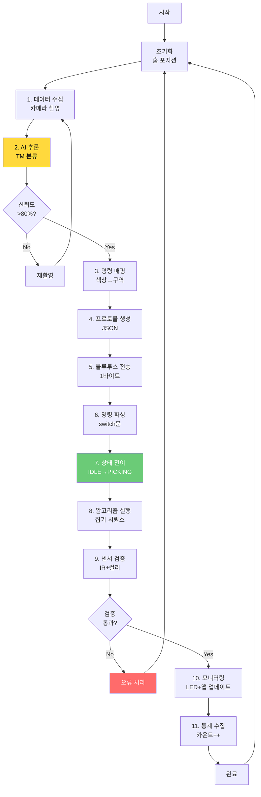

---

## 4. 하드웨어 통합 구조 (알고리즘 관점)

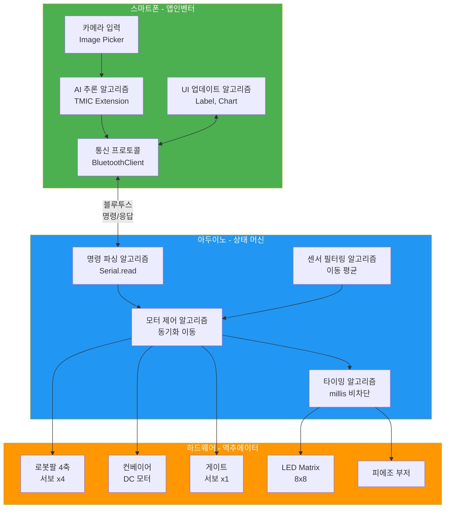

---

## 5. 알고리즘 기술 스택 계층

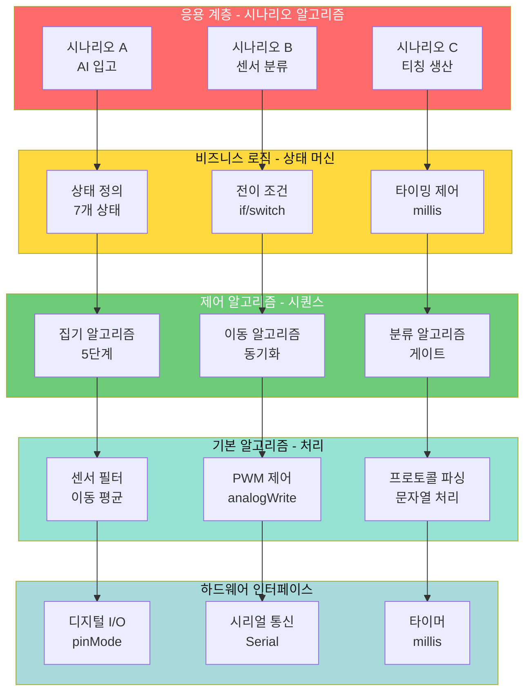

**학습 경로**:
1. **하위 → 상위 순서** (기초부터)
2. **Day 1**: Layer 1-2 (기본 알고리즘)
3. **Day 2**: Layer 3-4 (제어 + 상태 머신)
4. **Day 3**: Layer 5 (통합 시나리오)

---

## 6. 통신 프로토콜 알고리즘

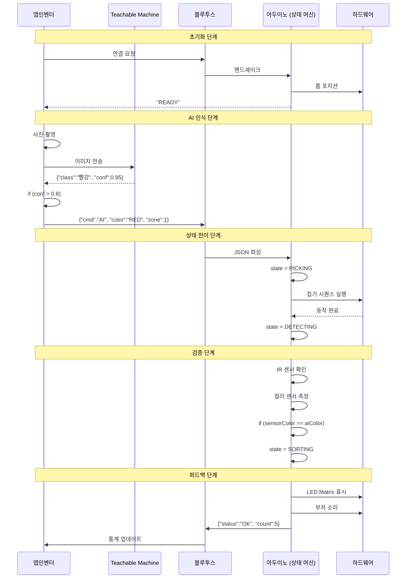

**프로토콜 설계 원칙**:
- ✅ **JSON 포맷** (구조화)
- ✅ **명확한 키값** (`cmd`, `color`, `zone`)
- ✅ **오류 코드** (`ERROR_PICK`, `ERROR_COLOR`)
- ✅ **타임아웃** (5초 응답 없으면 재시도)

---

## 7. 모니터링 시스템 알고리즘

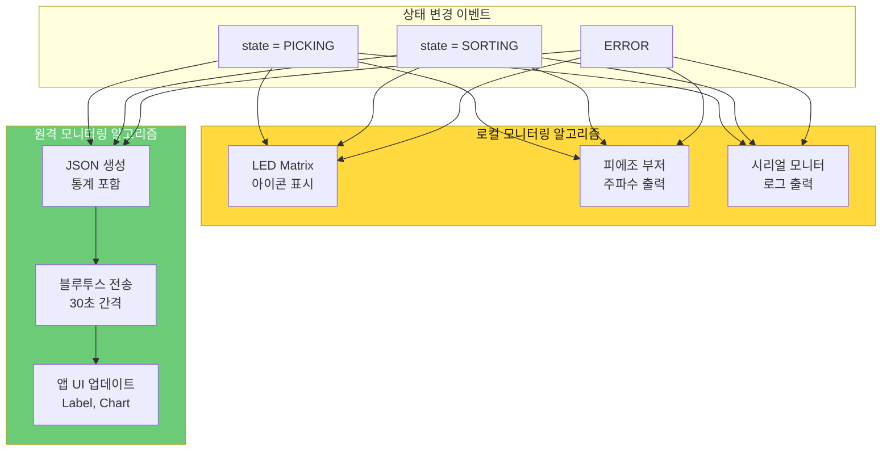

### LED Matrix 아이콘 매핑

| 상태 | 아이콘 | 부저 주파수 |
|------|--------|------------|
| `IDLE` | 🏠 홈 | 없음 |
| `SCANNING` | 📷 카메라 | 1000 Hz |
| `PICKING` | 🤖 집기 | 1500 Hz |
| `SORTING` | ✅ 성공 | 2000 Hz |
| `ERROR` | ❌ 오류 | 500 Hz |

---

## 8. 오류 처리 알고리즘

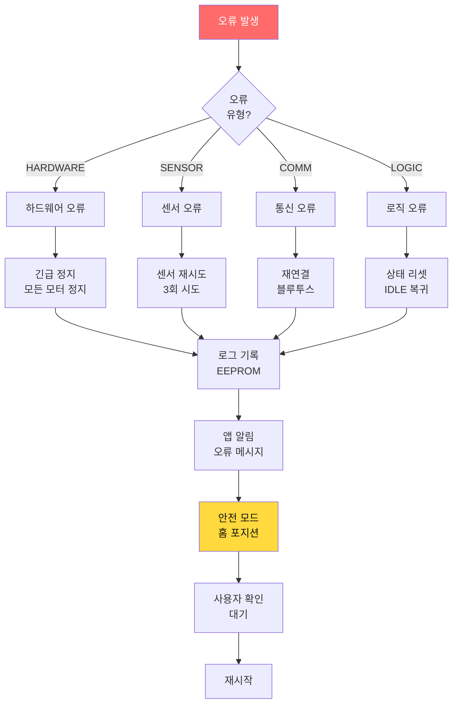

**오류 처리 원칙**:
1. **즉각 정지**: 하드웨어 오류 시 모든 동작 중단
2. **3회 재시도**: 센서/통신 오류는 재시도
3. **로그 기록**: 모든 오류를 EEPROM에 저장
4. **사용자 알림**: 앱으로 오류 메시지 전송
5. **안전 복귀**: 홈 포지션으로 안전하게 복귀

---

## 9. 성능 최적화 알고리즘

### 9.1 타이밍 최적화

```mermaid
graph LR
    subgraph 차단_방식[❌ 차단 방식 (BAD)]
        B1[pickObject] --> B2[delay 3000ms]
        B2 --> B3[checkSensor]
        B3 --> B4[delay 2000ms]
    end
    
    subgraph 비차단_방식[✅ 비차단 방식 (GOOD)]
        G1[state = PICKING<br/>startTime = millis]
        G1 --> G2[루프 실행<br/>센서 읽기 가능]
        G2 --> G3{millis - start<br/>>= 3000?}
        G3 -->|No| G2
        G3 -->|Yes| G4[state = CHECKING]
    end
    
    B4 -.총 5초 블로킹.-> SLOW[느림😢]
    G4 -.비차단 실행.-> FAST[빠름😊]
    
    style 차단_방식 fill:#FF6B6B,color:#fff
    style 비차단_방식 fill:#6BCB77,color:#fff
```

### 9.2 센서 노이즈 필터링

```
알고리즘: Moving_Average_Filter
━━━━━━━━━━━━━━━━━━━━━━━━━━━━━━━━━
입력: newSample (새 센서 값)

데이터 구조:
  buffer[10] = {0}
  index = 0
  sum = 0

프로세스:
  1. 버퍼 업데이트
     sum -= buffer[index]
     buffer[index] = newSample
     sum += newSample
     index = (index + 1) % 10
  
  2. 평균 계산
     average = sum / 10
  
  3. RETURN average

시간 복잡도: O(1) - 효율적!
━━━━━━━━━━━━━━━━━━━━━━━━━━━━━━━━━
```

---

## 10. 알고리즘 복잡도 분석

| 알고리즘 | 시간 복잡도 | 공간 복잡도 | 병목 지점 |
|---------|-----------|-----------|----------|
| **상태 머신** | O(1) | O(1) | 없음 (효율적) |
| **동기화 이동** | O(n) | O(1) | n = 스텝 수 (최대 180) |
| **센서 필터링** | O(1) | O(w) | w = 윈도우 크기 (10) |
| **AI 추론** | O(?) | O(?) | 앱인벤터 내부 (측정 불가) |
| **프로토콜 파싱** | O(n) | O(1) | n = JSON 길이 (작음) |

**최적화 우선순위**:
1. ✅ **상태 머신**: 이미 효율적
2. ⚠️ **동기화 이동**: stepSize 크게 (2-3도) → 속도 향상
3. ✅ **센서 필터링**: 이동 평균 O(1) 사용
4. ⚠️ **AI 추론**: 가벼운 모델 사용 (TM 50x50 이미지)

---

## 11. 시스템 동작 시퀀스 (알고리즘 관점)

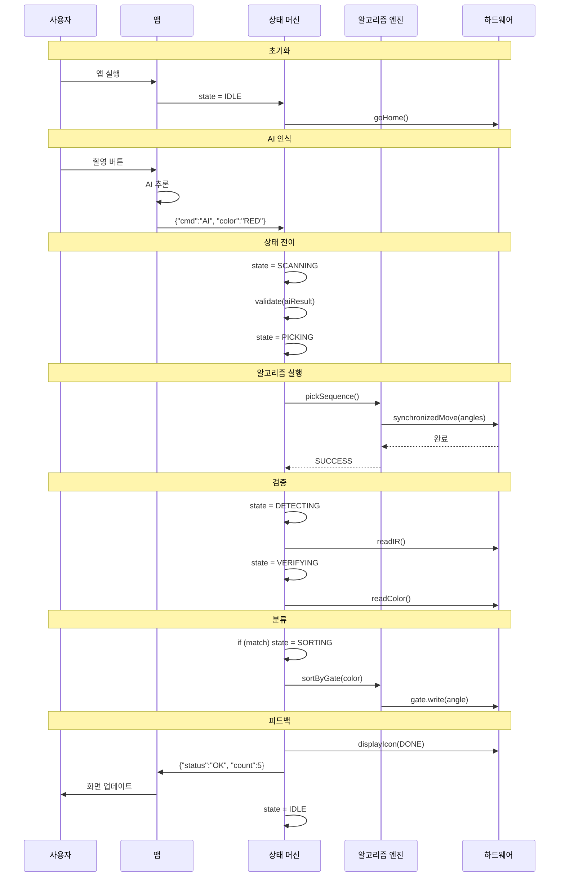

---

## 12. 파일 구조 (알고리즘 중심)

```
Smart_Factory_Arms_Project/
│
├── 📂 algorithms/                     # 알고리즘 문서
│   ├── flowcharts/                    # 플로우차트 (Mermaid)
│   │   ├── state_machine.md
│   │   ├── pick_sequence.md
│   │   └── error_handling.md
│   │
│   ├── pseudocode/                    # 의사코드
│   │   ├── control_algorithms.md
│   │   ├── sensor_algorithms.md
│   │   └── communication_protocols.md
│   │
│   └── performance/                   # 성능 분석
│       ├── complexity_analysis.md
│       └── timing_measurements.md
│
├── 📂 arduino_code/                   # 예제 코드
│   ├── day1_robot_control/
│   │   ├── servo_control.ino         # 기본 제어
│   │   └── bluetooth_comm.ino        # 통신
│   │
│   ├── day2_conveyor_sensor/
│   │   ├── sensor_filtering.cpp      # 센서 필터링
│   │   └── motor_controller.cpp      # 모터 제어
│   │
│   └── day3_scenarios/
│       ├── state_machine.cpp         # 상태 머신
│       └── scenario_a.ino            # 통합 시나리오
│
└── 📂 app_inventor/                   # 앱인벤터 파일
    ├── control_app.aia               # 제어 앱
    └── monitoring_dashboard.aia      # 모니터링 앱
```

---

## 13. 알고리즘 학습 로드맵 (28시간)

```mermaid
gantt
    title 알고리즘 학습 일정
    dateFormat  HH:mm
    axisFormat %H:%M
    
    section Day 1
    기본 알고리즘 (PWM, 서보)        :d1_1, 09:00, 2h
    제어 알고리즘 (4축 동기화)        :d1_2, 11:00, 2h
    통신 알고리즘 (프로토콜)         :d1_3, 13:00, 2h
    저장 알고리즘 (EEPROM)           :d1_4, 15:00, 1.5h
    
    section Day 2
    센서 알고리즘 (필터링)           :d2_1, 09:00, 2h
    AI 알고리즘 (데이터+학습)        :d2_2, 11:00, 3h
    통합 알고리즘 (로봇팔+AI)        :d2_3, 14:00, 2.5h
    
    section Day 3
    상태 머신 설계                  :d3_1, 09:00, 2h
    시나리오 알고리즘 구현           :d3_2, 11:00, 5h
    안정화 알고리즘                 :d3_3, 16:00, 0.5h
    
    section Day 4
    최종 최적화                     :d4_1, 09:00, 1h
    발표 (알고리즘 설명)             :d4_2, 10:00, 3h
```

---

## 14. 다음 문서 가이드

### 필수 읽기 (알고리즘 관점)
1. **curriculum/교육_커리큘럼_상편_Day1-2.md** ← 알고리즘 상세 설명
2. **curriculum/교육_커리큘럼_하편_Day3-4.md** ← 통합 알고리즘
3. **02_블루투스_프로토콜.md** ← 통신 프로토콜 알고리즘
4. **03_아두이노_피지컬컴퓨팅_가이드.md** ← 제어 알고리즘

### 참고 자료
- **03_바이브_코딩_가이드.md** ← 알고리즘 설계 방법론
- **04_피지컬AI_학습방법.md** ← AI 알고리즘
- **06_프로젝트_아이디어_모음.md** ← 응용 알고리즘

---

## 💬 FAQ (알고리즘 관점)

**Q: 상태 머신이 왜 필요한가요?**  
A: 복잡한 시스템을 **명확한 상태로 분리**하여 관리하기 위해서입니다. if문 덩어리보다 **확장성**과 **디버깅**이 훨씬 쉽습니다.

**Q: 시간 복잡도를 왜 분석하나요?**  
A: 실시간 시스템에서는 **응답 시간**이 중요합니다. 병목 지점을 찾아서 최적화해야 합니다.

**Q: 의사코드를 왜 먼저 작성하나요?**  
A: 코드 문법에 신경 쓰지 않고 **알고리즘 로직에만 집중**할 수 있습니다. 설계 단계에서 오류를 찾는 것이 구현 후보다 **10배 빠릅니다**.

**Q: 알고리즘을 배우면 다른 프로젝트에도 쓸 수 있나요?**  
A: 네! **상태 머신**, **필터링**, **프로토콜 파싱** 등은 모든 임베디드 시스템에서 사용됩니다.

---

**Last Updated**: 2026-01-22  
**Version**: 2.0 (알고리즘 중심 아키텍처)  
**제작**: Smart Factory Education Team  
**교구재**: [BP Lab AI 로봇팔](https://bplab.kr/order/?idx=178)
