# 로봇 팔과 스마트 팩토리의 문제점 분석

## 개요

이 문서는 스마트 팩토리와 로봇 팔 시스템의 **현실적이고 어려운 문제점들**을 분석합니다.
학생들이 이러한 문제들을 이해하고 해결하는 과정이 **진짜 엔지니어링 능력**을 키우는 핵심입니다.

## 문제점 분류 체계

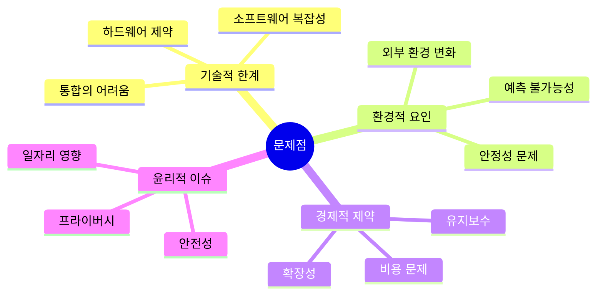

---

## 1. 하드웨어 관련 문제점

### 1.1 로봇 팔의 물리적 한계

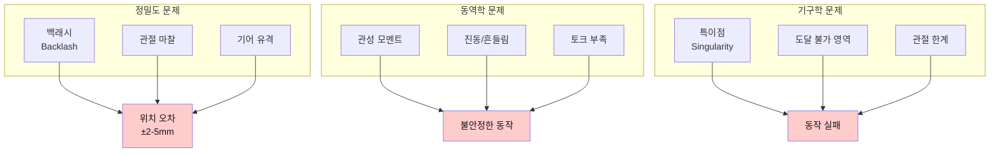

| 문제 | 원인 | 영향 | 해결 난이도 |
|------|------|------|------------|
| **백래시 (Backlash)** | 기어 간 유격, 조립 공차 | ±2-5mm 위치 오차 | ⭐⭐⭐⭐ |
| **토크 부족** | 서보 모터 한계, 배터리 전압 저하 | 무거운 물체 파지 실패 | ⭐⭐⭐ |
| **진동 문제** | 빠른 가감속, 구조적 강성 부족 | 정밀 작업 불가, 카메라 흔들림 | ⭐⭐⭐⭐⭐ |
| **관절 마찰** | 베어링 품질, 윤활 부족 | 불균일한 동작, 제어 어려움 | ⭐⭐⭐ |
| **케이블 간섭** | 전선이 관절에 걸림 | 동작 범위 제한, 단선 위험 | ⭐⭐ |
| **열 변형** | 모터 발열, 플라스틱 재질 | 장시간 작동 시 정밀도 저하 | ⭐⭐⭐⭐ |

### 1.2 센서의 한계

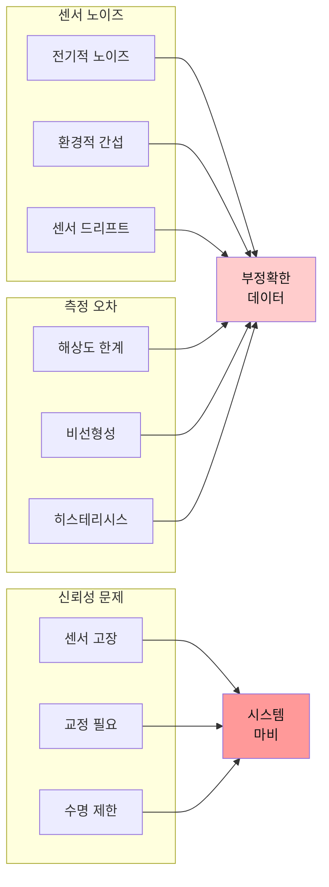

| 센서 종류 | 주요 문제 | 실제 사례 | 대응 방법 |
|----------|----------|----------|----------|
| **거리 센서 (초음파)** | 반사면 재질에 민감 좁은 빔 각도 | 검은색 물체 인식 실패 작은 물체 놓침 | 여러 센서 융합 IR 센서 병용 |
| **힘/토크 센서** | 비싸다 (교육용 불가) 드리프트 문제 | 장시간 사용 시 영점 이동 | 주기적 교정 소프트웨어 보정 |
| **컬러 센서** | 조명에 극도로 민감 좁은 감지 영역 | 그림자, 반사광 오인식 | 조명 제어 다중 샘플링 |
| **엔코더** | 절대 위치 모름 (증분형) 누적 오차 | 전원 꺼지면 위치 상실 | 홈 포지션 루틴 절대 엔코더 사용 |

### 1.3 전력 관리 문제

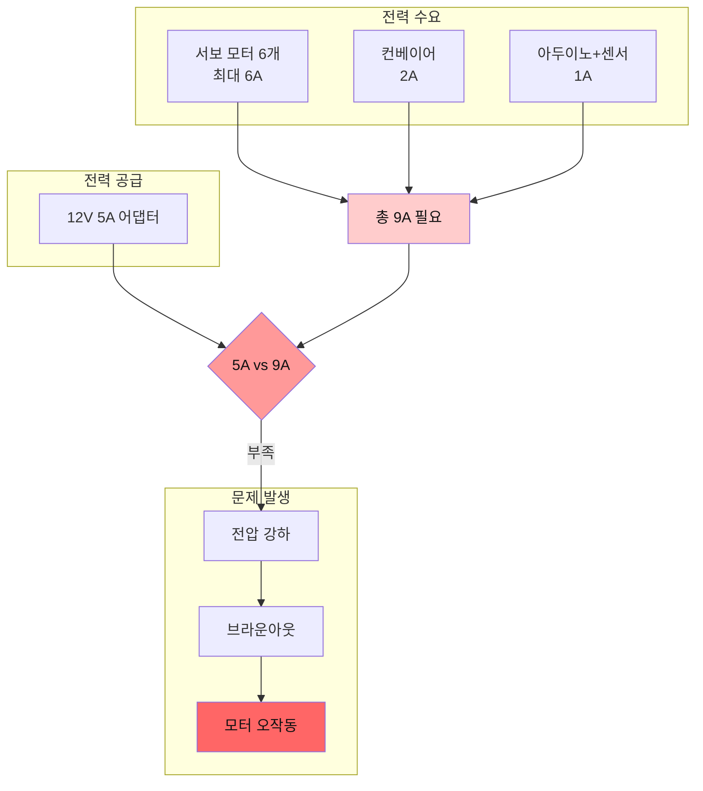

**주요 문제:**
1. **피크 전류 초과**: 모든 모터가 동시 구동 시 전류 부족
2. **전압 강하**: 케이블 저항으로 인한 전압 손실 (특히 긴 케이블)
3. **브라운아웃**: 아두이노 리셋, 데이터 손실
4. **배터리 사용 시**: 용량 계산 오류, 방전으로 인한 성능 저하

---

## 2. 소프트웨어 및 AI 관련 문제점

### 2.1 컴퓨터 비전의 한계

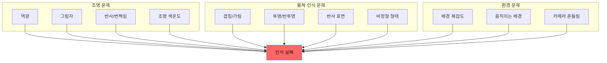

#### 2.1.1 Reality Gap (현실 격차)

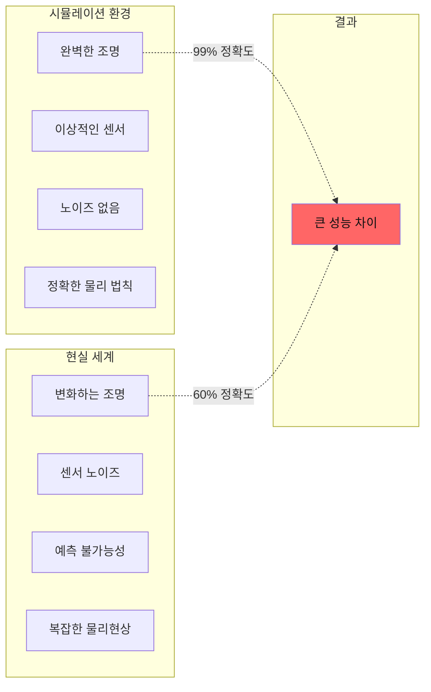

| 요소 | 시뮬레이션 | 현실 | 격차 |
|------|-----------|------|------|
| **객체 인식 정확도** | 95-99% | 60-80% | ⚠️⚠️⚠️ |
| **위치 정밀도** | ±0.1mm | ±5mm | ⚠️⚠️⚠️ |
| **처리 속도** | 60 FPS | 10-15 FPS | ⚠️⚠️ |
| **조명 견고성** | 완벽 | 매우 약함 | ⚠️⚠️⚠️ |

### 2.2 AI 모델의 문제점

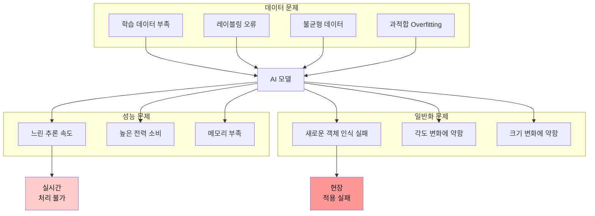

#### 실제 발생 사례

| 문제 상황 | 원인 | 학습 포인트 |
|----------|------|------------|
| **그림자를 물체로 인식** | 학습 데이터에 그림자 없음 | 다양한 조명 조건 데이터 필요 |
| **빨간 물체만 인식** | 학습 데이터가 빨간색 위주 | 데이터 불균형 문제 |
| **45도 각도에서 인식 실패** | 정면 이미지만 학습 | 다양한 각도 데이터 증강 필요 |
| **비슷한 물체 혼동** | 클래스 간 유사성 높음 | 더 많은 특징, 더 깊은 네트워크 |
| **느린 추론 (1fps)** | 모델이 너무 큼 | 모델 경량화 (Pruning, Quantization) |

### 2.3 통신 지연 문제 (Latency)

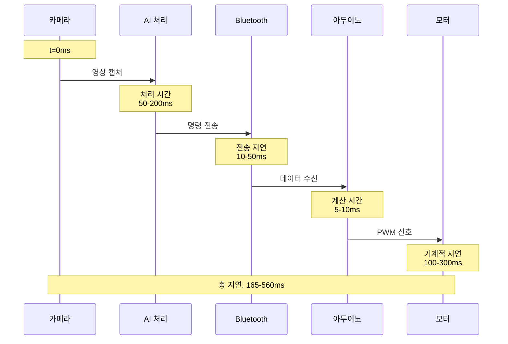

**지연 시간 구성:**

| 단계 | 최소 | 최대 | 주요 원인 |
|------|------|------|----------|
| 영상 캡처 | 16ms | 33ms | 프레임레이트 (30-60fps) |
| AI 추론 | 50ms | 200ms | 모델 복잡도, CPU/GPU 성능 |
| 통신 전송 | 10ms | 50ms | Bluetooth 프로토콜, 패킷 크기 |
| 아두이노 처리 | 5ms | 10ms | 계산 복잡도 |
| 모터 응답 | 100ms | 300ms | 기계적 관성, 속도 제한 |
| **총합** | **181ms** | **593ms** | - |

**문제 발생:**
- 빠르게 움직이는 물체 추적 실패
- 실시간 제어 불가능
- 사용자 경험 저하

---

## 3. 통합 및 시스템 문제점

### 3.1 하드웨어-소프트웨어 통합의 어려움

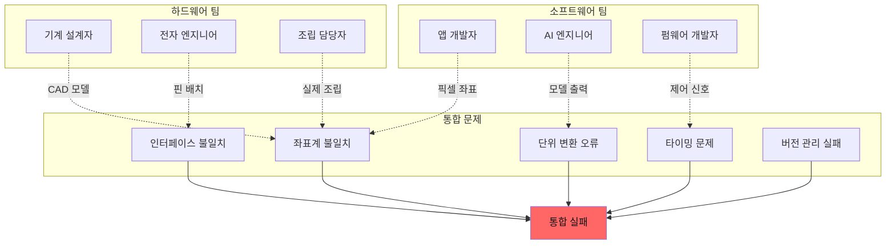

#### 실제 통합 문제 사례

| 문제 | 발생 원인 | 해결 방법 |
|------|----------|----------|
| **좌표계 불일치** | 카메라(픽셀) vs 로봇(mm/각도) | 캘리브레이션 매트릭스 |
| **타이밍 동기화** | 센서 읽기 vs 모터 구동 타이밍 | 인터럽트 기반 동기화 |
| **단위 변환 오류** | 각도(degree/radian), 거리(cm/mm) | 명확한 인터페이스 문서 |
| **버전 충돌** | 펌웨어 v1.0 vs 앱 v2.0 | 버전 체크 프로토콜 |
| **전원 순서** | 모터 먼저 ON → 아두이노 리셋 | 전원 투입 시퀀스 정의 |

### 3.2 환경 변화에 대한 취약성

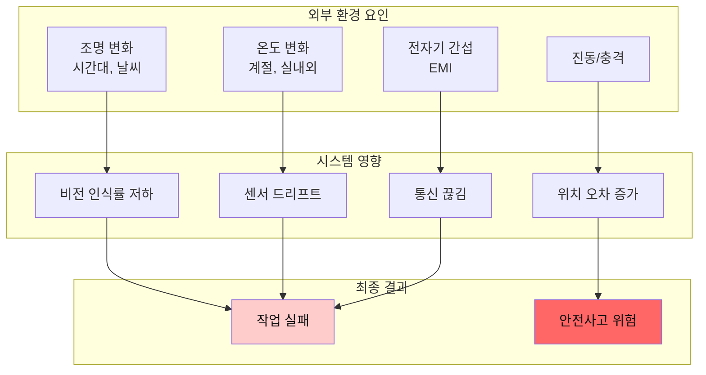

### 3.3 디버깅의 어려움

**문제 원인 파악이 어려운 이유:**

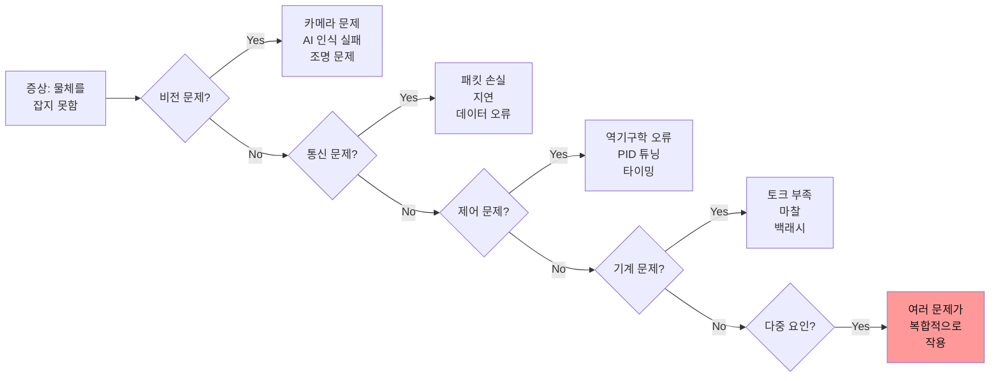

---

## 4. 경제적 제약

### 4.1 비용 구조 분석

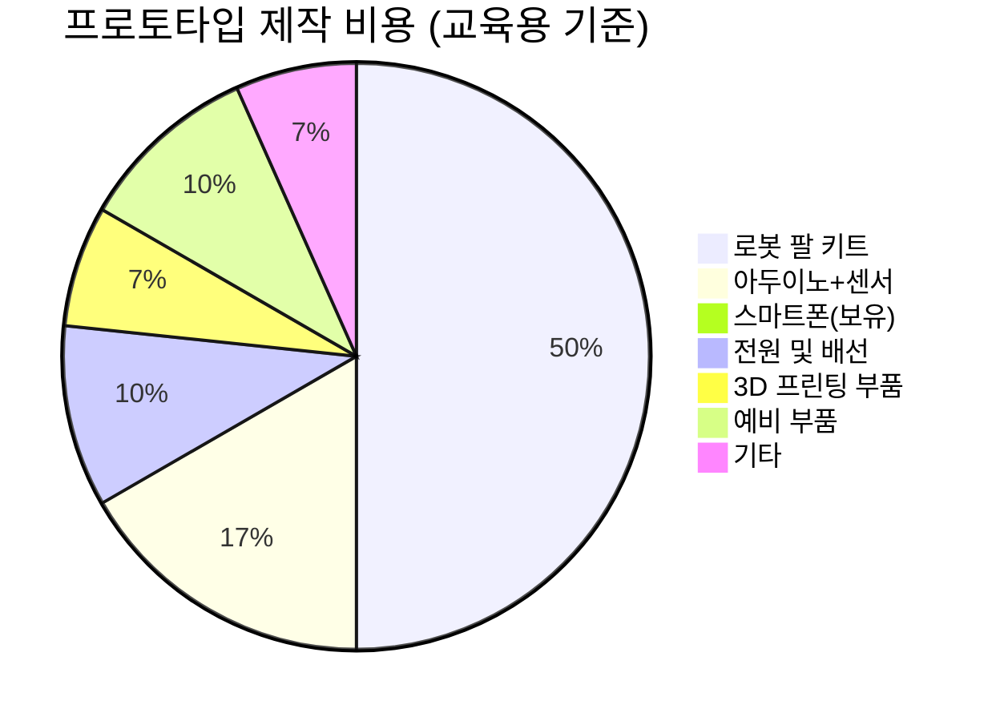

| 항목 | 비용 | 문제점 |
|------|------|--------|
| 로봇 팔 키트 | ₩150,000 | 고장 시 수리 비용 높음 |
| 서보 모터 (여분) | ₩5,000 x 6 | 자주 고장남 |
| 센서 세트 | ₩50,000 | 정밀 센서는 더 비쌈 |
| 전원 공급 장치 | ₩30,000 | 용량 부족 시 추가 구매 |
| 케이블/커넥터 | ₩20,000 | 단선, 접촉 불량 |
| **총합** | **₩280,000** | **팀당 비용 (4개 팀 = 112만원)** |

### 4.2 유지보수 문제

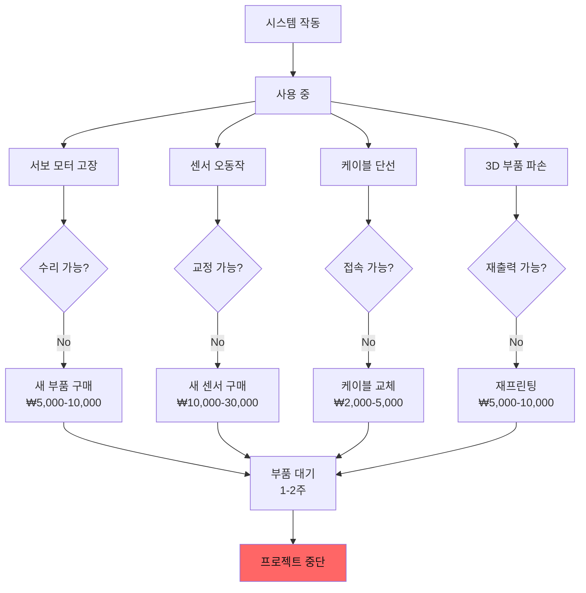

---

## 5. 안전 및 윤리적 문제

### 5.1 안전사고 위험 분석

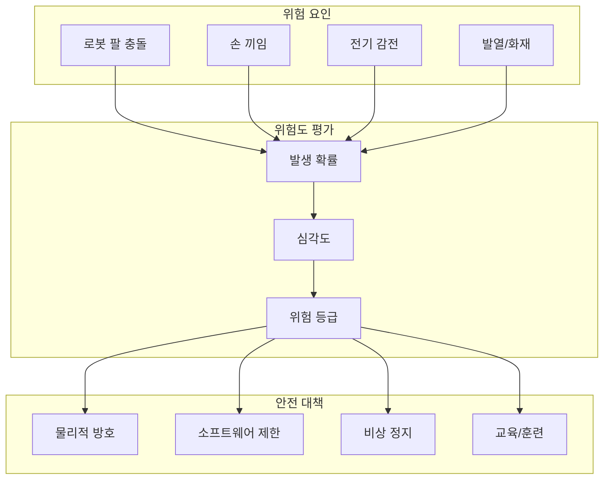

#### 위험도 매트릭스

| 위험 | 발생 확률 | 심각도 | 위험 등급 | 대책 |
|------|----------|--------|----------|------|
| **로봇 팔 충돌** | 높음 | 중간 | 🔴 높음 | 속도 제한, 충돌 감지 |
| **손 끼임** | 중간 | 높음 | 🔴 높음 | 토크 제한, 비상 정지 버튼 |
| **전기 감전** | 낮음 | 높음 | 🟡 중간 | 절연 처리, 안전 전압 |
| **모터 과열** | 중간 | 낮음 | 🟢 낮음 | 온도 센서, 타임아웃 |
| **케이블 화재** | 낮음 | 높음 | 🟡 중간 | 퓨즈, 적정 케이블 사용 |

### 5.2 윤리적 고려사항

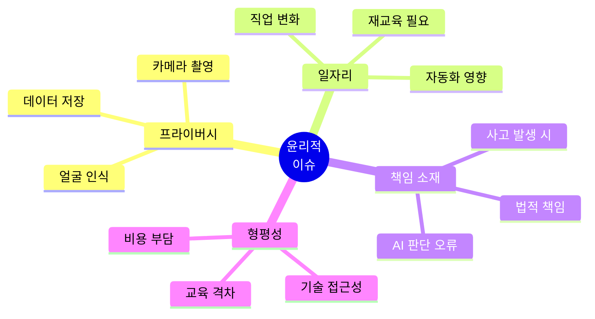

| 윤리적 질문 | 고려사항 | 학생 토론 주제 |
|------------|---------|----------------|
| **카메라가 작업자를 촬영한다면?** | 프라이버시 침해 가능성 | 동의 절차, 익명화 방법 |
| **로봇이 인간 일자리를 대체한다면?** | 노동 시장 변화 | 사회적 영향, 대안 제시 |
| **AI가 잘못된 판단을 한다면?** | 책임 소재 불명확 | 누구의 책임인가? |
| **비싼 기술을 누가 사용하는가?** | 기술 격차 심화 | 공정한 접근성 확보 방안 |

---

## 6. 교육 환경에서의 특수 문제

### 6.1 학습자 관련 문제

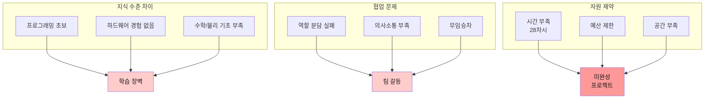

### 6.2 교육적 딜레마

| 딜레마 | 선택 A | 선택 B | 추천 |
|--------|--------|--------|------|
| **기술 vs 문제 해결** | 최신 기술 학습에 집중 | 문제 정의/성찰에 집중 | B (문제 해결) |
| **완성도 vs 학습** | 완벽한 결과물 추구 | 실패 경험도 학습 | B (학습 과정) |
| **개인 vs 팀** | 개인 프로젝트 | 팀 프로젝트 | B (협업 경험) |
| **시연 vs 문서화** | 화려한 시연 준비 | 상세한 문서 작성 | 균형 (50:50) |

---

## 7. 문제 해결 프레임워크

### 7.1 문제 분석 프로세스

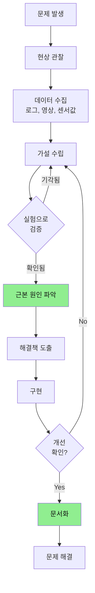

### 7.2 디버깅 체크리스트

#### 하드웨어 체크리스트

- [ ] 전원 전압 확인 (멀티미터 측정)
- [ ] 모든 연결 상태 확인 (접촉 불량)
- [ ] 모터 동작 확인 (개별 테스트)
- [ ] 센서 출력 확인 (시리얼 모니터)
- [ ] 기계적 간섭 확인 (수동 동작)
- [ ] 발열 확인 (손으로 만져보기)

#### 소프트웨어 체크리스트

- [ ] 시리얼 통신 확인 (baud rate)
- [ ] 변수 값 출력 (디버그 메시지)
- [ ] 조건문 로직 검증 (단계별 실행)
- [ ] 타이밍 확인 (delay 위치)
- [ ] 경계 조건 테스트 (최소/최대값)
- [ ] 예외 처리 확인 (오류 발생 시)

#### AI/비전 체크리스트

- [ ] 입력 이미지 확인 (저장하여 확인)
- [ ] 전처리 결과 확인 (정규화, 리사이징)
- [ ] 모델 출력 확인 (신뢰도 점수)
- [ ] 후처리 로직 확인 (필터링, NMS)
- [ ] 좌표 변환 확인 (픽셀 → 실제 좌표)
- [ ] FPS 측정 (처리 속도)

---

## 8. 학습 목표: 문제를 통한 성장

### 이 문제들이 주는 교육적 가치

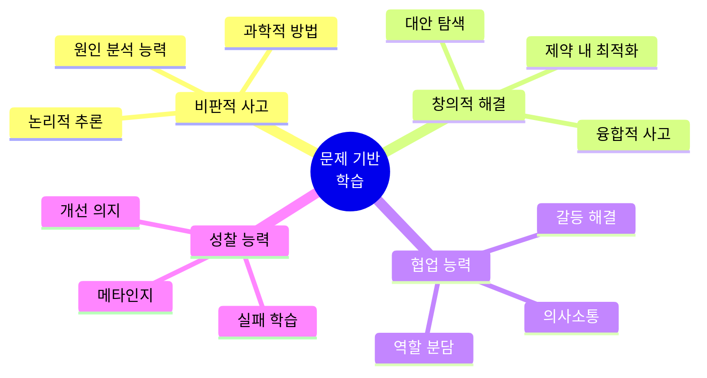

### 각 문제점별 학습 포인트

| 문제 카테고리 | 학습할 수 있는 것 | 실제 산업 연관성 |
|-------------|-----------------|----------------|
| **하드웨어 한계** | 물리 법칙, 기계 공학, 제약 조건 내 설계 | 로봇 공학, 자동화 엔지니어 |
| **센서 노이즈** | 신호 처리, 필터링, 데이터 신뢰성 | 센서 융합, IoT 시스템 |
| **AI 인식 오류** | 머신러닝 한계, 데이터 품질, 모델 개선 | AI/ML 엔지니어, 데이터 과학자 |
| **통합 문제** | 시스템 사고, 인터페이스 설계, 협업 | 시스템 아키텍트, PM |
| **안전/윤리** | 책임감, 사회적 영향, 윤리적 판단 | 모든 엔지니어의 필수 자질 |

---

## 9. 문제 해결 사례 연구

### 사례 1: 그림자를 물체로 인식하는 문제

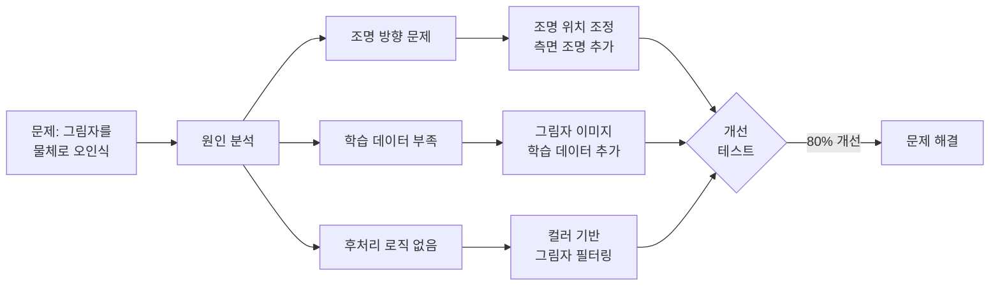

**학습 포인트:**
- 문제의 다면적 원인 (하드웨어 + 소프트웨어)
- 복합적 해결책 필요
- 완벽한 해결은 불가능 (80% 개선도 성공)

### 사례 2: 모터가 떨리는 문제

**증상:** 로봇 팔이 목표 위치에서 계속 미세하게 떨림

**원인 분석:**
1. PID 제어기의 P(비례) 게인이 너무 높음
2. 센서 노이즈가 제어 신호에 영향
3. 백래시로 인한 불감대

**해결책:**
1. P 게인 감소, D(미분) 게인 추가
2. 이동 평균 필터 적용
3. 목표 도달 허용 오차 증가 (±2mm)

**결과:** 떨림 90% 감소, 제어 안정성 향상

---

## 10. 마무리: 문제는 학습의 기회

### 교사/멘토를 위한 조언

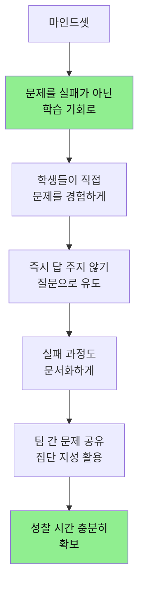

### 학생을 위한 메시지

> **"모든 위대한 엔지니어는 수천 번의 실패를 경험했습니다."**
>
> 이 프로젝트에서 마주치는 문제들은:
> - ❌ 여러분의 능력 부족이 **아닙니다**
> - ✅ 실제 산업 현장의 **진짜 문제**입니다
> - ✅ 해결하는 과정이 **진짜 학습**입니다
> - ✅ 공모전 발표의 **핵심 콘텐츠**입니다
>
> "어떤 문제를 만났고, 어떻게 해결했는가"가
> "완벽한 결과물"보다 훨씬 가치 있습니다!

---

## 다음 단계

- **03_바이브_코딩_가이드.md**: 문제 해결 방법론
- **05_AI_비전_통합.md**: AI 관련 문제 해결 기술
- **07_평가_루브릭.md**: 문제 해결 과정 평가 기준
