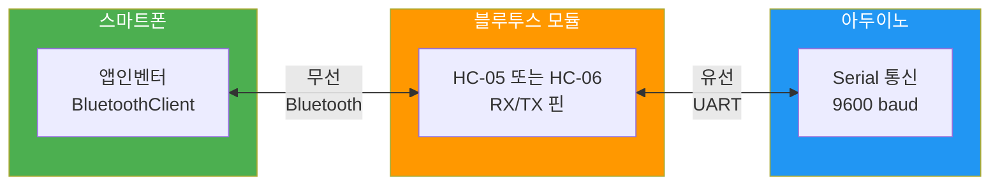
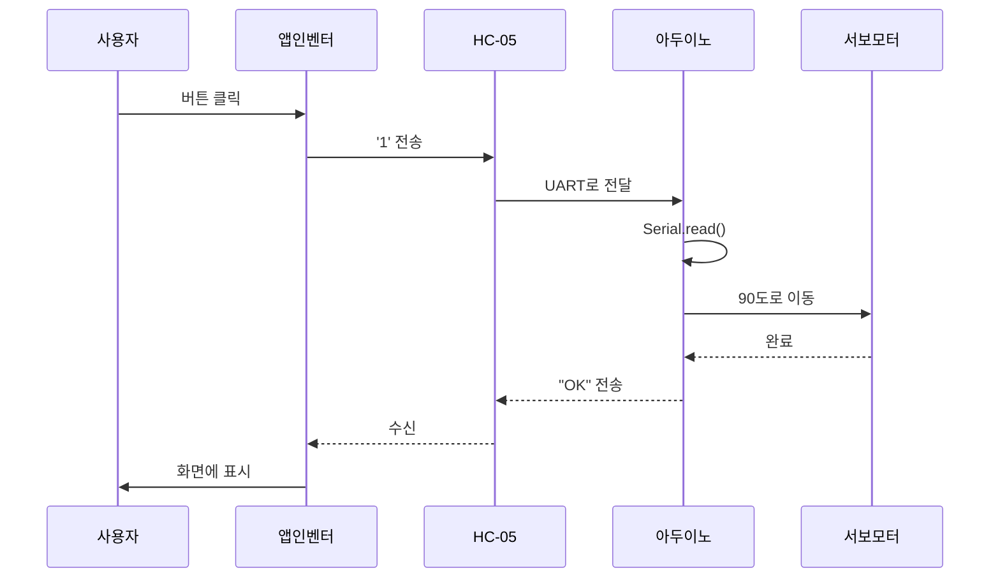
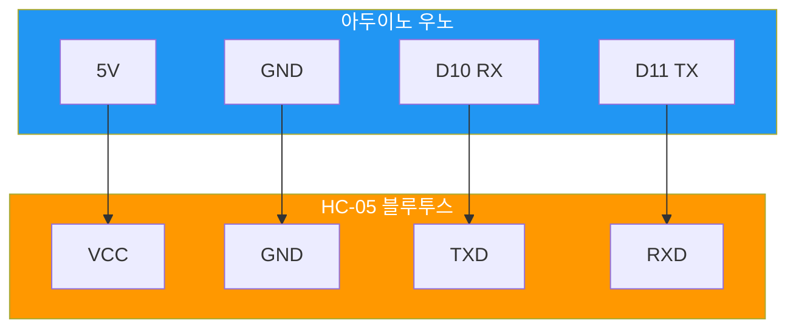

# 블루투스 통신 프로토콜 가이드 (교육용)

> **앱인벤터 ↔ 아두이노 블루투스 통신 완벽 가이드**

## 📌 개요

이 문서는 **대학생 교육용**으로 **가장 간단한 블루투스 통신 방법**을 설명합니다.
- ✅ 1바이트 문자 전송
- ✅ 복잡한 패킷 구조 없음
- ✅ 앱인벤터 블록 코딩
- ✅ 시리얼 모니터로 테스트 가능

---

## 1. 블루투스 통신 개념

### 1.1 기본 원리



### 1.2 통신 흐름



---

## 2. 하드웨어 연결

### 2.1 HC-05 / HC-06 핀 구성

| 핀 이름 | 역할 | 아두이노 연결 |
|--------|------|-------------|
| **VCC** | 전원 (5V) | 5V |
| **GND** | 접지 | GND |
| **TXD** | 전송 (TX) | RX (D0) 또는 소프트웨어 시리얼 |
| **RXD** | 수신 (RX) | TX (D1) 또는 소프트웨어 시리얼 |
| EN/KEY | 설정 모드 | 사용 안 함 |
| STATE | 연결 상태 | LED 연결 (옵션) |

### 2.2 배선 다이어그램



**💡 주의사항:**
- ⚠️ **크로스 연결**: 아두이노 TX → HC-05 RX, 아두이노 RX → HC-05 TX
- ⚠️ **전압 주의**: HC-05 RX는 3.3V이지만 대부분 5V 입력도 허용 (확인 필요)
- ✅ **소프트웨어 시리얼 권장**: D10, D11 사용 (하드웨어 시리얼은 USB 충돌)

### 2.3 실제 배선 사진 참고

```
아두이노 핀       HC-05 핀
─────────────────────────
5V       ───────→  VCC
GND      ───────→  GND
D10 (RX) ───────→  TXD
D11 (TX) ───────→  RXD
```

---

## 3. 통신 프로토콜 정의

### 3.1 명령 코드 테이블

| 명령 문자 | ASCII 코드 | 의미 | 동작 예시 |
|---------|----------|------|----------|
| `'0'` | 48 | 홈 포지션 | 모든 서보 0도 |
| `'1'` | 49 | 위치 A | 서보1: 90도 |
| `'2'` | 50 | 위치 B | 서보1: 45도 |
| `'3'` | 51 | 위치 C | 서보1: 135도 |
| `'G'` | 71 | 그리퍼 닫기 | 그리퍼 서보: 180도 |
| `'O'` | 79 | 그리퍼 열기 | 그리퍼 서보: 0도 |
| `'S'` | 83 | 정지 | 모든 동작 중지 |

### 3.2 명령 추가 방법

```cpp
// 새로운 명령 추가 예시
switch(command) {
  case '0': // 홈
    servo1.write(0);
    break;
  case '1': // 위치 A
    servo1.write(90);
    break;
  case 'G': // 그리퍼 닫기
    gripperServo.write(180);
    break;
  // 여기에 새로운 명령 추가
  case '4': // 새 위치 D
    servo1.write(120);
    servo2.write(60);
    break;
}
```

### 3.3 확장 프로토콜 (옵션)

더 복잡한 제어가 필요한 경우:

| 명령 형식 | 예시 | 의미 |
|---------|------|------|
| `A:90` | A 서보를 90도로 | 서보별 각도 제어 |
| `M:123` | 모든 서보 동시 제어 | 비트 플래그 |
| `D:500` | 500ms 지연 | 동작 속도 조절 |

---

## 4. 아두이노 코드

### 4.1 기본 블루투스 수신 코드

```cpp
/* 
 * 파일명: bluetooth_basic.ino
 * 설명: HC-05/HC-06 블루투스 통신 기본 예제
 * 작성자: 교육용
 */

#include <SoftwareSerial.h>

// 소프트웨어 시리얼 설정 (RX, TX)
SoftwareSerial BTSerial(10, 11); // D10=RX, D11=TX

void setup() {
  // 하드웨어 시리얼 (USB 디버깅용)
  Serial.begin(9600);
  Serial.println("블루투스 테스트 시작");
  
  // 블루투스 시리얼
  BTSerial.begin(9600);
}

void loop() {
  // 블루투스에서 데이터 수신
  if (BTSerial.available()) {
    char receivedChar = BTSerial.read();
    
    // 디버깅 출력
    Serial.print("수신: ");
    Serial.println(receivedChar);
    
    // 명령 처리
    processCommand(receivedChar);
    
    // 확인 응답 전송
    BTSerial.print("OK:");
    BTSerial.println(receivedChar);
  }
  
  // 시리얼 모니터에서 테스트
  if (Serial.available()) {
    char testChar = Serial.read();
    BTSerial.write(testChar); // 블루투스로 전송
  }
}

// 명령 처리 함수
void processCommand(char cmd) {
  switch(cmd) {
    case '0':
      Serial.println("→ 홈 포지션");
      // 여기에 서보 제어 코드 추가
      break;
      
    case '1':
      Serial.println("→ 위치 A");
      break;
      
    case '2':
      Serial.println("→ 위치 B");
      break;
      
    case '3':
      Serial.println("→ 위치 C");
      break;
      
    case 'G':
      Serial.println("→ 그리퍼 닫기");
      break;
      
    case 'O':
      Serial.println("→ 그리퍼 열기");
      break;
      
    case 'S':
      Serial.println("→ 정지");
      break;
      
    default:
      Serial.println("→ 알 수 없는 명령");
  }
}
```

### 4.2 서보 제어 통합 코드

```cpp
/* 
 * 파일명: bluetooth_servo_control.ino
 * 설명: 블루투스로 서보 모터 제어
 */

#include <SoftwareSerial.h>
#include <Servo.h>

// 블루투스 시리얼
SoftwareSerial BTSerial(10, 11);

// 서보 객체
Servo servo1;
Servo servo2;
Servo gripperServo;

// 서보 연결 핀
const int SERVO1_PIN = 9;
const int SERVO2_PIN = 6;
const int GRIPPER_PIN = 5;

void setup() {
  Serial.begin(9600);
  BTSerial.begin(9600);
  
  // 서보 초기화
  servo1.attach(SERVO1_PIN);
  servo2.attach(SERVO2_PIN);
  gripperServo.attach(GRIPPER_PIN);
  
  // 홈 포지션
  goHome();
  
  Serial.println("시스템 준비 완료");
}

void loop() {
  if (BTSerial.available()) {
    char cmd = BTSerial.read();
    executeCommand(cmd);
  }
}

void executeCommand(char cmd) {
  Serial.print("명령 실행: ");
  Serial.println(cmd);
  
  switch(cmd) {
    case '0': // 홈
      goHome();
      break;
      
    case '1': // 위치 A
      servo1.write(90);
      servo2.write(45);
      delay(1000);
      break;
      
    case '2': // 위치 B
      servo1.write(45);
      servo2.write(90);
      delay(1000);
      break;
      
    case '3': // 위치 C
      servo1.write(135);
      servo2.write(60);
      delay(1000);
      break;
      
    case 'G': // 그리퍼 닫기
      gripperServo.write(180);
      delay(500);
      break;
      
    case 'O': // 그리퍼 열기
      gripperServo.write(0);
      delay(500);
      break;
      
    case 'S': // 정지
      // 현재 위치 유지
      break;
      
    default:
      Serial.println("알 수 없는 명령");
      return;
  }
  
  // 완료 응답
  BTSerial.println("OK");
}

void goHome() {
  servo1.write(0);
  servo2.write(0);
  gripperServo.write(0);
  delay(1000);
  Serial.println("홈 포지션 완료");
}
```

---

## 5. 앱인벤터 구현

### 5.1 필요한 컴포넌트

| 컴포넌트 | 이름 | 역할 |
|---------|------|------|
| **BluetoothClient** | BluetoothClient1 | 블루투스 통신 |
| **ListPicker** | ListPicker1 | 블루투스 장치 선택 |
| **Button** | BtnConnect | 연결 버튼 |
| **Button** | BtnHome | 홈 명령 |
| **Button** | Btn1, Btn2, Btn3 | 위치 명령 |
| **Button** | BtnGripClose | 그리퍼 닫기 |
| **Button** | BtnGripOpen | 그리퍼 열기 |
| **Label** | LabelStatus | 상태 표시 |

### 5.2 화면 레이아웃

```
┌─────────────────────────┐
│   [블루투스 선택 ▼]     │ ← ListPicker
│   [연결]                │ ← BtnConnect
├─────────────────────────┤
│ 상태: 연결됨            │ ← LabelStatus
├─────────────────────────┤
│   [홈]                  │ ← BtnHome
│   [위치 A]  [위치 B]    │ ← Btn1, Btn2
│   [위치 C]              │ ← Btn3
│   [그리퍼▼]  [그리퍼▲]  │ ← BtnGripClose, Open
└─────────────────────────┘
```

### 5.3 블록 코드 (주요 부분)

#### 블루투스 연결

```
[BtnConnect.Click 이벤트]
  └─ [BluetoothClient1.Connect]
       └─ [address] → [ListPicker1.Selection]
  └─ [LabelStatus.Text 설정]
       └─ [연결됨]
```

#### 명령 전송

```
[Btn1.Click 이벤트]  // 위치 A
  └─ [if] BluetoothClient1.IsConnected
       └─ [then]
            └─ [BluetoothClient1.SendText]
                 └─ [text] → "1"
            └─ [LabelStatus.Text 설정]
                 └─ [위치 A 실행]
       └─ [else]
            └─ [LabelStatus.Text 설정]
                 └─ [블루투스 연결 필요]
```

#### 응답 수신

```
[BluetoothClient1.DataReceived 이벤트]
  └─ [LabelStatus.Text 설정]
       └─ [join]
            └─ "아두이노: "
            └─ [BluetoothClient1.ReceiveText]
```

### 5.4 전체 블록 구성 팁

1. **초기화 블록**
   ```
   [Screen1.Initialize 이벤트]
     └─ [ListPicker1.Elements 설정]
          └─ [BluetoothClient1.AddressesAndNames]
     └─ [LabelStatus.Text 설정]
          └─ "연결 대기"
   ```

2. **에러 처리**
   ```
   [try-catch 블록 사용]
     └─ 연결 실패 시 메시지 표시
   ```

---

## 6. 테스트 및 디버깅

### 6.1 단계별 테스트

#### 1단계: HC-05 단독 테스트

```cpp
// 코드 없이 테스트
// 1. HC-05에 전원 연결
// 2. LED 깜빡임 확인 (연결 대기 상태)
// 3. 스마트폰에서 "HC-05" 검색
// 4. 페어링 (비밀번호: 1234 또는 0000)
```

#### 2단계: 시리얼 모니터 테스트

```cpp
// 아두이노에 코드 업로드
// 1. 시리얼 모니터 열기 (9600 baud)
// 2. '1', '2', '3' 입력
// 3. 명령이 제대로 출력되는지 확인
```

#### 3단계: 블루투스 에코 테스트

```cpp
void loop() {
  if (BTSerial.available()) {
    char c = BTSerial.read();
    BTSerial.print("받음: ");
    BTSerial.println(c);
  }
}
```

#### 4단계: 앱인벤터 테스트

```
1. 앱 실행
2. 블루투스 연결
3. 버튼 클릭
4. 시리얼 모니터에 명령 출력 확인
```

### 6.2 자주 발생하는 문제

| 문제 | 원인 | 해결 방법 |
|------|------|----------|
| **연결 안 됨** | HC-05 페어링 안 됨 | 스마트폰 설정에서 페어링 먼저 |
| **문자 깨짐** | Baud rate 불일치 | 9600으로 통일 |
| **명령 무반응** | RX/TX 반대 연결 | 크로스 연결 확인 |
| **간헐적 끊김** | 전원 부족 | 별도 5V 전원 공급 |
| **여러 문자 수신** | 버퍼 쌓임 | `while(BTSerial.available()) BTSerial.read();` |

### 6.3 디버깅 코드

```cpp
// 디버깅 정보 출력
void debugInfo() {
  Serial.println("=== 디버깅 정보 ===");
  Serial.print("블루투스 연결: ");
  Serial.println(BTSerial.available() ? "있음" : "없음");
  
  Serial.print("서보1 각도: ");
  Serial.println(servo1.read());
  
  Serial.print("여유 메모리: ");
  Serial.println(freeMemory());
  Serial.println("=================");
}
```

---

## 7. 고급 기능 (선택)

### 7.1 양방향 통신

```cpp
// 아두이노에서 센서 값 전송
void sendSensorData() {
  int sensorValue = analogRead(A0);
  
  BTSerial.print("S:");
  BTSerial.println(sensorValue);
}
```

```
[앱인벤터]
[BluetoothClient1.DataReceived]
  └─ [if] [starts with] "S:"
       └─ [LabelSensor.Text] ← [split] text
```

### 7.2 체크섬 추가

```cpp
// 간단한 체크섬
char calculateChecksum(String data) {
  int sum = 0;
  for(int i=0; i<data.length(); i++) {
    sum += data[i];
  }
  return (char)(sum % 256);
}
```

### 7.3 JSON 형식 (Arduino JSON 라이브러리 사용)

```cpp
// 전송
BTSerial.println("{\"cmd\":\"1\",\"angle\":90}");

// 수신
StaticJsonDocument<200> doc;
deserializeJson(doc, BTSerial);
int angle = doc["angle"];
```

---

## 8. 실전 예제: 불량품 분류 로봇

### 8.1 시나리오

1. 앱인벤터에서 사진 촬영
2. Teachable Machine이 'A', 'B', 'C' 분류
3. 분류 결과에 따라 블루투스 명령 전송
4. 로봇 팔이 해당 위치로 물체 이동

### 8.2 앱인벤터 블록 (Teachable Machine 연동)

```
[BtnCapture.Click]
  └─ [Camera1.TakePicture]

[Camera1.AfterPicture]
  └─ [TeachableMachine.ClassifyImage]
       └─ [image] ← Camera1.ImagePath

[TeachableMachine.GotClassification]
  └─ [if] [classification] = "Class A"
       └─ [BluetoothClient1.SendText] "1"
  └─ [else if] [classification] = "Class B"
       └─ [BluetoothClient1.SendText] "2"
  └─ [else if] [classification] = "Class C"
       └─ [BluetoothClient1.SendText] "3"
```

### 8.3 아두이노 코드 (위치별 동작)

```cpp
void executeCommand(char cmd) {
  switch(cmd) {
    case '1': // Class A → 왼쪽 통
      moveToPosition(30, 90, 120);
      openGripper();
      delay(500);
      goHome();
      break;
      
    case '2': // Class B → 중앙 통
      moveToPosition(90, 90, 90);
      openGripper();
      delay(500);
      goHome();
      break;
      
    case '3': // Class C → 오른쪽 통
      moveToPosition(150, 90, 120);
      openGripper();
      delay(500);
      goHome();
      break;
  }
}

void moveToPosition(int angle1, int angle2, int angle3) {
  servo1.write(angle1);
  servo2.write(angle2);
  servo3.write(angle3);
  delay(2000); // 위치 이동 대기
}
```

---

## 9. 체크리스트

### 하드웨어 체크리스트
- [ ] HC-05 VCC → 아두이노 5V
- [ ] HC-05 GND → 아두이노 GND
- [ ] HC-05 TXD → 아두이노 D10 (RX)
- [ ] HC-05 RXD → 아두이노 D11 (TX)
- [ ] HC-05 LED 깜빡임 확인

### 소프트웨어 체크리스트
- [ ] 아두이노 코드 업로드 성공
- [ ] 시리얼 모니터에서 테스트 성공
- [ ] 블루투스 페어링 완료
- [ ] 앱인벤터 앱 설치
- [ ] 앱에서 연결 성공
- [ ] 명령 전송 성공
- [ ] 서보 동작 확인

### 디버깅 체크리스트
- [ ] Baud rate 9600 확인
- [ ] RX/TX 크로스 연결 확인
- [ ] 전원 전압 5V 확인
- [ ] GND 공통 연결 확인
- [ ] 코드에 오타 없음
- [ ] 블루투스 범위 (10m 이내)

---

## 10. 참고 자료

### 공식 문서
- [HC-05 데이터시트](https://components101.com/wireless/hc-05-bluetooth-module)
- [아두이노 SoftwareSerial](https://www.arduino.cc/en/Reference/SoftwareSerial)
- [앱인벤터 BluetoothClient](http://ai2.appinventor.mit.edu/reference/components/connectivity.html#BluetoothClient)

### 추천 튜토리얼
- 앱인벤터 블루투스 기초
- HC-05 설정 모드 진입 방법
- 아두이노 시리얼 통신 디버깅

### 다음 문서
- **03_아두이노_가이드.md** ← 피지컬 컴퓨팅 상세
- **04_앱인벤터_가이드.md** ← 앱 제작 튜토리얼

---

## 💬 FAQ

**Q: HC-05와 HC-06의 차이는?**  
A: HC-05는 마스터/슬레이브 모두 가능, HC-06은 슬레이브만. 교육용은 HC-06으로도 충분합니다.

**Q: 블루투스 범위는?**  
A: 약 10m (장애물 없을 때). 실내에서는 5m 정도로 생각하세요.

**Q: 여러 명령을 연속으로 보내면?**  
A: 아두이노 코드에서 `delay()`를 줄이고, 큐(queue) 방식으로 처리하세요.

**Q: 보안은?**  
A: HC-05는 기본 페어링만 있습니다. 보안이 중요하면 BLE(Bluetooth Low Energy)를 사용하세요.

---

**작성자:** 스마트 팩토리 교육 프로젝트  
**최종 수정:** 2026-01-17  
**버전:** 1.0 (교육용)
