# 바이브 코딩 (VIBE Coding) 가이드

## 바이브 코딩이란?

**VIBE Coding**은 4가지 역할을 순환하며 프로젝트를 완성하는 학습 방법론입니다.
인간이 AI보다 잘하는 능력(문제 발견, 성찰, 비즈니스)에 집중합니다.

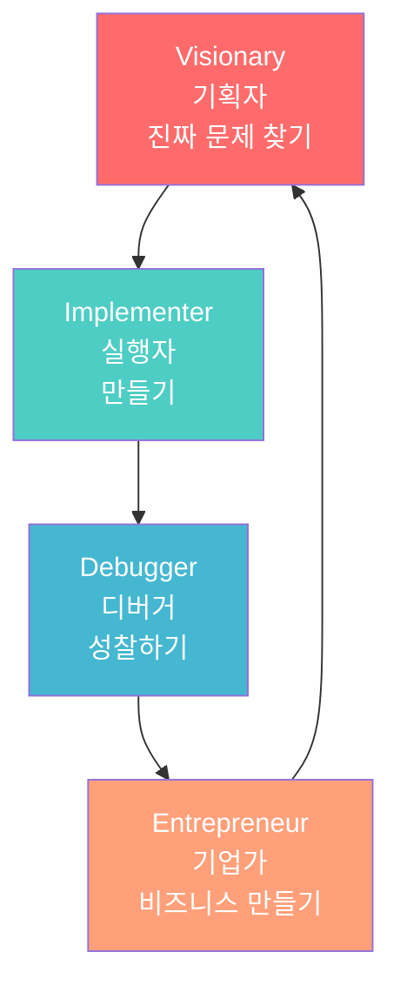

---

## 1단계: Visionary (기획자) - 진짜 문제 찾기

### 목표
**인간이 가장 잘하는 것: 공감, 관찰, 맥락 이해**

AI는 패턴을 인식하지만, 진짜 문제가 무엇인지는 모릅니다.
사람만이 "왜 이것이 문제인가?", "누가 불편한가?"를 알 수 있습니다.

### 기획자의 핵심 질문

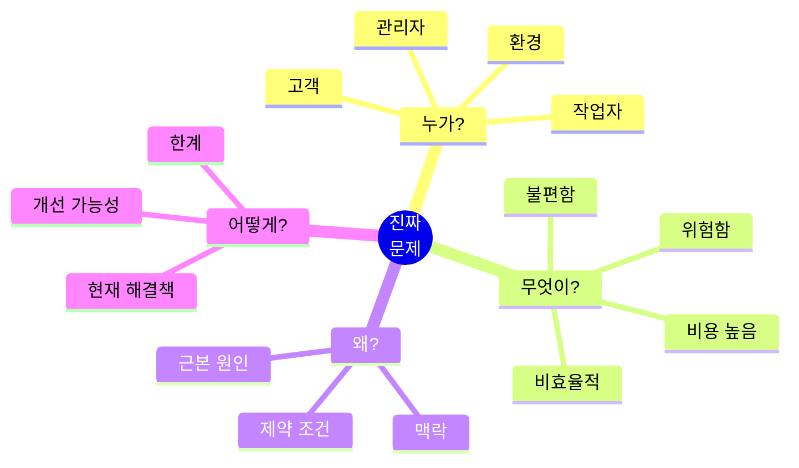

### 활동 1: 현장 관찰 및 인터뷰

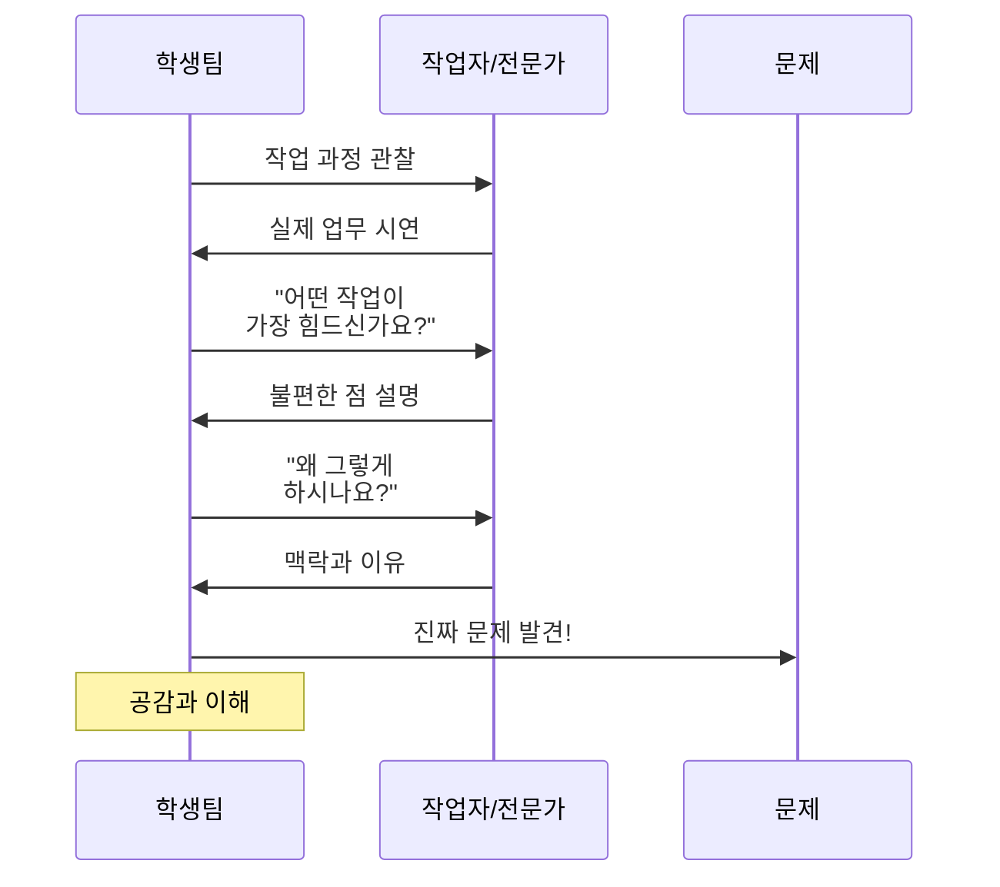

#### 인터뷰 가이드

| 질문 유형 | 좋은 질문 예시 | 나쁜 질문 예시 |
|----------|--------------|--------------|
| **개방형** | "하루 업무 중 가장 힘든 순간이 언제인가요?" | "힘드세요?" (Yes/No) |
| **맥락 파악** | "왜 그렇게 하시나요?" | "이렇게 하면 안되나요?" |
| **구체화** | "그 작업에 얼마나 시간이 걸리나요?" | "오래 걸리나요?" |
| **불편 탐색** | "이 과정에서 실수가 자주 나오나요?" | "실수 안하시죠?" |

### 활동 2: 문제 정의 캔버스

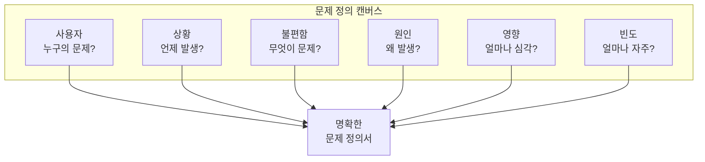

#### 예시: 좋은 문제 정의 vs 나쁜 문제 정의

| 구분 | 나쁜 예 | 좋은 예 |
|------|---------|---------|
| **모호함** | "공장이 불편하다" | "작업자가 반복적으로 3kg 부품을 들어올릴 때 허리 통증을 호소한다" |
| **해결책 중심** | "로봇 팔이 필요하다" | "QC 검사 시 육안으로 불량을 찾기 어려워 불량률이 5%에 달한다" |
| **일반적** | "효율을 높이고 싶다" | "제품 분류 작업에 작업자당 20분이 소요되어 병목이 발생한다" |

### 활동 3: 문제 우선순위 매트릭스

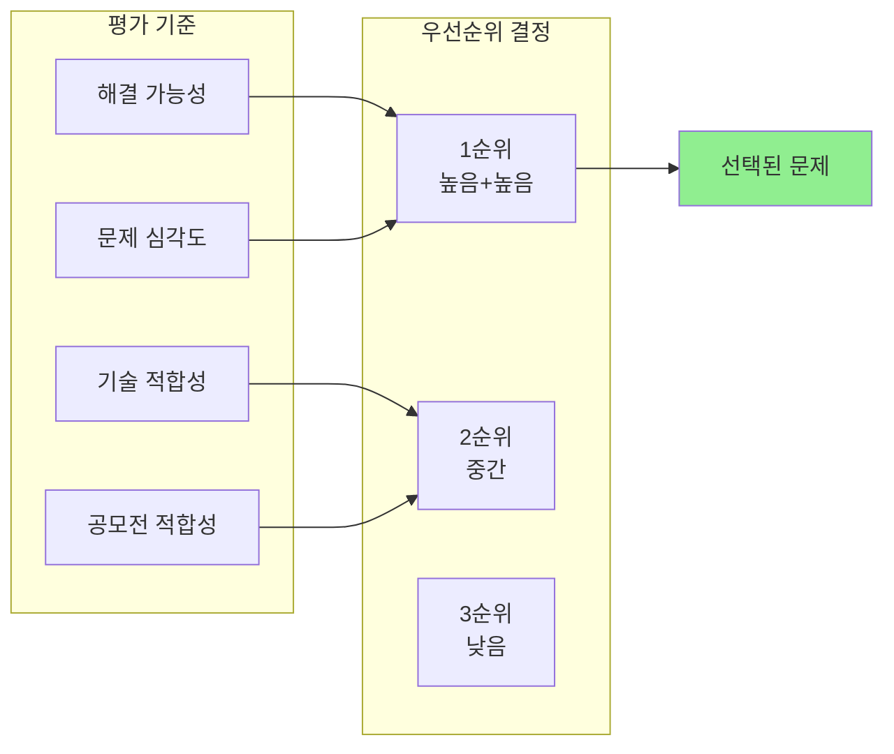

### 결과물: 문제 정의서

```markdown
# 문제 정의서

## 1. 문제 제목
"컨베이어 벨트 위 불량품 육안 검사의 정확도 문제"

## 2. 문제 상황
- **누가**: 품질 검사 담당 작업자 (20-50대, 경력 1-10년)
- **언제**: 생산 라인 마지막 단계, 하루 8시간
- **어디서**: 컨베이어 벨트 끝단, 조명 불균일한 환경
- **무엇**: 불량품(긁힘, 변색, 크기 오차)을 육안으로 선별

## 3. 문제점
- 집중력 저하로 인한 불량 검출률 감소 (오후 시간대 특히 심함)
- 조명 변화로 인한 오판 (흐린 날 vs 맑은 날)
- 작업자마다 판단 기준이 다름 (불량률 3-7% 편차)

## 4. 근본 원인
- 인간의 집중력 한계 (장시간 반복 작업)
- 주관적 판단 기준
- 환경 변수 (조명, 속도, 피로도)

## 5. 영향
- **정량적**: 불량률 5%, 월 손실액 약 200만원
- **정성적**: 작업자 스트레스, 고객 불만

## 6. 현재 해결 방법 및 한계
- 2명이 동시 검사 → 인건비 2배
- 자주 휴식 → 생산성 저하

## 7. 우리의 해결 방향
AI 비전 검사 + 로봇 팔 자동 분류 시스템
```

---

## 2단계: Implementer (실행자) - 만들기

### 목표
**아이디어를 실제로 작동하는 시스템으로 구현**

### 실행자의 3단계 프로세스

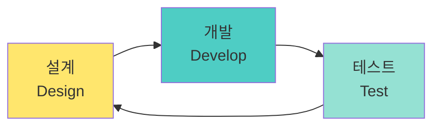

### 활동 1: 시스템 설계

#### 1.1 요구사항 정의

| 기능 | 필수/선택 | 성능 지표 | 제약 조건 |
|------|----------|----------|----------|
| 불량품 검출 | 필수 | 정확도 90% 이상 | 처리 속도 3초 이내 |
| 자동 분류 | 필수 | 성공률 95% 이상 | 안전 거리 5cm |
| 실시간 모니터링 | 선택 | 30 FPS | Wi-Fi 연결 |
| 데이터 로깅 | 선택 | - | SD 카드 저장 |

#### 1.2 시스템 블록 다이어그램

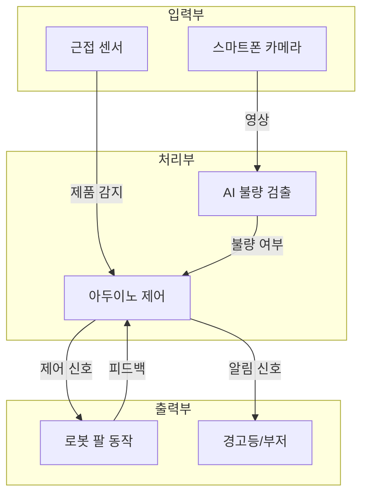

### 활동 2: 프로토타이핑

#### 개발 우선순위

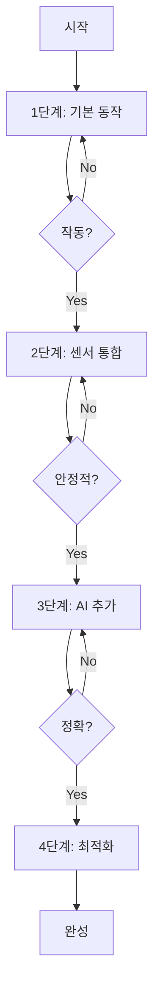

#### 프로토타이핑 원칙

1. **작게 시작하기**: 전체 시스템이 아닌 핵심 기능부터
2. **빠르게 실패하기**: 문제를 빨리 발견할수록 좋음
3. **자주 테스트하기**: 매일 작동 확인
4. **문서화하기**: 설정값, 실험 결과 기록

### 활동 3: 개발 작업 분할

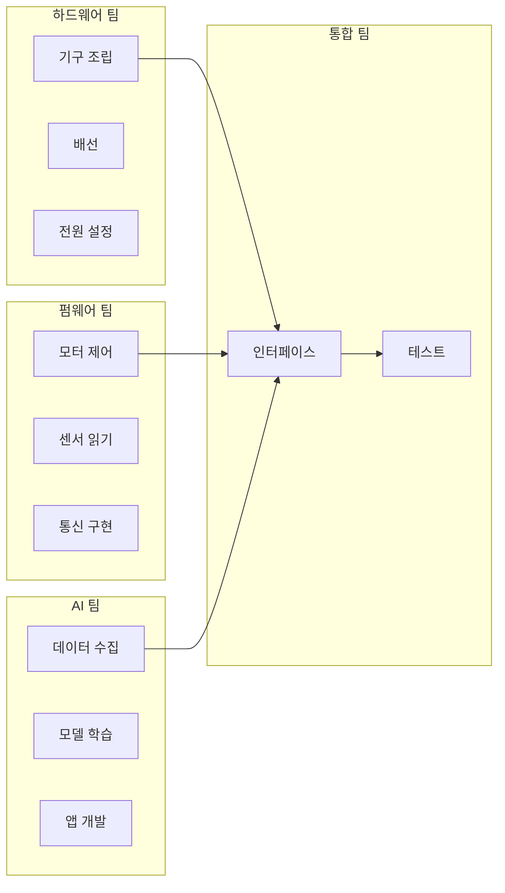

### 결과물 체크리스트

- [ ] 하드웨어 조립 완료 및 안전 점검
- [ ] 펌웨어 기본 동작 확인 (LED 깜빡임 등)
- [ ] AI 모델 학습 및 추론 테스트
- [ ] 통신 연결 확인 (스마트폰 ↔ 아두이노)
- [ ] 통합 시스템 동작 확인
- [ ] 성능 지표 측정 (정확도, 속도)
- [ ] 사용자 매뉴얼 작성

---

## 3단계: Debugger (디버거) - 성찰하기

### 목표
**실패를 통해 배우기 - 인간만이 할 수 있는 깊은 성찰**

AI는 "무엇이 잘못되었는지" 모릅니다. 
인간만이 "왜 실패했는지", "무엇을 배웠는지" 성찰할 수 있습니다.

### 디버거의 3가지 질문

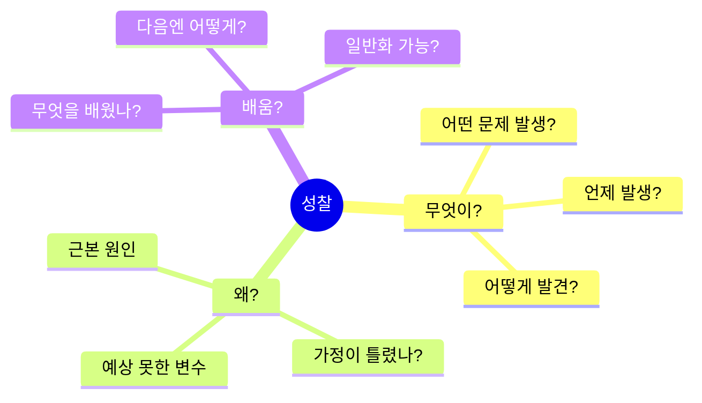

### 활동 1: 실패 일지 작성

```markdown
# 실패 일지 #3

## 날짜: 2026-01-15

## 문제 상황
로봇 팔이 목표 물체를 10번 중 3번만 성공적으로 집었음.

## 관찰 데이터
- 성공: 물체가 중앙에 있을 때
- 실패: 물체가 가장자리에 있을 때 (좌표 오차 5-10cm)

## 가설 수립
1. 카메라 왜곡 보정 문제 (가설 A)
2. 좌표 변환 수식 오류 (가설 B)
3. 로봇 팔 캘리브레이션 오차 (가설 C)

## 실험 설계
- 실험 1: 체커보드로 카메라 캘리브레이션 재실행
- 실험 2: 알려진 위치에 물체 놓고 좌표 비교
- 실험 3: 로봇 팔 수동 제어로 위치 정확도 측정

## 실험 결과
- 실험 1: 왜곡 계수 큰 변화 없음 ❌
- 실험 2: 변환 수식 오류 발견! ✅
- 실험 3: 로봇 자체는 정확함 ✅

## 근본 원인
픽셀 좌표를 실제 좌표로 변환 시 카메라 높이를 잘못 입력
(40cm로 했으나 실제는 35cm)

## 해결 방법
1. 카메라 높이 정확히 측정 (줄자 사용)
2. 변환 수식에 올바른 값 입력
3. 여러 위치에서 재테스트

## 결과
성공률 30% → 85% 향상!

## 배운 점
- 물리적 측정값의 중요성 (줄자로 정확히!)
- 가정(assumption)을 항상 검증할 것
- 체계적 실험의 힘

## 다음 개선 사항
- 카메라 자동 높이 측정 방법 연구
- 여러 높이에서도 작동하도록 자동 보정
```

### 활동 2: 성찰 회고 회의 (Retrospective)

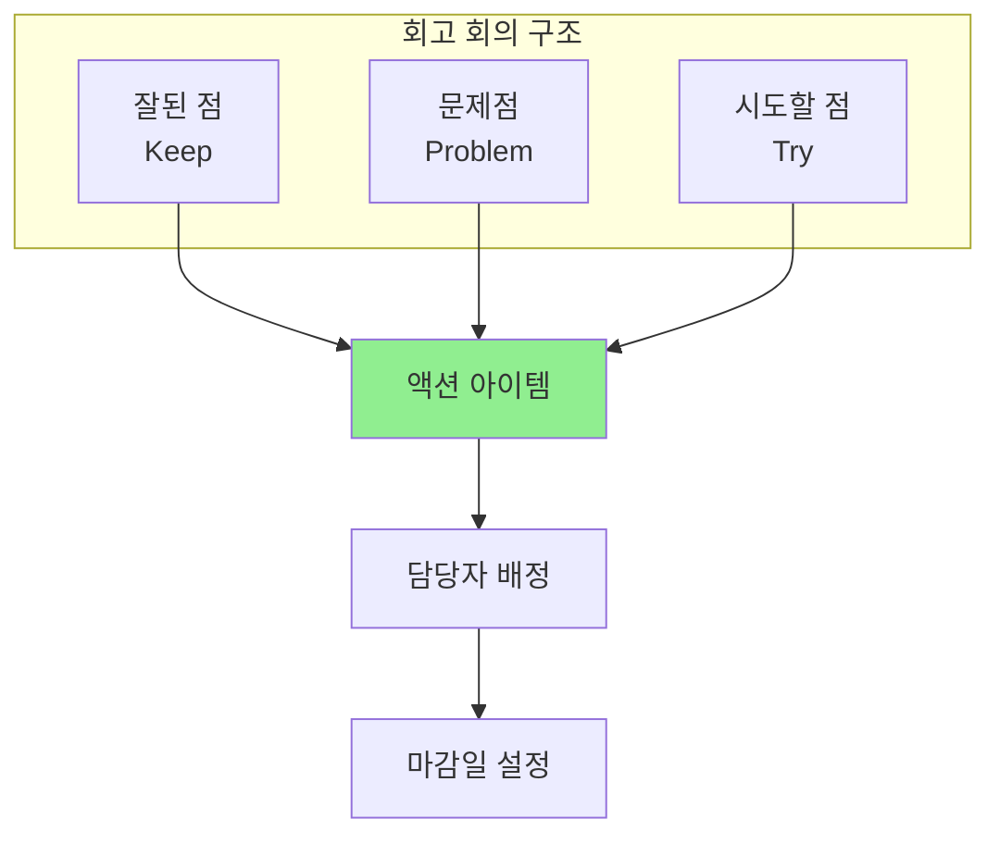

#### 회고 회의 템플릿

| 잘된 점 (Keep) | 문제점 (Problem) | 시도할 점 (Try) |
|---------------|-----------------|----------------|
| AI 인식률 90% 달성 | 조명 변화 시 인식 저하 | LED 조명 추가 |
| 팀 협업 원활 | 문서화 부족 | 매일 작업 일지 |
| 모터 제어 안정적 | 배터리 수명 짧음 | 전원 어댑터 사용 |

### 활동 3: Root Cause Analysis (근본 원인 분석)

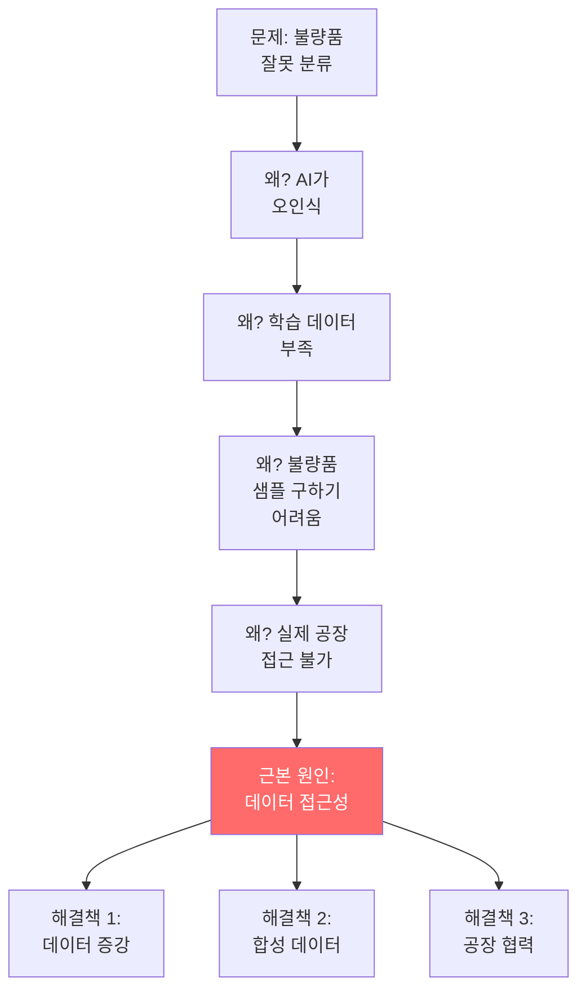

### 성찰의 수준

| 수준 | 질문 | 예시 |
|------|------|------|
| **레벨 1: 표면** | "무엇이 문제?" | "모터가 안 돌아간다" |
| **레벨 2: 원인** | "왜 문제?" | "전원이 부족하다" |
| **레벨 3: 근본** | "왜 그 원인?" | "전류 계산을 안 했다" |
| **레벨 4: 통찰** | "무엇을 배웠나?" | "설계 전 전력 예산 필수" |
| **레벨 5: 일반화** | "다른 곳에도?" | "모든 설계에 자원 계산 먼저" |

---

## 4단계: Entrepreneur (기업가) - 비즈니스 만들기

### 목표
**기술을 가치로 전환하기 - 누구에게 어떻게 팔 것인가?**

### 기업가의 핵심 사고

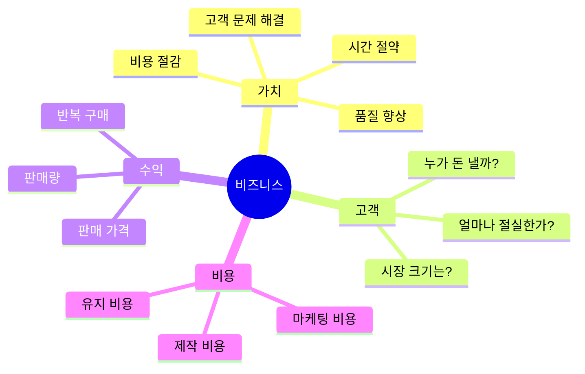

### 활동 1: 비즈니스 모델 캔버스

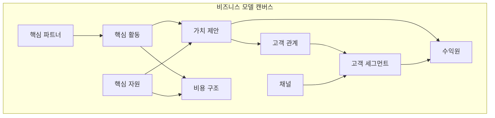

#### 예시: 불량품 검사 시스템

| 요소 | 내용 |
|------|------|
| **가치 제안** | 불량률 5% → 1% 감소, 검사 인력 50% 절감 |
| **고객 세그먼트** | 중소 제조업체 (직원 10-50명, 수작업 검사 중) |
| **채널** | 제조업 전시회, 온라인 마케팅, 정부 지원사업 |
| **고객 관계** | 무료 시범 운영 1개월, 사후 관리 서비스 |
| **수익원** | 기기 판매 (300만원) + 유지보수 (월 10만원) |
| **핵심 자원** | AI 모델, 하드웨어 설계, 설치 기술자 |
| **핵심 활동** | 맞춤형 모델 학습, 설치, 교육, 유지보수 |
| **핵심 파트너** | 부품 공급사, 제조업 협회, 정부 지원기관 |
| **비용 구조** | 재료비 100만원, 인건비 50만원, 마케팅 30만원 |

### 활동 2: 시장 조사 및 경쟁 분석

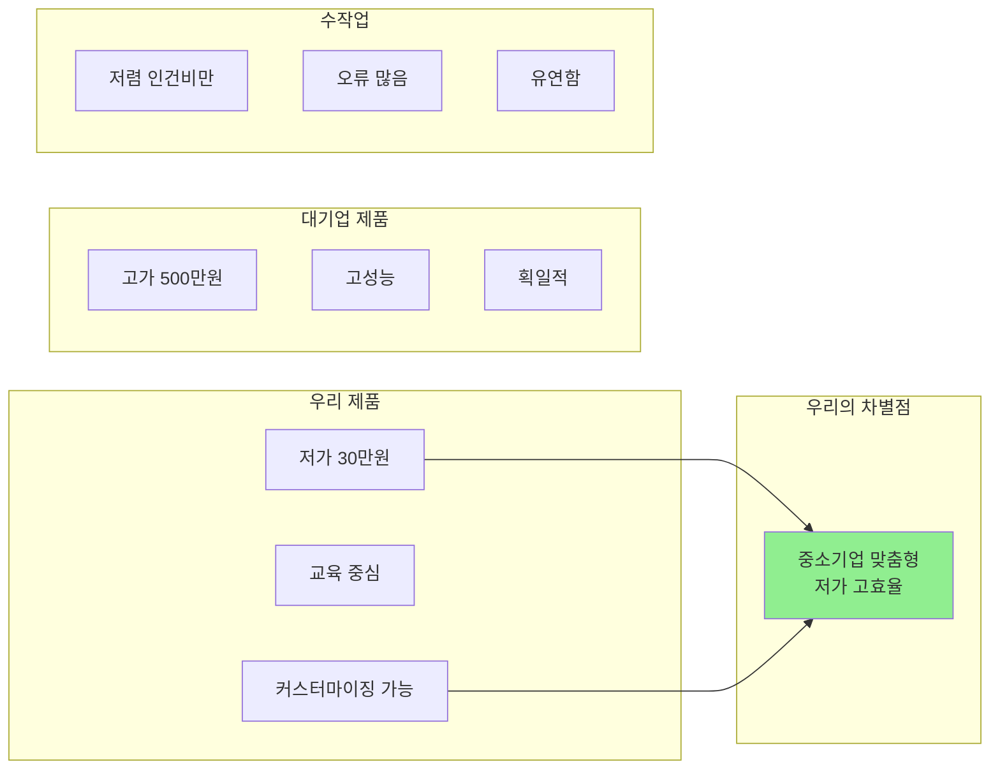

### 활동 3: 손익분기점 분석

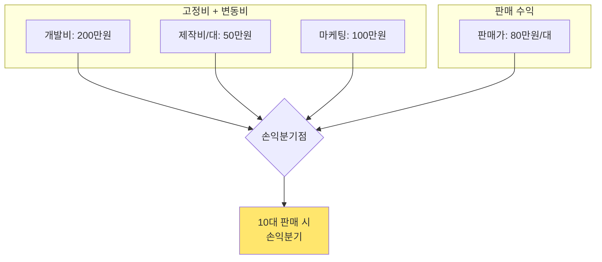

**계산:**
- 고정비: 300만원 (개발 + 마케팅)
- 변동비: 50만원/대
- 판매가: 80만원/대
- 기여이익: 30만원/대

손익분기점 = 300만원 ÷ 30만원/대 = **10대**

### 활동 4: 피칭 (Pitching) 준비

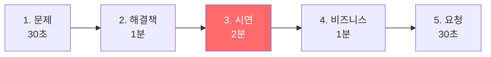

#### 피칭 스크립트 구조

```markdown
## 1분 엘리베이터 피치

"중소 제조업체는 불량품 검사에 연 2,400만원을 씁니다. (문제)

그런데 사람의 집중력 한계로 불량률은 여전히 5%입니다. (심각성)

저희는 스마트폰 AI와 로봇 팔로 불량률을 1%로 줄이고,
인건비를 50% 절감하는 시스템을 만들었습니다. (해결책)

설치 비용은 300만원, 1년이면 원가 회수됩니다. (가치)

10개 업체가 시범 운영을 기다리고 있습니다. (증거)"
```

### 활동 5: 지속가능성 평가

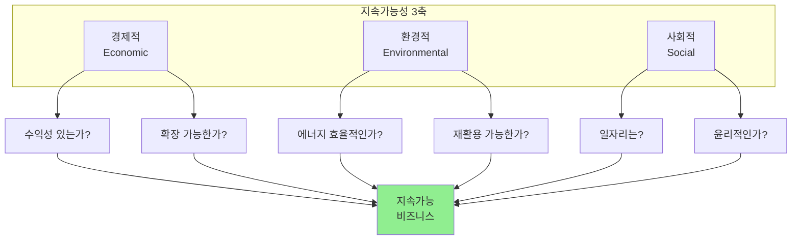

---

## 바이브 코딩 순환 통합

### 전체 프로세스 흐름

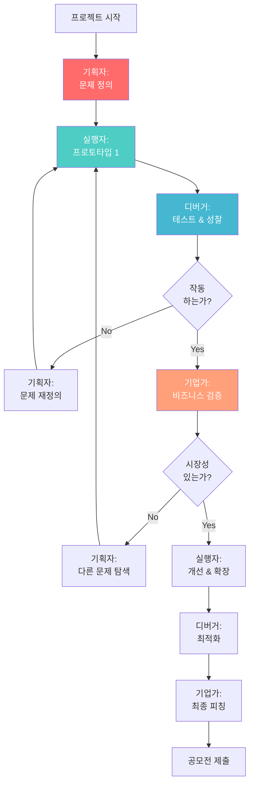

### 각 차시별 역할 배분 (예시)

| 주차 | 차시 | 주요 역할 | 활동 |
|------|------|----------|------|
| 1-2주 | 1-4 | 기획자 70% | 문제 탐색, 인터뷰, 문제 정의 |
| 2주 | 5-8 | 실행자 50% + 기획자 50% | 요구사항 정의, 설계 |
| 3-4주 | 9-16 | 실행자 90% | 프로토타이핑, 개발 |
| 5주 | 17-20 | 디버거 80% + 실행자 20% | 테스트, 성찰, 개선 |
| 6주 | 21-24 | 기업가 60% + 실행자 40% | 비즈니스 모델, 시장 조사 |
| 7주 | 25-28 | 기업가 80% + 디버거 20% | 피칭 준비, 최종 성찰 |

---

## 평가 기준

### 각 역할별 루브릭

#### 기획자 평가

| 기준 | 미흡 (1점) | 보통 (2점) | 우수 (3점) | 탁월 (4점) |
|------|----------|----------|----------|----------|
| **문제 진정성** | 가상 문제 | 일반적 문제 | 구체적 문제 | 현장 검증된 문제 |
| **사용자 이해** | 추측 | 일반 조사 | 인터뷰 실시 | 깊은 공감과 맥락 |
| **명확성** | 모호함 | 이해 가능 | 명확함 | 측정 가능함 |

#### 실행자 평가

| 기준 | 미흡 (1점) | 보통 (2점) | 우수 (3점) | 탁월 (4점) |
|------|----------|----------|----------|----------|
| **작동 완성도** | 작동 안 함 | 부분 작동 | 안정적 작동 | 최적화됨 |
| **기술 난이도** | 기본 수준 | 중간 수준 | 어려움 | 창의적 해결 |
| **문서화** | 없음 | 기본 설명 | 상세 문서 | 재현 가능 |

#### 디버거 평가

| 기준 | 미흡 (1점) | 보통 (2점) | 우수 (3점) | 탁월 (4점) |
|------|----------|----------|----------|----------|
| **원인 분석** | 피상적 | 1단계 원인 | 근본 원인 | 통찰 도출 |
| **실험 설계** | 무작위 | 기본 실험 | 체계적 실험 | 과학적 방법 |
| **학습 기록** | 없음 | 간단한 기록 | 상세 일지 | 일반화 가능 |

#### 기업가 평가

| 기준 | 미흡 (1점) | 보통 (2점) | 우수 (3점) | 탁월 (4점) |
|------|----------|----------|----------|----------|
| **시장 이해** | 추측 | 기본 조사 | 경쟁 분석 | 차별화 전략 |
| **수익 모델** | 불명확 | 기본 모델 | 구체적 계산 | 지속가능성 |
| **피칭** | 어색함 | 이해 가능 | 설득력 있음 | 투자 가능 |

---

## 팀 협업 가이드

### 역할 로테이션

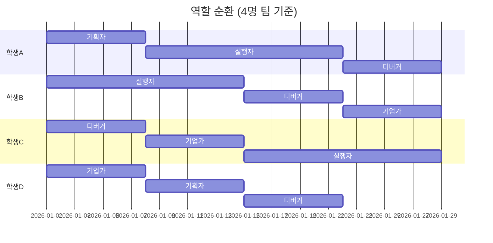

### 의사결정 프로세스

```mermaid
graph TD
    ISSUE[이슈 발생] --> DISC[팀 회의]
    
    DISC --> OPT[옵션 나열]
    
    OPT --> EVAL[각 옵션<br/>장단점 평가]
    
    EVAL --> VOTE{투표}
    
    VOTE -->|동점| TOSS[동전 던지기/<br/>가위바위보]
    VOTE -->|과반| DEC[결정]
    
    TOSS --> DEC
    
    DEC --> DOC[결정 이유<br/>문서화]
    
    DOC --> ACT[실행]
    
    style DEC fill:#90EE90
```

---

## 마무리: 바이브 코딩의 철학

```mermaid
mindmap
  root((바이브 코딩<br/>철학))
    인간 중심
      AI는 도구일 뿐
      진짜 가치는 인간
      공감과 창의성
    실패 환영
      실패는 학습
      성찰의 힘
      개선의 기회
    가치 창출
      기술은 수단
      문제 해결이 목적
      지속가능성
    협업과 성장
      함께 배우기
      서로 가르치기
      집단 지성
```

### 기억할 3가지

1. **기술은 수단, 문제 해결이 목적**
   - "로봇 팔을 만들자" ❌
   - "어떤 문제를 로봇 팔로 해결할까?" ✅

2. **실패는 학습의 기회**
   - "안 돼" ❌
   - "왜 안 될까? 무엇을 배웠나?" ✅

3. **비즈니스는 숫자로 말한다**
   - "좋은 아이디어" ❌
   - "얼마나 절감? 누가 살까?" ✅

---

## 다음 단계

- **04_교구재_활용_가이드.md**: 하드웨어 상세 사용법
- **05_AI_비전_통합.md**: AI 구현 기술
- **06_비즈니스_모델.md**: 사업화 전략 심화
