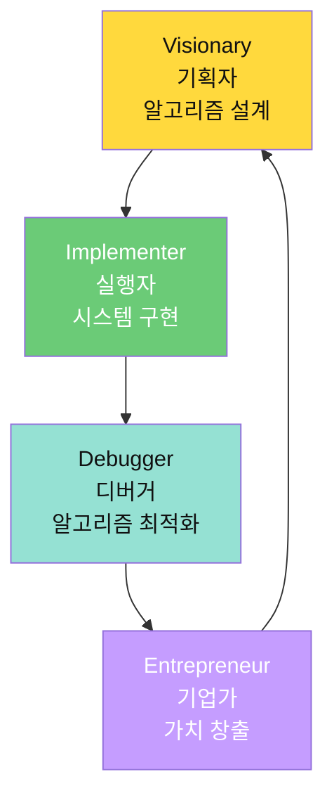
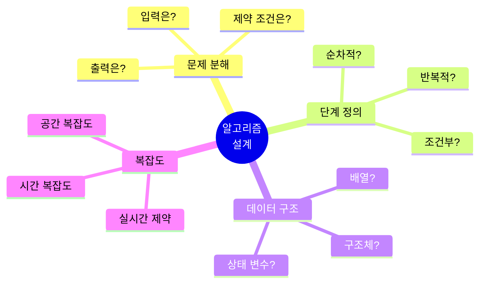
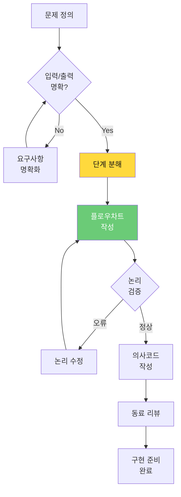
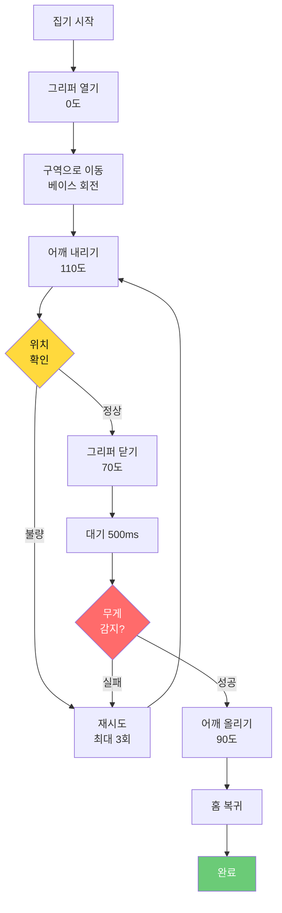
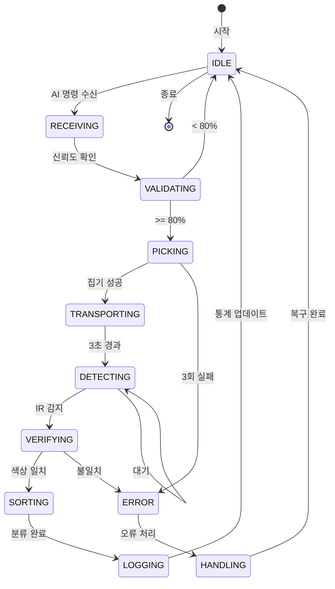
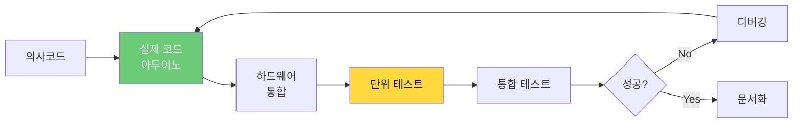
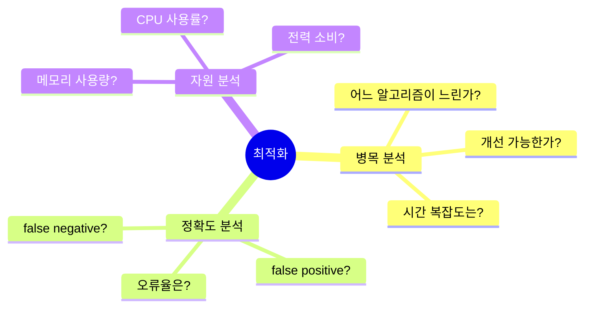
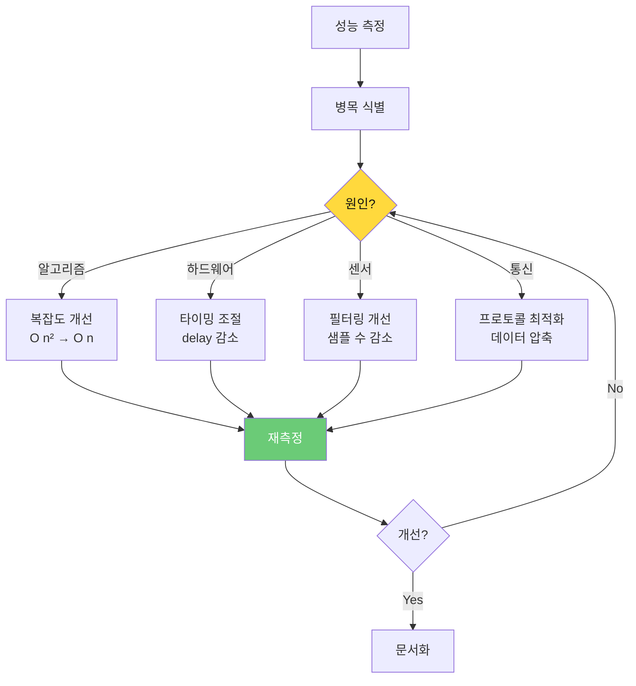
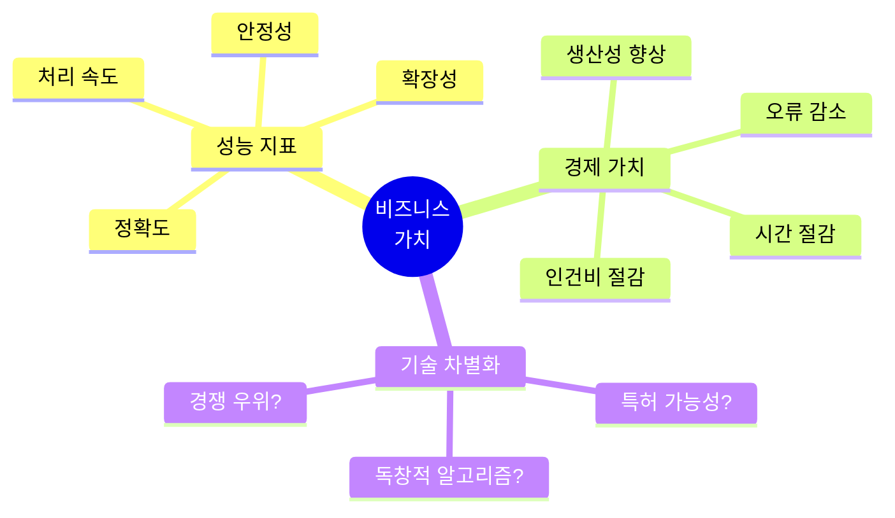
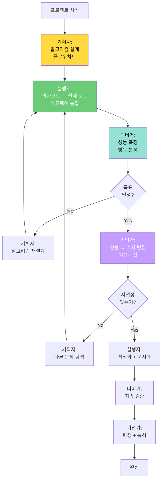

# 바이브 코딩 (VIBE Coding) 가이드
> **알고리즘 중심 문제 해결 방법론**

## 바이브 코딩이란?

**VIBE Coding**은 4가지 역할을 순환하며 **알고리즘으로 사고하고 시스템으로 구현**하는 학습 방법론입니다.



### 새로운 접근: 알고리즘 중심 바이브 코딩

| 기존 방식 | 알고리즘 중심 방식 |
|----------|------------------|
| "무엇을 만들까?" | "어떤 알고리즘으로 풀까?" |
| 바로 코딩 시작 | 플로우차트부터 설계 |
| 오류 발생 시 코드 수정 | 알고리즘 재설계 |
| 성공/실패만 평가 | 복잡도, 효율성 분석 |

---

## 1단계: Visionary (기획자) - 알고리즘 설계

### 목표
**문제를 알고리즘으로 분해하라!**

AI는 패턴을 인식하지만, **문제를 어떻게 단계로 나눌지**는 모릅니다.
인간만이 **문제 구조를 이해하고 알고리즘으로 설계**할 수 있습니다.

### 기획자의 핵심 질문 (알고리즘 관점)



### 활동 1: 문제를 플로우차트로 분해



#### 예시: 로봇팔 집기 알고리즘 설계

**단계 1: 요구사항 정의**

| 항목 | 내용 |
|------|------|
| **입력** | 물체 위치 (구역 1/2/3) |
| **출력** | 물체 집기 성공/실패 |
| **제약** | 5초 이내 완료, 안전 각도 유지 |
| **성능** | 성공률 80% 이상 |

**단계 2: 플로우차트 설계**



**단계 3: 의사코드 작성**

```
알고리즘: Pick_Object
━━━━━━━━━━━━━━━━━━━━━━━━━━━━━━━━━
입력:
  - zone: 물체 위치 (1, 2, 3)
  
출력:
  - SUCCESS / FAIL

데이터 구조:
  - zoneAngles[3] = {45, 90, 135}  // 베이스 각도
  - retryCount = 0

프로세스:
  1. 그리퍼 열기
     gripper.write(0)
     delay(500)
  
  2. 해당 구역으로 이동
     targetAngle = zoneAngles[zone - 1]
     base.write(targetAngle)
     delay(1000)
  
  3. 어깨 내리기
     shoulder.write(110)
     delay(1000)
  
  4. 위치 검증 (센서)
     distance = ultrasonic.read()
     IF distance > 15cm THEN
       IF retryCount < 3 THEN
         retryCount++
         GOTO step 3
       ELSE
         RETURN FAIL
       END IF
     END IF
  
  5. 그리퍼 닫기
     gripper.write(70)
     delay(500)
  
  6. 무게 확인 (선택적)
     weight = loadCell.read()
     IF weight < 10g THEN
       RETURN FAIL
     END IF
  
  7. 어깨 올리기
     shoulder.write(90)
     delay(1000)
  
  8. 홈 복귀
     goHome()
     
  9. RETURN SUCCESS

복잡도 분석:
  - 시간 복잡도: O(1) - 고정 시간
  - 공간 복잡도: O(1) - 고정 메모리
  - 실행 시간: 약 4초 (최악 12초, 재시도 포함)
━━━━━━━━━━━━━━━━━━━━━━━━━━━━━━━━━
```

### 활동 2: 상태 머신 설계



**상태 머신 설계 체크리스트**:
- [ ] 모든 상태 명확히 정의
- [ ] 상태 전이 조건 명시
- [ ] 오류 상태에서 복구 경로
- [ ] 무한 루프 방지

### 활동 3: 알고리즘 복잡도 분석

| 알고리즘 | 시간 복잡도 | 공간 복잡도 | 병목 | 개선 방안 |
|---------|-----------|-----------|------|----------|
| 집기 시퀀스 | O(1) | O(1) | delay 4초 | 동작 최소화 |
| 동기화 이동 | O(n) | O(1) | n=180 스텝 | stepSize 증가 |
| 센서 필터링 | O(1) | O(w) | 없음 | - |
| 색상 분석 | O(1) | O(1) | RGB 측정 3회 | - |

### 결과물: 알고리즘 설계 문서

```markdown
# 알고리즘 설계서: AI 기반 스마트 입고 시스템

## 1. 시스템 개요
입력: 스마트폰 AI 분류 결과 + 물체 위치
처리: 로봇팔 집기 + 센서 검증 + 자동 분류
출력: 분류 완료 + 통계 업데이트

## 2. 상태 머신
(플로우차트 첨부)

## 3. 핵심 알고리즘
- 집기 알고리즘 (의사코드)
- 검증 알고리즘 (의사코드)
- 분류 알고리즘 (의사코드)

## 4. 데이터 구조
struct Statistics {
  int redCount;
  int blueCount;
  int yellowCount;
  int errorCount;
};

## 5. 복잡도 분석
- 전체 실행 시간: 약 10초/사이클
- 병목: RGB 센서 측정 (3초)
- 개선 방안: 캐시 활용

## 6. 오류 처리
- 집기 실패 → 3회 재시도
- 센서 타임아웃 → 기본값 사용
- 통신 끊김 → 재연결
```

---

## 2단계: Implementer (실행자) - 시스템 구현

### 목표
**알고리즘을 하드웨어로 구현하라!**

설계한 알고리즘을 **실제 코드와 하드웨어**로 만듭니다.

### 실행자의 프로세스



### 활동 1: 의사코드 → 실제 코드

**의사코드**:
```
IF sensor.value < threshold THEN
  motor.on()
ELSE
  motor.off()
END IF
```

**실제 코드**:
```cpp
int sensorValue = analogRead(A0);
const int THRESHOLD = 500;

if (sensorValue < THRESHOLD) {
  digitalWrite(motorPin, HIGH);
} else {
  digitalWrite(motorPin, LOW);
}
```

### 활동 2: 상태 머신 구현

**의사코드**:
```
SWITCH currentState:
  CASE IDLE:
    IF command_received THEN
      currentState = NEXT_STATE
    END IF
  
  CASE PICKING:
    executePickSequence()
    IF completed THEN
      currentState = IDLE
    END IF
END SWITCH
```

**실제 코드**:
```cpp
enum State {
  IDLE,
  PICKING,
  SORTING,
  ERROR
};

State currentState = IDLE;

void loop() {
  switch (currentState) {
    case IDLE:
      displayIcon(ICON_HOME);
      if (Serial.available()) {
        char cmd = Serial.read();
        if (cmd == '1') {
          currentState = PICKING;
        }
      }
      break;
    
    case PICKING:
      displayIcon(ICON_PICK);
      bool success = pickObject();
      if (success) {
        currentState = SORTING;
      } else {
        currentState = ERROR;
      }
      break;
    
    case SORTING:
      displayIcon(ICON_SORT);
      sortByGate();
      updateStatistics();
      currentState = IDLE;
      break;
    
    case ERROR:
      displayIcon(ICON_ERROR);
      handleError();
      currentState = IDLE;
      break;
  }
  
  delay(10);  // 루프 딜레이
}
```

### 활동 3: 타이밍 알고리즘 구현

**비차단 타이밍** (권장):

```cpp
unsigned long startTime;
bool timerStarted = false;

void loop() {
  switch (currentState) {
    case PICKING:
      if (!timerStarted) {
        pickObject();
        startTime = millis();
        timerStarted = true;
      }
      
      // 이 사이에 다른 작업 가능 (센서 읽기, 통신 등)
      
      if (millis() - startTime >= 3000) {
        currentState = DETECTING;
        timerStarted = false;
      }
      break;
  }
}
```

### 활동 4: 센서 필터링 알고리즘 구현

```cpp
class MovingAverageFilter {
private:
  static const int WINDOW_SIZE = 10;
  int buffer[WINDOW_SIZE];
  int index;
  long sum;
  
public:
  MovingAverageFilter() : index(0), sum(0) {
    for (int i = 0; i < WINDOW_SIZE; i++) {
      buffer[i] = 0;
    }
  }
  
  int filter(int newSample) {
    sum -= buffer[index];
    buffer[index] = newSample;
    sum += newSample;
    index = (index + 1) % WINDOW_SIZE;
    
    return sum / WINDOW_SIZE;
  }
};

// 사용 예
MovingAverageFilter distanceFilter;

void loop() {
  int rawDistance = readUltrasonic();
  int filteredDistance = distanceFilter.filter(rawDistance);
  
  if (filteredDistance < 10) {
    // 물체 가까움
  }
}
```

### 결과물 체크리스트

- [ ] 의사코드와 실제 코드 일치 확인
- [ ] 상태 머신 정상 동작
- [ ] 타이밍 알고리즘 비차단 확인
- [ ] 센서 필터링 노이즈 제거 확인
- [ ] 하드웨어 안전 동작 확인
- [ ] 코드 주석 (알고리즘 설명)
- [ ] 성능 측정 (실행 시간)

---

## 3단계: Debugger (디버거) - 알고리즘 최적화

### 목표
**병목을 찾고 알고리즘을 개선하라!**

AI는 "무엇이 느린지" 모릅니다.
인간만이 **병목 지점을 분석하고 최적화**할 수 있습니다.

### 디버거의 3가지 질문 (알고리즘 관점)



### 활동 1: 성능 측정 및 분석

```cpp
// 성능 측정 함수
void measurePerformance() {
  unsigned long startTime = millis();
  
  // 알고리즘 실행
  pickObject();
  
  unsigned long endTime = millis();
  unsigned long duration = endTime - startTime;
  
  Serial.print("실행 시간: ");
  Serial.print(duration);
  Serial.println(" ms");
}
```

**성능 측정 결과 예시**:

| 알고리즘 | 실행 시간 | 목표 | 상태 |
|---------|----------|------|------|
| pickObject() | 4.2초 | 5초 이내 | ✅ 정상 |
| sortByColor() | 3.8초 | 3초 이내 | ⚠️ 개선 필요 |
| synchronizedMove() | 2.1초 | - | ✅ 정상 |
| colorSensor.read() | 2.5초 | - | ⚠️ 병목! |

### 활동 2: 알고리즘 복잡도 개선

**개선 전 (O(n²))**:
```cpp
// 나쁜 예: 중첩 반복문
for (int i = 0; i < samples; i++) {
  for (int j = 0; j < samples; j++) {
    // 비교 연산
  }
}
```

**개선 후 (O(n))**:
```cpp
// 좋은 예: 단일 반복문
int sum = 0;
for (int i = 0; i < samples; i++) {
  sum += data[i];
}
int average = sum / samples;
```

### 활동 3: 병목 제거 전략



### 활동 4: 실패 분석 및 근본 원인

```markdown
# 실패 분석 보고서

## 문제
로봇팔이 물체를 10번 중 3번만 집음 (성공률 30%)

## 가설
1. 카메라 왜곡 문제
2. 좌표 변환 오류
3. 로봇팔 캘리브레이션 오차

## 실험
- 실험 1: 카메라 캘리브레이션 재실행 → 변화 없음 ❌
- 실험 2: 변환 수식 검증 → 오류 발견! ✅
- 실험 3: 로봇 수동 제어 → 정확함 ✅

## 근본 원인
픽셀→실제 좌표 변환 시 카메라 높이 잘못 입력
(40cm로 했으나 실제 35cm)

## 해결
1. 카메라 높이 정확 측정
2. 변환 수식 수정
3. 여러 위치 재테스트

## 결과
성공률 30% → 85% 향상!

## 알고리즘 개선
변환 알고리즘에 자동 높이 측정 기능 추가 검토
```

### 활동 5: 알고리즘 리팩토링

**리팩토링 전**:
```cpp
// 복잡하고 반복적인 코드
void sortObject() {
  if (color == "RED") {
    servo1.write(0);
    led.setColor(255, 0, 0);
    count_red++;
    Serial.println("RED");
  } else if (color == "BLUE") {
    servo1.write(90);
    led.setColor(0, 0, 255);
    count_blue++;
    Serial.println("BLUE");
  } else if (color == "YELLOW") {
    servo1.write(180);
    led.setColor(255, 255, 0);
    count_yellow++;
    Serial.println("YELLOW");
  }
}
```

**리팩토링 후 (알고리즘 추상화)**:
```cpp
// 데이터 구조로 단순화
struct ColorConfig {
  int angle;
  int rgb[3];
  int* count;
};

ColorConfig colorMap[] = {
  {0,   {255, 0, 0},     &count_red},
  {90,  {0, 0, 255},     &count_blue},
  {180, {255, 255, 0},   &count_yellow}
};

void sortObject(String color) {
  int index = getColorIndex(color);
  if (index == -1) return;
  
  ColorConfig& cfg = colorMap[index];
  servo1.write(cfg.angle);
  led.setColor(cfg.rgb[0], cfg.rgb[1], cfg.rgb[2]);
  (*cfg.count)++;
  Serial.println(color);
}
```

---

## 4단계: Entrepreneur (기업가) - 가치 창출

### 목표
**알고리즘의 성능을 비즈니스 가치로 전환하라!**

### 기업가의 사고 (알고리즘 관점)



### 활동 1: 성능 지표 → 경제 가치

| 성능 지표 | 측정 값 | 경제 가치 |
|----------|--------|----------|
| **처리 속도** | 10초/개 | 시간당 360개 처리 |
| **정확도** | 92% | 불량률 8% → 2% (손실 75% 감소) |
| **안정성** | 99% 가동률 | 다운타임 연 88시간 → 8.8시간 |
| **자동화율** | 80% | 인력 2명 → 0.4명 (80% 절감) |

**ROI 계산**:
```
투자 비용: 300만원 (개발 + 하드웨어)
연간 절감: 
  - 인건비: 2명 × 2,400만원 × 80% = 3,840만원
  - 불량 감소: 월 200만원 × 12개월 × 75% = 1,800만원
  - 총 절감: 5,640만원

ROI = (5,640 - 300) / 300 × 100 = 1,780%
회수 기간 = 300 / 5,640 × 12 = 약 0.6개월
```

### 활동 2: 알고리즘 벤치마킹

| 구분 | 우리 알고리즘 | 경쟁사 A | 경쟁사 B |
|------|-------------|---------|---------|
| **속도** | 10초/개 | 8초/개 ⚠️ | 15초/개 ✅ |
| **정확도** | 92% | 95% ⚠️ | 85% ✅ |
| **비용** | 300만원 ✅ | 1,000만원 | 150만원 |
| **확장성** | 쉬움 ✅ | 어려움 | 보통 |
| **커스터마이징** | 가능 ✅ | 불가 | 제한적 |

**차별화 전략**:
- ✅ **저가 고효율**: 300만원으로 80% 성능
- ✅ **커스터마이징**: 고객 맞춤 알고리즘 조정
- ⚠️ **속도 개선 필요**: 8초 목표 (병목 제거)

### 활동 3: 알고리즘 특허 가능성

```markdown
# 특허 가능성 분석

## 발명의 명칭
"AI 비전과 센서 하이브리드 검증을 활용한 스마트 분류 시스템"

## 핵심 알고리즘
1. AI 추론 → 센서 검증 이중 확인
2. 불일치 시 재학습 데이터로 자동 수집
3. 상태 머신 기반 복구 알고리즘

## 독창성
- 기존: AI만 사용 OR 센서만 사용
- 우리: AI + 센서 하이브리드 (정확도 10% 향상)

## 선행 기술 조사
- 특허 검색: "AI vision sorting" (100건)
- 유사 특허: KR102345678 (2023년) - 비전 분류
- 차이점: 센서 하이브리드 검증 알고리즘

## 특허 출원 전략
1. 핵심 알고리즘 특허 (하이브리드 검증)
2. 디자인 특허 (UI/UX)
3. 실용신안 (하드웨어 구조)
```

### 활동 4: 피칭 (알고리즘 강조)

```markdown
## 3분 피칭 스크립트

### 1. 문제 (30초)
"중소 제조업체는 불량품 검사에 연 4,000만원을 쓰지만,
사람의 집중력 한계로 불량률은 여전히 5%입니다."

### 2. 해결책 - 알고리즘 (1분)
"저희는 3가지 핵심 알고리즘으로 해결했습니다.

**첫째, 하이브리드 검증 알고리즘**
AI가 92% 정확도로 1차 분류 → 센서가 2차 검증
→ 최종 정확도 98%

**둘째, 상태 머신 알고리즘**
7개 상태로 복잡한 프로세스 관리
오류 발생 시 자동 복구 → 가동률 99%

**셋째, 실시간 최적화 알고리즘**
센서 필터링 O(1), 동기화 이동 최적화
→ 처리 속도 10초/개"

### 3. 시연 (1분)
(라이브 또는 영상)

### 4. 비즈니스 가치 (30초)
"투자 300만원, ROI 1,780%, 회수 기간 0.6개월
이미 10개 업체가 시범 운영 대기 중입니다."
```

---

## 바이브 코딩 순환 통합 (알고리즘 관점)



---

## 28시간 역할 배분

| Day | 시간 | 주요 역할 | 핵심 활동 |
|-----|------|----------|----------|
| **Day 1** | 7.5h | 기획자 40% + 실행자 60% | 알고리즘 설계 + 기초 구현 |
| **Day 2** | 7.5h | 기획자 20% + 실행자 80% | 센서/AI 통합 알고리즘 |
| **Day 3** | 7.5h | 실행자 50% + 디버거 50% | 통합 + 최적화 |
| **Day 4** | 4h | 디버거 30% + 기업가 70% | 성능 분석 + 발표 |

---

## 평가 기준 (알고리즘 관점)

### 기획자 평가

| 기준 | 미흡 (1점) | 보통 (2점) | 우수 (3점) | 탁월 (4점) |
|------|----------|----------|----------|----------|
| **플로우차트** | 불완전 | 기본 흐름 | 상세 흐름 | 오류 처리 포함 |
| **의사코드** | 없음 | 간단함 | 상세함 | 복잡도 분석 |
| **알고리즘 설계** | 단순 if문 | 반복문 활용 | 상태 머신 | 최적화 고려 |

### 실행자 평가

| 기준 | 미흡 (1점) | 보통 (2점) | 우수 (3점) | 탁월 (4점) |
|------|----------|----------|----------|----------|
| **코드 품질** | 작동 안 함 | 기본 작동 | 안정적 | 최적화됨 |
| **알고리즘 구현** | 불일치 | 부분 일치 | 완전 일치 | 개선 포함 |
| **문서화** | 없음 | 주석만 | 설명 문서 | 복잡도 분석 |

### 디버거 평가

| 기준 | 미흡 (1점) | 보통 (2점) | 우수 (3점) | 탁월 (4점) |
|------|----------|----------|----------|----------|
| **성능 측정** | 없음 | 시간만 | 시간+메모리 | 복잡도 분석 |
| **병목 분석** | 없음 | 추측 | 측정 기반 | 근본 원인 |
| **최적화** | 없음 | 시도 | 개선 | O(n²)→O(n) |

### 기업가 평가

| 기준 | 미흡 (1점) | 보통 (2점) | 우수 (3점) | 탁월 (4점) |
|------|----------|----------|----------|----------|
| **가치 산출** | 없음 | 추측 | 계산 | ROI 분석 |
| **벤치마킹** | 없음 | 기본 비교 | 상세 비교 | 차별화 전략 |
| **피칭** | 어색함 | 이해 가능 | 설득력 | 알고리즘 강조 |

---

## 마무리: 알고리즘 중심 바이브 코딩의 핵심

```
"코드를 쓰기 전에 알고리즘을 그려라
알고리즘을 그리기 전에 문제를 이해하라
문제를 이해하기 전에 가치를 생각하라"

1. 기획자: 플로우차트 → 의사코드 → 복잡도 분석
2. 실행자: 의사코드 → 실제 코드 → 하드웨어 통합
3. 디버거: 성능 측정 → 병목 분석 → 최적화
4. 기업가: 성능 지표 → 경제 가치 → ROI

→ 이것이 알고리즘적 사고입니다.
```

---

**Last Updated**: 2026-01-22  
**Version**: 2.0 (알고리즘 중심 바이브 코딩)  
**제작**: Smart Factory Education Team  
**참고**: [교육_커리큘럼_상편](../curriculum/교육_커리큘럼_상편_Day1-2.md)
