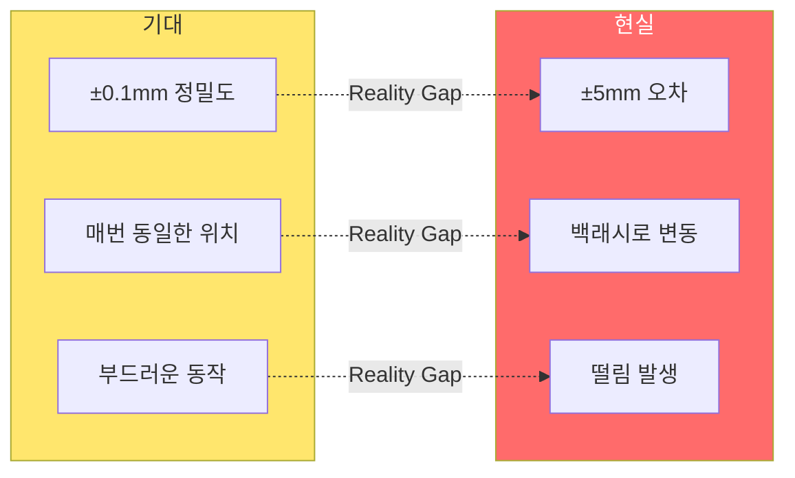
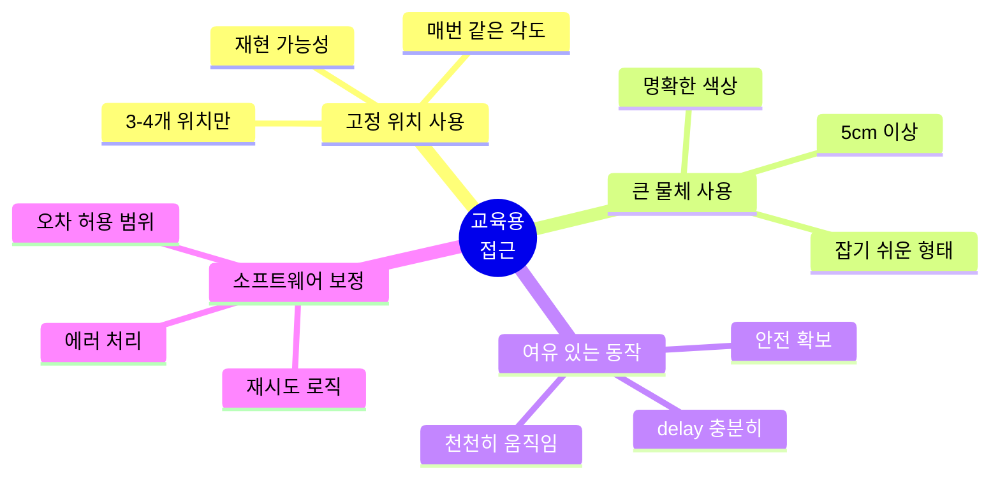
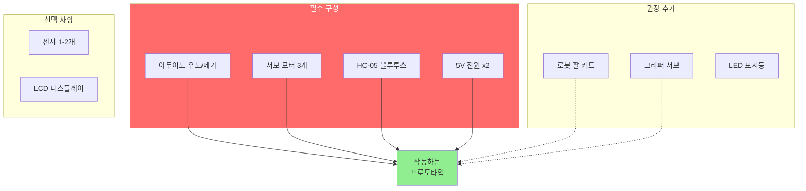
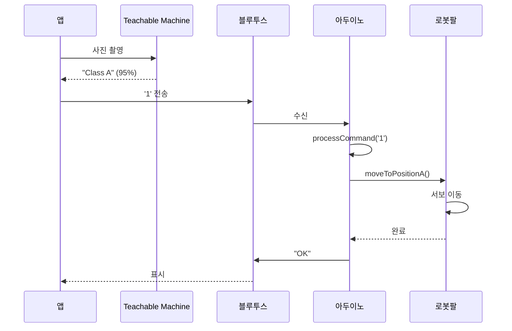
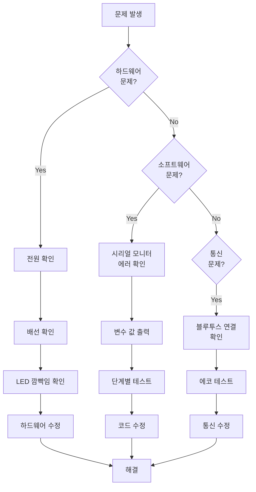

# 아두이노 피지컬 컴퓨팅 가이드 (교육용)

> **아두이노의 한계를 인정하고 큰 틀에서 문제 해결하기**

## 📌 개요

이 문서는 **대학생 대상 교육용**으로 **아두이노 피지컬 컴퓨팅의 실전 적용 방법**을 설명합니다.
- ✅ 정밀도보다는 **동작하는 프로토타입** 중심
- ✅ 복잡한 알고리즘보다 **간단하고 명확한 코드**
- ✅ 고정된 위치 사용으로 **재현 가능한 동작**
- ✅ Early if문과 **클린 코드** 원칙

---

## 1. 아두이노의 한계 인정하기

### 1.1 아두이노는 정밀하지 않다



#### 왜 정밀하지 않은가?

| 요인 | 설명 | 영향 |
|------|------|------|
| **백래시** | 기어 간 유격 | ±2-5mm 위치 오차 |
| **서보 모터** | 저가 SG90 등 | ±1도 각도 오차 |
| **플라스틱 재질** | 구조적 강성 부족 | 흔들림, 변형 |
| **전원 변동** | 배터리 전압 저하 | 토크 감소 |
| **마찰** | 관절 마찰 불균일 | 동작 속도 차이 |

### 1.2 교육용 접근 방법



**💡 핵심 철학:**
> "1mm 정밀도로 100번 실패하는 것보다  
> 5mm 정밀도로 10번 중 9번 성공하는 것이 낫다!"

---

## 2. 기본 하드웨어 구성

### 2.1 최소 구성



### 2.2 핀 배치 계획

```cpp
/* 
 * 핀 배치 계획 (Pin Assignment)
 * 설명: 명확한 주석으로 유지보수 쉽게
 */

// ===== 서보 모터 (PWM 핀) =====
const int SERVO_BASE_PIN = 9;      // 베이스 회전 (0-180도)
const int SERVO_SHOULDER_PIN = 6;  // 어깨 관절 (0-180도)
const int SERVO_ELBOW_PIN = 5;     // 팔꿈치 관절 (0-180도)
const int SERVO_GRIPPER_PIN = 3;   // 그리퍼 (0=열기, 180=닫기)

// ===== 블루투스 (소프트웨어 시리얼) =====
const int BT_RX_PIN = 10;          // HC-05 TXD 연결
const int BT_TX_PIN = 11;          // HC-05 RXD 연결

// ===== LED 표시등 (디지털 출력) =====
const int LED_STATUS_PIN = 13;     // 내장 LED (상태 표시)
const int LED_ERROR_PIN = 12;      // 에러 표시 (빨간색)

// ===== 센서 (옵션, 아날로그 입력) =====
const int SENSOR_DISTANCE_PIN = A0; // 거리 센서
const int SENSOR_BUTTON_PIN = 2;    // 비상 정지 버튼

// ===== 설정 값 =====
const int SERIAL_BAUD = 9600;      // 시리얼 통신 속도
const int SERVO_DELAY = 1000;      // 서보 동작 대기 시간 (ms)
```

### 2.3 배선 다이어그램

```
아두이노 우노
┌─────────────────┐
│  ┌─────────┐   │
│  │ ATmega  │   │
│  │  328P   │   │
│  └─────────┘   │
│                 │
│ D13 ──→ LED 내장│
│ D12 ──→ LED 에러│
│ D11 ──→ HC-05 RX│
│ D10 ←── HC-05 TX│
│ D9  ──→ 서보1   │
│ D6  ──→ 서보2   │
│ D5  ──→ 서보3   │
│ D3  ──→ 그리퍼  │
│ D2  ←── 버튼    │
│                 │
│ 5V  ──→ HC-05   │
│ GND ──→ 공통GND │
└─────────────────┘

서보 모터 전원: 별도 9V 배터리
(GND는 아두이노와 공통 연결!)
```

---

## 3. 코드 구조 설계

### 3.1 모듈형 구조

```cpp
/* 
 * 파일명: main_control.ino
 * 설명: 로봇 팔 제어 메인 프로그램
 * 작성자: 교육용
 * 버전: 1.0
 */

// ===== 라이브러리 =====
#include <Servo.h>
#include <SoftwareSerial.h>

// ===== 전역 변수 =====
Servo servoBase, servoShoulder, servoElbow, servoGripper;
SoftwareSerial BTSerial(BT_RX_PIN, BT_TX_PIN);

bool isSystemReady = false;
char lastCommand = '0';

// ===== 메인 함수 =====
void setup() {
  initializeSystem();
  calibrateServos();
  goHomePosition();
  isSystemReady = true;
}

void loop() {
  // Early return: 시스템 준비 안 됨
  if (!isSystemReady) {
    handleError("시스템 초기화 실패");
    return;
  }
  
  // 블루투스 명령 수신
  if (BTSerial.available()) {
    char command = BTSerial.read();
    processCommand(command);
  }
  
  // 상태 LED 업데이트
  updateStatusLED();
}

// ===== 함수 선언부 =====
void initializeSystem();
void calibrateServos();
void goHomePosition();
void processCommand(char cmd);
void handleError(String errorMsg);
void updateStatusLED();
```

### 3.2 Early If 패턴 (클린 코드)

```cpp
/* 나쁜 예: 중첩된 if문 */
void processCommandBad(char cmd) {
  if (isSystemReady) {
    if (cmd >= '0' && cmd <= '3') {
      if (servo1.attached()) {
        // 실제 코드...
      }
    }
  }
}

/* 좋은 예: Early Return */
void processCommandGood(char cmd) {
  // 1단계: 시스템 상태 확인
  if (!isSystemReady) {
    Serial.println("에러: 시스템 준비 안 됨");
    return;
  }
  
  // 2단계: 명령 유효성 확인
  if (cmd < '0' || cmd > '9') {
    Serial.println("에러: 잘못된 명령");
    return;
  }
  
  // 3단계: 서보 연결 확인
  if (!servo1.attached()) {
    Serial.println("에러: 서보 연결 안 됨");
    return;
  }
  
  // 4단계: 실제 명령 실행 (깔끔!)
  executeCommand(cmd);
}
```

### 3.3 함수 분할 원칙

```cpp
/* 
 * 함수 분할 원칙
 * 1. 한 함수는 한 가지 일만
 * 2. 함수명은 동작을 명확히 표현
 * 3. 30줄 이내로 제한
 */

// ❌ 나쁜 예: 모든 것을 한 함수에
void doEverything() {
  // 100줄의 복잡한 코드...
}

// ✅ 좋은 예: 기능별로 분할
void moveToPositionA() {
  setServoAngles(90, 45, 120);
  waitForMovement();
  confirmPosition();
}

void setServoAngles(int base, int shoulder, int elbow) {
  // Early if: 각도 범위 검증
  if (base < 0 || base > 180) {
    Serial.println("에러: 베이스 각도 범위 초과");
    return;
  }
  if (shoulder < 0 || shoulder > 180) {
    Serial.println("에러: 어깨 각도 범위 초과");
    return;
  }
  if (elbow < 0 || elbow > 180) {
    Serial.println("에러: 팔꿈치 각도 범위 초과");
    return;
  }
  
  // 실제 서보 제어
  servoBase.write(base);
  servoShoulder.write(shoulder);
  servoElbow.write(elbow);
}

void waitForMovement() {
  delay(SERVO_DELAY);
}

void confirmPosition() {
  Serial.println("위치 도달 완료");
  BTSerial.println("OK");
}
```

---

## 4. 실전 코드 예제

### 4.1 초기화 함수

```cpp
/* 
 * 시스템 초기화 함수
 * - 시리얼 통신 시작
 * - 서보 연결
 * - 핀 모드 설정
 */
void initializeSystem() {
  // 시리얼 통신
  Serial.begin(SERIAL_BAUD);
  BTSerial.begin(SERIAL_BAUD);
  Serial.println("=== 시스템 초기화 시작 ===");
  
  // 서보 모터 연결
  servoBase.attach(SERVO_BASE_PIN);
  servoShoulder.attach(SERVO_SHOULDER_PIN);
  servoElbow.attach(SERVO_ELBOW_PIN);
  servoGripper.attach(SERVO_GRIPPER_PIN);
  Serial.println("✓ 서보 모터 연결 완료");
  
  // LED 핀 설정
  pinMode(LED_STATUS_PIN, OUTPUT);
  pinMode(LED_ERROR_PIN, OUTPUT);
  digitalWrite(LED_STATUS_PIN, LOW);
  digitalWrite(LED_ERROR_PIN, LOW);
  Serial.println("✓ LED 핀 설정 완료");
  
  // 버튼 핀 설정 (풀업 저항)
  pinMode(SENSOR_BUTTON_PIN, INPUT_PULLUP);
  Serial.println("✓ 버튼 핀 설정 완료");
  
  Serial.println("=== 초기화 완료 ===\n");
}
```

### 4.2 서보 보정 함수

```cpp
/* 
 * 서보 모터 보정
 * - 각 서보의 중립 위치 확인
 * - 백래시 보정
 */
void calibrateServos() {
  Serial.println("=== 서보 보정 시작 ===");
  
  // 베이스 서보 보정
  Serial.println("베이스 서보 보정 중...");
  servoBase.write(90);  // 중립 위치
  delay(1000);
  servoBase.write(0);   // 최소 위치
  delay(1000);
  servoBase.write(180); // 최대 위치
  delay(1000);
  servoBase.write(90);  // 중립 복귀
  Serial.println("✓ 베이스 서보 보정 완료");
  
  // 나머지 서보도 동일하게...
  
  Serial.println("=== 보정 완료 ===\n");
}
```

### 4.3 홈 포지션 함수

```cpp
/* 
 * 홈 포지션으로 이동
 * - 안전한 시작/종료 위치
 * - 모든 관절을 0도 또는 기본 위치로
 */
void goHomePosition() {
  Serial.println("홈 포지션으로 이동 중...");
  
  // 천천히 이동 (안전)
  int currentBase = servoBase.read();
  int targetBase = 0;
  
  // 점진적 이동 (떨림 방지)
  while (abs(currentBase - targetBase) > 5) {
    if (currentBase < targetBase) {
      currentBase += 5;
    } else {
      currentBase -= 5;
    }
    servoBase.write(currentBase);
    delay(50);
  }
  
  // 최종 위치 설정
  servoBase.write(0);
  servoShoulder.write(0);
  servoElbow.write(0);
  servoGripper.write(0);
  
  delay(SERVO_DELAY);
  Serial.println("✓ 홈 포지션 도달");
}
```

### 4.4 명령 처리 함수 (핵심)

```cpp
/* 
 * 명령 처리 메인 함수
 * - 블루투스로 받은 명령 실행
 * - Early if 패턴 사용
 */
void processCommand(char cmd) {
  // Early return: 같은 명령 중복 방지
  if (cmd == lastCommand) {
    Serial.println("이미 실행 중인 명령");
    return;
  }
  
  // 로그 출력
  Serial.print("명령 수신: ");
  Serial.println(cmd);
  
  // 비상 정지 확인
  if (digitalRead(SENSOR_BUTTON_PIN) == LOW) {
    emergencyStop();
    return;
  }
  
  // 명령별 분기
  switch(cmd) {
    case '0':
      goHomePosition();
      break;
      
    case '1':
      moveToPositionA();
      break;
      
    case '2':
      moveToPositionB();
      break;
      
    case '3':
      moveToPositionC();
      break;
      
    case 'G':
      closeGripper();
      break;
      
    case 'O':
      openGripper();
      break;
      
    case 'S':
      emergencyStop();
      break;
      
    default:
      handleError("알 수 없는 명령: " + String(cmd));
      return;
  }
  
  // 명령 완료
  lastCommand = cmd;
  BTSerial.println("OK");
  blinkStatusLED();
}
```

### 4.5 위치 이동 함수들

```cpp
/* 
 * 고정 위치 A (왼쪽)
 * - Teachable Machine 'Class A' 결과 시 실행
 */
void moveToPositionA() {
  Serial.println("→ 위치 A로 이동");
  
  setServoAngles(30, 90, 120);
  waitForMovement();
  
  Serial.println("✓ 위치 A 도달");
}

/* 
 * 고정 위치 B (중앙)
 * - Teachable Machine 'Class B' 결과 시 실행
 */
void moveToPositionB() {
  Serial.println("→ 위치 B로 이동");
  
  setServoAngles(90, 90, 90);
  waitForMovement();
  
  Serial.println("✓ 위치 B 도달");
}

/* 
 * 고정 위치 C (오른쪽)
 * - Teachable Machine 'Class C' 결과 시 실행
 */
void moveToPositionC() {
  Serial.println("→ 위치 C로 이동");
  
  setServoAngles(150, 90, 120);
  waitForMovement();
  
  Serial.println("✓ 위치 C 도달");
}

/* 
 * 서보 각도 설정 (안전 체크 포함)
 */
void setServoAngles(int base, int shoulder, int elbow) {
  // Early if: 각도 범위 검증
  base = constrain(base, 0, 180);
  shoulder = constrain(shoulder, 0, 180);
  elbow = constrain(elbow, 0, 180);
  
  // 서보 제어
  servoBase.write(base);
  servoShoulder.write(shoulder);
  servoElbow.write(elbow);
  
  // 디버깅 출력
  Serial.print("서보 각도: ");
  Serial.print(base);
  Serial.print("°, ");
  Serial.print(shoulder);
  Serial.print("°, ");
  Serial.print(elbow);
  Serial.println("°");
}
```

### 4.6 그리퍼 제어

```cpp
/* 
 * 그리퍼 닫기
 */
void closeGripper() {
  Serial.println("그리퍼 닫는 중...");
  
  // Early if: 이미 닫혀있는지 확인
  if (servoGripper.read() > 170) {
    Serial.println("이미 닫혀 있음");
    return;
  }
  
  // 천천히 닫기 (물체 손상 방지)
  for (int angle = 0; angle <= 180; angle += 10) {
    servoGripper.write(angle);
    delay(50);
  }
  
  Serial.println("✓ 그리퍼 닫기 완료");
}

/* 
 * 그리퍼 열기
 */
void openGripper() {
  Serial.println("그리퍼 여는 중...");
  
  // Early if: 이미 열려있는지 확인
  if (servoGripper.read() < 10) {
    Serial.println("이미 열려 있음");
    return;
  }
  
  servoGripper.write(0);
  delay(500);
  
  Serial.println("✓ 그리퍼 열기 완료");
}
```

### 4.7 에러 처리

```cpp
/* 
 * 에러 처리 함수
 */
void handleError(String errorMsg) {
  Serial.print("⚠️ 에러: ");
  Serial.println(errorMsg);
  
  // 에러 LED 켜기
  digitalWrite(LED_ERROR_PIN, HIGH);
  
  // 블루투스로 에러 전송
  BTSerial.print("ERROR:");
  BTSerial.println(errorMsg);
  
  // 비프음 (옵션)
  // tone(BUZZER_PIN, 1000, 200);
  
  delay(2000);
  digitalWrite(LED_ERROR_PIN, LOW);
}

/* 
 * 비상 정지
 */
void emergencyStop() {
  Serial.println("🚨 비상 정지!");
  
  // 모든 서보 정지 (현재 위치 유지)
  // 서보는 자동으로 현재 위치 유지
  
  // 상태 플래그
  isSystemReady = false;
  
  // LED 깜빡임
  for (int i = 0; i < 5; i++) {
    digitalWrite(LED_ERROR_PIN, HIGH);
    delay(200);
    digitalWrite(LED_ERROR_PIN, LOW);
    delay(200);
  }
  
  Serial.println("수동으로 재시작하세요");
}
```

### 4.8 상태 LED 업데이트

```cpp
/* 
 * 상태 LED 업데이트
 * - loop()에서 호출
 */
void updateStatusLED() {
  static unsigned long lastBlink = 0;
  static bool ledState = false;
  
  // Early return: 시스템 준비 안 됨
  if (!isSystemReady) {
    digitalWrite(LED_STATUS_PIN, LOW);
    return;
  }
  
  // 500ms마다 깜빡임
  unsigned long currentMillis = millis();
  if (currentMillis - lastBlink >= 500) {
    lastBlink = currentMillis;
    ledState = !ledState;
    digitalWrite(LED_STATUS_PIN, ledState);
  }
}

/* 
 * 상태 LED 한 번 깜빡임 (명령 완료 시)
 */
void blinkStatusLED() {
  digitalWrite(LED_STATUS_PIN, HIGH);
  delay(100);
  digitalWrite(LED_STATUS_PIN, LOW);
}
```

---

## 5. 디버깅 및 테스트

### 5.1 시리얼 모니터 활용

```cpp
/* 
 * 디버깅 정보 출력
 */
void printDebugInfo() {
  Serial.println("\n===== 디버깅 정보 =====");
  
  // 시스템 상태
  Serial.print("시스템 준비: ");
  Serial.println(isSystemReady ? "예" : "아니오");
  
  // 서보 각도
  Serial.print("베이스: ");
  Serial.print(servoBase.read());
  Serial.println("°");
  
  Serial.print("어깨: ");
  Serial.print(servoShoulder.read());
  Serial.println("°");
  
  Serial.print("팔꿈치: ");
  Serial.print(servoElbow.read());
  Serial.println("°");
  
  Serial.print("그리퍼: ");
  Serial.print(servoGripper.read());
  Serial.println("°");
  
  // 블루투스 상태
  Serial.print("블루투스 수신 대기: ");
  Serial.println(BTSerial.available());
  
  // 마지막 명령
  Serial.print("마지막 명령: ");
  Serial.println(lastCommand);
  
  // 여유 메모리 (옵션)
  Serial.print("여유 메모리: ");
  Serial.print(freeMemory());
  Serial.println(" bytes");
  
  Serial.println("====================\n");
}

/* 
 * 메모리 확인 함수 (옵션)
 */
int freeMemory() {
  extern int __heap_start, *__brkval; 
  int v; 
  return (int) &v - (__brkval == 0 ? (int) &__heap_start : (int) __brkval); 
}
```

### 5.2 테스트 모드

```cpp
/* 
 * 테스트 모드
 * - 시리얼 모니터에서 명령 입력
 * - 블루투스 없이 테스트 가능
 */
void testMode() {
  Serial.println("\n===== 테스트 모드 =====");
  Serial.println("명령을 입력하세요:");
  Serial.println("0: 홈");
  Serial.println("1: 위치A");
  Serial.println("2: 위치B");
  Serial.println("3: 위치C");
  Serial.println("G: 그리퍼 닫기");
  Serial.println("O: 그리퍼 열기");
  Serial.println("D: 디버깅 정보");
  Serial.println("T: 전체 동작 테스트");
  Serial.println("====================\n");
  
  while (true) {
    if (Serial.available()) {
      char testCmd = Serial.read();
      
      if (testCmd == 'D') {
        printDebugInfo();
      } else if (testCmd == 'T') {
        runFullTest();
      } else {
        processCommand(testCmd);
      }
    }
  }
}

/* 
 * 전체 동작 테스트
 */
void runFullTest() {
  Serial.println("\n===== 전체 동작 테스트 시작 =====");
  
  Serial.println("1. 홈 포지션");
  goHomePosition();
  delay(2000);
  
  Serial.println("2. 위치 A");
  moveToPositionA();
  delay(2000);
  
  Serial.println("3. 그리퍼 닫기");
  closeGripper();
  delay(2000);
  
  Serial.println("4. 위치 B");
  moveToPositionB();
  delay(2000);
  
  Serial.println("5. 그리퍼 열기");
  openGripper();
  delay(2000);
  
  Serial.println("6. 위치 C");
  moveToPositionC();
  delay(2000);
  
  Serial.println("7. 홈 복귀");
  goHomePosition();
  
  Serial.println("===== 전체 동작 테스트 완료 =====\n");
}
```

---

## 6. 성능 최적화 팁

### 6.1 지연 시간 최소화

```cpp
/* 
 * delay() 대신 millis() 사용
 * - non-blocking 방식
 */
unsigned long previousMillis = 0;
const long interval = 1000;

void loop() {
  unsigned long currentMillis = millis();
  
  if (currentMillis - previousMillis >= interval) {
    previousMillis = currentMillis;
    // 1초마다 실행할 코드
  }
  
  // 다른 코드도 계속 실행 가능
  checkBluetooth();
  updateLED();
}
```

### 6.2 서보 부드러운 이동

```cpp
/* 
 * 서보 점진적 이동
 * - 떨림 방지
 * - 부드러운 동작
 */
void smoothMove(Servo &servo, int targetAngle) {
  int currentAngle = servo.read();
  int step = (targetAngle > currentAngle) ? 1 : -1;
  
  while (currentAngle != targetAngle) {
    currentAngle += step;
    servo.write(currentAngle);
    delay(15); // 속도 조절 (낮을수록 빠름)
  }
}
```

### 6.3 메모리 절약

```cpp
/* 
 * 문자열을 PROGMEM에 저장
 * - SRAM 절약
 */
#include <avr/pgmspace.h>

const char msg1[] PROGMEM = "시스템 초기화 중...";
const char msg2[] PROGMEM = "서보 모터 연결 완료";

void printFromProgmem(const char* str) {
  char buffer[50];
  strcpy_P(buffer, str);
  Serial.println(buffer);
}
```

---

## 7. 실전 프로젝트: 불량품 분류 로봇

### 7.1 전체 동작 시나리오



### 7.2 메인 코드

```cpp
/* 
 * 불량품 분류 로봇 메인 코드
 * 앱인벤터 + Teachable Machine 연동
 */

// (앞의 모든 함수 포함)

void setup() {
  initializeSystem();
  calibrateServos();
  goHomePosition();
  isSystemReady = true;
  
  Serial.println("\n🤖 불량품 분류 로봇 준비 완료");
  Serial.println("앱에서 명령을 기다립니다...\n");
}

void loop() {
  // Early return: 시스템 체크
  if (!isSystemReady) {
    return;
  }
  
  // 비상 정지 버튼 확인
  if (digitalRead(SENSOR_BUTTON_PIN) == LOW) {
    emergencyStop();
    return;
  }
  
  // 블루투스 명령 수신 및 처리
  if (BTSerial.available()) {
    char cmd = BTSerial.read();
    processCommand(cmd);
  }
  
  // 상태 LED 업데이트
  updateStatusLED();
  
  // 디버깅 정보 (5초마다)
  static unsigned long lastDebug = 0;
  if (millis() - lastDebug >= 5000) {
    lastDebug = millis();
    Serial.print("시스템 정상 작동 중... (명령 대기)");
    Serial.print(" | 여유 메모리: ");
    Serial.print(freeMemory());
    Serial.println(" bytes");
  }
}
```

---

## 8. 트러블슈팅

### 8.1 자주 발생하는 문제

| 문제 | 원인 | 해결 방법 |
|------|------|----------|
| 서보가 떨림 | 전원 부족 | 별도 전원 사용 (9V 배터리) |
| 서보 무반응 | 핀 번호 오류 | 배선 확인, 핀 번호 재확인 |
| 블루투스 끊김 | 범위 초과 또는 간섭 | 거리 줄이기, 장애물 제거 |
| 코드 업로드 실패 | 시리얼 포트 충돌 | RX/TX 연결 해제 후 업로드 |
| 메모리 부족 | 문자열 과다 사용 | PROGMEM 사용, 문자열 줄이기 |
| 서보 각도 이상 | 초기화 안 됨 | calibrateServos() 호출 확인 |

### 8.2 디버깅 순서



---

## 9. 체크리스트

### 코드 작성 체크리스트
- [ ] 모든 핀 번호를 `const int`로 상단에 정의
- [ ] 함수는 30줄 이내로 작성
- [ ] Early if 패턴 사용
- [ ] 한글 주석으로 설명
- [ ] Serial.println으로 디버깅 정보 출력
- [ ] 각도 범위 검증 (`constrain` 사용)
- [ ] 에러 처리 함수 구현
- [ ] `delay()` 최소화 (또는 `millis()` 사용)

### 테스트 체크리스트
- [ ] 시리얼 모니터로 단독 테스트
- [ ] 서보 1개씩 개별 테스트
- [ ] 홈 포지션 동작 확인
- [ ] 모든 고정 위치 도달 확인
- [ ] 그리퍼 개폐 동작 확인
- [ ] 블루투스 명령 수신 확인
- [ ] 10회 연속 성공 테스트
- [ ] 비상 정지 버튼 동작 확인

---

## 10. 참고 자료

### 아두이노 공식 문서
- [Servo 라이브러리](https://www.arduino.cc/reference/en/libraries/servo/)
- [SoftwareSerial](https://www.arduino.cc/en/Reference/SoftwareSerial)
- [constrain()](https://www.arduino.cc/reference/en/language/functions/math/constrain/)
- [millis()](https://www.arduino.cc/reference/en/language/functions/time/millis/)

### 추천 학습 자료
- 아두이노 기초 문법
- 클린 코드 작성법
- 디버깅 기법

### 다음 문서
- **02_블루투스_프로토콜.md** ← 통신 상세 설명
- **04_앱인벤터_가이드.md** ← 앱 제작 방법

---

**작성자:** 스마트 팩토리 교육 프로젝트  
**최종 수정:** 2026-01-17  
**버전:** 1.0 (교육용)

---

## 💡 마지막 조언

> **"완벽한 코드보다 작동하는 코드가 낫다."**
> 
> 아두이노는 정밀하지 않습니다. 하지만 그것이 문제가 아닙니다.  
> 중요한 것은 **문제를 해결하는 프로토타입**을 만드는 것입니다.
> 
> - ✅ 고정 위치 3-4개로 충분합니다
> - ✅ ±5mm 오차는 괜찮습니다
> - ✅ 천천히 움직여도 괜찮습니다
> - ✅ 10번 중 8번 성공하면 훌륭합니다
> 
> **큰 틀에서 문제를 해결하세요!**
